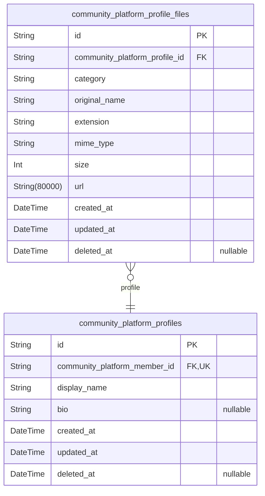
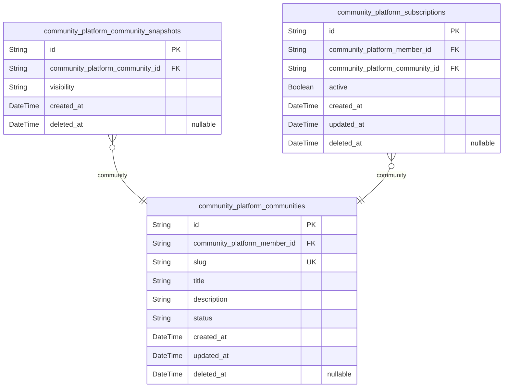
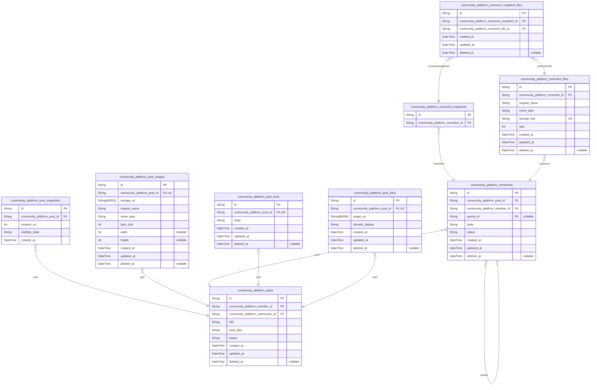

# Prisma Markdown

> Generated by [`prisma-markdown`](https://github.com/samchon/prisma-markdown)

- [Actors](#actors)
- [Profiles](#profiles)
- [Communities](#communities)
- [Contents](#contents)
- [Reactions](#reactions)
- [Moderation](#moderation)

## Actors

```mermaid
erDiagram
"community_platform_guests" {
  String id PK
  String guest_key UK
  DateTime created_at
  DateTime updated_at
  DateTime deleted_at "nullable"
}
"community_platform_guest_sessions" {
  String id PK
  String community_platform_guest_id FK
  String ip
  String href
  String referrer
  DateTime created_at
  DateTime expired_at
}
"community_platform_members" {
  String id PK
  String code UK
  String email UK
  String password_hash
  Boolean email_verified
  String status
  DateTime last_signed_in_at "nullable"
  DateTime created_at
  DateTime updated_at
  DateTime deleted_at "nullable"
}
"community_platform_member_sessions" {
  String id PK
  String community_platform_member_id FK
  String ip
  String href
  String referrer
  DateTime created_at
  DateTime expired_at
}
"community_platform_member_password_resets" {
  String id PK
  String community_platform_member_id FK
  String token UK
  String ip
  String href
  String referrer
  DateTime expired_at
  DateTime used_at "nullable"
  DateTime revoked_at "nullable"
  DateTime created_at
  DateTime updated_at
  DateTime deleted_at "nullable"
}
"community_platform_member_email_verifications" {
  String id PK
  String community_platform_member_id FK
  String token UK
  String status
  DateTime verified_at "nullable"
  DateTime expired_at
  DateTime invalidated_at "nullable"
  DateTime created_at
  DateTime updated_at
  DateTime deleted_at "nullable"
}
"community_platform_admins" {
  String id PK
  String email UK
  String password_hash
  String status
  DateTime email_verified_at "nullable"
  DateTime last_signed_in_at "nullable"
  DateTime created_at
  DateTime updated_at
  DateTime deleted_at "nullable"
}
"community_platform_admin_sessions" {
  String id PK
  String community_platform_admin_id FK
  String ip
  String href
  String referrer
  DateTime created_at
  DateTime expired_at
}
"community_platform_admin_password_resets" {
  String id PK
  String community_platform_admin_id FK
  String token UK
  String ip
  String href
  String referrer
  DateTime expired_at
  DateTime used_at "nullable"
  DateTime created_at
  DateTime updated_at
  DateTime deleted_at "nullable"
}
"community_platform_admin_email_verifications" {
  String id PK
  String community_platform_admin_id FK
  String token UK
  String status
  DateTime verified_at "nullable"
  DateTime expired_at
  DateTime created_at
  DateTime updated_at
  DateTime deleted_at "nullable"
}
"community_platform_guest_sessions" }o--|| "community_platform_guests" : guest
"community_platform_member_sessions" }o--|| "community_platform_members" : member
"community_platform_member_password_resets" }o--|| "community_platform_members" : member
"community_platform_member_email_verifications" }o--|| "community_platform_members" : member
"community_platform_admin_sessions" }o--|| "community_platform_admins" : admin
"community_platform_admin_password_resets" }o--|| "community_platform_admins" : admin
"community_platform_admin_email_verifications" }o--|| "community_platform_admins" : admin
```

### `community_platform_guests`

Temporary guest identity records for unauthenticated visitors who browse
public areas of the platform without creating a registered account.

This actor table provides a stable anonymous identity anchor used to
associate one or more [community_platform_guest_sessions](#community_platform_guest_sessions) records
with the same guest over time. It intentionally excludes credential
fields because guests do not authenticate with email and password.

The table stores only raw guest identity and lifecycle metadata. Session
connection details, expiry control, and logout behavior belong in the
dedicated session table rather than this parent actor record.

Properties as follows:

- `id`: Primary Key.
- `guest_key`
  > Stable anonymous guest identifier used to recognize the same
  > unauthenticated visitor across guest sessions without using
  > credential-based login.
- `created_at`: When this guest identity was first created.
- `updated_at`: When this guest identity was last updated.
- `deleted_at`: When this guest identity was soft-deleted or retired from active use.

### `community_platform_guest_sessions`

Session records for temporary guest identities used to maintain
unauthenticated browsing continuity.

This table stores connection context and expiration metadata for each
guest access session associated with [community_platform_guests](#community_platform_guests).
It supports issuance, refresh handling, and invalidation timing for
guest-level access without storing credentials or denormalized guest
profile data.

Properties as follows:

- `id`: Primary Key.
- `community_platform_guest_id`: Belonged guest identity's [community_platform_guests.id](#community_platform_guests).
- `ip`: IP address from which the guest session was created or last refreshed.
- `href`: Application URL associated with the guest session creation context.
- `referrer`: Referrer URL reported when the guest session was established.
- `created_at`: Timestamp when the guest session record was created.
- `expired_at`
  > Timestamp when the guest session becomes invalid and must no longer
  > authorize access.

### `community_platform_members`

Registered member account records that act as the canonical authenticated
identity for the community platform.

This table stores credential-bearing account attributes and account-level
security state for members who can create profiles, join communities,
publish content, vote, and participate in moderation-related workflows
through other domain tables. Public presentation data is intentionally
excluded and belongs in [community_platform_profiles](#community_platform_profiles).

Session continuity, password recovery, and email verification histories
are normalized into dedicated child tables such as {@link
community_platform_member_sessions}, {@link
community_platform_member_password_resets}, and {@link
community_platform_member_email_verifications}, so this table remains the
stable root identity for all member-owned relationships.

Properties as follows:

- `id`: Primary Key.
- `code`
  > Stable member account code used as an internal-facing or URL-safe account
  > identifier distinct from the primary key.
- `email`
  > Unique email address used as the member's login identifier and contact
  > address.
- `password_hash`: Hashed password credential used for member authentication.
- `email_verified`
  > Whether the member currently has a verified email state at the account
  > level.
- `status`
  > Current lifecycle status of the member account, such as active,
  > suspended, or deleted-state tracking before physical purge.
- `last_signed_in_at`
  > Timestamp of the most recent successful member sign-in for account
  > security visibility.
- `created_at`: When the member account was created.
- `updated_at`: When the member account record was last updated.
- `deleted_at`: When the member account entered soft-deleted state, if applicable.

### `community_platform_member_sessions`

Authenticated session records for registered platform members.

This table stores each member login session used for token-based
authentication continuity, session history, logout processing, and
revocation control. Each record belongs to exactly one {@link
community_platform_members} account and captures the connection context
present at the time the session was created.

The model follows the platform's required session-table pattern for actor
sessions and is intentionally limited to connection metadata and
expiration timing rather than duplicating account data or storing derived
security state.

Properties as follows:

- `id`: Primary Key.
- `community_platform_member_id`: Owning member account's [community_platform_members.id](#community_platform_members).
- `ip`: IP address from which the member session was established.
- `href`: Request URL or origin href associated with the session creation event.
- `referrer`: HTTP referrer recorded when the member session was created.
- `created_at`: Timestamp when the member session was created.
- `expired_at`
  > Timestamp when the member session becomes invalid unless renewed or
  > replaced by authentication flows.

### `community_platform_member_password_resets`

Password reset request records for [community_platform_members](#community_platform_members).

Each row represents one time-bound member account recovery attempt,
storing the issued reset token together with request origin metadata and
lifecycle timestamps. This table keeps reset-state concerns outside the
main member actor record so recovery history remains normalized,
auditable, and independently revocable.

Password reset records are security support data rather than standalone
business content. Multiple reset requests may exist for a single member
over time, while each request belongs to exactly one member account.

Properties as follows:

- `id`: Primary Key.
- `community_platform_member_id`: Owner member account's [community_platform_members.id](#community_platform_members).
- `token`: Unique password reset token issued for secure member account recovery.
- `ip`: IP address from which the password reset request was initiated.
- `href`: Application URL at which the member initiated the password reset request.
- `referrer`: Referrer URL associated with the password reset request context.
- `expired_at`: Timestamp when the password reset token is no longer valid.
- `used_at`
  > Timestamp when the reset token was successfully consumed to change the
  > member password.
- `revoked_at`: Timestamp when the reset token was invalidated before use.
- `created_at`: Timestamp when the password reset request record was created.
- `updated_at`: Timestamp when the password reset request record was last updated.
- `deleted_at`: Soft-delete timestamp for the password reset request record.

### `community_platform_member_email_verifications`

Email verification records for [community_platform_members](#community_platform_members) that
support member registration, address confirmation, and repeated
re-verification flows.

Each record represents one issued verification token and its lifecycle
state, including when it was created, when it expires, whether it was
completed, and whether it was invalidated. The table preserves
verification history for account security auditing and operational
troubleshooting without denormalizing parent member identity fields.

Properties as follows:

- `id`: Primary Key.
- `community_platform_member_id`: Owner member account's [community_platform_members.id](#community_platform_members).
- `token`: Unique verification token delivered to the member for email confirmation.
- `status`
  > Current lifecycle status of the verification record, such as pending,
  > verified, expired, or invalidated.
- `verified_at`: Timestamp when the member successfully completed email verification.
- `expired_at`: Timestamp after which the verification token is no longer valid.
- `invalidated_at`
  > Timestamp when the verification token was manually or automatically
  > invalidated before use.
- `created_at`: Timestamp when this verification record was issued.
- `updated_at`: Timestamp when this verification record was last updated.
- `deleted_at`
  > Soft deletion timestamp, if this verification record is removed from
  > active application visibility.

### `community_platform_admins`

Administrator identity records for privileged platform access.

This actor table stores the canonical administrator account used for
authentication and elevated authorization decisions. It owns
administrator credentials and account-level security state while serving
as the parent record for related session, password reset, and email
verification tables such as [community_platform_admin_sessions](#community_platform_admin_sessions),
[community_platform_admin_password_resets](#community_platform_admin_password_resets), and {@link
community_platform_admin_email_verifications}.

The table intentionally contains only account-level identity and security
attributes. Operational session history, reset workflows, and
verification events are normalized into separate child tables to preserve
auditability and avoid nullable dependent fields in the main actor
record.

Properties as follows:

- `id`: Primary Key.
- `email`
  > Unique administrator login email used as the primary authentication
  > identity.
- `password_hash`: Hashed administrator password used for credential verification.
- `status`
  > Current administrator account status governing whether the account is
  > active, suspended, or otherwise restricted from sign-in.
- `email_verified_at`
  > Timestamp when the administrator's login email was most recently
  > confirmed through the separate verification workflow.
- `last_signed_in_at`
  > Most recent successful administrator sign-in timestamp for security
  > visibility and account review.
- `created_at`: Timestamp when the administrator account was created.
- `updated_at`: Timestamp when the administrator account was last updated.
- `deleted_at`
  > Soft deletion timestamp marking when the administrator account was
  > deactivated or removed.

### `community_platform_admin_sessions`

Administrator login session records for authenticated access to
privileged platform functions.

Each record belongs to one [community_platform_admins](#community_platform_admins) account and
captures the connection context used when the session was issued,
including IP address, request location, and referrer.

This table supports administrator authentication continuity, logout
handling, and security review by tracking when a session was created and
when it expires.

Properties as follows:

- `id`: Primary Key.
- `community_platform_admin_id`: Authenticated administrator's [community_platform_admins.id](#community_platform_admins).
- `ip`: IP address from which the administrator session was established.
- `href`
  > Request URL or client location associated with the administrator session
  > creation.
- `referrer`: Referring URL provided when the administrator session was created.
- `created_at`: Timestamp when the administrator session was issued.
- `expired_at`
  > Timestamp when the administrator session becomes invalid unless revoked
  > earlier.

### `community_platform_admin_password_resets`

Time-bound password reset requests for administrator account recovery.

Each record belongs to one [community_platform_admins](#community_platform_admins) account and
stores the issued reset token together with request context, expiration
timing, and consumption status. The table is append-oriented for
auditability and supports secure recovery flows without placing recovery
state on the parent administrator record.

Properties as follows:

- `id`: Primary Key.
- `community_platform_admin_id`
  > Administrator account that owns this password reset request. {@link
  > community_platform_admins.id}.
- `token`
  > Unique password reset token issued for secure administrator account
  > recovery.
- `ip`: IP address from which the password reset request was initiated.
- `href`: Application URL where the password reset request was initiated.
- `referrer`: Referrer URL associated with the password reset request.
- `expired_at`: Timestamp when the password reset token becomes invalid.
- `used_at`: Timestamp when the password reset token was successfully consumed.
- `created_at`: Timestamp when this password reset request was created.
- `updated_at`: Timestamp when this password reset request was last updated.
- `deleted_at`: Soft deletion timestamp for this password reset request.

### `community_platform_admin_email_verifications`

Verification records for administrator email ownership confirmation.

This table stores time-bound verification tokens issued for {@link
community_platform_admins} and preserves the verification lifecycle for
audit and security purposes. Each record represents one issuance attempt
associated with a specific administrator account.

Multiple verification records may exist for the same administrator over
time so the platform can retain status history for re-issued or repeated
verification flows without overwriting prior records.

Properties as follows:

- `id`: Primary Key.
- `community_platform_admin_id`: Verified administrator account's [community_platform_admins.id](#community_platform_admins).
- `token`
  > Unique verification token delivered to the administrator for proving
  > email ownership.
- `status`
  > Current lifecycle status of the verification record, such as pending,
  > verified, expired, or canceled.
- `verified_at`
  > Timestamp when the administrator successfully completed email
  > verification.
- `expired_at`: Timestamp when this verification token stops being valid for confirmation.
- `created_at`: Timestamp when this verification record was issued.
- `updated_at`: Timestamp when this verification record was last updated.
- `deleted_at`
  > Soft deletion timestamp for retiring this verification record without
  > physical removal.

## Profiles

### `community_platform_profiles`

Public-facing profile records that represent how a member appears to
other users on the platform.

Each profile belongs to exactly one [community_platform_members](#community_platform_members)
record and stores presentation-focused data separate from authentication
credentials and account security attributes. This table intentionally
excludes derived activity metrics, karma, and uploaded file storage
because those belong to other domain tables or are computed from related
records.

Optional media such as avatar images are attached through {@link
community_platform_profile_files}, while this table remains the canonical
source for textual profile identity and biography details.

Properties as follows:

- `id`: Primary Key.
- `community_platform_member_id`: Owned member account's [community_platform_members.id](#community_platform_members).
- `display_name`
  > Public display name shown on the member's profile and alongside authored
  > content.
- `bio`
  > Optional public biography text describing the member's profile identity
  > and self-introduction.
- `created_at`: When the profile record was first created.
- `updated_at`: When the profile record was most recently updated.
- `deleted_at`
  > Soft deletion timestamp marking when the profile was removed from active
  > use.

### `community_platform_profile_files`

Stored file records attached to a public profile.

This table keeps uploaded media and file metadata for {@link
community_platform_profiles}, primarily to support optional avatar-style
visual identity without mixing binary asset metadata into the main
profile record. Each file belongs to exactly one profile and is managed
as a supporting resource of that profile.

The model stores only atomic file properties such as type, size, and
access location. Lifecycle timestamps support auditing, soft deletion,
and retention-oriented recovery behavior for profile media.

Properties as follows:

- `id`: Primary Key.
- `community_platform_profile_id`: Owner profile's [community_platform_profiles.id](#community_platform_profiles).
- `category`: Business category of the uploaded profile file, such as avatar image.
- `original_name`
  > Original filename supplied at upload time for user-visible reference and
  > audit context.
- `extension`: File extension derived from the uploaded asset format.
- `mime_type`
  > MIME content type of the uploaded file used for validation and delivery
  > behavior.
- `size`: File size in bytes.
- `url`: Resolved storage location from which the uploaded file can be accessed.
- `created_at`: Timestamp when this file record was created.
- `updated_at`: Timestamp when this file record was last updated.
- `deleted_at`: Timestamp when this file record was soft deleted, if applicable.

## Communities

### `community_platform_communities`

Core shared-space records for the community platform.

This table stores each community's canonical identity, owner membership
reference, descriptive presentation fields, and lifecycle state used for
discovery and participation decisions. A community is an independently
managed business entity that members can create, browse, update, and
soft-delete.

It serves as the parent context for related subscriptions, posts,
moderator assignments, bans, reports, and historical snapshots managed in
other tables such as [community_platform_subscriptions](#community_platform_subscriptions), {@link
community_platform_posts}, and {@link
community_platform_community_snapshots}. Aggregate values such as
subscriber counts are intentionally not stored here and must be derived
from related records.

Properties as follows:

- `id`: Primary Key.
- `community_platform_member_id`
  > Owner member's [community_platform_members.id](#community_platform_members) who created and
  > manages the community.
- `slug`
  > Platform-wide unique community identifier used in readable URLs and
  > lookup operations.
- `title`
  > Human-readable community name shown in listings, headers, and discovery
  > results.
- `description`
  > Community summary text describing topic, purpose, and participation
  > context for members and guests.
- `status`
  > Current lifecycle state of the community used to distinguish active
  > availability from restricted or archived business states.
- `created_at`: When the community record was first created.
- `updated_at`: When the community record was last updated.
- `deleted_at`
  > When the community was soft-deleted, if it has been removed from active
  > use.

### `community_platform_community_snapshots`

Point-in-time historical snapshot records associated with {@link
community_platform_communities}.

Each row belongs to exactly one community and represents an append-only
historical capture used for audit inspection and snapshot sequencing. In
this reviewed design, the table stores only the parent linkage and
child-specific snapshot attributes, while parent-owned community data is
accessed through the parent relationship instead of being duplicated in
the child.

This design preserves snapshot identity and temporal tracking while
avoiding redundant parent-field mirroring within the child table.

Properties as follows:

- `id`: Primary Key.
- `community_platform_community_id`
  > Parent community of this snapshot. {@link
  > community_platform_communities.id}.
- `visibility`
  > Community visibility classification captured for this snapshot when the
  > historical record was created.
- `created_at`: Timestamp when this snapshot record was created.
- `deleted_at`
  > Soft deletion timestamp for the snapshot record when it is logically
  > removed from active historical access.

### `community_platform_subscriptions`

Membership links between members and communities.

This table records that a specific member is subscribed to a specific
community and serves as the source of truth for subscribed-community
lists, community membership checks, and subscriber counting. Each record
belongs to one [community_platform_members.id](#community_platform_members) and one {@link
community_platform_communities.id}.

The table stores lifecycle state for the membership relationship so the
platform can determine whether the subscription is currently active while
also preserving standard audit timestamps and soft-deletion behavior.

Properties as follows:

- `id`: Primary Key.
- `community_platform_member_id`: Subscribed member's [community_platform_members.id](#community_platform_members).
- `community_platform_community_id`: Subscribed community's [community_platform_communities.id](#community_platform_communities).
- `active`
  > Whether the subscription relationship is currently active and counts as
  > an effective membership link for participation and subscriber totals.
- `created_at`: When the subscription relationship was first created.
- `updated_at`: When the subscription record was last updated.
- `deleted_at`
  > When the subscription record was soft deleted, if it has been removed
  > from active use.

## Contents

### `community_platform_posts`

Top-level community posts authored by members within a specific community.

This table stores the shared identity, authorship, community placement,
content-type classification, and lifecycle state of each post.
Variant-specific content is intentionally excluded from this model and
normalized into dedicated one-to-one subtype tables such as {@link
community_platform_post_texts}, [community_platform_post_links](#community_platform_post_links),
and the existing image-content table, so the main post record remains
free of nullable type-specific columns.

Each post belongs to one author in [community_platform_members](#community_platform_members) and
one container community in [community_platform_communities](#community_platform_communities).
Historical versions are captured separately in {@link
community_platform_post_snapshots}, while comments, votes, reports, and
moderation artifacts are stored in their own domain tables.

Properties as follows:

- `id`: Primary Key.
- `community_platform_member_id`: Author member's [community_platform_members.id](#community_platform_members).
- `community_platform_community_id`: Container community's [community_platform_communities.id](#community_platform_communities).
- `title`: Post title shown in feeds and post detail views.
- `post_type`
  > Classification of the post content variant, such as text, link, or image,
  > used to select the normalized subtype record.
- `status`
  > Current business lifecycle state of the post, such as active, removed, or
  > otherwise moderated according to platform rules.
- `created_at`: When the post was originally created.
- `updated_at`: When the post was last updated.
- `deleted_at`: When the post was soft-deleted, if deletion has occurred.

### `community_platform_post_snapshots`

Point-in-time historical records of posts.

This snapshot table preserves the post-level state of a {@link
community_platform_posts} record at specific moments so the platform can
support edit history, deletion transitions, and recovery-oriented review.
Each row belongs to exactly one post and represents an immutable revision
in that post's lifecycle.

The table stores only child-specific historical attributes needed for
ordered audit playback, such as revision sequencing, visibility state at
capture time, and the snapshot creation timestamp. Parent-owned post
fields are intentionally excluded and should be accessed through the
parent [community_platform_posts](#community_platform_posts) relation to keep the schema
normalized.

Properties as follows:

- `id`: Primary Key.
- `community_platform_post_id`: Snapshot source post's [community_platform_posts.id](#community_platform_posts).
- `revision_no`: Monotonic revision number assigned within one post's snapshot history.
- `visibility_state`
  > Historical lifecycle visibility state of the post at the moment of the
  > snapshot, such as active, deleted, or restored.
- `created_at`
  > Timestamp when this snapshot record was created to preserve the
  > point-in-time post state.

### `community_platform_post_images`

Stored image asset metadata for image-based posts.

This subsidiary table keeps image-specific file information separate from
[community_platform_posts](#community_platform_posts) so the main post record does not carry
variant-specific nullable content columns. Each record belongs to exactly
one post and represents the current uploaded image attached to that post,
allowing the media asset to be replaced independently while preserving
normalized post structure and soft-delete lifecycle handling.

Properties as follows:

- `id`: Primary Key.
- `community_platform_post_id`: Owned post's [community_platform_posts.id](#community_platform_posts).
- `storage_uri`: Permanent storage location of the uploaded post image file.
- `original_name`
  > Original client-side filename of the uploaded image for traceability and
  > presentation.
- `mime_type`
  > Detected MIME type of the stored image file used for validation and
  > delivery.
- `byte_size`
  > Stored file size in bytes for validation, quota checks, and transfer
  > handling.
- `width`
  > Pixel width of the stored image when the media processor can determine
  > dimensions.
- `height`
  > Pixel height of the stored image when the media processor can determine
  > dimensions.
- `created_at`: When this post image record was created.
- `updated_at`: When this post image record was last updated.
- `deleted_at`: When this post image record was soft-deleted, if applicable.

### `community_platform_comments`

Threaded discussion comments written by members within post conversations.

Each record stores the current canonical comment content, its author, the
post it belongs to, and an optional parent comment for reply threading.
Historical revisions and attachment records are intentionally separated
into [community_platform_comment_snapshots](#community_platform_comment_snapshots) and {@link
community_platform_comment_files} to preserve normalization and
auditability.

This table supports independent comment browsing, author activity views,
moderation workflows, and hierarchical rendering of replies inside a post
without duplicating post or member profile data.

Properties as follows:

- `id`: Primary Key.
- `community_platform_post_id`: Post containing this comment. [community_platform_posts.id](#community_platform_posts).
- `community_platform_member_id`: Member who authored this comment. [community_platform_members.id](#community_platform_members).
- `parent_id`
  > Parent comment when this record is a reply in the thread tree. {@link
  > community_platform_comments.id}.
- `body`: Current textual content of the comment as shown in the discussion thread.
- `status`
  > Lifecycle state of the comment for active, edited, removed, or moderated
  > visibility handling.
- `created_at`: When the comment was first created by its author.
- `updated_at`: When the current comment record was last updated.
- `deleted_at`
  > When the comment was soft-deleted or hidden from normal participation
  > views.

### `community_platform_comment_snapshots`

Point-in-time historical linkage records for {@link
community_platform_comments}.

Each row identifies a historical snapshot event associated with one
comment and is used as the anchor for comment-history reads and
snapshot-scoped child records. Parent comment attributes must be accessed
through the [community_platform_comments](#community_platform_comments) relationship rather than
duplicated in this child table.

This table remains append-oriented and supports chronological historical
traversal through its own creation timestamp.

Properties as follows:

- `id`: Primary Key.
- `community_platform_comment_id`: Historical parent comment's [community_platform_comments.id](#community_platform_comments).

### `community_platform_post_texts`

One-to-one subtype record storing the full written body for a text-based
post.

This table normalizes text-post content away from {@link
community_platform_posts} so the parent post record does not need
variant-specific nullable content columns. Each record belongs to exactly
one post and exists only when the parent post uses the text content
variant.

The table is managed through the post aggregate, preserves edit and
deletion lifecycle timestamps, and supports body search over authored
text content.

Properties as follows:

- `id`: Primary Key.
- `community_platform_post_id`: Parent post's [community_platform_posts.id](#community_platform_posts).
- `body`: Full written body content of the text post variant.
- `created_at`: When this text-post content record was created.
- `updated_at`: When this text-post content record was last updated.
- `deleted_at`: When this text-post content record was soft deleted, if applicable.

### `community_platform_post_links`

One-to-one subtype record for URL-based posts.

This table stores the canonical target URL and link-specific presentation
metadata for a post whose content type is a link rather than text or
uploaded image. It exists to keep variant-specific link data out of the
main [community_platform_posts](#community_platform_posts) table so the post aggregate remains
normalized and avoids nullable columns for unrelated content forms.

Each record belongs to exactly one parent post and may exist only for
posts using the link content variant. The stored values support full post
rendering and feed-level link presentation, including recognizable
source-domain display derived from the linked address.

Properties as follows:

- `id`: Primary Key.
- `community_platform_post_id`: Parent URL-based post's [community_platform_posts.id](#community_platform_posts).
- `target_url`: Canonical destination URL carried by the link post.
- `domain_display`
  > Human-readable source domain display shown in feeds and post summaries
  > for the linked URL.
- `created_at`: When this link subtype record was created.
- `updated_at`: When this link subtype record was last updated.
- `deleted_at`: When this link subtype record was soft deleted, if applicable.

### `community_platform_comment_files`

Stored file metadata for attachments added to discussion comments.

Each record represents one uploaded asset attached to a single {@link
community_platform_comments} row. The table keeps normalized file
metadata and the external storage locator needed to retrieve or manage
the asset while avoiding duplication of comment content or author data.
Files are managed through their parent comment and support soft deletion
for moderation, retention, or comment lifecycle handling.

Properties as follows:

- `id`: Primary Key.
- `community_platform_comment_id`: Attached parent comment's [community_platform_comments.id](#community_platform_comments).
- `original_name`
  > Original filename supplied at upload time for user-facing display and
  > audit context.
- `mime_type`
  > Detected or accepted media type of the uploaded file used for validation
  > and delivery behavior.
- `storage_key`
  > Stable external object-storage key or path used to retrieve the uploaded
  > file binary.
- `size`
  > File size in bytes for validation, policy enforcement, and transfer
  > metadata.
- `created_at`: When this file attachment record was created.
- `updated_at`: When this file attachment record was last updated.
- `deleted_at`: When this file attachment record was soft deleted, if applicable.

### `community_platform_comment_snapshot_files`

Snapshot-scoped attachment linkage records for comment history.

This table preserves which stored comment files were associated with a
specific [community_platform_comment_snapshots](#community_platform_comment_snapshots) version, allowing
historical comment revisions to retain their exact attachment set even
after current attachments change. Each row represents one normalized
association between a comment snapshot and one stored file from {@link
community_platform_comment_files}.

Properties as follows:

- `id`: Primary Key.
- `community_platform_comment_snapshot_id`
  > Owning historical comment snapshot's {@link
  > community_platform_comment_snapshots.id}.
- `community_platform_comment_file_id`
  > Attached stored comment file's {@link
  > community_platform_comment_files.id}.
- `created_at`: Timestamp when this snapshot-file association was created.
- `updated_at`: Timestamp when this snapshot-file association was last updated.
- `deleted_at`
  > Soft deletion timestamp marking when this snapshot-file association
  > became inactive.

## Reactions

```mermaid
erDiagram
"community_platform_post_votes" {
  String id PK
  String community_platform_member_id FK
  String community_platform_post_id FK
  String direction
  DateTime created_at
  DateTime updated_at
  DateTime deleted_at "nullable"
}
"community_platform_comment_votes" {
  String id PK
  String community_platform_member_id FK
  String community_platform_comment_id FK
  String direction
  DateTime created_at
  DateTime updated_at
  DateTime deleted_at "nullable"
}
```

### `community_platform_post_votes`

One current vote stance by a member on a post.

This table records the active reaction direction that a specific member
has applied to a specific post in [community_platform_posts](#community_platform_posts). It
stores only the normalized voting relationship and raw direction value
needed to derive post score changes and author karma effects.

The table does not persist calculated totals or denormalized post,
community, or member data. A member can have at most one active vote
record per post, enforced by a composite uniqueness rule across the
member and post foreign keys.

Properties as follows:

- `id`: Primary Key.
- `community_platform_member_id`: Member who cast this post vote. [community_platform_members.id](#community_platform_members).
- `community_platform_post_id`: Post that received this vote. [community_platform_posts.id](#community_platform_posts).
- `direction`: Current vote direction for the post reaction, such as upvote or downvote.
- `created_at`: When this vote record was first created.
- `updated_at`
  > When this vote record was last changed, including direction changes or
  > soft-delete state updates.
- `deleted_at`
  > When this vote was removed from active use. Null means the vote is
  > currently active.

### `community_platform_comment_votes`

Stores one member's current vote stance on a specific comment.

Each record links an authenticated member from {@link
community_platform_members} to a target comment in {@link
community_platform_comments} and preserves the raw directional reaction
needed to derive visible comment score changes and karma effects in
application logic. This table intentionally stores only the current
normalized vote record and does not duplicate comment, post, community,
author, or aggregate scoring data.

Properties as follows:

- `id`: Primary Key.
- `community_platform_member_id`: Member who cast this vote. [community_platform_members.id](#community_platform_members).
- `community_platform_comment_id`: Comment that received this vote. [community_platform_comments.id](#community_platform_comments).
- `direction`
  > Current vote direction recorded for the comment reaction, such as upvote
  > or downvote.
- `created_at`: When this vote record was first created.
- `updated_at`: When this vote record was last changed, including direction changes.
- `deleted_at`: When this vote record was soft-deleted after vote removal, if applicable.

## Moderation

```mermaid
erDiagram
"community_platform_community_moderators" {
  String id PK
  String community_platform_community_id FK
  String community_platform_member_id FK
  String community_platform_granted_by_member_id FK
  String community_platform_revoked_by_member_id FK "nullable"
  String role
  String status
  DateTime granted_at
  DateTime revoked_at "nullable"
  String revocation_reason "nullable"
  DateTime created_at
  DateTime updated_at
  DateTime deleted_at "nullable"
}
"community_platform_community_moderator_snapshots" {
  String id PK
  String community_platform_community_moderator_id FK
  DateTime created_at
}
"community_platform_community_bans" {
  String id PK
  String community_platform_community_id FK
  String community_platform_member_id FK
  String reason
  String status
  DateTime started_at
  DateTime expired_at "nullable"
  DateTime lifted_at "nullable"
  DateTime created_at
  DateTime updated_at
  DateTime deleted_at "nullable"
}
"community_platform_community_ban_snapshots" {
  String id PK
  String community_platform_community_ban_id FK
  String created_by_member_id FK "nullable"
}
"community_platform_reports" {
  String id PK
  String community_platform_member_id FK
  String community_platform_community_id FK
  String reason
  String detail "nullable"
  String status
  String resolution "nullable"
  DateTime created_at
  DateTime updated_at
  DateTime deleted_at "nullable"
}
"community_platform_report_posts" {
  String id PK
  String community_platform_report_id FK,UK
  String community_platform_post_id FK
  DateTime created_at
  DateTime updated_at
  DateTime deleted_at "nullable"
}
"community_platform_report_comments" {
  String id PK
  String community_platform_report_id FK,UK
  String community_platform_comment_id FK
}
"community_platform_report_reviews" {
  String id PK
  String community_platform_report_id FK
  String community_platform_community_moderator_id FK
  String review_action
  String note "nullable"
  DateTime created_at
  DateTime updated_at
  DateTime deleted_at "nullable"
}
"community_platform_community_moderator_owners" {
  String id PK
  String community_platform_community_moderator_id FK,UK
  DateTime created_at
  DateTime updated_at
}
"community_platform_moderation_actions" {
  String id PK
  String community_platform_community_moderator_id FK
  String community_platform_community_id FK
  String action_type
  String note "nullable"
  DateTime created_at
  DateTime updated_at
  DateTime deleted_at "nullable"
}
"community_platform_moderation_action_posts" {
  String id PK
  String community_platform_moderation_action_id FK,UK
  String community_platform_post_id FK
  DateTime created_at
  DateTime updated_at
  DateTime deleted_at "nullable"
}
"community_platform_moderation_action_comments" {
  String id PK
  String community_platform_moderation_action_id FK,UK
  String community_platform_comment_id FK
  DateTime created_at
  DateTime updated_at
  DateTime deleted_at "nullable"
}
"community_platform_moderation_action_bans" {
  String id PK
  String community_platform_moderation_action_id FK,UK
  String community_platform_community_ban_id FK
  DateTime created_at
  DateTime updated_at
  DateTime deleted_at "nullable"
}
"community_platform_moderation_action_reports" {
  String id PK
  String community_platform_moderation_action_id FK,UK
  String community_platform_report_id FK,UK
  DateTime created_at
  DateTime updated_at
  DateTime deleted_at "nullable"
}
"community_platform_community_moderator_snapshots" }o--|| "community_platform_community_moderators" : communityModerator
"community_platform_community_ban_snapshots" }o--|| "community_platform_community_bans" : communityBan
"community_platform_report_posts" |o--|| "community_platform_reports" : report
"community_platform_report_comments" |o--|| "community_platform_reports" : report
"community_platform_report_reviews" }o--|| "community_platform_reports" : report
"community_platform_report_reviews" }o--|| "community_platform_community_moderators" : moderator
"community_platform_community_moderator_owners" |o--|| "community_platform_community_moderators" : communityModerator
"community_platform_moderation_actions" }o--|| "community_platform_community_moderators" : communityModerator
"community_platform_moderation_action_posts" |o--|| "community_platform_moderation_actions" : moderationAction
"community_platform_moderation_action_comments" |o--|| "community_platform_moderation_actions" : moderationAction
"community_platform_moderation_action_bans" |o--|| "community_platform_moderation_actions" : moderationAction
"community_platform_moderation_action_bans" }o--|| "community_platform_community_bans" : communityBan
"community_platform_moderation_action_reports" |o--|| "community_platform_moderation_actions" : moderationAction
"community_platform_moderation_action_reports" |o--|| "community_platform_reports" : report
```

### `community_platform_community_moderators`

Community-scoped moderation role assignments for members within a
specific community.

This table records which member has been granted moderation standing in a
community, who granted that standing, what role classification the
assignment currently carries, and whether the assignment is active or
revoked. It is the canonical governance record for local moderator
authority and links to the separate owner subtype and snapshot history
tables handled elsewhere.

The table references [community_platform_communities.id](#community_platform_communities) for the
moderated community and [community_platform_members.id](#community_platform_members) for both
the assigned member and the granting or revoking member roles. It avoids
denormalized community or member details and preserves lifecycle state
through temporal fields and revocation metadata.

Properties as follows:

- `id`: Primary Key.
- `community_platform_community_id`
  > Community that this moderation assignment belongs to. {@link
  > community_platform_communities.id}.
- `community_platform_member_id`
  > Member who holds the moderation assignment. {@link
  > community_platform_members.id}.
- `community_platform_granted_by_member_id`
  > Member who granted this moderation assignment. {@link
  > community_platform_members.id}.
- `community_platform_revoked_by_member_id`
  > Member who revoked this moderation assignment when revocation has
  > occurred. [community_platform_members.id](#community_platform_members).
- `role`
  > Current community moderation role classification for the assignment, such
  > as moderator or owner-linked standing.
- `status`: Lifecycle status of the assignment, such as active or revoked.
- `granted_at`: Timestamp when the moderation assignment was granted.
- `revoked_at`: Timestamp when the moderation assignment was revoked, if applicable.
- `revocation_reason`: Human-readable reason recorded when the moderation assignment is revoked.
- `created_at`: Timestamp when this record was created.
- `updated_at`: Timestamp when this record was last updated.
- `deleted_at`: Soft deletion timestamp for this moderation assignment record.

### `community_platform_community_moderator_snapshots`

Point-in-time historical records for community moderator assignment
snapshot events.

Each row belongs to one {@link
community_platform_community_moderators.id} assignment and marks when a
snapshot entry was recorded for audit and history retrieval. The table
remains append-only and relies on its parent relationship for assignment
details rather than duplicating parent-owned fields.

This design preserves normalization by storing only the snapshot record
identity, its parent linkage, and the time the snapshot row was created.

Properties as follows:

- `id`: Primary Key.
- `community_platform_community_moderator_id`
  > Belonged community moderator assignment's {@link
  > community_platform_community_moderators.id}.
- `created_at`: Time when this snapshot record was created.

### `community_platform_community_bans`

Community-scoped participation ban records for members within a specific
[community_platform_communities](#community_platform_communities) space.

Each record captures the enforcement state of one ban applied to one
[community_platform_members](#community_platform_members) account in one community. The ban
restricts active participation such as posting and commenting while
preserving visibility access according to moderation requirements.

This table stores the current business state of the ban itself, while
detailed audit transitions and historical changes are preserved in {@link
community_platform_community_ban_snapshots}.

Properties as follows:

- `id`: Primary Key.
- `community_platform_community_id`: Affected community's [community_platform_communities.id](#community_platform_communities).
- `community_platform_member_id`: Banned member's [community_platform_members.id](#community_platform_members).
- `reason`: Moderation reason describing why the participation ban was imposed.
- `status`: Current ban lifecycle status such as active, expired, or lifted.
- `started_at`: Timestamp when the ban became effective for the member in the community.
- `expired_at`
  > Timestamp when the ban is scheduled to expire automatically, if the ban
  > is time-limited.
- `lifted_at`
  > Timestamp when the ban was manually lifted before expiration, if
  > applicable.
- `created_at`: Timestamp when this ban record was created.
- `updated_at`: Timestamp when this ban record was last updated.
- `deleted_at`: Soft deletion timestamp for logical removal of this ban record.

### `community_platform_community_ban_snapshots`

Point-in-time historical snapshot linkage records for community ban history.

This table stores child snapshot records that belong to a single {@link
community_platform_community_bans} record and preserve child-specific
audit attribution for moderation history inspection.

Parent ban state and business attributes must be accessed through the ban
relationship rather than duplicated in this child table.

Properties as follows:

- `id`: Primary Key.
- `community_platform_community_ban_id`: Parent community ban record. [community_platform_community_bans.id](#community_platform_community_bans).
- `created_by_member_id`
  > Member who recorded this snapshot entry for moderation audit history.
  > [community_platform_members.id](#community_platform_members).

### `community_platform_reports`

Formal moderation reports submitted by members against community content.

This table stores the core complaint record including the reporting
member, the community scope, the member-provided reason, and the current
workflow state used by moderators to manage review queues. The actual
reported target is normalized into dedicated subtype tables such as
[community_platform_report_posts](#community_platform_report_posts) and {@link
community_platform_report_comments}, while detailed moderator decision
history is recorded separately in {@link
community_platform_report_reviews}.

Reports are community-scoped governance entities. They support
independent browsing, filtering, and lifecycle management by community
owners and moderators without duplicating post, comment, or
review-history data.

Properties as follows:

- `id`: Primary Key.
- `community_platform_member_id`: Reporting member's [community_platform_members.id](#community_platform_members).
- `community_platform_community_id`: Community scope of the report. [community_platform_communities.id](#community_platform_communities).
- `reason`
  > Member-provided report reason describing the suspected rule violation or
  > moderation concern.
- `detail`
  > Optional additional narrative supplied by the reporter to give moderators
  > more context.
- `status`
  > Current workflow status of the report, such as open, under_review,
  > resolved, or dismissed.
- `resolution`
  > Current outcome summary of the report after moderation review, such as
  > approved action or dismissal.
- `created_at`: When the report was created by the reporting member.
- `updated_at`: When the report record was last updated to reflect workflow changes.
- `deleted_at`
  > Soft deletion timestamp for the report record when it is removed from
  > active business use.

### `community_platform_report_posts`

Subtype record that binds a moderation report to a reported post target.

This table specializes [community_platform_reports](#community_platform_reports) for the case
where the flagged content is a post rather than a comment. It keeps
report targeting normalized by storing the post reference in a dedicated
one-to-one subtype row instead of mixing multiple nullable target foreign
keys into the main report record.

Each row belongs to exactly one report and references exactly one
reported [community_platform_posts](#community_platform_posts) record. Reporter identity,
complaint reason, review status, and moderation outcome remain in the
parent report or related review tables.

Properties as follows:

- `id`: Primary Key.
- `community_platform_report_id`: Parent report's [community_platform_reports.id](#community_platform_reports).
- `community_platform_post_id`: Reported post's [community_platform_posts.id](#community_platform_posts).
- `created_at`: When this report-to-post target binding was created.
- `updated_at`: When this report-to-post target binding was last updated.
- `deleted_at`
  > When this report-to-post target binding was soft deleted, if it is no
  > longer active.

### `community_platform_report_comments`

Subtype table that binds a moderation report to a reported comment.

This model normalizes report targeting for comment-based reports by
separating the comment target association from the main {@link
community_platform_reports} record. Each row exists only when the parent
report concerns a specific [community_platform_comments](#community_platform_comments) entry.

The table enforces a one-to-one relationship with the parent report so a
report cannot target multiple comment records, while still allowing many
separate reports to reference the same comment over time.

Properties as follows:

- `id`: Primary Key.
- `community_platform_report_id`: Parent moderation report's [community_platform_reports.id](#community_platform_reports).
- `community_platform_comment_id`: Reported comment's [community_platform_comments.id](#community_platform_comments).

### `community_platform_report_reviews`

Historical review actions recorded against moderation reports.

Each record captures a single moderator decision or review step taken for
a specific [community_platform_reports](#community_platform_reports) entry, preserving audit
history over time instead of overwriting prior actions.

This table supports community-scoped governance accountability by linking
each review to the moderator assignment that performed it and by storing
the review action and optional rationale note.

Properties as follows:

- `id`: Primary Key.
- `community_platform_report_id`: Reviewed report's [community_platform_reports.id](#community_platform_reports).
- `community_platform_community_moderator_id`
  > Moderator assignment that performed the review action. {@link
  > community_platform_community_moderators.id}.
- `review_action`
  > Moderation review action outcome recorded for the report, such as
  > approval, dismissal, or another review-state transition.
- `note`
  > Optional moderator rationale or internal note explaining the review
  > decision.
- `created_at`: When this review action record was created.
- `updated_at`: When this review action record was last updated.
- `deleted_at`: Soft deletion timestamp for this review action record.

### `community_platform_community_moderator_owners`

Subtype record that identifies a community moderator assignment as the
owner role for its community.

This table exists to preserve normalization by separating the
owner-specific classification from the general {@link
community_platform_community_moderators} assignment record. It represents
a strict one-to-one extension of a moderator assignment and is managed
only within community governance workflows rather than as an independent
business entity.

Properties as follows:

- `id`: Primary Key.
- `community_platform_community_moderator_id`
  > Community moderator assignment marked as the community owner. {@link
  > community_platform_community_moderators.id}.
- `created_at`: When this owner-role subtype record was created.
- `updated_at`: When this owner-role subtype record was last updated.

### `community_platform_moderation_actions`

Audit log of community moderation actions performed within a specific
community.

This table stores the common record for an enforcement or moderation step
taken by a user holding a community-local moderation assignment,
including owners and moderators. It captures who acted, in which
community the action occurred, what category of moderation action was
performed, optional human-entered rationale, and lifecycle timestamps for
audit and recovery support.

Target-specific references to posts, comments, bans, or reports are
intentionally normalized into dedicated one-to-one subtype tables so this
model avoids polymorphic nullable foreign keys and remains in Third
Normal Form.

Properties as follows:

- `id`: Primary Key.
- `community_platform_community_moderator_id`
  > Acting community moderation assignment's {@link
  > community_platform_community_moderators.id}.
- `community_platform_community_id`: Scoped community's [community_platform_communities.id](#community_platform_communities).
- `action_type`
  > Moderation action category such as report_review, post_delete,
  > comment_delete, ban_create, ban_lift, or moderator_assignment_change.
- `note`
  > Optional moderator-entered explanation or audit note describing why the
  > action was taken.
- `created_at`: When this moderation action record was created.
- `updated_at`: When this moderation action record was last updated.
- `deleted_at`
  > Soft deletion timestamp for retiring the moderation action record without
  > removing audit history.

### `community_platform_moderation_action_posts`

One-to-one post-target subtype for a community moderation action.

This table records which [community_platform_posts](#community_platform_posts) row was
targeted by a specific [community_platform_moderation_actions](#community_platform_moderation_actions)
record. It keeps moderation target polymorphism normalized by separating
post targets from comment, ban, and report targets instead of storing
multiple nullable target foreign keys on the parent action.

The table is dependent on the parent moderation action and is primarily
used for auditability, enforcement traceability, and exact reconstruction
of moderator actions taken against posts within a community.

Properties as follows:

- `id`: Primary Key.
- `community_platform_moderation_action_id`
  > Parent moderation action's {@link
  > community_platform_moderation_actions.id}.
- `community_platform_post_id`: Target post's [community_platform_posts.id](#community_platform_posts).
- `created_at`: When this post-target subtype row was created.
- `updated_at`: When this post-target subtype row was last updated.
- `deleted_at`
  > Soft deletion timestamp preserving the historical moderation target
  > linkage.

### `community_platform_moderation_action_comments`

One-to-one subtype record that links a moderation action to the specific
comment it targeted.

This table preserves normalized target typing for {@link
community_platform_moderation_actions} by separating comment-specific
targeting from other moderation action target types such as posts, bans,
and reports. It does not store comment content or moderation decision
details; those remain in their respective parent tables.

Each row belongs to exactly one moderation action and references one
existing [community_platform_comments](#community_platform_comments) record. Multiple moderation
actions may target the same comment over time, allowing a complete audit
trail of community governance activity against comment content.

Properties as follows:

- `id`: Primary Key.
- `community_platform_moderation_action_id`
  > Parent moderation action's {@link
  > community_platform_moderation_actions.id}.
- `community_platform_comment_id`: Target comment's [community_platform_comments.id](#community_platform_comments).
- `created_at`: When this moderation action comment target record was created.
- `updated_at`: When this moderation action comment target record was last updated.
- `deleted_at`
  > When this moderation action comment target record was soft deleted, if
  > applicable.

### `community_platform_moderation_action_bans`

One-to-one subtype record that specializes a moderation action for a
community ban target.

This table keeps ban-target linkage normalized by connecting a generic
[community_platform_moderation_actions.id](#community_platform_moderation_actions) record to the specific
[community_platform_community_bans.id](#community_platform_community_bans) it acted on. It exists to
avoid polymorphic nullable foreign keys on the parent moderation action
table while preserving auditable enforcement relationships within a
community moderation workflow.

Properties as follows:

- `id`: Primary Key.
- `community_platform_moderation_action_id`
  > Specialized moderation action's {@link
  > community_platform_moderation_actions.id}.
- `community_platform_community_ban_id`: Targeted community ban's [community_platform_community_bans.id](#community_platform_community_bans).
- `created_at`: When this moderation action ban-target subtype record was created.
- `updated_at`: When this moderation action ban-target subtype record was last updated.
- `deleted_at`
  > When this moderation action ban-target subtype record was soft deleted,
  > if applicable.

### `community_platform_moderation_action_reports`

One-to-one subtype record that links a community moderation action to a
specific reported item via its parent [community_platform_reports](#community_platform_reports)
record.

This table keeps moderation action targeting normalized by separating
report-specific targeting from other moderation action target types such
as posts, comments, or bans. Each record belongs to exactly one {@link
community_platform_moderation_actions} entry and exactly one {@link
community_platform_reports} entry, allowing auditable moderation
workflows without nullable polymorphic foreign keys.

The table is managed as a dependent subtype within the moderation domain
and stores only relationship and lifecycle data, leaving report details
and action details in their respective parent tables.

Properties as follows:

- `id`: Primary Key.
- `community_platform_moderation_action_id`
  > Parent moderation action's {@link
  > community_platform_moderation_actions.id}.
- `community_platform_report_id`: Target report's [community_platform_reports.id](#community_platform_reports).
- `created_at`: Timestamp when this report-target subtype link was created.
- `updated_at`: Timestamp when this report-target subtype link was last updated.
- `deleted_at`
  > Soft deletion timestamp indicating when this subtype link was retired, if
  > applicable.
