**communityPlatform — Actor definitions, permission matrix, authentication, session, account lifecycle**

Actor definitions, permission matrix, authentication, session, account lifecycle

# Actor Definitions

Define all user actor types with their identity, permissions, and access boundaries.

## guest Actor

A guest is a visitor who uses the platform without being logged in to a User account. This actor can access content that is available to everyone, including the Popular Feed, individual Community feeds, single Post pages, Comment threads, and public user Profile pages. A guest can browse Communities, search Communities by name, and view community subscriber counts. A guest can read profile details such as display name, bio, avatar, total karma, and the visible lists of a user's Posts and Comments. A guest does not have a personal subscription list, personal karma, or community ownership status because this actor is not identified as a signed-in User. A guest cannot act in places where the requirements limit access to logged-in users, such as the Home Feed. A guest also cannot take actions reserved for authenticated users, including creating Communities, subscribing to Communities, creating Posts, writing Comments, voting, reporting content, or holding moderation authority. When a feature depends on membership, ownership, or moderator status, the guest is always outside that boundary.

### Guest Identity and Access Boundary

A guest is an unauthenticated visitor who uses the platform without being logged in to a user account.

A guest may access only content that is available to everyone.

A guest is outside all features that depend on a signed-in identity, a personal membership relationship, community ownership, or moderator status.

Because a guest is not signed in, this actor does not have a personal subscription list, a personal karma score, or any community-specific authority.

The guest role is limited to viewing public platform content and discovering public communities and public user profiles.

When a feature requires the platform to recognize the acting user as a specific account holder, the guest is not permitted to use that feature.

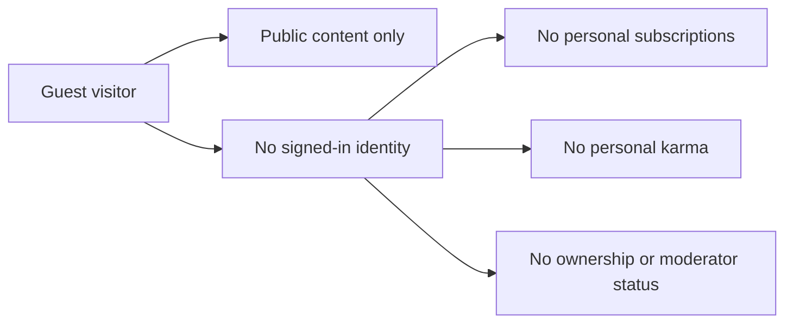

### Public Viewing Permissions

A guest can view the Popular Feed.

A guest can view the feed for a specific community.

A guest can open and read a single post page.

A guest can view comment threads on posts, including nested replies that are visible on the post.

A guest can view public user profile pages.

When viewing a public user profile, the guest can see the user's display name, bio text, avatar image, total karma score, list of posts, and list of comments.

A guest can browse the list of communities available on the platform.

A guest can search for communities by community name.

A guest can view the subscriber count shown for a community.

A guest cannot access the Home Feed because that feed is limited to logged-in users.

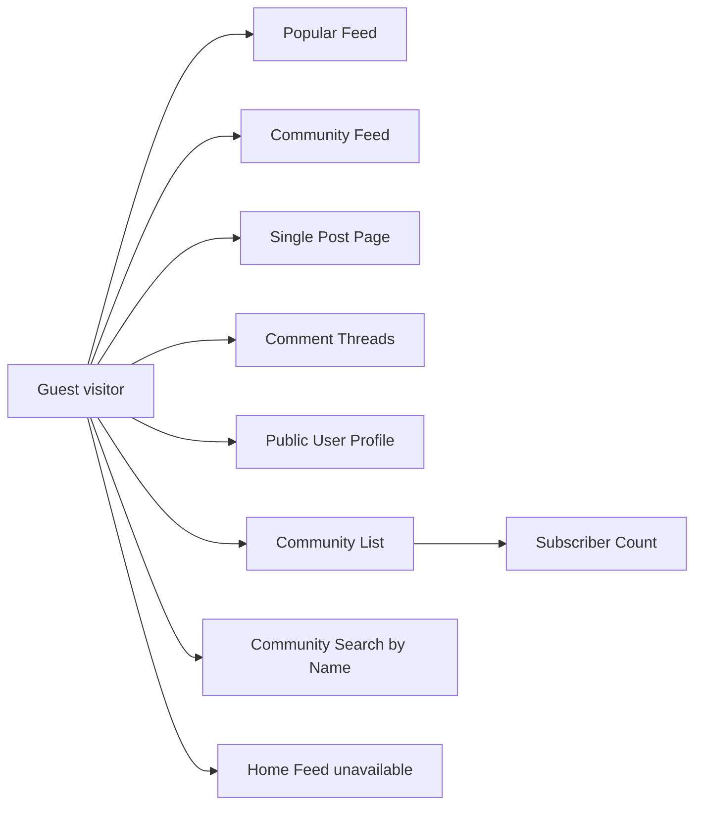

### Guest Restrictions on Participation and Governance

A guest cannot vote on posts.

A guest cannot vote on comments.

A guest cannot create a community.

A guest cannot subscribe to a community.

A guest cannot unsubscribe from a community.

A guest cannot create a post in any community.

A guest cannot edit or delete posts because those actions are reserved for authenticated users acting on their own content or through community moderation authority.

A guest cannot write comments on posts.

A guest cannot reply to comments.

A guest cannot edit or delete comments.

A guest cannot report a post.

A guest cannot report a comment.

A guest cannot ban or unban users in any community.

A guest cannot delete posts or comments as a moderator.

A guest cannot view community report lists.

A guest cannot approve or dismiss reports.

A guest cannot add moderators or remove moderators.

A guest has no moderation authority in any community.

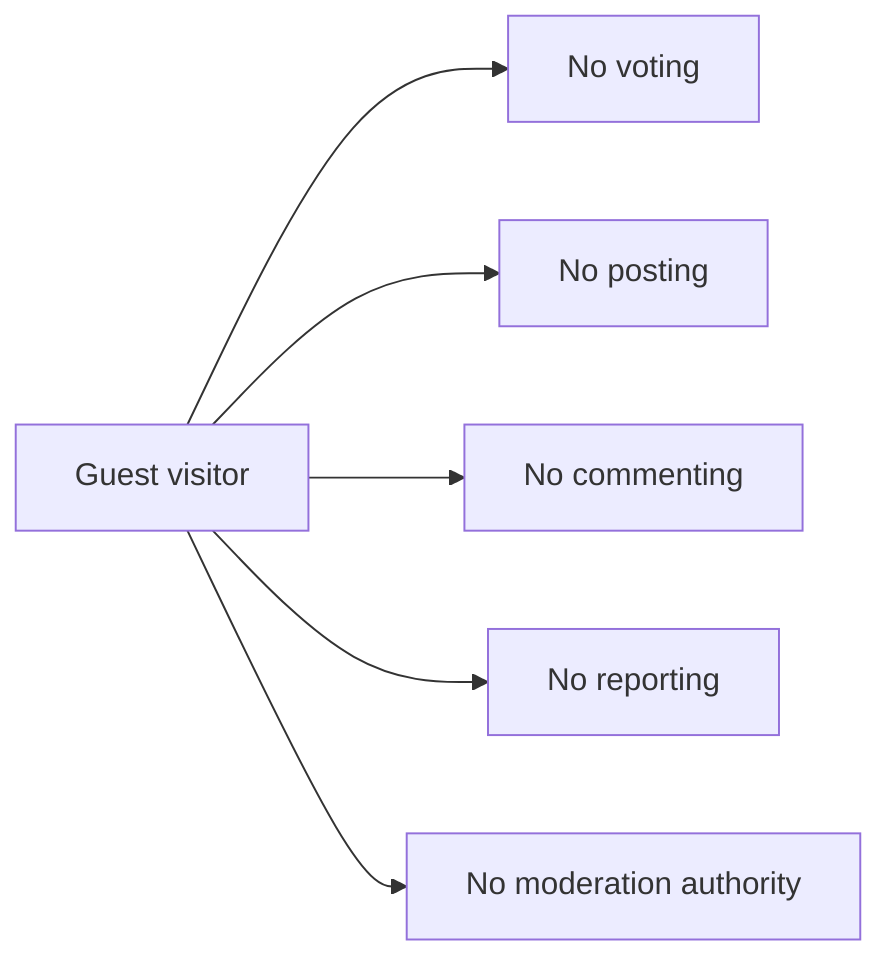

## member Actor

A member is a logged-in User with an authenticated account on the platform. This actor can access both public areas and member-only areas, including the Home Feed that is limited to logged-in users. A member can maintain a personal presence through a Profile and can accumulate a single karma score that may increase or decrease based on how other users vote on the member's Posts and Comments. A member may participate across Communities by subscribing, creating content where subscription is required, voting on Posts and Comments, and reporting content for moderator review. Any member can create a Community, and the creator becomes that Community's owner with the highest authority inside that community. Members may also hold community-specific moderator status when added by an owner or another moderator, but those powers apply only within the relevant Community and do not make the member a platform-wide authority. A member can view other users' Profiles and can see their own subscribed Communities list. A member's access is still bounded by community rules, including bans that block posting and commenting in a specific Community while still allowing viewing. A member does not automatically gain authority over other users, other Communities, or platform-wide governance simply by being logged in.

### Member Identity and Access Boundary

A member is a user with an authenticated account who is logged in to the platform.

Members can access public areas that are also available to guests, including publicly viewable community content and post pages.

Members can also access member-only areas that require a logged-in account.

The Home Feed is available only to members and is not available to logged-out users.

Being a member does not grant platform-wide authority over other users or over all communities.

A member's permissions are limited to the actions allowed to authenticated users and any additional community-specific role the member may hold.

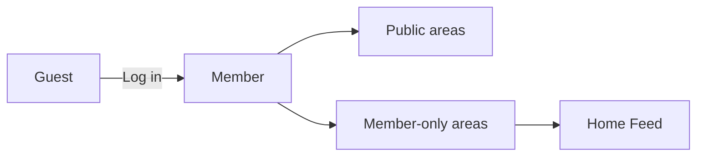

### Member Personal Presence

A member can maintain a personal presence on the platform through a profile.

A member's profile can include a display name, bio text, and avatar image.

A member can edit their own display name, bio text, and avatar image.

A member can view any other user's profile.

A member can accumulate a single karma score that represents the combined effect of votes received on the member's posts and comments.

The karma score may increase, decrease, or become negative based on voting outcomes.

The profile page visible to members includes the user's display name, bio text, avatar image, total karma score, list of posts created by that user, and list of comments written by that user.

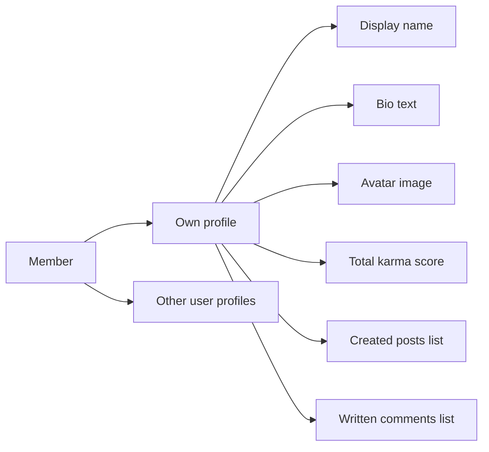

### Member Community Participation

A member can browse communities, search communities by name, and participate in communities through subscription.

A member can subscribe to a community and unsubscribe from a community.

A member can view the list of communities they are subscribed to.

A member can create a community.

When a member creates a community, that member becomes the owner of that community.

The owner is the highest-authority role within that specific community.

A member may also be assigned as a moderator within a specific community.

Community moderator status applies only within the relevant community and does not extend to other communities.

A member who is not subscribed to a community is not eligible to create posts in that community.

A member who is subscribed to a community may create posts in that community, subject to any community-specific restrictions defined elsewhere.

A member can write comments on posts and reply to comments.

A member can vote on posts and comments according to the voting permissions defined for authenticated users.

A member can report posts and comments for moderator review by providing a reason.

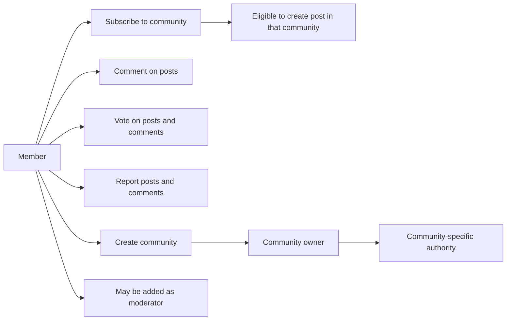

### Member Restrictions and Community-Specific Limits

A member remains subject to community-specific restrictions even after logging in.

If a member is banned from a community, that member can still view content in that community.

If a member is banned from a community, that member cannot create posts in that community.

If a member is banned from a community, that member cannot create comments in that community.

A community-specific owner or moderator role does not make the member a platform-wide authority.

A member cannot exercise owner or moderator powers outside the community where that role applies.

By default, a logged-in member has no site-wide governance powers, no global moderation powers, and no authority over communities they do not own or moderate.

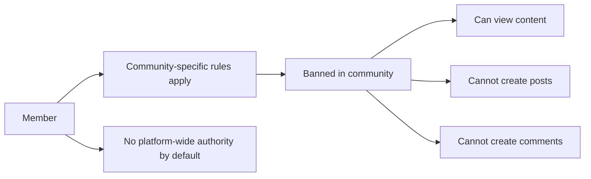

## admin Actor

The original requirements do not define a separate platform admin actor. The only elevated authority described in the platform is community-level authority through Community owners and Community moderators. Because no platform-wide admin role is specified, this document does not assign any global review, enforcement, user management, or system management powers to an admin actor. An admin therefore cannot be treated as an active business role for this scope. Any authority over Posts, Comments, bans, reports, and moderator membership is bounded to the relevant Community roles described in the requirements, not to a site-wide administrator. Public access remains available to guests and members according to the feed and profile rules already defined, and elevated actions remain attached to community ownership or moderator status. If a future revision introduces a true admin role, its permissions would need separate requirements before it can be included here. For the current specification, admin is a placeholder actor with no approved permissions or access rights.

### Admin Role Status in Current Scope

The current requirements do not define a platform-wide admin as an active business role. The presence of an admin actor in the scope reference does not grant that actor any business capabilities by itself.

For this specification, admin is treated as a placeholder actor only. No site-wide authority, review authority, enforcement authority, user management authority, or platform management authority is approved for this role.

This means the system scope does not recognize admin as a participant in normal platform behavior. Public access remains governed by guest and member permissions, while elevated authority is attached only to community-specific roles described elsewhere.

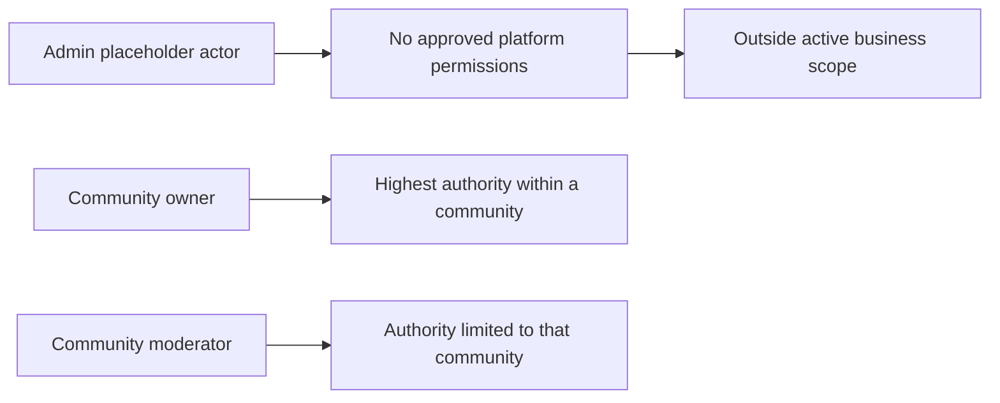

### Absence of Platform-Wide Administrative Powers

No global moderation powers are assigned to admin in the current requirements. Admin is not granted platform-level authority over posts, comments, reports, communities, or users.

The requirements do not authorize admin to review or remove content across all communities. They do not authorize admin to manage community moderation membership across the platform. They also do not authorize admin to control report handling at a platform level.

No global user management powers are defined for admin. The current scope does not permit admin to create, suspend, restore, delete, or otherwise manage user accounts as a site-wide authority.

Where elevated actions exist in the specification, those actions are bounded to the relevant community. Community ownership and community moderation remain the only approved sources of elevated authority.

### Authority Boundary for Community Roles

The highest authority described in the platform is the community owner, and that authority exists only within the relevant community. Moderator authority is also limited to the community where that role applies.

Because moderation and enforcement powers are community-scoped, they must not be reassigned to a site-wide admin role in this document. Actions involving moderator membership, bans, content removal, and report review remain attached to the appropriate community roles rather than to a global administrator.

This boundary prevents admin from being treated as a shortcut for community authority. If a person holds authority in a community, that authority comes from being the owner or a moderator of that community, not from an admin actor label.

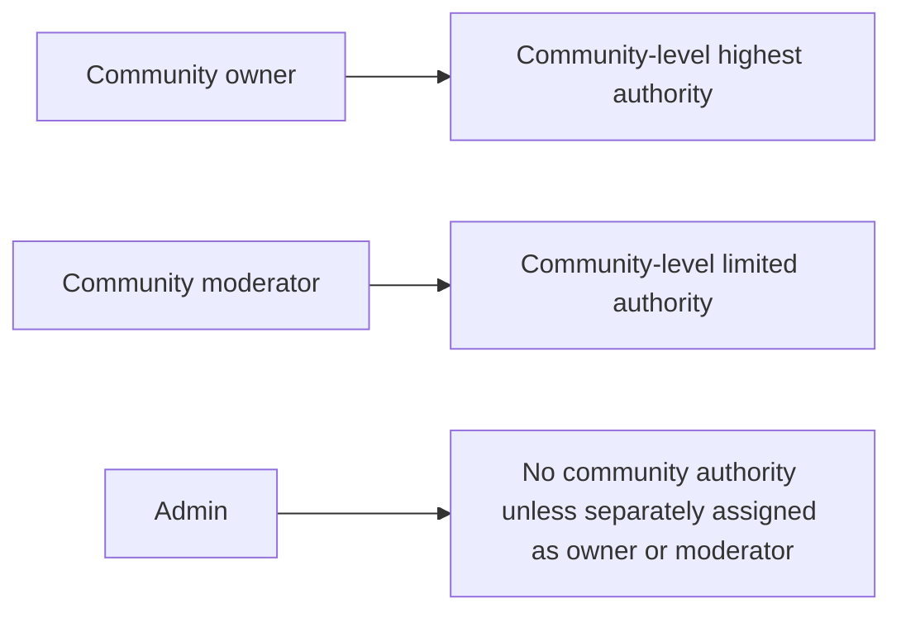

### Future Introduction of an Admin Role

If a future revision introduces a true admin role, that role will require separate requirements before any permissions can be recognized in this specification.

Those future requirements would need to state the admin actor's purpose, approved access rights, authority boundaries, and relationship to community owners and moderators. Until such requirements are added, no permissions may be inferred or assigned to admin.

For the current scope, admin remains outside the approved business role set for active platform behavior. Any attempt to treat admin as having implied access rights would conflict with the requirement set used for this document.

# Authentication Flows

Registration, login, logout, and session management from a user perspective.

## Registration and Login

Define user registration and login flows including validation and error handling.

### Registration

Guests can register for a member account by providing an email address, a password, and a username.

The username chosen during registration must be unique across the platform.

A successful registration creates a user account that is identified by the provided email address and unique username.

After successful registration, the person is recognized as a member and can access member-only capabilities defined in this file.

Registration is limited to guest users. A person who is already authenticated as a member does not register again to obtain another authenticated state within the same account.

If the email address, password, or username required for registration is not provided, registration is rejected.

If the chosen username is already in use, registration is rejected.

Details of validation and rejection behavior are defined in 04-business-rules.md.

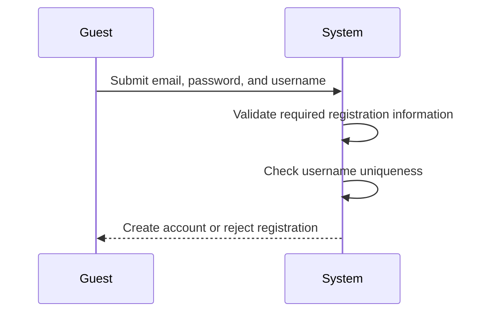

### Login

A registered member can log in by providing the email address and password associated with the account.

A successful login authenticates the member and grants access to member-only capabilities defined in this file.

An authenticated member remains able to access publicly available content in addition to member-only capabilities.

A guest who has not successfully logged in remains limited to guest permissions defined in this file.

Login does not change the user profile, communities, subscriptions, posts, comments, votes, reports, or karma. It only establishes authenticated access for the account.

If the required login information is not provided, login is rejected.

If the provided email address and password do not match a registered account, login is rejected.

Detailed credential validation and rejection behavior are defined in 04-business-rules.md.

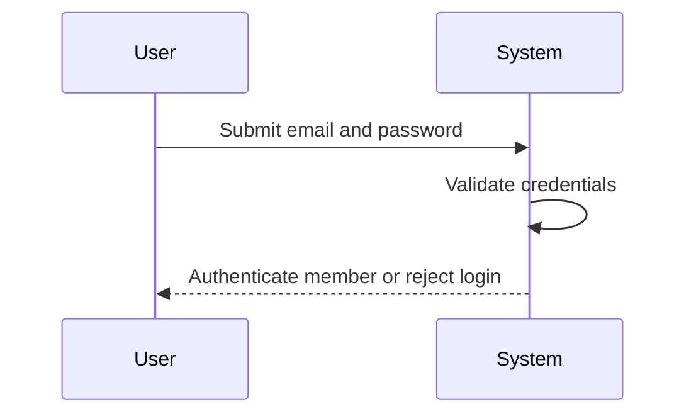

### Authentication Access Boundaries

Authentication distinguishes guests from members for access to platform capabilities.

Guests can view public content that is available without authentication, including the popular feed, community feeds, and single post pages, as defined in the guest actor section.

Members can access all guest-visible content and may also use authenticated capabilities tied to their own account.

Only authenticated members can access the home feed.

Only authenticated members can create communities, subscribe to communities, unsubscribe from communities, create posts in communities they are subscribed to, write comments, cast votes, submit reports, and manage their own account and profile.

Community-specific owner and moderator permissions are available only to authenticated members who hold those community roles.

The platform does not define a site-wide administrator authority for authentication decisions or global moderation powers.

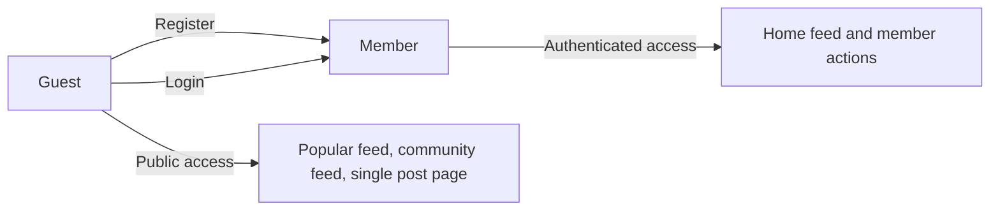

## Session and Logout

Define session behavior and logout from a user perspective.

### Session

A member is considered signed in only after successful login.

A signed-in session identifies the member as the same account across member-only areas of the platform.

The system shall make the signed-in session available for actions that require a member account, including viewing the home feed, subscribing to communities, creating posts, writing comments, voting, reporting content, and managing the member's own profile and account.

A guest shall not be treated as having a member session.

If no valid signed-in session is present, the system shall treat the person as a guest and apply guest permissions defined in the actor sections.

The system shall keep the signed-in member associated with their own account so that actions performed during the session are attributed to that member.

The system shall allow the member to continue navigating between public and member-only areas without being asked to log in again during the same active session.

If the signed-in session is no longer valid, the system shall stop allowing member-only actions until the member logs in again.

The system shall ensure that session state does not switch from one member account to another without a new login.

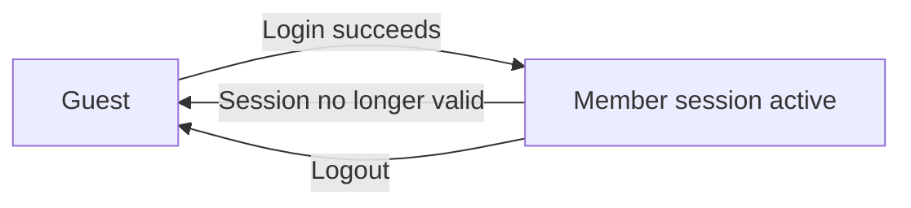

### Logout

A signed-in member shall be able to log out of the platform.

When a member logs out, the current signed-in session shall end.

After logout, the system shall no longer treat the person as an authenticated member for any further action in that session.

After logout, member-only areas and actions shall require login again before they can be used.

After logout, public content that is available to guests shall remain viewable according to guest permissions.

Logging out shall not delete the member account, profile, posts, comments, subscriptions, communities, votes, reports, or karma.

Logging out shall not change ownership or moderator role assignments in any community.

If a person attempts to perform a member-only action after logout, the system shall require login before allowing the action.

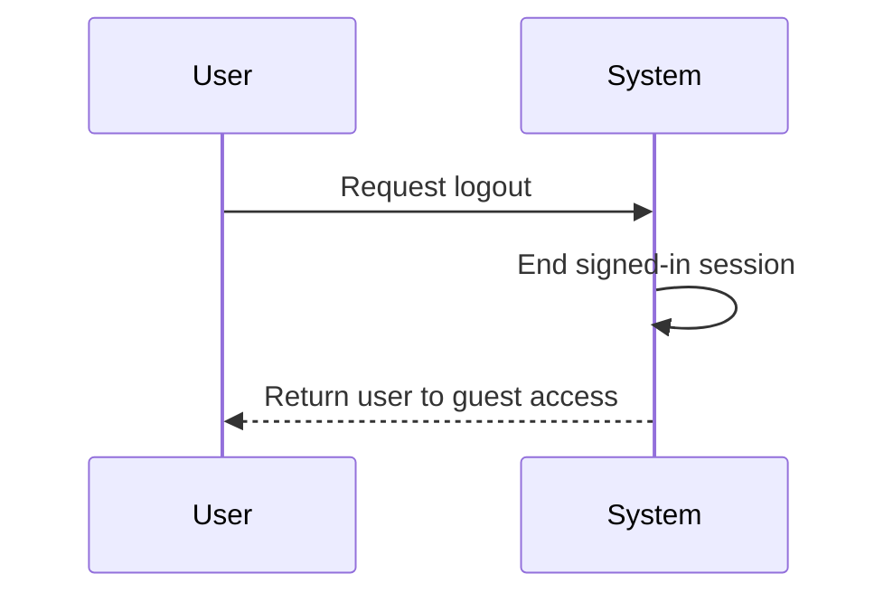

### Account Security

Only the account that successfully logged in shall receive a signed-in session.

The signed-in session shall represent one member account at a time.

A member shall use logout to end access from the current signed-in session when they no longer want the account to remain signed in on that device or browser context.

The system shall not continue to allow member-only actions after logout from the current signed-in session.

The system shall require login again before account management actions can be performed after the session has ended.

The system shall keep account identity consistent during the signed-in session so that profile changes, post creation, comment writing, voting, reporting, subscriptions, and community management actions are performed under the correct member account.

If the session is not valid, the system shall not allow the person to act as the previously signed-in member.

Session-related account protection in this file is limited to identity continuity, authenticated access, and logout behavior. Password creation, login credential checks, password changes, and account deletion are defined in other sections of this file.

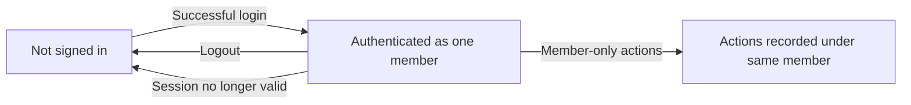

# Account Lifecycle

Account creation, deletion, and password management.

## Account Management

Define how users create accounts, delete accounts, and change passwords.

### Account Creation

Members can create an account by providing an email address, a password, and a unique username.
The system must require all three values during account creation.
The system must reject account creation if the username is already in use.
A successful account creation results in a new member account that can use member-only capabilities after authentication as defined in Registration and Login.
Each new account must represent one user with one profile and one karma score.
The account creation process establishes the user's identity for ownership of future communities, posts, comments, votes, subscriptions, and reports.

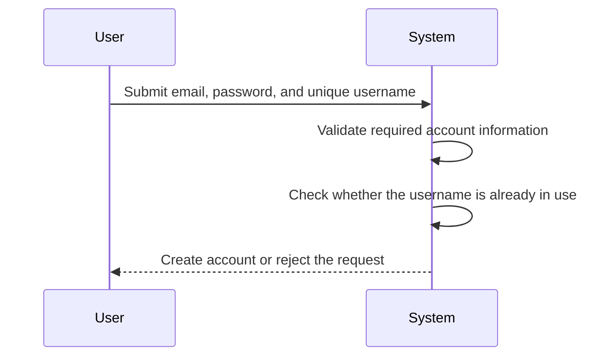

### Account Deletion

Members can delete their own account.
When a member deletes an account, the account is removed from active use.
When a member deletes an account, all posts created by that member are also deleted.
When a member deletes an account, all comments written by that member are also deleted.
Account deletion applies only to the member's own account and not to any other user's account.
After account deletion, the deleted account can no longer be used to act as a member.
This section defines the account deletion outcome only; related data retention and recovery policies, if any, are defined in 05-non-functional.

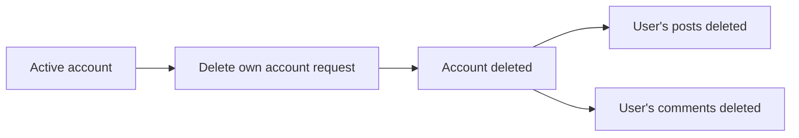

### Password Change

Members can change the password for their own account.
Password change is available only to the account holder for that account.
After a password change is completed, the account must use the new password for future login.
Password change does not change the user's username, profile, karma score, communities, subscriptions, posts, comments, votes, reports, or community-specific roles.
This section defines the member's right to change a password; authentication entry and login behavior are defined in Registration and Login, and session handling is defined in Session and Logout.