**communityPlatform — Business concepts, relationships, and states from user perspective**

Business concepts, relationships, and states from user perspective

# Domain Concepts

Describe what each concept means in the business domain and its key attributes.

## User Concept

A User represents a person who holds an account on the platform and participates across communities, posts, comments, voting, and moderation. The concept identifies a person through an email address used for account access and a username that must be unique across the platform. A User also has authentication credentials for sign-in and password changes. In the business domain, the User is the central actor to whom profile information, authored content, votes, subscriptions, and community roles are connected. The concept includes an overall karma score that reflects the combined effect of vote activity received on that user's posts and comments. A User can remain visible through public identity markers such as username even when different personal presentation details are managed through a separate profile concept. The account also has a lifecycle in which it can exist as an active account or be removed along with the user's contributed posts and comments. This concept is about the account holder identity itself, distinct from profile presentation or community-specific roles.

### Platform Account Holder Identity

A User is the platform account holder: the single person-level identity through which participation on the platform is recognized. This concept represents the account itself rather than the user's public profile presentation, which is defined separately in the Profile concept.

The User serves as the central actor across the platform. Communities created by the person, subscriptions they hold, posts they author, comments they write, votes they cast, reports they submit, and any community-specific moderation standing are all connected back to this one account-holder identity.

At the account level, the User remains the stable business identity that ties together activity across different communities and content areas. This makes the User the reference point for ownership, participation history, and community standing throughout the platform.

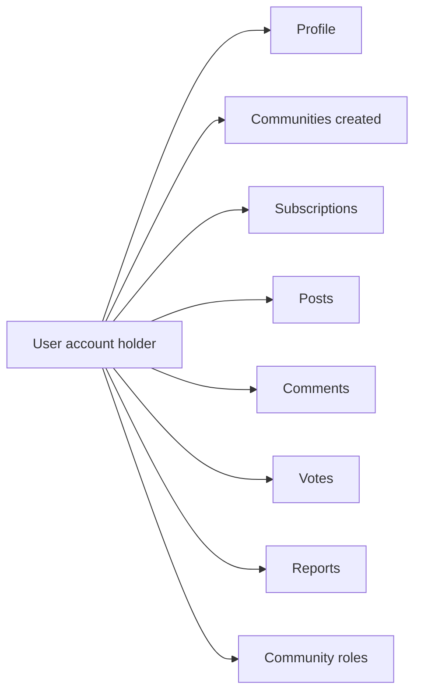

### Account Identity and Access Attributes

A User is identified for account access by an email address and by a username that is unique across the platform. The email-based identity supports account access, while the unique username distinguishes one account holder from every other account holder in the shared platform space.

The User also has authentication credentials associated with the account. These credentials belong to the account-holder identity itself and support sign-in and later password changes, but the detailed authentication flows are defined in the actors and authentication file.

The username is also part of the user's account-level public identity. Even though richer personal presentation details are managed through the Profile concept, the username continues to identify the account holder in connection with authored content and platform participation.

This separation matters in the business domain: the User concept defines who the account holder is, while the Profile concept defines how that person presents themselves publicly through display name, bio text, and avatar image.

### Single Karma Score

Each User has one karma score for the entire platform. This is a single number associated with the account holder and is not split by community, by post, or by comment.

The karma score reflects the combined effect of vote activity received on the user's authored posts and authored comments. Positive voting on that content increases the score, negative voting decreases it, and vote removal changes the score again to reflect the current voting state.

Because karma is an account-level measure, it summarizes how the user's contributed content has been received across the platform as a whole. The value may be positive, zero, or negative.

### Content Ownership and Participation Relationships

A User is the owner of the content they create. In the business domain, authored posts and authored comments are connected to the User as their creator, allowing the platform to recognize who contributed each piece of content.

A User is also a subscription participant. Through subscriptions, the account holder becomes connected to communities they have joined, and those membership relationships form part of the person's participation footprint across the platform.

In addition, a User may be a community role holder within a specific community. A person can hold the owner role for a community they created or hold a moderator role within a community. These roles are community-specific rather than platform-wide, and they express the user's governance standing within that particular community.

These relationships are conceptually distinct but all originate from the same User identity: authorship connects the user to content, subscriptions connect the user to community membership, and community roles connect the user to local authority within a community.

### Account Lifecycle and Deletion Concept

A User has an account lifecycle that begins when the account exists as an active account holder identity on the platform and ends when that account is removed. The lifecycle concerns the continued existence of the account itself, not the changing public presentation details managed in the Profile concept.

When the account is deleted, the User concept is treated as removed from the platform. As part of that same deletion concept, the posts and comments authored by that user are also deleted. This means account removal is not limited to access loss alone; it also ends the continued presence of the user's authored discussion content.

The lifecycle therefore links identity existence and authored content presence. While the account remains active, the user continues to function as a valid platform participant. Once the account is removed, that person no longer exists as an account holder within the business domain, and the associated authored posts and comments are removed with the account.

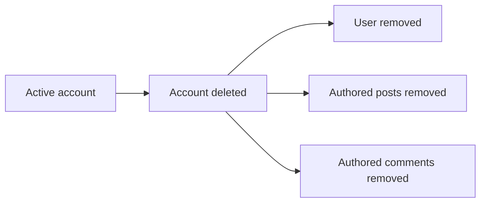

## Profile Concept

A Profile represents the public-facing personal presentation attached to a User account. It contains the display name, bio text, and avatar image that together describe how a user appears to others on the platform. The Profile is distinct from login identity because it focuses on presentation rather than account access. In the business domain, a profile page also presents summary information associated with that user, including the total karma score and visible collections of posts and comments created by the user. The display name offers a readable personal label, while the bio text provides short self-description and the avatar image provides visual identity. A Profile can be viewed by other users as a public representation of the person behind the account. The concept therefore combines personal presentation elements with user-centered public activity context. It remains tied to one User and does not stand alone as an independent participant.

### Public User Presentation

A Profile is the public-facing personal representation attached to one User. It exists to show how that person appears to others on the platform, separate from login identity and account access details. The Profile combines the user's public-facing personal details into one view so other people can recognize and understand the person behind the account.

The Profile is centered on presentation rather than authentication. In the business domain, it is the place where a person's readable personal label, self-description text, and visual identity image are brought together as one public user presentation. Because the Profile belongs to one User and does not stand alone, it always represents that specific User and no one else.

### Profile Personal Details

The Profile contains three personal presentation attributes: display name, bio text, and avatar image.

The display name is the readable personal label shown as part of the user's public presentation. It gives a human-readable identity for profile viewing.

The bio text is the self-description text shown on the Profile. It provides short personal context about the user in the user's own words.

The avatar image is the visual identity image shown on the Profile. It gives a visual representation associated with that user.

Together, these details form the public-facing personal details of the Profile and define how the user is presented on a profile page.

### Profile Page Identity and Activity Context

A profile page is the public identity view for a User's Profile. It presents the Profile's personal details as defined in "Profile Personal Details" and combines them with summary information tied to that same User.

The profile page includes the user's profile-linked karma display, shown as the single total karma score associated with that User. It also includes a user-created posts list and a user-written comments list so viewers can see the public activity associated with the Profile.

The posts list represents all posts created by that user. The comments list represents all comments written by that user. These lists provide public activity context for the Profile page identity without changing the meaning of Post or Comment as separate business concepts.

Through this combination of personal presentation and visible activity context, the profile page serves as the public representation of the person behind the account.

## Community Concept

A Community represents a named gathering space where users share posts, comments, moderation decisions, and membership activity around a common topic or interest. The concept is defined by a unique name so that each community can be clearly identified across the platform. It also includes description text that explains what the community is about and an icon image that visually represents it. In the business domain, a community has an owner as its highest-authority role because the creator becomes the owner of that space. A Community is also characterized by a subscriber count that reflects how many users are currently subscribed. Posts and comments belong within a specific community context, which gives content its local audience and moderation boundary. The community can be discovered in lists and searches by name, making its identity and visibility important business attributes. This concept describes the shared space itself rather than individual subscriptions, moderator assignments, or content items.

### Community Identity

A community is the platform’s shared topic space for gathering people, posts, comments, and moderation activity around a common interest. It serves as an audience grouping concept by bringing together users who want to follow and participate in the same subject area.

Each community is identified by a unique community name so it can be distinguished from every other community across the platform. This name is the primary business identity of the community in listings, search results, and content references.

A community also includes description text that explains what the community is about in user-facing terms. This description gives members and visitors enough context to understand the purpose and focus of the space.

A community may also have an icon image that visually represents the space. The icon image helps users recognize the community when browsing or viewing content associated with it.

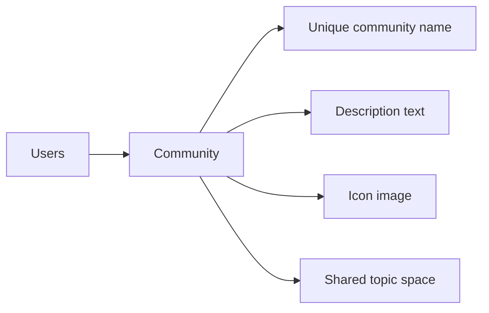

### Community Ownership and Authority

Every community has an owner identity. The user who creates the community is the owner of that community, which gives the space a clear accountable owner within the business domain.

The owner is the highest-authority community role. This role represents the top level of local authority inside the community and distinguishes the owner from other community participants and community-specific moderation roles defined elsewhere.

Ownership is a property of the community itself because it explains who holds the primary governing position for that space. The owner identity therefore forms part of the core definition of a community, not just an operational detail.

The community’s authority structure is local to that community. A user’s owner status applies within the specific community they own rather than across the platform as a whole.

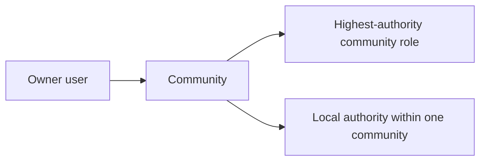

### Community Visibility and Context

A community has community listing presence, meaning it appears as a discoverable space within the platform’s broader collection of communities. This allows users to recognize the community as one of the available places they can explore.

A community also supports community discovery by name. Because its name is unique, users can locate the intended community by searching or browsing for that name.

Each community has a subscriber count that represents how many users are currently subscribed to that community. This count is a business attribute of the community and expresses the current size of its participating audience.

A community provides the local content context for posts and comments associated with it. Content is understood not only by its author and text, but also by the specific community in which it appears.

That same local context creates the moderation boundary space for the content within the community. Posts, comments, reports, and moderation decisions are understood in relation to the specific community that contains them.

In this way, a community is both a visibility unit for discovery and a boundary unit for audience and moderation context.

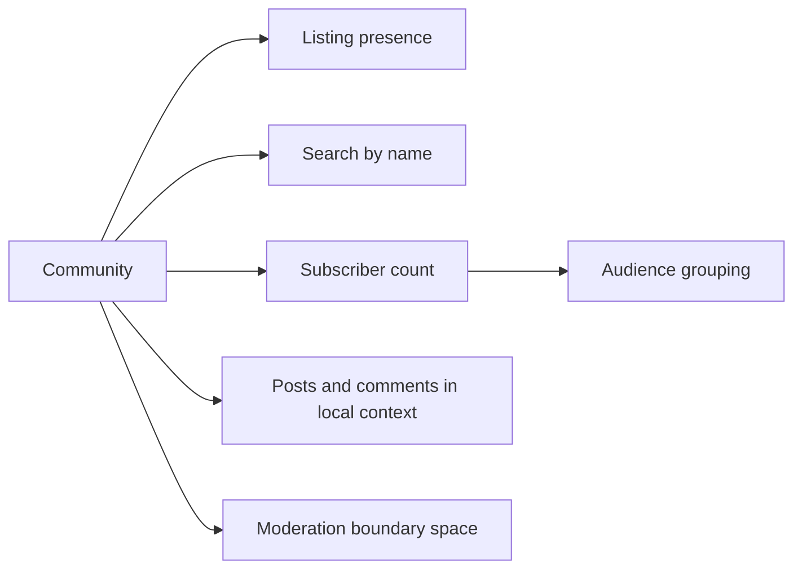

## Subscription Concept

A Subscription represents the membership link between a User and a Community. It expresses that a user has joined a particular community as a subscriber. In the business domain, this concept is important because subscribed communities shape the user's personalized home experience and establish participation status within those communities. A Subscription belongs to one user and one community and exists only for that pairing. The presence of a subscription contributes to the community's subscriber count and to the user's list of subscribed communities. It also carries business meaning as the qualifying relationship required for posting within a community. This concept does not describe the community itself or the user identity itself, but the active membership connection between them. It is therefore a relationship concept with membership meaning rather than a content or role concept.

### Subscription as a Membership Link

A Subscription is the business concept that represents an active membership link between one user and one community. It expresses that the user has joined that specific community as a subscriber, rather than merely viewing it. This concept gives business meaning to the relationship by identifying the community as one in which the user holds joined community status and participation status.

A Subscription always connects exactly one user with exactly one community. It does not describe the user identity itself and it does not describe the community definition itself; those concepts are defined in the User Concept and Community Concept. Its purpose is to capture the active subscriber connection that exists only for that one user–community pairing.

Because Subscription is a relationship concept, its existence is meaningful only when both the user and the community are considered together. If that pairing is not present, there is no subscription relationship for that case.

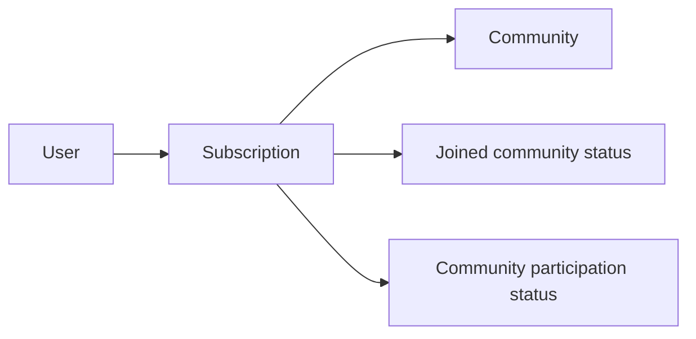

### Subscription Presence in User and Community Context

The presence of a Subscription means the community appears in the user's subscribed communities list. That list is the business view of all communities for which the user currently holds subscriber relationship status.

The same Subscription also contributes to the community's subscriber count. Each active subscriber connection adds to the count for the related community because the count reflects how many user-to-community membership relationships currently exist for that community.

In this way, Subscription has visible meaning from both sides of the relationship. From the user's side, it identifies which communities the user has joined. From the community's side, it contributes to the total number of subscribers associated with that community.

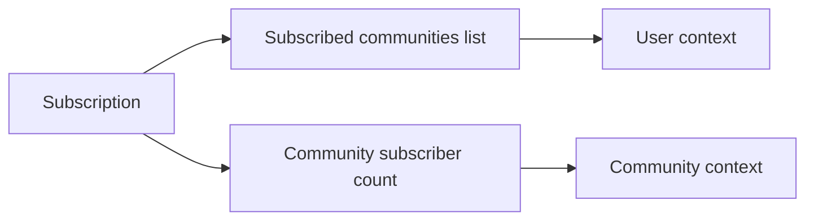

### Subscription as the Basis for Personalized Participation

Subscription is the membership basis for a user's personalized home experience. A user's home feed is shaped by the set of communities for which the user has this membership link, so the existence of subscriptions determines the community scope of that personalized view.

Subscription also carries business meaning as the relationship that establishes posting eligibility within a community. In the business domain, being subscribed is the qualifying participation status that links a user to that community for posting purposes.

This concept should therefore be understood as more than a simple list entry. It is the relationship that marks a community as joined by the user, includes that community in the user's personalized membership-based view, and establishes the subscriber relationship that underlies community participation.

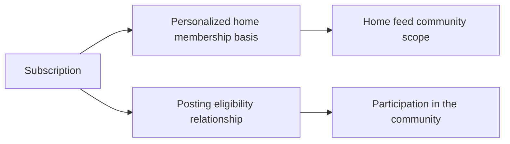

## Post Concept

A Post represents a top-level content item published by a User within a specific Community. Every post has a required title that serves as its main label in feeds and detail views. In the business domain, a post must belong to exactly one of three business types: text post, link post, or image post. A text post is characterized by text content, a link post by a URL, and an image post by an uploaded image. A Post is also associated with an author, a community, a vote score, a comment count, and a posted time that support how it is shown throughout the platform. In feed displays, the post carries a type-specific preview such as a text excerpt, an image thumbnail, or the domain name from a linked URL. The same concept also supports a full single-post view where the complete content and related summary details are visible. This concept defines the content item itself, not the voting records or comments attached to it.

### Post Definition and Core Attributes

A Post is the platform’s top-level community content item. It represents a single published item created by a user and placed within one specific community.

A Post always has a required title that serves as its main label wherever the post is shown. The title is the primary identifying text for the post in feeds and in the single-post view.

Each Post is associated with one author identity. The author identifies which user created the post.

Each Post is also associated with one community context. The community identifies where the post belongs and where it is shown as part of shared discussion.

A Post includes a vote score, which expresses the current net voting result for that content item.

A Post includes a comment count, which expresses how many comments are attached to that post.

A Post includes a posted time, which expresses when the post was created and supports time-based presentation across the platform.

This concept defines the post item itself. Voting records and comments are separate concepts defined in their own sections.

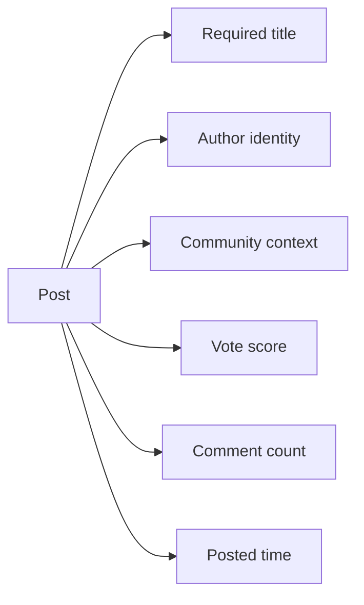

### Post Type Classification

Every Post belongs to exactly one of three business types.

A text post type is a post whose main content is text content.

A link post type is a post whose main content is a URL-based reference.

An image post type is a post whose main content is an uploaded image.

These three types are mutually exclusive business classifications for a post. A single post is understood as one type at a time rather than a combination of multiple types.

The post type determines what kind of main content the post carries and how that content is represented in feed previews and in the single-post view.

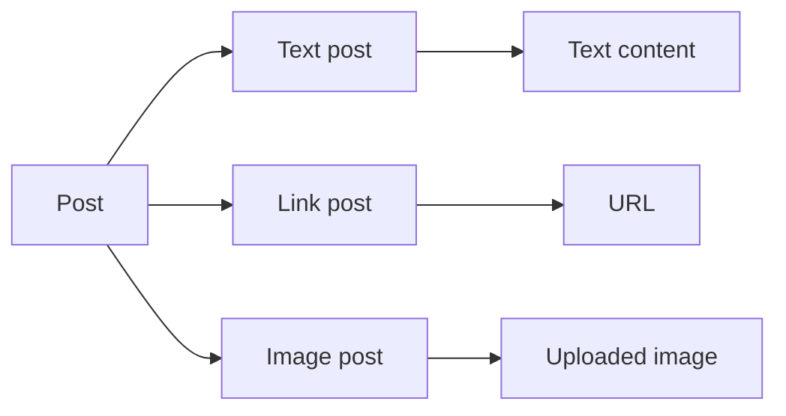

### Post Content Variants and Feed Previews

A text content post carries text as its main body content. When shown in a feed, it may present a feed preview excerpt taken from that text content.

A URL-based post carries a link as its main body content. When shown in a feed, it may present the linked domain display so users can recognize the source domain of the link.

An uploaded image post carries an image as its main body content. When shown in a feed, it may present an image thumbnail preview.

These previews are type-specific representations of the same Post concept. They support scanning posts in feed views without replacing the full post content itself.

The preview form depends on the post type defined in Post Type Classification.

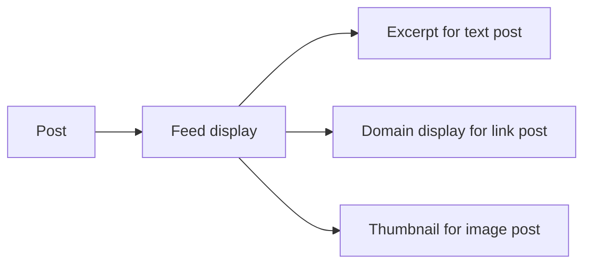

### Single Post Detail Representation

A single post detail item is the full representation of one Post when viewed on its own.

In this view, the Post is presented as a complete content item rather than as a feed summary. The title remains the main label for the post, as defined in Post Definition and Core Attributes.

The single-post view includes the full content appropriate to the post type, whether that is text content, a URL-based item, or an uploaded image post.

The single-post view also carries the post’s author identity, community context, vote score, comment count, and posted time so the post can be understood in full context.

This detail representation is the complete form of the same Post concept that may appear in abbreviated form in feed previews.

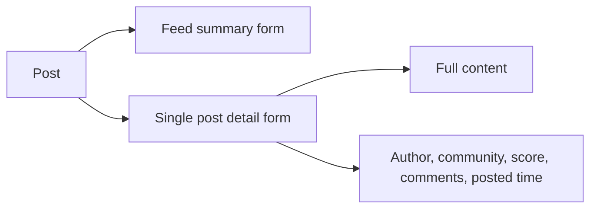

## Comment Concept

A Comment represents a written response attached to a Post or to another Comment within a discussion. It is the platform's conversational content concept and allows discussion to grow as a nested reply structure. Each comment has an author, content, vote score, and posted time as core business attributes. A Comment can appear as a direct response to a post or as a reply beneath another comment, which gives it a parent-child position in the conversation. Because replies can continue without a depth limit, the concept supports deeply nested discussion threads. The visible form of a comment includes its written content together with authorship, scoring, and timing context. A Comment belongs within the scope of a particular post discussion even when it sits several levels deep in replies. This concept covers the discussion entry itself rather than the separate voting records on comments.

### Comment as a Written Discussion Entry

A Comment is the platform's written discussion entry. It represents conversational content that is added within the discussion of a specific post. A comment is always part of a post discussion, even when it appears deeper in a reply chain.

As a business concept, a comment is a threaded discussion item rather than a top-level publication. It exists to let users respond to a post or continue a conversation beneath another comment. The concept covers the discussion entry itself and its visible business meaning within the conversation.

A comment is understood by its place in the discussion and by the information shown with it. Its visible form includes the written content, the identity of the author, the current vote score, and the posted time.

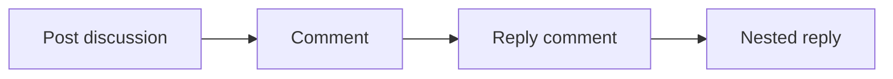

### Comment Position in the Reply Structure

A comment can be attached directly to a post as a post response content item, or it can be attached beneath another comment as a reply to another comment. This creates a parent-child conversation position for every comment after the first level.

When a comment responds directly to a post, the post is its discussion context. When a comment responds to another comment, it still remains within the same post discussion context while also taking a child position beneath its parent comment.

The reply model forms a nested reply structure. Each comment may have replies beneath it, and those replies may themselves have further replies. This supports a threaded discussion item arrangement in which the relationship between parent and child comments gives the conversation its readable structure.

The concept allows unlimited reply depth. A discussion may continue for as many reply levels as users create, without a defined maximum nesting level in the business domain.

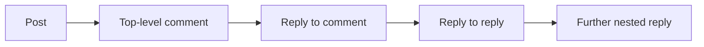

### Comment Core Business Attributes

Each comment has a defined set of core business attributes that describe the discussion entry from a user perspective.

- Comment author identity: identifies who wrote the comment.
- Comment content text: the written text that communicates the response or reply.
- Comment vote score: the current discussion score shown for the comment.
- Comment posted time: indicates when the comment was written and added to the discussion.

Together, these attributes provide the essential meaning of a comment in the conversation. The author identity shows ownership of the discussion entry. The content text carries the substance of the response. The vote score shows the current community reaction to the comment. The posted time places the comment in temporal context within the ongoing discussion.

These attributes describe the comment itself as seen in the discussion thread. They do not redefine the separate voting records on comments, which are part of the CommentVote concept.

## PostVote Concept

A PostVote represents one user's recorded opinion on a specific Post for scoring purposes. Its core business attribute is the vote choice, which can be an upvote or a downvote. The concept exists at the intersection of one user and one post and expresses that user's current scoring stance toward that content item. In the business domain, only one recorded vote relationship is meaningful for a given user-post pair at a time. A PostVote contributes to the post's visible vote score because score is determined by the balance between positive and negative votes. It also affects the post author's karma because received votes on posts change that user's overall karma score. The concept therefore captures both content evaluation and its consequences for community reputation. This is distinct from the displayed score itself, which is a result derived from many post votes.

### Recorded Post Reaction

A PostVote is the recorded reaction of one user to one post. It represents that user's current opinion about the post for scoring purposes.

The concept exists only in relation to a specific user and a specific post. It is not a standalone content item and is meaningful only as the vote relationship between that user and that post.

Its business meaning is evaluative rather than expressive text. A PostVote captures whether the user currently supports the post or opposes it through a recorded scoring stance.

This concept is distinct from the post's displayed vote score. The displayed score is a result derived from the combined effect of many recorded post reactions.

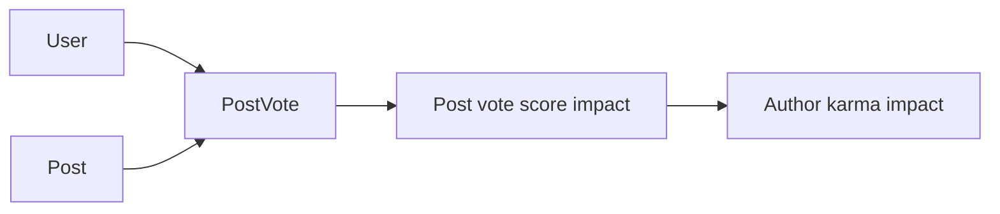

### Vote Choice and Current Scoring Stance

The core business attribute of a PostVote is the vote choice. The allowed choices are an upvote choice or a downvote choice.

An upvote choice represents a positive evaluation of the post. A downvote choice represents a negative evaluation of the post.

At any given time, the PostVote reflects the user's current scoring stance toward that post. The concept therefore describes the user's present recorded position, not multiple simultaneous positions.

Because the PostVote captures the current stance, the business meaning of the record is always the user's latest active evaluation of that post.

### Single Vote Relationship per User and Post

For a given user-post pair, only one PostVote relationship is meaningful at a time. The business domain recognizes a single current recorded vote between one user and one post.

This means the same user cannot hold both an upvote choice and a downvote choice on the same post at the same time. The concept supports one current scoring stance for that relationship.

The uniqueness of the vote relationship ensures that each user's contribution to a post's evaluation is counted once for that post. This preserves the meaning of the post score as the balance of individual recorded reactions rather than repeated reactions from the same user.

### Contribution to Post Score and Author Karma

A PostVote contributes to the visible score of the related post. The post's vote score is determined by the balance between positive votes and negative votes.

An upvote choice contributes positively to that balance. A downvote choice contributes negatively to that balance.

The same recorded post reaction also affects the post author's karma. Positive votes received on posts increase the author's single karma score, while negative votes received on posts decrease it.

Because karma can be negative in the broader domain, the effect of post votes on author reputation may move the author's karma upward or downward depending on the balance of received post votes.

This makes PostVote a concept with two business consequences: it participates in post evaluation through score contribution, and it participates in reputation measurement through author karma impact.

## CommentVote Concept

A CommentVote represents one user's recorded opinion on a specific Comment for scoring purposes. Its defining attribute is the vote choice, which can be either an upvote or a downvote. The concept belongs to one user-comment pairing and captures that user's current scoring position on that comment. In the business domain, only one recorded vote is meaningful for each user and comment combination at a given time. A CommentVote contributes to the comment's visible vote score through the balance of positive and negative reactions. It also affects the comment author's karma because votes received on comments change that user's overall karma score. The concept captures evaluative feedback on discussion content rather than the text of the discussion itself. It is separate from the displayed score value, which summarizes many individual comment votes.

### Comment Vote as Recorded Evaluation

A CommentVote is the business concept that captures one user's recorded reaction to a specific comment. It represents evaluative feedback on discussion content rather than discussion content itself.

A comment vote belongs to one relationship between one user and one comment. Its meaning is the user's current scoring stance toward that comment at a given time.

This concept exists separately from the comment's displayed vote score. The displayed score is a summary outcome, while a CommentVote represents one individual opinion that contributes to that outcome.

Because it records a reaction, a CommentVote is part of how the platform measures community response to comments. It expresses whether the user is reacting positively or negatively to a comment, not whether the user authored, edited, or replied to the comment.

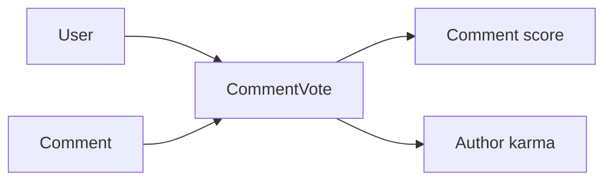

### Allowed Vote Choices and Current Stance

The defining attribute of a CommentVote is its vote choice. The allowed choices are an upvote or a downvote.

An upvote represents a positive opinion on the comment. A downvote represents a negative opinion on the comment. At any given time, the recorded vote expresses the user's current position on that specific comment.

The business meaning of the vote is directional rather than descriptive. The concept does not store the text of the user's opinion; it stores whether the user's recorded reaction is positive or negative.

This current stance is important because comment scoring is based on the balance between positive and negative recorded votes. The vote choice therefore serves as the user's active scoring position for that comment.

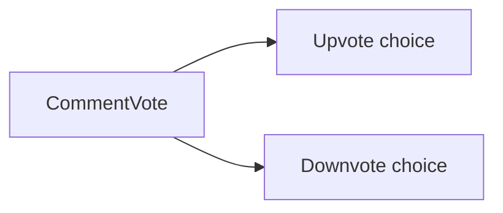

### Single Vote per User and Comment Pair

Only one CommentVote is meaningful for each user and comment combination at a given time. The business domain treats the user-comment pair as having a single current recorded reaction, rather than multiple simultaneous reactions.

This means the concept is tied to one specific pairing of one user and one comment. The platform's understanding of that pairing is the user's present vote position on the comment.

The one-vote-per-pair rule ensures that each user's opinion affects comment scoring in a consistent way. It prevents the same user-comment relationship from carrying more than one active scoring stance at the same time.

This section defines the uniqueness of the relationship only. Operational changes to that relationship, such as how a vote may be changed or removed, are defined in functional requirements and business rules.

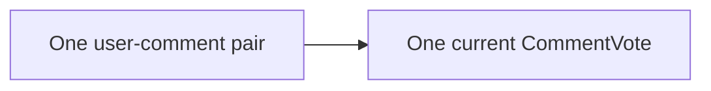

### Score Contribution and Karma Impact

Each CommentVote contributes to the visible vote score of the comment it targets. The score is determined from the balance of positive and negative votes recorded against that comment.

Positive and negative comment votes have opposite scoring meaning. Upvotes increase the positive side of the balance, while downvotes increase the negative side of the balance. The visible score summarizes that comparison rather than listing each individual vote.

A CommentVote also affects the comment author's single karma score. When a comment receives positive or negative votes, the author's karma changes accordingly because received comment votes are part of that user's overall karma outcome.

The business effect of a CommentVote therefore reaches beyond the comment itself. It influences both the comment's public score and the author's platform-wide karma standing.

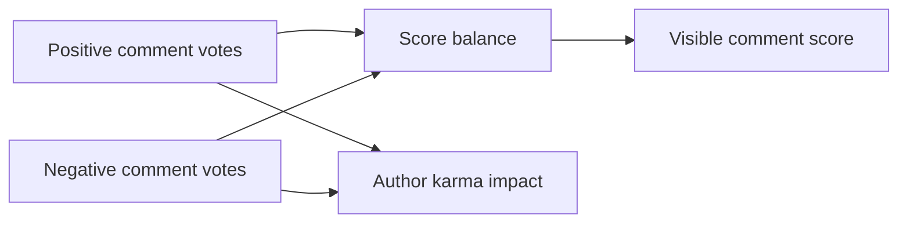

## Report Concept

A Report represents a user's formal complaint about a Post or Comment within a Community. The concept records that a piece of content has been flagged for moderator review and always includes a reason expressed as text. In the business domain, a report is tied to the reported content and to the user who submitted it. It also carries a review state because a report can remain awaiting review, be approved in a way that results in content removal, or be dismissed so that the content remains. The report therefore acts as the moderation intake record for questionable content. A Report belongs to the community context in which the reported post or comment appears, allowing moderators of that community to evaluate it. Its essential business meaning is not the moderation action itself, but the documented concern and its review outcome. This concept can apply to both top-level posts and discussion comments.

### Report as a Formal Content Complaint

A report represents a formal content complaint raised by a user about material published within a community. Its business purpose is to record that content has been flagged because someone believes it requires moderator attention.

A report always expresses a flagged content concern, rather than a general discussion or private note. It exists as a moderation record tied to a specific concern about published community content.

A report is part of the community context in which the questioned content appears. This makes the report the intake point for community moderation review, even though the report itself is not the moderation decision.

The concept applies to concerns about visible discussion content and exists to preserve the complaint, the target of the complaint, and the eventual review outcome in one business record.

### Reported Content, Reason, and Reporting Identity

Each report refers to one reported piece of content. The reported content may be either a post or a comment, and the report exists only in relation to that reported post or comment.

A report includes reason text provided by the reporting user. This reason text captures the user's stated explanation for why the content has been flagged for review.

A report is associated with the identity of the user who submitted it. In the business domain, this means the report records who raised the concern, not just what content was questioned.

Because the report keeps both the reported content reference and the reporting user identity, it provides enough business context for moderators to understand what was flagged and who submitted the complaint.

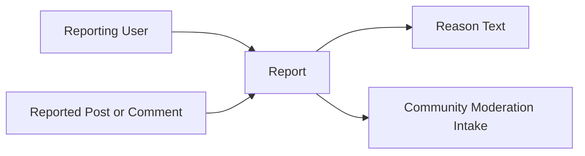

### Report Review State and Business Outcomes

A report carries a review state that expresses its current business standing in moderation handling. This state is part of the report concept because the complaint remains meaningful only while its review position is known.

The initial state is awaiting moderator review. In this state, the reported concern has been recorded, but no moderation outcome has yet been applied to the report.

An approved report outcome means the complaint was accepted in review and resulted in removal of the reported content. In business terms, the report records that the flagged concern was upheld.

A dismissed report outcome means the complaint was reviewed but not upheld, and the reported content remains in place. In business terms, the report records that the flagged concern did not lead to content removal.

These outcomes describe the business meaning of the report after review: pending consideration, accepted concern with content removal, or rejected concern with content remaining.

```mermaid
flowchart LR
    A["Awaiting Moderator Review"] --> B["Approved Report Outcome"]
    A --> C["Dismissed Report Outcome"]
```

## CommunityBan Concept

A CommunityBan represents a community-specific restriction placed on a User within a particular Community. The concept means that the user is barred from participating by creating posts or comments in that community while still remaining able to view its content. In the business domain, a ban is not platform-wide; it exists only within the scope of one named community. A CommunityBan therefore links one user to one community with a restricted participation status. The concept has business meaning as part of moderation control over who may actively contribute. It separates viewing access from contribution access, making the restriction narrower than full exclusion from community visibility. A banned user remains a user of the platform, but their participation status is changed for that specific community. This concept describes the restriction state itself rather than the moderator action that created or removed it.

### Community-Scoped Restriction

A community ban represents a restriction that applies to one user within one specific community. It is a community-specific moderation concept used to mark that the user has restricted participation in that named community.

This concept links a user to a community through a ban status rather than through membership or ownership. The meaning of the concept is local to that community only. The same user may remain unrestricted in other communities across the platform.

A community ban is therefore not a platform-wide ban. It does not remove the user from the platform as a whole and does not change the user’s ability to exist as an account holder outside the affected community. The concept only records that participation is restricted within one community.

### Banned User Participation Status

A banned user has a restricted participation status in the affected community. In business terms, the user is still present on the platform and may still be associated with that community as a viewer, but the user is not allowed to actively contribute there while the ban status applies.

The restriction specifically blocks participation actions in that one community. The user cannot create posts in the banned community, and the user cannot add comments in the banned community. This makes the ban a contribution restriction rather than a visibility restriction.

The ban state exists as the current participation condition between the user and the community. It describes whether the user is barred from contributing there, independent of how the restriction was applied or who applied it.

### Viewing Access During Ban

A community ban does not prevent the affected user from viewing the community’s content. Even while banned, the user may still access the community and read its posts and comments.

This distinction is important to the business meaning of the concept. The ban blocks participation, such as posting and commenting, but does not block visibility. The user remains able to see community content even though active contribution is restricted.

Because the concept preserves viewing access, it is narrower than full exclusion from the community. Its purpose is to separate read access from contribution access within a single community.

## CommunityModerator Concept

A CommunityModerator represents a moderation role held by a User within a specific Community. This concept identifies that a user has authority to manage community content and participation according to the community's moderation rules. In the business domain, the role is community-specific rather than global across the platform. The concept also exists within a clear authority hierarchy where the community owner is the highest authority and moderators hold delegated moderation status beneath the owner. A CommunityModerator is therefore defined by the pairing of a user and a community together with role standing inside that community. The role is relevant to content oversight, user restrictions, and report review within that local space. It is distinct from ordinary subscription because it carries governance authority instead of simple membership. This concept describes the assigned moderation position itself, not the actions performed through that position.

### Community-Specific Moderation Role

A community moderator role represents governance authority held by a specific user within one specific community. This role is local to that community and does not carry moderation standing across the rest of the platform.

The role identifies that the user is recognized by the community as part of its moderation structure. The same user may hold this role in one community and not hold it in another.

This concept is distinct from ordinary participation because it exists to support community oversight rather than simple membership. A user may be known in a community both as a subscriber and as a moderator, but the moderation role is a separate business concept with separate meaning.

The role is defined by the pairing of a user and a community together with that user's moderation standing inside that community.

```mermaid
flowchart LR
    U["User"] --> R["Community moderator role"]
    C["Community"] --> R
    R --> S["Moderation standing within that community"]
```

### Moderator Standing and Authority Scope

A community moderator role identifies a user with moderation authority inside the related community. That authority is limited to the local space where the role is assigned.

From the business perspective, the role carries content oversight authority, user restriction authority, and report review authority for that community. These authorities explain why the role exists as a distinct concept in the domain.

Content oversight authority means the role is relevant to supervision of posts and comments that belong to the community.

User restriction authority means the role is relevant to community-specific participation restrictions applied to users in that community.

Report review authority means the role is relevant to review of reports concerning content within that community.

These authorities describe the business significance of the role itself. The detailed actions that can be performed through this role are defined in functional requirements and permissions sections.

```mermaid
flowchart LR
    R["Community moderator role"] --> O["Content oversight authority"]
    R --> B["User restriction authority"]
    R --> V["Report review authority"]
```

### Delegated Standing and Owner Hierarchy

A community moderator role exists within a clear authority hierarchy inside the community. The community owner stands above moderators in that hierarchy.

The owner's standing is the highest moderation authority in the community. Moderator standing exists beneath the owner as delegated moderation status.

This delegated standing means the moderator role is recognized as an authorized governance position, but it is not the top authority of the community.

The hierarchy is community-specific rather than platform-wide. A user's position in this hierarchy depends on the community role assignment for that particular community.

This concept therefore includes two related business meanings: the existence of a local governance role and the fact that its authority is ordered beneath the owner.

```mermaid
flowchart LR
    O["Community owner"] --> M["Moderator standing"]
    M --> G["Delegated governance role"]
```

### Role Assignment Identity and Distinction from Subscription

A community moderator role is the business record that a particular user has been assigned a moderation position in a particular community. The assignment identifies who holds the role and where that role applies.

This assignment is separate from subscriber membership. Subscription expresses that a user has joined a community as a participant, while community moderator assignment expresses that a user holds governance authority in that same community.

Because the two concepts serve different business purposes, moderator standing must not be treated as merely another form of subscription. Subscription is about membership and participation. Moderator assignment is about local authority and community governance.

A user may be both a subscriber and a moderator in the same community, but those statuses remain conceptually distinct in the domain model.

This distinction is important because community moderation concerns oversight and review within the community, whereas subscriber membership concerns belonging to the community as a participant.

```mermaid
flowchart LR
    U["User"] --> S["Subscription membership"]
    U --> M["Moderator assignment"]
    S --> P["Participation in community"]
    M --> G["Governance authority in community"]
```

# Domain Relationships

Describe how concepts relate to each other from a business perspective.

## Conceptual Relationships

Describe how concepts relate to each other in business terms.

### User-Centered Ownership and Participation Relationships

A User is the central participant in the platform's business relationships. Each User belongs to exactly one Profile as that user's public presentation. A User has one karma score that reflects the combined effect of voting activity received on that user's Posts and Comments.

A User has many Communities through creation, and the User who creates a Community becomes that Community's owner. Ownership establishes the primary governing relationship between that User and the Community.

A User has many Community associations through Subscription. Each Subscription belongs to one User and one Community, expressing that the User is a subscriber of that Community. This association is the basis for a member's subscribed communities list and for participation in community-specific posting.

A User has many Posts as authored content items published into Communities. A User also has many Comments as authored discussion entries attached to Posts and, where applicable, to parent Comments.

A User has many PostVotes and many CommentVotes, each representing that user's current voting association with one Post or one Comment. A User has many Reports as formal complaints submitted against content in Communities.

A User may also hold a community-specific governance relationship through CommunityModerator. In that association, a User belongs to one Community moderation structure either as the owner or as a moderator.

A User may have many CommunityBan relationships, each tied to a specific Community. This means a User can be restricted in one Community while remaining unrestricted in others.

```mermaid
flowchart LR
    U["User"] --> P["Profile"]
    U --> C["Created Communities"]
    U --> S["Subscriptions"]
    U --> PO["Posts"]
    U --> CM["Comments"]
    U --> PV["Post Votes"]
    U --> CV["Comment Votes"]
    U --> R["Reports"]
    U --> MM["Community Roles"]
    U --> B["Community Bans"]
```

### Community Content and Membership Associations

A Community is the shared space that organizes membership, content, moderation, and reporting relationships. Each Community belongs to one owner through its creation relationship with a User. A Community has many subscribers through Subscription, and the total number of active subscriber associations is presented as the subscriber count.

A Community has many Posts. Each Post belongs to one Community, meaning every Post is published within a single shared topic space rather than across multiple Communities. Through this association, the Community acts as the container for top-level content.

A Community has many community moderators through CommunityModerator. These moderation-role associations identify which Users hold local governance responsibilities within that Community. The owner relationship is the highest-authority role within this same community-specific governance structure.

A Community has many banned Users through CommunityBan. Each CommunityBan belongs to one Community and one User, expressing a community-specific participation restriction rather than a platform-wide restriction.

A Community has many Reports related to content inside that Community. Reports are connected to the Community by the fact that the reported Post or Comment belongs to that Community's content space.

The Community therefore acts as the business boundary for membership, posting location, moderation authority, bans, and report review.

```mermaid
flowchart LR
    C["Community"] --> S["Subscriptions"]
    C --> P["Posts"]
    C --> M["Community Moderation Roles"]
    C --> B["Community Bans"]
    C --> R["Reports"]
```

### Content Hierarchy Between Posts, Comments, Votes, and Reports

A Post is the primary content item in a Community. Each Post belongs to one authoring User and one Community. A Post has many Comments, making it the root of a discussion thread. A Post also has many PostVotes, each of which belongs to one User and one Post and expresses a single user's voting stance toward that Post.

A Comment belongs to one Post and one authoring User. A Comment may also belong to one parent Comment when it is written as a reply. Because a Comment has many child Comments, comments form a nested discussion structure with repeated parent-child associations.

A Comment has many CommentVotes. Each CommentVote belongs to one User and one Comment, creating the voting relationship used to express community feedback on discussion entries.

A Report belongs to one reporting User and targets either one Post or one Comment. A Report therefore has an association to content through exactly one reported item, while also remaining part of the related Community's moderation workload.

These relationships create a clear hierarchy: Communities contain Posts, Posts contain comment threads, comments may contain nested replies, votes attach to individual Posts or Comments, and reports attach to individual content items for moderation review.

```mermaid
flowchart LR
    C["Community"] --> P["Post"]
    P --> CM1["Comment"]
    CM1 --> CM2["Reply Comment"]
    P --> PV["Post Votes"]
    CM1 --> CV["Comment Votes"]
    P --> RP1["Post Reports"]
    CM1 --> RP2["Comment Reports"]
```

## Lifecycle and Retention

Describe concept lifecycle states and transitions only. Detailed retention/recovery policies belong in 05-non-functional. Operation details belong in 03-functional-requirements.

### Lifecycle States of Core Content and Governance Records

```yaml
spec:
  canonical: "02-domain-model"
  domain_area: "Lifecycle and Retention"
  focus: "lifecycle states and transitions"
  entities:
    - "User"
    - "Profile"
    - "Community"
    - "Subscription"
    - "Post"
    - "Comment"
    - "PostVote"
    - "CommentVote"
    - "Report"
    - "CommunityBan"
    - "CommunityModerator"
  excludes:
    - "detailed retention policies"
    - "detailed recovery policies"
    - "operational requirements"
```

User accounts, communities, subscriptions, posts, comments, votes, reports, community bans, and community moderator assignments each have a business lifecycle that begins when the related user action creates the record and ends when the record is removed from active use.

A user account begins as an active account after sign-up and remains active until the user deletes the account. The profile exists as part of that active account lifecycle. When the account is deleted, the user account and its profile no longer remain as active concepts on the platform.

A community begins when a user creates it and continues as an active community space for browsing, subscribing, posting, commenting, moderation, and reporting.

A subscription begins when a user subscribes to a community and ends when that user unsubscribes.

A post begins when a subscribed user creates it in a community. A comment begins when a user writes it on a post or as a reply to another comment. Both remain active until deleted by their owner or removed through moderation.

A post vote or comment vote begins when a user casts an upvote or downvote. The vote remains the user’s current scoring stance until the user changes it or removes it.

A report begins when a user submits a reason about a post or comment. It remains in review until a moderator either approves it or dismisses it.

A community ban begins when a moderator or owner bans a user in that community and ends when the ban is removed. A community moderator assignment begins when a user is given owner or moderator standing in a community and ends when that standing is removed.

```mermaid
flowchart LR
    A["Active account"] --> B["Deleted account"]
    C["Subscribed"] --> D["Unsubscribed"]
    E["Active post"] --> F["Deleted post"]
    G["Active comment"] --> H["Deleted comment"]
    I["Reported content"] --> J["Approved report"]
    I --> K["Dismissed report"]
    L["Banned in community"] --> M["Unbanned in community"]
    N["Moderator standing"] --> O["Removed standing"]
```

### Retention of User-Owned and Community Content

```yaml
spec:
  canonical: "02-domain-model"
  domain_area: "Lifecycle and Retention"
  focus: "retention boundaries as business visibility states"
  concepts:
    - "active content"
    - "removed content"
    - "current membership"
    - "current vote stance"
    - "current governance state"
```

Retention in this domain is based on whether business content continues to exist as active platform content or is removed as part of account or moderation outcomes.

User-owned profile information is retained only while the related user account remains active. Posts and comments are retained as active content until they are deleted by their owner or deleted by a moderator in the related community.

Votes are retained only as the user’s current vote on a specific post or comment. If the user changes the vote, the current retained stance changes with it. If the user removes the vote, that vote no longer remains as an active expression affecting score or karma.

A subscription is retained only while the user remains subscribed to the community. The subscribed communities list therefore reflects current memberships rather than past memberships.

Reports are retained while they are pending moderator review. An approved report continues to represent a completed moderation outcome tied to deleted content. A dismissed report does not remain in the active report list for moderators.

Community bans and moderator assignments are retained only while the related status is in force within the community. Once removed, they no longer represent current governance state.

Account deletion is the strongest retention boundary in this domain because the source requirements state that deleting an account also deletes all posts and comments created by that user.

### Archival Expectations

```yaml
spec:
  canonical: "02-domain-model"
  domain_area: "Lifecycle and Retention"
  focus: "absence of archival state"
  archival_state_defined: false
```

No separate archived state is defined for user accounts, profiles, communities, subscriptions, posts, comments, votes, reports, bans, or moderator assignments.

From the user-facing business perspective, concepts in this platform are either active, under review where applicable, or deleted or removed. The requirements do not describe any intermediate archived condition for content, communities, moderation records, or user identity.

Because no archival concept is defined, deleted posts and deleted comments are not treated as archived content available for later browsing. Likewise, a deleted account is not described as an archived account state.

Dismissed reports are removed from the report list rather than transitioned into a user-visible archive. Removed subscriptions, lifted bans, removed moderator assignments, and removed votes also do not have a defined archived business state.

```mermaid
flowchart LR
    A["Active content"] --> B["Deleted or removed"]
    C["Pending report"] --> D["Approved"]
    C --> E["Dismissed and removed from list"]
```

### Deletion Policy as a Business State Transition

```yaml
spec:
  canonical: "02-domain-model"
  domain_area: "Lifecycle and Retention"
  focus: "deletion and removal transitions"
  transitions:
    - "account to deleted account"
    - "post to deleted post"
    - "comment to deleted comment"
    - "active vote to removed vote"
    - "subscribed to unsubscribed"
```

Deletion in this domain is a business outcome that removes the affected concept from active platform use.

A user may delete their own account. When that happens, all posts and comments created by that user are also deleted. This creates a cascading business transition from one account decision to removal of the user’s contributed discussion content.

A user may delete their own posts and comments. Community moderators may also delete posts and comments within their community as a moderation action. In both cases, the resulting state is deleted content rather than active content.

Deleting a vote means the user no longer has an active vote on that post or comment. The vote score and the affected author’s karma adjust to reflect that removal.

Unsubscribing is the deletion-like end of a subscription relationship. Unbanning is the removal of an active ban state. Removing a moderator ends that moderation standing. Dismissing a report removes it from the active report list. These transitions end the current business state even though they are expressed as removal rather than deletion of published content.

The requirements do not define partial deletion, scheduled deletion, or a recycle-bin style state.

```mermaid
flowchart LR
    A["Active account"] --> B["Account deleted"]
    B --> C["User posts deleted"]
    B --> D["User comments deleted"]
    E["Active vote"] --> F["Vote removed"]
    G["Subscribed"] --> H["Unsubscribed"]
```

### Recovery and Reversibility of States

```yaml
spec:
  canonical: "02-domain-model"
  domain_area: "Lifecycle and Retention"
  focus: "business-visible reversibility"
  reversible_concepts:
    - "vote choice"
    - "community ban status"
    - "community moderator standing"
  non_recoverable_concepts:
    - "deleted account"
    - "deleted post"
    - "deleted comment"
```

Recovery is limited to the reversibility explicitly described in the requirements.

Votes are reversible. A user can change a vote from upvote to downvote or from downvote to upvote, and can also remove the vote entirely. This means vote state is recoverable only through the user’s current voting choice on the same post or comment.

Community participation restrictions are reversible. A banned user can return to normal participation in that community when a moderator or owner unbans them.

Moderator standing is also reversible because a user can be added as a moderator and later removed, or removed and later added again by the appropriate community authority.

Report handling is reversible only while review has not yet been completed. Once a moderator approves or dismisses a report, the report has reached its review outcome as defined by the business requirements.

No recovery behavior is defined for deleted accounts, deleted posts, or deleted comments. No restore state, undelete action, or archival recovery path is described for those concepts in the requirements. Detailed recovery policy beyond these business-visible reversibility rules belongs in non-functional requirements rather than in this domain model.

```mermaid
flowchart LR
    A["Upvote"] --> B["Downvote"]
    B --> A
    A --> C["No vote"]
    B --> C
    D["Banned"] --> E["Unbanned"]
    F["Moderator"] --> G["Removed moderator"]
    G --> F
```

# Business Categories and State Flows

Business category classifications and state flow definitions.

## Business Category Definitions

Define all business category classifications with their allowed values and descriptions.

### Business Category Classifications

The platform uses a small set of business categories to classify user-facing content and governance concepts.

- **Post type** is a business classification for how a post is expressed. Its allowed values are **text**, **link**, and **image**.
- **Vote choice** is a business classification for a user's voting stance on a post or comment. Its allowed values are **upvote** and **downvote**.
- **Report target type** is a business classification for what kind of content is being reported. Its allowed values are **post** and **comment**.
- **Moderator role type** is a business classification for moderation authority within a community. Its allowed values are **owner** and **moderator**.
- **Feed type** is a business classification for how posts are grouped for browsing. Its allowed values are **home feed**, **popular feed**, and **community feed**.
- **Feed sorting type** is a business classification for post ordering in any feed. Its allowed values are **hot**, **new**, **top**, and **controversial**.
- **Top time filter** is a business classification used only with top sorting. Its allowed values are **today**, **this week**, **this month**, **this year**, and **all time**.
- **Comment sorting type** is a business classification for ordering comments within a post. Its allowed values are **best**, **new**, and **controversial**.

These classifications define the recognized business values used across the platform. Detailed behavior for browsing, permissions, and validation is defined in their canonical sections in other files.

```mermaid
flowchart LR
    A["Business Categories"] --> B["Post type: text | link | image"]
    A --> C["Vote choice: upvote | downvote"]
    A --> D["Report target: post | comment"]
    A --> E["Moderator role: owner | moderator"]
    A --> F["Feed type: home | popular | community"]
    A --> G["Feed sorting: hot | new | top | controversial"]
    A --> H["Top time filter: today | this week | this month | this year | all time"]
    A --> I["Comment sorting: best | new | controversial"]
```

### Status Type Definitions

The platform also uses business status types to describe standing or review state for certain concepts.

- **Subscription status type** has the business states **subscribed** and **not subscribed**. This status expresses whether a user currently belongs to a community as a subscriber.
- **Community ban status type** has the business states **banned** and **not banned**. This status expresses whether a user is currently blocked from posting and commenting in a specific community.
- **Report review state type** has the business states **pending review**, **approved**, and **dismissed**. A pending review report is waiting for moderator review. An approved report results in removal of the reported content. A dismissed report keeps the content and removes the report from the active report list.
- **Account lifecycle status type** has the business states **active** and **deleted**. A deleted account no longer participates as an active account, and its posts and comments are removed as part of account deletion.

These status types describe business standing from the user perspective. Operational rules for who may change a status and under what conditions are defined in the permissions and business rules files.

```mermaid
flowchart LR
    A["Status Types"] --> B["Subscription: subscribed / not subscribed"]
    A --> C["Community ban: banned / not banned"]
    A --> D["Report review: pending review / approved / dismissed"]
    A --> E["Account lifecycle: active / deleted"]
```

## State Transitions

Define valid state transition paths for stateful concepts.

### Account and Profile Lifecycle

A user account begins when a person completes sign-up with an email address, password, and unique username. After account creation, the user may sign in, maintain profile information, change the password, and later delete the account.

The profile remains part of the user account throughout the account lifecycle. Profile details such as display name, bio text, and avatar image may change over time, but the profile does not become a separate business state from the account.

Account deletion is a terminal state change. When a user deletes the account, the account stops existing on the platform, and the user’s posts and comments are also deleted as part of the same lifecycle outcome. After this transition, the deleted account no longer participates in communities, voting, commenting, reporting, or moderation.

```mermaid
flowchart LR
    A["Signed out"] -->|"Sign up"| B["Active account"]
    B -->|"Sign in"| C["Signed in"]
    C -->|"Sign out"| B
    B -->|"Delete account"| D["Deleted account"]
    C -->|"Delete account"| D
```


### Community Membership and Governance Transitions

A community begins when a user creates it. At creation, the community enters an active state with an owner, and that owner relationship is established immediately.

For other users, community membership changes between not subscribed and subscribed. Subscribing creates the membership needed for personalized participation in that community. Unsubscribing ends that membership.

Moderation standing within a community can also change over time. A user may have no moderation role, may become a moderator, or may be the owner. The owner is the highest community governance state. Moderator standing is community-specific and does not change the user’s identity elsewhere on the platform.

Community participation may also change through banning. A user who is not banned may become banned within one community, which changes that user’s participation state for that community only. A banned user may still view the community’s content, but the user cannot create posts or comments there. If the ban is removed, the user returns to the normal participation state for that community.

These transitions are independent but related. A user may be subscribed and banned at the same time, because subscription represents membership interest while banning represents a participation restriction.

```mermaid
flowchart LR
    A["Community created"] --> B["Community active with owner"]
    C["Not subscribed"] -->|"Subscribe"| D["Subscribed"]
    D -->|"Unsubscribe"| C
    E["No moderation role"] -->|"Add moderator"| F["Moderator"]
    F -->|"Remove moderator"| E
    F -->|"Owner role established at creation"| G["Owner"]
    H["Not banned"] -->|"Ban user"| I["Banned in community"]
    I -->|"Unban user"| H
```


### Post, Comment, Vote, and Report Review Flows

A post begins when a subscribed user creates it in a community. From that point, the post is visible within feeds and its community context until it is deleted by its author or removed through moderation. A post does not change between multiple publication states; instead, its main lifecycle change is from existing content to deleted content.

A comment follows the same broad lifecycle pattern. It is created on a post, may receive replies, may be edited by its author, and remains part of the discussion until it is deleted by its author or removed through moderation.

Votes on posts and comments follow a three-state opinion flow for each user-content pair. A user may have no vote, an upvote, or a downvote. The user can move directly between upvote and downvote, or return from either vote state to no vote by removing the vote. These transitions change both the content’s vote score and the author’s karma.

Reports move through a moderation review workflow. A report starts when a user submits a reason about a post or comment. It then enters the community’s moderation intake for review. A moderator may approve the report, which deletes the reported content, or dismiss the report, which keeps the content. Dismissal also removes the report from the report list. This review flow applies to reports on both posts and comments.

```mermaid
flowchart LR
    A["Post exists"] -->|"Delete by author"| B["Post deleted"]
    A -->|"Approve report"| B
    C["Comment exists"] -->|"Delete by author"| D["Comment deleted"]
    C -->|"Approve report"| D
    E["No vote"] -->|"Upvote"| F["Upvote"]
    E -->|"Downvote"| G["Downvote"]
    F -->|"Change vote"| G
    G -->|"Change vote"| F
    F -->|"Remove vote"| E
    G -->|"Remove vote"| E
    H["Report submitted"] -->|"Moderator reviews"| I["Under review"]
    I -->|"Approve"| J["Approved and content deleted"]
    I -->|"Dismiss"| K["Dismissed and removed from list"]
```