**communityPlatform — What operations users can perform, use cases, business workflows**

What operations users can perform, use cases, business workflows

# Core Business Operations

What the system must do for each business concept.

## User Operations

Visitors can create an account by providing an email address, a password, and a unique username. Registered users can log in using their email address and password to access features that require an account. Users can change their password while keeping the same account identity and username. Users can permanently delete their account when they no longer want to use the platform. When an account is deleted, all posts and comments created by that user are also removed from the platform. The system must prevent account creation when the chosen username is already in use. The system must also reject login attempts when the email and password do not match an existing account. Logged-in status determines access to member-only actions such as home feed use and community participation.

### Account Registration

THE communityPlatform SHALL allow a guest to create a user account by providing an email address, a password, and a username.

THE communityPlatform SHALL create the account only when the submitted username is unique among user accounts.

WHEN a guest completes sign-up successfully, THE communityPlatform SHALL establish a new user identity associated with the provided email address and username.

IF the chosen username is already in use, THEN THE communityPlatform SHALL reject the registration request.

IF the required sign-up information is incomplete, THEN THE communityPlatform SHALL reject the registration request.

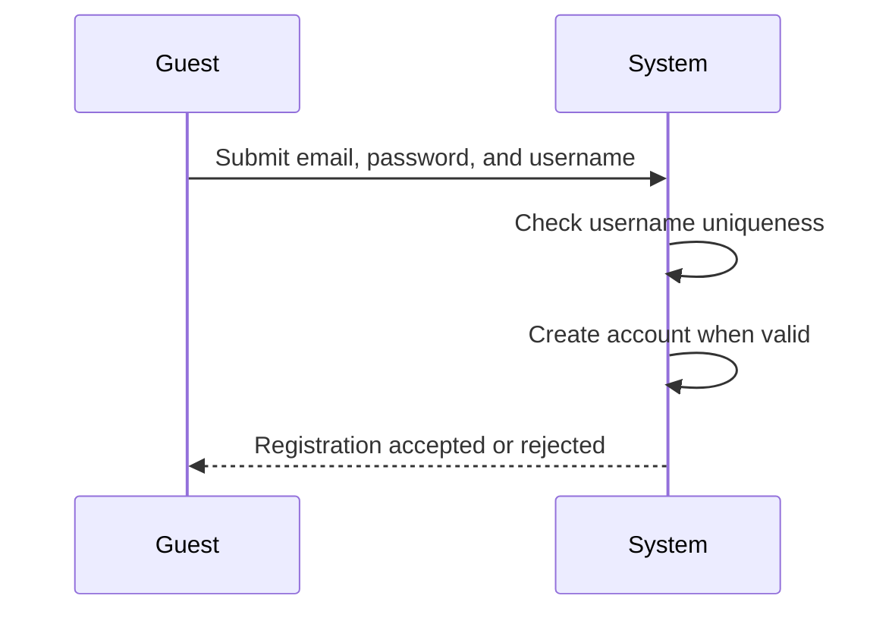

### Account Login

THE communityPlatform SHALL allow a registered user to log in by providing an email address and password.

WHEN the submitted email address and password match an existing account, THE communityPlatform SHALL sign the user in.

IF the submitted email address and password do not match an existing account, THEN THE communityPlatform SHALL reject the login attempt.

WHEN a user is signed in, THE communityPlatform SHALL treat that user as logged in for operations that require member access.

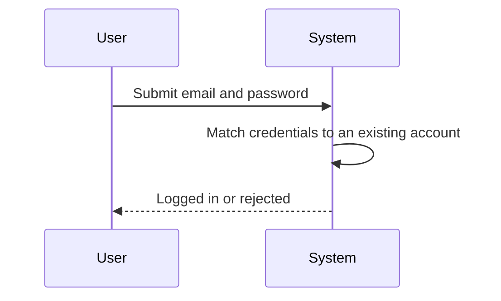

### Password Change

THE communityPlatform SHALL allow a logged-in user to change the password of that user's own account.

WHEN a logged-in user changes the password successfully, THE communityPlatform SHALL keep the same account identity and username for that account.

IF a user is not logged in, THEN THE communityPlatform SHALL not allow that user to perform the password change operation.

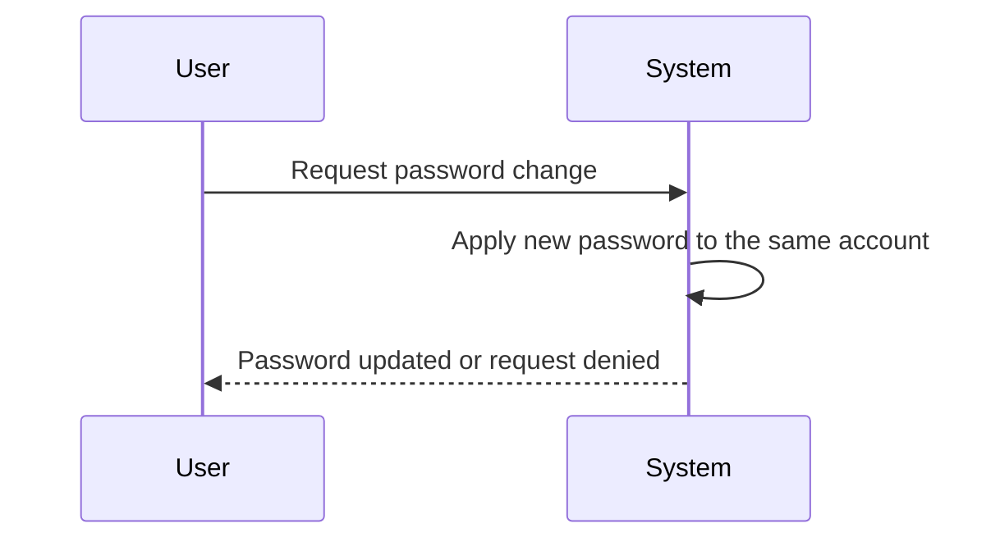

### Account Deletion

THE communityPlatform SHALL allow a logged-in user to permanently delete that user's own account.

WHEN a user deletes an account, THE communityPlatform SHALL remove that user account from the platform.

WHEN a user deletes an account, THE communityPlatform SHALL also remove all posts created by that user.

WHEN a user deletes an account, THE communityPlatform SHALL also remove all comments written by that user.

WHEN account deletion is completed, THE communityPlatform SHALL end the deleted account's ability to access member-only actions.

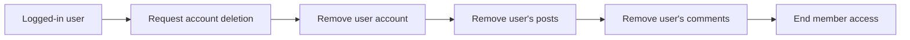

### Logged-in Access to Member Features

WHILE a user is logged in, THE communityPlatform SHALL allow access to features that require an account.

IF a user is not logged in, THEN THE communityPlatform SHALL not provide access to member-only actions.

WHEN a user is logged in, THE communityPlatform SHALL allow use of the home feed.

WHEN a user is logged in, THE communityPlatform SHALL allow participation in community actions that require an account.

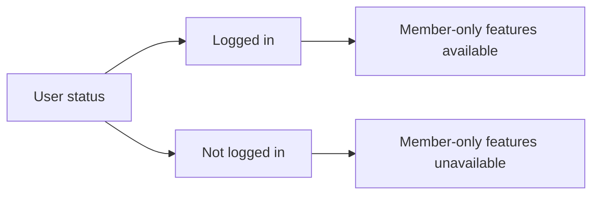

## Profile Operations

Each user has a profile that presents their display name, bio text, and avatar image. Users can edit their own profile information to keep their public identity up to date. Any visitor can open another user's profile page to see that user's public details. A profile page must show the user's display name, bio, avatar, total karma score, posts they have created, and comments they have written. The profile helps other users understand who created content across the platform. Users may view their own profile in the same way others see it, with the addition of editing their own information. The system must not allow one user to edit another user's profile. If a user has not added much profile information, the profile still remains viewable with whatever public details are available.

### Public Profile Viewing

THE communityPlatform SHALL provide a public profile page for each user account that remains available for viewing by guests and members while the account exists.

THE communityPlatform SHALL show the user's display name on the public profile page.

THE communityPlatform SHALL show the user's bio text on the public profile page.

THE communityPlatform SHALL show the user's avatar image on the public profile page.

THE communityPlatform SHALL allow a user to open their own profile page.

THE communityPlatform SHALL allow a user to open any other user's profile page.

WHEN profile information is not fully provided, THE communityPlatform SHALL display the profile page with the available public profile details.

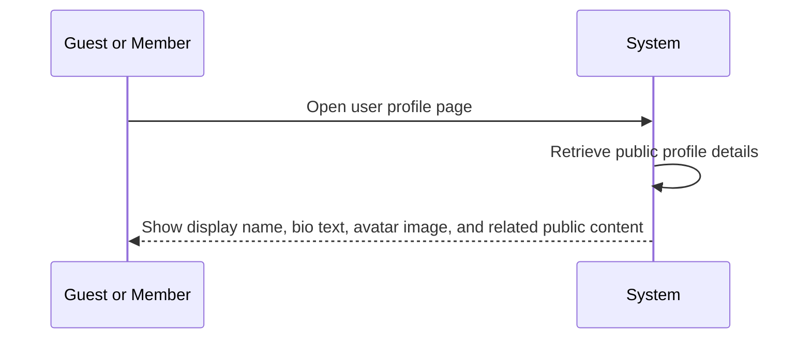

### Profile Editing

THE communityPlatform SHALL allow a signed-in user to edit their own display name.

THE communityPlatform SHALL allow a signed-in user to edit their own bio text.

THE communityPlatform SHALL allow a signed-in user to edit their own avatar image.

WHEN a user saves profile changes, THE communityPlatform SHALL update the user's public profile page to reflect the changed display name, bio text, and avatar image.

WHEN a user views their own profile page, THE communityPlatform SHALL present the same public profile information that other viewers can see, with the ability for that user to edit their own profile details.

IF a user attempts to edit another user's profile, THEN THE communityPlatform SHALL reject the edit request.

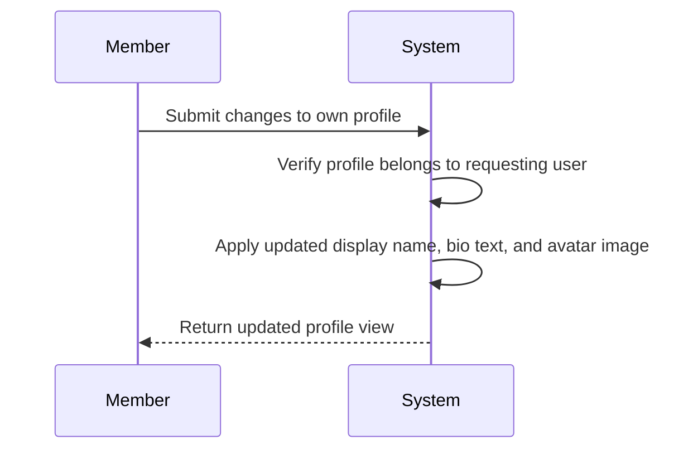

### Profile Activity and Karma Display

THE communityPlatform SHALL show the user's total karma score on the public profile page.

THE communityPlatform SHALL show a list of all posts created by the user on the public profile page.

THE communityPlatform SHALL show a list of all comments written by the user on the public profile page.

WHEN a viewer opens a user's profile page, THE communityPlatform SHALL present the user's authored posts and written comments as part of that profile view.

WHEN a user's karma changes because of voting on the user's posts or comments, THE communityPlatform SHALL reflect the updated total karma score on the user's profile page.

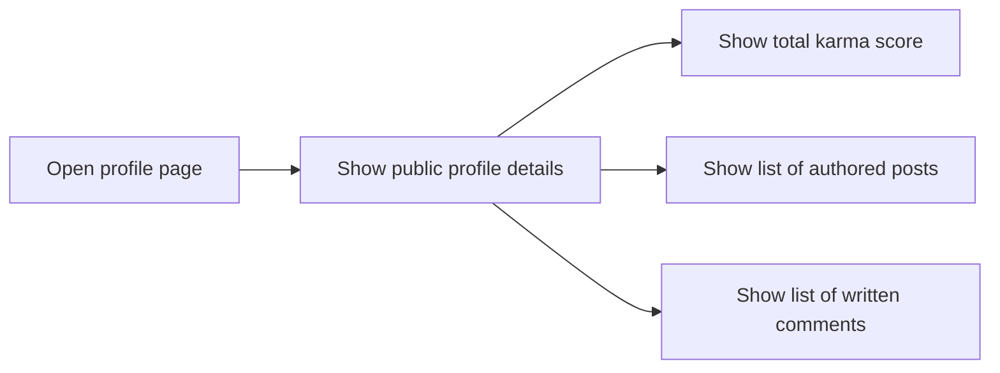

## Community Operations

Any registered user can create a community by providing a unique name, description text, and icon image. The user who creates the community automatically becomes its owner and holds the highest authority in that community. Users can browse a list of all communities across the platform. Users can search for communities by name to find specific communities more quickly. Each community listing and community view should show the current subscriber count so users can understand its size. Community information gives users enough context to decide whether they want to subscribe and participate. The system must prevent creation of a community when the chosen community name is already in use. Community browsing and searching are available for discovery, even before a user decides to join.

### Community Creation

THE communityPlatform SHALL allow any member to create a community.

THE communityPlatform SHALL require the member creating a community to provide a community name.

THE communityPlatform SHALL allow the member creating a community to provide description text for the community.

THE communityPlatform SHALL allow the member creating a community to provide an icon image for the community.

WHEN a member successfully creates a community, THE communityPlatform SHALL create the community using the provided name, description text, and icon image.

WHEN a community is successfully created, THE communityPlatform SHALL make the creating member the owner of that community.

WHEN a community is successfully created, THE communityPlatform SHALL make that community available for browsing and search.

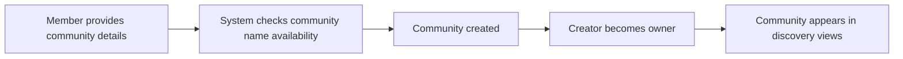

### Community Discovery and Listing

THE communityPlatform SHALL allow guests to browse all communities in a platform-wide list.

THE communityPlatform SHALL allow members to browse all communities in a platform-wide list.

THE communityPlatform SHALL present each community in the browse list with enough identifying information for discovery, including its name, description text, and subscriber count.

THE communityPlatform SHALL show the current subscriber count for each community in community listings.

THE communityPlatform SHALL allow community discovery before joining.

WHEN a user views a community before subscribing, THE communityPlatform SHALL show the community details needed to help that user decide whether to subscribe and participate.

WHEN communities exist on the platform, THE communityPlatform SHALL include them in the browse experience for discovery.

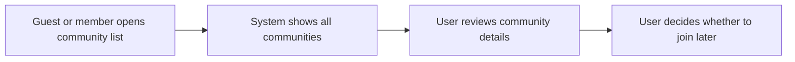

### Community Search by Name

THE communityPlatform SHALL allow guests to search for communities by name.

THE communityPlatform SHALL allow members to search for communities by name.

WHEN a user enters a community name search, THE communityPlatform SHALL return communities whose names match the search.

WHEN search results are shown, THE communityPlatform SHALL display the community name and subscriber count for each matching community.

WHEN search results are shown, THE communityPlatform SHALL support discovery before joining by allowing users to review matching communities without subscribing.

WHEN a user selects a community from search results, THE communityPlatform SHALL allow the user to view that community for further evaluation.

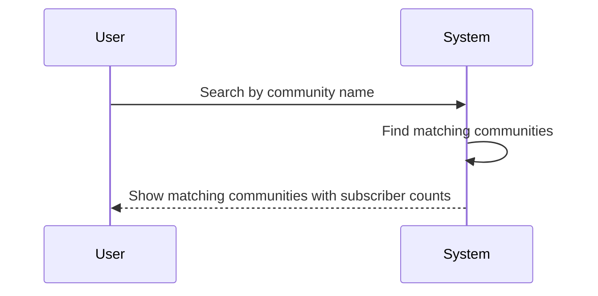

### Community Name Uniqueness During Creation

THE communityPlatform SHALL treat the community name as unique across communities.

WHEN a member attempts to create a community with a name that is not already in use, THE communityPlatform SHALL allow the creation flow to continue.

IF a member attempts to create a community with a name that is already in use, THEN THE communityPlatform SHALL reject the creation request.

IF a community creation request is rejected because the name is already in use, THEN THE communityPlatform SHALL keep the existing community unchanged.

IF a community creation request is rejected because the name is already in use, THEN THE communityPlatform SHALL require the member to choose a different community name before creation can succeed.

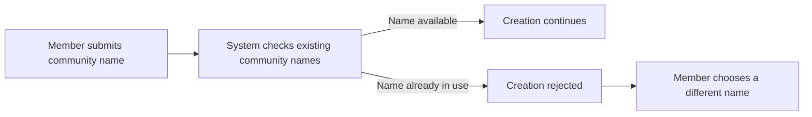

## Subscription Operations

Users can subscribe to any community they want to follow. Users can also unsubscribe from a community when they no longer want it included in their subscriptions. Each user can view a list of all communities they are currently subscribed to. Subscriptions determine which communities contribute posts to the user's home feed. A subscription is also required before a user can create a post in that community. This means joining a community is not only a follow action but also a participation requirement for posting. Users who are not subscribed may still browse and read a community's content if the community is viewable. The system must stop post creation attempts in a community when the user is not subscribed there.

### Subscribe to Community

WHEN a member chooses to follow a community, THE communityPlatform SHALL create a subscription between the member and that community.

WHEN a member subscribes to a community, THE communityPlatform SHALL include that community in the member's followed communities.

WHEN a member subscribes to a community, THE communityPlatform SHALL increase the displayed subscriber count for that community.

WHEN a member subscribes to a community, THE communityPlatform SHALL make that subscription available for use by other subscription-dependent operations defined in this document.

THE communityPlatform SHALL allow a member to subscribe to any community the member wants to follow.

WHEN a subscription is successfully created, THE communityPlatform SHALL treat the member as a participant in that community for posting purposes.

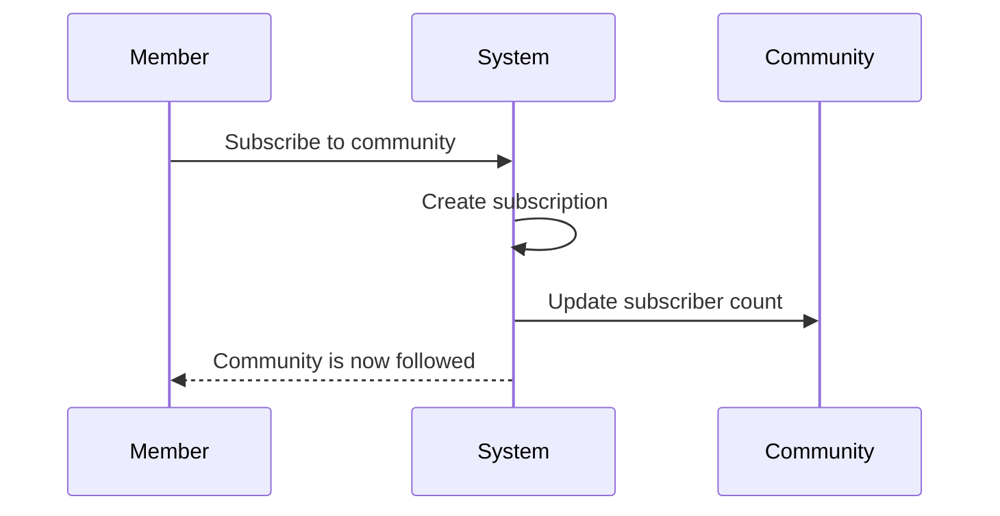

### Unsubscribe from Community

WHEN a member chooses to stop following a community, THE communityPlatform SHALL remove the subscription between the member and that community.

WHEN a member unsubscribes from a community, THE communityPlatform SHALL remove that community from the member's followed communities.

WHEN a member unsubscribes from a community, THE communityPlatform SHALL decrease the displayed subscriber count for that community.

WHEN a subscription is removed, THE communityPlatform SHALL stop treating the member as subscribed for subscription-dependent operations.

THE communityPlatform SHALL allow a member to unsubscribe from a community the member no longer wants to follow.

WHEN a member unsubscribes from a community, THE communityPlatform SHALL preserve the member's ability to browse and read that community's content, subject to the viewing behavior defined for community feeds.

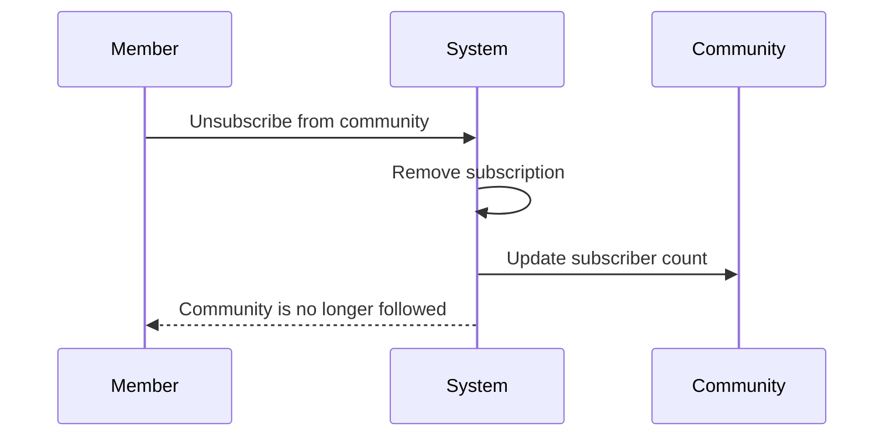

### List Subscribed Communities

WHEN a member requests the communities they follow, THE communityPlatform SHALL show a list of all communities the member is currently subscribed to.

THE communityPlatform SHALL use the member's active subscriptions as the source for this list.

WHEN showing the subscribed communities list, THE communityPlatform SHALL present each subscribed community as a community the member follows.

WHEN a member subscribes to a new community, THE communityPlatform SHALL include that community in the member's subscribed communities list.

WHEN a member unsubscribes from a community, THE communityPlatform SHALL remove that community from the member's subscribed communities list.

THE communityPlatform SHALL allow a member to review followed communities in order to manage where home feed content comes from.

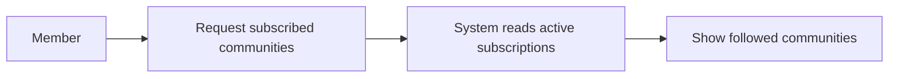

### Subscription-Based Home Feed

WHEN a logged-in member views the home feed, THE communityPlatform SHALL show posts only from communities the member is subscribed to.

THE communityPlatform SHALL use the member's active subscriptions to determine which communities contribute posts to the home feed.

WHEN a member subscribes to a community, THE communityPlatform SHALL make posts from that community eligible to appear in the member's home feed.

WHEN a member unsubscribes from a community, THE communityPlatform SHALL stop using that community as a source for the member's home feed.

THE communityPlatform SHALL make the home feed available only to logged-in members.

WHEN a member follows communities of interest, THE communityPlatform SHALL reflect those choices in the set of posts shown in the home feed.

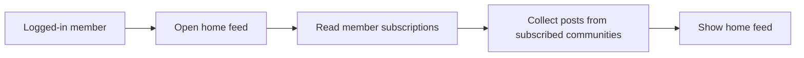

### Subscription Required for Posting

WHILE a member is subscribed to a community, THE communityPlatform SHALL allow the member to create a post in that community.

IF a member is not subscribed to a community, THEN THE communityPlatform SHALL prevent the member from creating a post in that community.

THE communityPlatform SHALL treat subscription as a participation requirement for posting in a community.

WHEN determining whether a member may create a post in a community, THE communityPlatform SHALL check whether the member has an active subscription to that community.

WHEN a member subscribes to a community, THE communityPlatform SHALL recognize that member as eligible to post in that community.

WHEN a member unsubscribes from a community, THE communityPlatform SHALL no longer recognize that member as eligible to post there based on subscription.

THE communityPlatform SHALL allow members who are not subscribed to continue reading community content without granting posting participation.

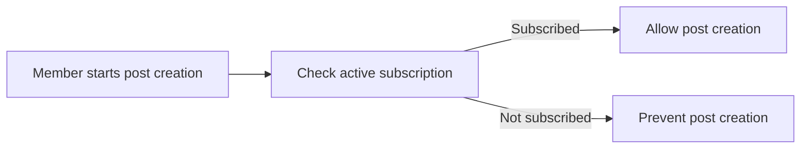

## Post Operations

Subscribed users can create posts within a community they belong to. Every post must have a title, and each post must be created as exactly one of three types: text, link, or image. A text post contains written content, a link post contains a URL, and an image post contains an uploaded image. Users can edit their own posts when they need to correct or update them. Users can delete their own posts when they no longer want them published. When viewing a single post, people can see its title, full content, author, community, vote score, comment count, and when it was posted. Posts can also appear in the home feed, popular feed, and community feed. All feeds support hot, new, top, and controversial sorting, and top includes time filters for today, this week, this month, this year, and all time. Feed views are paginated and show post list details such as author username, community name, vote score, comment count, time since posted, a short preview for text posts, an image thumbnail for image posts, and the URL domain for link posts. The system must reject post creation when a required title is missing or when the user tries to post in a community they are not subscribed to.

### Post Creation

THE communityPlatform SHALL allow a member to create a post in a community the member is subscribed to.

THE communityPlatform SHALL require every post to include a title.

THE communityPlatform SHALL require each new post to be created as exactly one of the following post types: text post, link post, or image post.

WHEN a member creates a text post, THE communityPlatform SHALL accept written content for the post body.

WHEN a member creates a link post, THE communityPlatform SHALL accept a URL as the post content.

WHEN a member creates an image post, THE communityPlatform SHALL accept an uploaded image as the post content.

WHEN a post is created, THE communityPlatform SHALL associate the post with the creating member and the selected community.

WHEN a post is created successfully, THE communityPlatform SHALL make the post available in the single post view and in applicable post feeds.

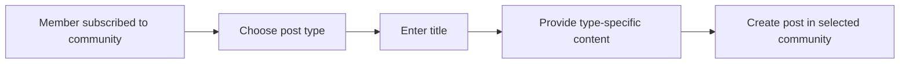

### Post Editing and Deletion

THE communityPlatform SHALL allow a member to edit a post the member created.

WHEN a member edits a post, THE communityPlatform SHALL allow the member to update the post content according to the post's existing type.

WHEN a member edits a post, THE communityPlatform SHALL preserve the post within its original community.

THE communityPlatform SHALL allow a member to delete a post the member created.

WHEN a member deletes a post, THE communityPlatform SHALL remove the post from post feeds and from direct post viewing.

WHEN a member deletes a post, THE communityPlatform SHALL also remove the post from the creating member's published post list on that member's profile.

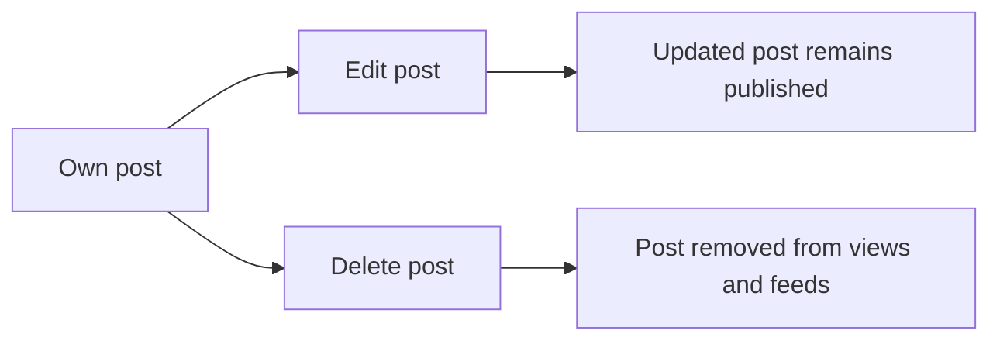

### Single Post Detail View

THE communityPlatform SHALL provide a single post view for an individual post.

WHEN a person views a single post, THE communityPlatform SHALL display the post title.

WHEN a person views a single post, THE communityPlatform SHALL display the full post content.

WHEN a person views a single post, THE communityPlatform SHALL display the post author.

WHEN a person views a single post, THE communityPlatform SHALL display the community where the post was published.

WHEN a person views a single post, THE communityPlatform SHALL display the post vote score.

WHEN a person views a single post, THE communityPlatform SHALL display the post comment count.

WHEN a person views a single post, THE communityPlatform SHALL display when the post was posted.

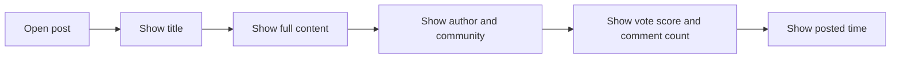

### Post Feeds and List Presentation

THE communityPlatform SHALL provide a home feed that shows posts only from communities the member is subscribed to.

THE communityPlatform SHALL make the home feed available only to logged-in users.

THE communityPlatform SHALL provide a popular feed that shows posts from all communities across the platform.

THE communityPlatform SHALL make the popular feed available to both logged-in users and guests.

THE communityPlatform SHALL provide a community feed that shows posts from one specific community.

THE communityPlatform SHALL make the community feed available to both logged-in users and guests.

THE communityPlatform SHALL paginate all post feeds.

WHEN any post appears in a feed, THE communityPlatform SHALL display the post title.

WHEN any post appears in a feed, THE communityPlatform SHALL display the author username.

WHEN any post appears in a feed, THE communityPlatform SHALL display the community name.

WHEN any post appears in a feed, THE communityPlatform SHALL display the vote score.

WHEN any post appears in a feed, THE communityPlatform SHALL display the comment count.

WHEN any post appears in a feed, THE communityPlatform SHALL display the time since the post was created.

WHEN a text post appears in a feed, THE communityPlatform SHALL display the first 200 characters of the text content.

WHEN an image post appears in a feed, THE communityPlatform SHALL display a thumbnail of the image.

WHEN a link post appears in a feed, THE communityPlatform SHALL display the domain name of the URL.

```mermaid
flowchart LR
    A["Select feed"] --> B["Home feed"]
    A --> C["Popular feed"]
    A --> D["Community feed"]
    B --> E["Paginated post list"]
    C --> E
    D --> E
    E --> F["Show list display details"]
```

### Post Feed Sorting

THE communityPlatform SHALL provide the following sorting options on the home feed, popular feed, and community feed: hot, new, top, and controversial.

WHEN a person selects hot sorting, THE communityPlatform SHALL present recent posts with many upvotes first.

WHEN a person selects new sorting, THE communityPlatform SHALL present the most recently created posts first.

WHEN a person selects top sorting, THE communityPlatform SHALL present posts with the highest vote score first.

WHEN a person selects top sorting, THE communityPlatform SHALL allow the person to filter results by today, this week, this month, this year, or all time.

WHEN a person selects controversial sorting, THE communityPlatform SHALL present posts with many votes and a score close to zero first.

```mermaid
flowchart LR
    A["Choose feed"] --> B["Choose sort option"]
    B --> C["Hot"]
    B --> D["New"]
    B --> E["Top"]
    B --> F["Controversial"]
    E --> G["Apply time filter"]
```

## Comment Operations

Users can write comments on any post to join the discussion. Users can reply to any comment, and replies can continue without any depth limit. Each comment displays the author, content, vote score, time since posted, and its nested replies. Users can edit their own comments after posting. Users can delete their own comments when they no longer want them shown. Comments on a post can be ordered by best, new, or controversial so readers can choose how to follow the conversation. Comment threads are part of the single post view and help structure discussion around specific points. The system must preserve the parent-child discussion structure so replies stay attached to the correct comment chain. If a user is banned from a community, they cannot create comments in that community even though they may still view the content.

### Comment Creation on a Post

WHEN a member chooses to add a comment on a post, THE communityPlatform SHALL create a new comment attached to that post.

THE communityPlatform SHALL allow a member to write comment content when commenting on a post.

WHEN a comment is created, THE communityPlatform SHALL associate the comment with the member who wrote it.

WHEN a comment is created, THE communityPlatform SHALL include the new comment in the discussion for the related post.

WHEN a member views the post after creating a comment, THE communityPlatform SHALL show the new comment within that post's comment thread.

WHEN a banned member attempts to add a comment in a community where the ban applies, THEN THE communityPlatform SHALL prevent comment creation for that community.

WHEN a guest attempts to add a comment on a post, THEN THE communityPlatform SHALL reject the comment operation as defined in [04-business-rules.md].

WHEN a member attempts to comment on an unavailable post, THEN THE communityPlatform SHALL reject the comment operation as defined in [04-business-rules.md].

```mermaid
sequenceDiagram
    participant M as Member
    participant S as System
    participant P as Post Discussion
    M->>S: Submit comment on post
    S->>S: Validate member can comment
    S->>P: Attach comment to post
    S-->>M: Show comment in thread
```

### Replies and Nested Comment Threads

WHEN a member chooses to reply to an existing comment, THE communityPlatform SHALL create the new comment as a reply to that comment.

THE communityPlatform SHALL allow replies to any existing comment in the post discussion.

WHEN a reply is created, THE communityPlatform SHALL preserve the parent-child relationship between the reply and the comment it answers.

WHEN a reply is added to a comment that is already a reply, THE communityPlatform SHALL support additional reply levels without depth limit.

THE communityPlatform SHALL maintain the full nested reply chain so that each reply remains attached to the correct branch of the discussion.

WHEN members view a post discussion, THE communityPlatform SHALL present replies beneath their parent comment.

WHEN members continue replying within the same branch, THE communityPlatform SHALL keep the sequence within that branch distinct from other branches on the same post.

WHEN a member attempts to reply to an unavailable comment, THEN THE communityPlatform SHALL reject the reply operation as defined in [04-business-rules.md].

```mermaid
flowchart LR
    A["Post Comment"] --> B["Reply"]
    B --> C["Reply to Reply"]
    C --> D["Further Reply"]
```

### Comment Editing and Deletion

WHEN a member chooses to edit a comment they authored, THE communityPlatform SHALL allow that member to update the comment content.

WHEN a member saves changes to their own comment, THE communityPlatform SHALL show the updated content in the post discussion.

WHEN a member chooses to delete a comment they authored, THE communityPlatform SHALL remove that comment from normal discussion display.

WHEN a member deletes their own comment, THE communityPlatform SHALL apply the deletion to the comment within its original post discussion.

WHEN a member views the post after editing their own comment, THE communityPlatform SHALL display the revised comment content.

WHEN a member views the post after deleting their own comment, THE communityPlatform SHALL no longer show that comment as active discussion content.

WHEN a member attempts to edit or delete a comment they do not own, THEN THE communityPlatform SHALL handle access according to [01-actors-and-auth.md] and rejection behavior according to [04-business-rules.md].

```mermaid
flowchart LR
    A["Authored Comment"] --> B["Edit Comment"]
    A --> C["Delete Comment"]
    B --> D["Updated Comment Shown"]
    C --> E["Comment Removed From Active Discussion"]
```

### Comment Display Within a Post

WHEN a member or guest views a post, THE communityPlatform SHALL display each comment's author.

WHEN a member or guest views a post, THE communityPlatform SHALL display each comment's content.

WHEN a member or guest views a post, THE communityPlatform SHALL display each comment's vote score.

WHEN a member or guest views a post, THE communityPlatform SHALL display the time since each comment was posted.

WHEN a member or guest views a post, THE communityPlatform SHALL display nested replies together with their parent comments as part of the same discussion.

THE communityPlatform SHALL present comments as part of the single post view so readers can follow the discussion around that post.

WHEN a post contains multiple comment branches, THE communityPlatform SHALL display each branch in a way that preserves which replies belong to which parent comment.

```mermaid
flowchart LR
    A["Single Post View"] --> B["Comment Author"]
    A --> C["Comment Content"]
    A --> D["Comment Vote Score"]
    A --> E["Time Since Posted"]
    A --> F["Nested Replies"]
```

### Comment Sorting in Post Discussions

WHEN a member or guest views comments on a post, THE communityPlatform SHALL provide sorting by best.

WHEN best sorting is selected, THE communityPlatform SHALL order comments so higher-scoring comments appear first.

WHEN a member or guest views comments on a post, THE communityPlatform SHALL provide sorting by new.

WHEN new sorting is selected, THE communityPlatform SHALL order comments so the most recently posted comments appear first.

WHEN a member or guest views comments on a post, THE communityPlatform SHALL provide sorting by controversial.

WHEN controversial sorting is selected, THE communityPlatform SHALL order comments so comments with many votes and a score close to zero appear first.

WHEN a sorting option is changed, THE communityPlatform SHALL refresh the displayed comment order for that post discussion.

WHEN comments are reordered by a selected sort, THE communityPlatform SHALL preserve the comment thread structure defined in [Replies and Nested Comment Threads].

```mermaid
flowchart LR
    A["Post Discussion"] --> B["Best"]
    A --> C["New"]
    A --> D["Controversial"]
    B --> E["Reordered Comments"]
    C --> E
    D --> E
```

## PostVote Operations

Users can upvote or downvote any post to express approval or disapproval. Each user may have only one active vote on a given post at a time. A user can change an existing vote from upvote to downvote or from downvote to upvote. A user can also remove their vote entirely. The visible vote score for a post is calculated as total upvotes minus total downvotes. Post voting also changes the post author's karma by one point in the corresponding direction. If a vote is removed, the author's karma adjusts to reflect that removal. Voting gives readers a direct way to influence both post ranking and the author's overall reputation. The system must prevent duplicate active votes from the same user on the same post.

### Cast an Upvote on a Post

WHEN a member chooses to upvote a post, THE communityPlatform SHALL record an upvote for that member on that post.

WHEN an upvote is recorded on a post that previously had no active vote from that member, THE communityPlatform SHALL add 1 to the post's vote score.

WHEN an upvote is recorded on a post that previously had no active vote from that member, THE communityPlatform SHALL add 1 to the post author's karma.

THE communityPlatform SHALL treat an upvote as the member's current active post vote until the member changes or removes that vote.

```mermaid
sequenceDiagram
    participant M as Member
    participant S as System
    participant P as Post
    participant A as Author
    M->>S: Upvote post
    S->>P: Record active upvote
    S->>P: Increase vote score by 1
    S->>A: Increase karma by 1
    S-->>M: Show updated post vote state
```

### Cast a Downvote on a Post

WHEN a member chooses to downvote a post, THE communityPlatform SHALL record a downvote for that member on that post.

WHEN a downvote is recorded on a post that previously had no active vote from that member, THE communityPlatform SHALL subtract 1 from the post's vote score.

WHEN a downvote is recorded on a post that previously had no active vote from that member, THE communityPlatform SHALL subtract 1 from the post author's karma.

THE communityPlatform SHALL treat a downvote as the member's current active post vote until the member changes or removes that vote.

```mermaid
sequenceDiagram
    participant M as Member
    participant S as System
    participant P as Post
    participant A as Author
    M->>S: Downvote post
    S->>P: Record active downvote
    S->>P: Decrease vote score by 1
    S->>A: Decrease karma by 1
    S-->>M: Show updated post vote state
```

### Maintain One Active Vote Per Member Per Post

THE communityPlatform SHALL allow only one active vote per member on a given post at a time.

WHEN a member already has an active vote on a post, THE communityPlatform SHALL keep that post limited to that single active vote for that member.

THE communityPlatform SHALL prevent duplicate active post votes from the same member on the same post.

WHEN the member's active vote exists on a post, THE communityPlatform SHALL preserve one current vote state for that member and post combination.

```mermaid
flowchart LR
    A["No active vote"] --> B["Upvote active"]
    A --> C["Downvote active"]
    B --> D["One active vote only"]
    C --> D
```

### Change the Direction of a Post Vote

WHEN a member changes a post vote from upvote to downvote, THE communityPlatform SHALL replace the existing upvote with a downvote.

WHEN a member changes a post vote from upvote to downvote, THE communityPlatform SHALL decrease the post's vote score by 2 to reflect the removed upvote and applied downvote.

WHEN a member changes a post vote from upvote to downvote, THE communityPlatform SHALL decrease the post author's karma by 2 to reflect the removed upvote effect and applied downvote effect.

WHEN a member changes a post vote from downvote to upvote, THE communityPlatform SHALL replace the existing downvote with an upvote.

WHEN a member changes a post vote from downvote to upvote, THE communityPlatform SHALL increase the post's vote score by 2 to reflect the removed downvote and applied upvote.

WHEN a member changes a post vote from downvote to upvote, THE communityPlatform SHALL increase the post author's karma by 2 to reflect the removed downvote effect and applied upvote effect.

```mermaid
flowchart LR
    A["Upvote active"] -->|"Change to downvote"| B["Downvote active"]
    B -->|"Change to upvote"| A
```

### Remove a Post Vote

WHEN a member removes an active upvote from a post, THE communityPlatform SHALL clear that member's active vote on that post.

WHEN a member removes an active upvote from a post, THE communityPlatform SHALL subtract 1 from the post's vote score.

WHEN a member removes an active upvote from a post, THE communityPlatform SHALL subtract 1 from the post author's karma.

WHEN a member removes an active downvote from a post, THE communityPlatform SHALL clear that member's active vote on that post.

WHEN a member removes an active downvote from a post, THE communityPlatform SHALL add 1 to the post's vote score.

WHEN a member removes an active downvote from a post, THE communityPlatform SHALL add 1 to the post author's karma.

THE communityPlatform SHALL return the member's post vote state to no active vote after vote removal.

```mermaid
flowchart LR
    A["Upvote active"] -->|"Remove vote"| C["No active vote"]
    B["Downvote active"] -->|"Remove vote"| C
```

### Calculate and Present Post Vote Effects

THE communityPlatform SHALL calculate a post's vote score as total upvotes minus total downvotes.

WHEN an upvote is added, THE communityPlatform SHALL reflect that change in the post's visible vote score.

WHEN a downvote is added, THE communityPlatform SHALL reflect that change in the post's visible vote score.

WHEN a vote direction is changed, THE communityPlatform SHALL recalculate the post's visible vote score from the resulting active votes.

WHEN a vote is removed, THE communityPlatform SHALL recalculate the post's visible vote score from the remaining active votes.

THE communityPlatform SHALL apply post vote effects to the post author's single karma score in parallel with the post vote change.

WHEN a vote is removed, THE communityPlatform SHALL adjust the post author's karma to reverse the effect of the removed vote.

```mermaid
flowchart LR
    A["Active post votes"] --> B["Total upvotes"]
    A --> C["Total downvotes"]
    B --> D["Vote score"]
    C --> D
    A --> E["Author karma effect"]
```

## CommentVote Operations

Users can upvote or downvote comments using the same voting rules that apply to posts. Each user may have only one active vote on a given comment at a time. Users can switch their vote direction later if their opinion changes. Users can also remove a comment vote completely. A comment's vote score reflects total upvotes minus total downvotes. Comment voting changes the comment author's karma by one point upward or downward based on the vote. Removing a vote causes the author's karma to adjust again so the single karma score stays accurate. Comment votes help surface useful replies and influence how discussions are perceived by readers. The system must prevent more than one active vote from the same user on the same comment.

### Cast an Upvote on a Comment

WHEN a member chooses to upvote a comment, THE communityPlatform SHALL record an upvote for that comment by that member.

WHEN a member upvotes a comment that has no active vote from that member, THE communityPlatform SHALL add one to the comment vote score.

WHEN a member upvotes a comment that has no active vote from that member, THE communityPlatform SHALL increase the comment author's karma by one.

THE communityPlatform SHALL treat the recorded upvote as the member's single active vote on that comment.

```mermaid
sequenceDiagram
    participant M as Member
    participant S as System
    participant C as Comment
    participant A as "Comment Author"
    M->>S: Upvote comment
    S->>C: Record upvote
    S->>C: Add 1 to vote score
    S->>A: Add 1 to karma
    S-->>M: Upvote applied
```

### Cast a Downvote on a Comment

WHEN a member chooses to downvote a comment, THE communityPlatform SHALL record a downvote for that comment by that member.

WHEN a member downvotes a comment that has no active vote from that member, THE communityPlatform SHALL subtract one from the comment vote score.

WHEN a member downvotes a comment that has no active vote from that member, THE communityPlatform SHALL decrease the comment author's karma by one.

THE communityPlatform SHALL treat the recorded downvote as the member's single active vote on that comment.

```mermaid
sequenceDiagram
    participant M as Member
    participant S as System
    participant C as Comment
    participant A as "Comment Author"
    M->>S: Downvote comment
    S->>C: Record downvote
    S->>C: Subtract 1 from vote score
    S->>A: Subtract 1 from karma
    S-->>M: Downvote applied
```

### Maintain One Active Vote Per User Per Comment

THE communityPlatform SHALL allow each member to have only one active vote on a given comment at a time.

WHILE a member has an active vote on a comment, THE communityPlatform SHALL prevent the creation of an additional active vote by that same member on that same comment.

THE communityPlatform SHALL identify a member's active vote on a comment as either an upvote or a downvote, but not both at the same time.

WHEN the communityPlatform presents a comment's voting state to a member, THE communityPlatform SHALL reflect whether that member currently has an upvote, a downvote, or no active vote on that comment.

```mermaid
flowchart LR
    A["No active vote"] --> B["Upvote active"]
    A --> C["Downvote active"]
    B --> D["Single active vote enforced"]
    C --> D
```

### Change Comment Vote Direction

WHEN a member changes a comment vote from upvote to downvote, THE communityPlatform SHALL replace the existing upvote with a downvote for that member on that comment.

WHEN a member changes a comment vote from downvote to upvote, THE communityPlatform SHALL replace the existing downvote with an upvote for that member on that comment.

WHEN a member changes a comment vote from upvote to downvote, THE communityPlatform SHALL recalculate the comment vote score to reflect removal of the upvote and application of the downvote.

WHEN a member changes a comment vote from downvote to upvote, THE communityPlatform SHALL recalculate the comment vote score to reflect removal of the downvote and application of the upvote.

WHEN a member changes a comment vote from upvote to downvote, THE communityPlatform SHALL adjust the comment author's karma to reflect removal of the previous positive vote and application of the new negative vote.

WHEN a member changes a comment vote from downvote to upvote, THE communityPlatform SHALL adjust the comment author's karma to reflect removal of the previous negative vote and application of the new positive vote.

```mermaid
flowchart LR
    A["Upvote active"] --> B["Downvote active"]
    C["Downvote active"] --> D["Upvote active"]
```

### Remove a Comment Vote

WHEN a member removes an active vote from a comment, THE communityPlatform SHALL clear that member's vote from the comment.

WHEN a member removes an upvote from a comment, THE communityPlatform SHALL subtract one from the comment vote score.

WHEN a member removes a downvote from a comment, THE communityPlatform SHALL add one to the comment vote score.

WHEN a member removes an upvote from a comment, THE communityPlatform SHALL decrease the comment author's karma by one to reverse the prior karma increase.

WHEN a member removes a downvote from a comment, THE communityPlatform SHALL increase the comment author's karma by one to reverse the prior karma decrease.

WHEN a member removes an active vote from a comment, THE communityPlatform SHALL leave the member with no active vote on that comment.

```mermaid
flowchart LR
    A["Upvote active"] --> B["No active vote"]
    C["Downvote active"] --> B
```

### Calculate Comment Vote Score and Karma Effects

THE communityPlatform SHALL calculate a comment's vote score as total upvotes minus total downvotes.

WHEN an upvote is added to a comment, THE communityPlatform SHALL increase the vote score by one.

WHEN a downvote is added to a comment, THE communityPlatform SHALL decrease the vote score by one.

WHEN an upvote on a comment is removed, THE communityPlatform SHALL adjust the vote score as defined in [Remove a Comment Vote].

WHEN a downvote on a comment is removed, THE communityPlatform SHALL adjust the vote score as defined in [Remove a Comment Vote].

WHEN a comment receives an upvote, THE communityPlatform SHALL increase the comment author's single karma score by one.

WHEN a comment receives a downvote, THE communityPlatform SHALL decrease the comment author's single karma score by one.

WHEN a comment vote is removed or changed, THE communityPlatform SHALL update the comment author's single karma score so it remains accurate.

THE communityPlatform SHALL allow the comment author's single karma score to increase or decrease based on the net effect of votes on that author's comments.

```mermaid
flowchart LR
    A["Upvote"] --> B["Score +1"]
    A --> C["Author karma +1"]
    D["Downvote"] --> E["Score -1"]
    D --> F["Author karma -1"]
    G["Vote removed"] --> H["Reverse prior score effect"]
    G --> I["Reverse prior karma effect"]
```

## Report Operations

Users can report any post or comment that they believe needs moderator review. A report must include a written reason so moderators understand the concern being raised. Moderators can view all reports for their community in a report list. Each report shows the reported content, who submitted the report, and the stated reason. Moderators can approve a report, which deletes the reported post or comment. Moderators can also dismiss a report when they decide the content should remain visible. Dismissed reports are removed from the report list so moderators can focus on unresolved items. Reporting creates a structured path for community members to flag content without directly deleting it themselves. The system must not accept a report unless the user provides a reason.

### Report a Post

- WHEN a member chooses to report a post, THE communityPlatform SHALL create a report for that post and submit it for moderator review in the related community.
- WHEN a member submits a report for a post, THE communityPlatform SHALL associate the report with the selected post.
- WHEN a member submits a report for a post, THE communityPlatform SHALL associate the report with the member who submitted it.
- WHEN a post is reported, THE communityPlatform SHALL route the report to the report review list of the community where the post was published.
- THE communityPlatform SHALL allow a member to report any post for moderator review.

```mermaid
sequenceDiagram
    participant M as Member
    participant S as System
    participant C as Community Moderation
    M->>S: Report post with reason
    S->>S: Create report for selected post
    S->>C: Add report to related community review list
    S-->>M: Report submitted
```

### Report a Comment

- WHEN a member chooses to report a comment, THE communityPlatform SHALL create a report for that comment and submit it for moderator review in the related community.
- WHEN a member submits a report for a comment, THE communityPlatform SHALL associate the report with the selected comment.
- WHEN a member submits a report for a comment, THE communityPlatform SHALL associate the report with the member who submitted it.
- WHEN a comment is reported, THE communityPlatform SHALL route the report to the report review list of the community of the post that contains the comment.
- THE communityPlatform SHALL allow a member to report any comment for moderator review.

```mermaid
sequenceDiagram
    participant M as Member
    participant S as System
    participant C as Community Moderation
    M->>S: Report comment with reason
    S->>S: Create report for selected comment
    S->>C: Add report to related community review list
    S-->>M: Report submitted
```

### Report Submission Reason

- WHEN a member submits a report, THE communityPlatform SHALL require the member to provide a written reason.
- IF a report reason is not provided, THEN THE communityPlatform SHALL reject the report submission.
- WHEN a report is accepted, THE communityPlatform SHALL store the stated reason as part of the report for moderator review.
- THE communityPlatform SHALL include the stated reason in the report details presented to moderators.

### Moderator Report Review List

- THE communityPlatform SHALL provide moderators with a report review list for each community they moderate.
- WHEN a moderator opens the report review list for a community, THE communityPlatform SHALL show all reports awaiting review for that community.
- WHEN a report concerns a post, THE communityPlatform SHALL include that report in the review list of the community where the post was published.
- WHEN a report concerns a comment, THE communityPlatform SHALL include that report in the review list of the community of the post that contains the comment.
- WHEN a moderator reviews reports, THE communityPlatform SHALL keep reports separated by community so moderation review is performed within the related community.

```mermaid
flowchart LR
    A["Reported post"] --> B["Community review list"]
    C["Reported comment"] --> B
    B --> D["Moderator reviews report"]
```

### Report Details Display

- WHEN a moderator views a report in a community review list, THE communityPlatform SHALL show the reported content.
- WHEN a moderator views a report in a community review list, THE communityPlatform SHALL show who submitted the report.
- WHEN a moderator views a report in a community review list, THE communityPlatform SHALL show the stated reason.
- WHEN a report targets a post, THE communityPlatform SHALL present the reported post as the reported content.
- WHEN a report targets a comment, THE communityPlatform SHALL present the reported comment as the reported content.

### Approve Report and Delete Content

- WHEN a moderator approves a report for a post, THE communityPlatform SHALL delete the reported post.
- WHEN a moderator approves a report for a comment, THE communityPlatform SHALL delete the reported comment.
- WHEN a moderator approves a report, THE communityPlatform SHALL treat the report as resolved.
- WHEN a moderator approves a report, THE communityPlatform SHALL remove the resolved report from the active review list for that community.

```mermaid
flowchart LR
    A["Report awaiting review"] --> B["Approve report"]
    B --> C["Delete reported content"]
    C --> D["Remove from active review list"]
```

### Dismiss Report and Keep Content

- WHEN a moderator dismisses a report, THE communityPlatform SHALL keep the reported post or comment visible.
- WHEN a moderator dismisses a report, THE communityPlatform SHALL treat the report as resolved without deleting the reported content.
- WHEN a moderator dismisses a report, THE communityPlatform SHALL remove that report from the report review list.
- THE communityPlatform SHALL allow moderators to dismiss a report when they decide the reported content should remain available.

```mermaid
flowchart LR
    A["Report awaiting review"] --> B["Dismiss report"]
    B --> C["Keep reported content"]
    C --> D["Remove from review list"]
```

## CommunityBan Operations

Moderators can ban users from their community when they decide those users should no longer participate there. Moderators can also remove a ban and allow the user to participate again. Moderators can view the list of banned users for their community. A banned user cannot create posts in that community. A banned user also cannot create comments in that community. Even while banned, the user can still view the community and its content. Bans are community-specific, so a restriction in one community does not imply removal from the entire platform. Ban management helps moderators control participation while still allowing public visibility of community content.

### Ban User from Community

WHEN a moderator decides that a user should no longer participate in a community, THE communityPlatform SHALL create a community ban for that user in that community.

WHEN a moderator bans a user from a community, THE communityPlatform SHALL apply the ban only within the selected community.

WHEN a moderator bans a user from a community, THE communityPlatform SHALL record that the banned user is restricted from participating in that community.

WHEN a moderator completes a ban action, THE communityPlatform SHALL keep the community visible to the banned user.

WHEN a moderator completes a ban action, THE communityPlatform SHALL keep posts and comments in that community viewable to the banned user.

WHEN a moderator attempts to ban a user for community participation control, THE communityPlatform SHALL enforce the restriction through the community ban state.

```mermaid
flowchart LR
    A["Moderator reviews user participation"] --> B["Ban user from community"]
    B --> C["Community ban becomes active"]
    C --> D["Posting blocked in community"]
    C --> E["Commenting blocked in community"]
    C --> F["Viewing remains allowed"]
```

### Unban User from Community

WHEN a moderator removes a community ban, THE communityPlatform SHALL end the participation restriction for that user in that community.

WHEN a moderator unbans a user from a community, THE communityPlatform SHALL restore the user's ability to participate in that community, subject to the permissions defined in [01-actors-and-auth.md].

WHEN a moderator unbans a user from a community, THE communityPlatform SHALL leave the user's access to other communities unchanged.

WHEN a moderator removes a ban, THE communityPlatform SHALL stop treating the user as banned in the selected community.

```mermaid
flowchart LR
    A["User is banned in community"] --> B["Moderator removes ban"]
    B --> C["Community ban ends"]
    C --> D["User may participate again in community"]
```

### View Banned Users List

WHEN a moderator views banned users for a community, THE communityPlatform SHALL present the list of users currently banned from that community.

WHEN a moderator opens the banned users list, THE communityPlatform SHALL limit the list to bans belonging to that community.

WHEN a moderator reviews the banned users list, THE communityPlatform SHALL show only users whose community ban is currently active in that community.

WHEN a moderator uses the banned users list, THE communityPlatform SHALL support ban management by showing which users are restricted from participation in that community.

```mermaid
sequenceDiagram
    participant M as Moderator
    participant S as System
    M->>S: Open banned users list for community
    S->>S: Find active bans for that community
    S-->>M: Display banned users in that community
```

### Banned User Participation Restrictions

WHILE a user is banned from a community, THE communityPlatform SHALL prevent that user from creating posts in that community.

WHILE a user is banned from a community, THE communityPlatform SHALL prevent that user from creating comments in that community.

WHILE a user is banned from a community, THE communityPlatform SHALL continue to allow that user to view the community.

WHILE a user is banned from a community, THE communityPlatform SHALL continue to allow that user to view posts and comments in that community.

WHILE a user is banned from one community, THE communityPlatform SHALL not treat the user as banned in any other community unless a separate ban exists there.

WHERE a community ban is active, THE communityPlatform SHALL use that ban as a moderator-enforced participation restriction for that community only.

```mermaid
flowchart LR
    A["User opens community"] --> B["System checks community ban"]
    B --> C["Viewing allowed"]
    B --> D["Post creation denied"]
    B --> E["Comment creation denied"]
```

## CommunityModerator Operations

The creator of a community is its owner and has the highest authority among moderators. The owner can add moderators to help manage the community. The owner can also remove moderators when needed. Moderators are allowed to add other moderators, which lets moderation responsibilities grow with the community. However, moderators cannot remove the owner. Moderators also cannot remove each other, because only the owner can remove moderators. In addition to role management, moderators can delete any post or comment within their community as part of their moderation duties. These authority rules define a clear hierarchy so community governance remains predictable. The system must enforce the owner's higher authority whenever moderator removal actions are attempted.

### Moderator Role Hierarchy

THE communityPlatform SHALL treat the community owner as the highest authority within community moderation.

THE communityPlatform SHALL recognize two community-specific moderation roles: owner and moderator.

THE communityPlatform SHALL assign the owner role to the user who created the community.

THE communityPlatform SHALL preserve the owner's higher authority over all moderators in the same community.

THE communityPlatform SHALL evaluate moderator management actions according to the owner-over-moderator hierarchy.

WHEN a moderation role decision is required in a community, THE communityPlatform SHALL apply the owner role before the moderator role.

WHILE a user holds the owner role for a community, THE communityPlatform SHALL allow that role to outrank every moderator role in that community.

```mermaid
flowchart LR
    A["Community creator"] --> B["Community owner"]
    B --> C["Highest authority"]
    B --> D["Can add moderators"]
    B --> E["Can remove moderators"]
    F["Moderator"] --> G["Can add moderators"]
    F --> H["Cannot remove owner"]
    F --> I["Cannot remove moderators"]
```


### Add Moderators to a Community

WHEN the owner selects a community member to become a moderator, THE communityPlatform SHALL add that user as a moderator for that community.

WHEN a moderator selects a community member to become a moderator, THE communityPlatform SHALL add that user as a moderator for that community.

THE communityPlatform SHALL allow the owner to expand the moderation team for the community.

THE communityPlatform SHALL allow moderators to add other moderators for the same community.

WHEN a new moderator is added, THE communityPlatform SHALL make that user eligible to perform moderator actions in that community.

THE communityPlatform SHALL keep owner and moderator assignments limited to the community in which they were granted.

```mermaid
sequenceDiagram
    participant O as Owner or Moderator
    participant S as System
    participant U as User
    O->>S: Select user to become moderator
    S->>S: Confirm authority in community
    S->>S: Assign moderator role in community
    S-->>O: Moderator added
    S-->>U: User now holds moderator role
```


### Remove Moderators from a Community

WHEN the owner chooses to remove a moderator from a community, THE communityPlatform SHALL remove that moderator role from the selected user.

THE communityPlatform SHALL allow only the owner to remove moderators from that community.

IF a moderator attempts to remove the owner, THEN THE communityPlatform SHALL reject the removal.

IF a moderator attempts to remove another moderator, THEN THE communityPlatform SHALL reject the removal.

IF a moderator attempts to remove any moderator role assignment, THEN THE communityPlatform SHALL reject the removal unless the acting user is the owner.

WHILE a user no longer holds the moderator role in a community, THE communityPlatform SHALL stop allowing that user to perform moderator actions in that community.

THE communityPlatform SHALL enforce the owner's higher authority whenever moderator removal is attempted.

```mermaid
flowchart LR
    A["Owner"] -->|"Remove moderator"| B["Moderator role removed"]
    C["Moderator"] -->|"Remove owner"| D["Rejected"]
    C -->|"Remove moderator"| D
```


### Delete Posts and Comments as a Moderator

WHEN a moderator reviews a post in the moderator's community, THE communityPlatform SHALL allow the moderator to delete that post.

WHEN a moderator reviews a comment in the moderator's community, THE communityPlatform SHALL allow the moderator to delete that comment.

THE communityPlatform SHALL apply moderator post deletion only within the moderator's own community.

THE communityPlatform SHALL apply moderator comment deletion only within the moderator's own community.

WHEN the owner moderates content in the community, THE communityPlatform SHALL allow the owner to delete any post in that community.

WHEN the owner moderates content in the community, THE communityPlatform SHALL allow the owner to delete any comment in that community.

THE communityPlatform SHALL support moderation workflows in which moderators remove community content that belongs to any user.

```mermaid
flowchart LR
    A["Moderator"] --> B["Review community post"]
    B --> C["Delete post"]
    A --> D["Review community comment"]
    D --> E["Delete comment"]
    F["Owner"] --> C
    F --> E
```


# Error Scenarios and Edge Cases

Business-level error scenarios, edge case coverage, and expected system behaviors for exceptional conditions.

## User Error Scenarios

A person cannot sign up if the email is already tied to another User account or if the chosen username is already in use. The system must reject sign-up attempts that do not include the required email and password credentials or do not provide a username. A User cannot log in with incorrect email and password details, and the failure should not grant access. Password changes must be denied when the User is not authenticated or cannot provide the information required to complete the change. A User who tries to delete an account without being signed in must be prevented from doing so. When account deletion succeeds, all Posts and Comments created by that User must also be removed so that no orphaned content remains. If a deleted account’s content is no longer available, later attempts to view or interact with that removed content should be treated as unavailable. If a User begins an action and the account is deleted before completion, the action should fail rather than recreate access to the removed account.

### Registration Rejection for Duplicate or Missing Account Information

WHEN a person attempts to sign up using an email address that is already tied to another User account, THE communityPlatform SHALL reject the sign-up.

WHEN a person attempts to sign up using a username that is already in use by another User account, THE communityPlatform SHALL reject the sign-up.

WHEN a person attempts to sign up without an email address, THE communityPlatform SHALL reject the sign-up.

WHEN a person attempts to sign up without a password, THE communityPlatform SHALL reject the sign-up.

WHEN a person attempts to sign up without a username, THE communityPlatform SHALL reject the sign-up.

IF a sign-up attempt is rejected for duplicate or missing account information, THEN THE communityPlatform SHALL not create a User account.

IF a sign-up attempt is rejected for duplicate or missing account information, THEN THE communityPlatform SHALL not grant access to the platform.

```mermaid
flowchart LR
    A["Sign-up attempt"] --> B["Check email"]
    B --> C["Check username"]
    C --> D["Check required information"]
    D -->|"Valid"| E["Account created"]
    B -->|"Duplicate email"| F["Reject sign-up"]
    C -->|"Duplicate username"| F
    D -->|"Missing email, password, or username"| F
```

### Login Failure for Invalid Credentials

WHEN a User attempts to log in with incorrect email and password details, THE communityPlatform SHALL reject the login attempt.

IF a login attempt is rejected because the credentials are incorrect, THEN THE communityPlatform SHALL not grant access to the User account.

IF access is not granted because the credentials are incorrect, THEN THE communityPlatform SHALL leave the User outside the authenticated state.

```mermaid
sequenceDiagram
    participant U as User
    participant S as System
    U->>S: Submit email and password
    S->>S: Compare with account details
    S-->>U: Reject login and deny access
```

### Password Change and Account Deletion Require Authentication

WHEN a person who is not authenticated attempts to change a password, THE communityPlatform SHALL deny the password change.

WHEN a User cannot provide the information required to complete a password change, THE communityPlatform SHALL deny the password change.

WHEN a person who is not authenticated attempts to delete an account, THE communityPlatform SHALL deny the account deletion.

IF a password change is denied, THEN THE communityPlatform SHALL leave the existing password unchanged.

IF an account deletion attempt is denied because the person is not authenticated, THEN THE communityPlatform SHALL leave the account active.

```mermaid
flowchart LR
    A["Protected account action"] --> B["Check authentication"]
    B -->|"Not authenticated"| C["Deny action"]
    B -->|"Authenticated"| D["Continue review"]
    D -->|"Password change missing required information"| C
    D -->|"Deletion request valid"| E["Complete deletion"]
```

### Account Deletion Cascades to User Posts and Comments

WHEN account deletion succeeds, THE communityPlatform SHALL delete all Posts created by that User.

WHEN account deletion succeeds, THE communityPlatform SHALL delete all Comments written by that User.

WHEN all Posts and Comments created by the deleted User are removed, THE communityPlatform SHALL prevent orphaned content from remaining available under the deleted account.

IF account deletion succeeds, THEN THE communityPlatform SHALL complete the content removal as part of the same account deletion outcome.

```mermaid
flowchart LR
    A["Delete account"] --> B["Delete User account"]
    B --> C["Delete User posts"]
    B --> D["Delete User comments"]
    C --> E["No removed content remains available"]
    D --> E
```

### Removed Content Becomes Unavailable After Account Deletion

WHEN a Post removed through account deletion is later requested for viewing, THE communityPlatform SHALL treat that Post as unavailable.

WHEN a Comment removed through account deletion is later requested for viewing, THE communityPlatform SHALL treat that Comment as unavailable.

WHEN a Post removed through account deletion is later targeted for interaction, THE communityPlatform SHALL treat that Post as unavailable.

WHEN a Comment removed through account deletion is later targeted for interaction, THE communityPlatform SHALL treat that Comment as unavailable.

IF content has become unavailable because of account deletion, THEN THE communityPlatform SHALL not allow further viewing or interaction with that removed content.

```mermaid
flowchart LR
    A["Content removed with account"] --> B["Later view or interaction attempt"]
    B --> C["Treat content as unavailable"]
```

### In-Progress User Actions Fail After Account Deletion

WHEN a User begins an action and the account is deleted before the action is completed, THE communityPlatform SHALL fail the action.

IF an in-progress action fails because the account was deleted before completion, THEN THE communityPlatform SHALL not recreate access to the removed account.

IF an in-progress action fails because the account was deleted before completion, THEN THE communityPlatform SHALL not complete the action under the deleted account identity.

```mermaid
sequenceDiagram
    participant U as User
    participant S as System
    U->>S: Begin action
    S->>S: Process action
    S->>S: Detect account deletion before completion
    S-->>U: Fail action without restoring access
```

## Profile Error Scenarios

A User can view any Profile, but attempts to view a Profile for a User that no longer exists should show that the profile is unavailable. Only the Profile owner can change the display name, bio text, or avatar image, so edit attempts by another User must be denied. Profile edits must also be denied when the person is not signed in. If a User submits a profile update without any actual changes, the system should preserve the current Profile rather than create duplicate activity. When account deletion removes the related User, that person’s Profile should no longer be presented as an active profile page. If a profile page lists Posts or Comments that were removed because of account deletion, those items should not appear. If a User has not provided some profile details yet, the profile should still remain viewable with whatever information is available instead of failing entirely.

### Unavailable Profile Viewing

WHEN a person requests a profile for a User that no longer exists, THE communityPlatform SHALL present the profile as unavailable.

WHEN account deletion has removed the related User, THE communityPlatform SHALL stop presenting that User's profile page as an active profile.

WHEN a profile is unavailable because the related User no longer exists, THE communityPlatform SHALL prevent the request from displaying profile details for that User.

WHEN a profile is unavailable because the related User no longer exists, THE communityPlatform SHALL prevent the request from displaying the User's post list on that profile page.

WHEN a profile is unavailable because the related User no longer exists, THE communityPlatform SHALL prevent the request from displaying the User's comment list on that profile page.

```mermaid
flowchart LR
    A["Account exists"] -->|"Delete account"| B["User removed"]
    B -->|"Request profile"| C["Profile unavailable"]
```

### Profile Editing Access Denial

WHEN a signed-in User attempts to edit a Profile that belongs to another User, THE communityPlatform SHALL deny the profile update.

WHEN a person who is not signed in attempts to edit any Profile, THE communityPlatform SHALL deny the profile update.

WHEN a signed-in User attempts to change another User's display name, THE communityPlatform SHALL deny the change.

WHEN a signed-in User attempts to change another User's bio text, THE communityPlatform SHALL deny the change.

WHEN a signed-in User attempts to change another User's avatar image, THE communityPlatform SHALL deny the change.

WHEN a person who is not signed in attempts to change a display name, THE communityPlatform SHALL deny the change.

WHEN a person who is not signed in attempts to change a bio text, THE communityPlatform SHALL deny the change.

WHEN a person who is not signed in attempts to change an avatar image, THE communityPlatform SHALL deny the change.

WHEN the Profile owner updates their own display name, bio text, or avatar image, THE communityPlatform SHALL allow the update.

```mermaid
sequenceDiagram
    participant U as User
    participant S as System
    U->>S: Request profile edit
    S->>S: Check sign-in status
    S->>S: Check profile ownership
    S-->>U: Allow owner update or deny edit
```

### No-Change Profile Update Handling

WHEN the Profile owner submits a profile update that does not change the display name, bio text, or avatar image, THE communityPlatform SHALL preserve the current Profile.

WHEN the Profile owner submits a profile update with no actual changes, THE communityPlatform SHALL avoid creating duplicate profile activity.

WHEN the Profile owner changes at least one of the profile details, THE communityPlatform SHALL apply only the submitted changes to that Profile.

WHEN a profile update contains no actual changes, THE communityPlatform SHALL leave the visible profile details unchanged.

```mermaid
flowchart LR
    A["Owner submits profile update"] --> B["Compare with current profile"]
    B -->|"No changes"| C["Keep current profile"]
    B -->|"Has changes"| D["Apply update"]
```

### Profile Page Content After Account Removal

WHEN account deletion removes a User, THE communityPlatform SHALL remove that User's Profile from active profile viewing.

WHEN a removed User's profile page would otherwise list Posts that were also removed by account deletion, THE communityPlatform SHALL omit those Posts from the profile page.

WHEN a removed User's profile page would otherwise list Comments that were also removed by account deletion, THE communityPlatform SHALL omit those Comments from the profile page.

WHEN profile-related content has been removed as part of account deletion, THE communityPlatform SHALL prevent removed Posts and removed Comments from appearing as active profile content.

```mermaid
flowchart LR
    A["Account deletion"] --> B["Profile removed from active viewing"]
    A --> C["Posts removed"]
    A --> D["Comments removed"]
    C --> E["Do not show posts on profile page"]
    D --> F["Do not show comments on profile page"]
```

### Partially Filled Profile Display

WHEN a User has provided only some Profile details, THE communityPlatform SHALL keep the Profile viewable.

WHEN a Profile has a display name but no bio text or avatar image, THE communityPlatform SHALL present the available profile information without failing the profile page.

WHEN a Profile has a bio text but no display name or avatar image, THE communityPlatform SHALL present the available profile information without failing the profile page.

WHEN a Profile has an avatar image but no display name or bio text, THE communityPlatform SHALL present the available profile information without failing the profile page.

WHEN a Profile is missing one or more profile details, THE communityPlatform SHALL continue to show any available profile details together with the User's total karma score.

WHEN a Profile is missing one or more profile details, THE communityPlatform SHALL continue to show any available Posts and Comments that remain associated with that User.

```mermaid
flowchart LR
    A["Profile request"] --> B["Some details missing"]
    B --> C["Show available profile information"]
    C --> D["Show karma"]
    C --> E["Show remaining posts and comments"]
```

## Community Error Scenarios

A Community cannot be created if its name is already used by another Community because the name must remain unique. The system must reject creation attempts that do not provide the required community identity information such as the name. If a person is not signed in, they cannot create a Community. Searching by name may return no matching Communities, and that result should be shown clearly rather than treated as a failure of browsing. Browsing all Communities should still work when there are no Communities yet, with an empty list instead of an error. A Community with no subscribers should still show a subscriber count of zero. If the owner’s User account is deleted, community management actions tied to that owner should no longer be available through that removed account. Attempts to access a Community that no longer exists should show that it is unavailable.

### Community Creation Rejection Scenarios

WHEN a member creates a Community, THE communityPlatform SHALL require a Community name.

IF the submitted Community name is already used by another Community, THEN THE communityPlatform SHALL reject the creation request.

IF the creation request does not include a Community name, THEN THE communityPlatform SHALL reject the creation request.

WHEN a creation request is rejected because the Community name is already used, THE communityPlatform SHALL keep the existing Community unchanged.

WHEN a creation request is rejected because the Community name is missing, THE communityPlatform SHALL not create a partial Community.

IF a guest attempts to create a Community, THEN THE communityPlatform SHALL reject the creation request.

WHERE a Community description is not provided during creation, THE communityPlatform SHALL still allow the Community to be created if the required Community name is provided.

WHERE a Community icon image is not provided during creation, THE communityPlatform SHALL still allow the Community to be created if the required Community name is provided.

WHEN a Community is successfully created without a description, THE communityPlatform SHALL make the Community available for browsing and viewing.

WHEN a Community is successfully created without an icon image, THE communityPlatform SHALL make the Community available for browsing and viewing.

```mermaid
flowchart LR
    A["Member starts community creation"] --> B["Community name provided?"]
    B -->|"No"| C["Reject creation"]
    B -->|"Yes"| D["Name already used?"]
    D -->|"Yes"| C
    D -->|"No"| E["Create community"]
    E --> F["Description provided?"]
    F -->|"No"| G["Community created without description"]
    F -->|"Yes"| H["Community created with description"]
    E --> I["Icon provided?"]
    I -->|"No"| J["Community created without icon"]
    I -->|"Yes"| K["Community created with icon"]
```

### Community Discovery Empty-State Workflows

WHEN a user searches for Communities by name and no Communities match the search term, THE communityPlatform SHALL show an empty search result.

WHEN a search returns no matching Communities, THE communityPlatform SHALL treat the result as a valid browsing outcome.

WHEN a user browses all Communities and no Communities exist, THE communityPlatform SHALL show an empty Community list.

WHEN an empty Community list is shown during browsing, THE communityPlatform SHALL keep Community browsing available.

WHEN a Community has no subscribers, THE communityPlatform SHALL display its subscriber count as zero.

WHEN a Community appears in search results or browse results with no subscribers, THE communityPlatform SHALL show the Community as available with a subscriber count of zero.

```mermaid
flowchart LR
    A["User opens community discovery"] --> B["Search by name or browse all"]
    B --> C["Any matching communities?"]
    C -->|"No"| D["Show empty result list"]
    C -->|"Yes"| E["Show matching communities"]
    E --> F["Subscriber count available"]
    F --> G["Display count including zero"]
```

### Unavailable Community Access Handling

WHEN a user attempts to access a Community that does not exist, THE communityPlatform SHALL show that the Community is unavailable.

WHEN a user attempts to access a removed Community, THE communityPlatform SHALL show that the Community is unavailable.

WHEN a Community is unavailable, THE communityPlatform SHALL not present it as an accessible Community.

WHEN a Community becomes unavailable after it was previously listed, THE communityPlatform SHALL stop presenting it as an available Community destination.

WHEN a Community is unavailable, THE communityPlatform SHALL handle the request as an unavailable Community case rather than as a browsing failure.

```mermaid
flowchart LR
    A["User requests community page"] --> B["Community available?"]
    B -->|"No"| C["Show community unavailable"]
    B -->|"Yes"| D["Show community"]
```

### Owner Account Deletion Impact on Community Management

WHEN the User account of a Community owner is deleted, THE communityPlatform SHALL delete that User account.

WHEN the User account of a Community owner is deleted, THE communityPlatform SHALL stop allowing Community management actions through that removed account.

WHEN the User account of a Community owner is deleted, THE communityPlatform SHALL treat the removed account as unavailable for any further owner-initiated Community management action.

WHEN Community management actions are requested through a removed owner account, THE communityPlatform SHALL not carry out those actions.

```mermaid
sequenceDiagram
    participant O as Owner
    participant S as System
    participant C as Community
    O->>S: Delete account
    S->>S: Remove owner account
    S->>C: End management access through removed account
    S-->>O: Account no longer available
```

## Subscription Error Scenarios

A User who is not signed in cannot subscribe to a Community or unsubscribe from one. If a User tries to subscribe to the same Community more than once, the system should keep a single active Subscription and avoid double counting the subscriber total. Unsubscribing from a Community the User is not subscribed to should not create a negative subscriber count and should be handled as a no-op or clear error. If a Community does not exist, subscription actions must fail. When a User requests the list of subscribed Communities and has none, the system should return an empty list rather than an error. Creating a Post in a Community without an active Subscription must be blocked because subscription is required for posting. If a Subscription is removed before the User submits a Post, the posting attempt should fail at the time of submission. If the User account is deleted, its Subscriptions should no longer appear anywhere as active memberships.

### Authentication Required for Subscription Changes

WHEN a guest attempts to subscribe to a Community, THE communityPlatform SHALL reject the subscription request.

WHEN a guest attempts to unsubscribe from a Community, THE communityPlatform SHALL reject the unsubscribe request.

WHEN a guest attempts a subscription change request, THE communityPlatform SHALL leave the Community subscriber count unchanged.

WHEN a guest attempts a subscription change request, THE communityPlatform SHALL leave the User's subscribed Communities list unchanged.

THE communityPlatform SHALL allow subscription creation and removal only for a signed-in member.

```mermaid
flowchart LR
    A["Guest requests subscribe or unsubscribe"] --> B["Authentication check"]
    B --> C["Request rejected"]
    C --> D["No subscription change"]
    D --> E["Subscriber count unchanged"]
```

### Single Active Subscription per Community

WHEN a member subscribes to a Community for the first time, THE communityPlatform SHALL create one active Subscription between the member and that Community.

IF a member attempts to subscribe to the same Community more than once, THEN THE communityPlatform SHALL keep a single active Subscription for that member in that Community.

IF a member attempts to subscribe to the same Community more than once, THEN THE communityPlatform SHALL prevent duplicate subscriber counting.

IF a member already has an active Subscription to a Community, THEN THE communityPlatform SHALL not create an additional active Subscription for that same member and Community.

WHEN duplicate subscribe attempts occur, THE communityPlatform SHALL keep the subscribed state unchanged as a single active Subscription.

```mermaid
flowchart LR
    A["Member selects subscribe"] --> B["Check for active subscription"]
    B -->|"None exists"| C["Create single active subscription"]
    B -->|"Already exists"| D["Keep existing subscription only"]
    C --> E["Subscriber count reflects one subscriber"]
    D --> E
```

### Unsubscribe Without an Active Subscription

IF a member attempts to unsubscribe from a Community without an active Subscription, THEN THE communityPlatform SHALL not create a negative change in the subscribed state.

IF a member attempts to unsubscribe from a Community without an active Subscription, THEN THE communityPlatform SHALL keep the Community subscriber count from dropping below zero.

WHEN an unsubscribe request targets a Community with no active Subscription for that member, THE communityPlatform SHALL treat the request as no removal of membership.

WHEN an unsubscribe request removes an existing active Subscription, THE communityPlatform SHALL remove only that single active Subscription.

WHEN unsubscribe processing is completed, THE communityPlatform SHALL preserve a non-negative subscriber count for the Community.

```mermaid
flowchart LR
    A["Member selects unsubscribe"] --> B["Check for active subscription"]
    B -->|"Active subscription exists"| C["Remove subscription"]
    B -->|"No active subscription"| D["No membership removed"]
    C --> E["Update subscriber count"]
    D --> F["Subscriber count remains non-negative"]
    E --> F
```

### Subscription Requests to a Missing Community

IF a member attempts to subscribe to a Community that does not exist, THEN THE communityPlatform SHALL reject the subscription request.

IF a member attempts to unsubscribe from a Community that does not exist, THEN THE communityPlatform SHALL reject the unsubscribe request.

WHEN a subscription request targets a missing Community, THE communityPlatform SHALL create no Subscription.

WHEN an unsubscribe request targets a missing Community, THE communityPlatform SHALL remove no Subscription.

WHEN a subscription action targets a missing Community, THE communityPlatform SHALL leave all subscriber totals unchanged.

```mermaid
flowchart LR
    A["Subscription action requested"] --> B["Check Community availability"]
    B -->|"Community exists"| C["Continue processing"]
    B -->|"Community missing"| D["Reject request"]
    D --> E["No subscription change"]
```

### Viewing Subscribed Communities When None Exist

WHEN a member requests the list of subscribed Communities and has no active Subscriptions, THE communityPlatform SHALL return an empty list.

WHEN a member requests the list of subscribed Communities and has no active Subscriptions, THE communityPlatform SHALL not treat the result as an error.

WHEN a member has one or more active Subscriptions, THE communityPlatform SHALL return only those Communities with active Subscriptions.

IF a Subscription is no longer active, THEN THE communityPlatform SHALL not show that Community in the member's subscribed Communities list.

```mermaid
flowchart LR
    A["Member requests subscribed Communities"] --> B["Check active subscriptions"]
    B -->|"None"| C["Return empty list"]
    B -->|"One or more"| D["Return subscribed Communities"]
```

### Posting Requires an Active Subscription at Submission Time

WHEN a member submits a new Post to a Community, THE communityPlatform SHALL verify that the member has an active Subscription to that Community at the time of submission.

IF a member does not have an active Subscription to the Community at the time of Post submission, THEN THE communityPlatform SHALL reject the Post submission.

IF a member had a Subscription earlier but that Subscription was removed before the Post was submitted, THEN THE communityPlatform SHALL reject the Post submission.

WHEN a Post submission is rejected because no active Subscription exists, THE communityPlatform SHALL create no Post in that Community.

THE communityPlatform SHALL enforce the posting requirement based on the current Subscription state at submission time, not on an earlier viewing state.

```mermaid
flowchart LR
    A["Member prepares Post"] --> B["Submit Post"]
    B --> C["Check active subscription at submission time"]
    C -->|"Active subscription exists"| D["Allow Post creation"]
    C -->|"No active subscription"| E["Reject Post submission"]
```

### Subscription Clearing After User Deletion

WHEN a User account is deleted, THE communityPlatform SHALL clear that User's active Subscriptions.

WHEN a User account is deleted, THE communityPlatform SHALL stop showing that User's Subscriptions as active memberships anywhere in the system.

WHEN subscribed Communities are listed after a User account deletion, THE communityPlatform SHALL not include Communities that were subscribed to only through the deleted User's cleared Subscriptions.

WHEN Community subscriber totals are derived after a User account deletion, THE communityPlatform SHALL exclude the deleted User's cleared Subscriptions from active membership counts.

IF a deleted User previously had an active Subscription to a Community, THEN THE communityPlatform SHALL no longer treat that Subscription as valid for posting or membership purposes.

```mermaid
flowchart LR
    A["User account deleted"] --> B["Clear active subscriptions"]
    B --> C["Remove from active memberships"]
    C --> D["Exclude from subscriber counts and lists"]
```

## Post Error Scenarios

A User cannot create a Post unless they are signed in and subscribed to the target Community. Post creation must fail if the title is missing because every Post requires a title. A Post must be exactly one of the allowed types, so the system must reject a submission that does not clearly qualify as a text post, link post, or image post. A text post without text content, a link post without a URL, or an image post without an uploaded image must be rejected. A banned User must not be allowed to create a Post in the Community where the ban applies, even though they may still view content there. Only the Post author can edit or delete their own Post under normal user permissions, while moderators may delete Posts in their Community through moderation actions. If a Post has been deleted by its author or by moderation, later attempts to edit, vote on, comment on, or report that Post should be treated as acting on unavailable content. Feed and single-post views should handle missing or deleted Posts by omitting them from results or showing that they are unavailable. The Home Feed must not be shown to logged-out visitors. Paginated feeds should return an empty page when there are no more Posts rather than failing.

### Posting Access Preconditions

WHEN a guest attempts to create a post, THE communityPlatform SHALL reject the post creation request.

WHEN a member attempts to create a post in a community they are not subscribed to, THE communityPlatform SHALL reject the post creation request.

IF a member is banned from the target community, THEN THE communityPlatform SHALL reject the post creation request for that community.

WHEN a banned member views the same community, THE communityPlatform SHALL continue to allow viewing of community content.

```mermaid
flowchart LR
    A["Guest starts post creation"] --> B["Rejected"]
    C["Member not subscribed starts post creation"] --> D["Rejected"]
    E["Banned member starts post creation"] --> F["Rejected"]
    E --> G["Community content remains viewable"]
```

### Post Submission Validation

WHEN a member submits a post without a title, THE communityPlatform SHALL reject the submission.

WHEN a member submits a post without selecting exactly one allowed post type, THE communityPlatform SHALL reject the submission.

WHEN a member submits a text post without text content, THE communityPlatform SHALL reject the submission.

WHEN a member submits a link post without a URL, THE communityPlatform SHALL reject the submission.

WHEN a member submits an image post without an uploaded image, THE communityPlatform SHALL reject the submission.

IF a submitted post does not clearly qualify as a text post, link post, or image post, THEN THE communityPlatform SHALL reject the submission.

```mermaid
flowchart LR
    A["Submit post"] --> B["Title present?"]
    B -->|"No"| C["Reject submission"]
    B -->|"Yes"| D["Exactly one valid post type selected?"]
    D -->|"No"| C
    D -->|"Yes"| E["Required content present for selected type?"]
    E -->|"No"| C
    E -->|"Yes"| F["Post can proceed"]
```

### Post Editing and Deletion Ownership

WHEN a member edits a post they created, THE communityPlatform SHALL allow the edit to proceed.

WHEN a member attempts to edit a post created by another member, THE communityPlatform SHALL reject the edit request.

WHEN a member deletes a post they created, THE communityPlatform SHALL allow the deletion to proceed.

WHEN a member attempts to delete a post created by another member, THE communityPlatform SHALL reject the deletion request.

WHERE community moderation applies, THE communityPlatform SHALL allow a moderator to delete a post in that moderator's community.

```mermaid
flowchart LR
    A["Member requests post edit or deletion"] --> B["Is the requester the post author?"]
    B -->|"Yes"| C["Allow action"]
    B -->|"No"| D["Is the requester a moderator acting in that community?"]
    D -->|"Yes, deletion only"| E["Allow deletion"]
    D -->|"No"| F["Reject action"]
```

### Deleted Post Unavailability

WHEN a post has been deleted by its author, THE communityPlatform SHALL treat the post as unavailable for later edit attempts.

WHEN a post has been deleted by moderation, THE communityPlatform SHALL treat the post as unavailable for later edit attempts.

WHEN a post has been deleted, THE communityPlatform SHALL treat later vote attempts on that post as actions on unavailable content.

WHEN a post has been deleted, THE communityPlatform SHALL treat later comment attempts on that post as actions on unavailable content.

WHEN a post has been deleted, THE communityPlatform SHALL treat later report attempts on that post as actions on unavailable content.

WHEN a deleted post would otherwise appear in a feed, THE communityPlatform SHALL omit that post from feed results.

WHEN a user requests a deleted post in a single-post view, THE communityPlatform SHALL show that the post is unavailable.

```mermaid
flowchart LR
    A["Post deleted"] --> B["Later edit attempt"]
    A --> C["Later vote attempt"]
    A --> D["Later comment attempt"]
    A --> E["Later report attempt"]
    A --> F["Feed view"]
    A --> G["Single-post view"]
    B --> H["Unavailable content treatment"]
    C --> H
    D --> H
    E --> H
    F --> I["Omit post from results"]
    G --> J["Show unavailable post"]
```

### Feed Access and Empty Page Handling

WHEN a guest requests the Home Feed, THE communityPlatform SHALL not show the Home Feed.

WHEN a logged-in member requests the Home Feed, THE communityPlatform SHALL allow access to posts from subscribed communities.

WHEN any paginated feed request reaches a page with no remaining posts, THE communityPlatform SHALL return an empty page.

WHEN any paginated feed returns an empty page, THE communityPlatform SHALL not treat that result as a failure.

```mermaid
flowchart LR
    A["Request Home Feed"] --> B["Is requester logged in?"]
    B -->|"No"| C["Home Feed not shown"]
    B -->|"Yes"| D["Show subscribed community posts"]
    E["Request next feed page"] --> F["Any posts remaining?"]
    F -->|"No"| G["Return empty page"]
    F -->|"Yes"| H["Return posts"]
```

## Comment Error Scenarios

A User must be signed in to write a Comment or reply to another Comment. Comment creation must fail if the target Post is no longer available. Reply creation must fail if the parent Comment has been deleted or is otherwise unavailable. A banned User cannot create Comments or replies in the Community where the ban applies, even though viewing remains allowed. Only the Comment author can edit or delete their own Comment under normal user permissions, while moderators may delete Comments in their Community through moderation actions. If a Comment is deleted, later attempts to edit it, reply to it, vote on it, or report it should be treated as acting on unavailable content. Nested replies can continue without a depth limit, but each reply must still point to an existing Comment at the moment it is submitted. Comment sorting should still work when there are no Comments, returning an empty list rather than an error. If the author account is deleted, that User’s Comments should also be removed and no longer appear in comment threads or profile listings.

### Authentication Required for Comment and Reply Creation

WHEN a guest attempts to write a comment on a post, THE communityPlatform SHALL reject the comment creation request.

WHEN a guest attempts to reply to a comment, THE communityPlatform SHALL reject the reply creation request.

WHEN a member is signed in, THE communityPlatform SHALL allow that member to submit a comment on an available post.

WHEN a member is signed in, THE communityPlatform SHALL allow that member to submit a reply to an available comment.

THE communityPlatform SHALL treat comment creation and reply creation as member-only operations.

```mermaid
sequenceDiagram
    participant G as Guest
    participant S as System
    G->>S: Submit comment or reply
    S->>S: Check signed-in status
    S-->>G: Reject request
```

### Unavailable Post and Comment Targets for New Comments and Replies

WHEN a member attempts to create a comment on a post that is no longer available, THE communityPlatform SHALL reject the comment creation request.

WHEN a member attempts to reply to a comment that has been deleted, THE communityPlatform SHALL reject the reply creation request.

WHEN a member attempts to reply to a comment that is otherwise unavailable, THE communityPlatform SHALL reject the reply creation request.

WHEN a reply is submitted, THE communityPlatform SHALL confirm that the parent comment exists at the moment of submission.

IF the parent comment does not exist at the moment a reply is submitted, THEN THE communityPlatform SHALL reject the reply creation request.

WHEN a nested reply is submitted, THE communityPlatform SHALL apply the same parent-existence check regardless of reply depth.

IF a nested reply targets a parent comment that has become unavailable, THEN THE communityPlatform SHALL reject the nested reply creation request.

```mermaid
flowchart LR
    A["Member submits comment"] --> B["Check target post availability"]
    B -->|"Available"| C["Create comment"]
    B -->|"Unavailable"| D["Reject request"]
    E["Member submits reply"] --> F["Check parent comment availability"]
    F -->|"Available"| G["Create reply"]
    F -->|"Unavailable"| H["Reject request"]
```

### Community Ban Restrictions on Comment Participation

WHEN a banned member attempts to create a comment in the community where the ban applies, THE communityPlatform SHALL reject the comment creation request.

WHEN a banned member attempts to reply within the community where the ban applies, THE communityPlatform SHALL reject the reply creation request.

THE communityPlatform SHALL apply community bans to both top-level comments and replies.

WHEN a member is banned from one community, THE communityPlatform SHALL block comment participation only within that community.

WHEN a banned member views posts and comments in the affected community, THE communityPlatform SHALL continue to allow content viewing.

```mermaid
flowchart LR
    A["Banned member opens community post"] --> B["View content"]
    B --> C["Attempt comment or reply"]
    C --> D["Check community ban"]
    D -->|"Banned"| E["Reject request"]
```

### Author-Controlled Comment Editing and Deletion

WHEN a member edits a comment under normal user permissions, THE communityPlatform SHALL allow the edit only if that member is the author of the comment.

WHEN a member attempts to edit a comment written by another user under normal user permissions, THE communityPlatform SHALL reject the edit request.

WHEN a member deletes a comment under normal user permissions, THE communityPlatform SHALL allow the deletion only if that member is the author of the comment.

WHEN a member attempts to delete a comment written by another user under normal user permissions, THE communityPlatform SHALL reject the deletion request.

THE communityPlatform SHALL preserve moderator deletion of comments as a separate moderation action defined in the community moderation operations.

```mermaid
flowchart LR
    A["Member requests comment edit or deletion"] --> B["Check whether member is comment author"]
    B -->|"Yes"| C["Allow requested action"]
    B -->|"No"| D["Reject request"]
```

### Deleted Comment Unavailability for Later Actions

WHEN a comment has been deleted, THE communityPlatform SHALL treat that comment as unavailable content.

WHEN a member attempts to edit a deleted comment, THE communityPlatform SHALL reject the edit request.

WHEN a member attempts to reply to a deleted comment, THE communityPlatform SHALL reject the reply creation request.

WHEN a member attempts to vote on a deleted comment, THE communityPlatform SHALL treat the action as a vote on unavailable content.

WHEN a member attempts to report a deleted comment, THE communityPlatform SHALL treat the action as a report on unavailable content.

THE communityPlatform SHALL prevent deleted comments from being used as active reply targets.

```mermaid
flowchart LR
    A["Comment deleted"] --> B["Comment becomes unavailable"]
    B --> C["Edit attempt rejected"]
    B --> D["Reply attempt rejected"]
    B --> E["Vote treated as unavailable content"]
    B --> F["Report treated as unavailable content"]
```

### Empty Comment Threads and Removal After Account Deletion

WHEN a post has no comments, THE communityPlatform SHALL return an empty comment list.

WHEN a post has no comments, THE communityPlatform SHALL not treat the absence of comments as an error.

WHEN comment sorting is requested for a post with no comments, THE communityPlatform SHALL return an empty comment list for the selected sort order.

WHEN a user account is deleted, THE communityPlatform SHALL remove comments written by that user.

WHEN comments are removed because the author account was deleted, THE communityPlatform SHALL stop showing those comments in post comment threads.

WHEN comments are removed because the author account was deleted, THE communityPlatform SHALL stop showing those comments in that user's profile listings.

```mermaid
flowchart LR
    A["Open post comments"] --> B["Check whether comments exist"]
    B -->|"No comments"| C["Return empty list"]
    B -->|"Comments exist"| D["Return sorted comments"]
    E["User account deleted"] --> F["Remove user's comments"]
    F --> G["Comments no longer appear in threads or profile listings"]
```

## PostVote Error Scenarios

A User must be signed in to upvote, downvote, change, or remove a vote on a Post. Voting must fail when the Post is no longer available. Each User can have only one active vote per Post, so repeated upvotes or repeated downvotes should not stack additional score changes. When a User changes a vote from upvote to downvote or from downvote to upvote, the score and the Post author’s karma must be adjusted to reflect the replacement rather than adding a second vote. When a User removes a vote, both the Post score and the author’s karma must be corrected accordingly. Removing a vote when no active vote exists should not change the score or karma. A User should not be able to leave the Post in a state that reflects more than one vote from the same person. If the Post author’s account has been deleted along with the Post, any pending vote action should fail because the content is gone.

### Authentication and Post Availability for Post Voting

WHEN a guest attempts to upvote a Post, THE communityPlatform SHALL reject the vote action.

WHEN a guest attempts to downvote a Post, THE communityPlatform SHALL reject the vote action.

WHEN a guest attempts to change an existing Post vote, THE communityPlatform SHALL reject the vote action.

WHEN a guest attempts to remove an existing Post vote, THE communityPlatform SHALL reject the vote action.

WHEN a member attempts any Post vote action on a Post that is no longer available, THE communityPlatform SHALL reject the vote action.

IF the Post has been deleted, THEN THE communityPlatform SHALL not apply any score change to that Post.

IF the Post has been deleted, THEN THE communityPlatform SHALL not apply any karma change to the Post author.

IF the Post author account has been deleted together with the Post, THEN THE communityPlatform SHALL reject any pending Post vote action because the content is gone.

```mermaid
sequenceDiagram
    participant G as Guest or Member
    participant S as System
    G->>S: Vote, change vote, or remove vote on Post
    S->>S: Check sign-in status
    S->>S: Check Post availability
    S-->>G: Apply action or reject request
```

### Single Active Vote and Repeated Vote Handling

THE communityPlatform SHALL allow each member to have only one active vote per Post.

WHEN a member has already upvoted a Post and submits another upvote for the same Post, THE communityPlatform SHALL keep a single upvote for that member on that Post.

WHEN a member has already downvoted a Post and submits another downvote for the same Post, THE communityPlatform SHALL keep a single downvote for that member on that Post.

WHEN a repeated upvote is submitted for the same Post by the same member, THE communityPlatform SHALL not add an additional point to the Post score.

WHEN a repeated upvote is submitted for the same Post by the same member, THE communityPlatform SHALL not add an additional point to the Post author's karma.

WHEN a repeated downvote is submitted for the same Post by the same member, THE communityPlatform SHALL not subtract an additional point from the Post score.

WHEN a repeated downvote is submitted for the same Post by the same member, THE communityPlatform SHALL not subtract an additional point from the Post author's karma.

THE communityPlatform SHALL prevent a Post from reflecting more than one active vote from the same member at any time.

IF a new Post vote action would cause the same member to have more than one active vote on the same Post, THEN THE communityPlatform SHALL reject that action or keep only one active vote.

```mermaid
flowchart LR
    A["No active vote"] --> B["Upvote active"]
    A --> C["Downvote active"]
    B -->|"Repeat upvote"| B
    C -->|"Repeat downvote"| C
```

### Vote Direction Changes and Removal Outcomes

WHEN a member changes a Post vote from upvote to downvote, THE communityPlatform SHALL replace the existing upvote with a downvote.

WHEN a member changes a Post vote from downvote to upvote, THE communityPlatform SHALL replace the existing downvote with an upvote.

WHEN a member changes a Post vote from upvote to downvote, THE communityPlatform SHALL adjust the Post score to reflect the replacement rather than adding a second vote.

WHEN a member changes a Post vote from upvote to downvote, THE communityPlatform SHALL adjust the Post author's karma to reflect the replacement rather than adding a second vote.

WHEN a member changes a Post vote from downvote to upvote, THE communityPlatform SHALL adjust the Post score to reflect the replacement rather than adding a second vote.

WHEN a member changes a Post vote from downvote to upvote, THE communityPlatform SHALL adjust the Post author's karma to reflect the replacement rather than adding a second vote.

WHEN a member removes an active Post vote, THE communityPlatform SHALL remove that member's vote from the Post.

WHEN a member removes an active Post vote, THE communityPlatform SHALL correct the Post score accordingly.

WHEN a member removes an active Post vote, THE communityPlatform SHALL correct the Post author's karma accordingly.

WHEN a member attempts to remove a Post vote and no active vote exists for that member on that Post, THE communityPlatform SHALL leave the Post score unchanged.

WHEN a member attempts to remove a Post vote and no active vote exists for that member on that Post, THE communityPlatform SHALL leave the Post author's karma unchanged.

```mermaid
flowchart LR
    A["Upvote active"] -->|"Change vote"| B["Downvote active"]
    B -->|"Change vote"| A
    A -->|"Remove vote"| C["No active vote"]
    B -->|"Remove vote"| C
```

## CommentVote Error Scenarios

A User must be signed in to upvote, downvote, change, or remove a vote on a Comment. Voting must fail when the Comment is no longer available. Each User can have only one active vote per Comment, so repeated voting in the same direction must not change the score more than once. Changing a vote from upvote to downvote or from downvote to upvote must update both the Comment score and the comment author’s karma to match the new choice. Removing a vote must reverse the prior score and karma effect. If no vote exists, removing a vote should leave the Comment score and karma unchanged. A deleted Comment cannot keep accepting new vote actions. If the comment author’s account has been deleted and the Comment was removed with it, any vote attempt must fail because there is no remaining content to vote on.

### Authenticated Comment Voting

WHEN a member attempts to upvote a comment, THE communityPlatform SHALL require the member to be signed in before applying the vote.

WHEN a member attempts to downvote a comment, THE communityPlatform SHALL require the member to be signed in before applying the vote.

WHEN a member attempts to change an existing vote on a comment, THE communityPlatform SHALL require the member to be signed in before applying the vote change.

WHEN a member attempts to remove an existing vote from a comment, THE communityPlatform SHALL require the member to be signed in before removing the vote.

```mermaid
sequenceDiagram
    participant M as Member
    participant S as System
    M->>S: Vote on comment
    S->>S: Check signed-in status
    S-->>M: Apply vote action or reject request
```

### Voting on Unavailable or Deleted Comments

WHEN a member attempts any vote action on a comment that is no longer available, THE communityPlatform SHALL reject the vote action.

WHEN a member attempts any vote action on a deleted comment, THE communityPlatform SHALL reject the vote action.

WHEN a comment was removed because its author account was deleted, THE communityPlatform SHALL reject any new vote action on that comment because no remaining comment content exists to vote on.

WHEN a comment is no longer available, THE communityPlatform SHALL leave the comment score unchanged.

WHEN a comment is no longer available, THE communityPlatform SHALL leave the comment author's karma unchanged.

```mermaid
flowchart LR
    A["Vote action requested"] --> B["Comment available?"]
    B -->|"Yes"| C["Continue vote handling"]
    B -->|"No"| D["Reject vote action"]
```

### Single Active Vote per Comment

THE communityPlatform SHALL allow each member to have only one active vote per comment.

WHEN a member submits an upvote on a comment that the same member has already upvoted, THE communityPlatform SHALL keep only the existing upvote.

WHEN a member submits a downvote on a comment that the same member has already downvoted, THE communityPlatform SHALL keep only the existing downvote.

WHEN a repeated upvote is submitted for the same comment by the same member, THE communityPlatform SHALL NOT increase the comment score more than once.

WHEN a repeated upvote is submitted for the same comment by the same member, THE communityPlatform SHALL NOT increase the comment author's karma more than once.

WHEN a repeated downvote is submitted for the same comment by the same member, THE communityPlatform SHALL NOT decrease the comment score more than once.

WHEN a repeated downvote is submitted for the same comment by the same member, THE communityPlatform SHALL NOT decrease the comment author's karma more than once.

WHEN the same member attempts to create another active vote on the same comment without changing or removing the existing vote, THE communityPlatform SHALL prevent duplicate active votes for that comment.

```mermaid
flowchart LR
    A["Vote submitted"] --> B["Existing active vote?"]
    B -->|"No"| C["Create one active vote"]
    B -->|"Yes, same direction"| D["Keep current vote only"]
    B -->|"Yes, opposite direction"| E["Change vote direction"]
```

### Changing Comment Vote Direction

WHEN a member changes a vote on a comment from upvote to downvote, THE communityPlatform SHALL replace the existing upvote with a downvote.

WHEN a member changes a vote on a comment from downvote to upvote, THE communityPlatform SHALL replace the existing downvote with an upvote.

WHEN a member changes a vote direction on a comment, THE communityPlatform SHALL update the comment score to reflect the new vote choice.

WHEN a member changes a vote direction on a comment, THE communityPlatform SHALL update the comment author's karma to reflect the new vote choice.

WHEN a member changes a vote from upvote to downvote, THE communityPlatform SHALL remove the prior positive effect before applying the negative effect.

WHEN a member changes a vote from downvote to upvote, THE communityPlatform SHALL remove the prior negative effect before applying the positive effect.

```mermaid
flowchart LR
    A["Existing upvote"] -->|"Change direction"| B["Downvote active"]
    C["Existing downvote"] -->|"Change direction"| D["Upvote active"]
```

### Removing Comment Votes

WHEN a member removes an existing vote from a comment, THE communityPlatform SHALL remove the active vote from that comment.

WHEN a member removes an existing upvote from a comment, THE communityPlatform SHALL reverse the prior increase to the comment score.

WHEN a member removes an existing downvote from a comment, THE communityPlatform SHALL reverse the prior decrease to the comment score.

WHEN a member removes an existing upvote from a comment, THE communityPlatform SHALL reverse the prior increase to the comment author's karma.

WHEN a member removes an existing downvote from a comment, THE communityPlatform SHALL reverse the prior decrease to the comment author's karma.

IF no vote exists for the requesting member on the comment, THEN THE communityPlatform SHALL leave the comment score unchanged.

IF no vote exists for the requesting member on the comment, THEN THE communityPlatform SHALL leave the comment author's karma unchanged.

```mermaid
flowchart LR
    A["Remove vote requested"] --> B["Active vote exists?"]
    B -->|"Yes"| C["Remove vote and reverse effects"]
    B -->|"No"| D["Leave score and karma unchanged"]
```

## Report Error Scenarios

A User must provide a reason when reporting a Post or Comment, so reports without a reason must be rejected. Reporting must fail if the targeted Post or Comment is already unavailable. Users should not be able to complete reporting actions when not signed in. Moderators can view reports only for their own Community, and non-moderators must be denied access to report review lists. A moderator decision must apply only to reports from the Community they moderate. Approving a report must delete the reported content, so attempts to approve a report for already removed content should resolve without recreating the content state. Dismissing a report keeps the content and removes the report from the review list. Once a report has been dismissed and removed from the list, it should no longer appear in active moderation review results. If the reported content belongs to a Community that no longer exists, report review should treat that report as tied to unavailable content.

### Report Submission Prerequisites

WHEN a member submits a report for a post, THE communityPlatform SHALL require reason text before accepting the report.

WHEN a member submits a report for a comment, THE communityPlatform SHALL require reason text before accepting the report.

IF a member attempts to submit a report without reason text, THEN THE communityPlatform SHALL reject the report submission.

IF a guest attempts to submit a report for a post, THEN THE communityPlatform SHALL reject the reporting action.

IF a guest attempts to submit a report for a comment, THEN THE communityPlatform SHALL reject the reporting action.

```mermaid
flowchart LR
    A["Member starts report"] --> B["Reason text provided?"]
    B -->|"Yes"| C["Accept report for review"]
    B -->|"No"| D["Reject submission"]
    E["Guest starts report"] --> F["Reject reporting action"]
```


### Reporting Unavailable Content

IF a member attempts to report a post that is already unavailable, THEN THE communityPlatform SHALL reject the report submission.

IF a member attempts to report a comment that is already unavailable, THEN THE communityPlatform SHALL reject the report submission.

WHEN reported content becomes unavailable before the report is completed, THE communityPlatform SHALL treat the reporting attempt as targeting unavailable content and SHALL not create a report.

```mermaid
flowchart LR
    A["Member selects content to report"] --> B["Content available?"]
    B -->|"Yes"| C["Continue report submission"]
    B -->|"No"| D["Reject report submission"]
```


### Report Review Access Control

WHEN a moderator opens the report review list, THE communityPlatform SHALL show only reports from the community that the moderator moderates.

IF a member who is not a moderator attempts to open a report review list, THEN THE communityPlatform SHALL deny access to that list.

IF a moderator attempts to review reports for a different community, THEN THE communityPlatform SHALL deny access to those reports.

WHEN a moderator acts on a report, THE communityPlatform SHALL apply that decision only when the report belongs to the community that the moderator moderates.

```mermaid
flowchart LR
    A["User requests report review list"] --> B["Moderator for requested community?"]
    B -->|"Yes"| C["Show reports for that community only"]
    B -->|"No"| D["Deny access"]
```


### Report Decision Outcomes

WHEN a moderator approves a report for available content, THE communityPlatform SHALL delete the reported post or comment.

WHEN a moderator dismisses a report, THE communityPlatform SHALL keep the reported post or comment unchanged.

WHEN a moderator dismisses a report, THE communityPlatform SHALL remove that report from the report review list.

IF a moderator approves a report after the reported post or comment has already been removed, THEN THE communityPlatform SHALL complete the approval outcome without recreating or restoring the removed content.

WHEN a report has been dismissed and removed from the report review list, THE communityPlatform SHALL exclude that report from active moderation review results.

```mermaid
flowchart LR
    A["Moderator reviews report"] --> B["Approve or dismiss?"]
    B -->|"Approve"| C["Delete reported content if available"]
    B -->|"Dismiss"| D["Keep content"]
    D --> E["Remove report from review list"]
    E --> F["Exclude from active review results"]
```


### Reports Linked to Unavailable Communities

IF a moderator opens report review for content whose community no longer exists, THEN THE communityPlatform SHALL treat the report as tied to unavailable content.

WHEN a report is tied to unavailable content because its community no longer exists, THE communityPlatform SHALL not present it as normal active content for moderation review.

```mermaid
flowchart LR
    A["Moderator opens report"] --> B["Related community available?"]
    B -->|"Yes"| C["Review under normal community context"]
    B -->|"No"| D["Treat report as tied to unavailable content"]
```

## CommunityBan Error Scenarios

Only moderators of a Community can ban or unban Users there, so ordinary Users must be denied these actions. A ban can apply only within the specific Community where the moderator has authority and must not affect participation elsewhere. If a User is already banned, another ban action should not create duplicate banned entries. Unbanning a User who is not currently banned should not create inconsistent state. Banned Users must still be able to view content in that Community, but any attempt to create a Post or Comment there must be blocked. If a moderator views the banned-user list for a Community with no banned Users, the system should return an empty list rather than an error. A ban action cannot succeed for a Community that does not exist. If the banned User account is deleted, that person should no longer appear as an active banned User. If the moderator loses moderation rights before finishing a ban or unban action, the action should be denied at completion time.

### Ban Authorization and Community Scope

WHEN a member attempts to ban a user from a community, THE communityPlatform SHALL allow the action only if that member currently holds moderation authority in that community.

IF a member does not hold moderation authority in the selected community, THEN THE communityPlatform SHALL deny the ban action.

WHEN a member with moderation authority in a community bans a user, THE communityPlatform SHALL apply the ban only within the specific community where the action was taken.

WHEN a user is banned from one community, THE communityPlatform SHALL continue to allow that user to participate in other communities unless a separate ban exists there.

IF the selected community does not exist, THEN THE communityPlatform SHALL deny the ban action.

### Duplicate Ban Prevention and Ban List Integrity

IF a user is already banned in a community, THEN THE communityPlatform SHALL not create another active ban for the same user in that same community.

IF a member with moderation authority in a community repeats a ban action for a user who is already banned in that community, THEN THE communityPlatform SHALL preserve the existing ban state without adding a duplicate banned entry.

WHEN a member with moderation authority in a community views the banned-user list for a community, THE communityPlatform SHALL present each actively banned user only once.

WHEN a member with moderation authority in a community views the banned-user list for a community that has no banned users, THE communityPlatform SHALL return an empty list.

IF a banned user's account has been deleted, THEN THE communityPlatform SHALL no longer show that person as an active banned user in the community banned-user list.

### Unban Authorization and Missing Ban State

WHEN a member attempts to unban a user from a community, THE communityPlatform SHALL allow the action only if that member currently holds moderation authority in that community.

IF a member does not hold moderation authority in the selected community, THEN THE communityPlatform SHALL deny the unban action.

IF a user is not currently banned in the selected community, THEN THE communityPlatform SHALL not create any new state as part of the unban attempt.

IF a member with moderation authority in a community attempts to unban a user who does not have an active ban in that community, THEN THE communityPlatform SHALL leave the community ban state unchanged.

WHEN a valid unban action is completed, THE communityPlatform SHALL remove the active community-specific ban for that user only from the selected community.

### Banned User Participation Restrictions

WHILE a user is banned from a community, THE communityPlatform SHALL allow that user to view the community and its content.

WHILE a user is banned from a community, THE communityPlatform SHALL deny any attempt by that user to create a post in that community.

WHILE a user is banned from a community, THE communityPlatform SHALL deny any attempt by that user to create a comment in that community.

WHEN a banned user views content in the community where the ban applies, THE communityPlatform SHALL continue to show posts and comments available for viewing in that community.

WHEN a banned user creates a post or comment outside the community where the ban applies, THE communityPlatform SHALL evaluate that action according to the rules of the other community, because the ban does not extend beyond its own community.

### Moderation Authority Recheck at Completion Time

WHEN a member with moderation authority in a community starts a ban action, THE communityPlatform SHALL verify that the member still holds moderation authority at the time the action is completed.

IF a member loses moderation authority in the community before the ban action is completed, THEN THE communityPlatform SHALL deny the ban action at completion time.

WHEN a member with moderation authority in a community starts an unban action, THE communityPlatform SHALL verify that the member still holds moderation authority at the time the action is completed.

IF a member loses moderation authority in the community before the unban action is completed, THEN THE communityPlatform SHALL deny the unban action at completion time.

IF a ban or unban action is denied because moderation authority no longer exists at completion time, THEN THE communityPlatform SHALL leave the community ban state unchanged.

## CommunityModerator Error Scenarios

The Community owner is the highest authority, so moderators must never be allowed to remove the owner. Only the owner can remove moderators, which means one moderator cannot remove another moderator. Both the owner and existing moderators can add moderators, but ordinary Users must be denied moderator assignment actions. Attempts to add the same User as a moderator more than once should not create duplicate moderator roles. Removing a User who is not a moderator should not create inconsistent role state. Moderator management must fail if the target Community does not exist. If the target User account does not exist or has been deleted, moderator assignment and removal actions should fail or resolve by clearing the non-existent role. If a moderator loses their role while attempting to add another moderator, the action should be denied at completion time. The owner’s authority should continue to override moderator permissions in all moderator removal conflicts.

### CommunityModerator Assignment Authority and Access Denial

WHEN a member requests to assign the CommunityModerator role in a community, THE communityPlatform SHALL allow the action only when the acting member is the creator of that community or already holds a CommunityModerator role in that community.

WHEN the creator of the community assigns the CommunityModerator role to a user, THE communityPlatform SHALL create the CommunityModerator role for that user in the target community.

WHEN a member who already holds a CommunityModerator role in the community assigns the CommunityModerator role to a user, THE communityPlatform SHALL create the CommunityModerator role for that user in the target community.

IF the acting user is a member without creator authority or a CommunityModerator role in the target community, THEN THE communityPlatform SHALL reject the CommunityModerator role assignment action.

IF the target community does not exist, THEN THE communityPlatform SHALL reject the CommunityModerator role assignment action.

IF the target user account does not exist, THEN THE communityPlatform SHALL reject the CommunityModerator role assignment action.

IF the target user account has been deleted before assignment completion, THEN THE communityPlatform SHALL reject the CommunityModerator role assignment action.

WHEN a CommunityModerator role assignment request reaches completion, THE communityPlatform SHALL verify again that the acting user still is the creator of the target community or still holds a CommunityModerator role in the target community before creating the CommunityModerator role.

IF the acting user no longer is the creator of the community and no longer holds a CommunityModerator role in the community before the assignment is completed, THEN THE communityPlatform SHALL reject the CommunityModerator role assignment action.

IF the target user already holds a CommunityModerator role in the community, THEN THE communityPlatform SHALL not create a duplicate CommunityModerator role.

```mermaid
sequenceDiagram
    participant A as Acting Member
    participant S as System
    participant C as Community
    participant T as Target User
    A->>S: Add community moderator request
    S->>C: Confirm community exists
    S->>S: Confirm acting member is creator or holds CommunityModerator role
    S->>T: Confirm target user exists and is not deleted
    S->>S: Recheck acting member authority at completion
    S->>S: Prevent duplicate CommunityModerator role
    S-->>A: Community moderator added or request rejected
```

### Moderator Removal Restrictions and Conflict Resolution

WHEN a member requests to remove a community moderator from a community, THE communityPlatform SHALL allow the action only when the acting member is the creator of that community.

IF the acting user holds a CommunityModerator role and is not the creator of the community, THEN THE communityPlatform SHALL reject any attempt to remove another community moderator from that community.

IF the acting user holds a CommunityModerator role and is not the creator of the community, THEN THE communityPlatform SHALL reject any attempt to remove the creator of the community.

WHEN the creator of the community removes a community moderator, THE communityPlatform SHALL remove the CommunityModerator role from the target user in that community.

IF the target user does not hold a CommunityModerator role in the community, THEN THE communityPlatform SHALL leave CommunityModerator roles unchanged.

IF the target community does not exist, THEN THE communityPlatform SHALL reject the community moderator removal action.

IF the target user account does not exist, THEN THE communityPlatform SHALL reject the community moderator removal action or clear any non-existent CommunityModerator role without affecting other CommunityModerator roles.

IF the target user account has been deleted, THEN THE communityPlatform SHALL reject the community moderator removal action or clear any non-existent CommunityModerator role without affecting other CommunityModerator roles.

WHEN a removal request involves competing authority between the creator of the community and a member holding a CommunityModerator role, THE communityPlatform SHALL give precedence to the creator of the community.

IF a member holding a CommunityModerator role attempts a removal action at the same time as the creator of the community, THEN THE communityPlatform SHALL preserve the creator's authority in the final result.

```mermaid
flowchart LR
    A["Remove community moderator request"] --> B["Check community exists"]
    B --> C["Check acting member authority"]
    C --> D["Acting member is creator"]
    C --> E["Acting member holds CommunityModerator role only"]
    C --> F["Acting member has neither authority"]
    D --> G["Check target CommunityModerator role state"]
    E --> H["Reject removal request"]
    F --> H
    G --> I["Target is creator"]
    G --> J["Target holds CommunityModerator role"]
    G --> K["Target does not hold CommunityModerator role"]
    I --> H
    J --> L["Remove CommunityModerator role"]
    K --> M["Leave roles unchanged"]
```

# End-to-End User Scenarios

Cross-domain user scenarios that span multiple concepts, describing complete user journeys.

## Cross-Domain User Scenarios

Define end-to-end user scenarios that span multiple concepts, describing complete user journeys from start to finish.

### Member Community Participation Journey

THE communityPlatform SHALL allow a member to move from account access into community participation by browsing communities, selecting a community, subscribing to it, viewing its posts, and creating content within that subscribed community.

WHEN a member opens the platform after logging in, THE communityPlatform SHALL make the member's home feed available based on the communities the member is subscribed to.

WHEN a member browses communities, THE communityPlatform SHALL present communities in a list that includes each community's name and subscriber count.

WHEN a member searches for a community by name, THE communityPlatform SHALL return matching communities for selection.

WHEN a member selects a community, THE communityPlatform SHALL show that community feed to the member.

WHEN a member subscribes to a community, THE communityPlatform SHALL add that community to the member's subscribed communities and update the community's subscriber count.

WHEN a member is subscribed to a community, THE communityPlatform SHALL allow the member to create a post in that community.

WHEN a member creates a text post in a subscribed community, THE communityPlatform SHALL publish the post with its required title and text content in the selected community.

WHEN a member creates a link post in a subscribed community, THE communityPlatform SHALL publish the post with its required title and URL in the selected community.

WHEN a member creates an image post in a subscribed community, THE communityPlatform SHALL publish the post with its required title and uploaded image in the selected community.

WHEN a member views any feed, THE communityPlatform SHALL show each listed post with its title, author username, community name, vote score, comment count, and time since posted.

WHEN a listed post is a text post, THE communityPlatform SHALL show the first 200 characters of its content in the feed.

WHEN a listed post is an image post, THE communityPlatform SHALL show a thumbnail of the image in the feed.

WHEN a listed post is a link post, THE communityPlatform SHALL show the domain name of the URL in the feed.

WHEN a member opens a single post, THE communityPlatform SHALL show the post title, full content, author, community, vote score, comment count, and when it was posted.

```mermaid
flowchart LR
    A["Member logs in"] --> B["Browse or search communities"]
    B --> C["Open community feed"]
    C --> D["Subscribe to community"]
    D --> E["View subscribed content"]
    E --> F["Create post in subscribed community"]
    F --> G["Open published post"]
```


### Post Discussion and Karma Journey

WHEN a member opens a post, THE communityPlatform SHALL allow the member to read the post and its comments in one discussion view.

WHEN a member writes a comment on a post, THE communityPlatform SHALL add that comment to the post discussion.

WHEN a member replies to a comment, THE communityPlatform SHALL add the reply under the selected comment.

WHEN replies are added to replies, THE communityPlatform SHALL support nested comment threads without a depth limit.

WHEN a comment is shown in a discussion, THE communityPlatform SHALL display its author, content, vote score, time since posted, and nested replies.

WHEN a member upvotes a post, THE communityPlatform SHALL increase that post's vote score by 1.

WHEN a member downvotes a post, THE communityPlatform SHALL decrease that post's vote score by 1.

WHEN a member changes a post vote from upvote to downvote, THE communityPlatform SHALL replace the previous vote with the new vote and recalculate the post score.

WHEN a member removes a post vote, THE communityPlatform SHALL recalculate the post score to exclude that member's vote.

WHEN a member upvotes a comment, THE communityPlatform SHALL increase that comment's vote score by 1.

WHEN a member downvotes a comment, THE communityPlatform SHALL decrease that comment's vote score by 1.

WHEN a member changes a comment vote from upvote to downvote, THE communityPlatform SHALL replace the previous vote with the new vote and recalculate the comment score.

WHEN a member removes a comment vote, THE communityPlatform SHALL recalculate the comment score to exclude that member's vote.

WHEN a member receives an upvote on a post or comment, THE communityPlatform SHALL increase that member's karma score by 1.

WHEN a member receives a downvote on a post or comment, THE communityPlatform SHALL decrease that member's karma score by 1.

WHEN a vote on a post or comment is removed, THE communityPlatform SHALL adjust the content author's karma score to reflect the removed vote.

WHEN a profile is viewed after discussion activity and voting activity, THE communityPlatform SHALL show the member's total karma score together with the list of posts and comments created by that member.

```mermaid
sequenceDiagram
    participant M as Member
    participant S as System
    M->>S: Open post
    M->>S: Write comment or reply
    S->>S: Add comment into nested discussion
    M->>S: Vote on post or comment
    S->>S: Recalculate vote score
    S->>S: Adjust author's karma score
    M->>S: Open author profile
    S-->>M: Show karma, posts, and comments
```


### Content Discovery Across Feeds Journey

THE communityPlatform SHALL support end-to-end post discovery through the home feed, popular feed, and community feed.

WHEN a logged-in member opens the home feed, THE communityPlatform SHALL show posts only from communities the member is subscribed to.

WHEN any visitor opens the popular feed, THE communityPlatform SHALL show posts from all communities across the platform.

WHEN any visitor opens a community feed, THE communityPlatform SHALL show posts from the selected community.

WHEN a visitor or member changes the sort option on a feed, THE communityPlatform SHALL reorder the posts using the selected feed sort.

WHEN the selected sort is hot, THE communityPlatform SHALL place recent posts with many upvotes before less active posts.

WHEN the selected sort is new, THE communityPlatform SHALL place the most recently created posts first.

WHEN the selected sort is top, THE communityPlatform SHALL place the highest vote score posts first for the selected time filter.

WHEN the selected sort is controversial, THE communityPlatform SHALL place posts with many votes and scores close to zero before less controversial posts.

WHEN the selected top time filter is changed, THE communityPlatform SHALL update the top-sorted feed using the selected period of today, this week, this month, this year, or all time.

WHEN a feed contains more posts than can be shown at once, THE communityPlatform SHALL present the feed as paginated results.

WHEN a member moves from a feed into a post and then into the author's profile or community, THE communityPlatform SHALL preserve a continuous browsing journey across those linked views.

```mermaid
flowchart LR
    A["Visitor or member opens platform"] --> B["Choose feed"]
    B --> C["Home feed"]
    B --> D["Popular feed"]
    B --> E["Community feed"]
    C --> F["Apply sort and time filter"]
    D --> F
    E --> F
    F --> G["Browse paginated posts"]
    G --> H["Open post, profile, or community"]
```


### Community Safety and Moderation Journey

WHEN a member finds a post that should be reviewed, THE communityPlatform SHALL allow the member to report that post with a reason.

WHEN a member finds a comment that should be reviewed, THE communityPlatform SHALL allow the member to report that comment with a reason.

WHEN a report is submitted for content in a community, THE communityPlatform SHALL make that report available in the report list for that community's moderators.

WHEN a moderator opens the report list for a community, THE communityPlatform SHALL show each report with the reported content, who reported it, and the reason.

WHEN a moderator approves a report about a post, THE communityPlatform SHALL delete the reported post.

WHEN a moderator approves a report about a comment, THE communityPlatform SHALL delete the reported comment.

WHEN a moderator dismisses a report, THE communityPlatform SHALL keep the reported content and remove the dismissed report from the report list.

WHEN a moderator identifies a member who should no longer participate in a community, THE communityPlatform SHALL allow the moderator to ban that member from that community.

WHEN a member is banned from a community, THE communityPlatform SHALL prevent that member from creating posts in that community.

WHEN a member is banned from a community, THE communityPlatform SHALL prevent that member from creating comments in that community.

WHEN a member is banned from a community, THE communityPlatform SHALL continue to allow that member to view content in that community.

WHEN a moderator removes a ban from a member, THE communityPlatform SHALL restore that member's ability to create posts and comments in that community.

WHEN a moderator reviews community restrictions, THE communityPlatform SHALL provide the list of banned users for that community.

WHEN a moderator needs to manage discussion quality directly, THE communityPlatform SHALL allow the moderator to delete any post in that community.

WHEN a moderator needs to manage discussion quality directly, THE communityPlatform SHALL allow the moderator to delete any comment in that community.

```mermaid
flowchart LR
    A["Member sees problematic content"] --> B["Submit report with reason"]
    B --> C["Moderator reviews report list"]
    C --> D["Approve report"]
    C --> E["Dismiss report"]
    D --> F["Delete reported content"]
    E --> G["Remove report from list"]
    C --> H["Ban member from community"]
    H --> I["Member can view but cannot post or comment"]
    H --> J["Moderator may later unban member"]
```


### Community Leadership Journey

WHEN a member creates a community, THE communityPlatform SHALL assign that member as the owner of the community.

WHEN a community owner wants help managing the community, THE communityPlatform SHALL allow the owner to add moderators for that community.

WHEN a moderator is added to a community, THE communityPlatform SHALL allow that moderator to perform moderator actions within that community.

WHEN a moderator wants to expand the moderation team, THE communityPlatform SHALL allow that moderator to add other moderators to the same community.

WHEN the owner decides to remove a moderator, THE communityPlatform SHALL remove that moderator from the moderation team for that community.

WHEN the moderation team manages community content, THE communityPlatform SHALL support moderator deletion of posts, moderator deletion of comments, report review, ban management, unban management, and banned user review within the same community workflow.

WHEN a member views a community managed by an owner and moderators, THE communityPlatform SHALL continue to present the community as a single discussion space with owner-led and moderator-supported governance.

```mermaid
flowchart LR
    A["Member creates community"] --> B["Becomes owner"]
    B --> C["Add moderators"]
    C --> D["Moderators manage content and reports"]
    D --> E["Moderators manage bans"]
    B --> F["Owner removes moderators when needed"]
```


# File Storage

File upload capabilities, media processing, and storage requirements.

## File Upload and Management

Define file upload capabilities, supported formats, processing requirements, and access control for stored files.

### File Upload for User and Community Media

THE communityPlatform SHALL allow a member to upload an avatar image for their own profile.
THE communityPlatform SHALL allow a member to replace the avatar image on their own profile.
THE communityPlatform SHALL allow a member to upload an icon image when creating a community.
THE communityPlatform SHALL allow the community owner to replace the community icon image.
WHEN a member updates profile details, THE communityPlatform SHALL allow the avatar image to be changed as part of that update flow.
WHEN a member creates an image post, THE communityPlatform SHALL allow the member to upload an image as the post content.
WHEN an uploaded image is successfully attached to a profile, community, or post, THE communityPlatform SHALL make that image available in the related profile, community, or post view.
IF a user attempts to upload media for a profile, community, or post they are not allowed to manage, THEN THE communityPlatform SHALL reject the upload request.

```mermaid
sequenceDiagram
    participant M as Member
    participant S as System
    M->>S: Upload "avatar image" or "community icon image"
    S->>S: Validate target ownership and upload request
    S->>S: Attach image to the selected profile or community
    S-->>M: Confirm updated media is available
```

### Attachment of Media to Post Content

THE communityPlatform SHALL support image attachment for image posts.
THE communityPlatform SHALL treat the uploaded image as the full content of an image post.
THE communityPlatform SHALL support link attachment for link posts by associating the provided link with the post.
THE communityPlatform SHALL support text attachment for text posts by associating the provided text content with the post.
WHEN a member creates a post, THE communityPlatform SHALL require the post to use exactly one of the supported content forms: text content, link, or uploaded image.
WHEN a member edits their own post, THE communityPlatform SHALL allow the attached content of that post to be updated in accordance with the post type.
WHEN a feed displays an image post, THE communityPlatform SHALL show a thumbnail of the attached image.
WHEN a feed displays a link post, THE communityPlatform SHALL show the domain name derived from the attached link.
WHEN a feed displays a text post, THE communityPlatform SHALL show the preview text from the attached content.
IF a user attempts to attach content that does not match the selected post type, THEN THE communityPlatform SHALL reject the post submission.

```mermaid
flowchart LR
    A["Create post"] --> B["Choose post type"]
    B --> C["Attach text content"]
    B --> D["Attach link"]
    B --> E["Upload image"]
    C --> F["Publish post"]
    D --> F
    E --> F
```

### Stored Media Availability and Access in Views

THE communityPlatform SHALL store uploaded avatar images so they remain associated with the related user profile.
THE communityPlatform SHALL store uploaded community icon images so they remain associated with the related community.
THE communityPlatform SHALL store uploaded post images so they remain associated with the related image post.
WHEN any user views a profile page, THE communityPlatform SHALL display the stored avatar image for that profile.
WHEN any user browses communities or views a community, THE communityPlatform SHALL display the stored icon image for that community where community media is shown.
WHEN any user views an image post in a feed or single post view, THE communityPlatform SHALL display the stored post image in that context.
WHEN a member replaces an existing avatar image, THE communityPlatform SHALL use the newly uploaded image as the current stored profile media.
WHEN a community owner replaces an existing community icon image, THE communityPlatform SHALL use the newly uploaded image as the current stored community media.
WHEN a member edits an image post and uploads a new image, THE communityPlatform SHALL use the newly uploaded image as the current stored post media.
IF related content is deleted, THEN THE communityPlatform SHALL remove access to media stored for that deleted profile content, community content, or post content in user-facing views.

```mermaid
flowchart LR
    A["Upload media"] --> B["Store with related profile, community, or post"]
    B --> C["Display in feed or detail view"]
    C --> D["Replace media when owner updates"]
    C --> E["Remove from view when related content is deleted"]
```