**communityPlatform — Business rules, validation constraints, data browsing expectations, error scenarios**

Business rules, validation constraints, data browsing expectations, error scenarios

# Domain Business Rules

Per-concept business rules, validation logic, and domain constraints.

## User Rules

A User account must be created with an email address, a password, and a username. The username must be unique across the platform so that one user cannot share the same username with another. Authentication uses email and password, so login credentials must match an existing account before access is granted. A user may change their password only for their own account. A user may delete their own account, and that deletion must also remove all posts and comments created by that user. User identity remains distinct from profile presentation, so account credentials and platform identity rules must stay valid even if display name or avatar change. Every User has a single karma score represented as one number. Karma must increase when another user upvotes that user's post or comment, decrease when another user downvotes it, and adjust again if a vote is removed or changed. Karma is allowed to become negative, so the system must not enforce a zero minimum. Rules for karma changes must reflect votes on both posts and comments belonging to the user.

### Account Registration and Identity Validation

THE communityPlatform SHALL require an email address, a password, and a username when creating a user account.

THE communityPlatform SHALL reject account creation when the email address is missing.

THE communityPlatform SHALL reject account creation when the password is missing.

THE communityPlatform SHALL reject account creation when the username is missing.

THE communityPlatform SHALL require the username to be unique across the platform.

IF the submitted username is already used by another user, THEN THE communityPlatform SHALL reject account creation.

WHEN account creation is accepted, THE communityPlatform SHALL create exactly one user account for the submitted email address, password, and username.

THE communityPlatform SHALL treat account identity rules independently from profile presentation data defined in Profile Rules.

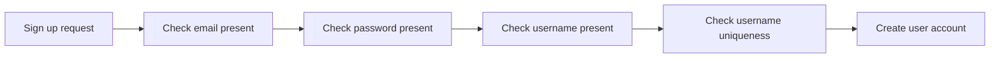

### Login and Password Change Validation

THE communityPlatform SHALL require an email address and a password for user login.

IF the submitted email address does not match an existing account, THEN THE communityPlatform SHALL reject the login request.

IF the submitted password does not match the account for the submitted email address, THEN THE communityPlatform SHALL reject the login request.

WHEN the submitted email address and password match an existing account, THE communityPlatform SHALL grant access to that account.

THE communityPlatform SHALL allow a password change only for the requesting user's own account.

IF a user attempts to change the password for another user's account, THEN THE communityPlatform SHALL reject the password change request.

IF the target account for a password change does not exist, THEN THE communityPlatform SHALL reject the password change request.

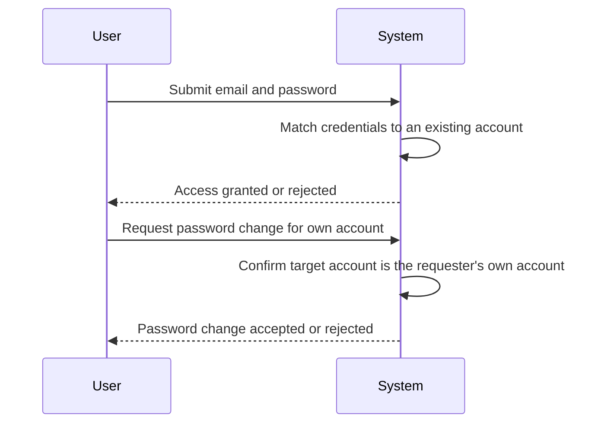

### Self-Service Account Deletion Rules

THE communityPlatform SHALL allow a user to delete the user's own account.

IF a user attempts to delete another user's account, THEN THE communityPlatform SHALL reject the deletion request.

WHEN a user account is deleted, THE communityPlatform SHALL delete all posts created by that user.

WHEN a user account is deleted, THE communityPlatform SHALL delete all comments written by that user.

WHEN a user account is deleted, THE communityPlatform SHALL apply the post deletion rule to every post owned by that user without requiring separate deletion requests.

WHEN a user account is deleted, THE communityPlatform SHALL apply the comment deletion rule to every comment owned by that user without requiring separate deletion requests.

IF the account targeted for self-deletion does not exist, THEN THE communityPlatform SHALL reject the deletion request.

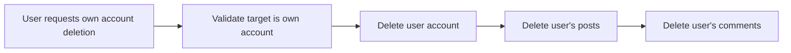

### Karma Calculation and Adjustment Rules

THE communityPlatform SHALL maintain one karma score as a single number for each user.

THE communityPlatform SHALL increase a user's karma by 1 when another user upvotes that user's post.

THE communityPlatform SHALL increase a user's karma by 1 when another user upvotes that user's comment.

THE communityPlatform SHALL decrease a user's karma by 1 when another user downvotes that user's post.

THE communityPlatform SHALL decrease a user's karma by 1 when another user downvotes that user's comment.

WHEN a vote on a user's post is removed, THE communityPlatform SHALL adjust that user's karma to reverse the effect of the removed vote.

WHEN a vote on a user's comment is removed, THE communityPlatform SHALL adjust that user's karma to reverse the effect of the removed vote.

WHEN a vote on a user's post is changed from upvote to downvote, THE communityPlatform SHALL adjust that user's karma to reflect removal of the upvote and application of the downvote.

WHEN a vote on a user's post is changed from downvote to upvote, THE communityPlatform SHALL adjust that user's karma to reflect removal of the downvote and application of the upvote.

WHEN a vote on a user's comment is changed from upvote to downvote, THE communityPlatform SHALL adjust that user's karma to reflect removal of the upvote and application of the downvote.

WHEN a vote on a user's comment is changed from downvote to upvote, THE communityPlatform SHALL adjust that user's karma to reflect removal of the downvote and application of the upvote.

THE communityPlatform SHALL allow a user's karma score to become negative.

THE communityPlatform SHALL not enforce zero as the minimum karma value.

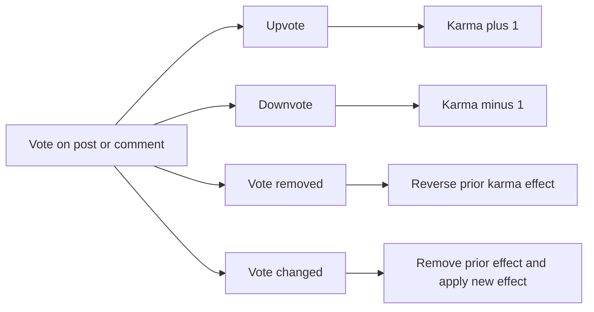

## Profile Rules

Each User has one Profile that contains a display name, bio text, and avatar image. Users may edit only their own display name, bio, and avatar. Any user's Profile can be viewed by other users, so profile visibility is not restricted to the profile owner. A profile page must present the user's display name, bio, avatar, and total karma score together as part of the same profile view. The profile page must also show the full list of posts created by that user and the full list of comments written by that user. Profile presentation details must remain associated with the correct User even when the user changes display name, bio, or avatar. Profile rules do not alter account identity requirements such as unique username or login credentials. The displayed karma value on the profile must reflect the user's current single karma score rather than a separate profile-specific total.

### Profile Existence and Ownership

THE communityPlatform SHALL maintain exactly one Profile for each User.

THE communityPlatform SHALL associate each Profile with one and only one User.

IF a Profile is requested for a User that does not exist, THEN THE communityPlatform SHALL reject the request.

IF an operation attempts to associate one User with multiple Profiles, THEN THE communityPlatform SHALL reject the operation.

IF an operation attempts to assign one Profile to a different User identity than the User it belongs to, THEN THE communityPlatform SHALL reject the operation.

THE communityPlatform SHALL keep Profile ownership tied to the same User identity regardless of changes to display name, bio text, or avatar image.

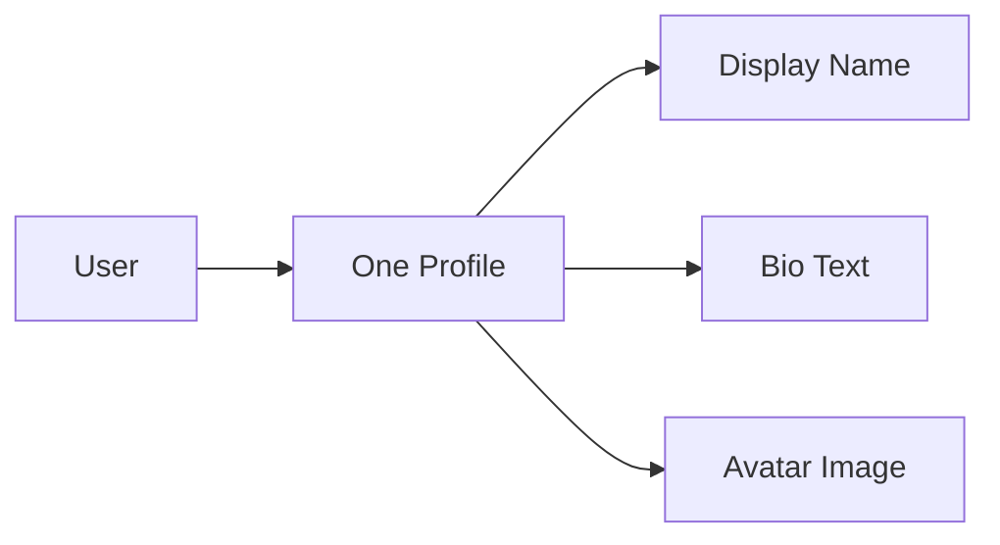

### Profile Content Validation

THE communityPlatform SHALL allow a Profile to contain a display name, bio text, and avatar image.

WHEN a Profile is viewed, THE communityPlatform SHALL present the current display name associated with that Profile.

WHEN a Profile is viewed, THE communityPlatform SHALL present the current bio text associated with that Profile.

WHEN a Profile is viewed, THE communityPlatform SHALL present the current avatar image associated with that Profile.

IF a profile update attempts to change content outside display name, bio text, or avatar image within Profile Rules, THEN THE communityPlatform SHALL reject the update.

IF a requested Profile cannot be found for a valid User, THEN THE communityPlatform SHALL reject the request.

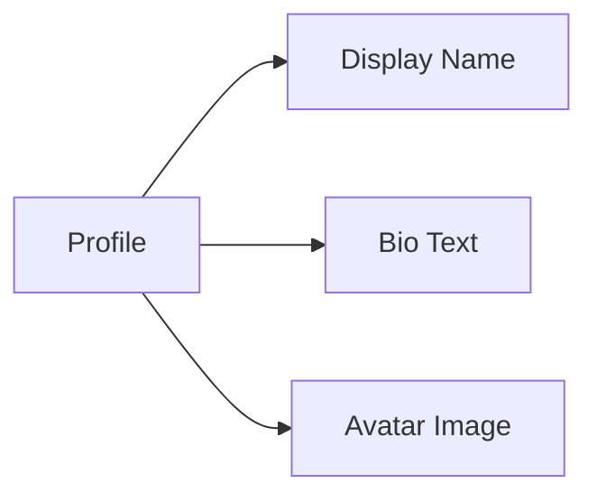

### Own Profile Editing Constraints

WHEN a User edits their own Profile, THE communityPlatform SHALL allow the User to update their display name.

WHEN a User edits their own Profile, THE communityPlatform SHALL allow the User to update their bio text.

WHEN a User edits their own Profile, THE communityPlatform SHALL allow the User to update their avatar image.

IF a User attempts to edit another User's display name, THEN THE communityPlatform SHALL reject the update.

IF a User attempts to edit another User's bio text, THEN THE communityPlatform SHALL reject the update.

IF a User attempts to edit another User's avatar image, THEN THE communityPlatform SHALL reject the update.

WHEN a Profile update is accepted, THE communityPlatform SHALL preserve the Profile's association with the same User identity.

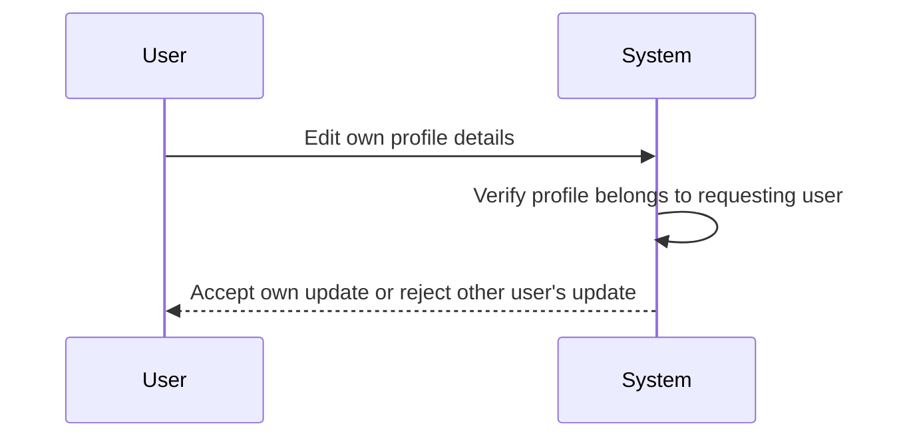

### Profile Viewing and Presentation Rules

WHEN any User's Profile is viewed, THE communityPlatform SHALL allow that Profile to be viewed by other users.

WHEN a Profile page is displayed, THE communityPlatform SHALL show the display name, bio text, avatar image, and total karma score together in the same Profile view.

WHEN a Profile page is displayed, THE communityPlatform SHALL show the full list of Posts created by that User.

WHEN a Profile page is displayed, THE communityPlatform SHALL show the full list of Comments written by that User.

WHEN a Profile page is displayed, THE communityPlatform SHALL ensure that the displayed Posts and Comments belong to the same User as the viewed Profile.

IF a Profile view request identifies no matching User, THEN THE communityPlatform SHALL reject the request.

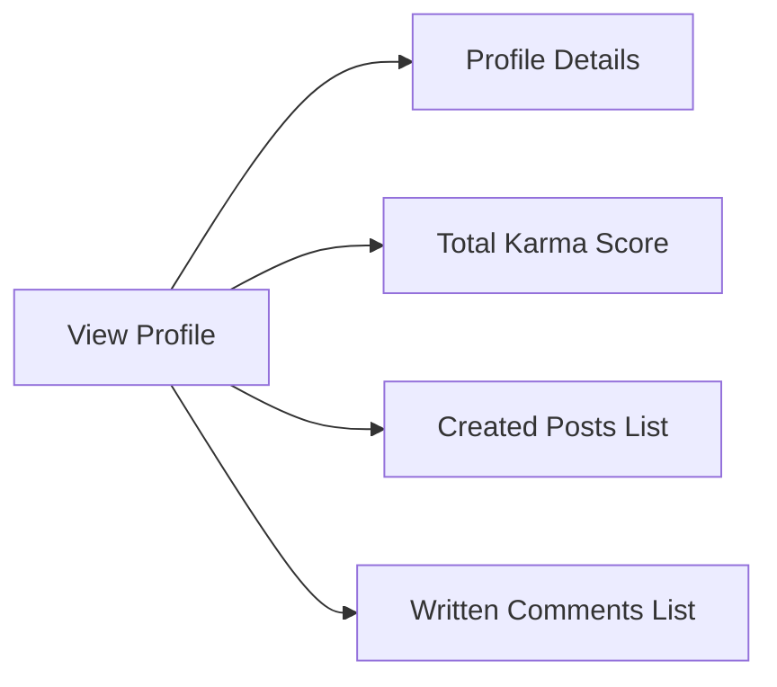

### Karma Display Consistency

WHEN a Profile page is displayed, THE communityPlatform SHALL show the User's current single karma score.

THE communityPlatform SHALL use the User's single karma score as the value displayed on the Profile page.

THE communityPlatform SHALL NOT present a separate profile-specific karma total.

WHEN the User's karma changes because of vote activity on Posts or Comments, THE communityPlatform SHALL reflect the updated current single karma score on the Profile page.

IF a Profile display request would show a karma value that does not match the User's current single karma score, THEN THE communityPlatform SHALL reject that inconsistent result.

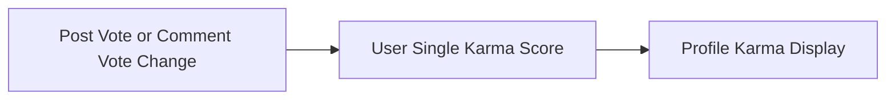

## Community Rules

Any User may create a Community. Each Community must have a unique name so that communities can be distinguished across the platform. A Community also includes description text and an icon image as part of its defined information. The user who creates the Community automatically becomes its owner, and that ownership is the highest authority within that community. Community identity is based on the community itself rather than on its subscriber count, so subscriber count is a derived display value and not a defining rule for creation. Community rules must preserve a stable relationship between the Community and its owner for later moderation authority. A Community may accumulate subscribers from many users, and its displayed subscriber count must reflect the current number of active subscriptions. Community membership and moderation actions depend on the existence of a valid Community with a distinct name.

### Community Creation Eligibility and Required Community Information

THE communityPlatform SHALL allow any member to create a community.

WHEN a member creates a community, THE communityPlatform SHALL require the community to be identified by a community name.

WHEN a member creates a community, THE communityPlatform SHALL allow description text to be recorded as part of the community's defined information.

WHEN a member creates a community, THE communityPlatform SHALL allow an icon image to be recorded as part of the community's defined information.

IF community creation is requested without a community name, THEN THE communityPlatform SHALL reject the request.

IF community creation is requested by a guest, THEN THE communityPlatform SHALL reject the request.

### Community Name Uniqueness and Identity

THE communityPlatform SHALL require each community name to be unique across the platform.

IF a requested community name is already used by another community, THEN THE communityPlatform SHALL reject the creation request.

THE communityPlatform SHALL treat the unique community name as the basis for distinguishing one community from another.

THE communityPlatform SHALL treat community identity as belonging to the community itself and not to its subscriber count.

IF a community cannot be uniquely identified by name, THEN THE communityPlatform SHALL not treat it as a valid community for later business actions.

### Community Ownership and Authority

WHEN a member creates a community, THE communityPlatform SHALL assign that member as the owner of the community.

THE communityPlatform SHALL treat the owner role as the highest authority within that community.

THE communityPlatform SHALL preserve the relationship between a community and its owner for later moderation authority.

IF a community does not have its recorded owner relationship, THEN THE communityPlatform SHALL not permit moderation authority to be exercised for that community.

### Subscriber Count Rules

THE communityPlatform SHALL display a subscriber count for each community.

THE communityPlatform SHALL derive subscriber count from the current number of active subscriptions to that community.

WHEN a user subscribes to a community, THE communityPlatform SHALL reflect that active subscription in the community's subscriber count.

WHEN a user unsubscribes from a community, THE communityPlatform SHALL reflect the removal of that active subscription in the community's subscriber count.

THE communityPlatform SHALL not use subscriber count as a defining condition for community creation or identity.

### Validity Rules for Subscription and Moderation Contexts

THE communityPlatform SHALL require a valid existing community before a user can hold a subscription to that community.

IF a subscription action references a community that is not valid, THEN THE communityPlatform SHALL reject the subscription-related request.

THE communityPlatform SHALL require a valid existing community before moderation actions can be applied within that community.

IF a moderation action references a community that is not valid, THEN THE communityPlatform SHALL reject the moderation-related request.

THE communityPlatform SHALL apply community membership and moderation actions only within the context of a distinct community identified by its unique name.

## Subscription Rules

A Subscription represents a user's membership in a specific Community. Users may subscribe to any Community and may later unsubscribe from it. A user can view the list of communities they are subscribed to, so subscription membership must be tracked per user and per community. Subscribing is a required condition for creating posts in a community. A user who is not subscribed to a community must not be allowed to create a post there. Subscription status is community-specific, so being subscribed to one community does not grant posting rights in another. The same user should not hold duplicate subscriptions to the same community at the same time because subscriber count and posting eligibility depend on a single current membership relationship. When a user unsubscribes, the posting prerequisite for that community no longer applies in their favor.

### Subscription Creation and Membership Scope

WHEN a member subscribes to a community, THE communityPlatform SHALL create a subscription between that member and that community.

THE communityPlatform SHALL allow a member to subscribe to any community.

THE communityPlatform SHALL treat subscription membership as community-specific.

WHEN a member is subscribed to one community, THE communityPlatform SHALL NOT treat that subscription as membership in any other community.

IF a member already has an active subscription to the same community, THEN THE communityPlatform SHALL reject an additional subscription to that community.

THE communityPlatform SHALL maintain no more than one active subscription for the same member in the same community at the same time.

### Unsubscribe Rules and Membership Removal

WHEN a member unsubscribes from a community, THE communityPlatform SHALL remove that member's active subscription to that community.

IF a member does not have an active subscription to the community, THEN THE communityPlatform SHALL reject the unsubscribe request.

WHEN a member unsubscribes from a community, THE communityPlatform SHALL stop treating that member as subscribed to that community.

WHEN a member unsubscribes from a community, THE communityPlatform SHALL remove the posting eligibility that depended on that subscription for that community.

WHEN a member unsubscribes from one community, THE communityPlatform SHALL leave that member's subscriptions to other communities unchanged.

### Subscription Lists and Subscriber Count

WHEN a member views the list of communities they are subscribed to, THE communityPlatform SHALL show the communities for which that member currently has an active subscription.

WHEN a subscription is created, THE communityPlatform SHALL increase the subscriber count for that community.

WHEN a subscription is removed, THE communityPlatform SHALL decrease the subscriber count for that community.

THE communityPlatform SHALL base each community's subscriber count on current active subscriptions only.

THE communityPlatform SHALL prevent duplicate active subscriptions from causing the subscriber count to be increased more than once for the same member in the same community.

### Posting Eligibility Based on Subscription

WHEN a member creates a post in a community, THE communityPlatform SHALL require that the member has an active subscription to that same community.

IF a member is not subscribed to the community where the post is being created, THEN THE communityPlatform SHALL reject the post creation request.

WHEN a member is subscribed to a community, THE communityPlatform SHALL recognize that subscription as satisfying the subscription prerequisite for creating posts in that community.

WHEN a member is subscribed to one community but not another, THE communityPlatform SHALL allow the subscription prerequisite to be satisfied only for the subscribed community.

WHEN a member unsubscribes from a community, THE communityPlatform SHALL no longer allow that former subscription to satisfy the posting prerequisite for that community.

## Post Rules

A Post can be created only in a Community where the author is currently subscribed. Every Post must have a title, and a post without a title is not valid. Each Post must be exactly one of three types: text post, link post, or image post. A text post contains text content, a link post contains a URL, and an image post contains an uploaded image. A single post must not mix these type definitions in place of choosing one required type. Users may edit only their own posts and may delete only their own posts under normal user rules. A post belongs to both an author and a community, and those relationships must remain clear when the post is viewed. A single post view must show the title, full content, author, community, vote score, comment count, and when it was posted. Vote score for a post is determined by post votes rather than by separate manual editing. Comment count for a post must reflect comments associated with that post.

### Post Creation Eligibility and Required Title

WHEN a member creates a post, THE communityPlatform SHALL allow creation only in a community where that member is currently subscribed.

IF a member is not currently subscribed to the selected community, THEN THE communityPlatform SHALL reject post creation in that community.

WHEN a post is created, THE communityPlatform SHALL require a title.

IF a post title is missing, THEN THE communityPlatform SHALL reject the post.

THE communityPlatform SHALL associate each created post with the member who created it.

THE communityPlatform SHALL associate each created post with the community in which it was created.

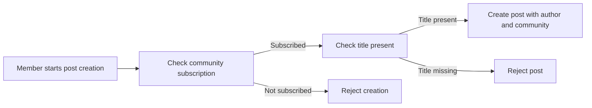

### Post Type Selection and Type-Specific Content Validation

WHEN a member creates or edits a post, THE communityPlatform SHALL require the post to be exactly one of these types: text post, link post, or image post.

IF a post does not have one of the allowed post types, THEN THE communityPlatform SHALL reject the post.

IF a post attempts to combine more than one post type, THEN THE communityPlatform SHALL reject the post.

WHEN the selected type is a text post, THE communityPlatform SHALL require text content for that post.

IF a text post does not contain text content, THEN THE communityPlatform SHALL reject the post.

WHEN the selected type is a link post, THE communityPlatform SHALL require a URL for that post.

IF a link post does not contain a URL, THEN THE communityPlatform SHALL reject the post.

WHEN the selected type is an image post, THE communityPlatform SHALL require an uploaded image for that post.

IF an image post does not contain an uploaded image, THEN THE communityPlatform SHALL reject the post.

IF content provided for a post does not match its selected post type, THEN THE communityPlatform SHALL reject the post.

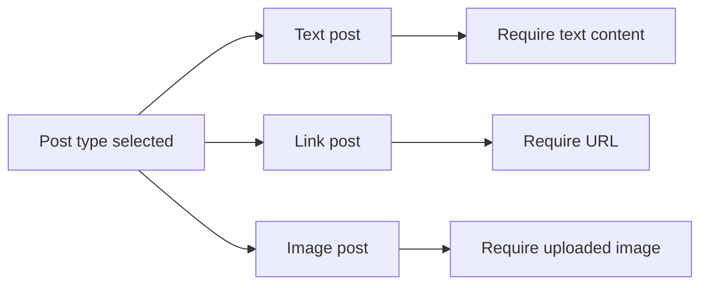

### Post Ownership Rules for Editing and Deletion

WHEN a member edits a post, THE communityPlatform SHALL allow the edit only if the member is the author of that post.

IF a member attempts to edit a post created by another user, THEN THE communityPlatform SHALL reject the edit.

WHEN a member deletes a post, THE communityPlatform SHALL allow the deletion only if the member is the author of that post under normal user rules.

IF a member attempts to delete a post created by another user under normal user rules, THEN THE communityPlatform SHALL reject the deletion.

THE communityPlatform SHALL preserve the relationship between a post and its author for all non-deleted posts.

THE communityPlatform SHALL preserve the relationship between a post and its community for all non-deleted posts.

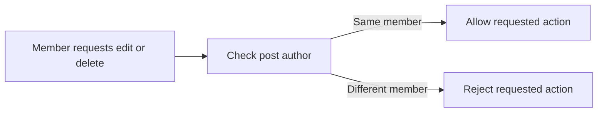

### Single Post View and Derived Display Values

WHEN a user views a single post, THE communityPlatform SHALL show the post title.

WHEN a user views a single post, THE communityPlatform SHALL show the full content according to the post type definition in Post Type Selection and Type-Specific Content Validation.

WHEN a user views a single post, THE communityPlatform SHALL show the post author.

WHEN a user views a single post, THE communityPlatform SHALL show the community to which the post belongs.

WHEN a user views a single post, THE communityPlatform SHALL show the post vote score.

WHEN a user views a single post, THE communityPlatform SHALL determine the post vote score from post votes rather than from separate manual editing.

WHEN a user views a single post, THE communityPlatform SHALL show the post comment count.

WHEN a user views a single post, THE communityPlatform SHALL determine the post comment count from comments associated with that post.

WHEN a user views a single post, THE communityPlatform SHALL show when the post was posted.

IF the requested post does not exist, THEN THE communityPlatform SHALL reject the request to view that post.

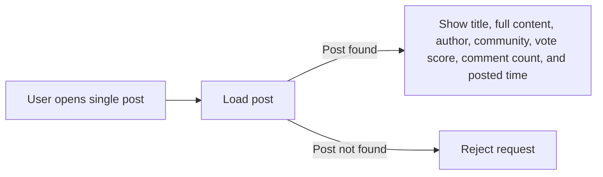

## Comment Rules

Users can write a Comment on any Post. Users can also reply to any existing Comment, and replies may continue without any depth limit. Each Comment must remain attached to its parent context, whether that is a post-level comment or a reply to another comment. Users may edit only their own comments and may delete only their own comments under normal user rules. A comment view must show the author, content, vote score, and time since posted. Nested replies must appear as part of the comment structure so that conversations remain connected. Because reply depth is unlimited, the domain must allow comment threads to extend through repeated reply relationships. Comment vote score is determined by comment votes and is separate from the post's vote score. Deleting a user's account must also remove comments written by that user, including replies within nested threads.

### Comment Creation and Reply Validation

WHEN a member submits a comment on a post, THE communityPlatform SHALL allow the comment only when the target post exists.

WHEN a member submits a reply to a comment, THE communityPlatform SHALL allow the reply only when the target parent comment exists.

WHEN a comment is created directly on a post, THE communityPlatform SHALL link the comment to that post.

WHEN a reply is created for an existing comment, THE communityPlatform SHALL link the reply to the same post as the parent comment.

WHEN a reply is created for an existing comment, THE communityPlatform SHALL link the reply to that parent comment.

IF the target post does not exist, THEN THE communityPlatform SHALL reject the comment submission.

IF the target parent comment does not exist, THEN THE communityPlatform SHALL reject the reply submission.

IF a reply would not remain attached to both its post context and its parent comment context, THEN THE communityPlatform SHALL reject the reply submission.

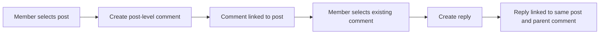

### Nested Reply Structure Rules

WHEN a member replies to a comment, THE communityPlatform SHALL support that reply as part of the comment thread.

WHEN a reply is made to another reply, THE communityPlatform SHALL support the new reply in the same threaded structure.

THE communityPlatform SHALL support nested replies without imposing a maximum reply depth.

WHEN comments are displayed for a post, THE communityPlatform SHALL preserve the parent-child relationship between each comment and its replies.

WHEN a comment has replies, THE communityPlatform SHALL present those replies as nested beneath that comment.

WHEN a reply has further replies, THE communityPlatform SHALL preserve the repeated reply relationship through each additional level.

IF a displayed comment thread would separate a reply from its parent comment, THEN THE communityPlatform SHALL reject that thread representation.

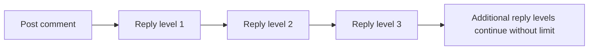

### Comment Ownership and Modification Constraints

WHEN a member edits a comment, THE communityPlatform SHALL allow the edit only when the comment was written by that member.

WHEN a member deletes a comment, THE communityPlatform SHALL allow the deletion only when the comment was written by that member.

IF a member attempts to edit a comment written by another user, THEN THE communityPlatform SHALL reject the edit request.

IF a member attempts to delete a comment written by another user, THEN THE communityPlatform SHALL reject the deletion request.

IF the target comment does not exist, THEN THE communityPlatform SHALL reject the edit request.

IF the target comment does not exist, THEN THE communityPlatform SHALL reject the deletion request.

WHILE applying normal user rules, THE communityPlatform SHALL enforce comment editing as an owner-only action.

WHILE applying normal user rules, THE communityPlatform SHALL enforce comment deletion as an owner-only action.

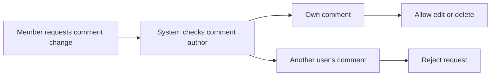

### Comment Display and Browsing Expectations

WHEN a comment is shown, THE communityPlatform SHALL display the comment author.

WHEN a comment is shown, THE communityPlatform SHALL display the comment content.

WHEN a comment is shown, THE communityPlatform SHALL display the comment vote score.

WHEN a comment is shown, THE communityPlatform SHALL display the time since the comment was posted.

WHEN a comment has nested replies, THE communityPlatform SHALL display those replies as part of the same comment structure.

WHEN a post contains comments and replies, THE communityPlatform SHALL present the conversation in a way that keeps each reply connected to its parent comment.

IF comment display would omit the author, content, vote score, or time since posted for a shown comment, THEN THE communityPlatform SHALL treat that display as invalid.

IF nested replies would be shown outside their comment structure, THEN THE communityPlatform SHALL treat that display as invalid.

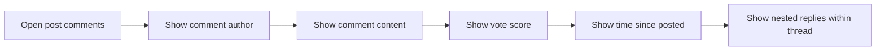

### Account Deletion Effect on Comments

WHEN a user deletes their account, THE communityPlatform SHALL remove comments written by that user.

WHEN a user deletes their account, THE communityPlatform SHALL remove replies written by that user, including replies within nested threads.

WHEN account deletion removes a comment, THE communityPlatform SHALL apply the same removal rule regardless of whether the comment is a post-level comment or a reply.

WHEN account deletion removes comments from nested threads, THE communityPlatform SHALL preserve the remaining thread structure for comments not written by the deleted user.

IF a comment was written by a deleted account, THEN THE communityPlatform SHALL not continue to show that comment as active content.

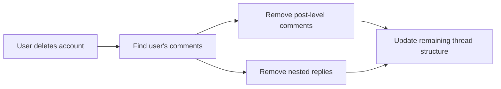

## PostVote Rules

A PostVote records one user's vote on one post. A user may upvote a post or downvote a post, but may hold only one active vote per post at a time. If the user changes from upvote to downvote or from downvote to upvote, the previous vote must be replaced rather than added alongside the new one. A user may also remove their vote entirely, which means the post no longer carries that user's vote. A post's vote score must equal total upvotes minus total downvotes. Vote changes must immediately affect the post's score according to the current final vote state. Because post votes contribute to author karma, the same change or removal must also adjust the post author's karma by the correct amount. The voting rule is based on unique voter-to-post pairing, so duplicate concurrent votes from the same user on the same post are not allowed.

### Post Vote Submission and Uniqueness

THE communityPlatform SHALL allow a member to record either an upvote or a downvote on a post.

WHEN a member submits an upvote for a post that has no current vote from that member, THE communityPlatform SHALL record one upvote for that member and that post.

WHEN a member submits a downvote for a post that has no current vote from that member, THE communityPlatform SHALL record one downvote for that member and that post.

THE communityPlatform SHALL enforce one vote per user per post.

IF a member attempts to hold more than one active vote on the same post at the same time, THEN THE communityPlatform SHALL reject the additional vote state.

THE communityPlatform SHALL enforce a unique voter and post pairing for every active post vote.

IF a new vote request would create duplication instead of replacing the existing vote for the same member and post, THEN THE communityPlatform SHALL reject the duplicated vote state.

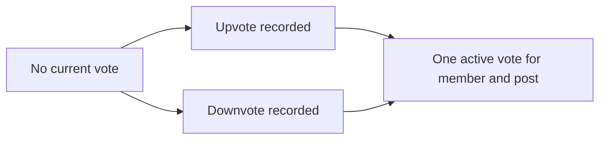

### Post Vote Replacement and Removal

WHEN a member changes a post vote from upvote to downvote, THE communityPlatform SHALL replace the previous upvote with the new downvote rather than add a second vote.

WHEN a member changes a post vote from downvote to upvote, THE communityPlatform SHALL replace the previous downvote with the new upvote rather than add a second vote.

THE communityPlatform SHALL treat a changed vote on a post as vote replacement, not duplication.

WHEN a member removes a vote from a post, THE communityPlatform SHALL clear that member's active vote from the post.

WHEN a member removes a vote from a post, THE communityPlatform SHALL ensure that the post no longer carries that member's vote.

IF a member requests vote removal for a post where that member has no active vote, THEN THE communityPlatform SHALL reject the removal request.

IF a vote change request targets a post where that member has no active vote to replace, THEN THE communityPlatform SHALL reject the vote change request.

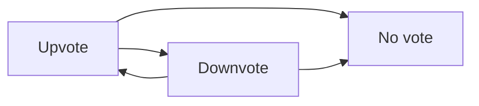

### Post Vote Score and Author Karma Adjustment

THE communityPlatform SHALL calculate the vote score of a post as total upvotes minus total downvotes.

WHEN an upvote is added to a post, THE communityPlatform SHALL increase the post's vote score by 1.

WHEN a downvote is added to a post, THE communityPlatform SHALL decrease the post's vote score by 1.

WHEN a post vote is changed from upvote to downvote, THE communityPlatform SHALL update the post's vote score to reflect the final downvote state instead of counting both vote states.

WHEN a post vote is changed from downvote to upvote, THE communityPlatform SHALL update the post's vote score to reflect the final upvote state instead of counting both vote states.

WHEN a vote is removed from a post, THE communityPlatform SHALL update the post's vote score to remove the effect of that former vote.

WHEN a member upvotes a post, THE communityPlatform SHALL increase the post author's karma by 1.

WHEN a member downvotes a post, THE communityPlatform SHALL decrease the post author's karma by 1.

WHEN a member changes a vote on a post, THE communityPlatform SHALL adjust the post author's karma according to the current final vote state.

WHEN a member removes a vote from a post, THE communityPlatform SHALL update the post author's karma to remove the effect of that former vote.

```mermaid
flowchart LR
    A["Upvote"] --> B["Post score +1"]
    A --> C["Author karma +1"]
    D["Downvote"] --> E["Post score -1"]
    D --> F["Author karma -1"]
    G["Vote removed"] --> H["Remove prior score effect"]
    G --> I["Remove prior karma effect"]
```

## CommentVote Rules

A CommentVote follows the same voting model as post voting but applies to comments. A user may upvote or downvote any comment, with only one active vote allowed per user for each comment. A user may switch their vote from one direction to the other, and the system must treat that as a replacement of the prior vote. A user may also remove their vote entirely so that no active vote remains from that user on that comment. A comment's vote score must reflect upvotes minus downvotes based on the current set of votes. Vote updates on comments must also adjust the comment author's karma in line with the latest vote state. Duplicate simultaneous votes by the same user on the same comment are not valid. Comment vote score must be kept separate from the score of the post that contains the comment.

### Single Active Vote per User and Comment

THE communityPlatform SHALL allow at most one active comment vote for each unique pairing of one user and one comment.

WHEN a user votes on a comment for the first time, THE communityPlatform SHALL record one active vote for that user on that comment.

IF a user attempts to create more than one active vote on the same comment at the same time, THEN THE communityPlatform SHALL reject the additional vote attempt.

IF duplicate simultaneous vote submissions are received for the same user and the same comment, THEN THE communityPlatform SHALL preserve only one valid active vote state for that user-comment pairing.

THE communityPlatform SHALL treat the voter and comment combination as unique for comment voting.

THE communityPlatform SHALL apply the one-vote-per-user-per-comment rule equally to upvotes and downvotes.

```mermaid
flowchart LR
    A["No active vote"] --> B["One active upvote"]
    A --> C["One active downvote"]
    B --> D["Replacement or removal only"]
    C --> D
```

### Comment Vote Direction and Replacement

WHEN a user upvotes a comment that does not already have that user's active vote, THE communityPlatform SHALL apply an upvote to that comment.

WHEN a user downvotes a comment that does not already have that user's active vote, THE communityPlatform SHALL apply a downvote to that comment.

WHEN a user changes a comment vote from upvote to downvote, THE communityPlatform SHALL replace the prior upvote with a downvote.

WHEN a user changes a comment vote from downvote to upvote, THE communityPlatform SHALL replace the prior downvote with an upvote.

THE communityPlatform SHALL treat a changed vote on a comment as a replacement of the prior vote rather than as an additional vote.

IF a user submits the same vote direction that is already active on the same comment, THEN THE communityPlatform SHALL reject the request to create another active vote in that same direction.

```mermaid
flowchart LR
    A["Upvote active"] --> B["Downvote active"]
    B --> A
```

### Vote Removal and Resulting State

WHEN a user removes a vote from a comment, THE communityPlatform SHALL end that user's active vote on the comment.

WHEN a vote is removed from a comment, THE communityPlatform SHALL leave no active vote for that user on that comment.

WHEN a user removes an upvote from a comment, THE communityPlatform SHALL update the comment score to reflect that the upvote no longer applies.

WHEN a user removes a downvote from a comment, THE communityPlatform SHALL update the comment score to reflect that the downvote no longer applies.

WHEN a user removes a vote from a comment, THE communityPlatform SHALL adjust the comment author's karma to match the latest vote state after removal.

IF a user attempts to remove a comment vote that does not exist for that user and comment, THEN THE communityPlatform SHALL reject the request.

```mermaid
flowchart LR
    A["Upvote active"] --> B["No active vote"]
    C["Downvote active"] --> B
```

### Comment Vote Score and Karma Consistency

THE communityPlatform SHALL calculate each comment vote score as the total number of upvotes minus the total number of downvotes for that comment.

THE communityPlatform SHALL keep the score of a comment separate from the score of the post that contains that comment.

WHEN an upvote is added to a comment, THE communityPlatform SHALL increase that comment's vote score by 1.

WHEN a downvote is added to a comment, THE communityPlatform SHALL decrease that comment's vote score by 1.

WHEN a comment vote is changed from upvote to downvote, THE communityPlatform SHALL recalculate the comment vote score from the current set of active votes.

WHEN a comment vote is changed from downvote to upvote, THE communityPlatform SHALL recalculate the comment vote score from the current set of active votes.

WHEN a comment vote is removed, THE communityPlatform SHALL recalculate the comment vote score from the current set of active votes.

WHEN a user's comment receives an upvote, THE communityPlatform SHALL increase the comment author's karma by 1.

WHEN a user's comment receives a downvote, THE communityPlatform SHALL decrease the comment author's karma by 1.

WHEN a vote on a comment is replaced, THE communityPlatform SHALL adjust the comment author's karma to reflect only the latest active vote state.

WHEN a vote on a comment is removed, THE communityPlatform SHALL adjust the comment author's karma to reflect that no active vote remains from that voter on that comment.

```mermaid
flowchart LR
    A["Active comment votes"] --> B["Count upvotes"]
    A --> C["Count downvotes"]
    B --> D["Comment score"]
    C --> D
    D --> E["Author karma adjusted from latest vote state"]
```

## Report Rules

Users can create a Report for either a Post or a Comment. A report must include a reason in text, so a report without a stated reason is not valid. Each report must remain associated with the specific reported content and the user who submitted it. Reports are community-specific in effect because moderators review reports for content within their own community. Moderators must be able to see the reported content, who reported it, and the reason provided. When a moderator approves a report, the reported content is deleted. When a moderator dismisses a report, the reported content remains in place and the dismissed report is removed from the report list. Report handling must therefore preserve a clear distinction between pending review, approved deletion outcome, and dismissal that clears the item from active review.

### Report Target and Required Reason

THE communityPlatform SHALL allow a report to target either one post or one comment.

IF a report does not identify a post or a comment, THEN THE communityPlatform SHALL reject the report.

IF a report attempts to target both a post and a comment at the same time, THEN THE communityPlatform SHALL reject the report.

THE communityPlatform SHALL require reason text for every report.

IF the reason text is not provided, THEN THE communityPlatform SHALL reject the report.

THE communityPlatform SHALL preserve the submitted reason text as part of the report for moderator review.

```mermaid
flowchart LR
    A["Start report"] --> B["Choose post or comment"]
    B --> C["Enter reason text"]
    C --> D["Submit report"]
    B --> E["Missing or invalid target"]
    C --> F["Missing reason text"]
```

### Report Association and Community Scope

THE communityPlatform SHALL associate each report with the specific reported content that was submitted in the report.

THE communityPlatform SHALL associate each report with the user who submitted it.

THE communityPlatform SHALL treat report handling as scoped to the community that contains the reported content.

WHEN a report is submitted for a post, THE communityPlatform SHALL associate the report with the community where that post was published.

WHEN a report is submitted for a comment, THE communityPlatform SHALL associate the report with the community of the post to which that comment belongs.

IF reported content cannot be associated with a community, THEN THE communityPlatform SHALL reject the report from active review handling.

THE communityPlatform SHALL keep the association between report, reporter, reported content, and related community available for moderator review.

```mermaid
flowchart LR
    A["Report"] --> B["Reported post"]
    A --> C["Reported comment"]
    A --> D["Reporter"]
    B --> E["Community"]
    C --> E
```

### Moderator Report Review Visibility

WHEN a moderator views reports for a community, THE communityPlatform SHALL show only reports related to content in that community.

WHEN a moderator views a report in their community, THE communityPlatform SHALL show the reported content.

WHEN a moderator views a report in their community, THE communityPlatform SHALL show the identity of the user who submitted the report.

WHEN a moderator views a report in their community, THE communityPlatform SHALL show the reason text provided with the report.

IF a report belongs to a different community, THEN THE communityPlatform SHALL not include that report in the moderator's report view for the current community.

THE communityPlatform SHALL keep community report review separated so that report handling in one community does not appear in the report list of another community.

```mermaid
flowchart LR
    A["Moderator opens community reports"] --> B["Show reports for that community only"]
    B --> C["Show reported content"]
    B --> D["Show reporter identity"]
    B --> E["Show reason text"]
```

### Report Review Outcomes and Active Report List

THE communityPlatform SHALL maintain a distinct review state for reports awaiting review.

WHEN a moderator approves a report, THE communityPlatform SHALL delete the reported content.

WHEN a moderator approves a report, THE communityPlatform SHALL record that the report reached an approved deletion outcome.

WHEN a moderator dismisses a report, THE communityPlatform SHALL keep the reported content in place.

WHEN a moderator dismisses a report, THE communityPlatform SHALL remove the dismissed report from the active report list.

THE communityPlatform SHALL preserve a clear distinction between a report that is awaiting review, a report that resulted in content deletion, and a report that was dismissed and cleared from active review.

IF a dismissed report is no longer in active review, THEN THE communityPlatform SHALL not show it in the report list used for pending moderator action.

```mermaid
flowchart LR
    A["Pending review"] --> B["Approve"]
    A --> C["Dismiss"]
    B --> D["Delete reported content"]
    B --> E["Approved deletion outcome"]
    C --> F["Keep reported content"]
    C --> G["Remove from active report list"]
```

## CommunityBan Rules

A CommunityBan applies to one user within one specific Community. Moderators can ban users from their community and can later unban them. A banned user cannot create posts in that community. A banned user also cannot create comments in that community. The ban does not block viewing, because banned users are still allowed to view content in the community. Ban effects are local to the community where the ban exists, so a ban in one community does not imply a ban in another. Moderators must be able to view the list of banned users, which means each ban must remain identifiable as an active community-specific restriction until it is removed. Once a user is unbanned, the posting and commenting restrictions for that community are lifted.

### Ban Application and Community Scope

WHEN a moderator bans a user from a community, THE communityPlatform SHALL create a community-specific ban that applies only to that user within that community.

THE communityPlatform SHALL treat a ban in one community as separate from any ban status in any other community.

IF the target user is already actively banned in the same community, THEN THE communityPlatform SHALL reject the new ban request.

IF the requested community does not exist, THEN THE communityPlatform SHALL reject the ban request.

IF the target user does not exist, THEN THE communityPlatform SHALL reject the ban request.

IF the target user is not associated with the specified community ban context, THEN THE communityPlatform SHALL reject any attempt to create or interpret a ban outside a single identified community.

```mermaid
flowchart LR
    A["No ban in community"] -->|"Ban user"| B["Active ban in community"]
    B -->|"Community differs"| C["No effect on other communities"]
```

### Active Ban Participation Restrictions

WHILE a user has an active ban in a community, THE communityPlatform SHALL reject any attempt by that user to create a post in that community.

WHILE a user has an active ban in a community, THE communityPlatform SHALL reject any attempt by that user to create a comment in that community.

WHILE a user has an active ban in a community, THE communityPlatform SHALL apply the posting restriction only within the community where the ban is active.

WHILE a user has an active ban in a community, THE communityPlatform SHALL apply the commenting restriction only within the community where the ban is active.

IF a banned user attempts to create a post in the banned community, THEN THE communityPlatform SHALL reject the request because the active ban restricts participation.

IF a banned user attempts to create a comment in the banned community, THEN THE communityPlatform SHALL reject the request because the active ban restricts participation.

```mermaid
flowchart LR
    A["Active ban in community"] --> B["Create post request"]
    A --> C["Create comment request"]
    B --> D["Rejected"]
    C --> D
```

### View Access During Ban

WHILE a user has an active ban in a community, THE communityPlatform SHALL allow that user to view content in that community.

WHILE a user has an active ban in a community, THE communityPlatform SHALL allow that user to browse the community and its content without lifting the participation restriction.

IF a banned user requests to view content in the community where the ban is active, THEN THE communityPlatform SHALL not reject the request on the basis of the ban alone.

THE communityPlatform SHALL distinguish viewing access from participation rights so that a ban blocks posting and commenting but does not block reading community content.

```mermaid
flowchart LR
    A["Active ban in community"] --> B["View community content"]
    B --> C["Allowed"]
    A --> D["Create post or comment"]
    D --> E["Rejected"]
```

### Banned User List and Active Ban Visibility

WHEN a moderator views the list of banned users for a community, THE communityPlatform SHALL show users who are currently under an active ban in that community.

THE communityPlatform SHALL keep each active community ban identifiable in the banned-user list until the ban is removed.

IF a community has no active bans, THEN THE communityPlatform SHALL return an empty banned-user list for that community.

WHEN a moderator reviews banned users for a community, THE communityPlatform SHALL limit the list to bans for that community only.

IF a ban has been removed, THEN THE communityPlatform SHALL no longer show that user as actively banned in the banned-user list for that community.

```mermaid
flowchart LR
    A["Community banned-user list"] --> B["Active bans for this community only"]
    B --> C["Display banned users"]
    D["Ban removed"] --> E["Remove from active banned-user list"]
```

### Unban and Restoration of Community Participation

WHEN a moderator unbans a user from a community, THE communityPlatform SHALL remove the active community-specific restriction for that user in that community.

WHEN a moderator unbans a user from a community, THE communityPlatform SHALL restore that user's ability to create posts in that community, subject to other applicable community rules defined elsewhere.

WHEN a moderator unbans a user from a community, THE communityPlatform SHALL restore that user's ability to create comments in that community, subject to other applicable community rules defined elsewhere.

IF the user does not have an active ban in the specified community, THEN THE communityPlatform SHALL reject the unban request.

IF the requested community does not exist, THEN THE communityPlatform SHALL reject the unban request.

IF the target user does not exist, THEN THE communityPlatform SHALL reject the unban request.

THE communityPlatform SHALL ensure that unbanning a user from one community does not alter any active ban that may exist for that user in a different community.

```mermaid
flowchart LR
    A["Active ban in community"] -->|"Unban user"| B["No active ban in community"]
    B --> C["Post creation allowed subject to other rules"]
    B --> D["Comment creation allowed subject to other rules"]
```

## CommunityModerator Rules

A CommunityModerator role exists within a specific Community. The user who creates the community is the owner and holds the highest authority in that moderator structure. The owner can add moderators and can remove moderators. Moderators can also add other moderators. Moderators cannot remove the owner under any circumstances. Moderators also cannot remove each other, because only the owner can remove moderators. Moderator authority includes deleting any post in their community and deleting any comment in their community. Moderator authority also includes banning and unbanning users within their community and reviewing reports for that community. These rules create a strict hierarchy in which ownership outranks moderator status and moderator powers remain limited to the boundaries defined for that community.

### Moderator Hierarchy and Community Scope

THE communityPlatform SHALL treat the community owner as the highest authority within that community's moderator structure.

THE communityPlatform SHALL apply community owner and moderator roles only within the specific community where those roles were granted.

WHEN a user holds an owner role in one community, THE communityPlatform SHALL NOT treat that user as an owner in any other community unless that role exists there as well.

WHEN a user holds a moderator role in one community, THE communityPlatform SHALL NOT grant moderator authority over posts, comments, bans, or reports in any other community.

IF a user attempts a moderator action in a community where the user is neither the owner nor a moderator, THEN THE communityPlatform SHALL reject the action.

IF a moderator action targets content, a user, or a report outside the moderator's community, THEN THE communityPlatform SHALL reject the action.

```mermaid
flowchart LR
    A["Community owner"] --> B["Highest authority in that community"]
    B --> C["Can manage moderators"]
    D["Community moderator"] --> E["Authority limited to assigned community"]
```

### Adding Moderators

WHEN the community owner selects a user to become a moderator of that community, THE communityPlatform SHALL add that user as a moderator for that community.

WHEN an existing moderator selects a user to become a moderator of that community, THE communityPlatform SHALL add that user as a moderator for that community.

THE communityPlatform SHALL allow both the community owner and existing moderators to add other moderators for the same community.

IF a request to add a moderator does not identify a valid user, THEN THE communityPlatform SHALL reject the request.

IF a request attempts to add a moderator role for a different community than the one being managed, THEN THE communityPlatform SHALL reject the request.

IF a user who is neither the community owner nor a moderator attempts to add a moderator, THEN THE communityPlatform SHALL reject the request.

```mermaid
sequenceDiagram
    participant A as Actor
    participant S as System
    A->>S: Add moderator in community
    S->>S: Verify actor is owner or moderator for that community
    S->>S: Verify target user and community match
    S-->>A: Moderator added or request rejected
```

### Removing Moderators

WHEN the community owner removes a moderator from that community, THE communityPlatform SHALL remove the moderator role from that user for that community.

THE communityPlatform SHALL allow only the community owner to remove moderators.

IF a moderator attempts to remove another moderator, THEN THE communityPlatform SHALL reject the request.

IF a moderator attempts to remove the community owner, THEN THE communityPlatform SHALL reject the request.

IF any user other than the community owner attempts to remove a moderator, THEN THE communityPlatform SHALL reject the request.

IF a removal request targets a user who is not a moderator of that community, THEN THE communityPlatform SHALL reject the request.

IF a removal request targets a moderator role in a different community, THEN THE communityPlatform SHALL reject the request.

```mermaid
flowchart LR
    A["Owner requests moderator removal"] --> B["Moderator removed in that community"]
    C["Moderator requests owner removal"] --> D["Rejected"]
    E["Moderator requests moderator removal"] --> F["Rejected"]
```

### Moderator Deletion of Community Content

WHEN a moderator deletes a post in the moderator's community, THE communityPlatform SHALL remove that post from community content.

WHEN a moderator deletes a comment in the moderator's community, THE communityPlatform SHALL remove that comment from community content.

THE communityPlatform SHALL allow moderators to delete any post within their community regardless of who authored the post.

THE communityPlatform SHALL allow moderators to delete any comment within their community regardless of who authored the comment.

IF a moderator attempts to delete a post outside the moderator's community, THEN THE communityPlatform SHALL reject the action.

IF a moderator attempts to delete a comment outside the moderator's community, THEN THE communityPlatform SHALL reject the action.

IF the targeted post does not exist, THEN THE communityPlatform SHALL reject the deletion request.

IF the targeted comment does not exist, THEN THE communityPlatform SHALL reject the deletion request.

```mermaid
flowchart LR
    A["Moderator in community"] --> B["Delete post in same community"]
    A --> C["Delete comment in same community"]
    D["Target outside community"] --> E["Rejected"]
```

### Community Ban and Unban Rules

WHEN a moderator bans a user from the moderator's community, THE communityPlatform SHALL apply a community ban to that user for that community.

WHEN a moderator unbans a user from the moderator's community, THE communityPlatform SHALL remove the community ban for that user in that community.

THE communityPlatform SHALL allow moderators to ban users only within their own community.

THE communityPlatform SHALL allow moderators to unban users only within their own community.

IF a moderator attempts to ban a user in a different community, THEN THE communityPlatform SHALL reject the action.

IF a moderator attempts to unban a user in a different community, THEN THE communityPlatform SHALL reject the action.

IF a ban request targets a user who is already banned in that community, THEN THE communityPlatform SHALL reject the request.

IF an unban request targets a user who is not banned in that community, THEN THE communityPlatform SHALL reject the request.

```mermaid
sequenceDiagram
    participant M as Moderator
    participant S as System
    M->>S: Ban or unban user in community
    S->>S: Verify moderator authority in same community
    S->>S: Verify current ban state
    S-->>M: Ban state updated or request rejected
```

### Community Report Review Rules

WHEN a moderator reviews a report for content in the moderator's community, THE communityPlatform SHALL allow the moderator to approve or dismiss that report.

THE communityPlatform SHALL allow moderators to review only reports related to their own community.

WHEN a moderator approves a report, THE communityPlatform SHALL delete the reported content.

WHEN a moderator dismisses a report, THE communityPlatform SHALL remove that report from the report list.

IF a moderator attempts to review a report for a different community, THEN THE communityPlatform SHALL reject the action.

IF the targeted report does not exist, THEN THE communityPlatform SHALL reject the review request.

IF the reported content no longer exists at the time of review, THEN THE communityPlatform SHALL reject approval of that report.

```mermaid
flowchart LR
    A["Moderator opens community report"] --> B["Approve report"]
    A --> C["Dismiss report"]
    B --> D["Reported content deleted"]
    C --> E["Report removed from list"]
    F["Report from another community"] --> G["Rejected"]
```

# Data Browsing Expectations

Business expectations for how users browse, find, and navigate through lists of data.

## List Browsing Expectations

Define business expectations for how users find, filter, and browse lists.

### Filtering

THE communityPlatform SHALL provide community name search when users browse the list of communities.

WHEN a user enters a community name search term, THE communityPlatform SHALL limit the community list to communities whose names match the search term.

WHEN a logged-in user opens the Home Feed, THE communityPlatform SHALL show only posts from communities the user is subscribed to.

IF a user is not logged in, THEN THE communityPlatform SHALL reject access to the Home Feed.

WHEN any user opens the Popular Feed, THE communityPlatform SHALL show posts from all communities across the platform.

WHEN any user opens a Community Feed, THE communityPlatform SHALL limit the post list to posts from the selected community.

WHEN a user opens the list of subscribed communities, THE communityPlatform SHALL show only communities the user is subscribed to.

WHEN a user opens a profile page, THE communityPlatform SHALL show only posts created by that profile owner in the profile post list.

WHEN a user opens a profile page, THE communityPlatform SHALL show only comments written by that profile owner in the profile comment list.

WHEN a user views reports for a community, THE communityPlatform SHALL show only reports for posts and comments that belong to that community.

IF a post or comment belongs to a different community than the one being reviewed, THEN THE communityPlatform SHALL exclude that report from the current community report list.

WHEN a user applies a time filter to Top post sorting, THE communityPlatform SHALL limit the ranked posts to the selected time period: today, this week, this month, this year, or all time.

IF a user selects a time filter while using a sorting option other than Top, THEN THE communityPlatform SHALL ignore the time filter for that browsing result.

```mermaid
flowchart LR
    A["Browse Communities"] --> B["Enter Name Search"]
    B --> C["Matching Community List"]
    D["Open Home Feed"] --> E["Subscribed Communities Only"]
    F["Open Popular Feed"] --> G["All Communities"]
    H["Open Community Feed"] --> I["Selected Community Only"]
```

### Sorting

WHEN a user views any post feed, THE communityPlatform SHALL allow the user to sort posts by Hot, New, Top, or Controversial.

WHEN a user selects Hot sorting, THE communityPlatform SHALL order posts so that recent posts with many upvotes appear first.

WHEN a user selects New sorting for a post feed, THE communityPlatform SHALL order posts by most recently created first.

WHEN a user selects Top sorting for a post feed, THE communityPlatform SHALL order posts by highest vote score first.

WHEN a user selects Controversial sorting for a post feed, THE communityPlatform SHALL order posts so that posts with many votes and a score close to zero appear first.

WHEN a user views comments on a post, THE communityPlatform SHALL allow the user to sort comments by Best, New, or Controversial.

WHEN a user selects Best sorting for comments, THE communityPlatform SHALL order comments by highest vote score first.

WHEN a user selects New sorting for comments, THE communityPlatform SHALL order comments by most recent first.

WHEN a user selects Controversial sorting for comments, THE communityPlatform SHALL order comments so that comments with many votes and a score close to zero appear first.

WHEN sorting is changed for a feed, THE communityPlatform SHALL return the same set of browseable posts for that feed context with the newly selected order.

WHEN sorting is changed for comments on a post, THE communityPlatform SHALL return the same set of comments for that post with the newly selected order.

IF a user has selected a Top time filter, THEN THE communityPlatform SHALL keep that time filter applied while the user remains in Top sorting.

```mermaid
flowchart LR
    A["Post Feed"] --> B["Hot"]
    A --> C["New"]
    A --> D["Top"]
    A --> E["Controversial"]
    F["Post Comments"] --> G["Best"]
    F --> H["New"]
    F --> I["Controversial"]
```

### Pagination

WHEN a user browses the Home Feed, THE communityPlatform SHALL present the posts as a paginated list.

WHEN a user browses the Popular Feed, THE communityPlatform SHALL present the posts as a paginated list.

WHEN a user browses a Community Feed, THE communityPlatform SHALL present the posts as a paginated list.

WHEN a user moves to another page in a post feed, THE communityPlatform SHALL preserve the selected feed context.

WHEN a user moves to another page in a post feed, THE communityPlatform SHALL preserve the selected sorting option.

WHEN a user moves to another page in a post feed while Top sorting is active, THE communityPlatform SHALL preserve the selected time filter.

WHEN a user moves to another page in a community search result, THE communityPlatform SHALL preserve the entered search term.

WHEN a user moves to another page in a browse result, THE communityPlatform SHALL show the next or previous portion of that same result set rather than switching to a different feed or community.

IF no further posts are available in the current browse result, THEN THE communityPlatform SHALL prevent navigation to an additional page of that result.

WHEN pagination is used in a post feed, THE communityPlatform SHALL continue to display each post list item with its required summary information for that page.

WHEN a paginated feed contains text posts, THE communityPlatform SHALL show the first 200 characters of content for each text post in the list.

WHEN a paginated feed contains image posts, THE communityPlatform SHALL show a thumbnail of the image for each image post in the list.

WHEN a paginated feed contains link posts, THE communityPlatform SHALL show the domain name of the URL for each link post in the list.

```mermaid
sequenceDiagram
    participant U as User
    participant S as System
    U->>S: Open a feed
    S-->>U: Show page of posts
    U->>S: Change page
    S->>S: Keep feed context and selected sort
    S-->>U: Show next or previous page
```

# Error Conditions

Business error scenarios and how the system should respond.

## Error Scenarios

Describe error conditions and expected system responses in natural language.

### Account and Profile Error Scenarios

IF a sign-up attempt uses an email address that is already associated with an existing user account, THEN THE communityPlatform SHALL reject the sign-up attempt.

IF a sign-up attempt uses a username that is already in use, THEN THE communityPlatform SHALL reject the sign-up attempt.

IF a log-in attempt uses an email address and password combination that does not match an existing user account, THEN THE communityPlatform SHALL reject the log-in attempt.

IF a user attempts to change a password without providing the current valid account credentials required for that action, THEN THE communityPlatform SHALL reject the password change attempt.

IF a user attempts to change the password of another user's account, THEN THE communityPlatform SHALL reject the request.

IF a user attempts to edit another user's profile, THEN THE communityPlatform SHALL reject the request.

IF a requested user profile does not exist, THEN THE communityPlatform SHALL reject the profile view request.

IF a user attempts to delete an account that is not their own, THEN THE communityPlatform SHALL reject the request.

```mermaid
flowchart LR
    A["Sign-up request"] --> B["Check email uniqueness"]
    B -->|"Email already used"| C["Reject request"]
    B -->|"Email available"| D["Check username uniqueness"]
    D -->|"Username already used"| C
    D -->|"Username available"| E["Allow account creation"]
```

### Community and Subscription Rejection Rules

IF a user attempts to create a community using a community name that already exists, THEN THE communityPlatform SHALL reject the community creation request.

IF a user attempts to subscribe to a community that does not exist, THEN THE communityPlatform SHALL reject the subscription request.

IF a user attempts to unsubscribe from a community that does not exist, THEN THE communityPlatform SHALL reject the unsubscription request.

IF a user attempts to unsubscribe from a community to which they are not currently subscribed, THEN THE communityPlatform SHALL reject the unsubscription request.

IF a user attempts to create a post in a community without being subscribed to that community, THEN THE communityPlatform SHALL reject the post creation request.

IF a banned user attempts to create a post in the community from which they are banned, THEN THE communityPlatform SHALL reject the post creation request.

IF a banned user attempts to create a comment in the community from which they are banned, THEN THE communityPlatform SHALL reject the comment creation request.

IF a user attempts to perform a community-specific action on a community that does not exist, THEN THE communityPlatform SHALL reject the request.

```mermaid
flowchart LR
    A["Create post request"] --> B["Check community exists"]
    B -->|"Missing community"| C["Reject request"]
    B -->|"Community exists"| D["Check subscription"]
    D -->|"Not subscribed"| C
    D -->|"Subscribed"| E["Check ban status"]
    E -->|"Banned"| C
    E -->|"Not banned"| F["Allow post creation"]
```

### Post and Comment Failure Cases

IF a user attempts to create a post without a title, THEN THE communityPlatform SHALL reject the post creation request.

IF a user attempts to create a post without selecting exactly one allowed post type, THEN THE communityPlatform SHALL reject the post creation request.

IF a text post is submitted without text content, THEN THE communityPlatform SHALL reject the post creation request.

IF a link post is submitted without a URL, THEN THE communityPlatform SHALL reject the post creation request.

IF an image post is submitted without an uploaded image, THEN THE communityPlatform SHALL reject the post creation request.

IF a user attempts to edit a post that does not exist, THEN THE communityPlatform SHALL reject the edit request.

IF a user attempts to edit or delete a post created by another user, THEN THE communityPlatform SHALL reject the request.

IF a user attempts to comment on a post that does not exist, THEN THE communityPlatform SHALL reject the comment creation request.

IF a user attempts to reply to a comment that does not exist, THEN THE communityPlatform SHALL reject the reply request.

IF a user attempts to edit or delete a comment written by another user, THEN THE communityPlatform SHALL reject the request.

IF a user attempts to edit a comment that does not exist, THEN THE communityPlatform SHALL reject the edit request.

IF a user attempts to delete a comment that does not exist, THEN THE communityPlatform SHALL reject the delete request.

```mermaid
flowchart LR
    A["Comment request"] --> B["Check target post or parent comment exists"]
    B -->|"Missing target"| C["Reject request"]
    B -->|"Target exists"| D["Check author permission"]
    D -->|"Not allowed for requested edit or delete"| C
    D -->|"Allowed action"| E["Proceed"]
```

### Voting Exception Handling

IF a user attempts to vote on a post that does not exist, THEN THE communityPlatform SHALL reject the vote request.

IF a user attempts to vote on a comment that does not exist, THEN THE communityPlatform SHALL reject the vote request.

IF a user attempts to cast more than one active vote on the same post, THEN THE communityPlatform SHALL reject the additional vote request.

IF a user attempts to cast more than one active vote on the same comment, THEN THE communityPlatform SHALL reject the additional vote request.

WHEN a user changes a vote on a post, THE communityPlatform SHALL replace the previous vote instead of allowing both vote choices to remain active.

WHEN a user changes a vote on a comment, THE communityPlatform SHALL replace the previous vote instead of allowing both vote choices to remain active.

IF a user attempts to remove a vote from a post when no active vote exists from that user on that post, THEN THE communityPlatform SHALL reject the removal request.

IF a user attempts to remove a vote from a comment when no active vote exists from that user on that comment, THEN THE communityPlatform SHALL reject the removal request.

WHEN a vote is removed from a post or comment, THE communityPlatform SHALL adjust the related vote score and the content author's karma accordingly.

```mermaid
flowchart LR
    A["Vote request"] --> B["Check target exists"]
    B -->|"Missing target"| C["Reject request"]
    B -->|"Target exists"| D["Check existing active vote"]
    D -->|"Same vote already active"| C
    D -->|"Different vote active"| E["Replace existing vote"]
    D -->|"No active vote"| F["Record vote"]
```

### Moderation and Reporting Exceptions

IF a user who is not the community owner attempts to remove the community owner from the moderation role, THEN THE communityPlatform SHALL reject the request.

IF a moderator attempts to remove another moderator, THEN THE communityPlatform SHALL reject the request.

IF a user without community moderation authority attempts to delete a post through moderation tools, THEN THE communityPlatform SHALL reject the request.

IF a user without community moderation authority attempts to delete a comment through moderation tools, THEN THE communityPlatform SHALL reject the request.

IF a user without community moderation authority attempts to ban a user from a community, THEN THE communityPlatform SHALL reject the request.

IF a user without community moderation authority attempts to unban a user from a community, THEN THE communityPlatform SHALL reject the request.

IF a moderation action targets a post, comment, or user that does not exist in the community, THEN THE communityPlatform SHALL reject the request.

IF a user submits a report without a reason, THEN THE communityPlatform SHALL reject the report submission.

IF a user attempts to report a post or comment that does not exist, THEN THE communityPlatform SHALL reject the report submission.

IF a user without community moderation authority attempts to review reports for a community, THEN THE communityPlatform SHALL reject the request.

IF a moderator attempts to review a report that is no longer available in the report list, THEN THE communityPlatform SHALL reject the review request.

WHEN a moderator dismisses a report, THE communityPlatform SHALL remove that report from the report list.

```mermaid
flowchart LR
    A["Report review request"] --> B["Check moderator authority"]
    B -->|"No authority"| C["Reject request"]
    B -->|"Authorized"| D["Check report availability"]
    D -->|"Report missing"| C
    D -->|"Report available"| E["Approve or dismiss report"]
```

### Feed, Sorting, and Pagination Error Rules

IF a guest attempts to view the home feed, THEN THE communityPlatform SHALL reject the request.

IF a feed request specifies a sorting option outside the supported set for posts, THEN THE communityPlatform SHALL reject the request.

IF a top-sorted post feed request specifies a time filter outside the supported set of today, this week, this month, this year, or all time, THEN THE communityPlatform SHALL reject the request.

IF a comment list request specifies a sorting option outside the supported set for comments, THEN THE communityPlatform SHALL reject the request.

IF a community feed request targets a community that does not exist, THEN THE communityPlatform SHALL reject the request.

IF a post detail request targets a post that does not exist, THEN THE communityPlatform SHALL reject the request.

IF a paginated feed request asks for a page that is outside the available result set, THEN THE communityPlatform SHALL return no items for that page rather than unrelated content.

WHEN a search for communities produces no matches, THE communityPlatform SHALL return an empty result list.

WHEN a user views a list of subscribed communities and no subscriptions exist, THE communityPlatform SHALL return an empty result list.

```mermaid
flowchart LR
    A["Feed request"] --> B["Check feed availability"]
    B -->|"Home feed for guest"| C["Reject request"]
    B -->|"Allowed feed"| D["Validate sorting and filters"]
    D -->|"Invalid option"| C
    D -->|"Valid option"| E["Return matching page or empty list"]
```

# File Validation Rules

Validation rules and policies for file uploads and storage.

## File Validation and Policies

Define file type restrictions, virus scanning requirements, content validation, and retention policies for uploaded files.

### File Validation

THE communityPlatform SHALL accept uploaded files only where the upload is required by a requested feature: profile avatar image, community icon image, or image post content.

IF a user attempts to upload a file for a purpose other than profile avatar image, community icon image, or image post content, THEN THE communityPlatform SHALL reject the upload.

WHEN a user creates an image post, THE communityPlatform SHALL require the post to include an uploaded image.

IF a user creates an image post without an uploaded image, THEN THE communityPlatform SHALL reject the post.

WHEN a user creates a text post, THE communityPlatform SHALL reject any uploaded file for that post.

WHEN a user creates a link post, THE communityPlatform SHALL reject any uploaded file for that post.

WHEN a user updates a profile avatar image, THE communityPlatform SHALL replace the previous avatar image shown on that profile.

WHEN a user updates a community icon image, THE communityPlatform SHALL replace the previous icon image shown for that community.

```mermaid
flowchart LR
    A["Upload requested"] --> B["Check upload purpose"]
    B --> C["Profile avatar image"]
    B --> D["Community icon image"]
    B --> E["Image post content"]
    B --> F["Unsupported purpose"]
    F --> G["Reject upload"]
```

### Virus Scan

No business rule is defined for virus scanning because the original requirements do not mention scanning, malware checks, quarantine handling, or related review states.

This unit does not add any virus scanning requirement.

IF a future requirement introduces virus scanning, THEN it must be specified in a revised scope before implementation or testing.

```mermaid
flowchart LR
    A["Uploaded file"] --> B["Check defined business rules"]
    B --> C["No virus scan rule in current scope"]
```

### Content Type

WHEN a user creates a post, THE communityPlatform SHALL require the post to be exactly one of these types: text post, link post, or image post.

IF a post does not match exactly one of the supported post types, THEN THE communityPlatform SHALL reject the post.

WHEN a user creates a text post, THE communityPlatform SHALL accept text content for that post type.

WHEN a user creates a link post, THE communityPlatform SHALL accept a URL for that post type.

WHEN a user creates an image post, THE communityPlatform SHALL accept an uploaded image for that post type.

IF content provided for a post does not match the selected post type, THEN THE communityPlatform SHALL reject the post.

WHEN a feed displays a link post, THE communityPlatform SHALL show the domain name of the URL.

WHEN a feed displays an image post, THE communityPlatform SHALL show a thumbnail of the image.

WHEN a feed displays a text post, THE communityPlatform SHALL show the first 200 characters of the text content.

```mermaid
flowchart LR
    A["Post submitted"] --> B["Select post type"]
    B --> C["Text post"]
    B --> D["Link post"]
    B --> E["Image post"]
    C --> F["Require text content"]
    D --> G["Require URL"]
    E --> H["Require uploaded image"]
```

### Retention

WHEN a user deletes their account, THE communityPlatform SHALL delete all posts created by that user.

WHEN a user deletes their account, THE communityPlatform SHALL delete all comments written by that user.

WHEN a moderator approves a report for a post, THE communityPlatform SHALL delete the reported post.

WHEN a moderator approves a report for a comment, THE communityPlatform SHALL delete the reported comment.

WHEN a moderator dismisses a report, THE communityPlatform SHALL remove that report from the report list.

No additional retention period, archive period, or file recovery rule is defined because the original requirements do not specify them.

```mermaid
flowchart LR
    A["Content or account action"] --> B["User deletes account"]
    A --> C["Moderator approves report"]
    A --> D["Moderator dismisses report"]
    B --> E["Delete user's posts and comments"]
    C --> F["Delete reported content"]
    D --> G["Remove report from report list"]
```