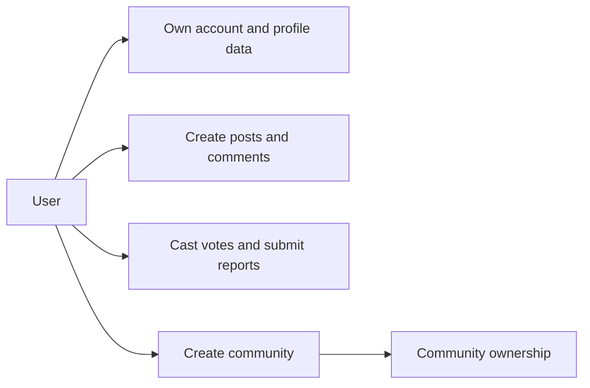
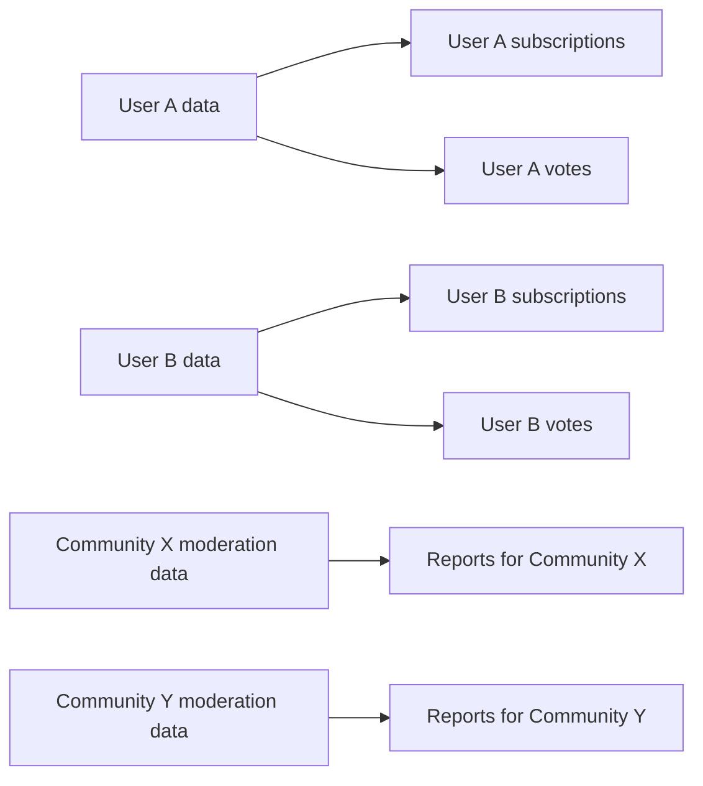
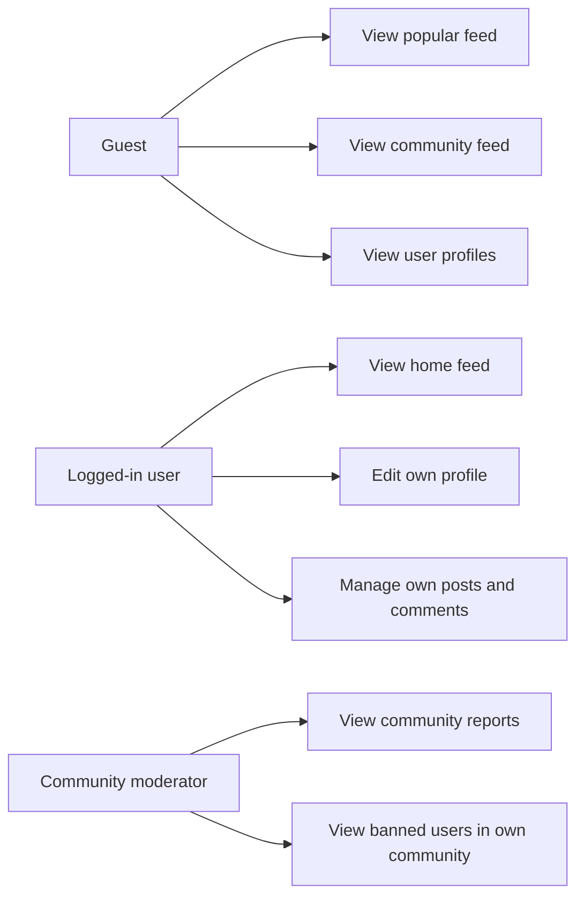
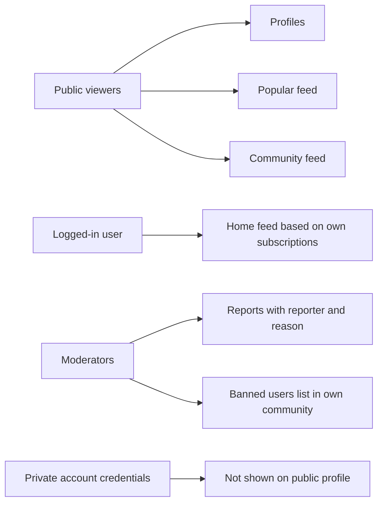
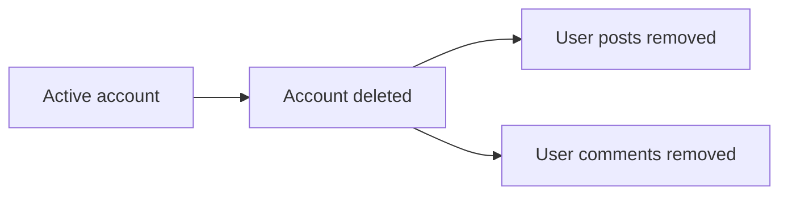
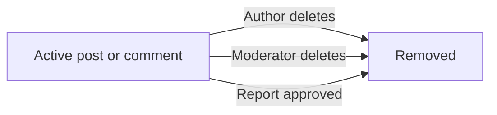
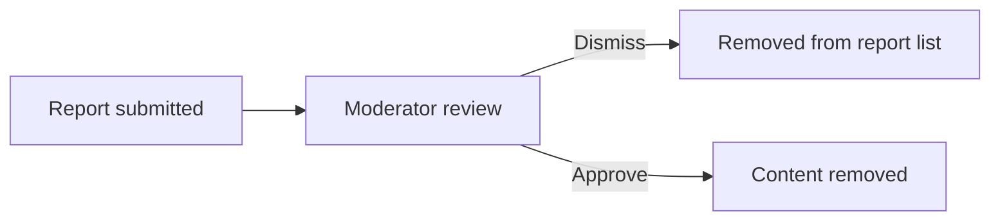
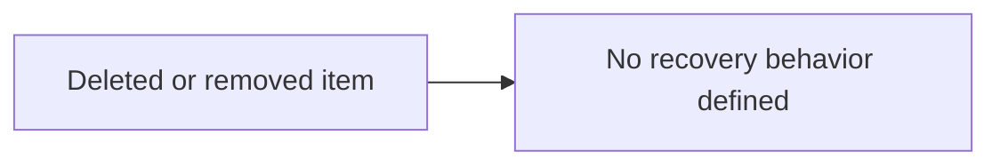
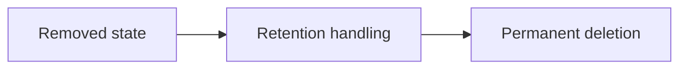

**communityPlatform — Data ownership, privacy, retention, and recovery policies**

Data ownership, privacy, retention, and recovery policies

# Data Policies

Data ownership, privacy, retention, and recovery policies from a business perspective.

## Data Ownership and Privacy

Define who owns what data, who can access it, and privacy boundaries between users.

### Data Ownership Boundaries

Users own the account information and profile information they provide for their own use of the platform, including their email address, username, display name, bio text, and avatar image.

Users own the posts, comments, votes, subscriptions, community creations, and reports they create through their account.

A community is owned by the user who created it. That ownership grants the highest community-specific authority for moderation decisions within that community, as defined in [01-actors-and-auth.md].

Posts and comments remain attributable to their authors while the account exists.

A user's karma score belongs to that user as a single platform-wide value derived from voting on that user's posts and comments.

When a user deletes their account, the platform must remove that user's posts and comments together with the account, as defined by the account lifecycle requirements in [01-actors-and-auth.md] and the retention policy in the data retention section of this file.

Reports belong to the user who submitted them, but their review is governed within the related community by its owner or moderators.

Votes belong to the user who cast them and affect the visible vote score and the author's karma according to the voting rules defined elsewhere.

### Data Isolation Between Users and Communities

Each user's account and profile information must be managed separately from every other user's account and profile information.

A user's subscribed communities list must be associated with that user and must not be mixed with another user's subscriptions.

A user's voting activity on posts and comments must be recorded separately for that user so that the one-vote-per-user rule can be enforced for each post and comment.

Posts, comments, reports, bans, and moderator actions must remain associated with the community to which they belong.

Moderation data for one community must remain separate from moderation data for other communities.

A ban in one community must apply only within that community and must not block the same user from viewing or participating in other communities unless separately banned there.

The home feed must be derived only from the communities to which the logged-in user is subscribed and must not use another user's subscriptions.

The community feed for one community must show only posts belonging to that community.

Reports for a post or comment must appear only within the report handling context of the related community.

A user's profile page must show that user's own posts and comments and must not merge content from other users into that profile.

### Access Control to User and Community Data

Any user may view another user's profile page.

A profile page may show only the profile information and activity explicitly defined for profile viewing: display name, bio text, avatar image, total karma score, the user's posts, and the user's comments.

Users may edit only their own display name, bio text, and avatar image.

Users may edit and delete only their own posts, except where a community moderator is permitted to delete posts within that moderator's community.

Users may edit and delete only their own comments, except where a community moderator is permitted to delete comments within that moderator's community.

The home feed must be available only to logged-in users.

The popular feed must be viewable by everyone, including logged-out users.

A community feed must be viewable by everyone.

Banned users may continue to view content in a community but must not be allowed to create posts or comments in that community.

Moderators may view reports only for their own community.

Moderators may view the list of banned users only for their own community.

Each report shown to moderators must include only the information defined for report review: the reported content, who reported it, and the reason.

Access to ownership and moderator management actions is governed by the community role rules defined in [01-actors-and-auth.md].

### Privacy and Visibility Expectations

The platform must treat user profile pages as viewable by any user because users can view any other user's profile.

The information visible on a user's profile page is limited to the profile and activity elements explicitly defined for that page: display name, bio text, avatar image, total karma score, posts created by that user, and comments written by that user.

The platform must treat popular feeds and community feeds as publicly viewable content areas because they are available to everyone.

The platform must treat the home feed as a user-specific view based on that user's subscriptions and available only after login.

A user's email address and password are account credentials used for sign up, login, and password change, and they must not be exposed as part of public profile viewing.

A user's subscription list may be viewed by that user because users can view a list of all communities they are subscribed to. No requirement in scope permits public viewing of another user's subscription list.

A report reason is provided by the reporting user for moderator review and must be visible within the community's report review process rather than as public content.

The identity of the reporting user must be shown to moderators when viewing reports because each report shows who reported it.

Banned status within a community is part of community moderation data and is visible through the banned users list to moderators in that community.

The platform must not treat account deletion as private hiding only; it must result in removal of the user's account content as specified by the account deletion and retention requirements.

## Data Retention and Recovery

Define what happens to deleted data, how long it is retained, and how users can recover it.

### Soft Deletion and Removal States

Deleted content shall enter a removed state before any permanent deletion policy is applied.

Account deletion removes the user account and also removes all posts and comments created by that user.

Post removal may occur when the post owner deletes their own post, when a moderator deletes a post in their community, or when a moderator approves a report against a post.

Comment removal may occur when the comment author deletes their own comment, when a moderator deletes a comment in their community, or when a moderator approves a report against a comment.

Removed content shall no longer appear in post feeds, community feeds, profile content lists, or report review queues where it would conflict with its removed state.

A removed user account shall no longer remain available for normal sign-in or profile viewing as an active account.

The platform shall treat removal state changes consistently regardless of whether removal was initiated by the content owner or by community moderation.

### Retention Policy

The platform shall define retention behavior only for data whose removal is explicitly described in this specification.

When a user deletes their account, the platform shall retain no active user-owned posts or comments under that account.

When content is removed through owner deletion, moderator deletion, or approved reporting, the platform shall preserve only the minimum record needed to support the resulting removal state and related review outcome, if such a record is required by the business process.

Dismissed reports shall be removed from the report list and shall not remain visible in the active moderation queue.

The specification does not define any fixed retention period for removed accounts, removed content, dismissed reports, or moderation history, so no specific duration shall be assumed.

The platform shall not present removed content as active community content during any retention stage.

Any retained record of removed content or review outcome shall remain subject to the ownership and privacy policies defined in "Data Ownership and Privacy".

### Recovery Expectations

The specification defines no user-facing recovery feature for deleted accounts, deleted posts, deleted comments, dismissed reports, or moderator-approved removals.

After a user deletes their account, the platform shall not assume the deleted account can be restored unless a recovery capability is explicitly defined elsewhere.

After a user deletes a post or comment, the platform shall not assume the deleted content can be restored unless a recovery capability is explicitly defined elsewhere.

After a moderator deletes content or approves a report that deletes content, the platform shall not assume the removed content returns automatically to active visibility.

Because dismissed reports are removed from the report list, moderators shall not expect dismissed reports to remain recoverable from the active report list.

If the business later introduces recovery capabilities, those capabilities shall be specified separately in this file as explicit retention and recovery rules.

### Permanent Deletion

Permanent deletion is the final state in which deleted accounts or removed content are no longer recoverable as active platform records.

When a user deletes their account, permanent deletion shall include the deletion of that user's posts and comments as required by the account lifecycle.

Permanent deletion shall apply consistently whether the initial removal originated from user action or community moderation, once the platform's retention handling for that item has concluded.

Once permanent deletion has occurred, the deleted account, post, comment, or dismissed report shall not reappear as active content, active profile data, or active moderation work.

The specification does not provide any time-based threshold for when permanent deletion must occur, so no exact schedule shall be inferred.

The platform shall ensure that permanent deletion does not conflict with the removal outcomes already defined in this section.

# Storage Capacity

Storage capacity planning and CDN requirements.

## Storage Capacity Requirements

Define storage requirements and capacity planning for file storage.

### Storage Capacity Scope Limitation

The approved source requirements do not define any storage capacity targets, storage volume expectations, growth limits, or file storage planning constraints for this platform.

This specification therefore does not establish any storage capacity commitment for profile images, community icons, post images, or other stored content.

Any future storage capacity requirement must be added only when an explicit business requirement defines the needed scope, such as expected storage limits, retention volume, or business ownership of uploaded media.

Until such source requirements are provided, storage capacity planning remains out of scope for this document.

### CDN Scope Limitation

The approved source requirements do not mention a content delivery network, media distribution layer, geographic delivery policy, or any related distribution requirement.

This specification therefore does not define any CDN requirement for avatar images, community icons, post images, or other platform content.

If CDN behavior is needed in the future, it must be introduced through explicit source requirements and documented as a separate non-functional policy.

Until such source requirements are provided, CDN expectations remain out of scope for this document.

### Capacity Governance for Future Additions

Because no explicit capacity requirements were provided, the system requirements in this document do not assign business limits, allocation rules, or planning thresholds for stored content.

Any future capacity requirement must remain consistent with the platform concepts already defined in the domain model, especially user profiles, communities, and image-based posts, and must not contradict the retention and deletion policies defined in this file.

Any future capacity requirement must also be documented in business language and must state who owns the affected content, which business content is covered, and what retention relationship applies.

No additional assumptions about storage growth, media delivery scale, or infrastructure sizing are approved by this specification.