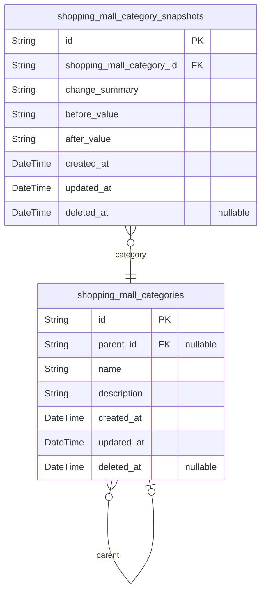
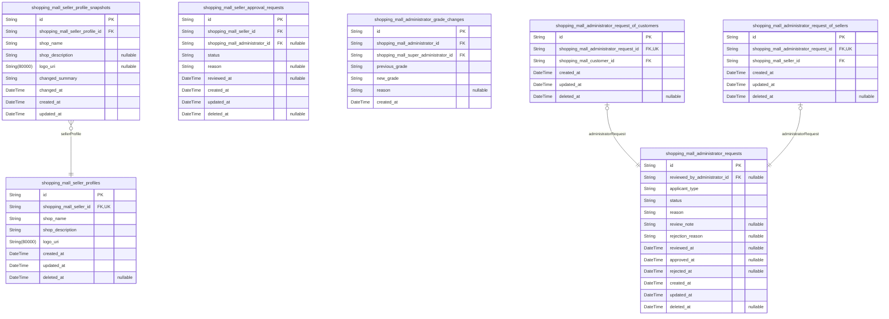
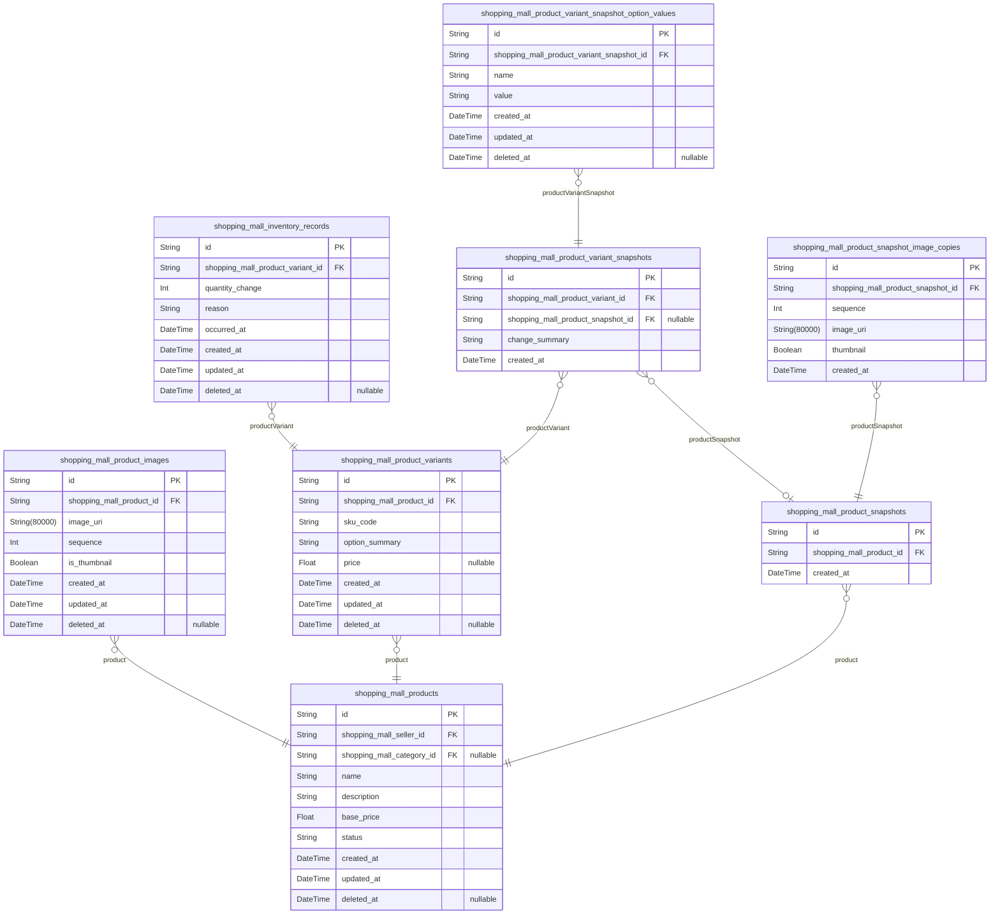
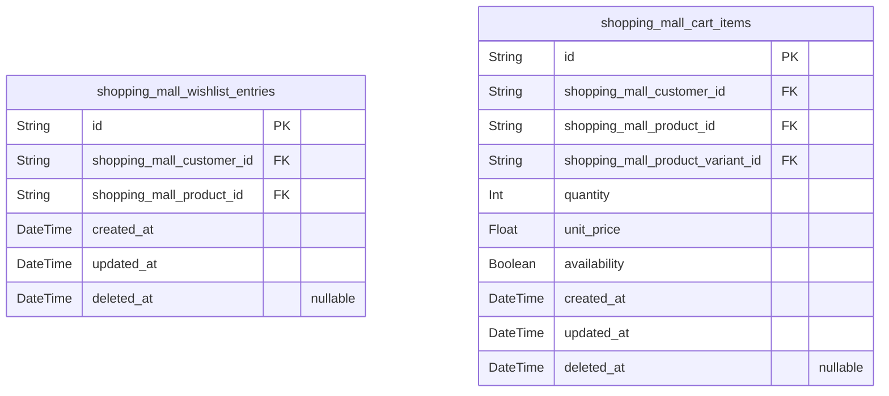
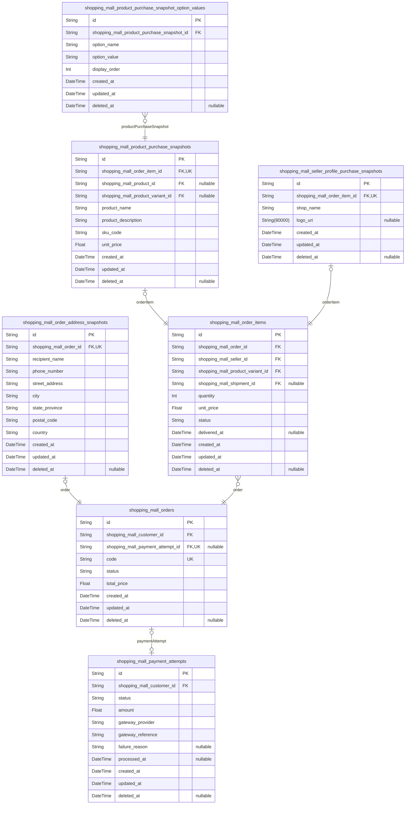
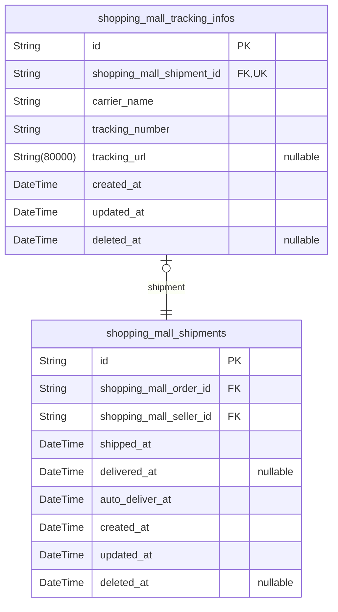
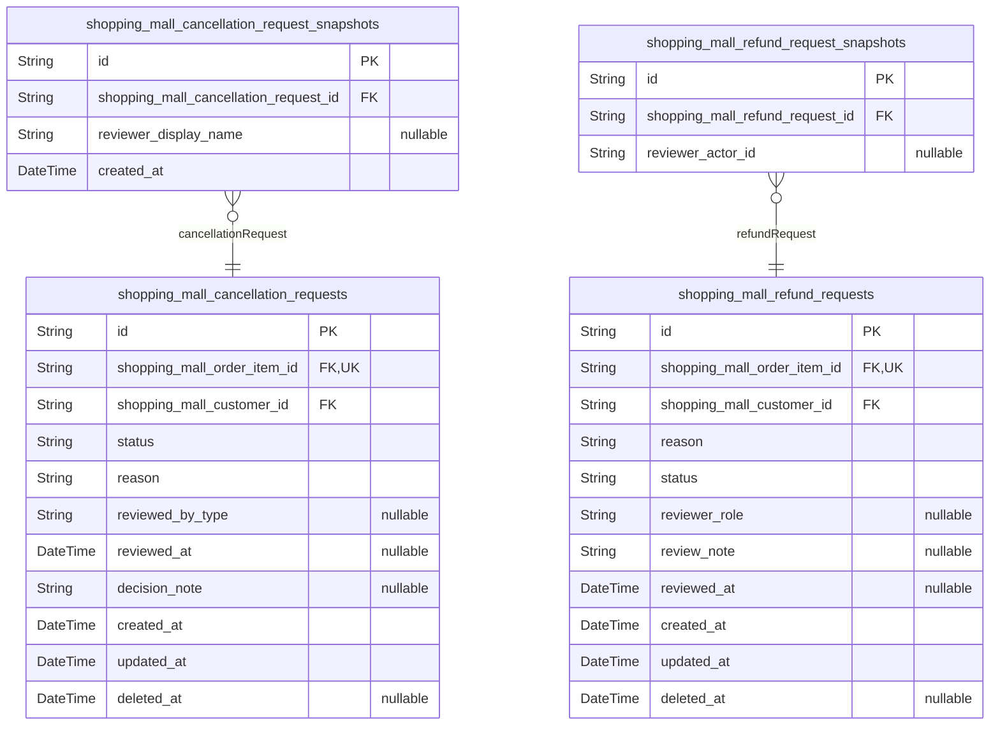
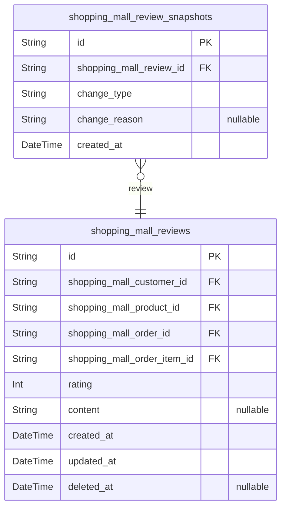
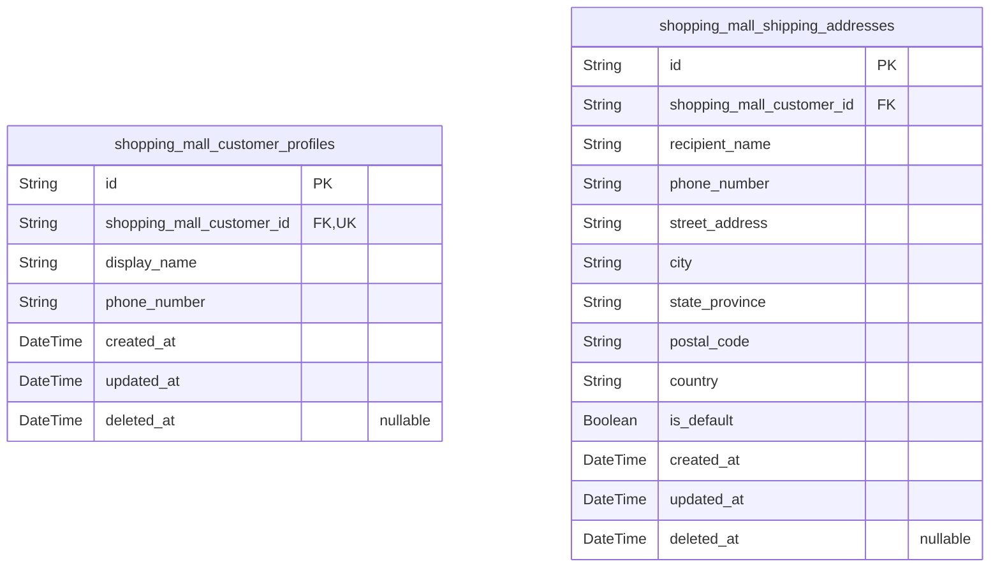

# Prisma Markdown

> Generated by [`prisma-markdown`](https://github.com/samchon/prisma-markdown)

- [Actors](#actors)
- [Systematic](#systematic)
- [Governance](#governance)
- [Catalog](#catalog)
- [Shopping](#shopping)
- [Orders](#orders)
- [Fulfillment](#fulfillment)
- [AfterSales](#aftersales)
- [Reviews](#reviews)
- [Customer](#customer)

## Actors

```mermaid
erDiagram
"shopping_mall_customers" {
  String id PK
  String email UK
  String password_hash
  DateTime banned_at "nullable"
  DateTime created_at
  DateTime updated_at
  DateTime deleted_at "nullable"
}
"shopping_mall_customer_sessions" {
  String id PK
  String shopping_mall_customer_id FK
  String ip
  String href
  String referrer
  DateTime created_at
  DateTime expired_at
}
"shopping_mall_customer_password_resets" {
  String id PK
  String shopping_mall_customer_id FK
  String token UK
  DateTime expired_at
  DateTime consumed_at "nullable"
  DateTime created_at
  DateTime updated_at
}
"shopping_mall_sellers" {
  String id PK
  String email UK
  String password_hash
  String approval_status
  String rejection_reason "nullable"
  Boolean suspended
  Boolean banned
  DateTime created_at
  DateTime updated_at
  DateTime deleted_at "nullable"
}
"shopping_mall_seller_sessions" {
  String id PK
  String shopping_mall_seller_id FK
  String ip
  String href
  String referrer
  DateTime created_at
  DateTime expired_at
}
"shopping_mall_seller_password_resets" {
  String id PK
  String shopping_mall_seller_id FK
  String token UK
  DateTime expired_at
  DateTime used_at "nullable"
  DateTime created_at
  DateTime updated_at
  DateTime deleted_at "nullable"
}
"shopping_mall_administrators" {
  String id PK
  String email UK
  String password_hash
  Boolean active
  Boolean banned
  DateTime created_at
  DateTime updated_at
  DateTime deleted_at "nullable"
}
"shopping_mall_administrator_sessions" {
  String id PK
  String shopping_mall_administrator_id FK
  String ip
  String href
  String referrer
  DateTime created_at
  DateTime expired_at
}
"shopping_mall_administrator_password_resets" {
  String id PK
  String shopping_mall_administrator_id FK
  String token UK
  DateTime expired_at
  DateTime used_at "nullable"
  DateTime created_at
  DateTime updated_at
  DateTime deleted_at "nullable"
}
"shopping_mall_super_administrators" {
  String id PK
  String email UK
  String password_hash
  Boolean active
  DateTime created_at
  DateTime updated_at
  DateTime deleted_at "nullable"
}
"shopping_mall_super_administrator_sessions" {
  String id PK
  String shopping_mall_super_administrator_id FK
  String ip
  String href
  String referrer
  DateTime created_at
  DateTime expired_at
}
"shopping_mall_super_administrator_password_resets" {
  String id PK
  String shopping_mall_super_administrator_id FK
  String token UK
  DateTime expired_at
  DateTime consumed_at "nullable"
  DateTime created_at
  DateTime updated_at
  DateTime deleted_at "nullable"
}
"shopping_mall_customer_sessions" }o--|| "shopping_mall_customers" : customer
"shopping_mall_customer_password_resets" }o--|| "shopping_mall_customers" : customer
"shopping_mall_seller_sessions" }o--|| "shopping_mall_sellers" : seller
"shopping_mall_seller_password_resets" }o--|| "shopping_mall_sellers" : seller
"shopping_mall_administrator_sessions" }o--|| "shopping_mall_administrators" : administrator
"shopping_mall_administrator_password_resets" }o--|| "shopping_mall_administrators" : administrator
"shopping_mall_super_administrator_sessions" }o--|| "shopping_mall_super_administrators" : superAdministrator
"shopping_mall_super_administrator_password_resets" }o--|| "shopping_mall_super_administrators" : superAdministrator
```

### `shopping_mall_customers`

Registered customer account identities for the shopping mall platform.

This table stores the canonical authenticated customer record used for
login, account lifecycle control, and historical ownership across
customer orders, reviews, wishlist entries, cart items, and administrator
requests. It intentionally contains only account-level identity and
access fields, while mutable customer-facing profile data is separated
into [shopping_mall_customer_profiles](#shopping_mall_customer_profiles) to preserve normalization
and lifecycle independence.

Customer records are soft-deletable so past commerce and review history
can remain linked even after a customer removes their account. Banned
customers remain preserved in this table and are prevented from
authenticating, while child authentication and business records continue
to reference this actor record.

Properties as follows:

- `id`: Primary Key.
- `email`
  > Unique login email address used as the customer's authentication
  > identifier.
- `password_hash`: Hashed password credential for customer authentication.
- `banned_at`
  > Timestamp when the customer account was banned from login; null means the
  > account is not currently banned.
- `created_at`: Timestamp when the customer account was registered.
- `updated_at`: Timestamp when the customer account was last updated.
- `deleted_at`
  > Timestamp when the customer account was soft-deleted while preserving
  > historical references.

### `shopping_mall_customer_sessions`

Authenticated login sessions for registered customers.

This table stores per-login customer session records used to audit access
history and enforce session expiration for {@link
shopping_mall_customers}. Each record belongs to exactly one customer
account and captures the client connection context present at session
creation, including IP address, current href, and referrer.

The table follows the dedicated actor-session pattern for the shopping
mall platform. Multiple session records may exist for the same customer
over time, enabling secure logout handling, expiration checks, and
investigation of recent sign-in activity without duplicating customer
identity data in violation of normalization rules.

Properties as follows:

- `id`: Primary Key.
- `shopping_mall_customer_id`: Owner customer account's [shopping_mall_customers.id](#shopping_mall_customers).
- `ip`: IP address observed when the customer session was created.
- `href`: Application href from which the customer session was initiated.
- `referrer`: HTTP referrer associated with the customer session creation request.
- `created_at`: Timestamp when this customer session was created.
- `expired_at`
  > Timestamp when this customer session expires and is no longer valid for
  > authentication.

### `shopping_mall_customer_password_resets`

Single-use password reset records for [shopping_mall_customers](#shopping_mall_customers)
accounts.

This table stores issued reset tokens used during customer credential
recovery, together with expiration and consumption timestamps. It exists
as an authentication support entity so reset attempts can be validated,
expired, and audited without modifying the customer actor record
directly.

Each record belongs to exactly one customer account, may be consumed at
most once, and remains retained for security review and account recovery
traceability.

Properties as follows:

- `id`: Primary Key.
- `shopping_mall_customer_id`: Owner customer account's [shopping_mall_customers.id](#shopping_mall_customers).
- `token`: Unique password reset token issued for customer credential recovery.
- `expired_at`
  > Time when the password reset token becomes invalid and can no longer be
  > used.
- `consumed_at`
  > Time when the password reset token was successfully used for a password
  > change.
- `created_at`: Time when this password reset record was issued.
- `updated_at`
  > Time when this password reset record was last updated, such as when it
  > was consumed.

### `shopping_mall_sellers`

Registered seller accounts with authentication credentials and
account-level marketplace access controls.

This actor table is the canonical identity record for sellers who sign in
with email and password. It stores the current approval standing required
before a seller may sell on the platform, plus restriction flags that
affect login or selling authority such as suspension and ban.

The table preserves historical continuity through soft deletion so
downstream records such as [shopping_mall_products](#shopping_mall_products), {@link
shopping_mall_orders}, [shopping_mall_order_items](#shopping_mall_order_items), {@link
shopping_mall_shipments}, and seller-related snapshots can continue
referencing the seller account after operational deletion. Child records
such as [shopping_mall_seller_sessions](#shopping_mall_seller_sessions), {@link
shopping_mall_seller_password_resets}, {@link
shopping_mall_seller_profiles}, and {@link
shopping_mall_seller_approval_requests} reference this table rather than
being embedded here.

Properties as follows:

- `id`: Primary Key.
- `email`
  > Seller login email address used as the unique account identifier for
  > authentication.
- `password_hash`: Hashed seller password used for secure credential verification.
- `approval_status`
  > Current seller approval standing controlling whether the account is
  > pending review, approved for selling, or rejected.
- `rejection_reason`
  > Administrator-provided rejection explanation visible to the seller when
  > the current approval status is rejected.
- `suspended`
  > Whether the seller is currently suspended from creating or editing
  > products while still handling existing orders.
- `banned`: Whether the seller is banned from logging in and using the platform.
- `created_at`: When this seller account was created.
- `updated_at`: When this seller account was last updated.
- `deleted_at`
  > When this seller account was soft deleted, preserving historical
  > references after account deletion.

### `shopping_mall_seller_sessions`

Authenticated login sessions for seller accounts.

This table records each seller sign-in context for session lifecycle
control, audit visibility, and logout or expiration handling. Each record
belongs to exactly one [shopping_mall_sellers](#shopping_mall_sellers) account and stores
the connection metadata captured at session creation time.

The model follows the dedicated actor-session pattern for seller
authentication and is intentionally limited to session tracking fields
rather than seller profile or approval data.

Properties as follows:

- `id`: Primary Key.
- `shopping_mall_seller_id`: Belonged seller account's [shopping_mall_sellers.id](#shopping_mall_sellers).
- `ip`: IP address from which the seller session was created.
- `href`: Originating client URL associated with the seller login session.
- `referrer`: Referrer URL captured when the seller session was established.
- `created_at`: When the seller session was created.
- `expired_at`: When the seller session expires and is no longer valid for authentication.

### `shopping_mall_seller_password_resets`

Password reset records for seller credential recovery.

This table stores single-use reset tokens issued for {@link
shopping_mall_sellers} so sellers can recover access to their accounts
when they cannot authenticate with their current password. Each record
belongs to one seller account, expires at a defined time, and may be
marked as consumed once the password reset flow succeeds.

The model is intentionally separated from the seller actor table to keep
authentication support concerns normalized and to preserve a traceable
history of reset issuance without introducing circular foreign keys. Soft
deletion allows operational cleanup while retaining audit-friendly
lifecycle information.

Properties as follows:

- `id`: Primary Key.
- `shopping_mall_seller_id`
  > Seller account that owns this password reset record. {@link
  > shopping_mall_sellers.id}.
- `token`: Unique password reset token presented during credential recovery.
- `expired_at`: Time after which the password reset token is no longer valid.
- `used_at`
  > Time when the password reset token was consumed successfully. Null means
  > the token has not been used yet.
- `created_at`: Time when this password reset token was issued.
- `updated_at`: Time when this password reset record was last updated.
- `deleted_at`
  > Soft deletion time for this password reset record. Null means the record
  > remains active for retention purposes.

### `shopping_mall_administrators`

Administrator accounts with email and password credentials for elevated
platform governance access.

This actor table stores the canonical administrator identity used for
authentication, moderation eligibility, and audit-linked governance
actions across the marketplace. It is intentionally separate from
customer, seller, and super administrator identities because
administrator authority is a distinct authenticated role.

The table records credential data and access-control lifecycle fields
such as active and banned state so administrative login can be allowed or
denied according to governance policy. Related login sessions and
password recovery records are managed in dedicated child tables such as
[shopping_mall_administrator_sessions](#shopping_mall_administrator_sessions) and {@link
shopping_mall_administrator_password_resets}.

Properties as follows:

- `id`: Primary Key.
- `email`: Unique administrator email address used as the login identifier.
- `password_hash`: Password hash for administrator authentication.
- `active`
  > Whether the administrator account is currently active and permitted to
  > operate under normal governance status.
- `banned`
  > Whether the administrator account is banned and therefore blocked from
  > authenticated platform access.
- `created_at`: When the administrator account was created.
- `updated_at`: When the administrator account was last updated.
- `deleted_at`: When the administrator account was soft deleted, if it has been deleted.

### `shopping_mall_administrator_sessions`

Administrator login sessions for secure elevated platform access.

This table records authenticated session instances for {@link
shopping_mall_administrators}, storing connection context and expiration
timing needed for login, logout, and session validation flows. It is an
append-oriented security table rather than a business-domain entity,
allowing multiple concurrent or historical sessions per administrator
account for audit and access-control purposes.

Properties as follows:

- `id`: Primary Key.
- `shopping_mall_administrator_id`: Authenticated administrator's [shopping_mall_administrators.id](#shopping_mall_administrators).
- `ip`: Client IP address captured when the administrator session was created.
- `href`: Origin or entry URL associated with the administrator session creation.
- `referrer`
  > HTTP referrer or referring location associated with the administrator
  > session creation.
- `created_at`: Timestamp when the administrator session was created.
- `expired_at`
  > Timestamp when the administrator session expires and is no longer valid
  > for authentication.

### `shopping_mall_administrator_password_resets`

Single-use password reset tokens issued for administrator account
credential recovery.

Each record belongs to one [shopping_mall_administrators](#shopping_mall_administrators) account
and stores the token lifecycle needed for secure recovery, including
expiration and whether the token has already been consumed. The table
supports audit-friendly retention of reset issuance history without
placing recovery state directly on the administrator actor table.

Properties as follows:

- `id`: Primary Key.
- `shopping_mall_administrator_id`: Owner administrator account's [shopping_mall_administrators.id](#shopping_mall_administrators).
- `token`
  > Unique password reset token value issued for administrator credential
  > recovery.
- `expired_at`: Timestamp when the password reset token is no longer valid.
- `used_at`
  > Timestamp when the password reset token was consumed successfully. Null
  > means the token has not been used yet.
- `created_at`: Timestamp when this password reset token record was issued.
- `updated_at`: Timestamp when this password reset token record was last updated.
- `deleted_at`
  > Soft deletion timestamp for administrative retention control. Null means
  > the record remains active.

### `shopping_mall_super_administrators`

Super administrator identities for the highest level of platform governance.

This table stores the canonical authenticated account for the most
privileged administrative actor, including email-based credentials and
lifecycle state used to control platform access. It is intentionally
separate from [shopping_mall_administrators](#shopping_mall_administrators) because super
administrators have distinct authority over administrator requests and
administrative grade control.

Related session and password recovery records are stored in dedicated
child tables such as [shopping_mall_super_administrator_sessions](#shopping_mall_super_administrator_sessions);
this actor table remains the root identity record and does not contain
child-facing foreign keys.

Properties as follows:

- `id`: Primary Key.
- `email`: Unique email address used as the super administrator login identifier.
- `password_hash`: Hashed password used to authenticate the super administrator account.
- `active`
  > Whether the super administrator account is currently allowed to access
  > the platform.
- `created_at`: When this super administrator account was created.
- `updated_at`: When this super administrator account was last updated.
- `deleted_at`
  > When this super administrator account was soft deleted, if deletion has
  > occurred.

### `shopping_mall_super_administrator_sessions`

Login sessions for [shopping_mall_super_administrators](#shopping_mall_super_administrators).

This table records each authenticated super administrator session with
client connection context and expiration time for security auditing,
logout handling, and privileged access lifecycle management. It supports
many sessions per super administrator while keeping identity and
credential data in the parent actor table.

Properties as follows:

- `id`: Primary Key.
- `shopping_mall_super_administrator_id`: Owner super administrator's [shopping_mall_super_administrators.id](#shopping_mall_super_administrators).
- `ip`
  > Client IP address captured when the super administrator session was
  > created.
- `href`
  > Client location or originating application URL associated with the
  > session creation context.
- `referrer`
  > HTTP referrer or equivalent navigation source recorded for the session
  > creation context.
- `created_at`: Timestamp when the super administrator session was issued.
- `expired_at`
  > Timestamp when the super administrator session expires and is no longer
  > valid for authentication.

### `shopping_mall_super_administrator_password_resets`

Password reset records for [shopping_mall_super_administrators](#shopping_mall_super_administrators)
used to recover super administrator credentials.

Each row represents a single issued reset token with expiration and
single-use consumption tracking. The table preserves security-relevant
lifecycle history without duplicating actor credential data, allowing
multiple reset attempts over time for the same super administrator
account.

Properties as follows:

- `id`: Primary Key.
- `shopping_mall_super_administrator_id`: Owner super administrator's [shopping_mall_super_administrators.id](#shopping_mall_super_administrators).
- `token`: Unique password reset token issued for credential recovery.
- `expired_at`: Timestamp when the reset token becomes invalid and can no longer be used.
- `consumed_at`
  > Timestamp when the reset token was used successfully, enforcing
  > single-use behavior.
- `created_at`: Timestamp when this password reset record was created.
- `updated_at`: Timestamp when this password reset record was last updated.
- `deleted_at`: Soft deletion timestamp for administrative lifecycle control.

## Systematic

### `shopping_mall_categories`

Catalog categories and subcategories used to classify products for
storefront browsing and administrative catalog management.

This table stores the active category taxonomy for the shopping mall
platform. A category may be a top-level node or a single-level child of
another category through a self-referential parent relationship. Products
in the catalog domain reference these categories for classification,
while deleted categories can be handled by uncategorizing affected
products without rewriting historical records.

Editable category changes are audited through {@link
shopping_mall_category_snapshots}, so this table keeps only the current
category state. Soft deletion preserves referential stability and
historical traceability while removing categories from active browsing
flows.

Properties as follows:

- `id`: Primary Key.
- `parent_id`
  > Parent category's [shopping_mall_categories.id](#shopping_mall_categories). Null for top-level
  > categories and set for one-level subcategories.
- `name`
  > Display name of the category used in administrative management and
  > customer browsing.
- `description`
  > Human-readable explanation of the category's purpose and what kinds of
  > products belong in it.
- `created_at`: When this category record was created.
- `updated_at`: When this category record was last updated.
- `deleted_at`: When this category was soft deleted. Null means the category is active.

### `shopping_mall_category_snapshots`

Immutable audit snapshots recording category change events for
administrator review and historical traceability.

Each record belongs to a single [shopping_mall_categories.id](#shopping_mall_categories) and
preserves child-specific audit metadata about a captured category change,
such as a human-readable summary and before-and-after textual
descriptions of the relevant change. The live category's current business
fields remain on [shopping_mall_categories](#shopping_mall_categories), and this table exists
to retain append-only historical context about change events without
duplicating the parent's active attributes.

This model is a snapshot table used for audit trails rather than direct
end-user editing. Rows are created when meaningful category changes are
recorded and are expected to remain append-only in normal business
behavior.

Properties as follows:

- `id`: Primary Key.
- `shopping_mall_category_id`
  > Category for which this historical audit snapshot was recorded. {@link
  > shopping_mall_categories.id}.
- `change_summary`
  > Human-readable summary of what category-related change was recorded when
  > this snapshot was created.
- `before_value`
  > Human-readable textual description of the relevant category state before
  > the recorded change.
- `after_value`
  > Human-readable textual description of the relevant category state after
  > the recorded change.
- `created_at`: Timestamp when this snapshot record was created.
- `updated_at`
  > System timestamp maintained for structural consistency with platform
  > entities, though snapshot rows are append-only in business behavior.
- `deleted_at`
  > Soft-delete timestamp reserved for platform-wide temporal consistency.
  > Snapshot rows should normally remain undeleted.

## Governance

### `shopping_mall_seller_profiles`

Public storefront identity for a seller account.

This table stores the active shop-facing profile shown to customers,
including the seller's shop name, description, and logo reference. It is
a dependent extension of [shopping_mall_sellers](#shopping_mall_sellers) and enforces
exactly one profile per seller through a unique foreign key.

Historical edits are preserved in the separate snapshot table assigned
elsewhere, while this table only keeps the current active profile state
used for public display and seller-managed updates.

Properties as follows:

- `id`: Primary Key.
- `shopping_mall_seller_id`: Owner seller account's [shopping_mall_sellers.id](#shopping_mall_sellers).
- `shop_name`
  > Public shop name displayed in storefronts, product listings, and seller
  > profile pages.
- `shop_description`
  > Seller-provided public description of the shop shown to customers on the
  > seller profile page.
- `logo_uri`: URI of the shop logo image currently used for public seller branding.
- `created_at`: When this seller profile was first created.
- `updated_at`: When this seller profile was most recently updated.
- `deleted_at`: When this seller profile was soft deleted, if it is no longer active.

### `shopping_mall_seller_profile_snapshots`

Immutable historical snapshots of seller profile changes.

This table preserves the prior public shop identity state of a seller
profile each time the seller updates editable storefront information such
as shop name, shop description, or logo URI. It supports audit review,
dispute resolution, and historical inspection after later edits to the
active [shopping_mall_seller_profiles](#shopping_mall_seller_profiles) record.

Each row belongs to exactly one seller profile and is intended to be
append-only. The snapshot stores the point-in-time seller-facing values
that existed before or at the change event together with concise change
metadata describing what was changed.

Properties as follows:

- `id`: Primary Key.
- `shopping_mall_seller_profile_id`: Referenced seller profile's [shopping_mall_seller_profiles.id](#shopping_mall_seller_profiles).
- `shop_name`: Seller shop name preserved as the snapshot state.
- `shop_description`: Seller shop description preserved as the snapshot state.
- `logo_uri`: Seller shop logo URI preserved as the snapshot state.
- `changed_summary`
  > Concise human-readable summary of what changed in this seller profile
  > edit event.
- `changed_at`
  > Business timestamp when the seller profile change that produced this
  > snapshot occurred.
- `created_at`: Timestamp when this snapshot record was created.
- `updated_at`
  > Timestamp maintained equal to creation time because snapshot rows are
  > immutable after insertion.

### `shopping_mall_seller_approval_requests`

Seller account approval applications submitted for marketplace selling
eligibility.

This table records each governance case in which a seller requests or
re-requests approval to sell on the platform. Each request belongs to one
seller account in [shopping_mall_sellers](#shopping_mall_sellers) and may later be reviewed
by one administrator in [shopping_mall_administrators](#shopping_mall_administrators).

It stores the current workflow state, review timing, and seller-provided
submission context for the case. Historical re-submission is preserved by
allowing multiple requests over time for the same seller rather than
overwriting past decisions.

Properties as follows:

- `id`: Primary Key.
- `shopping_mall_seller_id`
  > Seller account that submitted this approval case. {@link
  > shopping_mall_sellers.id}.
- `shopping_mall_administrator_id`
  > Administrator who reviewed or decided this approval case when the request
  > is no longer pending. [shopping_mall_administrators.id](#shopping_mall_administrators).
- `status`
  > Current review state of the seller approval request, such as pending,
  > approved, or rejected.
- `reason`
  > Seller-provided submission reason or contextual statement supporting the
  > request for selling approval.
- `reviewed_at`
  > Timestamp when an administrator finalized the approval or rejection
  > decision for this request.
- `created_at`: Timestamp when the approval request was created.
- `updated_at`: Timestamp when the approval request was last updated.
- `deleted_at`
  > Soft deletion timestamp for this approval request record when it is
  > hidden from active workflows.

### `shopping_mall_administrator_requests`

Administrator standing applications submitted by existing platform users
for governance elevation.

This table stores the request-level workflow, applicant type
classification, applicant's stated reason, and administrative review
outcome for a single administrator-role application. Concrete applicant
ownership is normalized into dedicated subtype tables so the main request
record remains a single concept without multiple nullable actor foreign
keys.

Each request may be reviewed by an existing {@link
shopping_mall_administrators} record. Review timestamps and reason fields
preserve the current governance decision state while keeping the table
suitable for queue browsing and oversight.

Properties as follows:

- `id`: Primary Key.
- `reviewed_by_administrator_id`
  > Administrator who reviewed this request. {@link
  > shopping_mall_administrators.id}.
- `applicant_type`
  > Applicant actor type for this request. Expected governance values are
  > customer or seller, and detailed ownership is stored in a dedicated
  > subtype table.
- `status`
  > Current workflow state of the administrator request. Expected values are
  > pending, approved, or rejected.
- `reason`
  > Applicant-provided reason explaining why administrator standing is being
  > requested.
- `review_note`
  > Optional reviewer note summarizing the administrative decision or
  > internal governance context.
- `rejection_reason`: Reason provided when the request is rejected.
- `reviewed_at`: When an administrator reviewed this request.
- `approved_at`: When this request was approved and administrator standing was granted.
- `rejected_at`: When this request was rejected.
- `created_at`: When this administrator request was created.
- `updated_at`: When this administrator request was last updated.
- `deleted_at`: Soft deletion timestamp for this administrator request.

### `shopping_mall_administrator_grade_changes`

Immutable audit records of administrator promotion and demotion decisions.

Each record captures one completed governance action affecting an
existing [shopping_mall_administrators](#shopping_mall_administrators) account, including the
previous grade, the new grade, the acting {@link
shopping_mall_super_administrators} authority, and any optional
explanatory note. The table preserves administrative authority changes
for traceability, oversight, and dispute review.

This table is append-only by design. Rows represent historical events and
should never be updated or deleted after creation.

Properties as follows:

- `id`: Primary Key.
- `shopping_mall_administrator_id`
  > Administrator account whose grade was changed. {@link
  > shopping_mall_administrators.id}.
- `shopping_mall_super_administrator_id`
  > Super administrator account that executed this grade change. {@link
  > shopping_mall_super_administrators.id}.
- `previous_grade`: Administrator grade assigned before this governance change.
- `new_grade`: Administrator grade assigned after this governance change.
- `reason`: Optional explanatory note recorded for the promotion or demotion decision.
- `created_at`: When this administrator grade change was executed and recorded.

### `shopping_mall_administrator_request_of_customers`

Concrete customer-applicant subtype for an administrator request.

This table links a single [shopping_mall_administrator_requests](#shopping_mall_administrator_requests)
record to the concrete [shopping_mall_customers](#shopping_mall_customers) account that
submitted it when the request originates from a customer. It keeps
applicant ownership normalized by storing only foreign keys and lifecycle
timestamps, while the main request table retains the reason, review
status, and decision data.

The relation to the administrator request is one-to-one, ensuring a
request can have at most one customer applicant subtype row. A customer
may submit multiple administrator requests over time, so many rows in
this table may reference the same customer account.

Properties as follows:

- `id`: Primary Key.
- `shopping_mall_administrator_request_id`
  > Linked administrator request's {@link
  > shopping_mall_administrator_requests.id}.
- `shopping_mall_customer_id`: Customer applicant's [shopping_mall_customers.id](#shopping_mall_customers).
- `created_at`: When this customer-applicant subtype link was created.
- `updated_at`: When this customer-applicant subtype link was last updated.
- `deleted_at`: When this customer-applicant subtype link was soft-deleted, if ever.

### `shopping_mall_administrator_request_of_sellers`

Seller-applicant subtype record for an administrator request.

This table links a single [shopping_mall_administrator_requests](#shopping_mall_administrator_requests)
record to the concrete seller account that submitted it when the
applicant is a seller. It exists as a dependent governance structure
rather than an independently managed business entity.

The model stores only normalized ownership linkage and audit timestamps.
Seller identity details and administrator-request workflow details remain
in their own source tables, avoiding duplication and preserving third
normal form.

Properties as follows:

- `id`: Primary Key.
- `shopping_mall_administrator_request_id`
  > Linked administrator request's {@link
  > shopping_mall_administrator_requests.id}.
- `shopping_mall_seller_id`: Seller applicant's [shopping_mall_sellers.id](#shopping_mall_sellers).
- `created_at`: When this seller-applicant subtype record was created.
- `updated_at`: When this seller-applicant subtype record was last updated.
- `deleted_at`
  > Soft deletion time for this seller-applicant subtype record, if it is
  > logically removed.

## Catalog

### `shopping_mall_products`

Seller-owned product listings that define the current sellable catalog
record for marketplace browsing and purchase preparation.

Each product stores the seller-controlled merchandise identity, current
category assignment, current base price, and lifecycle status used to
determine listing visibility and operational availability. The product is
the parent record for [shopping_mall_product_images](#shopping_mall_product_images), {@link
shopping_mall_product_variants}, and {@link
shopping_mall_product_snapshots}, while search result enrichments such as
rating averages or price ranges are intentionally derived outside this
table to preserve normalization.

Properties as follows:

- `id`: Primary Key.
- `shopping_mall_seller_id`: Owner seller account's [shopping_mall_sellers.id](#shopping_mall_sellers).
- `shopping_mall_category_id`
  > Current assigned category's [shopping_mall_categories.id](#shopping_mall_categories). Nullable
  > when the product becomes uncategorized after category deletion.
- `name`: Current product name shown in catalog listings and detail pages.
- `description`: Current seller-provided product description shown on the detail page.
- `base_price`
  > Current base merchandise price before any variant-level price override is
  > applied.
- `status`
  > Current product lifecycle and listing state such as active, hidden, or
  > deleted, used to enforce search visibility and purchase availability
  > policies.
- `created_at`: When the product listing was first created.
- `updated_at`: When the current product record was last updated.
- `deleted_at`
  > When the product was soft-deleted from active listings while preserving
  > historical references.

### `shopping_mall_product_images`

Ordered gallery images belonging to a product listing.

This table stores each active or soft-deleted gallery image for a single
[shopping_mall_products](#shopping_mall_products) record, including its resource URI,
product-scoped display order, and whether it is the current thumbnail
image. Product image lifecycle is managed through the parent product,
while immutable historical image state is preserved separately in {@link
shopping_mall_product_snapshot_image_copies} during product snapshot
creation.

The design keeps one row per image to satisfy normalization and supports
seller-driven reordering, thumbnail selection, and removal without
duplicating product or seller data.

Properties as follows:

- `id`: Primary Key.
- `shopping_mall_product_id`: Belonged product's [shopping_mall_products.id](#shopping_mall_products).
- `image_uri`: Stored resource location of the product gallery image.
- `sequence`
  > Product-scoped display order of the image; the lowest sequence appears
  > first in the gallery.
- `is_thumbnail`
  > Whether this image is the current thumbnail shown as the primary product
  > image.
- `created_at`: When this product image record was created.
- `updated_at`: When this product image record was last updated.
- `deleted_at`
  > When this product image was soft-deleted; null means the image is
  > currently active.

### `shopping_mall_product_variants`

Purchasable SKU-level variants belonging to a product.

This table stores the seller-managed variant identity and commercial
option combination for a [shopping_mall_products](#shopping_mall_products) record, including
its required SKU code, human-readable option combination, and optional
price override relative to the product base price. It is the canonical
source referenced by cart items, order items, inventory history, and
variant snapshot records.

Current stock is not stored in this table because inventory must be
derived from immutable [shopping_mall_inventory_records](#shopping_mall_inventory_records) rows.
Historical edits are preserved separately in {@link
shopping_mall_product_variant_snapshots}, keeping this table focused on
the active mutable variant state.

Properties as follows:

- `id`: Primary Key.
- `shopping_mall_product_id`: Parent product's [shopping_mall_products.id](#shopping_mall_products).
- `sku_code`: Seller-managed SKU identifier for this purchasable variant.
- `option_summary`
  > Human-readable atomic description of the variant option combination, such
  > as "Red / Large".
- `price`
  > Optional variant-specific selling price override; when null, the parent
  > product base price is used.
- `created_at`: When this variant was created.
- `updated_at`: When this variant was last updated.
- `deleted_at`: When this variant was soft deleted. Null means the variant is active.

### `shopping_mall_inventory_records`

Immutable stock movement ledger entries for a product variant.

Each record captures one atomic inventory change such as restocking,
manual adjustment, order placement, cancellation restoration, refund
restoration, or administrative correction. The current stock quantity is
derived by summing signed changes across records rather than storing a
mutable balance.

This table belongs to [shopping_mall_product_variants](#shopping_mall_product_variants) and supports
audit-friendly inventory tracing for sellers and administrators without
duplicating catalog or order data.

Properties as follows:

- `id`: Primary Key.
- `shopping_mall_product_variant_id`: Belonged product variant's [shopping_mall_product_variants.id](#shopping_mall_product_variants).
- `quantity_change`
  > Signed inventory delta applied by this ledger entry. Positive values
  > increase stock and negative values decrease stock.
- `reason`
  > Business reason describing why the inventory changed, such as restock,
  > order placement, cancellation restoration, refund restoration, manual
  > loss adjustment, or administrative correction.
- `occurred_at`
  > Business timestamp when the stock movement occurred and should be counted
  > in the inventory ledger.
- `created_at`: Timestamp when this inventory record was stored.
- `updated_at`
  > Timestamp when this record metadata was last updated. In normal business
  > use, immutable inventory entries should not be edited.
- `deleted_at`
  > Soft deletion timestamp. This should remain null in normal business use
  > because inventory records are intended to be preserved for audit history.

### `shopping_mall_product_snapshots`

Immutable snapshot event records for [shopping_mall_products](#shopping_mall_products).

Each row marks the creation of a historical snapshot for one product and
provides the temporal anchor used to group related snapshot child records
such as [shopping_mall_product_snapshot_image_copies](#shopping_mall_product_snapshot_image_copies) and related
variant snapshot records. Parent product attributes are intentionally
accessed through the product relationship rather than duplicated in this
child table, following the parent-child duplication constraint supplied
for this review.

Properties as follows:

- `id`: Primary Key.
- `shopping_mall_product_id`
  > Source product's [shopping_mall_products.id](#shopping_mall_products) for which this
  > snapshot event was recorded.
- `created_at`: Timestamp when this snapshot event record was created.

### `shopping_mall_product_variant_snapshots`

Immutable point-in-time history records for product-variant snapshot events.

Each record belongs to a source [shopping_mall_product_variants](#shopping_mall_product_variants)
row and may optionally participate in a broader {@link
shopping_mall_product_snapshots} capture when the variant state is
recorded as part of a full product snapshot. The table stores only
snapshot-owned audit metadata, while repeating historical option values
are normalized into a dedicated child table for atomic preservation.

These records are append-only artifacts used for administrative review,
dispute handling, and reconstruction of variant change history without
duplicating parent-owned current-state fields in this child table.

Properties as follows:

- `id`: Primary Key.
- `shopping_mall_product_variant_id`: Source product variant's [shopping_mall_product_variants.id](#shopping_mall_product_variants).
- `shopping_mall_product_snapshot_id`
  > Optional enclosing product snapshot's {@link
  > shopping_mall_product_snapshots.id} when this variant snapshot was
  > captured as part of a full product snapshot.
- `change_summary`
  > Human-readable summary of what editable variant fields changed for this
  > snapshot event.
- `created_at`: When this immutable variant snapshot record was created.

### `shopping_mall_product_snapshot_image_copies`

Immutable image copies preserved inside a product snapshot.

Each row stores one gallery image as it existed at the moment a {@link
shopping_mall_product_snapshots} record was created, including its
display order and whether it served as the snapshot thumbnail. This
design preserves historical product presentation even if live product
images are later reordered, replaced, or deleted.

Properties as follows:

- `id`: Primary Key.
- `shopping_mall_product_snapshot_id`: Parent product snapshot's [shopping_mall_product_snapshots.id](#shopping_mall_product_snapshots).
- `sequence`
  > Zero-based or ascending display order of this copied image within the
  > parent product snapshot gallery.
- `image_uri`
  > Stored image location preserved at snapshot time so historical product
  > galleries remain readable even if the live product image changes later.
- `thumbnail`
  > Whether this copied image was the main thumbnail image in the parent
  > product snapshot.
- `created_at`: When this immutable snapshot image copy row was created.

### `shopping_mall_product_variant_snapshot_option_values`

Atomic option name and value entries captured for a {@link
shopping_mall_product_variant_snapshots} record.

This table preserves each historical variant option combination in
normalized form so snapshot-time data such as color and size remain
queryable without storing arrays, JSON, or composite strings. It is a
subsidiary snapshot-support structure managed together with product
variant snapshot creation and retained for audit, comparison, and
dispute-resolution history.

Properties as follows:

- `id`: Primary Key.
- `shopping_mall_product_variant_snapshot_id`
  > Parent product variant snapshot's {@link
  > shopping_mall_product_variant_snapshots.id}.
- `name`
  > Option key captured in the historical variant state, such as color or
  > size.
- `value`
  > Option value captured for the historical variant state, such as Red or
  > Large.
- `created_at`: When this snapshot option entry record was created.
- `updated_at`: When this snapshot option entry record was last updated.
- `deleted_at`
  > Soft deletion timestamp retained for platform-wide consistency, though
  > snapshot option entries are normally preserved.

## Shopping

### `shopping_mall_wishlist_entries`

Product-level saved items that let a customer keep products for later
consideration in a personal wishlist.

Each record links one customer account to one product listing from {@link
shopping_mall_products}. The table stores only ownership and lifecycle
data so wishlist browsing remains normalized while product details,
seller identity, prices, and ratings are resolved from related catalog
tables at query time.

A customer may save a product at most once, enforced by a composite
unique constraint. Soft deletion supports lifecycle-safe removal while
preserving auditability and compatibility with broader platform retention
patterns.

Properties as follows:

- `id`: Primary Key.
- `shopping_mall_customer_id`: Owner customer's [shopping_mall_customers.id](#shopping_mall_customers).
- `shopping_mall_product_id`: Saved product's [shopping_mall_products.id](#shopping_mall_products).
- `created_at`: When the product was added to the customer's wishlist.
- `updated_at`: When this wishlist entry was last updated for lifecycle tracking.
- `deleted_at`
  > When this wishlist entry was soft-deleted, if it has been removed from
  > the active wishlist.

### `shopping_mall_cart_items`

Variant-level basket lines in a customer's shopping cart before order
creation.

Each record represents one selected product variant in one customer's
cart and stores the requested quantity together with cart-time unit
pricing and current checkout availability context. The table enforces
variant-based consolidation so the same customer cannot hold duplicate
cart lines for the same variant.

This model references both the live product and the selected variant for
cart display, validation, and removal workflows, while keeping derived
values such as subtotal or cart total out of storage. Historical purchase
preservation belongs to order-time snapshot tables, not this pre-order
cart table.

Properties as follows:

- `id`: Primary Key.
- `shopping_mall_customer_id`: Owner customer's [shopping_mall_customers.id](#shopping_mall_customers).
- `shopping_mall_product_id`: Referenced product's [shopping_mall_products.id](#shopping_mall_products).
- `shopping_mall_product_variant_id`: Selected product variant's [shopping_mall_product_variants.id](#shopping_mall_product_variants).
- `quantity`: Requested purchase quantity for the selected variant in this cart line.
- `unit_price`
  > Per-unit price captured for the cart line at the time the customer most
  > recently set or refreshed the item.
- `availability`
  > Whether the cart line is currently available for checkout based on live
  > variant existence and stock eligibility.
- `created_at`: When this cart line was first created.
- `updated_at`: When this cart line was last updated.
- `deleted_at`
  > When this cart line was soft deleted, if it has been removed from the
  > active cart.

## Orders

### `shopping_mall_payment_attempts`

Payment processing attempts initiated during customer checkout before an
order is finalized.

This table preserves both failed and successful checkout payment attempts
so the platform can support retry behavior, audit payment outcomes, and
trace the commercial event that may later lead to an order in {@link
shopping_mall_orders}. Each record belongs to one customer in {@link
shopping_mall_customers} and stores only atomic attempt-level facts
rather than denormalized cart or order details.

A successful attempt may later be linked by downstream order creation
logic, while failed attempts remain preserved even when no order is
created. This design supports payment troubleshooting, customer payment
history, and gateway reconciliation without violating normalization
rules.

Properties as follows:

- `id`: Primary Key.
- `shopping_mall_customer_id`
  > Customer who initiated this checkout payment attempt. {@link
  > shopping_mall_customers.id}.
- `status`
  > Current result of the payment attempt, such as pending, succeeded, or
  > failed.
- `amount`
  > Total payment amount submitted to the payment gateway for this checkout
  > attempt.
- `gateway_provider`
  > Name of the external payment gateway provider used to process this
  > attempt.
- `gateway_reference`
  > Provider-issued identifier used to reconcile this attempt with the
  > external payment gateway.
- `failure_reason`
  > Failure message or rejection reason returned when the payment attempt
  > does not succeed.
- `processed_at`
  > Timestamp when the gateway finished processing this attempt and returned
  > a final outcome.
- `created_at`: Timestamp when this payment attempt record was created.
- `updated_at`: Timestamp when this payment attempt record was last updated.
- `deleted_at`
  > Soft deletion timestamp retained for consistency with business entity
  > lifecycle management.

### `shopping_mall_orders`

Immutable customer order headers preserving the commercial transaction
record created after successful payment.

This table stores the top-level order record for customer order history,
administrative oversight, and downstream fulfillment coordination. It
belongs to one customer and may reference the successful payment attempt
that produced the order.

Detailed shipping address data is intentionally excluded from this model
and preserved in [shopping_mall_order_address_snapshots](#shopping_mall_order_address_snapshots). Purchased
line-level commercial state is intentionally excluded from this model and
managed through [shopping_mall_order_items](#shopping_mall_order_items).

Properties as follows:

- `id`: Primary Key.
- `shopping_mall_customer_id`: Customer who placed this order. [shopping_mall_customers.id](#shopping_mall_customers).
- `shopping_mall_payment_attempt_id`
  > Successful payment attempt that created this order, when linked. {@link
  > shopping_mall_payment_attempts.id}.
- `code`
  > Business order number shown to customers and administrators for lookup
  > and history display.
- `status`
  > Current overall order lifecycle status derived and maintained from its
  > order items, such as paid, shipped, delivered, cancelled, refunded, or
  > partially completed.
- `total_price`
  > Total commercial amount charged for the order at checkout, based on the
  > sum of purchased order items.
- `created_at`: When the order record was created after successful payment.
- `updated_at`
  > When the order header was last updated due to lifecycle progression or
  > administrative action.
- `deleted_at`
  > Soft deletion timestamp for exceptional administrative removal while
  > preserving historical integrity.

### `shopping_mall_order_address_snapshots`

Frozen shipping address details captured at checkout for a specific order.

This table preserves the exact delivery address selected during order
placement so later edits or deletion of the customer's saved shipping
addresses do not alter historical order records. It is a required
one-to-one dependent record of [shopping_mall_orders](#shopping_mall_orders) and stores
the full purchase-time delivery context used for order history,
fulfillment reference, and dispute resolution.

Properties as follows:

- `id`: Primary Key.
- `shopping_mall_order_id`: Owner order's [shopping_mall_orders.id](#shopping_mall_orders).
- `recipient_name`: Recipient name frozen at checkout for this order delivery address.
- `phone_number`: Recipient phone number frozen at checkout for delivery coordination.
- `street_address`: Primary street address line captured at checkout.
- `city`: City captured in the order-time shipping address.
- `state_province`: State or province captured in the order-time shipping address.
- `postal_code`: Postal code captured in the order-time shipping address.
- `country`: Country captured in the order-time shipping address.
- `created_at`: When this frozen order shipping address snapshot was created.
- `updated_at`
  > When this order shipping address snapshot record was last updated;
  > normally matches creation because the snapshot should remain unchanged
  > after checkout.
- `deleted_at`
  > Soft deletion timestamp. Normally null because order address snapshots
  > are preserved for historical records.

### `shopping_mall_order_items`

Purchased line items within a customer order.

Each record represents one aggregated purchase of a specific product
variant inside [shopping_mall_orders](#shopping_mall_orders), including the operational
seller responsible for fulfillment, the quantity bought, the captured
unit price at purchase time, and the current per-item lifecycle status.

This table stores only the core transactional facts needed for
fulfillment and after-sales workflows. Historical product and seller
presentation details are preserved in dedicated snapshot tables such as
[shopping_mall_product_purchase_snapshots](#shopping_mall_product_purchase_snapshots) and {@link
shopping_mall_seller_profile_purchase_snapshots}, keeping this model
normalized while preserving immutable commerce history.

Properties as follows:

- `id`: Primary Key.
- `shopping_mall_order_id`: Belonged order's [shopping_mall_orders.id](#shopping_mall_orders).
- `shopping_mall_seller_id`: Responsible seller's [shopping_mall_sellers.id](#shopping_mall_sellers).
- `shopping_mall_product_variant_id`: Purchased product variant's [shopping_mall_product_variants.id](#shopping_mall_product_variants).
- `shopping_mall_shipment_id`
  > Assigned shipment's [shopping_mall_shipments.id](#shopping_mall_shipments) when the item has
  > been shipped.
- `quantity`: Purchased quantity of the product variant represented by this order item.
- `unit_price`: Captured per-unit sale price at the moment of successful purchase.
- `status`
  > Current lifecycle state of the order item such as paid, shipped,
  > delivered, cancelled, or refunded.
- `delivered_at`
  > Timestamp when the item became delivered, used for delivery history and
  > refund eligibility calculations.
- `created_at`: Timestamp when this order item was created after successful payment.
- `updated_at`: Timestamp when this order item was last updated.
- `deleted_at`
  > Soft deletion timestamp for administrative removal without losing
  > historical traceability.

### `shopping_mall_product_purchase_snapshots`

Purchase-time snapshot of the product and product variant attached to an
order item.

This table freezes the commercial catalog state that the customer
actually bought, including product name, product description, purchased
SKU code, and the effective unit price used for that order item. It
exists so historical order records remain stable even if the seller later
edits or deletes the original catalog entities.

Each snapshot belongs to exactly one [shopping_mall_order_items](#shopping_mall_order_items)
record and is intended to be immutable after creation. Optional
references to the original [shopping_mall_products](#shopping_mall_products) and {@link
shopping_mall_product_variants} records are retained only for
traceability and administrative investigation, not as the source of truth
for historical display.

Properties as follows:

- `id`: Primary Key.
- `shopping_mall_order_item_id`
  > Order item owning this purchase-time snapshot. {@link
  > shopping_mall_order_items.id}.
- `shopping_mall_product_id`
  > Original catalog product referenced for traceability when available.
  > [shopping_mall_products.id](#shopping_mall_products).
- `shopping_mall_product_variant_id`
  > Original catalog product variant referenced for traceability when
  > available. [shopping_mall_product_variants.id](#shopping_mall_product_variants).
- `product_name`: Frozen product name shown for the purchased item at checkout time.
- `product_description`
  > Frozen product description captured at purchase time for historical order
  > detail display.
- `sku_code`
  > Frozen SKU code of the purchased product variant at the time of order
  > placement.
- `unit_price`
  > Effective per-unit purchase price applied to the order item at checkout
  > time.
- `created_at`: When this purchase snapshot was created during successful order placement.
- `updated_at`
  > Last recorded update time for the snapshot row; operationally expected to
  > remain equal to creation time because the record is immutable.
- `deleted_at`
  > Soft deletion timestamp reserved for platform-wide consistency; normally
  > null because purchase snapshots are preserved.

### `shopping_mall_seller_profile_purchase_snapshots`

Purchase-time snapshot of the seller's public shop identity for a single
order item.

This table preserves the seller-facing shop information that was shown
when the customer purchased the item, so historical order views remain
accurate even if the seller later edits the profile, is suspended, or
deletes the account. It is a 1:1 dependent child of {@link
shopping_mall_order_items} and stores denormalized seller identity fields
needed for order-history display.

Properties as follows:

- `id`: Primary Key.
- `shopping_mall_order_item_id`
  > Order item whose purchase-time seller shop identity is preserved by this
  > snapshot. [shopping_mall_order_items.id](#shopping_mall_order_items).
- `shop_name`
  > Seller shop name captured at the moment of purchase for historical order
  > display.
- `logo_uri`
  > Seller shop logo URI captured at the moment of purchase, if a logo
  > existed then.
- `created_at`
  > Timestamp when this purchase-time seller profile snapshot was created
  > during order placement.
- `updated_at`
  > Timestamp reserved for standard temporal consistency; normally equal to
  > creation time because this snapshot should remain immutable after
  > creation.
- `deleted_at`
  > Soft-delete timestamp for exceptional administrative lifecycle handling;
  > historical records are ordinarily retained and not deleted.

### `shopping_mall_product_purchase_snapshot_option_values`

Atomic option entries captured for a product purchase snapshot.

This table normalizes the selected variant option combination recorded at
purchase time, such as color, size, or material, into one row per option
key-value pair. It belongs to {@link
shopping_mall_product_purchase_snapshots} and preserves the exact
purchasable variant configuration shown in historical order details even
if the source catalog variant is later edited or deleted.

The table exists specifically to satisfy First Normal Form by avoiding
JSON or array storage for option combinations. Rows are managed only as
children of the parent purchase snapshot and are retrieved in display
order when reconstructing the purchased variant description.

Properties as follows:

- `id`: Primary Key.
- `shopping_mall_product_purchase_snapshot_id`
  > Parent product purchase snapshot's {@link
  > shopping_mall_product_purchase_snapshots.id}.
- `option_name`: Option key captured at purchase time, such as Color or Size.
- `option_value`: Selected option value captured at purchase time, such as Red or Large.
- `display_order`
  > Display sequence used to reconstruct the purchased variant option
  > combination in a stable order.
- `created_at`: When this purchase snapshot option value row was created.
- `updated_at`: When this purchase snapshot option value row was last updated.
- `deleted_at`: Soft deletion timestamp. Null means the row is active.

## Fulfillment

### `shopping_mall_shipments`

Seller fulfillment packages that group one or more purchased order items
from the same seller within a single order for shipping and delivery.

Each shipment belongs to one [shopping_mall_orders](#shopping_mall_orders) record and one
responsible [shopping_mall_sellers](#shopping_mall_sellers) record. Order items reference
the shipment from the order domain, allowing multiple same-seller items
to share one package without storing repeating item lists on the shipment
itself.

This table stores only shipment-level lifecycle facts such as when the
package was shipped, when it is expected to auto-transition to delivered
if the customer does not confirm receipt, and when delivery was
confirmed. Carrier and tracking identifiers are intentionally separated
into [shopping_mall_tracking_infos](#shopping_mall_tracking_infos) as a dependent 1:1 entity to
keep the model normalized.

Properties as follows:

- `id`: Primary Key.
- `shopping_mall_order_id`
  > The purchased order grouped by this shipment. {@link
  > shopping_mall_orders.id}.
- `shopping_mall_seller_id`
  > The seller responsible for fulfilling this shipment. {@link
  > shopping_mall_sellers.id}.
- `shipped_at`
  > Timestamp when the seller created the shipment and the included order
  > items became shipped.
- `delivered_at`
  > Timestamp when this shipment was treated as delivered, either by customer
  > confirmation or automatic completion after the waiting period.
- `auto_deliver_at`
  > Timestamp when the shipment should automatically transition to delivered
  > if the customer does not confirm receipt earlier.
- `created_at`: Timestamp when this shipment record was created.
- `updated_at`: Timestamp when this shipment record was last updated.
- `deleted_at`
  > Soft delete timestamp for administrative removal without losing
  > historical shipment references.

### `shopping_mall_tracking_infos`

Carrier and tracking identifier details attached to a shipment.

This table stores the shipment-level transit reference data entered when
a seller creates a package for one or more order items. Customers and the
responsible seller use this information to monitor package transit for a
specific [shopping_mall_shipments](#shopping_mall_shipments) record.

The model is intentionally separated from [shopping_mall_shipments](#shopping_mall_shipments)
to preserve proper one-to-one dependent-entity normalization. It stores
only carrier-specific tracking data and does not duplicate seller, order,
or order-item attributes that are already available through the shipment
relationship.

Properties as follows:

- `id`: Primary Key.
- `shopping_mall_shipment_id`: Tracked shipment's [shopping_mall_shipments.id](#shopping_mall_shipments).
- `carrier_name`: Name of the shipping carrier responsible for transporting the shipment.
- `tracking_number`: Carrier-issued tracking identifier used to trace the shipment in transit.
- `tracking_url`
  > Direct carrier tracking page URL for customer and seller transit lookup
  > when available.
- `created_at`: When this tracking information record was created.
- `updated_at`: When this tracking information record was last updated.
- `deleted_at`
  > When this tracking information record was soft deleted, if it has been
  > removed from active use.

## AfterSales

### `shopping_mall_cancellation_requests`

Active cancellation request records submitted by customers for individual
order items.

This table stores the current mutable state of a cancellation workflow,
including the customer-submitted reason, the request status, and review
routing metadata for seller or administrator handling. It references the
original purchased line item through [shopping_mall_order_items.id](#shopping_mall_order_items)
and preserves the submitting customer through {@link
shopping_mall_customers.id} without duplicating order or catalog data.

A request exists at most once per order item, while immutable change
history is preserved separately in {@link
shopping_mall_cancellation_request_snapshots}. This separation keeps the
main record normalized and operational, while snapshots support dispute
resolution and audit review.

Properties as follows:

- `id`: Primary Key.
- `shopping_mall_order_item_id`
  > Order item under cancellation review. {@link
  > shopping_mall_order_items.id}.
- `shopping_mall_customer_id`
  > Customer who submitted the cancellation request. {@link
  > shopping_mall_customers.id}.
- `status`
  > Current cancellation request status such as pending, approved, or
  > rejected.
- `reason`: Customer-provided text explaining why the order item should be cancelled.
- `reviewed_by_type`
  > Reviewer actor type for the latest decision, such as seller or
  > administrator.
- `reviewed_at`: Timestamp when the latest approval or rejection decision was recorded.
- `decision_note`
  > Optional latest reviewer note explaining the approval or rejection
  > outcome.
- `created_at`: Timestamp when the cancellation request was first created.
- `updated_at`: Timestamp when the cancellation request was last updated.
- `deleted_at`
  > Soft deletion timestamp if the active request record is ever logically
  > removed while audit history remains preserved.

### `shopping_mall_cancellation_request_snapshots`

Immutable historical child records attached to a cancellation request.

Each record belongs to a single {@link
shopping_mall_cancellation_requests} row and preserves child-specific
audit metadata captured at the time a snapshot event is recorded. The
table is append-only and supports operational traceability and dispute
review without re-storing fields that already belong to the parent
cancellation request.

The design intentionally avoids duplicating parent request attributes so
parent state is accessed through the foreign-key relationship while
child-only audit readability data remains preserved here.

Properties as follows:

- `id`: Primary Key.
- `shopping_mall_cancellation_request_id`
  > Parent cancellation request's {@link
  > shopping_mall_cancellation_requests.id}.
- `reviewer_display_name`
  > Immutable reviewer identity label preserved for audit readability when a
  > seller or administrator decision exists.
- `created_at`: Timestamp when this immutable snapshot child record was created.

### `shopping_mall_refund_requests`

Current customer-submitted refund requests for individual order items.

This table stores the active refund workflow record for one purchased
order item, including the customer's stated reason, the current decision
status, and the latest review timing and explanation. It references the
order item under dispute and the customer who submitted the request,
while historical state transitions are preserved separately in {@link
shopping_mall_refund_request_snapshots}.

Properties as follows:

- `id`: Primary Key.
- `shopping_mall_order_item_id`: Order item under refund review. [shopping_mall_order_items.id](#shopping_mall_order_items).
- `shopping_mall_customer_id`
  > Customer who submitted the refund request. {@link
  > shopping_mall_customers.id}.
- `reason`
  > Customer-provided explanation for requesting a refund for the delivered
  > order item.
- `status`
  > Current refund request workflow status such as pending, approved,
  > rejected, or withdrawn.
- `reviewer_role`
  > Role of the latest reviewer for the current decision state, such as
  > seller or administrator.
- `review_note`
  > Latest reviewer explanation or decision note associated with the current
  > refund request state.
- `reviewed_at`
  > Timestamp when the latest review decision was recorded for the refund
  > request.
- `created_at`: Timestamp when the refund request was first submitted.
- `updated_at`: Timestamp when the active refund request record was last updated.
- `deleted_at`
  > Soft deletion timestamp for the refund request record when hidden from
  > active views without losing history.

### `shopping_mall_refund_request_snapshots`

Child audit records attached to [shopping_mall_refund_requests](#shopping_mall_refund_requests) for
refund-request history.

Each record belongs to one parent {@link
shopping_mall_refund_requests.id}. In this reviewed design, parent
business fields are intentionally not duplicated in the child table and
must be accessed through the parent relationship. The table therefore
stores only child-specific audit context that does not exist on the
parent record.

This model remains a snapshot-oriented dependent history table with
child-to-parent referential integrity and no repeating groups.

Properties as follows:

- `id`: Primary Key.
- `shopping_mall_refund_request_id`: Parent refund request's [shopping_mall_refund_requests.id](#shopping_mall_refund_requests).
- `reviewer_actor_id`
  > Identifier of the reviewing actor preserved as child-specific audit
  > context when a review exists.

## Reviews

### `shopping_mall_reviews`

Current customer-authored product reviews for purchased products.

This table stores the mutable active review record shown on product
detail pages and used as the source for average rating calculations over
non-deleted reviews. Each review is tied to a concrete delivered purchase
context through the customer, product, order, and order item
relationships so eligibility and one-review-per-product-per-order rules
can be enforced without denormalizing order or product data.

Edits and deletion events are preserved separately through {@link
shopping_mall_review_snapshots}, while this table retains only the latest
active state plus soft-deletion timing. Even if a customer account is
later deleted, the review record remains preserved for historical product
feedback visibility and dispute traceability.

Properties as follows:

- `id`: Primary Key.
- `shopping_mall_customer_id`: Authoring customer's [shopping_mall_customers.id](#shopping_mall_customers).
- `shopping_mall_product_id`: Reviewed product's [shopping_mall_products.id](#shopping_mall_products).
- `shopping_mall_order_id`
  > Order context's [shopping_mall_orders.id](#shopping_mall_orders) used to enforce one
  > review per product per order.
- `shopping_mall_order_item_id`
  > Delivered purchase line item's [shopping_mall_order_items.id](#shopping_mall_order_items)
  > establishing review eligibility and exact purchase context.
- `rating`
  > Customer-selected star rating for the reviewed product, constrained by
  > business rules to the allowed review score range.
- `content`
  > Optional written review text describing the customer's experience with
  > the purchased product.
- `created_at`: When the review was first created.
- `updated_at`: When the review was last edited.
- `deleted_at`
  > Soft-deletion timestamp marking when the customer deleted the review
  > while preserving historical visibility and auditability.

### `shopping_mall_review_snapshots`

Immutable snapshot-event records for [shopping_mall_reviews](#shopping_mall_reviews).

This table records when a review snapshot was captured and why it was
captured, supporting audit visibility and historical traceability for
review changes without storing duplicated parent review fields. Each row
belongs to exactly one review and is append-only.

The table intentionally keeps only child-specific snapshot metadata
together with the parent review reference. Current review values such as
rating, content, and deletion timestamp remain owned by {@link
shopping_mall_reviews} and should be accessed through the foreign key
relationship rather than duplicated here.

Properties as follows:

- `id`: Primary Key.
- `shopping_mall_review_id`
  > Parent review for which this snapshot event was recorded. {@link
  > shopping_mall_reviews.id}.
- `change_type`
  > Category of review change that caused this snapshot event to be recorded,
  > such as edit or delete.
- `change_reason`
  > Optional human-readable explanation for why this snapshot event was
  > recorded.
- `created_at`: Timestamp when this immutable snapshot event row was created.

## Customer

### `shopping_mall_customer_profiles`

Customer-facing profile data for a registered customer account.

This table stores the single active profile record associated with a
[shopping_mall_customers](#shopping_mall_customers) account, separating editable presentation
data from authentication credentials. It contains the customer's display
name and phone number used in customer-facing account management.

The profile is modeled as a dependent one-to-one entity so the actor
table remains focused on identity and login concerns. Profile lifecycle
is isolated from order history and shipping snapshots, allowing customer
profile data to be deleted or soft-deleted without affecting preserved
transactional records.

Properties as follows:

- `id`: Primary Key.
- `shopping_mall_customer_id`: Owning customer account's [shopping_mall_customers.id](#shopping_mall_customers).
- `display_name`: Customer-facing display name shown in the account profile.
- `phone_number`: Customer contact phone number stored in the profile.
- `created_at`: When this profile record was created.
- `updated_at`: When this profile record was last updated.
- `deleted_at`
  > When this profile record was soft-deleted after customer account
  > lifecycle actions.

### `shopping_mall_shipping_addresses`

Saved shipping address book entries owned by individual customers.

This table stores the current reusable delivery destinations a customer
can select during checkout, including recipient and full postal delivery
details. It supports customer-managed address books and the
default-shipping designation used to preselect a preferred destination.

Each row belongs to exactly one [shopping_mall_customers](#shopping_mall_customers) record.
These rows remain separate from immutable order-time address
preservation, which is handled by {@link
shopping_mall_order_address_snapshots} in another component so later
edits here do not rewrite historical orders.

Properties as follows:

- `id`: Primary Key.
- `shopping_mall_customer_id`: Owning customer account's [shopping_mall_customers.id](#shopping_mall_customers).
- `recipient_name`: Name of the person who will receive deliveries at this address.
- `phone_number`: Contact phone number for delivery coordination for this address.
- `street_address`: Primary street address line for the delivery destination.
- `city`: City or locality of the delivery destination.
- `state_province`
  > State, province, or equivalent regional subdivision of the delivery
  > destination.
- `postal_code`: Postal or ZIP code for the delivery destination.
- `country`: Country name for the delivery destination.
- `is_default`
  > Whether this address is the customer's currently designated default
  > shipping address.
- `created_at`: When this shipping address book entry was created.
- `updated_at`: When this shipping address book entry was last updated.
- `deleted_at`: When this shipping address book entry was soft-deleted, if applicable.
