**shoppingMall — Actor definitions, permission matrix, authentication, session, account lifecycle**

Actor definitions, permission matrix, authentication, session, account lifecycle

# Actor Definitions

Define all user actor types with their identity, permissions, and access boundaries.

## customer Actor

A customer is a registered user who must have an active CustomerAccount to use the platform, because the platform does not allow guest browsing or guest purchasing. This actor participates on the buying side of the marketplace and is identified through customer sign-in credentials and a personal CustomerProfile. A customer may maintain personal shopping information such as saved ShippingAddress entries, wishlist items, cart contents, orders, refund-related activity, and reviews connected to purchased products. Customers can browse categories, search products, view product details, manage purchase preparation information, place orders after successful payment, and track their own post-purchase activity. Their authority is limited to customer-facing areas and their own customer records, rather than seller or administrative areas. Customers can view public seller information such as SellerProfile pages, but they do not gain seller management authority by doing so. A banned customer cannot access the platform through normal sign-in and therefore loses the ability to use customer features while the ban remains. If a customer later deletes the account, the customer identity and profile are removed, but preserved order and review history continue to exist under the platform’s retention rules.

### Customer Identity and Registered Buyer Role

A customer is a registered buyer who uses the platform on the buying side of the marketplace. The platform requires a CustomerAccount before any platform features can be used, so a customer does not exist as a browsing-only or purchasing-only anonymous user.

A customer is identified by customer sign-in credentials based on email and password. This identity is used to access the customer-facing areas of the platform and to connect the customer to personal buying activity.

The customer role is limited to buyer participation. A customer may browse categories, search products, view product details, prepare purchases, place orders after successful payment, and follow post-purchase activity, but this actor does not gain seller management or administrative authority through customer registration alone.

### No Guest Access and Customer-Facing Access Boundary

The platform does not allow guest browsing or guest purchasing. Access to customer-facing platform features requires the user to be signed in as a customer.

Within that signed-in scope, the customer may use the parts of the platform intended for personal buying activity, including maintaining purchase preparation information and viewing personal purchase records. The customer role is not permitted to act in seller-only areas or administrator-only areas.

Customer access is therefore defined by two boundaries: registration is required before use, and authority is confined to customer-facing functions and the customer’s own records.

### Ownership of Customer Records and Buying Activity

A customer owns and manages the customer-side records associated with that customer’s own account. This includes the customer profile, saved shipping addresses, wishlist participation, shopping cart participation, order history, and authored product reviews.

Customer profile ownership means the customer’s personal profile belongs to that customer account rather than to a seller or administrator context. Shipping address ownership means saved shipping addresses are personal to the customer who created them.

Wishlist participation and shopping cart participation are personal customer activities tied to the customer’s own buying preparation. Order history access is limited to the customer’s own orders and related post-purchase activity. Product review authorship belongs to the customer who created the review for an eligible purchase context.

### Public Seller Profile Viewing Without Seller Authority

A customer may view public seller information, including seller profile pages, as part of shopping and purchase evaluation. This viewing right is limited to public seller-facing information made available to customers.

Viewing a seller profile does not give the customer any authority over seller accounts, seller products, seller approvals, or seller operations. The customer remains a buyer-side actor even when interacting with public seller information.

### Banned Customer Login Restriction and Post-Deletion Identity Outcome

A banned customer cannot log in through normal sign-in and cannot use customer features while the ban remains in effect. Because platform access requires registration and sign-in, a banned customer is blocked from the customer-facing platform during the banned period.

If a customer later deletes the account, the customer identity and profile are removed from active use. Order and review history that must remain preserved continue to exist under the platform’s retention rules, and preserved reviews continue without keeping the deleted customer as an active platform identity.

## seller Actor

A seller is a registered marketplace participant who uses a SellerAccount to offer products through the platform. Seller identity is separate from customer identity in scope because this actor represents the selling side of the marketplace and is tied to a public SellerProfile shown to customers. A seller may register and sign in, but selling authority does not begin until administrator review results in approved status. Before approval, the seller can exist on the platform but does not have permission to act as an active merchant. If rejected, the seller can see that outcome and the rejection reason, which defines the current limit on selling access. Once approved, the seller can manage the shop’s commercial presence, products, variants, inventory-related actions, fulfillment work for purchased items, and responses to customer cancellation or refund requests for the seller’s own sales activity. Sellers can view their own approval status and seller-side business information, but they do not receive platform-wide oversight powers. A suspended seller remains restricted from active catalog management and new selling activity, while still being allowed to handle existing order obligations. A banned seller cannot log in, which removes access to seller functions entirely while the ban remains.

### Seller Identity and Marketplace Role

A seller is a registered marketplace participant who uses a seller account to offer products through the platform.

Seller identity is distinct from the customer role for permission purposes, even if the same person also participates elsewhere on the platform in a different capacity.

A seller account represents the selling side of marketplace participation and is the basis for seller-only access to shop management, catalog management, fulfillment work, and seller review actions on post-purchase requests related to the seller's own sales.

A seller has a public shop presence through a seller profile that customers can view.

The public shop presence represents the seller to customers and is the seller-facing identity shown in marketplace interactions where shop information is displayed.

Seller permissions are limited to the seller's own commercial presence and order responsibilities and do not include platform-wide administrative oversight.

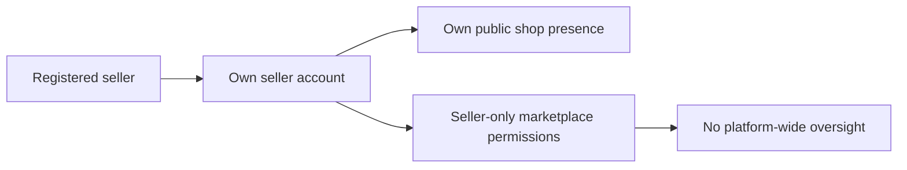

### Approval-Gated Selling Authority

A seller may register and exist on the platform before being allowed to sell.

Administrator approval is required before a seller can act as an active merchant.

Until approval is granted, the seller does not have permission to begin selling activity.

The platform shall show the seller's current approval status as one of the following values: pending, approved, or rejected.

A seller with pending status may access seller identity and status information but may not exercise active selling authority.

A seller with approved status gains authority to operate as an active seller within the limits of seller permissions defined in this document.

A seller with rejected status shall be informed that selling authority has not been granted.

If a seller is rejected, the platform shall make the rejection reason visible to that seller.

A rejected seller may submit a new registration request for seller approval.

A new registration request after rejection restarts seller review for future selling eligibility and does not treat the previously rejected status as approved.

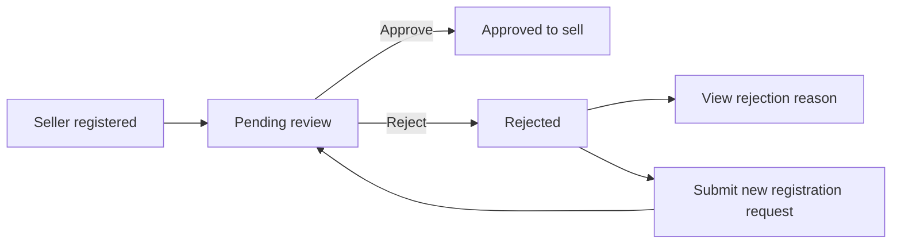

### Approved Seller Access Boundaries

An approved seller may manage the shop's commercial presence on the platform.

An approved seller may access seller-side catalog work for the seller's own products, product variants, images, and inventory-related actions.

An approved seller may access seller-side business information related to the seller's own marketplace activity.

An approved seller may perform order fulfillment responsibilities for purchased items that belong to that seller.

Order fulfillment authority is limited to the seller's own sales activity and does not extend to items sold by other sellers.

An approved seller may respond to cancellation requests for the seller's own order items.

An approved seller may respond to refund requests for the seller's own order items.

An approved seller may view snapshots and other seller-visible historical business information only where that information relates to the seller's own commercial records.

An approved seller does not receive permission to manage categories, approve sellers, oversee all products, oversee all orders, or manage user bans because those powers belong to administrator roles.

The platform shall prevent a seller from acting on another seller's catalog, fulfillment work, cancellation decisions, refund decisions, or seller-side business records.

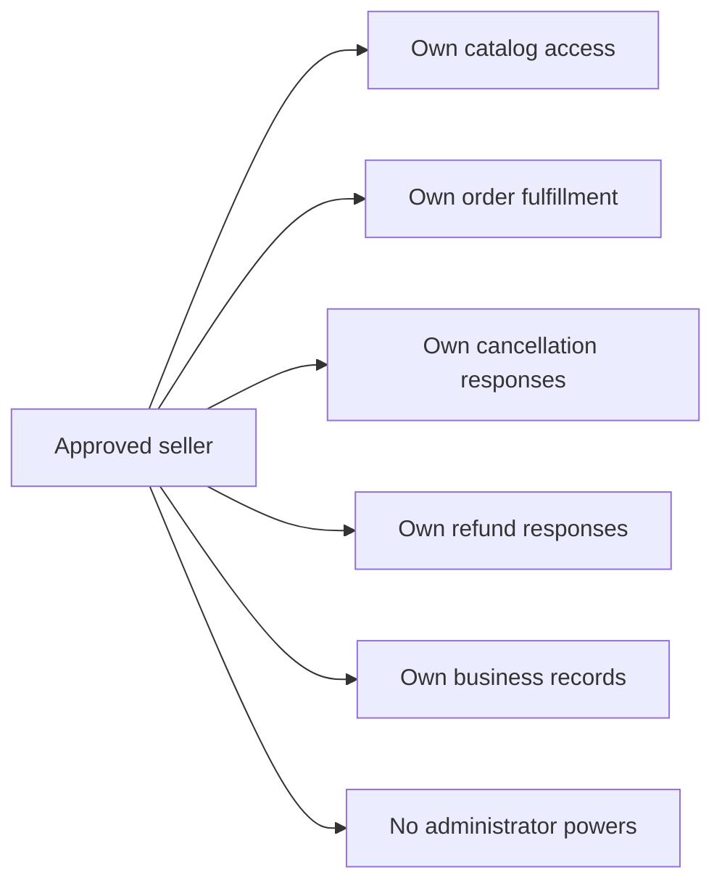

### Suspended Seller Restrictions

A suspended seller remains a seller account holder on the platform but is restricted from active selling activity.

When a seller is suspended, the seller cannot create new products.

When a seller is suspended, the seller cannot edit existing products.

When a seller is suspended, the seller's products are hidden from search and category listings.

When a seller is suspended, the seller's products cannot be purchased.

Suspension limits selling activity but does not remove all seller responsibilities.

A suspended seller may continue to process existing orders that were already placed.

A suspended seller may ship items from existing orders.

A suspended seller may respond to cancellation requests related to the seller's existing order items.

A suspended seller may respond to refund requests related to the seller's existing order items.

Suspension does not grant any new authority beyond the limited ability to complete obligations connected to existing orders.

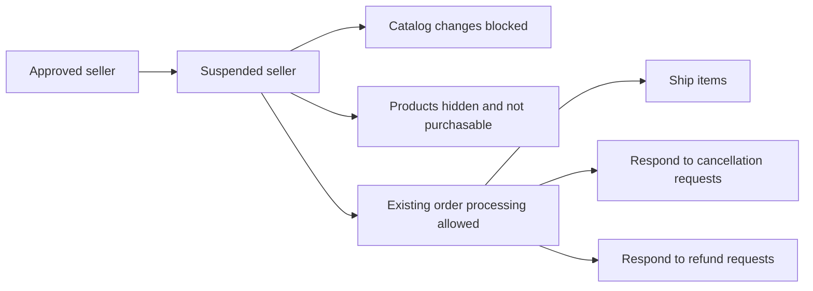

### Banned Seller Access Loss

A banned seller cannot log in while the ban remains in effect.

Because login is blocked, a banned seller cannot access seller functions during the ban period.

The loss of access caused by a ban is broader than suspension because suspension preserves limited access for existing order handling, while a ban removes login access entirely.

A banned seller does not gain access to seller status pages, seller catalog work, fulfillment actions, or seller responses to cancellation or refund requests during the ban period.

The platform shall treat the ban state as an access boundary that overrides normal seller access.

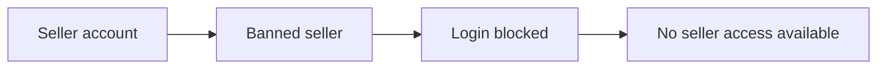

## administrator Actor

An administrator is a platform oversight actor with an AdministratorAccount granted after approval of an administrator request. This role is not a general marketplace participant role; it exists to govern platform operations across customers, sellers, products, categories, and orders. A regular administrator can review and act on seller approval matters, manage category structure, oversee products across the platform, review orders across the platform, and manage customer and seller account restrictions such as bans. Administrators may also suspend or unsuspend sellers and can remove products for policy reasons, reflecting broad moderation and compliance authority. Their access spans the platform rather than a single shop or a single customer identity. Administrators can view information needed for oversight and dispute handling, including product history where the requirements grant that visibility. However, this role does not include the grade-management powers reserved for super administrators. An administrator is therefore above customer and seller roles in platform authority, but below the super administrator in administrative hierarchy.

### Administrator Account Identity

An administrator is a platform oversight actor with an administrator account used to govern marketplace operations across customers, sellers, products, categories, and orders.

An administrator role is separate from ordinary marketplace participation and is used for oversight rather than buying or selling activities.

An administrator account is granted only after an administrator request has been approved.

A regular administrator has platform-wide authority within the limits defined for the administrator role.

An administrator can access information necessary to perform oversight, moderation, review, and dispute-handling responsibilities where the requirements grant that visibility.

An administrator’s authority applies across the platform and is not limited to a single shop, seller, product, or customer account.

An administrator is below a super administrator in the administrative hierarchy and does not receive super administrator powers by default.

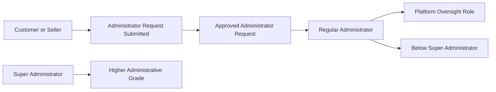

### Administrator Authority Boundaries

A regular administrator can perform seller approval oversight for seller accounts that require administrative review before they can sell.

A regular administrator can manage category structure for the platform, including category and subcategory administration.

A regular administrator can oversee products across the entire platform rather than only products belonging to a single seller.

A regular administrator can view product history where the requirements grant administrator visibility to product snapshots.

A regular administrator can oversee orders across the entire platform for review and intervention purposes.

A regular administrator can manage customer account restrictions by applying and removing customer bans as granted by the platform requirements.

A regular administrator can manage seller account restrictions by applying seller bans as granted by the platform requirements.

A regular administrator can suspend seller accounts and later unsuspend them.

A regular administrator can remove products for policy reasons as part of platform governance.

A regular administrator does not have the grade-management powers reserved for super administrators.

A regular administrator does not approve administrator applicants, promote regular administrators, or demote super administrators unless separately acting with super administrator authority, which is defined in the super administrator actor section.

### Seller and Marketplace Oversight Permissions

An administrator can review pending seller approval matters and act on seller registration outcomes.

An administrator can approve seller registrations.

An administrator can reject seller registrations.

When rejecting a seller registration, the administrator can provide the rejection reason for seller visibility.

An administrator can review seller accounts across the platform for restriction and oversight purposes.

An administrator can suspend a seller account when platform governance requires selling activity to be stopped.

When a seller is suspended, the administrator’s authority includes enforcing the suspension state that prevents the seller from using selling capabilities while still allowing existing order handling as defined elsewhere.

An administrator can unsuspend a seller account so that the seller may resume normal selling eligibility.

An administrator can view all products on the platform for oversight purposes.

An administrator can view snapshots of any product when product history visibility is needed for oversight or dispute handling.

An administrator can delete any product for policy violations.

An administrator can view all orders on the platform for oversight purposes.

An administrator can view all customer accounts.

An administrator can ban customers.

An administrator can unban customers.

An administrator can view all seller accounts.

An administrator can ban sellers.

## superAdministrator Actor

A super administrator is the highest administrative actor on the platform and holds all regular administrator authority plus control over administrative grade changes. This role governs the admission and hierarchy of administrators in addition to ordinary platform oversight responsibilities. A super administrator can review pending administrator requests and decide whether a requesting user becomes an administrator. This actor can also promote a regular administrator to super administrator and demote another super administrator to regular administrator. The role has a clear boundary that prevents self-demotion, even though it can change the grade of other administrators. Super administrators therefore control both marketplace governance and the administrative chain of authority. They retain the broader oversight available to administrators over sellers, customers, products, categories, and orders. No other actor in the requirements has authority above the super administrator within the platform.

### Highest Administrative Authority

The super administrator is the highest administrative role on the platform. This actor stands above the regular administrator in the administrative hierarchy and has no higher platform authority above it within the system. The role exists to govern both marketplace oversight and the structure of administrative authority.

A super administrator holds all permissions available to a regular administrator. In addition to ordinary platform oversight, this actor has authority over administrator admission and administrative grade changes. This role therefore represents the top governance authority for platform administration.

The super administrator's access boundary is broader than that of any other actor defined in this document, but it is still limited to platform governance and administrative authority rather than personal ownership of customer or seller accounts.

### Administrator Request Oversight

The super administrator can view pending requests submitted by users who want to become administrators. This includes authority to review the request reason and decide the outcome of the request.

The super administrator can approve an administrator applicant. When approved, the requesting user becomes a regular administrator.

The super administrator can reject an administrator applicant. Rejection prevents the request from granting administrator status.

This review authority is part of the super administrator's platform-wide oversight and distinguishes the role from actors who do not control entry into the administrative chain of authority.

### Administrative Grade Control

The super administrator controls administrative grade changes at the highest level. This actor can promote a regular administrator to super administrator. This actor can also demote another super administrator to regular administrator.

This authority applies to other administrators only. A super administrator cannot demote self. The prohibition on self-demotion is a fixed access boundary for this role.

Because the super administrator can both admit new administrators through request review and change administrator grades, the role governs the superior administrative hierarchy and maintains top-level control over administrative authority on the platform.

### Platform-Wide Oversight Boundary

The super administrator retains all regular administrator powers in addition to super-administrator-specific authority. This means the role has platform-wide oversight at the highest level across the areas already governed by regular administrators, including oversight of sellers, customers, products, categories, and orders.

The super administrator's broader authority does not create a separate parallel role. Instead, it extends the regular administrator role upward with additional control over administrator requests and administrative grade changes.

This actor is therefore the final administrative authority for platform governance, with superior oversight breadth and hierarchy control compared with all other defined actors.

# Authentication Flows

Registration, login, logout, and session management from a user perspective.

## Registration and Login

Define user registration and login flows including validation and error handling.

### Registration

Customers can register for a customer account by providing an email address and password.

Sellers can register for a seller account by providing an email address and password.

Registration is required before any platform feature can be used. The platform does not allow guest browsing or guest purchasing.

A newly registered customer account can use customer features after registration is completed.

A newly registered seller account is created with an approval status that can be viewed by the seller.

Seller approval status is limited to pending, approved, or rejected.

A seller whose approval status is pending can sign in and view their seller approval status, but cannot sell until the account is approved.

A seller whose approval status is rejected can sign in and view the rejection reason.

A rejected seller can submit a new registration request for seller approval.

Any user with an existing customer account or seller account can submit a request to become an administrator by providing a reason.

A user becomes a regular administrator only after a super administrator approves that administrator request.

If registration cannot be completed, the platform rejects the registration attempt according to the validation and error rules defined in [04-business-rules.md](./04-business-rules.md).

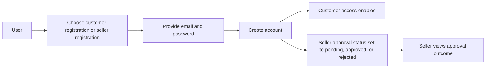

### Login

Customers can log in using their email address and password.

Sellers can log in using their email address and password.

Administrators can log in using the credentials of the account through which they became an administrator.

Super administrators can log in using the credentials of the account through which they became a super administrator.

A customer who is banned cannot log in.

A seller who is banned cannot log in.

A seller whose approval status is pending or rejected can still log in to view seller account information and approval outcome.

A seller can sell only while the seller account is approved and not suspended.

When a rejected seller logs in, the platform makes the rejection reason available for review.

When login succeeds, the platform grants access according to the user’s role and current account status.

When login fails, the platform rejects the sign-in attempt according to the validation and error rules defined in [04-business-rules.md](./04-business-rules.md).

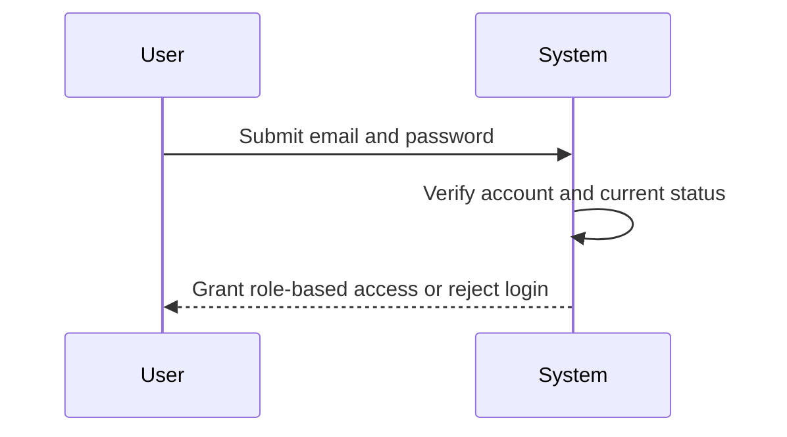

### Authentication

Authentication is required before any customer, seller, administrator, or super administrator feature can be used.

The platform authenticates customers and sellers by email address and password.

The platform does not provide anonymous access to category browsing, product search, product detail viewing, wishlist use, cart use, checkout, ordering, or review activity.

After authentication, customers can access customer functions associated with their own account.

After authentication, sellers can access seller functions associated with their own account.

After authentication, administrators can access administrator functions assigned to the administrator role.

After authentication, super administrators can access both regular administrator functions and super administrator functions.

Seller approval affects selling authority but does not replace authentication. A seller must be authenticated before the platform can determine whether selling is allowed.

A suspended seller remains able to authenticate and process existing orders, ship items, and respond to cancellation or refund requests, but cannot create new products or edit existing products while suspended.

Authentication must respect account restrictions. A banned customer or banned seller is denied authenticated access.

Authentication outcomes for protected actions are determined together by user identity, role, and account status.

Detailed permission rules for platform actions are defined in this file, and detailed validation and rejection conditions are defined in [04-business-rules.md](./04-business-rules.md).

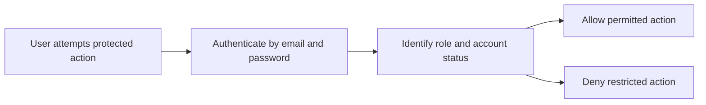

## Session and Logout

Define session behavior and logout from a user perspective.

### Session

```yaml
spec:
  servicePrefix: shoppingMall
  module: Authentication Flows
  unit: Session and Logout
  section: Session
```

A signed-in customer, seller, administrator, or super administrator uses the platform through an authenticated session.

The platform requires customer registration before customer-facing features can be used, so only signed-in customer accounts may access customer functions.

After successful login, the platform keeps the user signed in so the user can move between permitted features without signing in again on every action.

The session identifies the signed-in account and its current role so the platform can apply the permissions defined in this document.

A customer session grants access only to customer features.

A seller session grants access to seller features, but selling actions remain subject to the seller account's approval status and any suspension or ban state.

An administrator session grants access to administrator features.

A super administrator session grants access to super administrator features in addition to regular administrator features.

If a customer account is banned, the platform must not allow a session to be established for that account.

If a seller account is banned, the platform must not allow a session to be established for that account.

If a seller account is signed in but is not approved to sell, the seller may still access seller account functions that do not require selling eligibility, including viewing approval status and any rejection reason.

If a seller account is suspended, the seller session must continue to allow processing of existing orders, including shipping items and responding to cancellation requests and refund requests, but must not allow creating new products or editing existing products.

If an account is deleted, any active session for that account must no longer provide access to platform features.

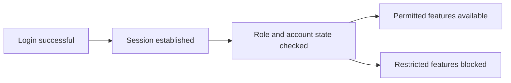

### Logout

```yaml
spec:
  servicePrefix: shoppingMall
  module: Authentication Flows
  unit: Session and Logout
  section: Logout
```

A signed-in customer, seller, administrator, or super administrator can log out of the platform.

When the user logs out, the current authenticated session ends.

After logout, the platform must require the user to sign in again before accessing any feature that requires an authenticated session.

After logout, the user must no longer be able to continue using protected pages or actions through the ended session.

Logout does not delete the account, change the account password, or change any account role.

Logout does not remove preserved business records such as orders, reviews, snapshots, cancellation requests, or refund requests.

If a user logs out while having items in the cart or products in the wishlist, those saved customer records remain associated with the account and are available again after the next successful login.

If a user logs out while having a pending seller approval request or administrator request, the request remains in its current state after logout.

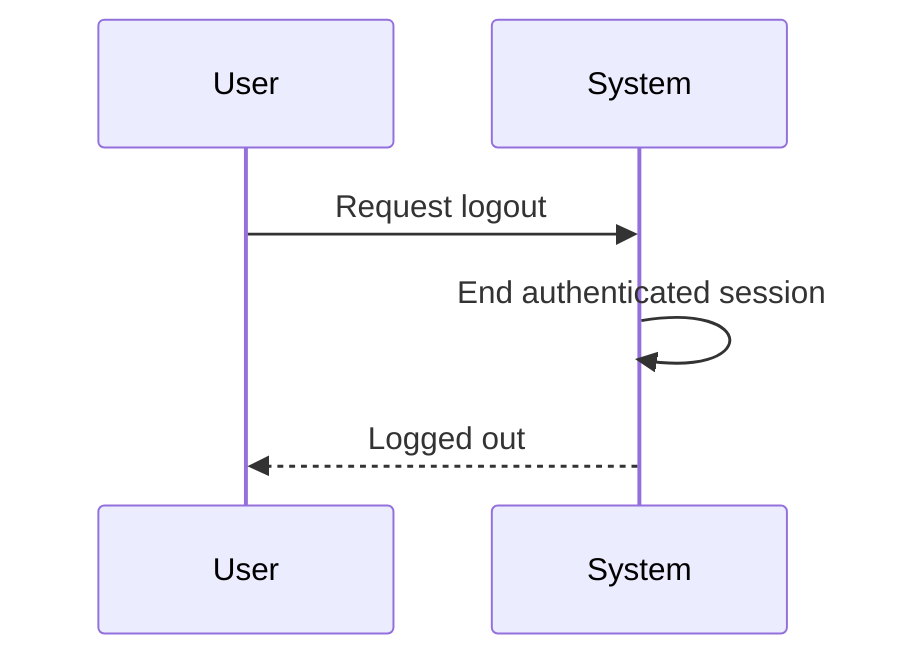

### Account Security

```yaml
spec:
  servicePrefix: shoppingMall
  module: Authentication Flows
  unit: Session and Logout
  section: Account Security
```

The platform authenticates customer and seller accounts by email and password.

The platform authenticates administrator and super administrator access through the authenticated account that holds the corresponding administrator role.

Only an authenticated account holder may change that account's password.

A banned customer cannot log in.

A banned seller cannot log in.

A seller who has not yet been approved, or whose approval request was rejected, can still sign in to view seller account information and approval status, but cannot sell until approved.

A rejected seller can sign in and submit a new registration request.

A suspended seller can sign in, but the platform must enforce the suspension limits on seller activity during the session.

The platform must apply access according to the signed-in actor type so that customers cannot use seller-only functions, sellers cannot use administrator-only functions, and regular administrators cannot use super administrator-only functions.

The platform must prevent a super administrator from demoting their own account from super administrator to regular administrator.

When a customer account is deleted, the platform deletes the customer's profile information while preserving orders, order history, and reviews under the displayed author name "deleted user" as defined in account lifecycle rules.

When a seller account is deleted, the platform allows deletion only when the seller has no pending paid or shipped orders and no pending cancellation requests or refund requests.

When a seller account is deleted, the platform removes the seller's products from active listings while preserving order history, order snapshots, and the seller shop name in past orders.

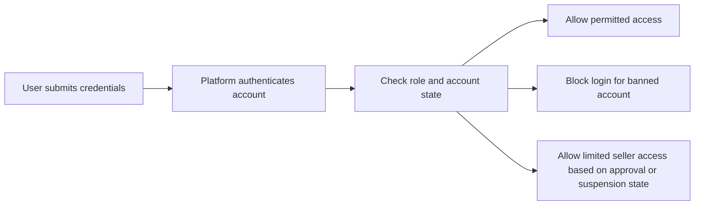

# Account Lifecycle

Account creation, deletion, and password management.

## Account Management

Define how users create accounts, delete accounts, and change passwords.

### Account Creation

Customers can create an account using an email address and password.

Sellers can create an account using an email address and password.

Platform features require registration, so an unregistered person cannot use customer-facing shopping or seller-facing selling functions.

A newly registered customer account can use customer features after successful registration and sign-in.

A newly registered seller account can sign in after registration and can view its approval status as pending, approved, or rejected.

A seller account in pending status cannot sell until an administrator approves the seller registration.

A seller account in rejected status can view the rejection reason.

A seller account in rejected status can submit a new registration request.

A customer account or seller account can submit a request to become an administrator, and the request must include a reason.

A user becomes a regular administrator only after a super administrator approves the administrator request.

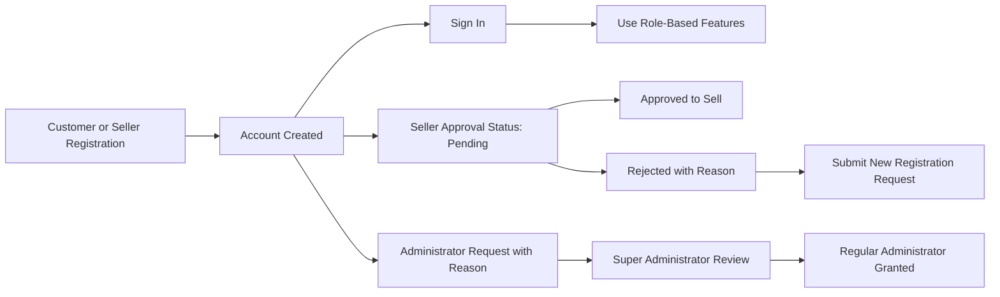


### Account Deletion

Customers can delete their own account.

When a customer deletes an account, the customer's profile information is deleted.

When a customer deletes an account, the customer's orders and order history are preserved for seller records and legal purposes.

When a customer deletes an account, the customer's reviews are preserved and must be shown as written by "deleted user".

Sellers can delete their own account only when they have no pending orders in paid or shipped status.

Sellers can delete their own account only when they have no pending cancellation requests or refund requests.

When a seller deletes an account, the seller's products are deleted from listings.

When a seller deletes an account, order history and preserved snapshots remain available.

When a seller deletes an account, the seller's shop name in past orders is preserved.

Account deletion does not remove preserved historical records that must remain for order history, snapshots, or dispute resolution.

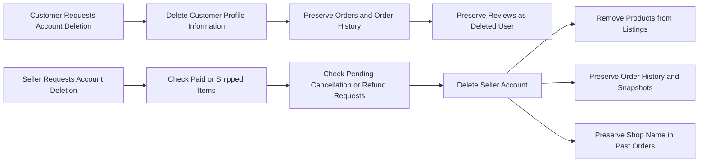


### Password Change

Customers can change their password.

Sellers can change their password.

Password change is available only to the account owner after sign-in.

After a password change, the account continues to use the same email address as its sign-in identity.

Password change does not change customer profile information, seller profile information, order history, snapshots, reviews, cart contents, wishlist entries, or saved addresses.

A banned customer cannot log in.

A banned seller cannot log in.

Seller approval status does not prevent a seller from changing a password after sign-in; approval status governs selling eligibility, not password ownership.

Administrator grade changes do not require creation of a new account because administrator authority is granted to an existing user after approval.

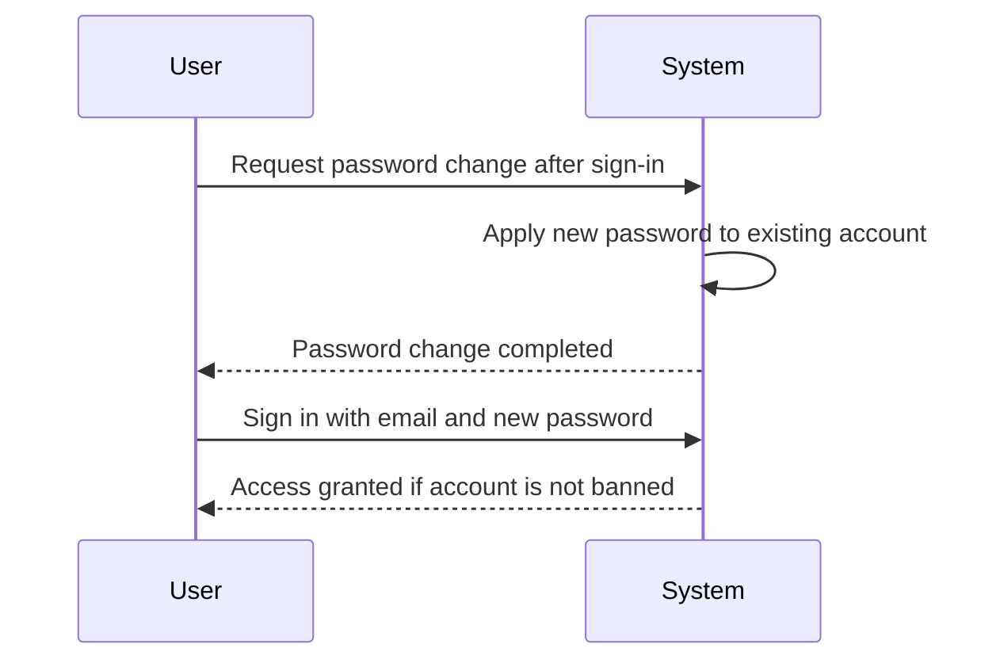