**shoppingMall — Business concepts, relationships, and states from user perspective**

Business concepts, relationships, and states from user perspective

# Domain Concepts

Describe what each concept means in the business domain and its key attributes.

## CustomerAccount Concept

CustomerAccount represents the registered customer identity required to use the shopping mall platform. It is the business concept that recognizes a person as a customer member of the marketplace rather than a guest visitor. Its core identifying attributes are the email used for sign-in and the password used for authentication. The concept also includes the account lifecycle condition that a customer may remain active, become banned, or be deleted by the customer. Even when the account is deleted, the identity no longer retains profile information in active use, while preserved business history such as orders and reviews still refers back to the former customer in limited historical form. In historical review display, a deleted customer is represented as deleted user rather than by their prior profile identity. This concept is separate from CustomerProfile because account identity and profile presentation are different business concerns.

### CustomerAccount as Registered Customer Identity

CustomerAccount is the business concept that represents a registered customer identity within the shopping mall platform. It is the membership record that recognizes a person as a customer of the marketplace and distinguishes that person from a non-member visitor. Platform use is based on this registered identity, because the platform requires registration to use its features and does not provide guest browsing.

The core identifying credentials of CustomerAccount are the customer’s email and password. The email serves as the sign-in identity for the customer account, and the password is the credential used for password-based authentication. These credentials belong to the account identity itself rather than to the customer-facing profile.

CustomerAccount exists independently of shopping activity records that may later be created through that identity, such as orders, wishlist entries, cart items, and reviews. In the business domain, it is the root customer membership concept from which those customer-owned records originate.

### CustomerAccount Lifecycle States

CustomerAccount has a lifecycle that reflects whether the customer identity is available for active use, restricted from use, or ended by the customer.

An active customer account represents a registered customer identity that remains part of the marketplace. A banned customer account represents a registered customer identity that still exists in the business record but is no longer allowed to continue normal account use. A customer-deleted account represents a customer identity that has been ended by the customer and no longer retains profile information in active use.

These states are part of the account concept itself and are separate from the customer’s profile details. The lifecycle state explains the standing of the customer identity in the marketplace, while profile content is defined separately in CustomerProfile.

### Historical Preservation After Customer Deletion

When a CustomerAccount enters the customer-deleted account state, the active customer identity is no longer used as a living member record, but business history is not removed in the same way. Historical orders and order history remain preserved after deletion because they continue to serve marketplace, seller, and legal record purposes.

This means customer deletion does not erase the existence of past purchases from the business domain. Order records remain part of the platform’s historical transaction record even though the customer’s active profile information is deleted. The preserved order history continues to represent that the purchases occurred through a former customer account.

Reviews written by the former customer are also preserved as historical product feedback. However, once the account has been deleted, the former customer is no longer presented through their prior profile identity in review display.

### Deleted User Representation and Separation from CustomerProfile

If a preserved review belongs to a customer-deleted account, the review author is shown as deleted user. This representation indicates that the review remains part of the platform’s historical record while the original customer identity is no longer presented as an active profile-bearing member.

CustomerAccount is therefore distinct from CustomerProfile. CustomerAccount defines membership identity, sign-in identity, authentication basis, and lifecycle standing. CustomerProfile defines the customer-facing presentation details associated with that account, such as display name and phone number, as described in CustomerProfile.

This separation is important in the business domain because the platform can preserve account-linked historical records even when profile information is no longer retained in active use. It also explains why a deleted customer’s reviews can remain visible while the author is no longer displayed through profile information.

## CustomerProfile Concept

CustomerProfile represents the customer-facing personal profile attached to a customer identity. It is used to hold basic profile details that describe the customer within the platform rather than their login credentials. Its key attributes are display name and phone number. The display name is the customer’s presentation name, while the phone number is contact information associated with that profile. This concept is distinct from CustomerAccount because it does not define authentication or account access. It is also distinct from ShippingAddress because profile contact details do not replace a delivery destination. When a customer account is deleted, the profile information is removed as part of that account’s personal information lifecycle.

### Customer-Facing Profile

CustomerProfile is the customer-facing profile attached to a customer account. It holds the personal profile information used to represent the customer within the shopping mall platform. This concept exists to describe the customer as a participant in the marketplace rather than to control access to the platform.

The profile contains the customer’s presentation details. In this scope, those details are the display name and phone number. These details describe how the customer is identified and contacted in a profile context.

CustomerProfile is part of the customer’s overall account presence, but it is a separate business concept from the account itself. The account identifies the registered customer identity, while the profile holds the customer-facing personal details associated with that identity.

### Profile Attributes

The display name is the customer’s presentation name. It is the name shown as the customer-facing identifier for profile-related representation on the platform.

The phone number is the contact number associated with the customer profile. It is part of the customer’s personal profile information and belongs to the profile rather than to sign-in credentials.

Together, the display name and phone number form the core presentation details of CustomerProfile. They describe the customer in a profile context and are distinct from credentials, order records, and delivery destination details.

### Separation from Account Identity and Shipping Destination

CustomerProfile is separate from the customer’s login identity. Login identity belongs to CustomerAccount and is based on the registered email and password, while CustomerProfile contains customer-facing presentation details only.

CustomerProfile is also separate from ShippingAddress. A shipping address is a delivery destination used for receiving orders, while CustomerProfile stores personal profile information about the customer.

Because of this separation, profile contact details do not replace delivery address details. The profile phone number is part of the customer’s profile, whereas a shipping address carries the recipient and destination information used for shipment.

### Deletion Lifecycle Meaning

CustomerProfile follows the personal information lifecycle of the customer account to which it belongs. It does not continue as an independent business record after the customer account is removed.

When a customer deletes the customer account, the related profile information is removed as part of that deletion. This means the customer-facing personal profile information, including the display name and phone number, is removed together with the deleted account’s profile.

This deletion outcome applies to the profile concept specifically and does not redefine the retention behavior of other business records such as orders or reviews, which are defined in their own concepts and lifecycle sections.

## ShippingAddress Concept

ShippingAddress represents a saved delivery destination that a customer can use for order shipment. It captures the recipient and location details needed to receive purchased items. Its key attributes are recipient name, phone number, street address, city, state or province, postal code, and country. The concept also includes a default designation that identifies the primary shipping address among a customer’s saved addresses. A customer may have multiple saved shipping addresses, so this concept supports repeated delivery destinations under one customer identity. ShippingAddress is different from CustomerProfile because it is meant for parcel delivery rather than general profile information. It is also different from OrderAddressSnapshot because it represents an editable saved address before an order fixes a final shipping destination.

### Shipping Address as a Saved Delivery Destination

ShippingAddress represents a saved delivery destination that a customer keeps for future purchases. It stores the recipient and location details needed to deliver purchased items to the intended destination. A saved shipping address belongs to one customer and exists as part of that customer’s address book for repeat use across orders.

This concept is specifically about parcel delivery. It is used to identify where purchased items should be sent, not to describe the customer’s general identity or public-facing information.

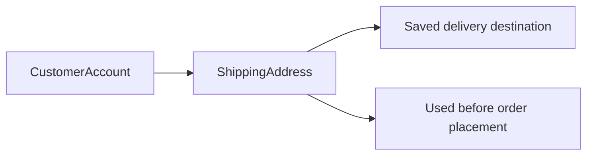

### Address Collection and Core Delivery Details

A customer may keep multiple shipping addresses under the same account so different delivery destinations can be saved separately. Each ShippingAddress captures the full set of delivery details for one destination.

The business details of a ShippingAddress are:
- recipient name, identifying who should receive the parcel
- delivery phone number, used as the contact number for the delivery destination
- street address, describing the main delivery line
- city information, identifying the city for delivery
- state or province, identifying the regional area when applicable
- postal code, identifying the delivery postal area
- country information, identifying the destination country

Each saved address is a complete delivery destination in its own right. The concept supports customers who need different recipients or locations for home, work, family members, or other repeated destinations.

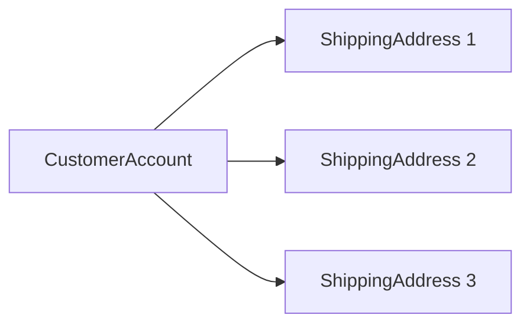

### Default Shipping Designation

Among a customer’s saved shipping addresses, one address may carry the default shipping designation. This designation identifies the primary shipping address for that customer’s future purchasing activity.

The default designation is a property of the saved address itself rather than a separate concept. Its business meaning is to mark which saved delivery destination should be treated as the customer’s main shipping address when a primary address is needed.

Within one customer’s address collection, the default designation distinguishes one address from the others as the primary option.

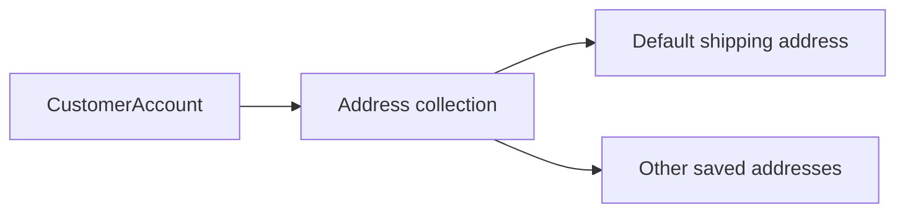

### Relationship to Customer Profile and Order Address Snapshot

ShippingAddress is separate from CustomerProfile. CustomerProfile describes the customer’s general profile information, while ShippingAddress describes a delivery destination for parcel shipment. Even when some personal details appear similar, the business purpose is different: profile information identifies the customer, while shipping address information identifies where an order should be delivered.

ShippingAddress is also separate from OrderAddressSnapshot. A saved shipping address is editable before an order is placed, because it represents a reusable pre-order address in the customer’s saved address collection. By contrast, an order address snapshot is the fixed delivery destination preserved with a completed order.

This distinction is important in the business domain:
- ShippingAddress represents an editable pre-order address
- OrderAddressSnapshot represents the preserved delivery destination tied to a completed purchase
- CustomerProfile represents the customer’s general profile, not the shipping destination

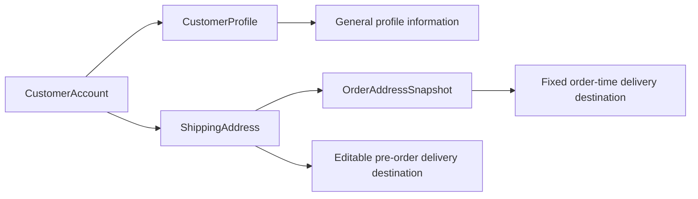

## SellerAccount Concept

SellerAccount represents the registered seller identity used by a shop operator on the marketplace. It is the business concept that recognizes a user as a selling party with access credentials and selling eligibility status. Its core identifying attributes are email and password for authentication. A key business attribute of this concept is approval status, which can be pending, approved, or rejected. The concept may also carry a rejection reason when approval is denied. In addition to approval status, the seller identity can have suspension status or ban status that affects whether the seller can participate in the marketplace. SellerAccount is distinct from SellerProfile because account eligibility and authentication are different from public shop presentation. The concept also has a deletable lifecycle, but historical business records remain preserved even when the account itself is removed from active use.

### Seller Identity and Access Credentials

SellerAccount is the registered seller identity used by a shop operator to participate in the marketplace as a selling party. It is the account-level business concept that represents who the seller is for sign-in, account status, and selling eligibility.

This concept uses email and password as the seller authentication credentials. The email serves as the seller’s sign-in identity, and the password serves as the credential used to access the seller account.

SellerAccount is an account concept, not a public shop presentation concept. It exists to represent authenticated seller membership and account standing within the platform.

SellerAccount is separate from SellerProfile. SellerAccount identifies and authorizes the seller as a marketplace participant, while SellerProfile defines the seller’s customer-visible shop presentation as described in the SellerProfile concept.

### Seller Approval Standing

SellerAccount carries a seller approval status that represents whether the seller is allowed to sell on the platform. The allowed approval states are pending, approved, and rejected.

A pending seller account represents a registered seller identity whose selling eligibility is still under review. An approved seller account represents a registered seller identity that has been accepted for selling activity. A rejected seller account represents a registered seller identity whose request to sell has not been accepted.

When the approval outcome is rejected, the seller account may carry a seller rejection reason. This reason explains why the seller was not approved and forms part of the business meaning of the account’s approval standing.

The approval standing belongs to SellerAccount as an account eligibility concept. The review case itself is defined separately in the SellerApprovalRequest concept.

### Seller Restriction Status

In addition to approval standing, SellerAccount may carry a seller suspension status or a seller ban status. These statuses represent restrictions on the seller’s participation in the marketplace and are separate from the approval states of pending, approved, and rejected.

Seller suspension status represents that the seller account remains recognized by the platform but is under a marketplace restriction affecting selling participation. Seller ban status represents that the seller account is under a stronger account-level restriction that prevents normal access to the platform.

These restriction statuses are business attributes of the seller identity itself. They describe account standing and marketplace participation status, not the public content of the seller’s shop presentation.

### Seller Deletion and Historical Continuity

SellerAccount has a deletable lifecycle as an active account concept, but deletion does not erase the platform’s historical business record. When a seller account is removed from active use, historical order-related records and preserved business snapshots remain part of the marketplace record.

This means SellerAccount can stop existing as an active seller identity while the platform still retains past business history connected to that seller for continuity of marketplace records. Preserved historical information continues to support past orders, past seller identity references in those orders, and other retained business evidence defined in the platform’s retention concepts.

Because of this distinction, seller deletion ends active account use but does not remove the historical record needed to preserve prior marketplace transactions.

## SellerApprovalRequest Concept

SellerApprovalRequest represents the reviewable business submission that determines whether a seller account may become eligible to sell. It captures a seller’s registration or re-registration case for administrator review. Its key attributes include the review outcome and an optional rejection reason. The concept distinguishes between the seller identity itself and the approval case examined by administrators. It can represent an initial attempt to become a seller or a new request after a previous rejection. Because the platform separates selling eligibility from basic account existence, this concept carries the approval decision details that do not belong directly to public shop information. SellerApprovalRequest is therefore a governance concept tied to marketplace control over who may sell.

### Seller Approval Case

SellerApprovalRequest is the business record that represents a seller approval case. It exists to capture the specific submission being examined for permission to sell on the platform. This concept is separate from the seller account itself: a seller account identifies the person or business that signed up, while the seller approval request represents the review case about whether that account may become eligible to sell.

A seller approval request is therefore an administrator-reviewed seller submission rather than a public shop concept. It is used to hold the reviewable application context for a seller’s initial registration review or for a later re-registration request after rejection. This separation allows the platform to preserve the seller’s account identity while treating selling eligibility as a distinct governance decision.

### Review Outcome and Rejection Information

A SellerApprovalRequest includes the approval decision record for the reviewed seller submission. Its decision outcome expresses whether the request remains pending, has been approved, or has been rejected. The request may also carry an optional rejection reason when the review outcome is rejection.

The rejection reason belongs to the approval request, not to the seller’s public shop information, because it explains the result of the registration review rather than describing the seller profile. When present, it gives the reviewed seller submission a clear business explanation for why selling eligibility was not granted. When absent, the request still remains a complete decision record if the review outcome does not require a rejection explanation.

### Re-registration and Selling Eligibility Context

SellerApprovalRequest can represent more than one attempt to obtain selling eligibility. After a rejection, a seller may have a new seller approval request that stands as a new review case rather than replacing the earlier one conceptually. In this way, the platform recognizes seller re-registration as a distinct submission for renewed review.

This concept is central to selling eligibility review because the platform does not treat account existence alone as permission to sell. A seller may have a seller account yet still depend on the current approval request outcome to determine whether selling is allowed. SellerApprovalRequest therefore serves as the business concept that connects seller registration review to marketplace control over who may sell, while remaining distinct from seller identity and from the public seller profile.

## SellerProfile Concept

SellerProfile represents the public shop identity presented to customers on the marketplace. It describes how a seller appears as a store rather than how the seller signs in. Its key attributes are shop name, shop description, and logo image. The shop name identifies the seller in listings and historical purchase context, while the description communicates the shop’s public introduction. The logo image serves as the visual identity of the shop. This concept is historically important because its edited versions are preserved for dispute resolution and purchase-time context. SellerProfile is separate from SellerAccount because a seller’s login and approval status are different from the public-facing shop presentation customers see.

### Public Shop Identity

SellerProfile is the public shop identity that represents how a seller appears to customers on the marketplace. It is the customer-visible seller presentation used in product listings, product detail views, seller profile views, and preserved purchase context. This concept exists to describe the shop as a store-facing presence rather than the seller’s sign-in identity.

The profile expresses the seller through branding details that customers recognize across the marketplace. Those branding details are the shop name, shop description, and logo image. Together, they form the seller’s marketplace-facing identity and allow customers to distinguish one shop from another.

SellerProfile belongs to one seller and is the public-facing companion to that seller’s marketplace participation. Customers interact with the shop through this profile concept, while account access and approval status are defined separately in SellerAccount.

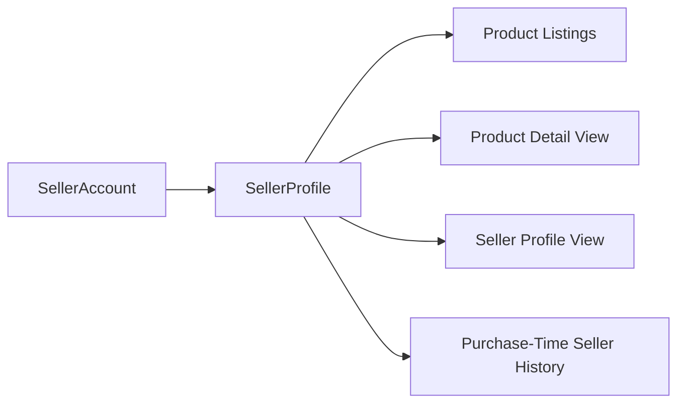

### Seller Branding Details

The shop name is the primary public identifier of the seller’s store. It is the name shown to customers when a product is associated with that seller, and it is the business-facing label by which the shop is recognized in marketplace browsing and historical purchase context.

The shop description communicates the seller’s public introduction. It gives customers contextual information about the store and helps explain the shop’s identity in business terms rather than authentication terms.

The logo image is the visual identity of the shop. It is part of the seller branding details that customers use to visually recognize the seller across the marketplace.

These profile attributes belong to the shop presentation itself, not to account credentials or approval handling. In this domain model, the shop name, shop description, and logo image are treated as profile content because they describe what customers see when they view the seller as a storefront.

### Historically Preserved Profile Edits

SellerProfile is historically important because profile edits are preserved as part of the marketplace record. When the public shop presentation changes, the business domain retains the earlier version so that relevant parties can understand how the profile appeared at the time of a past event.

Historically preserved profile edits support dispute resolution and purchase-time context. This means the marketplace can distinguish between the seller’s current shop presentation and the version that was visible when an earlier purchase or review-related event took place.

The preserved history applies to the same branding details that define the profile: shop name, shop description, and logo image. As a result, a seller’s public identity is not treated as a single replaceable value, but as a concept with a current version and immutable historical versions.

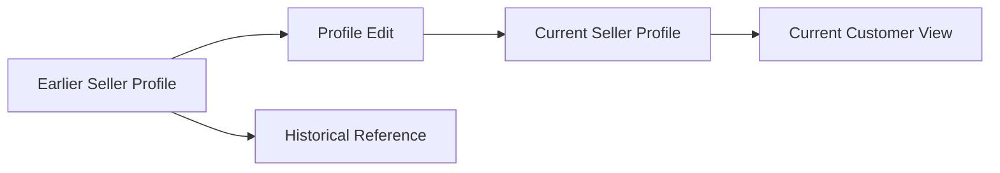

### Separation from Seller Account

SellerProfile is separate from SellerAccount because the two concepts serve different business purposes. SellerAccount represents the seller’s registered identity for marketplace access, while SellerProfile represents the seller’s public shop identity presented to customers.

This separation keeps public presentation distinct from sign-in and approval concerns. A seller may have one account used for authentication and platform participation, while the associated profile describes the store that customers see.

The distinction is important in the business domain because customer-visible seller presentation relies on shop-facing information, not on login credentials or approval handling. SellerProfile therefore models the storefront identity of the seller, whereas SellerAccount models the seller’s registered membership identity.

This relationship also explains why preserved purchase-time seller history is based on the profile presentation rather than on account access data. What matters to customers and historical order context is how the shop was presented, not how the seller authenticated.

## AdministratorAccount Concept

AdministratorAccount represents an administrative identity with governance authority over the platform. It is a business role concept rather than a storefront or purchasing identity. Its defining attribute is administrator grade, which can be regular administrator or super administrator. The grade distinguishes ordinary administrative authority from elevated authority over administrator roles. This concept may be held by a user who originally participates in the platform as a customer or seller, but the administrative identity is treated as a distinct governance role. AdministratorAccount exists to express moderation and oversight responsibility within the marketplace. It is separate from AdministratorRequest because the request is the application to obtain this role, while AdministratorAccount is the granted role itself.

### AdministratorAccount as a Platform Governance Identity

AdministratorAccount is the platform's governance identity. It represents a role used to oversee marketplace activity, apply platform rules, and carry out administrative responsibility across the shopping mall.

This concept is not a storefront identity and not a purchasing identity. Its business meaning is tied to governance, review, moderation, and oversight rather than buying or selling.

AdministratorAccount exists to represent a granted administrative standing within the platform. It identifies a person acting with administrative responsibility over marketplace records, users, and business activities that require platform-level oversight.

The defining business attribute of AdministratorAccount is its administrator grade, which determines whether the administrative identity is held as a regular administrator or a super administrator.

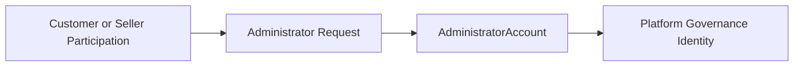

### Administrator Grade

AdministratorAccount is classified by administrator grade. The grade expresses the level of administrative standing carried by the administrative identity.

A regular administrator grade represents standard administrative standing within the platform. This grade identifies an administrator who participates in platform governance without the elevated grade authority reserved for super administrators.

A super administrator grade represents elevated administrative authority. This grade is distinguished from the regular administrator grade by its higher governance standing over administrator role matters.

The two allowed administrator grades are regular administrator and super administrator. These grades are business classifications of the same AdministratorAccount concept rather than separate account types.

The presence of administrator grade makes AdministratorAccount a governed role concept with internal hierarchy. The hierarchy exists only within the administrative domain and does not redefine the person's customer or seller participation outside that role.

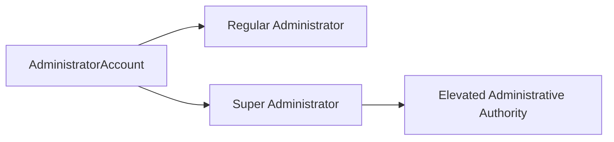

### Distinct Administrative Role from Customer or Seller Participation

AdministratorAccount is distinct from customer or seller participation. A person may participate in the platform as a customer or seller, but the administrative identity is treated as a separate governance role concept.

Customer participation relates to buying, account ownership, saved addresses, orders, cart activity, wishlist activity, and reviews. Seller participation relates to shop operation, products, variants, inventory, shipping, and seller-side order handling. AdministratorAccount does not redefine those business identities; instead, it exists alongside them as a separate administrative standing.

This distinction is important because the platform recognizes governance responsibility as different from marketplace participation. The same person may hold both marketplace participation and administrative standing, but the business meaning of AdministratorAccount remains administrative rather than commercial.

AdministratorAccount therefore expresses who the person is in platform governance, while customer and seller concepts express who the person is in marketplace activity.

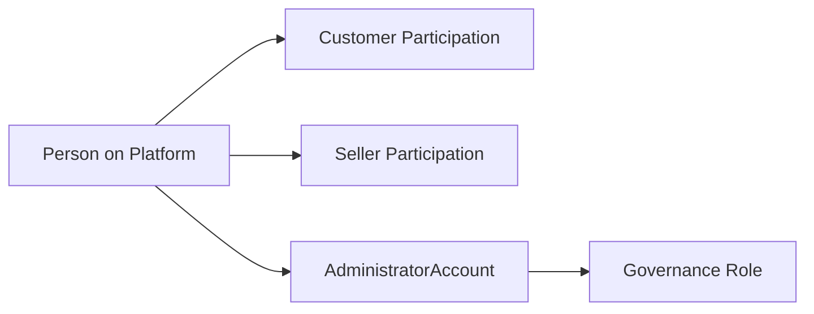

### Separate from Administrator Request

AdministratorAccount is separate from AdministratorRequest. The two concepts are related, but they do not mean the same thing.

AdministratorRequest is the application or submission through which an existing user asks to become an administrator. It expresses the request to obtain administrative standing.

AdministratorAccount is the granted administrative role itself. It exists only as the governance identity that results from successful recognition of administrative standing, not as the request to be considered.

This separation keeps the business meaning clear: the request concept represents an application for review, while the account concept represents the resulting administrative identity once the role exists.

AdministratorRequest is therefore a precursor concept, while AdministratorAccount is the realized role concept used in platform governance.

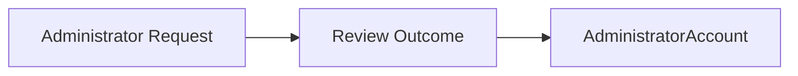

### Oversight Role Concept

AdministratorAccount is an oversight role concept for the marketplace. Its purpose is to represent responsibility for observing, managing, and governing business activity that affects the platform as a whole.

As an oversight concept, AdministratorAccount is associated with review and control over platform business areas such as seller approval matters, category stewardship, product oversight, order oversight, and user oversight. The detailed actions and permissions for those areas are defined outside this domain concept.

The oversight nature of AdministratorAccount means it stands above ordinary marketplace participation and exists to support trusted governance of a money-exchange platform.

Where the administrator grade is super administrator, the oversight role includes elevated administrative authority over administrator role hierarchy itself. Where the administrator grade is regular administrator, the oversight role remains administrative but does not carry that elevated grade authority.

This concept therefore expresses both platform-level responsibility and the distinction between ordinary administrative oversight and elevated administrative oversight.

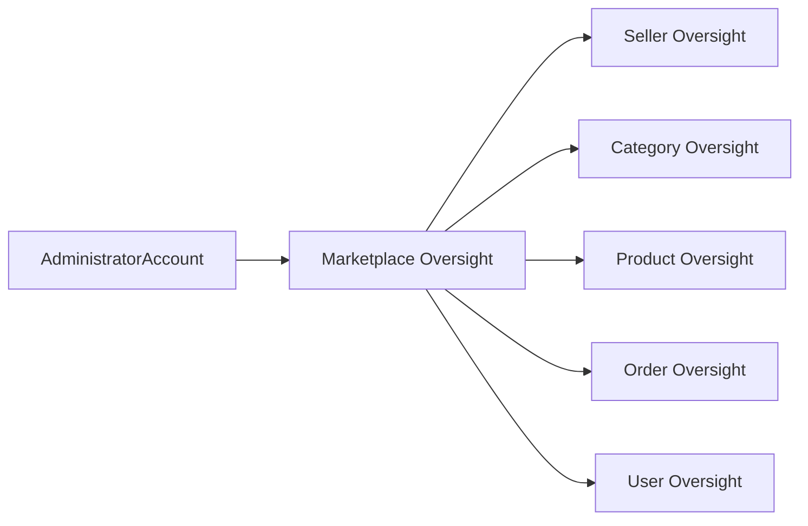

## AdministratorRequest Concept

AdministratorRequest represents a user’s formal request to become an administrator on the platform. It is an application concept used to express intent to take on administrative responsibility. Its key attribute is the reason text supplied by the requesting user. The concept also includes an approval decision because the request is subject to review by super administrators. AdministratorRequest is distinct from AdministratorAccount because it represents the application state before the administrative role is granted. It may originate from an existing customer or seller identity, but the request itself is its own business object. This concept exists to capture the justification and review outcome associated with administrative promotion eligibility.

### Administrator Role Application

AdministratorRequest is the business concept for a formal application to take on the administrator role on the platform. It exists before any administrative authority is granted and represents a user’s intent to assume administrative responsibility. This concept is used to capture the application itself as a distinct business object rather than treating administrative promotion as an automatic change to an existing account.

An AdministratorRequest originates from an existing platform user. The requesting user may be a customer or a seller, but the request is modeled separately from that user’s normal account identity. This separation allows the platform to recognize that the applicant’s current role and the requested administrative role are not the same business state.

The concept is specifically about administrative promotion eligibility. It expresses that a user is asking to be considered for administrator status and that the request must be evaluated before the role can be granted.

### Application Reason and Review Decision

Each AdministratorRequest contains a reason text supplied by the requesting user. This reason explains why the user is seeking administrator status and serves as the core justification for review. The reason is part of the request record itself, not part of the granted administrator role.

AdministratorRequest also includes an approval decision because the application is subject to review by a super administrator. The decision represents the review outcome of the request as an application for administrative promotion. This makes the request a reviewable business record rather than a simple expression of interest.

Because the approval decision belongs to the request, the platform can distinguish between the user’s submitted justification and the later review outcome. The request therefore combines two key business elements: the applicant’s stated reason and the super administrator’s decision on whether the applicant should become an administrator.

### Separation from Administrator Account

AdministratorRequest is distinct from AdministratorAccount. The request represents the application stage, while AdministratorAccount represents the granted administrative identity after approval. This distinction is important because a user can exist as a customer or seller, submit an AdministratorRequest, and still remain in their original role unless and until the request is approved.

In business terms, AdministratorRequest is an eligibility and review concept, not an authority concept. It records that a user has asked to be considered for promotion into administrative responsibility. AdministratorAccount, by contrast, represents the state in which that responsibility has already been granted.

Keeping these concepts separate preserves a clear business boundary between requesting authority and holding authority. It also ensures that the platform can treat the request as its own review subject with its own justification and decision history, independent of the administrative role that may later result from approval.

## Category Concept

Category represents a product classification used to organize the marketplace catalog. It gives customers and administrators a structured way to understand where products belong in the catalog. Its key attributes are name and description. The concept supports one level of parent-child nesting, so a category may exist as a top-level category or as a subcategory beneath one parent. This means category structure is limited to a simple two-level hierarchy rather than deep nested trees. Category remains a classification concept rather than a product itself. When a category is removed from active catalog organization, affected products are treated as uncategorized rather than inheriting some replacement category automatically.

### Category as Product Classification

Category is the business concept used to classify products within the shopping mall catalog. It gives the marketplace a shared way to group products by subject or merchandise type so customers can understand where products belong when browsing the catalog.

A category is a classification concept rather than a sellable item. It does not represent a product itself and does not replace the product information defined in the Product concept. Instead, it provides the organizational context that helps products appear in a structured catalog.

Within the domain, a category is identified by its category name and category description. These attributes express what the category is called and what kind of products it is intended to contain.

### Category Identity and Description

The category name is the primary business label customers and administrators use to recognize a category in the catalog structure. It expresses the human-readable name of the classification.

The category description explains the meaning and intended scope of the category. It helps distinguish one category from another when names alone are not enough, especially where categories may sound similar but represent different areas of the catalog.

Together, the category name and category description define the business identity of the category. They clarify how the category should be understood in catalog organization without changing the underlying product concept.

### Top-Level and Subcategory Structure

A category may exist as a top-level category or as a subcategory beneath one parent category. A top-level category stands on its own as a primary branch of the catalog. A subcategory is a more specific classification placed under a top-level category.

The subcategory level is limited to one child level beneath a parent. This means the catalog supports a simple two-level organization: top-level category, then subcategory.

This structure is intentionally limited. It supports clear catalog organization without creating a deep hierarchy that would make classification harder to understand from a business perspective.

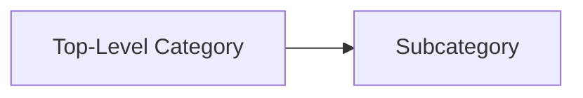

### One-Level Nesting Only

Category nesting is restricted to one level only. A subcategory may belong to one parent category, but a subcategory does not continue into further nested levels.

In business terms, the catalog organization structure is therefore not a multi-level tree. It is a controlled hierarchy with one parent-child step only. This keeps product classification simple and consistent across the marketplace.

Because one-level nesting only is part of the category concept itself, the platform treats the allowed structure as either a standalone top-level category or a subcategory directly under that top-level category. No deeper category descendants are part of this domain model.

### Catalog Organization and Uncategorized Outcome

The category concept organizes the active catalog by providing a visible structure in which products can be grouped and understood. Products may belong to a category so that the catalog reflects recognizable browsing paths for customers.

If a category is removed from active catalog organization, affected products do not automatically inherit another category. Instead, the uncategorized product outcome applies: those products become uncategorized.

An uncategorized product remains a product in the marketplace domain, but it no longer has an active category classification. This preserves the product as a separate business concept while acknowledging that its previous catalog placement no longer exists.

## Product Concept

Product represents a sellable catalog item offered by a seller in the marketplace. It is the main commercial concept customers browse, search, save, and eventually purchase through one of its variants. Its key attributes are name, description, category, and base price. A product also has business meaning around listing visibility and purchasable availability, which are not always identical. A visible product may still be unavailable for purchase when it has no variants ready for sale. Product belongs to the seller who created it, giving it marketplace ownership in business terms. The concept remains distinct from ProductVariant because the product defines the overall item offering, while variants define specific purchasable combinations. Even if a product is removed from active listings, preserved historical records still retain its past commercial identity.

### Product as a Sellable Catalog Item

Product is the marketplace concept that represents a sellable catalog item offered by a seller to customers. It is the commercial identity customers encounter when browsing categories, viewing listings, saving items to a wishlist, and reviewing merchandise before purchase. A product is defined by its overall merchandise information rather than by a single purchasable selection.

The product carries the business-facing details that describe the item offering as a whole: product name, product description, product category, and base price. These details communicate what the item is, how it is classified, and the starting price context customers see before choosing a specific purchasable option.

A product can be visible in the marketplace even when it is not currently purchasable. This distinction allows customers to discover merchandise that is listed but temporarily unavailable for purchase.

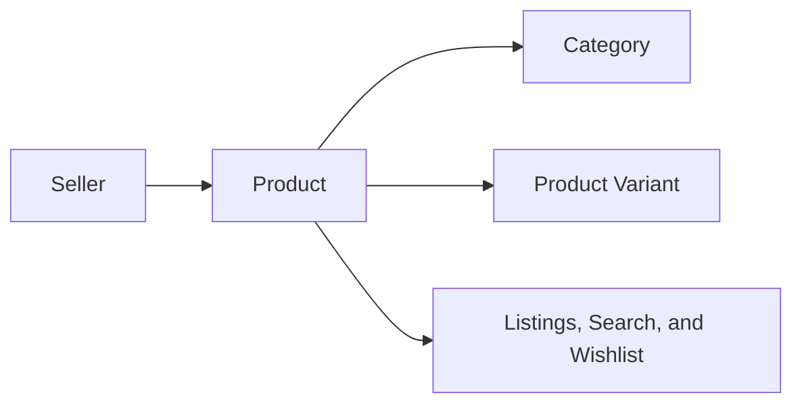

### Core Product Attributes

The product name is the primary business label of the merchandise. It is the main identifier customers see in product listings, search results, and product details.

The product description explains the merchandise in business terms and gives customers the information needed to understand the offering beyond its name alone.

The product category places the product into the platform's classification structure so that customers can discover it through category browsing and related product navigation. The category expresses where the product belongs in the catalog, while the category concept itself is defined separately in the Category concept.

The base price expresses the standard price context of the product at the product level. It represents the default commercial price of the merchandise unless a specific product variant presents its own price for a particular option combination.

These attributes belong to the product as the overall merchandise offering and are separate from variant-specific attributes such as option values, variant-specific price differences, or stock quantity.

### Listing Visibility and Purchasable Availability

Listing visibility and purchasable availability are related but separate business meanings of a product.

Listing visibility describes whether the product appears to customers in marketplace discovery surfaces such as search results and category listings. A visible product is part of the active catalog presentation.

Purchasable availability describes whether the product can actually be bought at that time. A product becomes commercially purchasable only through at least one product variant that is available for selection and purchase.

Because these meanings are distinct, a product may remain visible while being unavailable for purchase. In that situation, the product still exists as part of the catalog, but customers cannot complete a purchase from it until a purchasable variant is available.

This separation supports the marketplace need to present merchandise consistently while accurately reflecting whether the product can currently be bought.

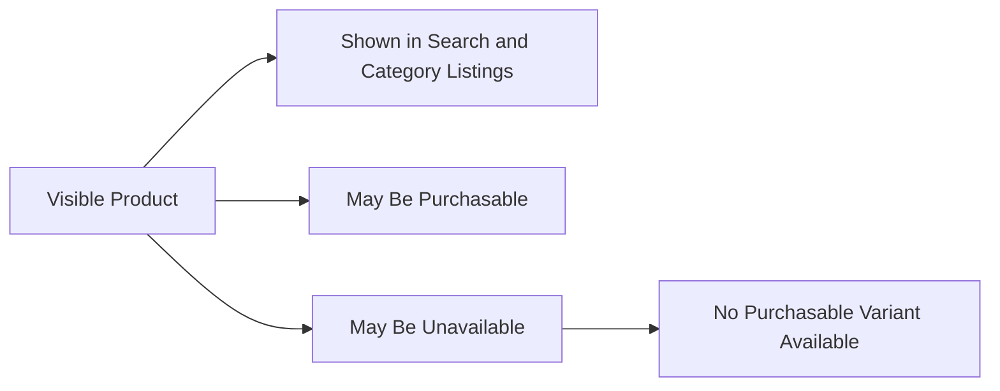

### Seller Ownership and Product Boundaries

Each product is seller-owned in business terms. The seller who creates the product is the marketplace owner of that merchandise offering, and the product is understood as belonging to that seller's catalog presence on the platform.

This ownership gives the product a clear commercial source for customers. In listings and product details, the product is associated with the seller's shop identity so customers understand who is offering the merchandise.

The product concept is separate from the Product Variant concept. The product defines the overall item offering, while product variants define the specific purchasable combinations within that offering, such as a particular option combination and any variant-specific pricing. Customers discover and understand the merchandise through the product, but they purchase a specific variant.

This boundary is important to the business model: one product can represent a single merchandise offering, while multiple variants can represent the specific choices available under that offering.

### Historical Product Identity

A product has a historical identity that continues to matter even after it is no longer active in current listings. Its past commercial meaning must remain understandable in historical business records.

When product information changes over time, the marketplace preserves the earlier product state through historical records rather than replacing the past entirely. This allows the platform to retain what the product was called, how it was described, how it was categorized, and what price context it had at earlier points in time.

Historical product identity is also important when a product is removed from active listings. Even if customers can no longer find the product in current catalog views, preserved historical records still retain its past commercial identity for order history, dispute resolution, and other historical reference needs.

The product therefore has two business perspectives: a current marketplace presence and a preserved historical identity. The current presence supports discovery and purchase, while the historical identity supports trustworthy records of past commerce.

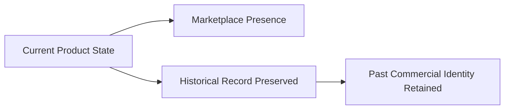

## ProductImage Concept

ProductImage represents a visual media item attached to a product for gallery and listing presentation. It is part of how customers understand and evaluate a product visually. The concept includes ordered presentation, meaning each image has business meaning through its position among the product’s images. The first image in that order serves as the main thumbnail image for listings. ProductImage is therefore more than a simple attachment because display order affects customer-facing presentation. It belongs to a product’s overall state and is included in historical product preservation. This concept is distinct from SellerProfile logo image because it represents merchandise imagery rather than shop branding imagery.

### Product Gallery Image

A product gallery image is a visual merchandise media item attached to a product so customers can understand the item through pictures as well as text. It belongs to the product’s gallery rather than to a customer, seller account, or order. A product can have multiple gallery images, and together they form the customer-facing visual presentation of that product.

Each gallery image is part of the product’s business meaning because it helps represent the merchandise being offered for sale. In listings and product detail views, these images communicate what the product looks like and support customer evaluation before purchase. This concept is limited to merchandise imagery and does not represent shop identity or seller branding.

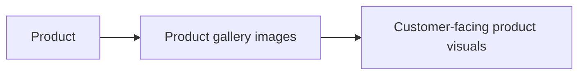

### Ordered Image Presentation and Thumbnail Meaning

Product gallery images have an ordered presentation. Their position is meaningful because it determines how the product is visually introduced to customers. The image shown first in that order is the main thumbnail image used as the primary visual representation in product listings.

This means the first image has a distinct customer-facing role compared with the remaining gallery images. While all gallery images contribute to the full visual understanding of the product, the first image serves as the default summary image when customers browse products in search results or category listings. The remaining images support fuller inspection on the product detail view.

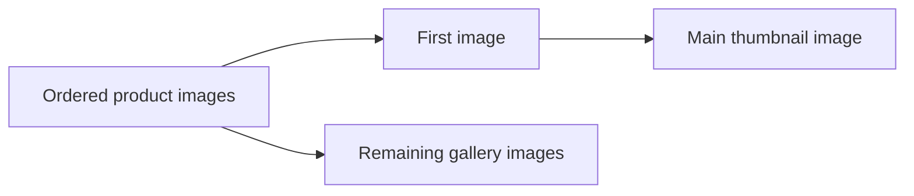

### Historical Inclusion in Product State

A product gallery image is part of the product’s historical state. When the product’s editable state is preserved in product history, the image set and its order are included as part of that preserved state. This allows relevant parties to understand how the product was visually represented at a given point in time.

Because image content and image order affect customer-facing presentation, they are treated as part of the full product state rather than as separate unrelated attachments. Historical preservation of the product therefore includes its gallery imagery alongside the rest of the product information.

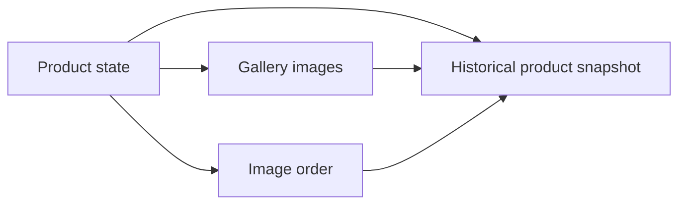

### Separation from Shop Logo Image

A product gallery image is separate from a shop logo image. Product gallery images represent the merchandise itself, while the shop logo image represents the seller’s public shop identity. These are different business concepts even though both are images.

Customers use product gallery images to evaluate a specific product. Customers use the shop logo image to recognize the seller’s profile or brand presence. A gallery image therefore belongs to the product concept, while a logo image belongs to the seller profile concept.

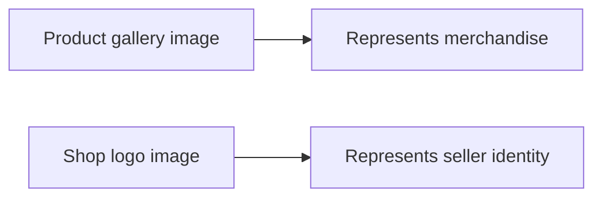

## ProductVariant Concept

ProductVariant represents a specific purchasable version of a product. It captures the concrete option combination a customer selects when buying, such as a particular color and size. Its key attributes are SKU code, option values, optional price override, and stock quantity. The SKU code acts as the unique business identifier for that variant among the seller’s offerings. Option values describe the distinguishing combination that makes one variant different from another under the same product. A variant may use the product’s base price or a variant-specific price when applicable. Its availability is tied to stock quantity, so variant-level stock determines whether that exact version can be purchased. ProductVariant is separate from Product because the product defines the overall item and the variant defines the exact purchasable choice.

### Specific Purchasable Version

ProductVariant represents the exact version of a Product that a customer can choose and buy. It is the business concept used to distinguish one purchasable choice from another under the same Product. A Product describes the overall merchandise offering, while a ProductVariant identifies the concrete choice that is actually selected for purchase.

A Product can have one or more ProductVariant records. Each ProductVariant belongs to exactly one Product and exists to capture a distinct purchasable version within that Product’s offering. This means the customer does not purchase the abstract Product by itself, but a specific ProductVariant defined by its identifying and differentiating details.

### Variant Identifier and Option Combination

Each ProductVariant is identified by a variant SKU code, which serves as the unique variant identifier for that variant among the seller’s offerings. The variant SKU code distinguishes one ProductVariant from another at the business level and allows the exact purchasable version to be referenced unambiguously.

A ProductVariant is also defined by its option value combination. Option values describe the characteristics that make one variant different from another under the same Product. A common example is a color and size combination, such as one ProductVariant representing Red and Large while another represents Blue and Small. The option value combination is therefore part of what makes a ProductVariant a separate purchasable choice rather than just another view of the same Product.

### Variant Price and Stock-Based Availability

A ProductVariant may use the Product’s base price or may have an optional price override of its own. When no variant-specific price applies, the ProductVariant follows the Product base price. When an optional price override is present, that override is the business price associated with that exact variant.

Each ProductVariant also has its own variant stock quantity. This stock quantity is maintained at the variant level, not only at the Product level, because availability can differ between variants of the same Product. As a result, variant-level availability is determined by the stock quantity of that exact ProductVariant. A variant with available stock is a purchasable choice, while a variant whose stock quantity has reached zero is treated as out of stock for that specific version.

### Separate from Product

ProductVariant is separate from Product because the two concepts serve different business purposes. Product defines the overall catalog item, including the shared merchandise identity presented to customers. ProductVariant defines the exact purchasable choice within that Product, including the identifying SKU code, the distinguishing option value combination, any optional price override, and the variant-specific stock position.

This separation allows one Product to represent a single merchandise offering while multiple ProductVariant records represent the individual choices customers can actually purchase. In business terms, Product answers what the item is, and ProductVariant answers which exact version of that item is being bought.

## InventoryRecord Concept

InventoryRecord represents an immutable stock movement entry for a product variant. It is the business concept used to express how stock changes over time rather than a direct editable stock field. Its key attributes are quantity change, reason, and timestamp. A positive quantity change represents stock being added, while a negative quantity change represents stock being reduced. The reason attribute explains the business cause of the movement, such as restocking, order impact, cancellation restoration, refund restoration, or adjustment loss. Current stock is understood from the accumulated effect of all inventory records rather than from a separate standalone stock value history. InventoryRecord is distinct from snapshot concepts because it records ongoing stock movements instead of preserving before-and-after versions of editable content.

### Immutable Stock Movement Entry

InventoryRecord represents a single stock movement entry for a specific product variant. It is an immutable business record, which means that once a movement is recorded, that record remains preserved as part of the variant’s inventory history. Each record exists to describe one stock change event rather than an editable running balance. The concept is used to explain how stock changed over time, not to overwrite or replace earlier stock information.

This concept belongs to one product variant and contributes one factual entry to that variant’s inventory history. Because the record is immutable, historical stock movements remain traceable even after later changes occur. InventoryRecord is therefore the business source for understanding how stock increased, decreased, and accumulated over time for a variant.

### Stock Movement Details

Each InventoryRecord contains three core business attributes: quantity change, stock change reason, and movement timestamp. The quantity change expresses how much stock moved in that entry. A positive stock movement means stock was added to the variant, such as when stock is restored or replenished. A negative stock movement means stock was reduced from the variant, such as when stock is consumed or removed.

The stock change reason explains the business cause of the movement so the change can be understood in context. Examples named in the business scope include restocking, order impact, cancellation restoration, refund restoration, and adjustment loss. The movement timestamp identifies when that stock movement was recorded in the variant’s history. Together, these attributes allow each entry to answer how much stock changed, why it changed, and when it changed.

### Accumulated Stock History

Current stock for a product variant is understood from the accumulated effect of all InventoryRecord entries linked to that variant. The business meaning of current stock is therefore the running result of all positive and negative stock movements taken together. A single InventoryRecord does not represent the full stock position by itself; it represents one contribution to that position.

Because inventory is understood through accumulated records, the variant’s inventory history provides a chronological explanation of how the present stock level came to be. This makes InventoryRecord the business concept for stock movement history rather than a separate editable stock value history. The full collection of records for a variant is the authoritative history of its stock changes.

### Distinct from Snapshot History

InventoryRecord is separate from snapshot history. Snapshot concepts preserve before-and-after versions of editable business content, while InventoryRecord preserves ongoing stock movements. In other words, a snapshot explains how editable information changed, but an InventoryRecord explains how stock quantity moved.

This distinction is important in the business domain. InventoryRecord does not serve as a historical copy of product content, variant content, review content, or request content. Instead, it serves as the historical ledger of stock movement for a product variant. It records additions and reductions to stock over time, while snapshot concepts preserve prior states of editable information.

## ProductSnapshot Concept

ProductSnapshot represents an immutable historical record of a product at a specific change point. It exists to preserve the full prior state of a product for dispute resolution and historical reference. Its key attributes include when the change was made, what was changed, and the values before and after. In business terms, the preserved product state includes all product fields and all product images at that moment. The concept also includes the full set of variant snapshots captured at the same time so that the entire product offering can be understood as one preserved state. ProductSnapshot cannot be deleted, even if the live product is later removed from listings. This makes it the platform’s authoritative historical view of a product’s complete commercial presentation at a past point in time.

### Immutable Historical Record

ProductSnapshot is the platform’s preserved historical record of a product at a specific change point. It exists to keep an unchangeable view of how the product was presented commercially before or at the moment a modification was made. Once created, this record is not treated as a live product listing and is not edited further.

This concept is separate from the current product listing. The live product may continue to change over time, but each ProductSnapshot remains fixed as its own historical version. This allows relevant parties to look back at a stable past state without confusion between the current listing and earlier versions.

ProductSnapshot is part of the platform’s broader money-related recordkeeping approach, where modifications to editable business data must be historically preserved. In that context, ProductSnapshot is the authoritative history record for product changes.

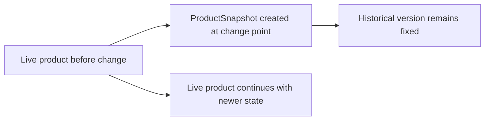

### Captured Change Details

Each ProductSnapshot identifies when the relevant change was made so that the historical state can be placed in time. This timestamp gives business context to the preserved version and supports comparison across multiple product revisions.

The snapshot also records what was changed. In business terms, this means the record shows which parts of the product presentation were modified, rather than only storing an undifferentiated copy with no explanation.

Along with the change description, ProductSnapshot preserves the values before and after the change. This allows relevant parties to understand not only that a modification happened, but also exactly how the product information differed across the transition.

Taken together, the change timestamp, the description of what changed, and the before-and-after values make ProductSnapshot a readable product history record rather than a simple archive copy.

### Complete Preserved Product State

A ProductSnapshot preserves the full product state at the change point. In business terms, this means it captures the complete commercial presentation of the product as it existed at that moment.

The preserved state includes all product fields that define the product listing, including its name, description, category, and base price. The purpose is to ensure that a past version can be understood in full, without needing to reconstruct missing details from later edits.

Product images are also preserved as part of the same historical record. This means the visual presentation of the product at that time remains available alongside the written and pricing information, so the historical version reflects how the product was actually shown to customers.

Because all product fields and images are captured together, ProductSnapshot represents a complete historical version of the product rather than a partial record.

### Complete Product Offering History

ProductSnapshot does not preserve only the main product information. It also includes the full set of variant snapshots captured at that same moment, so the product and its variants can be understood together as one complete offering.

This is important because a product’s commercial meaning often depends on its available variants, such as different option combinations and variant-specific pricing. By preserving the variant snapshots together with the product snapshot, the platform keeps a complete history of what customers could purchase at that point in time.

As a result, ProductSnapshot serves as the historical view of the entire product offering, not just the parent product record in isolation. A past version can therefore be reviewed with its associated variant state intact, allowing relevant parties to see the full merchandise context of that change point.

```mermaid
flowchart LR
    A["ProductSnapshot"] --> B["Preserved product fields"]
    A --> C["Preserved product images"]
    A --> D["Preserved variant snapshots"]
    B --> E["Complete historical product offering"]
    C --> E
    D --> E
```

### Retention and Dispute Reference

ProductSnapshot cannot be deleted. Its historical value remains even if the live product is later removed from listings. This ensures that product history remains available independently of the current existence or visibility of the product.

Because the record is immutable and non-deletable, ProductSnapshot functions as a reliable reference in disputes and historical reviews. Relevant parties, such as owners and administrators, can examine the preserved version to understand what product information, images, and variant state existed at a particular time.

This makes ProductSnapshot the platform’s dispute resolution record for product changes. It provides a trusted historical basis for reviewing disagreements about past product content, pricing presentation, or the overall merchandise state at an earlier moment.

## ProductVariantSnapshot Concept

ProductVariantSnapshot represents an immutable historical record of a product variant’s state. It preserves how a specific variant was defined at a past moment for audit and dispute purposes. Its key attributes include the captured SKU code, option values, and price associated with that historical version. This concept may stand as the preserved form of a variant edit and also appears as part of a complete product snapshot. In that broader context, it helps show the exact set of purchasable variant definitions that existed when the product state was preserved. ProductVariantSnapshot is separate from the live ProductVariant because it is historical evidence rather than the current sellable definition. Like other snapshots in the platform, it is immutable and preserved for future reference.

### Immutable Historical Variant Record

ProductVariantSnapshot represents a fixed historical record of a product variant at a specific past moment. It exists to preserve immutable variant history rather than the variant’s current sellable state.

This concept captures the variant definition as it existed when the historical record was created. Once preserved, the record does not change and remains available as business evidence of how that variant was previously defined.

As a variant audit record, it supports review of prior merchandise definitions without relying on the current live variant. This makes it suitable for examining what the variant looked like at an earlier point in time for audit and dispute reference.

```mermaid
flowchart LR
    A["Live Product Variant"] --> B["ProductVariantSnapshot"]
    B --> C["Immutable Historical Record"]
    C --> D["Audit and Dispute Reference"]
```

### Preserved Variant Definition

A ProductVariantSnapshot preserves the past purchasable definition of a variant by recording the business values that described it at that moment.

The historical SKU code identifies which variant definition was preserved in that historical version. The historical option values show the specific combination that defined the variant, such as color and size or other selected options. The historical variant price shows the price associated with that preserved version, whether it reflected the base selling context or a variant-specific price at that time.

Taken together, these preserved values show exactly how the variant was presented as a purchasable choice in the past. The snapshot is therefore business evidence of the variant definition that previously existed, even if the live variant is later changed.

```mermaid
flowchart LR
    A["Historical SKU Code"] --> D["Past Purchasable Definition"]
    B["Historical Option Values"] --> D
    C["Historical Variant Price"] --> D
```

### Relationship to Product Snapshot and Live Variant

ProductVariantSnapshot is separate from the live ProductVariant. The live variant represents the current sellable definition used in ongoing catalog activity, while ProductVariantSnapshot represents a preserved historical version used for reference.

This concept may exist as the preserved form of an individual variant state and may also be included in a complete product snapshot. When included in a complete product snapshot, it helps show the full set of variant definitions that belonged to the product at that historical moment.

Its inclusion in the broader product history allows relevant parties to understand not only that a product changed, but also how each of its variants was defined at that same point in time. This relationship is important when reconstructing the exact historical merchandise state for review, audit, or dispute handling.

```mermaid
flowchart LR
    A["Live Product Variant"] --> B["Current Sellable Definition"]
    C["ProductVariantSnapshot"] --> D["Historical Variant Definition"]
    E["ProductSnapshot"] --> F["Complete Historical Product State"]
    C --> F
```

## WishlistEntry Concept

WishlistEntry represents a customer’s saved interest in a product. It is a lightweight shopping intent concept that records that a product has been bookmarked for later attention. The concept is product-based rather than variant-based, meaning it refers to the overall product instead of a specific option combination. WishlistEntry belongs to an individual customer’s personal saved list. It has business meaning mainly through the customer-product pairing that identifies what the customer wants to remember. This concept is different from CartItem because it expresses interest without defining quantity, price subtotal, or a specific purchasable variant. When the referenced product no longer exists in active listings, the saved interest is no longer kept in the wishlist.

### Saved Product Interest

WishlistEntry represents a customer’s saved interest in a product for later consideration. It is a customer wishlist item that belongs to one customer’s personal saved list and has meaning only within that customer’s own collection of saved products.

This concept records that a customer wants to remember a product without committing to purchase. Its business identity is the customer-product pairing: the customer who saved the product and the product that was saved.

WishlistEntry is intentionally lightweight. It does not express purchase commitment, shipment intent, or order status. It exists to preserve product interest only.

### Product-Based Reference

WishlistEntry is product-based rather than variant-based. A saved item refers to the overall product and not to a specific variant, option combination, or SKU choice.

Because it is not tied to a specific variant, the saved item remains focused on the product as a catalog item rather than on a particular purchasable version. This distinguishes saved interest from purchase selection, which is handled by the variant-based shopping concept defined in CartItem.

The business meaning of WishlistEntry is therefore stable at the product level: it answers which product a customer wants to keep in view, not which exact purchasable option the customer has selected.

### Relationship to Personal List and Product Lifecycle

Each WishlistEntry belongs to one customer and one product, forming a direct customer-product pairing within the customer’s personal saved list. A customer may therefore keep multiple saved items, with each entry representing interest in a different product.

WishlistEntry is separate from CartItem. Unlike CartItem, it does not carry a selected variant, quantity, or cart pricing context. It represents remembered interest rather than an active purchase selection.

When the referenced product is deleted and no longer exists in active listings, the corresponding WishlistEntry is no longer kept in the wishlist. In business terms, the saved list only retains entries for products that still exist as active product references.

## CartItem Concept

CartItem represents a selected product variant that a customer intends to purchase. It is the shopping basket concept that captures a concrete purchase candidate before checkout. Its key attributes are the chosen product variant, quantity, item price context, and subtotal shown in the cart view. The concept also carries business meaning around current availability, because a cart line may be considered unavailable when the variant is deleted, out of stock, or insufficient for the desired quantity. CartItem is variant-based rather than product-based, so it always refers to a specific purchasable option combination. When the same variant appears in a customer’s cart, it is treated as one combined line rather than separate repeated lines. CartItem is distinct from WishlistEntry because it reflects active purchase intent with quantity and pricing context.

### Cart Item Meaning and Core Attributes

CartItem represents one shopping basket line for a customer before checkout. It always refers to a selected purchasable variant rather than a product in general, so the cart entry captures a concrete option combination that the customer intends to buy.

A CartItem carries the requested quantity for that selected variant. This quantity expresses how many units of that exact variant the customer currently intends to purchase.

A CartItem also carries cart price context for the selected variant at the time it is shown in the cart. This price context supports the cart view by showing the item price used for the customer’s current basket review.

The cart line includes a line subtotal, which is the value shown for that cart entry based on the selected variant and the requested quantity.

CartItem belongs to one customer account and represents active purchase intent. It is part of the customer’s shopping basket until the customer changes it, removes it, or completes checkout.

```mermaid
flowchart LR
    A["Customer account"] --> B["Cart item"]
    B --> C["Selected purchasable variant"]
    B --> D["Requested quantity"]
    B --> E["Cart price context"]
    B --> F["Line subtotal"]
```

### Variant-Based Consolidation in the Cart

CartItem is variant-based, which means the identity of the cart line is determined by the specific purchasable variant selected by the customer. Different variants of the same product are treated as different cart lines because they represent different purchase choices.

When the same variant appears again in the same customer cart, it is treated as one combined line rather than as repeated separate lines. In that case, the business meaning of the cart item is a combined quantity for the same variant.

This consolidation makes the cart reflect total intended purchase quantity for that exact variant in a single basket line. The resulting cart line remains tied to one selected variant, one quantity value, and one subtotal display for that variant selection.

```mermaid
flowchart LR
    A["Variant A selected"] --> C["One cart line for Variant A"]
    B["Variant A selected again"] --> C
    C --> D["Combined quantity for same variant"]
```

### Availability Meaning Within a Cart Item

CartItem also has business meaning around current availability. A cart line can enter an unavailable cart state when the selected variant can no longer be purchased in its current form.

A deleted variant in cart remains meaningful as a cart reference, but it is no longer a valid purchase candidate. In that state, the cart line is shown as unavailable rather than treated as a normal purchasable basket line.

A cart line may also show an out of stock cart warning when the selected variant has no remaining stock. The cart line continues to identify what the customer intended to buy, while clearly indicating that the variant is not currently available for purchase.

If available stock is lower than the requested quantity, the cart item still represents the customer’s intended purchase quantity, but it carries a warning that the current quantity request cannot be fully satisfied from stock.

Availability meaning is therefore part of the CartItem concept itself: the cart line is not only a record of intent, but also a current statement of whether that intent can proceed to purchase.

```mermaid
flowchart LR
    A["Cart item"] --> B["Available"]
    A --> C["Unavailable"]
    C --> D["Deleted variant in cart"]
    C --> E["Out of stock cart warning"]
    C --> F["Requested quantity exceeds stock"]
```

### Distinction Between Cart Item and Wishlist Entry

CartItem is separate from WishlistEntry in business meaning.

A CartItem is a variant-based cart entry that represents immediate purchase intent. It always points to a specific purchasable variant and includes the requested quantity, cart price context, and line subtotal.

WishlistEntry, by contrast, is a saved expression of product interest and is defined separately in WishlistEntry Concept. It is product-based rather than variant-based and does not represent an active basket line for checkout.

This distinction matters because a cart item is prepared for purchase review, while a wishlist entry is a saved item for future consideration.

```mermaid
flowchart LR
    A["Customer saved item"] --> B["Wishlist entry"]
    A --> C["Cart item"]
    B --> D["Product-based interest"]
    C --> E["Variant-based purchase intent"]
```

## Order Concept

Order represents a successful purchase record created after a completed payment outcome. It is the main business document for a customer’s completed checkout result. Its key attributes are order number, order date, total price, and overall order status. An order contains one or more purchased items and may span products from different sellers. The overall order status is derived from the statuses of its contained items rather than maintained independently in meaning. Because different items can progress differently, the order may also reflect partially completed business outcomes. Order is distinct from PaymentAttempt because payment attempts describe the try to pay, while the order is the confirmed commercial record that exists only after success. It is also distinct from OrderItem because the order is the full purchase grouping and each order item is an individual purchased line within it.

### Order as the Confirmed Purchase Record

Order is the business record that represents a completed purchase after payment has succeeded. It is the formal commercial result of checkout and serves as the customer’s confirmed purchase record.

An order exists only when the payment outcome is successful. A failed payment does not become an order and remains only a payment attempt.

The order is the main reference point for the customer’s completed purchase and for later business activities such as shipment, delivery, cancellation, refund, and order history viewing.

The order carries the identifying and summary information for that purchase record:

- Order number: the business identifier used to recognize a specific order.
- Order date: the date on which the successful purchase record was created.
- Total order price: the full monetary amount represented by the order.
- Overall order status: the business summary of the order’s current outcome.

The order also preserves the fact that a shipping address was fixed at purchase time through a separate preserved order address concept, defined in OrderAddressSnapshot.

```mermaid
flowchart LR
    A["Checkout review"] --> B["Payment succeeds"]
    B --> C["Order created"]
    D["Payment fails"] --> E["No order created"]
```


### Order as a Multi-Item and Multi-Seller Purchase Grouping

An order is a purchase grouping that contains one or more purchased items. It represents the whole purchase event from the customer’s perspective, even when the purchase contains several distinct items.

The order can include multiple purchased items with different quantities and different product selections. If the customer purchases repeated quantity of the same variant, that quantity is represented within a single purchased item rather than turning the order itself into multiple separate purchase records.

An order may span items from different sellers. This means a single successful checkout can produce one order that includes purchased items fulfilled by more than one seller.

Because different sellers can participate in the same order, the order acts as the umbrella business record above seller-specific fulfillment activities. Shipment handling and seller fulfillment responsibilities are defined by Shipment and OrderItem, not by the order itself.

The order therefore serves as the customer-facing grouping of the full purchase, while still allowing the contained items to proceed independently under their own business lifecycles.

```mermaid
flowchart LR
    A["One successful checkout"] --> B["One order"]
    B --> C["Item from seller A"]
    B --> D["Item from seller B"]
    B --> E["Item from seller C"]
```


### Overall Order Status as a Derived Business Summary

The overall order status is a summary meaning derived from the statuses of the purchased items contained in the order. It is not a separate business story independent from those items.

The order’s status communicates the overall outcome of the purchase at a summary level for the customer. Its meaning comes from evaluating the current statuses of all contained items together.

Because each purchased item can progress differently, the order may represent a partially completed outcome. This occurs when the contained items do not all end in the same business state, such as when some items are delivered while others are refunded or cancelled.

This derived nature distinguishes the order’s status from item-level status. The item status belongs to each individual purchased line, while the overall order status is the combined summary of the entire purchase grouping.

The allowed overall order meanings are:

- Paid: all items are in paid status.
- Shipped: at least one item is shipped and none are yet delivered.
- Delivered: all items are delivered.
- Cancelled: all items are cancelled.
- Refunded: all items are refunded.
- Partially completed: the items are in mixed completed outcomes.

The detailed status rules and transition behavior are defined in the business category and state sections rather than repeated here.

```mermaid
flowchart LR
    A["Order items"] --> B["Evaluate item statuses together"]
    B --> C["Overall order status"]
    C --> D["Paid"]
    C --> E["Shipped"]
    C --> F["Delivered"]
    C --> G["Cancelled"]
    C --> H["Refunded"]
    C --> I["Partially completed"]
```


### Order in Relation to Payment Attempt and Order Item

Order is distinct from PaymentAttempt. A payment attempt represents an effort to complete payment and may end in success or failure. Order represents the confirmed purchase record that exists only after a successful payment outcome. In business terms, the payment attempt is the try to pay, while the order is the confirmed commercial result.

Order is also distinct from OrderItem. The order is the full purchase grouping, while each order item is an individual purchased line within that grouping. The order answers the question, “What was bought in this purchase as a whole?” The order item answers the question, “What specific purchased item is inside that purchase?”

This distinction matters because the order provides purchase-level identity and summary information, while the order item carries line-level purchase detail and its own lifecycle. The order therefore sits above order items in business meaning, and above payment attempts in confirmation meaning.

```mermaid
flowchart LR
    A["PaymentAttempt"] --> B["Successful outcome"]
    B --> C["Order"]
    C --> D["OrderItem 1"]
    C --> E["OrderItem 2"]
    C --> F["OrderItem 3"]
```


## OrderAddressSnapshot Concept

OrderAddressSnapshot represents the preserved shipping address fixed at the time an order is placed. It is the order-specific delivery identity used for that purchase, independent of later edits to saved addresses. Its key attributes are the shipping recipient and location details captured from the customer’s chosen shipping address at purchase time. In business terms, this includes the recipient name, phone number, street address, city, state or province, postal code, and country associated with the order. The concept is immutable because the shipping address for an already placed order is not changeable afterward. OrderAddressSnapshot is separate from ShippingAddress because a saved address can change over time, while the order’s preserved delivery destination must remain historically fixed. This concept ensures the order always retains the exact address context used when the purchase was made.

### Preserved Order Shipping Address

OrderAddressSnapshot is the preserved shipping address attached to a specific order at the time of purchase. It represents the exact delivery identity used for that purchase and remains part of the order record as its fixed delivery destination. In business terms, this concept exists so the order always keeps the same shipping context even if the customer later changes or deletes saved addresses in their address book.

The preserved order shipping address contains the recipient name, phone number, street address, city, state or province, postal code, and country captured for that order. These details describe where the purchased items were intended to be delivered when the order was placed.

OrderAddressSnapshot belongs to the order itself, not to the customer’s current address book. It serves as the historical delivery reference for that purchase and is used to understand the exact destination associated with the order.

### Purchase-Time Address Capture

OrderAddressSnapshot is created from the shipping address chosen during checkout. It captures the purchase-time address details exactly as they were when the customer placed the order. This includes the recipient name in the order snapshot, the order phone number snapshot, and the full location snapshot consisting of street address, city, state or province, postal code, and country.

This concept is important because the order’s delivery information must reflect the address context that existed at the moment of purchase. The order therefore keeps its own address record rather than depending on a saved shipping address that may later be edited. In the domain model, this makes the order’s delivery destination a historical fact tied to the completed purchase.

### Immutable and Separate Historical Delivery Context

OrderAddressSnapshot is immutable. Once the order has been placed, the preserved shipping address for that order does not change. This immutability means the delivery destination recorded with the order remains historically fixed and continues to represent the same purchase-time destination throughout the life of the order.

OrderAddressSnapshot is separate from ShippingAddress. A ShippingAddress is a reusable saved address managed by the customer, while OrderAddressSnapshot is the fixed order-specific address record for a completed purchase. If the customer later updates a saved address, changes the default address, or removes an address from the address book, those later changes do not alter the preserved delivery details already attached to existing orders.

This separation ensures that past orders always retain the exact delivery context used when they were created, which supports reliable historical reference for order review and dispute resolution.

## OrderItem Concept

OrderItem represents an individual purchased product variant within an order. It is the unit of fulfillment and after-sales status inside the broader purchase. Its key attributes are the purchased product variant reference, quantity, item price, and item status. Item status can be paid, shipped, delivered, cancelled, or refunded. An order item may represent multiple units of the same variant when the customer bought more than one of that exact selection. Because orders can include products from different sellers, each order item also carries seller-specific commercial meaning within the larger order. OrderItem is distinct from Order because it is the granular purchased line, and it is distinct from CartItem because it represents a confirmed purchase rather than pre-checkout intent. It also serves as the business anchor for shipment grouping, cancellation requests, refund requests, and purchase-time snapshots.

### Purchased Line Identity

OrderItem is the business concept for one confirmed purchased line inside an order. It represents an individual purchased product variant rather than the whole order. Each order item points to the exact variant that was bought, so the line preserves the commercial meaning of that specific selection within the purchase. An order can contain multiple order items, and each one stands on its own as a distinct purchased line.

OrderItem is separate from the full order because the order is the overall purchase record, while the order item is the granular line within that record. This distinction matters because different lines in the same order can represent different products, different variants, and different sellers.

### Quantity and Price Meaning

Each order item carries the purchased quantity and the item price for that purchased line. The purchased quantity expresses how many units of the same variant were bought together. If a customer buys multiple units of the exact same variant in one purchase, they are represented as one order item with a quantity greater than one, rather than as separate purchased lines.

The item price is the price associated with that order item at the time of purchase. In business terms, this allows the purchased line to preserve the monetary meaning of what the customer agreed to buy. Because quantity and item price belong to the order item, the platform can interpret the line as both a merchandise record and a financial record within the broader order.

### Item Status as the Line-Level Purchase State

OrderItem has its own line-level status. The allowed states are paid, shipped, delivered, cancelled, and refunded. These states describe the lifecycle of the purchased line itself rather than the status of the entire order.

Because status belongs to each order item, different lines in the same order can be in different states at the same time. This makes the order item the business unit used to understand fulfillment progress and after-sales outcomes for a specific purchased line.

### Seller-Specific Commercial Scope

OrderItem also has seller-specific meaning within a multi-seller marketplace. A single order may include purchased lines from different sellers, but each order item is tied to the seller responsible for that particular purchased line. This makes the order item the business boundary for seller responsibility inside the larger purchase.

From a marketplace perspective, the order item is the level at which a seller’s sold merchandise, fulfillment responsibility, and after-sales responsibility are understood. This seller-specific scope is what allows one order to combine items from multiple sellers without losing clarity about which seller is responsible for which purchased line.

### Relationship to Cart, Shipment, and After-Sales Records

OrderItem is distinct from CartItem. A cart item expresses pre-checkout shopping intent for a selected variant and quantity, while an order item expresses a confirmed purchase that exists only after successful order creation. In other words, the cart item belongs to the shopping stage, and the order item belongs to the completed purchase stage.

OrderItem is also the anchor concept for shipment and after-sales records. Shipments group one or more order items for delivery handling. Cancellation requests and refund requests are attached to an order item because those cases are handled at the purchased-line level. Purchase-time product details and seller details are also preserved around the order item so the platform can understand exactly what was bought, from whom it was bought, and what happened to that purchased line over time.

## ProductPurchaseSnapshot Concept

ProductPurchaseSnapshot represents the immutable purchase-time record of the product and variant details attached to an order item. It preserves what the customer actually bought as it was described at the moment of purchase. Its key attributes include the product name, product description, variant option values, and price captured for that order item. This snapshot exists so later edits or deletions to the live product do not alter the historical purchase record. It is distinct from ProductSnapshot because it is tied to a completed purchase context rather than to an edit event in the catalog. ProductPurchaseSnapshot therefore serves as the authoritative historical merchandise description inside the order domain. It supports disputes, order review, and long-term accuracy of purchase history.

### Purchase-Time Merchandise Record

ProductPurchaseSnapshot is the purchase-time product record attached to an order item. It represents the merchandise exactly as the customer bought it at the moment the order was created, rather than the product as it may appear later in the live catalog.

This concept preserves the core merchandise description for that specific purchase, including:
- the product name at purchase
- the product description at purchase
- the variant option values at purchase
- the price at purchase

Each ProductPurchaseSnapshot belongs to one order item and serves as that order item’s historical product record. Its purpose is to ensure that the purchased merchandise can still be understood even if the live product is later edited or removed.

```mermaid
flowchart LR
    A["Live Product"] --> B["Order Item"]
    B --> C["ProductPurchaseSnapshot"]
    C --> D["Purchase-Time Merchandise Record"]
```

### Immutable Purchased Product Contents

ProductPurchaseSnapshot is an immutable merchandise snapshot. After it is attached to an order item, it remains a fixed historical description of what was purchased.

The snapshot preserves the business-facing product details that matter to the purchase context:
- product name at purchase, so the order item continues to identify the item by the name shown when bought
- product description at purchase, so the order retains the descriptive merchandise information that existed at purchase time
- variant option values at purchase, so the exact selected version of the product remains clear in the order history
- price at purchase, so the monetary value associated with the purchased item remains historically accurate for that order item

Because the snapshot is fixed, later catalog changes do not overwrite the purchased record. This makes the order item understandable on its own without depending on the current state of the product listing.

### Order-Item Historical Reference

ProductPurchaseSnapshot serves as the order-item product history for purchased merchandise. It is the authoritative historical reference used inside the order domain when someone needs to understand what was bought.

In business terms, this means the order item can continue to present a stable purchased-product description even when the related live product has changed over time. The snapshot supports reliable interpretation of:
- what product the customer purchased
- which variant option values were selected for that purchase
- what descriptive merchandise information applied at that time
- what item price applied to that purchase

This historical reference is tied to the purchase itself, not to later catalog maintenance. It therefore supports order review, customer understanding of past purchases, and dispute discussion based on the purchased state rather than the current listing state.

### Distinction from Catalog Edit History

ProductPurchaseSnapshot is separate from ProductSnapshot. Although both are historical records, they serve different business meanings.

ProductPurchaseSnapshot is tied to a completed purchase context and exists as part of an order item’s historical merchandise record. Its purpose is to preserve what the customer actually bought.

ProductSnapshot, by contrast, records catalog edit history for a product at the time of change. It exists to preserve the state of the product when the seller edited the listing.

The distinction is important:
- ProductPurchaseSnapshot answers, "What did this order item represent when purchased?"
- ProductSnapshot answers, "What did the catalog product look like at a particular edit point?"

These concepts should not be treated as interchangeable. A purchase-time record preserves the bought merchandise within the order context, while a catalog edit snapshot preserves change history within the product management context.

```mermaid
flowchart LR
    A["Catalog Edit Event"] --> B["ProductSnapshot"]
    C["Successful Purchase"] --> D["ProductPurchaseSnapshot"]
```

### Historical Purchase Accuracy

ProductPurchaseSnapshot exists to preserve historical purchase accuracy. In a commerce platform, later edits to a product listing must not alter the meaning of a past purchase.

By keeping the purchased product name, description, selected variant option values, and purchase-time price as a fixed order-item record, the platform maintains a stable historical account of the transaction. This allows past purchases to remain accurate even if the seller later updates the product description, changes option values in the listing, adjusts prices, or removes the live product from sale.

This concept supports long-term trust in order history because the order item continues to reflect the merchandise as bought, not as currently listed. It also supports dispute resolution and historical review by ensuring that the purchase record remains consistent over time.

## SellerProfilePurchaseSnapshot Concept

SellerProfilePurchaseSnapshot represents the immutable purchase-time record of the seller’s public shop identity attached to an order item. It preserves how the seller appeared to the customer when the purchase was made. Its key attributes are the seller’s shop name and logo at that time. This concept ensures that later changes to the live SellerProfile do not rewrite the historical seller identity shown in past orders. It is distinct from SellerProfile because the live shop profile may evolve, while the purchase-time seller identity inside an order must remain fixed. SellerProfilePurchaseSnapshot therefore carries the historical shop context necessary for purchase records, disputes, and long-term order accuracy.

### Purchase-Time Seller Identity

SellerProfilePurchaseSnapshot is the purchase-time seller identity attached to an order item. It preserves how the seller was presented to the customer when that purchase was completed.

This concept contains the seller-facing shop identity that mattered at the moment of purchase, specifically the shop name at purchase and the shop logo at purchase. It is used as the historical seller reference for that order item.

Because it is tied to an order item, different items in different orders can preserve different seller identities if the seller later updates the live shop profile. This allows past purchases to continue showing the seller information that was true at the time of each purchase.

```mermaid
flowchart LR
    A["Live Seller Profile at Purchase Time"] --> B["SellerProfilePurchaseSnapshot"]
    B --> C["Order Item Seller Identity"]
```

### Immutable Shop Profile Snapshot

SellerProfilePurchaseSnapshot is an immutable shop profile snapshot. Once it has been preserved inside an order item, it remains fixed as part of the purchase record.

Its purpose is to prevent later profile edits from rewriting historical purchase information. If the seller changes the live shop name or replaces the live logo image, the preserved purchase-time snapshot in existing order items does not change.

This concept supports reliable order history, dispute review, and long-term purchase accuracy because the order item keeps a stable seller identity that reflects the completed transaction rather than the seller’s current public presentation.

### Historical Shop Context in Past Orders

SellerProfilePurchaseSnapshot provides the historical shop context shown with past orders. It explains which shop identity was associated with a purchased item when the customer placed the order.

In past orders, the preserved seller identity includes the shop name at purchase and the shop logo at purchase. This historical context is especially important when the live seller profile has changed after the sale.

As a result, past orders continue to show a consistent seller history for each order item instead of being updated to match the seller’s current profile. This keeps historical purchase records understandable to customers, sellers, and administrators who review earlier transactions.

### Separate from Live Seller Profile

SellerProfilePurchaseSnapshot is separate from the live seller profile. The live seller profile represents the seller’s current public shop presentation, while SellerProfilePurchaseSnapshot represents the preserved seller identity stored with a completed purchase.

The live seller profile may evolve over time as the seller updates the shop name, description, or logo. By contrast, the purchase snapshot keeps only the historical seller identity needed for the order item and does not change afterward.

This separation ensures that a current shop update does not alter the seller history already preserved in past orders. The live profile remains the current public view, and the purchase snapshot remains the fixed historical view for that specific transaction.

## Shipment Concept

Shipment represents a package sent by a seller for one or more order items. It is the fulfillment grouping concept that connects physical delivery to purchased items. A shipment contains only order items from the same seller, reflecting seller-based fulfillment boundaries in the marketplace. Different sellers therefore correspond to different shipments in business terms. A shipment may include a single order item or multiple order items bundled together. Its key identifying attributes include the associated tracking details shared across the package and the set of order items included in that package. Shipment is distinct from Order because one order can contain multiple shipments, and it is distinct from TrackingInfo because the shipment is the package entity while tracking information is the identifying delivery detail attached to it.

### Shipment as the Seller Fulfillment Package

Shipment is the business concept for a package sent by a seller to fulfill purchased order items. It represents the physical delivery grouping used after purchase and before delivery is completed.

A shipment belongs to a single seller and exists to connect that seller's purchased items to one package for delivery. In business terms, shipment is the package-level record of fulfillment, while the included order items identify exactly what the package contains.

A shipment may contain one order item or multiple order items. The included items are the contents of the package, and the shipment expresses that those items are being delivered together as one seller-managed package.

```mermaid
flowchart LR
    A["Seller"] --> B["Shipment"]
    B --> C["Order Item 1"]
    B --> D["Order Item 2"]
    B --> E["Order Item 3"]
```

### Shipment Boundaries Within an Order

Shipment is separate from Order. An order is the customer's overall purchase record, while a shipment is one package within that purchase. One order can therefore contain multiple shipments when fulfillment is split across sellers or across packages.

The shipment boundary is seller-based. A shipment can contain only order items associated with the same seller. This means items from different sellers are never combined into a single shipment, even when they were purchased together in one order.

Because the marketplace allows one order to include items from different sellers, different sellers ship separately in business terms. As a result, a single order may be represented by several shipments, each corresponding to a different seller package.

A seller may also bundle multiple eligible order items into one shipment, or send them as separate shipments, as long as each shipment remains limited to that seller's own items.

```mermaid
flowchart LR
    A["Order"] --> B["Shipment from Seller A"]
    A --> C["Shipment from Seller B"]
    B --> D["Seller A Item"]
    C --> E["Seller B Item"]
```

### Shipment Tracking Association

Shipment includes shipment-level tracking details that identify the package in transit. These tracking details are shared by all order items included in that shipment because they are moving together in the same package.

Shipment is distinct from TrackingInfo. Shipment is the package entity and the fulfillment grouping itself. TrackingInfo is the delivery identification detail attached to that package, such as the carrier name and tracking number.

This distinction is important in the domain model: the shipment answers the question of which items are being delivered together, while the tracking information answers the question of how that package is identified during delivery.

```mermaid
flowchart LR
    A["Shipment"] --> B["Tracking Info"]
    A --> C["Included Order Items"]
```

## TrackingInfo Concept

TrackingInfo represents the delivery identification details attached to a shipment. It is the business concept customers and sellers use to recognize and follow a package in transit. Its key attributes are carrier name and tracking number. All order items in the same shipment share the same tracking information because they are part of one package. TrackingInfo is therefore package-level information rather than item-level information. It is distinct from Shipment because the shipment is the package entity itself, while TrackingInfo is the identifying transit detail associated with that package. This concept gives the shipment a recognizable delivery reference in the order domain.

### Delivery Identification Details

Tracking information represents the delivery identification details attached to a shipment. It gives a package a recognizable transit reference that customers and sellers can use to identify the package while it is moving through delivery.

This concept is defined by two identifying attributes: carrier name and tracking number. Together, these details distinguish one shipment's transit reference from another.

Tracking information belongs to a shipment as package-level information. It does not describe the purchased goods themselves; it describes the delivery reference used for the package that carries them.

Customers see tracking information as the delivery reference associated with a shipment in an order. Sellers use the same reference to recognize the package they sent.

```mermaid
flowchart LR
    A["Shipment"] --> B["TrackingInfo"]
    B --> C["Carrier Name"]
    B --> D["Tracking Number"]
    B --> E["Customer-Visible Delivery Reference"]
```

### Shipment-Level Transit Reference

Tracking information is a shipment-level transit reference. All order items included in the same shipment share the same tracking information because they are traveling together in one package.

Because the reference is attached to the shipment, it is shared across the items grouped inside that shipment rather than assigned separately to each order item. This makes tracking information package-level tracking detail, not item-level tracking detail.

When one shipment contains multiple order items from the same seller, those items are understood to be associated with the same carrier name and tracking number through their common shipment.

```mermaid
flowchart LR
    A["Shipment"] --> B["Order Item A"]
    A --> C["Order Item B"]
    A --> D["TrackingInfo"]
    D --> E["Shared Carrier Name"]
    D --> F["Shared Tracking Number"]
```

### Separation from the Shipment Entity

Tracking information is separate from the shipment entity even though the two concepts are closely related. The shipment is the package entity within the order domain, while tracking information is the identifying transit detail attached to that package.

This distinction is important because the shipment represents the package grouping itself, and tracking information represents how that package is recognized in delivery tracking. A shipment can therefore be understood as the package concept, and tracking information can be understood as the package's delivery reference.

From the customer perspective, the shipment answers which package contains the purchased items, while the tracking information answers which carrier and tracking number identify that package in transit.

```mermaid
flowchart LR
    A["Shipment Entity"] --> B["Contains Order Items"]
    A --> C["Has TrackingInfo"]
    C --> D["Carrier Name"]
    C --> E["Tracking Number"]
```

## CancellationRequest Concept

CancellationRequest represents a customer’s request to cancel a specific order item before shipment. It is an after-purchase dispute concept scoped to one purchased item rather than to an entire order. Its key attributes are the customer-provided reason text and the current decision status of the request. The concept is tied to an order item that is still in the paid state and not yet in shipment context. CancellationRequest is separate from RefundRequest because cancellation applies before shipment, while refund applies after delivery. It is also separate from CancellationRequestSnapshot because the live request carries the current cancellation case, whereas the snapshot preserves historical state changes. This concept exists to express a reviewable item-level cancellation case in the order domain.

### Cancellation Request as an Item-Level Cancellation Case

CancellationRequest is the business concept for an after-purchase cancellation case raised for one specific order item.
It represents a dispute or reversal request for a purchased item rather than for an entire order.
The concept exists at the order-item level because different items in the same order may proceed differently.
A CancellationRequest always refers to a single purchased item and does not represent a request covering multiple items at once.
This concept is used before shipment and therefore belongs to the pre-shipment portion of the after-purchase order domain.
The request remains a live cancellation case while it carries the current state of that item-specific cancellation matter.

```mermaid
flowchart LR
    A["Order item after purchase"] --> B["CancellationRequest"]
    B --> C["One specific order item dispute"]
```

### Core Attributes of the Live Cancellation Case

The key business attributes of a CancellationRequest are the customer cancellation reason and the current cancellation decision status.
The customer cancellation reason is the text provided by the customer to explain why cancellation is being requested for that item.
The current cancellation decision status expresses the present review outcome or review standing of the cancellation case.
Together, these attributes describe both why the request exists and what its current reviewed position is.
The live request carries the latest business state of the case rather than a historical series of prior states.
This concept therefore serves as the current representation of an item-specific cancellation matter at a given point in time.

```mermaid
flowchart LR
    A["CancellationRequest"] --> B["Customer cancellation reason"]
    A --> C["Current cancellation decision status"]
```

### Order Item Eligibility Context

A CancellationRequest is tied to a specific order item that is in the paid state and has not yet entered shipment context.
Its business meaning depends on that item-level eligibility context because cancellation applies before the item is shipped.
The concept is therefore linked to an order item that has been purchased successfully but is still awaiting shipment.
This relationship distinguishes a cancellation case from later after-delivery disputes.
The request remains scoped to the single eligible item to which it is attached and does not change the identity of that purchased item.
The order item provides the dispute context, and the CancellationRequest provides the cancellation case associated with that context.

```mermaid
flowchart LR
    A["Paid order item"] --> B["Not yet shipped"]
    B --> C["CancellationRequest can exist"]
```

### Separation from Refund Request and Historical Snapshot

CancellationRequest is separate from RefundRequest because the two concepts apply at different business moments for an order item.
CancellationRequest applies before shipment, while RefundRequest applies after delivery.
A cancellation case therefore concerns a paid item that has not yet been shipped, whereas a refund case concerns an item that has already been delivered.
CancellationRequest is also separate from CancellationRequestSnapshot.
The live CancellationRequest holds the current cancellation case, including its present reason and decision status.
CancellationRequestSnapshot preserves historical changes to that case and serves as the historical record rather than the active case itself.
This separation ensures that the current dispute concept and its preserved history remain distinct business concepts.

```mermaid
flowchart LR
    A["CancellationRequest"] --> B["Before shipment"]
    C["RefundRequest"] --> D["After delivery"]
    A --> E["Live current case"]
    F["CancellationRequestSnapshot"] --> G["Historical state record"]
```

## CancellationRequestSnapshot Concept

CancellationRequestSnapshot represents an immutable historical record of changes to a cancellation request. It preserves how the cancellation case looked at a particular decision point. Its key attributes include when the change was made, what was changed, and the before and after values of the request state. This concept is distinct from the live CancellationRequest because it records historical evidence rather than the current active case. It exists to preserve the progression of cancellation decisions for audit and dispute resolution. Like other snapshots in the platform, it cannot be deleted and remains part of the historical record even after the live request has reached an outcome.

### Immutable Historical Record

CancellationRequestSnapshot is the preserved history of a cancellation request at a specific point in its progression. It exists to capture a past state of the cancellation case rather than the current active state.

This concept records the time when a change was made, the aspect of the cancellation case that changed, and the values before and after that change. In this way, each snapshot serves as a fixed historical decision record that shows how the case looked at that moment.

A CancellationRequestSnapshot is immutable. Once created, its recorded contents do not change, and it cannot be deleted. It remains part of the platform’s permanent cancellation history even after the live cancellation request has moved to a later state or reached a final outcome.

### Relationship to the Live Cancellation Request

CancellationRequestSnapshot is separate from the live CancellationRequest. The live cancellation request represents the current case that is being considered or has already reached its present decision status, while the snapshot represents a preserved earlier version of that same case.

Because of this separation, the platform can distinguish between current cancellation information and historical cancellation evidence. The live request answers what the case looks like now, while the snapshot answers what the case looked like at a particular change point.

This distinction allows the business to preserve a trustworthy record of cancellation changes without replacing or overwriting the current request state.

### Audit and Dispute Resolution History

CancellationRequestSnapshot exists as an audit trail for cancellation activity. By preserving a historical sequence of change points, it provides reliable evidence of how a cancellation case developed over time.

This history supports dispute resolution by allowing relevant parties to review when a cancellation decision changed, what changed in the case, and how the recorded values differed before and after the change. The snapshot therefore serves as historical support for examining the progression of a cancellation case.

Because snapshots cannot be deleted and do not change after creation, they provide stable cancellation history that can be relied on when reviewing disagreements, questions about prior decisions, or the record of a completed case.

## RefundRequest Concept

RefundRequest represents a customer’s request for a refund on a specific delivered order item. It is an after-sales dispute concept focused on one purchased item rather than the entire order. Its key attributes are the customer-provided reason text and the current decision status of the refund case. The concept is tied to an order item in delivered context and exists within the platform’s limited refund eligibility window after delivery. RefundRequest is separate from CancellationRequest because refund concerns delivered items, while cancellation concerns items that have not yet shipped. It is also separate from RefundRequestSnapshot because the live request holds the current refund case and the snapshot preserves historical changes. This concept captures the item-level refund matter that sellers and administrators may later review.

### Refund Request as an Item-Level After-Sales Case

RefundRequest represents a live after-sales dispute about one specific purchased item, not an entire order. It exists to capture a customer’s request to reverse a completed purchase after the item has already reached the delivered stage. The concept is therefore item-level by nature: each refund matter belongs to one order item and is evaluated on that item’s own circumstances.

A RefundRequest is tied to a specific order item after purchase and delivery, which means it does not represent a general complaint about a seller, a product in the abstract, or the whole order record. If an order contains multiple items, each item may have its own separate refund matter.

This concept is the live refund case itself. It holds the current business meaning of the dispute while the matter is being considered or has already been decided. Historical preservation of changes is a separate concept defined in RefundRequestSnapshot.

```mermaid
flowchart LR
    A["Order item purchased"] --> B["Order item delivered"]
    B --> C["RefundRequest exists for that specific order item"]
```

### Refund Reason and Current Decision Status

A RefundRequest carries the customer-provided refund reason as the explanation for why the delivered item is being disputed. This reason is part of the live case and expresses the customer’s stated basis for requesting a refund on that specific order item.

The concept also carries the current refund decision status, which represents the present standing of the case at any given time. This status identifies whether the refund matter is still awaiting review or has already reached a decision. The live request therefore shows the current state of the dispute rather than its full historical progression.

Together, the refund reason and current decision status define the active business meaning of the RefundRequest: one explains why the case exists, and the other shows where that case currently stands.

```mermaid
flowchart LR
    A["Customer refund reason"] --> B["Live refund case"]
    B --> C["Current refund decision status"]
```

### Delivered-Item Context and Refund Eligibility Window

RefundRequest exists only in the context of a delivered order item. It is not a pre-shipping concept and does not apply to items that are still only paid or already in shipment without delivery completion. Its business role begins after delivery, when an after-sales dispute may arise for that one purchased item.

The concept also exists within the platform’s refund window after delivery. This means the refund matter is defined as a post-delivery case that remains relevant only during the allowed period following delivery. The delivery milestone and the limited post-delivery window together define the business boundary of the concept.

Because the concept is anchored to one delivered order item within that window, RefundRequest expresses a narrow and specific kind of post-purchase dispute rather than a general-purpose change request.

```mermaid
flowchart LR
    A["Delivered order item"] --> B["Refund window after delivery"]
    B --> C["RefundRequest may exist"]
```

### Separation from Cancellation and Refund History

RefundRequest is separate from CancellationRequest. A cancellation matter concerns an item that has not yet shipped, while a refund matter concerns an item that has already been delivered. The two concepts therefore describe different after-sales situations, different business timing, and different dispute contexts.

RefundRequest is also separate from RefundRequestSnapshot. The RefundRequest is the live case that shows the current refund matter for the specific order item. RefundRequestSnapshot is the preserved historical record of how that matter changed over time. The live case and the immutable history serve different business purposes and must be understood as distinct concepts.

This separation keeps the domain model clear: cancellation addresses pre-delivery reversal, refund addresses post-delivery dispute, and refund history preserves prior states of the live refund case.

```mermaid
flowchart LR
    A["CancellationRequest"] --> B["Not the same concept as"]
    C["RefundRequest"] --> D["Separate from"]
    E["RefundRequestSnapshot"]
```

## RefundRequestSnapshot Concept

RefundRequestSnapshot represents an immutable historical record of changes to a refund request. It preserves the state of the refund case at a particular point in its review history. Its key attributes include when the change was made, what was changed, and the values before and after the change. This concept is distinct from the live RefundRequest because it records historical evidence instead of the current case state. It exists to preserve accountability and dispute context for refund decisions. Like other platform snapshots, it is immutable and cannot be deleted from the historical record.

### Immutable Refund History Record

RefundRequestSnapshot represents a preserved history entry for a refund case. It exists to capture the state of a refund request at a specific moment in that case’s history rather than to represent the current live case. Each snapshot is immutable, meaning it remains fixed once created and serves as historical evidence of how the refund case looked at that point in time.

This concept supports a complete refund history by allowing the platform to retain prior states of the same refund case as separate historical records. Because it is a historical record, it is kept even when later changes happen to the live refund request. This makes the snapshot suitable for reviewing prior refund decisions and understanding how the case evolved over time.

### Recorded Change Details

A RefundRequestSnapshot records the key details needed to understand a change in a refund case. These details include when the change was made, what changed in the refund case, and the values before and after the change. Together, these attributes provide a point-in-time picture of the refund case and make each historical entry meaningful on its own.

The recorded timestamp identifies the moment the refund case changed. The description of what changed identifies the part of the case that was updated, such as a decision-related change or another change in the request’s state. The before and after values preserve the exact difference between the earlier state and the later state so that the historical record shows not only that a change occurred, but also how the case changed.

### Historical Decision Evidence and Audit Trail

RefundRequestSnapshot serves as a historical refund decision record and forms part of the refund audit trail for the platform. It is distinct from the live RefundRequest because the live request represents the current state of the case, while the snapshot preserves prior states for later review. This separation allows the current case to continue reflecting its latest status without losing the earlier decision history.

As part of the audit trail, each snapshot helps establish accountability around refund review outcomes and case changes. The preserved history provides dispute resolution context by showing the sequence of recorded changes and the exact values associated with those changes at each point in time. RefundRequestSnapshot cannot be deleted, because removing historical refund evidence would break the continuity of the case record and weaken the platform’s ability to review past decisions.

## Review Concept

Review represents a customer-authored evaluation of a purchased product. It is the platform’s product feedback concept tied to actual purchase experience. Its key attributes are rating and optional text content. The rating is expressed on a one to five star scale, while the text content allows optional written feedback. A review is associated with a purchased product in a specific order context, which gives it business credibility as post-purchase feedback. The concept may remain active or become deleted while historical versions are still preserved separately. Reviews also contribute to the product’s average rating when they are not deleted. Review is distinct from ReviewSnapshot because the review is the current visible feedback object and the snapshot is its preserved edit history.

### Review as Customer Product Feedback

Review is the platform’s customer-authored product evaluation for a product that the customer has actually purchased. It represents post-purchase feedback rather than general product commentary, so its business meaning comes from a real order context. A review belongs to the visible feedback layer of the platform: it is the current review that customers read on the product detail page and that contributes to product reputation while it remains active.

A review is linked to the purchased product in a specific order context. This linkage establishes that the feedback is tied to an actual purchase experience rather than an unrelated opinion. For business identity, one review represents one customer’s evaluation of one product within one order context. This means the concept supports one review per product per order context.

Review is a separate concept from review history. The review is the current visible feedback object, while its preserved historical versions belong to the ReviewSnapshot concept defined separately.

### Review Content Structure

A review is defined by two business attributes: rating and text content. The rating is required and is expressed on a one to five star scale. This star value is the primary structured measure of customer satisfaction for the purchased product.

The text content is optional written feedback that allows the customer to describe the purchase experience in words. A review may therefore exist with a rating alone or with both a rating and written commentary. Together, these attributes form the customer-facing content of the review.

Because review content is the current visible feedback state, any historical preservation of earlier versions is not part of the review itself and is handled by the separate ReviewSnapshot concept.

### Review Visibility, Deletion, and Rating Contribution

A review can exist in an active visible state or a deleted visible state. In its active state, it remains part of the product’s displayed feedback collection. In its deleted state, the review no longer functions as visible feedback in the same way, even though its historical versions may still be preserved separately.

The review concept is deletable from the customer-visible feedback set, but deletion does not make the review identical to its historical record. The current review object and its preserved history remain distinct business concepts.

Only non-deleted reviews affect a product’s average rating. This means the product’s average rating is based on the set of reviews that remain active rather than reviews that have been deleted. In this way, the review concept directly influences product reputation only while it remains a non-deleted visible review.

## ReviewSnapshot Concept

ReviewSnapshot represents an immutable historical record of a review’s content at a change point. It preserves earlier versions of customer feedback for accountability and dispute reference. Its key attributes include when the review changed, what was changed, and the before and after values of rating or text content. This concept is separate from the live Review because it stores historical versions instead of the current visible feedback. ReviewSnapshot remains preserved even if the current review is later deleted. It therefore serves as the platform’s long-term history of how product feedback changed over time.

### Immutable Historical Review Record

ReviewSnapshot is the platform’s preserved history record for a review at a specific change point. It represents an earlier version of customer feedback rather than the current visible review. Each snapshot is immutable, meaning the recorded historical version does not change after it is created. This concept exists so the platform can retain trustworthy evidence of how a review changed over time.

A ReviewSnapshot captures the review change timestamp, identifies what part of the review was changed, and preserves the review state before and after the change. The preserved values can include the rating before and after the change and the text content before and after the change. In this way, each ReviewSnapshot stands as a complete historical feedback version for one review update.

```mermaid
flowchart LR
    A["Live Review Before Edit"] --> B["ReviewSnapshot Created"]
    B --> C["Historical Feedback Version Preserved"]
    A --> D["Live Review After Edit"]
```


### Relationship to the Live Review

ReviewSnapshot is separate from the live Review concept. The live review represents the current feedback that customers see on the product detail page, while ReviewSnapshot represents prior states of that feedback for history and reference. This separation ensures that the currently displayed review can change over time without overwriting the platform’s historical record.

Because ReviewSnapshot stores historical versions, it should be understood as a companion record to the live review rather than a replacement for it. The live review shows the present rating and current text content. ReviewSnapshot shows what those values were at an earlier point in time and when the change occurred. This distinction allows disputes or questions about review edits to be examined against preserved historical evidence instead of relying only on the latest visible review.

```mermaid
flowchart LR
    A["Live Review"] --> B["Current Visible Feedback"]
    A --> C["ReviewSnapshot"]
    C --> D["Prior Rating and Text State"]
```


### Preservation and Accountability

ReviewSnapshot remains preserved even if the current review is later deleted. If a customer removes their review, the historical snapshots continue to exist as the platform’s record of what feedback was previously submitted and how it was later changed. This preserved history supports long-term accountability for review edits and deletions.

As an accountability record, ReviewSnapshot allows relevant parties to refer to the review’s historical states when questions arise about what was originally written, how the rating changed, or whether the text content was modified over time. It therefore provides a reliable reference for review history without depending on the continued existence of the current live review.

```mermaid
flowchart LR
    A["Review Edited"] --> B["ReviewSnapshot Preserved"]
    B --> C["Review Later Deleted"]
    C --> D["Historical Record Still Available"]
```


## PaymentAttempt Concept

PaymentAttempt represents a checkout payment processing try made through the external payment gateway context. It is the business concept used to distinguish attempted payment from a completed order. Its key attribute is outcome, which can be success or failure. The concept may also carry the attempt context of being tied to a customer’s order placement effort at checkout. PaymentAttempt is important because a failed payment does not produce an order, while a successful payment does. This makes it separate from Order, which exists only as the confirmed purchase record after payment succeeds. PaymentAttempt therefore captures the payment-result event in the purchasing domain without being the order itself.

### Payment Attempt Definition

PaymentAttempt is the business concept for a customer’s checkout payment try during order placement. It represents a payment processing attempt made in the context of confirming a purchase through an external payment gateway.

This concept exists to capture the result of the payment try itself, rather than the completed purchase record. It is tied to the customer’s purchase confirmation effort at checkout, but it is separate from the Order concept, which is the confirmed purchase record defined in Order Concept.

A PaymentAttempt always expresses the outcome of the external payment gateway interaction as a business result. That result is limited to success or failure.

```mermaid
flowchart LR
    A["Checkout payment try"] --> B["PaymentAttempt"]
    B --> C["Success result"]
    B --> D["Failure result"]
    C --> E["Order context can exist"]
    D --> F["No order record"]
```

### Outcome and Order Boundary

The key attribute of PaymentAttempt is its outcome. The outcome records whether payment processing succeeded or failed in the external payment gateway context.

A successful outcome marks the purchase confirmation boundary at which the checkout effort can move into order context. In business terms, this is the point where a payment attempt can lead to an Order being created.

A failed outcome does not become an Order. It remains only a failed payment processing attempt and records that the customer tried to pay but did not complete a confirmed purchase.

PaymentAttempt therefore separates payment-result meaning from order-record meaning. It answers whether checkout payment succeeded, while Order answers whether a confirmed purchase record exists.

```mermaid
flowchart LR
    A["PaymentAttempt"] --> B["Success"]
    A --> C["Failure"]
    B --> D["Confirmed purchase context"]
    C --> E["No confirmed purchase record"]
```

## ProductSearchQuery Concept

ProductSearchQuery represents the set of search criteria a customer uses to find products in the marketplace. It is the business concept that captures how a customer narrows and orders product discovery results. Its key attributes include search keyword, category filter, price range, in-stock only filter, sort option, and pagination context. The search keyword reflects product name searching, while category and price range refine the result set. The in-stock only filter expresses whether unavailable products should be excluded from results. Sort options include newest first, price low to high, and price high to low. Pagination context represents the customer’s position within a larger set of search results. ProductSearchQuery is distinct from Product because it describes discovery criteria rather than a sellable catalog item.

### ProductSearchQuery Definition

ProductSearchQuery is the business concept that represents a customer’s search criteria for finding products in the marketplace. It captures the information a customer uses to discover products without changing the product itself. This concept includes the customer’s product name keyword search, selected category filter, chosen price range filter, in-stock only filter, selected sort option, and search pagination context. As a product discovery query, it describes how the customer wants results to be narrowed, ordered, and browsed across a larger result set.

ProductSearchQuery is separate from the Product concept. Product represents a sellable catalog item offered by a seller, while ProductSearchQuery represents the customer’s request for how products should be found and presented. A ProductSearchQuery does not define merchandise attributes of its own beyond the discovery criteria entered or selected by the customer.

### Search Criteria Components

The customer search criteria within ProductSearchQuery are made up of several distinct parts that together express discovery intent.

- The product name keyword search represents text entered by the customer to find products by name.
- The category filter represents the customer’s decision to narrow results to a selected category or subcategory.
- The price range filter represents the minimum and maximum price boundaries the customer wants applied to product discovery.
- The in-stock only filter represents whether the customer wants unavailable products excluded from the result set.
- The sort option represents the order in which matching products are presented.
- The search pagination context represents the customer’s current position within a paginated list of search results.

These parts belong to the search request itself rather than to the underlying product records. Together they form a single product discovery query that can be used to describe what the customer is trying to find at a given moment.

### Sorting and Pagination Context

ProductSearchQuery includes ordering and browsing context so that product discovery is not limited to matching criteria alone.

The sort option can express newest first, price low to high, or price high to low. Newest first represents a discovery preference based on recency. Price low to high represents a discovery preference that emphasizes lower-priced products before higher-priced ones. Price high to low represents a discovery preference that emphasizes higher-priced products before lower-priced ones.

The search pagination context represents where the customer is within a larger set of matching products. It is part of the ProductSearchQuery because product discovery may span multiple result pages rather than a single screen of results. Pagination context belongs to the search experience, not to any individual product.

# Domain Relationships

Describe how concepts relate to each other from a business perspective.

## Conceptual Relationships

Describe how concepts relate to each other in business terms.

### Account, Profile, and Address Ownership

Customer accounts and seller accounts are the primary business owners of their own profile information and related records. A customer account has one customer profile and can have many shipping addresses. A seller account has one seller profile and can have many seller approval requests over time when re-registration is needed.

A customer profile belongs to exactly one customer account and represents that customer’s public-facing personal details within the platform. Shipping addresses belong to exactly one customer account and are personal delivery destinations managed independently from the customer profile.

A seller profile belongs to exactly one seller account and represents the shop identity customers can view. Seller approval requests belong to the seller account that submitted them and are reviewed as part of the seller’s ability to operate on the platform.

Administrator requests belong to the user account that submitted them, whether the requester is a customer or a seller. The request is a separate business record from the requester’s account so that the platform can preserve the application history independently of later account changes.

```mermaid
flowchart LR
    A["Customer Account"] --> B["Customer Profile"]
    A --> C["Shipping Address"]
    D["Seller Account"] --> E["Seller Profile"]
    D --> F["Seller Approval Request"]
    A --> G["Administrator Request"]
    D --> G
```


### Catalog Classification and Seller Ownership

Products belong to the seller account that created them. This ownership establishes the business association between a seller and the items offered in the marketplace.

Products are classified by category. A product belongs to one category at a time, although it may later become uncategorized if its category is deleted. Categories can have many products, and a category can also have many child categories within one level of nesting.

A subcategory belongs to one parent category. This parent-child association is limited to one level, so the catalog supports top-level categories and one nested level beneath them.

Product images belong to one product and together form the product’s ordered gallery. Product variants belong to one product and represent the specific purchasable versions of that product. A single product can therefore have many images and many variants.

Inventory records belong to one product variant. They do not belong directly to the product because stock is tracked at the variant level. The current stock position is derived from the full set of inventory records associated with that variant.

```mermaid
flowchart LR
    A["Seller Account"] --> B["Product"]
    B --> C["Category"]
    C --> D["Subcategory"]
    B --> E["Product Image"]
    B --> F["Product Variant"]
    F --> G["Inventory Record"]
```


### Snapshot Associations for Historical Preservation

Snapshots are historical business records linked to the editable concept they preserve. They exist to show what a related record looked like at a particular point in time without replacing the current record.

A product snapshot belongs to one product and preserves the full product state at the moment of change. One product can therefore have many product snapshots over its lifetime.

Product variant snapshots belong to the variant whose previous state they preserve. In addition, many product variant snapshots can be associated with one product snapshot so that a product snapshot captures the complete set of variant states that existed at that same moment.

Seller profile snapshots belong to one seller profile and preserve the shop identity history. Review snapshots belong to one review. Cancellation request snapshots belong to one cancellation request. Refund request snapshots belong to one refund request.

These associations establish a consistent ownership pattern: the live business record owns the ongoing history of its prior states, while each snapshot remains immutable after creation.

```mermaid
flowchart LR
    A["Product"] --> B["Product Snapshot"]
    C["Product Variant"] --> D["Product Variant Snapshot"]
    B --> D
    E["Seller Profile"] --> F["Seller Profile Snapshot History"]
    G["Review"] --> H["Review Snapshot"]
    I["Cancellation Request"] --> J["Cancellation Request Snapshot"]
    K["Refund Request"] --> L["Refund Request Snapshot"]
```


### Customer Selection Relationships: Wishlist, Cart, and Search

Wishlist entries and cart items represent a customer’s active selection relationships with products offered on the platform.

A wishlist entry belongs to one customer account and one product. This means a customer can have many wishlist entries, and a product can appear in many customers’ wishlists. The wishlist relationship is product-based rather than variant-based.

A cart item belongs to one customer account and references one product variant within its parent product. A customer can therefore have many cart items, each tied to a specific purchasable variant and quantity.

A product search query represents a customer’s search criteria and returns many products as search results. The query is a temporary business context rather than a product-owned record. Its association is directional: the search criteria point to matching products, but products do not belong to the query.

These concepts differ in ownership. Customers own their wishlist entries and cart items as personal selections, while the search query is a browsing context used to discover products.

```mermaid
flowchart LR
    A["Customer Account"] --> B["Wishlist Entry"]
    B --> C["Product"]
    A --> D["Cart Item"]
    D --> E["Product Variant"]
    E --> C
    F["Product Search Query"] --> C
```


### Order, Item, Shipment, and Tracking Relationships

An order belongs to one customer account and represents the successful purchase event for that customer. One customer can have many orders over time.

An order has many order items. Each order item belongs to one order and represents one purchased product variant with a quantity. This structure allows a single order to include items from different sellers while preserving each item as a separate business record.

Each order item is operationally associated with the seller account responsible for fulfillment. This association allows seller-specific shipping, cancellation handling, and refund handling without changing the customer’s ownership of the overall order.

A shipment belongs to one order and one seller account. A shipment can contain many order items, but only items associated with the same seller can belong to that shipment. Tracking information belongs to one shipment and is shared by all order items included in that shipment.

An order also has one order address snapshot. That snapshot belongs to the order and preserves the shipping destination used at purchase time as a separate record from the customer’s saved shipping addresses.

```mermaid
flowchart LR
    A["Customer Account"] --> B["Order"]
    B --> C["Order Item"]
    C --> D["Seller Account"]
    B --> E["Shipment"]
    D --> E
    E --> C
    E --> F["Tracking Information"]
    B --> G["Order Address Snapshot"]
```


### Purchase-Time Snapshot Relationships

Purchase-time snapshots preserve what was bought and from whom, independent of later edits or deletions in the live catalog.

A product purchase snapshot belongs to one order item. It captures the product and variant details associated with that purchased item at the time of purchase. The snapshot is attached to the order item rather than to the live product because its purpose is to preserve the purchase record.

A seller profile purchase snapshot also belongs to one order item. It preserves the seller’s shop identity as it appeared when the purchase was made.

Together, these two snapshots create a stable association around each order item. The order item remains linked to current operational records for fulfillment and inventory effects, while also owning immutable purchase-time records for historical reference.

```mermaid
flowchart LR
    A["Order Item"] --> B["Product Purchase Snapshot"]
    A --> C["Seller Profile Purchase Snapshot"]
    D["Product Variant"] --> A
    E["Seller Account"] --> A
```


### Request and Review Relationships Around Purchased Items

Cancellation requests and refund requests are item-level records, not order-level records. Each cancellation request belongs to one order item, and each refund request belongs to one order item. This association ensures that after-purchase issues are handled for the specific purchased item involved.

A cancellation request is submitted by the customer who owns the order item. A refund request is also submitted by the customer who owns the order item. The operational review of these requests is associated with the seller responsible for that item, and the platform also allows administrative oversight of the same request records.

Reviews are linked to both the customer account that authored them and the product being evaluated. A product can therefore have many reviews, and a customer can write many reviews across different purchases. The review’s purchase context ties it back to an eligible completed purchase without changing the basic ownership relationship of customer-to-review and product-to-review.

These associations separate three related concerns: ownership by the customer, subject matter tied to a purchased item or product, and review or decision activity performed by the responsible business party.

```mermaid
flowchart LR
    A["Customer Account"] --> B["Cancellation Request"]
    A --> C["Refund Request"]
    D["Order Item"] --> B
    D --> C
    A --> E["Review"]
    F["Product"] --> E
```


### Administrative Oversight Relationships

Administrative concepts are oversight relationships rather than commercial ownership relationships.

Seller approval requests are associated with the seller account that submitted them and are reviewed by an administrator account. Administrator requests are associated with the requesting customer or seller account and are reviewed by an administrator account.

Administrator accounts manage categories, oversee products, and oversee orders. This means categories, products, and orders remain owned by their primary business parties, but they are also subject to administrative association for review, approval, moderation, or intervention.

Super administrators have an additional relationship to administrator accounts because they can change the administrative grade of other administrators. This is a governance association between administrator accounts rather than ownership of another person’s account.

These concepts show the difference between ownership and oversight: customers and sellers own their business records, while administrators are related to those records through review and platform governance responsibilities.

```mermaid
flowchart LR
    A["Seller Account"] --> B["Seller Approval Request"]
    C["Administrator Account"] --> B
    D["Customer Account"] --> E["Administrator Request"]
    F["Seller Account"] --> E
    C --> E
    C --> G["Category"]
    C --> H["Product"]
    C --> I["Order"]
    J["Super Administrator"] --> C
```


## Lifecycle and Retention

Describe concept lifecycle states and transitions only. Detailed retention/recovery policies belong in 05-non-functional. Operation details belong in 03-functional-requirements.

### Account and Approval Lifecycles

Customer accounts move through a simple lifecycle of registration, active use, possible ban, and optional deletion. Registration is required before a customer can use platform features. A banned customer account remains a recognized business record but cannot be used for sign-in. If a customer account is deleted, the customer profile is removed, while orders, order history, and reviews remain as historical business records. Preserved reviews continue to exist but show the author as "deleted user".

Seller accounts move through registration, approval review, selling eligibility, possible suspension or ban, and optional deletion. A seller begins in approval review and can have an approval status of pending, approved, or rejected. A rejected seller may begin a new registration request lifecycle through a new approval request. A suspended seller remains an existing seller in the business domain, but its products are hidden from customer-facing listings and cannot be purchased, while existing order fulfillment and response responsibilities continue. A banned seller remains part of platform history, but cannot log in. Seller deletion ends the seller's active presence in listings while preserving past order history and preserved seller identity in historical purchases.

Administrator role requests move through submission, pending review, and final decision. When approved, the requester becomes a regular administrator. Administrator accounts also have a grade lifecycle between regular administrator and super administrator, except that a super administrator cannot demote themselves.

```mermaid
flowchart LR
    A["Seller registration submitted"] --> B["Pending approval"]
    B -->|"Approve"| C["Approved seller"]
    B -->|"Reject"| D["Rejected seller"]
    D -->|"Submit new request"| B
    C -->|"Suspend"| E["Suspended seller"]
    E -->|"Unsuspend"| C
    C -->|"Ban"| F["Banned seller"]
    C -->|"Delete account"| G["Deleted seller account"]
```

### Catalog, Listing, and Availability States

Categories persist as business classifications until they are deleted by administrators. When a category is deleted, products that were assigned to it continue to exist but become uncategorized rather than being removed with the category.

Products move through creation, editable listing, customer-visible availability, hidden or deleted states, and preserved history. A deleted product is removed from search results and category listings, and all of its variants and inventory records are removed from active catalog use. Even after product deletion, preserved product history remains available through snapshots and purchase-time records. Products owned by a suspended seller remain part of platform history but are hidden from search and category listings and cannot be purchased during suspension. Products deleted for policy reasons also leave active listings while historical order records remain intact.

Variants move through creation, stock-based availability, possible out-of-stock state, and optional deletion. A product must have at least one variant to be purchasable. If a product has no variants, it may still appear in search, but it is shown as unavailable. A variant with zero stock is in an out-of-stock state and cannot be added to the cart. If a variant is deleted, it stops being available for purchase and may appear as unavailable in existing carts until those cart contents are changed.

Inventory does not use editable state replacement. Instead, inventory changes accumulate through immutable inventory history records. The current stock state of a variant is derived from the full sequence of stock movements, including seller adjustments, successful purchases, cancellations, and refunds.

```mermaid
flowchart LR
    A["Product created"] --> B["Listed product"]
    B --> C["Purchasable"]
    B --> D["Visible but unavailable"]
    C --> E["Hidden by seller suspension"]
    C --> F["Deleted from listings"]
    D --> F
    E --> C
```

### Order, Shipment, and Request Lifecycles

A payment attempt has its own outcome lifecycle of success or failure. A failed payment attempt ends without creating an order. A successful payment attempt creates an order.

An order begins when payment succeeds and then persists as a historical purchase record. An order contains one or more order items, and each order item has its own lifecycle. Order item states are paid, shipped, delivered, cancelled, and refunded. The order's overall status is derived from the combined states of its items, including partially completed when item outcomes are mixed.

Shipments are created after purchase for one seller at a time. A shipment begins when a seller groups one or more of that seller's order items under shared tracking information. Creation of a shipment moves all included items to shipped. Delivery confirmation is managed at shipment level, and all items in the shipment become delivered together when the customer confirms delivery or when the automatic delivery completion point is reached.

Cancellation requests and refund requests are separate business lifecycles tied to individual order items. A cancellation request exists only for an item that is still paid and not yet shipped. A refund request exists only for an item that has been delivered and is still within the allowed refund window. Each request moves through submission, seller or administrator review, and decision. When a request decision is made, the request's state change becomes part of immutable request history through snapshots. An approved cancellation changes the related item to cancelled. An approved refund changes the related item to refunded. In both cases, stock is restored through inventory history.

```mermaid
flowchart LR
    A["Payment attempt"] -->|"Failure"| B["No order created"]
    A -->|"Success"| C["Order created"]
    C --> D["Order item paid"]
    D --> E["Shipped"]
    E --> F["Delivered"]
    D --> G["Cancellation requested"]
    G -->|"Approved"| H["Cancelled"]
    F --> I["Refund requested"]
    I -->|"Approved"| J["Refunded"]
```

### Historical Preservation, Archival, and Deletion Policy

This platform treats historical preservation as a core business concept because monetary transactions and disputes require a reliable record of change. Editable business records that are designated for snapshot tracking do not lose their prior state when changed. Instead, the previous state is preserved as immutable historical evidence.

Snapshots preserve the lifecycle history of products, product variants, seller profiles, reviews, cancellation requests, and refund requests. A product snapshot preserves the complete product state at a change point, including product details, images, and the state of all variants at that moment. Seller profile snapshots preserve prior shop identity when shop details change. Review snapshots preserve prior rating and text content when a review is edited. Cancellation and refund request snapshots preserve the before-and-after state of dispute decisions.

Purchase-time preservation is distinct from edit history. When an order is created, each order item keeps an immutable purchase-time snapshot of the purchased product, purchased variant details, and seller profile identity as they existed at purchase time. This means later edits, suspensions, deletions, or shop changes do not overwrite what the customer originally bought or from whom the item was purchased.

Deletion removes active use or active visibility, but does not erase all business history. Customer deletion removes profile information while preserving orders and reviews in historical form. Seller deletion removes products from active listings while preserving order history and preserved shop identity in past orders. Product deletion removes the product from active discovery while leaving historical snapshots and purchase-time records intact. Review deletion removes the review from active contribution to customer-visible rating content, while preserved review history remains available through snapshots. Snapshots themselves are immutable and cannot be deleted.

In this domain model, archival is represented by preserved immutable history rather than by a separate user-managed archive area. Historical records remain part of the business record even when the live record has changed or been deleted.

### Recovery and Restorative State Changes

Recovery in this business domain is expressed through restorative state changes rather than through reversal of preserved history. Historical snapshots support review and dispute resolution, but they do not replace the current live record. Instead, they preserve what was true at a prior point in time.

Stock recovery occurs when a cancellation or refund is approved. In these cases, the previously reduced stock is restored by creating new inventory history that offsets the earlier decrease. This returns the variant to a new current stock state without deleting any prior inventory movement.

Listing recovery exists for suspended sellers through unsuspension. When a seller is unsuspended, the seller returns from a hidden, non-purchasable selling state to an approved selling state, and the seller's products become visible again.

Status recovery is also reflected in resubmission lifecycles. A rejected seller is not permanently blocked from future participation, because a new seller registration request can begin a new approval review cycle. A user whose administrator request was not approved may submit another request only if a new request is allowed by platform process, but the source requirements explicitly define resubmission only for rejected sellers.

Deletion is not described as reversible for customer accounts, seller accounts, products, reviews, categories, or snapshots. Where the requirements define preservation after deletion, recovery is achieved by relying on preserved historical records for reference, legal purposes, dispute handling, and order history continuity rather than by restoring the deleted live record.

# Business Categories and State Flows

Business category classifications and state flow definitions.

## Business Category Definitions

Define all business category classifications with their allowed values and descriptions.

### Business Category Taxonomy

The platform uses a fixed set of business categories to classify its major concepts from a user perspective.

| Business category | Description |
|---|---|
| Account and identity | Registered customer accounts, seller accounts, administrator accounts, seller approval requests, and administrator requests |
| Customer and seller profile | Customer profiles, shipping addresses, seller profiles, and seller profile history |
| Catalog and classification | Categories, products, product images, product variants, product search criteria, and wishlist entries |
| Stock and history | Inventory records, product snapshots, and product variant snapshots |
| Cart and checkout | Cart items and payment attempts |
| Order and fulfillment | Orders, order address snapshots, order items, shipments, tracking information, product purchase snapshots, and seller profile purchase snapshots |
| Post-purchase service | Cancellation requests, cancellation request history, refund requests, refund request history, reviews, and review history |

These business categories are used to group concepts by their business purpose rather than by technical implementation.

A concept belongs to one primary business category even when it is related to concepts in other categories. For example, a shipment belongs to order and fulfillment, even though it depends on seller activity and tracking information.

```mermaid
flowchart LR
    A["Account and identity"] --> B["Customer and seller profile"]
    B --> C["Catalog and classification"]
    C --> D["Cart and checkout"]
    D --> E["Order and fulfillment"]
    E --> F["Post-purchase service"]
    C --> G["Stock and history"]
    E --> G
    F --> G
```

### Classification Structures and Allowed Values

Several concepts in the platform are defined by business classifications with explicit allowed values.

| Classification | Allowed values | Business meaning |
|---|---|---|
| Category depth | Top-level category, subcategory | Product classification supports one level of nesting only |
| Administrator grade | Regular administrator, super administrator | Distinguishes standard administrative authority from elevated administrative authority |
| Payment outcome | Success, failure | Determines whether an order is created |
| Inventory movement direction | Positive stock movement, negative stock movement | Represents stock increase or stock decrease |
| Product availability | Purchasable, unavailable | A product is unavailable when it has no purchasable variant |
| Variant availability | In stock, out of stock, unavailable | Distinguishes stock-based availability from cases where the variant cannot be purchased |
| Wishlist target type | Product | Wishlist entries are product-based and are not tied to a specific variant |
| Shipment composition | Single item shipment, bundled shipment | A seller may ship one item alone or group multiple eligible items in one package |
| Seller approval outcome | Pending, approved, rejected | Defines whether a seller may sell on the platform |

These classifications provide the business vocabulary used across the platform.

Where a classification depends on another concept, the classification keeps its own business meaning. For example, payment outcome describes the result of a payment attempt, while product availability describes whether a customer can buy the product.

Category classification is business-facing: customers browse top-level categories and subcategories, while administrators manage the same classification structure.

```mermaid
flowchart LR
    A["Top-level category"] --> B["Subcategory"]
    C["Payment attempt"] --> D["Success"]
    C --> E["Failure"]
    F["Inventory movement"] --> G["Positive stock movement"]
    F --> H["Negative stock movement"]
```

### Status Types Across the Platform

The platform uses several status types to describe the current business state of major concepts.

| Status type | Allowed values | Applies to |
|---|---|---|
| Seller approval status | Pending, approved, rejected | Seller account and seller approval request |
| Order item status | Paid, shipped, delivered, cancelled, refunded | Order item |
| Order status | Paid, shipped, delivered, cancelled, refunded, partially completed | Order |
| Seller operating restriction status | Active, suspended, banned | Seller account |
| Customer access restriction status | Active, banned | Customer account |
| Cancellation request decision status | Pending, approved, rejected | Cancellation request |
| Refund request decision status | Pending, approved, rejected | Refund request |

Status types are distinct from broad classifications. A classification describes what kind of business concept something is, while a status type describes the current state of that concept.

Some status types are directly visible to the affected actor. For example, sellers can view their seller approval status, and customers can view order and shipment progress through the statuses of order items and orders.

Restriction-related status types affect whether an account can participate normally on the platform. A banned customer cannot log in. A banned seller cannot log in, while a suspended seller remains able to process existing orders but cannot sell normally.

Decision-based request statuses describe the current outcome of a cancellation request or refund request and are separate from the status of the related order item.

```mermaid
flowchart LR
    A["Seller approval status"] --> B["Pending"]
    A --> C["Approved"]
    A --> D["Rejected"]
    E["Order item status"] --> F["Paid"]
    E --> G["Shipped"]
    E --> H["Delivered"]
    E --> I["Cancelled"]
    E --> J["Refunded"]
```

### Derived and Interpreted Status Classifications

Some business statuses are directly assigned, while others are derived from related records.

Order item status is directly assigned to each purchased item as it moves through payment, shipping, delivery, cancellation, or refund.

Order status is a derived status type based on the statuses of all items in the order. Its allowed values are paid, shipped, delivered, cancelled, refunded, and partially completed.

The meaning of derived order status is as follows:

| Derived order status | Interpretation |
|---|---|
| Paid | All items are paid |
| Shipped | At least one item is shipped and none are delivered yet |
| Delivered | All items are delivered |
| Cancelled | All items are cancelled |
| Refunded | All items are refunded |
| Partially completed | The order contains a mixed end-state combination, such as delivered and refunded items together |

Product-level buyability is also interpreted from related information. A product with at least one variant may be purchasable. A product with no variants remains visible but is shown as unavailable.

Variant-level stock presentation is interpreted from inventory history. When the current stock reaches zero, the variant is shown as out of stock.

These interpreted statuses help customers, sellers, and administrators understand the current business position of records without changing the underlying business concepts.

```mermaid
flowchart LR
    A["Order items"] --> B["All paid"]
    A --> C["Any shipped and none delivered"]
    A --> D["All delivered"]
    A --> E["All cancelled"]
    A --> F["All refunded"]
    A --> G["Mixed end states"]
    B --> H["Order paid"]
    C --> I["Order shipped"]
    D --> J["Order delivered"]
    E --> K["Order cancelled"]
    F --> L["Order refunded"]
    G --> M["Order partially completed"]
```

## State Transitions

Define valid state transition paths for stateful concepts.

### Administrative Oversight Relationships

Administrative oversight connects administrator accounts to the business entities and review flows they are permitted to manage. Regular administrator accounts review seller approval requests, review administrator requests, and oversee categories, products, and orders within the platform’s administrative scope.

A super administrator is an administrator account grade rather than a separate account type. This higher grade participates in the same oversight relationships while also serving as the elevated administrative state in grade change flows.

Administrative review authority applies to business decisions rather than ownership transfer. Seller approval requests remain tied to the seller account that submitted them, and administrator requests remain tied to the customer account or seller account that submitted them, while the reviewing administrator records the review outcome.

Administrative oversight of categories, products, and orders means administrators can manage platform governance for those entities without changing their fundamental business ownership relationships.

```mermaid
flowchart LR
    A["Regular administrator"] --> B["Reviews seller approval requests"]
    A --> C["Reviews administrator requests"]
    A --> D["Manages categories"]
    A --> E["Oversees products"]
    A --> F["Oversees orders"]
    G["super administrator"] --> C
    G --> D
    G --> E
    G --> F
```