**shoppingMall — What operations users can perform, use cases, business workflows**

What operations users can perform, use cases, business workflows

# Core Business Operations

What the system must do for each business concept.

## CustomerAccount Operations

Customers must register with an email address and password before using any platform features because guest access is not allowed. Registered customers can sign in with the same email and password to access shopping, orders, reviews, and account settings. Customers can change their password while keeping the same account identity and purchase history. Customers can view their own account status and manage whether they want to continue using the platform. Customers can delete their account when they no longer want to participate. When a customer deletes the account, personal profile information is removed, but past orders and order history stay preserved for seller records and legal purposes. Reviews written by that customer remain visible on products, but the author must be shown as deleted user instead of the former identity.

### Account Registration and Required Access

Customers must create a customer account with an email address and password before they can use any feature of the platform.

The platform must not allow guest browsing or any guest use of shopping mall features.

A newly registered customer account becomes the customer identity used for shopping, orders, reviews, wishlist, cart, and account settings.

Customer account registration is performed with email-based credentials only.

After registration, the customer uses the created account as the sole entry point to platform use.

The system must present account registration as the required starting step for people who have not yet created a customer account.

This requirement defines access eligibility only. Detailed authentication and permission rules are defined in 01-actors-and-auth.md.

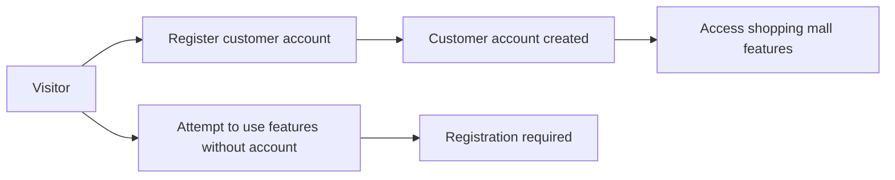

### Customer Sign-In and Account Access

Registered customers can sign in with their email address and password.

Successful sign-in gives the customer access to the customer-owned account and its related shopping activities.

Through signed-in access, customers can reach their own cart, wishlist, orders, reviews, and account settings.

The account access experience is centered on the customer’s own account identity and history, not on a guest session.

The system must support repeat sign-in by the same customer account over time so the customer can continue using the same account and preserved purchase history.

This section defines the customer sign-in operation and customer-owned account access. Detailed permission boundaries are defined in 01-actors-and-auth.md.

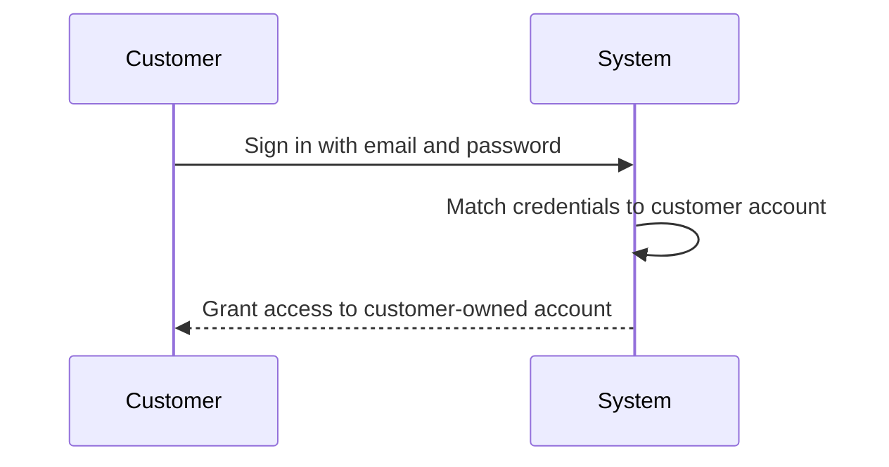

### Password Change

Signed-in customers can change the password of their own customer account.

Changing a password must keep the same customer account identity.

Changing a password must not create a new customer account.

Changing a password must not remove or reset the customer’s purchase history, order history, wishlist, cart, or reviews.

After the password has been changed, the customer continues using the same account for future sign-in.

This section defines the password change operation only. Authentication controls for who may perform the change are defined in 01-actors-and-auth.md.

### Self-Service Account Deletion

Customers can delete their own customer account as a self-service action.

Account deletion is an account lifecycle operation initiated by the customer when the customer no longer wants to participate in the platform.

When a customer deletes the account, the customer’s profile information must be removed from active customer account data.

Account deletion must preserve the customer’s past orders and order history.

Preserved order history remains available as historical business records for seller records and legal purposes.

When a deleted customer has written reviews, those reviews must remain visible on products.

After account deletion, preserved reviews must no longer show the former customer identity and must instead show the author as "deleted user".

Account deletion must separate removable personal profile information from historical transaction records that must remain preserved.

The deletion operation must keep the continuity of historical order records even though the customer account is no longer active.

This section defines the customer-initiated deletion workflow and its business outcomes. Retention policy details are defined in 05-non-functional.md.

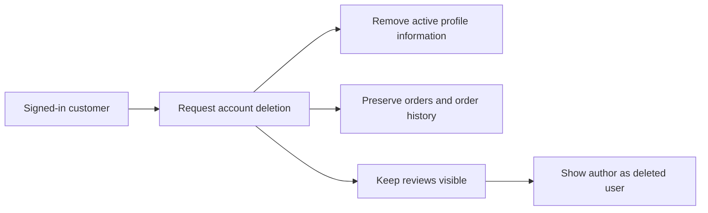

## CustomerProfile Operations

Each customer has a profile that stores a display name and phone number for account-related use. Customers can view their own profile details after signing in. Customers can update the display name when they want a different public or personal label on the platform. Customers can also update their phone number to keep contact information current. Profile maintenance is limited to the owning customer rather than other users. When the related customer account is deleted, the profile information is deleted as part of the account removal process. Profile operations support account management and checkout-related identification without changing preserved order records.

### Customer Profile Viewing

THE shoppingMall SHALL create one customer profile for each customer account.
THE shoppingMall SHALL tie each customer profile to its related customer account.
WHEN a signed-in customer opens profile details, THE shoppingMall SHALL show that customer’s own display name and phone number.
THE shoppingMall SHALL present customer profile information as account-related information for the owning customer.
THE shoppingMall SHALL limit profile viewing in this unit to the owning customer’s own profile.
WHEN the related customer account no longer exists, THE shoppingMall SHALL no longer provide the deleted profile for viewing.

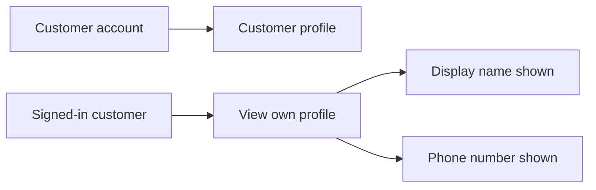

### Customer-Owned Profile Editing

WHEN a signed-in customer chooses to edit profile details, THE shoppingMall SHALL allow that customer to update the customer-owned profile tied to that customer account.
THE shoppingMall SHALL support self-service profile updates without requiring another actor to perform the change.
WHEN profile changes are saved, THE shoppingMall SHALL apply the changes only to the profile of the customer performing the edit.
THE shoppingMall SHALL support profile maintenance as an operation available to the profile owner.
THE shoppingMall SHALL keep profile editing separate from preserved order records.
WHEN a customer updates profile details after placing orders, THE shoppingMall SHALL treat the updated profile as current account information rather than changing preserved order information.

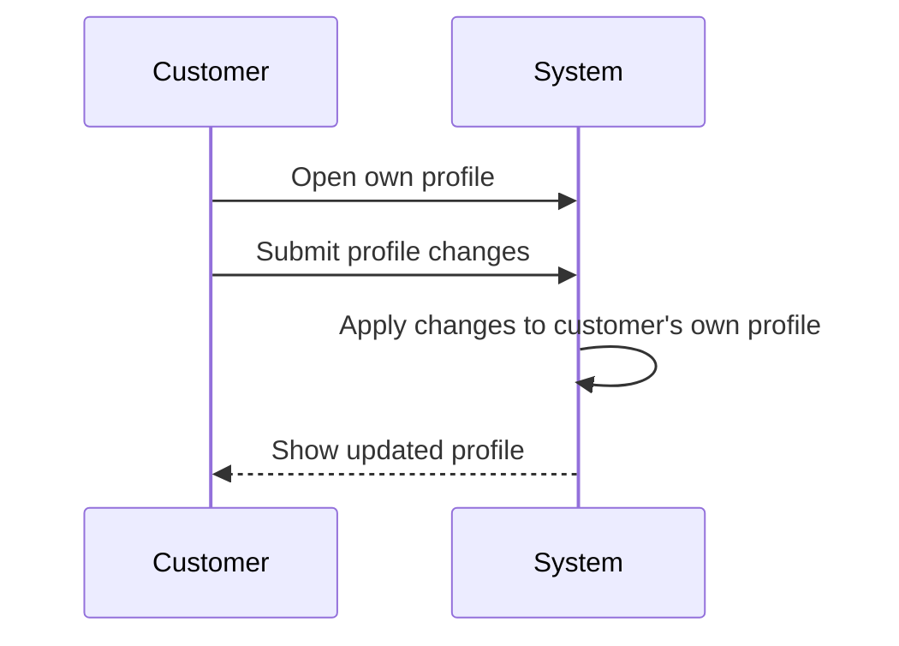

### Display Name Maintenance

WHEN a customer updates the display name, THE shoppingMall SHALL store the new display name in that customer’s profile.
THE shoppingMall SHALL allow the display name to be maintained independently of the phone number.
WHEN a customer views the profile after a display name update, THE shoppingMall SHALL show the updated display name.
THE shoppingMall SHALL use the display name stored in the customer profile as the current profile value for that customer.
WHEN the customer changes the display name again, THE shoppingMall SHALL replace the prior current display name with the newly submitted display name in the profile.

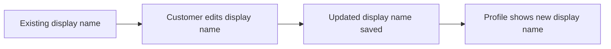

### Phone Number Maintenance

WHEN a customer updates the phone number, THE shoppingMall SHALL store the new phone number in that customer’s profile.
THE shoppingMall SHALL allow the phone number to be maintained independently of the display name.
WHEN a customer views the profile after a phone number update, THE shoppingMall SHALL show the updated phone number.
THE shoppingMall SHALL use the phone number stored in the customer profile as the current contact number for that customer.
WHEN the customer changes the phone number again, THE shoppingMall SHALL replace the prior current phone number with the newly submitted phone number in the profile.

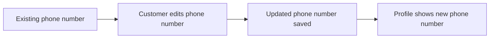

### Current Contact Information Management

THE shoppingMall SHALL treat the display name and phone number together as the current customer profile information for account-related use.
WHEN a customer updates either profile field, THE shoppingMall SHALL reflect the latest saved values as the customer’s current profile information.
THE shoppingMall SHALL allow customers to keep contact information current by revising profile details over time.
WHEN profile information changes, THE shoppingMall SHALL use the updated profile as the current account-level information for that customer.
THE shoppingMall SHALL support ongoing maintenance of current contact information through repeated self-service updates.

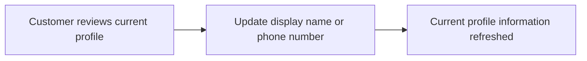

### Profile Removal with Account Deletion

WHEN a customer deletes the related customer account, THE shoppingMall SHALL delete the customer profile information as part of the account removal process.
THE shoppingMall SHALL remove the deleted customer’s display name and phone number from active profile data.
WHEN account deletion is completed, THE shoppingMall SHALL end further profile maintenance for that deleted account.
THE shoppingMall SHALL perform profile removal as a consequence of customer account deletion rather than as a separate standalone profile deletion operation.
THE shoppingMall SHALL preserve the distinction between deleted profile information and preserved order records by deleting the profile without changing preserved order information.

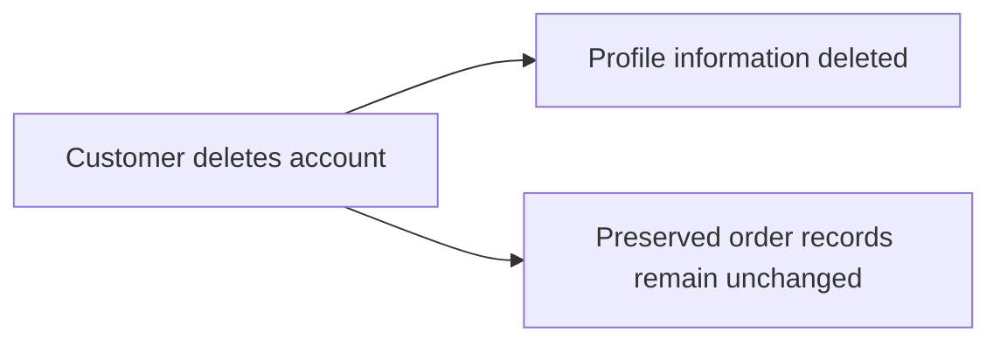

## ShippingAddress Operations

Customers can keep multiple shipping addresses in their account for future purchases. Each saved address includes the recipient name, phone number, street address, city, state or province, postal code, and country needed for delivery. Customers can add a new address when they want another delivery destination. Customers can review the list of saved addresses and choose one during checkout. Customers can edit an existing address when recipient or location details change. Customers can delete addresses they no longer use. Customers can mark one saved address as the default shipping address so it can be preselected during checkout. Address management exists for reusable delivery destinations, while the address used in a placed order is preserved separately and cannot later be changed through address edits.

### Saved Shipping Address Maintenance

Customers can keep multiple saved shipping addresses in their account for future purchases.

A saved shipping address must store the recipient name, phone number, street address, city, state or province, postal code, and country needed for delivery.

Customers can create a new saved shipping address when they want to use another delivery destination for later orders.

Each newly created address becomes part of the customer’s saved address book and remains available for future checkout use until the customer deletes it.

Customers can edit an existing saved shipping address they own when the recipient or delivery location details change.

Customers can delete a saved shipping address they no longer want to use for future orders.

Address maintenance applies only to addresses owned by the signed-in customer.

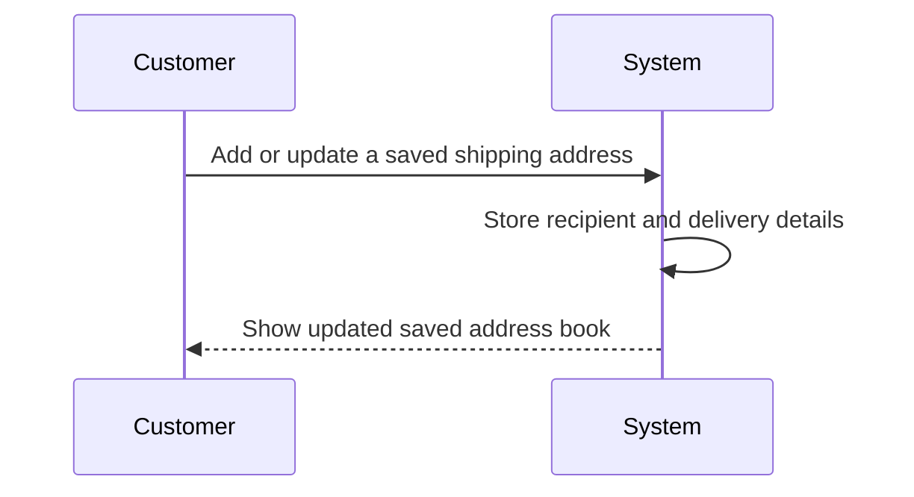

### Saved Address List and Default Address Selection

Customers can view the list of all shipping addresses they have saved in their account.

The saved address list must present enough information for the customer to distinguish one delivery destination from another.

Customers can mark one saved shipping address as the default shipping address.

The system must maintain a single default shipping address for the customer’s saved address book at a time.

When a customer changes the default designation, the newly selected address becomes the default saved shipping address for future checkout use.

The saved address list must indicate which address is currently set as the default shipping address.

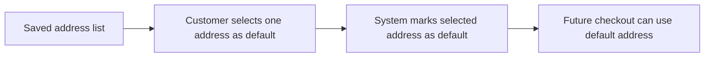

### Shipping Address Selection During Checkout

During checkout, the customer can choose a shipping address from the addresses saved in their account.

If the customer has a default shipping address, the system can present that saved address as the preselected choice during checkout.

The customer can review the selected shipping address as part of the order summary before placing the order.

The checkout flow uses the chosen saved address as the delivery destination for that order.

Saved address selection during checkout supports reusable delivery destinations so the customer does not need to maintain the same address details repeatedly for each purchase.

This section defines only how a saved address is chosen during checkout; preservation of the placed order’s shipping address is defined in the next section.

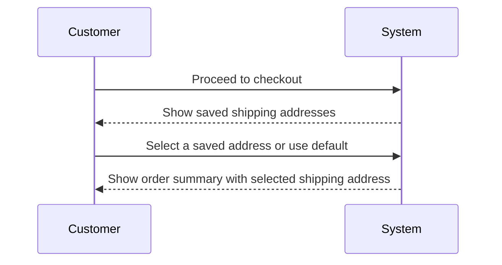

### Separation Between Saved Addresses and Placed Order Address

Saved shipping addresses are reusable customer account data for future purchases.

When an order is placed, the shipping address used for that order is preserved as the order’s delivery address at the time of purchase.

After order placement, later edits to a saved shipping address do not change the shipping address already preserved with a placed order.

After order placement, deletion of a saved shipping address does not remove the shipping address preserved with a placed order.

Address management in the customer account and the shipping address kept with a placed order must remain separate so past order delivery details stay unchanged.

Once the order has been placed, the preserved shipping address for that order cannot be changed through saved address maintenance.

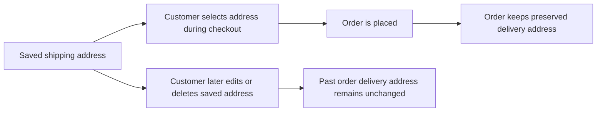

## SellerAccount Operations

Sellers can register with an email address and password to create a selling account. Registered sellers can sign in with their email and password to manage their shop presence and order handling. A seller can change the password without changing the seller identity. Selling is not allowed until the seller account has been approved by an administrator. Sellers can view whether their approval status is pending, approved, or rejected. If rejected, the seller can view the rejection reason and understand why selling access was denied. Sellers can delete their account only when they have no pending paid or shipped order items and no pending cancellation or refund requests. When a seller deletes the account, active product listings are removed, but historical orders and order snapshots remain preserved, including the seller shop name shown in past orders. Administrators can suspend or unsuspend sellers for platform control, and suspended sellers remain able to process existing orders but cannot create or edit products. Administrators can also ban sellers, and banned sellers cannot log in while existing orders remain.

### Seller Registration and Sign-In

WHEN a person submits an email address and password to register as a seller, THE shoppingMall SHALL create a seller account.

THE shoppingMall SHALL authenticate a seller by email address and password during sign-in.

WHEN a seller signs in successfully, THE shoppingMall SHALL allow access to seller account operations permitted by the seller's current account state.

WHEN a seller account exists but has not yet been approved to sell, THE shoppingMall SHALL allow the seller to sign in and view seller account information without granting selling access.

WHEN a seller account has been rejected, THE shoppingMall SHALL allow the seller to sign in and review the account's approval outcome.

IF a seller account is banned, THEN THE shoppingMall SHALL prevent that seller from signing in.

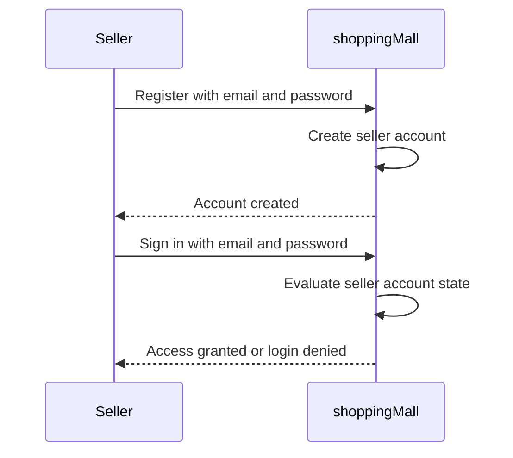

### Seller Password Maintenance

WHEN an authenticated seller requests a password change, THE shoppingMall SHALL allow the seller to replace the current password with a new password.

THE shoppingMall SHALL keep the seller account identity unchanged when the password is changed.

WHEN a password change is completed, THE shoppingMall SHALL use the new password for future seller sign-in.

WHEN a password change is completed, THE shoppingMall SHALL preserve the seller's existing approval status, suspension status, ban status, profile, products, and historical records.

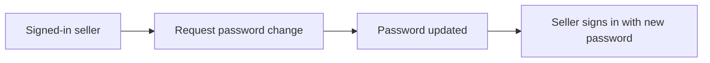

### Selling Eligibility and Approval Status

WHILE a seller account is in pending status, THE shoppingMall SHALL prevent the seller from selling products.

WHILE a seller account is in rejected status, THE shoppingMall SHALL prevent the seller from selling products.

WHEN a seller account is approved, THE shoppingMall SHALL allow the seller to perform selling activities.

THE shoppingMall SHALL present the seller's approval status as one of the following values: pending, approved, or rejected.

WHEN a seller views approval status information, THE shoppingMall SHALL show the seller's current approval status.

WHEN a seller account is rejected, THE shoppingMall SHALL show the rejection reason to that seller.

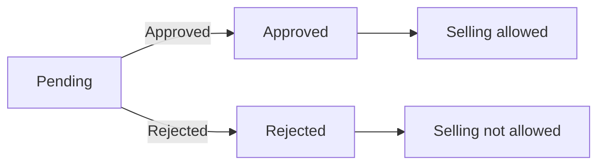

### Seller Reapplication After Rejection

WHEN a rejected seller chooses to apply again, THE shoppingMall SHALL allow submission of a new registration request.

WHEN a rejected seller submits a new registration request, THE shoppingMall SHALL route that request into the seller approval process.

WHEN a seller has submitted a new registration request after rejection, THE shoppingMall SHALL allow the seller to view the status of the renewed request through the seller approval status view.

THE shoppingMall SHALL preserve the distinction between the prior rejection outcome and the seller's new registration request.

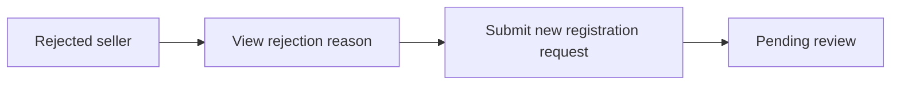

### Seller Self-Deletion

WHEN a seller requests account deletion, THE shoppingMall SHALL evaluate whether the seller meets the deletion conditions.

IF the seller has any order item in paid status, THEN THE shoppingMall SHALL not complete seller account deletion.

IF the seller has any order item in shipped status, THEN THE shoppingMall SHALL not complete seller account deletion.

IF the seller has any pending cancellation request, THEN THE shoppingMall SHALL not complete seller account deletion.

IF the seller has any pending refund request, THEN THE shoppingMall SHALL not complete seller account deletion.

WHEN a seller has no paid or shipped order items and no pending cancellation or refund requests, THE shoppingMall SHALL allow the seller to delete the account.

WHEN seller account deletion is completed, THE shoppingMall SHALL remove the seller's products from active listings.

WHEN seller account deletion is completed, THE shoppingMall SHALL preserve historical orders and order snapshots associated with the seller.

WHEN seller account deletion is completed, THE shoppingMall SHALL preserve the seller's shop name in past orders.

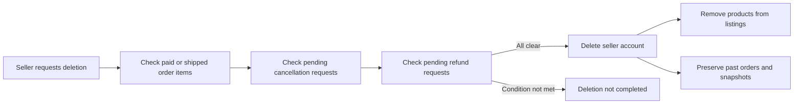

### Seller Suspension and Ban Operations

WHEN an administrator suspends a seller, THE shoppingMall SHALL hide that seller's products from search results and category listings.

WHEN an administrator suspends a seller, THE shoppingMall SHALL prevent customers from purchasing that seller's products.

WHILE a seller is suspended, THE shoppingMall SHALL allow the seller to continue processing existing orders.

WHILE a seller is suspended, THE shoppingMall SHALL allow the seller to ship items and respond to cancellation requests and refund requests for existing orders.

WHILE a seller is suspended, THE shoppingMall SHALL prevent the seller from creating new products.

WHILE a seller is suspended, THE shoppingMall SHALL prevent the seller from editing existing products.

WHEN an administrator removes a suspension from a seller, THE shoppingMall SHALL make that seller's products visible for search and category browsing again.

WHEN an administrator bans a seller, THE shoppingMall SHALL prevent that seller from signing in.

WHEN an administrator bans a seller, THE shoppingMall SHALL preserve existing orders associated with that seller.

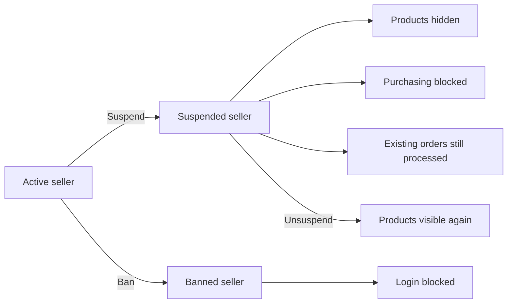

## SellerApprovalRequest Operations

A seller registration request represents the seller’s attempt to gain approval to sell on the platform. When a seller signs up, the request enters administrative review rather than immediately granting selling rights. Administrators can view pending seller approval requests and review each application. Administrators can approve a request to let the seller begin selling. Administrators can reject a request when the seller should not be approved. A rejection must include a reason so the seller can understand the decision. Sellers can view the outcome of their request, including whether it is pending, approved, or rejected. When a seller has been rejected, the seller can submit a new registration request for another review cycle.

### Seller Approval Request Submission

THE shoppingMall SHALL create a seller approval request when a seller completes seller registration for selling access.

THE shoppingMall SHALL place each newly created seller approval request into the "pending" state.

THE shoppingMall SHALL associate the seller approval request with the seller account that submitted it.

THE shoppingMall SHALL present the seller approval request as awaiting administrative review rather than granting selling rights immediately.

WHEN a seller has previously received a rejected outcome, THE shoppingMall SHALL allow that seller to submit a new seller approval request for another review cycle.

WHEN a seller submits a new seller approval request after rejection, THE shoppingMall SHALL treat the new submission as a separate review cycle.

THE shoppingMall SHALL preserve the outcome of the current seller approval request so the seller can track whether review is still pending or has been decided.

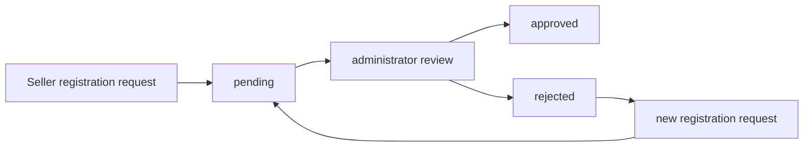

### Pending Seller Approval Review

WHILE a seller approval request is in the "pending" state, THE shoppingMall SHALL present it for administrative review.

THE shoppingMall SHALL allow administrators to view the list of seller approval requests awaiting review.

THE shoppingMall SHALL allow administrators to open an individual pending seller approval request and review its current state before making a decision.

WHILE a seller approval request remains in the "pending" state, THE shoppingMall SHALL keep the seller informed that selling has not yet been approved.

THE shoppingMall SHALL maintain the seller approval workflow so that each request progresses from submission to an administrative decision.

```mermaid
sequenceDiagram
    participant S as Seller
    participant M as shoppingMall
    participant A as Administrator
    S->>M: Submit seller approval request
    M->>M: Mark request as "pending"
    A->>M: View pending requests
    A->>M: Open request for review
    M-->>A: Show request state and review context
```

### Administrator Review Decision

WHEN an administrator reviews a pending seller approval request, THE shoppingMall SHALL allow the administrator to decide whether to approve or reject the request.

WHEN an administrator records a decision on a pending seller approval request, THE shoppingMall SHALL update the request from the "pending" state to the selected outcome.

WHEN an administrator approves a seller approval request, THE shoppingMall SHALL change the request state to "approved".

WHEN an administrator approves a seller approval request, THE shoppingMall SHALL recognize the seller as eligible to begin selling on the platform.

WHEN an administrator rejects a seller approval request, THE shoppingMall SHALL change the request state to "rejected".

WHEN an administrator rejects a seller approval request, THE shoppingMall SHALL record the rejection reason with the request.

THE shoppingMall SHALL keep the administrative review outcome on the seller approval request so it can be shown back to the seller.

```mermaid
flowchart LR
    A["pending"] --> B["administrator chooses approve"]
    B --> C["approved"]
    A --> D["administrator chooses reject"]
    D --> E["rejected with reason"]
```

### Seller Approval Outcome Viewing

THE shoppingMall SHALL allow a seller to view the current outcome of the seller's own approval request.

THE shoppingMall SHALL show the seller whether the request is "pending", "approved", or "rejected".

WHEN the seller approval request is in the "pending" state, THE shoppingMall SHALL show that the request is still under review.

WHEN the seller approval request is in the "approved" state, THE shoppingMall SHALL show that the seller has been approved to begin selling.

WHEN the seller approval request is in the "rejected" state, THE shoppingMall SHALL show that the request was rejected.

WHEN the seller approval request is in the "rejected" state, THE shoppingMall SHALL show the rejection reason to the seller.

WHEN a rejected seller submits a new seller approval request, THE shoppingMall SHALL allow the seller to view the outcome of that new request as part of the next review cycle.

```mermaid
flowchart LR
    A["Seller views approval status"] --> B["pending"]
    A --> C["approved"]
    A --> D["rejected"]
    D --> E["show rejection reason"]
    D --> F["allow new registration request"]
```

## SellerProfile Operations

Each seller has a public shop profile containing a shop name, shop description, and logo image. Sellers can view and maintain their own profile to present their shop identity to customers. Customers can open seller profiles to learn about the shop behind a product. Sellers can edit the shop name, description, and logo as the business changes over time. Every edit must preserve a historical snapshot so earlier versions remain available for review. These preserved versions support later dispute resolution and historical reference. Profile changes affect the current public shop presentation, while past orders keep their own purchase-time seller profile snapshot. Seller profile operations therefore support both current storefront identity and preserved history.

### Public Seller Shop Profile

The system shall provide each seller with a public shop profile that represents the seller’s current shop identity.

The public shop profile shall contain the shop name, shop description, and logo image.

The public shop profile shall be the version shown to customers when they open a seller profile from the marketplace.

The current public shop profile shall reflect the seller’s most recent saved profile information.

A seller shall be able to view the current public version of their own shop profile.

The public seller shop profile supports the seller’s storefront identity, while historical versions remain available separately for review.

```mermaid
flowchart LR
    A["Seller profile data"] --> B["Current public shop profile"]
    B --> C["Customer views seller profile"]
    A --> D["Historical profile versions"]
```

### Seller Profile Maintenance

A seller shall be able to edit their own shop profile.

Seller profile editing shall allow the seller to change the shop name.

Seller profile editing shall allow the seller to change the shop description.

Seller profile editing shall allow the seller to change the logo image.

When a seller saves profile changes, the current public shop profile shall be updated to show the new shop information.

Profile maintenance shall treat the shop name, shop description, and logo image as part of one seller profile, so a seller can update any combination of those values in a profile edit.

The result of a successful profile edit shall be a new current public profile state for future customer viewing.

```mermaid
sequenceDiagram
    participant S as Seller
    participant P as System
    S->>P: Open own seller profile
    S->>P: Change shop name, description, or logo
    P->>P: Save updated current profile
    P-->>S: Show updated seller profile
```

### Customer Viewing of Seller Profiles

A customer shall be able to open a seller’s public shop profile to learn about the shop behind a product.

When a customer views a seller profile, the system shall show the current shop name, current shop description, and current logo image.

Seller profile viewing shall present the seller’s current public shop identity rather than a past historical version.

Customer viewing of a seller profile supports marketplace browsing by allowing the customer to inspect the shop associated with listed products.

A seller profile opened from a product context shall present the same current seller profile that is publicly available for that seller.

```mermaid
flowchart LR
    A["Customer"] --> B["Open seller profile"]
    B --> C["Show current shop name"]
    B --> D["Show current shop description"]
    B --> E["Show current logo image"]
```

### Seller Profile Snapshots on Edit

Whenever a seller profile is edited, the system shall create a snapshot of the profile change.

Each seller profile snapshot shall preserve the historical state needed to understand how the profile changed over time.

A seller profile snapshot shall record when the change was made.

A seller profile snapshot shall record what was changed.

A seller profile snapshot shall record the values before the change and after the change.

Seller profile snapshot creation applies to changes in the shop name, shop description, and logo image.

Snapshot creation on profile edit supports later dispute resolution and historical reference.

The creation of a new current profile state shall not replace or erase previously preserved seller profile snapshots.

```mermaid
flowchart LR
    A["Seller saves profile edit"] --> B["Create seller profile snapshot"]
    B --> C["Record change time"]
    B --> D["Record changed content"]
    B --> E["Record before and after values"]
    A --> F["Update current public profile"]
```

### Historical Seller Profile Versions

Relevant parties shall be able to view historical seller profile versions for review and dispute resolution.

Historical seller profile versions shall allow earlier shop name values to be reviewed.

Historical seller profile versions shall allow earlier shop description values to be reviewed.

Historical seller profile versions shall allow earlier logo image values to be reviewed.

Historical seller profile versions shall be presented separately from the current public shop profile so that past and current states can be distinguished.

Viewing historical seller profile versions shall support tracing the sequence of seller profile changes over time.

A seller shall be able to review the preserved history of their own seller profile edits.

Administrators may use historical seller profile versions when reviewing disputes or past profile states.

```mermaid
flowchart LR
    A["Historical seller profile versions"] --> B["Seller review"]
    A --> C["Administrator review"]
    A --> D["Past shop identity reference"]
```

### Current Profile and Order-Time Seller Identity

The current public seller profile and the seller identity preserved with an order item shall be treated as different business views.

The current public seller profile shall continue to change when the seller updates the shop name, shop description, or logo image.

The seller identity preserved at the time of purchase shall remain tied to the order item for historical reference.

Later edits to the seller’s current profile shall not change the seller profile information already preserved with past order items.

When reviewing a past order, the system shall use the order-time seller identity preserved with that order item rather than the seller’s current public profile.

This separation ensures that customers see the seller’s current shop presentation in the marketplace while past orders continue to show the seller identity that existed at purchase time.

```mermaid
flowchart LR
    A["Seller updates current profile"] --> B["Current public seller profile changes"]
    C["Past order item"] --> D["Order-time seller identity remains preserved"]
    B --> E["Marketplace viewing uses current profile"]
    D --> F["Order review uses purchase-time profile"]
```

## AdministratorAccount Operations

Administrator accounts represent users who have been granted platform management authority. There are two grades of administrator: regular administrator and super administrator. Super administrators can review existing administrator roles and change grade assignments. A super administrator can promote a regular administrator to super administrator when higher authority is needed. A super administrator can demote another super administrator back to regular administrator. Super administrators are not allowed to demote themselves. Administrators use their accounts to review seller approvals, manage categories, oversee products and orders, and manage customer and seller access. Administrator account operations focus on role assignment and authority boundaries rather than ordinary shopping behavior.

### Administrator Account Listing and Oversight View

Administrators can view the platform’s administrator accounts as an operational roster used to understand who currently holds platform management authority. The listing distinguishes between regular administrator and super administrator so that oversight responsibilities can be understood at a glance.

The administrator account listing supports platform oversight by showing which accounts currently participate in administrative work. This listing is used to identify who can review seller approvals, manage categories, oversee products and orders, and manage customer and seller access.

The listing is an administrative business view rather than a shopping or seller workflow. It exists to support governance of platform operations and role assignment decisions.

Regular administrators appear in the listing as administrators with operational oversight duties but without authority to change administrator grades. Super administrators appear in the listing as administrators who additionally hold authority over administrator grade assignment.

This section defines the roster and grade visibility only. The detailed permissions for each grade are defined in 01-actors-and-auth.md.

### Administrator Grade Structure and Authority Boundaries

The platform recognizes exactly two administrator grades: regular administrator and super administrator.

A regular administrator participates in platform oversight activities such as seller management, category management, product oversight, order oversight, and user management within the boundaries defined for administrator work.

A super administrator participates in the same platform oversight activities and additionally manages administrator grade assignment. This higher grade exists to control how administrative authority is granted and adjusted.

Administrative authority boundaries are enforced through grade distinction. Administrator account operations focus on administrative governance and role assignment, while ordinary shopping and selling activities remain outside this unit’s scope.

Role assignment and grade changes are treated as controlled administrator account operations because they affect who may exercise platform-wide oversight authority.

The grade model for administrator accounts is shown below.

```mermaid
flowchart LR
    A["regular administrator"] -->|"Promote"| B["super administrator"]
    B -->|"Demote"| A
    B -->|"Attempt self-demotion"| C["blocked"]
```

### Promote Administrator to Super Administrator

A super administrator can promote a regular administrator to super administrator when higher authority is needed for platform governance.

The promotion operation changes the target administrator’s grade from regular administrator to super administrator. After the change, the promoted administrator gains super administrator authority in addition to ordinary administrator oversight responsibilities.

Promotion is an administrator account operation concerned with authority elevation, not with shopping, selling, product ownership, or order fulfillment.

The system records the updated administrator grade as the new current authority level of the promoted administrator.

A promoted administrator becomes eligible to perform administrator role management operations that are reserved for super administrators, including reviewing administrator grade assignments for other administrators.

This section defines the promotion workflow itself. Detailed permission restrictions for who may initiate promotion are defined in 01-actors-and-auth.md, and rejection or failure conditions are defined in 04-business-rules.md.

### Demote Super Administrator

A super administrator can demote another super administrator to regular administrator when reduced authority is required.

The demotion operation changes the target administrator’s grade from super administrator to regular administrator. After the change, the affected administrator continues to hold administrator status but no longer holds super administrator authority.

Demotion preserves continued participation in platform oversight activities that belong to regular administrators while removing authority over administrator grade assignment.

This operation exists to keep administrator authority aligned with current governance needs and to ensure that super administrator authority remains limited to the appropriate accounts.

Demotion applies to another super administrator as the target of the role change. The purpose of the operation is administrative governance rather than disciplinary account removal.

This section defines the demotion workflow itself. Detailed permission restrictions and failure conditions are defined in the canonical sections for permissions and business rules.

### Self-Demotion Prohibition in Administrator Role Management

A super administrator cannot demote themselves.

Administrator role management must always preserve at least the acting super administrator’s current authority during their own session of role administration. Because of this boundary, self-demotion is not a supported administrator account operation.

When a super administrator manages administrator roles, the system allows role changes for other eligible administrator accounts but does not provide self-demotion as an outcome of that workflow.

This prohibition protects continuity of administrator governance by ensuring that super administrator authority is not removed from the acting account through its own grade-change action.

The self-demotion boundary applies specifically to administrator grade management and does not redefine other administrator oversight functions.

This section defines the prohibited self-demotion scenario as an authority-boundary rule within the administrator role management workflow. Detailed error handling belongs in 04-business-rules.md.

### Platform Oversight Roles Through Administrator Accounts

Administrator accounts are used to carry out platform oversight roles across core marketplace operations.

Through administrator accounts, the platform supports oversight of seller approval activity, category management, product oversight, order oversight, and user access management. These oversight roles are exercised as business operations of the platform rather than as customer purchasing or seller merchandising actions.

Regular administrators handle platform management work within the authority of the regular administrator grade. Super administrators handle the same oversight roles and also govern administrator grade assignment.

Administrator account operations therefore serve two connected purposes: enabling platform oversight work and controlling who is authorized to perform the highest level of administrative governance.

The platform oversight role of an administrator account is organizational in nature. It identifies the account as part of the platform’s management function and separates administrative authority from customer and seller business participation.

This section defines the business purpose of administrator accounts in platform oversight. Detailed permissions for individual actions are defined in 01-actors-and-auth.md, while detailed workflows for other business entities are defined in their respective unit sections.

## AdministratorRequest Operations

Any existing user, whether a customer or seller, can submit a request to become an administrator. The request must include a reason explaining why administrative access is being requested. Super administrators can view the list of pending administrator requests. Super administrators review each request and decide whether to approve or reject it. When approved, the requesting user becomes a regular administrator. Request operations therefore connect ordinary platform users to the administrator role through a controlled approval process. The primary business records are the request reason, pending review state, and final decision.

### Administrator Request Submission

WHEN a customer or seller chooses to request administrator access, THE shoppingMall SHALL allow that user to submit an administrator request.

WHEN submitting an administrator request, THE shoppingMall SHALL require the request to include reason text explaining why administrator access is being requested.

WHEN a customer submits an administrator request, THE shoppingMall SHALL record the request as originating from that customer.

WHEN a seller submits an administrator request, THE shoppingMall SHALL record the request as originating from that seller.

WHEN an administrator request is submitted, THE shoppingMall SHALL create the request in a pending review state.

WHEN an existing pending administrator request has not yet been decided, THE shoppingMall SHALL keep that request available for super administrator review.

```mermaid
flowchart LR
    A["Customer or Seller"] --> B["Submit administrator request"]
    B --> C["Provide reason text"]
    C --> D["Pending administrator request"]
```


### Pending Administrator Request Review

WHEN a super administrator opens administrator request review, THE shoppingMall SHALL present the pending administrator request list.

WHEN presenting the pending administrator request list, THE shoppingMall SHALL include each request that remains in pending review state.

WHEN a super administrator selects a pending administrator request, THE shoppingMall SHALL show the request reason text for review.

WHEN a super administrator reviews a pending administrator request, THE shoppingMall SHALL allow the super administrator to make an approval or rejection decision.

WHILE an administrator request remains pending, THE shoppingMall SHALL treat that request as awaiting super administrator review.

```mermaid
sequenceDiagram
    participant U as User
    participant SA as Super Administrator
    participant S as System
    U->>S: Submit administrator request with reason
    S-->>SA: Show pending administrator request in review list
    SA->>S: Open request for review
    S-->>SA: Show request reason and pending state
```


### Administrator Request Decision

WHEN a super administrator approves an administrator request, THE shoppingMall SHALL record the request decision as approved.

WHEN a super administrator rejects an administrator request, THE shoppingMall SHALL record the request decision as rejected.

WHEN a decision is recorded for an administrator request, THE shoppingMall SHALL end the pending review state for that request.

WHEN an administrator request has been approved, THE shoppingMall SHALL preserve that approval as the final review outcome of the request.

WHEN an administrator request has been rejected, THE shoppingMall SHALL preserve that rejection as the final review outcome of the request.

```mermaid
flowchart LR
    A["Pending administrator request"] --> B["Super administrator review"]
    B --> C["Approved"]
    B --> D["Rejected"]
```


### Administrator Role Assignment After Approval

WHEN a super administrator approves an administrator request, THE shoppingMall SHALL make the approved user a regular administrator.

WHEN a customer's administrator request is approved, THE shoppingMall SHALL make that customer a regular administrator.

WHEN a seller's administrator request is approved, THE shoppingMall SHALL make that seller a regular administrator.

WHEN an administrator request is rejected, THE shoppingMall SHALL leave the requesting user without the administrator role granted by that request.

WHEN a user becomes a regular administrator through an approved administrator request, THE shoppingMall SHALL treat the approved request as the basis for that administrator role assignment.

```mermaid
flowchart LR
    A["Approved administrator request"] --> B["User becomes regular administrator"]
```

## Category Operations

Categories organize products so customers can browse the catalog in a structured way. Administrators alone can create categories and subcategories, and only one level of nesting is allowed. Each category has a name and description that help customers understand what belongs there. Customers can browse the full category list and open a category to view its products. Administrators can edit category names and descriptions as the catalog structure evolves. Administrators can delete categories when they are no longer needed. When a category is deleted, products that belonged to it become uncategorized instead of being removed from the platform. Category operations support both browsing by customers and controlled taxonomy management by administrators.

### Category Catalog Browsing

Customers can open the category catalog and browse the full list of categories created for the platform.

The category catalog presents each category by its name and description so customers can understand the type of products grouped there.

If a category has subcategories, the browsing experience shows the relationship between the parent category and its direct subcategories as part of the catalog structure.

Customers can select a category from the catalog to continue into that category's product view.

Customers can also select a subcategory directly when they want to browse a narrower product grouping.

Category browsing supports product discovery only; the detailed behavior for filtering and pagination is defined in 04-business-rules.

```mermaid
flowchart LR
    A["Customer opens category catalog"] --> B["View all categories"]
    B --> C["Choose category or subcategory"]
    C --> D["Open category product view"]
```

### Products Within a Category

When a customer opens a category, the system shows the products currently assigned to that category.

When a customer opens a subcategory, the system shows the products assigned to that subcategory.

The category product view supports browsing products within the selected catalog grouping so customers can shop by structured classification rather than only by search.

Products shown in a category view remain subject to product visibility conditions defined elsewhere, including cases where products are no longer listed.

The details of result ordering, filtering behavior, and pagination for category product views are defined in 04-business-rules.

Customers can move from a category product view to individual product details through the normal product browsing flow defined in Product Operations.

### Category and Subcategory Creation

Administrators can create a new top-level category to establish a new product grouping for the catalog.

When creating a category, the administrator provides the category name and description as the business meaning of that catalog grouping.

Administrators can create a subcategory under an existing top-level category when a narrower grouping is needed.

A subcategory is created as a child of one existing category and becomes part of that category's browsing structure.

The category structure supports only one level of nesting, so category creation supports parent categories and their direct subcategories only.

Created categories and subcategories become available for customer browsing and for product assignment in product management flows.

```mermaid
flowchart LR
    A["Administrator starts category creation"] --> B["Enter name and description"]
    B --> C["Choose top-level category or subcategory"]
    C --> D["Category saved into catalog structure"]
    D --> E["Available for browsing and product assignment"]
```

### Category Detail Maintenance

Administrators can edit an existing category to keep the catalog structure understandable and current.

Category detail maintenance allows the administrator to update the category name and description for both top-level categories and subcategories.

An edited category keeps its place in the catalog structure while presenting the updated category details to customers and sellers in later use.

Editing category details supports catalog maintenance without requiring products in that category to be recreated or removed.

Updated category details become visible in category browsing and in product classification contexts after the change is saved.

### Category Deletion and Product Recategorization

Administrators can delete a category when it is no longer needed in the catalog structure.

When a top-level category is deleted, products that belonged to that category become uncategorized rather than being deleted from the platform.

When a subcategory is deleted, products that belonged to that subcategory also become uncategorized.

Category deletion removes the deleted category from the customer browsing structure.

Category deletion does not remove the affected products from the platform solely because their category was removed.

After deletion, affected products continue to exist and can still participate in platform behavior as uncategorized products wherever such products are supported.

```mermaid
flowchart LR
    A["Administrator deletes category"] --> B["Category removed from catalog structure"]
    B --> C["Affected products become uncategorized"]
    C --> D["Products remain on platform"]
```

## Product Operations

Sellers can create products that belong to their own shop and offer them to customers through listings and product detail pages. A product must have a name, description, category selection, and base price when it is created. Sellers can edit only their own products, and every edit creates a preserved product snapshot. Customers can discover products through search results, category pages, and product detail pages while the listing remains active. Products without any variants can still appear in listings, but they are shown as unavailable until at least one variant exists. Sellers can delete their own products only when no variant of the product has pending paid or shipped order items and no pending cancellation or refund requests. Product deletion also removes the product from search and category listings while preserved snapshots remain available for historical review. Administrators can view all products and can delete any product for policy violations. Suspended sellers cannot create new products or edit existing ones, and their products are hidden from discovery and cannot be purchased until unsuspended.

### Seller Product Creation

THE shoppingMall SHALL allow an approved seller to create a product for the seller's own shop.

WHEN a seller creates a product, THE shoppingMall SHALL require the product to include a name, description, category selection, and base price.

WHEN a seller creates a product, THE shoppingMall SHALL associate the created product with that seller.

WHEN product creation is completed, THE shoppingMall SHALL make the product available for later variant management by the same seller.

WHERE a product has been created without any variants yet, THE shoppingMall SHALL allow the product to exist in the catalog but treat it as unavailable for purchase until at least one variant exists.

```mermaid
flowchart LR
    A["Seller starts product creation"] --> B["Enter name, description, category, and base price"]
    B --> C["Product is created for seller's own shop"]
    C --> D["Product awaits variant setup"]
```

### Seller Product Maintenance and Snapshot Creation

WHEN a seller edits a product, THE shoppingMall SHALL allow the seller to edit only a product owned by that seller.

WHEN a seller edits a product, THE shoppingMall SHALL preserve a product snapshot for that edit.

WHEN a product snapshot is created from an edit, THE shoppingMall SHALL preserve the previous product state for historical review.

WHEN a seller updates a product that remains active, THE shoppingMall SHALL continue using the updated product information for future product discovery and product detail viewing.

WHEN a seller views product history, THE shoppingMall SHALL provide access to snapshots of the seller's own products.

```mermaid
sequenceDiagram
    participant S as Seller
    participant M as shoppingMall
    S->>M: Edit owned product
    M->>M: Preserve previous state as product snapshot
    M-->>S: Save updated product
```

### Product Discovery and Availability Presentation

THE shoppingMall SHALL present active products in product search results and category listings.

WHEN a customer opens a product detail page, THE shoppingMall SHALL show the full product details for that product.

WHERE a product has no variants, THE shoppingMall SHALL keep the product visible in search results.

WHERE a product has no variants, THE shoppingMall SHALL show the product as unavailable.

WHERE a seller is suspended, THE shoppingMall SHALL hide that seller's products from product search results and category listings.

WHERE a seller is suspended, THE shoppingMall SHALL prevent that seller's products from being purchased.

```mermaid
flowchart LR
    A["Product exists"] --> B["Show in search and category listings"]
    B --> C["Customer opens product detail page"]
    C --> D["Show full product details"]
    B --> E["No variants"]
    E --> F["Show as unavailable"]
```

### Product Deletion and Listing Removal

WHEN a seller deletes a product, THE shoppingMall SHALL allow deletion only when no variant of that product has pending order items in paid or shipped status.

WHEN a seller deletes a product, THE shoppingMall SHALL allow deletion only when no variant of that product has a pending cancellation request or refund request.

WHEN a seller deletes an eligible product, THE shoppingMall SHALL remove that product from product search results.

WHEN a seller deletes an eligible product, THE shoppingMall SHALL remove that product from category listings.

WHEN a product has been deleted, THE shoppingMall SHALL preserve its snapshots for historical review.

WHEN an administrator deletes a product for a policy violation, THE shoppingMall SHALL remove that product from product search results and category listings.

```mermaid
flowchart LR
    A["Delete product requested"] --> B["Check paid or shipped order items"]
    B --> C["Check pending cancellation or refund requests"]
    C --> D["Eligible for deletion"]
    D --> E["Remove from search results"]
    D --> F["Remove from category listings"]
    D --> G["Preserve snapshots"]
```

### Administrator and Suspension-Based Product Controls

THE shoppingMall SHALL allow administrators to view all products on the platform.

WHEN an administrator identifies a product that violates policy, THE shoppingMall SHALL allow the administrator to delete that product.

WHERE a seller is suspended, THE shoppingMall SHALL prevent that seller from creating a new product.

WHERE a seller is suspended, THE shoppingMall SHALL prevent that seller from editing an existing product.

WHERE a seller is suspended, THE shoppingMall SHALL keep existing order processing available for that seller outside of product creation and product editing.

```mermaid
flowchart LR
    A["Seller suspended"] --> B["Block new product creation"]
    A --> C["Block product editing"]
    A --> D["Hide products from discovery"]
    A --> E["Prevent purchase of suspended seller products"]
```

## ProductImage Operations

Sellers can attach multiple images to each product to present the item visually to customers. Customers can view all product images on the product detail page, and product lists use the first image as the main thumbnail. Sellers can add new images to improve the product gallery. Sellers can reorder images, and the first position determines the main image used in listings. Sellers can delete images that are outdated or no longer appropriate. Image changes are part of the product’s editable state, so they are included whenever a product snapshot is created after relevant edits. Product image operations focus on how sellers curate visual presentation across listings and detail views.

### Product Gallery Management

Sellers can maintain multiple images for each of their products so the product can be presented as a gallery rather than a single picture.

A seller can add new images to an existing product to expand or refresh the product’s visual presentation.

A seller can view the current set of images attached to a product before deciding whether to add, reorder, or remove images.

The system shall treat the product’s images as part of the product’s editable business content.

Customers can view the resulting image gallery as part of the product’s full details.

Product image management applies only to the seller who owns the product, with permissions defined in [01-actors-and-auth.md].

```mermaid
flowchart LR
    A["Seller opens owned product"] --> B["View current image gallery"]
    B --> C["Add image"]
    B --> D["Reorder images"]
    B --> E["Delete image"]
    C --> F["Updated product gallery"]
    D --> F
    E --> F
```

### Image Upload and Presentation Updates

A seller can upload one or more images for a product over time as the product listing evolves.

Each uploaded image becomes part of the product gallery shown to customers on the product detail page.

When a seller adds an image, the system shall update the product gallery so the newly added image can be included in customer viewing.

Image additions support the seller’s ability to present the product from multiple angles, styles, or use contexts, without changing the underlying product identity.

If a seller continues adding images to a product, the product remains a single product with an expanded gallery rather than separate listings.

Product image uploads affect only the visual presentation of the product and do not change ownership, category, or pricing information defined in other sections.

```mermaid
sequenceDiagram
    participant S as Seller
    participant M as System
    participant C as Customer
    S->>M: Add image to owned product
    M->>M: Update product gallery
    C->>M: View product detail page
    M-->>C: Show updated image gallery
```

### Image Order and Main Thumbnail Selection

Sellers can manage the display order of images within a product gallery.

The first image in the product’s image order is the main image used as the product’s thumbnail in product listings.

When a seller reorders images, the system shall immediately treat the new first image as the main thumbnail for listing contexts.

Reordering images allows the seller to control which image best represents the product in search results and category pages.

The product detail page shall present the gallery using the seller-defined image order.

The listing thumbnail and the detail page gallery order shall remain aligned with the same seller-defined first-position rule.

```mermaid
flowchart LR
    A["Seller reviews image order"] --> B["Seller moves preferred image to first position"]
    B --> C["System saves new image order"]
    C --> D["First image becomes listing thumbnail"]
    C --> E["Detail page shows updated gallery order"]
```

### Image Deletion from Product Gallery

A seller can delete images from an owned product when those images are outdated, incorrect, or no longer suitable for presentation.

When an image is deleted, the system shall remove it from the product’s gallery presentation.

A deleted image shall no longer appear on the product detail page.

If the deleted image was the first image in the gallery, the next remaining first image shall become the product’s main thumbnail for listing views.

Image deletion changes the visible state of the product and shall be reflected wherever the product gallery or thumbnail is shown.

Deleting an image changes the product’s presentation only; historical preservation of the prior state is handled through product snapshots defined in [Product Image Changes in Product Snapshots].

```mermaid
flowchart LR
    A["Seller deletes image"] --> B["System removes image from gallery"]
    B --> C["Detail page no longer shows deleted image"]
    B --> D["Listing thumbnail recalculated from first remaining image"]
```

### Customer Viewing of Product Images

Customers can view all images attached to a product on the product detail page.

The product detail page shall present the complete gallery for that product, using the order currently defined by the seller.

Customers can rely on the detail page gallery to inspect the product beyond the single thumbnail used in listing views.

When customers browse product lists such as search results or category pages, each product shall show the main thumbnail derived from the first image in the gallery.

The thumbnail shown in listing views shall serve as a summary image, while the product detail page shall provide the full image set.

If a product has updated image order or image removals, customers shall see the revised thumbnail and gallery presentation in the corresponding listing and detail contexts.

```mermaid
flowchart LR
    A["Customer views product list"] --> B["Show first image as thumbnail"]
    B --> C["Customer opens product detail page"]
    C --> D["Show full ordered image gallery"]
```

### Product Image Changes in Product Snapshots

Image additions, deletions, and reordering are part of the product’s editable state and shall be captured whenever a product snapshot is created after the related edit.

When a seller changes the product’s images, the resulting product snapshot shall preserve the product image state associated with that edit point.

The preserved image state shall support later review of how the product was presented before and after the change.

Image-related snapshot preservation applies whether the seller added a new image, changed image order, or removed an image.

Sellers can view snapshots of their own products, and administrators can view snapshots of any product, as defined in the product and product snapshot sections.

Historical image states remain part of the preserved product history even if the current gallery later changes again.

```mermaid
sequenceDiagram
    participant S as Seller
    participant M as System
    participant H as Product Snapshot History
    S->>M: Add, reorder, or delete product image
    M->>M: Update current product image state
    M->>H: Preserve image state in product snapshot
    H-->>S: Historical image state available for review
```

## ProductVariant Operations

A product can have multiple variants, and each variant represents a specific combination of option values such as color and size. Sellers can add variants to their own products so customers can purchase the exact option combination they want. Each variant must have a SKU code, option values, and stock quantity, and it may also have a price that overrides the base product price. Customers view all available variants on the product detail page along with prices and stock status. Sellers can edit variant details, and every variant edit creates a preserved snapshot. Sellers can delete a variant only when that variant has no pending paid or shipped order items and no pending cancellation or refund requests. A product must have at least one variant to be purchasable, even though a product with no variants may still be visible as unavailable. Variant operations therefore define the purchasable choices under a product and their lifecycle restrictions.

### Variant Creation for Purchasable Product Choices

Sellers can add one or more variants to their own product so the product can offer multiple purchasable choices.

Each new variant represents one specific combination of option values under the product, such as a particular color and size pairing.

When creating a variant, the seller provides the SKU code, the option values for that combination, and the starting stock quantity.

A variant may also include its own price. When a variant price is provided, that price is used for that purchasable choice instead of the product's base price.

When a variant price is not provided, that purchasable choice uses the product's base price.

A newly created variant belongs to the same product as the product choice the seller is managing and becomes one of the selectable purchase options for that product.

Each variant is maintained as a separate purchasable choice so customers can select the exact option combination they want on the product detail page.

```mermaid
flowchart LR
    A["Seller opens own product"] --> B["Add variant"]
    B --> C["Enter SKU code"]
    C --> D["Enter option values"]
    D --> E["Enter stock quantity"]
    E --> F["Optionally enter variant price"]
    F --> G["Variant becomes available as a purchasable choice"]
```

### Variant Details and Customer-Facing Selection

Each variant stores a SKU code that identifies that specific purchasable choice under the product.

Each variant stores the option values that describe the specific combination offered to customers.

Each variant has its own stock quantity so availability is tracked separately for each purchasable choice.

Each variant may have its own price that overrides the product's base price for that specific choice.

Customers can view all variants of a product on the product detail page and choose among the available option combinations.

For each variant shown to customers, the system presents the option combination together with the applicable price and stock status.

If a product has variants with different prices, each variant is presented according to its own applicable price.

If a variant's stock reaches 0, that variant is shown as out of stock and is not available for purchase.

```mermaid
flowchart LR
    A["Customer opens product detail"] --> B["View all variants"]
    B --> C["Compare option combinations"]
    C --> D["See applicable price for selected variant"]
    D --> E["See stock status"]
    E --> F["Select exact purchasable choice"]
```

### Variant Editing and Snapshot Preservation

Sellers can edit the details of their own variants after creation.

Variant editing includes changes to the SKU code, option values, and variant price.

Every time a variant is edited, the system creates a snapshot of the variant change history.

The snapshot preserves the variant state before and after the edit so the change can be reviewed later.

The preserved variant history includes the SKU code history, option values history, and variant price history for that edit.

Variant snapshots remain available as historical records for the relevant parties who can review variant history.

When a variant is edited as part of a product change context, the updated variant state also contributes to the preserved product history for that point in time.

```mermaid
sequenceDiagram
    participant S as Seller
    participant M as System
    S->>M: Update variant details
    M->>M: Preserve previous and updated variant state
    M-->>S: Save edited variant and recorded snapshot
```

### Variant Deletion and Commitment Protection

Sellers can delete a variant from their own product only when that variant has no pending order commitments.

A variant is eligible for deletion only when it has no order items in paid status and no order items in shipped status.

A variant is also eligible for deletion only when it has no pending cancellation requests and no pending refund requests.

When a variant is deleted, that purchasable choice is removed from the product's active set of customer-selectable options.

A deleted variant no longer appears as an available choice for new purchases.

Deletion of a variant does not remove preserved historical records that were created for snapshot and order history purposes.

```mermaid
flowchart LR
    A["Seller requests variant deletion"] --> B["Check paid or shipped order items"]
    B --> C["Check pending cancellation requests"]
    C --> D["Check pending refund requests"]
    D --> E["If no pending commitments, delete variant"]
```

### Product Purchasability Based on Variant Availability

A product must have at least one variant to be purchasable.

If a product has one or more variants, customers can purchase the product by selecting a specific variant.

If a product has no variants, the product may still remain visible in product discovery contexts but it is shown as unavailable.

A product that is shown as unavailable because it has no variants cannot be purchased until at least one variant exists again.

The unavailable presentation makes clear that the product listing exists but no active purchasable choice is currently offered.

```mermaid
flowchart LR
    A["Product exists"] --> B["Check whether at least one variant exists"]
    B -->|"Yes"| C["Product is purchasable through variant selection"]
    B -->|"No"| D["Product remains visible as unavailable"]
```

## InventoryRecord Operations

Each product variant has stock that is tracked through inventory history records rather than editable snapshots. Sellers can add inventory records to restock a variant and record the reason for the increase. Sellers can also create inventory records to subtract stock for loss or other adjustments and record the reason for the decrease. Order placement automatically creates a negative inventory record for each purchased variant. Approved cancellation and approved refund outcomes automatically create positive inventory records to restore stock. Sellers can view the full inventory history for each variant to understand how stock changed over time. Current stock is determined by summing the inventory records for that variant. When the resulting stock reaches zero, the variant is shown as out of stock and cannot be added to the cart.

### Inventory History Per Variant

Each product variant has its own inventory history, and stock changes for one variant must not alter the inventory history of another variant.

The system must treat inventory history as the business record of how a variant's stock changed over time, rather than as a directly editable stock value.

Each inventory history entry must record the quantity change, the reason for the change, and when the change was made.

Positive quantity changes represent stock being added back to the variant, and negative quantity changes represent stock being reduced from the variant.

Inventory history must preserve the order in which stock changes occurred so that sellers can understand how the current stock position was reached.

```mermaid
flowchart LR
    A["Product Variant"] --> B["Inventory History Entry"]
    B --> C["Quantity Change"]
    B --> D["Reason"]
    B --> E["Timestamp"]
```

### Seller Stock Increase and Reduction

Sellers can create an inventory history entry to restock one of their product variants.

When restocking a variant, the seller must provide the quantity being added and the reason for the increase.

Sellers can create an inventory history entry to reduce stock for one of their product variants.

When reducing stock, the seller must provide the quantity being removed and the reason for the reduction.

Restock activity and stock reduction activity must both become part of the same inventory history for that variant so the seller can see all stock movement in one place.

Inventory changes entered by a seller must affect only the selected variant and must be reflected in that variant's current stock after the new history entry is recorded.

```mermaid
sequenceDiagram
    participant Se as Seller
    participant Sy as System
    Se->>Sy: Submit stock increase or reduction for a variant
    Sy->>Sy: Record quantity change, reason, and time in inventory history
    Sy-->>Se: Updated inventory history and current stock
```

### Automatic Inventory Changes from Order Outcomes

When an order is placed successfully, the system must automatically create a negative inventory history entry for each purchased variant.

The quantity decrease recorded for a purchased variant must reflect the quantity included in the order item for that variant.

When a cancellation request for an order item is approved, the system must automatically create a positive inventory history entry for that variant to restore the cancelled quantity.

When a refund request for an order item is approved, the system must automatically create a positive inventory history entry for that variant to restore the refunded quantity.

Automatic inventory changes caused by order placement, approved cancellation, and approved refund must be included in the same inventory history that sellers can view for the affected variant.

These automatic inventory changes must preserve the reason for the movement through the business event that caused it so the stock history remains understandable in disputes and order follow-up.

```mermaid
flowchart LR
    A["Order Placed"] --> B["Negative Inventory Entry"]
    C["Cancellation Approved"] --> D["Positive Inventory Entry"]
    E["Refund Approved"] --> F["Positive Inventory Entry"]
    B --> G["Variant Inventory History"]
    D --> G
    F --> G
```

### Inventory History Viewing and Current Stock

Sellers can view the full inventory history for each of their product variants.

The inventory history view must show all recorded stock movements for the selected variant, including seller-entered changes and automatic changes created from order-related events.

The current stock of a variant must be determined by summing all inventory history entries recorded for that variant.

When new inventory history entries are added, the current stock shown for the variant must reflect the updated summed result.

The system must use the summed inventory history as the source for the variant's present stock position wherever stock availability is shown.

```mermaid
flowchart LR
    A["Inventory History Entry 1"] --> D["Summed Current Stock"]
    B["Inventory History Entry 2"] --> D
    C["Inventory History Entry 3"] --> D
    D --> E["Displayed Variant Stock"]
```

### Out-of-Stock Availability in Buying Flow

When the current stock of a variant reaches 0, the system must show that variant as out of stock.

A variant shown as out of stock must remain visible as a variant choice, but it must be identified as unavailable for purchase.

Customers must not be able to add an out-of-stock variant to the cart.

The out-of-stock state must be based on the current stock derived from the variant's summed inventory history.

If later inventory changes increase the current stock above 0, the variant must no longer be shown as out of stock and may again be added to the cart.

```mermaid
flowchart LR
    A["Summed Current Stock"] --> B["Stock Is 0"]
    B --> C["Show Variant as Out of Stock"]
    C --> D["Block Add to Cart"]
    A --> E["Stock Above 0"]
    E --> F["Variant Can Be Added to Cart"]
```

## ProductSnapshot Operations

A product snapshot preserves the full previous state of a product whenever the product is edited. The snapshot must include all product fields and images so that the complete product presentation at that moment can be reconstructed. Product snapshots are immutable and cannot be deleted after they are created. Sellers can view snapshots of their own products to review earlier versions. Administrators can view snapshots of any product for oversight and dispute resolution. Snapshots remain preserved even if the current product is later deleted from listings. Product snapshot operations are historical viewing and preservation activities rather than ordinary catalog editing.

### Snapshot Creation on Product Edit

WHEN a seller edits a product they own, THE shoppingMall SHALL create a product snapshot before the edited product state replaces the previous state.

WHEN a product edit changes any editable product information, THE shoppingMall SHALL preserve the prior product state as a separate historical record.

WHEN a product edit changes product images, THE shoppingMall SHALL create the product snapshot as part of the same edit activity.

THE shoppingMall SHALL create a new product snapshot for each completed product edit so that each edit produces its own historical version.

WHERE a product has variants at the time of editing, THE shoppingMall SHALL preserve the product snapshot together with the variant states that existed at that moment.

```mermaid
flowchart LR
    A["Existing Product State"] --> B["Seller Edits Product"]
    B --> C["Create Product Snapshot"]
    C --> D["Apply Updated Product State"]
```

### Full Product State Preservation

THE shoppingMall SHALL preserve the full previous state of a product in each product snapshot.

THE shoppingMall SHALL include the product name, description, category, and base price in the product snapshot.

THE shoppingMall SHALL include all product images in the product snapshot as they existed at the time the snapshot was created.

WHERE the product had multiple images, THE shoppingMall SHALL preserve the historical image set as part of the same product snapshot.

WHERE the product had one or more variants at the time of the edit, THE shoppingMall SHALL preserve the variant states within the product snapshot so that the complete product offering at that moment can be reconstructed.

THE shoppingMall SHALL preserve the product snapshot in a form that supports reconstruction of the complete product presentation at the captured point in time.

### Immutable Product History

THE shoppingMall SHALL treat each product snapshot as an immutable historical record.

THE shoppingMall SHALL prevent any change to the contents of a product snapshot after the snapshot has been created.

THE shoppingMall SHALL preserve each product snapshot as part of the product's history of changes.

THE shoppingMall SHALL support historical review of earlier product versions by presenting each snapshot as a preserved record of a past state.

THE shoppingMall SHALL maintain product snapshots as a permanent record for later review when disputes or historical questions arise.

```mermaid
flowchart LR
    A["Product Snapshot Created"] --> B["Historical Record Stored"]
    B --> C["Viewed for Version Review"]
    B --> D["Viewed for Dispute Resolution"]
```

### Non-Deletion of Product Snapshots

THE shoppingMall SHALL NOT provide deletion of product snapshots as a business operation.

THE shoppingMall SHALL preserve product snapshots after they are created and SHALL NOT allow sellers to remove them.

THE shoppingMall SHALL preserve product snapshots after they are created and SHALL NOT allow administrators to remove them.

WHEN a current product is deleted from listings, THE shoppingMall SHALL keep its existing product snapshots preserved.

THE shoppingMall SHALL continue to make preserved product snapshots available for historical review after the related current product is no longer listed.

### Seller Review of Own Product Snapshots

THE shoppingMall SHALL allow a seller to view snapshots of products owned by that seller.

WHEN a seller reviews the history of one of their products, THE shoppingMall SHALL present the available product snapshots for that product.

THE shoppingMall SHALL support seller review of earlier product versions through the preserved product snapshots.

WHERE a product has been edited multiple times, THE shoppingMall SHALL allow the seller to review each preserved snapshot as a separate historical version.

WHEN a seller needs to investigate a prior product state, THE shoppingMall SHALL present the relevant snapshot record for that seller's own product.

```mermaid
sequenceDiagram
    participant SE as Seller
    participant SM as shoppingMall
    SE->>SM: Request product snapshot history for own product
    SM->>SM: Retrieve preserved snapshots
    SM-->>SE: Show historical product versions
```

### Administrator Oversight of Product Snapshots

THE shoppingMall SHALL allow an administrator to view product snapshots for any product on the platform.

WHEN an administrator reviews a product for oversight, THE shoppingMall SHALL present the preserved product snapshot history for that product.

THE shoppingMall SHALL support administrator review of historical product versions, including products belonging to any seller.

WHEN an administrator investigates a dispute involving product changes, THE shoppingMall SHALL present the relevant product snapshots as the historical record.

THE shoppingMall SHALL support use of product snapshots as evidence for oversight and dispute resolution activities.

```mermaid
sequenceDiagram
    participant AD as Administrator
    participant SM as shoppingMall
    AD->>SM: Request snapshot history for any product
    SM->>SM: Retrieve preserved historical snapshots
    SM-->>AD: Show snapshots for oversight and dispute review
```

## ProductVariantSnapshot Operations

A product variant snapshot preserves the historical state of a variant whenever the variant is edited and also as part of a product snapshot. The preserved state includes the variant’s SKU code, option values, and price at that moment. Variant snapshots are immutable records that cannot be deleted. When a product snapshot is created, it must also include snapshots of all variants so the complete sellable structure is preserved together. Relevant parties can review these variant snapshots to understand what was changed over time. Variant snapshot operations therefore support complete historical reconstruction of product and variant configurations for disputes and reference.

### Variant Snapshot Creation and Preserved Variant State

Whenever a seller edits a product variant, the system shall create a product variant snapshot that preserves the variant state immediately before the change becomes the new current state.

A product variant snapshot shall preserve the variant’s SKU code as it existed at that moment so later changes do not overwrite earlier SKU code history.

A product variant snapshot shall preserve the variant’s option values as they existed at that moment so earlier sellable combinations can be reviewed exactly as they were.

A product variant snapshot shall preserve the variant’s price at that moment, including whether the variant had its own price different from the product’s base price.

The preserved variant state shall support historical review of how a variant changed over time without altering the current variant record.

A new product variant snapshot shall be created for each edit event so the history reflects each separate change point rather than only the latest state.

```mermaid
flowchart LR
    A["Seller edits variant"] --> B["Create product variant snapshot of previous state"]
    B --> C["Preserve SKU code"]
    B --> D["Preserve option values"]
    B --> E["Preserve variant price"]
    C --> F["Update current variant state"]
    D --> F
    E --> F
```

### Immutable Variant Snapshot Record

Once a product variant snapshot has been created, it shall remain an immutable historical record.

A product variant snapshot shall not be editable by sellers, administrators, or any other actor.

A product variant snapshot shall not be deletable.

The system shall preserve existing product variant snapshots even if the current product variant is later edited again.

The system shall preserve existing product variant snapshots even if the current product variant is deleted as part of product changes or product deletion outcomes defined elsewhere.

The purpose of immutability shall be to ensure that historical variant evidence remains available for review and dispute resolution.

```mermaid
flowchart LR
    A["Variant snapshot created"] --> B["Snapshot stored as history"]
    B --> C["No editing allowed"]
    B --> D["No deletion allowed"]
    C --> E["Historical state remains preserved"]
    D --> E
```

### Variant Snapshot Inclusion in Product Snapshot Reconstruction

Whenever a product snapshot is created, the system shall include product variant snapshots for all variants belonging to that product at that moment.

The included product variant snapshots shall preserve the complete variant structure associated with the product snapshot so the product and its variants can be reconstructed together.

The system shall keep the product snapshot and its included product variant snapshots linked as one historical view of the complete sellable structure at that point in time.

A historical review of a product snapshot shall therefore show not only the product’s own fields and images, but also the variant states that were part of the product at that same moment.

This combined preservation shall support complete reconstruction of the product and its variant configurations for historical reference and disputes.

```mermaid
flowchart LR
    A["Product snapshot created"] --> B["Capture product state"]
    A --> C["Capture all variant snapshots at that moment"]
    B --> D["Historical product view"]
    C --> D
    D --> E["Complete product and variant reconstruction"]
```

### Relevant Party Review of Variant Snapshot History

Relevant parties shall be able to view product variant snapshots when historical review is needed.

The variant owner shall be able to review snapshots of variants belonging to that owner’s products.

Administrators shall be able to review product variant snapshots for oversight and dispute resolution.

When reviewing a product variant snapshot, the viewer shall be able to understand the preserved SKU code, option values, and variant price that existed at that historical point.

When product variant snapshots are reviewed as part of a product snapshot, the viewer shall be able to understand how the full product and variant configuration looked at that moment.

Variant snapshot viewing shall support comparison across historical points by presenting each preserved state as a separate immutable record.

```mermaid
sequenceDiagram
    participant R as Relevant Party
    participant S as System
    R->>S: Request variant snapshot history
    S->>S: Retrieve immutable historical records
    S-->>R: Show preserved SKU code, option values, and variant price
    R->>S: Open related product snapshot view
    S-->>R: Show complete product and variant reconstruction
```

## WishlistEntry Operations

Customers can add products to a personal wishlist to save items they may want to buy later. Wishlist entries are stored at the product level rather than for a specific variant. Customers can view their wishlist in a paginated list. Customers can remove products from the wishlist when they lose interest or no longer need a reminder. Wishlist management is limited to the owning customer. If a seller deletes a product, that product is automatically removed from all wishlists so customers do not keep stale saved items. Wishlist operations support product interest tracking without affecting cart contents or orders.

### Add Product to Wishlist

Customers can save a product to their personal wishlist as a way to remember items they may want to buy later.

Adding a product to the wishlist records interest in the product itself rather than an immediate purchase decision.

The saved wishlist entry is associated with the customer who added it and is visible only within that customer’s wishlist management flow.

Saving a product to the wishlist does not place the product into checkout preparation and does not create an order.

A wishlist entry remains available for later review until the customer removes it or the product is deleted from the platform.

```mermaid
sequenceDiagram
    participant C as Customer
    participant S as System
    C->>S: Save product for later
    S->>S: Add product to customer's wishlist
    S-->>C: Updated wishlist state
```

### Wishlist Stores Products, Not Variants

Wishlist entries are stored at the product level.

A customer saves a product to the wishlist without choosing a specific variant.

The wishlist acts as a reminder that the customer is interested in the product as a whole and may decide on a specific variant later.

Variant selection remains part of the shopping cart and order flow rather than the wishlist flow.

This separation allows customers to keep products for future consideration even when they have not yet decided on option combinations such as size or color.

### View Paginated Wishlist

Customers can open their wishlist and view the products they have saved for later purchase consideration.

The wishlist presents saved products as a list that can be browsed across multiple pages when the customer has many saved items.

Each displayed entry represents a saved product and supports later decision-making without changing the customer’s cart or orders.

Wishlist viewing is a read-only browsing step until the customer chooses to remove an item or navigate to the product for further shopping actions.

```mermaid
flowchart LR
    A["Customer opens wishlist"] --> B["System shows saved products"]
    B --> C["Customer reviews saved items"]
    C --> D["Customer moves between pages"]
```

### Remove Product from Wishlist

Customers can remove a saved product from their wishlist when they no longer want to keep it for later consideration.

Removing a product deletes that customer’s wishlist entry for the product.

Removing a product from the wishlist affects only the wishlist and does not change any shopping cart contents.

Removing a product from the wishlist does not change any existing orders or order history.

After removal, the product no longer appears in that customer’s wishlist unless the customer saves it again later.

```mermaid
sequenceDiagram
    participant C as Customer
    participant S as System
    C->>S: Remove saved product
    S->>S: Delete wishlist entry
    S-->>C: Wishlist updated
```

### Customer-Owned Wishlist Management

Wishlist management is personal to the owning customer.

Each customer maintains an independent wishlist containing only the products that customer has chosen to save.

The customer can manage the contents of that wishlist through add, view, and remove operations.

Wishlist activity supports personal shopping planning and does not create shared lists across customers.

The system treats each customer’s wishlist as a separate saved-items collection used for that customer’s own later purchase decisions.

### Automatic Cleanup on Product Deletion

If a product is deleted by the seller, the system automatically removes that product from all customer wishlists.

This cleanup prevents customers from keeping stale wishlist entries that no longer point to an available product.

Automatic removal happens as part of the product deletion outcome and does not require customers to remove the deleted product manually.

The cleanup affects only wishlist entries for the deleted product and does not change other saved products in a customer’s wishlist.

```mermaid
flowchart LR
    A["Seller deletes product"] --> B["System removes product from listings"]
    B --> C["System removes product from all wishlists"]
    C --> D["Customers no longer see deleted product in wishlist"]
```

### Wishlist Is Separate from Cart

The wishlist is a saved-items feature that is separate from the shopping cart.

A wishlist entry expresses future interest in a product, while a cart item represents an active purchase intention for a specific variant and quantity.

Saving a product to the wishlist does not add it to the cart.

Removing a product from the wishlist does not remove any cart item.

Customers can keep a product in the wishlist and separately add one of its variants to the cart when they are ready to consider purchase details.

This separation allows customers to track products for later without affecting pricing, quantities, checkout preparation, or existing cart contents.

## CartItem Operations

Customers can add a specific product variant to the cart and choose the quantity they want to purchase. The cart works at the variant level, so selecting only a product without a variant is not enough. If the same variant is added again, the system combines quantities into one cart line instead of creating duplicate lines. Customers can view all cart items along with product name, variant options, price, quantity, and subtotal. Customers can change quantities or remove items from the cart before checkout. The cart also shows the total price across all current items. If a variant’s stock becomes lower than the quantity in the cart, the cart warns the customer about the shortage. If a variant is deleted or becomes out of stock, the cart marks that item as unavailable. Unavailable items remain visible for customer awareness but cannot be checked out.

### Add Variant to Cart

Customers can add a cart item only by selecting a specific product variant. Selecting a product without choosing one of its variants is not enough to create a cart item.

When adding the variant to the cart, the customer provides the quantity they want to purchase. The cart stores the selected variant together with the requested quantity as one cart line for that customer.

If the customer adds the same variant again, the system does not create a separate duplicate cart line. Instead, the system combines the new quantity with the existing quantity for that same variant in the cart.

Each cart item remains tied to the chosen product and variant so the customer can continue toward order review and checkout with a variant-specific selection.

```mermaid
flowchart LR
    A["Customer selects product"] --> B["Customer selects specific variant"]
    B --> C["Customer enters quantity"]
    C --> D["System checks for same variant already in cart"]
    D -->|"Yes"| E["Combine quantities in one cart line"]
    D -->|"No"| F["Create new cart line"]
```

### View and Manage Cart Contents

Customers can view all current cart items in their cart before checkout.

For each cart item, the cart shows the product name, the selected variant options, the applicable price, the quantity, and the subtotal for that line.

The cart also shows the total price across all current cart items.

Customers can change the quantity of an existing cart item without removing the item from the cart.

When the quantity is changed, the cart updates the cart line subtotal and the overall cart total to reflect the new quantity.

Customers can remove a cart item from the cart at any time before checkout.

When a cart item is removed, it no longer contributes to the cart contents or the cart total.

```mermaid
flowchart LR
    A["Customer opens cart"] --> B["System displays all cart lines"]
    B --> C["Customer changes quantity or removes item"]
    C --> D["System recalculates line subtotal"]
    D --> E["System recalculates cart total"]
```

### Cart Availability Awareness

The cart keeps unavailable or constrained items visible to the customer so the customer can understand what must be resolved before checkout.

If a variant's available stock becomes lower than the quantity currently in the cart, the cart shows a stock shortage warning for that cart item.

If a variant is deleted after it has been added to the cart, that cart item remains visible in the cart but is marked as unavailable.

If a variant becomes out of stock after it has been added to the cart, that cart item remains visible in the cart but is marked as unavailable.

Unavailable cart items cannot proceed through checkout.

Cart items that remain available continue to be shown together with unavailable items so the customer can review the full cart state and decide whether to update quantities or remove items.

```mermaid
flowchart LR
    A["Cart contains variant"] --> B["System evaluates current availability"]
    B -->|"Stock lower than cart quantity"| C["Show shortage warning"]
    B -->|"Variant deleted"| D["Mark item unavailable"]
    B -->|"Variant out of stock"| D
    C --> E["Customer reviews cart before checkout"]
    D --> F["Block unavailable item from checkout"]
```

## Order Operations

An order is created only after payment succeeds during checkout. Customers can review the order summary, select a shipping address, and confirm the purchase before order creation. A successful order contains one or more order items and records the total purchase for the customer. Customers can view a paginated order history sorted by newest first. Each order entry shows the order number, date, total price, and overall order status. Customers can open an order to view its full details, including items, shipping address, and shipments. The overall order status is derived from the statuses of its order items rather than managed separately by customers or sellers. Orders are preserved as purchase records and are not deleted as part of ordinary customer or seller account changes. Administrators can view all orders on the platform for oversight.

### Checkout Review and Order Placement

Customers can proceed to checkout from their cart to prepare an order.
Customers shall review the order summary before placing the order.
The order summary shall show the items being purchased, their prices, the selected shipping address, and the total price.
Customers shall select a shipping address during checkout or use their default shipping address.
The shipping address used for checkout becomes the order shipping address for that order.
After the customer confirms the purchase, payment is processed through the external payment gateway.
An order shall be created only when payment succeeds.
If payment does not succeed, the order shall not be created and the customer may retry payment.
A successfully created order shall contain one or more order items.
Each purchased variant shall become an order item, and if the customer buys multiple units of the same variant in the same purchase, they shall be represented as one order item with the purchased quantity.
Once the order is created, the shipping address for that order cannot be changed.

```mermaid
flowchart LR
    A["Cart checkout"] --> B["Order summary review"]
    B --> C["Shipping address selected"]
    C --> D["Customer confirms purchase"]
    D --> E["Payment processed"]
    E --> F["Payment succeeds"]
    F --> G["Order created"]
```


### Order History Viewing

Customers can view a list of all their orders as order history.
The order history list shall be paginated.
The order history list shall be sorted by newest first.
Each order entry in the history list shall show the order number, order date, total price, and overall order status.
Customers can open an individual order from the history list to view its details.
Order history serves as a preserved purchase record for the customer and remains available after ordinary account changes that do not remove order records.


### Full Order Detail Viewing

Customers can view the full details of an individual order.
The order detail view shall show the list of order items in that order.
For each order item, the detail view shall show the purchased product name, variant information, quantity, price, and item status.
The order detail view shall show the shipping address captured for the order at checkout.
The order detail view shall show the shipments associated with the order.
Each shipment shown in the order detail view shall identify which order items are included in that shipment.
If tracking information exists for a shipment, customers can view that tracking information from the order detail view.
The information shown in the order detail view shall reflect the preserved purchase record for that order rather than later changes to product or seller information.


### Derived Overall Order Status

The overall order status shall be derived from the statuses of the order items in the order.
If all order items are in paid status, the overall order status shall be paid.
If any order item is in shipped status and no order item has yet reached delivered status, the overall order status shall be shipped.
If all order items are in delivered status, the overall order status shall be delivered.
If all order items are in cancelled status, the overall order status shall be cancelled.
If all order items are in refunded status, the overall order status shall be refunded.
If the order contains a mixture of completion outcomes, such as delivered items together with refunded items, the overall order status shall be partially completed.
Customers and sellers do not manage the overall order status separately from the order items because it is derived from item-level statuses.

```mermaid
flowchart LR
    A["All items paid"] --> B["Order paid"]
    C["Any item shipped and none delivered"] --> D["Order shipped"]
    E["All items delivered"] --> F["Order delivered"]
    G["All items cancelled"] --> H["Order cancelled"]
    I["All items refunded"] --> J["Order refunded"]
    K["Mixed item outcomes"] --> L["Order partially completed"]
```


### Order Record Preservation and Administrative Oversight

Orders shall be preserved as business records after creation.
Orders shall not be deleted as part of ordinary customer account changes.
Orders shall not be deleted as part of ordinary seller account changes.
Preserved orders shall continue to show the historical purchase information needed to understand what was bought.
Administrators can view all orders on the platform for oversight.
Administrative order oversight shall allow administrators to inspect platform-wide order records without changing the fact that orders remain preserved purchase records.


## OrderAddressSnapshot Operations

When a customer places an order successfully, the chosen shipping address is preserved as an order address snapshot. This preserved address reflects the delivery destination at the time of purchase and is kept with the order record. Customers and other relevant parties can view the stored shipping address when reviewing order details. Changes made later to saved shipping addresses do not alter the preserved order address. Once the order is placed, the shipping address for that order cannot be changed. The address snapshot exists to maintain an accurate historical record of where the order was intended to be shipped.

### Address Capture at Order Placement

When payment succeeds and an order is created, the system preserves the shipping address selected during checkout as the order's delivery address record.

The preserved delivery address is tied to that placed order and reflects the recipient name, phone number, and full delivery destination that were chosen at the time of purchase.

The preserved delivery address is created as part of successful order placement so that the order keeps its own shipping record even if the customer later changes saved addresses in the account.

If the customer used a default shipping address during checkout, the system preserves the address details that were actually used for that order at that moment.

The preserved delivery address supports downstream order handling by keeping a stable destination record for shipment and order review.

```mermaid
flowchart LR
    A["Customer reviews order"] --> B["Customer confirms payment"]
    B --> C["Order is created"]
    C --> D["Shipping address is preserved with order"]
    D --> E["Order keeps historical delivery destination"]
```

### View Preserved Shipping Address in Order Details

Customers can view the preserved shipping address when they open the details of a placed order.

The order details present the delivery address that was captured for that order, not a live view of the customer's current saved address book.

Relevant parties reviewing order information can use the preserved shipping address to understand where the order was intended to be delivered.

The preserved address remains part of the order record so that order review continues to show the same delivery destination throughout the life of the order.

This viewing capability supports an accurate historical record for shipment review, delivery review, and order history review.

### Independence from Later Saved Address Changes

After an order is placed, later edits to any saved shipping address do not change the preserved delivery address stored with that order.

If a customer updates recipient details, contact details, or location details in a saved shipping address after purchase, the order continues to show the address that was captured at checkout.

If a customer changes which saved address is marked as the default after purchase, past orders remain tied to their own preserved delivery addresses.

If a saved shipping address is deleted from the customer's account after purchase, the preserved delivery address for existing orders remains available in those order records.

This separation ensures that the order keeps an accurate historical delivery destination even when the customer's saved address book changes over time.

### Immutable Order Shipping Address After Placement

Once an order has been placed, the shipping address for that order cannot be changed.

The preserved delivery address remains fixed for the placed order and serves as the authoritative delivery destination for that order record.

Order review and shipment-related activities rely on the preserved order address rather than any later customer profile or saved address changes.

This immutability ensures that the placed order keeps a consistent delivery destination record from purchase through later order review.

The unchangeable order address distinguishes order history from account-level address management and preserves the original purchase context.

## OrderItem Operations

Each purchased product variant becomes an order item when an order is created after successful payment. If a customer buys multiple units of the same variant in one purchase, they are grouped into one order item with the chosen quantity. Order items can belong to different sellers within the same order. Every order item has its own lifecycle status, independent from other items in the order. The allowed business statuses are paid, shipped, delivered, cancelled, and refunded. Sellers view order items for their own products and can filter them by status in the seller dashboard. Order items are the units that can be individually cancelled, refunded, or grouped into shipments. Administrators can also force-cancel or force-refund individual items or entire orders as part of oversight.

### Order Item Creation from Purchased Variants

WHEN payment succeeds for a customer checkout, THE shoppingMall SHALL create one order item for each purchased product variant included in that successful purchase.

WHEN an order item is created, THE shoppingMall SHALL associate it with the order created from that successful payment.

WHEN an order item is created, THE shoppingMall SHALL preserve the purchased quantity for that variant within the order item.

WHEN an order item is created, THE shoppingMall SHALL associate the order item with the seller responsible for fulfilling that purchased variant.

WHEN multiple purchased variants in the same order belong to different sellers, THE shoppingMall SHALL create separate order items under the same order for each seller-owned purchased variant.

WHEN an order item is created, THE shoppingMall SHALL set its initial item status to "paid".

WHEN a customer purchases the same variant multiple times in one successful checkout, THE shoppingMall SHALL represent that purchase as one order item with the combined quantity rather than as separate order items.

```mermaid
flowchart LR
    A["Successful payment"] --> B["Create order"]
    B --> C["Create order item for each purchased variant"]
    C --> D["Group same variant into one item with quantity"]
    D --> E["Assign responsible seller"]
    E --> F["Set item status to paid"]
```

### Independent Order Item Status Lifecycle

THE shoppingMall SHALL manage each order item with its own lifecycle status independent from the other order items in the same order.

THE shoppingMall SHALL support the following order item statuses: "paid", "shipped", "delivered", "cancelled", and "refunded".

WHILE an order item is in status "paid", THE shoppingMall SHALL treat that item as waiting for shipment by the responsible seller.

WHEN a shipment is created for an order item, THE shoppingMall SHALL change that item status from "paid" to "shipped".

WHEN delivery is confirmed for the shipment containing an order item, THE shoppingMall SHALL change that item status from "shipped" to "delivered".

WHEN an order-item-level cancellation is approved or force-cancelled by an administrator, THE shoppingMall SHALL change that item status to "cancelled".

WHEN an order-item-level refund is approved or force-refunded by an administrator, THE shoppingMall SHALL change that item status to "refunded".

WHEN one order contains multiple order items, THE shoppingMall SHALL allow different order items in that order to be in different statuses at the same time.

```mermaid
flowchart LR
    A["paid"] --> B["shipped"]
    B --> C["delivered"]
    A --> D["cancelled"]
    C --> E["refunded"]
```

### Seller Viewing and Status-Based Monitoring of Order Items

THE shoppingMall SHALL allow a seller to view the order items that belong to that seller's own products.

WHEN a seller views order items, THE shoppingMall SHALL present each order item as an individually trackable fulfillment unit.

WHEN a seller views order items, THE shoppingMall SHALL allow the seller to identify the current status of each item.

WHEN a seller uses status-based filtering, THE shoppingMall SHALL limit the displayed order items to the selected item status.

WHEN a seller reviews items that need shipping, THE shoppingMall SHALL make it possible to work from seller-owned order items without including order items owned by other sellers.

WHEN one order contains items from multiple sellers, THE shoppingMall SHALL allow each seller to view only the order items for that seller's own products and not the items fulfilled by other sellers.

```mermaid
flowchart LR
    A["Seller opens seller dashboard"] --> B["View own order items"]
    B --> C["See current item status"]
    C --> D["Apply status filter"]
    D --> E["Review matching seller-owned items"]
```

### Order-Item-Level Cancellation and Refund Progression

THE shoppingMall SHALL treat cancellation and refund handling at the order item level rather than only at the overall order level.

WHEN a customer requests cancellation for an eligible order item, THE shoppingMall SHALL process that request against the selected order item only.

WHEN a cancellation request for one order item is approved, THE shoppingMall SHALL allow the remaining order items in the same order to continue through their own lifecycles.

WHEN a customer requests a refund for an eligible order item, THE shoppingMall SHALL process that request against the selected order item only.

WHEN a refund request for one order item is approved, THE shoppingMall SHALL leave the other order items in the same order unaffected unless separate actions are taken for them.

WHEN an order item is cancelled, THE shoppingMall SHALL keep that cancelled state attached to the specific affected order item.

WHEN an order item is refunded, THE shoppingMall SHALL keep that refunded state attached to the specific affected order item.

The detailed eligibility, review, and error handling for cancellation requests are defined in "CancellationRequest Operations" and the related business rules. The detailed eligibility, review, and error handling for refund requests are defined in "RefundRequest Operations" and the related business rules.

### Grouping Order Items into Shipments

THE shoppingMall SHALL allow order items to be grouped into shipments for shipping operations.

WHEN a seller prepares shipment, THE shoppingMall SHALL allow one or more of that seller's order items to be included in the same shipment.

WHEN a shipment is created, THE shoppingMall SHALL apply shipment grouping only to order items fulfilled by the same seller.

WHEN an order contains items from multiple sellers, THE shoppingMall SHALL support separate shipments for those sellers even when the items belong to the same order.

WHEN a seller chooses to ship items separately, THE shoppingMall SHALL allow individual shipments for separate order items.

WHEN a seller chooses to bundle items together, THE shoppingMall SHALL allow multiple seller-owned order items to share one shipment.

WHEN order items are grouped into the same shipment, THE shoppingMall SHALL keep those items linked to that shipment for delivery tracking and delivery confirmation.

```mermaid
flowchart LR
    A["Seller selects order items"] --> B["Check seller ownership"]
    B --> C["Create shipment"]
    C --> D["Group one or more seller-owned items"]
    D --> E["Change grouped items to shipped"]
```

### Administrative Force-Cancel and Force-Refund of Order Items

THE shoppingMall SHALL allow an administrator to force-cancel an individual order item as part of order oversight.

WHEN an administrator force-cancels an order item, THE shoppingMall SHALL apply the cancellation to that item even if other items in the same order continue independently.

WHEN an administrator force-cancels an order item, THE shoppingMall SHALL change that item status to "cancelled".

THE shoppingMall SHALL allow an administrator to force-refund an individual order item as part of order oversight.

WHEN an administrator force-refunds an order item, THE shoppingMall SHALL apply the refund to that item even if other items in the same order are unaffected.

WHEN an administrator force-refunds an order item, THE shoppingMall SHALL change that item status to "refunded".

WHEN an administrator takes force-cancel or force-refund action on an order item, THE shoppingMall SHALL preserve that action within the order item's lifecycle history through the related order and inventory effects defined in their respective operations.

```mermaid
flowchart LR
    A["Administrator reviews order item"] --> B["Force-cancel item"]
    A --> C["Force-refund item"]
    B --> D["Item status becomes cancelled"]
    C --> E["Item status becomes refunded"]
```

## ProductPurchaseSnapshot Operations

At order creation, each order item must preserve a product purchase snapshot that records what the customer bought at that moment. This snapshot keeps the product name, description, variant option values, and price as they were at purchase time. The preserved purchase record ensures later product edits do not change the meaning of historical orders. Customers, sellers, administrators, and other relevant parties can rely on this snapshot when reviewing order details or resolving disputes. Product purchase snapshots are immutable historical records rather than editable catalog content. They continue to represent the purchased state even if the current product or variant is later changed or deleted.

### Purchase-Time Product Snapshot Creation

WHEN payment succeeds and an order is created, THE shoppingMall SHALL create a product purchase snapshot for each order item.

WHEN a purchased variant becomes an order item, THE shoppingMall SHALL save the product purchase snapshot together with that order item.

THE shoppingMall SHALL create the product purchase snapshot from the purchased product and purchased variant state that exists at the moment of purchase.

THE shoppingMall SHALL preserve the snapshot as the business record of what the customer bought for that specific order item.

THE shoppingMall SHALL create one product purchase snapshot per order item so that each purchased item has its own preserved purchase-time product record.

```mermaid
sequenceDiagram
    participant C as Customer
    participant S as System
    participant O as "Order Item"
    participant P as "Product Purchase Snapshot"
    C->>S: Confirm purchase
    S->>S: Process successful payment
    S->>O: Create order item
    S->>P: Create purchase-time product snapshot
    S->>O: Save snapshot with order item
```

### Preserved Purchased Product Details

WHEN THE shoppingMall creates a product purchase snapshot, THE shoppingMall SHALL preserve the product name as it was at the time of purchase.

WHEN THE shoppingMall creates a product purchase snapshot, THE shoppingMall SHALL preserve the product description as it was at the time of purchase.

WHEN THE shoppingMall creates a product purchase snapshot, THE shoppingMall SHALL preserve the purchased variant option values as they were at the time of purchase.

WHEN THE shoppingMall creates a product purchase snapshot, THE shoppingMall SHALL preserve the purchased price as it was applied to that order item at the time of purchase.

THE shoppingMall SHALL use the preserved product purchase snapshot as the authoritative description of the purchased product details in order item history.

```mermaid
flowchart LR
    A["Purchased product state"] --> B["Product name at purchase"]
    A --> C["Product description at purchase"]
    A --> D["Variant options at purchase"]
    A --> E["Price at purchase"]
    B --> F["Order item snapshot"]
    C --> F
    D --> F
    E --> F
```

### Historical Order Meaning Preservation

THE shoppingMall SHALL preserve the historical meaning of each order item by using its product purchase snapshot when order details are viewed later.

WHEN the current product information changes after purchase, THE shoppingMall SHALL continue to show the order item according to the preserved purchase-time snapshot.

WHEN the current variant information changes after purchase, THE shoppingMall SHALL continue to show the order item according to the preserved purchase-time snapshot.

THE shoppingMall SHALL ensure that later edits to product catalog content do not change the recorded meaning of a completed purchase.

THE shoppingMall SHALL allow relevant parties reviewing an order item to rely on the product purchase snapshot as the historical record of what was purchased.

```mermaid
flowchart LR
    A["Order item created"] --> B["Purchase snapshot preserved"]
    C["Later product edit"] --> D["Current catalog changes"]
    E["Later variant edit"] --> D
    B --> F["Historical order meaning preserved"]
    D --> F
```

### Immutable and Deletion-Resistant Purchase Record

THE shoppingMall SHALL treat each product purchase snapshot as an immutable purchase record.

THE shoppingMall SHALL not allow the product purchase snapshot of an existing order item to be edited after it is created.

THE shoppingMall SHALL keep the product purchase snapshot valid for order review even if the current product is later deleted.

THE shoppingMall SHALL keep the product purchase snapshot valid for order review even if the current variant is later deleted.

WHEN a product or variant no longer exists in current catalog content, THE shoppingMall SHALL continue to use the preserved product purchase snapshot for the related order item.

THE shoppingMall SHALL preserve the link between an order item and its product purchase snapshot for the lifetime of that historical order record.

```mermaid
flowchart LR
    A["Order item snapshot created"] --> B["Immutable historical record"]
    B --> C["Later product deleted"]
    B --> D["Later variant deleted"]
    C --> E["Order item still retains purchase details"]
    D --> E
```

## SellerProfilePurchaseSnapshot Operations

At order creation, each order item also preserves a seller profile purchase snapshot so the selling shop identity at purchase time is retained. This snapshot stores the seller’s shop name and logo as they appeared when the customer bought the item. Later edits to the seller’s current public profile do not alter the historical order view. The preserved shop identity helps customers recognize the seller connected to the purchase and supports dispute review. Seller profile purchase snapshots are immutable and tied to the order item rather than the current seller profile. They remain meaningful even if the seller later changes the profile or deletes the account.

### Purchase-Time Seller Profile Snapshot Creation

WHEN payment succeeds and an order is created, THE shoppingMall SHALL create a seller profile purchase snapshot for each order item.

WHEN an order contains items from multiple sellers, THE shoppingMall SHALL create a separate seller profile purchase snapshot for each order item using the seller identity associated with that item.

THE shoppingMall SHALL save each seller profile purchase snapshot together with its order item.

THE shoppingMall SHALL preserve the seller’s shop name in the seller profile purchase snapshot as it appeared at the time of purchase.

THE shoppingMall SHALL preserve the seller’s shop logo in the seller profile purchase snapshot as it appeared at the time of purchase.

THE shoppingMall SHALL use the preserved seller profile purchase snapshot to retain the selling shop identity connected to the purchased item.

THE shoppingMall SHALL keep the seller profile purchase snapshot tied to the order item rather than the seller’s current public profile.

```mermaid
sequenceDiagram
    participant C as Customer
    participant S as System
    participant OI as Order Item
    participant SPS as Seller Profile Purchase Snapshot
    C->>S: Confirm order after successful payment
    S->>OI: Create order item
    S->>SPS: Capture "shop name" and "shop logo" at purchase
    SPS->>OI: Save snapshot with order item
```

### Historical Seller Identity Display in Orders

WHEN a customer views order history or order details, THE shoppingMall SHALL present the seller identity for each order item from the seller profile purchase snapshot.

THE shoppingMall SHALL show the preserved shop name from the seller profile purchase snapshot in the order view.

WHERE a shop logo was preserved at purchase, THE shoppingMall SHALL show the preserved shop logo from the seller profile purchase snapshot in the order view.

THE shoppingMall SHALL use the seller profile purchase snapshot so that the seller identity shown in past orders remains historically accurate to the purchase moment.

THE shoppingMall SHALL allow the preserved seller identity in the order item to remain recognizable for customer review of past purchases and dispute review.

WHEN relevant parties review an order item, THE shoppingMall SHALL provide the historical seller identity preserved with that order item instead of substituting the seller’s current profile.

```mermaid
flowchart LR
    A["Order item created"] --> B["Seller profile purchase snapshot saved"]
    B --> C["Customer opens order history"]
    C --> D["Order shows shop name at purchase"]
    C --> E["Order shows shop logo at purchase"]
```

### Independence from Later Seller Profile Changes

WHEN a seller later edits the seller profile, THE shoppingMall SHALL keep existing seller profile purchase snapshots unchanged.

WHEN the seller changes the current shop name after purchase, THE shoppingMall SHALL continue to show the shop name recorded at purchase in past orders.

WHEN the seller changes the current shop logo after purchase, THE shoppingMall SHALL continue to show the shop logo recorded at purchase in past orders.

THE shoppingMall SHALL ensure that later seller profile edits do not alter the seller identity preserved in existing order items.

THE shoppingMall SHALL maintain a clear separation between the current seller profile and the historical seller profile purchase snapshot stored with an order item.

```mermaid
flowchart LR
    A["Order item with preserved seller identity"] --> B["Seller edits current profile"]
    B --> C["Current public profile changes"]
    A --> D["Past order seller identity remains unchanged"]
```

### Immutable and Preserved Seller Purchase Record

THE shoppingMall SHALL treat each seller profile purchase snapshot as an immutable seller purchase record.

THE shoppingMall SHALL NOT allow a seller profile purchase snapshot to be edited after it has been saved with an order item.

THE shoppingMall SHALL NOT allow a seller profile purchase snapshot to be replaced by later seller profile information.

THE shoppingMall SHALL preserve the seller profile purchase snapshot as part of the historical order record.

WHEN a seller deletes the seller account, THE shoppingMall SHALL keep the seller profile purchase snapshot associated with existing order items.

WHEN a seller account no longer exists, THE shoppingMall SHALL continue to preserve the historical shop identity already recorded in past orders.

THE shoppingMall SHALL keep the preserved seller identity meaningful for past order review even after seller account deletion.

```mermaid
flowchart LR
    A["Seller profile purchase snapshot saved"] --> B["Order history preserved"]
    B --> C["Seller later deletes account"]
    C --> D["Historical shop identity remains in past orders"]
    B --> E["Snapshot remains immutable"]
```

## Shipment Operations

A shipment is a package created by a seller to send one or more order items to the customer. A seller can create a shipment by selecting one or more of that seller’s order items that are ready to ship. Different sellers always create separate shipments, even when the items belong to the same customer order. A seller may ship items individually or bundle multiple eligible items into one shipment. When a shipment is created, all included order items change to shipped status. Customers can view the list of shipments connected to an order and see which items are included in each package. Customers confirm delivery at the shipment level rather than per individual item. If the customer does not confirm delivery, all items in the shipment automatically become delivered after 14 days from shipping.

### Seller Shipment Creation

Sellers can create a shipment for order items that are awaiting shipment for their own products.

When creating a shipment, the seller selects one or more eligible order items and provides the shipment tracking information defined in [TrackingInfo Operations].

The system must treat shipment creation as a package-level action rather than an item-by-item tracking action.

A seller may create a shipment for a single eligible order item or for multiple eligible order items in the same action.

Shipment creation is performed separately for each seller, even when the underlying customer order contains items from multiple sellers.

Once the shipment is created, the shipment becomes part of the order details visible to the customer.

```mermaid
flowchart LR
    A["Seller views items awaiting shipment"] --> B["Seller selects eligible items"]
    B --> C["Seller enters tracking information"]
    C --> D["System creates shipment package"]
    D --> E["Shipment appears in order details"]
```

### Shipment Item Selection and Grouping

When a seller prepares a shipment, the seller can select only order items that belong to that seller.

The system must keep shipments separated by seller so that items from different sellers are never placed into the same shipment.

A seller can bundle multiple eligible order items into one shipment when those items are being sent together.

A seller can also ship eligible order items individually by creating separate shipments for separate items.

All order items included in one shipment share the same shipment identity and the same tracking information defined in [TrackingInfo Operations].

The shipment must preserve the list of included order items so the customer can see exactly which purchased items are in each package.

```mermaid
flowchart LR
    A["Order contains items from multiple sellers"] --> B["Seller selects own items only"]
    B --> C["Create one bundled shipment"]
    B --> D["Create separate individual shipments"]
    C --> E["Shipment contains selected seller-owned items"]
    D --> F["Each shipment contains one separately shipped item"]
```

### Shipment Status Transition

When a shipment is created, every order item included in that shipment changes to the shipped status.

The shipped status change applies to all included items at the moment the shipment is created.

Items not included in the shipment remain outside that shipment and do not change to shipped through that shipment action.

Because shipment is managed at the package level, the shipped status transition is driven by shipment creation rather than by separate updates on each included item.

The order details must reflect the shipped status for all items that were included in the created shipment.

```mermaid
flowchart LR
    A["Eligible order items"] --> B["Seller creates shipment"]
    B --> C["Included items become shipped"]
    C --> D["Customer sees shipped items in order details"]
```

### Shipment Viewing in Order Details

Customers can view the shipments associated with an order from that order’s detail view.

The order detail view must show the list of shipments that have been created for the order.

For each shipment, the customer can see which order items are included in that package.

Shipment presentation in the order detail view must support orders that contain multiple shipments.

When an order contains items from different sellers, the customer can distinguish the separate shipments created by those sellers through the shipment list.

Customers can use the shipment list to understand how purchased items were grouped for delivery.

```mermaid
flowchart LR
    A["Customer opens order details"] --> B["System shows shipment list"]
    B --> C["Customer opens a shipment"]
    C --> D["System shows included order items"]
```

### Shipment-Level Delivery Confirmation

Customers confirm delivery at the shipment level rather than at the individual order item level.

When the customer confirms delivery for a shipment, all order items included in that shipment change to the delivered status together.

Delivery confirmation for one shipment affects only the items contained in that shipment.

If an order has multiple shipments, the customer can confirm each shipment separately as the packages arrive.

The shipment-level delivery action allows the customer to complete delivery for a package without requiring separate confirmation for each included item.

```mermaid
flowchart LR
    A["Shipment is shipped"] --> B["Customer views shipment"]
    B --> C["Customer confirms delivery"]
    C --> D["All items in shipment become delivered"]
```

### Automatic Delivery Completion

If the customer does not confirm delivery, the system automatically changes the shipment’s included order items to delivered after 14 days from shipping.

The 14-day period is measured from the time the shipment was created and the included items became shipped.

Automatic delivery completion applies to all order items contained in the shipment.

Automatic delivery completion is evaluated per shipment, so one shipment may become delivered automatically while another shipment from the same order remains at a different stage.

The order details must reflect the delivered status for items that were completed through the 14-day automatic delivery rule.

```mermaid
flowchart LR
    A["Shipment created and items become shipped"] --> B["Customer does not confirm delivery"]
    B --> C["14 days pass from shipping"]
    C --> D["All items in shipment become delivered"]
```

## TrackingInfo Operations

Tracking information is entered by the seller when creating a shipment. The shipment records the carrier name and tracking number needed for delivery follow-up. All order items in the same shipment share the same tracking information because they travel in one package. Customers can view tracking information for each shipment from the order details. Tracking information helps customers monitor delivery progress and identify which package corresponds to which shipped items. Tracking operations are therefore tied directly to shipment creation and shipment viewing.

### Tracking Details Entry During Shipment Creation

WHEN a seller creates a shipment for order items that need shipping, THE shoppingMall SHALL require the seller to provide the carrier name for that shipment.

WHEN a seller creates a shipment for order items that need shipping, THE shoppingMall SHALL require the seller to provide the tracking number for that shipment.

WHEN the seller provides the carrier name and tracking number, THE shoppingMall SHALL attach those tracking details to the shipment being created.

WHEN shipment creation is completed, THE shoppingMall SHALL treat the entered carrier name and tracking number as the tracking information for that shipment.

WHEN a shipment is created for seller-owned order items, THE shoppingMall SHALL record the tracking information as part of the shipment so it can be used for delivery follow-up.

```mermaid
sequenceDiagram
    participant SE as Seller
    participant SM as shoppingMall
    SE->>SM: Select order items to ship
    SE->>SM: Enter carrier name
    SE->>SM: Enter tracking number
    SM->>SM: Create shipment with tracking information
    SM-->>SE: Shipment created
```

### Shared Tracking Information for Shipment Items

WHEN a shipment contains one or more order items, THE shoppingMall SHALL apply one shared carrier name to all order items in that shipment.

WHEN a shipment contains one or more order items, THE shoppingMall SHALL apply one shared tracking number to all order items in that shipment.

WHEN multiple order items are included in the same shipment, THE shoppingMall SHALL treat them as traveling in one package with the same tracking information.

WHEN a seller bundles multiple order items into one shipment, THE shoppingMall SHALL show that the included items share the same tracking details because they belong to the same package.

WHEN order items are associated with a shipment, THE shoppingMall SHALL use the shipment tracking information to identify the package for those items.

```mermaid
flowchart LR
    A["Seller creates one shipment"] --> B["Carrier name recorded"]
    B --> C["Tracking number recorded"]
    C --> D["Order item A linked to shipment"]
    C --> E["Order item B linked to shipment"]
    C --> F["Order item C linked to shipment"]
```

### Customer Tracking View by Shipment

WHEN a customer opens the details of an order that contains shipments, THE shoppingMall SHALL display tracking information for each shipment.

WHEN a shipment is shown in order details, THE shoppingMall SHALL present the carrier name for that shipment.

WHEN a shipment is shown in order details, THE shoppingMall SHALL present the tracking number for that shipment.

WHEN an order contains multiple shipments, THE shoppingMall SHALL present tracking information separately for each shipment.

WHEN a customer reviews shipment information, THE shoppingMall SHALL present tracking details in a way that lets the customer distinguish one shipment from another within the same order.

```mermaid
sequenceDiagram
    participant CU as Customer
    participant SM as shoppingMall
    CU->>SM: Open order details
    SM->>SM: Load shipments for the order
    SM-->>CU: Show shipment 1 with carrier name and tracking number
    SM-->>CU: Show shipment 2 with carrier name and tracking number
```

### Package Identification for Included Order Items

WHEN a customer views a shipment in order details, THE shoppingMall SHALL show which order items are included in that shipment.

WHEN tracking information is displayed for a shipment, THE shoppingMall SHALL use that shipment view to identify the package that corresponds to the included order items.

WHEN an order contains more than one shipment, THE shoppingMall SHALL let the customer determine which package contains each shipped order item by viewing shipment-level tracking information.

WHEN all items in a shipment share one set of tracking details, THE shoppingMall SHALL present those items together under that shipment so the package-to-item relationship is clear.

WHEN a customer checks delivery progress for shipped items, THE shoppingMall SHALL support package identification by showing tracking information together with the items contained in that shipment.

```mermaid
flowchart LR
    A["Customer views order details"] --> B["Shipment shown with carrier name and tracking number"]
    B --> C["Included order items listed under shipment"]
    C --> D["Customer identifies which package contains each item"]
```

## CancellationRequest Operations

Customers can request cancellation for an individual order item while that item is still in paid status and has not yet been shipped. The request must include a text reason explaining why the customer wants to cancel. The seller responsible for that item reviews the cancellation request and decides whether to approve or reject it. If approved, only that item is cancelled, refund processing is carried out for that item, and stock is restored through an inventory record. The remaining order items continue normally and are not cancelled automatically. Customers and sellers can view the current state of a cancellation request as it moves through review. If all items in an order end up cancelled, the overall order status becomes cancelled. Administrators can also force-cancel items or entire orders as part of oversight, but that authority is separate from the ordinary customer request flow.

### Cancellation Request Submission

WHEN a customer selects an individual order item from an order, THE shoppingMall SHALL allow the customer to submit a cancellation request for that item only.

WHEN a customer submits a cancellation request, THE shoppingMall SHALL require the request to include a text reason.

WHEN a customer submits a cancellation request for an eligible item, THE shoppingMall SHALL create a distinct cancellation request tied to that order item.

WHEN a cancellation request is created, THE shoppingMall SHALL show the newly created request as part of the order item’s cancellation history.

WHEN a customer views an order containing multiple order items, THE shoppingMall SHALL support cancellation requests independently for each eligible item rather than treating the entire order as one cancellation action.

```mermaid
sequenceDiagram
    participant C as Customer
    participant S as shoppingMall
    participant O as "Order Item"
    C->>S: Submit cancellation request for one item
    S->>O: Create request for selected item
    S-->>C: Show request recorded with current state
```

### Cancellation Eligibility by Item Status

WHEN a customer attempts to request cancellation, THE shoppingMall SHALL accept the request only for an order item whose current status is "paid".

WHEN an order item is no longer in "paid" status, THE shoppingMall SHALL not treat that item as eligible for the ordinary customer cancellation request flow.

WHEN an order item has already been shipped, THE shoppingMall SHALL not allow the customer to submit a cancellation request for that item.

WHEN a customer views an order item that is eligible for cancellation, THE shoppingMall SHALL present that item as cancellable within the ordinary cancellation request flow.

WHEN a customer views an order item that is not eligible because it is not yet within the required state, THE shoppingMall SHALL show the item as not available for cancellation request through this flow.

```mermaid
flowchart LR
    A["Paid item"] --> B["Customer may request cancellation"]
    C["Shipped item"] --> D["Cancellation request not available"]
    E["Any other non-paid item state"] --> D
```

### Seller Review and Decision

WHEN a cancellation request exists for an order item, THE shoppingMall SHALL allow the seller responsible for that item to review the request.

WHEN the seller reviews a cancellation request, THE shoppingMall SHALL present the request reason together with the referenced order item.

WHEN the seller completes review, THE shoppingMall SHALL support a decision of either approve or reject for that cancellation request.

WHEN the seller approves the request, THE shoppingMall SHALL update the request to reflect the approved decision.

WHEN the seller rejects the request, THE shoppingMall SHALL update the request to reflect the rejected decision.

WHEN a cancellation request decision is recorded, THE shoppingMall SHALL make the updated request state visible to the customer and the seller.

```mermaid
flowchart LR
    A["Cancellation request submitted"] --> B["Seller reviews request"]
    B --> C["Approved"]
    B --> D["Rejected"]
```

### Approved Cancellation Fulfillment

WHEN a seller approves a cancellation request for an order item, THE shoppingMall SHALL cancel that item only.

WHEN a cancellation request is approved, THE shoppingMall SHALL process a refund for that approved item.

WHEN a cancellation request is approved, THE shoppingMall SHALL restore stock for the affected purchased variant through an inventory record.

WHEN one order item is cancelled through an approved cancellation request, THE shoppingMall SHALL keep all other order items in the same order on their own normal processing paths.

WHEN the approved cancellation affects one item in a multi-item order, THE shoppingMall SHALL not cancel the remaining items automatically.

WHEN approval is completed, THE shoppingMall SHALL reflect the cancellation outcome in the affected order item’s current status.

```mermaid
flowchart LR
    A["Seller approves request"] --> B["Selected order item cancelled"]
    B --> C["Refund processed for that item"]
    B --> D["Stock restored by inventory record"]
    B --> E["Other order items continue normally"]
```

### Cancellation Request State Visibility and Order Outcome

WHEN a cancellation request has been submitted or decided, THE shoppingMall SHALL allow the customer to view the current state of that request.

WHEN a cancellation request has been submitted or decided, THE shoppingMall SHALL allow the seller to view the current state of that request.

WHILE a cancellation request is under review, THE shoppingMall SHALL keep the request visible as an in-progress business record for the related order item.

WHEN a request decision changes the affected order item to cancelled, THE shoppingMall SHALL recalculate the overall order status from the states of its items.

IF all order items in the same order become cancelled, THEN THE shoppingMall SHALL show the overall order status as "cancelled".

WHEN some order items are cancelled and others continue, THE shoppingMall SHALL keep the order visible with item-level outcomes rather than treating the whole order as automatically cancelled.

```mermaid
flowchart LR
    A["Request state visible to customer and seller"] --> B["Item decision recorded"]
    B --> C["Recalculate overall order status"]
    C --> D["All items cancelled"]
    D --> E["Order status is cancelled"]
    C --> F["Some items still active"]
    F --> G["Order continues with mixed item outcomes"]
```

## CancellationRequestSnapshot Operations

Whenever a seller responds to a cancellation request, the system preserves a cancellation request snapshot. This snapshot records when the change was made, what changed, and the before and after values of the request state. Cancellation request snapshots are immutable and cannot be deleted. Relevant parties can view these historical records when they need to understand how a cancellation decision evolved. Snapshot history supports auditability and dispute resolution for post-purchase actions. Cancellation request snapshot operations therefore focus on preserving and viewing the decision history of each request.

### Snapshot Creation on Cancellation Response

WHEN a seller responds to a cancellation request for that seller's order item, THE shoppingMall SHALL create a cancellation request snapshot.

WHEN an administrator responds to a cancellation request during order oversight, THE shoppingMall SHALL create a cancellation request snapshot.

THE shoppingMall SHALL create the cancellation request snapshot as part of recording the response outcome for the cancellation request.

THE shoppingMall SHALL preserve each created cancellation request snapshot as a historical record of that response event.

THE shoppingMall SHALL associate each cancellation request snapshot with the cancellation request whose decision state changed.

THE shoppingMall SHALL allow the cancellation request to accumulate multiple cancellation request snapshots over time when its decision state is changed more than once through permitted business actions.

```mermaid
sequenceDiagram
    participant S as Seller or Administrator
    participant M as shoppingMall
    participant C as Cancellation Request Snapshot History
    S->>M: Respond to cancellation request
    M->>M: Record cancellation request response
    M->>C: Create cancellation request snapshot
    M-->>S: Updated request and preserved history
```

### Recorded Cancellation Request Change History

WHEN a cancellation request snapshot is created, THE shoppingMall SHALL record when the change was made.

WHEN a cancellation request snapshot is created, THE shoppingMall SHALL record what changed in the cancellation request.

WHEN a cancellation request snapshot is created, THE shoppingMall SHALL record the values before the change.

WHEN a cancellation request snapshot is created, THE shoppingMall SHALL record the values after the change.

THE shoppingMall SHALL preserve the recorded change details as the decision history of the cancellation request.

THE shoppingMall SHALL maintain the cancellation request snapshot history in a form that allows relevant parties to understand how the request state evolved from one response to the next.

```mermaid
flowchart LR
    A["Cancellation request before response"] --> B["Response recorded"]
    B --> C["Snapshot stores when the change was made"]
    B --> D["Snapshot stores what changed"]
    B --> E["Snapshot stores before values"]
    B --> F["Snapshot stores after values"]
```

### Immutable Preservation of Cancellation Snapshots

WHEN a cancellation request snapshot has been created, THE shoppingMall SHALL preserve it as immutable history.

THE shoppingMall SHALL NOT allow a created cancellation request snapshot to be edited.

THE shoppingMall SHALL NOT allow a created cancellation request snapshot to be deleted.

THE shoppingMall SHALL preserve cancellation request snapshots even if later responses change the current state of the related cancellation request.

THE shoppingMall SHALL preserve earlier cancellation request snapshots alongside later cancellation request snapshots so that the full decision history remains available.

```mermaid
flowchart LR
    A["Snapshot created"] --> B["Stored as historical record"]
    B --> C["No edit allowed"]
    B --> D["No deletion allowed"]
    B --> E["Remains available for later review"]
```

### View Cancellation Decision History

THE shoppingMall SHALL allow the owner of the cancellation request to view the cancellation decision history for that request.

THE shoppingMall SHALL allow the seller responsible for the related order item to view the cancellation decision history for that request.

THE shoppingMall SHALL allow administrators overseeing orders to view the cancellation decision history for that request.

WHEN a relevant party views cancellation decision history, THE shoppingMall SHALL present the preserved snapshots for the selected cancellation request.

WHEN cancellation decision history is viewed, THE shoppingMall SHALL show when each change was made.

WHEN cancellation decision history is viewed, THE shoppingMall SHALL show what changed in the cancellation request.

WHEN cancellation decision history is viewed, THE shoppingMall SHALL show the before and after values captured for each preserved change.

```mermaid
sequenceDiagram
    participant R as Relevant Party
    participant M as shoppingMall
    participant H as Cancellation Request Snapshot History
    R->>M: View cancellation decision history
    M->>H: Retrieve preserved snapshots for request
    H-->>M: Snapshot records
    M-->>R: Show change timeline and before/after values
```

### Dispute Resolution Record

THE shoppingMall SHALL preserve cancellation request snapshots as an audit record for post-purchase dispute resolution.

WHEN a relevant party reviews a disputed cancellation outcome, THE shoppingMall SHALL provide the cancellation request snapshot history for that request.

THE shoppingMall SHALL allow the preserved cancellation request snapshots to be used to understand how the cancellation decision evolved.

THE shoppingMall SHALL allow relevant parties to rely on the preserved cancellation request snapshots to compare the request state before and after each recorded response.

THE shoppingMall SHALL preserve the cancellation request snapshot history as supporting evidence for cancellation-related review and resolution activities.

```mermaid
flowchart LR
    A["Cancellation dispute or review"] --> B["Retrieve cancellation request snapshots"]
    B --> C["Inspect when each change was made"]
    B --> D["Inspect what changed"]
    B --> E["Compare before and after values"]
    C --> F["Support dispute resolution"]
    D --> F
    E --> F
```

## RefundRequest Operations

Customers can request a refund for an individual order item after that item has been delivered. The refund request must include a text reason provided by the customer. Refund requests are only allowed within 7 days of the item being delivered. The seller for that item reviews the request and can approve or reject it. If approved, that item becomes refunded and its stock is restored through an inventory record. Other items in the same order are unaffected by the refund outcome. Customers and sellers can view the current state of the refund request while it is under review or after a decision. If all items in an order are refunded, the overall order status becomes refunded. Administrators can also force-refund items or entire orders as an oversight action outside the normal seller review path.

### Refund Request Submission

Customers can submit a refund request for a single order item rather than for an entire order.

A refund request can be started only from an order item that has already been delivered.

The customer must provide a text reason when submitting the refund request.

The refund request must be submitted within 7 days after that order item is delivered.

Each refund request is tied to the specific delivered order item selected by the customer.

After submission, the refund request becomes visible to the customer and the seller responsible for that order item so they can track its current state.

```mermaid
sequenceDiagram
    participant C as Customer
    participant S as System
    participant R as Seller
    C->>S: Submit refund request for delivered order item
    C->>S: Provide refund reason text
    S->>S: Check delivered status and 7-day refund window
    S-->>C: Record refund request state
    S-->>R: Make refund request available for review
```

### Refund Request Review and Decision

The seller for the requested order item can review the refund request submitted for that item.

The seller reviews the customer-provided refund reason as part of the decision process.

The seller can decide to approve or reject the refund request.

When the seller makes a decision, the refund request state is updated so both the customer and seller can see the latest outcome.

The review and decision apply only to the specific order item named in the refund request.

Customers can view whether the request is still under review or has already been approved or rejected.

```mermaid
flowchart LR
    A["Refund request submitted"] --> B["Seller reviews request"]
    B --> C["Approved"]
    B --> D["Rejected"]
```

### Approved Refund Fulfillment

When a refund request is approved, the status of that specific order item changes to refunded.

An approved refund restores stock for the purchased variant through an inventory record.

The stock restoration applies only to the refunded order item and its purchased quantity.

Other order items in the same order continue with their own current status and are not changed by the approved refund.

If all order items in the order become refunded, the overall order status becomes refunded.

If only some order items are refunded, the overall order continues to reflect the combined state of all items as defined in Order operations.

```mermaid
flowchart LR
    A["Refund approved"] --> B["Order item becomes refunded"]
    B --> C["Stock restored through inventory record"]
    B --> D["Other order items unchanged"]
    D --> E["If all items refunded, order becomes refunded"]
```

### Refund Request State Visibility

Customers can view the current state of each refund request they submitted for their order items.

Sellers can view the current state of refund requests for their own order items.

The visible state supports the full workflow from submission through seller review to final decision.

Refund request state visibility allows both parties to follow whether the request is awaiting review, approved, or rejected.

The displayed refund request remains associated with the individual order item so the refund decision can be understood in the context of that purchase.

Viewing refund request state does not alter the order item, the refund request, or any other order items.

```mermaid
sequenceDiagram
    participant C as Customer
    participant S as System
    participant R as Seller
    C->>S: View refund request state
    R->>S: View refund request state
    S-->>C: Show current state for selected order item
    S-->>R: Show current state for selected order item
```

## RefundRequestSnapshot Operations

Whenever a seller responds to a refund request, the system preserves a refund request snapshot. The snapshot records when the change happened, what was changed, and the values before and after the response. Refund request snapshots are immutable and cannot be deleted. Relevant parties can review the snapshot history to understand how the refund decision was reached and changed over time. These preserved records support disputes, audits, and historical reference for refund handling. Refund request snapshot operations therefore center on historical preservation and viewing of request state changes.

### Refund Response Snapshot Creation

WHEN a seller responds to a refund request for an order item, THE shoppingMall SHALL create a refund request snapshot for that response.

WHEN an administrator responds to a refund request for an order item, THE shoppingMall SHALL create a refund request snapshot for that response.

WHEN a refund request response changes the request state, THE shoppingMall SHALL preserve that changed state as a new refund request snapshot.

THE shoppingMall SHALL create the snapshot as part of the same business action that records the refund response.

WHEN a refund request has multiple responses over time, THE shoppingMall SHALL create a separate refund request snapshot for each response.

THE shoppingMall SHALL preserve refund request snapshots even if the refund request later changes again.

```mermaid
sequenceDiagram
    participant S as Seller or Administrator
    participant M as shoppingMall
    participant R as Refund Request History
    S->>M: Respond to refund request
    M->>M: Update refund request state
    M->>R: Create refund request snapshot
    M-->>S: Response recorded
```

### Refund Request State History Recording

THE shoppingMall SHALL maintain a chronological history of refund request state changes through refund request snapshots.

WHEN a refund request snapshot is created, THE shoppingMall SHALL associate it with the refund request whose response was recorded.

THE shoppingMall SHALL preserve each refund request snapshot as a historical record of how the refund decision changed over time.

WHEN a refund request moves through multiple decision states, THE shoppingMall SHALL make the full sequence of recorded refund request snapshots available as its state history.

THE shoppingMall SHALL use refund request snapshots to support historical review of refund handling without replacing earlier snapshots.

```mermaid
flowchart LR
    A["Refund request submitted"] --> B["Response recorded"]
    B --> C["Snapshot preserved"]
    C --> D["Later response recorded"]
    D --> E["Additional snapshot preserved"]
    E --> F["Decision history available"]
```

### Refund Change Details Captured in Snapshot

WHEN a refund request snapshot is created, THE shoppingMall SHALL record when the refund change happened.

WHEN a refund request snapshot is created, THE shoppingMall SHALL record what changed in the refund request as part of that response.

WHEN a refund request snapshot is created, THE shoppingMall SHALL record the values before the refund response.

WHEN a refund request snapshot is created, THE shoppingMall SHALL record the values after the refund response.

THE shoppingMall SHALL preserve before and after values together within the same refund request snapshot so the change can be understood in context.

THE shoppingMall SHALL preserve the change details in a form that allows relevant parties to understand how the refund request decision was reached and changed over time.

### Immutable Refund Snapshot Preservation

THE shoppingMall SHALL preserve each refund request snapshot as an immutable historical record.

AFTER a refund request snapshot has been created, THE shoppingMall SHALL NOT allow the snapshot content to be altered.

AFTER a refund request snapshot has been created, THE shoppingMall SHALL NOT allow the snapshot to be deleted.

WHILE a refund request continues to change over time, THE shoppingMall SHALL preserve all previously created refund request snapshots unchanged.

THE shoppingMall SHALL retain immutable refund request snapshots even if the related refund request reaches a final decision.

```mermaid
flowchart LR
    A["Snapshot created"] --> B["Stored as historical record"]
    B --> C["No editing allowed"]
    C --> D["No deletion allowed"]
    D --> E["History remains preserved"]
```

### Refund Decision History Viewing

THE shoppingMall SHALL allow relevant parties to view the refund request snapshot history for dispute resolution and historical reference.

WHEN relevant parties view a refund request's history, THE shoppingMall SHALL present the sequence of preserved refund request snapshots for that request.

WHEN relevant parties review a refund request snapshot, THE shoppingMall SHALL show when the recorded refund change happened.

WHEN relevant parties review a refund request snapshot, THE shoppingMall SHALL show what changed in the refund request.

WHEN relevant parties review a refund request snapshot, THE shoppingMall SHALL show the values before and after the recorded refund response.

THE shoppingMall SHALL support review of refund request snapshots as an audit trail for refund handling.

```mermaid
sequenceDiagram
    participant U as Relevant Party
    participant M as shoppingMall
    participant H as Refund Request Snapshot History
    U->>M: View refund request history
    M->>H: Retrieve preserved snapshots
    H-->>M: Snapshot sequence
    M-->>U: Show decision history and change details
```

## Review Operations

Customers can write a review for a product only after they have purchased it and the related order item has reached delivered status. A customer may write one review per product per order. Each review includes a required rating from 1 to 5 stars and may also include optional text content. Reviews are shown on the product detail page and are sorted by newest first. Customers can edit only their own reviews, and each edit creates a preserved snapshot. Customers can also delete their own reviews while the historical snapshots remain preserved. Product average rating is calculated from all non-deleted reviews. If a customer later deletes the account, preserved reviews remain visible on products but the author is shown as deleted user.

### Review Submission After Delivered Purchase

Customers can submit a review for a product only after they have purchased that product and the related order item has reached delivered status.

A customer may create only one review for the same product within the same order. If the customer purchases the same product again in a different order, a new review may be written for that different order.

Each new review must include a rating from 1 to 5 stars.

Each new review may also include text content, but text content is optional.

The review is associated with the product and with the customer who submitted it.

Once submitted, the review becomes part of the product’s visible review history on the product detail page.

```mermaid
flowchart LR
    A["Order item purchased"] --> B["Order item delivered"]
    B --> C["Customer submits one review for that product in that order"]
    C --> D["Review becomes visible on product detail page"]
```

```mermaid
sequenceDiagram
    participant C as Customer
    participant S as System
    participant O as Order Item
    participant R as Review
    C->>S: Submit review for purchased product
    S->>O: Check delivered status for related purchase
    S->>R: Check whether a review already exists for the same product and order
    S->>R: Save rating and optional text content
    S-->>C: Review submitted
```

### Review Display and Rating Aggregation

The system must show product reviews on the product detail page.

Reviews on the product detail page must be presented in newest first order.

Each displayed review must show the submitted rating and any review text content that was provided.

If a review has no text content, the review must still be displayed with its rating.

The product detail page must show the product’s average rating.

The average rating must be calculated from all non-deleted reviews for that product.

Deleted reviews must not contribute to the product’s average rating.

If the customer who authored a preserved review later deletes the account, that review must remain visible on the product detail page and the author must be shown as deleted user.

```mermaid
flowchart LR
    A["Submitted reviews"] --> B["Non-deleted reviews included in rating calculation"]
    A --> C["Reviews shown on product detail page"]
    C --> D["Newest first order"]
    C --> E["Deleted account author shown as deleted user"]
```

### Customer Review Editing and Deletion

Customers can edit only their own reviews.

When a customer edits a review, the updated review replaces the previously visible version of that review.

Every review edit must create a snapshot that preserves the earlier review state for history.

The preserved snapshot remains part of the review history and the review continues to be shown with its current content.

Customers can delete only their own reviews.

When a customer deletes a review, the review is no longer counted in the product’s average rating.

Deleting a review does not remove the preserved review snapshots created from earlier edits.

If a customer deletes the account after creating reviews, the preserved reviews remain visible on products and identify the author as deleted user instead of the former customer identity.

```mermaid
flowchart LR
    A["Customer owns review"] --> B["Edit review"]
    B --> C["Create immutable review snapshot"]
    C --> D["Show updated review"]
    A --> E["Delete review"]
    E --> F["Exclude review from average rating"]
```

## ReviewSnapshot Operations

Whenever a customer edits a review, the system preserves a review snapshot. The snapshot records what changed in the review, including the values before and after the edit. Review snapshots are immutable and cannot be deleted even if the current review is later deleted. Relevant parties can review the history when disputes arise about changed ratings or text content. The snapshot trail preserves confidence in review history without changing the current visible review state. Review snapshot operations are therefore limited to preservation and historical viewing of edited review content.

### Review Snapshot Preservation on Edit

Whenever a customer edits a review, the system preserves a review snapshot before the updated review becomes the current visible version.

Each review snapshot captures the review state being replaced so that the prior version remains available as part of the review’s history.

The preserved snapshot includes the review text content and rating value that existed immediately before the edit.

The review history created by these snapshots allows the system to maintain a chronological record of review changes without changing the currently visible review version.

Only review edits create review snapshots in this workflow; viewing a review does not create a snapshot.

```mermaid
sequenceDiagram
    participant C as Customer
    participant S as System
    C->>S: Edit review
    S->>S: Preserve previous review version as snapshot
    S->>S: Update current review version
    S-->>C: Show updated review
```

### Review Change History Content

The system stores review snapshots as a historical version trail for each edited review.

Each historical version shows what changed in the review, including the values before the edit and the values after the edit.

When review text content is changed, the history shows the earlier text content and the revised text content for that change.

When the rating is changed, the history shows the earlier rating and the revised rating for that change.

The review snapshot history supports viewing historical review versions in sequence so that relevant parties can understand how the review evolved over time.

This history is for reference and does not replace the current visible review shown on the product detail page.

### Immutable and Non-Removable Review Snapshots

Review snapshots are immutable historical records.

After a review snapshot is created, the system keeps its recorded change details unchanged.

Review snapshots cannot be edited, replaced, or removed through review history operations.

Review snapshots cannot be deleted even if the current review is later deleted.

The system preserves the snapshot trail independently from the continued existence of the current review so that past review changes remain available as historical evidence.

```mermaid
flowchart LR
    A["Review edited"] --> B["Snapshot created"]
    B --> C["Snapshot preserved"]
    C --> D["Current review may later change or be deleted"]
    D --> E["Snapshot remains available"]
```

### Historical Review Reference for Disputes

Relevant parties can view historical review versions when they need to examine prior review content.

The historical record can be used as a dispute reference when there is disagreement about whether a rating or review text was changed.

When a dispute concerns a changed review, the system provides the preserved before-and-after review history for reference.

The snapshot history enables review of prior rating changes and prior text content changes without altering the present review state.

If the current review has been deleted, the preserved review snapshots remain available as historical reference showing that the review existed and how it changed before deletion.

This historical reference supports confidence in review history by preserving an auditable trail of review edits.

## PaymentAttempt Operations

A payment attempt occurs after the customer reviews the checkout summary and confirms the order. Payment processing is attempted through an external payment gateway, but the business outcome is either success or failure. If payment fails, no order is created and the customer can retry payment. If payment succeeds, the order is created and the purchase proceeds. Payment attempts therefore determine whether checkout turns into an actual order. The platform must preserve the outcome of the attempt so the customer experience can distinguish between retryable payment failure and completed purchase.

### Payment Attempt Initiation

WHEN a customer confirms the checkout review, THE shoppingMall SHALL initiate a payment attempt for the reviewed purchase.
THE shoppingMall SHALL treat the payment attempt as the business step that occurs after order confirmation and before order creation.
THE shoppingMall SHALL process the payment attempt through an external payment gateway.
THE shoppingMall SHALL associate the payment attempt with the customer who confirmed the checkout review.
THE shoppingMall SHALL preserve the business outcome of the payment attempt so the checkout result can be distinguished as successful or failed.

### Payment Success Outcome

WHEN a payment attempt succeeds, THE shoppingMall SHALL create an order for the reviewed purchase.
WHEN a payment attempt succeeds, THE shoppingMall SHALL treat the checkout as completed.
WHEN a payment attempt succeeds, THE shoppingMall SHALL allow the purchase to proceed as an actual order.
WHEN a payment attempt succeeds, THE shoppingMall SHALL use the successful payment outcome as the condition that permits order creation.
THE shoppingMall SHALL preserve the successful outcome of the payment attempt as part of the purchase record.

### Payment Failure Outcome

WHEN a payment attempt fails, THE shoppingMall SHALL mark the checkout result as failed.
WHEN a payment attempt fails, THE shoppingMall SHALL not create an order.
WHEN a payment attempt fails, THE shoppingMall SHALL preserve the failed outcome of the payment attempt.
WHEN a payment attempt fails, THE shoppingMall SHALL allow the customer to distinguish the failed payment from a completed purchase.
WHEN a payment attempt fails, THE shoppingMall SHALL keep the purchase in a retryable state rather than treating it as a completed order.

### Payment Retry Flow

WHEN a payment attempt has failed, THE shoppingMall SHALL allow the customer to retry payment for the same reviewed purchase.
WHEN the customer retries payment after a failed attempt, THE shoppingMall SHALL process a new payment attempt.
WHEN a retry payment attempt succeeds, THE shoppingMall SHALL create the order.
WHEN a retry payment attempt fails, THE shoppingMall SHALL continue to withhold order creation.
THE shoppingMall SHALL determine order creation separately for each payment attempt based on that attempt's outcome.

### Order Creation Decision by Payment Outcome

THE shoppingMall SHALL use the payment attempt outcome to determine whether checkout becomes an actual order.
IF the payment attempt outcome is successful, THEN THE shoppingMall SHALL create the order.
IF the payment attempt outcome is failed, THEN THE shoppingMall SHALL not create the order.
THE shoppingMall SHALL ensure that order creation depends on payment success and not merely on checkout confirmation.
THE shoppingMall SHALL ensure that failed payment and completed purchase are treated as different business outcomes.

## ProductSearchQuery Operations

Customers can search products by name to find items across all sellers on the platform. Search results are presented in paginated form so customers can move through large result sets. Customers can filter results by category, price range, and in-stock only. Customers can sort results by newest first, price low to high, or price high to low. Search and category listing views show the main image, product name, base price or price range, seller shop name, and average rating when reviews exist. Customers can open a product from search results to view the full product detail page. Product search operations focus on discovery and comparison of active catalog items available to customers.

### Product Name Search Across the Catalog

WHEN a customer submits a product name search, THE shoppingMall SHALL return products whose names match the customer’s search text.

WHEN a customer performs a product name search, THE shoppingMall SHALL include matching products from all sellers in one combined result set.

WHEN a customer performs a product name search, THE shoppingMall SHALL present the result set as a product discovery list for customer comparison.

WHEN a customer performs a product name search, THE shoppingMall SHALL allow the customer to open any returned product to continue to its full details.

```mermaid
flowchart LR
    A["Customer enters product name"] --> B["shoppingMall searches matching products"]
    B --> C["Combined results from all sellers"]
    C --> D["Customer opens a product detail page"]
```

### Search Result Pagination, Filters, and Sorting

WHEN search results are available, THE shoppingMall SHALL present the results in paginated form.

WHEN a customer navigates through search results, THE shoppingMall SHALL allow movement between result pages.

WHEN a customer applies a category filter, THE shoppingMall SHALL limit the search results to products in the selected category.

WHEN a customer applies a price range filter, THE shoppingMall SHALL limit the search results to products within the selected minimum and maximum price range.

WHEN a customer applies the in-stock only filter, THE shoppingMall SHALL limit the search results to products that are currently in stock.

WHEN a customer selects sorting by newest first, THE shoppingMall SHALL order the search results from newest to oldest.

WHEN a customer selects sorting by price low to high, THE shoppingMall SHALL order the search results from the lowest price to the highest price.

WHEN a customer selects sorting by price high to low, THE shoppingMall SHALL order the search results from the highest price to the lowest price.

```mermaid
flowchart LR
    A["Search results"] --> B["Apply category filter"]
    A --> C["Apply price range filter"]
    A --> D["Apply in-stock only filter"]
    B --> E["Sort results"]
    C --> E
    D --> E
    E --> F["Paginated result pages"]
```

### Product Listing Information in Search Results

WHEN search results are shown, THE shoppingMall SHALL display the main image for each listed product.

WHEN search results are shown, THE shoppingMall SHALL display the product name for each listed product.

WHEN search results are shown, THE shoppingMall SHALL display the seller shop name for each listed product.

WHEN search results are shown for a product whose variants share one displayed selling price, THE shoppingMall SHALL display that product price.

WHEN search results are shown for a product whose variants differ in displayed selling price, THE shoppingMall SHALL display a price range for that product.

WHEN reviews exist for a listed product, THE shoppingMall SHALL display the product’s average rating in the search results.

WHEN no reviews exist for a listed product, THE shoppingMall SHALL omit the average rating display for that product.

```mermaid
flowchart LR
    A["Search result item"] --> B["Main image"]
    A --> C["Product name"]
    A --> D["Seller shop name"]
    A --> E["Price or price range"]
    A --> F["Average rating when reviews exist"]
```

### Open Product Detail from Search Results

WHEN a customer selects a product from the search results, THE shoppingMall SHALL open that product’s detail page.

WHEN the product detail page is opened from search results, THE shoppingMall SHALL show the product’s full details in the product detail view.

WHEN a customer moves from search results to a product detail page, THE shoppingMall SHALL support continuation from product discovery to product evaluation.

```mermaid
sequenceDiagram
    participant C as Customer
    participant S as shoppingMall
    C->>S: Select product from search results
    S->>S: Open product detail view
    S-->>C: Show full product details
```

# Error Scenarios and Edge Cases

Business-level error scenarios, edge case coverage, and expected system behaviors for exceptional conditions.

## CustomerAccount Error Scenarios

Registration must fail when a customer does not provide both email and password, because this platform requires a registered account to use any feature. Login must be denied when the email and password do not match a valid CustomerAccount. A banned customer cannot log in even if the credentials are otherwise correct. Password change must be rejected when the customer is not authenticated or cannot prove ownership of the account through the current sign-in session. Account deletion must remove the customer’s profile information but must not erase preserved orders, order history, or preserved reviews. If a deleted customer had written reviews, those reviews must continue to appear as written by a deleted user rather than disappearing from product history. Any attempt to use customer-only features after account deletion must be blocked because registration is required to use the platform. If a customer tries to sign in after deletion, access must be denied and the account must be treated as no longer active.

### Customer Registration Credential Requirement

WHEN a person registers as a customer, THE shoppingMall SHALL require both an email address and a password to create the customer account.

IF either the email address or the password is not provided during customer registration, THEN THE shoppingMall SHALL reject the registration.

WHEN customer registration is rejected because required credentials are missing, THE shoppingMall SHALL leave no active customer account created from that attempt.

THE shoppingMall SHALL require a completed customer registration before any platform feature can be used.

```mermaid
flowchart LR
    A["Registration Attempt"] --> B{"Email and password provided"}
    B -->|"Yes"| C["Create customer account"]
    B -->|"No"| D["Reject registration"]
```

### Customer Sign-In Denial Scenarios

WHEN a customer attempts to sign in with an email address and password that do not match a valid customer account, THE shoppingMall SHALL deny access.

WHEN access is denied because the sign-in credentials are invalid, THE shoppingMall SHALL not treat the customer as signed in.

IF the customer account is banned, THEN THE shoppingMall SHALL deny sign-in even when the provided email address and password are otherwise correct.

WHEN a banned customer attempts to sign in, THE shoppingMall SHALL keep all customer-only features unavailable to that account.

```mermaid
flowchart LR
    A["Sign-In Attempt"] --> B{"Valid customer credentials"}
    B -->|"No"| C["Deny access"]
    B -->|"Yes"| D{"Customer banned"}
    D -->|"Yes"| E["Deny access"]
    D -->|"No"| F["Allow sign-in"]
```

### Authenticated Password Change Requirement

WHEN a customer requests a password change, THE shoppingMall SHALL require the customer to already be authenticated for that customer account.

IF the customer is not authenticated for the account, THEN THE shoppingMall SHALL reject the password change request.

WHEN a password change request is rejected because the customer is not authenticated, THE shoppingMall SHALL keep the existing password unchanged.

```mermaid
sequenceDiagram
    participant C as Customer
    participant S as System
    C->>S: Request password change
    S->>S: Verify authenticated customer account
    alt Authenticated
        S-->>C: Allow password change to proceed
    else Not authenticated
        S-->>C: Reject password change
    end
```

### Customer Account Deletion Preservation Flow

WHEN a customer deletes the customer account, THE shoppingMall SHALL delete the customer profile information associated with that account.

WHEN a customer deletes the customer account, THE shoppingMall SHALL preserve the customer’s orders and order history.

WHEN a customer deletes the customer account, THE shoppingMall SHALL preserve the customer’s reviews.

WHEN a customer account has been deleted, THE shoppingMall SHALL treat the account as no longer active.

```mermaid
flowchart LR
    A["Customer deletes account"] --> B["Delete customer profile information"]
    A --> C["Preserve orders and order history"]
    A --> D["Preserve reviews"]
    A --> E["Mark account as no longer active"]
```

### Deleted Customer Review Attribution and Access Blocking

WHEN a preserved review belongs to a deleted customer account, THE shoppingMall SHALL display that review as written by "deleted user".

THE shoppingMall SHALL continue to include preserved reviews from deleted customer accounts in product history.

WHEN a deleted customer attempts to sign in, THE shoppingMall SHALL deny access.

WHEN a deleted customer attempts to use a customer-only feature after account deletion, THE shoppingMall SHALL block that access because an active registered account is required to use the platform.

```mermaid
flowchart LR
    A["Account deleted"] --> B["Review remains preserved"]
    B --> C["Display author as deleted user"]
    A --> D["Attempt sign-in or customer-only feature"]
    D --> E["Block access"]
```

## CustomerProfile Error Scenarios

A customer cannot view or edit a CustomerProfile without being logged in because the platform requires registration for all use. Profile updates must be rejected when the customer tries to edit a profile that does not belong to that account. Editing must support only the customer’s display name and phone number, so attempts to change unrelated account information in this area must not be accepted. If an update is submitted with missing profile information expected by the platform, the system should reject the change and keep the previous profile unchanged. When a CustomerAccount is deleted, the linked CustomerProfile must also be removed and can no longer be edited or displayed as an active profile. If the customer retries an edit after the account has been deleted, the system must deny the action. Profile errors must not affect preserved orders or reviews because those records remain for history and dispute purposes.

### Profile Access Requires an Authenticated Customer

WHEN a person attempts to view or edit a customer profile without being logged in, THE shopping mall platform SHALL deny access to the profile operation.

WHEN an authenticated customer opens profile management, THE shopping mall platform SHALL allow access only to that customer’s own profile.

IF a profile operation is attempted without an active customer account context, THEN THE shopping mall platform SHALL reject the operation.

IF profile access is denied because the customer is not logged in, THEN THE shopping mall platform SHALL leave the profile unchanged.

### Owner-Only Profile Editing

WHEN a customer submits a profile edit request, THE shopping mall platform SHALL apply the change only to the profile that belongs to that customer account.

IF a customer attempts to edit a profile that does not belong to that account, THEN THE shopping mall platform SHALL reject the edit.

IF a profile edit is rejected because the profile is not owned by the requesting customer, THEN THE shopping mall platform SHALL preserve the existing profile values without change.

WHEN ownership cannot be established for a profile edit request, THE shopping mall platform SHALL deny the update.

### Display Name and Phone Number Update Validation

WHEN a customer updates profile information, THE shopping mall platform SHALL accept changes only for the display name and phone number in this profile area.

IF a submitted profile update is missing required profile information expected by the platform, THEN THE shopping mall platform SHALL reject the update.

IF a display name update is submitted without the required profile information needed to complete the change, THEN THE shopping mall platform SHALL reject the update and keep the previous display name unchanged.

IF a phone number update is submitted without the required profile information needed to complete the change, THEN THE shopping mall platform SHALL reject the update and keep the previous phone number unchanged.

WHEN a profile update is rejected for missing required profile information, THE shopping mall platform SHALL leave both the display name and phone number in their previous state.

### Unsupported Profile Changes Are Rejected

WHEN a customer edits a customer profile, THE shopping mall platform SHALL limit that operation to display name and phone number changes.

IF a customer attempts to change unrelated account information from the profile editing area, THEN THE shopping mall platform SHALL reject the unsupported change.

IF a profile update request mixes supported profile changes with unsupported account changes, THEN THE shopping mall platform SHALL reject the unsupported portion of the request.

WHEN an unsupported profile change is rejected, THE shopping mall platform SHALL keep previously stored profile information unchanged unless a supported change is accepted separately under the same request rules.

### Profile Removal After Account Deletion

WHEN a customer account is deleted, THE shopping mall platform SHALL remove the linked customer profile.

WHEN the linked customer profile has been removed because of account deletion, THE shopping mall platform SHALL stop displaying it as an active profile.

WHEN a linked customer profile has been removed because of account deletion, THE shopping mall platform SHALL stop allowing profile edits for that profile.

IF a customer profile no longer exists because the customer account was deleted, THEN THE shopping mall platform SHALL treat the profile as unavailable for further profile operations.

### Edit Attempts After Account Deletion Are Denied

IF a former customer retries a profile edit after the customer account has been deleted, THEN THE shopping mall platform SHALL deny the action.

WHEN a profile edit request is received for a deleted customer account, THE shopping mall platform SHALL reject the request because the profile is no longer active.

IF an edit is attempted after account deletion, THEN THE shopping mall platform SHALL not recreate the profile through the edit operation.

WHEN a post-deletion profile edit is denied, THE shopping mall platform SHALL keep all preserved historical records unchanged.

### Profile Errors Do Not Change Preserved History

IF a customer profile view or edit operation fails, THEN THE shopping mall platform SHALL not alter preserved orders or order history.

IF a customer profile update is rejected, THEN THE shopping mall platform SHALL not alter preserved reviews.

WHEN a customer account is deleted and the customer profile is removed, THE shopping mall platform SHALL preserve orders and order history for seller records and legal purposes.

WHEN a customer account is deleted and the customer profile is removed, THE shopping mall platform SHALL preserve reviews and present them as written by a deleted user.

IF a later profile-related error occurs after account deletion, THEN THE shopping mall platform SHALL continue to preserve existing orders, order history, and reviews for history and dispute purposes.

## ShippingAddress Error Scenarios

A customer cannot manage ShippingAddress records without being signed in. Address creation or editing must fail when required shipping details are missing, because each saved address must include recipient name, phone number, street address, city, state or province, postal code, and country. A customer must not be allowed to edit or delete another customer’s saved address. Setting a default shipping address must apply to only one address at a time, so choosing a new default must replace the previous default instead of creating multiple defaults. If the customer tries to set a deleted or inaccessible address as the default, the request must be rejected. During checkout, the customer must select a valid saved address or use the current default; checkout cannot continue without one. If an address is changed after order placement, that change must not alter the preserved shipping address already captured for an order. Deleting an address that was used in a past order must not rewrite order history because the order keeps its own preserved address snapshot.

### Authenticated Address Management

WHEN a person who is not signed in attempts to create, view, edit, delete, or set a default shipping address, THE shoppingMall SHALL reject the address management request.

THE shoppingMall SHALL allow shipping address management only for a signed-in customer.

WHEN a signed-in customer opens address management, THE shoppingMall SHALL operate on that customer’s own saved shipping addresses only.

WHEN address management access is denied because the customer is not signed in, THE shoppingMall SHALL keep existing saved addresses unchanged.

### Required Shipping Details for Address Creation and Update

WHEN a customer creates or edits a shipping address, THE shoppingMall SHALL require recipient name, phone number, street address, city, state or province, postal code, and country.

IF any required shipping detail is missing during address creation, THEN THE shoppingMall SHALL reject the new shipping address.

IF any required shipping detail is missing during address editing, THEN THE shoppingMall SHALL reject the requested address change.

WHEN an address creation or edit request is rejected for missing required shipping details, THE shoppingMall SHALL preserve the last valid saved state of that address information.

THE shoppingMall SHALL save a shipping address only after all required shipping details are provided.

### Customer-Owned Address Editing and Deletion

WHEN a customer attempts to edit a saved shipping address, THE shoppingMall SHALL allow the change only if the address belongs to that customer.

IF a customer attempts to edit another customer’s saved shipping address, THEN THE shoppingMall SHALL reject the request.

WHEN a customer attempts to delete a saved shipping address, THE shoppingMall SHALL allow the deletion only if the address belongs to that customer.

IF a customer attempts to delete another customer’s saved shipping address, THEN THE shoppingMall SHALL reject the request.

WHEN an edit or deletion request is rejected because the address is not owned by the customer, THE shoppingMall SHALL leave the targeted shipping address unchanged.

### Default Shipping Address Selection

WHEN a customer sets one saved shipping address as the default shipping address, THE shoppingMall SHALL mark that address as the customer’s only default shipping address.

WHEN a customer selects a new default shipping address, THE shoppingMall SHALL replace the previous default designation instead of keeping multiple default addresses.

IF a customer attempts to set a deleted shipping address as the default shipping address, THEN THE shoppingMall SHALL reject the request.

IF a customer attempts to set an inaccessible shipping address as the default shipping address, THEN THE shoppingMall SHALL reject the request.

WHEN a default shipping address selection request is rejected, THE shoppingMall SHALL preserve the customer’s existing default shipping address designation.

WHILE a customer has a valid default shipping address, THE shoppingMall SHALL keep only one default shipping address active at a time.

### Checkout Address Eligibility

WHEN a customer proceeds to checkout, THE shoppingMall SHALL require the customer to select a valid saved shipping address or use the current default shipping address.

IF the customer has no valid shipping address selected for checkout, THEN THE shoppingMall SHALL block checkout from continuing.

IF the current default shipping address is no longer valid or accessible at checkout, THEN THE shoppingMall SHALL require the customer to choose another valid saved shipping address before placing the order.

WHEN checkout is blocked because no valid shipping address is available, THE shoppingMall SHALL prevent order placement until a valid shipping address is used.

### Preserved Shipping Address for Past Orders

WHEN an order is placed, THE shoppingMall SHALL preserve the shipping address used for that order as the order’s shipping address.

WHEN a customer edits a saved shipping address after order placement, THE shoppingMall SHALL NOT change the preserved shipping address already captured for any past order.

WHEN a customer deletes a saved shipping address that was previously used in an order, THE shoppingMall SHALL preserve the order’s shipping address in order history.

THE shoppingMall SHALL allow past orders to continue showing their preserved shipping address even when the related saved shipping address has later been changed or deleted.

WHILE a customer views order history, THE shoppingMall SHALL present the preserved shipping address from the order record rather than the customer’s current saved shipping address.

## SellerAccount Error Scenarios

Seller registration and login must fail when email or password is missing or incorrect. A SellerAccount that is pending approval may sign in to view its status, but it must not be allowed to sell until approved. A rejected seller must be able to see the rejection reason, and selling actions must remain blocked until a new registration request is submitted and approved. A suspended seller cannot create new products or edit existing products, and the seller’s products must be hidden from search and category listings while suspension is active. A banned seller cannot log in, even though order history remains in the platform. Seller account deletion must be denied when the seller still has order items in paid or shipped status. Deletion must also be denied while there are pending cancellation or refund requests tied to the seller’s products. If deletion is allowed, listings must be removed but preserved order history and past shop identity in orders must remain available.

### Registration and Sign-In Failures

Seller registration must not complete when the email is missing.

Seller registration must not complete when the password is missing.

Seller sign-in must not complete when the email or password does not match a seller account.

A seller whose sign-in succeeds but whose selling approval is still pending may access the account area to view approval status.

A seller whose approval is still pending must not be allowed to perform selling actions.

A banned seller must not be allowed to sign in.

When sign-in is denied because the seller is banned, the platform must keep the seller's historical records in the platform unchanged.

```mermaid
flowchart LR
    A["Seller enters registration or sign-in details"] --> B["System validates credentials"]
    B --> C["Missing registration email or password"]
    B --> D["Invalid sign-in email or password"]
    B --> E["Valid sign-in"]
    E --> F["Seller is banned"]
    E --> G["Seller approval is pending"]
    E --> H["Seller is allowed into account area"]
    C --> I["Registration is not completed"]
    D --> J["Sign-in is not completed"]
    F --> K["Access is denied"]
    G --> L["Status can be viewed but selling remains blocked"]
```

### Rejected Seller Status and Re-Registration

A seller whose registration request was rejected must be able to view that the approval status is rejected.

When a seller registration request is rejected, the seller must be able to view the rejection reason.

A rejected seller must not be allowed to perform selling actions while the rejected state remains in effect.

A rejected seller must be able to submit a new registration request.

After a new registration request is submitted, the seller must follow the approval process again before selling is allowed.

If the new registration request is pending, the seller may view its status but must still remain unable to sell.

If the new registration request is approved, the seller may begin selling.

```mermaid
flowchart LR
    A["Rejected seller"] --> B["View rejected status"]
    A --> C["View rejection reason"]
    A --> D["Submit new registration request"]
    D --> E["Pending review"]
    E --> F["Approved"]
    E --> G["Rejected again"]
    A --> H["Selling blocked while rejected"]
    E --> I["Selling still blocked while pending"]
    F --> J["Selling allowed"]
    G --> C
```

### Suspension Restrictions on Listings and Selling Actions

When a seller is suspended, the seller's products must be hidden from product search results.

When a seller is suspended, the seller's products must be hidden from category listings.

When a seller is suspended, customers must not be able to purchase that seller's products.

When a seller is suspended, the seller must not be allowed to create new products.

When a seller is suspended, the seller must not be allowed to edit existing products.

A suspended seller must still be able to continue processing existing orders.

A suspended seller must still be able to ship items from existing orders.

A suspended seller must still be able to respond to cancellation requests for existing order items.

A suspended seller must still be able to respond to refund requests for existing order items.

When a suspension is removed, the seller's products must become visible again in search and category listings.

```mermaid
flowchart LR
    A["Seller is suspended"] --> B["Products hidden from search"]
    A --> C["Products hidden from category listings"]
    A --> D["Purchases blocked"]
    A --> E["New product creation blocked"]
    A --> F["Existing product editing blocked"]
    A --> G["Existing order processing allowed"]
    G --> H["Ship items"]
    G --> I["Respond to cancellation requests"]
    G --> J["Respond to refund requests"]
    A --> K["Suspension removed"]
    K --> L["Products visible again"]
```

### Seller Account Deletion Blocking Conditions

A seller must not be allowed to delete the seller account while the seller has any purchased items awaiting shipment.

A seller must not be allowed to delete the seller account while the seller has any shipped items not yet fully completed.

A seller must not be allowed to delete the seller account while there is any pending cancellation request tied to the seller's products.

A seller must not be allowed to delete the seller account while there is any pending refund request tied to the seller's products.

Seller account deletion may proceed only when no purchased items awaiting shipment or shipped items not yet fully completed remain for the seller and no pending cancellation or refund requests remain for the seller's products.

When seller account deletion proceeds, the seller's products must be removed from active listings.

When seller account deletion proceeds, preserved order history must remain available in the platform.

When seller account deletion proceeds, past orders must continue to show the preserved shop identity captured at the time of purchase.

Order records and order-time snapshots must remain available after seller account deletion.

```mermaid
flowchart LR
    A["Seller requests account deletion"] --> B["Check purchased items awaiting shipment"]
    A --> C["Check shipped items not yet fully completed"]
    A --> D["Check pending cancellation requests"]
    A --> E["Check pending refund requests"]
    B --> F["Deletion blocked"]
    C --> F
    D --> F
    E --> F
    A --> G["No blocking conditions remain"]
    G --> H["Seller account deletion proceeds"]
    H --> I["Products removed from listings"]
    H --> J["Order history preserved"]
    H --> K["Past shop identity preserved in orders"]
```

### Preserved Historical Records After Seller Deletion

Seller account deletion must not erase past orders that included the seller's products.

Seller account deletion must not erase order item history associated with the seller.

Seller account deletion must not erase product and seller information that was preserved in purchase-time snapshots.

Past orders must continue to display the seller shop name that was preserved for those orders.

Past orders must continue to display the seller logo that was preserved for those orders when that preserved shop identity is shown.

Historical order details must remain viewable even though the seller account and active product listings have been removed.

Removal of active listings after seller deletion must not alter completed historical records.

```mermaid
flowchart LR
    A["Seller account deleted"] --> B["Active listings removed"]
    A --> C["Past orders retained"]
    C --> D["Order item history retained"]
    C --> E["Purchase-time product details retained"]
    C --> F["Purchase-time seller identity retained"]
    F --> G["Past shop name remains visible"]
    F --> H["Past logo remains visible"]
```

## SellerApprovalRequest Error Scenarios

A SellerApprovalRequest must remain in a clear review state so sellers can see whether approval is pending, approved, or rejected. A seller cannot begin selling while the request is still pending. If an approval request is rejected, the review outcome must include a rejection reason that the seller can view. A rejected seller may submit a new registration request, but that retry must follow the same review process as any other request. Sellers must not be shown as approved without a completed administrator decision. If multiple review attempts exist over time, the seller should rely on the latest valid request outcome for current eligibility to sell. Any request tied to a deleted or inaccessible seller account must not grant selling access by mistake.

### Pending Review and Selling Hold

WHEN a seller submits an approval request to sell, THE shoppingMall SHALL place that request in a pending review state until an administrator records a review outcome.

WHILE the latest valid approval request to sell remains pending, THE shoppingMall SHALL show the seller that selling is not yet available.

WHILE the latest valid approval request to sell remains pending, THE shoppingMall SHALL prevent the seller from beginning selling activities.

WHILE the latest valid approval request to sell remains pending, THE shoppingMall SHALL preserve the request as awaiting administrator review rather than treating the seller as approved.

THE shoppingMall SHALL allow the seller to view the current approval status of the request while it is pending.

```mermaid
flowchart LR
    A["Seller submits request"] --> B["Pending review"]
    B --> C["Selling unavailable"]
    B --> D["Administrator reviews request"]
```

### Administrator Decision and Approval Outcome

WHEN an administrator approves an approval request to sell, THE shoppingMall SHALL mark that request as approved.

WHEN the latest valid approval request to sell is approved, THE shoppingMall SHALL allow the seller to become eligible to sell.

THE shoppingMall SHALL NOT show a seller as approved unless an administrator decision has been completed on the relevant request.

IF no completed administrator approval decision exists for the latest valid approval request to sell, THEN THE shoppingMall SHALL deny approved selling access.

WHEN an approval decision is recorded, THE shoppingMall SHALL make the resulting approval status visible to the seller.

```mermaid
flowchart LR
    A["Pending review"] --> B["Administrator approves"]
    B --> C["Approved request"]
    C --> D["Seller eligible to sell"]
```

### Rejection Reason and Re-application Flow

WHEN an administrator rejects an approval request to sell, THE shoppingMall SHALL mark that request as rejected.

WHEN an approval request to sell is rejected, THE shoppingMall SHALL store a rejection reason with that rejected outcome.

WHEN a request is rejected, THE shoppingMall SHALL allow the seller to view the rejection reason.

WHILE the latest valid approval request to sell is rejected, THE shoppingMall SHALL keep the seller in a not-approved selling state.

WHEN a seller has a rejected approval request to sell, THE shoppingMall SHALL allow the seller to submit a new registration request.

WHEN a seller submits a new registration request after rejection, THE shoppingMall SHALL place the new request into the same review flow used for seller approval review.

WHEN a new registration request is submitted after rejection, THE shoppingMall SHALL treat the new request as the current request to be reviewed for future selling eligibility.

```mermaid
flowchart LR
    A["Pending review"] --> B["Administrator rejects"]
    B --> C["Rejected request"]
    C --> D["Seller views rejection reason"]
    C --> E["Seller submits new request"]
    E --> F["Pending review"]
```

### Latest Valid Outcome Governs Selling Access

WHEN multiple approval requests to sell exist over time for the same seller, THE shoppingMall SHALL determine current selling access from the latest valid request outcome.

IF an older approval request to sell conflicts with the latest valid request outcome, THEN THE shoppingMall SHALL follow the latest valid request outcome for selling access.

WHEN the latest valid approval request to sell is pending, THE shoppingMall SHALL keep selling unavailable even if an earlier request was rejected.

WHEN the latest valid approval request to sell is approved, THE shoppingMall SHALL grant selling eligibility even if earlier requests were pending or rejected.

WHEN the latest valid approval request to sell is rejected, THE shoppingMall SHALL keep selling unavailable until a later request is approved.

THE shoppingMall SHALL evaluate seller approval state from the latest valid request outcome instead of combining outcomes from different requests.

```mermaid
flowchart LR
    A["Older request outcome"] --> C["Historical only"]
    B["Latest valid request outcome"] --> D["Current selling access"]
```

### Invalid or Inaccessible Account Protection

IF an approval request to sell is tied to a deleted seller account, THEN THE shoppingMall SHALL NOT grant selling access from that request.

IF an approval request to sell is tied to an inaccessible seller account, THEN THE shoppingMall SHALL NOT grant selling access from that request.

IF the seller account connected to a request is not available for valid seller use, THEN THE shoppingMall SHALL prevent that request from being treated as an active approval for selling.

THE shoppingMall SHALL ensure that seller approval cannot be gained by mistake from a request tied to an invalid account.

WHEN a request cannot support valid selling access because the related seller account is deleted or inaccessible, THE shoppingMall SHALL keep the seller from being shown as eligible to sell.

```mermaid
flowchart LR
    A["Request linked to seller account"] --> B["Account valid and accessible?"]
    B --> C["Outcome may govern selling access"]
    B --> D["No selling access granted"]
```

## SellerProfile Error Scenarios

A seller cannot edit a SellerProfile unless signed in to the matching SellerAccount. Customers may view seller profiles, but they must not be able to change shop name, shop description, or logo. If a suspended seller attempts to edit the profile, the change must be denied because suspended sellers cannot edit existing products or continue normal selling operations. Every valid profile edit must create a preserved snapshot, so a change cannot silently overwrite earlier shop identity. If a seller tries to view or rely on past profile data after editing, the historical snapshot must remain available for relevant parties. When a seller account is deleted, customers should no longer treat the seller as an active shop, but preserved seller identity in past orders must remain intact. Errors in current profile editing must not change the preserved snapshots already used in order history or dispute review.

### Authenticated Seller Profile Editing

WHEN a signed-in seller opens the shop profile maintenance flow for that seller's own shop, THE shoppingMall SHALL allow the seller to update the current shop profile.

IF the actor is not signed in as the seller who owns the shop profile, THEN THE shoppingMall SHALL deny the profile edit attempt.

IF a seller attempts to edit a shop profile that does not belong to that seller, THEN THE shoppingMall SHALL deny the profile edit attempt.

WHEN an authorized seller submits a valid profile change, THE shoppingMall SHALL apply the change to the current shop profile.

WHEN an unauthorized profile edit attempt is denied, THE shoppingMall SHALL leave the current shop name, shop description, and logo unchanged.

```mermaid
flowchart LR
    A["Seller opens profile edit"] --> B["Identity checked"]
    B --> C["Matching seller account"]
    B --> D["Not matching seller account"]
    C --> E["Edit allowed"]
    D --> F["Edit denied"]
```

### Customer View-Only Seller Profile Access

WHEN a customer opens a seller's shop profile, THE shoppingMall SHALL display the public shop profile for viewing.

WHEN a customer views a seller's shop profile, THE shoppingMall SHALL treat the profile as view-only for that customer.

IF a customer attempts to change the shop name of a seller's shop profile, THEN THE shoppingMall SHALL deny the change.

IF a customer attempts to change the shop description of a seller's shop profile, THEN THE shoppingMall SHALL deny the change.

IF a customer attempts to change the logo of a seller's shop profile, THEN THE shoppingMall SHALL deny the change.

WHEN a customer is denied a shop profile change attempt, THE shoppingMall SHALL preserve the shop profile exactly as it existed before the attempt.

```mermaid
sequenceDiagram
    participant C as Customer
    participant S as shoppingMall
    C->>S: Open seller profile
    S-->>C: Show seller profile
    C->>S: Attempt profile change
    S-->>C: Deny change and keep profile unchanged
```

### Suspended Seller Profile Edit Denial

WHILE a seller is suspended, THE shoppingMall SHALL deny any attempt by that seller to change the shop name.

WHILE a seller is suspended, THE shoppingMall SHALL deny any attempt by that seller to change the shop description.

WHILE a seller is suspended, THE shoppingMall SHALL deny any attempt by that seller to change the logo.

WHEN a suspended seller opens shop profile maintenance, THE shoppingMall SHALL prevent completion of profile edits.

WHEN a profile edit attempt by a suspended seller is denied, THE shoppingMall SHALL keep the current shop profile unchanged.

```mermaid
flowchart LR
    A["Seller starts profile edit"] --> B["Suspension status checked"]
    B --> C["Suspended"]
    B --> D["Not suspended"]
    C --> E["Edit denied"]
    D --> F["Continue with normal edit flow"]
```

### Seller Profile Snapshot Preservation on Edit

WHEN a seller successfully changes the shop name, THE shoppingMall SHALL create an immutable shop profile history record that preserves the previous shop profile state.

WHEN a seller successfully changes the shop description, THE shoppingMall SHALL create an immutable shop profile history record that preserves the previous shop profile state.

WHEN a seller successfully changes the logo, THE shoppingMall SHALL create an immutable shop profile history record that preserves the previous shop profile state.

WHEN a seller successfully changes multiple shop profile details in one edit, THE shoppingMall SHALL create one shop profile history record for that edit event.

WHEN a shop profile history record is created, THE shoppingMall SHALL preserve what changed, when the change was made, and the values before and after the change.

IF a shop profile edit does not succeed, THEN THE shoppingMall SHALL not overwrite or remove existing shop profile history records.

WHEN relevant parties review shop profile history for dispute resolution, THE shoppingMall SHALL make preserved shop profile history records available to them.

```mermaid
sequenceDiagram
    participant Se as Seller
    participant M as shoppingMall
    participant H as Preserved profile history
    Se->>M: Submit valid profile edit
    M->>H: Preserve previous profile state as history record
    M-->>Se: Update current profile
```

### Past Order Seller Identity Preservation

WHEN a shop profile is edited after an order has been placed, THE shoppingMall SHALL preserve the seller identity already stored with past purchased items.

WHEN a customer views a past order, THE shoppingMall SHALL show the preserved seller identity captured at the time of purchase for that purchased item.

IF a seller later changes the shop name, THEN THE shoppingMall SHALL not replace the preserved shop name already stored with past purchased items.

IF a seller later changes the logo, THEN THE shoppingMall SHALL not replace the preserved logo already stored with past purchased items.

WHEN a seller account is deleted, THE shoppingMall SHALL stop treating that seller as an active shop in current operations.

WHEN a seller account is deleted, THE shoppingMall SHALL preserve the seller identity already stored in past orders.

IF a current shop profile edit fails, THEN THE shoppingMall SHALL not alter preserved seller identity already used in order history or dispute review.

```mermaid
flowchart LR
    A["Order placed"] --> B["Seller identity preserved with purchased item"]
    B --> C["Seller later edits profile or deletes account"]
    C --> D["Past order keeps preserved seller identity"]
```

## AdministratorAccount Error Scenarios

Only users who have been approved through the administrator request process can act as administrators. Regular administrators must not be allowed to perform grade changes reserved for super administrators. A super administrator may promote a regular administrator or demote another super administrator, but must not be allowed to demote themselves. Administrative actions must be blocked for users who have not actually obtained administrator status yet. If an administrator attempts to use powers beyond the assigned grade, the action must be rejected and no privilege change should occur. Actions that affect customer or seller access, such as bans or suspensions, must only take effect when performed by an eligible administrator. The system must preserve a clear distinction between regular administrator and super administrator so role confusion does not grant unauthorized control.

### Administrator Status Required for Administrative Actions

WHEN a user attempts to perform an administrative action, THE shoppingMall SHALL verify that the user has been approved to serve as an administrator through the administrator approval process.

IF a user has not been approved to serve as an administrator, THEN THE shoppingMall SHALL reject the attempted administrative action.

THE shoppingMall SHALL allow administrative actions to take effect only after administrator status has been granted.

WHEN an administrator approval request is still pending, THE shoppingMall SHALL prevent the requesting user from acting as an administrator.

WHEN an administrator approval request has been rejected, THE shoppingMall SHALL prevent the requesting user from acting as an administrator.

IF a user has previously acted only as a customer or seller and has not been approved as an administrator, THEN THE shoppingMall SHALL continue treating that user as a non-administrator for administrative operations.

```mermaid
flowchart LR
    A["User attempts administrative action"] --> B["Check administrator approval status"]
    B --> C["Approved"]
    B --> D["Not approved"]
    C --> E["Allow administrative action"]
    D --> F["Reject administrative action"]
```

### Regular Administrator Grade Limits

WHEN a regular administrator attempts to perform a grade-change action reserved for a super administrator, THE shoppingMall SHALL reject the action.

THE shoppingMall SHALL restrict a regular administrator to the authority of the regular administrator grade.

WHEN a regular administrator tries to promote another administrator to super administrator, THE shoppingMall SHALL prevent the grade change.

WHEN a regular administrator tries to demote a super administrator, THE shoppingMall SHALL prevent the grade change.

IF a regular administrator attempts to use authority beyond the assigned grade, THEN THE shoppingMall SHALL leave all administrator grades unchanged.

THE shoppingMall SHALL preserve the acting administrator's current grade after a rejected grade-change attempt.

```mermaid
flowchart LR
    A["Regular administrator requests grade change"] --> B["Check requested authority"]
    B --> C["Reserved for super administrator"]
    C --> D["Reject request"]
    D --> E["No grade change occurs"]
```

### Super Administrator Promotion and Demotion Authority

WHEN a super administrator chooses a regular administrator for promotion, THE shoppingMall SHALL allow the selected regular administrator to become a super administrator.

WHEN a super administrator chooses another super administrator for demotion, THE shoppingMall SHALL allow the selected super administrator to become a regular administrator.

THE shoppingMall SHALL apply promotion authority only when the acting administrator holds the super administrator grade.

THE shoppingMall SHALL apply demotion authority only when the acting administrator holds the super administrator grade.

WHEN a promotion or demotion is completed by an eligible super administrator, THE shoppingMall SHALL update the affected administrator's grade to the new grade.

THE shoppingMall SHALL keep the two administrator grades distinct after each approved promotion or demotion.

```mermaid
flowchart LR
    A["Super administrator selects target administrator"] --> B["Choose promotion or demotion"]
    B --> C["Promote regular administrator"]
    B --> D["Demote super administrator"]
    C --> E["Target becomes super administrator"]
    D --> F["Target becomes regular administrator"]
```

### Self-Demotion Blocked for Super Administrator

IF a super administrator attempts to demote themselves, THEN THE shoppingMall SHALL reject the demotion.

THE shoppingMall SHALL prevent a super administrator from removing their own super administrator grade.

WHEN a self-demotion attempt is rejected, THE shoppingMall SHALL keep the acting administrator's grade as super administrator.

THE shoppingMall SHALL require a super administrator demotion to target a different super administrator.

```mermaid
flowchart LR
    A["Super administrator requests demotion"] --> B["Check target administrator"]
    B --> C["Self"]
    B --> D["Another super administrator"]
    C --> E["Reject demotion"]
    D --> F["Allow demotion"]
```

### Unauthorized Grade Change Rejection and Grade Distinction

IF any administrator attempts a grade change without the required authority, THEN THE shoppingMall SHALL reject the request.

WHEN an unauthorized grade-change attempt is rejected, THE shoppingMall SHALL leave both the acting administrator's grade and the target administrator's grade unchanged.

THE shoppingMall SHALL distinguish regular administrator from super administrator in all grade-change decisions.

WHEN evaluating a grade-change request, THE shoppingMall SHALL base the decision on the acting administrator's current grade and the target administrator's current grade.

IF the acting administrator's grade does not permit the requested change, THEN THE shoppingMall SHALL prevent any privilege change from occurring.

THE shoppingMall SHALL ensure that a successful promotion results in super administrator authority for the target administrator only after the promotion is completed.

THE shoppingMall SHALL ensure that a successful demotion results in regular administrator authority for the target administrator only after the demotion is completed.

```mermaid
sequenceDiagram
    participant A as Acting Administrator
    participant S as System
    A->>S: Request grade change
    S->>S: Check acting administrator grade
    S->>S: Check target administrator grade
    alt Authorized
        S-->>A: Apply grade change
    else Unauthorized
        S-->>A: Reject request and keep grades unchanged
    end
```

### Admin-Only Bans and Suspensions

WHEN an eligible administrator bans a customer account, THE shoppingMall SHALL apply the ban to the targeted customer account.

WHEN an eligible administrator bans a seller account, THE shoppingMall SHALL apply the ban to the targeted seller account.

WHEN an eligible administrator suspends a seller account, THE shoppingMall SHALL apply the suspension to the targeted seller account.

WHEN an eligible administrator removes a suspension from a seller account, THE shoppingMall SHALL restore the seller account to the unsuspended state.

IF a user without administrator status attempts to ban a customer account, THEN THE shoppingMall SHALL reject the action.

IF a user without administrator status attempts to ban a seller account, THEN THE shoppingMall SHALL reject the action.

IF a user without administrator status attempts to suspend a seller account, THEN THE shoppingMall SHALL reject the action.

IF an administrative access action is rejected, THEN THE shoppingMall SHALL leave the targeted customer or seller account in its current access state.

```mermaid
flowchart LR
    A["Ban or suspension requested"] --> B["Check administrator eligibility"]
    B --> C["Eligible administrator"]
    B --> D["Not eligible"]
    C --> E["Apply ban or suspension action"]
    D --> F["Reject action and keep current state"]
```

## AdministratorRequest Error Scenarios

Any existing customer or seller may submit an AdministratorRequest, but the request must include a reason. Super administrators can view pending requests, while non-super administrators must not be allowed to approve or reject them. A user must not gain administrator privileges merely by submitting a request; approval is required. If a request is rejected, the user remains in the original role without administrative access. Pending requests must stay reviewable until a super administrator makes a decision. If a decision is made, the resulting administrator status must reflect the approved or rejected outcome consistently. Requests associated with users who no longer have access to the platform must not accidentally create administrator privileges later.

### Administrator Request Submission

WHEN a customer submits an administrator request, THE shoppingMall SHALL require a reason as part of the submission.

WHEN a seller submits an administrator request, THE shoppingMall SHALL require a reason as part of the submission.

WHEN the submitting user is a customer or seller and provides a reason, THE shoppingMall SHALL record the administrator request in a pending state for review.

IF the submitting user does not provide a reason, THEN THE shoppingMall SHALL reject the administrator request submission.

WHEN an administrator request is submitted, THE shoppingMall SHALL keep the user in the original role until a super administrator approves the request.

WHEN a pending administrator request exists, THE shoppingMall SHALL make that request available for later review by a super administrator.

```mermaid
flowchart LR
    A["Customer or Seller"] --> B["Submit administrator request"]
    B --> C["Reason provided"]
    C --> D["Pending review"]
    D --> E["Original role retained"]
```

### Pending Request Review and Decision

WHILE an administrator request is pending, THE shoppingMall SHALL keep the request reviewable until a super administrator makes a decision.

WHEN a super administrator approves a pending administrator request, THE shoppingMall SHALL grant administrator status to the requesting user.

WHEN a super administrator rejects a pending administrator request, THE shoppingMall SHALL keep the requesting user in the original role.

WHEN a super administrator rejects an administrator request, THE shoppingMall SHALL record the outcome as rejected.

IF a decision has already been made on an administrator request, THEN THE shoppingMall SHALL treat the request as no longer pending.

WHEN an administrator request is rejected, THE shoppingMall SHALL ensure that the user does not receive administrator access from that request.

```mermaid
flowchart LR
    A["Pending request"] --> B["Super administrator reviews"]
    B --> C["Approved"]
    B --> D["Rejected"]
    C --> E["Administrator status granted"]
    D --> F["Original role retained"]
```

### Administrator Review Authority Restrictions

IF a user who is not a super administrator attempts to approve an administrator request, THEN THE shoppingMall SHALL reject that review action.

IF a user who is not a super administrator attempts to reject an administrator request, THEN THE shoppingMall SHALL reject that review action.

WHEN a regular administrator views administrator requests, THE shoppingMall SHALL not allow that user to finalize approval or rejection.

WHEN a super administrator reviews a pending administrator request, THE shoppingMall SHALL allow that user to complete the approval or rejection decision.

WHEN an administrator request remains pending, THE shoppingMall SHALL not interpret the existence of the request as administrator access.

WHEN a review action is rejected because the reviewer is not a super administrator, THE shoppingMall SHALL leave the request in its current state.

```mermaid
flowchart LR
    A["Review attempt"] --> B["Super administrator?"]
    B --> C["Approve or reject request"]
    B --> D["Review action rejected"]
    D --> E["Request state unchanged"]
```

### Invalid User and Post-Submission Access Loss Handling

IF the requesting user is no longer a valid customer or seller at the time of review, THEN THE shoppingMall SHALL not grant administrator status from the pending administrator request.

IF the requesting user no longer has access to the platform before approval, THEN THE shoppingMall SHALL prevent the pending administrator request from creating administrator privileges later.

WHEN a pending administrator request belongs to a user who is no longer eligible to receive administrator status, THE shoppingMall SHALL keep that request from resulting in approved administrator access.

WHEN a super administrator reviews a request associated with a user who no longer has platform access, THE shoppingMall SHALL ensure the final outcome does not create administrator privileges for that user.

WHEN a rejected administrator request belongs to a customer, THE shoppingMall SHALL keep that user as a customer without administrator access.

WHEN a rejected administrator request belongs to a seller, THE shoppingMall SHALL keep that user as a seller without administrator access.

```mermaid
flowchart LR
    A["Pending request"] --> B["User still valid and has platform access?"]
    B --> C["Super administrator may decide"]
    B --> D["No administrator privileges granted"]
```

## Category Error Scenarios

Only administrators may create, edit, or delete a Category, so customer and seller attempts to manage categories must be denied. Category organization supports only one level of nesting, which means a subcategory cannot itself contain another subcategory. Customers can browse categories and view products within them, but deleted or hidden products should not appear as active results through category browsing. If an administrator deletes a category, products that were assigned to it must become uncategorized rather than being deleted. Editing category details must not change the preserved meaning of historical product snapshots that captured earlier category state at the time of edit. If a customer filters or browses by a category that no longer exists, the platform should return no active category result rather than routing to invalid data. Category management errors must not break access to the rest of the catalog.

### Administrator-Only Category Management Rejection

WHEN a customer attempts to create, edit, or delete a category, THE shoppingMall SHALL reject the category management request.

WHEN a seller attempts to create, edit, or delete a category, THE shoppingMall SHALL reject the category management request.

WHEN a category management request is rejected because the actor is not an administrator, THE shoppingMall SHALL leave the existing category structure unchanged.

WHEN a non-administrator attempts category management, THE shoppingMall SHALL continue to allow that actor to use other features that remain available to that actor.

WHEN a customer or seller attempts to manage categories, THE shoppingMall SHALL not create a partial category change.

```mermaid
sequenceDiagram
    participant U as User
    participant S as shoppingMall
    U->>S: Request category create, edit, or delete
    S->>S: Check whether actor is an administrator
    S-->>U: Reject category management request
```

### Subcategory Depth Limit Enforcement

WHEN an administrator creates a category directly under another category that is already a subcategory, THE shoppingMall SHALL reject the request.

WHEN an administrator edits a category so that it would become a child of a subcategory, THE shoppingMall SHALL reject the request.

WHEN a category change would cause more than one level of nesting, THE shoppingMall SHALL preserve the existing category relationships.

WHEN a subcategory structure is rejected, THE shoppingMall SHALL keep the affected categories available in their last valid positions.

```mermaid
flowchart LR
    A["Top Category"] --> B["Subcategory"]
    B --> C["Rejected Additional Level"]
```

### Category Deletion and Product Reclassification

WHEN an administrator deletes a category, THE shoppingMall SHALL remove the category from active category browsing.

WHEN an administrator deletes a category, THE shoppingMall SHALL keep products that were assigned to that category.

WHEN an administrator deletes a category, THE shoppingMall SHALL reclassify products that were assigned to that category as uncategorized.

WHEN a deleted category had products assigned to it, THE shoppingMall SHALL ensure those products remain available through other applicable catalog access paths unless hidden for another reason.

WHEN an administrator deletes a category, THE shoppingMall SHALL not delete products solely because their category was deleted.

```mermaid
flowchart LR
    A["Category"] --> B["Removed from active categories"]
    A --> C["Previously assigned products"]
    C --> D["Uncategorized products"]
    D --> E["Products remain in catalog if otherwise visible"]
```

### Invalid Category Browsing Handling

WHEN a customer browses or filters by a category that no longer exists, THE shoppingMall SHALL return no active category result.

WHEN a customer browses or filters by a category that no longer exists, THE shoppingMall SHALL not route the customer to invalid category data.

WHEN a category browse request cannot be resolved to an active category, THE shoppingMall SHALL keep the rest of the catalog accessible.

WHEN a customer attempts to open a deleted category, THE shoppingMall SHALL present the category as unavailable rather than exposing obsolete category content.

```mermaid
sequenceDiagram
    participant C as Customer
    participant S as shoppingMall
    C->>S: Open or filter by category
    S->>S: Check active category availability
    S-->>C: No active category result
    S-->>C: Other catalog areas remain accessible
```

### Category Listings with Hidden and Historical Product States

WHEN a customer views products within a category, THE shoppingMall SHALL exclude deleted products from the active category listing.

WHEN a customer views products within a category, THE shoppingMall SHALL exclude products hidden because of seller suspension from the active category listing.

WHEN a product is hidden from search and category listings, THE shoppingMall SHALL prevent that product from appearing as an active category result.

WHEN category details are edited after a product history record was created, THE shoppingMall SHALL preserve the earlier historical meaning captured in that record.

WHEN an administrator reviews historical product information after category changes, THE shoppingMall SHALL allow the historical record to remain distinct from the current category state.

```mermaid
flowchart LR
    A["Customer opens category listing"] --> B["Evaluate products assigned to category"]
    B --> C["Show visible active products"]
    B --> D["Exclude deleted products"]
    B --> E["Exclude hidden suspended-seller products"]
```

## Product Error Scenarios

A seller cannot create or edit a Product without providing the required name, description, category, and base price. Sellers may manage only their own products, so attempts to modify another seller’s listing must be rejected. Suspended sellers cannot create new products or edit existing ones, and their products cannot be purchased while the suspension remains active. Every valid product edit must create a snapshot, and preserved snapshots must remain available even after the product is deleted. Product deletion must be blocked if any variant still has order items in paid or shipped status. Deletion must also be blocked when any variant of the product has pending cancellation or refund requests. When deletion is allowed, the product must disappear from search and category listings along with its variants and inventory records. A product with no variants may still be visible in listings, but it must be shown as unavailable and cannot be treated as purchasable.

### Required Product Details Missing

WHEN a seller creates a product, THE shoppingMall SHALL require the product name, description, category, and base price.

WHEN a seller edits a product, THE shoppingMall SHALL require the product name, description, category, and base price.

IF any required product detail is missing during product creation, THEN THE shoppingMall SHALL reject the creation request.

IF any required product detail is missing during product editing, THEN THE shoppingMall SHALL reject the edit request.

IF a product creation or edit request is rejected because required details are missing, THEN THE shoppingMall SHALL preserve the existing product state without applying partial changes.

```mermaid
flowchart LR
    A["Seller submits product create or edit request"] --> B["Check name, description, category, and base price"]
    B --> C["All required details present"]
    B --> D["One or more required details missing"]
    C --> E["Continue product processing"]
    D --> F["Reject request and keep existing state unchanged"]
```

### Owner-Only Product Editing

WHEN a seller edits a product, THE shoppingMall SHALL allow the edit only for a product that belongs to that seller.

IF a seller attempts to edit a product owned by another seller, THEN THE shoppingMall SHALL reject the edit request.

IF a seller attempts to delete a product owned by another seller, THEN THE shoppingMall SHALL reject the deletion request.

WHEN an authorized seller edits the seller's own product, THE shoppingMall SHALL apply the change only to that product.

```mermaid
flowchart LR
    A["Seller requests product change"] --> B["Check product owner"]
    B --> C["Requesting seller is owner"]
    B --> D["Requesting seller is not owner"]
    C --> E["Allow requested operation"]
    D --> F["Reject requested operation"]
```

### Suspended Seller Product Change Denial

WHILE a seller account is suspended, THE shoppingMall SHALL reject requests to create a new product.

WHILE a seller account is suspended, THE shoppingMall SHALL reject requests to edit an existing product.

WHILE a seller account is suspended, THE shoppingMall SHALL prevent the seller's products from being purchased.

WHEN a seller account suspension is removed, THE shoppingMall SHALL allow the seller's products to become eligible for normal product management and purchasing again.

```mermaid
flowchart LR
    A["Seller requests product create or edit"] --> B["Check suspension status"]
    B --> C["Seller is suspended"]
    B --> D["Seller is not suspended"]
    C --> E["Reject product change request"]
    D --> F["Continue product processing"]
```

### Product Snapshot Required on Edit

WHEN a seller successfully edits the seller's own product, THE shoppingMall SHALL create a product snapshot.

WHEN a product snapshot is created from an edit, THE shoppingMall SHALL preserve the previous product state before the new state takes effect.

WHEN a product snapshot is created from an edit, THE shoppingMall SHALL include the product fields and product images in the preserved state.

WHEN a product snapshot is created from an edit, THE shoppingMall SHALL include the related variant states at that moment in the preserved state.

IF a product edit request is rejected, THEN THE shoppingMall SHALL NOT create a new product snapshot for that rejected edit.

WHEN a product has been deleted after earlier edits, THE shoppingMall SHALL continue to make the preserved product snapshots available to the relevant parties.

```mermaid
sequenceDiagram
    participant S as Seller
    participant M as shoppingMall
    S->>M: Submit valid product edit
    M->>M: Preserve previous product state as snapshot
    M->>M: Apply new product state
    M-->>S: Edit completed with snapshot preserved
```

### Product Deletion Blocked by Active Order Commitments

WHEN a seller requests product deletion, THE shoppingMall SHALL check all variants of that product for purchased items in paid or shipped status.

IF any variant of the product has a purchased item in paid status, THEN THE shoppingMall SHALL reject the product deletion request.

IF any variant of the product has a purchased item in shipped status, THEN THE shoppingMall SHALL reject the product deletion request.

WHEN product deletion is rejected because of paid or shipped purchased items, THE shoppingMall SHALL preserve the product and its variants as active records for continued order handling.

```mermaid
flowchart LR
    A["Seller requests product deletion"] --> B["Check all variants for purchased items in paid or shipped status"]
    B --> C["No paid or shipped purchased items found"]
    B --> D["Paid or shipped purchased item found"]
    C --> E["Continue deletion checks"]
    D --> F["Reject deletion request"]
```

### Product Deletion Blocked by Pending Cancellation or Refund Requests

WHEN a seller requests product deletion, THE shoppingMall SHALL check all variants of that product for pending cancellation requests.

IF any variant of the product has a pending cancellation request, THEN THE shoppingMall SHALL reject the product deletion request.

WHEN a seller requests product deletion, THE shoppingMall SHALL check all variants of that product for pending refund requests.

IF any variant of the product has a pending refund request, THEN THE shoppingMall SHALL reject the product deletion request.

WHEN product deletion is rejected because of a pending cancellation request or pending refund request, THE shoppingMall SHALL preserve the product and its variants until those requests are resolved.

```mermaid
flowchart LR
    A["Seller requests product deletion"] --> B["Check all variants for pending cancellation or refund requests"]
    B --> C["No pending requests found"]
    B --> D["Pending cancellation or refund request found"]
    C --> E["Deletion may proceed if other checks pass"]
    D --> F["Reject deletion request"]
```

### Deleted Product Removed from Listings

WHEN a product is deleted after all deletion checks pass, THE shoppingMall SHALL remove that product from search results.

WHEN a product is deleted after all deletion checks pass, THE shoppingMall SHALL remove that product from category listings.

WHEN a product is deleted after all deletion checks pass, THE shoppingMall SHALL remove its variants from seller-managed active catalog use.

WHEN a product is deleted after all deletion checks pass, THE shoppingMall SHALL preserve stock history records that remain part of historical product activity.

WHEN a product has been deleted, THE shoppingMall SHALL prevent the deleted product from appearing as an available listing.

```mermaid
flowchart LR
    A["Deletion checks passed"] --> B["Delete product"]
    B --> C["Remove from search results"]
    B --> D["Remove from category listings"]
    B --> E["Remove variants from active catalog use"]
    B --> F["Preserve stock history records for historical activity"]
```

### Product Without Variants Shown as Unavailable

WHEN a product has no variants, THE shoppingMall SHALL allow the product to remain visible in product listings.

WHEN a product has no variants, THE shoppingMall SHALL show the product as unavailable.

WHEN a product has no variants, THE shoppingMall SHALL prevent the product from being treated as purchasable.

WHEN a product later has at least one variant, THE shoppingMall SHALL allow the product to be treated as purchasable subject to the state of its variants.

```mermaid
flowchart LR
    A["Product listing is evaluated"] --> B["Check whether product has variants"]
    B --> C["One or more variants exist"]
    B --> D["No variants exist"]
    C --> E["Product may be purchasable"]
    D --> F["Show product as unavailable"]
```

## ProductImage Error Scenarios

Only the seller who owns the product may add, reorder, or delete ProductImage entries for that product. If a seller attempts to manage images for another seller’s product, the action must be denied. Reordering images must preserve the rule that the first image is the main thumbnail shown in listings. If images are removed or reordered, the resulting product edit must still be reflected in the next product snapshot. Suspended sellers must not be able to update product images because they cannot edit existing products. If a product is deleted, its images must also disappear from active listings with the product. Image-related errors must not erase preserved historical product snapshots that already captured earlier image sets.

### Seller-Owned Product Image Management

WHEN a seller adds, reorders, or deletes images for a product, THE shoppingMall SHALL allow the action only for a product owned by that seller.

IF a seller attempts to manage images for a product owned by another seller, THEN THE shoppingMall SHALL deny the action.

WHILE a seller is managing images for an owned product, THE shoppingMall SHALL treat the image change as an edit to that product.

WHEN an allowed image change is completed, THE shoppingMall SHALL update the current image set for that product.

```mermaid
flowchart LR
    A["Seller requests image change"] --> B["Check product ownership"]
    B --> C["Owned by requesting seller"]
    B --> D["Owned by another seller"]
    C --> E["Apply image change"]
    D --> F["Deny action"]
```

### Image Reordering and Main Thumbnail Update

WHEN a seller reorders images for an owned product, THE shoppingMall SHALL save the new image order as the current product image order.

WHEN image order is changed, THE shoppingMall SHALL use the first image in the updated order as the main thumbnail for product listings.

WHILE a reordered image set is the current state of the product, THE shoppingMall SHALL present the main thumbnail according to the first image in that set.

IF a reorder request is denied, THEN THE shoppingMall SHALL keep the existing main thumbnail unchanged.

```mermaid
flowchart LR
    A["Seller reorders product images"] --> B["Save updated image order"]
    B --> C["Set first image as main thumbnail"]
    C --> D["Use updated thumbnail in listings"]
```

### Image Deletion in Current Product State

WHEN a seller deletes an image from an owned product, THE shoppingMall SHALL remove that image from the product's current active image set.

WHEN an image is deleted from a product, THE shoppingMall SHALL reflect the updated image set in the current product state.

WHILE the deleted image is no longer part of the current product state, THE shoppingMall SHALL not present that deleted image as an active image for the product.

WHEN deletion changes the position of remaining images, THE shoppingMall SHALL apply the current ordering rule so that the first remaining image becomes the main thumbnail.

```mermaid
flowchart LR
    A["Seller deletes product image"] --> B["Remove image from current product state"]
    B --> C["Re-evaluate remaining image order"]
    C --> D["Apply first remaining image as main thumbnail"]
```

### Product Snapshot Capture for Image Changes

WHEN a seller adds images to an owned product, THE shoppingMall SHALL create the next product snapshot including the resulting image set.

WHEN a seller reorders images for an owned product, THE shoppingMall SHALL create the next product snapshot including the updated image order.

WHEN a seller deletes images from an owned product, THE shoppingMall SHALL create the next product snapshot including the remaining image set.

WHILE product snapshots are used for historical review, THE shoppingMall SHALL preserve image changes as part of the product state captured at that edit point.

WHEN relevant parties view a product snapshot, THE shoppingMall SHALL show the image set that belonged to the product at the time that snapshot was created.

```mermaid
sequenceDiagram
    participant S as Seller
    participant M as shoppingMall
    S->>M: Change product images
    M->>M: Update current product state
    M->>M: Create product snapshot with image state
    M-->>S: Updated product and preserved history
```

### Suspended Seller Restrictions on Product Image Changes

WHILE a seller account is suspended, THE shoppingMall SHALL deny requests to add product images.

WHILE a seller account is suspended, THE shoppingMall SHALL deny requests to reorder product images.

WHILE a seller account is suspended, THE shoppingMall SHALL deny requests to delete product images.

WHEN a suspended seller attempts any product image change, THE shoppingMall SHALL leave the current product image state unchanged.

```mermaid
flowchart LR
    A["Seller requests image change"] --> B["Check suspension status"]
    B --> C["Seller suspended"]
    B --> D["Seller not suspended"]
    C --> E["Deny image change"]
    D --> F["Continue with ownership check"]
```

### Deleted Product Image Removal and Historical Preservation

WHEN a product is deleted, THE shoppingMall SHALL remove that product's images from active listings together with the product.

WHILE a product is deleted, THE shoppingMall SHALL not show its images as active listing images.

WHEN a product that had prior image changes is deleted, THE shoppingMall SHALL preserve historical product snapshots that already captured earlier image sets.

WHILE historical product snapshots exist for a deleted product, THE shoppingMall SHALL keep earlier image sets available in those snapshots for authorized historical review.

IF active product images are removed because the product is deleted, THEN THE shoppingMall SHALL not erase the image sets already preserved in historical product snapshots.

```mermaid
flowchart LR
    A["Product is deleted"] --> B["Remove product from active listings"]
    B --> C["Remove active images with product"]
    A --> D["Keep historical product snapshots"]
    D --> E["Preserve earlier image sets for review"]
```

## ProductVariant Error Scenarios

A ProductVariant cannot be created without a required SKU code, option values, and stock quantity, and the optional price override may be omitted. Sellers may add, edit, or delete variants only for their own products. Variant edits must create preserved snapshots so previous variant details remain reviewable. A variant cannot be deleted while it has order items in paid or shipped status. A variant also cannot be deleted while pending cancellation or refund requests exist for that variant. A product must have at least one variant to be purchasable, so a product with no variants must be shown as unavailable even if the product listing still appears. When stock reaches zero, the variant must be shown as out of stock and cannot be added to cart. If a seller is suspended, variant creation and editing must be blocked along with other product changes.

### Variant Creation Requirements

THE shoppingMall SHALL require each new variant to include a SKU code.

THE shoppingMall SHALL require each new variant to include option values that identify the specific purchasable combination.

THE shoppingMall SHALL allow the variant price override to be omitted when a seller creates a variant.

WHEN a seller creates a variant with all required variant information, THE shoppingMall SHALL add the variant to the seller's product.

IF a seller attempts to create a variant without a SKU code, THEN THE shoppingMall SHALL reject the variant creation.

IF a seller attempts to create a variant without option values, THEN THE shoppingMall SHALL reject the variant creation.

```mermaid
flowchart LR
    A["Seller starts variant creation"] --> B["Enter SKU code"]
    B --> C["Enter option values"]
    C --> D["Submit variant"]
    D --> E["Variant created"]
```

### Owner-Only Variant Management

THE shoppingMall SHALL allow a seller to add variants only for products owned by that seller.

THE shoppingMall SHALL allow a seller to edit variants only for products owned by that seller.

THE shoppingMall SHALL allow a seller to delete variants only for products owned by that seller.

IF a seller attempts to manage a variant for a product owned by another seller, THEN THE shoppingMall SHALL reject the requested variant operation.

WHEN a seller views variant management for an owned product, THE shoppingMall SHALL present only that seller's own variants for maintenance.

```mermaid
sequenceDiagram
    participant S as Seller
    participant M as shoppingMall
    S->>M: Manage variant for a product
    M->>M: Check product ownership
    M-->>S: Allow owned product variant action or reject non-owned action
```

### Variant Edit Snapshot Preservation

WHEN a seller edits a variant, THE shoppingMall SHALL create a snapshot of the variant change.

THE shoppingMall SHALL preserve the previous SKU code in the variant snapshot when the SKU code is edited.

THE shoppingMall SHALL preserve the previous option values in the variant snapshot when the option values are edited.

THE shoppingMall SHALL preserve the previous variant price in the variant snapshot when the variant price is edited.

THE shoppingMall SHALL keep created variant snapshots available for review by relevant parties.

```mermaid
flowchart LR
    A["Seller edits variant"] --> B["Record previous variant state"]
    B --> C["Save updated variant state"]
    C --> D["Snapshot preserved for review"]
```

### Variant Deletion Restrictions

IF a variant has any purchased items in paid status, THEN THE shoppingMall SHALL reject deletion of that variant.

IF a variant has any purchased items in shipped status, THEN THE shoppingMall SHALL reject deletion of that variant.

IF a variant has any pending cancellation requests, THEN THE shoppingMall SHALL reject deletion of that variant.

IF a variant has any pending refund requests, THEN THE shoppingMall SHALL reject deletion of that variant.

WHEN a seller requests deletion of a variant that has no paid or shipped purchased items and no pending cancellation or refund requests, THE shoppingMall SHALL allow the variant to be deleted.

```mermaid
flowchart LR
    A["Seller requests variant deletion"] --> B["Check paid or shipped purchased items"]
    B --> C["Check pending cancellation requests"]
    C --> D["Check pending refund requests"]
    D --> E["Allow deletion"]
    B --> F["Reject deletion"]
    C --> F
    D --> F
```

### Product Purchasability and Zero-Stock Behavior

IF a product has no variants, THEN THE shoppingMall SHALL show the product as unavailable for purchase.

THE shoppingMall SHALL require a product to have at least one variant before the product can be purchased.

WHEN a variant reaches a stock quantity of 0, THE shoppingMall SHALL show that variant as out of stock.

WHEN a variant is out of stock, THE shoppingMall SHALL prevent customers from adding that variant to the shopping cart.

WHEN a product has no variants, THE shoppingMall SHALL allow the product listing to remain visible while marking it as unavailable.

```mermaid
flowchart LR
    A["Product viewed"] --> B["Check whether product has variants"]
    B --> C["Show product as unavailable"]
    B --> D["Check variant stock"]
    D --> E["Show variant as out of stock"]
    E --> F["Block add to shopping cart"]
    D --> G["Variant can be purchased"]
```

### Suspended Seller Variant Change Denial

WHILE a seller is suspended, THE shoppingMall SHALL reject creation of new variants by that seller.

WHILE a seller is suspended, THE shoppingMall SHALL reject edits to existing variants by that seller.

WHILE a seller is suspended, THE shoppingMall SHALL continue to enforce the suspension for all variant changes even if the seller can still process existing orders.

IF a suspended seller attempts to change variant information, THEN THE shoppingMall SHALL deny the requested change.

```mermaid
sequenceDiagram
    participant S as Seller
    participant M as shoppingMall
    S->>M: Create or edit variant
    M->>M: Check seller suspension status
    M-->>S: Deny variant change while suspended
```

## InventoryRecord Error Scenarios

Current stock must be determined from the full InventoryRecord history, so a seller cannot directly overwrite stock outside the recorded add and subtract actions. Restocking or stock subtraction must include both a quantity change and a reason so the movement remains explainable. Order placement must create a negative inventory record, and approved cancellation or refund outcomes must create a positive inventory record that restores stock. If stock reaches zero after inventory changes, the related variant must be shown as out of stock. Out of stock variants cannot be added to cart, and cart or checkout warnings must reflect that shortage. Sellers can view the full inventory history of each variant, but they must not be able to rewrite earlier records because stock history is preserved as a record trail. Inventory errors must not allow hidden stock changes that bypass the history used for seller review and dispute resolution.

### Inventory-Based Stock Determination

THE shoppingMall SHALL set the stock of a product variant to zero when the product variant is first created.

THE shoppingMall SHALL determine a product variant's current stock by summing the full inventory history recorded for that product variant.

THE shoppingMall SHALL treat inventory history as the source used to decide whether a product variant is available, out of stock, or short in quantity.

WHEN a seller views a product variant's stock, THE shoppingMall SHALL present the stock result derived from its recorded inventory movements rather than from a seller-provided starting quantity.

WHEN stock-related business actions occur for a product variant, THE shoppingMall SHALL update availability based on the resulting inventory history total.

```mermaid
flowchart LR
    A["Product variant created"] --> B["Stock starts at zero"]
    B --> C["Inventory record history"]
    C --> D["Calculated current stock"]
    D --> E["Available status"]
    D --> F["Out of stock status"]
```


### Seller Stock Adjustment Operations

WHEN a seller restocks a product option, THE shoppingMall SHALL require the seller to provide both the quantity change and the reason for the stock increase.

WHEN a seller subtracts stock from a product option, THE shoppingMall SHALL require the seller to provide both the quantity change and the reason for the stock decrease.

WHEN a seller submits a restock action with the required information, THE shoppingMall SHALL create an inventory record that increases the calculated stock.

WHEN a seller submits a stock subtraction action with the required information, THE shoppingMall SHALL create an inventory record that decreases the calculated stock.

THE shoppingMall SHALL support seller stock changes only through recorded add and subtract actions in inventory history.

```mermaid
sequenceDiagram
    participant SE as Seller
    participant SY as System
    SE->>SY: Restock or subtract stock
    SY->>SY: Check quantity and reason
    SY->>SY: Create inventory record
    SY-->>SE: Updated calculated stock
```


### Automatic Inventory Records from Order and After-Sales Outcomes

WHEN an order is placed successfully, THE shoppingMall SHALL create a negative inventory record for each purchased product option.

WHEN an approved cancellation changes an ordered item to cancelled, THE shoppingMall SHALL create a positive inventory record that restores stock for that product option.

WHEN an approved refund changes an ordered item to refunded, THE shoppingMall SHALL create a positive inventory record that restores stock for that product option.

THE shoppingMall SHALL keep order-driven stock decreases and approved cancellation or refund stock restoration in the same inventory history used for stock calculation.

WHEN these automatic inventory records change the calculated stock to zero, THE shoppingMall SHALL show the related product option as out of stock.

```mermaid
flowchart LR
    A["Successful order placement"] --> B["Negative inventory record"]
    C["Approved cancellation"] --> D["Positive inventory record"]
    E["Approved refund"] --> F["Positive inventory record"]
    B --> G["Recalculate stock"]
    D --> G
    F --> G
    G --> H["Update availability state"]
```


### Out-of-Stock Customer Handling

WHEN the calculated stock of a product option reaches zero, THE shoppingMall SHALL show that product option as out of stock.

WHILE a product option is shown as out of stock, THE shoppingMall SHALL prevent the product option from being added to the cart.

WHEN a cart contains a product option whose available stock is lower than the cart quantity, THE shoppingMall SHALL show a stock shortage warning for that cart item.

WHEN a product option becomes unavailable because its calculated stock is zero, THE shoppingMall SHALL reflect that unavailability in cart and checkout handling.

```mermaid
flowchart LR
    A["Calculated stock becomes zero"] --> B["Product option shown as out of stock"]
    B --> C["Add to cart blocked"]
    B --> D["Cart or checkout shows warning"]
```


### Preserved Inventory History and Non-Rewritable Trail

THE shoppingMall SHALL preserve the full inventory history for each product option as an ongoing record trail.

THE shoppingMall SHALL allow sellers to review the full inventory history of each product option.

THE shoppingMall SHALL NOT allow a seller to directly overwrite a product option's stock outside recorded add and subtract actions.

THE shoppingMall SHALL NOT allow earlier inventory records to be rewritten through later stock management activity.

THE shoppingMall SHALL preserve inventory history so that stock changes remain reviewable for seller review and dispute resolution.

```mermaid
flowchart LR
    A["Seller stock action"] --> B["New inventory record"]
    B --> C["History preserved"]
    C --> D["Stock recalculated from history"]
    D --> E["Reviewable record trail"]
```


## ProductSnapshot Error Scenarios

A ProductSnapshot must be created whenever a product is edited so the earlier state is preserved for review. The preserved snapshot must include the product’s name, description, category, base price, images, and the related variant snapshot set for that moment. Once created, a snapshot must be immutable and cannot be deleted. Sellers may view snapshots of their own products, and administrators may view snapshots of any product, but unrelated parties must not gain broader access than the requirements allow. Product deletion must not erase preserved snapshots because historical evidence is required for disputes and platform oversight. If a product edit occurs without preserving the prior state, the change must be treated as invalid from a business-audit perspective. Snapshot viewing errors must not expose one seller’s historical product data to another seller.

### Snapshot Creation During Product Edit

WHEN a seller edits one of their own products, THE shoppingMall SHALL create a product snapshot of the product state that existed immediately before the edit is applied.

WHEN a product edit is submitted, THE shoppingMall SHALL treat product snapshot creation as part of the same business operation as the edit.

IF the prior product state is not preserved as a product snapshot, THEN THE shoppingMall SHALL treat the edit as invalid from a business-audit perspective.

WHEN a product edit is accepted, THE shoppingMall SHALL preserve the earlier state so it remains available for later review and dispute resolution.

IF a user attempts to edit a product they do not own, THEN THE shoppingMall SHALL not create a product snapshot for that attempted change.

```mermaid
sequenceDiagram
    participant S as Seller
    participant M as shoppingMall
    S->>M: Edit own product
    M->>M: Capture prior product state
    M->>M: Create "product snapshot"
    M->>M: Apply product edit
    M-->>S: Updated product with preserved history
```

### Snapshot Content Preservation

WHEN a product snapshot is created, THE shoppingMall SHALL preserve the full editable product state from that moment.

WHEN a product snapshot is created, THE shoppingMall SHALL include the product name from the time of the edit.

WHEN a product snapshot is created, THE shoppingMall SHALL include the product description from the time of the edit.

WHEN a product snapshot is created, THE shoppingMall SHALL include the product category from the time of the edit.

WHEN a product snapshot is created, THE shoppingMall SHALL include the product base price from the time of the edit.

WHEN a product snapshot is created, THE shoppingMall SHALL include the product images as they existed at the time of the edit.

WHEN a product snapshot is created, THE shoppingMall SHALL include the related variant states that existed for the product at that same moment.

WHEN a product snapshot is created, THE shoppingMall SHALL preserve the product state and related variant states together as one historical record for that edit point.

```mermaid
flowchart LR
    A["Product edit submitted"] --> B["Capture prior product state"]
    B --> C["Include name, description, category, and base price"]
    C --> D["Include images at edit time"]
    D --> E["Include related variant states"]
    E --> F["Store complete historical snapshot"]
```

### Snapshot Immutability And Deletion Protection

WHEN a product snapshot has been created, THE shoppingMall SHALL keep that snapshot immutable.

WHEN a product snapshot exists, THE shoppingMall SHALL not allow its preserved historical values to be changed.

WHEN a product snapshot exists, THE shoppingMall SHALL not allow the snapshot to be deleted.

IF a seller deletes the related product, THEN THE shoppingMall SHALL preserve all previously created product snapshots.

WHEN a deleted product has preserved product snapshots, THE shoppingMall SHALL keep those snapshots available for authorized historical review.

IF a request attempts to remove product history as part of product deletion, THEN THE shoppingMall SHALL reject removal of that preserved history.

```mermaid
flowchart LR
    A["Product snapshot created"] --> B["Historical record preserved"]
    B --> C["No editing allowed"]
    B --> D["No deletion allowed"]
    E["Product deleted"] --> F["Snapshots remain preserved"]
```

### Authorized Snapshot Viewing

WHEN a seller views product snapshots, THE shoppingMall SHALL allow access only to snapshots of that seller’s own products.

WHEN an administrator views product snapshots, THE shoppingMall SHALL allow access to snapshots of any product on the platform.

WHEN an authorized user opens a product snapshot, THE shoppingMall SHALL show the preserved historical product state for the selected snapshot.

WHEN an authorized user opens a product snapshot, THE shoppingMall SHALL show the preserved images included in that snapshot.

WHEN an authorized user opens a product snapshot, THE shoppingMall SHALL show the related variant states preserved with that snapshot.

WHEN a seller views product snapshots for a deleted product they previously owned, THE shoppingMall SHALL continue to provide access to those preserved snapshots.

WHEN an administrator reviews a deleted product’s history, THE shoppingMall SHALL continue to provide access to preserved product snapshots.

```mermaid
flowchart LR
    A["Seller requests own product snapshot"] --> B["Ownership checked"]
    B --> C["Show preserved snapshot history"]
    D["Administrator requests any product snapshot"] --> E["Administrator access confirmed"]
    E --> C
```

### Unauthorized Snapshot Access Prevention

IF a seller attempts to view product snapshots belonging to another seller’s product, THEN THE shoppingMall SHALL deny access.

IF a customer attempts to view product snapshots, THEN THE shoppingMall SHALL deny access.

IF an unrelated party attempts to access product history, THEN THE shoppingMall SHALL not expose the preserved product state, images, or related variant states.

IF a user is not authorized to view a product snapshot, THEN THE shoppingMall SHALL prevent broader access than the requirements allow.

WHEN snapshot viewing access is denied, THE shoppingMall SHALL keep the protected historical data unavailable to the requester.

```mermaid
flowchart LR
    A["Snapshot view request"] --> B["Check requester authority"]
    B --> C["Show snapshot"]
    B --> D["Deny access"]
```

## ProductVariantSnapshot Error Scenarios

A ProductVariantSnapshot must preserve the prior state whenever a variant is edited so disputes can rely on historical variant details. The preserved state must cover the SKU code, option values, and price that applied at that moment. Variant history must also be included within the broader product snapshot taken during product edits. Once created, variant snapshots must remain immutable and cannot be removed. Sellers should be able to review snapshot history for their own products, while administrators can review any product’s historical variant state. If a variant is later deleted, the preserved snapshots must still remain available for historical review. Snapshot errors must never allow the current variant state to replace or erase earlier preserved records.

### Variant Edit Snapshot Creation

Whenever a seller updates a product variant, the system creates a new variant snapshot as part of that edit workflow before the earlier variant state can be lost.

The snapshot preserves the variant details that existed immediately before the change so that later disputes and history review can rely on the prior state rather than the current one.

This preserved variant state includes the SKU code history, option values history, and variant price history that applied at that moment.

If a seller makes multiple edits over time, the system creates a separate snapshot for each completed edit so the variant history remains sequential and reviewable.

The current variant record remains editable by the seller for allowed changes, but the newly created snapshot remains a historical record of the earlier state and does not replace the current variant.

If the variant edit cannot be completed in a way that preserves the earlier state, the system does not allow the edit to proceed as a successful change.

```mermaid
sequenceDiagram
    participant S as Seller
    participant SM as "shoppingMall"
    S->>SM: Edit variant
    SM->>SM: Preserve prior variant state as snapshot
    SM->>SM: Apply updated variant details
    SM-->>S: Updated variant and preserved history available
```


### Variant History Preservation Within Product History

When a product edit results in a product snapshot, the system includes the related variant states within that product snapshot so the full product history reflects both product-level and variant-level information at the same moment.

The included variant state must preserve the SKU code, option values, and variant price that applied when the product snapshot was created.

This combined historical view allows relevant parties to review the full product state at a single point in time instead of reconstructing product and variant history separately.

If a product has multiple variants at the time of the product edit, the system includes the state of all variants that belong to that product in the product snapshot taken for that edit.

If a product edit changes product details but does not directly modify a particular variant, that variant’s state at that moment is still included in the product snapshot so the product history remains complete.

A later change to a variant does not alter the variant state already preserved inside an earlier product snapshot.

```mermaid
flowchart LR
    A["Product edit requested"] --> B["Create product snapshot"]
    B --> C["Include product fields and images"]
    B --> D["Include all variant states at that moment"]
    D --> E["Preserve SKU code, option values, and variant price history"]
```


### Immutable Variant Snapshot Retention

Once a variant snapshot has been created, it remains immutable and cannot be edited, replaced, or deleted.

A later variant update creates another snapshot rather than changing any earlier snapshot.

Historical review must always present each snapshot as a preserved record of the variant state at the time it was captured.

The system does not allow a current variant state to overwrite an earlier snapshot or erase any previously preserved variant history.

If a seller later deletes the variant, all existing variant snapshots for that variant remain available for historical review.

Variant deletion removes the live variant from active operations, but it does not remove or alter the preserved historical records connected to that variant.

This retention behavior ensures that historical variant details remain available for dispute resolution even after the live variant no longer exists.

```mermaid
flowchart LR
    A["Variant snapshot created"] --> B["Snapshot stored as historical record"]
    B --> C["Later variant edited"]
    C --> D["Create new snapshot"]
    B --> E["Earlier snapshot remains unchanged"]
    E --> F["Later variant deleted"]
    F --> G["Historical snapshots remain available"]
```


### Variant Snapshot History Review Access

Sellers can review the variant snapshot history for their own products so they can understand how a variant changed over time and respond to disputes using preserved historical details.

When a seller views variant history, the system shows only snapshot records that belong to variants of that seller’s own products.

Administrators can review variant snapshot history for any product on the platform, including products that are currently active and products that were later deleted from listings.

History review for relevant parties includes the preserved SKU code, option values, and variant price recorded in each snapshot.

If a variant has been deleted, authorized history review still remains available through the preserved snapshot records.

The system must not present one seller with snapshot history for another seller’s products.

```mermaid
flowchart LR
    A["Request variant history"] --> B["Check requesting party"]
    B --> C["Seller reviewing own product history"]
    B --> D["Administrator reviewing any product history"]
    C --> E["Show authorized variant snapshots"]
    D --> E
    E --> F["Review preserved SKU code, option values, and variant price"]
```


## WishlistEntry Error Scenarios

Customers must be signed in to add products to a WishlistEntry because the platform does not support guest use. Wishlist entries represent products rather than specific variants, so attempts to save a variant as a separate wishlist target must not be treated as a valid wishlist action. Customers may view and remove only their own wishlist items. If a product is deleted by the seller, it must be automatically removed from all wishlists so customers do not keep stale saved items. Wishlist pagination must continue to work even when products are removed from a customer’s saved list. A product that remains visible but unavailable may still appear in a wishlist until it is deleted, because the requirements only require automatic removal on deletion. Wishlist errors must not expose one customer’s saved items to another customer.

### Signed-In Customer Requirement for Wishlist Use

Customers can use wishlist features only after signing in with a customer account.

The platform shall not allow wishlist viewing, wishlist addition, or wishlist removal without an authenticated customer identity.

Because the platform does not support guest use, any attempt to use wishlist features without signing in is treated as an invalid customer action.

Wishlist actions are performed in the context of the signed-in customer’s own saved products only.

If a person is not signed in as a customer, the system does not proceed with any wishlist operation.

### Product-Only Wishlist Saving

Wishlist entries represent products rather than specific variants.

When a customer saves an item to the wishlist, the saved target is the product itself, not a color, size, or other specific variant choice.

A request that attempts to save a variant as though it were a separate wishlist item is not treated as a valid wishlist operation.

If a customer later wants to purchase a product from the wishlist, variant selection remains part of the shopping cart and purchase flow rather than the wishlist itself.

A product may remain on the wishlist regardless of which variants are currently available, unless the product itself is deleted.

### Customer-Owned Wishlist Viewing and Removal

Customers can view only their own wishlist.

When a signed-in customer opens the wishlist, the platform shows only products saved by that same customer.

Customers can remove only products from their own wishlist.

A customer cannot view, inspect, or remove wishlist items that belong to another customer.

If a customer attempts to access another customer’s saved products, the platform denies that access and does not reveal whether specific wishlist items exist.

Wishlist ownership is preserved for both viewing and removal actions so that one customer’s saved products remain private from other customers.

### Deleted and Unavailable Products in Wishlist

If a seller deletes a product, that product is automatically removed from all customer wishlists.

After product deletion, customers shall no longer see that deleted product in their saved list.

This automatic cleanup applies only when the product itself is deleted.

A product that is still present on the platform but currently unavailable may remain in a customer’s wishlist.

The platform does not remove a product from wishlists merely because it cannot currently be purchased, has no purchasable variant, or is otherwise unavailable, as long as the product has not been deleted.

This behavior allows customers to keep interest in products that still exist even when they are not currently purchasable.

### Wishlist Pagination After Item Removal

Customers can view their wishlist as a paginated list.

Wishlist pagination continues to operate correctly after products are removed from the wishlist, including removals initiated by the customer and automatic removals caused by product deletion.

If the removal of one or more products changes the number of available pages, the wishlist view shall continue to present a valid paginated result rather than an empty or broken page caused solely by the removal.

After item removal, the customer can continue browsing the remaining wishlist entries through the updated paginated list.

Pagination behavior after removal shall remain limited to the current customer’s own wishlist contents and shall not expose entries belonging to any other customer.

## CartItem Error Scenarios

Customers can add only a specific variant to the cart, so attempts to add a product without selecting a ProductVariant must be rejected. The customer must specify quantity when adding to cart, and if the same variant is already present the quantities must be combined into one cart line. If the requested quantity becomes greater than available stock, the cart must show a warning rather than silently pretending the quantity is fully available. When a variant becomes deleted or out of stock, the cart item must be marked as unavailable. Unavailable items cannot be checked out. Customers may change quantities or remove items only within their own cart. Cart totals and subtotals must reflect the current cart state, including warnings or unavailable markers, so checkout review is based on the actual purchasable items.

### Cart Addition Eligibility

WHEN a customer adds an item to the cart, THE shoppingMall SHALL require the customer to select a specific purchasable variant rather than a product alone.

WHEN a customer adds an item to the cart, THE shoppingMall SHALL require the customer to provide a quantity for that selected variant.

IF a customer attempts to add a product without selecting a specific variant, THEN THE shoppingMall SHALL reject the cart addition.

IF a customer attempts to add a selected variant without providing a quantity, THEN THE shoppingMall SHALL reject the cart addition.

WHEN a customer adds a variant that is already present in that customer’s cart, THE shoppingMall SHALL combine the new quantity with the existing cart line for the same variant.

WHEN the shoppingMall combines quantities for the same variant, THE shoppingMall SHALL keep that variant as a single cart line rather than creating a duplicate line.

```mermaid
flowchart LR
    A["Customer selects product"] --> B["Customer selects specific variant"]
    B --> C["Customer enters quantity"]
    C --> D["System checks existing cart line for same variant"]
    D --> E["Combine quantity into one cart line"]
```

### Cart Availability Changes and Warnings

WHEN the quantity recorded for a cart item becomes greater than the currently available stock of that variant, THE shoppingMall SHALL show a warning in the cart for that item.

WHEN the shoppingMall shows a stock warning for a cart item, THE shoppingMall SHALL continue to show the cart item in the cart instead of silently treating the full quantity as available.

WHEN a variant in the cart is deleted, THE shoppingMall SHALL mark the related cart item as unavailable.

WHEN a variant in the cart becomes out of stock, THE shoppingMall SHALL mark the related cart item as unavailable.

WHILE a cart item is marked as unavailable, THE shoppingMall SHALL present that item as not purchasable in the cart.

WHEN a customer views the cart after a variant’s availability has changed, THE shoppingMall SHALL reflect the current warning or unavailable state for the affected cart item.

```mermaid
flowchart LR
    A["Cart item exists"] --> B["Variant state changes"]
    B --> C["Stock below cart quantity"]
    B --> D["Variant deleted"]
    B --> E["Variant out of stock"]
    C --> F["Show warning in cart"]
    D --> G["Mark item unavailable"]
    E --> G
```

### Checkout and Cart Ownership Control

WHEN a customer proceeds to checkout, THE shoppingMall SHALL block checkout for any cart item that is marked as unavailable.

WHILE an unavailable cart item remains in the cart, THE shoppingMall SHALL require the customer to resolve or remove that item before completing checkout.

WHEN a customer changes the quantity of a cart item, THE shoppingMall SHALL allow that change only within that customer’s own cart.

WHEN a customer removes a cart item, THE shoppingMall SHALL allow that removal only within that customer’s own cart.

IF a customer attempts to change the quantity of a cart item that does not belong to that customer, THEN THE shoppingMall SHALL reject the change.

IF a customer attempts to remove a cart item that does not belong to that customer, THEN THE shoppingMall SHALL reject the removal.

WHEN the cart contains warnings or unavailable items, THE shoppingMall SHALL use the current cart state when determining whether checkout may continue.

```mermaid
sequenceDiagram
    participant C as Customer
    participant S as System
    C->>S: Start checkout
    S->>S: Review current cart item states
    alt Unavailable item exists
        S-->>C: Checkout blocked until item is resolved or removed
    else All items eligible
        S-->>C: Checkout may continue
    end
```

### Current Cart Pricing and Totals

WHEN a customer views the cart, THE shoppingMall SHALL show each cart item using the current cart state, including any warning or unavailable marker.

WHEN a customer views the cart, THE shoppingMall SHALL show the subtotal for each cart item based on the current quantity and the cart item’s current purchasable state.

WHEN a customer views the cart, THE shoppingMall SHALL show the total price for all cart items based on the current cart state.

WHEN a cart item carries a stock warning, THE shoppingMall SHALL keep that warning visible together with the affected cart pricing information.

WHEN a cart item is unavailable, THE shoppingMall SHALL reflect that unavailable state in the cart summary used for checkout review.

WHEN the cart state changes because quantities are combined, updated, warned, or marked unavailable, THE shoppingMall SHALL update cart subtotals and the cart total to match the resulting current cart state.

```mermaid
flowchart LR
    A["Cart state changes"] --> B["Recalculate item subtotals"]
    B --> C["Recalculate cart total"]
    C --> D["Show current warnings or unavailable markers"]
    D --> E["Use current summary for checkout review"]
```

## Order Error Scenarios

An Order must not be created when payment fails, and the customer must be able to retry payment instead. Checkout cannot continue when unavailable cart items are still present. Order placement requires a valid shipping address selection, and once the order is created the preserved shipping address cannot be changed. An order may contain items from different sellers, but later shipping and dispute handling must still operate per order item and seller grouping. Overall order status must be derived from the statuses of its order items, so inconsistent combinations must resolve to the defined paid, shipped, delivered, cancelled, refunded, or partially completed outcomes. If some items continue normally while others are cancelled or refunded, the order must still remain available with a mixed-state overall result rather than forcing one status on every item. Customers can view their order history sorted by newest first, and preserved order detail must remain available even if related accounts or listings are later deleted. Errors in current seller or product availability must not erase past orders that were successfully created.

### Failed Payment and Order Creation

WHEN payment fails during checkout, THE shoppingMall system SHALL NOT create an order.

WHEN payment fails during checkout, THE shoppingMall system SHALL preserve the customer’s ability to attempt payment again for the same intended purchase.

WHEN a later payment attempt succeeds, THE shoppingMall system SHALL create the order only from the successful payment attempt.

WHEN payment fails, THE shoppingMall system SHALL leave the intended purchase in a pre-order state rather than creating order history for that failed attempt.

THE shoppingMall system SHALL treat order creation as a result of successful payment only.

```mermaid
sequenceDiagram
    participant C as Customer
    participant S as System
    participant P as Payment Gateway
    C->>S: Confirm checkout
    S->>P: Request payment processing
    P-->>S: Payment failed
    S-->>C: Order not created and retry available
    C->>S: Retry payment
    S->>P: Request payment processing again
    P-->>S: Payment succeeded
    S-->>C: Order created
```

### Checkout Blocking for Unavailable Items and Missing Shipping Address

WHEN the cart contains unavailable items, THE shoppingMall system SHALL block checkout from continuing to order placement.

WHEN checkout is blocked because of unavailable items, THE shoppingMall system SHALL require the customer to resolve those items before an order can be placed.

WHEN a customer places an order, THE shoppingMall system SHALL require a shipping address selection.

WHEN the customer has a default shipping address and chooses to use it, THE shoppingMall system SHALL allow order placement using that selected default address.

WHEN no shipping address is selected, THE shoppingMall system SHALL prevent order placement.

THE shoppingMall system SHALL create an order only after checkout contains eligible items and a shipping address has been selected.

```mermaid
flowchart LR
    A["Checkout started"] --> B["Check cart item availability"]
    B --> C["Unavailable items present"]
    B --> D["All items available"]
    C --> E["Block order placement"]
    D --> F["Check shipping address selection"]
    F --> G["Address selected"]
    F --> H["No address selected"]
    H --> E
    G --> I["Proceed to payment"]
```

### Preserved Order Address After Creation

WHEN an order is created, THE shoppingMall system SHALL preserve the shipping address used at checkout as the order’s shipping address.

AFTER an order is created, THE shoppingMall system SHALL NOT allow the preserved order shipping address to be changed.

WHEN the customer later changes a saved shipping address, THE shoppingMall system SHALL keep the already created order’s shipping address unchanged.

WHEN the customer later deletes a saved shipping address, THE shoppingMall system SHALL keep the already created order’s shipping address available in order details.

THE shoppingMall system SHALL present the preserved shipping address as part of the order details for the created order.

```mermaid
flowchart LR
    A["Address selected at checkout"] --> B["Order created"]
    B --> C["Preserved order address"]
    C --> D["Customer edits saved address"]
    C --> E["Customer deletes saved address"]
    D --> F["Order address unchanged"]
    E --> F
```

### Multi-Seller Order Continuity

WHEN a customer purchases items from different sellers in one successful checkout, THE shoppingMall system SHALL create one order containing order items from multiple sellers.

WHEN an order contains items from different sellers, THE shoppingMall system SHALL keep each order item associated with its responsible seller for later processing.

WHEN shipping is performed for a multi-seller order, THE shoppingMall system SHALL allow shipment handling to continue per seller grouping rather than as one combined shipment across sellers.

WHEN cancellation or refund handling occurs for a multi-seller order, THE shoppingMall system SHALL allow each affected order item to continue through its own seller-specific handling.

WHEN one seller’s items change status in a multi-seller order, THE shoppingMall system SHALL keep unrelated items from other sellers available for their own continued processing.

THE shoppingMall system SHALL keep a successfully created multi-seller order available in order history as one order even when later fulfillment outcomes differ by seller.

```mermaid
flowchart LR
    A["Successful checkout"] --> B["One order created"]
    B --> C["Seller A items"]
    B --> D["Seller B items"]
    C --> E["Seller A shipment or dispute handling"]
    D --> F["Seller B shipment or dispute handling"]
```

### Derived Overall Order Status

WHEN all order items are paid, THE shoppingMall system SHALL set the overall order status to paid.

WHEN any order item is shipped and no order items are yet delivered, THE shoppingMall system SHALL set the overall order status to shipped.

WHEN all order items are delivered, THE shoppingMall system SHALL set the overall order status to delivered.

WHEN all order items are cancelled, THE shoppingMall system SHALL set the overall order status to cancelled.

WHEN all order items are refunded, THE shoppingMall system SHALL set the overall order status to refunded.

THE shoppingMall system SHALL derive the overall order status from the current statuses of the order items rather than storing an unrelated independent outcome.

```mermaid
flowchart LR
    A["Evaluate item statuses"] --> B["All paid"]
    A --> C["Any shipped and none delivered"]
    A --> D["All delivered"]
    A --> E["All cancelled"]
    A --> F["All refunded"]
    B --> G["Order status: paid"]
    C --> H["Order status: shipped"]
    D --> I["Order status: delivered"]
    E --> J["Order status: cancelled"]
    F --> K["Order status: refunded"]
```

### Mixed Item Outcomes and Partially Completed Orders

WHEN an order contains a mixture of item outcomes that does not match the fully paid, shipped, delivered, cancelled, or refunded conditions, THE shoppingMall system SHALL set the overall order status to partially completed.

WHEN some items continue normally while other items are cancelled, THE shoppingMall system SHALL keep the order active with an overall status of partially completed unless all items are cancelled.

WHEN some items continue normally while other items are refunded, THE shoppingMall system SHALL keep the order active with an overall status of partially completed unless all items are refunded.

WHEN delivered items and refunded items exist together in the same order, THE shoppingMall system SHALL set the overall order status to partially completed.

WHEN mixed item outcomes exist, THE shoppingMall system SHALL preserve each order item’s individual status instead of forcing one status onto every item.

```mermaid
flowchart LR
    A["Evaluate item statuses"] --> B["Statuses mixed"]
    B --> C["Not all cancelled"]
    B --> D["Not all refunded"]
    C --> E["Order remains active"]
    D --> E
    E --> F["Order status: partially completed"]
```

### Preserved Order History After Related Deletions

THE shoppingMall system SHALL keep successfully created orders available in customer order history even if related accounts are later deleted.

THE shoppingMall system SHALL keep successfully created orders available in customer order history even if related products are later deleted from listings.

THE shoppingMall system SHALL preserve order detail for past purchases even when later seller availability changes.

THE shoppingMall system SHALL preserve order detail for past purchases even when later product availability changes.

WHEN the customer views order history, THE shoppingMall system SHALL continue to show preserved order information for those past orders.

WHEN the customer opens a past order, THE shoppingMall system SHALL continue to show preserved details needed to understand what was purchased and where it was to be shipped.

```mermaid
flowchart LR
    A["Order successfully created"] --> B["Stored in order history"]
    B --> C["Related account later deleted"]
    B --> D["Related product later deleted"]
    B --> E["Later seller or product unavailable"]
    C --> F["Past order remains viewable"]
    D --> F
    E --> F
```

## OrderAddressSnapshot Error Scenarios

A preserved OrderAddressSnapshot must be captured when the customer places the order successfully. After order creation, later edits or deletion of the customer’s saved ShippingAddress must not change the preserved order address. Customers reviewing order details must see the address that was used at checkout, not the customer’s current default address. If a customer deletes the original saved address after purchase, the order must still show the preserved shipping destination. The preserved order address is part of historical order evidence and must remain available for viewing with the order. Any attempt to update a past order’s shipping address must be rejected because the requirements state that it cannot be changed after placement. Address snapshot errors must not allow current profile or address edits to rewrite past orders.

### Checkout Address Capture at Successful Order Placement

The system captures a preserved shipping address as part of the order only when the customer places the order successfully. The preserved address is taken from the shipping address the customer selected during checkout, including the address used when the customer chooses the default shipping address for that purchase. The preserved order address becomes part of the completed order record and is used as the order’s shipping destination for later viewing. If payment does not succeed and no order is created, no preserved order shipping address is created for that failed checkout attempt. This preserved address is created for order history purposes and is not dependent on the customer keeping the original saved address afterward.

```mermaid
sequenceDiagram
    participant C as Customer
    participant S as System
    C->>S: Select shipping address during checkout
    C->>S: Confirm and place order
    S->>S: Create preserved order shipping address
    S-->>C: Order created with checkout address preserved
```

### Past Orders Continue to Show the Preserved Checkout Address

When a customer opens the details of a past order, the system shows the preserved shipping address that was used at checkout for that order. The order details must not replace that preserved address with the customer’s current saved address information. The address shown in order details remains the checkout-time shipping destination even when the customer has since updated profile information or changed saved addresses. If the customer’s current default shipping address is different from the one used for the order, the order details still show the preserved checkout address for that order. The preserved order address remains viewable as historical order evidence for the lifetime of the order record.

```mermaid
flowchart LR
    A["Customer opens past order"] --> B["System loads preserved checkout address"]
    B --> C["Order details show historical shipping destination"]
```

### Saved Address Changes Do Not Rewrite Past Orders

After an order has been created, later edits to the customer’s saved shipping address do not change the preserved shipping address stored with that order. Changing recipient name, phone number, street address, city, state or province, postal code, country, or default designation in the customer’s saved address list does not rewrite any past order address. If the customer updates the same saved address record that was originally selected at checkout, the past order continues to show the original preserved values from the time of purchase. Changing which saved address is marked as the default shipping address also does not alter any shipping address already preserved with an existing order. Past orders remain historically accurate even when the customer’s current saved address book no longer matches the checkout-time information.

```mermaid
flowchart LR
    A["Past order created"] --> B["Customer edits saved address"]
    B --> C["Customer changes default address"]
    C --> D["Preserved order address remains unchanged"]
```

### Saved Address Deletion Does Not Remove Historical Order Address

If the customer deletes a saved shipping address after purchase, the order that used that address continues to retain and display its preserved shipping destination. Deleting the original saved address from the customer’s address list does not remove the address from order details. The order remains viewable with the checkout-time shipping address even when the source saved address no longer exists in the customer’s account. Historical order viewing does not depend on the continued existence of the original saved address entry. The preserved order address continues to serve as historical evidence of where the order was intended to be shipped.

```mermaid
flowchart LR
    A["Order contains preserved checkout address"] --> B["Customer deletes original saved address"]
    B --> C["Order keeps preserved address"]
    C --> D["Customer still views historical shipping destination"]
```

### Past Order Shipping Address Cannot Be Changed

Once an order has been placed, the shipping address stored with that order cannot be updated. Any attempt to change the shipping address of a past order is denied because the order must preserve the checkout-time shipping destination. The system does not allow later customer address maintenance actions to act as edits to an existing order’s address. The system does not allow order review screens or later order management actions to replace the preserved shipping address with a newer one. Historical orders remain protected from address rewrites so that past transactions continue to reflect the exact address used at placement time.

```mermaid
flowchart LR
    A["User attempts to change past order address"] --> B["System denies rewrite"]
    B --> C["Original preserved checkout address remains"]
```

## OrderItem Error Scenarios

Each OrderItem must keep its own status, so one item cannot force unrelated items in the same order to change status with it. Paid items are waiting for seller shipment, shipped items have tracking assigned through a shipment, delivered items are completed through confirmation or the delivery window, and cancelled or refunded items follow their own dispute outcomes. If a customer buys multiple units of the same variant in one purchase, that quantity must remain a single order item rather than splitting into duplicate lines. Sellers may view order items for their own products that need shipping, but must not ship items belonging to another seller. When a shipment is created, only the selected items from the same seller should move to shipped status together. If an item is force-cancelled or force-refunded by an administrator, that item’s status must change correctly without corrupting unrelated items. Order item history must still be visible even if the current product listing or seller account later changes.

### Independent Status Management Per Order Item

THE shoppingMall SHALL maintain a separate lifecycle status for each item in an order.

THE shoppingMall SHALL allow one item in an order to change status without forcing unrelated items in the same order to change with it.

WHEN an order contains items from different sellers, THE shoppingMall SHALL track and update each item in an order according to that item’s own shipping, cancellation, refund, and delivery events.

WHEN multiple units of the same purchased variant are included in one purchase, THE shoppingMall SHALL keep that purchase as one item in an order with a quantity rather than splitting it into duplicate item lines.

THE shoppingMall SHALL preserve the quantity attached to that single item in an order throughout later item operations.

WHEN the status of one item in an order changes to cancelled, refunded, shipped, or delivered, THE shoppingMall SHALL keep the statuses of other items in the same order unchanged unless their own business events also occur.

```mermaid
flowchart LR
    A["Order"] --> B["Item In Order A"]
    A --> C["Item In Order B"]
    B --> D["Status Changes Independently"]
    C --> E["Status Remains Unchanged Until Its Own Event"]
```

### Paid-to-Shipped Progression for Seller Fulfillment

WHILE an item in an order is in paid status, THE shoppingMall SHALL treat that item as waiting for seller shipment.

WHEN a seller views items that need shipping, THE shoppingMall SHALL present the seller’s own paid items in orders that are awaiting shipment.

WHEN a shipment is created for selected items in an order, THE shoppingMall SHALL change all items included in that shipment to shipped status.

WHEN a shipment is created, THE shoppingMall SHALL apply shipped status only to the items in an order actually included in that shipment.

WHEN an order contains paid items not included in a created shipment, THE shoppingMall SHALL keep those items waiting for shipment in paid status.

WHEN shipped status is assigned through shipment creation, THE shoppingMall SHALL associate the shipped items with the shipment and its tracking information.

```mermaid
flowchart LR
    A["Paid Item"] --> B["Seller Selects Item For Shipment"]
    B --> C["Shipment Created"]
    C --> D["Item Status Becomes Shipped"]
    A --> E["Not Selected"]
    E --> F["Item Remains Paid"]
```

### Delivered Completion Rules for Shipped Items

WHILE an item in an order belongs to a shipped shipment, THE shoppingMall SHALL keep that item in shipped status until delivery is completed for that shipment.

WHEN the customer confirms delivery for a shipment, THE shoppingMall SHALL change all items in that shipment to delivered status.

WHEN delivery is confirmed for one shipment, THE shoppingMall SHALL leave items in other shipments unchanged until their own delivery completion occurs.

WHEN the customer does not confirm delivery, THE shoppingMall SHALL automatically change all items in the shipment to delivered status after 14 days from shipping.

THE shoppingMall SHALL complete delivery at the shipment level rather than requiring separate delivery confirmation for each individual item in an order.

```mermaid
flowchart LR
    A["Shipped Shipment"] --> B["Customer Confirms Delivery"]
    B --> C["All Shipment Items Become Delivered"]
    A --> D["No Confirmation"]
    D --> E["14 Days From Shipping"]
    E --> C
```

### Seller Shipment Scope and Same-Seller Grouping

WHEN a seller creates a shipment, THE shoppingMall SHALL allow the seller to select only items in orders for that seller’s own products.

IF a seller attempts to ship an item in an order belonging to another seller, THEN THE shoppingMall SHALL reject that shipment action.

WHEN a shipment is created, THE shoppingMall SHALL require all included items in orders to belong to the same seller.

WHEN an order contains items from different sellers, THE shoppingMall SHALL require those items to be shipped in separate shipments.

WHEN a seller chooses to bundle multiple items into one shipment, THE shoppingMall SHALL group one or more selected items in orders from that same seller into that shipment.

WHEN a seller chooses to ship items individually, THE shoppingMall SHALL allow a shipment to contain a single item in an order from that seller.

WHEN a same-seller shipment is created, THE shoppingMall SHALL change only the selected same-seller items in that shipment to shipped status.

```mermaid
flowchart LR
    A["Seller Creates Shipment"] --> B["Select Own Items"]
    B --> C["All Selected Items Belong To Same Seller"]
    C --> D["Create Shipment"]
    D --> E["Selected Items Become Shipped"]
    A --> F["Select Other Seller Item"]
    F --> G["Shipment Rejected"]
```

### Administrator Force-Cancel and Force-Refund Item Handling

WHEN an administrator force-cancels an item in an order, THE shoppingMall SHALL change that item to cancelled status.

WHEN an administrator force-cancels one item in an order, THE shoppingMall SHALL leave unrelated items in the same order in their current statuses unless those items are also separately force-cancelled or otherwise changed by their own business events.

WHEN an administrator force-cancels an entire order, THE shoppingMall SHALL apply cancellation to each item in that order.

WHEN an administrator force-cancels an item in an order, THE shoppingMall SHALL preserve that item’s historical purchase information even if the product listing or seller account later changes.

WHEN an administrator force-refunds an item in an order, THE shoppingMall SHALL change that item to refunded status.

WHEN an administrator force-refunds one item in an order, THE shoppingMall SHALL leave unrelated items in the same order in their current statuses unless those items are also separately force-refunded or otherwise changed by their own business events.

WHEN an administrator force-refunds an entire order, THE shoppingMall SHALL apply refund handling to each item in that order.

WHEN an administrator force-refunds an item in an order, THE shoppingMall SHALL preserve that item’s historical purchase information even if the product listing or seller account later changes.

```mermaid
flowchart LR
    A["Administrator Action"] --> B["Force-Cancel Item"]
    A --> C["Force-Refund Item"]
    B --> D["Target Item Becomes Cancelled"]
    C --> E["Target Item Becomes Refunded"]
    D --> F["Other Items Keep Their Own Statuses"]
    E --> F
```

## ProductPurchaseSnapshot Error Scenarios

When an order is created successfully, each order item must store a ProductPurchaseSnapshot of the purchased product and variant details at the time of purchase. The preserved snapshot must keep the product name, description, variant options, and price that the customer actually bought. Later product edits, variant edits, category changes, or product deletion must not change what appears in past order details. If a seller updates the current listing after purchase, dispute review must still rely on the preserved purchase-time snapshot. The purchase snapshot is historical evidence and must remain available even when the active product no longer exists. Any failure to preserve the purchase-time product state would make the order record incomplete from a business perspective. Snapshot errors must not substitute current listing data for the original purchased state.

### Purchase-Time Product Snapshot Creation

WHEN payment succeeds and an order is created, THE shoppingMall SHALL create a purchase-time product snapshot for each order item.

THE shoppingMall SHALL save the purchase-time product snapshot together with the order item created from the purchased variant.

THE shoppingMall SHALL preserve in the purchase-time product snapshot the product name that the customer purchased.

THE shoppingMall SHALL preserve in the purchase-time product snapshot the product description that the customer purchased.

THE shoppingMall SHALL preserve in the purchase-time product snapshot the variant options that the customer purchased.

THE shoppingMall SHALL preserve in the purchase-time product snapshot the price that the customer purchased.

IF an order item does not have a purchase-time product snapshot at order creation, THEN THE shoppingMall SHALL treat the order record as incomplete and SHALL not treat current listing data as an acceptable substitute.

```mermaid
flowchart LR
    A["Payment Succeeds"] --> B["Order Created"]
    B --> C["Order Item Created"]
    C --> D["Purchase-Time Product Snapshot Saved"]
    D --> E["Order Details Show Purchased State"]
```

### Order Detail Preservation After Listing Changes

WHEN a customer views past order details, THE shoppingMall SHALL show the product information from the purchase-time product snapshot saved with the order item.

WHEN a seller later edits the active product, THE shoppingMall SHALL keep the past order details unchanged.

WHEN a seller later edits the active product description, THE shoppingMall SHALL keep the purchased description shown in past order details unchanged.

WHEN a seller later edits the active product variant options, THE shoppingMall SHALL keep the purchased variant options shown in past order details unchanged.

WHEN a seller later changes the active product price, THE shoppingMall SHALL keep the purchased price shown in past order details unchanged.

WHEN a product is moved to a different category after purchase, THE shoppingMall SHALL continue to show the purchased product state from the purchase-time product snapshot in past order details.

IF current listing data differs from the purchase-time product snapshot, THEN THE shoppingMall SHALL use the purchase-time product snapshot as the authoritative record for the order item.

```mermaid
flowchart LR
    A["Order Item With Purchase-Time Product Snapshot"] --> B["Seller Edits Current Listing"]
    B --> C["Customer Opens Past Order"]
    C --> D["System Reads Purchase-Time Product Snapshot"]
    D --> E["Past Order Details Remain Unchanged"]
```

### Historical Availability After Product Removal

WHEN a seller deletes a product after purchase, THE shoppingMall SHALL preserve the purchase-time product snapshot already saved with each affected order item.

WHEN the active product no longer exists, THE shoppingMall SHALL continue to display the purchased product name from the purchase-time product snapshot in past order details.

WHEN the active product no longer exists, THE shoppingMall SHALL continue to display the purchased description from the purchase-time product snapshot in past order details.

WHEN the active product no longer exists, THE shoppingMall SHALL continue to display the purchased variant options from the purchase-time product snapshot in past order details.

WHEN the active product no longer exists, THE shoppingMall SHALL continue to display the purchased price from the purchase-time product snapshot in past order details.

WHEN a dispute is reviewed for a past purchase, THE shoppingMall SHALL rely on the purchase-time product snapshot saved with the order item rather than any current or replacement listing state.

IF the active product has been deleted, THEN THE shoppingMall SHALL not erase, replace, or recalculate the historical purchased state stored in the purchase-time product snapshot.

```mermaid
flowchart LR
    A["Product Purchased"] --> B["Purchase-Time Product Snapshot Saved"]
    B --> C["Seller Deletes Product"]
    C --> D["Past Order Still Available"]
    D --> E["Historical Purchased State Displayed"]
```

## SellerProfilePurchaseSnapshot Error Scenarios

Each order item must also preserve the seller’s shop identity at the time of purchase through a SellerProfilePurchaseSnapshot. The preserved seller information must include the shop name and logo that applied when the customer bought the item. Later changes to the SellerProfile must not rewrite the seller identity shown in past orders. If the seller later deletes the account, the shop identity in past orders must still remain available. Customers and administrators reviewing historical orders must be able to rely on the preserved seller identity rather than the seller’s current profile. If current seller information is unavailable, order history must still display the purchase-time snapshot. Snapshot errors must not cause disputes to depend on a changed or missing current seller profile.

### Purchase-Time Snapshot Creation for Seller Identity

WHEN payment succeeds and an order is created, THE shoppingMall SHALL create a purchase-time snapshot of the seller's shop identity for each purchased item.

THE shoppingMall SHALL save the purchase-time snapshot of the seller's shop identity with the purchased item created from the purchased option.

THE shoppingMall SHALL preserve the seller identity shown for that purchased item by using the purchase-time snapshot rather than the seller's current shop profile.

THE shoppingMall SHALL include the shop name that applied at the time of purchase in the purchase-time snapshot of the seller's shop identity.

THE shoppingMall SHALL include the shop logo that applied at the time of purchase in the purchase-time snapshot of the seller's shop identity.

IF a seller shop profile exists at the time a purchased item is created, THEN THE shoppingMall SHALL not create the purchased item without also preserving the required purchase-time snapshot of the seller's shop identity.

WHEN a historical order is later viewed, THE shoppingMall SHALL present seller identity for each purchased item from the preserved purchase-time snapshot.

```mermaid
sequenceDiagram
    participant C as Customer
    participant S as System
    participant SP as Seller Shop Profile
    participant PI as Purchased Item
    C->>S: Confirm purchase
    S->>SP: Read current shop identity
    S->>PI: Create purchased item
    S->>PI: Save purchase-time seller snapshot
    S-->>C: Order created with preserved seller identity
```

### Past Orders Remain Unchanged After Seller Profile Updates

WHEN a seller updates the shop name after a purchase, THE shoppingMall SHALL keep the shop name shown in existing purchased items unchanged.

WHEN a seller updates the logo after a purchase, THE shoppingMall SHALL keep the logo shown in existing purchased items unchanged.

WHEN a seller shop profile is edited, THE shoppingMall SHALL apply the new seller profile only to future uses of that profile and SHALL NOT rewrite any existing purchase-time snapshot of seller identity.

WHEN a customer views a past order after the seller profile has changed, THE shoppingMall SHALL show the seller identity that was preserved at purchase time.

WHEN an administrator reviews a past order after the seller profile has changed, THE shoppingMall SHALL show the seller identity that was preserved at purchase time.

IF the current seller profile conflicts with the preserved purchase-time seller identity, THEN THE shoppingMall SHALL treat the preserved purchase-time snapshot as the authoritative seller identity for that past purchased item.

THE shoppingMall SHALL prevent a changed current seller profile from replacing the purchase-time seller identity stored with a past purchased item.

```mermaid
flowchart LR
    A["Purchased item created"] --> B["Seller snapshot saved"]
    B --> C["Seller profile later edited"]
    C --> D["Past order still shows purchase-time shop name and logo"]
```

### Historical Order Access When Seller Account or Current Profile Is Unavailable

WHEN a seller account is deleted after past orders exist, THE shoppingMall SHALL keep the preserved purchase-time seller identity available in those past orders.

WHEN a seller account no longer has an available current shop profile, THE shoppingMall SHALL continue to display the purchase-time seller identity from the preserved purchase-time snapshot in historical orders.

IF the current seller profile cannot be retrieved while a historical order is being viewed, THEN THE shoppingMall SHALL use the preserved purchase-time snapshot for the seller identity display.

IF the seller account has been deleted after purchase, THEN THE shoppingMall SHALL not remove the preserved shop name from past purchased items.

IF the seller account has been deleted after purchase, THEN THE shoppingMall SHALL not remove the preserved logo from past purchased items.

WHEN customers review historical orders, THE shoppingMall SHALL allow them to rely on the preserved purchase-time seller identity even when current seller information is missing.

WHEN administrators review historical orders for dispute resolution, THE shoppingMall SHALL allow them to rely on the preserved purchase-time seller identity even when current seller information is missing.

IF current seller information is unavailable, THEN THE shoppingMall SHALL not require the current seller profile in order to present seller identity for the historical purchased item.

IF current seller information is unavailable, THEN THE shoppingMall SHALL not allow the missing current profile to prevent review of the historical purchased item's preserved seller identity.

```mermaid
flowchart LR
    A["Historical order opened"] --> B["Current seller profile available?"]
    B --> C["Show purchase-time seller snapshot"]
    B --> D["Show purchase-time seller snapshot"]
    C --> E["Historical order review continues"]
    D --> E
```

## Shipment Error Scenarios

A Shipment can contain one or more order items, but only items from the same seller may be grouped together. Different sellers must always ship separately, so any attempt to create one shipment across sellers must be rejected. A seller may choose to ship items individually or bundle multiple eligible items into one package. When creating a shipment, the seller can select only order items for that seller that still need shipping. Once a shipment is created, all included items must move to shipped status together. Customers confirm delivery per shipment, not per item, so delivery confirmation must affect all items in the shipment at once. If the customer does not confirm delivery, the shipped items must automatically become delivered after 14 days from shipping.

### Seller Boundary During Shipment Creation

WHEN a seller creates a shipment, THE shoppingMall SHALL allow selection only of items in the order that belong to that seller.

IF the selected items in the order include items belonging to more than one seller, THEN THE shoppingMall SHALL reject shipment creation.

THE shoppingMall SHALL keep items from different sellers in separate shipments.

WHEN a seller attempts to group items from multiple sellers into one shipment, THE shoppingMall SHALL deny the shipment request before any shipment is created.

THE shoppingMall SHALL preserve seller-separated shipment handling even when the selected items belong to the same order.

```mermaid
flowchart LR
    A["Seller selects items in the order"] --> B{"All items belong to one seller?"}
    B -->|"Yes"| C["Proceed with shipment creation"]
    B -->|"No"| D["Reject shipment creation"]
```

### Eligible Item Selection for Shipping

WHEN a seller selects items in the order for shipment, THE shoppingMall SHALL allow selection only of that seller's items that still need shipping.

IF an item in the order no longer needs shipping, THEN THE shoppingMall SHALL prevent that item from being included in a new shipment.

WHERE a seller chooses to ship items separately, THE shoppingMall SHALL allow the seller to create a shipment containing a single eligible item in the order.

WHERE a seller chooses to bundle items, THE shoppingMall SHALL allow the seller to create one shipment containing multiple eligible items in the order from that seller.

THE shoppingMall SHALL support both individual shipping choice and bundled shipping choice without changing the seller boundary rule defined in Seller Boundary During Shipment Creation.

IF a seller includes an ineligible item together with eligible items, THEN THE shoppingMall SHALL reject shipment creation for that selection.

```mermaid
flowchart LR
    A["Seller reviews own items needing shipment"] --> B{"Ship one item or multiple items?"}
    B -->|"One"| C["Create individual shipment"]
    B -->|"Multiple"| D["Create bundled shipment"]
```

### Shipment Creation Status Change

WHEN a shipment is created successfully, THE shoppingMall SHALL change all included items in the order to "shipped".

THE shoppingMall SHALL apply the status change to every item in the shipment as one shipment event.

IF shipment creation is not completed successfully, THEN THE shoppingMall SHALL leave all selected items in the order unchanged.

THE shoppingMall SHALL not allow only some items in a newly created shipment to become "shipped" while others in the same shipment remain waiting for shipment.

WHEN a bundled shipment is created, THE shoppingMall SHALL change every included item to "shipped" at the same time.

WHEN an individual shipment is created for one item, THE shoppingMall SHALL change that item to "shipped" as part of the same shipment creation flow.

```mermaid
flowchart LR
    A["Shipment created"] --> B["All included items set to shipped"]
```

### Shipment-Level Delivery Confirmation

WHEN a customer confirms delivery for a shipment, THE shoppingMall SHALL apply delivery confirmation to the shipment as a whole rather than to individual items.

WHEN delivery is confirmed for a shipment, THE shoppingMall SHALL change all items in that shipment to "delivered" together.

THE shoppingMall SHALL not support confirming delivery for only part of a shipment.

IF a shipment contains multiple items in the order, THEN THE shoppingMall SHALL keep their delivery confirmation outcome synchronized at the shipment level.

WHEN a customer views shipment tracking and delivery actions, THE shoppingMall SHALL treat delivery confirmation as one action for the entire shipment.

```mermaid
flowchart LR
    A["Customer confirms shipment delivery"] --> B["All shipment items marked delivered"]
```

### Automatic Delivery Completion After Shipping

IF a customer does not confirm delivery, THEN THE shoppingMall SHALL automatically change all items in the shipment to "delivered" after 14 days from shipping.

THE shoppingMall SHALL measure the automatic delivery window from the shipment's shipping time.

WHEN the 14-day period is reached without customer confirmation, THE shoppingMall SHALL apply automatic delivery to every item in that shipment together.

THE shoppingMall SHALL use the same shipment-level completion behavior for automatic delivery that it uses for customer-confirmed delivery.

IF a shipment was already confirmed as delivered before the 14-day period ends, THEN THE shoppingMall SHALL not perform a second delivery transition for that shipment.

```mermaid
flowchart LR
    A["Shipment in shipped state"] --> B{"Customer confirms before 14 days?"}
    B -->|"Yes"| C["All shipment items marked delivered"]
    B -->|"No"| D["After 14 days, all shipment items marked delivered"]
```

## TrackingInfo Error Scenarios

TrackingInfo must be provided when a seller creates a shipment, because all items in that shipment share the same carrier name and tracking number. Customers can view tracking information for each shipment, but must not be able to edit the seller-provided tracking details. Because tracking belongs to the shipment, different shipments for the same order may show different tracking information. All items inside one shipment must remain linked to the same tracking details rather than diverging by item. If a seller attempts to assign tracking across mixed-seller items, shipment creation must fail because those items cannot share one shipment. Delivery confirmation uses the shipment that carries the tracking information, so confirmation must apply to all items in that tracked package. Missing or inconsistent tracking information must block shipment completion rather than creating a shipped state without traceable delivery data.

### Tracking Information During Shipment Creation

Sellers create shipment tracking as part of the shipment creation workflow rather than as a separate customer-managed activity.

A seller must provide tracking information when creating a shipment for order items that are being marked as shipped.

The shipment creation flow must require the seller to enter both the carrier name and the tracking number before the shipment can be completed.

The system must treat shipment creation as incomplete until tracking information has been provided for the shipment.

If tracking information is missing, the shipment must not be created in a shipped state.

If shipment creation is blocked because tracking information is missing, the selected order items must remain outside any completed shipment.

Tracking information belongs to the shipment that is being created, so all items added to that shipment must inherit that same shipment-level tracking information.

```mermaid
sequenceDiagram
    participant S as Seller
    participant M as "shoppingMall"
    S->>M: Create shipment for selected order items
    S->>M: Enter carrier name and tracking number
    M->>M: Validate shipment can be completed
    M-->>S: Shipment created with shared tracking
```

### Seller-Provided Carrier and Tracking Details

The seller must enter the carrier name for each shipment they create.

The seller must enter the tracking number for each shipment they create.

Carrier name and tracking number are captured for the shipment as a single tracking set.

The shipment must use the tracking details entered by the seller at the time of shipment creation.

Customers can later view the tracking details that were recorded by the seller for that shipment.

Customers must not be able to edit the seller-provided carrier name or tracking number.

Tracking details are not managed separately for each order item inside the same shipment.

When a seller needs different tracking details for different items, the seller must create separate shipments rather than trying to assign multiple tracking sets inside one shipment.

### Shared Tracking Across Shipment Items

All order items placed into the same shipment must share one carrier name and one tracking number.

The system must keep shipment tracking at the shipment level so that items inside that shipment remain linked to the same tracking details.

A shipment must not allow one item to display a different carrier name from the other items in that same shipment.

A shipment must not allow one item to display a different tracking number from the other items in that same shipment.

When customers view shipment details, the tracking information shown for that shipment must apply to every item included in the package.

Different shipments within the same order may display different tracking information because each shipment is tracked independently.

If an order is split into multiple shipments, each shipment may have its own carrier name and tracking number without affecting the tracking details of the other shipments.

```mermaid
flowchart LR
    A["Order"] --> B["Shipment 1"]
    A --> C["Shipment 2"]
    B --> D["Carrier A and Tracking A"]
    C --> E["Carrier B and Tracking B"]
```

### Cross-Seller Shipment Tracking Rejection

Tracking information can only be shared by order items that belong to one seller shipment.

If a seller attempts to create one shipment from items belonging to different sellers, shipment creation must be rejected.

The system must not create shared tracking information across mixed-seller items.

Items from different sellers must remain in separate shipments even when they belong to the same customer order.

A tracking set must not be assigned across seller boundaries.

When cross-seller shipment creation is rejected, no shipment-level tracking information may be recorded for the invalid item grouping.

The seller must create separate shipments for each seller's items so that each shipment carries only its own tracking information.

### Customer Tracking View and Delivery Confirmation Context

Customers can view tracking information for each shipment in their order details.

The customer tracking view must show tracking by shipment rather than attempting to present separate tracking details for each item inside the same shipment.

Because tracking is attached to the shipment, customer delivery confirmation must operate on the shipment that carries that tracking information.

When a customer confirms delivery for a shipment, that confirmation applies to all items included in that shipment.

Customers must not be able to modify carrier name or tracking number while viewing shipment tracking.

If an order contains multiple shipments, customers must be able to distinguish the tracking information of one shipment from another.

The system must preserve the connection between each shipment and its own tracking details so that delivery confirmation is applied to the correct package.

```mermaid
sequenceDiagram
    participant C as Customer
    participant M as "shoppingMall"
    C->>M: View order shipments
    M-->>C: Show shipment-specific carrier and tracking number
    C->>M: Confirm delivery for one shipment
    M->>M: Apply delivery confirmation to all items in that shipment
    M-->>C: Updated shipment delivery status
```

## CancellationRequest Error Scenarios

A CancellationRequest may be submitted only for an individual order item that is still in paid status and has not yet been shipped. Customers must provide a reason when requesting cancellation. Sellers can approve or reject only the cancellation requests related to their own order items. If approved, only that item is cancelled, the refund is processed for that item, and stock is restored for the related variant. If rejected, the item continues in its existing order flow without affecting unrelated items in the same order. Customers must not be allowed to request cancellation for shipped, delivered, cancelled, or refunded items. If all items in an order become cancelled, the overall order status must become cancelled. Cancellation handling errors must not spread the outcome from one item to every item in the order.

### Cancellation Eligibility by Order Item Status

WHEN a customer submits a cancellation request for an individual order item, THE shoppingMall SHALL allow the request only when that item is in paid status.

IF the selected order item is in shipped status, THEN THE shoppingMall SHALL deny the cancellation request.

IF the selected order item is in delivered status, THEN THE shoppingMall SHALL deny the cancellation request.

IF the selected order item is in cancelled status, THEN THE shoppingMall SHALL deny the cancellation request.

IF the selected order item is in refunded status, THEN THE shoppingMall SHALL deny the cancellation request.

THE shoppingMall SHALL evaluate cancellation eligibility for each order item independently and SHALL NOT treat the entire order as cancellable solely because one item is in paid status.

### Cancellation Request Submission

WHEN a customer creates a cancellation request, THE shoppingMall SHALL require the request to be linked to one specific order item.

WHEN a customer creates a cancellation request, THE shoppingMall SHALL require a reason in the request.

IF a customer attempts to submit a cancellation request without a reason, THEN THE shoppingMall SHALL deny the request submission.

THE shoppingMall SHALL preserve the requested cancellation as an item-level action and SHALL NOT convert it into a whole-order cancellation request.

THE shoppingMall SHALL keep cancellation processing scoped to the selected order item so that unrelated items in the same order remain in their current flow unless separately acted on.

### Seller Response Scope for Cancellation Requests

WHEN a seller reviews cancellation requests, THE shoppingMall SHALL allow the seller to respond only to cancellation requests for the seller's own order items.

IF a seller attempts to respond to a cancellation request for an order item belonging to another seller, THEN THE shoppingMall SHALL deny that response.

THE shoppingMall SHALL preserve seller review actions at the individual order item level.

WHEN a seller approves a cancellation request, THE shoppingMall SHALL apply the approval only to the specific order item referenced by that request.

WHEN a seller rejects a cancellation request, THE shoppingMall SHALL apply the rejection only to the specific order item referenced by that request.

### Approved and Rejected Cancellation Outcomes

WHEN a cancellation request is approved, THE shoppingMall SHALL change only the requested order item to cancelled status.

WHEN a cancellation request is approved, THE shoppingMall SHALL process a refund for that item only.

WHEN a cancellation request is approved, THE shoppingMall SHALL restore stock for the purchased option.

WHEN a cancellation request is approved, THE shoppingMall SHALL leave all other order items in the same order unchanged unless they have their own cancellation or refund outcome.

WHEN a cancellation request is rejected, THE shoppingMall SHALL keep the requested order item in its existing order flow without cancelling it.

WHEN a cancellation request is rejected, THE shoppingMall SHALL leave unrelated items in the same order unaffected.

IF all order items in an order become cancelled, THEN THE shoppingMall SHALL set the overall order status to cancelled.

IF fewer than all order items in an order are cancelled, THEN THE shoppingMall SHALL determine the overall order status according to the order status rules defined elsewhere in this specification.

## CancellationRequestSnapshot Error Scenarios

Whenever a seller responds to a CancellationRequest, a CancellationRequestSnapshot must preserve the request state change. The snapshot must record when the change was made, what changed, and the values before and after. Once recorded, the snapshot must be immutable and cannot be deleted. Preserved request history must remain available to relevant parties for dispute resolution. If a cancellation request is later approved after being pending, the snapshot trail must still show the earlier state rather than replacing it. Historical request snapshots must not be editable by sellers, customers, or administrators. Snapshot errors must not allow a dispute history to disappear or be rewritten after a decision has been made.

### Cancellation Response History Creation

WHEN a seller responds to a cancellation request for that seller's order item, THE shoppingMall SHALL create a history record of that cancellation response.

WHEN an administrator responds to a cancellation request during order oversight, THE shoppingMall SHALL create a history record of that cancellation response.

WHEN a history record of a cancellation response is created, THE shoppingMall SHALL record when the change was made.

WHEN a history record of a cancellation response is created, THE shoppingMall SHALL record what was changed in the cancellation request.

WHEN a history record of a cancellation response is created, THE shoppingMall SHALL record the value before the response for each changed part of the cancellation request.

WHEN a history record of a cancellation response is created, THE shoppingMall SHALL record the value after the response for each changed part of the cancellation request.

WHEN a cancellation request response changes the request from pending to approved, THE shoppingMall SHALL preserve that response as a distinct history record rather than replacing the earlier pending state.

```mermaid
sequenceDiagram
    participant C as Customer
    participant S as Seller
    participant A as Administrator
    participant M as shoppingMall
    C->>M: Submit cancellation request
    alt "Seller responds"
        S->>M: Approve or reject request
        M->>M: Create history record with change time
        M->>M: Record changed parts
        M->>M: Record before and after values
    else "Administrator responds"
        A->>M: Approve or reject request
        M->>M: Create history record with change time
        M->>M: Record changed parts
        M->>M: Record before and after values
    end
```

### Immutable and Non-Deletable Cancellation History

WHEN a history record of a cancellation response has been created, THE shoppingMall SHALL keep that record immutable.

WHEN any user attempts to alter a recorded cancellation history entry, THEN THE shoppingMall SHALL prevent the history record from being edited.

WHEN any user attempts to remove a recorded cancellation history entry, THEN THE shoppingMall SHALL prevent the history record from being deleted.

WHILE a cancellation request has historical records, THE shoppingMall SHALL preserve the full response trail in the order in which the records were created.

WHEN a later response changes a cancellation request after an earlier state has already been recorded, THE shoppingMall SHALL add a new history record to the history rather than rewriting an earlier record.

WHEN a cancellation request moves from pending to approved after an earlier recorded state, THE shoppingMall SHALL continue to show the earlier state in the history trail.

WHEN a dispute is reviewed, THE shoppingMall SHALL use the preserved cancellation history as the historical record of the request's state changes.

```mermaid
flowchart LR
    A["Pending request"] --> B["Response recorded"]
    B --> C["History entry added"]
    C --> D["Later response recorded"]
    D --> E["New history entry added"]
    E --> F["Earlier records remain unchanged"]
```

### Cancellation History Access for Relevant Parties

WHEN a cancellation request has one or more historical records, THE shoppingMall SHALL allow relevant parties to view the preserved cancellation history for dispute resolution.

WHEN the customer who submitted the cancellation request views that request, THE shoppingMall SHALL present the recorded cancellation history for that request.

WHEN the seller responsible for the order item views that cancellation request, THE shoppingMall SHALL present the recorded cancellation history for that request.

WHEN an administrator reviews the cancellation request, THE shoppingMall SHALL present the recorded cancellation history for that request.

WHILE cancellation request history is available for dispute resolution, THE shoppingMall SHALL show the sequence of recorded state changes instead of only the latest decision.

IF a later decision exists for the cancellation request, THEN THE shoppingMall SHALL continue to make the earlier recorded historical records viewable to relevant parties.

IF any attempt is made to present a rewritten or replacement-only history for a cancellation request, THEN THE shoppingMall SHALL preserve and present the original history trail instead.

```mermaid
flowchart LR
    A["Cancellation history"] --> B["Customer views history"]
    A --> C["Seller views history"]
    A --> D["Administrator views history"]
    B --> E["Dispute review"]
    C --> E
    D --> E
```

## RefundRequest Error Scenarios

A RefundRequest may be submitted only for an individual order item that has been delivered. Customers must provide a reason for the refund request. Refund eligibility ends 7 days after that item is delivered, so requests outside that window must be rejected. Sellers can approve or reject only refund requests tied to their own order items. If approved, that item becomes refunded and stock is restored for the related variant through inventory history. If rejected, the remaining order and other items are unaffected. Customers must not be allowed to request a refund for paid, shipped, cancelled, or already refunded items. If all items in an order become refunded, the overall order status must become refunded.

### Refund Request Submission Eligibility

WHEN a customer submits a refund request for an individual purchased item, THE shoppingMall SHALL accept the request only when that item is in the "delivered" status.

WHEN a customer submits a refund request, THE shoppingMall SHALL require the request to be tied to one purchased item rather than the entire purchase.

WHEN a customer submits a refund request, THE shoppingMall SHALL require a reason to be provided.

WHEN a customer submits a refund request for an item delivered within the last 7 days, THE shoppingMall SHALL allow the request to proceed.

IF the selected purchased item is in the "paid" status, THEN THE shoppingMall SHALL reject the refund request.

IF the selected purchased item is in the "shipped" status, THEN THE shoppingMall SHALL reject the refund request.

IF the selected purchased item is in the "cancelled" status, THEN THE shoppingMall SHALL reject the refund request.

IF the selected purchased item is already in the "refunded" status, THEN THE shoppingMall SHALL reject the refund request.

IF no reason is provided with the refund request, THEN THE shoppingMall SHALL reject the refund request.

IF more than 7 days have passed since the item was delivered, THEN THE shoppingMall SHALL reject the refund request.

```mermaid
flowchart LR
    A["Customer selects delivered purchased item"] --> B["Customer enters refund reason"]
    B --> C["System checks 7-day refund window"]
    C --> D["Refund request submitted"]
    C --> E["Refund request rejected"]
```

### Seller Review of Refund Requests

WHEN a seller reviews refund requests, THE shoppingMall SHALL allow the seller to respond only to refund requests for the seller's own purchased items.

WHEN a seller approves a refund request, THE shoppingMall SHALL change the related purchased item status to "refunded".

WHEN a seller approves a refund request, THE shoppingMall SHALL restore stock for the related purchasable option through inventory history.

WHEN a seller rejects a refund request, THE shoppingMall SHALL keep the related purchased item in its current non-refunded fulfillment outcome.

WHEN a seller rejects a refund request, THE shoppingMall SHALL leave other purchased items in the same purchase unaffected.

IF a seller attempts to respond to a refund request for a purchased item that does not belong to that seller, THEN THE shoppingMall SHALL reject that response.

IF a seller attempts to approve or reject a refund request that is not in a reviewable state, THEN THE shoppingMall SHALL reject that response.

```mermaid
flowchart LR
    A["Seller opens refund request for own purchased item"] --> B["Seller reviews reason"]
    B --> C["Item status becomes refunded"]
    C --> D["Stock is restored through inventory history"]
    B --> E["Request rejected"]
    E --> F["Other purchased items remain unchanged"]
```

### Order Outcome After Refund Decisions

WHEN an approved refund is completed for one purchased item, THE shoppingMall SHALL update only that item to the "refunded" status.

WHEN one purchased item becomes "refunded", THE shoppingMall SHALL allow remaining items in the same purchase to continue under their own statuses.

WHEN a refund request is rejected, THE shoppingMall SHALL leave the remaining purchase and all other items unchanged.

WHEN all purchased items in a purchase become "refunded", THE shoppingMall SHALL change the overall purchase status to "refunded".

IF a purchase contains a mix of refunded and non-refunded items, THEN THE shoppingMall SHALL NOT mark the overall purchase as "refunded".

```mermaid
flowchart LR
    A["Refund decision recorded for one item"] --> B["System updates that item only"]
    B --> C["System checks statuses of all purchased items"]
    C --> D["Purchase status becomes refunded"]
    C --> E["Purchase remains based on item mix"]
```

## RefundRequestSnapshot Error Scenarios

Whenever a seller responds to a RefundRequest, a RefundRequestSnapshot must preserve the state change for later review. The snapshot must record when the change happened, what changed, and the values before and after. Once created, the snapshot must remain immutable and cannot be deleted. Relevant parties must be able to view the preserved refund request history during disputes. If a refund request moves from pending to approved or rejected, the earlier state must remain visible in the history trail. Users must not be able to edit or erase previously recorded refund request snapshots. Snapshot errors must not let a seller or administrator hide the sequence of refund decisions.

### Refund Response Snapshot Creation

WHEN a seller responds to a refund request, THE shoppingMall SHALL create a refund request history record for that response.

WHEN an administrator responds to a refund request, THE shoppingMall SHALL create a refund request history record for that response.

THE shoppingMall SHALL create the refund request history record as part of recording the refund decision so that the response is preserved for later review.

WHEN a refund request moves from one decision state to another, THE shoppingMall SHALL preserve the earlier state in the newly created refund request history record.

IF a refund response is recorded without creating its refund request history record, THEN THE shoppingMall SHALL treat the response as incomplete and SHALL NOT allow that response to replace the visible refund history.

THE shoppingMall SHALL preserve a separate refund request history record for each response so that multiple refund decisions remain distinguishable in the history trail.

```mermaid
sequenceDiagram
    participant S as Seller or Administrator
    participant M as shoppingMall
    participant H as "Refund request history"
    S->>M: Respond to refund request
    M->>M: Create refund request history record
    M->>H: Add preserved state change
    M-->>S: Response recorded with history preserved
```

### Captured Refund Change Details

WHEN a refund request history record is created, THE shoppingMall SHALL record when the refund change was made.

WHEN a refund request history record is created, THE shoppingMall SHALL record what was changed in the refund request.

WHEN a refund request history record is created, THE shoppingMall SHALL record the values before the refund change.

WHEN a refund request history record is created, THE shoppingMall SHALL record the values after the refund change.

THE shoppingMall SHALL preserve the recorded change time, the changed parts of the refund request, and the before and after values together as one historical record for that refund response.

WHEN a refund request changes from pending to approved, THE shoppingMall SHALL preserve the pending state and the approved state in the refund history.

WHEN a refund request changes from pending to rejected, THE shoppingMall SHALL preserve the pending state and the rejected state in the refund history.

IF the system cannot preserve both the before and after values for a refund response, THEN THE shoppingMall SHALL NOT present the refund history as complete.

```mermaid
flowchart LR
    A["Pending refund request"] --> B["Response recorded"]
    B --> C["History record stores change time"]
    C --> D["History record stores what changed"]
    D --> E["History record stores before and after values"]
```

### Immutable and Non-Removable Refund History

AFTER a refund request history record has been created, THE shoppingMall SHALL keep that refund request history record immutable.

AFTER a refund request history record has been created, THE shoppingMall SHALL NOT allow any user to edit it.

AFTER a refund request history record has been created, THE shoppingMall SHALL NOT allow any user to delete it.

THE shoppingMall SHALL preserve refund request history records even when later refund responses are recorded for the same refund request.

THE shoppingMall SHALL preserve refund request history records so that the decision trail remains available during later review or dispute handling.

IF any user attempts to alter a previously recorded refund request history record, THEN THE shoppingMall SHALL keep the original snapshot unchanged.

IF any user attempts to erase a previously recorded refund request history record, THEN THE shoppingMall SHALL keep the refund decision trail intact.

THE shoppingMall SHALL ensure that later refund decisions do not overwrite or replace earlier refund request history records.

```mermaid
flowchart LR
    A["Refund request history record created"] --> B["Stored as immutable history"]
    B --> C["No editing allowed"]
    B --> D["No deletion allowed"]
    B --> E["Later decisions added without overwriting earlier history"]
```

### Refund History Viewing and Decision Trail Preservation

WHERE a party is relevant to a refund dispute, THE shoppingMall SHALL allow that party to view the preserved refund request history.

THE shoppingMall SHALL present refund request history records as a history trail so that relevant parties can review the sequence of refund decisions.

WHEN relevant parties view refund history, THE shoppingMall SHALL show the preserved earlier state for a refund request that moved from pending to approved.

WHEN relevant parties view refund history, THE shoppingMall SHALL show the preserved earlier state for a refund request that moved from pending to rejected.

THE shoppingMall SHALL make the refund decision trail visible in a way that keeps each recorded response distinct from later responses.

IF a later refund decision exists, THEN THE shoppingMall SHALL continue to show the earlier refund request history records in the same refund history.

IF a seller or administrator attempts to hide the sequence of refund decisions through a later response, THEN THE shoppingMall SHALL continue to preserve and show the previously recorded refund request history records.

THE shoppingMall SHALL maintain refund history visibility so that the sequence of decisions cannot be erased from later review.

```mermaid
flowchart LR
    A["Relevant party opens refund history"] --> B["View pending state"]
    B --> C["View approved or rejected state"]
    C --> D["Review complete decision trail"]
```

## Review Error Scenarios

A customer can write a Review only for a product that has actually been purchased and delivered. The customer is limited to one review per product per order, so duplicate review attempts for the same purchase must be rejected. Rating is required and must follow the stated 1 to 5 stars range, while text content remains optional. Customers may edit or delete only their own reviews. Every valid review edit must create a preserved snapshot, and deleting a review must not remove the historical snapshots. Product average rating must be calculated only from non-deleted reviews. Reviews remain visible on the product detail page in newest-first order, but if the author later deletes the customer account the preserved review must show the author as deleted user. Review errors must not allow undelivered purchases or unrelated customers to create product ratings.

### Review Creation Eligibility

WHEN a customer selects a delivered order item for a product they purchased, THE system SHALL allow the customer to create a review for that product.

IF the related purchase has not reached delivered status, THEN THE system SHALL not allow review creation for that product from that purchase.

IF the customer did not purchase the product through the related order, THEN THE system SHALL not allow the customer to create a review for that product.

THE system SHALL associate each created review with the customer account, the product, and the related order context used to establish eligibility.

THE system SHALL make an eligible review available for display on the product detail page after creation.

```mermaid
flowchart LR
    A["Purchased item"] --> B["Delivered"]
    B --> C["Review allowed"]
    A --> D["Not delivered"]
    D --> E["Review not allowed"]
```

### One Review Per Product Per Order

WHEN a customer creates a review for a product from a specific order, THE system SHALL record that the product-order combination has been reviewed.

IF the same customer attempts to create another review for the same product from the same order, THEN THE system SHALL reject the duplicate review attempt.

WHERE a customer purchased the same product in a different order, THE system SHALL allow one separate review for that different order.

THE system SHALL treat the one-review limit as applying to the combination of customer, product, and order.

THE system SHALL preserve the existing accepted review as the single review for that product-order combination.

```mermaid
flowchart LR
    A["Customer selects product from order"] --> B["Existing review for same product and order?"]
    B --> C["Create review"]
    B --> D["Reject duplicate review"]
```

### Review Content Submission

WHEN a customer submits a review, THE system SHALL require a rating.

WHEN a customer submits a review, THE system SHALL accept only a rating from 1 star to 5 stars.

IF the rating is missing, THEN THE system SHALL not create the review.

IF the rating is outside the 1 star to 5 stars range, THEN THE system SHALL not create the review.

WHERE the customer provides review text, THE system SHALL store the text with the review.

WHERE the customer does not provide review text, THE system SHALL allow the review to be created with rating only.

THE system SHALL treat review text as optional content.

```mermaid
sequenceDiagram
    participant C as Customer
    participant S as System
    C->>S: Submit rating and optional text
    S->>S: Check rating presence and 1 to 5 range
    S-->>C: Create review or reject submission
```

### Review Editing and Snapshot Preservation

WHEN the review owner edits an existing review, THE system SHALL allow the owner to change the rating, the text content, or both.

IF a customer attempts to edit a review they do not own, THEN THE system SHALL not allow the edit.

WHEN a valid review edit is completed, THE system SHALL create a review snapshot for that change.

THE system SHALL preserve the snapshot created from a review edit as historical review state.

THE system SHALL include the prior and updated review content within the preserved review history.

WHERE a review is edited, THE system SHALL continue to show the current review version on the product detail page after the edit is saved.

```mermaid
flowchart LR
    A["Review owner edits review"] --> B["Save updated review"]
    B --> C["Create review snapshot"]
    C --> D["Show current review version"]
```

### Review Deletion and Rating Calculation Behavior

WHEN the review owner deletes a review, THE system SHALL remove that review from active review display on the product detail page.

IF a customer attempts to delete a review they do not own, THEN THE system SHALL not allow the deletion.

WHEN a review is deleted, THE system SHALL preserve the review history created before deletion.

THE system SHALL exclude deleted reviews from the product's average rating calculation.

THE system SHALL calculate the product's average rating using only non-deleted reviews.

WHERE reviews remain active, THE system SHALL display them in newest-first order on the product detail page.

```mermaid
flowchart LR
    A["Active reviews"] --> B["Average rating uses non-deleted reviews"]
    A --> C["Owner deletes review"]
    C --> D["Review removed from active display"]
    D --> E["Recalculate average without deleted review"]
```

### Deleted Customer Display for Preserved Reviews

WHEN a customer account that authored a review is deleted, THE system SHALL preserve the review record.

WHEN a preserved review is shown after its author account has been deleted, THE system SHALL display the author as deleted user.

THE system SHALL continue to show the review content and rating for preserved reviews whose author account was deleted, subject to the review not being deleted.

THE system SHALL not require restoration of the deleted customer profile in order to display the preserved review.

WHERE preserved reviews are displayed on the product detail page, THE system SHALL use the deleted user label consistently for authors whose accounts were deleted.

```mermaid
flowchart LR
    A["Customer writes review"] --> B["Customer account deleted later"]
    B --> C["Review preserved"]
    C --> D["Author shown as deleted user"]
```

## ReviewSnapshot Error Scenarios

A ReviewSnapshot must be created whenever a customer edits a review so the earlier rating or text remains preserved. The snapshot must capture what changed along with the before and after review content. Once recorded, review snapshots are immutable and cannot be deleted. Preserved review history must remain available to relevant parties for dispute handling and audit needs. If a customer later deletes the review, the existing snapshots must still remain preserved. Snapshot history must not be editable by the review author or by administrators after creation. Any failure to preserve prior review states would undermine the historical record required by the snapshot principle.

### Review Edit Snapshot Creation

WHEN a customer edits their own review, THE shoppingMall SHALL create a new ReviewSnapshot before the updated review becomes the current review.

WHEN a customer changes the rating of a review, THE shoppingMall SHALL preserve the earlier rating in the ReviewSnapshot created for that edit.

WHEN a customer changes the text content of a review, THE shoppingMall SHALL preserve the earlier text content in the ReviewSnapshot created for that edit.

WHEN a customer changes both rating and text content in the same review edit, THE shoppingMall SHALL create one ReviewSnapshot that preserves the earlier state of both values for that edit event.

IF a review edit cannot be recorded with a corresponding ReviewSnapshot, THEN THE shoppingMall SHALL reject the review edit so that the prior review state remains preserved.

```mermaid
sequenceDiagram
    participant C as Customer
    participant S as System
    participant H as "ReviewSnapshot History"
    C->>S: Edit review
    S->>H: Create snapshot of earlier review state
    S->>S: Apply updated review content
    S-->>C: Review edit completed
```

### Captured Review Change History

WHEN a ReviewSnapshot is created, THE shoppingMall SHALL record what was changed in the review edit.

WHEN a ReviewSnapshot is created from a rating change, THE shoppingMall SHALL record the before and after rating values.

WHEN a ReviewSnapshot is created from a text content change, THE shoppingMall SHALL record the before and after text content values.

WHEN a ReviewSnapshot is created from a review edit involving multiple changed parts, THE shoppingMall SHALL preserve the before and after state for each changed part within the same historical record.

WHEN relevant parties inspect review history for a dispute, THE shoppingMall SHALL present the recorded change history in a way that shows the earlier review state and the updated review state for each snapshot.

```mermaid
flowchart LR
    A["Review edited"] --> B["Identify changed review content"]
    B --> C["Record before state"]
    C --> D["Record after state"]
    D --> E["Preserve snapshot history"]
```

### Immutable and Non-Removable Review Snapshots

AFTER a ReviewSnapshot has been created, THE shoppingMall SHALL keep that ReviewSnapshot immutable.

AFTER a ReviewSnapshot has been created, THE shoppingMall SHALL not allow the review author to alter the snapshot history.

AFTER a ReviewSnapshot has been created, THE shoppingMall SHALL not allow administrators to alter the snapshot history.

AFTER a ReviewSnapshot has been created, THE shoppingMall SHALL not allow the snapshot to be deleted.

IF a user attempts to remove or change an existing ReviewSnapshot, THEN THE shoppingMall SHALL preserve the snapshot unchanged.

WHILE review history is retained for audit and dispute needs, THE shoppingMall SHALL treat each ReviewSnapshot as a permanent historical record.

```mermaid
flowchart LR
    A["ReviewSnapshot created"] --> B["Immutable historical record"]
    B --> C["No editing allowed"]
    B --> D["No deletion allowed"]
```

### Review Deletion and Historical Access

WHEN a customer deletes a review, THE shoppingMall SHALL preserve all existing ReviewSnapshot records for that review.

WHEN a review has been deleted, THE shoppingMall SHALL continue to keep its preserved ReviewSnapshot history available to relevant parties.

WHEN an owner reviews their preserved review history, THE shoppingMall SHALL allow viewing of ReviewSnapshot records related to that owner's review.

WHEN an administrator reviews a dispute involving a review, THE shoppingMall SHALL allow viewing of the preserved ReviewSnapshot history for that review.

WHILE a review-related dispute or audit need exists, THE shoppingMall SHALL provide access to preserved review history that shows how the review changed over time.

IF the current review no longer exists because it was deleted, THEN THE shoppingMall SHALL keep the historical ReviewSnapshot record unaffected.

```mermaid
flowchart LR
    A["Review exists"] --> B["Review edited"]
    B --> C["Snapshot preserved"]
    C --> D["Review deleted"]
    D --> E["Snapshot history remains viewable to relevant parties"]
```

## PaymentAttempt Error Scenarios

A PaymentAttempt occurs after the customer reviews the order and confirms placement. If payment fails, the order must not be created and the customer must be allowed to retry. If payment succeeds, the order can then be created with its order items and preserved purchase snapshots. Payment failure must not remove the customer’s ability to attempt checkout again. Unavailable items must already be blocked before this step, so a payment attempt must not be used to bypass cart and checkout eligibility rules. Payment processing is handled through an external gateway, but from the business perspective the key outcomes are success or failure. Error handling must ensure that failed payment does not produce stock reduction, preserved order creation, or cart clearing as if the purchase had succeeded.

### Payment Success Outcome

WHEN a customer confirms payment after completing checkout review, THE shoppingMall SHALL process the payment attempt through the external payment gateway.

IF the payment attempt succeeds, THEN THE shoppingMall SHALL allow creation of the order for the reviewed checkout contents.

IF the payment attempt succeeds, THEN THE shoppingMall SHALL treat the payment attempt as the business trigger that permits order creation.

IF the payment attempt succeeds, THEN THE shoppingMall SHALL continue the purchase flow into order creation rather than leaving the checkout in an unpaid state.

IF the payment attempt succeeds, THEN THE shoppingMall SHALL ensure the successful outcome is reflected by creation of the order and its related purchased items as defined in order operations.

### Payment Failure Outcome

WHEN a customer confirms payment after completing checkout review, THE shoppingMall SHALL determine the payment attempt outcome as either success or failure.

IF the payment attempt fails, THEN THE shoppingMall SHALL treat the checkout as unsuccessful.

IF the payment attempt fails, THEN THE shoppingMall SHALL not complete the purchase.

IF the payment attempt fails, THEN THE shoppingMall SHALL leave the customer able to continue from checkout rather than treating the transaction as finished.

IF the payment attempt fails, THEN THE shoppingMall SHALL present the result as a failed payment outcome rather than a successful purchase.

### Failed Payment Does Not Create Order

IF the payment attempt fails, THEN THE shoppingMall SHALL not create an order.

IF the payment attempt fails, THEN THE shoppingMall SHALL not create purchased items from the reviewed cart contents.

IF the payment attempt fails, THEN THE shoppingMall SHALL not preserve purchase-time product and seller information as if a completed purchase had occurred.

IF the payment attempt fails, THEN THE shoppingMall SHALL not produce an order history entry for the attempted purchase.

IF the payment attempt fails, THEN THE shoppingMall SHALL keep the checkout attempt separate from successful order creation.

### Retry After Failed Payment

IF the payment attempt fails, THEN THE shoppingMall SHALL allow the customer to retry payment for the same checkout.

IF the payment attempt fails, THEN THE shoppingMall SHALL preserve the customer's ability to attempt checkout again.

IF the payment attempt fails, THEN THE shoppingMall SHALL not require the customer to abandon the purchase solely because the previous payment attempt was unsuccessful.

WHEN a customer retries after a failed payment, THE shoppingMall SHALL process the new payment attempt as a new outcome of success or failure.

IF a later retry succeeds, THEN THE shoppingMall SHALL allow order creation based on that successful payment attempt.

### Payment Attempt Cannot Bypass Checkout Eligibility

WHEN a payment attempt is initiated, THE shoppingMall SHALL apply it only to a checkout that has already satisfied checkout eligibility rules.

IF checkout contains unavailable items, THEN THE shoppingMall SHALL not use payment processing to bypass that checkout restriction.

IF checkout requirements have not been satisfied before payment, THEN THE shoppingMall SHALL not treat a payment attempt as making the checkout eligible.

THE shoppingMall SHALL treat payment processing as a step after checkout review, not as a substitute for cart and checkout validation.

IF a customer reaches payment after proper checkout review, THEN THE shoppingMall SHALL limit the payment outcome to success or failure without overriding prior eligibility rules.

### Failed Payment Does Not Apply Successful Purchase Effects

IF the payment attempt fails, THEN THE shoppingMall SHALL not reduce stock quantities for the reviewed items.

IF the payment attempt fails, THEN THE shoppingMall SHALL not create inventory changes as if the order had been placed successfully.

IF the payment attempt fails, THEN THE shoppingMall SHALL not remove purchased items from the customer's cart.

IF the payment attempt fails, THEN THE shoppingMall SHALL preserve the cart contents instead of clearing them as a successful order would.

IF the payment attempt fails, THEN THE shoppingMall SHALL prevent any business effect that belongs only to a successful order placement.

## ProductSearchQuery Error Scenarios

Customers can search products by name and may combine the search with category, price range, in-stock only, and sort options. Search results must remain paginated even when filters narrow the result set substantially. Deleted products must no longer appear in search results. Products from suspended sellers must be hidden from search because suspended sellers’ products cannot be purchased and are hidden from listings. A product with no variants may still appear in search but must be shown as unavailable. In-stock only filtering must exclude variants and products that are currently out of stock from the customer’s filtered view. Sorting must follow the stated options of newest first, price low to high, and price high to low, and unsupported sort behavior should not be shown as a valid option. Search errors must not leak hidden listings back into customer-visible results.

### Product Name Search Execution

WHEN a customer submits a product search using a product name, THE shoppingMall SHALL return matching products from customer-visible listings only.

WHEN a customer submits a product name search together with supported search options, THE shoppingMall SHALL apply the product name search together with the selected category, price range, in-stock only, and sort options in a single search result.

WHEN a product matches the product name search but is not eligible to appear in customer-visible search results, THE shoppingMall SHALL exclude that product from the returned results.

WHEN a customer repeats the same product name search without changing the search options, THE shoppingMall SHALL return results using the same search rules.

WHEN no customer-visible products match the submitted product name search, THE shoppingMall SHALL return an empty search result set rather than showing hidden listings.

```mermaid
flowchart LR
    A["Customer enters product name"] --> B["Apply customer-visible search rules"]
    B --> C["Apply selected filters and sort option"]
    C --> D["Return paginated results"]
```

### Search Pagination Under Narrowed Results

WHEN a customer views product search results, THE shoppingMall SHALL present the results in paginated form.

WHEN a customer changes the product name or any supported search option and the matching result set becomes smaller, THE shoppingMall SHALL keep the search result paginated.

WHEN a customer navigates to a search result page after filters have narrowed the result set substantially, THE shoppingMall SHALL return only the customer-visible results that belong to that page.

WHEN a customer-visible search result set contains no products for the requested page after filtering, THE shoppingMall SHALL show an empty page state within the paginated results.

WHEN hidden listings are excluded from a search result, THE shoppingMall SHALL determine pagination from the remaining customer-visible results only.

WHEN search results are re-evaluated because filters or sorting have changed, THE shoppingMall SHALL recalculate pagination from the updated customer-visible result set.

### Category and Price Range Filtering

WHEN a customer applies a category filter to a product search, THE shoppingMall SHALL return only products that belong to the selected category scope.

WHEN a customer applies a category filter together with a product name search, THE shoppingMall SHALL return only products that satisfy both the product name search and the selected category filter.

WHEN a category-filtered search includes products that are hidden from customer-visible listings, THE shoppingMall SHALL exclude those products from the category-filtered result.

WHEN a customer applies a minimum and maximum price range to a product search, THE shoppingMall SHALL return only products whose searchable price falls within the selected range.

WHEN a customer applies a price range together with other supported search options, THE shoppingMall SHALL evaluate the price range together with those options before returning results.

WHEN a product does not satisfy the selected price range, THE shoppingMall SHALL exclude that product from the search result.

WHEN both category and price range are applied in the same search, THE shoppingMall SHALL return only products that satisfy all selected filters.

### In-Stock Only Filtering and Unavailable Products

WHEN a customer applies the in-stock only filter, THE shoppingMall SHALL return only products that currently have purchasable stock.

WHEN all variants of a product are out of stock, THE shoppingMall SHALL exclude that product from an in-stock only search result.

WHEN a product has no variants, THE shoppingMall SHALL allow the product to appear in general search results and SHALL show it as unavailable.

WHEN a customer applies the in-stock only filter to a product that has no variants, THE shoppingMall SHALL exclude that product from the filtered result.

WHEN a variant becomes out of stock, THE shoppingMall SHALL prevent that product from being treated as in stock solely because it remains listed.

WHEN a product appears in general search results but is not currently purchasable because it has no variants, THE shoppingMall SHALL present that product as unavailable.

```mermaid
flowchart LR
    A["Product evaluated for search"] --> B["Has variants?"]
    B --> C["Show in general search as unavailable"]
    B --> D["Has purchasable stock?"]
    D --> E["Eligible for in-stock only results"]
    D --> F["Exclude from in-stock only results"]
```

### Supported Search Sorting

WHEN a customer selects newest first sorting, THE shoppingMall SHALL return customer-visible search results ordered by newest first.

WHEN a customer selects price low to high sorting, THE shoppingMall SHALL return customer-visible search results ordered by price from low to high.

WHEN a customer selects price high to low sorting, THE shoppingMall SHALL return customer-visible search results ordered by price from high to low.

WHEN a customer combines a supported sort option with product name search and supported filters, THE shoppingMall SHALL apply the selected sort order after determining the matching customer-visible result set.

IF a sort behavior is not one of newest first, price low to high, or price high to low, THEN THE shoppingMall SHALL NOT present that behavior as a valid search sort option.

WHEN hidden listings are excluded from search results, THE shoppingMall SHALL apply the selected sort order only to the remaining customer-visible products.

### Hidden Listing Exclusion in Search Results

WHEN a product has been deleted from listings, THE shoppingMall SHALL exclude that product from customer search results.

WHEN a seller is suspended and that seller's products are hidden from listings, THE shoppingMall SHALL exclude those products from customer search results.

WHEN a deleted product would otherwise match the customer’s product name search, category filter, price range filter, or sort context, THE shoppingMall SHALL continue to exclude that product from the returned results.

WHEN a suspended seller’s product would otherwise match the customer’s product name search, category filter, price range filter, or sort context, THE shoppingMall SHALL continue to exclude that product from the returned results.

WHEN search results are recalculated because the customer changes search options or pages through results, THE shoppingMall SHALL continue to prevent deleted products and suspended seller products from appearing.

IF a search operation encounters hidden listings while preparing customer-visible results, THEN THE shoppingMall SHALL NOT leak those hidden listings back into the returned search results.

```mermaid
flowchart LR
    A["Matching products found"] --> B["Exclude deleted products"]
    B --> C["Exclude suspended seller products"]
    C --> D["Apply filters and sorting"]
    D --> E["Return customer-visible paginated results"]
```

# End-to-End User Scenarios

Cross-domain user scenarios that span multiple concepts, describing complete user journeys.

## Cross-Domain User Scenarios

Define end-to-end user scenarios that span multiple concepts, describing complete user journeys from start to finish.

### Customer Purchase Journey from Discovery to Order Creation

WHEN a signed-in customer searches or browses products, THE shoppingMall SHALL allow the customer to discover products across categories and sellers and continue to product detail review.
THE shoppingMall SHALL allow the customer to open a product detail view and review product information, seller identity, available variants, ratings, and reviews before deciding to purchase.
WHEN the customer selects a specific variant and quantity, THE shoppingMall SHALL allow the customer to add that variant to the cart as a purchase candidate.
WHEN the same variant is added again by the same customer, THE shoppingMall SHALL combine the quantities into a single cart line for that variant.
THE shoppingMall SHALL allow the customer to review the cart before checkout, including item details, quantities, and total price.
WHEN the customer proceeds to checkout, THE shoppingMall SHALL require the customer to choose a shipping address or use the default shipping address for the order.
THE shoppingMall SHALL present an order summary before placement, including the selected items, shipping address, and total price.
WHEN the customer confirms the order, THE shoppingMall SHALL process payment through the external payment flow before creating the order.
IF payment fails, THEN THE shoppingMall SHALL not create an order and SHALL allow the customer to retry payment.
WHEN payment succeeds, THE shoppingMall SHALL create an order for the customer.
WHEN an order is created, THE shoppingMall SHALL create one or more order items from the purchased variants and keep the purchased quantity together within each matching variant line.
WHEN an order is created, THE shoppingMall SHALL remove the purchased items from the customer's cart.
WHEN an order is created, THE shoppingMall SHALL preserve the shipping address used at checkout as the order shipping address.
WHEN an order is created, THE shoppingMall SHALL preserve purchase-time snapshots of the product, variant, and seller profile for each order item.
WHEN an order is created, THE shoppingMall SHALL decrease stock quantities for the purchased variants through inventory history records.

```mermaid
sequenceDiagram
    participant C as Customer
    participant S as shoppingMall
    participant P as Payment Gateway
    C->>S: Search or browse products
    S-->>C: Show product listings
    C->>S: View product details and select variant
    C->>S: Add selected variant to cart
    C->>S: Proceed to checkout
    S-->>C: Show order summary and shipping address selection
    C->>S: Confirm order
    S->>P: Process payment
    P-->>S: Payment success or failure
    alt "Payment success"
        S->>S: Create order, order items, snapshots, and inventory records
        S-->>C: Show created order
    else "Payment failure"
        S-->>C: Show payment failure and retry path
    end
```

### Customer Post-Purchase Journey from Shipping to Completion

WHEN an order has been created, THE shoppingMall SHALL allow the customer to view the order in order history and open its full details.
THE shoppingMall SHALL show each order item with its own lifecycle status so the customer can follow progress after purchase.
WHEN a seller ships one or more order items, THE shoppingMall SHALL group those items into a shipment for that seller and mark the included items as shipped.
THE shoppingMall SHALL allow the customer to view shipment tracking information for each shipment in the order details.
WHEN the order contains items from different sellers, THE shoppingMall SHALL support separate shipments for those sellers within the same order.
WHEN the customer confirms delivery for a shipment, THE shoppingMall SHALL change all items in that shipment to delivered.
WHEN the customer does not confirm delivery, THE shoppingMall SHALL automatically change shipped items in that shipment to delivered after 14 days from shipping.
WHEN all items in an order reach the same terminal completion state, THE shoppingMall SHALL derive the overall order status from the item states.
WHEN an order contains a mixture of completion outcomes across items, THE shoppingMall SHALL show the order as partially completed.
THE shoppingMall SHALL allow the customer to inspect the preserved shipping address, purchased item details, seller identity, and shipment composition from the order details after purchase.

```mermaid
flowchart LR
    A["Order created"] --> B["Item status: paid"]
    B --> C["Seller creates shipment"]
    C --> D["Item status: shipped"]
    D --> E["Customer confirms delivery"]
    D --> F["14 days pass without confirmation"]
    E --> G["Item status: delivered"]
    F --> G["Item status: delivered"]
```

### Customer After-Sales Journey for Cancellation, Refund, and Review

WHEN a customer decides not to proceed with a paid item that has not yet been shipped, THE shoppingMall SHALL allow the customer to submit a cancellation request for that individual order item.
THE shoppingMall SHALL capture the customer's cancellation reason as part of the request.
WHEN the seller responds to a cancellation request, THE shoppingMall SHALL record a snapshot of the request state change.
WHEN a cancellation request is approved, THE shoppingMall SHALL change that item to cancelled, process refund for that item, and restore stock through an inventory history record.
THE shoppingMall SHALL allow the remaining items in the same order to continue through their own fulfillment paths after one item is cancelled.
WHEN a delivered item is eligible for refund, THE shoppingMall SHALL allow the customer to submit a refund request for that individual order item.
THE shoppingMall SHALL capture the customer's refund reason as part of the refund request.
WHEN the seller responds to a refund request, THE shoppingMall SHALL record a snapshot of the request state change.
WHEN a refund request is approved, THE shoppingMall SHALL change that item to refunded and restore stock through an inventory history record.
THE shoppingMall SHALL leave unaffected items in the same order on their existing paths when one item is refunded.
WHEN an order item reaches delivered status, THE shoppingMall SHALL allow the customer to write one review for the purchased product within that order context.
THE shoppingMall SHALL require a rating for review creation and SHALL allow optional review text.
WHEN the customer edits a review, THE shoppingMall SHALL preserve a snapshot of the prior review state.
WHEN the customer deletes a review, THE shoppingMall SHALL remove the review from active product rating calculations while preserving its snapshots.

```mermaid
flowchart LR
    A["Item status: paid"] --> B["Customer requests cancellation"]
    B --> C["Seller reviews cancellation"]
    C --> D["Item status: cancelled"]
    A --> E["Item status: shipped"]
    E --> F["Item status: delivered"]
    F --> G["Customer requests refund"]
    G --> H["Seller reviews refund"]
    H --> I["Item status: refunded"]
    F --> J["Customer writes review"]
    J --> K["Review visible on product detail page"]
```

### Seller Selling Journey from Approval to Fulfillment and Service

WHEN a seller completes registration, THE shoppingMall SHALL place the seller in an approval workflow before the seller can sell.
THE shoppingMall SHALL allow the seller to view whether the selling status is pending, approved, or rejected.
WHEN the seller is rejected, THE shoppingMall SHALL allow the seller to view the rejection reason and submit a new registration request.
WHEN the seller is approved, THE shoppingMall SHALL allow the seller to maintain the public seller profile and create products for sale.
WHEN the seller edits the seller profile, THE shoppingMall SHALL create a seller profile snapshot of the prior state.
WHEN the seller creates a product, THE shoppingMall SHALL allow the seller to define the product and add one or more variants needed for purchase.
WHEN the seller edits a product, THE shoppingMall SHALL create a product snapshot that preserves the product state, images, and variant states at that moment.
WHEN the seller edits a variant, THE shoppingMall SHALL create a variant snapshot of the prior state.
THE shoppingMall SHALL allow the seller to manage inventory through inventory history records for each variant.
WHEN customers purchase the seller's variants, THE shoppingMall SHALL make the relevant order items available to the seller for shipping work.
WHEN the seller is ready to ship, THE shoppingMall SHALL allow the seller to select one or more of the seller's order items and create a shipment with shared tracking information.
WHEN the seller creates a shipment, THE shoppingMall SHALL change all included items to shipped.
THE shoppingMall SHALL allow the seller to review and respond to cancellation requests and refund requests for the seller's own order items.
THE shoppingMall SHALL allow the seller to view a dashboard summary of products, order items, pending cancellation requests, and pending refund requests.
WHEN the seller account is suspended, THE shoppingMall SHALL continue to allow the seller to process existing orders and respond to cancellation and refund requests while blocking new selling activity.

```mermaid
sequenceDiagram
    participant SE as Seller
    participant S as shoppingMall
    participant C as Customer
    SE->>S: Submit seller registration
    S-->>SE: Show approval status
    alt "Approved"
        SE->>S: Edit seller profile and create product with variants
        S->>S: Preserve snapshots on edits
        C->>S: Purchase seller product
        S-->>SE: Show order items needing shipping
        SE->>S: Create shipment with tracking information
        S->>S: Mark included items as shipped
        S-->>SE: Show requests for cancellation or refund when submitted
    else "Rejected"
        S-->>SE: Show rejection reason
        SE->>S: Submit new registration request
    end
```

### Administrator Oversight Journey across Seller, Catalog, and Order Operations

WHEN a user submits a request to become an administrator, THE shoppingMall SHALL allow a super administrator to review that request and decide whether the user becomes a regular administrator.
WHEN a super administrator manages administrator grades, THE shoppingMall SHALL support promotion of a regular administrator to super administrator and demotion of a super administrator to regular administrator, except self-demotion.
THE shoppingMall SHALL allow administrators to review pending seller approval requests and decide whether a seller may begin selling.
WHEN an administrator rejects a seller registration, THE shoppingMall SHALL preserve the rejection reason for seller viewing and re-application.
THE shoppingMall SHALL allow administrators to manage categories and subcategories used for product organization.
THE shoppingMall SHALL allow administrators to view all products on the platform for oversight purposes.
WHEN an administrator deletes a product for policy reasons, THE shoppingMall SHALL remove that product from active listings while preserving historical records already attached to past transactions and snapshots.
THE shoppingMall SHALL allow administrators to view product snapshots needed for oversight and dispute review.
THE shoppingMall SHALL allow administrators to view all orders on the platform.
WHEN administrative intervention is needed on an order, THE shoppingMall SHALL allow administrators to force-cancel individual items or entire orders and restore stock accordingly.
WHEN administrative intervention is needed after delivery or dispute handling, THE shoppingMall SHALL allow administrators to force-refund individual items or entire orders.
THE shoppingMall SHALL allow administrators to view customer accounts and seller accounts for user management.
WHEN an administrator bans a customer or seller, THE shoppingMall SHALL block that banned user from logging in.
WHEN an administrator suspends a seller, THE shoppingMall SHALL hide that seller's products from search and category listings, prevent purchase of those products, and still allow the seller to process existing orders.
WHEN an administrator removes a seller suspension, THE shoppingMall SHALL restore the seller's product visibility and purchasable availability.

```mermaid
flowchart LR
    A["Pending seller request"] --> B["Administrator review"]
    B --> C["Seller approved"]
    B --> D["Seller rejected with reason"]
    C --> E["Seller can sell"]
    E --> F["Administrator monitors products and orders"]
    F --> G["Suspend seller"]
    F --> H["Delete policy-violating product"]
    F --> I["Force-cancel or force-refund items or orders"]
```

# External Integrations

Third-party API contracts, webhook handlers, and integration specifications.

## Integration Contracts

Define external API dependencies, authentication methods, request/response formats, and error handling for third-party integrations.

### Payment Gateway Integration

THE shoppingMall SHALL support third-party payment processing during checkout through an external payment gateway.
WHEN a customer confirms order placement, THE shoppingMall SHALL initiate a payment attempt with the third-party payment service.
WHEN the third-party payment service reports a successful payment outcome, THE shoppingMall SHALL create the order.
WHEN the third-party payment service reports a failed payment outcome, THEN THE shoppingMall SHALL not create the order.
WHEN payment fails, THE shoppingMall SHALL allow the customer to retry payment.
WHEN payment succeeds, THE shoppingMall SHALL continue the purchase workflow defined in order creation, including stock decrease, cart item removal, order item creation, and purchase-time snapshot preservation.
THE shoppingMall SHALL treat the third-party payment service as part of the checkout business flow and not as a browsing or account prerequisite.

```mermaid
sequenceDiagram
    participant C as Customer
    participant S as shoppingMall
    participant P as "Third-Party Payment"
    C->>S: Confirm order placement
    S->>P: Request payment processing
    P-->>S: "Success or failure"
    alt "Payment success"
        S->>S: Create order and related records
        S-->>C: "Order placed"
    else "Payment failure"
        S-->>C: "No order created; retry available"
    end
```

### Payment Outcome Handling

WHEN a payment attempt succeeds, THE shoppingMall SHALL create exactly one order for that successful checkout.
WHEN a payment attempt fails, THEN THE shoppingMall SHALL leave the customer without a created order from that failed attempt.
WHEN a failed payment is retried and later succeeds, THE shoppingMall SHALL create the order only from the successful attempt.
THE shoppingMall SHALL preserve the distinction between payment attempts and created orders.
WHEN an order is created from a successful payment, THE shoppingMall SHALL record each purchased variant as an order item with status "paid".
WHEN an order is created from a successful payment, THE shoppingMall SHALL preserve the purchased product, variant, seller profile, and shipping address state captured at purchase time.

```mermaid
flowchart LR
    A["Checkout confirmed"] --> B["Payment attempt started"]
    B --> C["Payment failed"]
    B --> D["Payment succeeded"]
    C --> E["No order created"]
    C --> F["Customer may retry"]
    D --> G["Order created"]
    G --> H["Order items set to paid"]
```

### Webhook-Based Payment Reconciliation

WHERE the third-party payment service provides webhook notifications, THE shoppingMall SHALL use webhook-reported payment outcomes to reconcile the payment attempt result with the checkout flow.
WHEN a webhook reports payment success for a checkout that has not yet produced an order, THE shoppingMall SHALL create the order once.
WHEN a webhook reports payment failure for a checkout that has not yet produced an order, THEN THE shoppingMall SHALL not create the order.
WHEN a webhook repeats a payment outcome that has already been applied, THE shoppingMall SHALL preserve the existing business result and SHALL not create an additional order.
THE shoppingMall SHALL treat webhook handling as a continuation of payment outcome processing and not as an independent purchasing path.

```mermaid
sequenceDiagram
    participant P as "Third-Party Payment"
    participant S as shoppingMall
    participant O as Order
    P->>S: Send webhook payment outcome
    alt "Outcome is success and not yet applied"
        S->>O: Create order once
    else "Outcome is failure and not yet applied"
        S->>S: Keep checkout without order
    else "Outcome already applied"
        S->>S: Preserve existing result
    end
```

### Third-Party Integration Boundaries

THE shoppingMall SHALL limit business-critical third-party integration in this scope to payment processing.
THE shoppingMall SHALL keep product browsing, category browsing, product detail viewing, wishlist use, and cart use within shoppingMall business workflows rather than requiring a third-party provider.
THE shoppingMall SHALL create orders only after a successful payment result is received from the third-party payment flow.
THE shoppingMall SHALL allow customers to continue checkout by retrying payment after a failed third-party payment outcome.

```mermaid
flowchart LR
    A["Customer shopping activities"] --> B["shoppingMall business workflows"]
    B --> C["Checkout confirmation"]
    C --> D["Third-party payment processing"]
    D --> E["Order created only on success"]
```

### OAuth Provider Usage

THE shoppingMall SHALL not require an external oauth-provider for customer registration, customer login, seller registration, or seller login within this scope.
THE shoppingMall SHALL use email and password for customer authentication within this scope.
THE shoppingMall SHALL use email and password for seller authentication within this scope.
WHERE an oauth-provider is considered in future scope, THE shoppingMall SHALL treat it as outside the currently approved business workflow for this document.

```mermaid
flowchart LR
    A["Customer or seller access"] --> B["Email and password authentication"]
    B --> C["Use shoppingMall features"]
    D["oauth-provider"] --> E["Out of current scope"]
```

# File Storage

File upload capabilities, media processing, and storage requirements.

## File Upload and Management

Define file upload capabilities, supported formats, processing requirements, and access control for stored files.

### Seller Logo Upload and Replacement

Sellers can upload a logo image as part of their seller profile.

A seller can replace the current logo image when editing the seller profile.

Each logo change updates the public seller profile that customers can view.

Each logo change creates a seller profile snapshot so the previous profile state remains available for dispute resolution.

Owners and administrators can view seller profile snapshots that include prior logo states.

If a seller account is not allowed to edit its profile, the logo cannot be changed in that session.

When a seller account is deleted, past order records continue to preserve the seller shop identity captured at purchase time rather than being replaced by later profile changes.

```mermaid
flowchart LR
    A["Seller opens profile editing"] --> B["Seller uploads or replaces logo image"]
    B --> C["System updates seller profile"]
    C --> D["System creates seller profile snapshot"]
    D --> E["Customers view updated seller profile"]
```

### Product Image Upload and Gallery Management

Sellers can upload multiple images for each product.

Uploaded images are attached to the product and become part of that product's gallery.

Sellers can reorder product images, and the first image becomes the main thumbnail used in product listings.

Sellers can remove images from their own products.

Image additions, removals, and reordering are treated as product edits.

Whenever product images are changed, the system creates a product snapshot that includes the image state at that moment.

Sellers can view snapshots of their own products, including prior image arrangements.

Administrators can view snapshots of any product, including prior image arrangements.

Deleted products no longer appear in search or category listings, even though their snapshots remain preserved.

```mermaid
flowchart LR
    A["Seller manages product images"] --> B["Upload image"]
    A --> C["Reorder images"]
    A --> D["Remove image"]
    B --> E["System updates product gallery"]
    C --> E
    D --> E
    E --> F["System creates product snapshot"]
    F --> G["Listings use first image as thumbnail"]
```

### File-Backed Media in Product and Seller Displays

Uploaded media is used in customer-facing views where the business requirements call for images.

Product listings show the main product image as the thumbnail image.

Product detail pages show all images attached to the product.

Seller profiles can show the seller's logo image to customers.

Order items preserve the seller shop logo captured at the time of purchase through the seller profile purchase snapshot.

Product purchase snapshots preserve the purchased product state at the time of purchase, while product snapshots preserve edit history for later review.

Changes to current product images or seller logos do not rewrite the historical image-backed information already preserved in snapshots.

If a seller is suspended, the seller's products are hidden from search and category listings, so their current product media is no longer shown in those listing contexts while existing order processing continues.

```mermaid
flowchart LR
    A["Uploaded product images"] --> B["Product listing thumbnail"]
    A --> C["Product detail gallery"]
    D["Uploaded seller logo"] --> E["Seller profile display"]
    D --> F["Seller profile purchase snapshot"]
```

### Stored File History and Business Record Preservation

This platform treats uploaded file changes as part of the broader snapshot principle for editable business data.

Whenever editable data that includes attached images is modified, the system preserves the previous state in an immutable snapshot.

Snapshots record when the change was made, what was changed, and the values before and after, including image-related changes where applicable.

Snapshots that include attached media cannot be deleted.

Relevant parties can view preserved snapshot history for dispute resolution.

Product snapshots remain preserved even after the related product is deleted from active listings.

Review, cancellation request, and refund request snapshots preserve the historical state of those records, but file attachment workflows for those records are not defined in this scope.

Inventory history is preserved separately from snapshots and is not part of file storage workflows.

```mermaid
sequenceDiagram
    participant O as Owner
    participant S as System
    participant A as Administrator
    O->>S: Change image-backed editable data
    S->>S: Preserve previous state as immutable snapshot
    A->>S: View snapshot history when relevant
    S-->>A: Show preserved historical record
```