**shoppingMall — Business rules, validation constraints, data browsing expectations, error scenarios**

Business rules, validation constraints, data browsing expectations, error scenarios

# Domain Business Rules

Per-concept business rules, validation logic, and domain constraints.

## CustomerAccount Rules

A CustomerAccount is required for any use of the platform because guest browsing is not allowed. Registration and login both rely on email and password, so a customer must maintain a valid sign-in identity based on that pair. A banned customer cannot use the account to access the platform. Password changes apply to the same existing account identity rather than creating a new account. Account deletion removes the customer's profile information, but it does not erase preserved commercial history. Past orders and order history must remain available for seller records and legal purposes even after the account is deleted. Reviews written by the customer are also preserved, but the author must be shown as deleted user instead of the former customer identity. These preservation rules mean account removal cannot invalidate historical records that other parties rely on.

### Platform Access and Sign-In Eligibility

THE shoppingMall SHALL require a CustomerAccount before any platform feature can be used.

THE shoppingMall SHALL reject platform access attempts made without customer registration.

THE shoppingMall SHALL reject browsing attempts by a person who is not signed in as a customer.

THE shoppingMall SHALL use an email address and password as the customer sign-in identity.

IF a customer does not provide both email address and password during sign-in, THEN THE shoppingMall SHALL reject the sign-in attempt.

IF the provided email address and password do not match an existing customer account, THEN THE shoppingMall SHALL reject the sign-in attempt.

IF a customer account is banned, THEN THE shoppingMall SHALL reject login for that account.

WHEN a customer signs in successfully, THE shoppingMall SHALL recognize the customer as the existing account holder associated with that email-and-password identity.

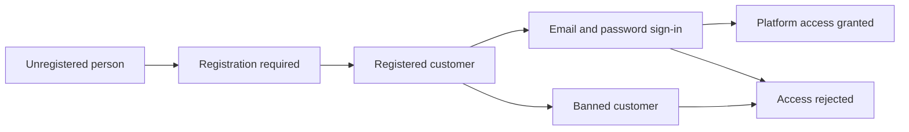

### Customer Password Change Constraints

WHEN a signed-in customer changes the password, THE shoppingMall SHALL apply the change to the same existing CustomerAccount.

THE shoppingMall SHALL NOT treat a password change as creation of a new customer identity.

THE shoppingMall SHALL continue to associate the customer profile, addresses, orders, cart contents, wishlist entries, and reviews with the same CustomerAccount after a password change.

IF a password change request is made for a customer account that is not the existing signed-in account, THEN THE shoppingMall SHALL reject the request.

IF a banned customer attempts to use password change to regain access, THEN THE shoppingMall SHALL reject the attempt to log in with the banned account after the change.

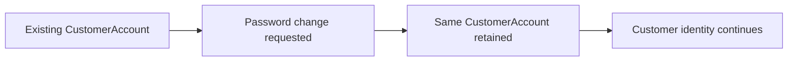

### Customer Account Deletion and Historical Preservation

WHEN a customer deletes the account, THE shoppingMall SHALL delete the customer's profile information.

WHEN a customer deletes the account, THE shoppingMall SHALL preserve the customer's orders and order history.

WHEN a customer deletes the account, THE shoppingMall SHALL preserve order history needed for seller records and legal purposes.

WHEN a customer deletes the account, THE shoppingMall SHALL preserve reviews previously written by that customer.

WHEN a customer account has been deleted, THE shoppingMall SHALL show the author of preserved reviews as "deleted user".

THE shoppingMall SHALL ensure that account deletion does not invalidate preserved commercial history relied on by sellers or historical order records.

IF account deletion would remove preserved orders or order history, THEN THE shoppingMall SHALL reject that deletion outcome and preserve those records instead.

IF account deletion would remove preserved reviews entirely rather than relabeling the author as "deleted user", THEN THE shoppingMall SHALL reject that deletion outcome and preserve the reviews instead.

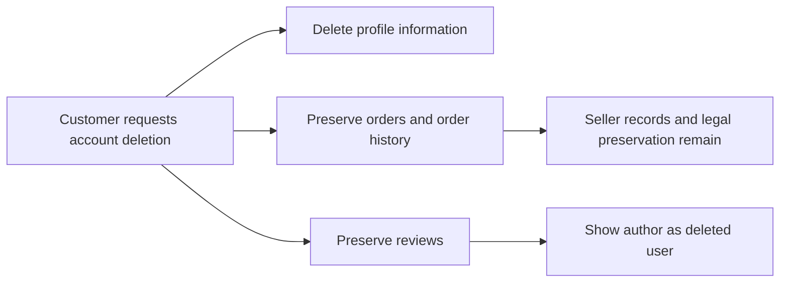

## CustomerProfile Rules

Each customer has one profile used for personal account information. The profile is limited to display name and phone number. Both values are customer-editable, so the profile must support updates to current customer-facing information. The profile is separate from sign-in credentials and does not replace the email and password used for authentication. When a customer account is deleted, the related profile information must be deleted as part of that account removal. Profile information is not a substitute for shipping destination details, which belong in saved shipping addresses. The profile exists to represent the customer personally, while order and review history remain governed by their own preservation rules.

### Single Customer Profile Record

THE shoppingMall SHALL maintain exactly one customer profile record for each customer account.
THE shoppingMall SHALL limit the customer profile record to personal profile information only.
IF a customer profile record is requested for a customer account that does not exist, THEN THE shoppingMall SHALL reject the request.
IF an attempt is made to create an additional customer profile record for the same customer account, THEN THE shoppingMall SHALL reject the request.
IF a customer account has been deleted, THEN THE shoppingMall SHALL not retain an active customer profile record for that account.

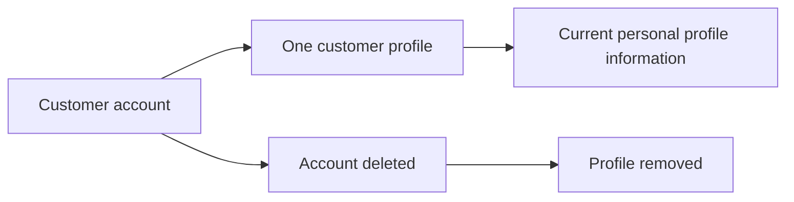

### Profile Information and Editable Identity

THE shoppingMall SHALL treat display name as customer profile information.
THE shoppingMall SHALL treat phone number as customer profile information.
THE shoppingMall SHALL use the customer profile to represent the customer's current customer-facing identity.
THE shoppingMall SHALL allow a customer to update the display name in that customer's own profile.
THE shoppingMall SHALL allow a customer to update the phone number in that customer's own profile.
IF an update request includes profile information other than display name or phone number, THEN THE shoppingMall SHALL reject the request.
IF a customer attempts to update another customer's profile details, THEN THE shoppingMall SHALL reject the request.

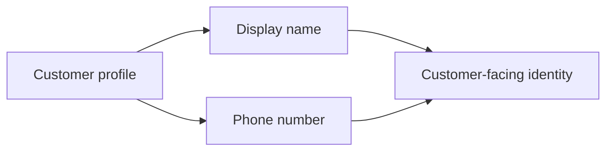

### Profile Separation from Credentials and Shipping Address

THE shoppingMall SHALL keep customer profile information separate from sign-in credentials.
THE shoppingMall SHALL treat email and password as sign-in credentials rather than customer profile information.
THE shoppingMall SHALL not use the customer profile as a shipping address record.
THE shoppingMall SHALL not treat display name or phone number in the customer profile as a replacement for shipping destination details.
IF a customer attempts to use profile information where a shipping address is required, THEN THE shoppingMall SHALL require selection of a saved shipping address instead.
IF a request attempts to change sign-in credentials through customer profile editing, THEN THE shoppingMall SHALL reject the request.

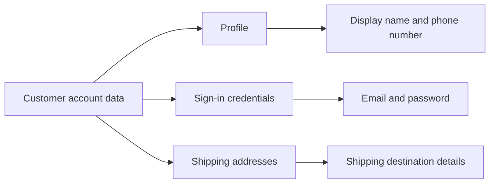

### Profile Removal on Account Deletion

WHEN a customer account is deleted, THE shoppingMall SHALL remove the related customer profile information.
WHEN a customer account is deleted, THE shoppingMall SHALL not preserve the deleted customer's profile as an active profile record.
WHEN a customer account is deleted, THE shoppingMall SHALL preserve orders and order history under their own preservation rules rather than through the customer profile.
WHEN a customer account is deleted, THE shoppingMall SHALL preserve reviews under their own preservation rules and show the review author as "deleted user".
IF profile information is requested after the related customer account has been deleted, THEN THE shoppingMall SHALL reject the request.

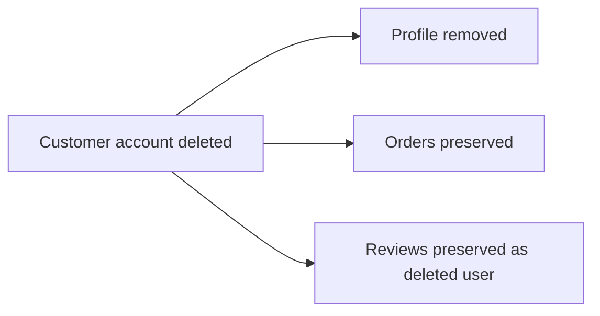

## ShippingAddress Rules

A customer may maintain multiple ShippingAddress records for delivery use. Each saved address must include recipient name, phone number, street address, city, state or province, postal code, and country. One address may be designated as the default shipping address for the customer. The default designation must be singular, so only one saved address can hold that role at a time. Shipping addresses are editable and removable as customer-managed records before they are used in an order. Once an order is placed, the chosen delivery destination is preserved separately as an order address snapshot and later changes to saved addresses do not alter that preserved order data. Address information is therefore reusable for future purchases but must not retroactively change completed purchase records.

### Saved Address Completeness and Required Fields

THE shoppingMall SHALL allow a customer to maintain multiple saved shipping addresses.

THE shoppingMall SHALL require each saved shipping address to include a recipient name.

THE shoppingMall SHALL require each saved shipping address to include a phone number.

THE shoppingMall SHALL require each saved shipping address to include a street address.

THE shoppingMall SHALL require each saved shipping address to include a city.

THE shoppingMall SHALL require each saved shipping address to include a state or province.

THE shoppingMall SHALL require each saved shipping address to include a postal code.

THE shoppingMall SHALL require each saved shipping address to include a country.

IF any required shipping address value is missing, THEN THE shoppingMall SHALL reject the address creation or address update request.

IF a customer attempts to save an address that omits the recipient name, phone number, street address, city, state or province, postal code, or country, THEN THE shoppingMall SHALL keep the address from being stored as a usable shipping address.

### Default Shipping Address Uniqueness

THE shoppingMall SHALL allow one saved shipping address for a customer to be designated as the default shipping address.

THE shoppingMall SHALL enforce that only one saved shipping address per customer can hold the default designation at a time.

WHEN a customer assigns the default designation to a different saved shipping address, THE shoppingMall SHALL remove the default designation from the previously default saved shipping address.

IF a customer attempts to place the default designation on more than one saved shipping address at the same time, THEN THE shoppingMall SHALL reject that outcome and preserve a single default shipping address only.

IF a customer has no saved shipping address designated as default, THEN THE shoppingMall SHALL treat the customer as having no default shipping address until one is designated.

### Address Editing and Removal Constraints

THE shoppingMall SHALL support customer editing of saved shipping addresses.

THE shoppingMall SHALL support customer removal of saved shipping addresses.

WHEN a customer edits a saved shipping address, THE shoppingMall SHALL apply the required field rules defined in Saved Address Completeness and Required Fields.

IF an address update would remove a required value from an existing saved shipping address, THEN THE shoppingMall SHALL reject the update.

WHEN a customer removes a saved shipping address, THE shoppingMall SHALL remove that address from the customer's reusable saved address list for future purchases.

WHEN a customer removes the address currently designated as the default shipping address, THE shoppingMall SHALL clear the default designation from that removed address.

IF a customer attempts to edit or remove a saved shipping address that does not exist in that customer's saved address list, THEN THE shoppingMall SHALL reject the request.

### Saved Address and Order Shipping Snapshot Separation

THE shoppingMall SHALL treat a saved shipping address and an order shipping address snapshot as separate records.

WHEN an order is placed using a selected or default saved shipping address, THE shoppingMall SHALL preserve the shipping destination for that order as a separate order shipping address snapshot.

THE shoppingMall SHALL preserve the order shipping address snapshot after purchase.

WHEN a customer later edits a saved shipping address, THE shoppingMall SHALL NOT change any previously preserved order shipping address snapshot.

WHEN a customer later removes a saved shipping address, THE shoppingMall SHALL NOT remove or alter any previously preserved order shipping address snapshot.

IF a customer expects a post-purchase change to a saved shipping address to alter an existing order's shipping address, THEN THE shoppingMall SHALL reject that outcome.

WHILE an order exists, THE shoppingMall SHALL keep its preserved shipping address independent from the customer's later saved address changes.

## SellerAccount Rules

A SellerAccount uses email and password as its sign-in credentials. Selling eligibility is constrained by administrator review, so a seller cannot sell until the account has been approved. Approval status must be meaningful to the seller as pending, approved, or rejected, and a rejected outcome may carry a rejection reason. A rejected seller is allowed to submit a new registration request rather than being permanently blocked from future approval. A suspended seller remains able to process existing orders but cannot create new products or edit existing products while suspended. A banned seller cannot log in to the platform. Seller account deletion is restricted when there are pending paid or shipped order items, or pending cancellation or refund requests. When deletion is allowed, products are removed from active listings, while order history and preserved shop identity in past orders remain intact. These rules ensure the seller identity can be removed without breaking historical transaction evidence.

### Seller Registration and Selling Eligibility Rules

WHEN a person submits seller registration, THE shoppingMall SHALL require email and password as the sign-up credentials.

WHEN a seller account has not been approved by an administrator, THE shoppingMall SHALL prevent that seller from selling on the platform.

WHILE a seller approval outcome is pending, THE shoppingMall SHALL treat the seller as not yet eligible to sell.

WHILE a seller approval outcome is rejected, THE shoppingMall SHALL treat the seller as not eligible to sell.

WHEN a seller approval outcome is approved, THE shoppingMall SHALL allow that seller to sell, subject to other account restrictions defined in this document.

IF seller registration is attempted without email or without password, THEN THE shoppingMall SHALL reject the registration request.

IF a seller attempts to sell before approval, THEN THE shoppingMall SHALL reject the selling action.

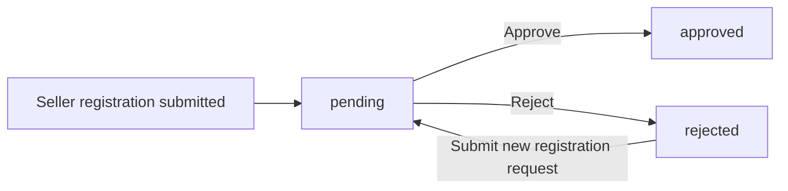

### Seller Approval Status Visibility and Reapplication Rules

THE shoppingMall SHALL show each seller the current approval status of that seller account.

WHEN the approval outcome is pending, THE shoppingMall SHALL show the status as pending.

WHEN the approval outcome is approved, THE shoppingMall SHALL show the status as approved.

WHEN the approval outcome is rejected, THE shoppingMall SHALL show the status as rejected.

WHEN an administrator rejects a seller registration, THE shoppingMall SHALL make the rejection reason visible to that seller.

IF a seller views approval details for an account other than the seller's own account, THEN THE shoppingMall SHALL reject the request.

WHEN a seller has a rejected outcome, THE shoppingMall SHALL allow that seller to submit a new registration request.

IF a seller who is not in rejected status attempts to submit a new registration request as a reapplication, THEN THE shoppingMall SHALL reject that reapplication request.

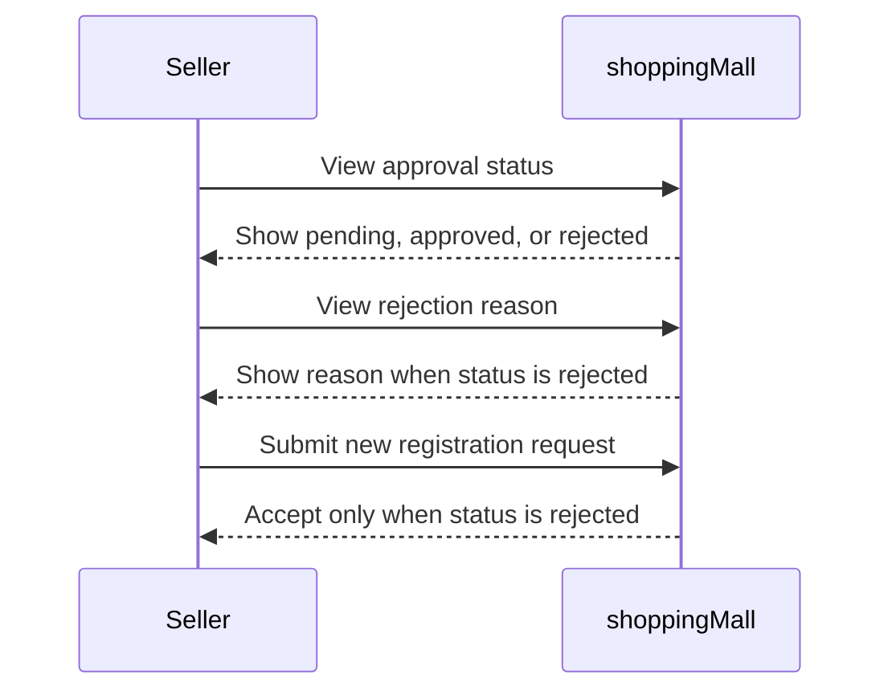

### Suspension and Ban Enforcement Rules

WHILE a seller account is suspended, THE shoppingMall SHALL prevent that seller from creating new products.

WHILE a seller account is suspended, THE shoppingMall SHALL prevent that seller from editing existing products.

WHILE a seller account is suspended, THE shoppingMall SHALL allow that seller to continue processing existing orders.

WHILE a seller account is suspended, THE shoppingMall SHALL allow that seller to ship items already purchased.

WHILE a seller account is suspended, THE shoppingMall SHALL allow that seller to respond to cancellation requests for existing order items.

WHILE a seller account is suspended, THE shoppingMall SHALL allow that seller to respond to refund requests for existing order items.

WHILE a seller account is banned, THE shoppingMall SHALL prevent that seller from logging in.

IF a banned seller attempts to log in, THEN THE shoppingMall SHALL reject the login attempt.

IF a suspended seller attempts to create or edit a product, THEN THE shoppingMall SHALL reject the action.

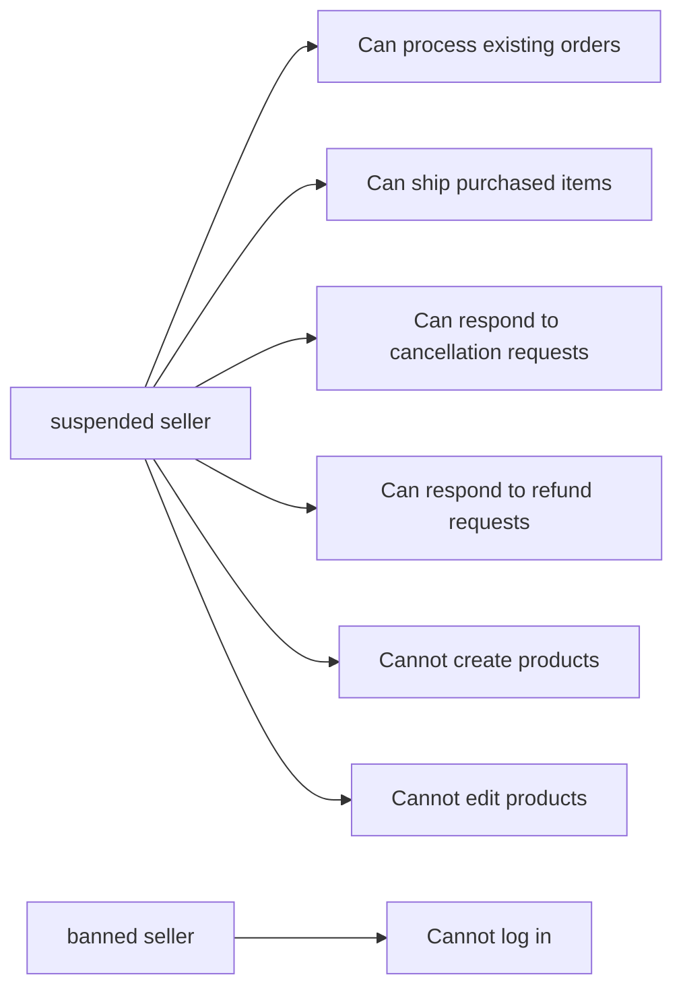

### Seller Account Deletion Constraints and Historical Preservation Rules

WHEN a seller requests account deletion, THE shoppingMall SHALL check for order items in paid or shipped status for that seller.

IF the seller has any order item in paid or shipped status, THEN THE shoppingMall SHALL reject seller account deletion.

WHEN a seller requests account deletion, THE shoppingMall SHALL check for pending cancellation requests related to that seller's order items.

IF the seller has any pending cancellation request, THEN THE shoppingMall SHALL reject seller account deletion.

WHEN a seller requests account deletion, THE shoppingMall SHALL check for pending refund requests related to that seller's order items.

IF the seller has any pending refund request, THEN THE shoppingMall SHALL reject seller account deletion.

WHEN seller account deletion is allowed and completed, THE shoppingMall SHALL remove that seller's products from active listings.

WHEN seller account deletion is completed, THE shoppingMall SHALL preserve past order history.

WHEN seller account deletion is completed, THE shoppingMall SHALL preserve the seller shop name shown in past orders.

IF a deleted seller had prior orders, THEN THE shoppingMall SHALL continue showing preserved shop identity in those past orders.

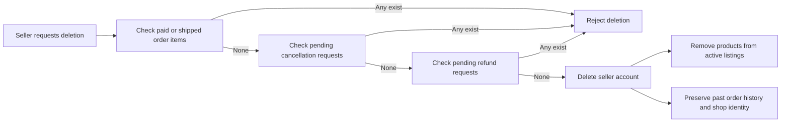

## SellerApprovalRequest Rules

A SellerApprovalRequest represents the seller's request to gain selling eligibility on the platform. The request is reviewable with outcomes of pending, approved, or rejected. A rejected request must carry a rejection reason so the seller can understand why approval was denied. Rejection does not permanently close the door to selling, because the seller may submit a new registration request after being rejected. The approval request governs selling permission rather than general account existence, so a seller account may exist without being allowed to sell yet. Administrator review is therefore a required business gate between account registration and active selling. The current request outcome must remain consistent with the seller's visible approval status.

### Selling Eligibility Governance

THE shoppingMall SHALL treat a seller approval request as the business control that determines whether a seller account is allowed to sell on the platform.

WHILE a seller approval request is not approved, THE shoppingMall SHALL prevent the seller from gaining selling eligibility.

THE shoppingMall SHALL distinguish seller account existence from selling eligibility so that a seller account may exist before it is allowed to sell.

IF a seller attempts to sell without an approval request outcome of approved, THEN THE shoppingMall SHALL reject the attempt.

THE shoppingMall SHALL use the current approval request outcome as the source for whether the seller may sell.

IF the seller-visible approval status does not match the current seller approval request outcome, THEN THE shoppingMall SHALL reject the inconsistent state.

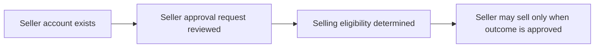

### Approval Outcome Validation

THE shoppingMall SHALL allow only the outcomes pending, approved, and rejected for a seller approval request.

WHEN a seller approval request is first submitted, THE shoppingMall SHALL set its outcome to pending.

WHILE a seller approval request has the outcome pending, THE shoppingMall SHALL treat the request as under review and not grant selling eligibility.

WHEN a seller approval request outcome becomes approved, THE shoppingMall SHALL treat the seller as eligible to sell.

WHEN a seller approval request outcome becomes rejected, THE shoppingMall SHALL treat the seller as not eligible to sell.

IF any value other than pending, approved, or rejected is assigned as the approval outcome, THEN THE shoppingMall SHALL reject that value.

IF more than one current outcome is represented for the same seller approval request at the same time, THEN THE shoppingMall SHALL reject the inconsistent state.

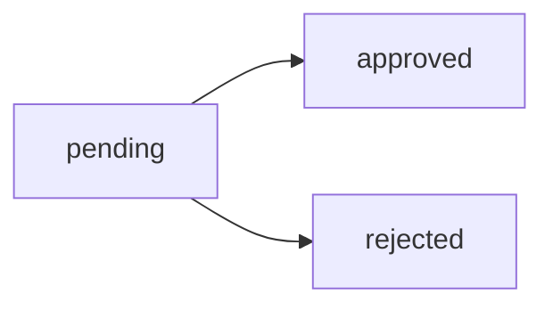

### Rejection Reason and Reapplication Rules

WHEN a seller approval request is rejected, THE shoppingMall SHALL require a rejection reason.

IF a seller approval request is rejected without a rejection reason, THEN THE shoppingMall SHALL reject the review result.

WHILE a seller approval request has the outcome approved or pending, THE shoppingMall SHALL not require a rejection reason.

WHEN a seller views a rejected approval request, THE shoppingMall SHALL make the rejection reason available to that seller.

WHEN a seller has a rejected approval request, THE shoppingMall SHALL allow the seller to submit a new seller approval request.

IF a seller has not received a rejected outcome, THEN THE shoppingMall SHALL reject submission of a new seller approval request on the basis of reapplication after rejection.

THE shoppingMall SHALL treat the new seller approval request as a new reviewable request rather than changing the rejected outcome of the earlier request.

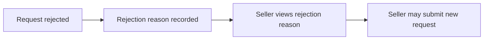

### Review Gate and Visible Status Consistency

THE shoppingMall SHALL require administrator review before a seller becomes eligible to sell.

IF administrator review has not occurred, THEN THE shoppingMall SHALL keep the seller approval request outcome as pending.

WHEN administrator review produces an approved outcome, THE shoppingMall SHALL show the seller approval status as approved.

WHEN administrator review produces a rejected outcome, THE shoppingMall SHALL show the seller approval status as rejected.

WHILE administrator review has not produced a final decision, THE shoppingMall SHALL show the seller approval status as pending.

THE shoppingMall SHALL keep the seller-visible approval status consistent with the current seller approval request outcome.

IF the seller-visible approval status is pending while the current request outcome is approved or rejected, THEN THE shoppingMall SHALL reject the inconsistent state.

IF the seller-visible approval status is approved or rejected while the current request outcome is pending, THEN THE shoppingMall SHALL reject the inconsistent state.

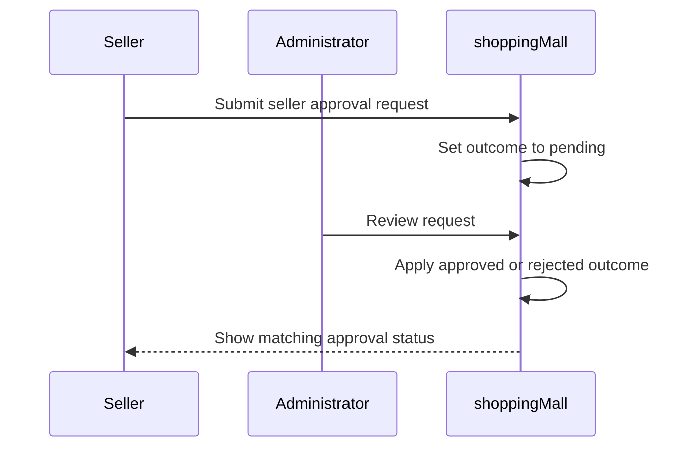

## SellerProfile Rules

Each seller has one public SellerProfile that represents the shop to customers. The profile contains shop name, shop description, and logo image. Sellers may edit these profile details over time, but every edit must create a snapshot of the previous state. Because the profile is visible to customers, the current shop identity shown to shoppers must reflect the latest approved profile content. Historical seller profile states must still remain available for dispute resolution through immutable snapshots. The profile content also has long-term business significance because a seller profile snapshot is preserved with purchased order items at the time of purchase. This means current profile changes cannot rewrite the seller identity already attached to past transactions.

### Public Seller Profile Content Validation

THE shoppingMall SHALL maintain exactly one public seller shop profile for each seller account.

THE shoppingMall SHALL treat the seller profile as the customer-visible source of the seller's current shop identity.

THE shoppingMall SHALL require a seller profile to contain a shop name, a shop description, and a logo image.

IF the shop name is missing, THEN THE shoppingMall SHALL reject the seller profile change.

IF the shop description is missing, THEN THE shoppingMall SHALL reject the seller profile change.

IF the logo image is missing, THEN THE shoppingMall SHALL reject the seller profile change.

IF a customer views a seller profile, THEN THE shoppingMall SHALL show the latest current shop name, shop description, and logo image from that seller's profile.

IF a seller profile does not have current valid profile content, THEN THE shoppingMall SHALL not treat that seller profile as updated.

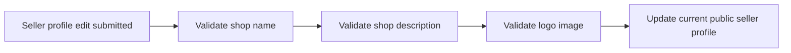

### Seller Editable Shop Information Change Rules

WHEN a seller edits shop information, THE shoppingMall SHALL allow changes only to the shop name, shop description, and logo image defined in Public Seller Profile Content Validation.

WHEN a seller edits the shop name, THE shoppingMall SHALL use the updated shop name as the seller's current public shop name after the change is accepted.

WHEN a seller edits the shop description, THE shoppingMall SHALL use the updated shop description as the seller's current public shop description after the change is accepted.

WHEN a seller edits the logo image, THE shoppingMall SHALL use the updated logo image as the seller's current public logo image after the change is accepted.

WHEN a seller submits a profile edit, THE shoppingMall SHALL evaluate the edited profile as one seller profile change.

IF an attempted profile edit includes information outside the seller profile content defined in Public Seller Profile Content Validation, THEN THE shoppingMall SHALL reject that unsupported profile change.

IF a seller attempts to rely on a previous profile version as the current public profile without submitting a valid edit, THEN THE shoppingMall SHALL continue showing the current accepted seller profile.

IF a customer opens a seller profile after an accepted edit, THEN THE shoppingMall SHALL show the updated seller profile content rather than an earlier profile version.

### Seller Profile Snapshot and History Rules

WHEN any accepted seller profile edit occurs, THE shoppingMall SHALL create a snapshot of the previous seller profile state.

WHEN a seller profile snapshot is created, THE shoppingMall SHALL record when the change was made.

WHEN a seller profile snapshot is created, THE shoppingMall SHALL record what was changed.

WHEN a seller profile snapshot is created, THE shoppingMall SHALL preserve the values before and after the change.

THE shoppingMall SHALL keep seller profile snapshots immutable.

THE shoppingMall SHALL not allow deletion of seller profile snapshots.

WHEN a relevant party views seller profile history for dispute resolution, THE shoppingMall SHALL present the preserved immutable snapshots.

IF no accepted seller profile edit has occurred, THEN THE shoppingMall SHALL not create a new seller profile snapshot.

IF a seller edits the profile multiple times, THEN THE shoppingMall SHALL create a separate immutable snapshot for each accepted edit.

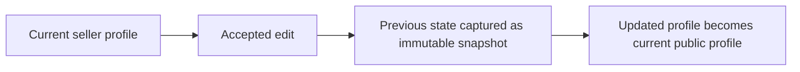

### Purchase-Time Seller Identity Preservation Rules

WHEN a seller profile is changed after an order item has already preserved the seller identity at purchase time, THE shoppingMall SHALL not replace the seller identity already preserved with that past order item.

WHEN a customer views a past order item, THE shoppingMall SHALL use the seller identity preserved at purchase time instead of the seller's current profile content.

WHEN a seller changes the current shop name, THE shoppingMall SHALL preserve the shop name already attached to past purchased order items.

WHEN a seller changes the current logo image, THE shoppingMall SHALL preserve the logo image already attached to past purchased order items.

IF a current seller profile differs from the seller identity preserved with a purchased order item, THEN THE shoppingMall SHALL treat the order-attached seller identity as authoritative for that past purchase.

IF a dispute requires review of the seller identity associated with a purchase, THEN THE shoppingMall SHALL make the purchase-time seller identity and the seller profile history available as separate preserved records.

IF a seller profile is later edited many times, THEN THE shoppingMall SHALL keep past order-linked seller identity unchanged across all later edits.

IF a seller account is deleted, THEN THE shoppingMall SHALL preserve the seller identity already attached to past order items.

## AdministratorAccount Rules

An AdministratorAccount has one of two grades: regular administrator or super administrator. Grade is a meaningful business distinction because only super administrators can promote a regular administrator to super administrator. Only super administrators can also demote another super administrator back to regular administrator. A super administrator cannot demote themselves, which prevents self-removal of required top-level authority. Administrative authority can be granted to an existing user who is approved through the administrator request process. Administrator grade changes affect administrative authority but do not alter the user's underlying customer or seller identity. These rules create a controlled hierarchy for privileged platform management.

### Administrator Grade Hierarchy

THE shoppingMall system SHALL assign each AdministratorAccount exactly one administrator grade.

THE shoppingMall system SHALL support only these administrator grades for AdministratorAccount: regular administrator and super administrator.

THE shoppingMall system SHALL treat super administrator as higher authority than regular administrator for administrator grade management.

THE shoppingMall system SHALL apply administrator grade changes only within the defined administrator grade hierarchy.

IF an administrator grade outside regular administrator or super administrator is requested or encountered, THEN THE shoppingMall system SHALL reject the change.

IF an AdministratorAccount does not yet exist for a user, THEN THE shoppingMall system SHALL reject any attempt to assign, change, promote, or demote an administrator grade.

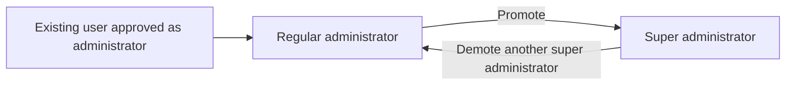


### Administrator Role Grant to Existing User

WHEN an administrator role is granted through the administrator request approval process, THE shoppingMall system SHALL create the resulting AdministratorAccount for an existing user only.

WHEN an administrator role is first granted, THE shoppingMall system SHALL assign the grade regular administrator.

THE shoppingMall system SHALL NOT grant the administrator role directly as super administrator at initial approval.

THE shoppingMall system SHALL preserve the user's existing customer or seller identity when the administrator role is granted.

THE shoppingMall system SHALL treat administrator authority as an added role and SHALL NOT replace the user's underlying account identity.

IF the approval outcome does not identify an existing eligible user, THEN THE shoppingMall system SHALL reject administrator role creation.

IF a user already has an AdministratorAccount, THEN THE shoppingMall system SHALL reject creation of a second AdministratorAccount for that same user.


### Promotion to Super Administrator

WHEN a regular administrator is promoted, THE shoppingMall system SHALL change that AdministratorAccount grade from regular administrator to super administrator.

THE shoppingMall system SHALL allow promotion to super administrator only from the regular administrator grade.

THE shoppingMall system SHALL record the updated administrator grade as the current grade after promotion.

IF promotion is attempted for an AdministratorAccount that is already super administrator, THEN THE shoppingMall system SHALL reject the promotion.

IF promotion is attempted for an account that is not an AdministratorAccount, THEN THE shoppingMall system SHALL reject the promotion.

IF promotion is attempted without a valid source grade of regular administrator, THEN THE shoppingMall system SHALL reject the change.


### Demotion to Regular Administrator

WHEN a super administrator is demoted, THE shoppingMall system SHALL change that AdministratorAccount grade from super administrator to regular administrator.

THE shoppingMall system SHALL allow demotion to regular administrator only from the super administrator grade.

THE shoppingMall system SHALL record the updated administrator grade as the current grade after demotion.

IF demotion is attempted for an AdministratorAccount that already has the grade regular administrator, THEN THE shoppingMall system SHALL reject the demotion.

IF demotion is attempted for an account that is not an AdministratorAccount, THEN THE shoppingMall system SHALL reject the demotion.

IF demotion is attempted without a valid source grade of super administrator, THEN THE shoppingMall system SHALL reject the change.


### Super Administrator Grade Management Constraints

THE shoppingMall system SHALL reserve administrator grade management to super administrator grade actions.

WHEN a regular administrator is selected as the target of a grade increase, THE shoppingMall system SHALL permit only promotion to super administrator.

WHEN a super administrator is selected as the target of a grade decrease, THE shoppingMall system SHALL permit only demotion to regular administrator.

THE shoppingMall system SHALL NOT permit grade changes that skip, bypass, or create levels outside the two defined grades.

THE shoppingMall system SHALL evaluate each grade change request against the current target grade before applying the change.

IF the requested grade change does not match the valid hierarchy path between regular administrator and super administrator, THEN THE shoppingMall system SHALL reject the request.

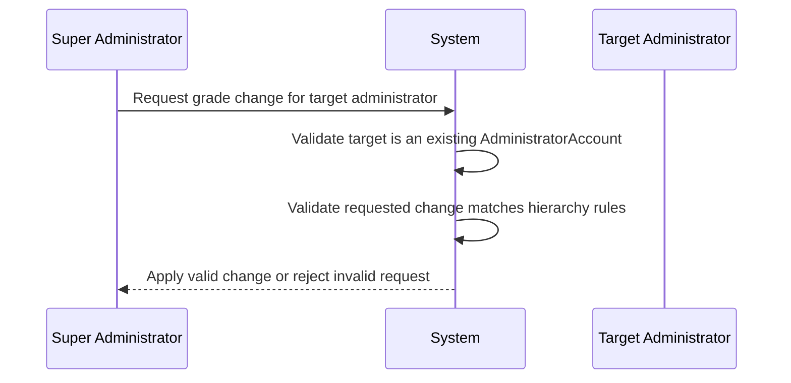


### Self-Demotion Prohibition for Super Administrator

IF a super administrator attempts to demote their own AdministratorAccount, THEN THE shoppingMall system SHALL reject the demotion.

THE shoppingMall system SHALL preserve the current super administrator grade when self-demotion is attempted.

THE shoppingMall system SHALL enforce self-demotion prohibition regardless of whether the requested target grade is regular administrator.

THE shoppingMall system SHALL treat self-demotion prohibition as a mandatory rule that cannot be bypassed through ordinary administrator grade management.

IF the acting super administrator and the target AdministratorAccount are the same, THEN THE shoppingMall system SHALL return a rejection outcome and SHALL NOT change the grade.


## AdministratorRequest Rules

An AdministratorRequest may be submitted by any existing customer or seller who wants administrative authority. The request must include a reason explaining why the user is asking to become an administrator. The request is subject to review by a super administrator rather than by a regular administrator. Approval converts the requester into a regular administrator, not directly into a super administrator. Rejection leaves the requester as their original user type without administrator privileges. The request exists specifically to control elevation into administrative authority and to document the stated justification for that elevation.

### Administrator Request Eligibility and Submission Validation

THE shoppingMall SHALL allow an existing customer to submit an administrator request.

THE shoppingMall SHALL allow an existing seller to submit an administrator request.

IF the requester is neither an existing customer nor an existing seller, THEN THE shoppingMall SHALL reject the administrator request.

THE shoppingMall SHALL treat the administrator request as the controlled business record for requesting elevation into administrative authority.

IF a requester submits an administrator request without a stated justification, THEN THE shoppingMall SHALL reject the administrator request.

THE shoppingMall SHALL require the administrator request to include justification text explaining why the requester is asking to become an administrator.

IF the requester is already an administrator, THEN THE shoppingMall SHALL reject a new administrator request.

THE shoppingMall SHALL preserve the submitted justification text as part of the administrator request record.

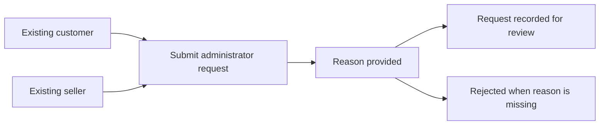


### Administrator Request Review Authority and Decision Constraints

THE shoppingMall SHALL route administrator requests to a super administrator for review.

IF an administrator request is reviewed by a regular administrator, THEN THE shoppingMall SHALL reject the review action.

WHEN a super administrator approves an administrator request, THE shoppingMall SHALL convert the requester into a regular administrator.

WHEN a super administrator approves an administrator request, THE shoppingMall SHALL NOT grant super administrator grade directly through that approval.

WHEN a super administrator rejects an administrator request, THE shoppingMall SHALL leave the requester in the requester’s original role.

WHEN an administrator request is rejected, THE shoppingMall SHALL NOT grant any administrator privileges to the requester.

THE shoppingMall SHALL use the review decision on the administrator request to control whether privilege elevation occurs.

IF no super administrator decision has been made, THEN THE shoppingMall SHALL NOT elevate the requester into an administrator role.

```mermaid
flowchart LR
    A["Administrator request submitted"] --> B["Super administrator review"]
    B --> C["Approved"]
    B --> D["Rejected"]
    C --> E["Requester becomes regular administrator"]
    D --> F["Requester remains original role"]
```


### Administrator Request Outcome Integrity and Error Handling

IF an approval action would create any administrator grade other than regular administrator, THEN THE shoppingMall SHALL reject the action.

IF a rejection action would change the requester away from the requester’s original role, THEN THE shoppingMall SHALL reject the action.

IF a request is used for any purpose other than documented elevation into administrative authority, THEN THE shoppingMall SHALL reject that use.

THE shoppingMall SHALL maintain a clear association between each administrator request and its submitted justification text for later review.

IF a review is attempted against an administrator request that does not exist, THEN THE shoppingMall SHALL reject the review action.

IF a requester attempts to claim administrator authority before approval, THEN THE shoppingMall SHALL deny that authority.

IF a requester whose administrator request was rejected needs administrative authority later, THEN THE shoppingMall SHALL require a new administrator request rather than treating the rejected request as approved.

THE shoppingMall SHALL keep the request outcome aligned with the purpose of controlled privilege elevation so that approval changes role only through the reviewed request and rejection preserves the original role.

```mermaid
sequenceDiagram
    participant R as Requester
    participant S as System
    participant SA as Super Administrator
    R->>S: Submit administrator request with reason
    S->>SA: Present request for review
    SA->>S: Approve or reject
    S-->>R: Become regular administrator or remain original role
```


## Category Rules

A Category organizes products for browsing and classification. Each category has a name and description. Categories support subcategories, but the nesting depth is limited to one level only. A product may be assigned to a category, including a subcategory where applicable. Categories are managed only by administrators, so seller-created category structures are not allowed. If a category is deleted, affected products do not disappear solely because of that deletion; instead, they become uncategorized. The category structure therefore controls organization and discoverability without invalidating the underlying products.

### Category Definition and Browsing Role

THE shoppingMall SHALL require each category to have a name.
THE shoppingMall SHALL require each category to have a description.
THE shoppingMall SHALL use categories to organize products for browsing and classification.
WHEN customers browse the list of categories, THE shoppingMall SHALL present categories as the structure used to locate products.
WHEN customers view products within a category, THE shoppingMall SHALL include products assigned directly to that category.
IF a product is not assigned to any category, THEN THE shoppingMall SHALL treat that product as uncategorized rather than invalid.

```mermaid
flowchart LR
    A["Category list"] --> B["Category"]
    B --> C["Products assigned to category"]
    C --> D["Customer browsing and discovery"]
    E["Uncategorized product"] --> D
```

### Category Hierarchy Constraints

THE shoppingMall SHALL allow categories to have subcategories.
THE shoppingMall SHALL limit category nesting to one level only.
WHEN a category is already a subcategory, THE shoppingMall SHALL reject any attempt to create or assign another child category under it.
IF a category structure would create more than one parent-child level, THEN THE shoppingMall SHALL reject that structure.
WHEN displaying category relationships, THE shoppingMall SHALL represent them as parent categories and their direct subcategories only.

```mermaid
flowchart LR
    A["Parent category"] --> B["Subcategory"]
    B --> C["Rejected deeper level"]
```

### Product Category Assignment Rules

THE shoppingMall SHALL require each product to be assigned to a category when the product is created.
WHEN a product is assigned to a category, THE shoppingMall SHALL allow assignment to either a parent category or a subcategory.
WHEN a subcategory is selected for a product, THE shoppingMall SHALL treat that subcategory as the product's category assignment.
WHEN customers view products within a subcategory, THE shoppingMall SHALL show products assigned to that subcategory.
IF a selected category does not exist, THEN THE shoppingMall SHALL reject the product assignment.
IF a selected subcategory does not belong to the chosen category structure, THEN THE shoppingMall SHALL reject the product assignment.

```mermaid
flowchart LR
    A["Product"] --> B["Assign parent category"]
    A --> C["Assign subcategory"]
    B --> D["Browsable in category"]
    C --> E["Browsable in subcategory"]
```

### Category Management Authority Rules

THE shoppingMall SHALL allow only administrators to create and manage category structures.
THE shoppingMall SHALL treat the category structure as administrator managed.
WHEN a seller attempts to create a category, THE shoppingMall SHALL reject the request.
WHEN a seller attempts to edit a category, THE shoppingMall SHALL reject the request.
WHEN a seller attempts to delete a category, THE shoppingMall SHALL reject the request.
THE shoppingMall SHALL NOT allow seller managed category structures.
IF a category management request is made by a non-administrator actor, THEN THE shoppingMall SHALL reject the request.

```mermaid
flowchart LR
    A["Administrator request"] --> B["Category management allowed"]
    C["Seller request"] --> D["Rejected"]
    E["Other non-administrator request"] --> D
```

### Deleted Category Reassignment Rules

WHEN a category is deleted, THE shoppingMall SHALL make products assigned to that category uncategorized.
WHEN a subcategory is deleted, THE shoppingMall SHALL make products assigned to that subcategory uncategorized.
WHEN a category is deleted, THE shoppingMall SHALL NOT delete affected products solely because of that category deletion.
WHEN a category is deleted, THE shoppingMall SHALL remove the deleted category from category-based browsing.
IF customers browse category listings after a category has been deleted, THEN THE shoppingMall SHALL exclude that deleted category from the available category structure.

```mermaid
flowchart LR
    A["Product assigned to category"] --> B["Category deleted"]
    B --> C["Product becomes uncategorized"]
    B --> D["Product remains in catalog"]
```

## Product Rules

A Product is owned by the seller who created it and represents the main catalog entry for sale. A valid product requires a name, description, category, and base price. The category may be a subcategory when the chosen classification supports it. Product edits are historically significant and must create immutable snapshots of the previous state. Product visibility and purchasable availability are not identical: a product with no variants may still appear in search, but it is shown as unavailable. A product becomes purchasable only when it has at least one variant. Product deletion is restricted if any variant still has pending paid or shipped order items, or pending cancellation or refund requests. When deletion is allowed, the product is removed from search and category listings, and its variants and inventory records are removed from active use, while historical snapshots remain preserved. Administrators may also delete products for policy violations, but preserved history must still remain available where required.

### Product Ownership and Required Product Information

THE shoppingMall SHALL associate each product with the seller account that created it.

THE shoppingMall SHALL require a product name when a seller creates a product.

THE shoppingMall SHALL require a product description when a seller creates a product.

THE shoppingMall SHALL require a product category when a seller creates a product.

THE shoppingMall SHALL require a base price when a seller creates a product.

WHEN a seller selects a classification for a product, THE shoppingMall SHALL allow the selection of a subcategory where the category structure includes that subcategory.

IF a seller attempts to create or save a product without a name, THEN THE shoppingMall SHALL reject the request.

IF a seller attempts to create or save a product without a description, THEN THE shoppingMall SHALL reject the request.

IF a seller attempts to create or save a product without a category, THEN THE shoppingMall SHALL reject the request.

IF a seller attempts to create or save a product without a base price, THEN THE shoppingMall SHALL reject the request.

IF a seller attempts to manage a product that belongs to a different seller, THEN THE shoppingMall SHALL reject the request.

```mermaid
flowchart LR
    A["Seller starts product creation"] --> B["Enter required product information"]
    B --> C["Select category or subcategory"]
    C --> D["Validate ownership and required values"]
    D --> E["Product can be saved"]
```

### Product Edit History and Snapshot Preservation

WHEN a seller edits a product, THE shoppingMall SHALL create a product snapshot.

WHEN a product snapshot is created, THE shoppingMall SHALL preserve the previous state of the product.

WHEN a product is edited, THE shoppingMall SHALL include all product fields in the product snapshot.

WHEN a product is edited, THE shoppingMall SHALL include product images in the product snapshot.

WHEN a product is edited, THE shoppingMall SHALL include the state of all product variants at that moment in the product snapshot.

WHEN a product edit is completed, THE shoppingMall SHALL record when the change was made.

WHEN a product edit is completed, THE shoppingMall SHALL record what was changed.

WHEN a product edit is completed, THE shoppingMall SHALL record the values before and after the change.

THE shoppingMall SHALL keep product snapshots immutable.

THE shoppingMall SHALL preserve product snapshots after the product is deleted.

```mermaid
flowchart LR
    A["Existing product"] --> B["Seller edits product"]
    B --> C["Create immutable snapshot of previous state"]
    C --> D["Save updated product state"]
    C --> E["Preserved history remains viewable to relevant parties"]
```

### Product Visibility and Purchasable Availability

THE shoppingMall SHALL treat product visibility and product purchasable availability as separate conditions.

WHILE a product has no variants, THE shoppingMall SHALL allow the product to remain visible in search results.

WHILE a product has no variants, THE shoppingMall SHALL allow the product to remain visible in category listings.

WHILE a product has no variants, THE shoppingMall SHALL show the product as unavailable.

THE shoppingMall SHALL require at least one variant for a product to be purchasable.

IF a product has no variants, THEN THE shoppingMall SHALL prevent the product from being purchased.

WHEN customers view product lists, THE shoppingMall SHALL distinguish products that are visible but unavailable.

```mermaid
flowchart LR
    A["Product exists"] --> B["Check whether variants exist"]
    B -->|"No"| C["Visible in listings"]
    C --> D["Shown as unavailable"]
    B -->|"Yes"| E["Product can be purchased"]
```

### Product Deletion Constraints and Listing Removal

IF any variant of a product has an order item in paid status, THEN THE shoppingMall SHALL block product deletion.

IF any variant of a product has an order item in shipped status, THEN THE shoppingMall SHALL block product deletion.

IF any variant of a product has a pending cancellation request, THEN THE shoppingMall SHALL block product deletion.

IF any variant of a product has a pending refund request, THEN THE shoppingMall SHALL block product deletion.

WHEN product deletion is allowed and completed, THE shoppingMall SHALL remove the product from search results.

WHEN product deletion is allowed and completed, THE shoppingMall SHALL remove the product from category listings.

WHEN product deletion is allowed and completed, THE shoppingMall SHALL delete all variants of that product from active use.

WHEN product deletion is allowed and completed, THE shoppingMall SHALL delete inventory records for that product from active use.

IF a seller attempts to delete a product that is blocked by paid items, shipped items, pending cancellation requests, or pending refund requests, THEN THE shoppingMall SHALL reject the request.

```mermaid
flowchart LR
    A["Seller requests product deletion"] --> B["Check paid items"]
    B -->|"Found"| C["Reject deletion"]
    B -->|"None"| D["Check shipped items"]
    D -->|"Found"| C
    D -->|"None"| E["Check pending cancellation or refund requests"]
    E -->|"Found"| C
    E -->|"None"| F["Delete product and remove from listings"]
```

### Administrator Product Deletion and Preserved History

WHEN an administrator deletes a product for a policy violation, THE shoppingMall SHALL remove the product from search results.

WHEN an administrator deletes a product for a policy violation, THE shoppingMall SHALL remove the product from category listings.

WHEN an administrator deletes a product for a policy violation, THE shoppingMall SHALL preserve required historical records for past orders and disputes.

WHEN a product has been deleted, whether by the seller or by an administrator, THE shoppingMall SHALL preserve product history after deletion.

WHEN historical product information is needed after deletion, THE shoppingMall SHALL make preserved product snapshots available to relevant parties.

```mermaid
flowchart LR
    A["Administrator identifies policy violation"] --> B["Delete product"]
    B --> C["Remove from active listings"]
    B --> D["Preserve historical product records"]
```

## ProductImage Rules

A ProductImage belongs to a product's image gallery and supports multiple images for the same product. Images have a meaningful display order because the first image is treated as the main or thumbnail image. Sellers may reorder images, and that order change affects how the product is presented in listings and detail pages. Sellers may also remove images from the product. Image changes are part of the product's historical state and must be included in product snapshots. The image set is therefore not only display content but also part of the preserved record of what the product looked like at a given time.

### Product Image Gallery Composition

THE shoppingMall SHALL allow a product to have multiple product images in its image gallery.

THE shoppingMall SHALL treat the product image gallery as an ordered set rather than an unordered collection.

THE shoppingMall SHALL preserve a distinct position for each product image within the gallery.

IF a product has no product images, THEN THE shoppingMall SHALL treat the product as having no thumbnail image.

IF the same product image is not part of the product's image gallery, THEN THE shoppingMall SHALL reject attempts to position, reorder, or delete it within that gallery.

```mermaid
flowchart LR
    A["No images"] --> B["No thumbnail available"]
    C["One or more images"] --> D["Ordered gallery established"]
    D --> E["Each image has a unique position"]
```

### Thumbnail and Main Image Determination

THE shoppingMall SHALL determine the product's main image from the first position in the product image gallery.

THE shoppingMall SHALL use the first image in the ordered gallery as the product thumbnail for list presentation.

WHEN the first position in the gallery changes, THE shoppingMall SHALL update the product's main image determination to the image now occupying the first position.

WHEN a product image is moved to the first position, THE shoppingMall SHALL treat that image as the new thumbnail.

WHEN the first image is deleted, THE shoppingMall SHALL treat the next image in gallery order as the main image if another image remains.

IF no image remains after deletion, THEN THE shoppingMall SHALL treat the product as having no main image.

```mermaid
flowchart LR
    A["Ordered gallery"] --> B["First image"]
    B --> C["Main image"]
    B --> D["Thumbnail image"]
    E["First position changes"] --> F["Main image recalculated"]
```

### Image Reordering and Removal Validation

WHEN a seller reorders product images for the seller's own product, THE shoppingMall SHALL apply the new gallery order to that product.

WHEN a seller removes a product image from the seller's own product, THE shoppingMall SHALL remove that image from the gallery order.

WHEN a product image is removed from a gallery that still contains other images, THE shoppingMall SHALL close the gap in the ordering so the remaining images continue as a single ordered gallery.

IF a reorder request does not produce a complete ordered gallery for the product's remaining images, THEN THE shoppingMall SHALL reject the change.

IF a reorder request omits one or more existing product images without deleting them, THEN THE shoppingMall SHALL reject the change.

IF a reorder request includes an image that does not belong to that product, THEN THE shoppingMall SHALL reject the change.

IF a deletion request targets a product image that is already absent from the gallery, THEN THE shoppingMall SHALL reject the request.

```mermaid
flowchart LR
    A["Seller changes gallery"] --> B["Validate image membership"]
    B --> C["Validate complete order"]
    C --> D["Apply reorder or deletion"]
    B --> E["Reject invalid change"]
    C --> E
```

### Product State Preservation for Image Changes

THE shoppingMall SHALL treat the product image gallery as part of the product's business state.

WHEN any product image is added, removed, or reordered, THE shoppingMall SHALL treat that change as a product state change.

WHEN a product state change includes an image change, THE shoppingMall SHALL include the image change in the product snapshot.

THE shoppingMall SHALL preserve the image gallery order within the product snapshot so the historical main image can be determined from the first recorded position.

THE shoppingMall SHALL preserve image-related product snapshots even if the product or its current images are later deleted from active listings.

IF a dispute requires review of a prior product presentation, THEN THE shoppingMall SHALL allow the relevant historical product snapshot to show the image set and its order as recorded at that time.

```mermaid
flowchart LR
    A["Image added, removed, or reordered"] --> B["Product state changed"]
    B --> C["Product snapshot created"]
    C --> D["Image set preserved"]
    C --> E["Image order preserved"]
```

## ProductVariant Rules

A ProductVariant represents a specific purchasable combination of option values under a product. Each variant must have a SKU code, option values, and stock quantity, while a price override is optional. The SKU code serves as a unique identifier for that variant. Variant pricing may either use the product base price or override it when a variant-specific price is provided. Every product needs at least one variant to be purchasable, but products without variants may still be shown as unavailable. Variant edits are historically significant and must create snapshots. Variant deletion is restricted if that variant has pending paid or shipped order items, or pending cancellation or refund requests. When stock reaches zero, the variant is treated as out of stock and cannot be added to the cart.

### Variant Identity and Pricing Validation

THE shoppingMall SHALL treat each product variant as one specific combination of option values under a product.

THE shoppingMall SHALL require each product variant to have a SKU code.

THE shoppingMall SHALL require each product variant to define its option values.

THE shoppingMall SHALL treat the option values of a product variant as the business definition of that variant.

THE shoppingMall SHALL enforce that a SKU code is unique for a product variant.

WHERE a product variant has a variant-specific price, THE shoppingMall SHALL use that price for the variant.

WHERE a product variant does not have a variant-specific price, THE shoppingMall SHALL use the product base price for that variant.

THE shoppingMall SHALL require each product variant to have a stock quantity.

IF a product variant is created or updated without a SKU code, THEN THE shoppingMall SHALL reject the change.

IF a product variant is created or updated without option values, THEN THE shoppingMall SHALL reject the change.

IF a product variant is created or updated with a duplicate SKU code, THEN THE shoppingMall SHALL reject the change.

IF a product variant is created or updated without a stock quantity, THEN THE shoppingMall SHALL reject the change.

```mermaid
flowchart LR
    A["Variant defined by option values"] --> B["SKU code required"]
    B --> C["Unique SKU code validated"]
    C --> D["Variant price override used when present"]
    C --> E["Product base price used when override absent"]
```

### Purchasability and Stock Availability Rules

THE shoppingMall SHALL require a product to have at least one product variant to be purchasable.

IF a product has no product variants, THEN THE shoppingMall SHALL show the product as unavailable.

THE shoppingMall SHALL treat a product variant with stock quantity of 0 as out of stock.

WHILE a product variant is out of stock, THE shoppingMall SHALL prevent that variant from being added to the cart.

WHERE a product has one or more product variants, THE shoppingMall SHALL determine purchasability from the availability of its variants.

IF a customer attempts to add a product variant with stock quantity of 0 to the cart, THEN THE shoppingMall SHALL reject the request.

```mermaid
flowchart LR
    A["Product has at least one variant"] --> B["Product can be purchasable"]
    C["Product has no variants"] --> D["Show product as unavailable"]
    E["Variant stock is 0"] --> F["Variant is out of stock"]
    F --> G["Add to cart rejected"]
```

### Variant Change History Rules

WHEN a seller edits a product variant, THE shoppingMall SHALL create a product variant snapshot.

WHEN a product variant snapshot is created from an edit, THE shoppingMall SHALL preserve the variant state for history review.

WHEN a product variant snapshot is created from an edit, THE shoppingMall SHALL preserve the SKU code in that snapshot.

WHEN a product variant snapshot is created from an edit, THE shoppingMall SHALL preserve the option values in that snapshot.

WHEN a product variant snapshot is created from an edit, THE shoppingMall SHALL preserve the variant price in that snapshot.

IF a product variant edit is attempted without creating a snapshot, THEN THE shoppingMall SHALL reject the change.

```mermaid
flowchart LR
    A["Variant edit requested"] --> B["Create variant snapshot"]
    B --> C["Preserve SKU code"]
    B --> D["Preserve option values"]
    B --> E["Preserve variant price"]
```

### Variant Deletion Blocking Rules

IF a product variant has any pending order items in paid status, THEN THE shoppingMall SHALL reject deletion of that variant.

IF a product variant has any order items in shipped status, THEN THE shoppingMall SHALL reject deletion of that variant.

IF a product variant has any pending cancellation requests, THEN THE shoppingMall SHALL reject deletion of that variant.

IF a product variant has any pending refund requests, THEN THE shoppingMall SHALL reject deletion of that variant.

ONLY IF a product variant has no pending order items in paid status, no order items in shipped status, no pending cancellation requests, and no pending refund requests, THE shoppingMall SHALL allow deletion of that variant.

```mermaid
flowchart LR
    A["Delete variant requested"] --> B["Check paid items"]
    B --> C["Check shipped items"]
    C --> D["Check pending cancellation requests"]
    D --> E["Check pending refund requests"]
    E --> F["Deletion allowed"]
    B --> G["Deletion rejected"]
    C --> G
    D --> G
    E --> G
```

## InventoryRecord Rules

An InventoryRecord is the source of truth for stock movement on a product variant. Each record captures a quantity change, a reason, and when the change occurred. Positive changes represent restocking or stock restoration, while negative changes represent orders or manual reductions such as adjustment or loss. Current stock is derived by summing the full inventory history rather than by editing a standalone stock value directly. Order placement must reduce stock through a negative inventory record. Approved cancellation and approved refund outcomes must restore stock through positive inventory records. Because the history is used to calculate current availability, the record trail must remain complete and reliable for sellers reviewing variant stock changes over time.

### Inventory History as the Source of Truth

THE shoppingMall SHALL treat the inventory history of a product variant as the authoritative record of stock movement.

THE shoppingMall SHALL represent each stock movement as a separate inventory record rather than by overwriting a standalone stock value.

THE shoppingMall SHALL preserve every inventory record that contributes to a product variant's stock history.

IF an attempted stock change would bypass inventory history and directly alter current stock, THEN THE shoppingMall SHALL reject the change.

THE shoppingMall SHALL use the complete inventory record trail of a product variant when determining stock-related outcomes.

THE shoppingMall SHALL allow the seller of the related product to review the full inventory history of each product variant.

```mermaid
flowchart LR
    A["Inventory record created"] --> B["Variant inventory history updated"]
    B --> C["Current stock recalculated from record sum"]
    C --> D["Availability shown for variant"]
```

### Inventory Record Content Validation

THE shoppingMall SHALL require each inventory record to include a quantity change.

THE shoppingMall SHALL require each inventory record to include a reason describing why the stock changed.

THE shoppingMall SHALL require each inventory record to include the time when the stock change was recorded.

IF the quantity change is missing, THEN THE shoppingMall SHALL reject the inventory record.

IF the reason is missing, THEN THE shoppingMall SHALL reject the inventory record.

IF the time of the stock change cannot be recorded, THEN THE shoppingMall SHALL reject the inventory record.

THE shoppingMall SHALL interpret a positive quantity change as stock being added back to or added into inventory.

THE shoppingMall SHALL interpret a negative quantity change as stock being removed from inventory.

### Positive and Negative Stock Movement Rules

WHEN a seller restocks a product variant, THE shoppingMall SHALL create a positive inventory record for that variant.

WHEN a seller records a manual stock reduction such as an adjustment or loss, THE shoppingMall SHALL create a negative inventory record for that variant.

WHEN an order is placed successfully for a product variant, THE shoppingMall SHALL create a negative inventory record for the purchased quantity of that variant.

WHEN a cancellation is approved for an order item, THE shoppingMall SHALL create a positive inventory record for the cancelled quantity of the related product variant.

WHEN a refund is approved for an order item, THE shoppingMall SHALL create a positive inventory record for the refunded quantity of the related product variant.

THE shoppingMall SHALL keep restocking, order reduction, cancellation restoration, refund restoration, and manual reduction as distinct inventory history events through their reasons.

IF a stock restoration event is processed for cancellation or refund, THEN THE shoppingMall SHALL record it as a positive movement rather than changing a prior negative record.

```mermaid
flowchart LR
    A["Restock"] --> B["Positive inventory record"]
    C["Order placed"] --> D["Negative inventory record"]
    E["Adjustment or loss"] --> F["Negative inventory record"]
    G["Cancellation approved"] --> H["Positive inventory record"]
    I["Refund approved"] --> J["Positive inventory record"]
```

### Current Stock Calculation and Availability Constraints

THE shoppingMall SHALL calculate the current stock of a product variant by summing all inventory records for that variant.

THE shoppingMall SHALL derive current stock from the full inventory history each time stock-based availability is determined.

IF the summed inventory records for a product variant equal 0, THEN THE shoppingMall SHALL treat that variant as out of stock.

WHILE a product variant is out of stock, THE shoppingMall SHALL prevent that variant from being added to the cart.

IF a stock-related display is shown for a product variant, THEN THE shoppingMall SHALL base that display on the calculated record sum rather than on a separately edited stock value.

THE shoppingMall SHALL ensure that inventory additions and reductions affect availability only through their recorded quantity changes.

### Automatic Inventory Records from Order Outcomes

WHEN payment succeeds and an order is created, THE shoppingMall SHALL create stock reduction records for each purchased product variant included in the order.

WHEN payment fails and no order is created, THE shoppingMall SHALL NOT create an order-based inventory reduction record.

WHEN a cancellation request is approved, THE shoppingMall SHALL create a stock restoration record for the affected order item quantity.

WHEN a refund request is approved, THE shoppingMall SHALL create a stock restoration record for the affected order item quantity.

IF a cancellation request is rejected, THEN THE shoppingMall SHALL NOT create a cancellation-based stock restoration record.

IF a refund request is rejected, THEN THE shoppingMall SHALL NOT create a refund-based stock restoration record.

THE shoppingMall SHALL apply automatic order, cancellation, and refund inventory effects to the specific purchased product variant tied to the order item.

```mermaid
flowchart LR
    A["Payment succeeds"] --> B["Order created"]
    B --> C["Negative inventory record for each purchased variant"]
    D["Cancellation approved"] --> E["Positive inventory record"]
    F["Refund approved"] --> G["Positive inventory record"]
```

### Variant Inventory History Browsing Expectations

THE shoppingMall SHALL provide inventory history at the product variant level.

THE shoppingMall SHALL show the seller the full sequence of inventory records for each of their product variants.

THE shoppingMall SHALL present each inventory history entry with its quantity change, reason, and recorded time.

THE shoppingMall SHALL include restocking, order-based reductions, cancellation restorations, refund restorations, and manual reductions in the same variant history.

IF a seller reviews the history of a product variant, THEN THE shoppingMall SHALL show all preserved inventory records that contribute to the current stock calculation.

THE shoppingMall SHALL keep inventory history review consistent with the calculated current stock for the same product variant.

## ProductSnapshot Rules

A ProductSnapshot preserves the full product state whenever a product is edited. The snapshot must record when the change was made, what was changed, and the values before and after. Snapshots are immutable and cannot be deleted. The preserved state includes all product fields and product images so that disputes can be reviewed against the exact historical listing. A product snapshot remains available even if the live product is later deleted. Relevant parties such as the owner and administrators may view these snapshots for dispute resolution. The snapshot therefore serves as a durable historical record rather than an editable working copy.

### Snapshot Creation and Recorded Change Details

WHEN a seller edits a product, THE shoppingMall system SHALL create a ProductSnapshot for that edit.

THE shoppingMall system SHALL record the time when the product change was made in the ProductSnapshot.

THE shoppingMall system SHALL record what was changed in the ProductSnapshot.

THE shoppingMall system SHALL preserve the value before the change and the value after the change for each changed part of the product in the ProductSnapshot.

IF no product edit occurs, THEN THE shoppingMall system SHALL NOT create a ProductSnapshot.

IF a product edit request cannot be completed, THEN THE shoppingMall system SHALL NOT create a ProductSnapshot that represents an unapplied change.

```mermaid
flowchart LR
    A["Seller edits product"] --> B["System applies product change"]
    B --> C["Create ProductSnapshot"]
    C --> D["Record change time"]
    D --> E["Record what changed"]
    E --> F["Preserve before and after values"]
```

### Complete Historical State Preservation

WHEN a ProductSnapshot is created, THE shoppingMall system SHALL preserve all product fields in that snapshot.

WHEN a ProductSnapshot is created, THE shoppingMall system SHALL include the product images in that snapshot.

WHEN a ProductSnapshot is created after an image change, THE shoppingMall system SHALL preserve the image state as part of the ProductSnapshot.

WHEN a ProductSnapshot is created after a non-image product edit, THE shoppingMall system SHALL still preserve the full product state, including product images, in that ProductSnapshot.

IF a later product edit occurs, THEN THE shoppingMall system SHALL preserve the newly created ProductSnapshot as a separate historical record and SHALL NOT replace an earlier ProductSnapshot.

```mermaid
flowchart LR
    A["Product edit"] --> B["Capture all product fields"]
    B --> C["Capture product images"]
    C --> D["Store complete historical state"]
```

### Immutability and Deletion Restrictions

WHILE a ProductSnapshot exists, THE shoppingMall system SHALL keep it immutable.

WHILE a ProductSnapshot exists, THE shoppingMall system SHALL NOT allow its recorded change time to be altered.

WHILE a ProductSnapshot exists, THE shoppingMall system SHALL NOT allow its recorded changed content to be altered.

WHILE a ProductSnapshot exists, THE shoppingMall system SHALL NOT allow its preserved before values or after values to be altered.

WHILE a ProductSnapshot exists, THE shoppingMall system SHALL NOT allow deletion of the ProductSnapshot.

IF any party attempts to modify a ProductSnapshot, THEN THE shoppingMall system SHALL reject the request.

IF any party attempts to delete a ProductSnapshot, THEN THE shoppingMall system SHALL reject the request.

```mermaid
flowchart LR
    A["Existing ProductSnapshot"] --> B["Modify attempt"]
    A --> C["Delete attempt"]
    B --> D["Reject request"]
    C --> D
```

### Retention After Product Deletion

WHEN a product is deleted, THE shoppingMall system SHALL keep all existing ProductSnapshot records for that product.

WHEN a product is deleted, THE shoppingMall system SHALL keep ProductSnapshot records available for historical review.

THE shoppingMall system SHALL preserve ProductSnapshot records even when the live product no longer appears in search or category listings.

IF a product has been deleted, THEN THE shoppingMall system SHALL continue to show its preserved ProductSnapshot history to authorized viewers.

IF a request depends on the current live product listing to locate a ProductSnapshot, THEN THE shoppingMall system SHALL still allow access to the preserved ProductSnapshot through historical review rather than require the product to remain listed.

```mermaid
flowchart LR
    A["Live product exists"] --> B["Product deleted"]
    B --> C["Live listing removed"]
    B --> D["ProductSnapshot retained"]
    D --> E["Historical review remains available"]
```

### Snapshot Access for Relevant Parties and Dispute Review

WHERE the viewer is the owner of the product, THE shoppingMall system SHALL allow viewing of ProductSnapshot records for that product.

WHERE the viewer is an administrator, THE shoppingMall system SHALL allow viewing of ProductSnapshot records for any product.

IF the viewer is not the product owner and is not an administrator, THEN THE shoppingMall system SHALL reject access to the ProductSnapshot.

THE shoppingMall system SHALL present ProductSnapshot history in a way that supports dispute resolution by showing the preserved historical listing state.

THE shoppingMall system SHALL allow authorized viewers to review ProductSnapshot records to determine when a change was made, what was changed, and the values before and after the change.

```mermaid
flowchart LR
    A["Request to view ProductSnapshot"] --> B["Viewer is owner"]
    A --> C["Viewer is administrator"]
    A --> D["Viewer is neither"]
    B --> E["Allow historical review"]
    C --> E
    D --> F["Reject access"]
    E --> G["Use preserved history for dispute resolution"]
```

## ProductVariantSnapshot Rules

A ProductVariantSnapshot preserves the historical state of a variant when the variant is edited and also as part of a product snapshot. The preserved variant state includes the SKU code, option values, and price at that moment. Product-level history must capture the complete state of all variants that existed with the product at the time of the snapshot. Variant snapshots are immutable and cannot be deleted once created. This rule ensures later disputes can reconstruct not only the main product details but also the exact purchasable choices and pricing that were presented at a given time. Historical variant state must remain available even if the live variant is later changed or removed.

### Variant Snapshot Creation and Preserved Variant State

WHEN a seller edits a product variant, THE shoppingMall SHALL create a ProductVariantSnapshot for that variant.

THE shoppingMall SHALL preserve the variant's SKU code in the ProductVariantSnapshot.

THE shoppingMall SHALL preserve the variant's option values in the ProductVariantSnapshot.

THE shoppingMall SHALL preserve the variant's price in the ProductVariantSnapshot.

IF a variant edit is not completed, THEN THE shoppingMall SHALL NOT create a ProductVariantSnapshot.

IF the preserved snapshot does not include the SKU code, option values, and price from the edited variant state, THEN THE shoppingMall SHALL reject the snapshot creation outcome as invalid.

```mermaid
flowchart LR
    A["Variant before edit"] --> B["Seller edits variant"]
    B --> C["Create ProductVariantSnapshot"]
    C --> D["Preserve SKU code"]
    C --> E["Preserve option values"]
    C --> F["Preserve price"]
    C --> G["Updated live variant"]
```

### Variant History Within Product Snapshot

WHEN a product snapshot is created, THE shoppingMall SHALL include the historical state of all variants that existed for that product at that moment.

THE shoppingMall SHALL preserve the complete product state with its variants by including variant snapshot content within the product snapshot.

THE shoppingMall SHALL include each included variant's SKU code, option values, and price as part of the product snapshot's preserved history.

IF a variant existed at the time the product snapshot was created, THEN THE shoppingMall SHALL include that variant's historical state in the product snapshot.

IF a variant did not exist at the time the product snapshot was created, THEN THE shoppingMall SHALL NOT represent that variant as part of that product snapshot.

IF a product snapshot omits a variant that existed at that moment, THEN THE shoppingMall SHALL treat the product snapshot as incomplete.

```mermaid
flowchart LR
    A["Product snapshot event"] --> B["Capture product state"]
    B --> C["Include variant state 1"]
    B --> D["Include variant state 2"]
    B --> E["Include all other existing variant states"]
    C --> F["Complete historical product state"]
    D --> F
    E --> F
```

### Variant Snapshot Immutability and Deletion Restriction

AFTER a ProductVariantSnapshot is created, THE shoppingMall SHALL keep that ProductVariantSnapshot immutable.

AFTER a ProductVariantSnapshot is created, THE shoppingMall SHALL NOT allow its preserved SKU code, option values, or price to be changed.

THE shoppingMall SHALL NOT allow a ProductVariantSnapshot to be deleted.

IF any party attempts to alter an existing ProductVariantSnapshot, THEN THE shoppingMall SHALL reject the change.

IF any party attempts to delete an existing ProductVariantSnapshot, THEN THE shoppingMall SHALL reject the deletion.

WHERE relevant parties are allowed to view snapshot history, THE shoppingMall SHALL present the existing ProductVariantSnapshot without modifying its preserved content.

```mermaid
flowchart LR
    A["Existing ProductVariantSnapshot"] --> B["Attempt to edit"]
    A --> C["Attempt to delete"]
    B --> D["Reject change"]
    C --> E["Reject deletion"]
    A --> F["History remains available"]
```

### Historical Reconstruction After Later Changes or Removal

WHEN historical review is needed, THE shoppingMall SHALL allow the preserved ProductVariantSnapshot to be used to reconstruct the variant state at the recorded moment.

THE shoppingMall SHALL preserve enough historical variant information to show the SKU code, option values, and price that applied at the snapshot time.

AFTER the live variant is edited again, THE shoppingMall SHALL keep earlier ProductVariantSnapshots available for historical reconstruction.

AFTER the live variant is removed, THE shoppingMall SHALL keep existing ProductVariantSnapshots available for historical reconstruction.

IF the live variant no longer matches the earlier preserved state, THEN THE shoppingMall SHALL treat the ProductVariantSnapshot as the authoritative record of that earlier state.

IF a dispute or historical review requires the complete product state at a prior moment, THEN THE shoppingMall SHALL use the product snapshot together with its included variant history to reconstruct that state.

```mermaid
flowchart LR
    A["Historical review request"] --> B["Load ProductVariantSnapshot"]
    B --> C["Show preserved SKU code"]
    B --> D["Show preserved option values"]
    B --> E["Show preserved price"]
    F["Live variant later changed or removed"] --> B
```

## WishlistEntry Rules

A WishlistEntry represents a customer's saved interest in a product rather than in a specific variant. Wishlist membership therefore applies at the product level only. If a seller deletes a product, that product must be automatically removed from all wishlists so customers do not retain broken saved entries. Wishlist content is separate from the cart and does not reserve stock or quantity. Because the wishlist is product-based, changes in variant availability do not convert the saved item into a variant selection. The entry exists only while the product remains an active product reference for customer saving.

### Product-Level Wishlist Membership

THE shoppingMall SHALL store each WishlistEntry as a saved reference to a Product only.

THE shoppingMall SHALL NOT store a ProductVariant selection within a WishlistEntry.

WHEN a customer adds a product to the wishlist, THE shoppingMall SHALL treat the entry as customer saved product interest rather than a purchase-ready selection.

WHEN evaluating wishlist membership, THE shoppingMall SHALL determine membership at the product level only.

IF a customer attempts to save only a variant without its product context, THEN THE shoppingMall SHALL reject the request.

IF a customer attempts to interpret a WishlistEntry as a saved variant choice, THEN THE shoppingMall SHALL reject that interpretation because variant choice is not part of wishlist data.

### Wishlist Separation from Cart and Stock

THE shoppingMall SHALL keep the wishlist separate from the cart.

WHEN a product appears in a customer wishlist, THE shoppingMall SHALL NOT create or update any CartItem for that customer.

WHEN a product appears in a customer wishlist, THE shoppingMall SHALL NOT reserve stock for any ProductVariant of that product.

WHILE a product remains in a wishlist, THE shoppingMall SHALL treat the entry as a saved interest record only.

WHEN stock levels change for any ProductVariant of a wishlisted product, THE shoppingMall SHALL preserve the WishlistEntry unless the Product itself is deleted.

IF a customer expects wishlist saving to guarantee future availability, THEN THE shoppingMall SHALL reject that expectation because wishlist entries do not reserve stock.

IF variant availability changes after a product is wishlisted, THEN THE shoppingMall SHALL NOT convert the WishlistEntry into a variant-specific selection.

### Deleted Product Removal from Wishlists

WHEN a Product is deleted by its seller, THE shoppingMall SHALL automatically remove that Product from all customer wishlists.

WHEN deleted product removal is applied, THE shoppingMall SHALL ensure that no WishlistEntry remains that points to the deleted Product.

IF a customer attempts to view or use a WishlistEntry for a deleted Product, THEN THE shoppingMall SHALL reject the request because the entry must no longer exist.

WHILE a Product remains an active product reference, THE shoppingMall SHALL allow the corresponding WishlistEntry to continue representing saved customer interest.

IF the Product ceases to be an active product reference because it is deleted, THEN THE shoppingMall SHALL remove the associated WishlistEntry from every wishlist.

## CartItem Rules

A CartItem must refer to a specific product variant because customers cannot add only a product without choosing a variant. Quantity is part of the cart entry and is required for purchase intent. If the same variant is added again, the cart must combine quantities into one line instead of creating duplicate lines for that variant. Cart availability depends on live variant conditions. When stock is lower than the requested cart quantity, the item remains in the cart but must carry a warning. If the variant is deleted or out of stock, the item must be marked as unavailable. Unavailable cart items cannot be checked out. Cart pricing and subtotals reflect the selected variant and quantity rather than a generic product placeholder.

### Variant Selection and Quantity Validation

WHEN a customer adds an item to the cart, THE shoppingMall SHALL require the customer to select a specific product variant.

IF no specific product variant is selected, THEN THE shoppingMall SHALL reject the cart addition.

WHEN a customer adds an item to the cart, THE shoppingMall SHALL require a quantity for that cart item.

IF the quantity is missing, THEN THE shoppingMall SHALL reject the cart addition.

WHEN a cart item is stored, THE shoppingMall SHALL associate that cart item with the selected product variant rather than only the product.

WHEN the shoppingMall displays a cart item, THE shoppingMall SHALL treat the selected variant as the purchasing reference for that line.

IF the selected variant has been removed before the cart addition is completed, THEN THE shoppingMall SHALL reject the cart addition.

```mermaid
flowchart LR
    A["Customer selects product"] --> B["Customer selects specific variant"]
    B --> C["Customer enters quantity"]
    C --> D["System validates variant selection and quantity"]
    D -->|"Valid"| E["Cart item created or updated"]
    D -->|"Invalid"| F["Cart addition rejected"]
```

### Single Cart Line per Variant

WHEN a customer adds a variant to the cart for the first time, THE shoppingMall SHALL create one cart line for that variant.

WHEN a customer adds the same variant again to the cart, THE shoppingMall SHALL combine the quantities into the existing cart line.

WHEN quantities are combined for the same variant, THE shoppingMall SHALL NOT create a separate additional cart line for that variant.

THE shoppingMall SHALL maintain at most one cart line for the same variant within a customer's cart.

IF a customer attempts to add a variant that already exists in the cart, THEN THE shoppingMall SHALL update the existing cart line quantity instead of duplicating the line.

WHEN the cart is displayed, THE shoppingMall SHALL show one consolidated line for each distinct variant in the cart.

```mermaid
flowchart LR
    A["Customer adds variant to cart"] --> B["Check for existing cart line for same variant"]
    B -->|"No existing line"| C["Create new cart line"]
    B -->|"Existing line found"| D["Combine quantities into existing line"]
    C --> E["One line per variant in cart"]
    D --> E
```

### Availability Warnings and Unavailable Cart States

WHEN the current stock of a cart item's variant is lower than the quantity in the cart, THE shoppingMall SHALL keep the item in the cart and SHALL show a warning for that item.

WHEN a cart item has a stock warning, THE shoppingMall SHALL indicate that the requested quantity exceeds the currently available stock.

WHEN a cart item's variant has been deleted, THE shoppingMall SHALL mark that cart item as unavailable.

WHEN a cart item's variant is out of stock, THE shoppingMall SHALL mark that cart item as unavailable.

WHILE a cart item is marked as unavailable, THE shoppingMall SHALL preserve the cart line until the customer removes it or the underlying condition changes.

WHEN the cart is displayed, THE shoppingMall SHALL distinguish unavailable items from available items.

IF a variant becomes available again and has sufficient stock for the cart quantity, THEN THE shoppingMall SHALL remove the unavailable indication or stock warning that no longer applies.

```mermaid
flowchart LR
    A["Cart item references variant"] --> B["Check live variant condition"]
    B -->|"Deleted"| C["Mark cart item unavailable"]
    B -->|"Stock is 0"| C
    B -->|"Stock below cart quantity"| D["Keep item and show warning"]
    B -->|"Stock sufficient"| E["Show item as available"]
```

### Checkout Eligibility and Cart Pricing

WHILE a cart item is unavailable, THE shoppingMall SHALL prevent that item from being checked out.

IF the cart contains one or more unavailable items, THEN THE shoppingMall SHALL reject checkout for those unavailable items.

WHEN the shoppingMall calculates a cart item's subtotal, THE shoppingMall SHALL use the selected variant's applicable price and the cart quantity.

WHEN a variant has its own price, THE shoppingMall SHALL use that variant price for the cart item's subtotal.

IF a variant does not have its own price, THEN THE shoppingMall SHALL use the product's base price for the cart item's subtotal.

WHEN the shoppingMall displays the cart, THE shoppingMall SHALL show each item's subtotal based on its selected variant and quantity rather than a generic product-only price.

WHEN the shoppingMall calculates the cart total, THE shoppingMall SHALL sum the subtotals of all cart items.

IF a cart item's quantity or applicable variant price changes, THEN THE shoppingMall SHALL recalculate that cart item's subtotal and any affected cart total.

```mermaid
flowchart LR
    A["Customer proceeds to checkout"] --> B["Check each cart item availability"]
    B -->|"Unavailable item exists"| C["Block checkout for unavailable item"]
    B -->|"All items eligible"| D["Calculate subtotals by variant price and quantity"]
    D --> E["Calculate cart total from item subtotals"]
```

## Order Rules

An Order exists only after payment succeeds; a failed payment must not create an order. Every order contains one or more order items and may include items from different sellers. The order stores a preserved shipping address snapshot that cannot be changed after placement. Order total price reflects the purchased items captured at successful checkout. Overall order status is derived from the statuses of its order items rather than being managed independently. If all items are paid, shipped, delivered, cancelled, or refunded, the order takes that matching overall status. Mixed item outcomes result in a partially completed order status. Order history must remain preserved as part of the platform's financial record, including when a customer or seller later deletes an account.

### Order Creation Preconditions

THE shoppingMall SHALL create an order only after payment succeeds.

IF payment fails, THEN THE shoppingMall SHALL create no order.

THE shoppingMall SHALL reject checkout completion when payment has not succeeded.

THE shoppingMall SHALL require an order to contain one or more order items at the time of creation.

IF no order items remain eligible for purchase at checkout, THEN THE shoppingMall SHALL reject order creation.

WHERE purchased items come from different sellers, THE shoppingMall SHALL allow a single order to include order items from multiple sellers.

```mermaid
flowchart LR
    A["Checkout reviewed"] --> B["Payment processed"]
    B -->|"Success"| C["Order created"]
    B -->|"Failure"| D["No order created"]
```

### Order Address and Amount Integrity

THE shoppingMall SHALL preserve the selected shipping address as the order shipping address at the time the order is placed.

THE shoppingMall SHALL prevent the order shipping address from being changed after order placement.

IF the customer later edits a saved shipping address, THEN THE shoppingMall SHALL leave the preserved order shipping address unchanged.

IF the customer later deletes a saved shipping address, THEN THE shoppingMall SHALL leave the preserved order shipping address unchanged.

THE shoppingMall SHALL calculate the order total price from the purchased items captured at successful checkout.

THE shoppingMall SHALL base the order total price on the item prices and quantities included in the order.

IF any purchased item is not part of the successful checkout, THEN THE shoppingMall SHALL exclude that item from the order total price.

```mermaid
flowchart LR
    A["Successful checkout"] --> B["Shipping address snapshot preserved"]
    A --> C["Purchased items captured"]
    C --> D["Order total derived"]
    B --> E["Address locked after placement"]
```

### Derived Overall Order Status

THE shoppingMall SHALL derive the overall order status from the statuses of its order items.

THE shoppingMall SHALL not manage the overall order status independently from the order items.

WHEN all order items are in paid status, THE shoppingMall SHALL set the overall order status to paid.

WHEN all order items are in delivered status, THE shoppingMall SHALL set the overall order status to delivered.

WHEN all order items are in cancelled status, THE shoppingMall SHALL set the overall order status to cancelled.

WHEN all order items are in refunded status, THE shoppingMall SHALL set the overall order status to refunded.

IF the order items have mixed outcomes that do not all match a single final state, THEN THE shoppingMall SHALL set the overall order status to partially completed.

IF at least one order item exists in a different outcome from the others and the order does not satisfy a full-order status rule above, THEN THE shoppingMall SHALL not assign paid, delivered, cancelled, or refunded as the overall order status.

```mermaid
flowchart LR
    A["Evaluate item statuses"] --> B["All paid"]
    A --> C["All delivered"]
    A --> D["All cancelled"]
    A --> E["All refunded"]
    A --> F["Mixed outcomes"]
    B --> G["Order status: paid"]
    C --> H["Order status: delivered"]
    D --> I["Order status: cancelled"]
    E --> J["Order status: refunded"]
    F --> K["Order status: partially completed"]
```

### Order History Preservation

THE shoppingMall SHALL preserve order history as part of the platform financial record.

THE shoppingMall SHALL keep preserved order history available even when the customer later deletes the account.

THE shoppingMall SHALL keep preserved order history available even when the seller later deletes the account.

IF an account deletion removes profile information or listings, THEN THE shoppingMall SHALL not remove the related preserved order history.

THE shoppingMall SHALL preserve historical order information needed to represent past purchases and their outcomes.

IF a past order includes products or seller details that later change outside the order record, THEN THE shoppingMall SHALL continue to preserve the order history as recorded for that financial transaction.

```mermaid
flowchart LR
    A["Order created"] --> B["Order history stored"]
    B --> C["Customer account deleted"]
    B --> D["Seller account deleted"]
    C --> E["Order history preserved"]
    D --> E
```

## OrderAddressSnapshot Rules

An OrderAddressSnapshot preserves the shipping destination exactly as it existed at the time of order placement. It is created from the customer's selected shipping address or default shipping address used during checkout. Once the order is placed, this preserved address cannot be changed. The snapshot protects the integrity of the purchase record even if the customer later edits or deletes saved shipping addresses. It serves as the authoritative delivery address for that completed purchase context. The preserved address is therefore historical order data, not a live pointer to a customer's current saved address.

### Address Capture at Order Placement

WHEN an order is placed successfully, THE shoppingMall SHALL create an order address snapshot for that order.

WHEN checkout uses a customer-selected saved shipping address, THE shoppingMall SHALL copy that saved address into the order address snapshot.

WHEN checkout uses the customer's default shipping address, THE shoppingMall SHALL copy that default address into the order address snapshot.

THE shoppingMall SHALL preserve the shipping destination in the order address snapshot as the shipping destination used for that purchase.

IF no shipping address is selected and no default shipping address is available at checkout, THEN THE shoppingMall SHALL reject order placement.

IF the shipping address used at checkout is incomplete for delivery, THEN THE shoppingMall SHALL reject order placement.

```mermaid
flowchart LR
    A["Checkout ready"] --> B["Selected saved address"]
    A --> C["Default saved address"]
    B --> D["Create order address snapshot"]
    C --> D
    D --> E["Order uses preserved delivery address"]
```

### Order Address Immutability After Placement

WHEN an order has been placed, THE shoppingMall SHALL prevent the order address snapshot from being changed.

WHILE an order exists, THE shoppingMall SHALL treat the order address snapshot as fixed historical order data.

IF a request attempts to replace the preserved shipping destination for an existing order, THEN THE shoppingMall SHALL reject the request.

IF a request attempts to edit any part of the preserved shipping destination for an existing order, THEN THE shoppingMall SHALL reject the request.

THE shoppingMall SHALL use the preserved order address snapshot, not the customer's current saved address list, as the delivery address record for that order.

```mermaid
flowchart LR
    A["Order placed"] --> B["Order address snapshot fixed"]
    B --> C["Later change requested"]
    C --> D["Request rejected"]
```

### Independence from Later Saved Address Changes

WHEN a customer edits a saved shipping address after order placement, THE shoppingMall SHALL keep the existing order address snapshot unchanged.

WHEN a customer changes which saved shipping address is marked as default after order placement, THE shoppingMall SHALL keep the existing order address snapshot unchanged.

WHEN a customer deletes a saved shipping address after order placement, THE shoppingMall SHALL keep any existing order address snapshot created from that address unchanged.

THE shoppingMall SHALL preserve the order address snapshot as historical purchase data even when the originating saved shipping address no longer matches the customer's current saved addresses.

IF a saved shipping address no longer exists in the customer's address book, THEN THE shoppingMall SHALL continue to show the preserved order address snapshot in the related order record.

```mermaid
flowchart LR
    A["Order address snapshot created"] --> B["Customer edits saved address"]
    A --> C["Customer deletes saved address"]
    B --> D["Order address snapshot unchanged"]
    C --> D
```

### Authoritative Delivery Record for the Purchase

THE shoppingMall SHALL treat the order address snapshot as the authoritative delivery address record for the purchase.

WHEN order details are viewed, THE shoppingMall SHALL present the preserved order address snapshot for that order's shipping destination.

WHEN delivery-related order information is referenced, THE shoppingMall SHALL reference the order address snapshot for that purchase record.

THE shoppingMall SHALL preserve the historical shipping destination exactly for the completed purchase context, even if the customer's current saved addresses differ.

IF there is any difference between a customer's current saved shipping address and the preserved order address snapshot, THEN THE shoppingMall SHALL consider the preserved order address snapshot to be correct for that order.

```mermaid
flowchart LR
    A["Saved address book changes over time"] --> B["Order address snapshot remains preserved"]
    B --> C["Order details and delivery record use snapshot"]
```

## OrderItem Rules

An OrderItem represents a purchased product variant and includes its quantity as a single purchased line. Buying multiple units of the same variant in one order results in one order item with that quantity rather than repeated separate items. Each order item has its own status and may move independently from other items in the same order. Valid item statuses are paid, shipped, delivered, cancelled, and refunded. Cancellation and refund decisions apply at the order item level, not only at the whole-order level. Each order item preserves a purchase-time snapshot of the product, variant, and seller profile so later catalog or seller changes do not rewrite past purchase evidence. Order items from the same seller may later be grouped into shipments, but items from different sellers must remain operationally separate for shipping purposes.

### Purchased Variant Line and Quantity Aggregation

THE shoppingMall SHALL represent each purchased product variant in an order as a separate order item.

WHEN a customer purchases multiple units of the same product variant in a single order, THE shoppingMall SHALL store them as one order item with an aggregated quantity.

WHEN an order contains different product variants, THE shoppingMall SHALL create separate order items for each distinct variant.

IF a purchase attempt would create repeated order items for the same variant within the same order, THEN THE shoppingMall SHALL reject the repeated line structure and preserve a single aggregated order item for that variant.

THE shoppingMall SHALL preserve the purchased quantity on each order item as the quantity associated with that single purchased variant.

WHEN order details are viewed, THE shoppingMall SHALL present quantity as part of the order item rather than as duplicated repeated lines for the same variant.

```mermaid
flowchart LR
    A["Customer buys variant once"] --> B["One order item with quantity 1"]
    C["Customer buys same variant multiple times in one order"] --> D["One order item with aggregated quantity"]
    E["Customer buys different variants"] --> F["Separate order items per variant"]
```

### Independent Order Item Status Rules

THE shoppingMall SHALL manage status separately for each order item.

WHEN one order contains multiple order items, THE shoppingMall SHALL allow each item to move independently through its own status.

THE shoppingMall SHALL recognize only the following order item statuses: paid, shipped, delivered, cancelled, and refunded.

WHILE an order item is in paid status, THE shoppingMall SHALL treat the item as payment completed and waiting for seller shipment.

WHILE an order item is in shipped status, THE shoppingMall SHALL treat the item as already shipped by the seller.

WHILE an order item is in delivered status, THE shoppingMall SHALL treat the item as delivered to the customer.

WHILE an order item is in cancelled status, THE shoppingMall SHALL treat the item as cancelled and no longer progressing through shipping or delivery.

WHILE an order item is in refunded status, THE shoppingMall SHALL treat the item as refunded and no longer progressing through shipping or delivery.

IF a status outside paid, shipped, delivered, cancelled, or refunded is assigned to an order item, THEN THE shoppingMall SHALL reject the status change.

IF a completed order item status is requested to continue as though it were still active, THEN THE shoppingMall SHALL reject the invalid status use.

```mermaid
flowchart LR
    A["paid"] --> B["shipped"]
    B --> C["delivered"]
    A --> D["cancelled"]
    C --> E["refunded"]
```

### Per-Item Cancellation and Refund Boundaries

THE shoppingMall SHALL process cancellation decisions at the order item level.

THE shoppingMall SHALL process refund decisions at the order item level.

WHEN a customer requests cancellation, THE shoppingMall SHALL apply that request only to the selected order item and not to other items in the same order.

WHEN a customer requests a refund, THE shoppingMall SHALL apply that request only to the selected order item and not to other items in the same order.

IF a cancellation request is submitted for an order item that is not eligible for cancellation, THEN THE shoppingMall SHALL reject the request.

IF a refund request is submitted for an order item that is not eligible for refund, THEN THE shoppingMall SHALL reject the request.

WHEN one order item is cancelled, THE shoppingMall SHALL allow the remaining order items in the same order to continue under their own statuses.

WHEN one order item is refunded, THE shoppingMall SHALL leave the remaining order items in the same order unaffected.

IF a user or administrator action attempts to apply cancellation or refund to an entire order through an order-item operation, THEN THE shoppingMall SHALL reject the request scope mismatch.

WHEN cancellation or refund outcomes are shown in order details, THE shoppingMall SHALL present those outcomes on the affected order item.

```mermaid
sequenceDiagram
    participant C as Customer
    participant S as System
    C->>S: Request cancellation or refund for one order item
    S->>S: Validate selected item eligibility
    S-->>C: Accept or reject item-level request
```

### Purchase-Time Product and Seller Evidence Preservation

THE shoppingMall SHALL preserve a purchase-time product snapshot on each order item.

THE shoppingMall SHALL preserve a purchase-time seller profile snapshot on each order item.

WHEN an order item is created, THE shoppingMall SHALL store the product name, product description, purchased variant details, and purchase-time price as part of that item's preserved product evidence.

WHEN an order item is created, THE shoppingMall SHALL store the seller shop name and logo as part of that item's preserved seller evidence.

IF the live product information changes after purchase, THEN THE shoppingMall SHALL keep the order item's preserved product evidence unchanged.

IF the live seller profile changes after purchase, THEN THE shoppingMall SHALL keep the order item's preserved seller evidence unchanged.

IF the product is later deleted from listings, THEN THE shoppingMall SHALL continue to show the preserved purchase-time product evidence on the order item.

IF the seller account or seller profile is later deleted or changed, THEN THE shoppingMall SHALL continue to show the preserved purchase-time seller evidence on the order item.

WHEN an order item is reviewed for dispute resolution, THE shoppingMall SHALL use its preserved purchase-time product and seller evidence rather than current catalog or seller profile data.

```mermaid
flowchart LR
    A["Order item created"] --> B["Save product snapshot on item"]
    A --> C["Save seller snapshot on item"]
    B --> D["Later catalog changes do not alter item evidence"]
    C --> E["Later seller changes do not alter item evidence"]
```

### Shipment Grouping by Seller

WHEN shipments are created, THE shoppingMall SHALL allow order items from the same seller to be grouped into one shipment.

WHEN shipments are created, THE shoppingMall SHALL allow a seller to place one or more of that seller's order items into a shipment.

IF order items belong to different sellers, THEN THE shoppingMall SHALL prevent them from being grouped into the same shipment.

WHEN order items are grouped into a shipment, THE shoppingMall SHALL require all grouped items to belong to the same seller.

WHEN customers view shipment details, THE shoppingMall SHALL present shipment groupings in a way that keeps different sellers operationally separate.

IF a shipment creation attempt includes items from more than one seller, THEN THE shoppingMall SHALL reject the shipment grouping.

WHEN an order contains items from multiple sellers, THE shoppingMall SHALL maintain separate shipment handling for each seller's items.

```mermaid
flowchart LR
    A["Order items from Seller A"] --> B["Shipment A"]
    C["More items from Seller A"] --> B
    D["Order items from Seller B"] --> E["Shipment B"]
    B --> F["Seller-specific tracking and delivery"]
    E --> G["Seller-specific tracking and delivery"]
```

## ProductPurchaseSnapshot Rules

A ProductPurchaseSnapshot preserves the purchased product and variant details at the time an order item is created. The preserved state includes product name, description, variant option values, and price at the time of purchase. This snapshot protects the transaction record from later edits to the live product or variant. Customers, sellers, and administrators must be able to rely on the purchased item record even if the catalog listing changes afterward. The purchase snapshot therefore captures the commercial facts of the sale, not the product's current state. It remains part of the order evidence for later disputes, cancellations, refunds, and historical review.

### Purchase-Time Product and Variant Preservation

THE shoppingMall SHALL preserve a ProductPurchaseSnapshot for each OrderItem at the time the order is created.

THE shoppingMall SHALL preserve the purchased product facts and the purchased variant facts as part of the same ProductPurchaseSnapshot.

THE shoppingMall SHALL preserve the commercial facts of the sale in the ProductPurchaseSnapshot rather than relying on the current catalog state.

WHEN an OrderItem is created, THE shoppingMall SHALL record the product name in the ProductPurchaseSnapshot.

WHEN an OrderItem is created, THE shoppingMall SHALL record the product description in the ProductPurchaseSnapshot.

WHEN an OrderItem is created, THE shoppingMall SHALL record the purchased variant option values in the ProductPurchaseSnapshot.

WHEN an OrderItem is created, THE shoppingMall SHALL record the purchase price applied to that OrderItem in the ProductPurchaseSnapshot.

IF an order is not created, THEN THE shoppingMall SHALL NOT create a ProductPurchaseSnapshot as purchase evidence for that OrderItem.

```mermaid
flowchart LR
    A["Order item created"] --> B["Preserve product name"]
    B --> C["Preserve product description"]
    C --> D["Preserve variant option values"]
    D --> E["Preserve purchase price"]
    E --> F["Order item keeps purchase-time facts"]
```

### Protection of the Purchase Record from Later Catalog Changes

THE shoppingMall SHALL keep each ProductPurchaseSnapshot independent from later edits to the live Product and ProductVariant.

WHEN the live product name is changed after purchase, THE shoppingMall SHALL keep the product name already preserved in the related ProductPurchaseSnapshot unchanged.

WHEN the live product description is changed after purchase, THE shoppingMall SHALL keep the product description already preserved in the related ProductPurchaseSnapshot unchanged.

WHEN the live variant option values are changed after purchase, THE shoppingMall SHALL keep the variant option values already preserved in the related ProductPurchaseSnapshot unchanged.

WHEN the live product or variant price is changed after purchase, THE shoppingMall SHALL keep the purchase price already preserved in the related ProductPurchaseSnapshot unchanged.

WHEN the live Product is deleted from listings, THE shoppingMall SHALL keep the related ProductPurchaseSnapshot as part of the OrderItem record.

WHEN the live ProductVariant is deleted, THE shoppingMall SHALL keep the related ProductPurchaseSnapshot as part of the OrderItem record.

IF a later catalog state differs from the preserved purchase-time state, THEN THE shoppingMall SHALL treat the ProductPurchaseSnapshot as the authoritative purchase record for that OrderItem.

```mermaid
flowchart LR
    A["Purchase-time snapshot saved"] --> B["Catalog edited later"]
    B --> C["Live listing changes"]
    C --> D["Purchase snapshot unchanged"]
    D --> E["Past order remains reliable"]
```

### Use of ProductPurchaseSnapshot as Order Evidence

THE shoppingMall SHALL retain the ProductPurchaseSnapshot as part of the order evidence for each purchased item.

THE shoppingMall SHALL use the preserved product name, product description, variant option values, and purchase price to represent what was sold for the related OrderItem.

WHEN a dispute about a purchased item is reviewed, THE shoppingMall SHALL present the related ProductPurchaseSnapshot as the record of the commercial facts of the sale.

WHEN a cancellation request is reviewed for an OrderItem, THE shoppingMall SHALL allow the related ProductPurchaseSnapshot to be used as supporting order evidence.

WHEN a refund request is reviewed for an OrderItem, THE shoppingMall SHALL allow the related ProductPurchaseSnapshot to be used as supporting order evidence.

IF the current catalog information conflicts with the purchase-time record during order review, THEN THE shoppingMall SHALL rely on the ProductPurchaseSnapshot for the purchased item evidence.

IF no ProductPurchaseSnapshot exists for an existing OrderItem, THEN THE shoppingMall SHALL treat the order evidence as incomplete and reject any representation that current catalog data alone proves the original sale details.

```mermaid
flowchart LR
    A["Order review or dispute"] --> B["Read product purchase snapshot"]
    B --> C["Compare with issue under review"]
    C --> D["Use preserved sale facts as evidence"]
```

## SellerProfilePurchaseSnapshot Rules

A SellerProfilePurchaseSnapshot preserves the seller's shop identity at the moment of purchase for each order item. The preserved state includes shop name and logo as they appeared at that time. Later updates to the seller's live profile do not change the seller identity already attached to a past purchase. This rule also supports historical continuity when a seller later deletes the account, because past orders still retain the preserved shop identity. The purchase snapshot therefore ensures that customers and administrators can see which shop fulfilled the sale based on the sale-time record rather than current profile content.

### Purchase-Time Seller Identity Preservation

THE shoppingMall SHALL preserve a seller profile purchase snapshot for each order item at the time the purchase is created.

THE shoppingMall SHALL use the preserved seller profile purchase snapshot as the authoritative seller identity for that order item in past order records.

THE shoppingMall SHALL preserve the sale-time seller identity independently from the seller's live profile.

WHEN an order item is created from a successful purchase, THE shoppingMall SHALL attach the seller profile purchase snapshot to that order item.

WHEN past order details are viewed, THE shoppingMall SHALL present the seller identity for the order item from the preserved sale-time seller record rather than from the seller's current profile.

IF a seller profile purchase snapshot is missing for an order item, THEN THE shoppingMall SHALL reject completion of that order item creation.

```mermaid
flowchart LR
    A["Successful purchase"] --> B["Create order item"]
    B --> C["Preserve sale-time seller profile"]
    C --> D["Use preserved seller identity in past orders"]
```

### Shop Name and Logo Snapshot Rules

WHEN a seller profile purchase snapshot is created, THE shoppingMall SHALL preserve the shop name as it appeared at the moment of purchase.

WHEN a seller profile purchase snapshot is created, THE shoppingMall SHALL preserve the logo image as it appeared at the moment of purchase.

THE shoppingMall SHALL treat the preserved shop name and preserved logo image as part of the sale-time shop record for the related order item.

WHEN past order details are displayed, THE shoppingMall SHALL show the preserved shop name from the seller profile purchase snapshot.

WHEN past order details are displayed, THE shoppingMall SHALL show the preserved logo image from the seller profile purchase snapshot.

IF the seller's live shop name differs from the preserved shop name, THEN THE shoppingMall SHALL continue to show the preserved shop name in the related past order.

IF the seller's live logo differs from the preserved logo image, THEN THE shoppingMall SHALL continue to show the preserved logo image in the related past order.

```mermaid
flowchart LR
    A["Purchase moment"] --> B["Capture shop name"]
    A --> C["Capture logo image"]
    B --> D["Preserved sale-time shop record"]
    C --> D
```

### Immutability of Historical Seller Identity

WHEN a seller later edits the live seller profile, THE shoppingMall SHALL NOT alter the seller profile purchase snapshot already attached to any past order item.

WHEN a seller changes the shop name after a sale, THE shoppingMall SHALL retain the original shop name in each affected past order item snapshot.

WHEN a seller changes the logo image after a sale, THE shoppingMall SHALL retain the original logo image in each affected past order item snapshot.

THE shoppingMall SHALL use the preserved seller profile purchase snapshot as historical seller identity evidence for order review and dispute resolution.

WHEN relevant parties review a past order item, THE shoppingMall SHALL provide the preserved sale-time seller identity from the snapshot.

IF a request attempts to overwrite, replace, or delete a seller profile purchase snapshot that is already attached to a past order item, THEN THE shoppingMall SHALL reject the request.

```mermaid
flowchart LR
    A["Past order item"] --> B["Stored seller profile purchase snapshot"]
    C["Later seller profile edit"] --> D["No change to stored snapshot"]
    B --> E["Historical seller identity evidence"]
    D --> E
```

### Seller Deletion Continuity in Past Orders

WHEN a seller deletes the account after a completed sale, THE shoppingMall SHALL keep the seller profile purchase snapshot attached to each past order item.

WHEN a seller account no longer exists, THE shoppingMall SHALL continue to show the preserved sale-time shop identity in past orders.

THE shoppingMall SHALL preserve past order shop identity after seller deletion so that prior sales remain attributable to the original shop at the time of purchase.

WHEN customers review order history for purchases from a deleted seller, THE shoppingMall SHALL present the preserved shop name and preserved logo from the seller profile purchase snapshot.

WHEN administrators review past orders involving a deleted seller, THE shoppingMall SHALL present the preserved sale-time seller identity from the snapshot.

IF seller deletion would remove or blank out the seller identity attached to past order items, THEN THE shoppingMall SHALL reject that deletion outcome.

```mermaid
flowchart LR
    A["Seller account deleted"] --> B["Past order item remains"]
    B --> C["Preserved shop name remains visible"]
    B --> D["Preserved logo remains visible"]
    C --> E["Historical sale evidence retained"]
    D --> E
```

## Shipment Rules

A Shipment is a package created by a seller for order items that belong to that seller. A shipment may contain one or more order items, but only items from the same seller may be grouped together. Different sellers must always ship separately, so their items cannot share one shipment. All items placed in the same shipment share the same tracking information. Creating a shipment changes the included items to shipped status. Delivery confirmation applies per shipment rather than per item, so all items in the shipment move together to delivered when delivery is confirmed. If the customer does not confirm delivery, the shipment's items automatically become delivered after 14 days from shipping.

### Shipment Composition and Seller Boundaries

THE shoppingMall SHALL treat a shipment as a seller package created for order items that belong to one seller.

THE shoppingMall SHALL allow a shipment to contain one or more order items.

WHEN a seller groups multiple eligible order items from that seller, THE shoppingMall SHALL allow those items to be bundled into one shipment.

IF a shipment includes order items from different sellers, THEN THE shoppingMall SHALL reject the shipment.

IF a seller attempts to include an order item in a shipment for a different seller, THEN THE shoppingMall SHALL reject the shipment.

IF an order item is already assigned to a shipment, THEN THE shoppingMall SHALL reject any attempt to add that same order item to another shipment.

```mermaid
flowchart LR
    A["Order item from Seller A"] --> B["Shipment for Seller A"]
    C["Another order item from Seller A"] --> B
    D["Order item from Seller B"] --> E["Rejected from Shipment for Seller A"]
```

### Shipment Tracking Consistency

WHEN a shipment is created, THE shoppingMall SHALL require one shared set of tracking information for that shipment.

THE shoppingMall SHALL apply the same tracking information to all order items included in the shipment.

IF a seller attempts to assign different tracking information to items within the same shipment, THEN THE shoppingMall SHALL reject the shipment change.

IF tracking information is missing when a shipment is being created, THEN THE shoppingMall SHALL reject shipment creation.

THE shoppingMall SHALL present shipment tracking as shipment-level information rather than separate tracking per item within the same shipment.

```mermaid
flowchart LR
    A["Shipment"] --> B["Shared carrier name"]
    A --> C["Shared tracking number"]
    A --> D["All included order items"]
```

### Shipment Status Effects and Delivery Confirmation

WHEN a shipment is created, THE shoppingMall SHALL change all included order items to status "shipped".

IF shipment creation does not include any order items, THEN THE shoppingMall SHALL reject the shipment.

WHEN the customer confirms delivery for a shipment, THE shoppingMall SHALL apply delivery confirmation to the shipment as a whole.

WHEN delivery is confirmed for a shipment, THE shoppingMall SHALL change all order items in that shipment to status "delivered" together.

IF a customer attempts to confirm delivery for only part of a shipment, THEN THE shoppingMall SHALL reject the request.

WHEN the customer does not confirm delivery, THE shoppingMall SHALL automatically change all order items in the shipment to status "delivered" after 14 days from shipping.

```mermaid
flowchart LR
    A["Shipment created"] --> B["All included items become shipped"]
    B --> C["Customer confirms delivery"]
    B --> D["14 days pass without confirmation"]
    C --> E["All shipment items become delivered"]
    D --> E
```

## TrackingInfo Rules

TrackingInfo is the shipment-level delivery reference entered when a seller ships items. It consists of carrier name and tracking number. The tracking information is shared by all order items included in the same shipment. Because delivery confirmation occurs at the shipment level, the tracking information must identify the shipment as a whole rather than any individual item within it. Customers rely on this tracking information to follow shipment progress for the packaged items. Tracking information therefore belongs to the shipment context and must remain consistent for every item grouped under that shipment.

### Tracking Information Content Validation

WHEN tracking information is recorded for a shipment, THE shoppingMall SHALL require a carrier name.

WHEN tracking information is recorded for a shipment, THE shoppingMall SHALL require a tracking number.

IF the carrier name is missing, THEN THE shoppingMall SHALL reject the tracking information.

IF the tracking number is missing, THEN THE shoppingMall SHALL reject the tracking information.

WHILE tracking information exists for a shipment, THE shoppingMall SHALL treat the carrier name and tracking number together as the shipment's tracking information.

```mermaid
flowchart LR
    A["Shipment ready for tracking entry"] --> B["Carrier name provided"]
    B --> C["Tracking number provided"]
    C --> D["Tracking information accepted"]
    B --> E["Tracking number missing"]
    A --> F["Carrier name missing"]
```

### Shipment-Level Tracking Association

WHEN tracking information is created, THE shoppingMall SHALL associate it with one shipment.

WHEN order items are grouped into the same shipment, THE shoppingMall SHALL use one shared tracking information record for that shipment.

WHEN a shipment contains one or more order items, THE shoppingMall SHALL treat the shipment as the delivery reference level.

IF tracking information is presented as belonging to an individual order item instead of the shipment, THEN THE shoppingMall SHALL reject that association.

WHILE order items remain in the same shipment, THE shoppingMall SHALL keep their tracking reference consistent through the shared shipment tracking information.

```mermaid
flowchart LR
    A["Shipment"] --> B["Shared tracking information"]
    A --> C["Order item 1"]
    A --> D["Order item 2"]
    A --> E["Order item 3"]
```

### Shared Tracking Consistency Across Shipment Items

WHEN customers view items that belong to the same shipment, THE shoppingMall SHALL show the same carrier name and tracking number for each of those shipment items.

WHEN a shipment includes multiple order items, THE shoppingMall SHALL prevent different tracking information from being assigned separately to those items.

IF conflicting tracking information is attempted for items already included in one shipment, THEN THE shoppingMall SHALL reject the conflicting tracking information.

WHILE an order item belongs to a shipment, THE shoppingMall SHALL derive that item's tracking information from the shipment tracking information rather than from an item-specific record.

IF an order item is not part of a shipment, THEN THE shoppingMall SHALL not present shipment tracking information for that item.

```mermaid
flowchart LR
    A["Shipment with shared tracking"] --> B["Item A shows same tracking"]
    A --> C["Item B shows same tracking"]
    A --> D["Item C shows same tracking"]
    E["Different tracking for one item"] --> F["Rejected"]
```

### Customer Visibility of Shipment Tracking

WHEN customers view shipment details in an order, THE shoppingMall SHALL show the shipment tracking information.

WHEN customers view tracking information for a shipment, THE shoppingMall SHALL present it as shipment-level information rather than as separate tracking entries for each included item.

WHEN customers view the items included in a shipment, THE shoppingMall SHALL show which items are covered by the shared shipment tracking information.

IF shipment tracking information has not been recorded yet, THEN THE shoppingMall SHALL not display invented or placeholder tracking details to customers.

WHILE customers review shipment tracking in order details, THE shoppingMall SHALL keep the carrier name and tracking number aligned with the shipment to which the items belong.

```mermaid
flowchart LR
    A["Customer opens order details"] --> B["Customer opens shipment"]
    B --> C["Carrier name shown"]
    B --> D["Tracking number shown"]
    B --> E["Included items shown under same shipment"]
```

## CancellationRequest Rules

A CancellationRequest applies to one order item at a time and never to an entire order as a single unit. It is only valid while the target item is in paid status and has not yet been shipped. The request must include a text reason from the customer. The seller of that item decides whether the request is approved or rejected. If approved, only that item becomes cancelled and stock is restored through inventory history. Other items in the same order continue under their own statuses and are not automatically cancelled. The request therefore exists as a per-item dispute instrument with a required customer explanation and seller decision.

### Cancellation Request Scope and Target

A cancellation request applies to exactly one order item at a time.

A cancellation request must not be used to request cancellation of an entire order as a single unit.

If a customer wants multiple items cancelled, a separate cancellation request is required for each eligible order item.

The system must reject a cancellation request that does not identify a single order item.

The system must reject a cancellation request that attempts to cover more than one order item in one request.

The requested order item must belong to an order placed by the requesting customer.

A cancellation request exists as a per-item dispute handling record for that specific purchased item only.

```mermaid
flowchart LR
    A["Customer selects one order item"] --> B["Submit cancellation request"]
    B --> C["Request linked to that one order item"]
    C --> D["Seller reviews the request"]
```

### Eligibility and Customer Submission Validation

Only an order item in paid status is eligible for a cancellation request.

An order item that has already been shipped is not eligible for a cancellation request.

An order item in delivered status is not eligible for a cancellation request.

An order item in cancelled status is not eligible for a cancellation request.

An order item in refunded status is not eligible for a cancellation request.

The customer must provide a text reason when submitting a cancellation request.

The system must reject a cancellation request when the reason text is missing.

The system must reject a cancellation request for an item that is not in paid status.

The system must reject a cancellation request for an item that has already entered shipment processing through shipped status.

The system must reject a cancellation request when the target item does not belong to the requesting customer.

The system must reject a new cancellation request for an item that already has a cancellation request under review or already decided.

```mermaid
flowchart LR
    A["Order item"] --> B["Check status"]
    B -->|"Paid and not shipped"| C["Reason text required"]
    B -->|"Any other status"| D["Request rejected"]
    C -->|"Reason provided"| E["Request accepted for review"]
    C -->|"Reason missing"| D
```

### Decision Outcome and Effect on the Order Item

The seller responsible for the order item decides whether the cancellation request is approved or rejected.

A decision must be recorded against the specific cancellation request being reviewed.

When the cancellation request is approved, only the targeted order item changes to cancelled.

Approval of one cancellation request must not automatically cancel any other order item in the same order.

When the cancellation request is approved, refund processing applies only to the approved order item.

When the cancellation request is approved, stock for the approved order item must be restored through inventory history.

When the cancellation request is rejected, the target order item must remain in its current business flow without becoming cancelled.

The system must preserve a clear distinction between approval of the request and the effect on unrelated order items.

The system must reject any outcome that attempts to apply one cancellation decision to multiple order items at once.

```mermaid
flowchart LR
    A["Cancellation request under review"] -->|"Approve"| B["Only target item becomes cancelled"]
    B --> C["Refund processed for that item only"]
    B --> D["Stock restored through inventory history"]
    A -->|"Reject"| E["Target item continues unchanged"]
```

### Order Continuity and Per-Item Dispute Handling

Other order items in the same order continue under their own statuses and are not automatically changed by a cancellation request for one item.

A cancellation request must be handled as a dispute record for the targeted order item only.

The existence of a cancellation request for one item must not block the normal progression of unrelated items in the same order.

Shipping, delivery, cancellation, or refund handling for other order items must continue according to each item's own status and rules.

If one item is cancelled, the remaining items in the order continue processing normally.

The system must show cancellation outcomes at the order item level rather than treating the whole order as uniformly cancelled.

The system must reject any interpretation of a single-item cancellation request as a whole-order cancellation instruction.

Where an order contains items from different sellers, the cancellation request must remain limited to the seller-responsible item for which the dispute was raised.

```mermaid
flowchart LR
    A["Order with multiple items"] --> B["One item receives cancellation request"]
    B --> C["Decision applies to that item only"]
    C --> D["Other items continue normally"]
```

## CancellationRequestSnapshot Rules

A CancellationRequestSnapshot preserves the history of state changes made to a cancellation request. When the seller responds, a snapshot of the request state must be created. The snapshot records when the change occurred, what was changed, and the values before and after. Snapshots are immutable and cannot be deleted. This historical trail is required for dispute resolution because cancellation decisions may later be questioned by the customer, seller, or administrator. The snapshot preserves the request's decision history even if the live request later reaches a final outcome.

### Snapshot Creation on Seller Response

WHEN the seller responds to a cancellation request, THE shoppingMall SHALL create a CancellationRequestSnapshot for that response.

WHEN the seller approves a cancellation request, THE shoppingMall SHALL create the snapshot at the time of that approval response.

WHEN the seller rejects a cancellation request, THE shoppingMall SHALL create the snapshot at the time of that rejection response.

IF a cancellation request has no seller response, THEN THE shoppingMall SHALL NOT create a CancellationRequestSnapshot on the basis of seller response.

THE shoppingMall SHALL create a separate CancellationRequestSnapshot for each seller response that changes the live cancellation request.

```mermaid
flowchart LR
    A["Cancellation request awaiting seller response"] --> B["Seller responds"]
    B --> C["CancellationRequestSnapshot created"]
    C --> D["Live cancellation request reflects latest response"]
```

### Recorded Change History Content

THE shoppingMall SHALL preserve CancellationRequestSnapshot records as the historical trail of changes made to a cancellation request.

THE shoppingMall SHALL record, in each CancellationRequestSnapshot, when the change was made.

THE shoppingMall SHALL record, in each CancellationRequestSnapshot, what was changed in the cancellation request.

THE shoppingMall SHALL record, in each CancellationRequestSnapshot, the values before the change.

THE shoppingMall SHALL record, in each CancellationRequestSnapshot, the values after the change.

IF multiple changes occur to the same cancellation request over time, THEN THE shoppingMall SHALL preserve each resulting CancellationRequestSnapshot as part of that request's change history.

THE shoppingMall SHALL preserve the change history so that the sequence of seller responses to the cancellation request can be reviewed later.

### Immutable and Non-Deleteable Snapshot Rules

THE shoppingMall SHALL treat each CancellationRequestSnapshot as immutable after it is created.

IF any party attempts to alter an existing CancellationRequestSnapshot, THEN THE shoppingMall SHALL reject the change.

THE shoppingMall SHALL NOT allow a CancellationRequestSnapshot to be deleted.

IF any party attempts to delete a CancellationRequestSnapshot, THEN THE shoppingMall SHALL reject the deletion.

WHILE the live cancellation request continues to change, THE shoppingMall SHALL preserve previously created CancellationRequestSnapshot records unchanged.

THE shoppingMall SHALL preserve CancellationRequestSnapshot records even when the live cancellation request later reaches a final outcome.

### Dispute Resolution Trail

THE shoppingMall SHALL make the CancellationRequestSnapshot history available as a dispute resolution trail for relevant parties, as defined in the snapshot visibility rules.

THE shoppingMall SHALL preserve enough historical detail in each CancellationRequestSnapshot to support later review of the seller's cancellation decision.

WHEN a cancellation decision is later questioned by the customer, seller, or administrator, THE shoppingMall SHALL provide the preserved CancellationRequestSnapshot trail for review.

THE shoppingMall SHALL use the CancellationRequestSnapshot trail to show when each recorded cancellation-request change occurred and how the request changed over time.

IF the live cancellation request no longer reflects an earlier state, THEN THE shoppingMall SHALL preserve that earlier state through the CancellationRequestSnapshot history.

```mermaid
sequenceDiagram
    participant C as Customer
    participant S as Seller
    participant M as shoppingMall
    participant A as Administrator
    S->>M: Respond to cancellation request
    M->>M: Create CancellationRequestSnapshot
    C->>M: Question cancellation outcome
    A->>M: Review dispute information
    M-->>A: Provide snapshot history trail
```

## RefundRequest Rules

A RefundRequest applies to one delivered order item at a time rather than to the whole order. The request must include a text reason from the customer. Refund eligibility begins only after the item has reached delivered status. The customer must request the refund within 7 days of that item's delivery. The seller of that item decides whether the refund is approved or rejected. If approved, only that item becomes refunded and stock is restored through inventory history. Other items in the order remain unaffected by the refund decision. These rules make the refund window, eligibility timing, and item-level scope explicit business constraints.

### Refund Request Scope and Submission Validation

THE shoppingMall SHALL allow a RefundRequest to apply to one OrderItem at a time and not to an entire Order.

THE shoppingMall SHALL require each RefundRequest to reference exactly one purchased item from the customer’s own Order history.

THE shoppingMall SHALL require a text reason when a customer submits a RefundRequest.

IF a customer attempts to submit a RefundRequest without a reason, THEN THE shoppingMall SHALL reject the request.

IF a customer attempts to submit one RefundRequest for multiple OrderItem records in a single request, THEN THE shoppingMall SHALL reject the request.

IF a customer attempts to submit a RefundRequest against an Order rather than an individual OrderItem, THEN THE shoppingMall SHALL reject the request.

IF the referenced OrderItem does not belong to the requesting customer, THEN THE shoppingMall SHALL reject the request.

```mermaid
flowchart LR
    A["Customer selects delivered purchase"] --> B["Choose one order item"]
    B --> C["Enter refund reason text"]
    C --> D["Submit refund request"]
    D --> E["RefundRequest created for one item only"]
```

### Refund Eligibility Timing Rules

WHEN an OrderItem has status "delivered", THE shoppingMall SHALL allow that item to become eligible for a RefundRequest.

IF an OrderItem is not in status "delivered", THEN THE shoppingMall SHALL reject a RefundRequest for that item.

WHEN a delivered OrderItem is within 7 days of its delivery, THE shoppingMall SHALL allow the customer to submit a RefundRequest for that item.

IF more than 7 days have passed since the item was delivered, THEN THE shoppingMall SHALL reject the RefundRequest.

THE shoppingMall SHALL evaluate the refund eligibility window separately for each OrderItem.

IF an Order contains multiple delivered items with different delivery dates, THEN THE shoppingMall SHALL determine refund eligibility for each item using that item’s own delivery date.

WHILE an OrderItem remains within its own 7-day refund window, THE shoppingMall SHALL treat that item as individually eligible even if another item in the same Order is no longer eligible.

```mermaid
flowchart LR
    A["Order item delivered"] --> B["Start 7-day refund window"]
    B --> C["Customer submits within window"]
    B --> D["Window expires after 7 days"]
    C --> E["Eligible refund request"]
    D --> F["Request rejected as out of window"]
```

### Refund Review Decision Rules

WHEN a valid RefundRequest is submitted, THE shoppingMall SHALL assign the decision on that request to the seller responsible for the referenced OrderItem.

THE shoppingMall SHALL allow the seller to approve or reject the RefundRequest for that item.

IF a RefundRequest is reviewed by a seller other than the seller responsible for the item, THEN THE shoppingMall SHALL reject the decision.

WHEN the seller approves the RefundRequest, THE shoppingMall SHALL change only the referenced OrderItem to status "refunded".

WHEN the seller rejects the RefundRequest, THE shoppingMall SHALL leave the referenced OrderItem in its pre-refund fulfillment outcome and SHALL mark the RefundRequest as rejected.

WHEN the seller responds to the RefundRequest, THE shoppingMall SHALL preserve the response history in the related refund snapshot record as defined in "RefundRequestSnapshot Rules".

```mermaid
sequenceDiagram
    participant C as Customer
    participant S as shoppingMall
    participant R as Seller
    C->>S: Submit refund request for one delivered item
    S->>R: Present request for decision
    R->>S: Approve or reject
    S-->>C: Return decision result for that item
```

### Approved Refund Effects and Order Isolation

WHEN a RefundRequest is approved, THE shoppingMall SHALL apply the refund outcome to the referenced OrderItem only.

WHEN a RefundRequest is approved, THE shoppingMall SHALL restore stock for the refunded item through an InventoryRecord.

IF the approved RefundRequest concerns one item in an Order containing other items, THEN THE shoppingMall SHALL leave the other OrderItem records unchanged.

THE shoppingMall SHALL NOT change the status of other OrderItem records in the same Order because one item was refunded.

IF one item in an Order is refunded and other items remain in different statuses, THEN THE shoppingMall SHALL preserve those other item statuses as they were before the refund decision.

WHEN all OrderItem records in an Order become refunded, THE shoppingMall SHALL allow the overall Order status to become "refunded" as defined in "Order Rules".

IF refunded and non-refunded items coexist in the same Order, THEN THE shoppingMall SHALL preserve the mixed-item outcome for Order status derivation as defined in "Order Rules".

```mermaid
flowchart LR
    A["Refund approved for one order item"] --> B["Referenced item becomes refunded"]
    A --> C["Inventory restored for that item"]
    A --> D["Other order items remain unchanged"]
```

## RefundRequestSnapshot Rules

A RefundRequestSnapshot preserves the history of changes made to a refund request over time. When the seller responds to the request, a snapshot of the request state must be created. The snapshot records when the change was made, what changed, and the values before and after the change. Refund request snapshots are immutable and cannot be deleted. This preserved history supports later dispute review by showing the exact progression of the refund decision. The snapshot trail must remain available even after the live refund request reaches its final state.

### Snapshot Creation on Refund Request Response

WHEN the seller responds to a refund request, THE shoppingMall SHALL create a refund request snapshot for that response event.

WHEN the seller approves a refund request, THE shoppingMall SHALL create the snapshot at the time the approval is applied.

WHEN the seller rejects a refund request, THE shoppingMall SHALL create the snapshot at the time the rejection is applied.

THE shoppingMall SHALL create one refund request snapshot for each seller response that changes the refund request state.

IF a refund request has no seller response, THEN THE shoppingMall SHALL NOT create a response-driven refund request snapshot for that request.

IF a seller response does not change the refund request state, THEN THE shoppingMall SHALL reject creation of a duplicate refund request snapshot for the same unchanged state.

```mermaid
sequenceDiagram
    participant C as Customer
    participant S as Seller
    participant M as shoppingMall
    C->>M: Submit refund request
    S->>M: Approve or reject request
    M->>M: Apply request state change
    M->>M: Create refund request snapshot
```


### Refund Request Snapshot History Contents

THE shoppingMall SHALL record the time of change in each refund request snapshot.

THE shoppingMall SHALL record what changed in each refund request snapshot.

THE shoppingMall SHALL record the value before the change in each refund request snapshot.

THE shoppingMall SHALL record the value after the change in each refund request snapshot.

THE shoppingMall SHALL preserve the snapshot contents as a historical record of the refund request's change history.

IF the seller response changes more than one part of the refund request at the same time, THEN THE shoppingMall SHALL include all changed parts in the same refund request snapshot.

IF the before value and after value are identical for a reported change, THEN THE shoppingMall SHALL reject that reported change from being stored as a change entry in the refund request snapshot.

```mermaid
flowchart LR
    A["Seller response"] --> B["Record change time"]
    B --> C["Record what changed"]
    C --> D["Record before value"]
    D --> E["Record after value"]
    E --> F["Preserve in refund request history"]
```


### Immutability and Non-Deletion Rules

THE shoppingMall SHALL keep each refund request snapshot immutable after it is created.

THE shoppingMall SHALL NOT allow a refund request snapshot to be edited.

THE shoppingMall SHALL NOT allow a refund request snapshot to be deleted.

IF an owner or administrator needs to review a later change, THEN THE shoppingMall SHALL preserve that later change in a new refund request snapshot rather than altering an existing one.

IF a request is made to remove a refund request snapshot, THEN THE shoppingMall SHALL reject that request.

IF a request is made to overwrite the recorded change time, changed content, before value, or after value of an existing refund request snapshot, THEN THE shoppingMall SHALL reject that request.

```mermaid
flowchart LR
    A["Snapshot created"] --> B["Immutable history record"]
    B --> C["Edit blocked"]
    B --> D["Deletion blocked"]
    B --> E["Later changes stored as new snapshots"]
```


### Preserved Refund Dispute History Availability

THE shoppingMall SHALL preserve the full refund request snapshot trail for later dispute review.

THE shoppingMall SHALL keep the refund request snapshot trail available after the live refund request reaches a final state.

THE shoppingMall SHALL present the refund request snapshot trail in change order so that the progression of the refund decision can be reviewed.

THE shoppingMall SHALL allow relevant parties to view the preserved refund request snapshot trail for dispute resolution.

IF the live refund request is approved, rejected, or otherwise finalized, THEN THE shoppingMall SHALL continue to preserve its existing refund request snapshots.

IF the current refund request details no longer match an earlier state, THEN THE shoppingMall SHALL rely on the preserved refund request snapshots to show the earlier state during dispute review.

```mermaid
flowchart LR
    A["Initial refund request state"] --> B["Seller response snapshot"]
    B --> C["Later request state"]
    C --> D["Final request state"]
    D --> E["Dispute review uses preserved snapshot trail"]
```


## Review Rules

A Review may be written only by a customer who purchased the product. Review eligibility begins only after the related order item reaches delivered status. A customer may write only one review per product per order. Each review requires a rating from 1 to 5 stars, while text content is optional. Customers may edit or delete their own reviews, but edits are historically preserved through snapshots. Deleted reviews are excluded from the average rating calculation, which uses only non-deleted reviews. When the author's customer account has been deleted, preserved reviews remain visible with the author shown as deleted user. These rules protect both purchase-based authenticity and historical integrity of review content.

### Review Eligibility and Uniqueness

WHEN a customer attempts to create a review, THE shoppingMall SHALL allow the review only for a product that the customer purchased.

WHEN a customer attempts to create a review, THE shoppingMall SHALL allow the review only after the related order item has reached the delivered status.

IF the related order item has not reached the delivered status, THEN THE shoppingMall SHALL reject the review request.

WHEN a customer attempts to create a review, THE shoppingMall SHALL enforce a limit of one review per product per order.

IF the customer has already created a review for the same product within the same order, THEN THE shoppingMall SHALL reject any additional review for that product in that order.

WHERE a customer purchased the same product in different orders, THE shoppingMall SHALL allow one separate review for each eligible order.

IF the customer did not purchase the product, THEN THE shoppingMall SHALL reject the review request.

```mermaid
flowchart LR
    A["Purchased product"] --> B["Order item delivered"]
    B --> C["No existing review for same product and order"]
    C --> D["Review allowed"]
    B --> E["Existing review found"]
    E --> F["Review rejected"]
    A --> G["Product not purchased"]
    G --> F
```

### Review Content Validation and Edit History

WHEN a customer creates a review, THE shoppingMall SHALL require a rating from 1 to 5 stars.

IF the rating is below 1 star, THEN THE shoppingMall SHALL reject the review request.

IF the rating is above 5 stars, THEN THE shoppingMall SHALL reject the review request.

WHEN a customer creates or edits a review, THE shoppingMall SHALL allow text content to be omitted.

WHERE review text content is provided, THE shoppingMall SHALL preserve that text as part of the review.

WHEN a customer edits the customer's own review, THE shoppingMall SHALL update the review with the new rating and any revised text content.

WHEN a customer edits the customer's own review, THE shoppingMall SHALL create a review snapshot for that edit.

WHEN a review snapshot is created for an edit, THE shoppingMall SHALL preserve the changed review state for historical reference.

IF a customer attempts to edit a review that does not belong to that customer, THEN THE shoppingMall SHALL reject the edit request.

```mermaid
sequenceDiagram
    participant C as Customer
    participant S as System
    C->>S: Submit review edit
    S->>S: Validate ownership and rating range
    S->>S: Create review snapshot
    S-->>C: Accept update or reject request
```

### Review Deletion, Rating Calculation, and Author Display

WHEN a customer deletes the customer's own review, THE shoppingMall SHALL mark that review so it is no longer treated as an active review.

IF a customer attempts to delete a review that does not belong to that customer, THEN THE shoppingMall SHALL reject the deletion request.

WHEN the shoppingMall calculates a product's average rating, THE shoppingMall SHALL use only non-deleted reviews.

WHEN the shoppingMall calculates a product's average rating, THE shoppingMall SHALL exclude deleted reviews from both the rating total and the review count used for that calculation.

WHERE a product has no non-deleted reviews, THE shoppingMall SHALL not derive an average rating from deleted reviews.

WHEN a preserved review remains visible after its author account has been deleted, THE shoppingMall SHALL display the author as "deleted user".

WHEN a customer account has been deleted, THE shoppingMall SHALL preserve the customer's existing reviews for continued display under the replacement author label "deleted user".

```mermaid
flowchart LR
    A["Review exists"] --> B["Review deleted?"]
    B --> C["Excluded from average rating"]
    B --> D["Included in average rating"]
    A --> E["Author account deleted?"]
    E --> F["Show author as deleted user"]
    E --> G["Show existing author identity"]
```

## ReviewSnapshot Rules

A ReviewSnapshot preserves the historical state of a review whenever the review is edited. The snapshot records when the change occurred, what changed, and the values before and after the edit. Review snapshots are immutable and cannot be deleted. Snapshot preservation continues to matter even if the live review is later deleted, because historical review content may be needed for disputes or moderation review. The snapshot therefore acts as an immutable record of rating and text changes over time rather than a replacement for the live review.

### Review Edit Snapshot Creation

WHEN a customer edits a review, THE shoppingMall SHALL create a new ReviewSnapshot for that edit.

THE shoppingMall SHALL create the ReviewSnapshot as part of the same review change event so that the edited review has a corresponding historical record.

THE shoppingMall SHALL create a separate ReviewSnapshot for each distinct review edit.

IF a review is not changed, THEN THE shoppingMall SHALL NOT create a ReviewSnapshot.

THE shoppingMall SHALL preserve the ReviewSnapshot as a historical record of the review state change rather than as a replacement for the live review.

```mermaid
flowchart LR
    A["Existing review"] --> B["Review edited"]
    B --> C["ReviewSnapshot created"]
    C --> D["Updated live review"]
```

### Review Change Evidence Preservation

WHEN a ReviewSnapshot is created, THE shoppingMall SHALL preserve when the review change was made.

WHEN a ReviewSnapshot is created, THE shoppingMall SHALL preserve what was changed in the review.

WHEN a ReviewSnapshot is created, THE shoppingMall SHALL preserve the value before the edit for each changed part of the review.

WHEN a ReviewSnapshot is created, THE shoppingMall SHALL preserve the value after the edit for each changed part of the review.

WHEN the review rating is changed, THE shoppingMall SHALL preserve the before and after rating values in the ReviewSnapshot.

WHEN the review text content is changed, THE shoppingMall SHALL preserve the before and after text content values in the ReviewSnapshot.

IF only part of a review is changed, THEN THE shoppingMall SHALL preserve change evidence for the part that changed without treating unchanged content as modified.

THE shoppingMall SHALL preserve ReviewSnapshot content in a form that supports reconstruction of the historical review content trail over time.

```mermaid
flowchart LR
    A["Review before edit"] --> B["Changed fields identified"]
    B --> C["Change time recorded"]
    C --> D["Before values recorded"]
    D --> E["After values recorded"]
    E --> F["Historical trail preserved"]
```

### Review Snapshot Immutability and Retention

AFTER a ReviewSnapshot has been created, THE shoppingMall SHALL treat the ReviewSnapshot as immutable.

AFTER a ReviewSnapshot has been created, THE shoppingMall SHALL NOT allow the ReviewSnapshot content to be changed.

THE shoppingMall SHALL NOT allow a ReviewSnapshot to be deleted.

WHEN a live review is deleted, THE shoppingMall SHALL preserve all existing ReviewSnapshot records for that review.

WHEN a live review is deleted, THE shoppingMall SHALL continue to retain the historical review content trail created by its ReviewSnapshot records.

THE shoppingMall SHALL preserve ReviewSnapshot records so they remain available for historical review and dispute-related reference.

IF the live review no longer exists, THEN THE shoppingMall SHALL continue to treat its preserved ReviewSnapshot records as valid historical records.

```mermaid
flowchart LR
    A["ReviewSnapshot created"] --> B["Snapshot locked"]
    B --> C["Live review later deleted"]
    C --> D["ReviewSnapshot retained"]
    D --> E["Historical trail remains available"]
```

## PaymentAttempt Rules

A PaymentAttempt represents the outcome of payment processing through an external payment gateway during checkout. The business outcome must be either success or failure. A successful attempt allows creation of the order, while a failed attempt must not create the order. Because customers can retry after failure, payment attempts and order creation must remain distinct concepts. The payment result therefore controls whether the purchase becomes a completed order record or remains an uncompleted checkout attempt. This separation prevents unpaid carts from turning into official orders.

### External Payment Gateway Outcome Validation

THE shoppingMall SHALL treat each payment attempt as the recorded outcome of payment processing through the external payment gateway.

THE shoppingMall SHALL record each payment attempt with one business outcome only: success or failure.

IF a payment result is not returned from the external payment gateway, THEN THE shoppingMall SHALL treat the payment attempt as failed for order creation purposes.

IF conflicting outcomes are received for the same payment attempt, THEN THE shoppingMall SHALL reject order creation until a single valid payment outcome is established.

THE shoppingMall SHALL use the payment gateway outcome as the deciding rule for whether checkout may become an order.

```mermaid
flowchart LR
    A["Checkout under payment processing"] --> B["External payment gateway returns outcome"]
    B --> C["Success"]
    B --> D["Failure"]
```

### Payment Success Enables Order Creation

WHEN a payment attempt succeeds, THE shoppingMall SHALL allow creation of the order.

WHEN a payment attempt succeeds, THE shoppingMall SHALL allow the checkout to proceed into an official order record.

THE shoppingMall SHALL treat a successful payment attempt as the required business condition for order creation.

IF payment success is not established, THEN THE shoppingMall SHALL not create the order.

THE shoppingMall SHALL keep successful payment outcome validation separate from later order processing activities.

```mermaid
flowchart LR
    A["Payment attempt"] --> B["Success outcome"]
    B --> C["Order creation allowed"]
    C --> D["Official order exists"]
```

### Payment Failure Blocks Order Creation and Supports Retry

WHEN a payment attempt fails, THE shoppingMall SHALL block order creation.

WHEN a payment attempt fails, THE shoppingMall SHALL keep the checkout as an uncompleted purchase attempt rather than an order.

THE shoppingMall SHALL allow the customer to retry payment after a failed payment attempt.

WHEN the customer retries after failure, THE shoppingMall SHALL treat the new try as a separate payment attempt.

IF a payment attempt has failed, THEN THE shoppingMall SHALL not treat the failed attempt itself as an order.

IF payment fails repeatedly, THEN THE shoppingMall SHALL continue to prevent order creation until a successful payment attempt occurs.

```mermaid
flowchart LR
    A["Payment attempt"] --> B["Failure outcome"]
    B --> C["Order creation blocked"]
    C --> D["Customer may retry"]
    D --> E["New payment attempt"]
```

### Payment Attempt and Order Separation

THE shoppingMall SHALL maintain payment attempts and orders as separate business concepts.

THE shoppingMall SHALL preserve the rule that an unpaid checkout does not become an order.

WHEN payment has not succeeded, THE shoppingMall SHALL keep the checkout outside the customer's order history.

THE shoppingMall SHALL prevent a payment attempt from being treated as proof that an order exists unless order creation is allowed by a successful payment outcome.

IF checkout ends without successful payment, THEN THE shoppingMall SHALL leave no order record from that checkout.

THE shoppingMall SHALL use this separation to ensure that only completed purchases become official orders.

```mermaid
flowchart LR
    A["Checkout"] --> B["Payment attempt"]
    B --> C["Success"]
    B --> D["Failure"]
    C --> E["Order"]
    D --> F["No order"]
```

## ProductSearchQuery Rules

A ProductSearchQuery allows customers to search products by name across products from all sellers. The search may be narrowed by category, price range, and in-stock only filtering. Price range filtering uses minimum and maximum bounds as the customer-supplied range. Sorting is limited to newest first, price low to high, and price high to low. Products hidden because of seller suspension or product deletion must not be treated as normal searchable results. Products with no variants may still appear in search, but they must be shown as unavailable rather than purchasable. The search query therefore combines customer-entered discovery criteria with product availability rules already defined elsewhere in the domain.

### Search Scope and Product Name Matching

THE shoppingMall SHALL allow customers to search products by product name.

THE shoppingMall SHALL apply the product name search across products from all sellers rather than limiting results to a single seller.

IF a product does not satisfy the submitted product name search text, THEN THE shoppingMall SHALL exclude that product from the search results.

IF a product is deleted, THEN THE shoppingMall SHALL exclude that product from the search results.

IF a product belongs to a suspended seller, THEN THE shoppingMall SHALL exclude that product from the search results.

WHEN a customer submits a search without additional narrowing criteria, THE shoppingMall SHALL evaluate matching products against the product name search and the visibility constraints defined in this unit.

```mermaid
flowchart LR
    A["Customer submits product name search"] --> B["Evaluate products from all sellers"]
    B --> C["Remove deleted products"]
    C --> D["Remove suspended seller products"]
    D --> E["Return matching visible products"]
```

### Category and Price Range Filtering

WHERE a category filter is provided, THE shoppingMall SHALL limit search results to products assigned to the selected category.

WHERE a category filter is provided, THE shoppingMall SHALL include products assigned to the selected subcategory when that subcategory is the selected category.

IF a product is not assigned to the selected category filter, THEN THE shoppingMall SHALL exclude that product from the search results.

WHERE a minimum price is provided, THE shoppingMall SHALL exclude products priced below the submitted minimum price.

WHERE a maximum price is provided, THE shoppingMall SHALL exclude products priced above the submitted maximum price.

WHERE both minimum and maximum prices are provided, THE shoppingMall SHALL apply both bounds together as a single price range filter.

IF the submitted minimum price is greater than the submitted maximum price, THEN THE shoppingMall SHALL reject the search request.

WHEN category and price range filters are used together, THE shoppingMall SHALL return only products that satisfy all provided filters.

```mermaid
flowchart LR
    A["Visible products"] --> B["Apply category filter"]
    B --> C["Apply minimum price"]
    C --> D["Apply maximum price"]
    D --> E["Return products meeting all filters"]
```

### Stock Availability Filtering and Unavailable Results

WHERE the in-stock-only filter is selected, THE shoppingMall SHALL return only products that have at least one in-stock variant.

IF all variants of a product are out of stock, THEN THE shoppingMall SHALL exclude that product when the in-stock-only filter is selected.

IF a product has no variants, THEN THE shoppingMall SHALL allow that product to appear in search results when other search criteria are satisfied.

IF a product has no variants, THEN THE shoppingMall SHALL show that product as unavailable rather than purchasable.

IF the in-stock-only filter is selected and a product has no variants, THEN THE shoppingMall SHALL exclude that product from the search results.

WHEN the in-stock-only filter is not selected, THE shoppingMall SHALL allow out-of-stock products to appear in search results subject to the other rules in this unit.

```mermaid
flowchart LR
    A["Product passes name and visibility rules"] --> B["Check in-stock-only filter"]
    B -->|"No"| C["Include even if out of stock"]
    B -->|"Yes"| D["Has at least one in-stock variant?"]
    D -->|"Yes"| E["Include product"]
    D -->|"No"| F["Exclude product"]
    C --> G["If no variants, show unavailable"]
    E --> H["Return searchable product"]
    G --> H
```

### Allowed Search Result Sorting

THE shoppingMall SHALL limit search result sorting to newest first, price low to high, and price high to low.

WHERE newest first sorting is selected, THE shoppingMall SHALL order search results from the most recently added product to the least recently added product.

WHERE price low to high sorting is selected, THE shoppingMall SHALL order search results from the lowest priced product to the highest priced product.

WHERE price high to low sorting is selected, THE shoppingMall SHALL order search results from the highest priced product to the lowest priced product.

IF a submitted sort option is not newest first, price low to high, or price high to low, THEN THE shoppingMall SHALL reject the search request.

WHEN search filters and sorting are both provided, THE shoppingMall SHALL sort only the products that remain after filtering is applied.

```mermaid
flowchart LR
    A["Filtered search results"] --> B["Check requested sort option"]
    B -->|"Newest first"| C["Order by most recent products first"]
    B -->|"Price low to high"| D["Order by lowest price first"]
    B -->|"Price high to low"| E["Order by highest price first"]
    C --> F["Return sorted results"]
    D --> F
    E --> F
```

# Data Browsing Expectations

Business expectations for how users browse, find, and navigate through lists of data.

## List Browsing Expectations

Define business expectations for how users find, filter, and browse lists.

### Filtering Rules

WHEN a customer searches products, THE shoppingMall SHALL allow filtering by category.

WHEN a customer searches products, THE shoppingMall SHALL allow filtering by a minimum price and a maximum price.

WHEN a customer searches products, THE shoppingMall SHALL allow filtering to show in-stock products only.

WHEN a customer views products within a category, THE shoppingMall SHALL show products assigned to that category.

WHEN a customer selects a subcategory filter, THE shoppingMall SHALL limit results to products assigned to that subcategory.

IF a category has been deleted, THEN THE shoppingMall SHALL NOT return affected uncategorized products as members of that deleted category filter.

WHEN a seller views the list of order items for their products, THE shoppingMall SHALL allow filtering by item status.

WHEN a customer uses the in-stock-only filter, THE shoppingMall SHALL exclude products that are unavailable because they have no purchasable variant or because relevant variants are out of stock.

IF a customer provides a minimum price greater than the maximum price, THEN THE shoppingMall SHALL reject the filter request.

IF a customer filters by a category that does not exist, THEN THE shoppingMall SHALL reject the filter request.

IF a customer filters by a category that has been deleted, THEN THE shoppingMall SHALL reject the filter request.

```mermaid
flowchart LR
    A["Customer enters search criteria"] --> B["Apply category filter"]
    B --> C["Apply price range filter"]
    C --> D["Apply in-stock filter if selected"]
    D --> E["Return matching products"]
```

### Sorting Rules

WHEN search results are shown, THE shoppingMall SHALL allow sorting by newest first.

WHEN search results are shown, THE shoppingMall SHALL allow sorting by price from low to high.

WHEN search results are shown, THE shoppingMall SHALL allow sorting by price from high to low.

WHEN a customer views reviews on a product detail page, THE shoppingMall SHALL sort reviews by newest first.

WHEN a customer views the order history list, THE shoppingMall SHALL sort orders by newest first.

WHEN a customer applies a supported sort option to search results, THE shoppingMall SHALL return the same matching result set in the selected order.

IF a customer requests a sort option other than newest first, price from low to high, or price from high to low for product search, THEN THE shoppingMall SHALL reject the sort request.

```mermaid
flowchart LR
    A["Matching product set"] --> B["Apply selected sort option"]
    B --> C["Display ordered results"]
```

### Pagination Rules

WHEN search results are shown, THE shoppingMall SHALL present them as a paginated list.

WHEN a customer views a wishlist, THE shoppingMall SHALL present wishlist products as a paginated list.

WHEN a customer views order history, THE shoppingMall SHALL present orders as a paginated list.

WHEN a customer requests a paginated search result page, THE shoppingMall SHALL return only the results for that requested page.

WHEN a customer requests a paginated wishlist page, THE shoppingMall SHALL return only the wishlist entries for that requested page.

WHEN a customer requests a paginated order history page, THE shoppingMall SHALL return only the orders for that requested page.

WHEN filters or sorting are changed on search results, THE shoppingMall SHALL apply pagination to the updated result set.

IF a customer requests a page that is outside the available result range, THEN THE shoppingMall SHALL reject the page request.

```mermaid
flowchart LR
    A["Customer requests list page"] --> B["Apply filters if present"]
    B --> C["Apply sorting if present"]
    C --> D["Select requested page of results"]
    D --> E["Display paginated list"]
```

# Error Conditions

Business error scenarios and how the system should respond.

## Error Scenarios

Describe error conditions and expected system responses in natural language.

### Account Access, Deletion, and Approval Rejections

WHEN an unregistered person attempts to use platform features, THE shoppingMall SHALL reject the request because registration is required and guest browsing is not allowed.

IF a banned customer attempts to log in, THEN THE shoppingMall SHALL reject the login request.

IF a banned seller attempts to log in, THEN THE shoppingMall SHALL reject the login request.

WHILE a seller approval status is "pending", THE shoppingMall SHALL reject any attempt by that seller to sell products.

WHILE a seller approval status is "rejected", THE shoppingMall SHALL reject any attempt by that seller to sell products.

WHEN a seller approval request is rejected, THE shoppingMall SHALL make the rejection reason available to that seller.

WHEN a rejected seller submits a new registration request, THE shoppingMall SHALL accept it as a new approval request.

IF a seller has any order item in "paid" or "shipped" status, THEN THE shoppingMall SHALL reject seller account deletion.

IF a seller has any pending cancellation request or pending refund request, THEN THE shoppingMall SHALL reject seller account deletion.

IF a super administrator attempts to demote themselves, THEN THE shoppingMall SHALL reject the request.

WHEN an administrator rejects a seller registration, THE shoppingMall SHALL require a rejection reason.

WHEN a super administrator rejects an administrator request, THE shoppingMall SHALL record the request outcome as rejected.

```mermaid
flowchart LR
    A["Seller registration request"] --> B["Pending review"]
    B -->|"Approve"| C["Approved seller"]
    B -->|"Reject"| D["Rejected seller"]
    D --> E["View rejection reason"]
    D --> F["Submit new registration request"]
```

### Catalog, Variant, and Inventory Validation Failures

IF a seller attempts to create a product without a name, THEN THE shoppingMall SHALL reject the request.

IF a seller attempts to create a product without a description, THEN THE shoppingMall SHALL reject the request.

IF a seller attempts to create a product without a category selection, THEN THE shoppingMall SHALL reject the request.

IF a seller attempts to create a product without a base price, THEN THE shoppingMall SHALL reject the request.

IF a seller attempts to create a product under a category nesting deeper than one level of subcategory, THEN THE shoppingMall SHALL reject the category assignment.

IF a seller attempts to create or edit a variant without a SKU code, THEN THE shoppingMall SHALL reject the request.

IF a seller attempts to use a SKU code that is already in use for another variant, THEN THE shoppingMall SHALL reject the request.

IF a seller attempts to create or update a variant without stock quantity, THEN THE shoppingMall SHALL reject the request.

IF a product has no variants, THEN THE shoppingMall SHALL mark the product as unavailable for purchase.

IF a seller attempts to delete a product that has any variant with order items in "paid" or "shipped" status, THEN THE shoppingMall SHALL reject product deletion.

IF a seller attempts to delete a product that has any pending cancellation request or pending refund request for any variant, THEN THE shoppingMall SHALL reject product deletion.

IF a seller attempts to delete a variant that has order items in "paid" or "shipped" status, THEN THE shoppingMall SHALL reject variant deletion.

IF a seller attempts to delete a variant that has a pending cancellation request or pending refund request, THEN THE shoppingMall SHALL reject variant deletion.

IF a seller attempts to create a stock subtraction record without a reason, THEN THE shoppingMall SHALL reject the request.

IF a seller attempts to create a stock addition record without a reason, THEN THE shoppingMall SHALL reject the request.

```mermaid
flowchart LR
    A["Edit product or variant"] --> B["Validate required business data"]
    B -->|"Invalid"| C["Reject change"]
    B -->|"Valid"| D["Apply change"]
    D --> E["Create snapshot if editable data changed"]
```

### Cart, Checkout, and Payment Failure Cases

IF a customer attempts to add a product to cart without selecting a specific variant, THEN THE shoppingMall SHALL reject the request.

IF a customer attempts to add an out of stock variant to cart, THEN THE shoppingMall SHALL reject the request.

IF a variant becomes out of stock after it was added to cart, THEN THE shoppingMall SHALL mark that cart item as unavailable.

IF a variant is deleted after it was added to cart, THEN THE shoppingMall SHALL mark that cart item as unavailable.

IF a variant stock is less than the quantity in cart, THEN THE shoppingMall SHALL show a warning in the cart.

IF a customer attempts to check out cart items marked unavailable, THEN THE shoppingMall SHALL reject checkout for those items.

IF a customer proceeds to checkout without a shipping address selection and without an available default shipping address, THEN THE shoppingMall SHALL reject order placement.

WHEN payment processing fails, THE shoppingMall SHALL not create an order.

WHEN payment processing fails, THE shoppingMall SHALL allow the customer to retry payment.

WHEN payment succeeds, THE shoppingMall SHALL create the order.

WHEN payment succeeds, THE shoppingMall SHALL decrease stock quantities for each purchased variant.

WHEN payment succeeds, THE shoppingMall SHALL remove purchased items from the customer's cart.

IF a seller is suspended, THEN THE shoppingMall SHALL reject purchase of that seller's products.

IF a product has been deleted and no longer appears in listings, THEN THE shoppingMall SHALL reject any new purchase attempt for that product.

```mermaid
sequenceDiagram
    participant C as Customer
    participant S as System
    participant P as Payment Gateway
    C->>S: Begin checkout
    S->>S: Validate cart items and shipping address
    S->>P: Process payment
    P-->>S: Success or failure
    alt Success
        S->>S: Create order and update stock
        S-->>C: Order placed
    else Failure
        S->>S: Do not create order
        S-->>C: Payment failed and retry allowed
    end
```

### Order Lifecycle Exceptions and Request Rejections

IF a customer requests cancellation for an order item not in "paid" status, THEN THE shoppingMall SHALL reject the cancellation request.

IF a customer requests cancellation for an order item already in "shipped" status, THEN THE shoppingMall SHALL reject the cancellation request.

IF a customer submits a cancellation request without a reason, THEN THE shoppingMall SHALL reject the request.

WHEN a seller rejects a cancellation request, THE shoppingMall SHALL preserve the order item in its current non-cancelled state.

WHEN a seller approves a cancellation request, THE shoppingMall SHALL change that order item status to "cancelled".

WHEN a seller approves a cancellation request, THE shoppingMall SHALL process refund for that item only.

WHEN a seller approves a cancellation request, THE shoppingMall SHALL restore stock for that item through an inventory record.

IF a customer requests a refund for an order item not in "delivered" status, THEN THE shoppingMall SHALL reject the refund request.

IF a customer requests a refund more than 7 days after delivery of that order item, THEN THE shoppingMall SHALL reject the refund request.

IF a customer submits a refund request without a reason, THEN THE shoppingMall SHALL reject the request.

WHEN a seller rejects a refund request, THE shoppingMall SHALL preserve the order item in its current non-refunded state.

WHEN a seller approves a refund request, THE shoppingMall SHALL change that order item status to "refunded".

WHEN a seller approves a refund request, THE shoppingMall SHALL restore stock for that item through an inventory record.

IF a customer attempts to write a review for a product that was not purchased by that customer, THEN THE shoppingMall SHALL reject the review.

IF a customer attempts to write a review before the related order item is "delivered", THEN THE shoppingMall SHALL reject the review.

IF a customer attempts to write more than one review for the same product in the same order, THEN THE shoppingMall SHALL reject the review.

IF a customer submits a review without a rating, THEN THE shoppingMall SHALL reject the review.

IF a customer submits a rating outside 1 to 5 stars, THEN THE shoppingMall SHALL reject the review.

```mermaid
flowchart LR
    A["Paid item"] -->|"Cancellation requested"| B["Seller review"]
    B -->|"Approve"| C["Cancelled"]
    B -->|"Reject"| D["Paid item remains active"]
    E["Delivered item"] -->|"Refund requested within 7 days"| F["Seller review"]
    F -->|"Approve"| G["Refunded"]
    F -->|"Reject"| H["Delivered item remains closed"]
```

### Browsing Exceptions, Missing Data, and Administrative Override Errors

IF a customer requests a page beyond available search results, THEN THE shoppingMall SHALL return an empty result set for that page.

IF a customer requests a page beyond available wishlist results, THEN THE shoppingMall SHALL return an empty result set for that page.

IF a customer requests a page beyond available order history results, THEN THE shoppingMall SHALL return an empty result set for that page.

IF a customer applies a minimum price greater than the maximum price in product search, THEN THE shoppingMall SHALL reject the search request.

IF a deleted product exists in a wishlist, THEN THE shoppingMall SHALL remove that product from all wishlists.

IF a category is deleted, THEN THE shoppingMall SHALL treat affected products as uncategorized.

IF a seller is suspended, THEN THE shoppingMall SHALL hide that seller's products from search results.

IF a seller is suspended, THEN THE shoppingMall SHALL hide that seller's products from category listings.

IF a seller is suspended, THEN THE shoppingMall SHALL reject attempts by that seller to create new products.

IF a seller is suspended, THEN THE shoppingMall SHALL reject attempts by that seller to edit existing products.

WHEN an administrator force-cancels an individual order item, THE shoppingMall SHALL refund the customer for that item and restore stock.

WHEN an administrator force-cancels an entire order, THE shoppingMall SHALL refund the customer and restore stock for the affected items.

WHEN an administrator force-refunds an individual order item, THE shoppingMall SHALL refund the customer for that item.

WHEN an administrator force-refunds an entire order, THE shoppingMall SHALL refund the customer for the affected items.

IF a customer attempts to confirm delivery for less than a full shipment, THEN THE shoppingMall SHALL reject the request because delivery confirmation is handled per shipment.

WHEN a shipment remains unconfirmed for 14 days from shipping, THE shoppingMall SHALL change all items in that shipment to "delivered".

```mermaid
flowchart LR
    A["Browse or manage data"] --> B["Check business condition"]
    B -->|"Condition valid"| C["Proceed"]
    B -->|"Rejected"| D["Return business error"]
    B -->|"Missing result page"| E["Return empty page"]
    B -->|"Administrative override"| F["Apply force action"]
```

# Integration Error Handling

Error handling and retry policies for external integrations.

## Integration Failure Policies

Define retry strategies, circuit breaker policies, fallback behavior, and error escalation for external service failures.

### Payment Retry Rules

WHEN payment processing fails, THE shoppingMall SHALL not create an order.

WHEN payment processing fails, THE shoppingMall SHALL allow the customer to retry payment for the same checkout.

WHILE payment has not succeeded, THE shoppingMall SHALL keep the checkout in a state where the customer can review the order summary again before retrying.

IF the checkout contains unavailable items at the time of retry, THEN THE shoppingMall SHALL reject order placement until those unavailable items are removed or corrected.

IF the selected shipping address is no longer available to the customer at the time of retry, THEN THE shoppingMall SHALL require the customer to select an available shipping address before another payment attempt.

WHEN a later payment attempt succeeds, THE shoppingMall SHALL create the order from the successful attempt only.

IF a payment attempt fails after one or more earlier failed attempts for the same checkout, THEN THE shoppingMall SHALL continue to prevent order creation until a payment attempt succeeds.

```mermaid
sequenceDiagram
    participant C as Customer
    participant SM as shoppingMall
    participant PG as Payment Gateway
    C->>SM: Confirm order
    SM->>PG: Request payment processing
    PG-->>SM: Failure
    SM-->>C: Show payment failure and allow retry
    C->>SM: Retry payment
    SM->>PG: Request payment processing again
    PG-->>SM: Success
    SM-->>C: Create order from successful payment
```

### Circuit Breaker for Payment Gateway Failures

WHEN repeated payment gateway failures make payment processing unavailable, THE shoppingMall SHALL stop accepting new payment submission attempts until payment processing becomes available again.

WHILE payment submission attempts are stopped because payment processing is unavailable, THE shoppingMall SHALL inform the customer that payment cannot currently be processed.

WHILE payment submission attempts are stopped because payment processing is unavailable, THE shoppingMall SHALL not create an order.

WHILE payment submission attempts are stopped because payment processing is unavailable, THE shoppingMall SHALL preserve the customer’s checkout contents for later retry.

WHEN payment processing becomes available again, THE shoppingMall SHALL allow the customer to submit payment again for the preserved checkout.

IF payment processing remains unavailable, THEN THE shoppingMall SHALL continue to block new payment submission attempts rather than treat the payment as successful.

```mermaid
flowchart LR
    A["Payment submission open"] --> B["Repeated gateway failures detected"]
    B --> C["Payment submission temporarily stopped"]
    C --> D["Customer informed payment is unavailable"]
    D --> E["Checkout preserved for later retry"]
    E --> F["Payment processing available again"]
    F --> A
```

### Fallback Behavior During External Payment Failure

IF payment cannot be completed through the external payment gateway, THEN THE shoppingMall SHALL fall back to preserving the customer’s cart and checkout review information instead of creating an order.

IF payment cannot be completed through the external payment gateway, THEN THE shoppingMall SHALL keep the customer’s selected items in the cart until a successful order is created.

IF payment cannot be completed through the external payment gateway, THEN THE shoppingMall SHALL not decrease stock quantities for the checkout.

IF payment cannot be completed through the external payment gateway, THEN THE shoppingMall SHALL not remove items from the customer’s cart.

IF payment cannot be completed through the external payment gateway, THEN THE shoppingMall SHALL not create order items, shipments, or purchase-time snapshots.

WHEN payment later succeeds for the preserved checkout, THE shoppingMall SHALL apply the normal order creation rules defined for successful payment.

```mermaid
flowchart LR
    A["Checkout confirmed"] --> B["Payment gateway failure"]
    B --> C["No order created"]
    B --> D["Cart preserved"]
    B --> E["Stock unchanged"]
    B --> F["Customer may retry later"]
```

### Integration Error Communication and Recovery

WHEN an integration error occurs during payment processing, THE shoppingMall SHALL show the customer that payment failed.

WHEN an integration error occurs during payment processing, THE shoppingMall SHALL keep the customer’s checkout data available for another attempt.

IF an integration error prevents the shoppingMall from determining a successful payment result, THEN THE shoppingMall SHALL treat the payment as unsuccessful until a successful result is confirmed.

IF an integration error occurs after the customer has requested payment but before order creation is completed, THEN THE shoppingMall SHALL not create the order unless payment success is confirmed.

WHEN an integration error affects payment processing, THE shoppingMall SHALL allow the customer to attempt payment again after the error condition no longer blocks payment.

IF an integration error occurs while the customer is retrying payment, THEN THE shoppingMall SHALL continue to preserve the cart and checkout information for recovery.

```mermaid
sequenceDiagram
    participant C as Customer
    participant SM as shoppingMall
    participant PG as Payment Gateway
    C->>SM: Submit payment
    SM->>PG: Send payment request
    PG-->>SM: Integration error
    SM-->>C: Payment failed
    SM->>SM: Preserve checkout for recovery
    C->>SM: Retry after error is cleared
```

# File Validation Rules

Validation rules and policies for file uploads and storage.

## File Validation and Policies

Define file type restrictions, virus scanning requirements, content validation, and retention policies for uploaded files.

### File Validation for Uploaded Images

THE shoppingMall SHALL accept file uploads only where the upload is used for an image already defined in the platform, specifically a seller profile logo image or a product image.

IF an upload is submitted for a purpose other than a seller profile logo image or a product image, THEN THE shoppingMall SHALL reject the upload.

THE shoppingMall SHALL require each uploaded image to be associated with the seller-owned record being edited at the time of upload.

IF a seller attempts to attach an uploaded image to a seller profile or product the seller does not own, THEN THE shoppingMall SHALL reject the upload.

WHEN a seller uploads an image for a product, THE shoppingMall SHALL validate the upload before the image becomes part of the product gallery.

WHEN a seller uploads an image for a seller profile logo, THE shoppingMall SHALL validate the upload before the logo becomes visible on the seller profile.

IF an uploaded file fails validation, THEN THE shoppingMall SHALL reject the file and SHALL leave the existing seller profile logo image or product image set unchanged.

IF an uploaded image is rejected during product editing, THEN THE shoppingMall SHALL reject inclusion of that image in the product change that would otherwise be captured in a product snapshot.

IF an uploaded image is rejected during seller profile editing, THEN THE shoppingMall SHALL reject inclusion of that image in the seller profile change that would otherwise create a seller profile snapshot.

```mermaid
flowchart LR
    A["Seller submits image upload"] --> B["Validate upload purpose and ownership"]
    B --> C["Validate image file"]
    C -->|"Pass"| D["Apply image to seller profile or product"]
    C -->|"Fail"| E["Reject upload and keep prior state"]
```

### Virus Scan Decision Rules

WHEN an image upload is received, THE shoppingMall SHALL complete virus-scan review before the uploaded image is accepted for use.

WHILE virus-scan review is not complete, THE shoppingMall SHALL prevent the uploaded image from becoming visible in the seller profile or product listing.

IF virus-scan review identifies the uploaded file as unsafe, THEN THE shoppingMall SHALL reject the upload.

IF an uploaded file is rejected as unsafe, THEN THE shoppingMall SHALL prevent that file from being used as a seller profile logo image.

IF an uploaded file is rejected as unsafe, THEN THE shoppingMall SHALL prevent that file from being used in a product image gallery.

IF virus-scan review cannot produce an acceptance result, THEN THE shoppingMall SHALL treat the upload as not accepted.

WHEN an uploaded image is not accepted because of virus-scan review, THE shoppingMall SHALL preserve the current published image state for the affected seller profile or product.

```mermaid
flowchart LR
    A["Image received"] --> B["Virus-scan review"]
    B -->|"Safe"| C["Upload accepted"]
    B -->|"Unsafe"| D["Upload rejected"]
    B -->|"No acceptance result"| D
```

### Content Type and Usage Restrictions

THE shoppingMall SHALL allow uploaded files only where the submitted content is an image for seller profile logo use or product image use.

IF the submitted file content is not an image, THEN THE shoppingMall SHALL reject the upload.

IF the submitted file content does not match the intended use as a seller profile logo image or product image, THEN THE shoppingMall SHALL reject the upload.

WHEN an image is accepted for a product, THE shoppingMall SHALL allow the image to participate in product image ordering, including first-position thumbnail behavior defined for product images.

IF an image is not accepted, THEN THE shoppingMall SHALL prevent it from affecting product image order.

IF an image is not accepted, THEN THE shoppingMall SHALL prevent it from becoming the visible seller profile logo image.

WHEN customers view product listings, THE shoppingMall SHALL show only accepted product images.

WHEN customers view a seller profile, THE shoppingMall SHALL show only an accepted seller profile logo image.

```mermaid
flowchart LR
    A["Uploaded file"] --> B["Is the content an image?"]
    B -->|"Yes"| C["Use as product image or seller logo image"]
    B -->|"No"| D["Reject upload"]
```

### Retention and Historical Preservation of Uploaded File State

WHEN an accepted uploaded image becomes part of a product edit, THE shoppingMall SHALL preserve the prior and new image state through the product snapshot created for that edit.

WHEN an accepted uploaded image becomes part of a seller profile edit, THE shoppingMall SHALL preserve the prior and new image state through the seller profile snapshot created for that edit.

THE shoppingMall SHALL treat snapshot records containing uploaded image state as immutable.

THE shoppingMall SHALL NOT allow deletion of snapshot records that preserve prior uploaded image state.

WHEN a product is deleted, THE shoppingMall SHALL preserve product snapshots that include the historical image state for dispute resolution and record preservation.

WHEN a seller account is deleted, THE shoppingMall SHALL preserve past order records and seller identity snapshots that were created from earlier accepted profile image state.

WHEN relevant parties view historical records for dispute resolution, THE shoppingMall SHALL make preserved snapshot information available according to the snapshot visibility rules already defined for owners and administrators.

IF a current image is removed from an active product or seller profile, THEN THE shoppingMall SHALL preserve prior accepted image history in snapshots already created before the removal.

```mermaid
flowchart LR
    A["Accepted image used in edit"] --> B["Snapshot created"]
    B --> C["Historical image state preserved"]
    C --> D["Current image may later change or be removed"]
    D --> E["Snapshot remains immutable and viewable by relevant parties"]
```