**shoppingMall — Data ownership, privacy, retention, and recovery policies**

Data ownership, privacy, retention, and recovery policies

# Data Policies

Data ownership, privacy, retention, and recovery policies from a business perspective.

## Data Ownership and Privacy

Define who owns what data, who can access it, and privacy boundaries between users.

### Data Ownership Boundaries

Customer account data is owned and controlled by the customer who provided it, including the customer profile, saved shipping addresses, wishlist entries, cart contents, reviews, and order history associated with that account.

Seller account data is owned and controlled by the seller who provided it, including the seller profile, products, product variants, product images, inventory history entered for those variants, and seller-submitted registration or administrator requests.

Platform-governed records that arise from transactions or oversight are preserved as shared business records rather than being treated as fully removable personal working data. These records include orders, order items, shipments, payment outcomes, approval decisions, administrator decisions, cancellation requests, refund requests, and snapshots created to preserve historical state.

Purchase-time records belong to the transaction context once an order is successfully created. Product and seller details copied into order items are preserved as historical evidence of what was purchased and from whom, even if the live product or seller profile later changes.

A customer who deletes an account ceases to own an active profile on the platform, but the platform preserves order history and reviews according to the business rules already defined for account deletion. In preserved reviews, the former author is presented as "deleted user" rather than by the former account identity.

A seller who deletes an account ceases to own an active selling presence on the platform, but the platform preserves past order history, order snapshots, and the shop identity shown in past orders so that completed and disputed transactions remain understandable.

Snapshots are part of the platform’s historical record once created. They preserve the previous and updated state of editable business data and are not removed at the request of the editing party.

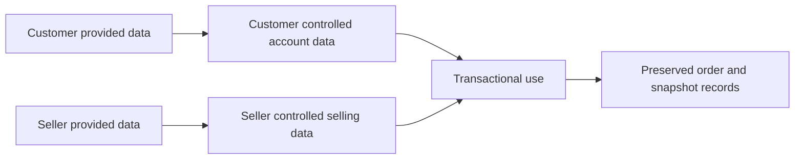

### Data Isolation Between Customers, Sellers, and Administrators

The platform separates customer data, seller data, and administrator oversight data so that each actor works only within the business records relevant to that role.

Customers can access their own account information, saved addresses, cart, wishlist, orders, and reviews, but they do not gain access to another customer’s private profile details, shipping addresses, or order records.

Sellers can access their own seller profile, products, variants, inventory history, snapshots, and the order items they are responsible for fulfilling, but they do not gain access to unrelated seller business data.

When an order contains items from multiple sellers, each seller is isolated to the items, shipment activity, and requests related to that seller’s own products. A seller does not receive another seller’s operational view of the same order.

Customers can view seller profiles because those profiles are public shop information, but customer-owned private data such as phone numbers in customer profiles, saved addresses, and cart contents are not exposed through public product or seller views.

Administrators and super administrators may access data across customers, sellers, products, orders, and requests only for the oversight responsibilities explicitly defined in the system scope. This cross-platform visibility is an administrative exception, not a general sharing model between ordinary users.

Snapshot visibility is also isolated by relevance. Owners may view snapshots of their own editable records, and administrators may view snapshots where platform oversight or dispute resolution requires it.

Products that have been hidden because of seller suspension or removed because of deletion are excluded from customer-facing listings, preventing continued public exposure of records that are no longer intended for active shopping.

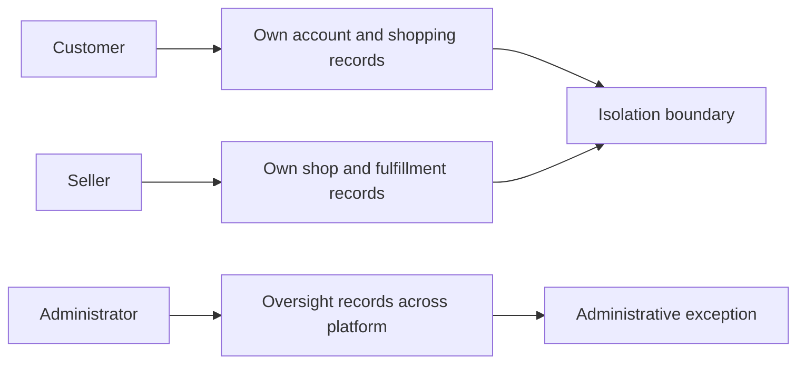

### Access Control to Sensitive and Historical Records

Access to sensitive records follows business relevance rather than open visibility.

Customer authentication is required before using platform features, so private customer data is not available through unauthenticated browsing.

Seller selling activity depends on approval status. Until approved, a seller can monitor approval outcomes and rejection reasons, but cannot use the platform as an active seller.

If a seller is suspended, access is limited to existing order-processing responsibilities. During suspension, the seller may still ship items and respond to cancellation or refund requests for existing orders, but cannot create new products or edit existing products.

If a customer is banned, the customer cannot log in. If a seller is banned, the seller cannot log in, while existing orders remain preserved as business records.

Customers may view full details of their own orders, including shipping address snapshots and shipment tracking information, because those records are part of the customer’s purchase history.

Sellers may view only the order items, shipment information, and request records needed to fulfill or respond for their own products.

Administrators may view pending seller approvals, customer accounts, seller accounts, all products, product snapshots, and all orders as part of platform governance.

Super administrators have additional authority over administrator requests and administrator grade changes, including promotion and demotion actions defined in the administrative scope.

Historical records created for dispute resolution remain visible only to relevant parties. This includes owners of the edited records and administrators acting in an oversight capacity.

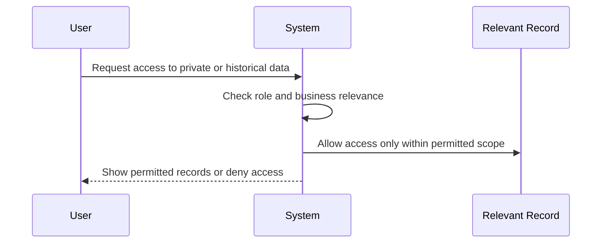

### Privacy Boundaries for Personal and Public Information

The platform distinguishes between public commerce information and private personal information.

Seller shop information is public to customers because customers must be able to identify the shop behind a product and view the seller profile before making a purchase.

Product listing information and review content are public within the shopping experience, subject to the visibility rules already defined for deleted products, suspended sellers, and deleted reviews.

Customer personal information is private by default. Display name and phone number in the customer profile, saved shipping addresses, and order shipping details are not published as public marketplace content.

Shipping address information is used for checkout, order creation, and order fulfillment. Once copied into an order, that address becomes part of the order record and cannot be changed after the order is placed.

Shipment tracking information is visible to the customer for the relevant shipment and to the seller responsible for that shipment, because both parties need it for fulfillment and delivery confirmation.

When a customer account is deleted, preserved reviews no longer disclose the former customer identity and are shown as authored by "deleted user".

Past orders preserve the seller’s shop identity as it existed at purchase time so customers and administrators can understand the historical transaction even if the live seller profile later changes or the seller account is deleted.

Snapshots may contain prior values of editable records and therefore are not treated as public browsing content. They are available only to relevant parties for history review and dispute resolution.

The platform’s privacy model supports necessary sharing for buying, selling, fulfillment, dispute handling, and administration, while preventing ordinary users from browsing unrelated private account or transaction details.

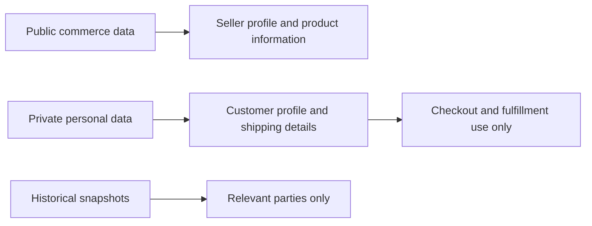

## Data Retention and Recovery

Define what happens to deleted data, how long it is retained, and how users can recover it.

### #### Soft Delete and Historical Preservation

When a customer account is deleted, the platform shall remove the customer’s profile information while preserving the customer’s orders, order history, and reviews needed for seller records, legal purposes, and historical display.

When preserved reviews remain visible after customer account deletion, the review author shall be shown as "deleted user" rather than by the former customer identity.

When a seller account is deleted, the platform shall remove the seller’s products from active listings while preserving past order history, order snapshots, and the seller shop name already recorded in past orders.

When a product is deleted by its seller or by an administrator, the product shall no longer appear in search results or category listings, but its historical snapshots shall remain preserved.

When a category is deleted, products that were assigned to that category shall remain preserved and become uncategorized rather than being removed from historical records.

Historical business records that support money movement, dispute handling, or purchase history shall remain available even when the related customer, seller, or product is no longer active.

Inventory history records shall be treated as preserved stock movement history and shall not be removed as part of product, variant, or account deletion.

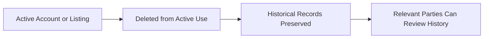

### #### Retention of Immutable Records

Snapshots shall be retained as immutable historical records and cannot be deleted.

Whenever editable data is modified, the previous and new state shall be retained in snapshot history together with when the change was made and what was changed.

Snapshot retention shall apply to products, product variants, seller profiles, order items, reviews, cancellation requests, and refund requests, as defined in the source requirements.

Product snapshot retention shall preserve the complete product state at the time of edit, including product details, images, and the state of all variants at that moment.

Order item retention shall preserve the purchase-time snapshot of the product, variant, and seller profile so that past purchases remain understandable even if later edits or deletions occur.

Shipping address retention for completed purchases shall preserve the order-time shipping address as part of the order record, and that preserved address shall remain unchanged after order placement.

Inventory records shall be retained as immutable stock movement history used to determine current stock from the full sequence of changes.

Retained historical records shall be viewable by relevant parties for dispute resolution where the source requirements grant that visibility.

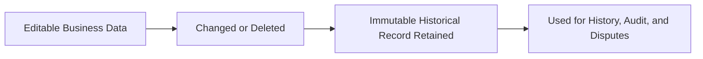

### #### Recovery Through Historical Traceability

Recovery in this platform shall mean recovery of business history and traceable prior state through preserved records, rather than reversal of immutable history.

Relevant parties shall be able to view preserved snapshots when resolving disputes about products, seller profiles, reviews, cancellation requests, or refund requests.

When a product has been edited, the preserved snapshot history shall allow the seller and administrators to review earlier product states even if the current listing has changed.

When an order item is reviewed after purchase, the preserved purchase-time snapshots shall allow the customer, seller, and administrators to understand what product details, variant details, price, and seller identity applied at the time of purchase.

When stock-related disputes arise, the retained inventory history shall allow prior stock changes to be traced through restocking, order placement, cancellation, refund, and adjustment events.

When a customer account has been deleted, preserved orders and reviews shall remain recoverable as historical evidence for recordkeeping and dispute handling, even though the deleted profile information is no longer retained as an active profile.

When a seller account has been deleted, preserved order history and snapshots shall remain recoverable as historical evidence for past transactions.

This recovery policy shall not imply restoration of deleted active listings, deleted profile information, or deleted mutable content back into active use unless such restoration is explicitly supported elsewhere in the requirements.

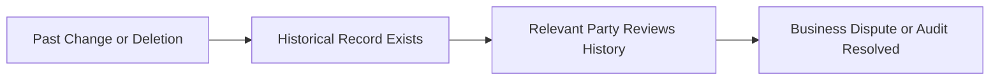

### #### Permanent Deletion Boundaries

Permanent deletion shall apply only where the source requirements explicitly state that information is deleted from active business use.

When a customer deletes an account, the customer profile information shall be permanently removed from active use, but preserved orders, order history, and reviews required by the source requirements shall not be permanently removed.

When a seller deletes an account, the seller’s products shall be deleted from active listings, but preserved order history, order snapshots, and preserved shop identity in past orders shall not be permanently removed.

When a product is deleted, its variants and inventory records shall be deleted from active listing use together with the product, but preserved product snapshots and purchase-time order records shall remain retained.

When a customer deletes a review, the deleted review shall no longer contribute to the product’s average rating, but preserved review snapshots shall remain retained.

Permanent deletion shall not be allowed for snapshots or inventory history records because the source requirements define them as immutable and preserved.

Any deletion policy in this unit shall be interpreted together with the visibility and access rules defined in the data ownership and privacy unit, without restating those permissions here.

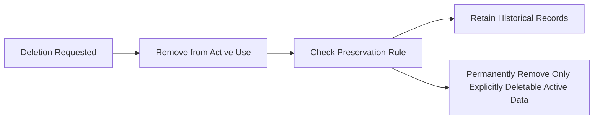

# External Dependency SLOs

Service level objectives for external dependency availability.

## External Dependency SLOs

Define availability expectations, timeout thresholds, and degradation policies for external service dependencies.

### External Payment Dependency Availability

The platform depends on an external payment gateway during payment processing.

The platform treats payment processing as the only business-critical external dependency explicitly identified in scope.

Availability expectations for this dependency are limited to a clear business outcome: a successful payment attempt may create an order, and an unsuccessful or unavailable payment path must not create an order.

If the external payment gateway is unavailable, the platform must preserve the customer’s cart and checkout context so the customer can try payment again later.

A dependency outage must not create a partial purchase record. No order, order item, stock reduction, cart removal, or purchase-time snapshot may be finalized unless payment succeeds.

The unavailability of the payment gateway must not affect browsing categories, viewing products, viewing seller profiles, maintaining wishlists, or managing the shopping cart, because those activities do not require successful payment processing.

The platform should make dependency availability failures visible as payment-processing unavailability rather than presenting them as completed purchases.

Business continuity for seller records and customer order history must be preserved by ensuring that failed or unavailable payment processing does not create misleading order data.

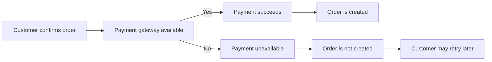

### Payment Timeout Handling

Timeout handling for external payment processing must follow the same business rule as other payment failures: the order is not created unless payment succeeds.

If a payment attempt times out before success is confirmed, the platform must treat the attempt as incomplete from the customer’s perspective and must not create the order.

When a timeout occurs, the customer must be able to retry payment from the preserved checkout state rather than rebuilding the cart.

A timeout must not remove items from the customer’s cart.

A timeout must not decrease stock quantities.

A timeout must not create order items with status paid.

A timeout must not create purchase-time snapshots for product, variant, or seller profile data, because those records belong only to successful purchases.

The platform should present the outcome as an unresolved or failed payment attempt rather than as an accepted order.

The platform may record the payment attempt outcome for business traceability, but customer-facing purchase records must remain absent until payment success is confirmed.

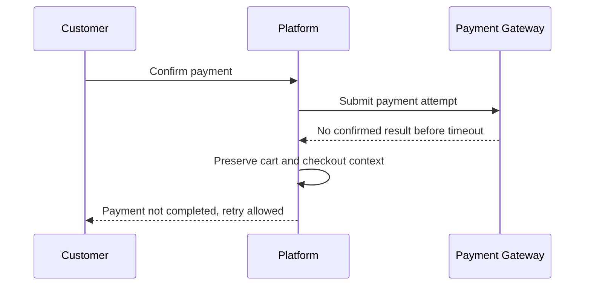

### Degradation Policy for External Dependency Failure

When the external payment dependency is degraded or unavailable, the platform must degrade gracefully by limiting only the payment-dependent part of the customer journey.

Graceful degradation means customers may continue searching products, viewing product details, managing wishlists, maintaining their cart, and reviewing checkout information even when payment cannot be completed.

Graceful degradation also means sellers may continue managing products, inventory history, shipments, cancellation responses, refund responses, and snapshot viewing, unless a specific action requires confirmed payment data.

During dependency degradation, the platform must prevent customers from reaching a business state that implies payment success when no confirmed success exists.

During dependency degradation, the platform must protect data consistency by avoiding any irreversible purchase-side changes until dependency recovery or a confirmed successful retry occurs.

The degradation policy must favor preserving existing business data over creating uncertain transactional records.

If the payment dependency later recovers, the customer must complete a new or retried payment confirmation before order creation proceeds.

The platform must not compensate for dependency degradation by inventing manual order states, placeholder paid states, or provisional completed purchases not defined in scope.

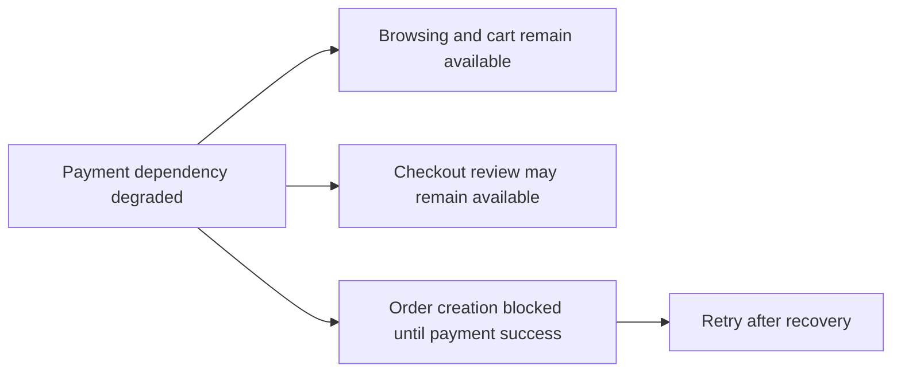

### External Dependency Recovery and Data Integrity

Recovery from external payment dependency issues must prioritize data integrity and traceable business outcomes.

After a dependency interruption, the platform must continue to distinguish between payment attempts and successful orders.

Only a confirmed successful payment attempt may result in order creation, stock reduction, cart item removal, paid item status assignment, and purchase-time snapshot preservation.

If a customer retries payment after a prior failure, timeout, or dependency outage, the later successful attempt may create the order, while prior unsuccessful attempts must remain non-order outcomes.

Recovery handling must preserve the rule that shipping addresses become fixed only after a successful order is placed; an interrupted or failed payment must not create an immutable order shipping address.

Recovery handling must also preserve order-history accuracy by ensuring that customer order lists and seller order-processing views include only successfully created orders.

Any business records created after recovery must reflect the actual confirmed purchase event rather than the earlier failed or unavailable dependency state.

This policy supports dispute resolution by keeping a clear separation between unsuccessful payment attempts and completed purchases with preserved snapshots and order history.

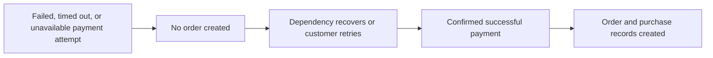

# Storage Capacity

Storage capacity planning and CDN requirements.

## Storage Capacity Requirements

Define storage requirements and capacity planning for file storage.

### Storage Capacity Scope

This specification does not define numeric storage capacity targets, file volume forecasts, or storage growth commitments for the platform. The original requirements only establish that the platform stores customer and seller profile data, shipping addresses, product images, seller logo images, immutable snapshots, inventory history, orders, shipments, reviews, cancellation requests, and refund requests. Storage planning for these records must therefore preserve all required business records without changing the retention and deletion behavior defined in this document.

Because product images, seller logo images, order-related snapshots, and historical change records are part of the required business data, storage allocation must not undermine the platform’s obligation to preserve order history, purchase-time snapshots, immutable snapshots, inventory history, and dispute-related records. Where an account or listing is deleted, the platform must continue to retain the historical records that the original requirements explicitly say must be preserved.

### Content Delivery Network Scope

This specification does not define any content delivery network requirement, distribution rule, caching policy, geographic delivery policy, or media acceleration commitment. Although the platform includes customer-visible media such as product images and seller logo images, the original requirements do not state that a content delivery network must be used.

Any future decision about whether media is delivered directly or through an external distribution layer is outside the scope of this business requirements document. Regardless of delivery method, the business-visible obligations remain the same: product images and seller logo images must remain viewable where the related product or seller profile is active, and preserved historical records must remain available to the relevant parties when the original requirements say those records must be retained and viewable.

### Capacity Change Governance

Because the original requirements do not provide explicit capacity thresholds, the platform must not introduce retention shortcuts or silent data removal in order to manage storage growth. Capacity management decisions must not conflict with the required preservation of immutable snapshots, preserved order history, purchase-time seller and product snapshots, inventory history records, preserved reviews attributed to a deleted user, and preserved cancellation or refund request history.

If storage capacity constraints arise, they must be handled in a way that keeps the required business records intact and does not alter user-visible retention outcomes defined elsewhere in this specification. No additional storage quotas, media limits, archival timelines, or deletion schedules are specified in the source requirements, so none are defined in this section.