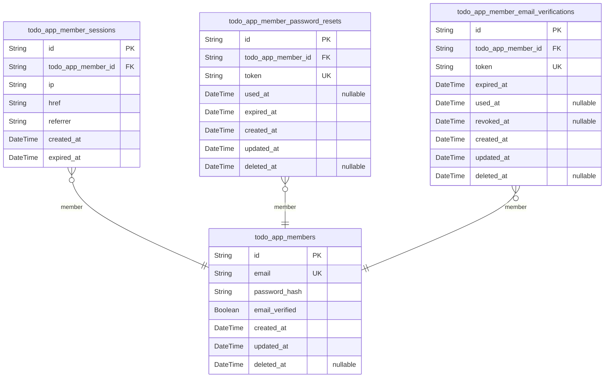
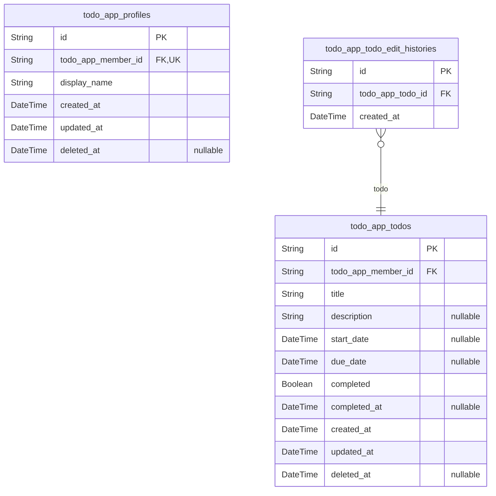

# Prisma Markdown

> Generated by [`prisma-markdown`](https://github.com/samchon/prisma-markdown)

- [Actors](#actors)
- [Todos](#todos)

## Actors

### `todo_app_members`

Registered member account that serves as the authenticated owner of a
private todo workspace.

This actor model stores the member's email-based sign-in identity and
password credential for self-service registration and login. It is the
root ownership record for private profile and todo data, while dependent
authentication records such as sessions, password reset tokens, and email
verification tokens are stored in separate child tables.

The application supports only self-owned access, so each record
represents one private account holder rather than a shared or delegated
identity.

Properties as follows:

- `id`: Primary Key.
- `email`: Unique email address used as the member's sign-in identity.
- `password_hash`: Hashed password credential used to authenticate the member account.
- `email_verified`: Whether the member's email ownership has been verified for the account.
- `created_at`: When the member account was created.
- `updated_at`: When the member account was last updated.
- `deleted_at`: When the member account was soft-deleted, if applicable.

### `todo_app_member_sessions`

Authenticated session records for member accounts in the private todo
application.

Each record belongs to exactly one [todo_app_members](#todo_app_members) account and
captures connection context for a successful sign-in, including client
IP, accessed href, referrer, creation time, and expiration time. The
table supports account-scoped session tracking and
logout/session-lifecycle enforcement without storing unrelated
business-domain data.

Properties as follows:

- `id`: Primary Key.
- `todo_app_member_id`: Owner member account's [todo_app_members.id](#todo_app_members).
- `ip`: Client IP address recorded for this authenticated session.
- `href`: Requested application href associated with session creation.
- `referrer`: Referrer value observed when the authenticated session was created.
- `created_at`: Timestamp when this session record was created.
- `expired_at`
  > Timestamp when this session expires and is no longer valid for
  > authenticated access.

### `todo_app_member_password_resets`

Password reset tokens issued to members for secure account recovery.

This table stores one-time password reset credentials that belong to a
specific [todo_app_members](#todo_app_members) record. Each record represents a reset
issuance event with expiration and consumption tracking so the system can
validate whether a token is still usable.

The table is an authentication support entity rather than a standalone
business resource. Multiple reset records may exist for the same member
over time, enabling auditability and safe recovery workflows without
storing redundant member profile data in this table.

Properties as follows:

- `id`: Primary Key.
- `todo_app_member_id`: Belonged member's [todo_app_members.id](#todo_app_members).
- `token`
  > Unique password reset token presented by the member to prove reset
  > authorization.
- `used_at`
  > Timestamp when the password reset token was consumed. Null means the
  > token has not been used yet.
- `expired_at`: Timestamp after which the password reset token is no longer valid.
- `created_at`: Timestamp when the password reset record was issued.
- `updated_at`: Timestamp when the password reset record was last updated.
- `deleted_at`: Soft deletion timestamp for the password reset record.

### `todo_app_member_email_verifications`

Email verification records for [todo_app_members](#todo_app_members) that prove
ownership of a member email address during registration or later
verification flows.

Each row stores a single issued verification token and its lifecycle
timestamps, including expiration, successful use, and optional
revocation. The table is a supporting authorization artifact rather than
an independently managed business entity, and it maintains a many-to-one
relationship back to the owning member account for auditing and security
workflows.

Properties as follows:

- `id`: Primary Key.
- `todo_app_member_id`: Owning member's [todo_app_members.id](#todo_app_members).
- `token`: Unique email verification token issued to confirm member email ownership.
- `expired_at`
  > Timestamp when the verification token becomes invalid if it has not been
  > used.
- `used_at`
  > Timestamp when the verification token was successfully consumed for email
  > verification.
- `revoked_at`
  > Timestamp when the verification token was invalidated before use due to
  > replacement or security action.
- `created_at`: Timestamp when this verification record was issued.
- `updated_at`: Timestamp when this verification record was last updated.
- `deleted_at`: Soft deletion timestamp for this verification record.

## Todos

### `todo_app_profiles`

Private profile record for a member account within the todo application's
personal workspace.

This table stores profile-specific identity data that is separate from
authentication credentials in [todo_app_members](#todo_app_members). Each profile
belongs to exactly one member through a one-to-one relationship and is
visible only within that member's private account scope.

The model is intentionally minimal and normalized, keeping only profile
attributes such as the display name while account login data remains in
the actor table.

Properties as follows:

- `id`: Primary Key.
- `todo_app_member_id`: Owning member's [todo_app_members.id](#todo_app_members).
- `display_name`: Private display name shown for the member inside the personal workspace.
- `created_at`: Timestamp when the profile record was created.
- `updated_at`: Timestamp when the profile was last updated.
- `deleted_at`
  > Soft deletion timestamp for the profile record when it becomes inactive
  > or is removed through account lifecycle handling.

### `todo_app_todos`

Private todo items owned by a registered member within the personal todo
workspace.

This table stores the core task data that members directly create,
browse, update, complete, move to trash, restore, and permanently remove.
Each todo belongs to exactly one [todo_app_members](#todo_app_members) record and
remains private to that owner.

The model keeps only atomic task attributes and lifecycle state needed
for active-list and trash behavior. Historical edit details are
intentionally excluded from this table and belong in the separate child
history model linked through this todo.

Properties as follows:

- `id`: Primary Key.
- `todo_app_member_id`: Owner member's [todo_app_members.id](#todo_app_members).
- `title`: Required task title shown in the member's private todo lists.
- `description`
  > Optional longer task description entered by the member for additional
  > details.
- `start_date`: Optional planned start date and time for the todo.
- `due_date`: Optional due date and time for the todo.
- `completed`: Whether the todo is currently marked as completed.
- `completed_at`: Timestamp when the todo was most recently marked completed.
- `created_at`: When the todo was originally created.
- `updated_at`: When the todo was last updated.
- `deleted_at`
  > When the todo was moved to trash. Null means the todo is still in the
  > active list.

### `todo_app_todo_edit_histories`

Chronological edit history records for a member-owned todo.

Each row captures one recorded edit event for a specific {@link
todo_app_todos.id} so the application can list a todo's edit timeline in
chronological order. This table is a historical child entity of the todo
and keeps only child-specific audit data rather than duplicating parent
todo fields.

History rows remain associated with the parent todo while it exists, and
their lifecycle is expected to follow the parent todo and owning account
through cascade policies managed by parent entities.

Properties as follows:

- `id`: Primary Key.
- `todo_app_todo_id`: Parent todo's [todo_app_todos.id](#todo_app_todos).
- `created_at`: Timestamp when this history entry was created as the recorded edit event.
