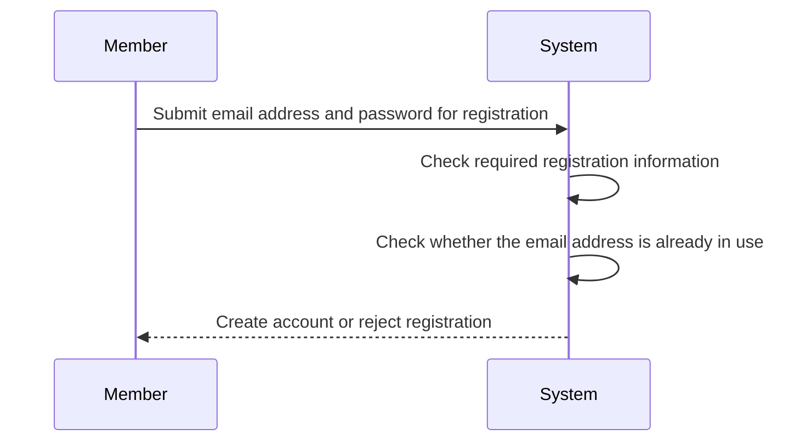
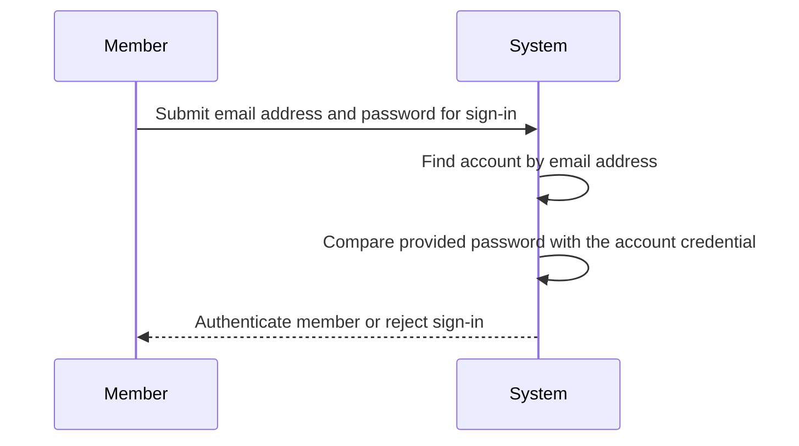
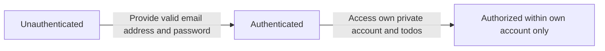
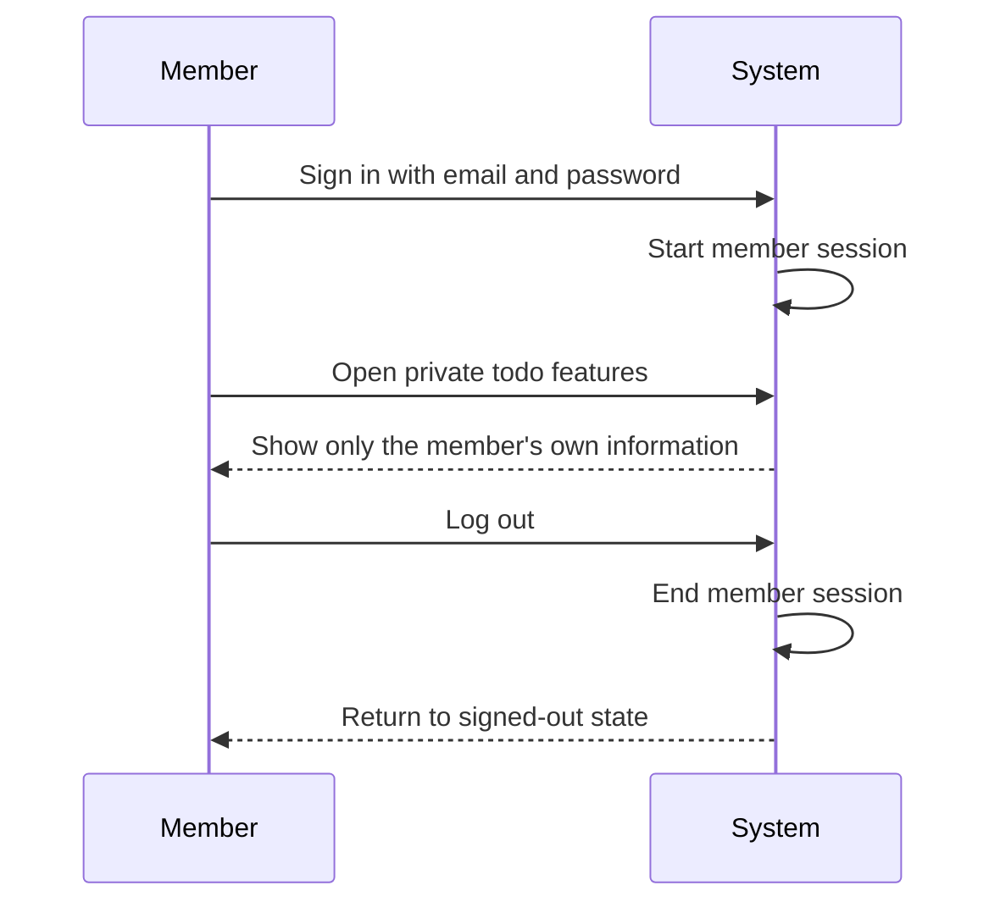
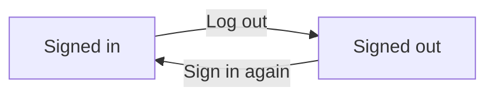

**todoApp — Actor definitions, permission matrix, authentication, session, account lifecycle**

Actor definitions, permission matrix, authentication, session, account lifecycle

# Actor Definitions

Define all user actor types with their identity, permissions, and access boundaries.

## member Actor

The member is the only end-user actor in this private todo application. A member represents an individual account owner who uses an email-based account to access personal todo and profile information. The member acts on their own behalf and is not granted any administrative, supervisory, or shared-workspace role. The member may access their own profile information and their own todo-related information within the application. This actor's scope is limited to resources that belong to the same account, including the member's own todo records and the edit history associated with those records. The member is not permitted to view another person's profile, todo list, individual todo details, deleted todo items, or edit history. The application does not provide the member with any role that allows browsing, searching, or monitoring other users' information. Because the product is private by design, the member's boundaries are strictly self-service and self-owned content only.

### Member Identity and Role Scope

The member is the single end-user actor in the application.

A member is an email-based account owner who uses the application for personal todo management.

The member acts only on their own behalf and is a self-service account holder.

The application does not define any additional end-user actor for shared use, delegated use, or supervisory use.

The member uses the application as a private todo application user rather than as part of a group, team, or shared workspace.

The member's role is limited to content and account areas that belong to the same account.

The member is not assigned any role that allows acting for another user.

The member is not assigned any role that allows reviewing, approving, or managing another user's information.

### Member Access Boundaries for Profile and Todo Information

The member may access only their own profile information.

The member may access only their own todo information.

The member may access only their own deleted todo information in trash.

The member may access only the edit history associated with their own todo items.

The member is not permitted to view another user's profile information.

The member is not permitted to view another user's todo list.

The member is not permitted to view another user's individual todo details.

The member is not permitted to view another user's deleted todo items.

The member is not permitted to view another user's todo edit history.

The application shall treat the member's accessible information as self-owned content only within this actor scope.

### Excluded Roles and Non-Shared Access Model

The application does not provide the member with any shared access role.

The application does not provide the member with any administrative role.

The member cannot browse other users through any role-based capability.

The member cannot search for other users' profiles or todo-related information through any role-based capability.

The member cannot monitor, oversee, or audit other users' activity through any role-based capability.

The member's permissions do not expand beyond the boundary of their own account.

The member's authority remains limited to self-owned content and does not include shared ownership, delegated ownership, or organization-wide access.

# Authentication Flows

Registration, login, logout, and session management from a user perspective.

## Registration and Login

Define user registration and login flows including validation and error handling.

### Registration

Members can register for the private todo application by providing an email address and a password.

A successful registration creates a new user account for the person who submitted the email address and password.

The registered account is the account owner for all todos and profile information created under that account.

Registration is a self-service action available to people who do not yet have an account.

If the email address or password required for registration is not provided, registration is rejected.

If the email address is already associated with an existing account, registration is rejected.

After registration succeeds, the member can use the same email address and password to sign in.

### Login

Members can sign in by providing the email address and password associated with their account.

A successful sign-in authenticates the member as the owner of that account.

After authentication succeeds, the member can access only the private todo data and profile information that belong to that account.

The system shall not allow sign-in with credentials from a different account to access another member's data.

If the email address required for sign-in is not provided, sign-in is rejected.

If the password required for sign-in is not provided, sign-in is rejected.

If the provided email address does not match an existing account, sign-in is rejected.

If the provided password does not match the account identified by the email address, sign-in is rejected.

### Authentication Scope

Authentication establishes whether a member is the legitimate owner of a user account.

Only an authenticated member can access the private todo application.

Authentication applies to account-based access using email address and password.

Once authenticated, a member can act only within the account that was authenticated.

A member cannot use authentication to view another member's profile.

A member cannot use authentication to view, access, or share another member's todos.

All todo lists, individual todos, trash contents, and edit history visible after authentication are limited to the authenticated member's own account.

If a request is made without successful authentication, access to private account information and private todo information is rejected.

## Session and Logout

Define session behavior and logout from a user perspective.

### Session

A signed-in member has an active session that allows access to their private todo application without repeating the login step on every action.

The system keeps the session associated only with the member who signed in.

The system allows a member with an active session to access only their own account, profile, todos, deleted todos, and edit history.

The system does not allow a session to be used to view or access another member's profile or todos.

If a member does not have an active session, the system does not allow access to member-only areas of the application.

If a member's session is no longer active, the member must sign in again to continue using member-only features.

A session ends when the member logs out.

### Logout

A signed-in member can log out of the application.

When a member logs out, the system ends the current session for that member.

After logout, the system no longer treats the member as signed in.

After logout, the member cannot continue to access member-only areas unless they sign in again.

Logout does not delete the member account, profile, todos, deleted todos, or edit history.

Logout does not change the completion status, dates, description, or other content of any todo.

If a member attempts to use member-only features after logout, the system rejects access until the member signs in again.

### Account Security

Authentication for account access is based on the member's email and password.

The system allows a member to use only their own account to access the private todo application.

The system does not provide any way for a member to browse, open, or share another member's profile or todos.

The system keeps each member's session separate so one member's signed-in access does not expose another member's information.

The system applies the same privacy restrictions during an active session and after a member returns to the application within that session.

If a member is not authenticated, the system does not allow access to private account information or private todo information.

If a member tries to reach information that belongs to another member, the system rejects that access.

Account security rules in this section define access protection for signed-in use. Password change and account deletion are defined in the account management unit.

# Account Lifecycle

Account creation, deletion, and password management.

## Account Management

Define how users create accounts, delete accounts, and change passwords.

### Account Creation

A member can create an account using an email address and password.

The system creates the account only when both the email address and password are provided.

Each created account belongs to a single member and becomes the owner of that member's private todo data.

After account creation, the member can use the created email address and password to access the private todo application as defined in Registration and Login.

A newly created account includes one profile for the account owner.

The profile created with the account contains a display name.

Account creation does not grant access to any other member's profile or todos, because the application is private to each account owner.

### Account Deletion

A member can permanently delete their own account.

When a member deletes their account, the account is removed from the application.

When a member deletes their account, all todos owned by that member are permanently deleted.

Account deletion permanently removes both active todos and todos currently in trash.

When a todo is permanently deleted as part of account deletion, its edit history is also permanently deleted.

After account deletion is completed, the deleted account can no longer be used to access the application.

A member cannot delete another member's account.

### Password Change

A member can change the password of their own account.

Password change applies only to the account owned by the member who is performing the action.

After the password is changed, the member must use the new password for future authentication as defined in Registration and Login.

Changing a password does not change the member's email address.

Changing a password does not alter the member's profile, todos, trash contents, or todo edit history.

A member cannot change the password for another member's account.