**todoApp — Business concepts, relationships, and states from user perspective**

Business concepts, relationships, and states from user perspective

# Domain Concepts

Describe what each concept means in the business domain and its key attributes.

## User Concept

A User is the account owner within this private todo application. The User is identified in business terms by an email-based sign-in identity and a password credential used to access the account. Each User represents a single person who manages a private set of todos that cannot be seen by other users. The User is also the owner of a personal profile that contains a display name. Privacy is a defining characteristic of this concept, because each User is limited to their own account space and their own todo information. The User concept includes account ownership responsibility over active todos and deleted todos that may still exist in trash. When a User no longer exists in the business domain, all of that user's todos, including trashed todos, are considered permanently removed as well. This concept is therefore the central owner and boundary for all private todo information in the application.

### User as Account Owner

The User represents the account owner in this private todo application. Each User corresponds to a single person who controls one private account space within the application. The User is the central business owner for all information kept within that account space.

The User is identified for sign-in by an email-based identity. The User also has a password credential that belongs to that same account and is used to access it. Together, these account attributes distinguish one User from another at the business level.

A User is not a shared or group identity. The application treats each User as the sole owner of that account space and of the todo information held within it.

The User also owns one personal profile, which is defined in the Profile Concept. That profile exists as part of the same private account space and is not a public identity visible to other users.

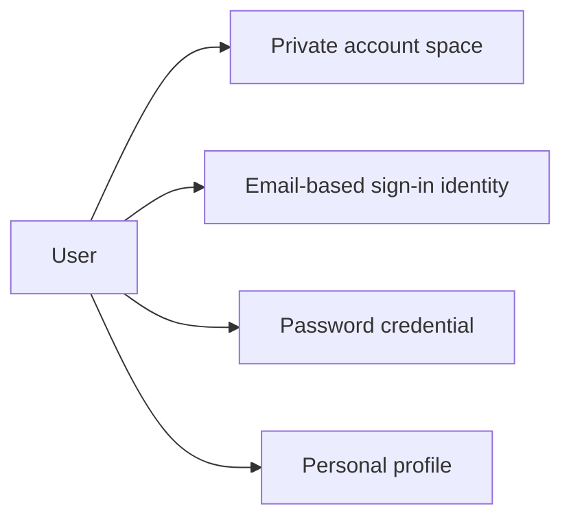

### User Ownership Boundary for Todos

The User defines the ownership boundary for todo information in the application. Every todo belongs to one User only, and that ownership is single-user ownership rather than shared ownership.

Within the User's account space, the User is the owner of active todos that appear in the normal todo list. The same User is also the owner of deleted todos that remain in trash after soft deletion. Deletion from the normal list does not transfer ownership away from the User.

This ownership boundary is private. A User's todos are contained within that User's own account space and are not part of any other User's account. The User therefore acts as the business boundary that separates one person's todo information from another person's todo information.

The details of the Todo concept are defined in the Todo Concept, and relationship structures are defined in Conceptual Relationships. In this section, the User is the business owner under which those todo records exist, whether active or deleted.

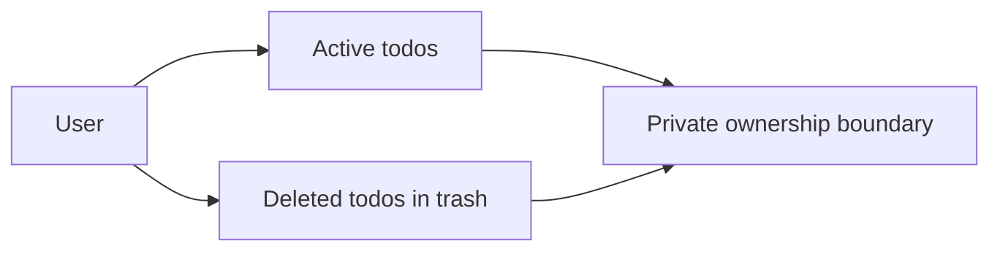

### Private Access Boundary and Account-Wide Removal

The User concept includes a strict private access boundary. A User's account space exists for that User's own todo information and personal profile only. Other users are outside this boundary and do not belong within that account space.

Because the User is the central owner of the account space, the existence of active todos and deleted todos depends on the continued existence of that User in the business domain. If the User no longer exists, the account is considered removed as a whole rather than partially retained.

Account-wide permanent removal means that when a User account is permanently deleted, all todos owned by that User are considered permanently removed as well, including todos that were still in trash at the time of removal. The User's ownership scope therefore ends in a complete removal of private todo information for that account.

Lifecycle and retention behavior is defined in Lifecycle and Retention. In this section, the key domain meaning is that the User is the top-level owner whose removal ends the business existence of the account's todo information.

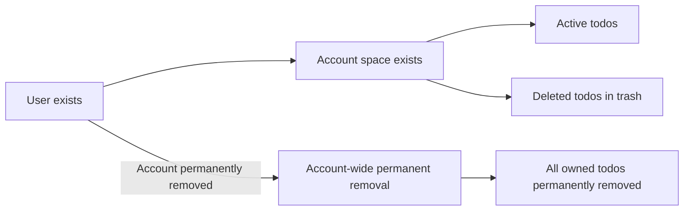

## Profile Concept

A Profile is the personal identity record associated with a User inside the application. Its business role is to hold the User's display name. The Profile exists only for the account owner and is not a public-facing identity within the product. In this private todo application, the Profile is intentionally limited in scope and does not represent a social or shared presence. The defining attribute of the Profile is the display name used to represent the User within their own account context. A Profile belongs to one User and is not available for viewing by other users. This concept supports personal identification without changing the private nature of the application. The Profile therefore serves as a minimal, private representation of the account owner.

### Profile as a Private Identity Record

The Profile is the personal identity record associated with a User inside the application. Its purpose is limited to representing the account owner within their own private todo space rather than creating a public-facing identity.

The Profile is intentionally minimal in scope. It exists to hold the account owner's personal identity information for use within the application and does not represent a social profile, shared persona, or discoverable user presence.

The Profile is non-public user identity information. It is not intended for exposure to other users and does not create any shared or visible presence across accounts.

The Profile supports personal identification while preserving the private nature of the application. In business terms, it is a private display name record for the account owner and nothing more.

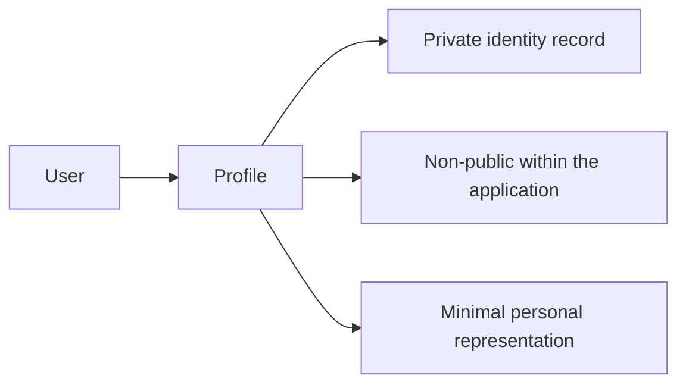

### Display Name Attribute

The defining attribute of the Profile is the display name. The display name is the value used to represent the User within their own account context.

The display name belongs to the Profile rather than standing alone as an independent business concept. It is the Profile's primary identifying value and serves as the Profile's private identity label.

Within the Profile concept, the display name is a private attribute. Its role is to identify the account owner in their own application context without changing the application's private, single-user character.

No additional profile attributes are part of this concept beyond the display name as defined in this section.

### Account-Owner Ownership and Visibility

A Profile belongs to one User. Each Profile is tied to a single account owner and exists only in relation to that User.

The Profile is an account-owner profile, meaning it represents only the owner of the associated account and is not a shared record between users.

Profile visibility is limited to the same account context as the owning User. In business terms, this is single-user profile visibility: the Profile is available only within the owner's private application space and is not available for viewing by other users.

Because the application is private by design, the Profile does not function as public profile information. Its visibility remains restricted to the account owner, reinforcing that it is a non-public identity record tied to one User.

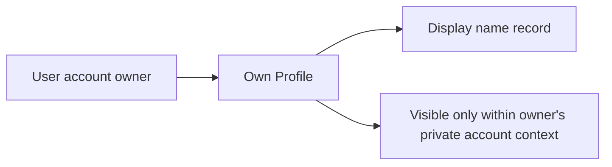

## Todo Concept

A Todo is the core work item a User keeps in the application. It represents a single personal task or reminder owned by one User within that user's private account space. The defining business attributes of a Todo are its title, description, start date, due date, completion status, and creation date. The title is the primary identifying text of the item, while the description provides fuller detail when needed. Start date and due date are optional planning attributes, so a Todo may exist with either date, both dates, or neither date. Completion status expresses whether the Todo is incomplete or complete, with newly created items beginning as incomplete. Creation date distinguishes when the Todo entered the user's list. A Todo can also be in a deleted state where it is removed from the normal list and represented instead as a deleted item in trash until permanently removed or restored. This concept therefore combines task details, planning dates, visibility within normal or trash views, and simple completion state for a private personal task.

### Todo as a Personal Private Task

A Todo is a personal task item that represents a single task or reminder kept by a member in the application. Each Todo belongs to one user only and exists within that user’s private account space. It is a private task record, which means it is part of the owner’s personal task collection and is not visible as another user’s information.

This concept is centered on individual ownership. A Todo is not a shared item, group item, or public record. Its business meaning comes from being one user’s own task entry, maintained for that user’s private use.

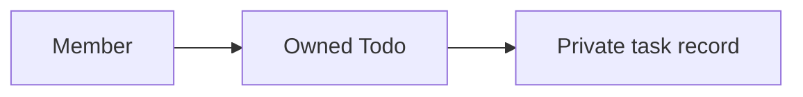

### Todo Business Attributes

A Todo is identified and described through a small set of business attributes. The title is required and serves as the primary identifying text for the task. The description is optional and may be left empty when no further detail is needed.

A Todo may also include a start date and a due date. Both of these planning attributes are optional. A Todo may therefore have a start date only, a due date only, both dates, or neither date.

The Todo carries a completion status with two business meanings: incomplete or complete. Newly created items begin as incomplete by default. The Todo also carries a creation date, which records when the item first entered the user’s todo collection.

These attributes together define what the Todo is from the user’s perspective: a required task name, optional detail, optional planning dates, a simple completion state, and the date the item was created.

### Todo Presence in Normal List and Trash

A Todo can appear in one of two business visibility forms for its owner. In its active form, it is a normal list item that appears in the user’s regular todo list. In its deleted form, it is a deleted todo in trash and no longer appears in the normal list.

The deleted form does not change the Todo into a different business concept. It remains the same Todo owned by the same user, but it is represented within trash instead of the normal list. This distinction allows the business domain to recognize both active personal tasks and deleted personal tasks as part of the Todo concept.

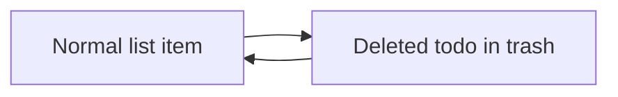

## TodoEditHistory Concept

A TodoEditHistory is the business record of a change made to a Todo. It exists to preserve what edited values were recorded for that Todo over time. Each history entry is tied to one specific edit event and captures when the edit was made. The concept can include the changed title value, changed description value, changed start date value, and changed due date value when those parts of the Todo were updated. Because only changed values are recorded, a history entry may contain some changed attributes and omit others. The history for a Todo is understood as a chronological record presented from most recent to oldest. This concept belongs to the same private ownership boundary as the Todo it describes, so only the owning User has visibility into it. When a deleted Todo is permanently removed from trash, its edit history is also considered permanently removed. TodoEditHistory therefore represents the trace of business-visible edits to a private task over time.

### TodoEditHistory as the Record of Todo Edits

TodoEditHistory represents the business record of changes made to a Todo over time. It exists to preserve the visible result of each edit so the owner can understand how a Todo has changed.

A TodoEditHistory entry represents one single edit event for one Todo. It is not a summary of multiple edits and it does not describe more than one Todo.

Each entry includes the moment when the edit was made. This edit timestamp identifies when that specific change occurred in the life of the Todo.

The history belongs to the same Todo throughout its existence. Because of that relationship, the history is understood as part of the Todo's own business record rather than as a separate independent concept.

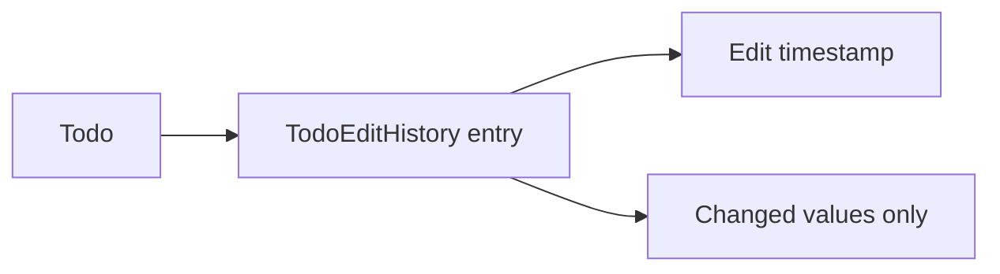

### Changed Values Captured in a History Entry

A TodoEditHistory entry captures only the values that were changed during that edit event. If part of the Todo was not updated, that unchanged part is not recorded in that entry.

When the title is updated, the entry records the changed title value.

When the description is updated, the entry records the changed description value.

When the start date is updated, the entry records the changed start date value.

When the due date is updated, the entry records the changed due date value.

Because only changed values are recorded, a single history entry may include one changed value or several changed values, depending on what was edited at that time.

This means different entries for the same Todo may contain different combinations of changed attributes while still representing the same concept: the recorded outcome of one edit event.

### Chronology, Privacy, and Removal of History

The edit history for a Todo is understood as a chronological record presented from most recent to oldest. The newest edit appears first, followed by earlier edits in descending order of when they were made.

TodoEditHistory is a private edit record. It remains within the same private ownership boundary as the Todo it describes, so only the owning User has visibility into it.

The history has meaning only in relation to its Todo. If a Todo is soft deleted, its history continues to belong to that deleted Todo while it remains in trash.

If that deleted Todo is permanently removed from trash, its TodoEditHistory is also permanently removed. The history does not continue to exist once the related Todo has been permanently deleted.

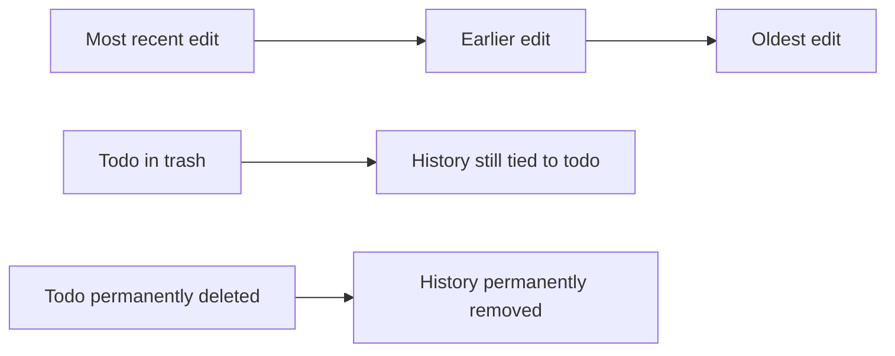

# Domain Relationships

Describe how concepts relate to each other from a business perspective.

## Conceptual Relationships

Describe how concepts relate to each other in business terms.

### User, Profile, and Todo Ownership Relationships

A user represents one private account space within the application.

Each user has one profile, and that profile belongs only to that user. The profile exists as the personal identity record for the account owner and is not shared with or exposed to other users.

Each user owns many todos. Every todo belongs to exactly one user and is part of that user's private todo collection. A todo cannot belong to multiple users, and there is no shared ownership of a todo.

Ownership determines the business boundary of the application: a user's account, profile, and todos are grouped together as that user's private data space.

When a user views their information, the profile and todos associated with that account are the only profile and todo records relevant to that user.

The relationship structure is shown below.

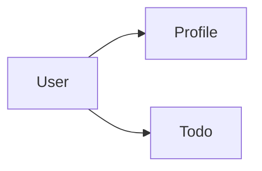


### Todo and Edit History Association

Each todo has many edit history entries. These entries represent the recorded changes made to that todo over time.

Each edit history entry belongs to exactly one todo. An edit history entry cannot exist independently of a todo and cannot be associated with more than one todo.

The association between a todo and its edit history preserves the business record of changes for that specific todo only.

A todo's edit history is part of the same ownership chain as the todo itself. Because the todo belongs to one user, all edit history entries linked to that todo are part of that same user's private data.

Users view edit history in the context of an individual todo. The history does not form a separate standalone business object from the user's perspective; it is a supporting record attached to the todo it describes.

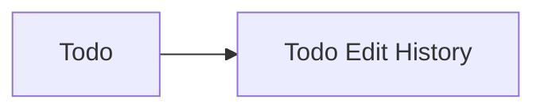

### End-to-End Privacy and Containment Relationships

The application is organized around strict containment of data within a single user's private account space.

A profile belongs to one user, each todo belongs to one user, and each todo edit history entry belongs to one todo that is already owned by that same user. This creates a continuous ownership path from the user to all related business records.

Because of this ownership model, users cannot view or access another user's profile, todos, or todo edit history.

There is no business relationship that connects one user's todos to another user's account. There is also no sharing relationship between users for profiles, todos, or edit history.

This containment model ensures that all business concepts in the application remain associated with a single account owner and are isolated from every other user.

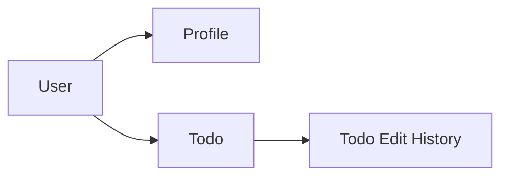

## Lifecycle and Retention

Describe concept lifecycle states and transitions only. Detailed retention/recovery policies belong in 05-non-functional. Operation details belong in 03-functional-requirements.

### Todo Lifecycle

A todo moves through three business dimensions during its lifetime: existence, completion status, and list placement.

A newly created todo begins as an active todo and is incomplete by default. While active, it belongs to the user's normal todo list and may be viewed, edited, and have its completion status toggled between incomplete and complete.

Completion status does not create a separate type of todo. A complete todo and an incomplete todo remain the same business concept, with only the completion state changed.

When a user deletes a todo, the todo does not end immediately. Instead, it moves from the active list to the trash as a deleted todo. In this deleted state, it no longer belongs to the normal todo list.

A deleted todo may follow one of two next transitions. It may be restored, in which case it returns from trash to the normal todo list as the same todo. It may also be permanently deleted, in which case the todo lifecycle ends and the todo no longer exists in the application.

The todo's edit history follows the todo through its active and deleted states until permanent deletion occurs.

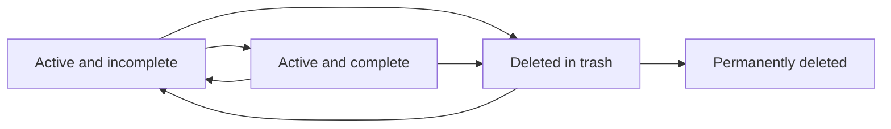


### Account and Owned Data Lifecycle

A user account is the business owner of one profile and many todos. The account lifecycle therefore governs the lifecycle of all user-owned data.

While the account exists, the user keeps a private profile and may own active todos, deleted todos in trash, and edit history connected to those todos.

When the account owner deletes the account, the account lifecycle ends permanently. This action also ends the lifecycle of all todos owned by that user, including todos that are still active and todos already placed in trash.

Edit history does not continue independently after account deletion. Because each history entry belongs to a todo, and each todo belongs to the deleted account, all such history ends together with the account-owned data.

This relationship means the application treats account deletion as the final business endpoint for the user, the user's profile, the user's todos, and the edit history associated with those todos.

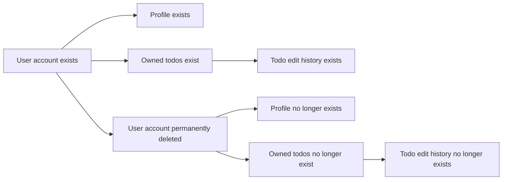


### Deletion, Recovery, and Retention Boundaries

Deletion in this application has two business meanings: removal from the active working list and permanent removal from the application.

The first meaning is soft deletion of a todo. Soft deletion changes the todo from an active item into a trash item. In this state, the todo is retained by the application and remains recoverable through restoration.

Recovery applies only to deleted todos that still exist in trash. Restoring a deleted todo returns that same todo from trash to the normal todo list. The todo is not recreated as a new item; it continues as the original todo within the user's private collection.

The second meaning is permanent deletion. A todo that is permanently deleted is no longer retained by the application. Its associated edit history is also no longer retained because the history belongs to that todo.

Permanent deletion of a user account is also final. When the account is permanently deleted, all owned todos, including those in trash, are permanently removed together with their edit history.

This file defines the lifecycle boundary between retained, recoverable data and data whose lifecycle has ended. Detailed retention and recovery policies are defined in 05-non-functional.

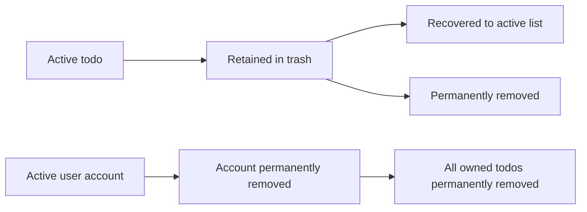

# Business Categories and State Flows

Business category classifications and state flow definitions.

## Business Category Definitions

Define all business category classifications with their allowed values and descriptions.

### Todo Completion Status Category

The Todo concept includes a completion status category with exactly two allowed values: incomplete and complete.

- Incomplete means the todo is not yet finished.
- Complete means the todo has been finished.
- Every newly created todo starts in the incomplete value.
- The completion status expresses the current business state of the todo as seen in todo lists and todo details.
- The completion status category is a simple two-state classification with no intermediate values.

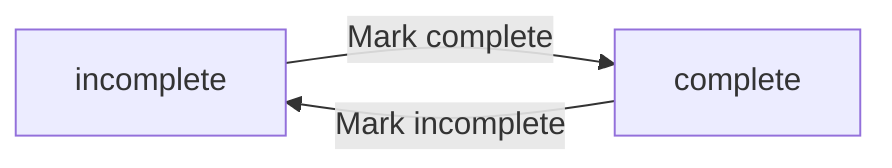

### Todo Visibility Category

A todo belongs to one of two business visibility categories based on whether it is active or deleted.

| Allowed value | Description |
|---|---|
| Active todo | A todo that appears in the normal todo list and can be managed as part of the user's current work. |
| Deleted todo | A todo that has been soft deleted, no longer appears in the normal todo list, and appears in the trash list instead. |

This category describes where the todo is located from the user's perspective rather than whether the todo is complete. A restored todo returns from the deleted category to the active category. A permanently deleted todo no longer exists as a business record.

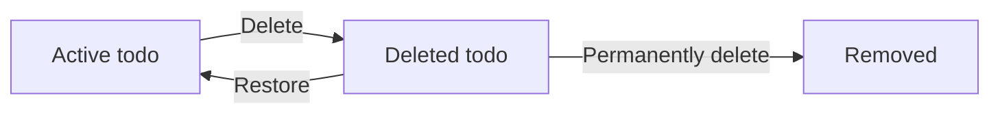

### Todo Edit History Change Category

The TodoEditHistory concept classifies each recorded change by the todo detail that was updated during an edit event. The allowed change categories are title change, description change, start date change, and due date change.

- A title change category records the new title when the title was edited.
- A description change category records the new description when the description was edited.
- A start date change category records the new start date when the start date was edited.
- A due date change category records the new due date when the due date was edited.
- A single history entry may contain one or more of these change categories when multiple todo details are updated in the same edit.
- Every history entry also includes when the edit was made.
- History entries are conceptually ordered from most recent to oldest when viewed.

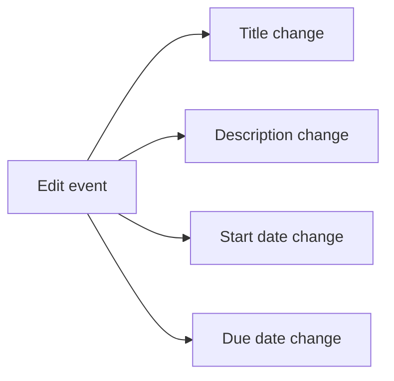

## State Transitions

Define valid state transition paths for stateful concepts.

### Todo Completion State Flow

A todo moves between two completion states: incomplete and complete. A newly created todo begins in the incomplete state. The member can change the completion state in either direction, making this a simple two-state workflow rather than a one-way progression. The completion state is part of the todo concept and is independent of whether optional dates are present.

This state flow represents status-change only for task completion. Other changes to the same todo, such as updates to title, description, start date, or due date, do not create additional completion states. Those edits affect the todo's details while the todo remains either incomplete or complete.


### Todo Visibility Workflow Between Active List and Trash

A todo has a visibility workflow that determines whether it appears in the normal todo list or in trash. In its normal active condition, the todo is part of the member's main collection of todos. When the member deletes the todo, it transitions out of the active list and into trash. While in trash, the todo remains the same business item but is treated as deleted from the member's normal working list.

A deleted todo can transition back from trash to the active list through restore. This return places the same todo back into the normal todo list. A todo in trash can also reach a terminal end state through permanent deletion. Once permanently deleted, the todo no longer exists as a recoverable todo item.

This workflow is separate from completion status. A todo may be complete or incomplete before it is deleted, and moving it to trash does not define a new completion status.

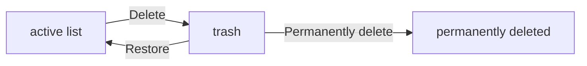


### Todo Edit History Progression

Each todo has an edit history that progresses through a sequence of edit events over time. At the moment a todo is first created, it may have no edit history entries. Each time the member edits the todo's title, description, start date, or due date, the todo transitions to a new recorded version in business terms, and a new history entry is added to represent that edit event.

The history workflow is cumulative. Newer edit events do not replace older ones; instead, they are added to the history for the same todo. The member views this progression as a reverse-ordered timeline, with the most recent edit first and older edits following. Each history entry belongs to one todo and represents one editing moment within that todo's lifecycle.

If a todo is permanently deleted from trash, its edit history reaches the same endpoint because the history exists only as part of that todo's existence.

```mermaid
flowchart LR
    A["todo created"] -->|"Edit details"| B["history entry added"]
    B -->|"Edit again"| C["newer history entry added"]
    C -->|"View history"| D["most recent to oldest"]
```


### User Account Lifecycle Transition

The user account follows a simple lifecycle from active ownership of a private todo space to permanent removal. While the account is active, the member can manage account credentials, maintain a profile display name, and own todos and related edit history. Account deletion is a terminal transition in the business lifecycle.

When the member deletes the account, the account does not move into a recoverable intermediate state in this domain model. Instead, the account transitions directly from active to permanently deleted. Because the user's todos, deleted todos in trash, profile, and todo edit history exist within that account ownership context, they end with the account as part of the same overall lifecycle conclusion.

This lifecycle defines the end state of account ownership and private todo ownership. Detailed retention and recovery policy is defined in the non-functional file.

```mermaid
flowchart LR
    A["active account"] -->|"Delete account"| B["permanently deleted account"]
```