**todoApp — What operations users can perform, use cases, business workflows**

What operations users can perform, use cases, business workflows

# Core Business Operations

What the system must do for each business concept.

## User Operations

A person can create an account by signing up with an email address and password to access the private todo application. An existing account holder can log in with the same credentials to reach their own workspace and no one else's data. The account owner can change their password while keeping the same account and personal todo space. User operations must ensure that each person can access only their own account context and cannot act as another user. The application must support account deletion initiated by the account owner. When an account is deleted, all of that user's todos are permanently removed, including todos that were already in trash. The deletion outcome also removes the user's related todo edit history because permanently deleted todos no longer retain history. If sign-up or log-in details are invalid, the system must reject the action and keep the account state unchanged. If a person is not authenticated, they cannot perform account-specific operations such as changing a password or deleting the account.

### Account Sign Up

WHEN a person provides an email address and password to create an account, THE todoApp SHALL create a new User account for that person.

WHEN a User account is created, THE todoApp SHALL establish that account as a private account for the account owner.

WHEN sign up succeeds, THE todoApp SHALL place the new account owner into that account's own private context.

IF sign-up details are invalid, THEN THE todoApp SHALL reject the sign-up action.

IF sign-up details are invalid, THEN THE todoApp SHALL keep the account state unchanged.

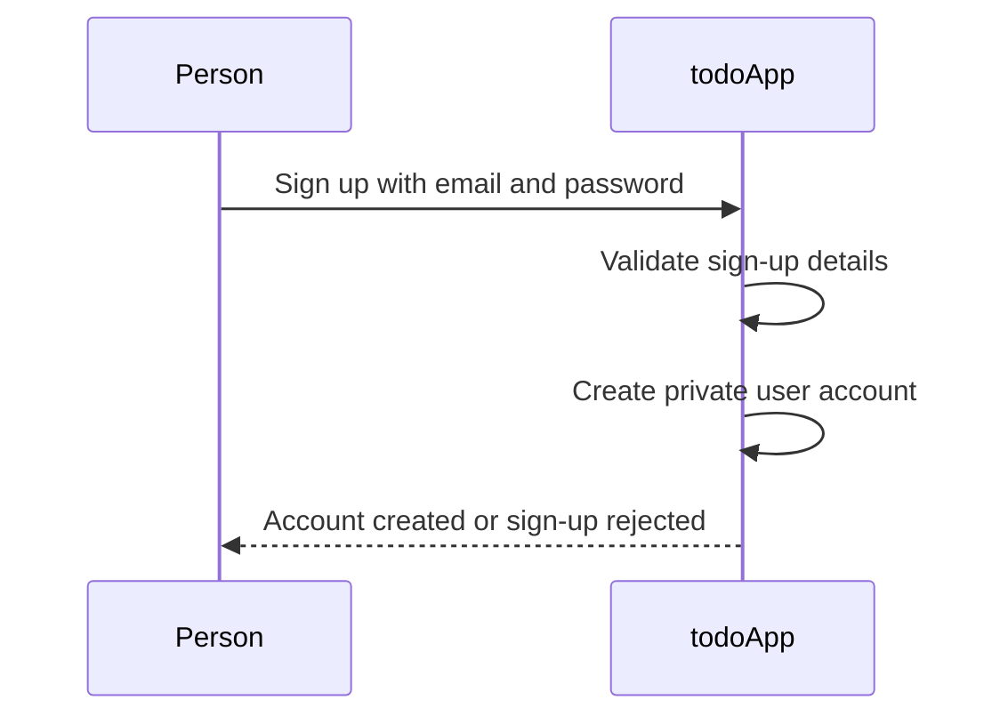

### Account Log In

WHEN an existing account holder provides an email address and password to log in, THE todoApp SHALL authenticate that person into their User account.

WHEN log in succeeds, THE todoApp SHALL give the account holder access to their own private account context only.

WHEN log in succeeds, THE todoApp SHALL prevent the account holder from reaching any other user's account context.

IF log-in details are invalid, THEN THE todoApp SHALL reject the log-in action.

IF log-in details are invalid, THEN THE todoApp SHALL keep the account state unchanged.

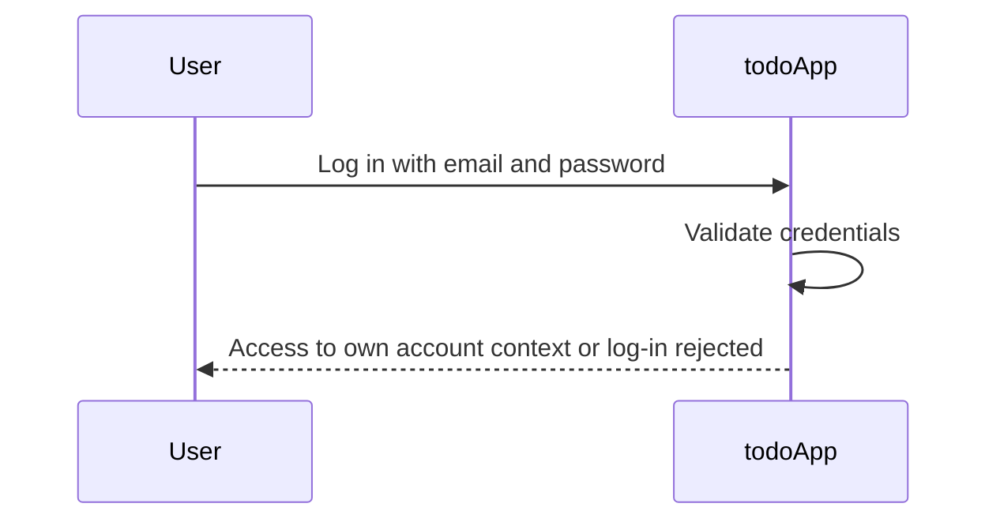

### Password Change

WHEN an authenticated account owner requests a password change, THE todoApp SHALL allow that account owner to replace the current password for the same User account.

WHEN a password change succeeds, THE todoApp SHALL keep the account owner's existing User account.

WHEN a password change succeeds, THE todoApp SHALL keep the account owner's personal todo space associated with that same User account.

IF a person is not authenticated, THEN THE todoApp SHALL not allow that person to change a password.

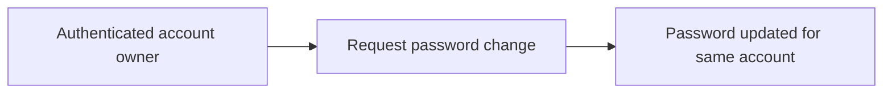

### Private Account Access

THE todoApp SHALL treat each User account as a private account.

WHEN a User accesses the application, THE todoApp SHALL restrict that User to the User's own account context only.

THE todoApp SHALL not allow a User to act as another user.

THE todoApp SHALL not allow a User to access another user's account context.

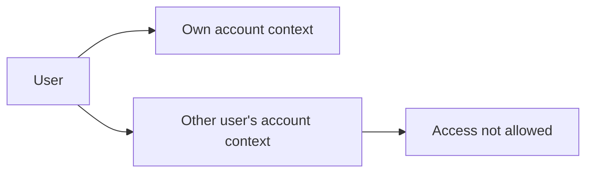

### Account Deletion

WHEN an authenticated account owner requests account deletion, THE todoApp SHALL permanently delete that User account.

WHEN a User account is permanently deleted, THE todoApp SHALL permanently remove all Todo items owned by that User.

WHEN a User account is permanently deleted, THE todoApp SHALL permanently remove Todo items owned by that User that were already in trash.

WHEN a User account is permanently deleted, THE todoApp SHALL remove the TodoEditHistory related to the permanently deleted Todo items.

IF a person is not authenticated, THEN THE todoApp SHALL not allow that person to delete an account.

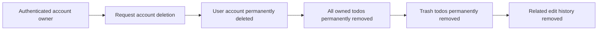

## Profile Operations

Each account includes a profile that stores the user's display name for their own use within the application. The profile is created as part of having a user account, and the account owner can view their own profile information. The account owner can update the display name whenever they want. Profile access is private, so users cannot browse, search, or open another person's profile. There is no business need for listing profiles because this is a private todo application rather than a social space. Any profile view or edit action must happen only within the signed-in user's own account context. If a user attempts to access a profile that is not theirs, the system must deny that action. If a user is not authenticated, profile information must not be shown or changed.

### Profile Availability Within the Account

THE todoApp SHALL create a profile for each user account as part of the account becoming available for use.

THE todoApp SHALL make that profile available only within the signed-in user's own account context.

THE todoApp SHALL associate the profile with exactly one account owner for profile viewing and profile updating activities.

WHEN the account owner accesses profile information while signed in, THE todoApp SHALL present that user's own profile.

WHEN the account owner is not signed in, THE todoApp SHALL not provide profile viewing or profile updating operations.

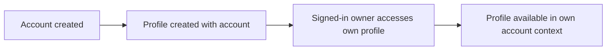


### Own Profile Viewing

WHEN a signed-in user opens profile information, THE todoApp SHALL show only that user's own profile.

WHEN the signed-in user views the profile, THE todoApp SHALL show the display name stored for that user.

THE todoApp SHALL support profile viewing as an account-owner action rather than as a shared or public activity.

WHERE profile information is shown, THE todoApp SHALL keep the profile view limited to the signed-in user's own account context.

THE todoApp SHALL not provide a workflow for opening another user's profile from profile viewing operations.

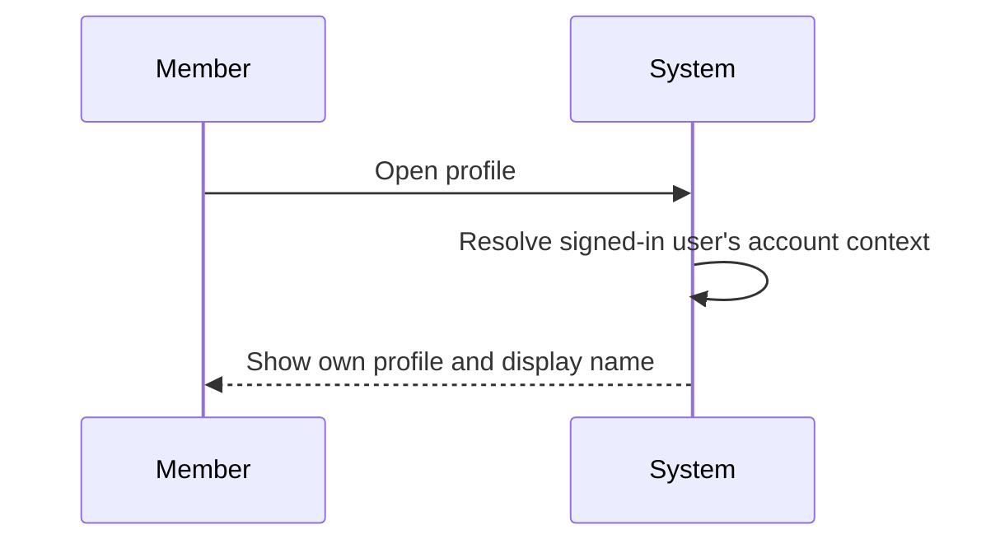


### Display Name Update

WHEN a signed-in user updates profile information, THE todoApp SHALL allow that user to change the display name on that user's own profile.

THE todoApp SHALL support repeated display name updates by the account owner over time.

WHEN the display name is updated, THE todoApp SHALL apply the change to the signed-in user's own profile.

WHERE profile editing is performed, THE todoApp SHALL limit the update action to the signed-in user's own account context.

WHEN the user later views the profile after a successful update, THE todoApp SHALL show the updated display name.

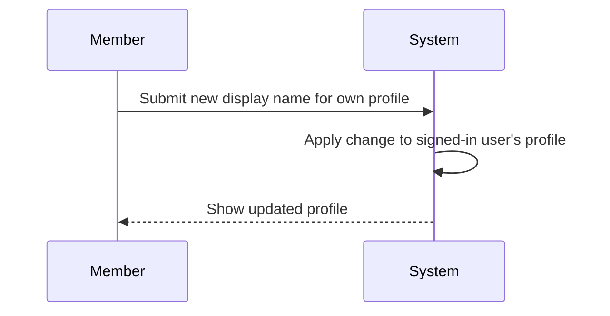


### Private Profile Visibility

THE todoApp SHALL keep each profile private to its account owner.

THE todoApp SHALL not provide profile browsing across users.

THE todoApp SHALL not provide profile search across users.

THE todoApp SHALL not provide any operation to view another user's profile.

IF a user attempts to access a profile that is not that user's own, THEN THE todoApp SHALL deny that action.

WHEN profile access is requested, THE todoApp SHALL evaluate the request only within the signed-in user's own account context.

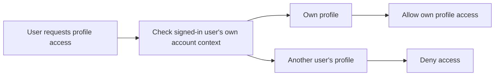

## Todo Operations

A signed-in user can create a todo with a required title and optional description, start date, and due date. Every new todo begins in the incomplete state by default. Users can view a paginated list of only their own active todos, and each list entry shows the title, completion status, start date when present, due date when present, and creation date. Users can open one of their own todos to see its full details, including the full description. A user can edit their own todo's title, description, start date, and due date. Users can toggle a todo between complete and incomplete as a simple two-state change. Users can filter their own todo list by all todos, only complete todos, or only incomplete todos. Users can sort their own todo list by creation date, start date, or due date using the allowed ordering options, and todos without a start date or due date appear at the end when sorting by those dates. A user can soft delete their own todo so it disappears from the normal todo list without being permanently removed right away. Deleted todos can be viewed in a separate paginated trash list, restored back to the normal todo list, or permanently deleted from trash. Todo operations must always be private so users can create, view, change, delete, restore, and permanently remove only their own todos. If required information such as the title is missing, or if a user tries to access another user's todo, the system must reject the action without changing the protected todo data.

### Todo Creation

Users can create a todo by providing a title.

Users may leave the description empty when creating a todo.

Users may leave the start date empty when creating a todo.

Users may leave the due date empty when creating a todo.

Every newly created todo begins in the incomplete state by default.

A created todo is owned by the signed-in user who created it and is not visible to other users.

If the required title is not provided, the create action is rejected as defined in [04-business-rules.md](./04-business-rules.md).

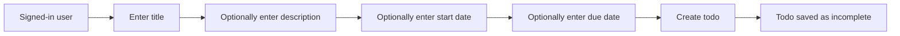

### Viewing and Browsing Own Todos

Users can view a paginated list of their own active todos.

The normal todo list shows only active todos and does not show deleted todos.

Each todo shown in the list displays the title, completion status, creation date, start date when present, and due date when present.

Users can open one of their own todos from the list to view its full details, including the full description.

Users can filter their own active todo list by all todos, only complete todos, or only incomplete todos.

Users can sort their own active todo list by creation date using newest first or oldest first ordering.

Users can sort their own active todo list by start date using earliest first or latest first ordering.

When the active todo list is sorted by start date, todos without a start date appear at the end of the list.

Users can sort their own active todo list by due date using earliest first or latest first ordering.

When the active todo list is sorted by due date, todos without a due date appear at the end of the list.

Todo browsing remains private so a user can view only their own todos and no other user's todos.

Detailed pagination and filtering behavior is defined in [04-business-rules.md](./04-business-rules.md).

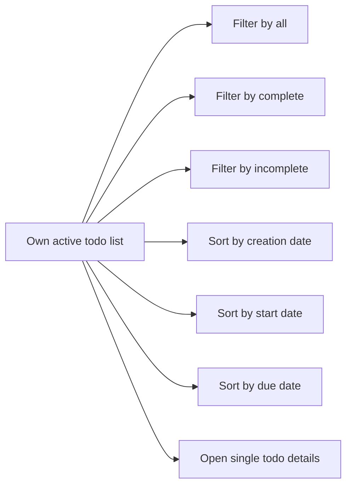

### Editing Todo Details and Completion Status

Users can edit their own todo's title.

Users can edit their own todo's description.

Users can edit their own todo's start date.

Users can edit their own todo's due date.

Users can mark their own todo as complete.

Users can mark their own todo as incomplete.

Completion changes are a simple toggle between the complete state and the incomplete state.

Editing a todo's details does not transfer ownership of the todo.

Users can change only their own todos and cannot edit another user's todo.

The creation of edit history entries for todo detail changes is defined in the TodoEditHistory operations sections and is not repeated here.

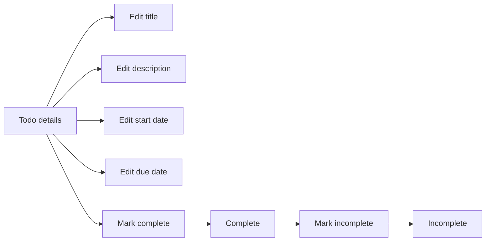

### Deleting, Viewing Trash, Restoring, and Permanently Removing Todos

Users can soft delete their own active todos.

After soft deletion, the todo no longer appears in the normal active todo list.

Soft-deleted todos remain available in a separate trash list.

Users can view a paginated list of their own deleted todos in trash.

Users can restore one of their own deleted todos from trash.

When a deleted todo is restored, it returns to the normal active todo list.

Users can permanently delete one of their own deleted todos from trash.

A todo can be permanently deleted only from trash.

Todo deletion and trash operations remain private so a user can delete, view in trash, restore, and permanently remove only their own todos.

The deletion of edit history when a todo is permanently deleted from trash is defined as part of the trash removal outcome and related retention behavior is defined in [05-non-functional.md](./05-non-functional.md).

Detailed pagination and error handling for trash operations are defined in [04-business-rules.md](./04-business-rules.md).

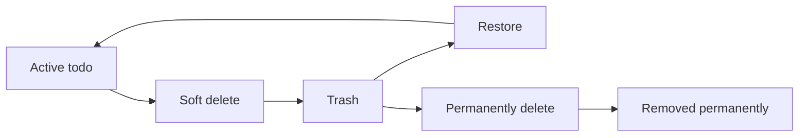

## TodoEditHistory Operations

Each time a user edits one of their own todos, the system creates a history entry for that edit. A history entry records when the edit happened and captures the changed title, description, start date, and due date when those values were changed in that edit. Users can view the full edit history for any of their own todos to understand how the todo changed over time. History entries are presented from most recent to oldest so the latest update is seen first. Users do not manually create or modify history entries because history is generated automatically from todo edits. Users also do not delete individual history entries as a separate operation. When a todo is permanently deleted from trash, its edit history is permanently deleted as well. If a todo belongs to another user, its history cannot be viewed. If a todo has never been edited, the history view should show no edit entries rather than invented changes.

### Automatic History Entry Creation on Todo Edit

WHEN a member edits one of their own todos, THE todoApp SHALL create one new TodoEditHistory entry for that edit.

THE todoApp SHALL create the TodoEditHistory entry automatically as part of the todo edit operation.

THE todoApp SHALL record the time when the edit was made in the TodoEditHistory entry.

WHEN the title is changed in an edit, THE todoApp SHALL record the changed title value in the TodoEditHistory entry.

WHEN the description is changed in an edit, THE todoApp SHALL record the changed description value in the TodoEditHistory entry.

WHEN the start date is changed in an edit, THE todoApp SHALL record the changed start date value in the TodoEditHistory entry.

WHEN the due date is changed in an edit, THE todoApp SHALL record the changed due date value in the TodoEditHistory entry.

WHEN an edit changes more than one of title, description, start date, or due date, THE todoApp SHALL record all changed values in the same TodoEditHistory entry.

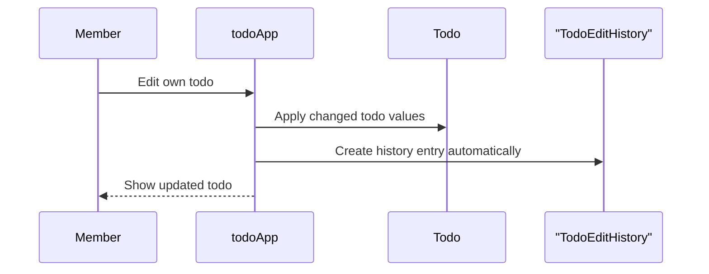

### Viewing Full Edit History for an Owned Todo

WHEN a member requests the edit history for one of their own todos, THE todoApp SHALL display the full TodoEditHistory for that todo.

THE todoApp SHALL present each TodoEditHistory entry with the recorded edit time.

WHEN a TodoEditHistory entry includes a changed title value, THE todoApp SHALL display that changed title value in the history view.

WHEN a TodoEditHistory entry includes a changed description value, THE todoApp SHALL display that changed description value in the history view.

WHEN a TodoEditHistory entry includes a changed start date value, THE todoApp SHALL display that changed start date value in the history view.

WHEN a TodoEditHistory entry includes a changed due date value, THE todoApp SHALL display that changed due date value in the history view.

THE todoApp SHALL sort TodoEditHistory entries from most recent to oldest.

IF the requested todo belongs to another user, THEN THE todoApp SHALL not provide its TodoEditHistory view.

IF an owned todo has never been edited, THEN THE todoApp SHALL show that the todo has no edit entries.

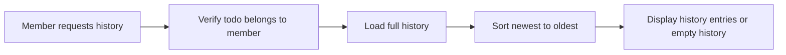

### Restrictions on Direct History Management

THE todoApp SHALL NOT provide an operation for a member to create a TodoEditHistory entry manually.

THE todoApp SHALL NOT provide an operation for a member to edit an existing TodoEditHistory entry.

THE todoApp SHALL NOT provide an operation for a member to delete an individual TodoEditHistory entry.

WHEN a member permanently deletes a todo from trash, THE todoApp SHALL permanently delete the TodoEditHistory associated with that todo.

THE todoApp SHALL remove TodoEditHistory only through permanent deletion of its related todo from trash.

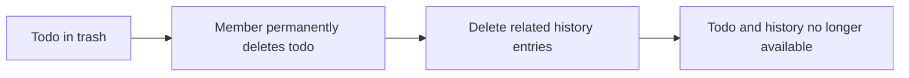

# Error Scenarios and Edge Cases

Business-level error scenarios, edge case coverage, and expected system behaviors for exceptional conditions.

## User Error Scenarios

A person cannot create an account or log in without providing both an email and a password, because those are the only allowed credentials for account access. If the entered email and password do not match an existing account, access is denied and no user information is revealed beyond the failed sign-in. A signed-in user who tries to change a password but does not complete the required password entry for that action must be prevented from finishing the change. Password change attempts must apply only to the currently signed-in account and must never affect another user's account. If a person who is not signed in tries to perform account-only actions such as changing a password or deleting an account, the system must block the action. When a user deletes an account, the deletion is final and all of that user's todos, including todos already in trash, are permanently removed as part of the same business outcome. After account deletion, the former account owner can no longer sign in with that account because it no longer exists. If account deletion is attempted more than once for the same account state, the system should treat the later attempt as unavailable because there is no remaining account to delete.

### Sign-Up Input Failures

WHEN a person attempts to sign up without an email, THE todoApp SHALL reject the sign-up attempt.

WHEN a person attempts to sign up without a password, THE todoApp SHALL reject the sign-up attempt.

WHEN a sign-up attempt is rejected because an email or password is missing, THE todoApp SHALL not create a user account.

WHEN a sign-up attempt includes both an email and a password, THE todoApp SHALL allow the sign-up flow to proceed subject to the account rules defined in [User Operations].

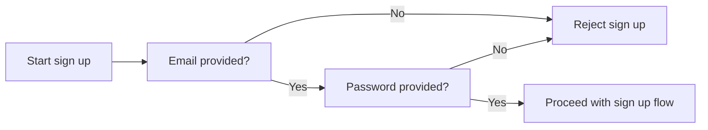


### Failed Sign-In Handling

WHEN a person attempts to log in with an email and password that do not match an existing account, THE todoApp SHALL deny access.

WHEN access is denied during sign-in, THE todoApp SHALL not reveal whether the email matches an existing account.

WHEN access is denied during sign-in, THE todoApp SHALL not reveal any profile details, todo information, or other account information.

WHEN a sign-in attempt fails, THE todoApp SHALL leave the person signed out.

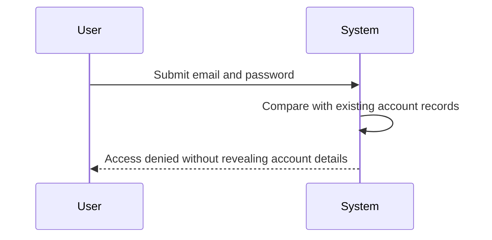


### Password Change Access Failures

WHEN a person who is not signed in attempts to change a password, THE todoApp SHALL block the password change action.

WHEN a signed-in user starts a password change but does not complete the required password entry for that action, THE todoApp SHALL prevent the password change from being completed.

WHEN a password change attempt is blocked or prevented, THE todoApp SHALL leave the current account password unchanged.

WHEN a signed-in user changes a password successfully, THE todoApp SHALL apply the change only to the currently signed-in account.

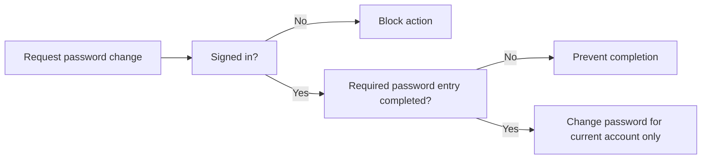


### Signed-Out Account-Only Action Blocking

WHEN a person who is not signed in attempts an account-only action, THE todoApp SHALL block the action.

WHEN a person who is not signed in attempts to delete an account, THE todoApp SHALL block the deletion action.

WHEN an account-only action is blocked because the person is signed out, THE todoApp SHALL not change any account data or todo data.

WHEN a person is signed out, THE todoApp SHALL require the person to be in an authenticated account state before any account-only action can proceed.

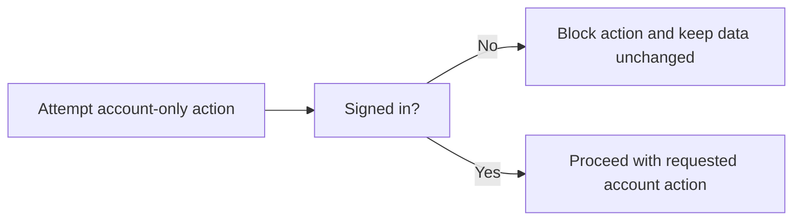


### Permanent Account Deletion Outcome

WHEN a signed-in user deletes their own account, THE todoApp SHALL permanently delete that account.

WHEN a signed-in user deletes their own account, THE todoApp SHALL permanently remove all active todos owned by that user as part of the same business outcome.

WHEN a signed-in user deletes their own account, THE todoApp SHALL permanently remove all trashed todos owned by that user as part of the same business outcome.

WHEN account deletion is completed, THE todoApp SHALL end the former account owner's ability to use that deleted account.

WHEN account deletion is completed, THE todoApp SHALL make the deleted account unavailable for future sign-in.

```mermaid
flowchart LR
    A["Signed-in user requests account deletion"] --> B["Delete account permanently"]
    B --> C["Remove active todos"]
    C --> D["Remove trashed todos"]
    D --> E["Account no longer available for sign in"]
```


### Post-Deletion and Repeat Deletion Attempts

WHEN a former account owner attempts to log in after the account has been deleted, THE todoApp SHALL deny access because the account no longer exists.

WHEN account deletion is attempted again for an account state that has already been deleted, THE todoApp SHALL treat the deletion request as unavailable.

WHEN a repeat deletion attempt is unavailable because no account remains to delete, THE todoApp SHALL not perform any further deletion activity.

WHEN a deleted account is no longer available, THE todoApp SHALL not restore account access through the sign-in flow.

```mermaid
flowchart LR
    A["Deleted account state"] --> B["Attempt sign in"]
    B --> C["Deny access"]
    A --> D["Attempt account deletion again"]
    D --> E["Treat deletion as unavailable"]
```


## Profile Error Scenarios

A user can manage only the display name on their own profile, so any attempt to edit profile information while not signed in must be rejected. Because this is a private todo application, a user must not be able to open, search for, or inspect another user's profile under any circumstance. If a user tries to edit a profile other than their own, the system must deny the action and preserve the other person's privacy. If a display name update is attempted without providing a display name, the system must not accept the change because display name is the only defined profile information. Viewing profile details must be limited to the account owner, and no response should expose whether another person's profile exists. If the account has been deleted, profile access and profile editing are no longer available because the profile no longer belongs to an active user. Repeating a display name edit with no actual change should not create confusion for the user and should simply leave the profile as it already is.

### Signed-Out Profile Access and Edit Rejection

WHEN a person who is not signed in attempts to open profile details, THE todoApp SHALL reject profile access.

WHEN a person who is not signed in attempts to update a profile, THE todoApp SHALL reject the profile edit.

WHEN profile access is rejected because the person is not signed in, THE todoApp SHALL not reveal any profile details.

WHEN profile editing is rejected because the person is not signed in, THE todoApp SHALL leave the profile unchanged.

WHEN a signed-out person attempts profile access or profile editing, THE todoApp SHALL treat the request as unavailable until the person is signed in.

```mermaid
flowchart LR
    A["Signed-out person"] --> B["Attempt profile access or edit"]
    B --> C["Request rejected"]
    C --> D["No profile details exposed"]
```

### Own Profile Only Access and Private Visibility

THE todoApp SHALL allow a member to view only that member's own profile.

THE todoApp SHALL limit profile visibility to the account owner.

WHEN a member attempts to open another user's profile, THE todoApp SHALL deny access.

WHEN a member attempts to search for, inspect, or otherwise view another user's profile, THE todoApp SHALL deny the request.

WHEN access to another user's profile is denied, THE todoApp SHALL not expose the other user's display name or any other profile information.

WHEN a request concerns a profile that does not belong to the requesting member, THE todoApp SHALL respond without indicating whether that other profile exists.

```mermaid
flowchart LR
    A["Member"] --> B["Request profile"]
    B --> C["Own profile?"]
    C -->|"Yes"| D["Show own profile"]
    C -->|"No"| E["Deny without revealing existence"]
```

### Editing Another User's Profile Denied

WHEN a member attempts to edit a profile other than that member's own profile, THE todoApp SHALL deny the edit.

WHEN an edit request targets another user's profile, THE todoApp SHALL preserve the existing profile information unchanged.

WHEN a member attempts to edit another user's display name, THE todoApp SHALL not apply the requested change.

WHEN editing another user's profile is denied, THE todoApp SHALL not reveal whether the targeted profile exists.

WHEN editing another user's profile is denied, THE todoApp SHALL continue to allow the member to manage only that member's own profile.

```mermaid
flowchart LR
    A["Member"] --> B["Submit profile edit"]
    B --> C["Own profile?"]
    C -->|"Yes"| D["Continue with own profile update"]
    C -->|"No"| E["Deny and keep profile unchanged"]
```

### Display Name Update Validation and No-Change Handling

WHEN a member attempts to update a profile without providing a display name, THE todoApp SHALL not accept the change.

WHEN a display name is not provided in a profile update request, THE todoApp SHALL keep the existing display name unchanged.

WHEN a member repeats a display name update with the same display name already stored on the profile, THE todoApp SHALL leave the profile as it already is.

WHEN a member repeats a display name update with no actual change, THE todoApp SHALL not create a misleading result that suggests the profile was changed.

WHEN a valid new display name is provided for the member's own profile, THE todoApp SHALL apply the updated display name.

```mermaid
flowchart LR
    A["Member submits display name update"] --> B["Display name provided?"]
    B -->|"No"| C["Reject change"]
    B -->|"Yes"| D["Different from current display name?"]
    D -->|"No"| E["Leave profile unchanged"]
    D -->|"Yes"| F["Apply updated display name"]
```

### Profile Unavailable After Account Deletion

WHEN the account has been deleted, THE todoApp SHALL make the profile unavailable for viewing.

WHEN the account has been deleted, THE todoApp SHALL make the profile unavailable for editing.

WHEN a request is made for a profile whose account has been deleted, THE todoApp SHALL not return profile details.

WHEN a request is made to edit a profile whose account has been deleted, THE todoApp SHALL not apply any profile change.

WHEN profile access is attempted after account deletion, THE todoApp SHALL treat the profile as no longer belonging to an active user.

```mermaid
flowchart LR
    A["Account deleted"] --> B["Profile requested"]
    B --> C["Profile unavailable"]
    C --> D["No viewing or editing allowed"]
```

## Todo Error Scenarios

A user cannot create or save a todo without a title, because title is required even when description, start date, and due date are left empty. When optional values such as description, start date, or due date are omitted, the todo must still be accepted as long as the required title is present. Any attempt to view, edit, complete, delete, restore, or permanently delete a todo that belongs to another user must be denied because todos are completely private. If a user tries to open a deleted todo from the normal todo list, the todo should not appear there because soft-deleted items belong only in trash until restored. Trying to restore a todo that is not in trash should not change its state, because only deleted todos can be restored. Trying to permanently delete a todo that is not in trash must be rejected or treated as unavailable, since permanent removal is defined only from trash. Completion is a simple two-state toggle, so marking an already complete todo as complete again or an already incomplete todo as incomplete again should leave the todo in its current state without creating a different business outcome. Todo lists and trash lists are paginated, so requesting a page beyond the available results should return no items rather than exposing other users' data. When sorting by start date or due date, todos without that date must appear at the end, and this rule still applies even when many listed items have no date set. Filtering by completion status must show only the signed-in user's own todos and must not include deleted todos in the normal todo list.

### Todo creation with required and optional values

IF a member attempts to create a todo without a title, THEN THE todoApp SHALL reject the creation request.

WHEN a member creates a todo with a title and leaves the description empty, THE todoApp SHALL accept the creation request.

WHEN a member creates a todo with a title and leaves the start date empty, THE todoApp SHALL accept the creation request.

WHEN a member creates a todo with a title and leaves the due date empty, THE todoApp SHALL accept the creation request.

WHEN a member creates a todo with a title and leaves the description, start date, and due date empty, THE todoApp SHALL accept the creation request.

```mermaid
flowchart LR
    A["Create todo request"] --> B["Title provided?"]
    B -->|"No"| C["Reject creation"]
    B -->|"Yes"| D["Accept creation"]
    D --> E["Optional description may be empty"]
    D --> F["Optional start date may be empty"]
    D --> G["Optional due date may be empty"]
```

### Access to another user's todo is denied for all todo actions

WHEN a member attempts to view another user's todo, THE todoApp SHALL deny access.

WHEN a member attempts to edit another user's todo, THE todoApp SHALL deny access.

WHEN a member attempts to mark another user's todo as complete, THE todoApp SHALL deny access.

WHEN a member attempts to delete another user's todo, THE todoApp SHALL deny access.

WHEN access to another user's todo is denied, THE todoApp SHALL not reveal that todo's details.

```mermaid
flowchart LR
    A["Member requests todo action"] --> B["Does the todo belong to the member?"]
    B -->|"Yes"| C["Continue requested action"]
    B -->|"No"| D["Deny access"]
```

### Deleted todo behavior in normal list and trash operations

WHILE a todo is deleted, THE todoApp SHALL exclude it from the member's normal todo list.

WHEN a member tries to open a deleted todo from the normal todo list, THE todoApp SHALL treat the todo as unavailable in that list.

WHEN a member attempts to restore a todo that is in trash, THE todoApp SHALL return the todo to the normal todo list.

IF a member attempts to restore a todo that is not in trash, THEN THE todoApp SHALL leave the todo unchanged.

WHEN a member permanently deletes a todo from trash, THE todoApp SHALL remove that todo from trash.

IF a member attempts to permanently delete a todo that is not in trash, THEN THE todoApp SHALL reject the request or treat the todo as unavailable for permanent deletion.

```mermaid
flowchart LR
    A["Active todo"] -->|"Delete"| B["In trash"]
    B -->|"Restore"| A
    B -->|"Permanent delete"| C["Permanently removed"]
    A -->|"Restore requested"| D["No change"]
    A -->|"Permanent delete requested"| E["Reject or unavailable"]
```

### Repeated completion toggle requests

WHEN a member marks an incomplete todo as complete, THE todoApp SHALL set the todo to complete.

WHEN a member marks a complete todo as incomplete, THE todoApp SHALL set the todo to incomplete.

IF a member marks an already complete todo as complete again, THEN THE todoApp SHALL leave the todo in the complete state.

IF a member marks an already incomplete todo as incomplete again, THEN THE todoApp SHALL leave the todo in the incomplete state.

WHEN a repeated completion toggle request leaves the todo in its current state, THE todoApp SHALL not produce a different business outcome.

```mermaid
flowchart LR
    A["Incomplete"] -->|"Mark complete"| B["Complete"]
    B -->|"Mark incomplete"| A
    B -->|"Mark complete again"| B
    A -->|"Mark incomplete again"| A
```

### Empty page handling for paginated todo and trash lists

WHEN a member requests a page of the normal todo list beyond the available results, THE todoApp SHALL return no items for that page.

WHEN a member requests a page of the trash list beyond the available results, THE todoApp SHALL return no items for that page.

WHEN an empty page is returned for the normal todo list, THE todoApp SHALL limit the result to the requesting member's own todos.

WHEN an empty page is returned for the trash list, THE todoApp SHALL limit the result to the requesting member's own deleted todos.

```mermaid
sequenceDiagram
    participant M as Member
    participant S as todoApp
    M->>S: Request page beyond available results
    S->>S: Check requested page against available results
    S-->>M: Return empty result for that page
```

### Sorting and filtered list behavior for deleted and undated todos

WHEN a member sorts the normal todo list by start date, THE todoApp SHALL place todos without a start date at the end of the list.

WHEN a member sorts the normal todo list by due date, THE todoApp SHALL place todos without a due date at the end of the list.

WHEN many todos in the list do not have a start date, THE todoApp SHALL still place those undated todos at the end when sorting by start date.

WHEN many todos in the list do not have a due date, THE todoApp SHALL still place those undated todos at the end when sorting by due date.

WHEN a member filters the normal todo list by completion status, THE todoApp SHALL include only the requesting member's own todos that match the selected completion status.

WHEN a member filters the normal todo list by completion status, THE todoApp SHALL exclude deleted todos from the filtered results.

```mermaid
flowchart LR
    A["Normal todo list"] --> B["Apply completion filter"]
    B --> C["Keep member's matching todos only"]
    C --> D["Exclude deleted todos"]
    A --> E["Sort by start date"]
    E --> F["Todos without start date moved to end"]
    A --> G["Sort by due date"]
    G --> H["Todos without due date moved to end"]
```

## TodoEditHistory Error Scenarios

Edit history exists only for a user's own todos, so a person must not be able to view history for another user's todo. If a todo has never been edited after creation, viewing its history should show that there are no edit entries rather than inventing changes. A history entry is created only when a todo is edited, so actions such as viewing a todo, changing its completion status, deleting it, restoring it, or permanently deleting it do not by themselves represent content edits to title, description, start date, or due date. When an edit changes only one or some of the editable values, the history entry should reflect only the values that were changed and not imply changes to the others. History entries must be shown from most recent to oldest, and the order should remain consistent even after many edits. If a todo is permanently deleted from trash, its edit history must also be permanently deleted and can no longer be viewed afterward. If a user attempts to view history for a todo that has already been permanently deleted, the history is unavailable because both the todo and its history are gone. Access to history while signed out must be denied because history belongs to private user data.

### History Access Restrictions

WHEN a member requests the edit history for a todo owned by that same member, THE todoApp SHALL present the edit history for that todo.

IF a member attempts to view the edit history of another user's todo, THEN THE todoApp SHALL deny access to that history.

WHEN a person who is not signed in attempts to view any todo edit history, THE todoApp SHALL deny access because edit history belongs to private user data.

IF a todo has been permanently deleted, THEN THE todoApp SHALL make its edit history unavailable for viewing.

```mermaid
flowchart LR
    A["Signed-in member requests own todo history"] --> B["History access allowed"]
    C["Member requests another user's todo history"] --> D["Access denied"]
    E["Signed-out person requests todo history"] --> F["Access denied"]
    G["Todo permanently deleted"] --> H["History unavailable"]
```

### When History Entries Are Created

WHEN a member edits a todo's title, description, start date, or due date, THE todoApp SHALL create a history entry for that edit.

WHEN a member views a todo, THE todoApp SHALL NOT create a history entry.

WHEN a member changes a todo from incomplete to complete or from complete to incomplete, THE todoApp SHALL NOT create a history entry for that status change.

WHEN a member soft deletes a todo, THE todoApp SHALL NOT create a history entry for that deletion action.

WHEN a member restores a todo from trash, THE todoApp SHALL NOT create a history entry for that restore action.

WHEN a member permanently deletes a todo from trash, THE todoApp SHALL NOT create a history entry for that permanent deletion action.

```mermaid
flowchart LR
    A["Edit title, description, start date, or due date"] --> B["Create history entry"]
    C["View todo"] --> D["No history entry"]
    E["Toggle completion status"] --> D
    F["Soft delete todo"] --> D
    G["Restore todo"] --> D
    H["Permanently delete todo"] --> D
```

### History Entry Content and Empty History Behavior

IF a todo has never been edited after creation, THEN THE todoApp SHALL show that the todo has no edit history entries.

IF a todo has never been edited after creation, THEN THE todoApp SHALL NOT invent or display changes that never occurred.

WHEN a todo edit changes only some of the editable values, THE todoApp SHALL record only the values that were changed in that history entry.

WHEN a todo edit changes the title, THE todoApp SHALL record the changed title value in the history entry.

WHEN a todo edit changes the description, THE todoApp SHALL record the changed description value in the history entry.

WHEN a todo edit changes the start date, THE todoApp SHALL record the changed start date value in the history entry.

WHEN a todo edit changes the due date, THE todoApp SHALL record the changed due date value in the history entry.

IF a value was not changed in a given edit, THEN THE todoApp SHALL NOT imply that the unchanged value was edited in that history entry.

```mermaid
sequenceDiagram
    participant M as Member
    participant S as System
    M->>S: View edit history for a todo with no edits
    S->>S: Check for recorded edit entries
    S-->>M: Show that no edit history entries exist
```

### History Ordering and Post-Deletion Availability

WHEN the todoApp displays a todo's edit history, THE todoApp SHALL show history entries from most recent to oldest.

WHILE a todo has many history entries, THE todoApp SHALL preserve the same most-recent-first ordering when presenting the full history.

WHEN a member permanently deletes a todo from trash, THE todoApp SHALL permanently delete the todo's edit history.

IF a member later attempts to view history for a todo that was permanently deleted from trash, THEN THE todoApp SHALL show that the history is unavailable because both the todo and its history were removed.

```mermaid
flowchart LR
    A["History entries exist"] --> B["Display most recent first"]
    B --> C["Ordering remains consistent after many edits"]
    D["Todo permanently deleted from trash"] --> E["Delete edit history permanently"]
    E --> F["Later history request returns unavailable"]
```

# End-to-End User Scenarios

Cross-domain user scenarios that span multiple concepts, describing complete user journeys.

## Cross-Domain User Scenarios

Define end-to-end user scenarios that span multiple concepts, describing complete user journeys from start to finish.

### New Member End-to-End Todo Journey

A member can complete an end-to-end journey from account creation to active todo management within a single private workspace.

The journey begins when the member signs up with an email address and password, then signs in with the same credentials to access the application.

After access is established, the member can open their own profile and set or update their display name before starting todo work.

The member can then create a todo with a required title and, when desired, add a description, a start date, and a due date. A newly created todo begins as incomplete.

After creation, the member can open their own todo list, review the created item among their own todos, and open the todo to see its full details including the full description.

From that detail view, the member can mark the todo as complete or return it to incomplete as part of normal task tracking.

The member can later edit the todo's title, description, start date, or due date, and then review the todo's edit history to confirm that the change was recorded.

The member can continue this journey across multiple todos, but all activity remains limited to the member's own account, profile, todos, and todo history.

```mermaid
sequenceDiagram
    participant M as Member
    participant S as System
    M->>S: Sign up with email and password
    S-->>M: Account created
    M->>S: Log in with email and password
    S-->>M: Private access granted
    M->>S: View or update display name
    S-->>M: Profile shown or updated
    M->>S: Create todo
    S-->>M: Todo created as incomplete
    M->>S: View todo list and open todo details
    S-->>M: Own todo information displayed
    M->>S: Edit todo or toggle completion status
    S-->>M: Todo updated and available for continued use
```

### Ongoing Todo Maintenance Multi-Step Scenario

A member can follow a multi-step maintenance journey for an existing todo from review through revision and historical verification.

The journey starts when the member opens their own todo list and selects one todo to inspect in detail.

After reviewing the todo, the member can decide whether the todo should remain incomplete or be marked complete, using the simple completion toggle as the current status changes.

If the todo information needs correction or refinement, the member can edit the title, description, start date, due date, or any combination of those values.

Each edit becomes part of the todo's history, allowing the member to move from making a change to verifying that the change was captured.

The member can then open the full edit history for that same todo and review entries from most recent to oldest as part of the same user journey.

This maintenance journey supports repeated editing over time, with each new edit producing another history entry for the same todo.

The member can return from the history view to the todo details or todo list and continue managing only their own work items.

```mermaid
sequenceDiagram
    participant M as Member
    participant S as System
    M->>S: Open own todo list
    S-->>M: List of own todos shown
    M->>S: View one todo
    S-->>M: Full todo details shown
    M->>S: Toggle completion status
    S-->>M: Completion status updated
    M->>S: Edit todo details
    S-->>M: Todo updated
    M->>S: View edit history
    S-->>M: History entries shown from most recent to oldest
```

### Soft Deletion, Trash, and Recovery User Journey

A member can complete a full deletion and recovery journey for their own todo without immediately losing the todo permanently.

The journey begins when the member deletes one of their own todos from active use. This action removes the todo from the normal todo list and places it in trash.

After deletion, the member can open the trash list to review deleted todos that are no longer shown in the normal todo list.

From the trash, the member can restore a deleted todo when they want to resume working on it. Once restored, the todo returns to the normal todo list.

If the member decides the todo should not be kept, the member can permanently delete that todo from the trash as the final step in the journey.

When a todo is permanently deleted from the trash, its edit history is also deleted as part of the same business outcome.

This journey allows a member to move from active todo management, to soft deletion, to either recovery or final removal, all within the member's own private data space.

```mermaid
flowchart LR
    A["Active todo"] --> B["Deleted to trash"]
    B -->|"Restore"| A
    B -->|"Permanently delete"| C["Todo and edit history removed"]
```

### Private Personal Productivity User Journey

A member uses the application as a private personal productivity journey in which all visible information belongs only to that member.

The journey starts with the member signing in and entering a workspace that contains only the member's own profile, todos, and todo history.

The member can move between their profile, their todo list, an individual todo, and that todo's edit history without any step that exposes another user's information.

When the member views todo lists, opens a single todo, edits a todo, reviews history, deletes a todo, or restores a todo from trash, every step applies only to the member's own data.

This privacy-focused journey is consistent across active todos and deleted todos in trash, so the member's private workspace remains limited to personal items at every stage.

The member cannot use this journey to browse, access, or share another user's todos, because the application is defined as a private todo application.

```mermaid
flowchart LR
    A["Signed-in member"] --> B["Own profile"]
    A --> C["Own todo list"]
    C --> D["Own todo details"]
    D --> E["Own todo history"]
    C --> F["Own trash list"]
```

### Account Closure End-to-End Journey

A member can complete an end-to-end account closure journey that removes the account and all associated todo data.

The journey begins when the member, while using their own account, chooses to delete that account.

As part of the same overall outcome, all of the member's todos are permanently deleted, including todos that are still active and todos that are currently in trash.

Because each todo's lifecycle ends with account deletion, the member's todo data is no longer available for later viewing, restoration, editing, or completion tracking after the account is deleted.

This journey represents the final step in the member's use of the application and closes access to the private todo workspace that belonged to that account.

```mermaid
flowchart LR
    A["Member account"] -->|"Delete account"| B["Account removed"]
    B --> C["Active todos removed"]
    B --> D["Trashed todos removed"]
```