**todoApp — Business rules, validation constraints, data browsing expectations, error scenarios**

Business rules, validation constraints, data browsing expectations, error scenarios

# Domain Business Rules

Per-concept business rules, validation logic, and domain constraints.

## User Rules

A user account is identified by an email address and secured by a password. Sign-up requires both email and password, so an account cannot be created with either value missing. Login also depends on the same pair of credentials being provided together. A password change is only valid for an existing account owner and results in the new password becoming the active credential for future sign-ins. Account deletion is a permanent business action rather than a temporary state. When a user deletes an account, all of that user's todos are permanently removed, including todos that were previously placed in trash. Any edit history connected to those todos is removed as part of the same permanent account removal outcome. Because the application is private and account-based, user rules center on maintaining a valid credentialed owner for all personal todo activity.

### Credential Pair Validation

WHEN a member signs up, THE todoApp SHALL require both an email address and a password to be provided together.

IF either the email address or the password is missing during sign-up, THEN THE todoApp SHALL reject the sign-up request.

WHEN a member logs in, THE todoApp SHALL require both an email address and a password to be provided together.

IF either the email address or the password is missing during login, THEN THE todoApp SHALL reject the login request.

THE todoApp SHALL treat the email address and password as the account credential pair for account access.

IF the provided email address and password do not match the same existing account, THEN THE todoApp SHALL reject the login request.

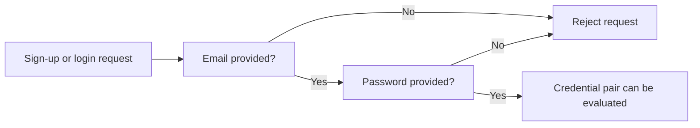

### Password Change Rules

WHEN an account owner changes a password, THE todoApp SHALL allow the change only for that existing account owner's account.

IF a password change is requested for an account that does not exist, THEN THE todoApp SHALL reject the password change request.

WHEN a password change is completed, THE todoApp SHALL make the new password the active password for future sign-ins.

IF a previous password is used after the password has been changed, THEN THE todoApp SHALL reject the login request.

WHEN the new password is used with the account's email address after the password change, THE todoApp SHALL evaluate that pair as the current active credential pair.

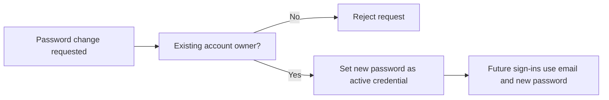

### Permanent Account Deletion Outcomes

WHEN an account owner deletes an account, THE todoApp SHALL treat the deletion as a permanent business action.

WHEN an account is permanently deleted, THE todoApp SHALL permanently remove all todos owned by that account.

WHEN an account is permanently deleted, THE todoApp SHALL include in that removal any todos that were previously placed in trash.

WHEN an account is permanently deleted, THE todoApp SHALL permanently remove the edit history related to that account's todos as part of the same deletion outcome.

IF an account deletion request targets an account that does not exist, THEN THE todoApp SHALL reject the account deletion request.

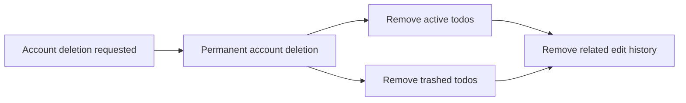

### Private Account-Based Ownership Constraint

THE todoApp SHALL require each todo to belong to a credentialed account owner.

WHILE an account exists, THE todoApp SHALL evaluate todo ownership in the context of that account owner only.

IF personal todo activity cannot be associated with a valid credentialed account owner, THEN THE todoApp SHALL reject the requested action.

THE todoApp SHALL apply user rules on the basis that the application is private and account-based.

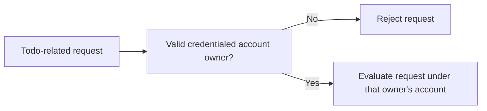

## Profile Rules

Each user has one profile used to hold the user's display name. The profile is part of the account owner's personal workspace and is not described as a shared or public record. A display name is editable, so the current value can be replaced by the user over time. The business scope of the profile is limited to the display name and does not include any other profile attributes. Profile changes affect only the account owner's own display name. Because the requirements define a profile for each user, a profile cannot exist without its associated user account. When an account is removed, its profile no longer has any continuing business purpose. The profile rules therefore focus on maintaining a single editable display name attached to one user account.

### Single Profile Association

THE todoApp SHALL maintain exactly one profile for each user account.
THE todoApp SHALL associate each profile with its account owner only.
THE todoApp SHALL treat the profile as a single personal profile record for that account owner.
IF a profile is not linked to a user account, THEN THE todoApp SHALL reject that profile as invalid.
IF more than one profile is associated with the same user account, THEN THE todoApp SHALL reject that condition as invalid.

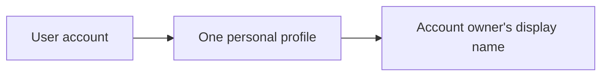

### Profile Scope and Display Name

THE todoApp SHALL limit profile content to the display name.
THE todoApp SHALL store the display name within the profile.
THE todoApp SHALL treat the display name as the only business attribute of the profile in this scope.
IF a profile change attempts to introduce information other than the display name, THEN THE todoApp SHALL reject that change.
IF profile information is evaluated for business rules, THEN THE todoApp SHALL evaluate only the display name within the profile.

### Display Name Replacement Rules

WHEN the account owner edits the profile, THE todoApp SHALL replace the current display name with the new display name.
WHEN the display name is changed, THE todoApp SHALL treat the updated value as the current display name for the profile.
WHILE the profile exists for a user account, THE todoApp SHALL allow the display name to be updated over time by replacement of the current value.
IF a display name update does not provide a replacement value, THEN THE todoApp SHALL reject the change.
IF a display name update is accepted, THEN THE todoApp SHALL ensure the profile continues to contain only one current display name value rather than multiple active values.

### Profile Existence Dependency

WHILE a user account exists, THE todoApp SHALL treat the profile as belonging to that account owner.
WHEN the user account is removed, THE todoApp SHALL treat the related profile as having no independent business existence.
IF a profile is evaluated after its user account has been removed, THEN THE todoApp SHALL reject it as a valid business record.
IF business processing references a profile, THEN THE todoApp SHALL require the related user account to exist.

## Todo Rules

A todo must have a title, and it cannot be created without one. Description, start date, and due date are optional and may be left empty when a todo is created or edited. A newly created todo begins in the incomplete state by default. Completion is represented as a simple business state with only two valid values: complete or incomplete. Users may update a todo's title, description, start date, and due date after creation, and those editable attributes define the maintained content of the todo. The creation date is part of the todo information shown to users and serves as a stable business reference for the item after it is created. A deleted todo is not immediately treated as permanently removed, because normal deletion places it outside the active list rather than erasing it completely. Restoring a deleted todo returns it to normal use without changing its identity as the same todo. Permanent removal is a separate business outcome that can occur after a todo has been placed in trash.

### Todo Creation Content Rules

- WHEN a member creates a todo, THE todoApp SHALL require a title.
- IF a member submits todo creation without a title, THEN THE todoApp SHALL reject the creation.
- WHEN a member creates a todo, THE todoApp SHALL allow the description to be left empty.
- WHEN a member creates a todo, THE todoApp SHALL allow the start date to be left empty.
- WHEN a member creates a todo, THE todoApp SHALL allow the due date to be left empty.
- WHEN a todo is created, THE todoApp SHALL set the todo to incomplete by default.

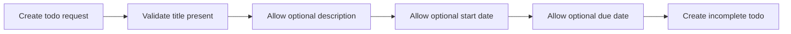

### Todo Completion State Rules

- THE todoApp SHALL limit todo completion status to complete or incomplete only.
- WHEN a member marks a todo as complete, THE todoApp SHALL set the completion status to complete.
- WHEN a member marks a todo as incomplete, THE todoApp SHALL set the completion status to incomplete.
- WHEN a member changes completion status, THE todoApp SHALL treat the change as a simple toggle between complete and incomplete.
- IF a completion status outside complete or incomplete is requested, THEN THE todoApp SHALL reject the change.

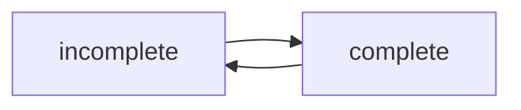

### Todo Editable Content Rules

- WHEN a member edits a todo, THE todoApp SHALL allow the title to be changed.
- WHEN a member edits a todo, THE todoApp SHALL allow the description to be changed.
- WHEN a member edits a todo, THE todoApp SHALL allow the start date to be changed.
- WHEN a member edits a todo, THE todoApp SHALL allow the due date to be changed.
- WHEN a member edits a todo, THE todoApp SHALL allow the description to be left empty.
- WHEN a member edits a todo, THE todoApp SHALL allow the start date to be left empty.
- WHEN a member edits a todo, THE todoApp SHALL allow the due date to be left empty.
- WHEN a todo is shown in a todo list, THE todoApp SHALL show the creation date with the todo.
- WHEN a todo is shown to a member, THE todoApp SHALL treat the creation date as a stable business reference for that todo after creation.

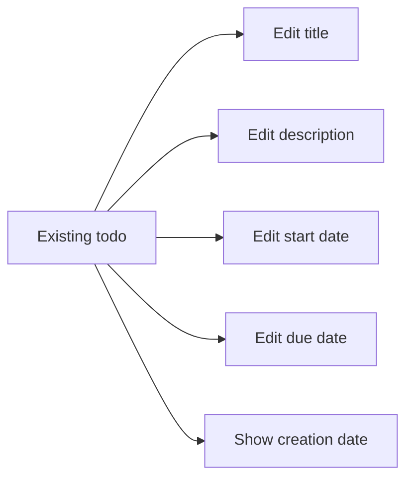

### Todo Deletion and Restoration Rules

- WHEN a member deletes a todo, THE todoApp SHALL treat the deletion as a soft delete.
- WHEN a todo is soft deleted, THE todoApp SHALL remove it from the normal todo list.
- WHILE a todo is in trash, THE todoApp SHALL treat it as not part of the active todo list.
- WHEN a member restores a deleted todo, THE todoApp SHALL return the same todo to the active todo list.
- WHEN a member restores a deleted todo, THE todoApp SHALL preserve the todo as the same business item rather than creating a new todo.
- WHEN a todo has been placed in trash, THE todoApp SHALL allow permanent removal as a separate business outcome.
- IF permanent removal is requested for a todo that is not in trash, THEN THE todoApp SHALL reject the request.

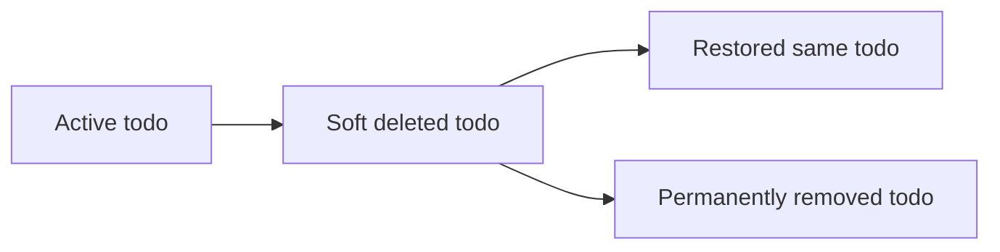

## TodoEditHistory Rules

Every time a todo is edited, a new edit history entry is created for that todo. Edit history belongs to a specific todo and has no independent business meaning outside that todo. Each history entry records when the edit was made. For each editable todo field, the history records what the value was changed to when that field changed as part of the edit. This means a history entry may include a changed title, changed description, changed start date, changed due date, or any combination of those changes from a single edit. Users can review the full history for a todo as a chronological record of its edits. History entries are ordered from most recent to oldest. Edit history remains attached to a deleted todo while that todo is in trash. When a todo is permanently deleted from trash, its edit history is also permanently deleted.

### History Entry Creation and Ownership

WHEN a user edits a todo, THE todoApp SHALL create one new edit history entry for that todo.

THE todoApp SHALL associate each edit history entry with one specific todo.

THE todoApp SHALL NOT create an edit history entry independently of a todo.

THE todoApp SHALL treat an edit history entry as part of the record of the todo to which it belongs.

WHEN an edit history entry is created, THE todoApp SHALL record when the edit was made.

IF no todo is being edited, THEN THE todoApp SHALL NOT create an edit history entry.

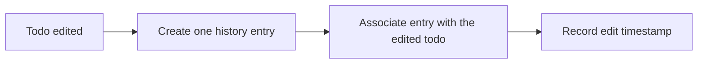

### Recorded Changed Values per Edit

WHEN the title is changed as part of an edit, THE todoApp SHALL record what the title was changed to in the history entry for that edit.

WHEN the description is changed as part of an edit, THE todoApp SHALL record what the description was changed to in the history entry for that edit.

WHEN the start date is changed as part of an edit, THE todoApp SHALL record what the start date was changed to in the history entry for that edit.

WHEN the due date is changed as part of an edit, THE todoApp SHALL record what the due date was changed to in the history entry for that edit.

IF a specific editable value is not changed during an edit, THEN THE todoApp SHALL NOT record a changed value for that specific item in the history entry for that edit.

WHEN a single edit changes more than one editable value, THE todoApp SHALL capture all changed values from that edit within the same history entry.

THE todoApp SHALL allow a history entry to contain any combination of changed title, changed description, changed start date, and changed due date values that occurred in one edit.

### History Review Order and Retention Rules

WHEN a user reviews the edit history of a todo, THE todoApp SHALL present the full edit history for that todo.

WHEN the edit history is displayed, THE todoApp SHALL order history entries from most recent to oldest.

WHILE a todo is in trash, THE todoApp SHALL retain the edit history attached to that todo.

WHEN a todo is permanently deleted from trash, THE todoApp SHALL permanently delete the edit history attached to that todo.

IF a todo has no edit history entries, THEN THE todoApp SHALL present the history for that todo as empty.

IF a todo has been permanently deleted from trash, THEN THE todoApp SHALL NOT retain or present its edit history.

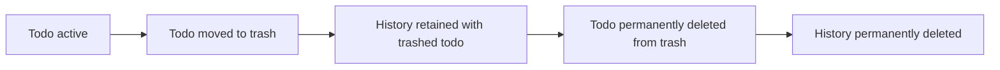

# Data Browsing Expectations

Business expectations for how users browse, find, and navigate through lists of data.

## List Browsing Expectations

Define business expectations for how users find, filter, and browse lists.

### Filtering by Completion Status

THE todoApp SHALL allow the member to filter the normal todo list by completion status using exactly these options: all todos, only complete todos, and only incomplete todos.

WHEN the member selects all todos, THE todoApp SHALL show both complete and incomplete todos that belong to the member and are not deleted.

WHEN the member selects only complete todos, THE todoApp SHALL show only the member's todos whose completion status is complete and that are not deleted.

WHEN the member selects only incomplete todos, THE todoApp SHALL show only the member's todos whose completion status is incomplete and that are not deleted.

THE todoApp SHALL apply completion status filtering only to the member's own normal todo list.

THE todoApp SHALL exclude deleted todos from filtered results in the normal todo list.

IF the member provides a completion status filter value other than all todos, only complete todos, or only incomplete todos, THEN THE todoApp SHALL reject the request.

IF the applied completion status filter produces no matching todos, THEN THE todoApp SHALL return an empty todo list for that filter.

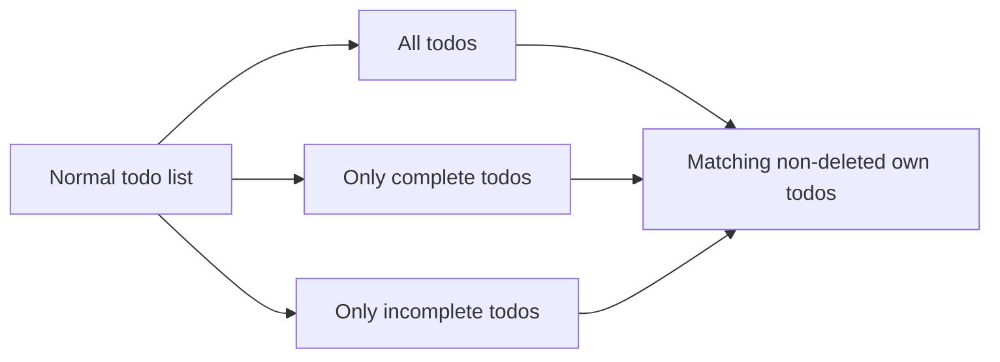

### Sorting Rules for Todo Lists

THE todoApp SHALL allow the member to sort the normal todo list by creation date, start date, or due date.

THE todoApp SHALL allow the member to sort by creation date in newest first order or oldest first order.

THE todoApp SHALL allow the member to sort by start date in earliest first order or latest first order.

THE todoApp SHALL allow the member to sort by due date in earliest first order or latest first order.

WHEN the member sorts by start date, THE todoApp SHALL place todos without a start date at the end of the list.

WHEN the member sorts by due date, THE todoApp SHALL place todos without a due date at the end of the list.

THE todoApp SHALL apply sorting only within the member's own normal todo list.

IF the member provides a sort field other than creation date, start date, or due date, THEN THE todoApp SHALL reject the request.

IF the member provides a sort direction not supported for the selected sort field, THEN THE todoApp SHALL reject the request.

IF multiple todos are returned after sorting, THEN THE todoApp SHALL present them in the selected order before pagination is applied.

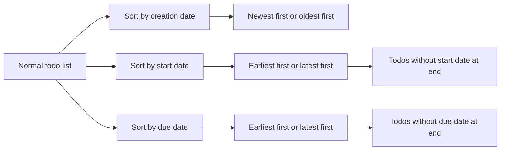

### Pagination Expectations for Todo and Trash Lists

THE todoApp SHALL present the member's normal todo list as a paginated list.

THE todoApp SHALL present the member's trash list as a paginated list.

WHEN the member requests a page of the normal todo list, THE todoApp SHALL return only todos for that requested page after filtering and sorting rules have been applied.

WHEN the member requests a page of the trash list, THE todoApp SHALL return only deleted todos for that requested page.

THE todoApp SHALL keep deleted todos out of the normal todo list pages.

THE todoApp SHALL keep non-deleted todos out of the trash list pages.

IF the requested page contains no todos, THEN THE todoApp SHALL return an empty list for that page.

IF the member requests a page outside the available paginated results, THEN THE todoApp SHALL return an empty list for that page.

WHEN the member browses paginated normal todo results, THE todoApp SHALL preserve the selected completion status filter and selected sort order for the returned page.

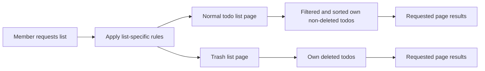

# Error Conditions

Business error scenarios and how the system should respond.

## Error Scenarios

Describe error conditions and expected system responses in natural language.

### Authentication Failure Rejection

WHEN a person attempts to sign up without an email address, THE todoApp SHALL reject the sign-up request.

WHEN a person attempts to sign up without a password, THE todoApp SHALL reject the sign-up request.

WHEN a person attempts to log in without an email address, THE todoApp SHALL reject the login request.

WHEN a person attempts to log in without a password, THE todoApp SHALL reject the login request.

WHEN a person attempts to log in with an email address and password combination that does not match an existing account credential pair, THE todoApp SHALL reject the login request.

WHEN an authenticated member attempts to change a password without providing the current account credential information required by the account change process defined in 01-actors-and-auth.md, THE todoApp SHALL reject the password change request.

WHEN a password change request is rejected, THE todoApp SHALL leave the existing password unchanged.

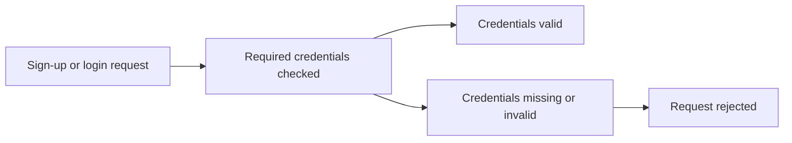

### Access Denied and Ownership Exceptions

WHEN a member requests a profile that does not belong to that member, THE todoApp SHALL reject the request.

WHEN a member requests a todo that does not belong to that member, THE todoApp SHALL reject the request.

WHEN a member requests the edit history of a todo that does not belong to that member, THE todoApp SHALL reject the request.

WHEN a member attempts to edit a todo that does not belong to that member, THE todoApp SHALL reject the edit request.

WHEN a member attempts to delete a todo that does not belong to that member, THE todoApp SHALL reject the delete request.

WHEN a member attempts to restore a deleted todo that does not belong to that member, THE todoApp SHALL reject the restore request.

WHEN a member attempts to permanently delete a deleted todo that does not belong to that member, THE todoApp SHALL reject the permanent deletion request.

IF a requested resource belongs to another user, THEN THE todoApp SHALL not disclose that resource's details through the rejected response.

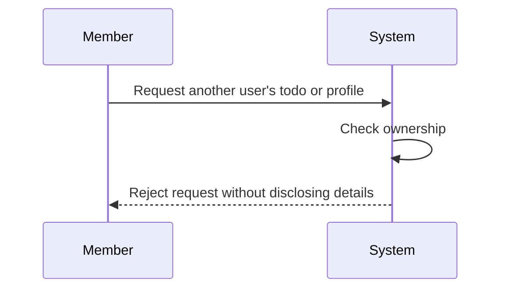

### Missing Todo and History Failure Cases

WHEN a member requests a single todo that does not exist, THE todoApp SHALL reject the request.

WHEN a member requests the edit history for a todo that does not exist, THE todoApp SHALL reject the request.

WHEN a member attempts to edit a todo that does not exist, THE todoApp SHALL reject the edit request.

WHEN a member attempts to mark a todo as complete and the todo does not exist, THE todoApp SHALL reject the request.

WHEN a member attempts to mark a todo as incomplete and the todo does not exist, THE todoApp SHALL reject the request.

WHEN a member attempts to delete a todo that does not exist, THE todoApp SHALL reject the delete request.

WHEN a member attempts to restore a deleted todo that does not exist, THE todoApp SHALL reject the restore request.

WHEN a member attempts to permanently delete a deleted todo that does not exist, THE todoApp SHALL reject the permanent deletion request.

IF a todo or history target cannot be found, THEN THE todoApp SHALL not create a new todo, history entry, or deletion result as part of that failed request.

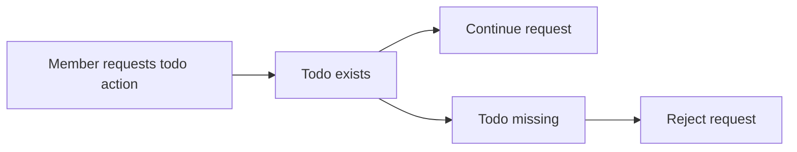

### Deleted State Exceptions

WHEN a member requests the normal todo list, THE todoApp SHALL exclude deleted todos from that list.

WHEN a member requests the trash list, THE todoApp SHALL include only deleted todos in that list.

WHEN a member attempts to restore a todo that is not in the deleted state, THE todoApp SHALL reject the restore request.

WHEN a member attempts to permanently delete a todo that is not in the deleted state, THE todoApp SHALL reject the permanent deletion request.

WHEN a member attempts to view a deleted todo through the normal todo browsing path, THE todoApp SHALL treat that request as unavailable in the normal todo list context.

WHEN a member successfully restores a deleted todo, THE todoApp SHALL return that todo to the normal todo list.

WHEN a member permanently deletes a todo from the trash, THE todoApp SHALL remove that todo from the trash.

WHEN a member permanently deletes a todo from the trash, THE todoApp SHALL delete the edit history associated with that todo.

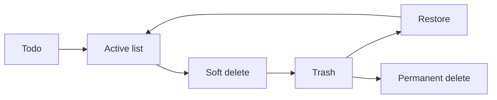