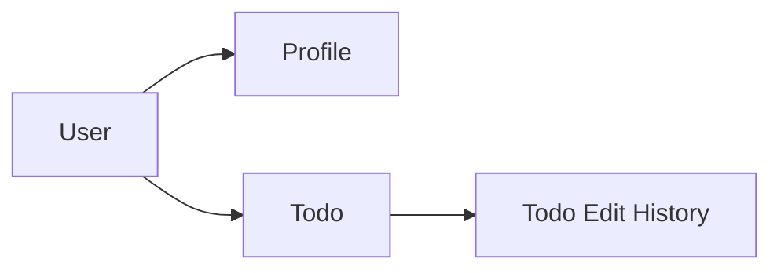
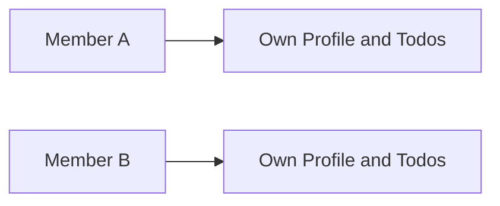
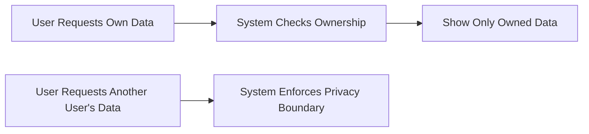
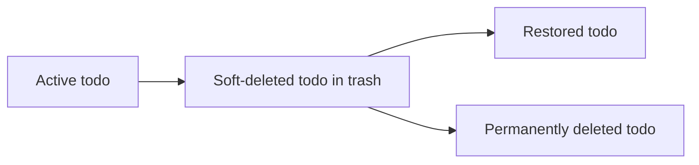

**todoApp — Data ownership, privacy, retention, and recovery policies**

Data ownership, privacy, retention, and recovery policies

# Data Policies

Data ownership, privacy, retention, and recovery policies from a business perspective.

## Data Ownership and Privacy

Define who owns what data, who can access it, and privacy boundaries between users.

### Data Ownership

Each user is the owner of their own account data within the application. This ownership includes the user's profile, the user's todos, and the edit history associated with those todos.

A user's todo data remains associated only with that user throughout its lifecycle, including while the todo is active and while it is in trash. Ownership does not transfer between users.

The application treats each todo and each related history entry as belonging to the same user who owns the parent todo. The profile also belongs only to the account owner it represents.

When a user chooses to delete their account, all data owned by that user is permanently removed, including active todos, deleted todos in trash, profile information, and edit history.

This file defines ownership of user data. Authentication and permission details are defined in [01-actors-and-auth.md](./01-actors-and-auth.md), and retention and recovery behavior for deleted todos is defined in the sibling section for Data Retention and Recovery.

### Data Isolation and Access Boundaries

The application keeps each user's data isolated from every other user. A user can access only the data they own.

A user can view only their own todos and the edit history of their own todos. A user can also view and manage only their own profile.

There is no capability for one user to browse, search, open, restore, edit, or delete another user's todos or history entries. There is also no capability for one user to view another user's profile.

The application is a private todo app. User data is not shared between users, and there is no sharing path that allows one user's todo information to become visible to another user.

If a user is signed in, the application must continue to enforce these boundaries for all todo-related and profile-related actions. Access control rules are defined canonically in [01-actors-and-auth.md](./01-actors-and-auth.md); this section defines the privacy boundary those rules must preserve.

### Private Access Control Expectations

Access to user data is based on ownership. The application must ensure that actions on todos, todo edit history, and profile information are limited to the account owner.

For todo data, the account owner may create, view, update, complete, uncomplete, delete, restore, and permanently remove only their own items, subject to the functional rules defined elsewhere in the specification.

For profile data, the account owner may view and edit only their own display name. No user may access another user's profile.

For account data, the account owner may change their own password and may delete their own account. No user may perform these actions for another user's account.

Whenever a user attempts to act on data that is not theirs, the application must reject that access according to the error-handling rules defined in [04-business-rules.md](./04-business-rules.md).

This section defines the non-functional expectation that access control is consistently ownership-based across all user data. Detailed permission definitions remain in [01-actors-and-auth.md](./01-actors-and-auth.md).

### Privacy Commitments

The application must preserve the privacy of each user's account, profile, todos, and todo edit history.

A user's profile is private and cannot be viewed by other users. A user's todos are completely private and cannot be viewed, accessed, or shared with other users.

The privacy expectation applies to both summary and detailed views. Other users must not be able to see todo titles, completion status, dates, descriptions, or edit history entries belonging to someone else.

Privacy also applies to deleted todos held in trash. A deleted todo remains private to its owner until it is permanently deleted.

The application must not provide any business feature that exposes another user's todo data or profile data to a different user. There is no user-facing sharing capability within the defined scope.

These privacy commitments apply uniformly across all areas of the application and must remain intact regardless of whether a todo is active, completed, incomplete, or in trash.

## Data Retention and Recovery

Define what happens to deleted data, how long it is retained, and how users can recover it.

### Soft Deletion and Retained State

When a user deletes a todo, the todo is moved into a deleted state rather than being removed immediately. In this deleted state, the todo no longer appears in the user's normal todo list and is retained in the user's trash until the user either restores it or permanently deletes it.

The deleted state preserves the todo as a recoverable item. Its title, description, start date, due date, completion status, creation date, and associated edit history remain available as part of the retained item while it stays in trash. This retained state supports later recovery without requiring the user to recreate the todo manually.

This file defines the retention meaning of soft deletion only. Visibility and access restrictions for who can see a user's data are defined in the Data Ownership and Privacy unit.

### Recovery from Trash

A deleted todo remains recoverable while it is still present in trash. The user can restore a deleted todo from trash, and once restored, the todo returns to the normal todo list rather than remaining in trash.

Recovery returns the same todo item instead of creating a new replacement item. The todo keeps its title, description, start date, due date, completion status, creation date, and edit history after it is restored.

Recovery is only available for todos that are in trash and not yet permanently deleted. After permanent deletion, recovery is no longer possible because the todo and its edit history are no longer available in the application.

The user-facing rules for browsing trash and restoring a todo are defined functionally in other sections of the specification. This section defines the recovery policy for deleted data.

### Permanent Deletion and Final Removal

Permanent deletion is the final removal action for a todo in trash. When a user permanently deletes a todo from trash, the todo can no longer be restored.

Permanent deletion also removes the todo's edit history. After this action is completed, the application no longer keeps the deleted todo or its edit history for later recovery.

Permanent deletion is distinct from deletion to trash. Deletion to trash keeps the todo recoverable, while permanent deletion ends recovery for that todo.

Account deletion follows the same final-removal principle at account scope. When a user deletes their account, all of their todos, including todos currently in trash, are permanently deleted. Because all such todos are permanently deleted as part of account deletion, recovery is not available after the account has been deleted.