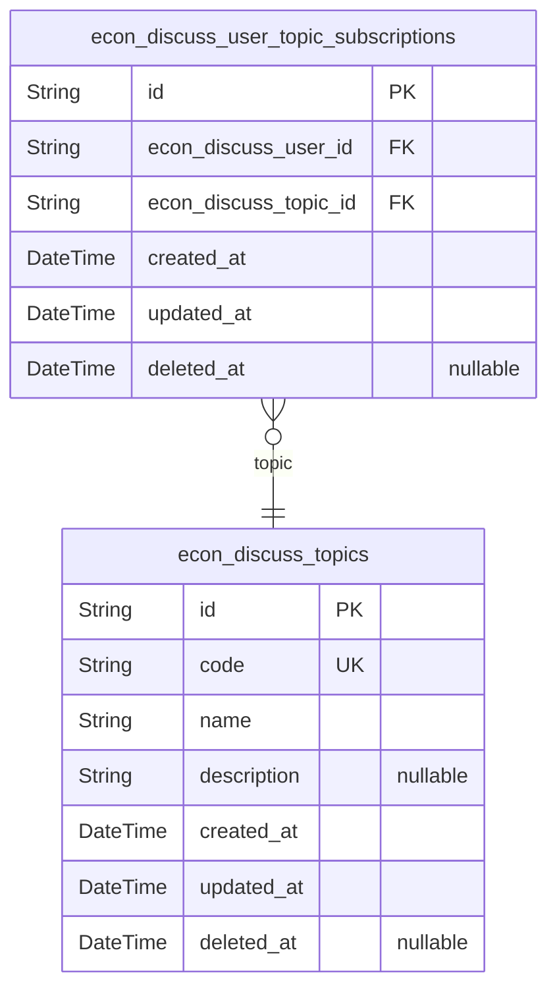
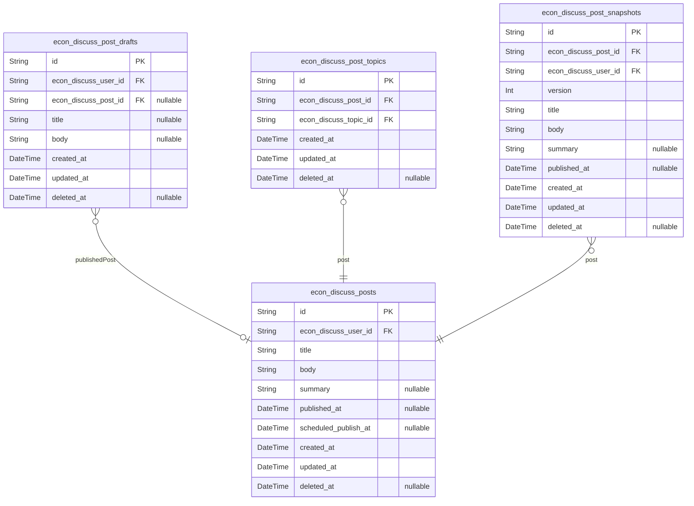
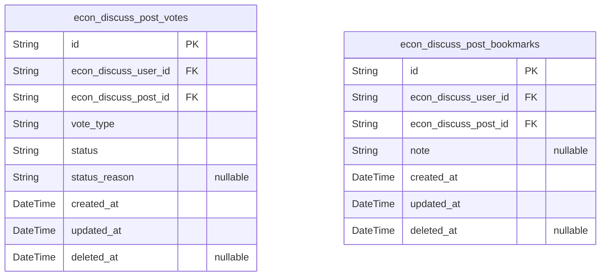
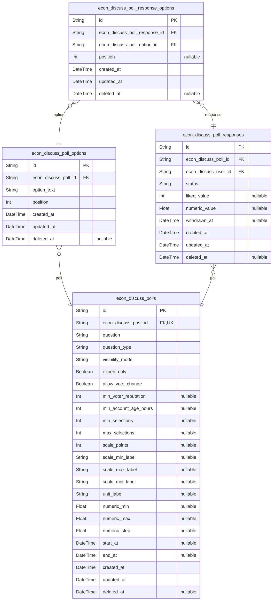
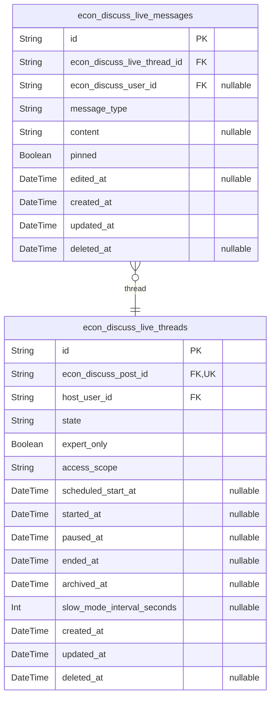

# Prisma Markdown

> Generated by [`prisma-markdown`](https://github.com/samchon/prisma-markdown)

- [Actors](#actors)
- [Topics](#topics)
- [Articles](#articles)
- [Interactions](#interactions)
- [Polls](#polls)
- [Live](#live)

## Actors

```mermaid
erDiagram
"econ_discuss_users" {
  String id PK
  String email UK
  String password_hash
  String display_name
  String(80000) avatar_uri "nullable"
  String timezone "nullable"
  String locale "nullable"
  Boolean email_verified
  Boolean mfa_enabled
  String mfa_secret "nullable"
  String mfa_recovery_codes "nullable"
  DateTime created_at
  DateTime updated_at
  DateTime deleted_at "nullable"
}
"econ_discuss_user_profiles" {
  String id PK
  String user_id FK,UK
  String bio "nullable"
  String affiliation "nullable"
  String(80000) website "nullable"
  String location "nullable"
  DateTime created_at
  DateTime updated_at
  DateTime deleted_at "nullable"
}
"econ_discuss_visitors" {
  String id PK
  String user_id FK,UK
  String notes "nullable"
  DateTime created_at
  DateTime updated_at
  DateTime deleted_at "nullable"
}
"econ_discuss_members" {
  String id PK
  String user_id FK,UK
  DateTime joined_at
  DateTime created_at
  DateTime updated_at
  DateTime deleted_at "nullable"
}
"econ_discuss_verified_experts" {
  String id PK
  String user_id FK,UK
  DateTime verified_at
  DateTime badge_valid_until "nullable"
  String primary_domain "nullable"
  DateTime created_at
  DateTime updated_at
  DateTime deleted_at "nullable"
}
"econ_discuss_moderators" {
  String id PK
  String user_id FK,UK
  Boolean enforced_2fa
  DateTime created_at
  DateTime updated_at
  DateTime deleted_at "nullable"
}
"econ_discuss_admins" {
  String id PK
  String user_id FK,UK
  Boolean superuser
  Boolean enforced_2fa
  DateTime created_at
  DateTime updated_at
  DateTime deleted_at "nullable"
}
"econ_discuss_user_follows" {
  String id PK
  String follower_user_id FK
  String followee_user_id FK
  DateTime created_at
  DateTime deleted_at "nullable"
}
"econ_discuss_notifications" {
  String id PK
  String recipient_user_id FK
  String actor_user_id FK "nullable"
  String type
  String title
  String body "nullable"
  String entity_type "nullable"
  String entity_id "nullable"
  DateTime read_at "nullable"
  DateTime created_at
  DateTime updated_at
  DateTime deleted_at "nullable"
}
"econ_discuss_user_reputations" {
  String id PK
  String user_id FK,UK
  Int score
  DateTime last_updated_at
  DateTime created_at
  DateTime updated_at
  DateTime deleted_at "nullable"
}
"econ_discuss_reputation_events" {
  String id PK
  String user_id FK
  String actor_user_id FK "nullable"
  String post_id FK "nullable"
  Int points
  String reason
  String source "nullable"
  DateTime occurred_at
  DateTime created_at
  DateTime updated_at
  DateTime deleted_at "nullable"
}
"econ_discuss_expert_domain_badges" {
  String id PK
  String user_id FK
  String econ_discuss_topic_id FK
  DateTime verified_at
  DateTime valid_until "nullable"
  DateTime revoked_at "nullable"
  String revoked_reason "nullable"
  DateTime created_at
  DateTime updated_at
  DateTime deleted_at "nullable"
}
"econ_discuss_user_profiles" |o--|| "econ_discuss_users" : user
"econ_discuss_visitors" |o--|| "econ_discuss_users" : user
"econ_discuss_members" |o--|| "econ_discuss_users" : user
"econ_discuss_verified_experts" |o--|| "econ_discuss_users" : user
"econ_discuss_moderators" |o--|| "econ_discuss_users" : user
"econ_discuss_admins" |o--|| "econ_discuss_users" : user
"econ_discuss_user_follows" }o--|| "econ_discuss_users" : follower
"econ_discuss_user_follows" }o--|| "econ_discuss_users" : followee
"econ_discuss_notifications" }o--|| "econ_discuss_users" : recipient
"econ_discuss_notifications" }o--o| "econ_discuss_users" : actor
"econ_discuss_user_reputations" |o--|| "econ_discuss_users" : user
"econ_discuss_reputation_events" }o--|| "econ_discuss_users" : user
"econ_discuss_reputation_events" }o--o| "econ_discuss_users" : actor
"econ_discuss_expert_domain_badges" }o--|| "econ_discuss_users" : user
```

### `econ_discuss_users`

Platform accounts and identity records for econDiscuss. Holds login
credentials, display identity, and preferences such as timezone and
locale. Adds secure 2FA storage (secret and recovery codes) to meet
policy. Primary reference for most other entities including {@link
econ_discuss_user_profiles}, [econ_discuss_user_follows](#econ_discuss_user_follows), {@link
econ_discuss_notifications}, [econ_discuss_user_reputations](#econ_discuss_user_reputations), and
[econ_discuss_reputation_events](#econ_discuss_reputation_events).

Properties as follows:

- `id`: Primary Key.
- `email`
  > User's unique email address for authentication and notifications. Store a
  > normalized lowercased form at application layer for uniqueness semantics.
- `password_hash`: Hashed password for email+password sign-in. Never store plaintext.
- `display_name`: Publicly visible display name or handle.
- `avatar_uri`
  > Optional avatar image URI for the profile. Keep within reasonable length
  > (e.g., ≤ 2048 chars) and validate format in application.
- `timezone`
  > IANA timezone identifier used for notifications, digests, and scheduling
  > (e.g., Asia/Seoul).
- `locale`: Preferred locale (e.g., en-US) for UI and communication.
- `email_verified`: Whether the email address has been verified.
- `mfa_enabled`: Whether multi-factor authentication is enabled for this account.
- `mfa_secret`
  > Encrypted/managed secret for TOTP (or equivalent 2FA). Store encrypted
  > and restrict access. Null when 2FA is not configured.
- `mfa_recovery_codes`
  > Hashed or encrypted 2FA recovery codes (concatenated or structured
  > storage). Rotated on regeneration. Null when 2FA not configured.
- `created_at`: Record creation timestamp.
- `updated_at`: Record last update timestamp.
- `deleted_at`: Soft deletion timestamp; null if active.

### `econ_discuss_user_profiles`

Extended profile details for a user. Managed through the owning {@link
econ_discuss_users} entity. Supports bio, affiliation, and web presence.
Enables richer discovery while keeping base identity minimal.

Properties as follows:

- `id`: Primary Key.
- `user_id`: Owning user's [econ_discuss_users.id](#econ_discuss_users).
- `bio`: Short biography or professional summary.
- `affiliation`: Current affiliation or organization string.
- `website`: Personal or professional website URI.
- `location`: Freeform location string for public display.
- `created_at`: Record creation timestamp.
- `updated_at`: Record last update timestamp.
- `deleted_at`: Soft deletion timestamp; null if active.

### `econ_discuss_visitors`

Role assignment table indicating a user has the "visitor" role scope
(read-only baseline). Although visitors generally represent
unauthenticated contexts, this table captures explicit role assignment
for edge or operational cases. Managed through {@link
econ_discuss_users}.

Properties as follows:

- `id`: Primary Key.
- `user_id`: Assigned user's [econ_discuss_users.id](#econ_discuss_users).
- `notes`
  > Optional notes about why this role assignment exists (e.g., operational
  > testing, restricted mode).
- `created_at`: Assignment creation timestamp.
- `updated_at`: Assignment last update timestamp.
- `deleted_at`: Soft deletion timestamp to end this role assignment.

### `econ_discuss_members`

Role assignment table for standard platform members with participation
privileges. Existence of a record implies member capabilities for the
linked [econ_discuss_users](#econ_discuss_users) account.

Properties as follows:

- `id`: Primary Key.
- `user_id`: Assigned user's [econ_discuss_users.id](#econ_discuss_users).
- `joined_at`: Timestamp when member role became effective.
- `created_at`: Record creation timestamp.
- `updated_at`: Record last update timestamp.
- `deleted_at`: Soft deletion timestamp to end this role assignment.

### `econ_discuss_verified_experts`

Role assignment for verified experts. Captures verification moment and
optional validity window for expert badges. Referenced by discovery and
gating policies via joins from [econ_discuss_users](#econ_discuss_users).

Properties as follows:

- `id`: Primary Key.
- `user_id`: Assigned user's [econ_discuss_users.id](#econ_discuss_users).
- `verified_at`: Timestamp when expert verification was approved.
- `badge_valid_until`: Optional expiration timestamp for the current expert badge.
- `primary_domain`
  > Primary economics domain (e.g., Macroeconomics, Labor) for display and
  > policy hints.
- `created_at`: Record creation timestamp.
- `updated_at`: Record last update timestamp.
- `deleted_at`: Soft deletion timestamp for revocation or expiry handling.

### `econ_discuss_moderators`

Role assignment for moderators with governance permissions. Requires 2FA
per policy. Managed through [econ_discuss_users](#econ_discuss_users).

Properties as follows:

- `id`: Primary Key.
- `user_id`: Assigned user's [econ_discuss_users.id](#econ_discuss_users).
- `enforced_2fa`
  > Whether 2FA enforcement is active for this moderator assignment per
  > policy.
- `created_at`: Record creation timestamp.
- `updated_at`: Record last update timestamp.
- `deleted_at`: Soft deletion timestamp to end this role assignment.

### `econ_discuss_admins`

Role assignment for platform administrators with full administrative
privileges. Requires 2FA and dual-control for severe actions. Mirrors
moderators with explicit 2FA enforcement flag. Managed through {@link
econ_discuss_users}.

Properties as follows:

- `id`: Primary Key.
- `user_id`: Assigned user's [econ_discuss_users.id](#econ_discuss_users).
- `superuser`: Whether this admin has superuser capabilities enabled by policy.
- `enforced_2fa`: Whether 2FA enforcement is active for this admin assignment per policy.
- `created_at`: Record creation timestamp.
- `updated_at`: Record last update timestamp.
- `deleted_at`: Soft deletion timestamp to end this role assignment.

### `econ_discuss_user_follows`

User-to-user follow relationships forming the social graph. Supports
listing followers/following and feed personalization. Both follower and
followee reference [econ_discuss_users](#econ_discuss_users).

Properties as follows:

- `id`: Primary Key.
- `follower_user_id`: Follower user's [econ_discuss_users.id](#econ_discuss_users).
- `followee_user_id`: Followed (target) user's [econ_discuss_users.id](#econ_discuss_users).
- `created_at`: Follow creation timestamp.
- `deleted_at`: Soft deletion timestamp; null if active.

### `econ_discuss_notifications`

Persisted notifications delivered to recipients. Each record targets a
recipient [econ_discuss_users](#econ_discuss_users) and may reference an actor {@link
econ_discuss_users}. Business consumers list, filter, and
mark-as-read/unread per user.

Properties as follows:

- `id`: Primary Key.
- `recipient_user_id`: Recipient user's [econ_discuss_users.id](#econ_discuss_users).
- `actor_user_id`
  > Optional actor user's [econ_discuss_users.id](#econ_discuss_users) that triggered the
  > notification.
- `type`: Notification type key (business category identifier).
- `title`: Short title or summary text for the notification.
- `body`: Optional detailed body text; localized per user locale.
- `entity_type`: Optional target entity type (e.g., post, comment, poll).
- `entity_id`
  > Optional target entity identifier for deep-linking (no FK to allow
  > polymorphism).
- `read_at`: Timestamp when the recipient read this notification; null if unread.
- `created_at`: Notification creation timestamp (send time).
- `updated_at`: Record last update timestamp.
- `deleted_at`: Soft deletion timestamp for recipient-side removal.

### `econ_discuss_user_reputations`

Current reputation aggregate per user, derived from {@link
econ_discuss_reputation_events}. Stores the latest computed score and
timestamp for quick gating checks while preserving full historical detail
in the ledger.

Properties as follows:

- `id`: Primary Key.
- `user_id`: Related user's [econ_discuss_users.id](#econ_discuss_users).
- `score`: Current reputation score for the user (non-negative integer).
- `last_updated_at`: Timestamp when the score was last recalculated.
- `created_at`: Record creation timestamp.
- `updated_at`: Record last update timestamp.
- `deleted_at`: Soft deletion timestamp for this aggregate, if deprecated.

### `econ_discuss_reputation_events`

Immutable ledger of reputation-impacting events for users. Each entry
captures points, reason, and optional linkage to a content item (e.g., a
[econ_discuss_posts](#econ_discuss_posts)). Serves as the audit trail and supports
recomputation of [econ_discuss_user_reputations](#econ_discuss_user_reputations).

Properties as follows:

- `id`: Primary Key.
- `user_id`: Beneficiary user's [econ_discuss_users.id](#econ_discuss_users).
- `actor_user_id`
  > Optional actor user's [econ_discuss_users.id](#econ_discuss_users) who caused the event
  > (e.g., curator, voter).
- `post_id`
  > Optional related post's [econ_discuss_posts.id](#econ_discuss_posts) for content-scoped
  > events.
- `points`
  > Signed integer delta applied to the user’s reputation for this event
  > (caps and decay applied externally).
- `reason`
  > Human-readable reason or category for the points change (e.g.,
  > upvote_post, curated_feature, moderation_penalty).
- `source`: Optional source system or process identifier for traceability.
- `occurred_at`
  > When the underlying action occurred; used for time-window calculations
  > and decay.
- `created_at`: Ledger entry creation timestamp.
- `updated_at`: Record last update timestamp (rare in append-only ledgers).
- `deleted_at`
  > Soft deletion timestamp for exceptional corrections; null in normal
  > operation.

### `econ_discuss_expert_domain_badges`

Per-domain expert badges assigned to verified experts. Normalizes
expertise domains as a junction between [econ_discuss_users](#econ_discuss_users) and
curated topics in [econ_discuss_topics](#econ_discuss_topics). Captures lifecycle with
verified_at, optional valid_until, and optional revocation metadata.
Supports expert-only filters and discovery surfaces while preserving
auditability.

Properties as follows:

- `id`: Primary Key.
- `user_id`: Owner expert user's [econ_discuss_users.id](#econ_discuss_users).
- `econ_discuss_topic_id`: Linked topic/domain badge [econ_discuss_topics.id](#econ_discuss_topics).
- `verified_at`: Timestamp when the domain badge was approved for the user.
- `valid_until`
  > Optional expiration timestamp for the domain badge; null if perpetual
  > until policy change or revocation.
- `revoked_at`: Optional timestamp when the domain badge was revoked for policy reasons.
- `revoked_reason`
  > Optional human-readable rationale for revocation (secured to governance
  > staff).
- `created_at`: Record creation timestamp.
- `updated_at`: Record last update timestamp.
- `deleted_at`: Soft deletion timestamp to retire this badge record.

## Topics

### `econ_discuss_topics`

Curated taxonomy of economics subjects used for organizing content and
personalization. Managed primarily by admins/moderators with clear naming
and optional description. Serves as the authoritative list of topics
referenced by [econ_discuss_post_topics](#econ_discuss_post_topics) and user subscriptions in
[econ_discuss_user_topic_subscriptions](#econ_discuss_user_topic_subscriptions). Includes temporal fields
for audit and soft deletion. Supports search through text indexes on name
and description.

Properties as follows:

- `id`: Primary Key.
- `code`
  > Immutable business identifier (slug-like) for the topic. Used in URLs and
  > external references; unique across all topics.
- `name`: Human-readable topic name shown to users. Used for search and display.
- `description`
  > Optional longer description of the topic’s scope and purpose for curation
  > context and tooltips.
- `created_at`: Creation timestamp of the topic record.
- `updated_at`: Last update timestamp of the topic record.
- `deleted_at`
  > Soft deletion timestamp. When set, the topic is considered
  > archived/removed from user-facing lists while preserved for audit.

### `econ_discuss_user_topic_subscriptions`

User-to-topic subscription relationship representing personalization
preferences. Each record indicates that a user follows a topic to
prioritize related content and digests. References {@link
econ_discuss_users} and [econ_discuss_topics](#econ_discuss_topics). Designed for
efficient queries by user and by topic, auditability via temporal fields,
and uniqueness per (user, topic).

Properties as follows:

- `id`: Primary Key.
- `econ_discuss_user_id`: Subscribed account’s [econ_discuss_users.id](#econ_discuss_users).
- `econ_discuss_topic_id`: Subscribed topic’s [econ_discuss_topics.id](#econ_discuss_topics).
- `created_at`: Creation timestamp when the subscription was established.
- `updated_at`: Last update timestamp of this subscription record.
- `deleted_at`
  > Soft deletion timestamp. When set, the subscription is considered
  > inactive but retained for audit and possible restoration.

## Articles

### `econ_discuss_posts`

Authored, published content items forming the core discussion surface.
Each post is created by a user and is discoverable via search, topic
associations, and timelines. Related entities like votes, bookmarks,
polls, and live threads exist in other components and reference this
table. Supports scheduled publishing via scheduled_publish_at and
maintains publication timestamps for feeds. Version history is captured
in [econ_discuss_post_snapshots](#econ_discuss_post_snapshots).

Properties as follows:

- `id`: Primary Key.
- `econ_discuss_user_id`
  > Author user's [econ_discuss_users.id](#econ_discuss_users). Identifies who created the
  > post.
- `title`: Human-readable post title for listing and SEO. Required at publish time.
- `body`
  > Main content body in sanitized, possibly markdown-like format. Used for
  > full-text search.
- `summary`: Optional short abstract or excerpt for previews and feeds.
- `published_at`
  > Publication timestamp. Supports chronological feeds and scheduling
  > validations. May equal created_at on immediate publish.
- `scheduled_publish_at`
  > Optional scheduled time for future publication (stored in UTC, displayed
  > in user timezone). Used to validate scheduling windows and drive
  > publisher jobs.
- `created_at`: Creation timestamp for the post record.
- `updated_at`: Last update timestamp for the post record.
- `deleted_at`: Soft deletion timestamp when the post is removed from public visibility.

### `econ_discuss_post_drafts`

Private, autosaved drafts authored by users for long-form writing before
publication. Drafts are not publicly visible and support cross-device
synchronization and conflict resolution in application logic. Optionally
linked to a resulting published post for traceability. {@link
econ_discuss_users} authors; optional link to [econ_discuss_posts](#econ_discuss_posts).

Properties as follows:

- `id`: Primary Key.
- `econ_discuss_user_id`: Author user's [econ_discuss_users.id](#econ_discuss_users). Owner of this draft.
- `econ_discuss_post_id`
  > Optional linkage to the published post's [econ_discuss_posts.id](#econ_discuss_posts)
  > created from this draft (if any). Multiple drafts may relate to one post.
- `title`
  > Working draft title. Optional to allow early autosave before title is
  > chosen.
- `body`: Working draft body content. Optional to support early autosaves.
- `created_at`: Creation timestamp for the draft.
- `updated_at`: Last update timestamp for the draft (used by autosave sync and ordering).
- `deleted_at`: Soft deletion timestamp when the draft is discarded.

### `econ_discuss_post_topics`

Junction association between posts and curated topics to support
filtering, discovery, and subscriptions. Enforces uniqueness per (post,
topic). [econ_discuss_posts](#econ_discuss_posts) to [econ_discuss_topics](#econ_discuss_topics).
Includes additional recency index for topic pages.

Properties as follows:

- `id`: Primary Key.
- `econ_discuss_post_id`: Associated post's [econ_discuss_posts.id](#econ_discuss_posts).
- `econ_discuss_topic_id`: Associated topic's [econ_discuss_topics.id](#econ_discuss_topics).
- `created_at`: Creation timestamp for the association.
- `updated_at`: Last update timestamp for the association.
- `deleted_at`: Soft deletion timestamp when the association is logically removed.

### `econ_discuss_post_snapshots`

Historical snapshots of [econ_discuss_posts](#econ_discuss_posts) capturing the exact
state of a post at a point in time for auditability and public version
history. Each snapshot stores the full text fields and publication state.
Versions are unique per post and are typically append-only.

Properties as follows:

- `id`: Primary Key.
- `econ_discuss_post_id`: Source post’s [econ_discuss_posts.id](#econ_discuss_posts).
- `econ_discuss_user_id`
  > Editor/author’s [econ_discuss_users.id](#econ_discuss_users) responsible for this
  > snapshot.
- `version`
  > Monotonic version number per post. Combined with post_id to enforce
  > uniqueness.
- `title`: Snapshot of the post title at this version.
- `body`: Snapshot of the post body at this version.
- `summary`: Snapshot of the post summary at this version.
- `published_at`: Post’s published_at value at the time of snapshot (null if unpublished).
- `created_at`: Snapshot creation timestamp (when this version was recorded).
- `updated_at`
  > Last update timestamp for this snapshot record (rarely used; retained for
  > consistency).
- `deleted_at`
  > Soft deletion timestamp for exceptional corrections; normally null in
  > append-only operation.

## Interactions

### `econ_discuss_post_votes`

Post voting interactions supporting both upvotes and downvotes with full
lifecycle states. Each record represents a single member’s vote on a
specific post and maintains idempotency via a unique (user, post)
constraint. Includes status tracking to support switching/withdrawal
windows and integrity outcomes (discounted/invalidated). References
[econ_discuss_users](#econ_discuss_users) as voter and [econ_discuss_posts](#econ_discuss_posts) as
target post. Optimized for time-window analytics and user-private
history.

Properties as follows:

- `id`: Primary Key.
- `econ_discuss_user_id`: Voting member’s [econ_discuss_users.id](#econ_discuss_users).
- `econ_discuss_post_id`: Target post’s [econ_discuss_posts.id](#econ_discuss_posts).
- `vote_type`
  > Type of vote: allowed values are "up" or "down". Used for content
  > aggregates, reputation weighting, and trending windows.
- `status`
  > Lifecycle state of the vote: allowed values are "active", "withdrawn",
  > "switched", "discounted", or "invalidated". Application logic enforces
  > transitions and time windows.
- `status_reason`
  > Optional reason/category when status is discounted/invalidated (e.g.,
  > integrity_violation, moderation_invalidation).
- `created_at`: Vote creation timestamp for history and time-window analytics.
- `updated_at`
  > Vote last update timestamp (e.g., on switch/withdrawal or moderation
  > outcome).
- `deleted_at`
  > Soft delete timestamp for exceptional removals. Prefer status transitions
  > over deletion for auditability.

### `econ_discuss_post_bookmarks`

User saved-item relationships for posts with owner-only personal notes.
Each record indicates that a member saved a given post to their personal
bookmarks. Enforces idempotent saves via unique (user, post). References
[econ_discuss_users](#econ_discuss_users) as owner and [econ_discuss_posts](#econ_discuss_posts) as
saved post. Notes remain private to the owner (application-enforced).

Properties as follows:

- `id`: Primary Key.
- `econ_discuss_user_id`: Bookmark owner’s [econ_discuss_users.id](#econ_discuss_users).
- `econ_discuss_post_id`: Saved post’s [econ_discuss_posts.id](#econ_discuss_posts).
- `note`
  > Owner-only personal note attached to the saved item. Excluded from any
  > shared collection views and external exports to others.
- `created_at`: Bookmark creation timestamp used for listing, sorting, and export.
- `updated_at`
  > Timestamp when the bookmark record was last updated (including note
  > edits).
- `deleted_at`
  > Soft delete timestamp to support reversible unbookmark operations, audit
  > trails, and delayed purging.

## Polls

### `econ_discuss_polls`

Poll entity attached to a post with explicit support for multiple
question types (single choice, multiple choice, Likert, ranking, numeric
estimate), visibility modes, expert-only eligibility, vote-change policy,
and per-type configuration. One-to-one with [econ_discuss_posts](#econ_discuss_posts).
Options are stored in [econ_discuss_poll_options](#econ_discuss_poll_options). Responses reside
in [econ_discuss_poll_responses](#econ_discuss_poll_responses) with selections in {@link
econ_discuss_poll_response_options} for multi-select and ranking.

Properties as follows:

- `id`: Primary Key.
- `econ_discuss_post_id`: Host post's [econ_discuss_posts.id](#econ_discuss_posts). Exactly one poll per post.
- `question`: Poll prompt shown to voters.
- `question_type`
  > Type of question: single_choice, multiple_choice, likert, ranking,
  > numeric_estimate. Application enforces valid values.
- `visibility_mode`
  > Visibility mode: hidden_until_close (default), visible_after_vote,
  > always_visible (policy may disallow for expert-only).
- `expert_only`: Whether voting/participation is restricted to verified experts and staff.
- `allow_vote_change`
  > Whether respondents may change their vote prior to poll closure. Default
  > business policy: enabled.
- `min_voter_reputation`
  > Optional minimum voter reputation required to participate (members below
  > are ineligible).
- `min_account_age_hours`: Optional minimum account age in hours for eligibility (e.g., 48).
- `min_selections`: For multiple_choice: minimum number of selections required.
- `max_selections`
  > For multiple_choice: maximum number of selections allowed (≤ number of
  > options).
- `scale_points`: For likert: number of scale points (commonly 5 or 7).
- `scale_min_label`: For likert: label for the minimum endpoint.
- `scale_max_label`: For likert: label for the maximum endpoint.
- `scale_mid_label`: For likert: optional midpoint label.
- `unit_label`: For numeric_estimate: unit label (e.g., %, index points).
- `numeric_min`: For numeric_estimate: minimum allowed value.
- `numeric_max`: For numeric_estimate: maximum allowed value.
- `numeric_step`: For numeric_estimate: step size/precision for rounding.
- `start_at`: Scheduled start time when the poll opens for responses (optional).
- `end_at`: Scheduled end time after which responses are closed (optional).
- `created_at`: Creation timestamp for audit and ordering.
- `updated_at`: Last update timestamp for audit and cache invalidation.
- `deleted_at`
  > Soft deletion timestamp. When set, the poll is considered removed from
  > active use.

### `econ_discuss_poll_options`

Answer options for a given poll. Each option belongs to one {@link
econ_discuss_polls} and participates in per-poll uniqueness and display
ordering. Managed through the parent poll lifecycle.

Properties as follows:

- `id`: Primary Key.
- `econ_discuss_poll_id`: Owner poll's [econ_discuss_polls.id](#econ_discuss_polls).
- `option_text`: Display text for the option. Must be unique within the same poll.
- `position`
  > Zero- or one-based position for deterministic display ordering within a
  > poll.
- `created_at`: Creation timestamp.
- `updated_at`: Last update timestamp.
- `deleted_at`: Soft deletion timestamp to retire an option without losing history.

### `econ_discuss_poll_responses`

One response per (poll, user) capturing lifecycle status, timestamps, and
type-specific values. Option selections are recorded in {@link
econ_discuss_poll_response_options} to support multiple choice and
ranking. Likert responses use likert_value; numeric estimate uses
numeric_value. Withdrawals and integrity actions are modeled via status
and withdrawn_at.

Properties as follows:

- `id`: Primary Key.
- `econ_discuss_poll_id`: Target poll's [econ_discuss_polls.id](#econ_discuss_polls).
- `econ_discuss_user_id`: Respondent user's [econ_discuss_users.id](#econ_discuss_users).
- `status`
  > Response status: active, withdrawn, quarantined, invalidated. Used for
  > moderation and integrity flows.
- `likert_value`: For likert: selected integer value within the defined scale points.
- `numeric_value`: For numeric_estimate: submitted numeric value (unit and bounds on poll).
- `withdrawn_at`: Timestamp when the respondent withdrew their vote (if applicable).
- `created_at`
  > Response creation timestamp used for user history and time-window
  > analytics.
- `updated_at`: Last update timestamp (e.g., when editing within allowed window).
- `deleted_at`
  > Soft deletion timestamp. When set, the response is removed from active
  > tallies; moderation may also use status to indicate reason.

### `econ_discuss_poll_response_options`

Junction table linking a response to one or more options, enabling
multiple choice and ranking support. When ranking is used, the position
field stores the order assigned by the respondent (1 = highest). For
single-choice questions, there will be exactly one row per response.

Properties as follows:

- `id`: Primary Key.
- `econ_discuss_poll_response_id`: Linked response's [econ_discuss_poll_responses.id](#econ_discuss_poll_responses).
- `econ_discuss_poll_option_id`: Selected option's [econ_discuss_poll_options.id](#econ_discuss_poll_options).
- `position`: For ranking questions: position order (1..N). Null for non-ranking types.
- `created_at`: Creation timestamp for the selection record.
- `updated_at`: Last update timestamp for the selection record.
- `deleted_at`: Soft deletion timestamp to remove a selection without losing audit trail.

## Live

### `econ_discuss_live_threads`

Represents a live discussion thread (room) attached to a specific post.
One-to-one with [econ_discuss_posts](#econ_discuss_posts). Tracks lifecycle state
(scheduled, waiting, live, paused, ended, archived), configuration flags
(e.g., expert-only), access scope governance, and key timestamps for
operations. Messages are stored in [econ_discuss_live_messages](#econ_discuss_live_messages).
Managed independently from the post for starting, pausing, ending, and
archiving workflows.

Properties as follows:

- `id`: Primary Key.
- `econ_discuss_post_id`
  > Host post's [econ_discuss_posts.id](#econ_discuss_posts). Exactly one live thread per
  > post.
- `host_user_id`
  > Host user's [econ_discuss_users.id](#econ_discuss_users) who can start/pause/end this
  > live thread. Co-hosts/participants may be modeled separately.
- `state`
  > Lifecycle state of the live thread. Allowed values
  > (application-enforced): scheduled, waiting, live, paused, ended,
  > archived.
- `expert_only`
  > Whether participation is restricted to verified experts and staff
  > (expert-only mode). Reading may remain broader per policy.
- `access_scope`
  > Access scope for participation/visibility. Allowed values
  > (application-enforced): public, followers_only, topic_subscribers_only,
  > invite_only.
- `scheduled_start_at`
  > Planned start time for scheduled rooms (displayed in user’s timezone;
  > stored canonical in UTC).
- `started_at`: Actual start time when the room transitions to live.
- `paused_at`: Timestamp when the room was paused. Null when not paused.
- `ended_at`: Timestamp when the room ended. Null if still ongoing.
- `archived_at`: Timestamp when the room was archived and made read-only.
- `slow_mode_interval_seconds`
  > Optional slow-mode interval (in seconds) limiting how frequently a
  > participant may post messages.
- `created_at`: Creation timestamp of the live thread entity.
- `updated_at`: Last update timestamp of the live thread entity.
- `deleted_at`
  > Soft deletion timestamp. When set, the thread is no longer active but
  > retained for audit/restore windows.

### `econ_discuss_live_messages`

Live chat messages belonging to [econ_discuss_live_threads](#econ_discuss_live_threads).
Authored by users from [econ_discuss_users](#econ_discuss_users). Stores raw message
content, type, and lifecycle timestamps for ordering and limited edits.
Used to render real-time streams and archived transcripts. Author is
nullable to preserve transcripts when user accounts are
deleted/anonymized.

Properties as follows:

- `id`: Primary Key.
- `econ_discuss_live_thread_id`: Belonged live thread’s [econ_discuss_live_threads.id](#econ_discuss_live_threads).
- `econ_discuss_user_id`
  > Author user’s [econ_discuss_users.id](#econ_discuss_users). Nullable to preserve
  > transcripts by anonymizing author when the user is deleted.
- `message_type`
  > Type of message for rendering/controls. Allowed values
  > (application-enforced): text, system, poll_prompt, poll_result,
  > moderation_notice, pinned.
- `content`
  > Message body text (for system/control messages this may be short
  > explanatory text).
- `pinned`
  > Whether this message is currently pinned for context within the live
  > thread.
- `edited_at`: Timestamp of last edit within allowed edit window. Null if never edited.
- `created_at`
  > Creation timestamp; also serves as the chronological ordering key for
  > fan-out and transcript views.
- `updated_at`: Last update timestamp (e.g., pin/unpin, edit).
- `deleted_at`
  > Soft deletion timestamp for moderated or removed messages while
  > preserving transcript placeholders as required.
