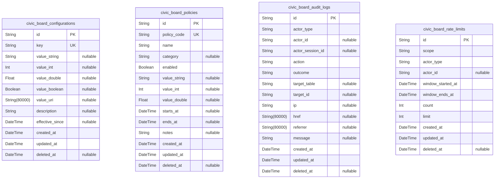
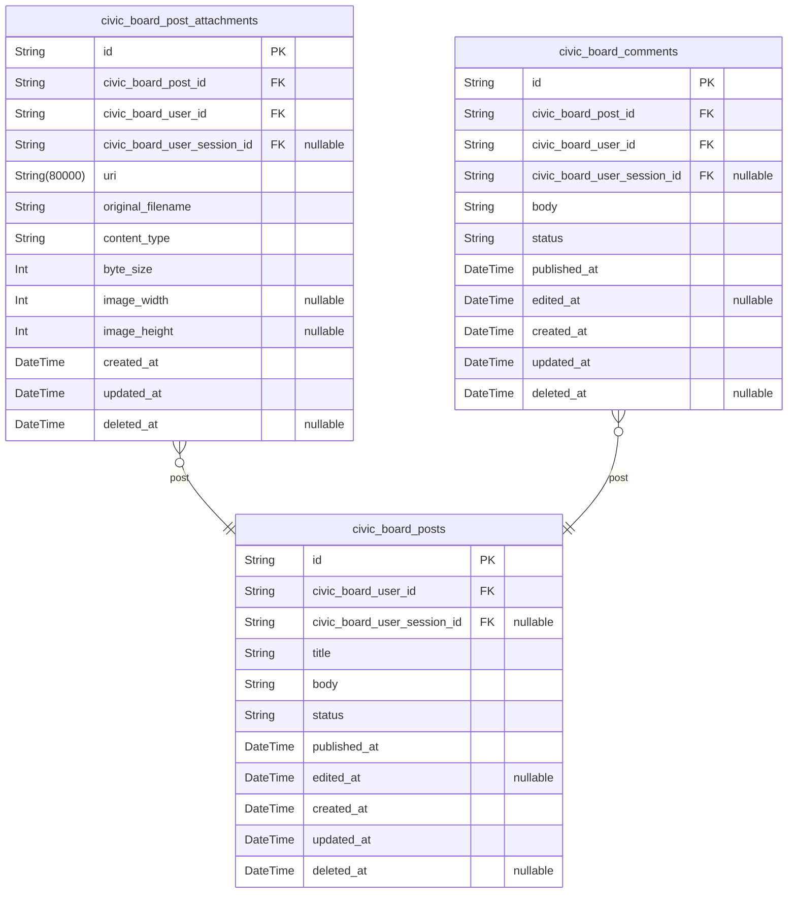
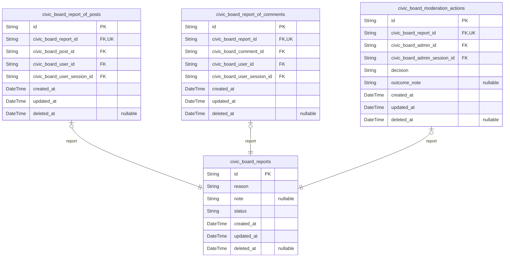
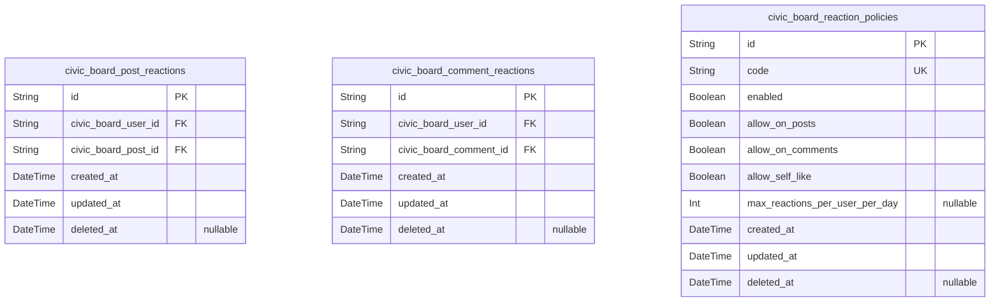

# Prisma Markdown

> Generated by [`prisma-markdown`](https://github.com/samchon/prisma-markdown)

- [Systematic](#systematic)
- [Actors](#actors)
- [Articles](#articles)
- [Moderation](#moderation)
- [Reactions](#reactions)

## Systematic

```mermaid
erDiagram
"civic_board_configurations" {
  String id PK
  String key UK
  String value_string "nullable"
  Int value_int "nullable"
  Float value_double "nullable"
  Boolean value_boolean "nullable"
  String(80000) value_uri "nullable"
  String description "nullable"
  DateTime effective_since "nullable"
  DateTime created_at
  DateTime updated_at
  DateTime deleted_at "nullable"
}
"civic_board_policies" {
  String id PK
  String policy_code UK
  String name
  String category "nullable"
  Boolean enabled
  String value_string "nullable"
  Int value_int "nullable"
  Float value_double "nullable"
  DateTime starts_at "nullable"
  DateTime ends_at "nullable"
  String notes "nullable"
  DateTime created_at
  DateTime updated_at
  DateTime deleted_at "nullable"
}
"civic_board_audit_logs" {
  String id PK
  String actor_type
  String actor_id "nullable"
  String actor_session_id "nullable"
  String action
  String outcome
  String target_table "nullable"
  String target_id "nullable"
  String ip "nullable"
  String(80000) href "nullable"
  String(80000) referrer "nullable"
  String message "nullable"
  DateTime created_at
  DateTime updated_at
  DateTime deleted_at "nullable"
}
"civic_board_rate_limits" {
  String id PK
  String scope
  String actor_type
  String actor_id "nullable"
  DateTime window_started_at
  DateTime window_ends_at
  Int count
  Int limit
  DateTime created_at
  DateTime updated_at
  DateTime deleted_at "nullable"
}
```

### `civic_board_configurations`

System-wide configuration entries stored as independent key-value
records. Used to toggle features, define thresholds, or set URIs across
the platform. This table is intentionally decoupled from domain content
and identities to avoid dependency cycles. Managed primarily by
administrators through configuration UIs or scripts; referenced by
runtime services to read current settings. No foreign keys are declared
to other domains.

Properties as follows:

- `id`: Primary Key.
- `key`
  > Unique configuration identifier (e.g., "public_read",
  > "attachments.max_count"). Serves as the business key for lookups.
- `value_string`
  > String value for this configuration when applicable. Only one of the
  > typed value columns is expected to be used per row.
- `value_int`
  > Integer value for this configuration when applicable (e.g., numeric
  > limits).
- `value_double`
  > Decimal value for this configuration when applicable (e.g., thresholds or
  > ratios).
- `value_boolean`
  > Boolean value for this configuration when applicable (e.g., feature
  > toggle).
- `value_uri`
  > URI value for this configuration when applicable (e.g., callback URLs,
  > CDN endpoints).
- `description`: Human-readable explanation of the configuration purpose and usage.
- `effective_since`: Optional timestamp indicating when this configuration became effective.
- `created_at`: Creation timestamp (UTC).
- `updated_at`: Last update timestamp (UTC).
- `deleted_at`: Soft deletion timestamp for retention and operational safety.

### `civic_board_policies`

System policies governing platform behavior such as public-read,
moderation defaults, and feature switches. Each policy is an
independently managed record with an optional effective window. This
table is maintained by administrators and does not reference domain
content directly. Related changes are recorded in {@link
civic_board_audit_logs}.

Properties as follows:

- `id`: Primary Key.
- `policy_code`
  > Stable policy identifier (e.g., "public_read", "attachments.policy",
  > "report.duplicate_cooldown_hours"). Unique across the system.
- `name`: Human-friendly policy name for administrative UIs.
- `category`
  > Optional category for grouping related policies (e.g., "visibility",
  > "attachments", "reporting").
- `enabled`
  > Whether the policy is currently enabled. For value-carrying policies,
  > this indicates if enforcement is active.
- `value_string`: Optional string value carried by the policy (e.g., textual rule).
- `value_int`: Optional integer value (e.g., max counts, cooldown hours).
- `value_double`
  > Optional decimal value (e.g., size limits in MB with fractional
  > precision).
- `starts_at`: Optional start of the policy’s effective window (UTC).
- `ends_at`: Optional end of the policy’s effective window (UTC).
- `notes`
  > Administrative notes describing policy rationale or change context (not
  > shown to end users).
- `created_at`: Creation timestamp (UTC).
- `updated_at`: Last update timestamp (UTC).
- `deleted_at`: Soft deletion timestamp for retention and operational safety.

### `civic_board_audit_logs`

Append-only audit trail capturing security- and compliance-relevant
events across the system. Records the acting entity (user/admin/system),
optional session context, target reference, action name, outcome, and
request metadata. Designed for historical analysis and investigations;
not intended for direct user manipulation. This table provides the
system’s audit history for changes in [civic_board_policies](#civic_board_policies) and
[civic_board_configurations](#civic_board_configurations), as well as domain operations.

Properties as follows:

- `id`: Primary Key.
- `actor_type`
  > Type of actor that initiated the event (e.g., "user", "admin", "system").
  > Stored as raw text to avoid cross-domain foreign keys.
- `actor_id`
  > Identifier of the actor, when applicable. Stored without a foreign key to
  > avoid domain coupling.
- `actor_session_id`
  > Identifier of the actor session when applicable. Stored without a foreign
  > key to avoid domain coupling.
- `action`
  > Business action name (e.g., "post.create", "comment.delete",
  > "policy.update").
- `outcome`: Outcome summary (e.g., "success", "failure:rate_limited").
- `target_table`
  > Target table name when the action is scoped to a resource (e.g.,
  > "civic_board_posts").
- `target_id`
  > Target resource identifier when applicable. Stored without foreign key to
  > avoid coupling.
- `ip`: IP address observed for the request context, when available.
- `href`: Full request URL, when available.
- `referrer`: Referrer URL, when available.
- `message`: Optional human-readable message or error context to aid investigations.
- `created_at`: Event creation timestamp (UTC).
- `updated_at`
  > Timestamp for any administrative update (e.g., redaction). Normally equal
  > to created_at for immutable entries.
- `deleted_at`: Soft deletion timestamp for retention or legal hold workflows.

### `civic_board_rate_limits`

Operational store for rate limiting windows and counters per actor and
scope. Managed by the system to enforce anti-abuse policies (e.g.,
post/comment/report creation, login attempts). Records are
created/updated within short time windows and expired/cleaned by
background tasks. No foreign keys to identities to avoid cross-domain
coupling.

Properties as follows:

- `id`: Primary Key.
- `scope`
  > Logical action scope for the rate limit (e.g., "post.create",
  > "comment.create", "report.create", "login.failed").
- `actor_type`
  > Actor type constrained by business logic (e.g., "user", "admin", "ip").
  > Stored as text to avoid cross-domain keys.
- `actor_id`
  > Identifier of the actor when applicable (e.g., user/admin). For IP-scoped
  > limits, this may be a surrogate or left null if not applicable.
- `window_started_at`: Start timestamp (UTC) of the rate limit window represented by this record.
- `window_ends_at`: End timestamp (UTC) of the rate limit window represented by this record.
- `count`: Number of actions performed during the window at the time of update.
- `limit`: Enforced maximum actions allowed during the window per actor and scope.
- `created_at`: Record creation timestamp (UTC).
- `updated_at`: Last update timestamp (UTC).
- `deleted_at`: Soft deletion timestamp to permit safe retention before purge.

## Actors

```mermaid
erDiagram
"civic_board_users" {
  String id PK
  String email UK
  String password_hash
  String display_name
  Boolean email_verified
  Boolean suspended
  DateTime suspended_at "nullable"
  DateTime created_at
  DateTime updated_at
  DateTime deleted_at "nullable"
}
"civic_board_user_sessions" {
  String id PK
  String civic_board_user_id FK
  String ip
  String(80000) href
  String(80000) referrer
  DateTime created_at
  DateTime expired_at "nullable"
}
"civic_board_admins" {
  String id PK
  String email UK
  String password_hash
  String display_name
  Boolean email_verified
  Boolean suspended
  DateTime suspended_at "nullable"
  DateTime created_at
  DateTime updated_at
  DateTime deleted_at "nullable"
}
"civic_board_admin_sessions" {
  String id PK
  String civic_board_admin_id FK
  String ip
  String(80000) href
  String(80000) referrer
  DateTime created_at
  DateTime expired_at "nullable"
}
"civic_board_email_verifications" {
  String id PK
  String actor_type
  String email
  String token UK
  DateTime expires_at
  Boolean used
  DateTime used_at "nullable"
  DateTime created_at
  DateTime updated_at
  DateTime deleted_at "nullable"
}
"civic_board_email_verification_of_users" {
  String id PK
  String civic_board_email_verification_id FK,UK
  String civic_board_user_id FK
  DateTime created_at
}
"civic_board_email_verification_of_admins" {
  String id PK
  String civic_board_email_verification_id FK,UK
  String civic_board_admin_id FK
  DateTime created_at
}
"civic_board_password_reset_tokens" {
  String id PK
  String actor_type
  String token UK
  DateTime expires_at
  Boolean used
  DateTime used_at "nullable"
  DateTime created_at
  DateTime updated_at
  DateTime deleted_at "nullable"
}
"civic_board_password_reset_token_of_users" {
  String id PK
  String civic_board_password_reset_token_id FK,UK
  String civic_board_user_id FK
  DateTime created_at
}
"civic_board_password_reset_token_of_admins" {
  String id PK
  String civic_board_password_reset_token_id FK,UK
  String civic_board_admin_id FK
  DateTime created_at
}
"civic_board_user_sessions" }o--|| "civic_board_users" : user
"civic_board_admin_sessions" }o--|| "civic_board_admins" : admin
"civic_board_email_verification_of_users" |o--|| "civic_board_email_verifications" : emailVerification
"civic_board_email_verification_of_users" }o--|| "civic_board_users" : user
"civic_board_email_verification_of_admins" |o--|| "civic_board_email_verifications" : emailVerification
"civic_board_email_verification_of_admins" }o--|| "civic_board_admins" : admin
"civic_board_password_reset_token_of_users" |o--|| "civic_board_password_reset_tokens" : passwordResetToken
"civic_board_password_reset_token_of_users" }o--|| "civic_board_users" : user
"civic_board_password_reset_token_of_admins" |o--|| "civic_board_password_reset_tokens" : passwordResetToken
"civic_board_password_reset_token_of_admins" }o--|| "civic_board_admins" : admin
```

### `civic_board_users`

Registered member accounts for the civicBoard application. Stores
authentication credentials and profile-facing display attributes. Serves
as the primary identity for regular users who author posts and comments.
Related entities include session records {@link
civic_board_user_sessions} and verification/reset flows via {@link
civic_board_email_verification_of_users} and {@link
civic_board_password_reset_token_of_users}.

Properties as follows:

- `id`: Primary Key.
- `email`
  > Login and contact email for the user. Must be unique across all users and
  > used for verification workflows.
- `password_hash`
  > BCrypt or similar password hash for authentication. Never store plain
  > passwords.
- `display_name`
  > Public display name shown on authored content instead of email for
  > privacy.
- `email_verified`
  > Whether the user’s email has been verified. Governs posting/commenting
  > eligibility.
- `suspended`
  > Whether the account is currently suspended and restricted from creating
  > or modifying content.
- `suspended_at`: Timestamp when the account was suspended, if applicable.
- `created_at`: Record creation time (UTC).
- `updated_at`: Last update time (UTC).
- `deleted_at`: Soft deletion time (UTC). Null when active.

### `civic_board_user_sessions`

Authenticated session records for [civic_board_users](#civic_board_users). Follows the
exact session table pattern: one actor FK, connection context (ip, href,
referrer), created_at, and optional expired_at. Managed through
authentication flows for audit and authorization context.

Properties as follows:

- `id`: Primary Key.
- `civic_board_user_id`: Belonged user’s [civic_board_users.id](#civic_board_users)
- `ip`: IP address observed when establishing the session.
- `href`: Full URL that initiated the session (connection URL).
- `referrer`: Referrer URL captured at session creation.
- `created_at`: Session creation time (UTC).
- `expired_at`: Session expiration/end time (UTC), when present.

### `civic_board_admins`

Administrator accounts with elevated privileges for moderation and policy
management. Admins can review reports, hide or delete content, and manage
board-level policies. Related entities include {@link
civic_board_admin_sessions} and verification/reset flows via {@link
civic_board_email_verification_of_admins} and {@link
civic_board_password_reset_token_of_admins}.

Properties as follows:

- `id`: Primary Key.
- `email`
  > Login and contact email for the admin. Must be unique across all admins
  > and used in verification flows.
- `password_hash`: BCrypt or similar password hash for administrator authentication.
- `display_name`
  > Administrator display name surfaced in audit trails and moderation
  > actions.
- `email_verified`: Whether the admin’s email is verified.
- `suspended`
  > Whether the admin account has been suspended from taking privileged
  > actions.
- `suspended_at`: Timestamp when the admin account was suspended, if applicable.
- `created_at`: Record creation time (UTC).
- `updated_at`: Last update time (UTC).
- `deleted_at`: Soft deletion time (UTC). Null when active.

### `civic_board_admin_sessions`

Authenticated session records for [civic_board_admins](#civic_board_admins). Strictly
follows the session table pattern with a single admin FK, connection
context, created_at and optional expired_at. Used for auditing privileged
actions and enforcing role-aware permissions.

Properties as follows:

- `id`: Primary Key.
- `civic_board_admin_id`: Belonged admin’s [civic_board_admins.id](#civic_board_admins)
- `ip`: IP address when the administrator session was established.
- `href`: Connection URL that initiated the admin session.
- `referrer`: Referrer URL captured at session creation.
- `created_at`: Session creation time (UTC).
- `expired_at`: Session expiration/end time (UTC), when applicable.

### `civic_board_email_verifications`

Main email verification tokens used to confirm ownership of an email
address for either users or admins. Implements the polymorphic ownership
pattern: a main entity with actor_type discriminator ("user" | "admin")
and subtype tables [civic_board_email_verification_of_users](#civic_board_email_verification_of_users),
[civic_board_email_verification_of_admins](#civic_board_email_verification_of_admins) that each enforce a 1:1
link to this token and hold the actor-specific FKs.

Properties as follows:

- `id`: Primary Key.
- `actor_type`
  > Actor discriminator for polymorphic ownership. Allowed values: "user" or
  > "admin".
- `email`
  > Email address to be verified. Captured at token issuance for audit and
  > delivery traceability.
- `token`
  > Opaque verification token string used to confirm email ownership. Must be
  > unique across all active tokens.
- `expires_at`: Token expiration time (UTC). Tokens are invalid after this timestamp.
- `used`: Whether this verification token has already been consumed.
- `used_at`: Timestamp when the token was consumed, if applicable.
- `created_at`: Record creation time (UTC).
- `updated_at`: Last update time (UTC).
- `deleted_at`: Soft deletion time (UTC). Null when active.

### `civic_board_email_verification_of_users`

Subtype table connecting a main email verification token to a specific
user. Enforces a strict 1:1 relationship with {@link
civic_board_email_verifications} and holds the required user FK for
referential integrity without nullable proliferation.

Properties as follows:

- `id`: Primary Key.
- `civic_board_email_verification_id`: Connected main token’s [civic_board_email_verifications.id](#civic_board_email_verifications)
- `civic_board_user_id`: Associated user’s [civic_board_users.id](#civic_board_users)
- `created_at`: Creation time of the subtype link (UTC).

### `civic_board_email_verification_of_admins`

Subtype table connecting a main email verification token to a specific
administrator. Enforces 1:1 uniqueness to {@link
civic_board_email_verifications} and maintains a required FK to {@link
civic_board_admins} to guarantee integrity for admin email verification
flows.

Properties as follows:

- `id`: Primary Key.
- `civic_board_email_verification_id`: Connected main token’s [civic_board_email_verifications.id](#civic_board_email_verifications)
- `civic_board_admin_id`: Associated admin’s [civic_board_admins.id](#civic_board_admins)
- `created_at`: Creation time of the subtype link (UTC).

### `civic_board_password_reset_tokens`

Main password reset tokens for account recovery. Polymorphically owned by
either users or admins via actor_type field and subtype tables {@link
civic_board_password_reset_token_of_users}, {@link
civic_board_password_reset_token_of_admins}. The main entity carries
token lifecycle attributes; subtypes enforce actor-specific FKs with a
1:1 uniqueness to the main token.

Properties as follows:

- `id`: Primary Key.
- `actor_type`
  > Actor discriminator for polymorphic ownership. Allowed values: "user" or
  > "admin".
- `token`
  > Opaque password reset token string. Must be unique across all active
  > tokens.
- `expires_at`: Token expiration time (UTC) after which the token is invalid.
- `used`: Whether this reset token has already been consumed.
- `used_at`: Timestamp when the token was consumed, if applicable.
- `created_at`: Record creation time (UTC).
- `updated_at`: Last update time (UTC).
- `deleted_at`: Soft deletion time (UTC). Null when active.

### `civic_board_password_reset_token_of_users`

Subtype table connecting a main password reset token to a specific user.
Enforces a strict 1:1 relationship with {@link
civic_board_password_reset_tokens} and holds the required user FK to
maintain normalization and data integrity.

Properties as follows:

- `id`: Primary Key.
- `civic_board_password_reset_token_id`: Connected main token’s [civic_board_password_reset_tokens.id](#civic_board_password_reset_tokens)
- `civic_board_user_id`: Associated user’s [civic_board_users.id](#civic_board_users)
- `created_at`: Creation time of the subtype link (UTC).

### `civic_board_password_reset_token_of_admins`

Subtype table connecting a main password reset token to a specific
administrator. Enforces 1:1 uniqueness to {@link
civic_board_password_reset_tokens} and maintains a required FK to {@link
civic_board_admins} to guarantee integrity for admin password reset
flows.

Properties as follows:

- `id`: Primary Key.
- `civic_board_password_reset_token_id`: Connected main token’s [civic_board_password_reset_tokens.id](#civic_board_password_reset_tokens)
- `civic_board_admin_id`: Associated admin’s [civic_board_admins.id](#civic_board_admins)
- `created_at`: Creation time of the subtype link (UTC).

## Articles

```mermaid
erDiagram
"civic_board_posts" {
  String id PK
  String civic_board_user_id FK
  String civic_board_user_session_id FK "nullable"
  String title
  String body
  String status
  DateTime published_at
  DateTime edited_at "nullable"
  DateTime created_at
  DateTime updated_at
  DateTime deleted_at "nullable"
}
"civic_board_post_attachments" {
  String id PK
  String civic_board_post_id FK
  String civic_board_user_id FK
  String civic_board_user_session_id FK "nullable"
  String(80000) uri
  String original_filename
  String content_type
  Int byte_size
  Int image_width "nullable"
  Int image_height "nullable"
  DateTime created_at
  DateTime updated_at
  DateTime deleted_at "nullable"
}
"civic_board_comments" {
  String id PK
  String civic_board_post_id FK
  String civic_board_user_id FK
  String civic_board_user_session_id FK "nullable"
  String body
  String status
  DateTime published_at
  DateTime edited_at "nullable"
  DateTime created_at
  DateTime updated_at
  DateTime deleted_at "nullable"
}
"civic_board_post_attachments" }o--|| "civic_board_posts" : post
"civic_board_comments" }o--|| "civic_board_posts" : post
```

### `civic_board_posts`

Discussion board posts (articles) authored by users. Contains the title,
body, and lifecycle status with publication and edit timestamps. Each
post is created by a [civic_board_users](#civic_board_users) actor. Optionally links to
the authoring [civic_board_user_sessions](#civic_board_user_sessions) for audit context without
risking content deletion when sessions expire (nullable +
onDelete:SetNull). Comments ([civic_board_comments](#civic_board_comments)) and
attachments ([civic_board_post_attachments](#civic_board_post_attachments)) reference this entity.
Visibility and moderation operate via status (Published/Hidden/Deleted)
and administrative records in [civic_board_moderation_actions](#civic_board_moderation_actions).

Properties as follows:

- `id`: Primary Key.
- `civic_board_user_id`: Author user's [civic_board_users.id](#civic_board_users).
- `civic_board_user_session_id`
  > Authoring session's [civic_board_user_sessions.id](#civic_board_user_sessions). Nullable and
  > set null on session deletion to preserve content.
- `title`: Post title. Business limits: 1–120 characters, trimmed, non-whitespace.
- `body`
  > Post body text. Business limits: 1–20,000 characters, plain text with
  > line breaks allowed.
- `status`
  > Lifecycle status of the post. Expected values: "Published", "Hidden", or
  > "Deleted". Used to control visibility and commenting eligibility.
- `published_at`
  > Publication timestamp recorded when the post becomes publicly visible
  > (Published).
- `edited_at`
  > Last content edit timestamp within the allowed edit window; null if never
  > edited.
- `created_at`: Creation timestamp (auditable).
- `updated_at`: Last update timestamp for this record (auditable).
- `deleted_at`
  > Soft deletion timestamp. Null when active; set when Deleted to support
  > retention/purge policies.

### `civic_board_post_attachments`

File attachments associated with posts. Attachments inherit visibility
rules from their parent [civic_board_posts](#civic_board_posts). Each row stores
immutable file metadata and storage URI. Only posts (not comments) can
have attachments. Uploaded by a user through a session for auditability.
Session link is nullable and set null on deletion to avoid unintended
content loss.

Properties as follows:

- `id`: Primary Key.
- `civic_board_post_id`: Parent post's [civic_board_posts.id](#civic_board_posts).
- `civic_board_user_id`: Uploader user's [civic_board_users.id](#civic_board_users).
- `civic_board_user_session_id`
  > Uploader session's [civic_board_user_sessions.id](#civic_board_user_sessions). Nullable and set
  > null on session deletion to preserve the attachment record.
- `uri`: Storage URI pointing to the attached file object.
- `original_filename`
  > User-facing original filename after sanitization; used for display and
  > duplicate prevention per post.
- `content_type`
  > MIME type detected/accepted (e.g., image/jpeg, image/png, image/gif,
  > application/pdf).
- `byte_size`
  > File size in bytes; used to enforce per-file and per-post total limits in
  > application logic.
- `image_width`
  > Image width in pixels if the attachment is an image; null for non-image
  > types.
- `image_height`
  > Image height in pixels if the attachment is an image; null for non-image
  > types.
- `created_at`: Attachment creation timestamp.
- `updated_at`: Attachment last update timestamp.
- `deleted_at`: Soft deletion timestamp for retention/purge handling.

### `civic_board_comments`

Plain-text comments on posts. Each comment belongs to a {@link
civic_board_posts} and is authored by a [civic_board_users](#civic_board_users).
Optionally links the [civic_board_user_sessions](#civic_board_user_sessions) for audit context
without risking content deletion (nullable + onDelete:SetNull). Lifecycle
status governs visibility and moderation (Published/Hidden/Deleted).
Comments are listed oldest-first under a post and support cross-post
queries by author.

Properties as follows:

- `id`: Primary Key.
- `civic_board_post_id`: Target post's [civic_board_posts.id](#civic_board_posts).
- `civic_board_user_id`: Author user's [civic_board_users.id](#civic_board_users).
- `civic_board_user_session_id`
  > Authoring session's [civic_board_user_sessions.id](#civic_board_user_sessions). Nullable and
  > set null on session deletion to preserve the comment.
- `body`
  > Comment body text. Business limits: 1–2,000 characters (minimal scope);
  > text-only (no attachments).
- `status`
  > Lifecycle status of the comment. Expected values: "Published", "Hidden",
  > or "Deleted".
- `published_at`: Timestamp when the comment became publicly visible (Published).
- `edited_at`: Last edit timestamp within the 15-minute window; null if never edited.
- `created_at`: Creation timestamp (auditable).
- `updated_at`: Last update timestamp for this record (auditable).
- `deleted_at`: Soft deletion timestamp for retention/purge policies.

## Moderation

```mermaid
erDiagram
"civic_board_reports" {
  String id PK
  String reason
  String note "nullable"
  String status
  DateTime created_at
  DateTime updated_at
  DateTime deleted_at "nullable"
}
"civic_board_report_of_posts" {
  String id PK
  String civic_board_report_id FK,UK
  String civic_board_post_id FK
  String civic_board_user_id FK
  String civic_board_user_session_id FK
  DateTime created_at
  DateTime updated_at
  DateTime deleted_at "nullable"
}
"civic_board_report_of_comments" {
  String id PK
  String civic_board_report_id FK,UK
  String civic_board_comment_id FK
  String civic_board_user_id FK
  String civic_board_user_session_id FK
  DateTime created_at
  DateTime updated_at
  DateTime deleted_at "nullable"
}
"civic_board_moderation_actions" {
  String id PK
  String civic_board_report_id FK,UK
  String civic_board_admin_id FK
  String civic_board_admin_session_id FK
  String decision
  String outcome_note "nullable"
  DateTime created_at
  DateTime updated_at
  DateTime deleted_at "nullable"
}
"civic_board_report_of_posts" |o--|| "civic_board_reports" : report
"civic_board_report_of_comments" |o--|| "civic_board_reports" : report
"civic_board_moderation_actions" |o--|| "civic_board_reports" : report
```

### `civic_board_reports`

User-submitted moderation requests (reports) across posts or comments.
Holds common report metadata such as reason, optional note, and workflow
status. Exactly one specialization row must exist in either {@link
civic_board_report_of_posts} or [civic_board_report_of_comments](#civic_board_report_of_comments) to
bind the report to its concrete target. Admins review these records and
create [civic_board_moderation_actions](#civic_board_moderation_actions) as resolutions. Reporters
may query their own reports via the specialization tables using the
reporter identity.

Properties as follows:

- `id`: Primary Key.
- `reason`
  > Reporter-selected categorical reason (e.g., Spam, Harassment, Off-topic,
  > Other). Business validation occurs at application level.
- `note`
  > Optional free-text note from the reporter, up to 500 characters per
  > business rules.
- `status`
  > Workflow state of this report such as "pending" or "resolved" for queue
  > management.
- `created_at`: Creation timestamp (UTC) when the report was filed.
- `updated_at`: Last update timestamp (UTC) for this report metadata.
- `deleted_at`
  > Soft deletion timestamp (UTC) when the report is removed from
  > public/admin queues but retained for policy retention.

### `civic_board_report_of_posts`

Specialization of [civic_board_reports](#civic_board_reports) that binds a report to a
specific post and captures the reporter identity and session for audit
and constraint enforcement. One-to-one with [civic_board_reports](#civic_board_reports).
Prevents duplicate reports by the same user on the same post via a
composite unique constraint.

Properties as follows:

- `id`: Primary Key.
- `civic_board_report_id`
  > Parent report's [civic_board_reports.id](#civic_board_reports). Enforces 1:1
  > specialization.
- `civic_board_post_id`: Target post's [civic_board_posts.id](#civic_board_posts).
- `civic_board_user_id`: Reporting user's [civic_board_users.id](#civic_board_users).
- `civic_board_user_session_id`: Reporting session's [civic_board_user_sessions.id](#civic_board_user_sessions).
- `created_at`: Creation timestamp (UTC) when this specialization was created.
- `updated_at`: Last update timestamp (UTC) for this specialization.
- `deleted_at`: Soft deletion timestamp (UTC) if this specialization is logically removed.

### `civic_board_report_of_comments`

Specialization of [civic_board_reports](#civic_board_reports) that binds a report to a
specific comment and captures the reporter identity and session for audit
and constraint enforcement. One-to-one with [civic_board_reports](#civic_board_reports).
Prevents duplicate reports by the same user on the same comment via a
composite unique constraint.

Properties as follows:

- `id`: Primary Key.
- `civic_board_report_id`
  > Parent report's [civic_board_reports.id](#civic_board_reports). Enforces 1:1
  > specialization.
- `civic_board_comment_id`: Target comment's [civic_board_comments.id](#civic_board_comments).
- `civic_board_user_id`: Reporting user's [civic_board_users.id](#civic_board_users).
- `civic_board_user_session_id`: Reporting session's [civic_board_user_sessions.id](#civic_board_user_sessions).
- `created_at`: Creation timestamp (UTC) when this specialization was created.
- `updated_at`: Last update timestamp (UTC) for this specialization.
- `deleted_at`: Soft deletion timestamp (UTC) if this specialization is logically removed.

### `civic_board_moderation_actions`

Administrative resolution records for [civic_board_reports](#civic_board_reports).
Captures the acting admin and session with the chosen decision (Hide,
Delete, or No Action) and an optional note. Enforces a single resolution
per report via a unique FK, creating an immutable audit trail separate
from content state changes.

Properties as follows:

- `id`: Primary Key.
- `civic_board_report_id`: Resolved report's [civic_board_reports.id](#civic_board_reports). One action per report.
- `civic_board_admin_id`: Acting administrator's [civic_board_admins.id](#civic_board_admins).
- `civic_board_admin_session_id`: Administrator session's [civic_board_admin_sessions.id](#civic_board_admin_sessions).
- `decision`: Resolution outcome string such as "No Action", "Hide", or "Delete".
- `outcome_note`: Optional moderator note providing rationale for the decision.
- `created_at`: Creation timestamp (UTC) when the moderation action was recorded.
- `updated_at`: Last update timestamp (UTC) for this moderation action record.
- `deleted_at`
  > Soft deletion timestamp (UTC) if the action record is withdrawn
  > administratively.

## Reactions

```mermaid
erDiagram
"civic_board_post_reactions" {
  String id PK
  String civic_board_user_id FK
  String civic_board_post_id FK
  DateTime created_at
  DateTime updated_at
  DateTime deleted_at "nullable"
}
"civic_board_comment_reactions" {
  String id PK
  String civic_board_user_id FK
  String civic_board_comment_id FK
  DateTime created_at
  DateTime updated_at
  DateTime deleted_at "nullable"
}
"civic_board_reaction_policies" {
  String id PK
  String code UK
  Boolean enabled
  Boolean allow_on_posts
  Boolean allow_on_comments
  Boolean allow_self_like
  Int max_reactions_per_user_per_day "nullable"
  DateTime created_at
  DateTime updated_at
  DateTime deleted_at "nullable"
}
```

### `civic_board_post_reactions`

User single-like reactions on posts. Each row represents at most one
reaction per (user, post) pair. The reaction is considered active when
not soft-deleted (deleted_at is NULL). Designed to support toggle
semantics by updating timestamps while preserving auditability.
References [civic_board_users](#civic_board_users) as the reacting actor and {@link
civic_board_posts} as the target content. Hidden or Deleted targets must
block new reactions at the application layer; self-like is prevented by
business rules.

Properties as follows:

- `id`: Primary Key.
- `civic_board_user_id`: Reacting user's [civic_board_users.id](#civic_board_users).
- `civic_board_post_id`: Target post's [civic_board_posts.id](#civic_board_posts).
- `created_at`: Creation timestamp when the reaction was first added (Like on).
- `updated_at`: Last update timestamp, including toggling operations.
- `deleted_at`
  > Soft deletion timestamp representing Like off toggle. NULL means the
  > reaction is currently active.

### `civic_board_comment_reactions`

User single-like reactions on comments. Each row represents at most one
reaction per (user, comment) pair. The reaction is active when deleted_at
is NULL, enabling toggle behavior without losing history. References
[civic_board_users](#civic_board_users) as the reacting actor and {@link
civic_board_comments} as the target comment. Hidden or Deleted targets
must block new reactions at the application layer; self-like is prevented
by business rules.

Properties as follows:

- `id`: Primary Key.
- `civic_board_user_id`: Reacting user's [civic_board_users.id](#civic_board_users).
- `civic_board_comment_id`: Target comment's [civic_board_comments.id](#civic_board_comments).
- `created_at`: Creation timestamp when the reaction was first added (Like on).
- `updated_at`: Last update timestamp, including toggling operations.
- `deleted_at`
  > Soft deletion timestamp representing Like off toggle. NULL means the
  > reaction is currently active.

### `civic_board_reaction_policies`

Administrative policy controlling whether reactions are enabled and under
what constraints. This table allows feature toggling and guardrails such
as self-like prohibition and per-user rate limits. It is managed
independently by admins and referenced by application logic at runtime.
Does not denormalize any computed counters. Related entities: users
[civic_board_users](#civic_board_users) for ownership context if needed; targets are
[civic_board_posts](#civic_board_posts) and [civic_board_comments](#civic_board_comments).

Properties as follows:

- `id`: Primary Key.
- `code`
  > Human-readable policy code identifier (e.g., "default"). Used to select
  > the active configuration.
- `enabled`: Whether reactions feature is globally enabled.
- `allow_on_posts`: Whether reactions are permitted on posts.
- `allow_on_comments`: Whether reactions are permitted on comments.
- `allow_self_like`
  > Whether self-like is permitted. Should remain false to satisfy product
  > rules.
- `max_reactions_per_user_per_day`
  > Optional cap on the number of reactions a single user may add per
  > calendar day. NULL means unlimited per this policy.
- `created_at`: Creation timestamp of this policy row.
- `updated_at`: Last update timestamp of this policy row.
- `deleted_at`
  > Soft deletion timestamp for deprecated or replaced policies. NULL means
  > active.
