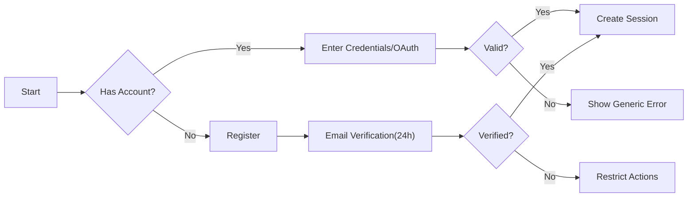
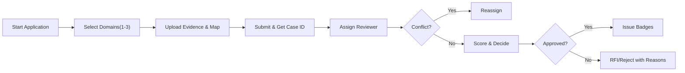
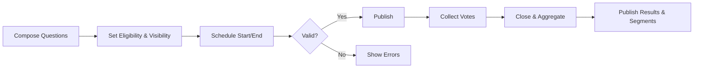
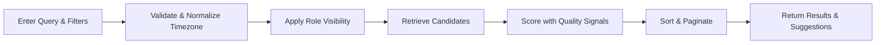
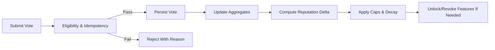
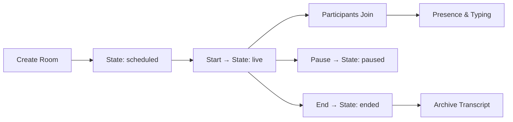
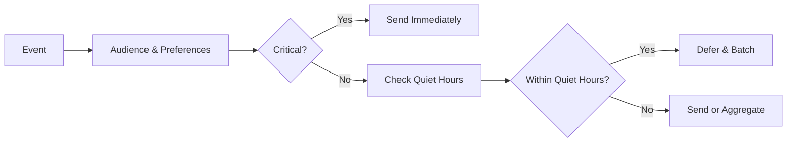
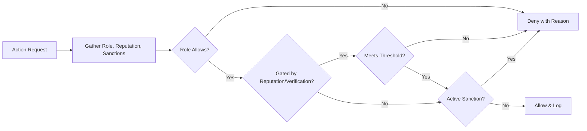

# econDiscuss — Requirements Analysis and Business Specification

## Scope and Intent
A modern, professional discussion platform for economics that blends familiar social UX with safeguards for rigor and civility. Core capabilities: verified expertise profiles; bookmarks and private voting history; advanced discovery (trending, expert filters, date ranges); polls/surveys capturing sentiment; real-time notifications and live discussions; long-form drafts and autosave; follow/subscribe for personalization; and a reputation system that rewards quality. All requirements are business-level and expressed using EARS. No APIs, schemas, or implementation details are included.

## Roles and Identity Principles
Roles in ascending authority: visitor, member, verifiedExpert, moderator, admin.
- Visitor: reads public content and uses public discovery; no contributions.
- Member: authenticated participant; can post, comment, vote, bookmark, follow/subscribe, draft, and join polls.
- Verified Expert: member with domain-verified badges; gains weighted influence, expert-only modes, and limited curation powers per policy.
- Moderator: quality steward; handles reports, verification, curation, and sanctions within governance.
- Admin: platform owner; configures policies, topics, roles, and global thresholds.

Identity and display:
- THE econDiscuss platform SHALL allow pseudonyms for members and public-facing verified experts while requiring private legal identity during verification.
- WHERE a user is verifiedExpert, THE econDiscuss platform SHALL display domain badges on profile and contributions.
- WHEN a user is sanctioned, THE econDiscuss platform SHALL restrict actions per sanction while preserving read access unless policy dictates otherwise.

## Authentication & Sessions (Business Policies)
Sign-up and login:
- THE econDiscuss platform SHALL support email+password and OAuth sign-in with professional networks and common identity providers.
- WHEN a user registers, THE econDiscuss platform SHALL require email verification within 24 hours before enabling posting, voting, or following.
- IF email verification is incomplete, THEN THE econDiscuss platform SHALL allow reading and searching only and present clear steps to verify.

Sessions and MFA:
- THE econDiscuss platform SHALL maintain authenticated sessions with short-lived access and renewable longer-lived refresh mechanisms.
- WHERE a user is moderator or admin, THE econDiscuss platform SHALL require multi-factor authentication (2FA) before elevated actions.
- WHERE a user is verifiedExpert, THE econDiscuss platform SHALL prompt 2FA setup and encourage completion within 14 days of verification.
- WHEN a user chooses “log out on all devices,” THE econDiscuss platform SHALL revoke active sessions within 30 seconds.

Rate limits and lockouts:
- WHEN 5 consecutive login failures occur within 10 minutes, THE econDiscuss platform SHALL impose a 5-minute cooldown and provide safe recovery options.

Mermaid — Authentication Overview

## Profiles & Expertise Verification
Purpose: establish trust through domain badges while respecting privacy and fairness.

Key workflows:
- Application with mapped evidence per domain; moderation review; approval issuing badges; expiry reminders and re-verification.

EARS requirements:
- WHEN a member submits verification evidence, THE econDiscuss platform SHALL queue the case for review and acknowledge receipt with a case ID within 2 seconds.
- WHERE a reviewer detects a conflict of interest, THE econDiscuss platform SHALL reassign the case before decisioning.
- WHEN verification is approved, THE econDiscuss platform SHALL grant verifiedExpert status and display domain badges on profile and content.
- WHERE a badge reaches expiry, THE econDiscuss platform SHALL notify 60 and 14 days prior and SHALL downgrade privileges upon expiry if not renewed.
- IF verification is revoked after compliance review, THEN THE econDiscuss platform SHALL remove badges, record rationale, and provide appeal options.

Mermaid — Verification Flow

## Authoring: Posts, Drafts, Comments, and Quality
Purpose: enable thoughtful long-form analysis while preserving readability and civility.

EARS requirements (posts & drafts):
- THE econDiscuss platform SHALL autosave drafts every 5 seconds during active editing and synchronize across devices for the same account.
- WHEN a post is submitted without required fields (title, body, tags), THE econDiscuss platform SHALL reject and identify missing fields within 2 seconds.
- WHEN a post is published, THE econDiscuss platform SHALL allow a 30–60 minute edit window (policy-defined) and SHALL surface an edited indicator for later changes with version history visible to logged-in users.
- WHERE content includes empirical claims or forecasts, THE econDiscuss platform SHALL require at least one structured citation before publication.

EARS requirements (comments):
- THE econDiscuss platform SHALL support replies with limited nesting (up to 2–3 levels) to safeguard readability.
- WHEN a comment is posted, THE econDiscuss platform SHALL allow a brief edit window (e.g., 10–15 minutes) and SHALL mark edited comments thereafter.

Quality safeguards:
- IF prohibited content is detected at submission, THEN THE econDiscuss platform SHALL block publication and reference the violated guideline.
- WHERE new accounts exceed posting or linking caps, THE econDiscuss platform SHALL throttle and communicate cooldown windows.

## Polls & Economic Sentiment
Purpose: capture structured, anonymous sentiment and expectations; support expert-only polls and segmented results.

EARS requirements:
- WHERE a creator meets eligibility (reputation threshold or verifiedExpert), THE econDiscuss platform SHALL allow creating polls and multi-question surveys.
- THE econDiscuss platform SHALL support question types including single choice, multiple choice, Likert, ranking, and numeric estimate with units.
- WHEN a poll is scheduled, THE econDiscuss platform SHALL open and close at configured times based on the creator’s timezone and publish aggregates within 60 seconds of closure.
- THE econDiscuss platform SHALL display segmented results (e.g., experts vs general) only where segment size ≥ 20; otherwise segments SHALL be hidden with an explanatory note.
- WHEN anomalous vote velocity is detected, THE econDiscuss platform SHALL quarantine suspect votes from tallies pending review and annotate results neutrally.

Mermaid — Poll Lifecycle

## Search, Discovery, and Trending
Purpose: surface high-signal economics content with expert emphasis and fair exposure.

EARS requirements:
- THE econDiscuss platform SHALL support filters for keyword, author, role (expert-only), topics, date range, content type, and has-poll, and SHALL provide sorts for relevance, newest, top-by-window, most discussed, and expert-weighted.
- THE econDiscuss platform SHALL compute trending on rolling 24h/7d/30d windows using velocity of quality interactions, freshness, expert engagement, and diversity; sanctioned or quarantined items SHALL be excluded.
- WHERE a user selects expert-only, THE econDiscuss platform SHALL return only verified expert authored content or designated expert-only threads.
- WHEN no results match, THE econDiscuss platform SHALL suggest related topics or relaxed filters.
- THE econDiscuss platform SHALL make newly published content discoverable within 2 minutes under normal load.

Mermaid — Search & Trending Flow

## Voting, Reputation, and Voting History
Purpose: incentivize quality and elevate expertise without exposing personal vote choices.

EARS requirements (voting):
- THE econDiscuss platform SHALL allow upvote and downvote on posts and comments for members and above, prohibiting self-votes.
- THE econDiscuss platform SHALL weight verifiedExpert votes more heavily for reputation and discovery signals.
- THE econDiscuss platform SHALL enforce daily vote quotas and idempotency to deter spam and brigading.

EARS requirements (reputation):
- THE econDiscuss platform SHALL compute a per-user reputation from received votes, curation events, and penalties with recency decay and caps to limit single-item dominance.
- WHERE thresholds are met, THE econDiscuss platform SHALL unlock features (e.g., poll creation, live-room start) and revoke them if reputation falls below thresholds after a grace period.

EARS requirements (history):
- THE econDiscuss platform SHALL show each user a private, filterable history of their own votes with timestamps and states (active, switched, withdrawn, discounted).
- THE econDiscuss platform SHALL never expose individual vote choices to other users unless explicitly opted-in by the voter to summarized visibility.

Mermaid — Vote & Reputation Flow

## Bookmarks & Personal Collections
Purpose: support private research workflows with optional sharing of curated collections.

EARS requirements:
- THE econDiscuss platform SHALL allow members to save posts, comments, polls, and live threads to private bookmarks and organize them into collections.
- THE econDiscuss platform SHALL default all collections to Private and SHALL exclude personal notes from any shared views.
- WHEN a user toggles a collection to public or unlisted, THE econDiscuss platform SHALL display a privacy warning and create a revocable link for unlisted mode.
- THE econDiscuss platform SHALL support bulk operations (move, remove, export) with per-item outcomes and SHALL retain tombstones for unavailable items.

## Follow/Subscribe & Feeds
Purpose: personalize without sacrificing professional quality or diversity.

EARS requirements:
- WHEN a member follows a user or subscribes to a topic, THE econDiscuss platform SHALL prioritize matching items in the Home feed and digests.
- THE econDiscuss platform SHALL enforce source diversity so no more than a small number of consecutive items originate from the same author.
- WHERE a user mutes or blocks sources/topics, THE econDiscuss platform SHALL exclude them from feeds and notifications while preserving relationships as applicable.
- WHERE “expert highlights” is enabled, THE econDiscuss platform SHALL restrict content to expert-authored or expert-endorsed items.

## Real-Time: Live Discussions, Presence, and Notifications
Purpose: enable live, professional conversation with respect for user time and quiet hours.

EARS requirements (live):
- THE econDiscuss platform SHALL support live threads and live rooms with host/participant roles, presence indicators, typing status, and sub-second message fan-out at scale targets.
- WHERE expert-only participation is configured, THE econDiscuss platform SHALL permit posting only by verifiedExpert, moderator, and admin while allowing broader viewing.

EARS requirements (notifications):
- WHEN a user is mentioned or replied to, THE econDiscuss platform SHALL send an immediate notification respecting channel preferences and quiet hours rules for non-critical events.
- WHERE digests are enabled, THE econDiscuss platform SHALL deliver daily/weekly summaries in the user’s timezone and deduplicate items already surfaced.
- WHEN quiet hours are active, THE econDiscuss platform SHALL defer non-critical notifications and SHALL always deliver critical account and policy notices.

Mermaid — Live Room Lifecycle

Mermaid — Notification Delivery with Quiet Hours

## Moderation & Governance Highlights
Purpose: sustain civility and evidence-based discourse with transparent outcomes.

EARS requirements:
- THE econDiscuss platform SHALL provide reporting categories (harassment, misinformation, plagiarism, spam, off-topic, privacy, poll integrity, impersonation, expertise misrepresentation) and SHALL acknowledge reports with case IDs.
- WHEN a case is urgent (e.g., doxxing), THE econDiscuss platform SHALL prioritize human review within 2 hours; standard cases within 24 hours.
- WHEN content is removed or labeled, THE econDiscuss platform SHALL display standardized labels to authorized viewers and notify affected users with rationale and appeal options.
- WHERE sanctions are applied, THE econDiscuss platform SHALL select proportional levels (warnings through suspension/ban) and record audit trails.

## Privacy, Visibility Defaults, and Data Controls
Purpose: protect individuals while enabling open discourse and aggregated insights.

EARS requirements:
- THE econDiscuss platform SHALL keep individual vote choices private to the voter and SHALL expose only aggregate counts publicly.
- THE econDiscuss platform SHALL default bookmarks/collections to private; shared collections SHALL remain read-only to viewers and exclude personal notes.
- THE econDiscuss platform SHALL apply a minimum of 20 responses per segment before showing segmented poll results to avoid deanonymization.
- WHEN users request data export or deletion, THE econDiscuss platform SHALL deliver exports within 15 days and SHALL complete deletions or pseudonymization within 30 days, subject to lawful exceptions.

## Performance and Availability Targets
Purpose: ensure responsiveness aligned with professional productivity.

EARS requirements:
- THE econDiscuss platform SHALL return search results for common queries within 2 seconds p50 and 3 seconds p95 under target scale.
- THE econDiscuss platform SHALL render Home feed in ≤ 600 ms p95 and autosave drafts within 1 second of change detection.
- THE econDiscuss platform SHALL acknowledge votes within 250 ms p95 and reflect updated counts within 3 seconds.
- THE econDiscuss platform SHALL deliver mention/reply notifications within 5 seconds p95 and other notifications within 30 seconds.
- THE econDiscuss platform SHALL maintain 99.9% monthly uptime for core read/write features and SHALL degrade gracefully, preserving read access during partial outages.

## Error Scenarios, Rate Limits, and Recovery
EARS requirements:
- IF validation fails (missing fields, limits exceeded), THEN THE econDiscuss platform SHALL enumerate errors within 2 seconds and preserve user input as a draft.
- IF a user exceeds rate limits on posts, comments, votes, or follows, THEN THE econDiscuss platform SHALL block the action and show the remaining cooldown without exposing tunable thresholds.
- IF a live session disconnects, THEN THE econDiscuss platform SHALL queue messages and restore in-order delivery upon reconnection.
- IF a moderation reversal occurs on appeal, THEN THE econDiscuss platform SHALL restore content promptly and notify parties.

Mermaid — Authorization Decision Overview

## Success Metrics and Acceptance Criteria
- Verified expert engagement: number of active verified experts and share of expert-authored contributions.
- Quality-adjusted engagement: weighted interactions on high-signal content and polls.
- Search success rate: sessions ending in meaningful clicks/refinements ≥ target.
- Draft reliability: ≥ 99% autosave and restore success.
- Moderation SLA adherence: ≥ 95% of urgent cases reviewed within target windows.
- Notification satisfaction: opt-out rates below threshold; quiet-hours adherence ≥ 99%.

Acceptance (sample EARS):
- WHEN the system is evaluated under target scale, THE econDiscuss platform SHALL meet the stated p95 latency targets for search, feed, voting, and notifications.
- WHEN expert-only filters are applied, THE econDiscuss platform SHALL return only eligible content with zero leakages in a 1,000-item sampled audit.
- WHEN a poll with segmented results closes, THE econDiscuss platform SHALL publish aggregates with correct privacy thresholds within 60 seconds.

## Glossary
- Expert-only: a mode restricting posting to verified experts and staff while remaining readable platform-wide unless policy restricts.
- Quiet hours: user-defined windows deferring non-critical notifications.
- Recency decay: decreasing weight of older signals (votes/engagement) to prioritize fresh quality.
- Reputation: computed trust indicator used for gating and ranking; not publicly exposed as a raw number unless policy allows.
- Segmented results: poll aggregates broken out by role/domain with k-anonymity thresholds.

---
All content herein is business-level and EARS-compliant. The econDiscuss service name is used consistently. Mermaid diagrams use quoted labels and validated syntax. No APIs, schemas, or low-level implementation details are included.