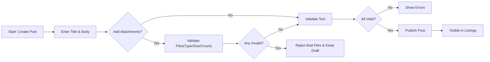
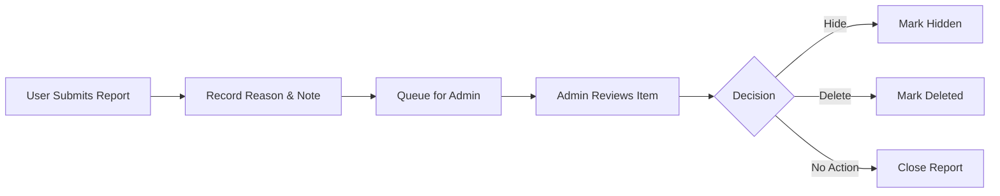

# Requirements Analysis — civicBoard (Minimal Discussion Board)

## Vision and Scope
A minimal, public discussion board for economic and political topics that supports articles (posts) with optional image and file attachments, plus plain-text comments. Priorities are clarity, civility, and evidence-friendly discussion with predictable rules and light moderation.

Problem and goals
- Participants lack a simple place to publish concise viewpoints with supporting files (charts, PDFs) and receive comments.
- Goals: enable quick publishing with attachments; enable commenting; allow visitors to browse; provide a minimal reporting channel and admin moderation.

In scope (minimal)
- Registration/login with email and password
- Posts with title, body, and optional attachments (images/files)
- Comments with plain text
- Browsing lists and viewing post details with comments
- Minimal reporting and admin moderation (hide/delete)

Out of scope (minimal)
- Threaded/nested comments, messaging, reactions/likes, advanced search, categories/tags, rich text editing, real-time updates, complex notifications, OAuth/SSO, public APIs

## Actors and Access (Business)
- Guest: unauthenticated visitor who can read public posts and comments.
- User: authenticated member who can create/manage own posts and comments, add attachments to own posts, and report content.
- Admin: authenticated administrator who can moderate any content and manage reports.

Permission principles (business)
- Ownership: users manage only their own content; admins may act on any content for moderation.
- Public read: guests can read Published content; Hidden or Deleted content is not publicly visible.
- Attachments follow parent: attachment visibility and access match the parent post’s visibility.

## Functional Requirements (Business, EARS)
### Posts
- THE civicBoard service SHALL require a title (1–120 chars) and body (1–10,000 chars) for every post.
- WHEN a user publishes a valid post, THE civicBoard service SHALL attribute the post to the author and record a publication timestamp.
- WHEN a user edits own Published post within 30 minutes of publication, THE civicBoard service SHALL apply the changes and update the last-edited timestamp.
- IF an edit attempt occurs after 30 minutes from publication by the author, THEN THE civicBoard service SHALL deny the edit and state that the edit window has expired.
- WHEN an author deletes own post, THE civicBoard service SHALL remove it from public listings immediately and mark it as Deleted.
- WHEN listing posts, THE civicBoard service SHALL present items ordered newest-first in pages of 20.

Content limits and rules (business)
- Title: 1–120 characters; trimmed; must not be whitespace-only.
- Body: 1–10,000 characters; plain text; line breaks allowed; URLs allowed.
- Rate: up to 5 posts per user per calendar day.

### Comments
- THE civicBoard service SHALL allow users to add a plain-text comment (1–2,000 chars) to a Published post.
- WHEN a user publishes a valid comment, THE civicBoard service SHALL attribute the comment to the author and record a timestamp.
- WHEN a user edits own comment within 15 minutes, THE civicBoard service SHALL apply the change and record last-edited time.
- IF a comment edit occurs after 15 minutes, THEN THE civicBoard service SHALL deny the edit and state that the edit window has expired.
- WHEN an author deletes own comment, THE civicBoard service SHALL replace the visible content with a placeholder marker and mark it as Deleted.
- WHILE a post is Hidden or Deleted, THE civicBoard service SHALL prevent new comments by non-admin users.

Comment rules
- Body: 1–2,000 characters; trimmed; no attachments in minimal scope.
- Ordering: oldest-first under a post; pagination of 20 per page when necessary.
- Rate: up to 50 comments per user per calendar day.

### Attachments (Posts only)
- THE civicBoard service SHALL allow attaching up to 5 files to a post within allowed types and sizes.
- THE civicBoard service SHALL allow image types JPEG, PNG, GIF and document type PDF.
- THE civicBoard service SHALL limit each file to a maximum of 10 MB and the combined size per post to 25 MB.
- IF an attachment exceeds type, size, or count limits, THEN THE civicBoard service SHALL reject only the offending files with a clear message and keep valid text intact.
- WHEN a post is Hidden, THE civicBoard service SHALL prevent public access to its attachments while allowing admin and author access.
- WHEN a post is Deleted, THE civicBoard service SHALL prevent public access to its attachments and exclude them from listings.

### Browsing and Reading
- THE civicBoard service SHALL display a list of Published posts ordered newest-first with pagination at 20 items per page.
- WHEN a reader opens a Published post, THE civicBoard service SHALL display the title, body, attachments, author display name, publication time, and comments in defined order.
- IF the requested post is not available (Deleted or Hidden to the reader), THEN THE civicBoard service SHALL display a not-available outcome and offer navigation back to listings.

## Reporting and Moderation (Minimal, EARS)
- THE civicBoard service SHALL allow authenticated users to report a post or comment by selecting a reason (“Spam”, “Harassment”, “Off-topic”, “Other”) and an optional note up to 500 characters.
- WHEN a report is submitted, THE civicBoard service SHALL record it and make it visible to admins for review.
- WHEN an admin hides content, THE civicBoard service SHALL remove the item from public views and mark it as Hidden.
- WHEN an admin deletes content, THE civicBoard service SHALL mark it as Deleted and remove it from public access while retaining audit visibility for admins.
- IF the same user attempts to report the same item more than once, THEN THE civicBoard service SHALL reject the duplicate report.

Moderation notes (business)
- Actions: Hide, Delete, or No Action.
- Hidden content blocks new comments by non-admin users until restored.

## Authentication and Session (Business, EARS)
- THE civicBoard service SHALL require authentication for creating, editing, deleting, or reporting content.
- WHEN a user registers, THE civicBoard service SHALL require email verification before enabling posting or commenting.
- WHEN a user logs in successfully, THE civicBoard service SHALL establish an authenticated session that allows actions permitted to the role (user/admin).
- WHILE an account is suspended, THE civicBoard service SHALL deny content creation and management actions.
- WHEN a user changes password, THE civicBoard service SHALL invalidate other active sessions for that user.

## User Scenarios (Concise)
Scenario A: Browse and read
- Visitor opens the site, sees newest posts, selects a post, and reads content, attachments, and comments.

Scenario B: Create a post with attachments
- Verified user enters title and body, selects up to 5 files (images/PDFs) within size limits, submits; valid post appears in listings immediately.

Scenario C: Comment on a post
- Verified user writes a 1–2,000 char comment under a Published post; comment appears instantly under the post.

Scenario D: Report content
- User reports a problematic comment selecting “Harassment” and adds a short note; report appears in admin view for action.

Scenario E: Admin moderates
- Admin opens reports queue, reviews item context, applies Hide or Delete; public visibility updates immediately.

## Process Diagrams (Mermaid)
Post creation with attachments

Reporting and moderation

## Non-Functional Expectations (Minimal, EARS)
Performance
- THE civicBoard service SHALL return the first page of post listings within 1,000 ms at p95 under normal load.
- THE civicBoard service SHALL confirm post and comment creation within 2 seconds at p95 under normal load.
- THE civicBoard service SHALL validate attachments up to 10 MB within 15 seconds at p95.

Safety and privacy
- THE civicBoard service SHALL avoid exposing email addresses publicly; show only display names for authors.
- THE civicBoard service SHALL restrict moderation capabilities to admins.

Retention and deletion
- THE civicBoard service SHALL permanently remove soft-deleted content after 30 days unless under administrative hold.
- THE civicBoard service SHALL ensure attachments of Deleted posts are not publicly accessible.

Reliability
- THE civicBoard service SHALL achieve at least 99.5% monthly availability excluding planned maintenance windows.

## Acceptance Criteria Summary (Business, Testable)
Posts
- Creating a valid post (title/body within limits, 0–5 allowed files within limits) results in a Published post visible in listings newest-first within 2 seconds under normal load.
- Editing own post within 30 minutes succeeds; editing at 30 minutes + 1 second fails with an edit-window-expired outcome.
- Deleting own post removes it from public lists immediately and marks it Deleted.

Comments
- Creating a valid comment on a Published post succeeds and appears immediately; commenting on Hidden/Deleted posts is denied.
- Editing own comment within 15 minutes succeeds; after 15 minutes, the edit is denied.

Attachments
- Uploading a 6th file, an unsupported type, or a file over 10 MB is rejected with a specific message; valid files are accepted and linked to the post.
- Hidden/Deleted posts’ attachments are not publicly accessible.

Reporting and moderation
- Submitting a report creates a reviewable record with reason and optional note; duplicate reports by the same user on the same item are rejected.
- Admin actions (Hide/Delete) change public visibility immediately and record the outcome for auditing.

Authentication
- Unauthenticated attempts to create, edit, delete, or report are denied with a sign-in-required outcome.
- Unverified accounts cannot create posts or comments.

## Glossary
- Published: visible to all readers.
- Hidden: removed from public view; visible to admins and possibly the author.
- Deleted: removed from public view; retained minimally for administration and purged later.
- Attachment: an image or file associated with a post, governed by allowed types, sizes, and counts.
- Report: a user-submitted flag requesting admin review of content.
