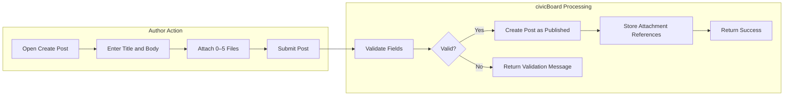
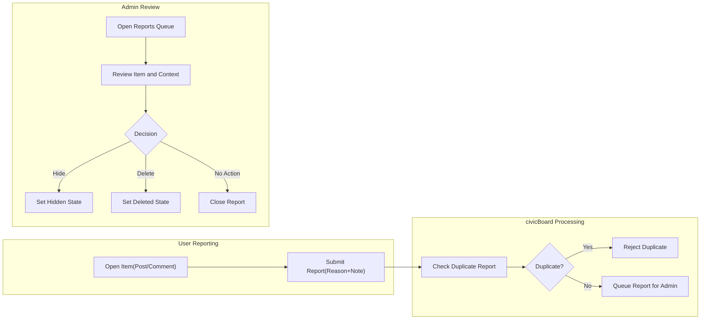

# Functional Requirements — civicBoard (Minimal)

A minimal, production-focused set of business requirements for civicBoard, a straightforward economic/political discussion board. Articles (posts) support image and file attachments. Content below specifies WHAT the service must do in business terms without prescribing APIs, schemas, or technology choices.

## 1) Scope and Intent
- THE civicBoard service SHALL enable reading, posting, commenting, and reporting with minimal moderation.
- THE civicBoard service SHALL support image/file attachments on posts to encourage evidence-based discussion.
- THE civicBoard service SHALL keep scope minimal: no threading, no rich text editor, no real-time updates in MVP.

## 2) Actors and Permissions (Business Summary)
Actors in business terms:
- user: a registered, verified member who creates and manages own posts and comments; may attach files to own posts; may report content.
- admin: an administrator who moderates content (hide/delete), resolves reports, manages user access, and configures minimal policies.

Business permission highlights (minimal):
- Browse/read published posts and comments: allowed to all visitors when public-read policy is on; always allowed to signed-in users.
- Create/edit/delete own post: allowed to user (within time windows); admin moderates via hide/delete, not by editing text.
- Create/edit/delete own comment: allowed to user (within time windows); admin moderates via hide/delete, not by editing text.
- Upload attachments: allowed to user for own posts only; admin may remove attachments via moderation.
- Report content: allowed to user; admin reviews and resolves reports.

## 3) Core Content Model (Business Terms)
- Post: a titled article with a text body created by a user; may include attachments; visible when published; subject to moderation.
- Comment: a textual response to a post; no attachments in MVP; subject to moderation.
- Attachment: an image or document associated with a post; visibility follows the parent post.

## 4) Posts (Create/Read/Update/Delete)

### 4.1 Business Rules and Constraints
- Title: required; 1–120 characters; whitespace-only is invalid.
- Body: required; 1–20,000 characters; plain text; line breaks preserved.
- Attachments per post: 0–5 (see Section 6 for types and sizes).
- Author edit window: 60 minutes from creation time.
- Author delete: allowed any time; removal from public lists is immediate.
- Admin actions: hide or delete; admins do not edit user text in MVP.
- Listing: newest-first by publication time; 20 posts per page.

### 4.2 EARS Requirements
- THE civicBoard SHALL require non-empty title and body within stated limits for each post.
- THE civicBoard SHALL allow up to 5 attachments per post.
- WHEN an authenticated, verified user submits a valid post, THE civicBoard SHALL publish it and make it visible within 2 seconds under normal load.
- IF a submission violates title/body/attachment constraints, THEN THE civicBoard SHALL reject it and identify each violated rule.
- WHEN an author edits own post within 60 minutes and inputs are valid, THE civicBoard SHALL save the edit and update last-edited time.
- IF an author attempts to edit after 60 minutes, THEN THE civicBoard SHALL deny the edit and state that the edit window has expired.
- WHEN an author deletes own post, THE civicBoard SHALL remove it from public lists immediately and set state to Deleted.
- WHEN an admin hides a post, THE civicBoard SHALL set state to Hidden and prevent new comments by non-admin users.
- WHEN listing posts, THE civicBoard SHALL return 20 items per page ordered newest-first.

### 4.3 Acceptance Criteria
- Valid post (title/body within limits; 0–5 attachments) becomes visible within 2 seconds under normal load.
- Invalid inputs return specific reasons; user-entered text is preserved for correction within the same session.
- Author edits within 60 minutes succeed; after 60 minutes, edit is denied with an "edit window expired" reason.
- Author delete removes the post from lists immediately; state is Deleted.
- Hidden posts are not visible to non-admins and do not accept new comments by non-admins.

## 5) Comments (Create/Read/Update/Delete)

### 5.1 Business Rules and Constraints
- Body: required; 1–5,000 characters; whitespace-only is invalid.
- Attachments: not supported for comments in MVP.
- Author edit window: 15 minutes from creation.
- Author delete: allowed; a placeholder may be shown to preserve thread continuity.
- Ordering within a post: oldest-first by default; pagination at 20 per page if needed.

### 5.2 EARS Requirements
- THE civicBoard SHALL require non-empty body within limits for every comment.
- WHEN a verified user submits a valid comment to a Published post, THE civicBoard SHALL publish it within 2 seconds under normal load.
- IF the target post is Hidden or Deleted, THEN THE civicBoard SHALL deny comment creation and state that the post is unavailable for commenting.
- WHEN an author edits own comment within 15 minutes and inputs are valid, THE civicBoard SHALL save the edit and record last-edited time.
- IF a comment edit is attempted after 15 minutes, THEN THE civicBoard SHALL deny the edit and state that the edit window has expired.
- WHEN an author deletes own comment, THE civicBoard SHALL remove it from public view and may show a placeholder indicator.

### 5.3 Acceptance Criteria
- Valid comments appear under the post within 2 seconds under normal load.
- Commenting on Hidden/Deleted posts is denied with a clear reason.
- Edits within 15 minutes succeed; after 15 minutes, edit is denied with an "edit window expired" reason.
- Deleting a comment removes it from public view; placeholders appear per policy.

## 6) Attachments (Images/Files for Posts)

### 6.1 Business Rules and Constraints
- Scope: attachments on posts only.
- Allowed image types: JPEG, PNG, GIF.
- Allowed document types: PDF.
- Max size per file: 10 MB.
- Max attachments per post: 5.
- Visibility: matches parent post state (Published visible; Hidden restricted; Deleted not accessible to non-admins).
- Removal: author may remove attachments within the edit window; admin may remove via moderation at any time.

### 6.2 EARS Requirements
- THE civicBoard SHALL enforce allowed types (JPEG, PNG, GIF, PDF) and a 10 MB per-file size limit.
- WHEN a user attempts to add more than 5 files, THE civicBoard SHALL reject the excess with a clear message.
- IF a file exceeds size or is disallowed, THEN THE civicBoard SHALL reject that file and explain the violated constraint.
- WHEN a post becomes Hidden, THE civicBoard SHALL restrict access to its attachments to admin and the post author.
- WHEN a post is Deleted, THE civicBoard SHALL prevent non-admin access to its attachments.

### 6.3 Acceptance Criteria
- Uploading 1–5 allowed files ≤10 MB each succeeds; a 6th file is rejected with an over-limit message.
- Disallowed types (e.g., DOCX) or files >10 MB are rejected with clear messages.
- Hidden post attachments are inaccessible to non-admin non-author actors; Deleted post attachments are inaccessible to non-admins entirely.

## 7) Reactions (Optional, Single "Like")

### 7.1 Business Rules and Constraints
- Scope: single binary Like on posts and comments if enabled.
- Auth: only authenticated users; no self-like.
- One per user per item; toggling removes the like.

### 7.2 EARS Requirements
- WHERE reactions are enabled, THE civicBoard SHALL allow a user to toggle a single Like on others’ Published posts or comments.
- IF a user attempts to like own content, THEN THE civicBoard SHALL reject the action with a self-like-not-allowed message.
- WHILE content is Hidden or Deleted, THE civicBoard SHALL disallow new reactions by non-admins.

### 7.3 Acceptance Criteria
- Like increments and appears in reads within 2 seconds under normal load; toggling removes it.
- Self-like is denied with a clear message.
- Hidden/Deleted content does not accept new reactions by non-admins.

## 8) Search and Filtering (Basic)

### 8.1 Business Rules and Constraints
- Scope: keyword search across post titles and bodies.
- Terms: space-separated terms with AND semantics.
- Ordering: newest-first; pagination at 20 per page.
- Optional filters: author and creation date range (inclusive) if provided.

### 8.2 EARS Requirements
- THE civicBoard SHALL support keyword search with AND semantics across titles and bodies.
- WHEN a search executes, THE civicBoard SHALL return matching posts ordered newest-first in pages of 20 within 2 seconds for common queries.
- WHERE author/date filters are provided, THE civicBoard SHALL apply them before pagination.
- IF no matches exist, THEN THE civicBoard SHALL return an empty result set with zero total count.

### 8.3 Acceptance Criteria
- Multi-term queries return posts containing all terms.
- Pagination stable at 20 per page; ordering newest-first.
- Author and date filters narrow results appropriately.
- No-match queries return zero results and zero total count.

## 9) Reporting and Moderation Hooks

### 9.1 Business Rules and Constraints
- Reportable: posts and comments.
- Reasons: predefined list (Spam, Harassment, Misinformation, Off-topic, Other optional note up to 500 chars).
- One report per user per item; duplicates denied.
- Admin actions: No Action, Hide, Delete; resolutions recorded.

### 9.2 EARS Requirements
- THE civicBoard SHALL allow any authenticated user to report a post or comment by selecting a reason and optionally adding details up to 500 characters.
- IF the same user reports the same item again within 24 hours, THEN THE civicBoard SHALL reject the duplicate report.
- WHEN a report is submitted, THE civicBoard SHALL add it to an admin review queue within 2 seconds under normal load.
- WHEN an admin resolves a report, THE civicBoard SHALL record the outcome and adjust the item’s state if applicable.

### 9.3 Acceptance Criteria
- Valid reports appear in the admin queue and are visible to admins.
- Duplicate reports by the same user on the same item within 24 hours are rejected.
- Admin resolutions update content visibility and mark reports as handled.

## 10) Authentication and Authorization Expectations (Business-Level)
- THE civicBoard service SHALL require account registration and email verification before allowing creation of posts or comments.
- THE civicBoard service SHALL represent signed-in sessions in a way that enables identifying the actor and enforcing permissions (user vs admin) and ownership checks.
- THE civicBoard service SHALL allow reading of published content to guests when public-read policy is enabled; otherwise, reading requires sign-in.
- THE civicBoard service SHALL enforce ownership: users may modify/delete only their own content; admins may moderate any content via hide/delete.
- THE civicBoard service SHALL provide logout and password reset capabilities in plain business terms (time-limited reset, immediate session revocation after successful password change).

## 11) Consolidated Acceptance Criteria and Performance Notes
- Post creation: visible within 2 seconds under normal load; attachments validated per rules.
- Comment creation: visible within 2 seconds under normal load; denied on Hidden/Deleted posts.
- Edit windows: 60 minutes for posts; 15 minutes for comments; attempts after windows are denied.
- Listings: posts newest-first, 20 per page; comments oldest-first, 20 per page when paginated.
- Search: AND semantics across titles/bodies; results newest-first; 20 per page; 2-second response for common queries.
- Reporting: duplicates blocked within 24 hours; admin resolutions recorded and reflected immediately.

## 12) Process Diagrams (Mermaid)

### 12.1 Post Creation with Attachments

### 12.2 Reporting and Moderation Flow

## 13) Glossary
- Author: the creator of a post or comment.
- Published: state where content is visible to all readers (subject to public-read policy).
- Hidden: state where content is removed from public visibility (visible to admins, and optionally to authors) and does not accept new comments by non-admins.
- Deleted: state where content is removed from public view for all non-admin actors.
- Attachment: an image or PDF file linked to a post, subject to type/size/count limits.
- Reaction: optional single Like toggle on content by authenticated users (excluding own content).

All specifications above are business requirements only. Technical details (APIs, schemas, storage, infrastructure) are intentionally unspecified to preserve developer autonomy while ensuring testable behavior in production.