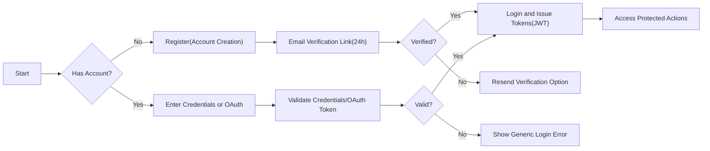
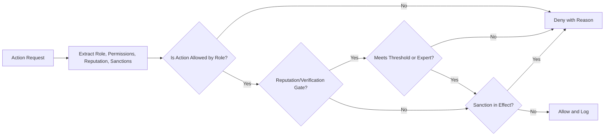

# econDiscuss — User Roles, Permissions, and Authentication Requirements

## 1) Introduction and Scope
Defines business requirements for authorization and authentication across econDiscuss. Focus remains on WHAT the platform must enable or restrict to uphold professional discourse, not HOW to implement it technically. Coverage includes:
- Role hierarchy and capabilities (visitor, member, verifiedExpert, moderator, admin)
- Authentication flows (registration, email verification, login, logout, session/token lifecycle, 2FA)
- Authorization rules (permission matrices, reputation/verification gates, sanctions interplay)
- Privacy and visibility expectations by role
- Performance and reliability expectations for authN/authZ
- User-facing error handling and denial messaging

Constraints and priorities:
- Preserve modern social UX without compromising professional quality and safety.
- Avoid technical specifics (APIs/database/architecture); express measurable behaviors in natural language.
- Use EARS syntax for testable requirements.

## 2) Role Definitions and Hierarchy

### 2.1 Role Hierarchy
- THE roles SHALL be ordered by escalation of authority: visitor < member < verifiedExpert < moderator < admin.
- WHERE a user upgrades or downgrades role, THE platform SHALL re-evaluate permissions for active sessions immediately.

### 2.2 Role Descriptions
- visitor (guest): unauthenticated; reads public content and discovery; no contributions.
- member: authenticated; creates posts/comments, votes, follows/subscribes, bookmarks, drafts; subject to gates and rate limits.
- verifiedExpert: authenticated with approved domain badges; gains expert-weighted votes, expert-only thread access, and curation privileges.
- moderator: quality steward; triages reports, handles verification queues, applies sanctions, and curates within policy.
- admin: global administrator; manages policies, topics, roles, settings, and audit oversight.

### 2.3 Identity and Display Principles
- THE platform SHALL allow pseudonyms for members.
- WHERE a user is a verifiedExpert, THE platform SHALL require legal identity disclosure during verification while allowing public display as real name or verified pseudonym by choice.
- WHEN sanctions restrict posting, THE platform SHALL preserve read access unless the sanction requires broader restriction.

## 3) Permissions by Role (Business Actions)

### 3.1 Global Permission Principles
- THE platform SHALL enforce least privilege; only explicitly granted actions are allowed.
- WHEN an action is denied, THE platform SHALL present a human-readable reason (e.g., "Insufficient reputation", "Expert-only feature").
- WHILE a sanction is active, THE platform SHALL apply restrictions across all relevant actions.

### 3.2 Action Catalog and Role Permissions

| Business Action | visitor | member | verifiedExpert | moderator | admin |
|-----------------|---------|--------|----------------|-----------|-------|
| Read public posts/comments | ✅ | ✅ | ✅ | ✅ | ✅ |
| Search public content with filters | ✅ | ✅ | ✅ | ✅ | ✅ |
| View expert badges and domains | ✅ | ✅ | ✅ | ✅ | ✅ |
| Create posts | ❌ | ✅ | ✅ | ✅ | ✅ |
| Create comments/replies | ❌ | ✅ | ✅ | ✅ | ✅ |
| Edit own posts within policy window | ❌ | ✅ | ✅ | ✅ | ✅ |
| Delete own posts within policy window | ❌ | ✅ | ✅ | ✅ | ✅ |
| Save/bookmark items | ❌ | ✅ | ✅ | ✅ | ✅ |
| Organize bookmarks into collections | ❌ | ✅ | ✅ | ✅ | ✅ |
| Add private notes to saved items | ❌ | ✅ | ✅ | ✅ | ✅ |
| Follow users | ❌ | ✅ | ✅ | ✅ | ✅ |
| Subscribe to topics/tags | ❌ | ✅ | ✅ | ✅ | ✅ |
| Start live discussion thread/room (gated) | ❌ | ❌/✅ | ✅ | ✅ | ✅ |
| Join live discussions | ❌ | ✅ | ✅ | ✅ | ✅ |
| Receive real-time notifications | ❌ | ✅ | ✅ | ✅ | ✅ |
| Vote on posts | ❌ | ✅ | ✅ | ✅ | ✅ |
| Vote on comments | ❌ | ✅ | ✅ | ✅ | ✅ |
| View own voting history | ❌ | ✅ | ✅ | ✅ | ✅ |
| Create polls (gated) | ❌ | ❌/✅ | ✅ | ✅ | ✅ |
| Participate in polls | ❌ | ✅ | ✅ | ✅ | ✅ |
| Propose topic taxonomy updates | ❌ | ❌ | ✅ | ✅ | ✅ |
| Feature/curate high-quality posts | ❌ | ❌ | ✅ | ✅ | ✅ |
| Report content and users | ❌ | ✅ | ✅ | ✅ | ✅ |
| Access verification review queue | ❌ | ❌ | ❌ | ✅ | ✅ |
| Apply sanctions | ❌ | ❌ | ❌ | ✅ | ✅ |
| Manage system-wide settings | ❌ | ❌ | ❌ | ❌ | ✅ |
| View audit trails (per scope) | ❌ | ❌ | ❌ | ✅ | ✅ |

Notes: "❌/✅" indicates reputation-gated features for members (see Section 5).

### 3.3 EARS Requirements for Key Actions
- THE platform SHALL allow visitor access to public reading and searching without authentication.
- WHERE a user is a member, THE platform SHALL allow creating posts, comments, votes, follows, subscriptions, bookmarks, drafts, and poll participation subject to rate limits and policies.
- WHERE a user is a verifiedExpert, THE platform SHALL enable expert-weighted voting, access to expert-only modes, proposing taxonomy updates, and curation powers within policy.
- WHERE a user is a moderator, THE platform SHALL grant permissions to handle reports, manage verification queues, feature content, and apply sanctions per governance rules.
- WHERE a user is an admin, THE platform SHALL grant full administrative privileges, including role management, policy configuration, topic taxonomy management, and audit inspection.
- WHEN a user edits or deletes own content, THE platform SHALL enforce the policy time window and preserve version history as defined.
- IF a user attempts an unauthorized action, THEN THE platform SHALL deny and present the requirement to unlock where applicable.

## 4) Expertise Verification and Badging Overview

Eligibility, evidence, and reviewer workflow live in Expertise Verification requirements; privileges conferred here integrate across the platform.

EARS
- WHEN a user submits verification evidence, THE platform SHALL queue the request for moderator/admin review and reflect a pending state until decision.
- WHEN verification is approved, THE platform SHALL attach domain badges and elevate privileges to verifiedExpert immediately.
- IF verification is revoked or expires, THEN THE platform SHALL remove badges and revert privileges while preserving member status.
- WHERE a verifiedExpert contributes, THE platform SHALL display badges on profile and relevant content per privacy choices for display name.

Privileges:
- THE platform SHALL apply expert-weighted votes to reputation calculations as per voting requirements.
- WHERE expert-only threads or “expert comment first” modes are enabled, THE platform SHALL restrict participation to verifiedExpert and above for the configured window.

## 5) Reputation-Based Unlocks

Policy variables (admin configurable; baseline below):
- Create poll: reputationScore ≥ 500 (members) or verifiedExpert status.
- Start live room/thread: reputationScore ≥ 300 or verifiedExpert.
- Propose new topic/tag: reputationScore ≥ 400 or verifiedExpert.
- Elevated rate limits and downvote capability: reputationScore ≥ 200.
- Curation suggestion visibility boost: reputationScore ≥ 600 or verifiedExpert.

EARS
- WHERE a member meets a threshold, THE platform SHALL unlock the feature within 1 minute of reputation recalculation.
- IF a member falls below a threshold due to decay or penalties, THEN THE platform SHALL re-lock the feature and communicate the change non-intrusively.
- WHEN a threshold is reached during a session, THE platform SHALL apply new permissions without re-login.
- WHERE a user is a verifiedExpert, THE platform SHALL treat gated features as unlocked unless a sanction overrides.

Anti-abuse
- THE platform SHALL apply recency decay and duplicate-vote detection for reputation inputs.
- THE platform SHALL cap unlock state flapping by applying changes at most once per hour unless sanctions require immediate effect.

## 6) Session and Access Management (Business Rules)

### 6.1 Authentication Methods
- THE platform SHALL support registration and login via email/password and OAuth sign-in (e.g., Google, LinkedIn) for convenience and expert identity linkage.
- THE platform SHALL require email verification before enabling posting or voting.

EARS
- WHEN a user registers, THE platform SHALL validate email ownership via a verification link that expires in 24 hours.
- IF email verification is not completed within expiry, THEN THE platform SHALL invalidate the link and provide a path to request a new one.

### 6.2 Core Authentication Functions
- Users register, log in, log out; sessions persist via tokens; users can reset/change passwords and revoke access per device.

EARS
- WHEN a user submits login credentials, THE platform SHALL validate and, on success, create an authenticated session within 2 seconds under normal load.
- IF login credentials are invalid, THEN THE platform SHALL decline with a generic error.
- WHEN a user logs out, THE platform SHALL invalidate the active session immediately.
- WHEN a user requests password reset, THE platform SHALL issue a time-limited reset token valid for 60 minutes.

### 6.3 Token Management (JWT in business terms)
Business rules:
- Token pairs: access (short-lived) and refresh (long-lived).
- Access token validity: 15–30 minutes (baseline 20).
- Refresh token validity: 7–30 days (baseline 14) with rotation on use.
- Payload includes: userId, role, permissions; MAY include reputationScore, verifiedDomains, mfaEnabled, sanctions summary.
- Token storage may use httpOnly cookies or secure local storage per security policy; revocation lists supported.

EARS
- WHEN issuing tokens, THE platform SHALL sign JWTs and include required claims.
- WHEN access token expires and refresh token is valid, THE platform SHALL issue a new access token within 1 second.
- IF a refresh token is revoked or expired, THEN THE platform SHALL deny refresh and require re-authentication.
- WHEN a user selects "remember me", THE platform SHALL issue refresh tokens with the configured longer lifetime within policy bounds.

### 6.4 Session Behavior and Concurrency
- THE platform SHALL allow concurrent sessions across devices and provide UI to revoke sessions.
- THE platform SHALL enforce step-up authentication for sensitive actions when risk signals indicate.

EARS
- WHEN a user requests "log out from all devices", THE platform SHALL revoke all active refresh tokens within 30 seconds.
- WHERE concurrent session limits are configured, THE platform SHALL deny new sessions beyond the limit and inform the user.

### 6.5 Multi-Factor Authentication (2FA)
- Optional for members and verifiedExperts; required for moderators and admins.

EARS
- WHERE a user is a moderator or admin, THE platform SHALL require 2FA enrollment before elevated actions.
- WHEN 2FA is enabled, THE platform SHALL require 2FA verification on each new device or every 30 days per device.
- IF 2FA verification fails, THEN THE platform SHALL deny the elevated action and request re-verification.

### 6.6 Rate Limiting and Lockouts (AuthN)
- THE platform SHALL protect login and verification endpoints using rate limits and incremental lockouts.

EARS
- WHEN 5 consecutive login failures occur within 10 minutes, THE platform SHALL introduce a 5-minute cooldown.
- IF suspicious activity is detected, THEN THE platform SHALL challenge with CAPTCHA or step-up auth per policy.

### 6.7 Authentication Flow (Mermaid)

## 7) Privacy Expectations and Data Visibility by Role

### 7.1 Profiles
- Public: display name, avatar, bio, badges, domains, follower/following counts, aggregate contribution metrics.
- Private: email, legal identity documents, drafts, private bookmarks/collections, security settings.

EARS
- WHERE a user is a verifiedExpert, THE platform SHALL display expert badges and domains; legal identity remains confidential.
- IF a user sets a collection to private, THEN THE platform SHALL restrict visibility to the owner.

### 7.2 Content and Interactions
- Votes: aggregate counts public; individual choices private to the voter.
- Polls: aggregated results public; segmented views subject to k-thresholds.
- Bookmarks/Collections: private by default; optional sharing per collection.

EARS
- THE platform SHALL keep individual vote histories visible only to the owner.
- WHERE poll results are segmented by role, THE platform SHALL ensure minimum cohort size before revealing segmented data.
- IF a user attempts to access another user’s private bookmarks, THEN THE platform SHALL deny access.

### 7.3 Moderation and Governance Visibility
- Moderators: access report queues, verification submissions, sanctions dashboards, curation tools.
- Admins: access PII for compliance/operations under strict audit logging and least-privilege workflows.

EARS
- WHERE PII access is requested by admin, THE platform SHALL record purpose, actor, timestamp, and scope in audit logs.
- IF a moderator action affects a user, THEN THE platform SHALL notify the user with policy references and appeal options.

## 8) Non-Functional Expectations and Error Handling (AuthZ/AuthN)

### 8.1 Performance Targets
- WHEN a user logs in under normal load, THE platform SHALL return a response within 2 seconds.
- WHEN refreshing an access token with a valid refresh token, THE platform SHALL complete within 1 second.
- WHEN checking authorization for a protected action, THE platform SHALL complete decisioning within 200 milliseconds.

### 8.2 Reliability and Availability
- THE platform SHALL provide highly available authentication and authorization decisions consistent with system-wide NFRs.

### 8.3 Common Error Scenarios (User-Facing Behavior)
- IF credentials are invalid, THEN THE platform SHALL show a generic error without revealing which field failed.
- IF email is unverified, THEN THE platform SHALL prompt re-sending verification and block participation until verified.
- IF token is expired, THEN THE platform SHALL request refresh and retry where safe.
- IF token is invalid or revoked, THEN THE platform SHALL require re-authentication.
- IF user is sanctioned, THEN THE platform SHALL present the restriction reason and duration at the time of action.
- IF role-based restriction blocks an action, THEN THE platform SHALL present the required role or reputation needed.

### 8.4 Authorization Decision Flow (Mermaid)

## 9) Auditability, Transparency, and Governance Interfaces
- THE platform SHALL record audit events for: role changes, verification decisions, sanction applications, privilege unlocks/locks, admin PII access, and policy configuration changes.
- THE platform SHALL provide users with an account activity view for recent security events (new device login, 2FA changes).
- WHERE an action materially impacts a user’s privileges, THE platform SHALL notify the user with rationale and links to policies.

## 10) Relationships with Other Documents
- Expertise process details: Expertise Verification.
- Voting mechanics and reputation calculation: Voting, Reputation, and History.
- Content authoring rules and edit/delete windows: Content Authoring Rules.
- Moderation and sanctions policy: Moderation, Quality, and Governance.
- Privacy, security, performance targets: Non-Functional Requirements.

## 11) Glossary
- Role: designation of authority and capability (visitor, member, verifiedExpert, moderator, admin).
- Permission: a specific business action that a role can perform.
- Reputation: score derived from community signals indicating trust and contribution quality.
- Verification: process to establish domain expertise and assign badges.
- Sanction: restriction applied to protect community standards.
- JWT: JSON Web Token representing session and authorization context.

---

## Appendix A — Detailed EARS Requirements by Feature

### A.1 Reading and Discovery
- THE platform SHALL allow visitors to read public content and use search filters excluding private-only facets.
- WHEN a user adds role-based filters (e.g., expert-only) in search, THE platform SHALL apply them if the user’s role permits.

### A.2 Contributions
- WHERE a user is a member or above, THE platform SHALL allow creating posts and comments subject to rate limits and content policies.
- WHEN a user mentions another user, THE platform SHALL send a notification per user preferences.
- IF a user attempts to post in an expert-only mode without eligibility, THEN THE platform SHALL deny and explain the requirement.

### A.3 Voting and History
- WHERE a user is a member or above, THE platform SHALL allow voting on posts and comments, within per-day limits.
- THE platform SHALL provide a private view of the user’s own voting history, filterable by date range and content type.

### A.4 Bookmarks and Collections
- WHERE a user is a member or above, THE platform SHALL allow saving items, organizing into collections, and adding private notes.
- WHEN a user shares a collection, THE platform SHALL mark it public/unlisted/shared-with-users and exclude private notes from shared views.

### A.5 Polls and Sentiment
- WHERE a user meets the poll creation threshold or is a verifiedExpert, THE platform SHALL allow poll creation with configurable duration.
- WHERE a user is a member or above, THE platform SHALL allow poll participation once per account per poll.

### A.6 Live Discussions and Notifications
- WHERE a user meets the live discussion start threshold or is a verifiedExpert, THE platform SHALL allow starting a live room or thread.
- WHERE a user is a member or above, THE platform SHALL allow joining live discussions and receive real-time notifications per preferences.

### A.7 Moderation and Governance
- WHERE a user is a moderator or admin, THE platform SHALL access report queues, apply sanctions with reason and duration, and feature content.
- WHEN a sanction is applied, THE platform SHALL notify the affected user and record the event in audit logs.

### A.8 Account Security
- WHERE a user enables 2FA, THE platform SHALL require it on new devices or every 30 days per device.
- IF suspicious login is detected, THEN THE platform SHALL perform step-up authentication.

---

## Appendix B — Initial Permission Matrix (Detailed)

| Action | Description | visitor | member | verifiedExpert | moderator | admin |
|-------|-------------|---------|--------|----------------|-----------|-------|
| read_public | Read public posts/comments | ✅ | ✅ | ✅ | ✅ | ✅ |
| search_public | Use search with filters (non-private) | ✅ | ✅ | ✅ | ✅ | ✅ |
| view_badges | See expert badges/domains | ✅ | ✅ | ✅ | ✅ | ✅ |
| create_post | Publish posts | ❌ | ✅ | ✅ | ✅ | ✅ |
| create_comment | Publish comments | ❌ | ✅ | ✅ | ✅ | ✅ |
| edit_own | Edit own post within window | ❌ | ✅ | ✅ | ✅ | ✅ |
| delete_own | Delete own post within window | ❌ | ✅ | ✅ | ✅ | ✅ |
| bookmark | Save items | ❌ | ✅ | ✅ | ✅ | ✅ |
| bookmark_collections | Organize collections | ❌ | ✅ | ✅ | ✅ | ✅ |
| bookmark_notes | Add private notes | ❌ | ✅ | ✅ | ✅ | ✅ |
| follow_users | Follow accounts | ❌ | ✅ | ✅ | ✅ | ✅ |
| subscribe_topics | Subscribe to topics/tags | ❌ | ✅ | ✅ | ✅ | ✅ |
| start_live | Start live discussion (gated) | ❌ | ❌/✅ | ✅ | ✅ | ✅ |
| join_live | Join live discussions | ❌ | ✅ | ✅ | ✅ | ✅ |
| notifications | Receive notifications | ❌ | ✅ | ✅ | ✅ | ✅ |
| vote_post | Vote on posts | ❌ | ✅ | ✅ | ✅ | ✅ |
| vote_comment | Vote on comments | ❌ | ✅ | ✅ | ✅ | ✅ |
| view_vote_history_self | View own voting history | ❌ | ✅ | ✅ | ✅ | ✅ |
| create_poll | Create polls (gated) | ❌ | ❌/✅ | ✅ | ✅ | ✅ |
| vote_poll | Participate in polls | ❌ | ✅ | ✅ | ✅ | ✅ |
| propose_taxonomy | Propose topic taxonomy updates | ❌ | ❌ | ✅ | ✅ | ✅ |
| curate_feature | Feature/curate posts | ❌ | ❌ | ✅ | ✅ | ✅ |
| report | Report content/users | ❌ | ✅ | ✅ | ✅ | ✅ |
| verify_queue | Access verification queue | ❌ | ❌ | ❌ | ✅ | ✅ |
| apply_sanctions | Apply sanctions | ❌ | ❌ | ❌ | ✅ | ✅ |
| manage_settings | Manage system-wide settings | ❌ | ❌ | ❌ | ❌ | ✅ |
| audit_view | View audit trails | ❌ | ❌ | ❌ | ✅ | ✅ |

All actions remain governed by global policies, reputation thresholds, and sanctions as specified above.

---

End of requirements.