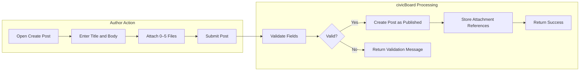
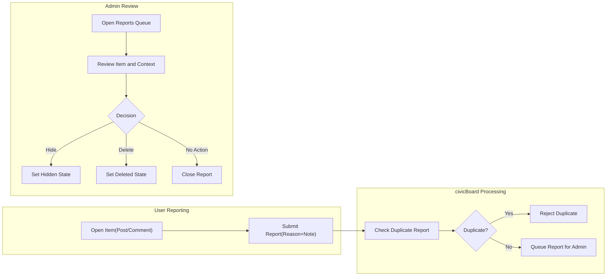

# Functional Requirements — civicBoard (Minimal)

A minimal, production-focused set of business requirements for civicBoard, a simple economic/political discussion board. The scope includes posts, comments, and attachments on posts, plus basic search, reporting, and lightweight moderation. All statements describe WHAT the service must do in business terms; no database schemas, API designs, or infrastructure are specified here.

Related reference for roles and authorization: User Actors and Permissions for civicBoard.

## 1) Scope and Intent
- Provide a concise, minimal, testable requirements set for a straightforward discussion board.
- Emphasize evidence-friendly posts via image/file attachments and simple conversations through comments.
- Keep optional features explicitly optional to preserve simplicity.

## 2) Actors and Permissions Overview (Business Summary)
Actors
- Guest: Unauthenticated visitor who can read publicly visible content.
- user: Registered member who can create, read, update, and delete own posts and comments; upload attachments to own posts; report content; manage own profile.
- admin: Administrator who can manage all content and users; moderate and remove posts/comments; manage reports; configure minimal board policies.

Permission highlights (business)
- Guests: Read published posts and comments and view attachments of published content.
- Users: Full read; may create/edit/delete own posts and comments within policy; may attach files to own posts; may report content.
- Admins: Read everything; may hide/delete any content; may review and resolve reports; may enforce policies.

## 3) Authentication and Access (Business-Level)
Business capabilities
- Registration with email and password.
- Email verification is required before creating posts or comments.
- Login/logout to start/end sessions; password reset for forgotten credentials.
- Session continuity across visits, revocable by the user (sign out from other sessions) and by admin upon moderation.

EARS requirements
- THE civicBoard SHALL require authentication for creating, editing, deleting, or reporting content.
- THE civicBoard SHALL allow reading of published content without authentication.
- WHEN a user registers, THE civicBoard SHALL require email verification before allowing post or comment creation.
- WHEN a user logs in successfully, THE civicBoard SHALL establish a signed-in session.
- WHEN a user logs out or revokes sessions, THE civicBoard SHALL end those sessions promptly.
- WHILE an account is suspended, THE civicBoard SHALL deny content creation and management.

## 4) Core Content Definitions (Business Terms)
- Post: A top-level article with a title and body; may include attachments; visible when published.
- Comment: A short textual reply to a post; published under the post; no attachments in the minimal release.
- Attachment: An image or file associated with a post; follows the parent post’s visibility.

## 5) Posts (Create/Read/Update/Delete)

### 5.1 Business Rules and Constraints (Posts)
- Title length: 1–120 characters (required).
- Body length: 1–20,000 characters (required).
- Attachments: Up to 5 per post; allowed types and sizes defined in Section 7.
- Edit window for authors: 60 minutes from creation time.
- Deletion by author: Allowed at any time; deleted posts are removed from public lists.
- Moderation: Admin may hide or delete any content at any time.
- Rate limiting: Up to 5 posts per user per calendar day.
- States: Published, Hidden, Deleted (soft). Draft is optional; if drafts are not supported, creation is directly Published.
- Listing: Newest-first ordering; 20 posts per page.

### 5.2 EARS Requirements (Posts)
- THE civicBoard SHALL require a non-empty title and body within defined length limits for every post.
- THE civicBoard SHALL allow up to 5 attachments per post.
- WHEN an authenticated, verified user submits a valid new post, THE civicBoard SHALL create the post as Published and make it visible to readers within 2 seconds under normal load.
- IF post creation input violates length or attachment constraints, THEN THE civicBoard SHALL reject the creation with a clear validation message describing the violated rule.
- WHERE drafts are enabled, THE civicBoard SHALL allow saving a post as Draft and later publishing it by the author.
- WHEN an author edits own Published post within 60 minutes and inputs are valid, THE civicBoard SHALL apply the edit and update the last-edited timestamp.
- IF an author attempts to edit own post after 60 minutes, THEN THE civicBoard SHALL deny the edit and present the reason that the edit window has expired.
- WHEN an author deletes own post, THE civicBoard SHALL mark it as Deleted and remove it from public lists immediately.
- WHEN an admin hides a post, THE civicBoard SHALL set the post state to Hidden and restrict visibility to admin and original author.
- WHILE a post is Hidden, THE civicBoard SHALL prevent new comments on that post by non-admin users.
- WHEN listing posts, THE civicBoard SHALL return items ordered by newest first in pages of 20 items per page.
- WHEN viewing a specific Published post, THE civicBoard SHALL include its comments ordered oldest-first by default.

### 5.3 Acceptance Criteria (Posts)
- Creating a valid post (0–5 attachments) returns a Published post visible within 2 seconds under normal load.
- Creating a post violating title/body/attachment constraints returns field-specific errors and preserves user input.
- Editing within 60 minutes by the author succeeds; after 60 minutes, edit is rejected with an edit-window-expired message.
- Deleting own post removes it from public listings immediately; the state becomes Deleted.
- Hidden state prevents non-admin viewing and blocks further commenting by non-admin users.
- Pagination returns 20 items per page, newest-first; page boundaries remain consistent across requests with the same dataset.

## 6) Comments (Create/Read/Update/Delete)

### 6.1 Business Rules and Constraints (Comments)
- Body length: 1–5,000 characters (required).
- Attachments: Not allowed in the minimal release.
- Edit window: 15 minutes from creation time.
- Deletion by author: Allowed at any time; deleted comments display a placeholder to preserve conversation continuity.
- Rate limiting: Up to 50 comments per user per calendar day.
- Ordering: Oldest-first within a post; 20 per page if pagination is needed.

### 6.2 EARS Requirements (Comments)
- THE civicBoard SHALL require a non-empty body within defined length limits for every comment.
- WHEN an authenticated, verified user submits a valid comment to a Published post, THE civicBoard SHALL create the comment and associate it to the post within 2 seconds for normal load.
- IF a comment is submitted to a Hidden or Deleted post, THEN THE civicBoard SHALL reject the comment with a message indicating the post is not open for commenting.
- WHEN an author edits own comment within 15 minutes and inputs are valid, THE civicBoard SHALL update the comment and record the last-edited timestamp.
- IF an author attempts to edit own comment after 15 minutes, THEN THE civicBoard SHALL deny the edit and indicate the edit window has expired.
- WHEN an author deletes own comment, THE civicBoard SHALL mark it as Deleted and replace the visible content with a placeholder indicator.
- WHEN listing comments for a Published post, THE civicBoard SHALL return them ordered oldest-first in pages of 20 when applicable.

### 6.3 Acceptance Criteria (Comments)
- Creating a valid comment on a Published post succeeds within 2 seconds.
- Commenting on Hidden/Deleted posts fails with a clear message.
- Editing within 15 minutes succeeds; after 15 minutes, edit is rejected.
- Deleting own comment replaces it with a placeholder; deleted comments no longer appear in reaction counts or searches.

## 7) Attachments (Images/Files for Posts)

### 7.1 Business Rules and Constraints (Attachments)
- Scope: Attachments are allowed on posts only; comments do not support attachments in the minimal release.
- Max attachments per post: 5.
- Allowed image types: JPEG, PNG, GIF.
- Allowed document types: PDF.
- Max size per attachment: 10 MB.
- File naming: Preserve user-friendly filenames; remove unsafe characters.
- Visibility: Attachments follow the parent post’s state (Published → public, Hidden → restricted to admin and author, Deleted → not accessible to non-admins).
- Removal: Authors may remove attachments within the 60-minute edit window; admins may remove at any time for moderation.

### 7.2 EARS Requirements (Attachments)
- THE civicBoard SHALL limit attachments to allowed types (JPEG, PNG, GIF, PDF) and to 10 MB per file.
- WHEN an author adds attachments beyond the allowed count, THE civicBoard SHALL reject the extra attachments with a clear message.
- IF an attachment exceeds the 10 MB limit or is of a disallowed type, THEN THE civicBoard SHALL reject it with a message specifying the violated constraint.
- WHEN a post is Hidden, THE civicBoard SHALL restrict access to its attachments to admin and the post author.
- WHEN a post is Deleted, THE civicBoard SHALL prevent non-admin access to its attachments.
- WHEN an author removes an attachment within the edit window, THE civicBoard SHALL persist the change and reflect it within 2 seconds under normal load.

### 7.3 Acceptance Criteria (Attachments)
- Uploading 1–5 allowed attachments of size ≤10 MB each succeeds; uploading a 6th file is rejected with an over-limit message.
- Uploading any disallowed type or oversize file is rejected with clear messages.
- Hidden posts’ attachments are inaccessible to non-admin non-author actors; Deleted posts’ attachments are inaccessible to non-admin actors entirely.
- Removing an attachment within the edit window updates subsequent reads immediately.

## 8) Reactions (Optional, Single "Like")

### 8.1 Business Rules and Constraints (Reactions)
- Scope: A single, binary "Like" is supported for posts and comments if enabled.
- Auth requirement: Only authenticated users can like content.
- One per user: A user can like a given item at most once; toggling removes the like.
- Self-like: Users cannot like their own content.
- Counts: Reaction counts are visible on content reads when the feature is enabled.

### 8.2 EARS Requirements (Reactions)
- WHERE reactions are enabled, THE civicBoard SHALL allow a user to toggle a single Like on any other user’s Published post or comment.
- IF a user attempts to like own post or comment, THEN THE civicBoard SHALL reject the action with a self-like-not-allowed message.
- WHEN a user who previously liked an item toggles again, THE civicBoard SHALL remove their Like and decrement the count.
- WHILE content is Hidden or Deleted, THE civicBoard SHALL prevent new reactions by non-admin users.

### 8.3 Acceptance Criteria (Reactions)
- With reactions enabled, liking a Published post or comment by a different user increments the count by one and is reflected in reads within 2 seconds under normal load.
- Toggling Like again by the same user decrements the count by one.
- Attempting to like own content fails with a clear message.
- Hidden or Deleted content does not accept new reactions by non-admin users.

## 9) Search and Filtering (Basic)

### 9.1 Business Rules and Constraints (Search)
- Scope: Basic keyword search across post titles and bodies.
- Term handling: Space-separated terms with AND semantics.
- Ordering: Search results are newest-first.
- Pagination: 20 posts per page.
- Optional filters: Author and creation date range (inclusive).

### 9.2 EARS Requirements (Search)
- THE civicBoard SHALL support keyword search over post titles and bodies using space-separated terms with AND semantics.
- WHEN a search is executed, THE civicBoard SHALL return matching posts ordered newest-first in pages of 20 within 2 seconds for common queries.
- WHERE author and date-range filters are provided, THE civicBoard SHALL restrict results accordingly before pagination.
- IF no posts match the criteria, THEN THE civicBoard SHALL return an empty result set with zero total count.

### 9.3 Acceptance Criteria (Search)
- A search for two terms returns only posts containing both terms in title or body.
- Pagination consistently returns 20 posts per page; the first page is newest-first.
- Applying an author filter returns posts by that author only; applying a date range returns only posts within that range.
- An unmatched query returns zero results and zero total count.

## 10) Reporting and Moderation Hooks (Minimal)

### 10.1 Business Rules and Constraints (Reporting)
- Reportable items: Posts and comments.
- Reasons: Predefined list — Spam, Harassment, Misinformation, Off-topic, Other.
- One report per user per item: Duplicate reporting by the same user on the same item is not allowed.
- Visibility: Admin can view and manage the reports queue; reporters can see their own report status.
- Admin actions: Mark as Reviewed, Hide content, Delete content, or Dismiss report as No Action.

### 10.2 EARS Requirements (Reporting)
- THE civicBoard SHALL allow any authenticated user to report a post or comment by selecting a predefined reason and optionally providing a short description up to 500 characters.
- IF the same user attempts to report the same item more than once, THEN THE civicBoard SHALL reject the duplicate report.
- WHEN a report is submitted, THE civicBoard SHALL add it to the admin review queue within 2 seconds under normal load.
- WHEN an admin resolves a report, THE civicBoard SHALL record the resolution outcome and, where applicable, change the item’s state (e.g., Hidden or Deleted).

### 10.3 Acceptance Criteria (Reporting)
- Submitting a valid report adds it to the admin queue; duplicate reports from the same user on the same item are rejected.
- Admin can mark a report as Reviewed with one of: Hidden, Deleted, or No Action; item state changes accordingly.
- Reporters can view their own report statuses.

## 11) Business Rules and Validation Summary

### 11.1 Content Limits
- Post title: 1–120 chars; Post body: 1–20,000 chars; max 5 attachments (JPEG/PNG/GIF/PDF, ≤10 MB each).
- Comment body: 1–5,000 chars.

### 11.2 Time Windows and States
- Post edit window: 60 minutes from creation.
- Comment edit window: 15 minutes from creation.
- Content states: Published, Hidden, Deleted (soft).

### 11.3 Rate Limits
- Posts: max 5 per user per calendar day.
- Comments: max 50 per user per calendar day.
- Reports: block duplicates per item and apply reasonable user-level limits.

### 11.4 Read Experience
- Posts: newest-first; 20 per page.
- Comments: oldest-first; 20 per page when pagination is needed.
- Normal-load response expectation for common reads and writes: within 2 seconds.

### 11.5 Ownership and Visibility Rules
- Authors can edit within the defined window; authors can delete own content at any time (subject to state rules).
- Hidden content is visible only to admin and original author; Deleted content is not visible to non-admins (post) and appears as a placeholder (comment) to preserve conversation continuity.

## 12) Acceptance Criteria per Feature (Consolidated)

### 12.1 Posts
- Create: Valid post with up to 5 valid attachments becomes Published, visible within 2 seconds under normal load.
- Read: Listing returns 20 newest-first; single read returns content with correct state and associated comments (oldest-first by default).
- Update: Edit within 60 minutes by author succeeds; after 60 minutes, edit is rejected.
- Delete: Author delete removes from public lists immediately; admin can hide or delete at any time.

### 12.2 Comments
- Create: Valid comment on a Published post succeeds within 2 seconds; commenting on Hidden/Deleted post is rejected.
- Read: Listing returns oldest-first; pagination behaves at 20 per page when applicable.
- Update: Edit within 15 minutes succeeds; after 15 minutes, edit is rejected.
- Delete: Author delete shows placeholder; admin can hide or delete at any time.

### 12.3 Attachments
- Type/size enforcement: Only JPEG/PNG/GIF/PDF ≤10 MB; violations are rejected with clear messages.
- Count enforcement: More than 5 attachments rejected.
- Visibility: Hidden/Deleted post attachments access restricted as specified.

### 12.4 Reactions (Optional)
- Like toggle: One like per user per item; toggling removes the like; self-like disallowed.
- Hidden/Deleted content: No new reactions by non-admin users.

### 12.5 Search and Filtering
- Keyword AND search over titles/bodies with pagination at 20 and newest-first ordering.
- Filters by author and date range narrow results.

### 12.6 Reporting and Moderation Hooks
- Report creation with predefined reasons; duplicate reports by same user blocked; admin resolutions update content state.

## 13) Process Diagrams (Mermaid)

### 13.1 Post Creation with Attachments

### 13.2 Reporting and Moderation Flow

## 14) Glossary
- Author: The creator of a post or comment.
- Hidden: A moderation state that removes public visibility, limiting access to admin and the original author; prevents new comments by non-admin users while Hidden.
- Deleted (Post): A state that removes the post from public lists and prevents non-admin access to its content and attachments.
- Deleted (Comment): A state that replaces the comment text with a placeholder so the conversation structure remains intact.
- Attachment: A user-uploaded image or PDF file associated with a post, subject to count and size limits.
- Reaction: An optional single-like toggle available to authenticated users on others’ content.

Business-only statement: All technical implementation decisions (architecture, APIs, data models, storage, and infrastructure) are at the discretion of the development team. This specification defines WHAT behaviors civicBoard must deliver; the team retains autonomy over HOW to implement them.
