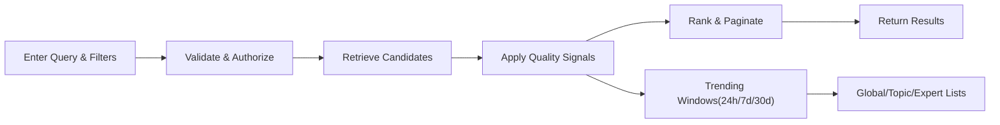
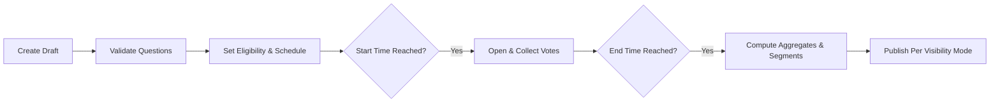
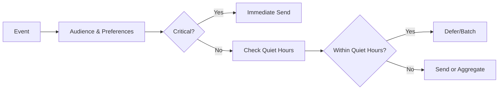

# econDiscuss — Consolidated Functional Requirements (Business-Level)

## 1. Scope and Outcomes
A professional, modern social platform for economic discourse that combines familiar social UX with rigorous quality controls. Core capabilities include verified expertise profiles, bookmarks and private voting history, advanced search with trending and expert filters, polls/surveys for economic sentiment, real-time notifications and live discussions, draft saving for long posts, follow/subscribe feeds, and a reputation system that rewards quality contributions.

Objectives (EARS):
- THE platform SHALL maintain professional discussion quality through verification, moderation, and reputation weighting.
- THE platform SHALL provide modern social discovery and engagement without compromising privacy or integrity.
- THE platform SHALL ensure all time-bound behavior respects the user’s timezone (e.g., Asia/Seoul for examples in this specification).

## 2. Roles and Permissions (Business-Level)
Roles: visitor, member, verifiedExpert, moderator, admin.
- THE platform SHALL allow visitor to read public content and use basic search/trending.
- WHERE role is member, THE platform SHALL enable posting, commenting, voting, following, subscribing, bookmarking, drafting, and poll participation.
- WHERE role is verifiedExpert, THE platform SHALL grant expert-weighted voting, expert-only thread participation, and domain badges.
- WHERE role is moderator, THE platform SHALL enable report handling, feature curation, sanctions, and verification queue review.
- WHERE role is admin, THE platform SHALL allow configuration of policies, topics, thresholds, and audit access within governance.

## 3. Authentication and Session Management
Registration and sign-in:
- THE platform SHALL support email/password and OAuth sign-in (e.g., Google/LinkedIn) without prescribing providers.
- THE platform SHALL require email verification before enabling posting, voting, following, and poll participation.

Sessions and security:
- WHEN a member signs in successfully, THE platform SHALL create an authenticated session and reflect role-based capabilities immediately.
- WHERE role is moderator or admin, THE platform SHALL require 2FA; WHERE role is verifiedExpert, THE platform SHALL prompt and require 2FA within a grace period.
- WHEN a user logs out or revokes a device session, THE platform SHALL terminate that session immediately.
- WHEN suspicious sign-in is detected, THE platform SHALL require step-up verification before granting full access.

Timezone and preferences:
- WHEN a user sets a timezone, THE platform SHALL apply it to digests, quiet hours, poll schedules, and result timers.

## 4. Expertise Verification
Eligibility and intake:
- THE platform SHALL allow members in good standing to apply for verification with evidence mapped to requested economic domains (e.g., Macro, Labor, Finance).
- WHEN an application is submitted, THE platform SHALL acknowledge with an application ID within seconds and queue for review.

Review and decision:
- WHEN reviewers assess a case, THE platform SHALL support conflict-of-interest checks and a rubric with domain-agnostic and domain-specific criteria.
- WHEN approved, THE platform SHALL assign domain badges and apply expert privileges immediately; WHEN denied, THE platform SHALL communicate rationale and appeal options.

Lifecycle:
- THE platform SHALL set default badge validity (e.g., 24 months) and notify experts of upcoming expiry (e.g., 60 and 14 days prior).
- IF misconduct is confirmed, THEN THE platform SHALL suspend or revoke badges per governance with audit and appeal paths.

## 5. Content and Authoring
Posts, comments, live messages:
- THE platform SHALL allow members and above to publish posts and comments with controlled formatting, tags, and citations.
- THE platform SHALL allow live messages in live contexts with short edit windows for typo correction.

Drafts and autosave:
- THE platform SHALL autosave drafts during editing at intervals of 5–10 seconds and confirm saves within 1 second under normal load.
- THE platform SHALL sync drafts across a user’s devices and preserve prior snapshots on conflicts.

Editing and versioning:
- WHEN an author edits within the policy window (e.g., posts 30–60 minutes; comments 10–15 minutes), THE platform SHALL update in place; after the window, THE platform SHALL create a new public version with an “edited” indicator.

## 6. Bookmarks and Private Voting History
Bookmarks and collections:
- THE platform SHALL allow saving posts, comments, polls, and live threads to private collections by default.
- WHEN a user shares a collection, THE platform SHALL expose read-only views without private notes and allow revocation at any time.

Voting history privacy:
- THE platform SHALL provide each user with a private view of their own votes (posts and comments) with filters by date range, type, and status.
- THE platform SHALL keep individual voting choices private to the voter; public surfaces show aggregate counts only.

## 7. Search, Discovery, and Trending
Filters and sorts:
- THE platform SHALL support keyword, author, topic/tag, role filter (expert-only), date range, content type, reputation threshold, and engagement attributes (has poll, has citations).
- THE platform SHALL support sorts by relevance, newest, time-windowed top (24h/7d/30d), most discussed, and expert-weighted score.

Trending:
- THE platform SHALL compute trending with signals from quality interactions (upvotes/comments/bookmarks), recency, author reputation, and expert engagement, with separate lists for global, topic, and expert.
- IF content is sanctioned or under high-confidence abuse review, THEN THE platform SHALL exclude it from trending.

Performance:
- WHEN executing a common query, THE platform SHALL return results within 1–2 seconds under normal load; trending views SHALL render within ~1 second.

Mermaid — Search & Trending Overview:

## 8. Polls and Economic Sentiment
Question types and visibility:
- THE platform SHALL support single choice, multiple choice, Likert, ranking, and numeric estimate (with unit/range/step) within polls and multi-question surveys.
- THE platform SHALL default results to Hidden-Until-Close; creators may choose Visible-After-Vote; expert-only polls SHALL NOT use Always-Visible.

Eligibility and privacy:
- WHERE reputation and age thresholds are met (or role is verifiedExpert), THE platform SHALL allow poll/survey creation; all voters must be authenticated and eligible.
- THE platform SHALL publish only aggregated results; segmented results (e.g., expert vs general) SHALL obey minimum k-thresholds (e.g., ≥ 10–20 per segment) to prevent deanonymization.

Integrity:
- WHEN anomalous patterns are detected (e.g., sudden influx of low-rep accounts), THE platform SHALL quarantine suspicious votes from tallies pending review and annotate results neutrally.

Mermaid — Poll Lifecycle:

## 9. Real-Time Collaboration and Notifications
Live modes:
- THE platform SHALL support live threads (post-centric) and live rooms (dedicated sessions) with presence and typing indicators scoped to context.

Latency and reliability:
- WHILE in live mode, THE platform SHALL deliver messages to active participants with end-to-end latency under ~1 second p95 and restore ordered history after reconnect.

Notification catalog and quiet hours:
- WHEN a user is mentioned or replied to, THE platform SHALL send an immediate notification per preferences; important events (followed expert posts, topic trending) SHALL respect debounce and quiet hours; bulk events SHALL be batched.
- WHERE quiet hours are configured (e.g., 23:00–07:00 Asia/Seoul), THE platform SHALL defer non-critical notifications and deliver after quiet hours end.

Mermaid — Notification Decisioning:

## 10. Follow, Subscribe, and Feeds
Follow/subscribe:
- THE platform SHALL allow following users and subscribing to topics; these signals SHALL prioritize content in the Home feed.

Feed composition and digests:
- THE platform SHALL blend followed and subscribed content with high-signal discovery, enforce source diversity, and respect mutes/blocks.
- WHERE daily/weekly digests are enabled, THE platform SHALL compile and deliver summaries in the user’s local time window.

Transparency:
- THE platform SHALL provide a simple “why in my feed” explanation (e.g., followed author, subscribed topic, expert trending) for each item.

## 11. Reputation and Unlocks
Inputs and weights:
- THE platform SHALL compute reputation from received upvotes/downvotes on posts/comments, with expert-weighted votes and reasonable caps per item to avoid runaway effects.
- THE platform SHALL apply time decay so recent contributions matter more (e.g., 90–180 day half-life).

Unlocks:
- WHERE reputation meets thresholds, THE platform SHALL unlock capabilities such as poll creation, live room creation, taxonomy proposals, elevated flagging weight, and relaxed rate limits.
- IF reputation drops below thresholds due to decay or penalties, THEN THE platform SHALL revoke unlocked features after a grace period.

## 12. Professional Quality Safeguards and Governance
Rate limits and anti-abuse:
- THE platform SHALL enforce role- and reputation-aware limits on posting, comments, links, votes, follows, and live messages.
- WHEN duplicate or spam-like behavior is detected, THE platform SHALL throttle or block and prompt corrective actions.

Moderation and transparency:
- WHEN content is reported, THE platform SHALL triage, review, and decide within policy SLAs, notifying reporter and author with outcomes and references to guidelines.
- WHERE violations occur, THE platform SHALL apply proportional sanctions (labels/removal, feature limits, mutes, suspensions, bans) with appeal rights.

Expert modes and curation:
- WHERE expert-only or expert-first modes are enabled, THE platform SHALL restrict initial participation to experts while allowing broader reading.
- WHEN content is featured by curators, THE platform SHALL mark and time-bound the placement with auditable rationale.

## 13. Privacy and Security (Business View)
Defaults and controls:
- THE platform SHALL keep bookmarks private by default; SHALL keep individual voting choices private; SHALL allow users to export their data and manage visibility settings.
- WHERE poll segmentation is displayed, THE platform SHALL enforce minimum sample thresholds and suppress small segments.

Sensitive data handling:
- THE platform SHALL restrict access to verification evidence and other sensitive data to authorized roles under audit.

## 14. Performance, Availability, and Acceptance Targets
Latency targets (p95 under normal load):
- Content read (post/comment): ~300 ms; Home feed assembly: ~600 ms; Search with filters: ~800 ms; Vote submission: ~200 ms; Draft autosave ack: ~150–1000 ms; Live message fan-out: ~300–1000 ms; Mention/reply notification: ≤ 5 seconds; Non-urgent notifications: ≤ 30 seconds.

Availability and recovery:
- THE platform SHALL maintain 99.9% monthly uptime for core operations; SHALL target RTO ≤ 2 hours and RPO ≤ 15 minutes for critical data.
- WHEN dependencies degrade, THE platform SHALL prioritize core reads and queue non-critical work for later.

Acceptance criteria (samples):
- WHEN a member searches with expert-only filter and Last 7d on “Monetary Policy,” THE platform SHALL return only expert-authored items within 2 seconds p95.
- WHEN a poll closes, THE platform SHALL publish aggregates and eligible segments within 60 seconds.
- WHEN a followed expert publishes, THE platform SHALL notify followers within 1 minute, respecting quiet hours.

## 15. End-to-End User Journey (Illustrative)

```mermaid
graph LR
  A["Visitor Reads & Searches"] --> B["Registers & Verifies Email"]
  B --> C["Follows Users & Subscribes Topics"]
  C --> D["Drafts & Publishes Post"]
  D --> E["Receives Replies & Notifications"]
  E --> F["Participates in Polls"]
  F --> G["Bookmarks & Organizes Collections"]
  G --> H["Joins Live Discussions"]
  H --> I["Builds Reputation & Unlocks Features"]
```

## 16. Error Handling (Selected EARS)
- IF a user attempts to vote on own content, THEN THE platform SHALL deny the vote with a clear rule explanation.
- IF a poll segment does not meet the minimum k-threshold, THEN THE platform SHALL hide that segment and display an “insufficient responses” note.
- IF rate limits are exceeded, THEN THE platform SHALL block the action and show time-to-reset.
- IF a search filter references a nonexistent author or tag, THEN THE platform SHALL return a validation error and suggest corrections when possible.
- IF a live connection drops, THEN THE platform SHALL indicate reconnection and restore missed messages in order upon recovery.

---
Business-only statement: behaviors are specified in natural language for implementation by the development team; no APIs, database schemas, or transport details are prescribed here.