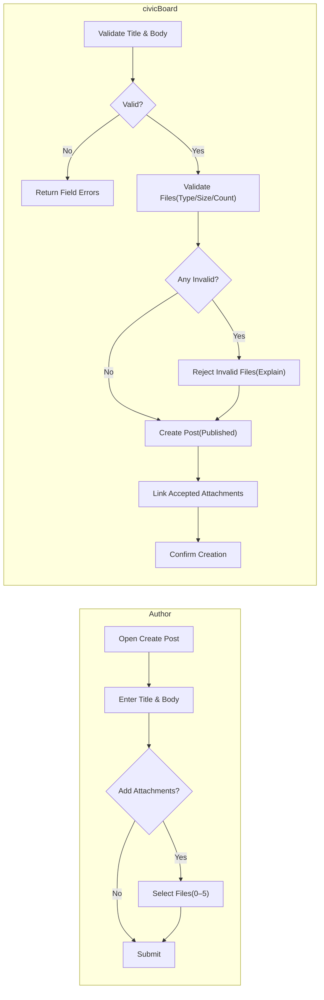
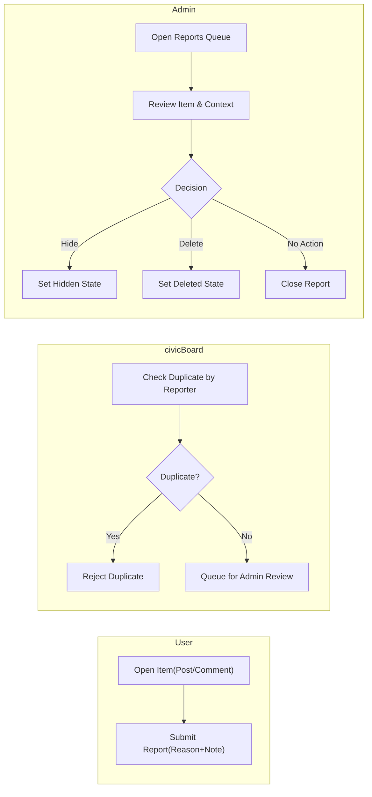

# Functional Requirements — civicBoard (Minimal)

## Purpose and Scope
Purpose: Provide a concise, minimal, testable set of business requirements for a simple economic/political discussion board where articles (posts) support image and file attachments. Scope covers posts, comments, attachments (posts only), basic list/detail browsing, basic keyword search, minimal reporting and moderation hooks, and optional lightweight reactions/notifications. Technical implementation details (APIs, schemas, libraries, infrastructure) are intentionally excluded.

## Actors and Permission Summary (Business)
- Guest: Reads publicly visible posts and comments.
- User: Creates and manages own posts and comments; attaches files to own posts; reports content; manages own profile within limits.
- Admin: Moderates and manages all content and accounts; resolves reports; hides or deletes content.

Business principles:
- Ownership: Users manage only their own posts/comments. Admins may moderate any content.
- Visibility: Hidden items are non-public; Deleted items are not shown to regular users. Attachments follow parent visibility.
- Authentication: Reading is public; creating, editing, deleting, reacting, or reporting requires authentication.

## Core Concepts (Business Terms)
- Post: A user-authored article consisting of a title, a body, and optional attachments (images/files). Published posts are public unless moderated.
- Comment: A user-authored textual response to a post. Minimal scope: comments are text-only.
- Attachment: An image or file associated with a post. Attachments on comments are not supported in the minimal scope.

## Posts (Create/Read/Update/Delete)

### Business Rules and Constraints
- Title length: 1–120 characters (required; trimmed; non-whitespace).
- Body length: 1–20,000 characters (required; trimmed; non-whitespace).
- Attachments per post: up to 5 (see Attachments section for types/sizes).
- Author edit window: 60 minutes from creation; after expiry, author edits are denied.
- Deletion by author: Allowed at any time; removed from public lists immediately.
- Admin moderation: Admin may hide or delete any post at any time with a recorded reason.
- Listing order: Newest-first by publication time; pagination size 20.
- Read detail: Shows title, body, attachments, author display name, publication time, and comments.
- Rate limiting: Up to 5 posts per user per calendar day.

### EARS Requirements (Posts)
- THE civicBoard SHALL require a non-empty title and body within defined limits for every post.
- THE civicBoard SHALL allow up to 5 attachments per post.
- WHEN an authenticated user submits a valid post, THE civicBoard SHALL publish it and make it visible to all readers within 2 seconds under normal load.
- IF post submission violates any length or attachment constraints, THEN THE civicBoard SHALL reject the submission and identify each violated rule.
- WHERE drafts are supported, THE civicBoard SHALL allow saving as Draft and later publishing by the author.
- WHEN an author edits own post within 60 minutes and inputs are valid, THE civicBoard SHALL apply the edit and update the last-edited timestamp.
- IF an edit occurs after the 60-minute window, THEN THE civicBoard SHALL deny the edit and explain that the edit window has expired.
- WHEN an author deletes own post, THE civicBoard SHALL remove the post from public visibility immediately.
- WHEN an admin hides a post, THE civicBoard SHALL set the state to Hidden and prevent non-admin viewing.
- WHILE a post is Hidden, THE civicBoard SHALL prevent new comments by non-admin users.
- WHEN listing posts, THE civicBoard SHALL return pages of 20 items ordered newest-first.

### Acceptance Criteria (Posts)
- Valid create: A post with title/body within limits and 0–5 valid attachments appears in listings within 2 seconds under normal load.
- Invalid create: Violations of title/body length, attachment type/size/count are rejected with specific messages.
- Update: Edits within 60 minutes succeed; edits at 60 minutes + 1 second fail with an edit-window-expired message.
- Delete: Deleting own post removes it from public listings immediately; hidden posts are not shown to non-admins.
- Pagination: 20 items per page, newest-first; page boundaries are stable within a reasonable browsing window.

## Comments (Create/Read/Update/Delete)

### Business Rules and Constraints
- Body length: 1–5,000 characters (required; trimmed; non-whitespace).
- Attachments: Not supported on comments in minimal scope.
- Author edit window: 15 minutes from creation; after expiry, author edits are denied.
- Deletion by author: Allowed; deleted comments are replaced by a simple placeholder indicator.
- Ordering: Oldest-first by default under a post; pagination size 20 when needed.
- Rate limiting: Up to 50 comments per user per calendar day.

### EARS Requirements (Comments)
- THE civicBoard SHALL require a non-empty comment body within defined limits.
- WHEN an authenticated user submits a valid comment to a Published post, THE civicBoard SHALL create it and associate it to that post within 2 seconds under normal load.
- IF a comment targets a Hidden or Deleted post, THEN THE civicBoard SHALL deny creation and explain unavailability.
- WHEN an author edits own comment within 15 minutes and inputs are valid, THE civicBoard SHALL apply the edit and update the last-edited timestamp.
- IF an edit occurs after the 15-minute window, THEN THE civicBoard SHALL deny the edit and indicate the edit window has expired.
- WHEN an author deletes own comment, THE civicBoard SHALL mark it as Deleted and display a placeholder.
- WHEN listing comments, THE civicBoard SHALL return them ordered oldest-first and paginate at 20 when applicable.

### Acceptance Criteria (Comments)
- Valid create: A comment with body within limits appears under its post within 2 seconds under normal load.
- Invalid create: Empty or over-limit body is rejected with a specific message.
- Update: Edits within 15 minutes succeed; later edits are rejected with an edit-window-expired message.
- Delete: Deleting own comment shows a placeholder; hidden or deleted posts do not accept new comments.

## Attachments (Images/Files for Posts)

### Business Rules and Constraints
- Scope: Attachments are allowed on posts; comments cannot have attachments.
- Allowed image types: JPEG, PNG, GIF.
- Allowed document types: PDF.
- Max per-file size: 10 MB (images and PDFs).
- Max attachments per post: 5.
- Combined size per post: up to 20 MB (all attachments on one post).
- Attachment naming: Preserve safe filenames; remove disallowed characters.
- Visibility linkage: Attachments follow parent post visibility (Published → public; Hidden → non-public; Deleted → non-accessible to non-admins).
- Removal: Authors may remove attachments within the edit window; admins may remove at any time for moderation.

### EARS Requirements (Attachments)
- THE civicBoard SHALL accept only JPEG, PNG, GIF, and PDF attachments for posts.
- THE civicBoard SHALL limit each attachment to 10 MB and limit posts to 5 attachments with combined size ≤20 MB.
- WHEN files are submitted, THE civicBoard SHALL validate each file’s type, size, and count and reject only the failing files with reasons.
- WHEN a post is Hidden, THE civicBoard SHALL restrict access to its attachments to admin and the post author.
- WHEN a post is Deleted, THE civicBoard SHALL prevent non-admin access to attachments.
- WHEN an author removes an attachment within the edit window, THE civicBoard SHALL persist the change and reflect it in subsequent reads within 2 seconds under normal load.

### Acceptance Criteria (Attachments)
- Uploading 1–5 allowed files ≤10 MB succeeds; a 6th file or any disallowed/oversize file is rejected with a clear reason.
- Hidden post attachments are non-public; deleted post attachments are inaccessible to non-admin users.
- Removing an attachment within the edit window updates the attachment list immediately in subsequent reads.

## Optional Features (Minimal)

### Reactions (Single “Like”)
- Scope: A single binary Like is supported for posts and comments if enabled.
- Auth: Only authenticated users can like; self-like is not allowed.
- One per user: Toggling removes own like.

EARS:
- WHERE reactions are enabled, THE civicBoard SHALL allow a user to toggle a single Like on any other user’s Published post or comment.
- IF a user attempts to like own content, THEN THE civicBoard SHALL reject the action with a self-like-not-allowed message.
- WHEN a user toggles Like again, THE civicBoard SHALL remove their Like and decrement the count.
- WHILE content is Hidden or Deleted, THE civicBoard SHALL prevent new reactions by non-admin users.

Acceptance:
- Liking increments counts within 2 seconds under normal load; toggling decrements within 2 seconds; attempts to self-like fail with a clear message.

### Notifications (Very Basic)
- Scope: Minimal events only—new comment on a user’s post; report resolution to reporter; new report alert to admins. Channel choice is implementation-specific.

EARS:
- WHERE notifications are enabled, THE civicBoard SHALL notify a post’s author when a new comment is created on that post.
- WHERE notifications are enabled, THE civicBoard SHALL notify the reporter when a report is resolved, including the outcome.
- WHERE notifications are enabled, THE civicBoard SHALL notify admins when a new report is filed.

Acceptance:
- Notifications are emitted for the three events described above when enabled.

## Search and Filtering (Basic)

### Business Rules and Constraints
- Scope: Keyword search across post titles and bodies only.
- Term handling: Space-separated terms with AND semantics.
- Ordering: Newest-first.
- Pagination: 20 posts per page.
- Filters: Optional author and inclusive date range.

### EARS Requirements (Search)
- THE civicBoard SHALL support keyword search over post titles and bodies using AND semantics for space-separated terms.
- WHEN a search is executed, THE civicBoard SHALL return matching posts ordered newest-first in pages of 20 within 2 seconds for common queries.
- WHERE author and date-range filters are provided, THE civicBoard SHALL restrict results accordingly before pagination.
- IF no posts match, THEN THE civicBoard SHALL return an empty set and zero total count.

### Acceptance Criteria (Search)
- Multi-term searches return only posts containing all terms; ordering and pagination are consistent; filters limit results as requested; unmatched queries return zero results.

## Reporting and Moderation Hooks (Minimal)

### Business Rules and Constraints
- Reportable items: Posts and comments.
- Reasons: Predefined list—Spam, Harassment, Misinformation, Off-topic, Other.
- Duplicate reports: One per user per item within a cooldown window.
- Visibility: Admin reviews queue; reporters can see own report status.
- Admin actions: Mark as Reviewed, Hide, Delete, or No Action; record outcome.

### EARS Requirements (Reporting)
- THE civicBoard SHALL allow any authenticated user to report a post or comment by selecting a predefined reason with an optional note up to 500 characters.
- IF the same user reports the same item again within the cooldown, THEN THE civicBoard SHALL reject the duplicate.
- WHEN a report is submitted, THE civicBoard SHALL add it to an admin review queue within 2 seconds under normal load.
- WHEN an admin resolves a report, THE civicBoard SHALL record the outcome and apply any state change (Hidden or Deleted) as required.

### Acceptance Criteria (Reporting)
- Valid reports appear in the admin queue; duplicates by the same user on the same item are rejected; resolutions update item state and reporter status (where visible).

## Rate Limits and Cross-Cutting Rules

### Minimal Anti-Abuse Limits (Business)
- Posts: up to 5 per user per calendar day; minimum 10 seconds between posts recommended.
- Comments: up to 50 per user per calendar day; minimum 5 seconds between comments recommended.
- Reports: up to 10 per user per calendar day.

EARS:
- WHEN a user exceeds a configured limit, THE civicBoard SHALL deny the action and indicate when it can be retried.
- THE civicBoard SHALL apply limits per account and may apply per-origin limits where appropriate to reduce abuse.

### Ownership and Visibility (Cross-Cutting)
- THE civicBoard SHALL allow users to edit and delete only their own content within defined windows.
- THE civicBoard SHALL prevent commenting and reactions by non-admins on Hidden or Deleted content.
- THE civicBoard SHALL ensure attachments are governed by the visibility of their parent post.

## Acceptance Criteria Summary (Consolidated)

### Posts
- Create: Valid posts appear within 2 seconds; invalid inputs produce specific messages.
- Read: Listing returns 20 newest-first; detail includes attachments and comments.
- Update: Edits within 60 minutes succeed; later edits are rejected.
- Delete/Hide: Author delete removes from public view; admin hide/delete reflects immediately in visibility.

### Comments
- Create: Valid comments appear within 2 seconds; commenting on Hidden/Deleted posts is rejected.
- Update: Edits within 15 minutes succeed; later edits are rejected.
- Delete: Placeholder shown; Hidden/Deleted parent posts block new comments.

### Attachments
- Enforcement: Only JPEG/PNG/GIF/PDF; ≤10 MB each; ≤5 per post; combined size ≤20 MB.
- Visibility: Hidden/Deleted post attachments are non-public; removal within edit window updates promptly.

### Search
- Keyword AND search over titles/bodies; newest-first; 20 per page; author/date filters optional.

### Reporting
- Report reasons from a predefined list; duplicates rejected; outcomes recorded; item state reflects admin action.

### Optional: Reactions/Notifications
- Like toggle: One per user per item; self-like rejected; Hidden/Deleted items do not accept new reactions.
- Notifications: Three minimal events supported when enabled.

## Process Diagrams (Mermaid)

### Post Creation with Attachments

### Reporting and Moderation Flow

## Glossary
- Author: Creator of a post or comment.
- Published: Publicly visible content.
- Hidden: Content removed from public view, accessible to admins (and optionally the author) for review or edit prevention.
- Deleted: Content removed from public view and not accessible to regular users.
- Attachment: User-uploaded image or PDF file linked to a post, governed by type/size/count and parent post visibility.
- Reaction: Optional single-like toggle available to authenticated users on others’ content.

## Constraints and Non-Goals Reminder
- Business requirements only; no database schemas, API endpoints, or storage models are specified.
- Minimal scope preserved: no threaded comments, no advanced rich text, no real-time updates, and no complex moderation workflows.
- All times and response targets are expressed as user-facing expectations under normal load.
