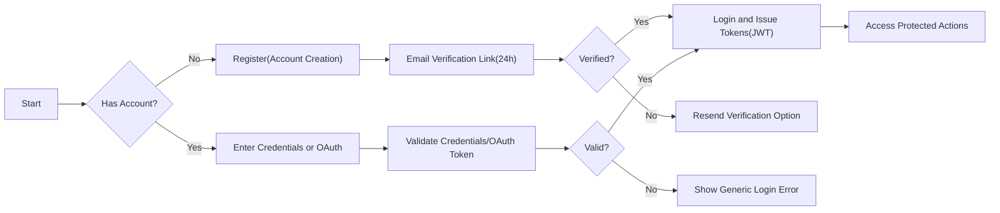
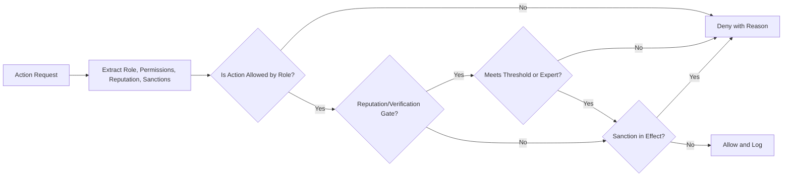

# econDiscuss — User Roles, Permissions, and Authentication Requirements

This document defines business requirements only for the econDiscuss service. It specifies WHAT the system must do from an authorization and authentication perspective, not HOW to implement it. All technical implementation decisions (architecture, protocols, libraries, database design, and APIs) remain at the discretion of the development team.

## 1) Introduction and Scope
The purpose of this specification is to:
- Describe the platform’s user roles and the permissions each role has in business terms.
- Define authentication and session policies, including token-based access and identity assurance.
- Define reputation- and verification-based gating for advanced features to preserve professional discourse quality.
- Clarify privacy and data visibility by role to align with professional and ethical standards.

Context and constraints:
- The platform focuses on economics content and professional discussion quality while providing modern social media-style UX.
- Core must-haves influencing permissions include: profiles with expertise verification, bookmarks, voting history visibility to self, advanced search, polls for sentiment, real-time notifications and live discussions, drafts, follows/subscriptions, and a reputation system.
- Business requirements are specified in natural language using EARS (keywords in English; descriptions in en-US).

## 2) Role Definitions and Hierarchy

### 2.1 Role Hierarchy
- THE roles SHALL be ordered by escalation of authority: visitor < member < verifiedExpert < moderator < admin.
- WHERE "verifiedExpert" is present, THE role SHALL be treated as a specialization of member with added privileges.
- WHEN a user’s role changes (upgrade/downgrade), THE system SHALL immediately re-evaluate permissions for new and active sessions.

### 2.2 Role Descriptions
- visitor (guest): Unauthenticated reader with access to public content and discovery. Cannot contribute or personalize beyond ephemeral preferences.
- member: Authenticated user with standard participation privileges: create content, vote, follow/subscribe, bookmark, draft, and participate in polls; subject to reputation gates and rate limits.
- verifiedExpert: Authenticated user with verified expertise in one or more economic domains. Gains expert badges, weighted votes, access to expert-only threads or modes, and curated-content privileges as defined.
- moderator: Trusted steward for quality and safety; handles reports, verification queues, featured content, sanctions, and dispute resolution within policy.
- admin: Platform administrator with full administrative privileges across roles, policies, configurations, topics, and governance.

### 2.3 Identity and Display Principles
- THE platform SHALL allow pseudonyms for members.
- WHERE a user is a verifiedExpert, THE platform SHALL require legal identity disclosure to the platform during verification while allowing public display as real name or verified pseudonym at the user’s choice.
- WHEN a user is sanctioned to restrict posting, THE platform SHALL preserve read access unless sanctions dictate otherwise.

## 3) Permissions by Role (Business Actions)

### 3.1 Global Permission Principles
- THE platform SHALL enforce least privilege: users can perform only actions explicitly granted by role, verification, or reputation level.
- WHEN a user attempts an action without permission, THE platform SHALL deny the action with a human-readable message stating the business reason (e.g., "Insufficient reputation" or "Expert-only feature").
- WHILE a user is under an active sanction, THE platform SHALL apply the sanction’s restrictions across all relevant actions.

### 3.2 Action Catalog and Role Permissions

| Business Action | visitor | member | verifiedExpert | moderator | admin |
|-----------------|---------|--------|----------------|-----------|-------|
| Read public posts/comments | ✅ | ✅ | ✅ | ✅ | ✅ |
| Search public content with filters | ✅ | ✅ | ✅ | ✅ | ✅ |
| View expert badges and domains | ✅ | ✅ | ✅ | ✅ | ✅ |
| Create posts | ❌ | ✅ | ✅ | ✅ | ✅ |
| Create comments/replies | ❌ | ✅ | ✅ | ✅ | ✅ |
| Edit own posts within policy window | ❌ | ✅ | ✅ | ✅ | ✅ |
| Delete own posts within policy window | ❌ | ✅ | ✅ | ✅ | ✅ |
| Save/bookmark items | ❌ | ✅ | ✅ | ✅ | ✅ |
| Organize bookmarks into collections | ❌ | ✅ | ✅ | ✅ | ✅ |
| Add private notes to bookmarks | ❌ | ✅ | ✅ | ✅ | ✅ |
| Follow users | ❌ | ✅ | ✅ | ✅ | ✅ |
| Subscribe to topics/tags | ❌ | ✅ | ✅ | ✅ | ✅ |
| Start live discussion thread/room (gated) | ❌ | ❌/✅ | ✅ | ✅ | ✅ |
| Join live discussions | ❌ | ✅ | ✅ | ✅ | ✅ |
| Receive real-time notifications | ❌ | ✅ | ✅ | ✅ | ✅ |
| Vote on posts | ❌ | ✅ | ✅ | ✅ | ✅ |
| Vote on comments | ❌ | ✅ | ✅ | ✅ | ✅ |
| View own voting history | ❌ | ✅ | ✅ | ✅ | ✅ |
| Create polls (gated) | ❌ | ❌/✅ | ✅ | ✅ | ✅ |
| Participate in polls | ❌ | ✅ | ✅ | ✅ | ✅ |
| Propose topic taxonomy updates | ❌ | ❌ | ✅ | ✅ | ✅ |
| Feature/curate high-quality posts | ❌ | ❌ | ✅ | ✅ | ✅ |
| Report content and users | ❌ | ✅ | ✅ | ✅ | ✅ |
| Access verification review queue | ❌ | ❌ | ❌ | ✅ | ✅ |
| Apply sanctions | ❌ | ❌ | ❌ | ✅ | ✅ |
| Manage system-wide settings | ❌ | ❌ | ❌ | ❌ | ✅ |
| View audit trails (as per role scope) | ❌ | ❌ | ❌ | ✅ | ✅ |

Notes:
- "❌/✅" indicates reputation-gated features for members (see Section 5).

### 3.3 EARS Requirements for Key Actions
- THE platform SHALL allow visitor access to public reading and searching without authentication.
- WHERE a user is a member, THE platform SHALL allow creating posts, comments, votes, follows, subscriptions, bookmarks, drafts, and poll participation subject to rate limits and policies.
- WHERE a user is a verifiedExpert, THE platform SHALL enable expert-weighted voting, access to expert-only modes, proposing taxonomy updates, and curation powers within policy.
- WHERE a user is a moderator, THE platform SHALL grant permissions to handle reports, manage verification queues, feature content, and apply sanctions per governance rules.
- WHERE a user is an admin, THE platform SHALL grant full administrative privileges, including role management, policy configuration, topic taxonomy management, and inspection of audit logs.
- WHEN a user edits or deletes own content, THE platform SHALL enforce the policy time window and preserve version history as defined in content rules.
- IF a user attempts a disallowed action due to role, THEN THE platform SHALL deny and present a clear reason and, where applicable, show the requirement to unlock.

## 4) Expertise Verification and Badging Overview

Overview (detailed process in the [Expertise Verification Requirements](./06-econDiscuss-expertise-verification.md)):
- Verification sources may include institutional email, publication records, professional affiliations, or moderator-reviewed evidence.
- Domain-specific badges (e.g., "Macroeconomics", "Labor", "Finance") are displayed on profiles and next to contributions.

EARS requirements:
- WHEN a user submits verification evidence, THE platform SHALL queue the request for moderator/admin review.
- WHEN verification is approved, THE platform SHALL attach domain badges to the user and elevate privileges to verifiedExpert.
- WHILE verification is pending, THE platform SHALL display a pending state to the user and no expert privileges are active.
- IF verification expires or is revoked, THEN THE platform SHALL remove badges and revert privileges while preserving member status.
- WHERE a verifiedExpert contributes, THE platform SHALL display badges on profile and relevant content, respecting privacy choices for display name.

Privileges conferred:
- THE platform SHALL apply expert-weighted votes to reputation calculations as defined in the [Voting, Reputation, and History Requirements](./07-econDiscuss-voting-reputation-history.md).
- WHERE expert-only threads or “expert comment first” modes are enabled, THE platform SHALL restrict initial contributions to verifiedExpert and above.

## 5) Reputation-Based Unlocks

Policy variables (adjustable by admin; initial baselines below):
- Poll creation unlock threshold: reputationScore ≥ 500.
- Start live discussion room/thread: reputationScore ≥ 300 or verifiedExpert.
- Topic creation/propose new tag: reputationScore ≥ 400 or verifiedExpert.
- Elevated rate limits and downvote capability: reputationScore ≥ 200.
- Curation suggestion visibility boost: reputationScore ≥ 600 or verifiedExpert.

EARS requirements:
- WHERE a member meets a threshold, THE platform SHALL unlock the corresponding feature within 1 minute of reputation recalculation.
- IF a member falls below a threshold due to decay or penalties, THEN THE platform SHALL re-lock the feature and communicate the change non-intrusively.
- WHEN a threshold is reached during a session, THE platform SHALL apply the new permissions without requiring re-login.
- WHERE a user is a verifiedExpert, THE platform SHALL treat gated features as unlocked regardless of reputation unless specifically overridden by sanctions.

Anti-abuse constraints (see also [Moderation, Quality, and Governance](./13-econDiscuss-moderation-quality-governance.md)):
- THE platform SHALL apply recency decay and duplicate-vote detection for reputation inputs per policy defined in the voting document.
- THE platform SHALL cap daily unlock fluctuations to prevent flip-flopping user experience; changes apply at most once per hour unless sanctions require immediate effect.

## 6) Session and Access Management (Business Rules)

### 6.1 Authentication Methods
- THE platform SHALL support registration and login via email/password and OAuth-based sign-in (e.g., Google, LinkedIn) for convenience and expert identity linkage.
- THE platform SHALL require email verification before enabling posting or voting.

EARS:
- WHEN a user registers, THE platform SHALL validate email ownership via a verification link that expires in 24 hours.
- IF email verification is not completed within expiry, THEN THE platform SHALL invalidate the link and provide a path to request a new one.

### 6.2 Core Authentication Functions
- Users can register with email and password.
- Users can log in and log out securely.
- THE system SHALL maintain user sessions using JWT-based tokens.
- Users can reset forgotten passwords, change passwords, and revoke access from all devices.

EARS:
- WHEN a user submits login credentials, THE platform SHALL validate and, on success, create an authenticated session within 2 seconds under normal load.
- IF login credentials are invalid, THEN THE platform SHALL deny login and indicate that credentials are incorrect without revealing which field failed.
- WHEN a user logs out, THE platform SHALL invalidate the active session immediately.
- WHEN a user requests password reset, THE platform SHALL issue a time-limited reset token valid for 60 minutes.

### 6.3 Token Management (MANDATORY JWT)
Business rules:
- Token type: JWT for access and refresh tokens.
- Access token expiration: 20 minutes (baseline policy; adjustable 15–30 minutes).
- Refresh token expiration: 14 days (baseline policy; adjustable 7–30 days).
- JWT payload SHALL include: userId, role, permissions array.
- Optional payload claims MAY include: reputationScore, verifiedDomains, mfaEnabled flag, sanctions summary.
- Token rotation SHALL be performed on refresh to mitigate theft.
- Token storage: user-agents MAY use httpOnly cookies or secure local storage per security policy; server-side invalidation lists SHALL be supported for revocation.

EARS:
- WHEN issuing tokens, THE platform SHALL sign JWTs and include required claims.
- WHEN access token expires and refresh token is valid, THE platform SHALL issue a new access token within 1 second.
- IF a refresh token is revoked or expired, THEN THE platform SHALL deny refresh and require re-authentication.
- WHEN a user selects "remember me", THE platform SHALL issue a refresh token with the configured longer lifetime (within policy bounds).

### 6.4 Session Behavior and Concurrency
- THE platform SHALL allow concurrent sessions across devices and provide session management UI to revoke individual sessions.
- THE platform SHALL enforce step-up authentication for sensitive actions (e.g., role change, 2FA setup) when risk signals indicate.

EARS:
- WHEN a user requests "log out from all devices", THE platform SHALL revoke all active refresh tokens within 30 seconds.
- WHERE concurrent session limits are configured, THE platform SHALL deny new sessions beyond the limit and inform the user.

### 6.5 Multi-Factor Authentication (2FA)
- 2FA optional for members and verifiedExperts.
- 2FA required for moderators and admins.

EARS:
- WHERE a user is a moderator or admin, THE platform SHALL require 2FA enrollment before performing any elevated action.
- WHEN 2FA is enabled, THE platform SHALL require 2FA verification on each new device or every 30 days per device, whichever comes first.
- IF 2FA verification fails, THEN THE platform SHALL deny the elevated action and request re-verification.

### 6.6 Rate Limiting and Lockouts (AuthN)
- THE platform SHALL protect login and verification endpoints with rate limits and incremental lockouts to deter brute force attempts.

EARS:
- WHEN 5 consecutive login failures occur for the same account within 10 minutes, THE platform SHALL introduce a 5-minute cooldown before the next attempt is allowed.
- IF suspicious activity is detected, THEN THE platform SHALL challenge with CAPTCHA or step-up authentication per policy.

### 6.7 Authentication Flow (Visual)

## 7) Privacy Expectations and Data Visibility by Role

### 7.1 Profiles
- THE platform SHALL provide public profiles with: display name, avatar, bio, badges, domains, follower/following counts, and aggregate contribution metrics.
- THE platform SHALL protect private fields: email, legal identity documents, draft content, bookmarks with private setting, and security settings.

EARS:
- WHERE a user is a verifiedExpert, THE platform SHALL display expert badges and domains publicly; legal identity remains confidential.
- IF a user sets a collection to private, THEN THE platform SHALL restrict visibility to the owner only.

### 7.2 Content and Interactions
- Votes: aggregate counts public; individual user voting choices private to the voter.
- Polls: aggregated results public; segmented views may show role-based breakdowns without exposing individual identities.
- Bookmarks/Collections: private by default; optional sharing per collection with explicit opt-in by owner.

EARS:
- THE platform SHALL keep individual vote histories visible only to the owner.
- WHERE poll results are segmented by role, THE platform SHALL ensure that minimum cohort size thresholds are met before revealing segmented data.
- IF a user attempts to access another user’s private bookmarks, THEN THE platform SHALL deny access.

### 7.3 Moderation and Governance Visibility
- Moderators can access report queues, verification submissions, sanctions dashboards, and curation tools; not users’ private bookmarks or confidential PII without cause.
- Admins may access PII for compliance and operational needs under strict audit logging and least-privilege workflows.

EARS:
- WHERE PII access is requested by admin, THE platform SHALL record purpose, actor, timestamp, and scope in audit logs.
- IF a moderator action affects a user (e.g., sanction), THEN THE platform SHALL notify the user and provide policy references and appeal options.

## 8) Non-Functional Expectations and Error Handling (AuthZ/AuthN)

### 8.1 Performance Targets
- WHEN a user logs in under normal load, THE platform SHALL return a response within 2 seconds.
- WHEN refreshing an access token with a valid refresh token, THE platform SHALL complete within 1 second.
- WHEN checking authorization for a protected action, THE platform SHALL complete decisioning within 200 milliseconds.

### 8.2 Reliability and Availability (Business View)
- THE platform SHALL provide highly available authentication and authorization decisions consistent with overall service targets described in the [Non-Functional Requirements](./14-econDiscuss-nonfunctional-privacy-security-performance.md).

### 8.3 Common Error Scenarios (User-Facing Behavior)
- IF credentials are invalid, THEN THE platform SHALL show a generic error and no detail about which field is wrong.
- IF email is unverified, THEN THE platform SHALL prompt re-sending verification and block posting/voting until verified.
- IF token is expired, THEN THE platform SHALL request refresh and retry where safe.
- IF token is invalid or revoked, THEN THE platform SHALL require re-authentication.
- IF user is sanctioned, THEN THE platform SHALL present the restriction reason and duration at the time of action.
- IF role-based restriction blocks an action, THEN THE platform SHALL present the required role or reputation needed.

### 8.4 Authorization Decision Flow (Visual)

## 9) Auditability, Transparency, and Governance Interfaces
- THE platform SHALL record audit events for: role changes, verification decisions, sanction applications, privilege unlocks/locks, admin PII access, and policy configuration changes.
- THE platform SHALL provide users with an account activity view showing recent security events (e.g., new device login, 2FA changes).
- WHERE an action materially impacts a user’s privileges, THE platform SHALL notify the user with clear rationale and links to policies.

## 10) Relationships with Other Documents
- For expertise process details, see the [Expertise Verification Requirements](./06-econDiscuss-expertise-verification.md).
- For voting mechanics and reputation calculation, see the [Voting, Reputation, and History Requirements](./07-econDiscuss-voting-reputation-history.md).
- For content authoring rules and edit/delete windows, see the [Content Authoring Rules](./05-econDiscuss-content-authoring-rules.md).
- For moderation and sanctions policy, see the [Moderation, Quality, and Governance Requirements](./13-econDiscuss-moderation-quality-governance.md).
- For privacy, security, and performance targets, see the [Non-Functional Requirements](./14-econDiscuss-nonfunctional-privacy-security-performance.md).

## 11) Glossary
- Role: A designation of authority and capability (visitor, member, verifiedExpert, moderator, admin).
- Permission: A specific business action that a role can perform.
- Reputation: A score derived from community signals indicating trust and contribution quality.
- Verification: A process to establish domain expertise and assign badges and privileges.
- Sanction: A time-bound or scope-bound restriction applied to protect community standards.
- JWT: JSON Web Token used to represent session and authorization context.

---

## Appendix A — Detailed EARS Requirements by Feature

### A.1 Reading and Discovery
- THE platform SHALL allow visitors to read public content and use search filters excluding private-only facets.
- WHEN a user adds role-based filters (e.g., expert-only) in search, THE platform SHALL apply them if the user’s role permits.

### A.2 Contributions
- WHERE a user is a member or above, THE platform SHALL allow creating posts and comments subject to rate limits and content policies.
- WHEN a user mentions another user, THE platform SHALL send a notification per user preferences.
- IF a user attempts to post in an expert-only mode without eligibility, THEN THE platform SHALL deny and explain the eligibility requirement.

### A.3 Voting and History
- WHERE a user is a member or above, THE platform SHALL allow voting on posts and comments, within per-day limits.
- THE platform SHALL provide a private view of the user’s own voting history, filterable by date range and content type.

### A.4 Bookmarks and Collections
- WHERE a user is a member or above, THE platform SHALL allow saving items, organizing into collections, and adding private notes.
- WHEN a user opts to share a collection, THE platform SHALL mark it public and generate a shareable public view of that collection only.

### A.5 Polls and Sentiment
- WHERE a user meets the poll creation threshold or is a verifiedExpert, THE platform SHALL allow poll creation with configurable duration.
- WHERE a user is a member or above, THE platform SHALL allow poll participation once per account per poll.

### A.6 Live Discussions and Notifications
- WHERE a user meets the live discussion start threshold or is a verifiedExpert, THE platform SHALL allow starting a live room or thread.
- WHERE a user is a member or above, THE platform SHALL allow joining live discussions and receive real-time notifications per preferences.

### A.7 Moderation and Governance
- WHERE a user is a moderator or admin, THE platform SHALL access report queues, apply sanctions with reason and duration, and feature content.
- WHEN a sanction is applied, THE platform SHALL notify the affected user and record the event in audit logs.

### A.8 Account Security
- WHERE a user enables 2FA, THE platform SHALL require it on new devices or every 30 days per device.
- IF suspicious login is detected (new device, geo anomaly), THEN THE platform SHALL perform step-up authentication.

---

## Appendix B — Initial Permission Matrix (Detailed)

| Action | Description | visitor | member | verifiedExpert | moderator | admin |
|-------|-------------|---------|--------|----------------|-----------|-------|
| read_public | Read public posts/comments | ✅ | ✅ | ✅ | ✅ | ✅ |
| search_public | Use search with filters (non-private) | ✅ | ✅ | ✅ | ✅ | ✅ |
| view_badges | See expert badges/domains | ✅ | ✅ | ✅ | ✅ | ✅ |
| create_post | Publish posts | ❌ | ✅ | ✅ | ✅ | ✅ |
| create_comment | Publish comments | ❌ | ✅ | ✅ | ✅ | ✅ |
| edit_own | Edit own post within window | ❌ | ✅ | ✅ | ✅ | ✅ |
| delete_own | Delete own post within window | ❌ | ✅ | ✅ | ✅ | ✅ |
| bookmark | Save items | ❌ | ✅ | ✅ | ✅ | ✅ |
| bookmark_collections | Organize collections | ❌ | ✅ | ✅ | ✅ | ✅ |
| bookmark_notes | Add private notes | ❌ | ✅ | ✅ | ✅ | ✅ |
| follow_users | Follow accounts | ❌ | ✅ | ✅ | ✅ | ✅ |
| subscribe_topics | Subscribe to topics/tags | ❌ | ✅ | ✅ | ✅ | ✅ |
| start_live | Start live discussion (gated) | ❌ | ❌/✅ | ✅ | ✅ | ✅ |
| join_live | Join live discussions | ❌ | ✅ | ✅ | ✅ | ✅ |
| notifications | Receive notifications | ❌ | ✅ | ✅ | ✅ | ✅ |
| vote_post | Vote on posts | ❌ | ✅ | ✅ | ✅ | ✅ |
| vote_comment | Vote on comments | ❌ | ✅ | ✅ | ✅ | ✅ |
| view_vote_history_self | View own voting history | ❌ | ✅ | ✅ | ✅ | ✅ |
| create_poll | Create polls (gated) | ❌ | ❌/✅ | ✅ | ✅ | ✅ |
| vote_poll | Participate in polls | ❌ | ✅ | ✅ | ✅ | ✅ |
| propose_taxonomy | Propose topic taxonomy updates | ❌ | ❌ | ✅ | ✅ | ✅ |
| curate_feature | Feature/curate posts | ❌ | ❌ | ✅ | ✅ | ✅ |
| report | Report content/users | ❌ | ✅ | ✅ | ✅ | ✅ |
| verify_queue | Access verification queue | ❌ | ❌ | ❌ | ✅ | ✅ |
| apply_sanctions | Apply sanctions | ❌ | ❌ | ❌ | ✅ | ✅ |
| manage_settings | Manage system-wide settings | ❌ | ❌ | ❌ | ❌ | ✅ |
| audit_view | View audit trails | ❌ | ❌ | ❌ | ✅ | ✅ |

All actions are further constrained by global policies, reputation thresholds, and sanctions as specified in the main sections above.

---

End of document.