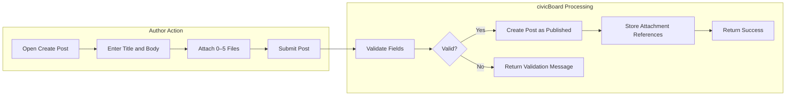
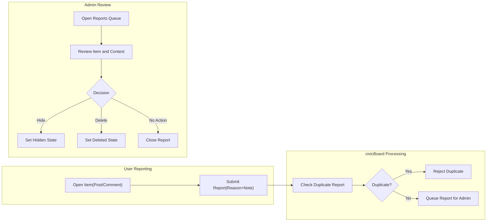

# Functional Requirements — civicBoard (Minimal)

## 1) Scope
- Provide a concise, minimal set of business requirements that are specific, measurable, and testable for a simple economic/political discussion board.
- Focus on core features only: posts, comments, and post attachments (images/files), plus basic browsing, search, reporting, and moderation. Optional: simple reactions and minimal notifications.
- Avoid technical implementation details such as APIs, schemas, or stack choices.

## 2) Actors and Permissions Overview (Business Summary)
Two actors exist:
- "user": a registered member who can create, read, update, and delete own posts and comments; upload attachments to own posts; report content; manage own profile. Optional: react to content.
- "admin": an administrator who can manage all content and users, moderate content and reports, and configure minimal board-level policies.

Guest browsing of published content may be allowed without authentication (policy-configurable). All write actions require authentication.

| Action (Business) | Guest | user | admin |
|---|---|---|---|
| Read published posts and comments | ✅ (where public-read is enabled) | ✅ | ✅ |
| View attachments of published posts | ✅ (where public-read is enabled) | ✅ | ✅ |
| Create a post (with attachments) | ❌ | ✅ | ✅ |
| Edit own post | ❌ | ✅ | ✅ (any) |
| Delete own post | ❌ | ✅ | ✅ (any) |
| Create a comment | ❌ | ✅ | ✅ |
| Edit own comment | ❌ | ✅ | ✅ (any) |
| Delete own comment | ❌ | ✅ | ✅ (any) |
| Report content | ❌ | ✅ | ✅ |
| Moderate (hide/unhide/delete) | ❌ | ❌ | ✅ |
| View/resolve reports | ❌ | ❌ | ✅ |
| React (optional Like) | ❌ | ✅ | ✅ |

## 3) Core Business Concepts
- Post: A published article with a title and body, optionally including attachments. Publicly visible when Published; subject to moderation.
- Comment: A textual response to a post. Flat (non-threaded) comments only.
- Attachment: An image or file linked to a post. Comments do not support attachments in the minimal release.

## 4) Posts (Create/Read/Update/Delete)

### 4.1 Business Rules and Constraints
- Title length: 1–120 characters; trimmed; non-empty.
- Body length: 1–20,000 characters; plain text; line breaks allowed.
- Attachments: Up to 5 per post (see Section 6 for types/sizes).
- Edit window for authors: 60 minutes from creation time.
- Deletion by author: Allowed at any time; becomes non-public immediately.
- Moderation: Admin may hide or delete any content at any time.
- Rate limiting: Up to 5 posts per user per calendar day.
- Content states: Published, Hidden, Deleted (soft). Draft is optional and not required for minimal delivery.
- Listing order: Newest-first by publication time; 20 posts per page.

### 4.2 EARS Requirements (Posts)
- THE civicBoard SHALL require a non-empty title and body within defined length limits for every post.
- THE civicBoard SHALL allow up to 5 attachments per post.
- WHEN an authenticated user submits a valid new post, THE civicBoard SHALL create the post as Published and make it visible to all readers within 2 seconds under normal load.
- IF post creation input violates title, body, or attachment constraints, THEN THE civicBoard SHALL reject creation with specific validation messages identifying each violated rule.
- WHEN an author edits a Published post within 60 minutes of creation and inputs are valid, THE civicBoard SHALL apply the edit and update the last-edited timestamp.
- IF an author attempts to edit a post after the 60-minute window, THEN THE civicBoard SHALL deny the edit and present the reason that the edit window has expired.
- WHEN an author deletes own post, THE civicBoard SHALL mark it as Deleted (soft) and remove it from public lists immediately.
- WHEN an admin hides a post, THE civicBoard SHALL set the post state to Hidden and restrict visibility to admin and the original author.
- WHILE a post is Hidden, THE civicBoard SHALL prevent new comments on that post by non-admin users.
- WHEN listing posts, THE civicBoard SHALL return items ordered by newest first in pages of 20 items per page.
- WHEN viewing a specific Published post, THE civicBoard SHALL include its comments ordered by a consistent rule (default: oldest-first).

### 4.3 Acceptance Criteria (Posts)
- Creating a valid post with 0–5 attachments results in a Published post visible in the newest-first listing within 2 seconds under normal load.
- Attempting to create a post that violates title/body length or attachment constraints returns field-specific validation errors.
- Editing within 60 minutes by the author succeeds; after 60 minutes, edit is rejected with an edit-window-expired message.
- Deleting own post removes it from public listings immediately; the post state becomes Deleted (soft).
- Hidden state prevents non-admin viewing and blocks further commenting by non-admin users.
- Pagination returns 20 items per page, newest-first ordering; boundaries are consistent for the same dataset.

## 5) Comments (Create/Read/Update/Delete)

### 5.1 Business Rules and Constraints
- Body length: 1–5,000 characters; trimmed; non-empty.
- Attachments: Not allowed in the minimal release.
- Edit window for authors: 15 minutes from creation time.
- Deletion by author: Allowed at any time; replaces visible text with a placeholder to preserve discussion continuity.
- Rate limiting: Up to 50 comments per user per calendar day.
- Ordering: Oldest-first by default within a post; paginate at 20 if needed.

### 5.2 EARS Requirements (Comments)
- THE civicBoard SHALL require a non-empty body within defined length limits for every comment.
- WHEN an authenticated user submits a valid comment to a Published post, THE civicBoard SHALL create the comment and associate it to the post within 2 seconds under normal load.
- IF a comment is submitted to a Hidden or Deleted post, THEN THE civicBoard SHALL reject the comment with a message indicating the post is not open for commenting.
- WHEN an author edits own comment within 15 minutes and inputs are valid, THE civicBoard SHALL update the comment and record the last-edited timestamp.
- IF an author attempts to edit own comment after 15 minutes, THEN THE civicBoard SHALL deny the edit and indicate the edit window has expired.
- WHEN an author deletes own comment, THE civicBoard SHALL mark it as Deleted and replace the visible content with a placeholder indicator.
- WHEN listing comments for a Published post, THE civicBoard SHALL return them ordered oldest-first in pages of 20 if pagination is required.

### 5.3 Acceptance Criteria (Comments)
- Creating a valid comment on a Published post succeeds within 2 seconds; creating a comment on a Hidden or Deleted post fails with a clear message.
- Editing own comment within 15 minutes succeeds; after 15 minutes, edit is rejected with an edit-window-expired message.
- Deleting own comment replaces it with a placeholder and removes it from reaction counts and future searches.
- Comment list ordering is oldest-first by default; pagination is consistent at 20 items per page when applicable.

## 6) Attachments (Images/Files for Posts)

### 6.1 Business Rules and Constraints
- Scope: Attachments are allowed on posts only; comments cannot have attachments in the minimal release.
- Max attachments per post: 5.
- Allowed image types: JPEG, PNG, GIF.
- Allowed document types: PDF.
- Max size per attachment: 10 MB (images and documents).
- Visibility: Attachments of Published posts are publicly viewable or downloadable; attachments of Hidden posts are accessible only to admin and the post author; attachments of Deleted posts are not accessible to non-admins.
- Removal: Removing an attachment from a post is allowed by the post author within the 60-minute edit window or by admin at any time.

### 6.2 EARS Requirements (Attachments)
- THE civicBoard SHALL limit attachments to allowed types (JPEG, PNG, GIF, PDF) and to 10 MB per file.
- WHEN an author adds attachments beyond the allowed count, THE civicBoard SHALL reject the extra attachments with a clear message.
- IF an attachment exceeds 10 MB or is of a disallowed type, THEN THE civicBoard SHALL reject it with a message specifying the violated constraint.
- WHEN a post is Hidden, THE civicBoard SHALL restrict access to its attachments to admin and the post author.
- WHEN a post is Deleted, THE civicBoard SHALL prevent non-admin access to its attachments.
- WHEN an author removes an attachment within the edit window, THE civicBoard SHALL persist the post without that attachment and reflect the change in subsequent reads within 2 seconds under normal load.

### 6.3 Acceptance Criteria (Attachments)
- Uploading 1–5 allowed attachments of size ≤10 MB each succeeds; uploading a 6th file is rejected with an over-limit message.
- Uploading any type outside JPEG, PNG, GIF, PDF is rejected with a type-not-allowed message; uploading a 10.1 MB file is rejected with a size-limit message.
- Hidden posts’ attachments are inaccessible to non-admin non-author actors; Deleted posts’ attachments are inaccessible to non-admin actors entirely.
- Removing an attachment within the edit window updates the post’s attachment list immediately in subsequent reads.

## 7) Reactions (Optional, Single "Like")

### 7.1 Business Rules and Constraints
- Scope: A single, binary Like is supported for posts and comments if enabled.
- Auth requirement: Only authenticated users can like content.
- One per user: A user can like a given item at most once; toggling removes the like.
- Self-like: Users cannot like their own content.
- Counts: Reaction counts are visible on content reads when enabled.

### 7.2 EARS Requirements (Reactions)
- WHERE reactions are enabled, THE civicBoard SHALL allow a user to toggle a single Like on any other user’s Published post or comment.
- IF a user attempts to like own post or comment, THEN THE civicBoard SHALL reject the action with a self-like-not-allowed message.
- WHEN a user who previously liked an item toggles again, THE civicBoard SHALL remove their Like and decrement the count.
- WHILE content is Hidden or Deleted, THE civicBoard SHALL prevent new reactions by non-admin users.

### 7.3 Acceptance Criteria (Reactions)
- With reactions enabled, liking a Published post or comment by a different user increments the count by one and is reflected in reads within 2 seconds under normal load.
- Toggling Like again by the same user decrements the count by one.
- Attempting to like own content fails with a clear message.
- Hidden or Deleted content does not accept new reactions by non-admin users.

## 8) Search and Filtering (Basic)

### 8.1 Business Rules and Constraints
- Scope: Basic keyword search across post titles and bodies only.
- Term handling: Space-separated terms; AND semantics (all terms must appear).
- Ordering: Search results ordered newest-first.
- Pagination: 20 posts per page.
- Filters: Optional author and creation date range (inclusive) filters.

### 8.2 EARS Requirements (Search)
- THE civicBoard SHALL support keyword search over post titles and bodies using space-separated terms with AND semantics.
- WHEN a search is executed, THE civicBoard SHALL return matching posts ordered newest-first in pages of 20 within 2 seconds for common queries.
- WHERE author and date-range filters are provided, THE civicBoard SHALL restrict results accordingly before pagination.
- IF no posts match the criteria, THEN THE civicBoard SHALL return an empty result set with zero total count.

### 8.3 Acceptance Criteria (Search)
- A search for two terms returns only posts containing both terms in title or body.
- Pagination returns 20 posts per page; the first page is newest-first.
- Applying an author filter returns posts by that author only; applying a date range returns only posts within that range.
- An unmatched query returns zero results and zero total count.

## 9) Reporting and Moderation Hooks

### 9.1 Business Rules and Constraints (Reporting)
- Reportable items: Posts and comments.
- Reasons: Predefined list — Spam, Harassment, Misinformation, Off-topic, Other.
- One report per user per item: Duplicate reporting by the same user on the same item is not allowed within a cooldown.
- Visibility: Admin can view and manage the reports queue; reporters can view their own report status.
- Admin actions: Mark as Reviewed, Hide content, Delete content, or Dismiss report as No Action.

### 9.2 EARS Requirements (Reporting)
- THE civicBoard SHALL allow any authenticated user to report a post or comment by selecting a predefined reason and optionally providing a short description up to 500 characters.
- IF the same user attempts to report the same item more than once within 24 hours, THEN THE civicBoard SHALL reject the duplicate report.
- WHEN a report is submitted, THE civicBoard SHALL add it to the admin review queue within 2 seconds under normal load.
- WHEN an admin resolves a report, THE civicBoard SHALL record the resolution outcome and, where applicable, change the item’s state (e.g., Hidden or Deleted).

### 9.3 Acceptance Criteria (Reporting)
- Submitting a valid report adds it to the admin queue and is visible to admin reviewers.
- Submitting a duplicate report from the same user on the same item within 24 hours is rejected with a duplicate-report message.
- Admin can mark a report as Reviewed with one of: Hidden, Deleted, or No Action; item state changes accordingly and is reflected in subsequent reads.
- Reporters can view their own report statuses.

## 10) Notifications (Optional, Minimal)

### 10.1 Business Rules and Constraints
- Scope: Minimal events only.
  - New comment on a user’s post: notify the post author.
  - Report resolution: notify the reporting user of the outcome.
  - Admin notification for new report: notify admins that a report has been filed.
- Channel and delivery mechanisms are not prescribed here.

### 10.2 EARS Requirements (Notifications)
- WHERE notifications are enabled, THE civicBoard SHALL notify the post author when a new comment is created on their post.
- WHERE notifications are enabled, THE civicBoard SHALL notify the reporter when a report is resolved, including the resolution outcome.
- WHERE notifications are enabled, THE civicBoard SHALL notify admins that a new report has been filed.

### 10.3 Acceptance Criteria (Notifications)
- With notifications enabled, creating a comment on a post triggers a notification to that post’s author.
- With notifications enabled, resolving a report triggers a notification to the reporter with the outcome.
- With notifications enabled, filing a report triggers a notification to admins.

## 11) Business Rules and Validation Summary

### 11.1 Content Limits
- Post title: 1–120 characters; post body: 1–20,000 characters; max 5 attachments (JPEG/PNG/GIF/PDF, ≤10 MB each).
- Comment body: 1–5,000 characters.

### 11.2 Time Windows and States
- Post edit window: 60 minutes from creation.
- Comment edit window: 15 minutes from creation.
- Content states: Published, Hidden, Deleted (soft).

### 11.3 Rate Limits
- Posts: max 5 per user per calendar day.
- Comments: max 50 per user per calendar day.

### 11.4 Read Experience
- Listings use consistent ordering rules: posts newest-first; comments oldest-first.
- Pagination for lists: 20 items per page.
- Normal-load response expectation for common reads and writes: within 2 seconds.

### 11.5 Ownership and Visibility Rules
- Authors can edit within the defined windows; authors can delete own content at any time.
- Hidden content is visible only to admin and original author; Deleted content is not visible to non-admins (posts) and appears as a placeholder (comments).
- Attachments inherit the visibility of their parent content.

## 12) Acceptance Criteria per Feature (Consolidated)

### 12.1 Posts
- Create: Valid post with up to 5 valid attachments becomes Published, visible within 2 seconds under normal load.
- Read: Listing returns 20 newest-first; single read returns content with correct state and associated comments (ordered oldest-first by default).
- Update: Edit within 60 minutes by author succeeds; after 60 minutes, edit is rejected.
- Delete: Author delete removes from public lists immediately; admin can hide or delete at any time.

### 12.2 Comments
- Create: Valid comment on a Published post succeeds within 2 seconds; commenting on Hidden/Deleted post is rejected.
- Read: Listing returns oldest-first; pagination behaves at 20 per page.
- Update: Edit within 15 minutes succeeds; after 15 minutes, edit is rejected.
- Delete: Author delete shows placeholder; admin can hide or delete at any time.

### 12.3 Attachments
- Type/size enforcement: Only JPEG/PNG/GIF/PDF ≤10 MB; violations are rejected with clear messages.
- Count enforcement: More than 5 attachments rejected.
- Visibility: Hidden/Deleted post attachments access restricted as specified.

### 12.4 Reactions (Optional)
- Like toggle: One like per user per item; toggling removes the like; self-like disallowed.
- Hidden/Deleted content: No new reactions by non-admin users.

### 12.5 Search and Filtering
- Keyword AND search over titles/bodies with pagination at 20 and newest-first ordering.
- Filters by author and date range narrow results.

### 12.6 Reporting and Moderation Hooks
- Report creation with predefined reasons; duplicate reports by same user within 24 hours blocked.
- Admin can resolve as Hidden, Deleted, or No Action; item state reflects resolution.

### 12.7 Notifications (Optional)
- New comment notifies post author; report resolution notifies reporter; new report notifies admins.

## 13) Process Diagrams (Mermaid)

### 13.1 Post Creation with Attachments

### 13.2 Reporting and Moderation Flow

## 14) Glossary
- Author: The creator of a post or comment.
- Hidden: A state set by admin that removes public visibility, limiting access to admin and the original author; content cannot receive new comments or reactions from non-admin users while Hidden.
- Deleted (Post): A state that removes the post from public lists and prevents non-admin access to its content and attachments.
- Deleted (Comment): A state that replaces the comment text with a placeholder so the conversation structure remains intact.
- Attachment: A user-uploaded image or PDF file associated with a post, subject to count and size limits.
- Reaction: An optional single-like toggle available to authenticated users on others’ content.

Implementation choices (architecture, APIs, data models, storage, and infrastructure) remain at the development team’s discretion; only business outcomes are mandated here.