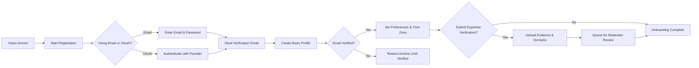
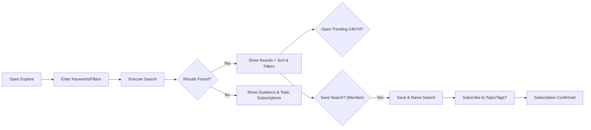
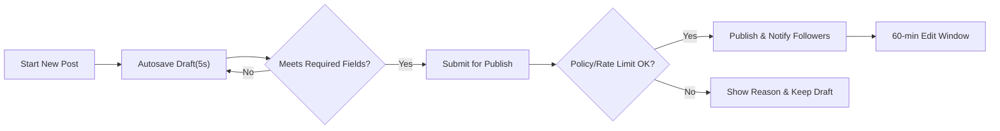
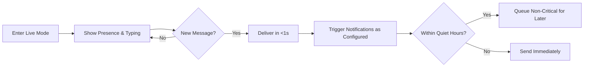
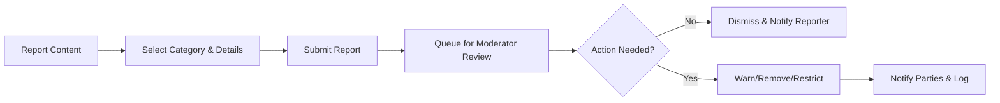

# econDiscuss Service Operation & User Journeys (Business Requirements)

This specification defines WHAT econDiscuss must do from a user and business perspective. It focuses on complete, testable behaviors using EARS syntax and references related documents for policy and non-functional standards. Technical implementation details (APIs, data models, infrastructure, UI wireframes) are intentionally excluded.

## 1. Introduction and Scope

Objectives:
- Enable professional, evidence-based economic discourse with modern social UX.
- Provide end-to-end journeys for registration, exploration, contribution, sentiment capture, live collaboration, and governance.
- Ensure privacy, safety, and quality via verification, reputation, moderation, and clear user controls.

In scope:
- Primary journeys: Onboarding; Explore & Discover; Contribute (posts, comments, drafts, polls, voting, bookmarks, follow/subscribe, live discussions).
- Secondary journeys: Report content; Appeal decisions; Submit feature requests.
- Performance expectations and completion criteria per journey; role interplay; error handling and recovery.

Out of scope:
- API contracts, storage schemas, transport/protocol details, and UI layout or styling.

## 2. Definitions and Roles

Definitions (business meaning):
- Visitor: Unauthenticated reader of public content.
- Member: Authenticated participant with standard capabilities and rate limits.
- Verified Expert: Member with verified domain badges; receives expert-weighted signals and expert-only privileges.
- Moderator: Trusted steward handling reports, verification queue, and sanctions.
- Admin: Platform administrator with global controls.
- Topic/Tag: Curated taxonomy labels for content organization.
- Reputation: Numeric trust/quality score unlocking privileges and weighting discovery.
- Draft: Private, autosaved content not visible publicly.
- Poll/Survey: Structured sentiment instrument with configurable eligibility and visibility.
- Live Discussion: Real-time interaction in a thread or room context.
- Quiet Hours: User-set window suppressing non-critical notifications in user’s timezone.

Role overview:
- Visitor reads/searches public content.
- Member creates posts/comments, votes, bookmarks, follows/subscribes, drafts, and participates in polls/live.
- Verified Expert adds expert-only/thread privileges, expert-weighted voting, and curation nominations.
- Moderator and Admin enforce guidelines, manage verification, configure governance, and apply sanctions.

Reference: comprehensive role rules in [User Roles and Permissions](./03-econDiscuss-user-roles-permissions.md).

## 3. Primary Journeys (Onboarding, Explore, Contribute)

### 3.1 Onboarding (Visitor → Member; optional Expertise Verification)

Purpose: convert visitors into members, establish identity and preferences, and optionally start expertise verification while preserving privacy.

Mermaid — Onboarding Flow

EARS — Onboarding:
- THE econDiscuss platform SHALL require email verification before enabling posting, commenting, voting, following, or poll participation for a new account.
- THE econDiscuss platform SHALL allow registration via email/password and via supported OAuth providers.
- WHEN a member sets time zone, THE econDiscuss platform SHALL apply this time zone to notification scheduling, digest delivery, poll timing, and quiet hours.
- WHEN a member has unverified email, THE econDiscuss platform SHALL display a non-blocking banner and SHALL restrict participation features until verified.
- WHEN a member completes email verification, THE econDiscuss platform SHALL immediately lift participation restrictions without requiring re-login.
- WHERE a member opts into expertise verification, THE econDiscuss platform SHALL provide an evidence submission flow and queue the case for review.
- IF a registration attempt uses an already-registered email, THEN THE econDiscuss platform SHALL deny registration with a clear error and offer password reset.
- IF a profile display name exceeds 60 characters, THEN THE econDiscuss platform SHALL reject the value and prompt for correction.
- THE econDiscuss platform SHALL default notification digests to weekly and allow member edits at any time.

Performance (Onboarding):
- WHEN submitting registration, THE econDiscuss platform SHALL respond within 2 seconds under normal load.
- WHEN sending a verification email, THE econDiscuss platform SHALL dispatch within 10 seconds and reflect pending status to the user.

### 3.2 Explore & Discover (Search, Trending, Expert Filtering)

Purpose: help users find high-quality, trustworthy economic content and experts quickly.

Mermaid — Search & Discover

EARS — Explore & Discover:
- THE econDiscuss platform SHALL support filters for keyword, author, topic, role (expert-only), date range, content type, reputation threshold, and has-poll.
- THE econDiscuss platform SHALL support sorts by relevance, newest, top (24h/7d/30d), most discussed, and expert-weighted score.
- THE econDiscuss platform SHALL compute trending using velocity (upvotes/comments/bookmarks), freshness, and expert engagement within rolling 24h and 7d windows.
- WHERE the user is a visitor, THE econDiscuss platform SHALL allow viewing public search results and trending without login.
- WHERE the user is a member, THE econDiscuss platform SHALL allow saving searches, renaming or deleting saved searches, and subscribing to topics.
- IF no results match filters, THEN THE econDiscuss platform SHALL show guidance to adjust filters and offer topic subscriptions.
- WHEN a user applies role filter "expert-only", THE econDiscuss platform SHALL return only content authored by verified experts or within expert-only threads.

Performance (Explore & Discover):
- WHEN executing common searches, THE econDiscuss platform SHALL return results within 1 second under normal load; complex queries SHALL return within 2 seconds.
- WHEN opening trending lists, THE econDiscuss platform SHALL render within 1 second under normal load.

### 3.3 Contribute (Authoring, Polls, Voting, Bookmarks, Follow/Subscribe, Live)

Purpose: enable thoughtful, well-governed contributions and interactions that uphold professional standards.

#### 3.3.1 Authoring Posts and Drafts

Mermaid — Draft to Publish

EARS — Posts & Drafts:
- THE econDiscuss platform SHALL autosave drafts every 5 seconds while actively editing and SHALL sync drafts across devices for the same account.
- WHEN a member submits a post without a title or required tags, THE econDiscuss platform SHALL reject the submission and indicate missing fields.
- WHEN a member publishes a post, THE econDiscuss platform SHALL open a 60-minute edit window; after the window, edit history becomes visible to others.
- IF rate limits are exceeded, THEN THE econDiscuss platform SHALL block publishing and present remaining cooldown time.
- WHERE citations are provided, THE econDiscuss platform SHALL preserve them as structured references.

#### 3.3.2 Comments and Threading

EARS — Comments:
- THE econDiscuss platform SHALL support replies up to 2 levels deep to preserve readability.
- WHEN a comment is posted, THE econDiscuss platform SHALL allow a 15-minute edit window and display an "edited" indicator thereafter.
- IF a comment violates rate limits, THEN THE econDiscuss platform SHALL block submission and display cooldown time.

#### 3.3.3 Polls and Economic Sentiment

EARS — Polls:
- WHERE member reputation ≥ 200 OR user is verifiedExpert, THE econDiscuss platform SHALL allow poll creation with single-choice, multi-choice, Likert(5-point), ranking, and numeric estimate question types as permitted by policy.
- WHEN a poll is scheduled, THE econDiscuss platform SHALL open and close it at creator-configured times in the creator’s timezone and publish results per visibility mode.
- THE econDiscuss platform SHALL show segmented results by expert vs. general only when segment sample sizes meet configured thresholds.
- WHILE a poll is open and vote-change is enabled, THE econDiscuss platform SHALL allow voters to change their vote and retain only the final selection.

#### 3.3.4 Voting and Reputation

EARS — Voting & Reputation:
- THE econDiscuss platform SHALL support upvote/downvote on posts and comments for eligible members.
- THE econDiscuss platform SHALL weight verifiedExpert votes more heavily for reputation calculations as defined in the voting specification.
- THE econDiscuss platform SHALL apply recency decay to reputation contributions and SHALL unlock features immediately upon threshold attainment.
- WHERE the user views account settings, THE econDiscuss platform SHALL provide a private page listing their entire voting history with timestamps and filters.
- IF a user attempts to vote on their own content, THEN THE econDiscuss platform SHALL deny the vote with a clear message.

#### 3.3.5 Bookmarks and Collections

EARS — Bookmarks:
- WHEN a member saves an item, THE econDiscuss platform SHALL store it and allow organizing into collections with optional private notes.
- THE econDiscuss platform SHALL default collections to private, with optional Unlisted Link, Shared-with-Users, or Public Profile modes per policy and reputation gates.
- IF a member toggles a collection to public, THEN THE econDiscuss platform SHALL display a privacy warning and require explicit confirmation.

#### 3.3.6 Follow/Subscribe and Personalized Feeds

EARS — Follow/Subscribe:
- WHEN a user follows another user or subscribes to a topic, THE econDiscuss platform SHALL prioritize that content in the user’s Home feed and digests per preferences.
- WHERE mutes or blocks are configured, THE econDiscuss platform SHALL exclude affected items from feeds and digests.
- WHERE the user enables Expert Highlights, THE econDiscuss platform SHALL restrict items to expert-authored or expert-endorsed content.

#### 3.3.7 Live Discussions and Notifications

Mermaid — Live & Notifications

EARS — Live & Notifications:
- WHILE in live discussion, THE econDiscuss platform SHALL deliver messages with end-to-end latency under 1 second for the 95th percentile under normal load.
- THE econDiscuss platform SHALL display presence and typing indicators only within the active context.
- WHEN a mention or reply occurs, THE econDiscuss platform SHALL generate a notification according to the recipient’s channel preferences and quiet hours.
- WHERE quiet hours apply, THE econDiscuss platform SHALL defer non-critical notifications and SHALL send critical account notices immediately.
- WHEN a followed expert publishes, THE econDiscuss platform SHALL notify followers within 1 minute per user preferences.

## 4. Secondary Journeys (Report, Appeal, Feature Requests)

### 4.1 Report Content and Conduct

Mermaid — Reporting

EARS — Reporting:
- THE econDiscuss platform SHALL require a report category and description up to 1,000 characters.
- WHEN a report is submitted, THE econDiscuss platform SHALL acknowledge within 2 seconds and assign it to a moderation queue.
- WHEN a decision is taken, THE econDiscuss platform SHALL notify the reporter and content author with outcome and policy references within governance SLAs.

### 4.2 Appeals

EARS — Appeals:
- WHERE an appeal is submitted within the allowed window, THE econDiscuss platform SHALL place it in an appeal queue for review by a distinct reviewer.
- THE econDiscuss platform SHALL allow attaching additional evidence to appeals and SHALL notify the appellant upon decision with rationale.

### 4.3 Feature Requests and Feedback

EARS — Feature Requests:
- WHEN a feature request is submitted with title, description, and use-case, THE econDiscuss platform SHALL acknowledge receipt with a reference ID.
- WHERE a request is made public, THE econDiscuss platform SHALL display it without enabling popularity voting to avoid roadmap bias.

## 5. Happy Paths and Alternate Flows

Happy Paths:
- Onboarding: Email registration → verification → profile → preferences → (optional) verification submission → member ready.
- Explore: Search with filters → open expert-authored post → bookmark → follow author and subscribe to topic.
- Contribute: Draft long-form post → autosave protects progress → publish → notifications to followers → expert-first comments received.
- Polls: Verified expert creates Likert poll → members vote → segments meet k-threshold → publish results → digest summary sent.
- Voting/Bookmarking: Member upvotes insightful comment, downvotes low-quality response → reputation updates → saves post to private collection with notes.
- Live: Scheduled room starts on time → presence/typing shown → latency < 1s → quiet hours respected for non-critical alerts.
- Reporting: Member reports suspected plagiarism → moderator removes content → reporter and author notified.
- Appeals: Author appeals removal with new evidence → moderator reinstates content with explanation.

Alternate/Edge Flows:
- Email unverified: Member attempts to comment → block and prompt verification.
- Rate limit exceeded: New member attempts third post within 24h → block and display cooldown.
- Insufficient reputation: Member attempts poll creation at rep 150 → deny with threshold guidance.
- Poll privacy: Segment under threshold → show aggregate only.
- Live degradation: Network instability → show degraded state and queue messages until stable.
- Policy check failure: Content contains prohibited elements → block with violation categories and appeal path.
- Verification denial: Applicant denied → can appeal within 14–30 days per policy.
- Mute/block conflicts: Following a blocked user → deny follow until block removed.

EARS — Common Alternates:
- IF an action requires email verification and the user is unverified, THEN THE econDiscuss platform SHALL block the action and present verification steps.
- IF reputation or role requirements are unmet, THEN THE econDiscuss platform SHALL block the action and present the specific threshold or role needed.
- IF quiet hours are active, THEN THE econDiscuss platform SHALL defer non-critical notifications and SHALL deliver critical notices immediately.
- IF automated policy checks detect violations on submission, THEN THE econDiscuss platform SHALL reject the content and provide violation categories.
- IF a moderation decision is reversed on appeal, THEN THE econDiscuss platform SHALL restore affected content and notify impacted parties.

## 6. Cross-Role Interactions

Selected matrix (business view):

| Action | Visitor | Member | Verified Expert | Moderator | Admin |
|---|---|---|---|---|---|
| Read public posts | ✅ | ✅ | ✅ | ✅ | ✅ |
| Search & trending | ✅ | ✅ | ✅ | ✅ | ✅ |
| Create posts/comments | ❌ | ✅ | ✅ | ✅ | ✅ |
| Vote posts/comments | ❌ | ✅ | ✅ (weighted) | ✅ | ✅ |
| Create polls | ❌ | ✅ (rep gate) | ✅ | ✅ | ✅ |
| Save/bookmark | ❌ | ✅ | ✅ | ✅ | ✅ |
| Follow/subscribe | ❌ | ✅ | ✅ | ✅ | ✅ |
| Expert-only threads | ❌ | ❌ | ✅ | ✅ | ✅ |
| Moderate reports | ❌ | ❌ | ❌ | ✅ | ✅ |
| Manage settings | ❌ | ❌ | ❌ | ❌ | ✅ |

EARS — Cross-Role:
- WHERE the author is verifiedExpert, THE econDiscuss platform SHALL display expert badges and apply expert-weighted voting to interactions involving their content.
- WHERE a thread is expert-only, THE econDiscuss platform SHALL restrict posting to verifiedExpert and moderators/admins while allowing all roles to read.
- WHEN a moderator updates a case, THE econDiscuss platform SHALL log actions and notify impacted users according to policy.
- WHEN an admin updates thresholds (e.g., poll reputation), THE econDiscuss platform SHALL apply new thresholds immediately to subsequent actions.

## 7. Performance, Reliability, and Non-Functional Expectations

- THE econDiscuss platform SHALL present page-level responses for common actions (open post, list feed, execute search) within 1–2 seconds under normal load.
- THE econDiscuss platform SHALL confirm draft autosave within 1 second of change detection and SHALL retain edits across reconnects within 5 seconds of recovery.
- THE econDiscuss platform SHALL deliver live messages with < 1 second end-to-end latency at p95 and < 2 seconds at p99 under normal load.
- THE econDiscuss platform SHALL send notification events within 1 minute for important events and within 10 seconds for critical account events.
- THE econDiscuss platform SHALL apply user-configured timezone to time-bound behaviors, including notifications, digests, poll scheduling, and quiet hours.
- THE econDiscuss platform SHALL provide clear, localized error messages for validation failures and policy denials.

## 8. Completion Criteria and Outcomes

- Onboarding: Account created, email verified, profile completed with required fields, preferences saved; optional verification submitted or deferred; member permissions active.
- Explore & Discover: Search executed; results shown with applied filters; user optionally saves search, subscribes to topics, and opens content; trending accessible.
- Contribute — Posts: Draft autosaved; required fields validated; post published; 60-minute edit window active; followers notified.
- Contribute — Comments: Comment published and visible; 15-minute edit window active with clear indicator thereafter.
- Contribute — Polls: Poll created (threshold met); scheduled or immediate; votes collected; segmented results displayed per thresholds; poll closes on time; visibility mode honored.
- Contribute — Voting: Vote recorded; reputation updated per policy; private voting history updated and filterable.
- Contribute — Bookmarks: Item saved to selected collection; optional private note stored; privacy defaults preserved.
- Contribute — Follow/Subscribe: Follow/subscription recorded; feed priority adjusted; digests reflect updated preferences.
- Contribute — Live: Live mode entered; presence displayed; messages delivered within latency targets; notifications sent per preferences.
- Reporting: Report submitted; case queued; decision recorded; participants notified with policy references.
- Appeals: Appeal submitted within window; decision recorded; content reinstated or action confirmed; parties notified.
- Feature Requests: Request submitted with ID; acknowledgement delivered; optional public listing without popularity voting.

## 9. References to Related Documents

- Roles and permissions: [User Roles and Permissions](./03-econDiscuss-user-roles-permissions.md)
- Authoring policies and edit/delete windows: [Content Authoring Rules](./05-econDiscuss-content-authoring-rules.md)
- Expertise verification workflow: [Expertise Verification Requirements](./06-econDiscuss-expertise-verification.md)
- Voting, reputation, and history: [Voting, Reputation, and Voting History](./07-econDiscuss-voting-reputation-history.md)
- Bookmarks and collections: [Bookmarks & Collections](./08-econDiscuss-bookmarks-collections.md)
- Search, discovery, and trending: [Search, Discovery, and Trending](./09-econDiscuss-search-discovery-trending.md)
- Polls and sentiment: [Polls and Economic Sentiment](./10-econDiscuss-polls-sentiment.md)
- Real-time and notifications: [Realtime, Notifications, and Live](./11-econDiscuss-realtime-notifications-live.md)
- Follow/subscribe and feeds: [Follow, Subscribe, and Feeds](./12-econDiscuss-follow-subscribe-feeds.md)
- Moderation and governance: [Moderation, Quality, and Governance](./13-econDiscuss-moderation-quality-governance.md)
- Non-functional privacy/security/performance: [Non-Functional Requirements](./14-econDiscuss-nonfunctional-privacy-security-performance.md)
- Data lifecycle and exceptions: [Data Lifecycle & Exception Handling](./15-econDiscuss-data-lifecycle-exception-handling.md)

Business requirements only. Implementation details are at the development team’s discretion while meeting these behaviors and referenced policies.