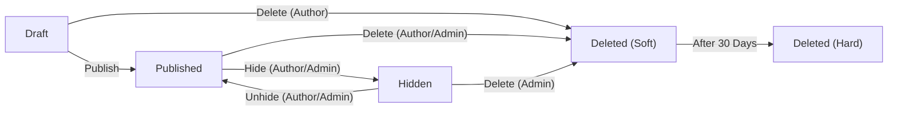
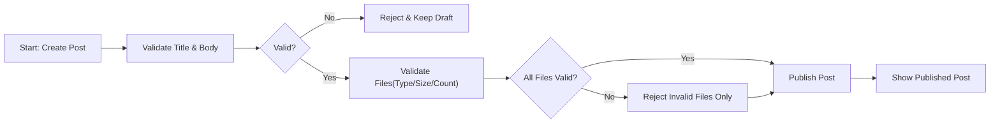
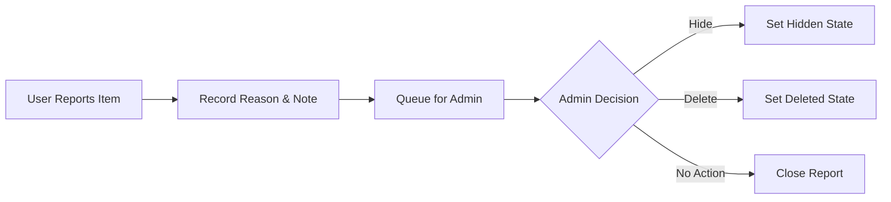

# civicBoard Requirements Analysis (Minimal Discussion Board)

## Vision and Scope
civicBoard enables straightforward public discussion about economic and political topics. Participants publish short articles (posts), optionally attach images and files as evidence, and converse through comments. The first release focuses on the smallest viable set of capabilities that allow safe and civil discourse without complex social features.

Goals (minimal):
- THE civicBoard service SHALL allow registered users to create posts with optional images and files.
- THE civicBoard service SHALL allow registered users to comment on posts using plain text.
- THE civicBoard service SHALL allow any visitor to browse published content unless a simple public-read switch is disabled.
- THE civicBoard service SHALL provide a lightweight reporting mechanism and basic admin moderation (hide or delete content).

Constraints (minimalism):
- THE civicBoard service SHALL avoid complex features such as threaded comments, rich text editors, real-time feeds, or advanced notifications in the initial scope.

## Actors and Roles
- Guest: An unauthenticated visitor who can read published posts and comments when public-read is enabled.
- User: An authenticated member who can create and manage own posts and comments, upload attachments to own posts, and report content.
- Admin: An authenticated administrator who can moderate all content and manage reports.

## In Scope vs Out of Scope (MVP)
In Scope (MVP):
- Posts with title/body and optional attachments (images/files)
- Comments on posts (plain text only)
- Browsing lists of posts and reading a post with its comments
- Basic keyword search on post titles and bodies
- Reporting and admin moderation (hide/delete)
- Simple registration/login, password reset, and minimal profile (display name)

Out of Scope (MVP):
- Threaded/nested comments; direct messages; rich text formatting; reactions/likes; bookmarks/follows
- Categories/tags/multiple boards; public third-party APIs; social login/SSO; internationalization beyond en-US
- Real-time streaming updates; complex notifications; advanced search operators or facets

EARS for scope boundaries:
- THE civicBoard service SHALL provide flat (non-threaded) comments.
- THE civicBoard service SHALL exclude direct messages, rich text, and real-time updates in the minimal release.

## User Journeys (Concise)
### Browse and Read
- WHEN a visitor arrives, THE civicBoard service SHALL list recent posts ordered by most recent publication time.
- WHEN a visitor opens a post, THE civicBoard service SHALL show the title, body, attachments, author display name, publication time, and comments.
- IF no posts exist, THEN THE civicBoard service SHALL display an empty state.

### Register and Log In
- WHEN a visitor registers with email and password, THE civicBoard service SHALL create an account and require email verification before posting or commenting.
- WHEN a user logs in with valid credentials, THE civicBoard service SHALL establish a signed-in session and reflect the user’s role (user or admin).

### Create a Post with Attachments
- WHEN a user submits a post with valid title/body and optional files within limits, THE civicBoard service SHALL publish the post and associate accepted attachments.
- IF any attachment violates type/size/count rules, THEN THE civicBoard service SHALL reject only the offending files and preserve the valid parts of the submission.

### Comment on a Post
- WHEN a user submits a valid comment on a published post, THE civicBoard service SHALL publish the comment immediately.
- IF the post is hidden or deleted, THEN THE civicBoard service SHALL block commenting and state unavailability.

### Report and Moderate
- WHEN a user reports a post or comment, THE civicBoard service SHALL record the report with a reason and place the item in the admin review queue.
- WHEN an admin hides content, THE civicBoard service SHALL remove it from public view; WHEN an admin deletes content, THE civicBoard service SHALL mark it deleted and non-recoverable to regular users.

## Business Processes and Rules
### Posts
Purpose: Start topic-focused discussions with optional supporting evidence.

- THE civicBoard service SHALL require a title (1–120 characters) and body (1–20,000 characters).
- THE civicBoard service SHALL allow authors to edit their own posts within 30 minutes of publication.
- THE civicBoard service SHALL allow authors to delete their own posts at any time; deletion removes public visibility.
- THE civicBoard service SHALL list posts newest-first in pages of 20 items per page.
- IF validation fails (lengths missing/invalid), THEN THE civicBoard service SHALL reject the post and identify each violated rule.

### Attachments (Images/Files) — Posts Only
Purpose: Support evidence-based discussion (charts, datasets, policy PDFs).

- THE civicBoard service SHALL allow attachments on posts only; comments SHALL NOT accept attachments in the minimal release.
- THE civicBoard service SHALL accept image types JPEG, PNG, GIF and document type PDF.
- THE civicBoard service SHALL limit attachments to at most 5 files per post and at most 10 MB per file; total combined size per post SHALL NOT exceed 25 MB.
- THE civicBoard service SHALL ensure attachment visibility follows the parent post’s visibility.
- IF an attachment violates type/size/count/total rules, THEN THE civicBoard service SHALL reject it with a clear message and preserve valid content.

### Comments
Purpose: Enable discussion on posts using plain text.

- THE civicBoard service SHALL require a comment body (1–5,000 characters) for each comment.
- THE civicBoard service SHALL allow authors to edit comments within 15 minutes of creation.
- THE civicBoard service SHALL allow authors to delete their own comments; a minimal placeholder may be shown where needed to preserve context.
- IF the parent post is hidden or deleted, THEN THE civicBoard service SHALL deny new comments.

### Browsing and Search
- THE civicBoard service SHALL provide a posts list ordered newest-first with pagination of 20 per page.
- THE civicBoard service SHALL support basic keyword search over post titles and bodies using space-separated AND semantics.
- IF no results match, THEN THE civicBoard service SHALL return an empty set with zero count.

### Reporting and Minimal Moderation
- THE civicBoard service SHALL allow users to report posts and comments with a predefined reason and optional note (≤500 characters).
- THE civicBoard service SHALL allow admins to resolve a report by taking one of: Hide, Delete, or No Action.
- THE civicBoard service SHALL record the moderation outcome and remove hidden/deleted items from public listings.

## Authentication and Authorization (Business-Level)
- THE civicBoard service SHALL require authentication for creating, editing, deleting, or reporting content.
- THE civicBoard service SHALL allow public reading of published content unless a simple configuration disables public-read.
- THE civicBoard service SHALL enforce ownership: users can modify or delete only their own posts and comments; admins can moderate all content.
- WHEN an account is suspended, THE civicBoard service SHALL deny content creation and update actions with a clear suspension notice.

## Error Handling and Recovery (Business Outcomes)
Validation
- WHEN title/body/comment length rules are violated, THE civicBoard service SHALL reject the request and specify which field and rule failed.
Attachments
- WHEN an uploaded file exceeds 10 MB or is not in the allowed set (JPEG, PNG, GIF, PDF), THE civicBoard service SHALL reject that file and accept other valid files in the same submission.
Permissions
- WHEN a guest attempts to post, comment, or report, THE civicBoard service SHALL require sign-in and deny the action.
Not Found / Hidden
- WHEN content is hidden or deleted, THE civicBoard service SHALL present a generic unavailability outcome to non-admin users.
Rate Limiting
- WHERE spam-like behavior occurs, THE civicBoard service SHALL limit posts to 5 per day per user and comments to 50 per day per user; excess SHALL be denied with next retry guidance.
Draft/Retry
- WHEN any validation error occurs, THE civicBoard service SHALL preserve entered text for the current operation to allow correction without loss.

## Non-Functional Expectations (Minimal)
Performance
- THE civicBoard service SHALL return the first page of the posts list within 1,000 ms at p95 under normal load.
- THE civicBoard service SHALL confirm creation of a valid post or comment within 2 seconds at p95 under normal load.
- THE civicBoard service SHALL acknowledge acceptance/rejection of each attachment within 3 seconds for files up to 10 MB under normal network conditions.
Availability and Reliability
- THE civicBoard service SHALL target ≥99.5% monthly availability excluding scheduled maintenance.
Privacy and Safety
- THE civicBoard service SHALL collect only minimal personal data required to operate (e.g., email, display name) and SHALL avoid exposing emails publicly.
Timezone and Locale
- THE civicBoard service SHALL display times consistent with the user’s local timezone; when not determinable, Asia/Seoul may be used as a default display context while authoritative records are kept in UTC.
Retention Basics
- THE civicBoard service SHALL purge soft-deleted content after 30 days, and SHALL ensure attachments associated with purged content are no longer accessible.

## State Models and Flows
### Post Lifecycle (Business-Level)

### Post Creation with Attachments

### Reporting and Moderation

## Acceptance Criteria
Posts
- WHEN a user creates a valid post with 0–5 allowed attachments (each ≤10 MB; total ≤25 MB), THE civicBoard service SHALL publish it and list it in the newest-first feed within 2 seconds under normal load.
- WHEN title/body limits are exceeded, THE civicBoard service SHALL reject creation and identify the violated field and limit.
- WHEN an author edits within 30 minutes, THE civicBoard service SHALL apply the update and reflect a last-edited timestamp; after 30 minutes, THE civicBoard service SHALL block edit attempts.

Attachments
- WHEN a file is not JPEG/PNG/GIF/PDF or exceeds 10 MB, THE civicBoard service SHALL reject that file and continue evaluating others in the submission.
- WHEN more than 5 files are attached or total size exceeds 25 MB, THE civicBoard service SHALL reject the excess and state the limits.
- WHEN a post is hidden or deleted, THE civicBoard service SHALL align attachment visibility with the parent’s visibility.

Comments
- WHEN a user submits a valid comment body (1–5,000 chars) on a published post, THE civicBoard service SHALL publish it within 2 seconds under normal load.
- WHEN the parent post is hidden/deleted, THE civicBoard service SHALL deny commenting with a generic unavailability message.

Reporting and Moderation
- WHEN a user reports an item with a valid reason, THE civicBoard service SHALL create a review record visible to admins.
- WHEN an admin sets Hidden or Deleted, THE civicBoard service SHALL update public visibility immediately and record the action outcome.

Search and Browsing
- WHEN a user searches with space-separated terms, THE civicBoard service SHALL return posts containing all terms ordered newest-first, 20 items per page; zero matches returns an empty result set.

## Risks and Mitigations
- Low-quality or off-topic content: mitigate with clear posting rules and simple reporting.
- Abuse or spam: mitigate with basic rate limits and admin moderation tools.
- Attachment misuse: mitigate with strict type/size/count/total policies and reporting.

## Glossary
- Post: A user-authored article with title/body and optional attachments, visible when published.
- Comment: A user-authored textual response to a post.
- Attachment: An image or file associated with a post whose visibility follows the parent.
- Hidden: A state that removes public visibility while allowing admin review and potential restoration.
- Deleted (Soft/Hard): Soft removes public access with a 30-day retention; Hard permanently removes after retention.
- Report: A user-submitted request for admin review due to suspected policy violation.
