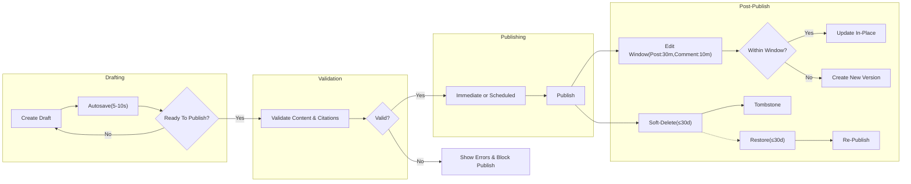
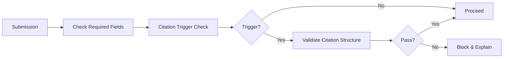

# econDiscuss Content Authoring Rules and Policies

## 1. Introduction and Scope
Business requirements for content authoring on econDiscuss ensure professional, evidence-based economic discourse while offering modern social UX. Behaviors are defined using EARS to be specific, measurable, and testable. No technical implementation details (APIs, schemas, transports) are prescribed.

Core objectives:
- Enable high-quality long-form analysis, structured discussion, and live exchanges.
- Enforce citation discipline and professionalism standards.
- Protect privacy and accessibility with clear, enforceable rules.
- Support drafts, autosave, scheduled publishing, and transparent versioning.

## 2. Roles and Authoring Capabilities

| Authoring Action | visitor | member | verifiedExpert | moderator | admin |
|------------------|---------|--------|----------------|-----------|-------|
| Create post | ❌ | ✅ | ✅ | ✅ | ✅ |
| Create comment | ❌ | ✅ | ✅ | ✅ | ✅ |
| Create live message | ❌ | ✅ | ✅ | ✅ | ✅ |
| Save drafts | ❌ | ✅ | ✅ | ✅ | ✅ |
| Edit own published content (within window) | ❌ | ✅ | ✅ | ✅ | ✅ |
| Create post version after window | ❌ | ✅ | ✅ | ✅ | ✅ |
| Delete own content (soft delete) | ❌ | ✅ | ✅ | ✅ | ✅ |
| Restore own soft-deleted content | ❌ | ✅ | ✅ | ✅ | ✅ |
| Apply expert insight marker | ❌ | ❌ | ✅ | ✅ | ✅ |
| Override taxonomy rules | ❌ | ❌ | ❌ | ✅ | ✅ |
| Redact/remove others’ content (policy-bound) | ❌ | ❌ | ❌ | ✅ | ✅ |

EARS (global):
- THE econDiscuss platform SHALL enforce the matrix above as the least-privilege baseline for authoring capabilities.
- WHEN an action is denied for role or sanction, THE econDiscuss platform SHALL display a human-readable reason and, where applicable, the rule to unlock.

## 3. Content Types

### 3.1 Posts
Business description: Long-form analyses, research summaries, and evidence-backed commentary.

Validation and limits:
- Title length: 10–120 characters.
- Body length: 50–50,000 characters.
- Tags: 1–5 required controlled tags; up to 3 optional free-form tags if policy allows.
- Attachments: up to 5 per post; each ≤ 10 MB; PDF/CSV/XLSX/PNG/JPG/JPEG only.
- Citations: required when citation triggers apply (see Section 6).

EARS:
- THE econDiscuss platform SHALL validate title, body, and tags at submission and return results within 2 seconds P95 under normal load.
- WHERE a post contains numeric claims, forecasts, or quoted material, THE econDiscuss platform SHALL require at least one structured citation before publication.
- IF validation fails, THEN THE econDiscuss platform SHALL identify exact fields and violated rules without exposing internal mechanisms.

### 3.2 Comments
Business description: Threaded responses for focused discussion.

Validation and limits:
- Body length: 1–5,000 characters.
- Nesting: up to 3 levels.
- Attachments: none; links allowed with previews subject to policy.

EARS:
- THE econDiscuss platform SHALL support replies up to 3 levels deep and reject deeper nesting with a clear message.
- WHEN a comment is submitted, THE econDiscuss platform SHALL validate in ≤ 1 second P95 and render the comment upon acceptance.

### 3.3 Live Messages (Live Discussions)
Business description: Real-time short-form messages inside live threads or rooms.

Validation and limits:
- Body length: 1–1,000 characters.
- Edits: 2-minute typo-correction window; otherwise immutable.

EARS:
- WHILE a live thread is active, THE econDiscuss platform SHALL deliver messages with end-to-end latency ≤ 1 second at P95 and persist per room policy (persistent vs. ephemeral).
- WHERE ephemeral mode is enabled, THE econDiscuss platform SHALL expire messages automatically after the configured window.

## 4. Authoring Workflow Enhancements

### 4.1 Drafts and Autosave
Scope and retention:
- Drafts apply to posts and comments; live messages do not support drafts.
- Autosave frequency: every 5–10 seconds during active editing; confirm within 1 second.
- Cross-device: drafts sync across devices for the same account.
- Limits: up to 100 active drafts per user; oldest auto-archived on overflow.

EARS:
- THE econDiscuss platform SHALL autosave drafts at least every 10 seconds and on blur or explicit save.
- IF the device is offline, THEN THE econDiscuss platform SHALL queue draft changes and sync within 5 seconds of reconnecting.
- WHERE conflicting edits occur across devices, THE econDiscuss platform SHALL preserve both versions and require author resolution before publish.

### 4.2 Versioning and Edit Windows
Edit windows (author-level):
- Posts: 30-minute silent edit window; thereafter, new public versions with visible change logs.
- Comments: 10-minute silent edit window; immutable thereafter for authors.
- Live messages: 2-minute typo-correct window.

Visibility and audit:
- Public indicator: “edited” timestamp on posts after window; full version diff visible to author, moderators, and admins.

EARS:
- WHEN a post is edited within 30 minutes, THE econDiscuss platform SHALL update in place and record an internal audit entry.
- WHEN a post is edited after 30 minutes, THE econDiscuss platform SHALL create a new public version and display an edited indicator.
- WHERE comment edits exceed 10 minutes, THE econDiscuss platform SHALL block author edits and suggest an addendum reply.

### 4.3 Scheduled Publishing and Embargoes
Business description: Optional scheduling for posts to publish at a future time and optional embargo notes for press/research coordination.

Rules:
- Scheduling horizon: immediate or up to 90 days ahead.
- Timezone: author’s configured timezone for display; UTC canonical for storage.
- Embargo note: optional public disclosure line added at publish time.

EARS:
- WHEN a post is scheduled, THE econDiscuss platform SHALL publish at the configured time in the author’s timezone and notify followers per preferences.
- IF a scheduled time is in the past, THEN THE econDiscuss platform SHALL reject the schedule with guidance to publish now or set a valid future time.
- WHERE an embargo note is provided, THE econDiscuss platform SHALL append a standardized disclosure at publish time.

### 4.4 Expert Insight Markers
Business description: Label applied by verified experts (or moderators/admins) to highlight domain-specific analysis or key takeaways.

Constraints:
- Availability: verifiedExpert and above; 1 insight marker per post version; removable by marker owner or moderators.
- Domain relevance: at least one controlled tag must match the expert’s verified domain when applied.

EARS:
- WHERE an author holds verifiedExpert status, THE econDiscuss platform SHALL allow applying one “Expert Insight” marker per post version.
- WHEN an insight marker is applied outside the expert’s domain, THE econDiscuss platform SHALL warn the author and require explicit confirmation.
- IF a marker is removed by moderators for policy reasons, THEN THE econDiscuss platform SHALL notify the author with rationale.

## 5. Formatting and Accessibility

### 5.1 Markdown and Structure
Supported constructs: headings, lists, blockquotes, tables, footnotes, callouts, inline math (optional), and code blocks for data snippets.

EARS:
- THE econDiscuss platform SHALL render previews within 1 second P95 and sanitize content to prevent unsafe markup.
- THE econDiscuss platform SHALL encourage a logical heading hierarchy (H1–H3 typical) and warn when headings are missing or malformed.

### 5.2 Images, Figures, and Captions
Rules:
- Alt text: 5–200 characters required for all images.
- Figure captions: include source attribution for charts/graphs; year/range where applicable.
- Sensitive visuals: blur/redact PII by policy; avoid watermarks that obscure data.

EARS:
- IF an image lacks required alt text, THEN THE econDiscuss platform SHALL block publication until provided.
- WHERE a figure depicts a chart derived from data, THE econDiscuss platform SHALL require a caption with data source and timeframe.

### 5.3 Code and Data Snippets
Rules:
- Short, illustrative code/data fragments allowed (e.g., CSV excerpts) with proper formatting.
- No executable attachments or scripts.

EARS:
- WHERE a code/data block exceeds 500 lines or 100 KB equivalent, THE econDiscuss platform SHALL require truncation or attachment as a CSV/XLSX within limits.

## 6. Citations and References

### 6.1 Triggers and Sources
Triggers: statistical claims, macro series references, forecasts, quotations, or third-party research references.
Acceptable sources: peer-reviewed journals, official statistics, central banks, reputable think tanks, recognized media with editorial standards.

EARS:
- WHERE citation triggers are present, THE econDiscuss platform SHALL require at least one citation with author(s), title, source, year, and URL/DOI before publication.
- IF a citation URL is unreachable or malformed, THEN THE econDiscuss platform SHALL warn the author and permit publication only if at least one valid citation remains.

### 6.2 Style and Integrity Expectations
Rules:
- Any consistent academic style acceptable (e.g., APA/Chicago) if complete and unambiguous.
- Self-citations permitted with disclosure; conflicts of interest must be declared (see Section 13).

EARS:
- WHEN a self-citation is used, THE econDiscuss platform SHALL prompt the author to declare any material conflict of interest via a standardized checkbox.
- WHERE multiple citations are present, THE econDiscuss platform SHALL order them consistently and render a References list section.

### 6.3 Reproducibility (Data and Methods)
Rules:
- For empirical claims, authors should provide enough information for readers to locate the data and replicate calculations at a high level.

EARS:
- WHERE a post relies on a specific public dataset, THE econDiscuss platform SHALL require the dataset name, publisher, series code (if applicable), and access link in citations or captions.

## 7. Attachments
Policies:
- Allowed: PDF, CSV, XLSX, PNG, JPG, JPEG; ≤ 10 MB each; up to 5 per post; none for comments.
- Malware scanning and PII detection enforced by policy.

EARS:
- WHEN an attachment is uploaded, THE econDiscuss platform SHALL validate type/size and show progress updated at least every 1 second.
- IF scanning or validation fails, THEN THE econDiscuss platform SHALL reject the file and preserve all draft text.
- IF PII patterns are detected, THEN THE econDiscuss platform SHALL block upload and instruct redaction.

## 8. Tagging and Taxonomy
Taxonomy:
- Controlled tags: curated economics domains and topics (e.g., "Macroeconomics", "Labor Markets", "Monetary Policy").
- Optional free-form tags: limited and moderated; may be disabled by policy.

Rules:
- Posts require 1–5 controlled tags; comments do not require tags.
- Verified experts should include at least one controlled tag aligned to their verified domain when applicable.

EARS:
- THE econDiscuss platform SHALL enforce 1–5 controlled tags per post.
- WHERE a user attempts an unrecognized tag, THE econDiscuss platform SHALL treat it as free-form only if policy permits and the user has permission.
- WHEN a verified expert publishes, THE econDiscuss platform SHALL prompt inclusion of a domain-aligned tag and warn if omitted.
- IF a new tag proposal is submitted, THEN THE econDiscuss platform SHALL queue it for moderator review and notify the proposer of outcome.

## 9. Deletion, Restoration, and Ownership
Ownership and licensing:
- Authors attest to rights to publish and grant econDiscuss a non-exclusive license to host and display content; revocable upon deletion subject to policy.

Deletion and restoration:
- Soft-delete window: 30 days for posts/comments with tombstones to preserve thread context.
- Hard-delete: admin-only per policy; compliance and legal holds honored.

EARS:
- WHEN an author soft-deletes content, THE econDiscuss platform SHALL remove it from public view and display a tombstone placeholder.
- WHILE within 30 days, THE econDiscuss platform SHALL allow restoration by the author; after 30 days, SHALL hard-delete or anonymize per policy.
- WHERE legal hold exists, THE econDiscuss platform SHALL block deletion and inform the author of constraints.

## 10. Link Previews and External References
Rules:
- Generate previews for safe, public URLs; expand shortened URLs for transparency.
- Academic opt-out: allow plain-link display for research sources if author chooses.

EARS:
- WHEN a link is added, THE econDiscuss platform SHALL attempt metadata fetch and render preview in ≤ 2 seconds or fallback to plain link.
- WHERE a link is flagged unsafe, THE econDiscuss platform SHALL block preview and warn the author.
- IF an author opts out of preview for a link, THEN THE econDiscuss platform SHALL display a plain link with a safety indicator.

## 11. Error Scenarios and Recovery
Common validation failures:
- Title/body length, missing required tags, citation triggers unmet, disallowed file types, missing alt text.

EARS:
- IF required citations are missing when triggers are present, THEN THE econDiscuss platform SHALL block publication and list acceptable source types.
- IF autosave fails, THEN THE econDiscuss platform SHALL retry silently and warn if unsaved for > 30 seconds, without blocking editing.
- IF link preview fetch times out, THEN THE econDiscuss platform SHALL render a plain link without blocking publication.

## 12. Performance and Responsiveness Requirements
P95 targets under normal load:
- Post submission validation ≤ 2 seconds; peak ≤ 5 seconds.
- Comment submission validation ≤ 1 second; peak ≤ 3 seconds.
- Draft autosave acknowledgement ≤ 1 second.
- Attachment progress updates at least every 1 second.
- Preview rendering ≤ 1 second; fallback by 2 seconds.

EARS:
- THE econDiscuss platform SHALL meet or exceed the P95 targets above and provide progress indicators for operations exceeding 2 seconds.

## 13. Professionalism, Conflicts of Interest, and Compliance
Professional tone:
- Evidence-based, civil discourse; no personal attacks; plagiarism prohibited; AI-assisted content disclosed when material portions are generated.

Conflict disclosures:
- Paid relationships, sponsorships, or material interests relevant to the content must be disclosed.

EARS:
- WHERE content includes investment or trading implications, THE econDiscuss platform SHALL prompt a standardized risk disclosure before publication.
- WHEN a conflict-of-interest disclosure applies, THE econDiscuss platform SHALL append a standardized disclosure badge or line to the post.
- IF prohibited content is detected by automated checks, THEN THE econDiscuss platform SHALL block publication and list guideline categories.

## 14. Auditing and Success Criteria
Auditability:
- Version histories, edit timestamps, and moderation redactions recorded; insight marker applications logged with actor and reason.

Success metrics:
- ≥95% of posts with statistical claims include valid citations.
- ≥99% draft autosaves acknowledged within 1 second.
- 100% images with valid alt text; 100% charts with source captions.
- ≤1% authoring failures due to system errors (excluding user validation) per rolling 24 hours.

EARS:
- THE econDiscuss platform SHALL log authoring lifecycle events sufficient for moderation and appeals without storing unnecessary PII.

## 15. Diagrams (Authoring Lifecycle and Policy Checks)

### 15.1 Authoring Lifecycle

### 15.2 Pre-Publication Policy Checks

## 16. Relationships to Other Documents
- Role permissions and authentication expectations: [User Roles and Permissions](./03-econDiscuss-user-roles-permissions.md)
- Authoring within live sessions and notifications: [Realtime, Notifications, and Live Discussions](./11-econDiscuss-realtime-notifications-live.md)
- Voting/reputation signals affecting visibility: [Voting, Reputation, and Voting History](./07-econDiscuss-voting-reputation-history.md)
- Tagging, discovery, and trending signals: [Search, Discovery, and Trending](./09-econDiscuss-search-discovery-trending.md)
- Moderation, quality governance, and sanctions: [Moderation, Quality, and Governance](./13-econDiscuss-moderation-quality-governance.md)
- Privacy, security, and performance NFRs: [Non-Functional Requirements](./14-econDiscuss-nonfunctional-privacy-security-performance.md)
