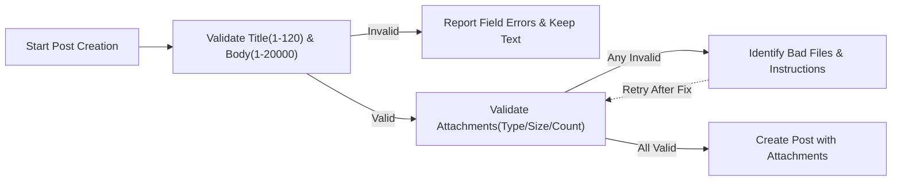
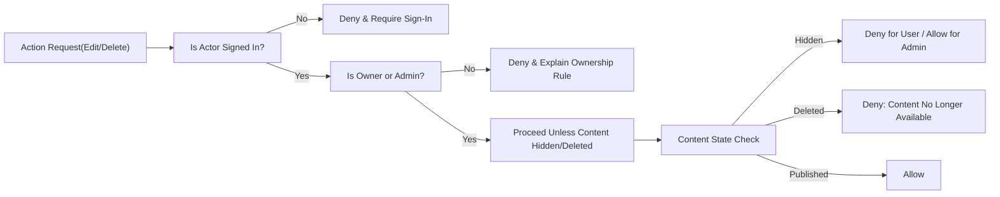
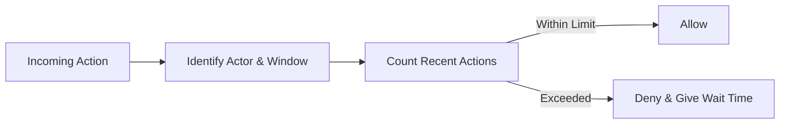

# civicBoard Exception Handling Requirements

## Scope and Intent
- THE civicBoard service SHALL provide predictable, minimal, and safe error and exception handling for posts, comments, attachments, authentication, authorization, moderation visibility, search, and rate limiting.
- THE civicBoard service SHALL express all outcomes in plain en-US language suitable for end users and administrators.
- THE civicBoard service SHALL avoid technical implementation details (e.g., database schemas, API/transport codes, payload formats) and focus on business-visible behavior only.
- THE civicBoard service SHALL preserve privacy and safety by avoiding disclosures of hidden or unauthorized resources.

Out of scope
- Database models, API protocols, status codes, storage technologies, logging formats, and UI layout specifications.

Actors
- user: registered member who can create and manage own content.
- admin: administrator who can moderate and manage all content and users.

## Principles and Category Model
### Principles
- Predictable: Similar errors SHALL produce consistent, recognizable outcomes.
- Minimal: Only necessary categories and messages SHALL be used in the minimal release.
- Safe: Unauthorized actors SHALL NOT learn whether hidden or private resources exist.
- Actionable: Messages SHALL tell users what to do next or when to try again.
- Recoverable: Draft text and valid uploads SHALL be preserved during correctable failures within the current session.

### Error Category Model (Business-Level)
- Validation Failure: Input violates business rules or limits.
- Authentication Required: Sign-in is required for the attempted action.
- Permission Denied: Actor is signed in but lacks rights (e.g., not owner).
- Not Available: Resource not visible or never existed from the actor’s perspective.
- Gone/Removed: Resource existed but was deleted or removed from public view.
- Attachment Limit: File type/size/count/naming rules violated.
- Rate Limited/Throttled: Action frequency threshold exceeded.
- Conflict/State Change: Target changed state during the action (e.g., hidden while editing).
- System Busy/Retry Later: Temporary capacity or dependency issues; ask to retry.

## Validation Failures
### Post Content Validation
- THE civicBoard service SHALL require Title length 1–120 characters (trimmed) and Body length 1–20,000 characters (trimmed).
- WHEN either Title or Body violates limits, THE civicBoard service SHALL reject creation or update and identify the exact violated field and rule.
- WHEN a user submits a post whose Title and Body exactly match a post the same user created within the last 5 minutes, THE civicBoard service SHALL reject as a duplicate and advise editing the original.
- WHERE attachments are included, THE civicBoard service SHALL validate type, size, count, and naming rules before accepting.

### Comment Validation
- THE civicBoard service SHALL require Comment Body length 1–5,000 characters (trimmed).
- THE civicBoard service SHALL reject comments containing attachments in the minimal release.
- WHEN comment validation fails, THE civicBoard service SHALL list all failed rules at once and preserve entered text in-session.

### General Text Rules
- THE civicBoard service SHALL treat whitespace-only Title/Body as missing.
- THE civicBoard service SHALL reject content containing control characters outside normal text ranges.

## Permission and Authorization Outcomes
### Authentication Required
- WHEN a guest attempts to create, update, delete, or report content, THE civicBoard service SHALL deny the action and require sign-in.

### Insufficient Permissions
- WHEN a user attempts to edit or delete content they do not own, THE civicBoard service SHALL deny the action and state that only the author or an admin can make that change.
- WHILE an account is suspended, THE civicBoard service SHALL deny content creation and updates and state the suspension restriction.

### Privacy-Preserving Responses
- WHEN an unauthorized actor targets a private or hidden resource, THE civicBoard service SHALL respond as not available without confirming existence.

## Not Available, Gone, and Hidden
### Not Available
- WHEN a resource identifier does not correspond to a visible resource for the actor, THE civicBoard service SHALL state that the content is not available.

### Gone/Removed
- WHEN a post or comment has been deleted by its owner or removed by moderation, THE civicBoard service SHALL state that the content is no longer available.
- WHEN an actor attempts to act on removed content, THE civicBoard service SHALL deny the action and state that the content is no longer available.

### Hidden (Moderation)
- WHILE a post is Hidden pending moderation, THE civicBoard service SHALL prevent new comments and edits by non-admin actors and shall state that review is in progress.
- WHERE the actor is admin, THE civicBoard service SHALL allow viewing hidden content and performing moderation actions.

## Attachment Limit Errors
### Minimal Attachment Policy (Posts Only)
- Allowed types (business-level): Images (JPEG/JPG, PNG, GIF) and Documents (PDF).
- Max files per post: 5.
- Max size per image: 5 MB.
- Max size per PDF: 10 MB.
- Max combined size per post: 20 MB.
- Disallowed examples: Executables and archives (EXE, BAT, CMD, SH, JS, JAR, MSI, RAR, 7Z), or any file flagged as potentially harmful.
- Filenames: 1–120 visible characters; letters, numbers, spaces, hyphens, underscores, and periods; no path separators or control characters; extension must match detected type.

EARS requirements
- THE civicBoard service SHALL reject any attachment whose type is not allowed.
- THE civicBoard service SHALL reject any image larger than 5 MB and any PDF larger than 10 MB.
- THE civicBoard service SHALL reject posts that exceed 5 attachments or 20 MB combined size.
- THE civicBoard service SHALL reject attachments with invalid filenames or with extension/type mismatch.
- WHEN attachments are rejected, THE civicBoard service SHALL preserve valid text and accepted files and identify only the failed files with reasons.
- WHEN a user attempts to attach a file to a comment, THE civicBoard service SHALL deny attachments for comments.

## Rate Limiting and Abuse Prevention
### Thresholds (Business Defaults)
- Post creation: up to 5 posts per user per 30 minutes.
- Comment creation: up to 20 comments per user per 15 minutes.
- Attachment uploads: up to 10 files per user per 10 minutes.
- Content reports: up to 10 reports per user per hour.
- Login attempts: up to 5 failed attempts per user per 15 minutes.

EARS requirements
- WHEN a user exceeds a threshold, THE civicBoard service SHALL deny the action and communicate the earliest retry time.
- WHERE feasible, THE civicBoard service SHALL apply limits per account and per network origin to reduce abuse.
- WHERE an admin performs actions, THE civicBoard service SHALL not apply end-user posting or commenting limits.
- WHILE a temporary login lockout is active, THE civicBoard service SHALL deny login attempts and advise waiting for the window to reset.

## Recovery and Retry Guidance
### General Recovery
- WHEN validation fails, THE civicBoard service SHALL specify the field(s) and exact rule(s) that must be corrected.
- WHEN permission is denied, THE civicBoard service SHALL explain the business reason (e.g., ownership required, sign-in required).
- WHEN content is not available, THE civicBoard service SHALL advise returning to the list or verifying the link.
- WHEN an attachment is rejected, THE civicBoard service SHALL advise reducing size, converting to an allowed type, renaming safely, or removing excess files.
- WHEN rate limited, THE civicBoard service SHALL state that too many actions were attempted and indicate a retry time.
- WHEN a temporary system busy condition occurs, THE civicBoard service SHALL instruct retry after a short interval.

### Draft Preservation
- WHEN an operation fails before content is created, THE civicBoard service SHALL allow the user to retry without re-entering validated text during the same session.

### Partial Success Rules
- THE civicBoard service SHALL treat post creation with attachments as a single unit: either the post is created with accepted attachments or no post is created.
- THE civicBoard service SHALL allow retry of failed attachments without duplicating already-accepted attachments.

## Error Communication Conventions
- THE civicBoard service SHALL use concise, plain-language messages that include the reason and the corrective action.
- THE civicBoard service SHALL avoid exposing internal identifiers, implementation details, or sensitive data in user messages.
- THE civicBoard service SHALL present times in the user’s local timezone for readability; authoritative records remain in UTC.
- THE civicBoard service SHALL keep error message length readable on small screens (business guidance: ≤ 200 characters for short errors, ≤ 400 for detailed errors) while being clear.

### Accessibility and Localization (Minimal)
- THE civicBoard service SHALL write messages in clear en-US, avoiding jargon and acronyms.
- THE civicBoard service SHALL ensure messages are understandable when read aloud by assistive technologies.
- WHERE wait-until guidance is shown, THE civicBoard service SHALL display the local time (e.g., Asia/Seoul) and optionally a relative time.

### Business-Friendly Message Examples (Illustrative)
- Validation: "Title must be 1–120 characters."
- Duplicate: "A similar post from you was created recently. Edit that post or try again later."
- Auth required: "Sign in to create a post."
- Ownership: "Only the author or an admin can edit this post."
- Hidden: "This post is under review and not open for new comments."
- Deleted: "This content is no longer available."
- Rate limit: "Too many comments. Try again at 14:05 (KST)."
- Attachment type: "Only JPEG, PNG, GIF, or PDF files are allowed."
- Attachment size: "Images up to 5 MB and PDFs up to 10 MB are allowed."
- System busy: "We’re busy right now. Please retry in a moment."

## Diagrams for Key Error Flows
### Post Creation with Attachment Validation

### Authorization Outcome

### Rate Limiting

## Acceptance Criteria Summary (Testable)
### Validation
- WHEN a post title is empty after trimming, THE civicBoard service SHALL reject and instruct: "Title must be 1–120 characters."
- WHEN a post body exceeds 20,000 characters, THE civicBoard service SHALL reject and instruct to shorten the text.
- WHEN a comment body is empty after trimming, THE civicBoard service SHALL reject and instruct: "Comment must be 1–5,000 characters."
- WHEN a user submits an identical post (title and body) within 5 minutes, THE civicBoard service SHALL reject as a duplicate.

### Attachments
- WHEN an image exceeds 5 MB, THE civicBoard service SHALL reject that file and continue evaluating other files.
- WHEN a PDF exceeds 10 MB, THE civicBoard service SHALL reject that file and continue evaluating other files.
- WHEN more than 5 files are attached to a single post, THE civicBoard service SHALL reject the excess and state the limit.
- WHEN combined size exceeds 20 MB, THE civicBoard service SHALL reject and instruct to reduce total size.
- WHEN a filename contains disallowed characters or mismatched extension, THE civicBoard service SHALL reject the file and state naming rules.
- WHEN a comment includes an attachment, THE civicBoard service SHALL deny attachments for comments.

### Authorization
- WHEN a guest tries to create a post, THE civicBoard service SHALL deny and require sign-in.
- WHEN a user tries to edit another user’s post, THE civicBoard service SHALL deny and state ownership restrictions.
- WHEN an admin moderates content, THE civicBoard service SHALL allow the action unless the content is permanently deleted.

### Resource State
- WHEN a resource identifier is not visible to the actor, THE civicBoard service SHALL state that the content is not available.
- WHILE a post is hidden, THE civicBoard service SHALL block edits and comments by non-admins and state that review is in progress.
- WHEN an actor attempts to act on deleted content, THE civicBoard service SHALL deny and state it is no longer available.

### Rate Limiting and Recovery
- WHEN a user submits a 6th post within 30 minutes, THE civicBoard service SHALL deny and communicate when posting is allowed again.
- WHEN a user submits a 21st comment within 15 minutes, THE civicBoard service SHALL deny and communicate the next allowed time.
- WHEN failed login attempts reach 5 within 15 minutes, THE civicBoard service SHALL deny further attempts until the window resets and communicate the wait.
- WHEN any validation error occurs, THE civicBoard service SHALL present all failed fields together and retain valid inputs in-session.
- WHEN a temporary busy condition occurs, THE civicBoard service SHALL ask the user to retry after a short interval.

## Change Control and Audit Relevance (Business-Level)
- THE civicBoard service SHALL maintain consistent phrasing for common errors so users learn to recognize and resolve them quickly.
- THE civicBoard service SHALL allow administrators to update business thresholds (limits, windows) without changing intent.
- THE civicBoard service SHALL ensure moderation actions, takedowns, and rate-limit triggers are traceable in administrative audit views without exposing private user data in public interfaces.

End of requirements.