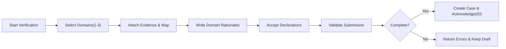
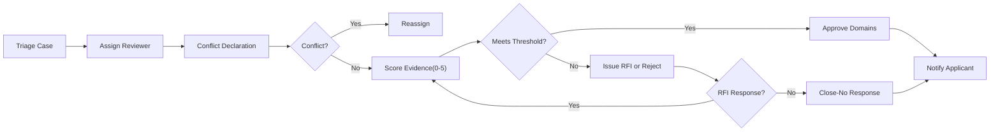
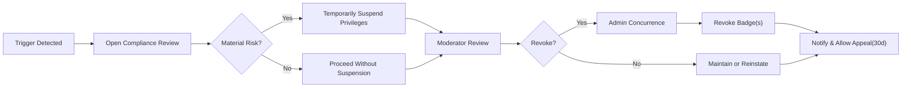
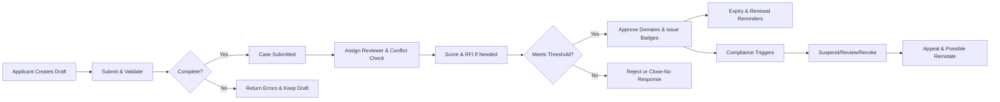
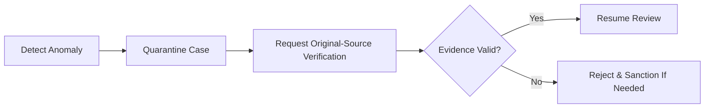

# econDiscuss Expertise Verification Requirements

## 1) Scope and Objectives
Purpose: elevate trust and discourse quality by granting verifiedExpert status to qualified members based on demonstrable economic expertise in specific domains, while protecting privacy and ensuring fairness, transparency, and auditability.

Objectives (business, measurable):
- THE verification program SHALL accurately identify qualified experts and reduce false positives via defined evidence standards and multi-reviewer safeguards.
- THE verification program SHALL issue domain-specific badges that improve discovery, reputation weighting, and curation eligibility without exposing PII.
- THE verification program SHALL provide predictable SLAs, appeal rights, and transparent rationales for decisions.
- THE verification program SHALL minimize data collection, protect sensitive evidence, and delete it per retention rules.
- THE verification program SHALL detect and deter manipulation (forged evidence, coordinated abuse) through integrity controls and audits.

## 2) Definitions and Roles
Entities:
- Verification Case: an application by a member for 1–3 domains, consisting of structured claims and evidence, processed through intake, review, and decision.
- Domain Badge: a verifiedExpert indicator per approved domain (e.g., "Macroeconomics", "Labor", "Finance").
- Evidence: verifiable materials supporting domain expertise (e.g., publication links with DOI, institutional email check, appointments, policy reports).

Roles (business scope): visitor, member, verifiedExpert, moderator, admin.

### 2.1 Verification Role Permissions (Business Actions)
| Action | visitor | member | verifiedExpert | moderator | admin |
|---|---|---|---|---|---|
| View public policy and FAQs | ✅ | ✅ | ✅ | ✅ | ✅ |
| Start new verification case | ❌ | ✅ | ✅ (additional domains) | ❌ | ❌ |
| Edit draft application | ❌ | ✅ | ✅ | ❌ | ❌ |
| Submit application | ❌ | ✅ | ✅ | ❌ | ❌ |
| Track own case status | ❌ | ✅ | ✅ | ❌ | ❌ |
| Review assigned cases | ❌ | ❌ | ❌ | ✅ | ✅ |
| Declare/resolve conflicts | ❌ | ❌ | ❌ | ✅ | ✅ |
| Issue RFI (request for information) | ❌ | ❌ | ❌ | ✅ | ✅ |
| Approve/Reject cases | ❌ | ❌ | ❌ | ✅ | ✅ |
| Assign/reassign reviewers | ❌ | ❌ | ❌ | ❌ | ✅ |
| Suspend/Revoke badges | ❌ | ❌ | ❌ | ✅ (recommend) | ✅ (final) |
| Configure policies and thresholds | ❌ | ❌ | ❌ | ❌ | ✅ |
| Access PII/sensitive evidence | ❌ | ❌ | ❌ | ✅ (assigned-only) | ✅ |
| Export audit logs | ❌ | ❌ | ❌ | ✅ (scope-limited) | ✅ |

EARS summary (role enforcement):
- WHERE a user is a member with verified email and no severe sanctions, THE program SHALL allow starting and submitting verification cases.
- WHERE a user is a moderator, THE program SHALL allow reviewing assigned cases and issuing decisions per policy.
- WHERE a user is an admin, THE program SHALL allow policy configuration, reviewer assignment, and final revocations.
- WHERE PII-sensitive evidence is involved, THE program SHALL restrict access to assigned reviewers and admins only, with audit logs.

## 3) Eligibility and Evidence
### 3.1 Baseline Eligibility
- THE program SHALL require the applicant to be a member with verified email, completed profile (display name, affiliation statement), and no active severe sanctions.
- THE program SHALL require per-domain rationale (≤ 500 words) describing expertise and impact.
- THE program SHALL limit each case to 1–3 requested domains.

### 3.2 Domain-Specific Criteria (Policy Examples)
- Macroeconomics: peer-reviewed publications in macro journals, central bank or finance ministry roles, policy reports.
- Labor: research output, government labor statistics analysis, industry labor economics roles, teaching in labor economics.
- Finance/Markets: professional certifications (e.g., CFA), regulator roles, peer-reviewed finance publications.
- Econometrics: methodological publications, advanced teaching or program leadership, widely cited software/tool contributions.
- Development/Trade/Public Policy/Environmental: policy briefs, field research, governmental or NGO roles with documented outputs.

EARS:
- WHERE a domain requires special credentials (e.g., licensure for finance), THE program SHALL document those prerequisites and check them during review.
- WHERE a domain is requested without adequate mapped evidence, THE program SHALL deny that domain while allowing others in the same case to proceed.

### 3.3 Acceptable Evidence Types and Validation
Accepted categories include: institutional email verification, ORCID/Google Scholar/SSRN/IDEAS/RePEc profiles, peer-reviewed publications (with DOI/ISBN), official statistics or central bank publications, policy reports/testimonies, academic appointments/syllabi, professional certifications/licenses, employer letters, conference presentations, patents/technical reports.

EARS:
- THE intake SHALL allow attaching multiple evidence items per domain and mapping each item to relevant domain(s).
- THE intake SHALL validate provided URLs for reachability and format, allow resubmission for transient errors, and recommend official sources.
- WHERE a file upload includes PII beyond necessity, THE intake SHALL prompt the applicant to redact superfluous PII before submission.
- THE intake SHALL provide structured citation fields (author, title, venue, year, DOI/URL) for publication evidence.
- THE intake SHALL require at least one piece of evidence dated within the last 5 years for active practice domains unless emeritus status is claimed.

### 3.4 Emeritus and Legacy Contributions
- WHERE emeritus status is requested, THE program SHALL allow older evidence if lasting impact is demonstrated (citations, seminal work) and the applicant remains engaged on-platform.

## 4) Submission Workflow
Preconditions: member status, verified email, no severe sanctions, case count within limits.

Limits and quotas:
- One active pending case per user at a time.
- Drafts unlimited; only submitted cases count toward queues.
- Cooldown 30 days after rejection for same domain(s) unless admin waiver.

Mermaid — Submission Flow

EARS:
- WHEN a case is submitted, THE intake SHALL validate required fields and create a case with status "Submitted" and a case ID within 2 seconds under normal load.
- WHILE the application is in draft, THE intake SHALL autosave edits at least every 10 seconds and support cross-device resume.
- IF validation fails, THEN the intake SHALL list missing/invalid fields and preserve all entered data as a draft.
- WHEN a user submits more than one active case, THE intake SHALL reject the second submission with a clear message.

## 5) Review and Decision Workflow
Assignment and conflicts:
- Cases land in a triage queue visible to moderators/admins.
- Reviewers must declare conflicts (same employer last 12 months, close collaboration, personal relationship).

Scoring rubric:
- Criteria include education/credentials, peer-reviewed outputs or equivalent, relevant professional experience, impact (citations/policy adoption), and recency; 0–5 scale per criterion with policy weights.

RFIs and decisions:
- Reviewers may request more information (RFI) with a due date (7–21 days default) pausing the SLA.
- Decisions: Approved, Rejected, Closed–No Response.

Mermaid — Review & Decision Flow

SLAs and notifications:
- THE review policy SHALL target median decision in 10 business days from submission, excluding paused time.
- THE system SHALL notify applicants within 60 seconds of status changes, respecting quiet hours and timezone preferences.

EARS:
- WHEN a reviewer accepts a case, THE system SHALL require a conflict-of-interest declaration before scoring.
- WHEN an RFI is issued, THE system SHALL pause the SLA, set status to "Awaiting Applicant", and resume upon response.
- WHEN a decision is recorded, THE system SHALL persist reviewer(s), rationale, and timestamp in an immutable audit log.

## 6) Badges, Privileges, and Expiry
Badge characteristics and display:
- Badges are per-domain, shown on profile and alongside authored content.
- Expert privileges include expert-weighted voting, access to expert-only modes, and curation nominations.

Expiry and renewal:
- Default validity: 24 months; high-volatility domains (e.g., Markets/Finance): 12 months.
- Renewal reminders: 60 and 14 days before expiry.

EARS:
- WHEN a domain is approved, THE system SHALL issue the corresponding badge and enable expert privileges within 60 seconds.
- WHEN a badge expires without renewal, THE system SHALL mark it inactive and remove expert privileges until re-verified.
- WHERE a verified expert applies for an additional domain, THE system SHALL process it as a separate case without affecting existing badges.

## 7) Re-Verification, Suspension, and Revocation
Triggers:
- Significant profile or affiliation changes, substantiated misconduct, policy violations, integrity anomalies, or community complaints.

Process and safeguards:
- Temporary suspension of privileges for material risk; revocation requires moderator recommendation and admin concurrence except emergencies.

Mermaid — Suspension/Revocation & Appeal

EARS:
- WHEN revocation is contemplated, THE system SHALL set badge status to "Under Review" and apply the least restrictive suspension needed for safety.
- WHERE revocation is finalized, THE system SHALL record reasons, effective date, and notify the user, offering appeal within 30 days.
- WHERE an appeal is successful, THE system SHALL reinstate badges and privileges immediately and annotate audit logs.

## 8) Transparency, Notifications, and Appeals
Public transparency:
- Published policy, eligibility criteria, non-exhaustive evidence lists, and high-level verification basis summaries; never disclose raw evidence or PII.

Notifications and quiet hours:
- Status-change, RFI, decision, expiry reminders, and revocation notifications respect user timezone and quiet hours.

Appeals:
- Appeal allowed within 30 days for rejections and revocations; routed to a different reviewer/panel; SLA 10 business days.

EARS:
- WHEN policy updates materially affect criteria, THE program SHALL announce changes and effective dates to applicants and verified experts.
- WHEN an appeal is submitted in-window, THE program SHALL route it to reviewers distinct from the original decision makers and resolve within SLA.

## 9) Integrity, Anti-Gaming, and Audits
Detection:
- Forged/altered documents, unverifiable claims, sybil/sockpuppet patterns, coordinated application campaigns, and conflicts of interest.

Controls:
- Random audits of 5% of active badges per quarter; velocity limits on applications; quarantine suspect cases.

EARS:
- WHEN forgery indicators are detected, THE program SHALL place the case in integrity review, request original-source verification, and pause decisions.
- WHEN multiple linked accounts show correlated application activity, THE program SHALL link cases for integrity analysis and may require additional verification.
- WHEN manipulation is confirmed, THE program SHALL deny or revoke and record sanctions consistent with governance policy.

## 10) Privacy, PII, and Data Handling
Access minimization and redaction:
- Only assigned reviewers/admins access sensitive evidence; encourage redaction; prefer public URLs over uploads when feasible.

Retention:
- Evidence retained only as long as needed for verification/appeals or per law, not exceeding 36 months unless ongoing compliance matters require.

EARS:
- WHERE PII/sensitive evidence is uploaded, THE program SHALL watermark reviewer-visible downloads with case ID and timestamp for accountability.
- WHEN a user requests removal of non-essential sensitive evidence post-approval, THE program SHALL honor the request by retaining non-PII summaries for auditability.
- IF a data exposure incident is detected, THEN THE program SHALL notify affected users and pause related processing per incident policy.

## 11) Performance and SLAs
- Intake acknowledgment within 2 seconds at normal load.
- Reviewer dashboard first-page load within 2 seconds at normal load.
- Notification dispatch for status changes within 60 seconds, respecting quiet hours.
- Concurrent pending cases capacity: ≥ 500 without SLA degradation under initial scale.

EARS:
- THE intake SHALL acknowledge successful submission with a case ID within 2 seconds.
- THE reviewer tools SHALL load assigned case summaries within 2 seconds for the first page.
- THE notifier SHALL deliver status-change events within 60 seconds of event creation except during quiet hours.

## 12) Error Handling and Recovery
Common errors and user-facing behavior:
- Missing required fields, disallowed file types, unreachable URLs, conflict-of-interest not declared, inactive reviewers, notification delivery failures, appeal submissions lacking rationale.

EARS:
- IF submission is incomplete, THEN the intake SHALL enumerate missing items and keep the draft intact.
- IF a reviewer attempts to score without a conflict declaration, THEN the tools SHALL block scoring and prompt completion.
- IF a reviewer is inactive for 5 business days, THEN the tools SHALL escalate for reassignment.
- IF notification delivery fails, THEN the notifier SHALL retry per policy and surface a non-intrusive alert in the applicant’s status timeline.
- IF an appeal lacks new evidence or rationale, THEN the program SHALL accept it but flag for rapid uphold review.

## 13) Metrics, Reporting, and Success Criteria
Program KPIs (business-level): submissions, approval rate, median time-to-decision (overall and by domain), RFI rate, appeal rate and overturn rate, revocations, random audit findings, applicant satisfaction (survey-based), and integrity incidents.

EARS:
- THE program SHALL publish internal scorecards quarterly with KPI trends and domain segmentation.
- WHEN an overturn rate exceeds a defined threshold, THE program SHALL trigger a quality review of criteria and training.

## 14) Acceptance Criteria and Test Scenarios
- WHEN a qualified member submits a complete case for "Macroeconomics" with DOI-backed publications and an institutional email, THEN the case SHALL be acknowledged within 2 seconds and assigned within 2 business days; median decision within 10 business days.
- WHEN an applicant omits evidence for a requested domain, THEN the intake SHALL block submission with a specific error listing required evidence categories.
- WHEN an RFI is issued and the applicant responds within the deadline, THEN the SLA clock SHALL resume and the reviewer SHALL be notified within 60 seconds.
- WHEN a badge reaches expiry at 24 months and no renewal evidence is provided, THEN the badge SHALL become inactive and privileges SHALL be removed automatically.
- WHEN a conflict of interest is declared, THEN the system SHALL reassign the case before scoring proceeds.
- WHEN an appeal is submitted within 30 days, THEN the appeal SHALL be routed to a different reviewer/panel and resolved within 10 business days.

## 15) Examples and Domain Evidence Guidance
Illustrative acceptable evidence combinations (non-exhaustive):
- Macroeconomics: 2+ peer-reviewed papers with DOIs in macro journals in the last 5 years OR central bank policy reports authored + professional appointment.
- Labor: authored government labor analysis + teaching labor economics with syllabus + conference presentation at a recognized venue in the last 5 years.
- Finance: CFA charter + regulator or risk leadership role + 1+ peer-reviewed finance publication OR equivalent policy reports.
- Econometrics: peer-reviewed methodological articles + teaching graduate econometrics + open-source package widely cited.

EARS:
- WHERE evidence spans multiple domains, THE intake SHALL allow mapping to all applicable domains and permit partial approvals.

## 16) Diagrams (Consolidated)
### 16.1 End-to-End Lifecycle

### 16.2 Integrity Review Branch

## 17) Cross-Document References and Glossary
Related business documents:
- User roles and permissions
- Voting, reputation, and history
- Moderation, quality, and governance
- Privacy, security, performance, and availability
- Data lifecycle and exception handling

Glossary:
- RFI: Request for Information during review.
- SLA: Service-Level Agreement on process timing.
- Badge: Domain-specific verifiedExpert indicator.
- Conflict of Interest: A relationship that could bias review (e.g., recent co-authorship, shared employer).
- Integrity Review: Investigation branch for suspected manipulation or forgery.
