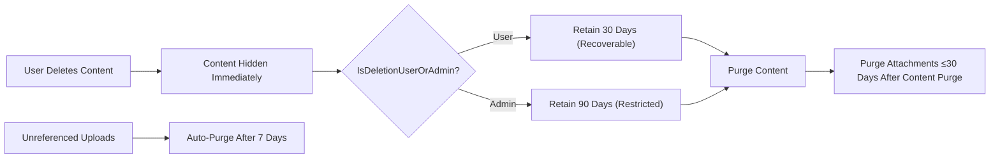
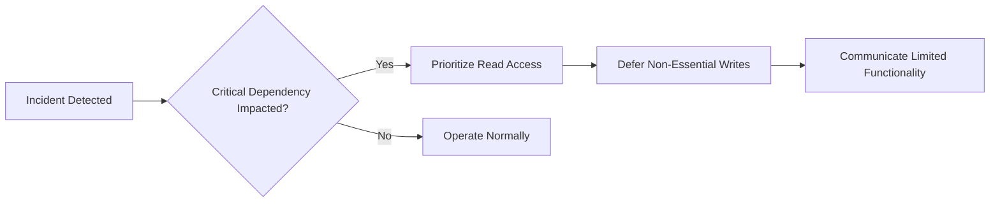

# civicBoard Non-Functional Requirements (Minimal, Business-Level)

## 1. Context and Scope
civicBoard enables simple economic/political discussion through posts (with optional image/file attachments) and text comments. Expectations in this document are business-level and technology-agnostic. All statements describe WHAT outcomes must be achieved, not HOW to implement them. No API specifications, database schemas, or stack choices are prescribed.

Actors considered: guest (reader of public content), user (registered member), admin (administrator). Attachments are evidence files associated to content; visibility follows the parent content’s visibility rules.

## 2. Purpose and Applicability
- THE civicBoard service SHALL use these non-functional requirements to guide delivery quality for performance, reliability, privacy/security, abuse prevention, retention/deletion, localization/timezone, auditability/observability, and accessibility.
- THE civicBoard service SHALL apply these requirements to all MVP features: browsing posts, viewing a post with comments, creating posts and comments, uploading attachments for posts, reporting content, and performing minimal moderation.
- THE civicBoard service SHALL express all user-facing behaviors in en-US and avoid technical implementation details in this specification.

## 3. Definitions and Assumptions
- Availability: proportion of time core capabilities are usable by intended actors, excluding scheduled maintenance.
- Latency percentiles: p50 (median) and p95 measured during normal operations on production traffic.
- RPO (Recovery Point Objective): maximum acceptable data loss interval measured in time.
- RTO (Recovery Time Objective): maximum acceptable time to restore service to core functionality.
- Attachment: an allowed image or document file associated to a post; visibility follows its parent.
- Normal load: traffic conditions at or below the stated throughput and concurrency targets.
- Timezone: business examples use Asia/Seoul; canonical records use UTC.

Assumptions:
- Public reading of published content is allowed.
- Comments are plain text in MVP (no attachments).
- Moderation is minimal (hide/delete); no complex workflows.

## 4. Performance and Capacity Targets
### 4.1 Latency (User-Centric)
- THE civicBoard service SHALL return the first page of newest posts within 800 ms at p95 and within 250 ms at p50 under normal load.
- THE civicBoard service SHALL return subsequent pages of post listings within 1,000 ms at p95 under normal load.
- THE civicBoard service SHALL return a single post with its first page of comments within 1,200 ms at p95 and within 400 ms at p50 under normal load.
- WHEN a user creates a post without attachments, THE civicBoard service SHALL confirm creation within 1,000 ms at p95 and within 300 ms at p50.
- WHEN a user creates a comment, THE civicBoard service SHALL confirm creation within 800 ms at p95 and within 250 ms at p50.
- WHEN a user initiates an attachment upload (permitted file types and sizes), THE civicBoard service SHALL acknowledge initiation within 400 ms at p95.
- WHEN an attachment up to the allowed size is submitted for processing, THE civicBoard service SHALL complete acceptance and basic processing within 15 seconds at p95.

### 4.2 Throughput and Concurrency
- WHERE normal traffic applies, THE civicBoard service SHALL sustain at least 30 requests per second for 10 continuous minutes without breaching the latency targets above.
- WHERE short-lived bursts occur, THE civicBoard service SHALL absorb bursts up to 60 requests per second for 1 minute with p95 latencies not exceeding targets by more than 20%.
- WHERE concurrent sessions are active, THE civicBoard service SHALL support at least 100 concurrently active users without breaching latency targets.

### 4.3 Pagination and Result Size
- THE civicBoard service SHALL provide stable pagination for lists and searches with a default page size that supports the latency targets stated above.
- WHERE cursor or token pagination is used, THE civicBoard service SHALL maintain consistent page boundaries for at least 2 minutes to minimize duplicates or gaps during normal browsing.

### 4.4 Idempotency and Duplicate Avoidance (Business-Level)
- WHEN a user submits a post or comment exactly once, THE civicBoard service SHALL create exactly one item even if the client retries within 30 seconds.
- IF a duplicate submission is detected within 30 seconds, THEN THE civicBoard service SHALL prevent duplicate creation and report success or non-creation in business terms.

## 5. Reliability and Availability
### 5.1 Availability & Maintenance
- THE civicBoard service SHALL achieve at least 99.5% monthly availability for core capabilities excluding announced maintenance.
- WHERE maintenance is scheduled, THE civicBoard service SHALL provide at least 72 hours notice and limit downtime windows to a cumulative 60 minutes per month.

### 5.2 Degradation and Prioritization
- IF a critical dependency degrades, THEN THE civicBoard service SHALL prioritize read access to public content and degrade non-essential features first (e.g., search indexing freshness, reaction counts if enabled).
- IF partial outage occurs, THEN THE civicBoard service SHALL maintain access to read operations where feasible and queue or temporarily reject non-essential writes with clear user guidance.

### 5.3 Data Durability and Recovery Objectives
- WHEN a user receives confirmation of content creation or update, THE civicBoard service SHALL ensure the content is durably stored.
- THE civicBoard service SHALL meet an RPO of 24 hours for user-generated content and an RTO of 4 hours to restore core read/write capabilities after a service-wide incident.

### 5.4 Capacity Headroom
- WHERE daily peaks occur, THE civicBoard service SHALL maintain at least 30% capacity headroom while meeting latency targets under normal load.

## 6. Security and Privacy (Minimal)
### 6.1 Authentication and Authorization Expectations
- THE civicBoard service SHALL require authentication for creating, editing, deleting, or reporting content and allow public reading of published content unless moderated.
- THE civicBoard service SHALL enforce least-privilege: users manage only their own content; admins can moderate and manage all content and accounts.

### 6.2 Data Minimization and Disclosure
- THE civicBoard service SHALL collect only minimal personal data required for operation (e.g., email, display name) and avoid collecting unnecessary sensitive data.
- THE civicBoard service SHALL avoid exposing personal emails or internal identifiers in public interfaces.

### 6.3 Protection Expectations (Business-Level)
- THE civicBoard service SHALL protect personal data and attachments at rest and in transit using industry-standard safeguards without prescribing specific technologies.
- THE civicBoard service SHALL avoid storing clear-text passwords or secrets and SHALL avoid logging secrets or attachment contents.

### 6.4 Safety and Abuse Content
- IF content is reported for safety reasons (e.g., harassment, doxxing, illegal content), THEN THE civicBoard service SHALL make the content promptly visible in admin review views for action per policy.

## 7. Abuse Prevention and Rate Limiting (Minimal)
- THE civicBoard service SHALL apply basic write rate limits to reduce spam: defaults of up to 5 posts per 30 minutes per user, up to 20 comments per 15 minutes per user, up to 10 attachment uploads per 10 minutes per user, and up to 10 reports per hour per user.
- WHEN failed login attempts reach 5 within 15 minutes, THE civicBoard service SHALL temporarily block further attempts until the window resets and communicate the retry time.
- WHERE scraping or abusive read access is suspected, THE civicBoard service SHALL throttle reads for the abusive source without impacting other users.
- WHEN limits are reached, THE civicBoard service SHALL communicate that the action is temporarily limited and indicate when the user may retry.

## 8. Content Retention and Deletion Policies
### 8.1 User-Initiated Deletion
- WHEN a user deletes own post or comment, THE civicBoard service SHALL immediately remove it from public view and retain it for 30 days as recoverable (business-level) before permanent purge.
- WHERE attachments are associated to user-deleted content, THE civicBoard service SHALL purge those attachments no later than 30 days after the related content purge.

### 8.2 Moderation Takedown
- WHEN content is removed by an admin due to violations, THE civicBoard service SHALL hide it immediately and retain it for 90 days for potential review before permanent purge unless required longer for an ongoing investigation.

### 8.3 Account Deletion
- WHEN a user requests account deletion, THE civicBoard service SHALL remove or anonymize personal data within 30 days.
- WHERE account deletion is processed, THE civicBoard service SHALL retain authored content in place with attribution changed to a neutral label (e.g., "Deleted User"), unless the user requests full content erasure consistent with policy and moderation constraints.

### 8.4 Orphaned/Unreferenced Attachments
- WHEN files are uploaded but never linked to a saved post, THE civicBoard service SHALL purge unreferenced files within 7 days.

### 8.5 Backups (Business-Level)
- THE civicBoard service SHALL retain backups sufficient to meet the RPO/RTO targets without prescribing backup technology.

### 8.6 Retention/Deletion Flow

## 9. Localization and Timezone
- THE civicBoard service SHALL operate in en-US for the minimal release.
- THE civicBoard service SHALL record authoritative timestamps in UTC and display times in the user’s local timezone where available.
- WHERE a timezone cannot be determined, THE civicBoard service SHALL default to Asia/Seoul for time displays.
- WHERE relative times are shown (e.g., "2 hours ago"), THE civicBoard service SHALL ensure consistency with the displayed local timezone.

## 10. Observability and Auditability (Minimal)
### 10.1 Audit Events
- THE civicBoard service SHALL record audit events for registration, login/logout, password changes, profile updates, post create/edit/delete, comment create/edit/delete, attachment upload/delete, content report submission, moderation actions, and account deletion requests/completions.

### 10.2 Audit Event Properties
- THE civicBoard service SHALL record for each audit event: event type, UTC timestamp, acting actor (guest/user/admin), target reference (if applicable), and outcome (success/failure) in business terms.
- THE civicBoard service SHALL restrict audit log access to admins and SHALL avoid storing secrets or attachment contents in logs.
- THE civicBoard service SHALL retain audit logs for at least 180 days and SHALL prevent modification of stored entries; deletions SHALL follow retention expiry or documented operational needs.

### 10.3 Operational Telemetry (Business-Level)
- THE civicBoard service SHALL measure latency p50/p95 for key user journeys (list posts, view post+comments, create post, create comment, upload attachment) and track availability to verify conformance with this specification.

## 11. Accessibility and UX Non-Functionals (Minimal)
- THE civicBoard service SHALL present concise, plain-language error messages stating the reason and corrective action without exposing internals.
- THE civicBoard service SHALL provide basic keyboard navigability expectations and readable contrast suitable for text-centric content at a minimal standard.
- THE civicBoard service SHALL ensure that attachment links and previews are usable by keyboard-only users and provide discoverable file names.

## 12. Operability and Change Management
- THE civicBoard service SHALL allow policy thresholds (e.g., limits, time windows, sizes) to be updated by admins without changing business intent.
- THE civicBoard service SHALL support safe rollout of policy changes by applying them to new actions while preserving the integrity of historical records.

## 13. Compliance and Legal (Minimal)
- THE civicBoard service SHALL prohibit illegal content and personal data disclosures (e.g., doxxing) and SHALL provide admins the means to remove such content promptly.
- THE civicBoard service SHALL provide privacy-respecting behavior for personal data consistent with the retention and anonymization rules stated herein.

## 14. Acceptance Criteria Summary (EARS)
### Performance
- WHEN browsing newest posts, THE civicBoard service SHALL return the first page in ≤800 ms at p95.
- WHEN opening a post with first-page comments, THE civicBoard service SHALL return content in ≤1,200 ms at p95.
- WHEN creating a post without attachments, THE civicBoard service SHALL confirm in ≤1,000 ms at p95.
- WHEN uploading a permitted attachment, THE civicBoard service SHALL complete acceptance within 15 seconds at p95.

### Reliability
- THE civicBoard service SHALL achieve ≥99.5% monthly availability (excluding scheduled maintenance announced ≥72 hours in advance).
- THE civicBoard service SHALL meet RPO ≤24 hours and RTO ≤4 hours for core capabilities.

### Security/Privacy
- THE civicBoard service SHALL require authentication for writes and SHALL enforce least-privilege editing/deleting.
- THE civicBoard service SHALL avoid exposing email addresses and internal identifiers publicly.

### Abuse Prevention
- WHEN write or login rate limits are exceeded, THE civicBoard service SHALL deny the action and indicate when to retry.
- WHERE abusive reads are detected, THE civicBoard service SHALL throttle the abusive source without impacting others.

### Retention/Deletion
- WHEN a user deletes content, THE civicBoard service SHALL hide immediately and purge after 30 days unless restored.
- WHEN an admin removes content, THE civicBoard service SHALL purge after 90 days unless needed for ongoing review.
- WHEN uploads are unreferenced for 7 days, THE civicBoard service SHALL purge them.

### Localization/Timezone
- THE civicBoard service SHALL use en-US and record timestamps in UTC; displays SHALL reflect user-local time or default to Asia/Seoul.

### Auditability/Observability
- THE civicBoard service SHALL capture audit events listed herein and retain them for ≥180 days.
- THE civicBoard service SHALL monitor latency and availability for conformance.

### Accessibility/UX
- THE civicBoard service SHALL present plain-language errors with corrective guidance and support basic keyboard-only use.

## 15. Diagram: Degradation Strategy (Conceptual)

## 16. Glossary
- Admin: Administrator with moderation and management powers.
- Attachment: Allowed image/document file associated to a post; inherits parent visibility.
- Availability: Portion of time core use cases are available to intended actors.
- p50/p95: Latency percentiles representing median and 95th percentile.
- RPO/RTO: Recovery objectives defining acceptable data loss window and restoration time.
- Normal Load: Traffic within baseline throughput and concurrency targets.
- UTC: Coordinated Universal Time used for canonical timestamps.
- Asia/Seoul: Default display timezone when a user’s timezone cannot be determined.
