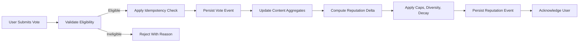
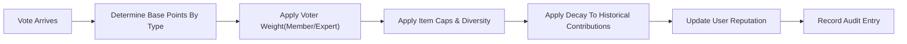
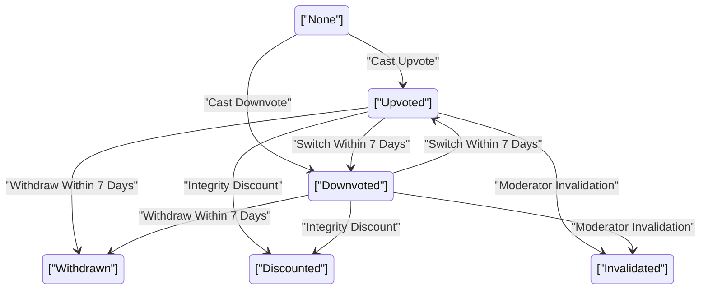

# econDiscuss — Voting, Reputation, and Voting History Requirements

## 1) Scope and Definitions
Voting evaluates the quality of posts and comments and produces a role- and time-aware reputation that influences discovery, privileges, and community trust. Definitions:
- Upvote: positive quality signal.
- Downvote: negative quality signal for quality/relevance breaches (not disagreement in good faith).
- Reputation: scalar score derived from received votes and governance outcomes, subject to decay, caps, and integrity rules.
- Verified Expert: member with verified expertise (see verification policy) whose votes carry greater weight.
- Brigading: coordinated voting to manipulate outcomes.
- Collusion ring: structured mutual boosting across accounts to game visibility or reputation.

EARS baseline:
- THE econDiscuss platform SHALL separate voting and reputation business logic from presentation, ensuring determinism and auditability.
- THE econDiscuss platform SHALL compute a single reputation score per account using the policies herein.

## 2) Roles and Permissions (Voting & Reputation Scope)
Roles: visitor, member, verifiedExpert, moderator, admin.

Permissions matrix (business actions):
- Read vote tallies on public content: visitor ✅, member ✅, verifiedExpert ✅, moderator ✅, admin ✅.
- Cast votes on eligible content: visitor ❌, member ✅, verifiedExpert ✅, moderator ✅, admin ✅.
- View own voting history: member ✅, verifiedExpert ✅, moderator ✅, admin ✅.
- Access others’ voting history: all roles ❌ (except aggregate counts visible publicly; see privacy rules).
- Configure reputation policies: admin ✅.
- Apply moderation overrides affecting reputation (e.g., invalidations): moderator ✅, admin ✅.

EARS:
- WHERE a user is unauthenticated, THE econDiscuss platform SHALL allow viewing of public vote aggregates but SHALL prohibit voting.
- WHERE a user has verifiedExpert role, THE econDiscuss platform SHALL apply expert weighting to their votes.
- WHEN moderator or admin actions alter vote validity, THE econDiscuss platform SHALL recompute affected reputation and content scores and record audit entries.

## 3) Voting Scope and Eligibility States
Content eligibility states: public, member-only, expert-only, locked, archived, soft-deleted, quarantined (integrity review).

EARS:
- WHEN content is public and not locked, THE econDiscuss platform SHALL allow one vote per eligible user per item.
- IF content is locked, archived, soft-deleted, or under quarantine, THEN THE econDiscuss platform SHALL disable new votes and preserve prior votes for audit.
- WHERE a thread is expert-only, THE econDiscuss platform SHALL restrict voting and participation to roles permitted by that mode.

## 4) Vote Types, Change Windows, Quotas, and Throttles
Vote types and semantics:
- Upvote (+1 base member weight), Downvote (−1 base member weight) on posts and comments.

Change and withdrawal:
- WHEN a user has not voted, THE econDiscuss platform SHALL allow a single upvote or downvote.
- WHEN a user has voted, THE econDiscuss platform SHALL allow switching or withdrawal for 7 days from first vote timestamp.
- IF the 7-day window has elapsed, THEN THE econDiscuss platform SHALL disallow changes unless a moderator reversal reopens changes for 24 hours.
- THE econDiscuss platform SHALL enforce idempotency by treating identical repeated submissions within 60 seconds as a single vote.

Visibility and privacy:
- THE econDiscuss platform SHALL show aggregate up/down counts to all viewers of public content and SHALL not reveal individual voter identities unless explicitly opted-in by the voter (see privacy).

Quotas and throttles:
- Daily content vote quota: 200 per account (24-hour rolling window); 400 for reputation ≥ 200.
- Downvote cap for low-reputation accounts: 25 per 24-hour rolling window for reputation < 50.
- Per-target throttle: no more than 3 votes on content authored by the same user within 10 minutes.

Velocity protections:
- IF a piece of content receives ≥ 10 downvotes in < 5 minutes, THEN THE econDiscuss platform SHALL throttle further downvotes to ≤ 1 per minute and mark for review.
- WHEN content is moderator-locked, THE econDiscuss platform SHALL block further votes and annotate the lock reason in audit.

Self- and block-interactions:
- THE econDiscuss platform SHALL prevent users from voting on their own content.
- WHERE users have blocked each other, THE econDiscuss platform SHALL prevent voting on each other’s content.

Performance:
- WHEN a vote is submitted, THE econDiscuss platform SHALL acknowledge within 250 ms at p95 under normal load and update aggregates visible within 3 seconds.

## 5) Reputation Model: Inputs, Weights, Caps, and Decay
Inputs (per event; before diversity/caps/decay):
- Upvote received on a post: +10 base points.
- Upvote received on a comment: +4 base points.
- Downvote received on a post: −4 base points.
- Downvote received on a comment: −2 base points.
- Verified Expert vote weight on incoming votes: ×3.
- Member vote weight on incoming votes: ×1.
- Moderator feature/curation event on a post: +30 one-time.
- Moderator removal for policy violation: −30 one-time.
- Appeal-upheld reversal: restore previously deducted points and remove linked penalties.

Caps and boundaries:
- Per-item lifetime gain cap: +300.
- Per-item lifetime loss cap: −100.
- Floor: 0; reputation SHALL not be negative.

Decay:
- Exponential decay half-life: 180 days for vote-derived contributions (evaluated daily at 00:00 UTC).
- WHERE content age exceeds 730 days, THE econDiscuss platform SHALL stop accruing new reputation from that item while continuing decay.

Diversity factor:
- WHERE > 60% of an item’s votes come from the same 10 accounts, THE econDiscuss platform SHALL reduce marginal contributions from subsequent votes via a diversity reduction factor.

Determinism and audit:
- THE econDiscuss platform SHALL process reputation updates atomically with vote acceptance and SHALL record immutable audit events for reputation-affecting changes.

Example:
- WHEN a verifiedExpert upvotes a member’s post, THE econDiscuss platform SHALL add +30 points (10 × 3) before caps, diversity, and decay.

## 6) Feature Unlocks from Reputation
Thresholds (initial policy):
- Create polls: reputation ≥ 100.
- Start expert-only thread: reputation ≥ 250 or verifiedExpert.
- Propose new topic taxonomy term: reputation ≥ 300 plus verifiedExpert in relevant domain (for proposal credibility; decision remains moderated).
- Remove new-user downvote cap: reputation ≥ 200.
- Elevated report weight (counts as 2): reputation ≥ 150.
- Access curation suggestion queue: reputation ≥ 400.

EARS:
- WHERE user reputation meets a threshold, THE econDiscuss platform SHALL grant the privilege immediately and log the grant.
- IF reputation later drops below a threshold due to decay or penalties, THEN THE econDiscuss platform SHALL revoke the privilege after a 24-hour grace period and log the revocation.

## 7) Abuse Detection, Anti-Gaming, and Moderator Overrides
Abnormal velocity:
- WHEN a content item receives ≥ 20 votes in ≤ 2 minutes from accounts with low mutual interaction history, THE econDiscuss platform SHALL mark it for brigading review and throttle to ≤ 1 vote/sec globally for that item.

Reciprocal voting and rings:
- WHEN two accounts exchange ≥ 15 votes each way within 48 hours and > 80% of their votes target each other, THE econDiscuss platform SHALL discount mutual votes to 0 and flag for review.
- WHERE clusters of ≥ 5 accounts exhibit cyclical boosting, THE econDiscuss platform SHALL suspend reputation accrual from those interactions pending investigation.

Sybil/sockpuppet signals:
- WHERE signals suggest common control (e.g., correlated activity windows), THE econDiscuss platform SHALL down-weight votes from the suspected set by 80% pending decision.

Downvote misuse:
- WHEN an account’s downvote:upvote ratio exceeds 4:1 over 7 days with low comment engagement, THE econDiscuss platform SHALL cap downvotes to 5/day for 72 hours.

Repeat offender policy:
- IF an account incurs 3 integrity violations within 30 days, THEN THE econDiscuss platform SHALL freeze reputation growth for 14 days and notify moderators.

Moderator actions:
- WHERE manipulation is confirmed, THE econDiscuss platform SHALL permanently exclude implicated votes and apply penalties per governance.
- WHERE appeals are upheld, THE econDiscuss platform SHALL restore excluded votes and reverse penalties.
- THE econDiscuss platform SHALL present neutral, non-identifying explanations for throttles or limits to affected users.

## 8) Voting History: Visibility, Filters, and Export
Visibility:
- THE econDiscuss platform SHALL display each user’s own voting history privately (posts and comments) and SHALL not expose individual vote choices to others unless the user opts in to public summaries.

Content of entries:
- THE econDiscuss platform SHALL include content identifier, author identifier, vote type, status (active/switched/withdrawn/discounted/invalidated), and timestamp in the user’s history.
- WHERE a vote is discounted or invalidated, THE econDiscuss platform SHALL annotate the reason category without revealing sensitive integrity details.

Filters and sort:
- THE econDiscuss platform SHALL support date range, content type, vote type, status filters and sort by newest/oldest.

Retention and export:
- THE econDiscuss platform SHALL retain personal voting history for ≥ 3 years and provide machine-readable export within 24 hours of a user request.

Change reflection:
- WHEN a user switches or withdraws within the allowed window, THE econDiscuss platform SHALL update the history entry with an event trail rather than deletion.

## 9) Data States, Error Handling, and Edge Cases
Vote states: none, upvoted, downvoted, withdrawn, discounted, invalidated.

EARS:
- IF the user attempts to vote on locked/deleted/quarantined content, THEN THE econDiscuss platform SHALL reject the vote with a clear reason.
- IF the user exceeds quotas, THEN THE econDiscuss platform SHALL reject the vote and communicate the reset time.
- IF the user attempts a self-vote, THEN THE econDiscuss platform SHALL reject with a rule explanation.
- IF repeated duplicate submissions occur within the idempotency window, THEN THE econDiscuss platform SHALL acknowledge once without double-counting.
- WHEN moderation reverses prior decisions, THE econDiscuss platform SHALL recompute reputation and content scores and record the event.

Author deletion/anonymization:
- WHERE an author deletes or is anonymized, THE econDiscuss platform SHALL retain content vote aggregates and reputation already accrued on surviving content; new votes SHALL cease on orphaned items.

Suspended voters:
- WHERE a voter is suspended, THE econDiscuss platform SHALL exclude their votes from new tallies during suspension and determine permanent exclusion based on moderator outcome.

Timezone:
- THE econDiscuss platform SHALL store vote timestamps in UTC and display them in the viewer’s profile timezone.

## 10) Performance, Throughput, and Freshness
- Vote submission acknowledgement: ≤ 250 ms p95 (≤ 500 ms p95 during peak events).
- Aggregate update visibility: ≤ 3 seconds p95.
- Reputation update: synchronous with acceptance or within 5 seconds using strongly consistent processing.
- Burst resilience: sustain ≥ 1,000 vote events/sec for 60 seconds without user-visible degradation beyond peak bounds.

EARS:
- THE econDiscuss platform SHALL meet or exceed the above latency and throughput targets under target scale assumptions.

## 11) Diagrams (Mermaid)
Voting flow:

Reputation update overview:

Vote state machine:

## 12) Compliance, Privacy, and Auditability
Privacy:
- THE econDiscuss platform SHALL keep individual vote choices private by default and SHALL only show aggregates; opt-in public summaries SHALL never expose timestamps or precise orderings.

Audit:
- THE econDiscuss platform SHALL maintain non-reversible audit logs of vote and reputation events for ≥ 3 years and SHALL record who/what/when/why for moderator/admin interventions.

Transparency:
- THE econDiscuss platform SHALL provide human-readable explanations for throttles/discounts without revealing sensitive signals.

## 13) Success Criteria and KPIs
Reliability and integrity:
- 100% deterministic, reconstructible reputation from audit logs.
- ≥ 90% brigading incidents detected and mitigated within 10 minutes of onset.

UX fairness and responsiveness:
- p95 submission acknowledgements and aggregate updates meet targets.
- New users can participate within safe guardrails; high-trust users gain proportionate influence.

Discovery impact:
- Vote-derived signals are available to discovery to improve ranking and trending while preserving privacy.

## 14) Acceptance Tests and Scenarios (EARS)
- WHEN a member with reputation 20 attempts 30 downvotes in 24 hours, THE econDiscuss platform SHALL cap allowed downvotes to 25 and deny the remainder with reset time.
- WHEN verifiedExpert X upvotes member Y’s post, THE econDiscuss platform SHALL add +30 to Y’s reputation before caps and decay.
- WHEN content Z receives 12 downvotes in 4 minutes, THE econDiscuss platform SHALL throttle further downvotes, mark for review, and continue to accept upvotes.
- WHEN two accounts exceed reciprocal voting thresholds within 48 hours, THE econDiscuss platform SHALL discount mutual votes to 0 and flag both for review.
- WHEN a suspended voter submits a vote, THE econDiscuss platform SHALL reject it with a suspension notice.
- WHEN a user withdraws a vote within 7 days, THE econDiscuss platform SHALL reflect "Withdrawn" status in history with prior event trail preserved.
- IF a moderator invalidates 50 votes on a post for manipulation, THEN THE econDiscuss platform SHALL recompute its aggregates and the author’s reputation and log the intervention.

## 15) Related Documents (Descriptive Links)
- Role capabilities and business-level authorization: see User Roles and Permissions for econDiscuss.
- Content types and authoring constraints: see Content Authoring Rules for Professional Quality.
- Expertise badge policy and privileges: see Expertise Verification Requirements.
- Discovery behaviors and trending signals: see Search, Discovery, and Trending Requirements.
- Poll integrity and visibility modes: see Polls and Economic Sentiment Requirements.
- Moderation, sanctions, and governance: see Moderation, Quality, and Governance Requirements.
- Non-functional privacy, security, and performance: see Privacy, Security, Performance, and Availability Requirements.
- Data lifecycle, retention, and exception handling: see Data Lifecycle and Exception Handling Requirements.
