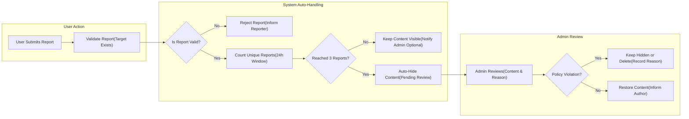
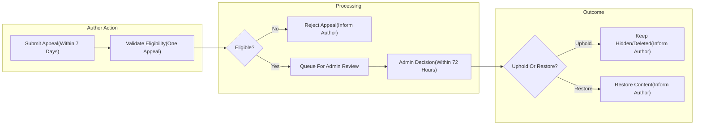

# civicBoard Business Rules

Concise, enforceable business rules for civicBoard, a straightforward economic/political discussion board where articles (posts) support image and file attachments. Requirements use EARS style and avoid technical implementation details.

## 1. Scope and Intent
- THE civicBoard service SHALL define clear, minimal rules governing posts, comments, and attachments for economic/political discourse.
- THE civicBoard service SHALL keep scope intentionally small to preserve simplicity and predictability.
- THE civicBoard service SHALL express business requirements only; implementation details remain at the development team’s discretion.

## 2. Definitions and Roles
- "User": Registered member who can create and manage own posts and comments.
- "Admin": Administrator who can moderate content and manage user access and policies.
- "Post": User-authored article consisting of a title, body, and optional attachments; publicly visible when published.
- "Comment": User-authored response to a post.
- "Attachment": Image or file uploaded and associated with a post. Comments do not support attachments in the minimal scope.
- "Report": User-submitted flag indicating a potential policy violation for a specific post or comment.
- "Hidden": Content not publicly visible but accessible to admins (and for authors, visibility policy disclosed where appropriate).
- "Deleted": Content removed from public view and not accessible to users; remains in administrative audit scope per policy.

Actors (informative):
- user (member): Create/read/update/delete own content; submit reports; manage own profile.
- admin (administrator): Moderate and remove content; handle reports; enforce sanctions; manage policies.

## 3. Guiding Principles
- THE civicBoard service SHALL foster civil, evidence-based discussion focused on economics and politics.
- THE civicBoard service SHALL prioritize clarity and consistent enforcement over breadth of features.
- THE civicBoard service SHALL minimize friction while maintaining safety and compliance.

## 4. Posting Rules (Topics, Duplicates, Edits)
### 4.1 Topic Scope and Relevance
- WHEN a user submits a post, THE civicBoard service SHALL require topical relevance to economics, politics, public policy, governance, or civic life.
- IF a post is primarily unrelated to these topics, THEN THE civicBoard service SHALL treat it as off-topic and eligible for moderation.
- WHERE borderline topics occur (e.g., technology, culture) that intersect with policy or economics, THE civicBoard service SHALL allow the post provided the body states the civic or economic implications.

### 4.2 Prohibited Categories (Content-Focused)
- IF a post contains direct threats of violence, THEN THE civicBoard service SHALL treat it as a severe violation and permit immediate admin takedown.
- IF a post contains doxxing (publishing private personal information without consent), THEN THE civicBoard service SHALL permit immediate takedown.
- IF a post contains targeted harassment or hate speech toward protected characteristics, THEN THE civicBoard service SHALL permit takedown.
- IF a post is commercial spam or unrelated promotional advertising, THEN THE civicBoard service SHALL permit removal.
- IF a post contains illegal content under applicable law, THEN THE civicBoard service SHALL allow immediate takedown and account escalation.

### 4.3 Titles and Bodies
- WHEN a user creates a post, THE civicBoard service SHALL require a title between 5 and 120 characters (inclusive) and a body between 1 and 20,000 characters (inclusive).
- THE civicBoard service SHALL treat whitespace-only titles or bodies as missing.
- IF a title or body violates length constraints, THEN THE civicBoard service SHALL reject submission with a clear limit message.

### 4.4 Duplicates
- WHEN a user submits a post, THE civicBoard service SHALL discourage near-duplicate topics created in the last 30 days.
- IF an admin determines a post substantially duplicates an earlier post with minimal new information, THEN THE civicBoard service SHALL allow marking as duplicate and optionally hiding it.
- WHERE a post is marked duplicate, THE civicBoard service SHALL retain author/admin visibility while directing readers to the earlier post where practical.

### 4.5 Edits and Updates
- WHEN a user publishes a post, THE civicBoard service SHALL allow the author to edit within 30 minutes of creation.
- IF the 30-minute window has elapsed, THEN THE civicBoard service SHALL block further author edits and permit admins to edit only for safety or policy enforcement.
- WHERE an edit occurs within the 30-minute window, THE civicBoard service SHALL limit to 3 edits per post and maintain an internal revision record for audit.

### 4.6 Deletion by Author
- WHEN a user requests deletion of own post, THE civicBoard service SHALL allow deletion within 15 minutes of creation if the post has no comments.
- IF comments exist or the 15-minute window has expired, THEN THE civicBoard service SHALL prevent author deletion and allow admins to hide upon review where appropriate.

### 4.7 Posting Frequency (Rate Limits)
- THE civicBoard service SHALL limit each user to at most 5 new posts per rolling 24-hour window.
- THE civicBoard service SHALL limit submissions to at most 1 post every 10 seconds per user to prevent bursts.

## 5. Commenting Rules (Limits, Time Windows)
### 5.1 Availability and Scope
- THE civicBoard service SHALL allow comments on published posts unless the post is locked or hidden by admins.
- WHERE a post is hidden or deleted, THE civicBoard service SHALL disallow new comments.

### 5.2 Comment Content and Length
- WHEN a user submits a comment, THE civicBoard service SHALL require a body between 1 and 2,000 characters (inclusive).
- IF a comment body exceeds 2,000 characters or is empty after trimming, THEN THE civicBoard service SHALL reject the submission with a clear message.
- THE civicBoard service SHALL apply prohibited categories in Section 4.2 to comments.

### 5.3 Comment Editing and Deletion by Author
- WHEN a user publishes a comment, THE civicBoard service SHALL allow the author to edit within 15 minutes of creation.
- IF 15 minutes have elapsed, THEN THE civicBoard service SHALL block further author edits and permit admins to edit only for safety or policy enforcement.
- WHEN a user requests deletion of own comment, THE civicBoard service SHALL allow deletion within 10 minutes of creation.

### 5.4 Comment Frequency and Flood Control
- THE civicBoard service SHALL limit each user to at most 50 comments per rolling 24-hour window.
- THE civicBoard service SHALL limit submissions to at most 1 comment every 5 seconds per user.

### 5.5 Attachments in Comments (Minimal Scope)
- THE civicBoard service SHALL disallow attachments in comments.

## 6. Attachment Rules (Allowed Types, Limits)
### 6.1 Eligibility and Association
- WHEN a user creates or edits a post within the allowed edit window, THE civicBoard service SHALL allow attaching files to that post.
- THE civicBoard service SHALL associate attachments only with posts; comments SHALL NOT accept attachments in the minimal scope.

### 6.2 Allowed Types
- THE civicBoard service SHALL allow image types: JPEG/JPG, PNG, GIF.
- THE civicBoard service SHALL allow document types: PDF, TXT.
- IF an attachment type is not in the allowed set, THEN THE civicBoard service SHALL reject the attachment and list allowed types.

### 6.3 Size and Count Limits
- THE civicBoard service SHALL limit image attachments to a maximum file size of 5 MB each.
- THE civicBoard service SHALL limit document attachments (PDF, TXT) to a maximum file size of 10 MB each.
- THE civicBoard service SHALL limit attachments to at most 5 per post.
- THE civicBoard service SHALL limit the total combined size of attachments on a post to 20 MB.
- IF any limit is exceeded, THEN THE civicBoard service SHALL reject the operation and state which limit was violated.

### 6.4 Safety and Inappropriate Media
- IF an image or file depicts illegal content or violates Section 4.2, THEN THE civicBoard service SHALL allow immediate admin takedown and record the event for audit.

## 7. Moderation Policies (Takedown, Appeals)
### 7.1 Reports and Auto-Hiding Threshold
- WHEN a post or comment receives 3 unique user reports within a rolling 24-hour window, THE civicBoard service SHALL auto-hide the content pending admin review.
- WHERE fewer than 3 unique reports exist, THE civicBoard service SHALL keep the content visible unless an admin intervenes.
- WHEN content is auto-hidden, THE civicBoard service SHALL notify admins and inform the author that a review is pending.

### 7.2 Admin Actions
- THE civicBoard service SHALL allow admins to hide, restore, or delete content to enforce policies.
- THE civicBoard service SHALL require admins to select a violation reason aligned with Sections 4.2 and 8.
- WHEN an admin takes an action, THE civicBoard service SHALL record the action, reason, and timestamp for audit.

### 7.3 Transparency to Authors
- WHEN content is hidden or deleted by admins, THE civicBoard service SHALL inform the author and provide the selected policy reason.
- WHERE content is auto-hidden due to reports, THE civicBoard service SHALL display to the author that the content is under review.

### 7.4 Appeals
- WHEN an author files an appeal of a moderation action, THE civicBoard service SHALL accept at most 1 appeal per action.
- THE civicBoard service SHALL require appeals to be submitted within 7 calendar days of the action.
- THE civicBoard service SHALL require admins to decide the appeal within 72 hours of receipt.
- WHEN an appeal is upheld, THE civicBoard service SHALL restore the content to its prior state.
- WHEN an appeal is denied, THE civicBoard service SHALL keep the content hidden or deleted and inform the author.

### 7.5 High-Severity Content
- IF content includes threats of violence, doxxing, or illegal content, THEN THE civicBoard service SHALL allow immediate removal without waiting for reports or appeals.

## 8. User Conduct Guidelines
- THE civicBoard service SHALL expect users to engage respectfully and argue ideas rather than individuals.
- THE civicBoard service SHALL prohibit targeted harassment, hate speech, threats of harm, doxxing, commercial spam, and illegal content.
- WHERE political persuasion is attempted, THE civicBoard service SHALL allow it provided it is non-deceptive and not spam.
- WHERE satire or hyperbole is used, THE civicBoard service SHALL allow it provided it does not cross into prohibited behaviors.

## 9. Enforcement Model (Strikes, Suspensions, Bans)
### 9.1 Strikes
- WHEN a user commits a non-severe violation per Sections 4.2 or 8, THE civicBoard service SHALL assign 1 strike.
- THE civicBoard service SHALL expire strikes after 90 days if no additional violations occur.

### 9.2 Suspensions and Bans
- WHEN a user accumulates 3 strikes within 90 days, THE civicBoard service SHALL suspend posting and commenting for 7 days.
- WHEN a user accumulates 5 strikes within 90 days, THE civicBoard service SHALL suspend posting and commenting for 30 days.
- IF a violation is severe under Section 7.5, THEN THE civicBoard service SHALL allow immediate account suspension or ban at admin discretion.

### 9.3 Evasion and Secondary Accounts
- IF evidence indicates ban evasion or the use of secondary accounts to bypass sanctions, THEN THE civicBoard service SHALL permit admins to extend suspensions or ban associated accounts.

## 10. Rate Limiting and Abuse Prevention
- THE civicBoard service SHALL enforce the following defaults unless updated by policy: maximum 5 posts per 24 hours per user; maximum 50 comments per 24 hours per user; minimum 10 seconds between posts; minimum 5 seconds between comments.
- THE civicBoard service SHALL limit reports to a maximum of 10 per 24 hours per user to prevent abuse.
- IF a user exceeds any configured limit, THEN THE civicBoard service SHALL block the action and display a message identifying the exceeded limit and approximate remaining wait time.

## 11. Time and Locale Considerations
- THE civicBoard service SHALL evaluate time windows and SLAs using the Asia/Seoul timezone unless configured otherwise.
- THE civicBoard service SHALL record and present times consistently to users for clarity in appeals and moderation timelines.

## 12. Business Rule Summary Table (Thresholds and Limits)

| Area | Rule | Value |
|------|------|-------|
| Post title | Length | 5–120 characters |
| Post body | Length | 1–20,000 characters |
| Post edits | Window | 30 minutes; max 3 edits |
| Post deletion by author | Window | 15 minutes if no comments |
| Post frequency | Rate | Max 5 per 24 hours; min 10 seconds between posts |
| Comment body | Length | 1–2,000 characters |
| Comment edits | Window | 15 minutes |
| Comment deletion by author | Window | 10 minutes |
| Comment frequency | Rate | Max 50 per 24 hours; min 5 seconds between comments |
| Attachments per post | Count | Max 5 |
| Total attachment size per post | Size | Max 20 MB |
| Image size | Size | Max 5 MB each |
| Document size | Size | Max 10 MB each |
| Allowed image types | Types | JPEG/JPG, PNG, GIF |
| Allowed document types | Types | PDF, TXT |
| Auto-hide threshold | Reports | 3 unique reports in 24 hours |
| Appeals | Limits | 1 per action; submit within 7 days; decision within 72 hours |
| Reports per user | Rate | Max 10 per 24 hours |
| Strike expiry | Time | 90 days without further violations |
| Suspension (3 strikes) | Duration | 7 days |
| Suspension (5 strikes) | Duration | 30 days |

## 13. Visual Flows (Mermaid)

### 13.1 Reporting to Moderation Flow

### 13.2 Appeals Handling Flow

## 14. Related Documents and Consistency
- For feature behaviors such as create/read/update/delete and reporting hooks, refer to the functional requirements in the descriptive document titled "Functional Requirements for civicBoard".
- For error outcomes, user messages, and recovery guidance, refer to "Exception Handling Rules for civicBoard".

## 15. Change Management
- THE civicBoard service SHALL allow policy thresholds (e.g., limits, windows, file sizes) to be updated by admins through designated policy settings without altering business intent.
- WHERE legal or safety considerations evolve, THE civicBoard service SHALL prioritize timely updates to prohibited content definitions while maintaining minimal scope.

## 16. Compliance Summary in EARS
- THE civicBoard service SHALL enforce topic relevance to economic/political discourse.
- THE civicBoard service SHALL prohibit threats, doxxing, hate speech, spam, and illegal content.
- WHEN users post, THE civicBoard service SHALL enforce character, attachment type, size, and count limits.
- WHEN users comment, THE civicBoard service SHALL enforce character and frequency limits; comments SHALL NOT accept attachments.
- WHEN content is reported by 3 unique users in 24 hours, THE civicBoard service SHALL auto-hide pending admin review.
- WHEN admins act, THE civicBoard service SHALL record moderation reasons and notify authors of outcomes.
- WHEN authors appeal within 7 days, THE civicBoard service SHALL decide within 72 hours and apply the outcome.
- THE civicBoard service SHALL apply strikes and suspensions per thresholds and expire strikes after 90 days.
- THE civicBoard service SHALL evaluate time-based rules using Asia/Seoul timezone by default.
