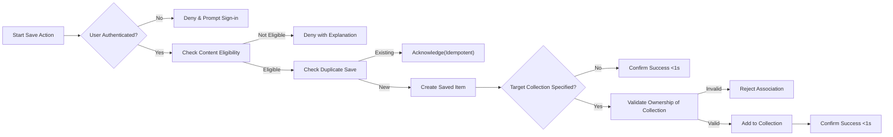
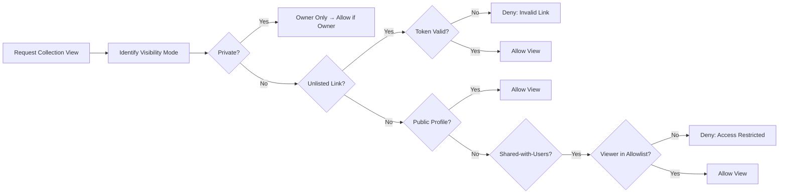
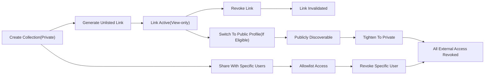

# econDiscuss Bookmarks & Collections Requirements

## 1. Introduction and Scope
The econDiscuss platform provides professional-grade personal knowledge curation through bookmarks (saved items) and collections (folders). The capability enables members to save posts, comments, polls, and live threads, organize them into collections, annotate with private notes, and share selected collections under strict privacy controls. Requirements are expressed in business terms using EARS, with measurable limits, quotas, and performance SLAs. No technical implementation details (APIs, schemas, protocols) are specified here.

In scope:
- Saving eligible content items and managing duplicate saves idempotently.
- Organizing saved items into collections; attaching private notes.
- Privacy defaults and share modes: Private, Unlisted Link, Public Profile, Shared-with-Users.
- Bulk management, retention, export, and auditability.
- Error handling, concurrency/conflict handling, performance targets, acceptance criteria.

Out of scope:
- UI layouts and visual design decisions.
- Database schemas, API payloads, storage engines, or provider choices.

Constraints and principles:
- Privacy by default; sharing is explicit, reversible, and minimally permissive.
- Professional tone and non-intrusive behavior; never notify content authors about bookmarks.
- Consistency with roles, moderation, privacy, and non-functional requirements across the platform.

## 2. Terminology and Entities
- Bookmark (Saved Item): A private reference from an owner to eligible content for later retrieval.
- Collection: A user-defined grouping of saved items, with independent visibility settings.
- Personal Note: A private annotation attached by the owner to a saved item (owner-only visibility).
- Owner: The member who created the bookmark or collection.
- Eligible Content: Posts, comments, polls, live discussion threads (and message permalinks where exposed by policy).
- Visibility Modes: Private (default), Unlisted Link, Public Profile, Shared-with-Users (allowlist).
- Tombstone: A neutral placeholder for references to content that became unavailable.

EARS definitions:
- THE econDiscuss platform SHALL treat saved items as private by default and SHALL only change visibility through collection-level sharing controls.
- WHERE a saved item references content later removed or restricted, THE econDiscuss platform SHALL retain a tombstoned reference visible to the owner.

## 3. Roles and Permissions (Business)
Roles: visitor, member, verifiedExpert, moderator, admin (definitions in roles document).

Permission matrix (summary): visitors cannot save or view private areas; members and above can save, organize, annotate, and share their own collections; moderators/admins can force-unshare collections under governance, but have no access to owners’ private bookmarks absent sharing or policy justification.

Selected EARS requirements:
- WHEN a visitor attempts to save content, THE econDiscuss platform SHALL deny the action and prompt authentication.
- WHERE a user is authenticated (member or above), THE econDiscuss platform SHALL allow saving eligible content subject to rate limits and quotas.
- WHEN a user attempts to access another user’s private collection or saved items without a granted share, THE econDiscuss platform SHALL deny access with a generic message that avoids confirming existence.
- WHERE a moderator or admin applies a governance action to force-unshare a collection, THE econDiscuss platform SHALL immediately revoke share links and record an audit entry with reason.

## 4. Save and Bookmark Scenarios
Scope of saving:
- Users can save eligible content for later access.
- Duplicate saves for the same owner/content are idempotent.
- Users can save items without assigning to a collection (implicit “Unsorted” view).

EARS requirements — Saving:
- WHEN an authenticated user saves eligible content, THE econDiscuss platform SHALL create a saved item owned by that user and confirm success within 1 second (P95).
- THE econDiscuss platform SHALL prevent duplicate saved items for the same owner/content by treating repeated saves as idempotent success.
- IF the content is ineligible (no stable permalink or prohibited type), THEN THE econDiscuss platform SHALL deny the save with an explanatory reason.
- IF the content becomes restricted and the owner no longer has view rights, THEN THE econDiscuss platform SHALL deny new saves and explain that access is required.
- WHEN a save specifies a target collection, THE econDiscuss platform SHALL add the saved item to that collection if owned by the saver; otherwise, it SHALL return a clear ownership error.

Removal:
- WHEN an owner removes a saved item, THE econDiscuss platform SHALL delete the bookmark association and remove it from all collections owned by the user.
- IF a removal request targets a non-existent saved item, THEN THE econDiscuss platform SHALL respond that no action was taken.

Notifications policy:
- THE econDiscuss platform SHALL NOT notify content authors when their content is bookmarked.
- THE econDiscuss platform SHALL provide owners optional in-app notifications for export readiness or share revocation confirmations only.

## 5. Collections and Personal Notes
Collections behavior:
- Collections group saved items; a saved item may appear in multiple collections owned by the same user.
- Collections are single-level; no nesting in MVP.
- Default visibility: Private.

EARS — Collections:
- WHEN a user creates a collection with a unique name (per owner), THE econDiscuss platform SHALL create it as Private by default.
- IF a user attempts to create a duplicate-named collection within their account, THEN THE econDiscuss platform SHALL reject with a duplicate-name message.
- WHEN a user renames a collection, THE econDiscuss platform SHALL apply the name everywhere it appears for that owner.
- WHEN a user deletes a collection, THE econDiscuss platform SHALL remove only the grouping and SHALL NOT delete underlying saved items.
- THE econDiscuss platform SHALL allow the same saved item to be assigned to up to 20 collections per owner.

Personal notes:
- Notes are always private to the owner and never appear in shared views or exports intended for other users.

EARS — Notes:
- WHEN an owner adds or edits a note on a saved item, THE econDiscuss platform SHALL store it such that only the owner can view it.
- IF a shared collection contains items with notes, THEN THE econDiscuss platform SHALL exclude notes from all shared views and public exports.
- WHEN a saved item is removed, THE econDiscuss platform SHALL delete the associated note.

Validation rules:
- Collection name: 1–64 characters; Unicode allowed; trim leading/trailing whitespace; no control characters.
- Collection description (optional): up to 256 characters.
- Personal note: up to 2,000 characters; plain text with basic formatting.
- Limits: max 200 collections/user; max 10,000 saved items/user; max 2,000 items per collection view; max 20 collection assignments per saved item.

## 6. Privacy Defaults and Sharing Options
Principles:
- Bookmarks are private by default; sharing is explicit, revocable, and logged.
- Sharing affects the collection wrapper only; the underlying saved items remain owned by the sharer and private otherwise.

Visibility modes:
- Private (default): owner-only.
- Unlisted Link: anyone with the link can view; revocable token-based access; view-only.
- Public Profile: discoverable from the owner’s profile; available only where reputation≥200 or role is verifiedExpert; view-only.
- Shared-with-Users: allowlist of specific accounts; view-only.

EARS — Sharing:
- THE econDiscuss platform SHALL default all new collections to Private.
- WHEN a user generates an Unlisted Link, THE econDiscuss platform SHALL create a revocable, non-guessable tokenized link.
- WHEN a user revokes an Unlisted Link, THE econDiscuss platform SHALL immediately invalidate the link across all access paths.
- WHERE reputation≥200 or role is verifiedExpert, THE econDiscuss platform SHALL allow setting a collection to Public Profile; otherwise, it SHALL deny with an explanation.
- WHEN sharing with specific users, THE econDiscuss platform SHALL enforce allowlist-only access and SHALL log grants and revocations.
- IF a viewer lacks access, THEN THE econDiscuss platform SHALL deny with a generic access message without confirming the collection’s existence.
- WHEN visibility is tightened (e.g., Public→Private), THE econDiscuss platform SHALL immediately enforce the new restrictions, invalidating prior links.

Sensitive content protections:
- THE econDiscuss platform SHALL forbid embedding private notes or non-public PII in shared views.
- THE econDiscuss platform SHALL suppress thumbnails or previews that could leak private information from restricted content.

Access logging:
- THE econDiscuss platform SHALL log aggregate access counts for Unlisted links and per-user access for Shared-with-Users mode (owner-visible list of grantees only).

## 7. Bulk Actions and Management
Supported owner bulk actions:
- Add/remove selected saved items to/from collection(s).
- Remove bookmarks en masse.
- Merge collections (owner-owned only).
- Export selected items or entire collections.

EARS — Bulk operations:
- WHEN an owner executes a bulk action, THE econDiscuss platform SHALL apply the action atomically per item and return a per-item success/failure summary.
- IF any selected saved item is missing, THEN THE econDiscuss platform SHALL skip it and record a “not found” outcome in the summary.
- WHEN merging collections, THE econDiscuss platform SHALL consolidate assignments and retain the older collection’s visibility unless the owner chooses otherwise.
- WHEN deleting a collection, THE econDiscuss platform SHALL remove only the grouping and SHALL retain all underlying saved items.

## 8. Retention, Deletion, and Export
Retention:
- Bookmarks and collections persist until deleted by the owner or removed by policy.
- Saved items referencing unavailable content persist as tombstones with neutral messaging.

Deletion & recovery:
- THE econDiscuss platform SHALL allow owners to delete saved items and collections at any time.
- WHEN a collection is deleted, THE econDiscuss platform SHALL immediately invalidate all associated shares and tokens.

Export:
- Owners can export saved items and collections for personal archiving (privacy-preserving).
- Exports include item metadata (title, type, canonical link), saved timestamp, collection memberships, and owner’s notes; no third-party PII beyond public metadata.

EARS — Retention & export:
- THE econDiscuss platform SHALL retain tombstoned references when underlying content is unavailable, without exposing restricted data.
- WHEN an owner requests export, THE econDiscuss platform SHALL prepare the export within 24 hours and notify the owner when ready.
- WHERE export size exceeds thresholds, THE econDiscuss platform SHALL run asynchronously and provide a time-limited download link.
- WHEN a user deletes their account, THE econDiscuss platform SHALL delete all bookmarks, collections, notes, and share tokens owned by the user during account deletion.

## 9. Business Rules, Quotas, and Validation
Rules and quotas (per owner unless stated):
- Saves: up to 60 save actions/min.
- Sharing: up to 20 new share links/day.
- Exports: up to 3 export requests/day.
- Merges: up to 10 collection merges/day.
- Quotas: max 10,000 saved items/user; max 200 collections/user; max 2,000 items per collection view.

EARS:
- IF a user exceeds rate limits, THEN THE econDiscuss platform SHALL reject the action and present the reset window.
- IF a user exceeds quotas, THEN THE econDiscuss platform SHALL deny the action and recommend cleanup steps.
- WHEN timestamps are shown, THE econDiscuss platform SHALL present them in the owner’s preferred timezone.

## 10. Error Handling, Concurrency, and Edge Cases
Common errors and behaviors:
- Signed-out save attempt: deny and prompt sign-in.
- Ineligible content: deny with reason (no permalink, disallowed type).
- Ownership mismatch on collection association: deny and state ownership requirement.
- Duplicate save: idempotent success; do not create duplicates.
- Duplicate collection name: reject with duplicate-name message.
- Access revoked (Unlisted link): deny with “invalid link” without confirming existence.
- Public collection item removed by policy: show remaining accessible items; tombstone unavailable ones without leaking details.
- Concurrency: last-write-wins for name/description; merge operations follow deterministic rules.

EARS:
- IF a share token is invalid or expired, THEN THE econDiscuss platform SHALL deny access without disclosing existence.
- IF a viewer attempts to write to a shared collection, THEN THE econDiscuss platform SHALL deny the action and indicate read-only status.
- IF moderation hides underlying content, THEN THE econDiscuss platform SHALL update shared views to tombstone affected items without exposing private/restricted data.

## 11. Performance and Responsiveness SLAs
Targets (P95 under normal load):
- Save/un-save operations: ≤ 1 second.
- List saved items (first page, 20 items): ≤ 1.5 seconds.
- Add/remove item to/from collection: ≤ 1 second (single item); ≤ 3 seconds (bulk ≤ 50 items).
- Export preparation: ≤ 2 minutes for ≤ 5,000 items; asynchronous for larger datasets with notification on completion.
- Share revocation: immediate effect across all access paths.

EARS — Performance:
- THE econDiscuss platform SHALL meet or exceed the P95 latency targets above.
- WHERE bulk actions involve up to 50 items, THE econDiscuss platform SHALL complete them within 3 seconds P95.

## 12. Auditing, Transparency, and Compliance
- Access logging: per-user access logging for Shared-with-Users; aggregate counts for Unlisted; no PII in public views.
- Owner control: owner can review grantees (for Shared-with-Users) and revoke at any time.
- Privacy-by-default: no public list of “who bookmarked this”; aggregate counts may be computed without exposing identities.
- Data subject rights: exports and deletions align with platform privacy timelines.

EARS:
- WHEN a collection is made Public or Unlisted, THE econDiscuss platform SHALL record an auditable event with timestamp, actor, and mode.
- WHEN a force-unshare occurs for policy reasons, THE econDiscuss platform SHALL record the reason and actor in an audit log and notify the owner.

## 13. Mermaid Diagrams (Key Flows)

### 13.1 Save Flow (Eligibility, Idempotency, Optional Collection)

### 13.2 Collection Sharing Access Check

### 13.3 Sharing Lifecycle (Create, Revoke, Tighten)

## 14. Acceptance Criteria and Test Scenarios
Functional scenarios:
- WHEN a signed-out visitor clicks “Save,” THEN the system SHALL deny and prompt sign-in.
- WHEN a member saves the same post twice, THEN the system SHALL acknowledge success both times but create only one saved item.
- WHEN a member assigns a saved item to two collections, THEN both collections SHALL list the item, and removing it from one SHALL not remove it from the other.
- WHEN an owner sets a collection to Public Profile without eligibility (reputation<200 and not expert), THEN the system SHALL deny with an eligibility message.
- WHEN an owner revokes an Unlisted Link, THEN all subsequent attempts using that link SHALL be denied within 1 second.
- WHEN content referenced by a saved item is removed by moderation, THEN the saved item SHALL show a tombstone without leaking restricted details.
- WHEN a bulk add-to-collection action targets 40 items, THEN the operation SHALL complete within 3 seconds (P95) and return a per-item summary.
- WHEN a user requests export of 5,000 saved items, THEN the export SHALL be prepared within 2 minutes or proceed asynchronously with notification when ready.

Privacy and auditing:
- WHEN a collection visibility changes to any shared mode, THEN an audit entry SHALL be recorded with actor, previous mode, new mode, and timestamp.
- WHEN a Shared-with-Users grant is added or removed, THEN the grantee list visible to the owner SHALL update immediately.

Performance:
- WHEN listing the first page (20 items) of saved items, THEN response time SHALL be ≤ 1.5 seconds at P95 under normal load.

Error handling:
- IF a share token is malformed or expired, THEN access SHALL be denied with a neutral message.

## 15. Dependencies and Relationships
- Roles and permissions: see [User Roles and Permissions (Business Rules)](./03-econDiscuss-user-roles-permissions.md).
- Privacy, security, and performance envelopes: see [Non-Functional Requirements](./14-econDiscuss-nonfunctional-privacy-security-performance.md).
- Moderation and governance (force-unshare, policy holds): see [Moderation, Quality, and Governance](./13-econDiscuss-moderation-quality-governance.md).
- Content authoring limits (attachments, formatting, citations): see [Content Authoring Rules](./05-econDiscuss-content-authoring-rules.md).
- Data lifecycle (tombstones, account deletion): see [Data Lifecycle and Exception Handling](./15-econDiscuss-data-lifecycle-exception-handling.md).

## 16. Business-Only Scope Statement
This specification describes WHAT econDiscuss must do for bookmarks and collections in business terms using EARS. Technical implementation details (architecture, APIs, databases) are intentionally out of scope and left to the development team’s discretion.
