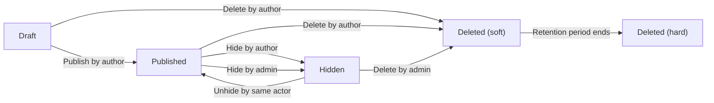
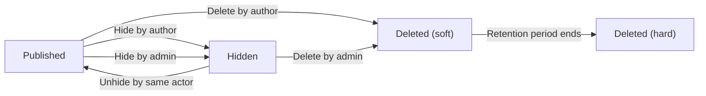
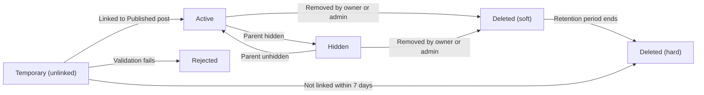
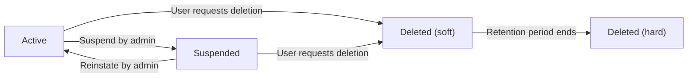

# civicBoard Data and Content Lifecycle (Business Requirements)

## Scope and Intent
Defines the minimal, business-level lifecycle behavior for civicBoard, a simple economic/political discussion board. Specifies which states exist, how content moves between states, what time windows and retention periods apply, and how moderation affects visibility. Excludes technical implementation details (schemas, APIs, storage, infrastructure). Requirements are expressed in natural language for developers and stakeholders to share a single, testable understanding.

Covers:
- Posts and comments
- Attachments (images/files) on posts only in minimal scope
- Account states and deletion requests

Does not cover:
- Database designs, API endpoints, payload schemas, or infrastructure
- UI layouts or client-side specifics beyond business behavior

## Definitions and Terminology
- Post: A top-level discussion entry authored by a registered user; contains a title, body, and optional attachments.
- Comment: A textual response attached to a specific post; comments do not support attachments in the minimal release.
- Attachment: An image or file uploaded by a user and linked to a post (not to comments in minimal scope).
- Draft: A non-public post saved by the author for later publishing.
- Published: A publicly visible piece of content.
- Hidden: A non-public state used to temporarily remove content from public view without deleting it; reversible.
- Deleted (soft): Removed from user access but retained for a policy-defined retention period.
- Deleted (hard): Permanently removed after the retention period; not recoverable.
- Owner: The user who authored the post/comment or uploaded the attachment.
- Admin: An administrator with authority to moderate content and manage user accounts.

## Content States Overview
- Draft (posts only): Not visible to others; allows later publishing.
- Published: Visible to all readers unless moderated or removed.
- Hidden: Removed from public view; can be restored to Published.
- Deleted (soft): Removed from public view and queued for permanent deletion after retention.
- Deleted (hard): Irreversibly removed following retention expiration.

## Post Lifecycle
### State Definitions and Transitions
- Draft: Created by an author. Can be edited, published, or deleted.
- Published: Publicly visible. May be edited within a short window, hidden by owner/admin, or deleted.
- Hidden: Not publicly visible. May be unhidden back to Published or deleted.
- Deleted (soft): Not publicly visible; retained for a period before permanent removal.
- Deleted (hard): Permanently removed after retention.

### Edit Window and Ownership
- A short edit window exists to allow small corrections after publishing.
- Ownership allows the author to hide or delete their own posts unless administrative policies prevent it (e.g., legal hold).

### Retention and Hard Deletion
- Soft-deleted posts are permanently removed after the retention period.
- Hidden posts do not auto-delete; a subsequent action is required to delete or restore.

### EARS Requirements (Posts)
- THE civicBoard SHALL provide post states of Draft, Published, Hidden, Deleted (soft), and Deleted (hard).
- WHEN an author saves a new post without publishing, THE civicBoard SHALL store it as Draft.
- WHEN an author publishes a draft post, THE civicBoard SHALL set the state to Published and make it visible to all readers.
- WHEN an author hides a published post, THE civicBoard SHALL set the state to Hidden and remove it from public visibility.
- WHEN an admin hides a published post for moderation, THE civicBoard SHALL set the state to Hidden and remove it from public visibility.
- WHEN the actor who applied Hidden requests restoration, THE civicBoard SHALL return the post to Published.
- WHEN an author deletes a post from any non-hard-deleted state, THE civicBoard SHALL set the state to Deleted (soft).
- WHEN a post remains in Deleted (soft) beyond the retention period, THE civicBoard SHALL remove it as Deleted (hard).
- WHERE a legal or policy hold applies, THE civicBoard SHALL prevent hard deletion until the hold is lifted.
- WHILE a post is Published, THE civicBoard SHALL allow the author to edit within a 30-minute window from publish time.
- IF an edit is attempted after the edit window, THEN THE civicBoard SHALL reject the edit and advise creating a new post or requesting admin assistance.
- WHILE a post is Hidden, THE civicBoard SHALL disallow new comments by non-admins and allow restoration by the authorized actor.

### Mermaid Diagram: Post Lifecycle

## Comment Lifecycle
### State Definitions and Transitions
- Published: Created as Published and visible immediately under a Published post.
- Hidden: Can be hidden by the author or admin; not publicly visible until unhidden.
- Deleted (soft): Can be deleted by the author or admin; retained for a period before permanent removal.
- Deleted (hard): Permanently removed after retention.

### Edit Window
- A short edit window exists to correct minor issues after posting.

### Parent Post Impact
- Hidden Post: Comments remain in their intrinsic states but are not publicly visible while the post is Hidden.
- Deleted Post: Comments move to Deleted (soft) with the post and follow the same retention behavior.

### EARS Requirements (Comments)
- THE civicBoard SHALL provide comment states of Published, Hidden, Deleted (soft), and Deleted (hard).
- WHEN a user creates a comment on a Published post, THE civicBoard SHALL set the comment state to Published and display it immediately.
- WHEN a comment author hides the comment, THE civicBoard SHALL set the state to Hidden.
- WHEN an admin hides a comment, THE civicBoard SHALL set the state to Hidden.
- WHEN the actor who applied Hidden requests restoration, THE civicBoard SHALL restore the comment to Published.
- WHEN a comment is deleted by the author or admin, THE civicBoard SHALL set it to Deleted (soft).
- WHEN a comment remains in Deleted (soft) beyond retention, THE civicBoard SHALL remove it as Deleted (hard).
- WHILE a comment is Published, THE civicBoard SHALL allow the author to edit within a 15-minute window from posting.
- IF an edit is attempted after the 15-minute window, THEN THE civicBoard SHALL reject the edit and advise posting a new comment or requesting admin assistance.
- WHEN a post is Hidden, THE civicBoard SHALL prevent new comments by non-admin users.
- WHEN a post is Deleted (soft), THE civicBoard SHALL move all its comments to Deleted (soft) as part of the same operation.

### Mermaid Diagram: Comment Lifecycle

## Attachment Lifecycle (Posts Only)
### Attachment Types and Minimal Constraints (Business Terms)
- Allowed types: Images (JPEG/JPG, PNG, GIF); Documents (PDF).
- Maximum size per file: 10 MB.
- Maximum count per post: Up to 5 attachments.
- Comments do not support attachments in the minimal release.

### States and Linking Behavior
- Temporary (unlinked): An uploaded file not yet linked to any post; not publicly visible; subject to automatic expiration if not used.
- Active: A linked attachment on a Published post; publicly visible where its parent is visible.
- Hidden: An attachment whose parent post is Hidden; not publicly visible.
- Deleted (soft): An attachment removed by the post owner or admin; retained for a period before permanent removal.
- Deleted (hard): An attachment permanently removed after retention.
- Rejected: A file refused due to business constraints (type, size, count); never becomes Active.

### Parent-Driven Visibility
- Parent visibility controls attachment visibility. IF the parent is Hidden or Deleted (soft), THEN attachments are not publicly visible; IF the parent returns to Published, THEN attachments become publicly visible again.

### Retention and Orphan Handling
- Temporary (unlinked) uploads expire automatically if not linked within a short window.
- Soft-deleted attachments follow the same retention period as their parent content.
- IF a parent is Deleted (soft) or Deleted (hard), THEN linked attachments follow the same transition in the same operation.

### EARS Requirements (Attachments)
- THE civicBoard SHALL allow attachments of images (JPEG/JPG, PNG, GIF) and documents (PDF) on posts only in the minimal release.
- IF an uploaded file exceeds the size or count limits, THEN THE civicBoard SHALL reject the upload and provide a clear reason to the user.
- WHEN a user uploads a file but does not link it to a post, THE civicBoard SHALL mark it as Temporary (unlinked).
- WHEN a Temporary (unlinked) file remains unused for 7 days, THE civicBoard SHALL delete it and make it unavailable to users.
- WHEN a parent post is Published, THE civicBoard SHALL set linked attachments to Active and make them visible together with the parent.
- WHEN a parent post is Hidden, THE civicBoard SHALL make linked attachments non-publicly visible without altering their linkage.
- WHEN a parent post moves to Deleted (soft), THE civicBoard SHALL move all linked attachments to Deleted (soft) in the same operation.
- WHEN a parent post moves to Deleted (hard), THE civicBoard SHALL permanently remove all linked attachments.
- IF an attachment is removed by the post owner or admin, THEN THE civicBoard SHALL move the attachment to Deleted (soft) and apply the retention policy.

### Mermaid Diagram: Attachment Lifecycle (Posts Only)

## Account Lifecycle and Deletion Requests
### Account States
- Active: A registered user in good standing.
- Suspended: Temporarily restricted due to policy or abuse; cannot create or modify content while suspended.
- Deleted (soft): Account scheduled for removal; retains linkages for a retention period.
- Deleted (hard): Account permanently removed after the retention period.

### Effects on Existing Content
- Anonymization: Account deletion does not automatically delete posts/comments. Existing content remains to preserve conversation context, but public attribution changes to a neutral label such as "Deleted user".
- Optional Cleanup: The user can manually delete their own posts/comments prior to requesting account deletion if they wish to remove content.

### Retention and Recovery
- Soft-deleted accounts are recoverable within the retention window if the user changes their mind or an admin lifts the status.

### EARS Requirements (Accounts)
- THE civicBoard SHALL provide account states of Active, Suspended, Deleted (soft), and Deleted (hard).
- WHEN an account is placed in Suspended state, THE civicBoard SHALL prevent the user from creating or modifying posts, comments, or attachments.
- WHEN a user requests account deletion, THE civicBoard SHALL set the account to Deleted (soft) and start the retention period.
- WHEN an account remains in Deleted (soft) beyond retention, THE civicBoard SHALL remove the account as Deleted (hard).
- WHEN an account moves to Deleted (soft), THE civicBoard SHALL anonymize the public attribution of existing posts and comments to a neutral label.
- WHERE a user manually deletes their content before requesting account deletion, THE civicBoard SHALL apply the standard content deletion lifecycle to that content.
- IF legal or policy constraints require preservation, THEN THE civicBoard SHALL delay hard deletion until constraints are lifted.

### Mermaid Diagram: Account Lifecycle

## Cross-Cutting Lifecycle Rules
- Ownership and Permissions: Authors manage their own content within allowed windows; admins can intervene for moderation. Business permissions are defined separately and must be enforced consistently with these lifecycles.
- Moderation Precedence: Admin actions (e.g., hide) supersede author actions; the stricter visibility action applies until an admin restores or deletes.
- Atomic Transitions: State changes for a parent and its attachments SHALL occur atomically from a business perspective to avoid contradictory visibility.
- Timestamps and Time Windows: Time windows (edit periods, retention durations) are measured from the business event time (publish, hide, delete). Display time zones do not change lifecycle semantics.
- Attachment Coupling: Attachment visibility and deletion follow the parent post’s state changes automatically.
- Minimalist Policy: Only the states described here are used in the minimal release; no additional intermediate states.

## Retention Durations (Business Guidance)
- Post edit window: 30 minutes from publish.
- Comment edit window: 15 minutes from publish.
- Temporary (unlinked) attachment expiration: 7 days from upload if not linked.
- Soft-deleted content retention: 30 days from deletion before hard deletion.
- Account deletion retention: 30 days from request before hard deletion.

## Related Documents
For operational quality expectations that influence lifecycle timing and user experience, refer to the Non-Functional Requirements for civicBoard.

Business-only statement: Defines WHAT must happen in each lifecycle; technical implementation details (architecture, databases, APIs, storage, infrastructure) remain at the discretion of the development team.