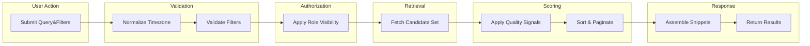
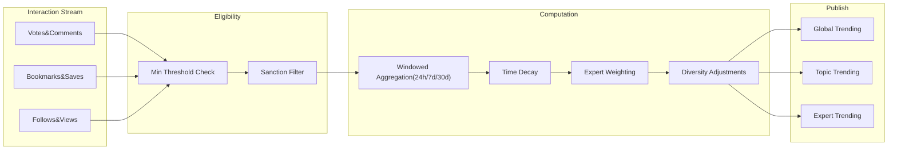

# econDiscuss Search, Discovery, and Trending Requirements

## 1) Overview and Scope
Enable high-signal discovery of economics content through robust search, quality-sensitive trending, and fair recommendations. Behaviors must be explicit, testable, and aligned with professional discourse goals.

Scope includes:
- Search over public content types (posts, comments, polls, live discussion threads where discoverable) with rich filters and sorts.
- Role-aware discovery behavior, including expert-only and expert-first views.
- Trending computation using quality, expertise, and diversity signals within rolling time windows.
- Recommendations and feed placements that balance followed sources, topic subscriptions, and platform-wide quality signals.
- Accessibility features, performance/freshness targets, integrity protections, privacy thresholds, and acceptance tests.

Out of scope:
- UI layout, styling, wireframes.
- Database schemas, APIs, algorithmic internals, transport/protocol choices.

Related requirements:
- Roles and permissions (business-level): see [User Roles and Permissions](./03-econDiscuss-user-roles-permissions.md).
- Content authoring, tags/citations: see [Content Authoring Rules](./05-econDiscuss-content-authoring-rules.md).
- Reputation and votes: see [Voting, Reputation, and History](./07-econDiscuss-voting-reputation-history.md).
- Poll integrity and visibility: see [Polls and Sentiment](./10-econDiscuss-polls-sentiment.md).
- Live and notifications: see [Realtime & Notifications](./11-econDiscuss-realtime-notifications-live.md).
- Personalization: see [Follow, Subscribe, and Feeds](./12-econDiscuss-follow-subscribe-feeds.md).
- Governance: see [Moderation, Quality, Governance](./13-econDiscuss-moderation-quality-governance.md).
- NFRs: see [Privacy, Security, Performance](./14-econDiscuss-nonfunctional-privacy-security-performance.md).

## 2) Domain Definitions and Assumptions
- Content types: posts, comments, polls/surveys, and discoverable live discussions.
- Roles: visitor, member, verifiedExpert, moderator, admin.
- Reputation: numeric score derived from platform quality signals (see voting and reputation).
- Topics/tags: curated taxonomy with optional free-form tags (policy-bound) used for filtering and routing.
- Timezone: All date-range filters and window displays use the user’s profile timezone; defaults to UTC when unspecified.
- Privacy: Discovery never exposes private data; expert-only visibility and moderation states follow role and policy.

EARS framing
- THE econDiscuss platform SHALL apply the user’s configured timezone to date-range filters, trend windows, and result timestamps.
- THE econDiscuss platform SHALL exclude private or restricted content from results for users lacking permission.
- WHERE a content item is under moderation lock or sanction, THE econDiscuss platform SHALL apply discovery visibility rules from governance policies.

## 3) Role-Based Access in Discovery Scope
Permission overview (business-level):
- visitor: search and view public content; no member-only or expert-restricted views.
- member: all visitor capabilities plus role-permitted content; save searches; subscribe to topics.
- verifiedExpert: all member capabilities plus expert-only filtering and access to expert-focused discovery surfaces.
- moderator/admin: visibility into policy-relevant flags, queues, and restricted content per governance.

EARS
- WHERE a user lacks permission for a filter or result, THE econDiscuss platform SHALL not show the filter and SHALL exclude restricted items from counts and results.
- WHEN a user applies an “expert-only” filter without sufficient role, THE econDiscuss platform SHALL deny the filter and present an eligibility explanation.

## 4) Search: Filters, Sorts, and Query Semantics
### 4.1 Filters
Supported filters:
- Keyword (title/body/captions)
- Author (handle or display name, if public)
- Role (expert-only; moderator/admin where policy permits)
- Topic/tag (AND/OR within category)
- Date range (absolute start–end; relative: Last 24h/7d/30d/YTD/Past year)
- Content type (posts, comments, polls, live discussions)
- Reputation threshold (min author reputation and/or min post score)
- Engagement attributes (has poll, has attachments, has citations, has link preview)
- Exclusions (authors, tags, domains)
- Language/locale (if content tagged)

EARS
- THE econDiscuss platform SHALL support the above filters and combine multiple filters with logical AND; OR is supported within specific filter categories (e.g., tags).
- WHEN exclusions are set (author, tag, domain), THE econDiscuss platform SHALL ensure excluded entities do not appear in results or facets.
- WHERE a filter references a nonexistent entity (author or tag), THE econDiscuss platform SHALL present a validation error and suggest available alternatives.

Validation rules
- Author must be an existing visible identity; blocked or muted authors never appear unless explicitly unmuted.
- Topic/tag filters must reference active taxonomy entries; deprecated tags are migrated or suggested.
- Absolute date ranges must satisfy start ≤ end after timezone normalization.
- Reputation thresholds must be non-negative integers within policy bounds.

### 4.2 Sorts
Supported sorts:
- Relevance (default when keyword present)
- Newest (publish time desc)
- Top (time-windowed: 24h, 7d, 30d)
- Most discussed (comment velocity)
- Expert-weighted score (emphasizes expert engagement)
- Expert-curated (placement from curated lists; policy-governed)

EARS
- THE econDiscuss platform SHALL provide the above sorts and require an explicit window for Top when selected; default window Last 7d.
- WHERE Expert-curated is selected, THE econDiscuss platform SHALL source results from policy-governed curated lists created by moderators/admins or verified experts with curation privilege and SHALL label curated placement.

### 4.3 Query Semantics
- Case-insensitive; diacritics-insensitive where language allows.
- Phrase queries with quotes; boolean AND/OR/NOT in supported, documented form.
- Spelling tolerance with suggestions.

EARS
- THE econDiscuss platform SHALL treat keywords case-insensitively and provide diacritics-insensitive matching where applicable.
- WHEN query syntax is invalid or unsupported, THE econDiscuss platform SHALL return a clear error and show examples of supported syntax.
- WHEN a query yields zero results, THE econDiscuss platform SHALL offer spelling suggestions and relaxed variants (e.g., broaden date range, remove exclusions).

## 5) Expert-Focused Discovery
Modes and visibility:
- Expert-only threads: contributions limited to verifiedExpert, moderator, admin; readable per policy.
- Expert-first: expert comments prioritized for an initial window (e.g., first 12 hours) before widening.

EARS
- WHERE content is marked expert-only, THE econDiscuss platform SHALL restrict contributions to eligible roles and reflect mode in results metadata.
- WHEN the user selects expert-only in filters, THE econDiscuss platform SHALL return only content authored by verified experts or belonging to expert-only threads.
- WHERE expert-first mode is active, THE econDiscuss platform SHALL elevate a verifiedExpert comment to the first visible slot when present and permitted.

## 6) Date Range and Content-Type Handling
EARS
- WHEN an absolute date range is applied, THE econDiscuss platform SHALL validate and convert the range using the user’s timezone, enforcing start ≤ end.
- THE econDiscuss platform SHALL provide relative presets aligned to the user’s timezone and indicate which preset is active.
- THE econDiscuss platform SHALL allow independent inclusion/exclusion of content types; unavailable types for the user’s role SHALL be hidden.

## 7) Trending: Definitions, Windows, and Integrity
### 7.1 Surfaces
- Global trending
- Topic-level trending
- Expert trending (emphasizes verifiedExpert engagement)

EARS
- THE econDiscuss platform SHALL compute and publish separate lists for global, topic, and expert trending for 24h, 7d, and 30d windows.

### 7.2 Eligibility and Signals
Eligibility baseline:
- Minimum interaction threshold per window (illustrative):
  - 24h window: ≥ 10 unique participants AND ≥ 20 total quality interactions (weighted votes + comments + bookmarks)
  - 7d window: ≥ 25 unique participants AND ≥ 60 total quality interactions
  - 30d window: ≥ 50 unique participants AND ≥ 150 total quality interactions
- Exclusions: content under sanction/lock; content with active integrity quarantine pending review.

Signals considered (business-level):
- Velocity of quality interactions (upvotes, comments, bookmarks), expert-weighted.
- Freshness/recency of publication and interactions.
- Author reputation and prior sustained quality.
- Diversity of engagement (unique accounts across roles and geographies where available), diminishing returns if concentrated.
- Content completeness (citations, structured formatting) as a minor boost.
- Poll participation rates and stability (for polls), subject to anti-gaming rules.

EARS
- THE econDiscuss platform SHALL include only items meeting minimum eligibility thresholds for the selected window.
- WHILE the window is active, THE econDiscuss platform SHALL apply time decay so recent interactions contribute more than older interactions.
- IF a content item is sanctioned or under high-confidence integrity quarantine, THEN THE econDiscuss platform SHALL exclude it from trending until cleared.
- WHERE engagement concentration is high (e.g., >60% from the same 10 accounts), THE econDiscuss platform SHALL reduce marginal influence of additional interactions from those accounts.

### 7.3 Anti-Gaming
EARS
- IF a content item receives ≥ 20 interactions within 2 minutes from low-reputation or new accounts, THEN THE econDiscuss platform SHALL down-weight or quarantine those signals pending review.
- WHERE near-duplicate content exists within a window, THE econDiscuss platform SHALL allow only one representative to trend per topic unless curated by policy.
- WHERE integrity review clears quarantined signals, THE econDiscuss platform SHALL restore influence within 5 minutes and annotate last-computed time.

## 8) Recommendations and Feed Placement
Surfaces:
- Home feed (personalized)
- Discover page (exploratory)
- Topic pages (topic-centric)
- Expert highlights view

Signals for recommendations:
- Follow graph, topic subscriptions, recent interactions (privacy-preserving aggregates), content similarity by topics/citations, expertise alignment, freshness, and author reputation.

Constraints and controls:
- Diversity limits (avoid repetitive sources); freshness bias; suppression of muted/blocked sources; safety and policy exclusions; opt-out personalization.

EARS
- WHERE a user follows a topic or author, THE econDiscuss platform SHALL prioritize relevant items in the Home feed subject to diversity and safety constraints.
- WHILE composing a feed, THE econDiscuss platform SHALL enforce diversity such that no more than 2 consecutive items share the same author.
- WHERE personalization is disabled, THE econDiscuss platform SHALL serve non-personalized trending/recent lists.
- WHEN a user marks an item “not interested,” THE econDiscuss platform SHALL reduce reappearance likelihood for a cooling period.

## 9) Accessibility and Result Quality Signals
- Misspelling tolerance; snippets containing query terms; alt-text indicators where images present; clear labels for polls and expert badges; edited/locked/under review indicators per role visibility.

EARS
- WHEN zero results occur, THE econDiscuss platform SHALL offer spelling suggestions and facet relaxations.
- WHERE an author is a verified expert, THE econDiscuss platform SHALL show an expert badge and relevant domains in results.
- IF a post includes citations, THEN THE econDiscuss platform SHALL show a citation-present indicator in search result metadata.

## 10) Performance, Freshness, and SLA Expectations
Targets (business-level; see platform NFRs for global objectives):
- Search results: 2 seconds P50, 3 seconds P95 for common queries.
- Trending and recommendation freshness: visible within 5 minutes of significant interaction changes (24h/7d windows); within 60 seconds on 24h lists where feasible.
- Indexing: new/updated content discoverable within 2 minutes under normal load.

EARS
- THE econDiscuss platform SHALL return search results within 2 seconds for common queries (P50) and 3 seconds for 95% of requests.
- THE econDiscuss platform SHALL reflect significant ranking changes in trending within 5 minutes and annotate computed-at time.
- THE econDiscuss platform SHALL make newly published content discoverable within 2 minutes under normal operation.

## 11) Error Handling and Recovery
Common errors: invalid date ranges, unknown tags/authors, unsupported operators, exceeded query length, permission denials, throttling.

EARS
- IF a date range is invalid, THEN THE econDiscuss platform SHALL return a validation error referencing timezone normalization rules with examples.
- IF a filter references a nonexistent or deprecated entity, THEN THE econDiscuss platform SHALL return a clear error and suggest alternatives.
- IF a user lacks permission for a filter or result, THEN THE econDiscuss platform SHALL return a permission error without leaking restricted data.
- IF request rates exceed limits, THEN THE econDiscuss platform SHALL throttle and present retry-after timing.

## 12) Abuse Prevention, Privacy, and Integrity Protections
- Query rate limits per user/IP to deter scraping; suppression of filter combinations that may reveal sensitive patterns; exclusion of sanctioned content from rankings; protection of voting anonymity.

EARS
- THE econDiscuss platform SHALL apply rate limits to discovery requests per policy and present neutral throttling messages.
- IF a selected filter combination risks exposing sensitive cohort patterns, THEN THE econDiscuss platform SHALL block the query and suggest generalized alternatives.

## 13) Privacy, Transparency, and User Control
- Personalization opt-out; “why am I seeing this?” explanations for recommended items; no exposure of individual vote identities; k-thresholds for segmented poll result snippets in discovery.

EARS
- WHERE personalization is disabled, THE econDiscuss platform SHALL provide transparent labels indicating non-personalized ordering.
- WHEN explaining recommendations, THE econDiscuss platform SHALL cite non-sensitive signals such as followed topics, recent interactions, or expert engagement.

## 14) Analytics, Telemetry, and Success Metrics
Discovery success measures (privacy-preserving aggregates): search satisfaction rate, zero-result rate, discovery CTR, dwell time on recommended items, diversity index, expert exposure rate, trend freshness adherence.

EARS
- THE econDiscuss platform SHALL collect aggregate metrics required to evaluate discovery quality and publish internal scorecards quarterly.

## 15) Diagrams (Mermaid)
### 15.1 Search Request and Ranking Flow

### 15.2 Trending Computation Overview

## 16) Acceptance Criteria and Testable Scenarios
Search filters and sorts
- WHEN a member searches keyword “inflation expectations” with topic="Monetary Policy", type=posts, date=Last 30d, THEN results SHALL include only posts in that topic from the last 30 days, default sort by relevance.
- WHEN a verifiedExpert selects “Expert-only” filter, THEN results SHALL include only content authored by verified experts or within expert-only threads.
- WHEN a visitor searches with author filter targeting a private profile, THEN the system SHALL return no results and message that the author is not discoverable.

Trending windows and integrity
- WHEN content receives ≥ 40 weighted interactions with ≥ 15 unique participants within 24h and no sanctions, THEN it SHALL be eligible for 24h trending subject to window decay and diversity checks.
- IF engagement is driven by multiple new low-reputation accounts created within 48h, THEN the system SHALL down-weight or quarantine their influence.
- IF a post is sanctioned or locked, THEN it SHALL be removed from all trending surfaces immediately.

Recommendations and feed placement
- WHEN a user follows “Labor Economics” and bookmarks wage-related posts, THEN the Home feed SHALL prioritize reputable, fresh items in that topic while enforcing source diversity and honoring mutes/blocks.
- WHERE personalization is disabled, THEN the Discover page SHALL show global/topic-level trending without using personal signals and SHALL indicate “Non-personalized.”

Error handling and performance
- IF an absolute date range is provided with end before start, THEN the system SHALL return a validation error referencing timezone conversion.
- WHEN a new post is published, THEN it SHALL be searchable within 2 minutes under normal conditions.
- WHEN a trending surge occurs for a 24h window, THEN relevant lists SHALL reflect changes within 5 minutes and display computed-at time.

## 17) Glossary (Selected)
- Expert-first: A mode where expert comments are elevated for an initial window before general participation is emphasized.
- Diversity factor: A diminishing-returns adjustment reducing influence when engagement concentrates among a small set of accounts.
- Eligibility threshold: Minimum activity needed before an item can be considered for trending in a given window.
- Quality interactions: Weighted engagement actions (votes, comments, bookmarks) that contribute to discovery signals.

Business-only statement
All requirements herein are expressed in natural language for business behaviors and testability. No API, schema, or transport details are specified. Technical implementation is at the development team’s discretion, consistent with platform-wide policies and documents referenced above.