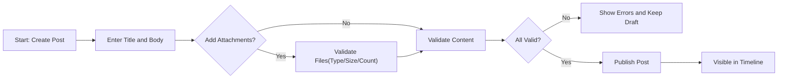
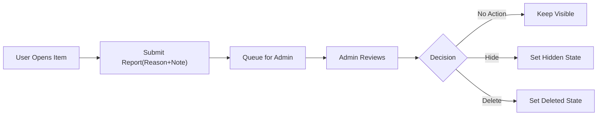
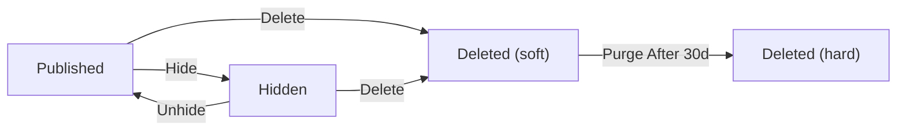

# civicBoard Minimal Requirements (Business-Focused)

## Vision and Scope
A simple discussion board focused on economic and political topics that supports article posts with image and file attachments. Emphasis is on minimal features, civility, and predictable behavior. Complexity is intentionally avoided to keep usage and implementation straightforward.

Goals
- Enable registered members to publish posts (articles) with optional attachments to support evidence-based discussion.
- Enable readers to comment on posts.
- Allow visitors to browse published content without signing in (configurable), while requiring authentication for writing and reporting.
- Provide minimal reporting and administrative moderation to keep discourse safe and on-topic.

Out of Scope (MVP)
- Rich text formatting beyond plain text and line breaks
- Threaded/nested comments
- Direct messaging or real-time chat
- Advanced search and filters; tags or categories
- Reactions/likes, bookmarks, or follows
- Complex notification systems

## Actors
- Guest: Unauthenticated visitor who can browse published content when public read is enabled.
- User: Authenticated member who can create and manage own posts and comments and report content.
- Admin: Administrator who can moderate content and manage reports; can hide or delete any content.

## Core Capabilities (Business)
- Posts: Title + body with optional image/file attachments; public when published.
- Comments: Flat, text-only comments under a post.
- Attachments: Images and files associated to posts; governed by size/type/count limits; follow parent visibility.
- Browsing: Read-optimized lists ordered by recency with simple pagination.
- Reporting and Moderation: Minimal report flow and admin actions (hide/delete) to keep the board safe.

## Functional Requirements (EARS)

### Posts
- THE civicBoard SHALL allow authenticated users to create posts with a title and body.
- THE civicBoard SHALL require title length between 1 and 120 characters and body length between 1 and 20,000 characters.
- THE civicBoard SHALL publish valid posts immediately and display them in the timeline ordered by newest first.
- WHEN an author edits own post within 30 minutes of publish and inputs meet limits, THE civicBoard SHALL save the update and record an updated timestamp.
- IF an author edits own post after 30 minutes, THEN THE civicBoard SHALL deny the edit and explain that the edit window expired.
- WHEN an author deletes own post, THE civicBoard SHALL remove it from public listings immediately and mark it Deleted.
- WHEN an admin hides a post, THE civicBoard SHALL remove it from public visibility and mark it Hidden until a decision is made.
- WHILE a post is Hidden, THE civicBoard SHALL prevent new comments by non-admin users on that post.
- THE civicBoard SHALL list posts in pages of 20 items ordered newest-first.

### Comments
- THE civicBoard SHALL allow authenticated users to create comments on published posts using plain text.
- THE civicBoard SHALL require comment body length between 1 and 5,000 characters.
- WHEN an author edits own comment within 15 minutes, THE civicBoard SHALL save the update and record an updated timestamp.
- IF an author edits own comment after 15 minutes, THEN THE civicBoard SHALL deny the edit and explain that the edit window expired.
- WHEN an author deletes own comment, THE civicBoard SHALL replace the visible content with a placeholder to preserve conversation continuity.
- WHILE a post is Hidden or Deleted, THE civicBoard SHALL block new comments by non-admin users on that post.

### Attachments (Posts Only)
- THE civicBoard SHALL allow image and file attachments on posts only; comments SHALL NOT accept attachments in the minimal release.
- THE civicBoard SHALL allow up to 5 attachments per post.
- THE civicBoard SHALL limit each attachment to a maximum size of 10 MB and the total combined size per post to 25 MB.
- THE civicBoard SHALL allow image types JPEG, PNG, and GIF; and document type PDF for the minimal release.
- IF any attachment exceeds size, count, or type limits, THEN THE civicBoard SHALL reject only the failing attachment(s) and explain the applicable limit.
- WHEN a post is Hidden, THE civicBoard SHALL restrict access to its attachments to admin and the author; WHEN a post is Deleted, THE civicBoard SHALL prevent non-admin access to its attachments.

### Reporting and Moderation
- THE civicBoard SHALL allow authenticated users to report a post or comment and select a reason from a short list with an optional note up to 500 characters.
- WHEN a report is submitted, THE civicBoard SHALL add the item to an admin review queue and record the reporter and reason.
- WHEN an admin decides, THE civicBoard SHALL apply one of: No Action, Hide, or Delete and record the decision with timestamp and admin identity.
- WHEN content is Hidden, THE civicBoard SHALL remove it from public listings and item views while preserving it for admin and author visibility.

### Browsing and Pagination
- THE civicBoard SHALL present a list of published posts ordered by newest-first in pages of 20.
- WHEN opening a post, THE civicBoard SHALL show the title, body, attachments, author display name, publication time, and comments in a consistent order (oldest-first by default).
- IF an item is not available (e.g., removed), THEN THE civicBoard SHALL show a not-available outcome and link back to the list.

## Authentication and Authorization (Business)
- THE civicBoard SHALL require authentication for creating, editing, deleting, or reporting content; reading published content may be allowed to guests when public-read is enabled.
- THE civicBoard SHALL enforce ownership: users may edit or delete only their own posts and comments; admins may moderate any content.
- WHILE an account is suspended, THE civicBoard SHALL deny content creation and management operations and explain the restriction.
- THE civicBoard SHALL represent authenticated sessions in a way that enables role- and ownership-aware authorization decisions without exposing technical details to users.

## Workflows (Conceptual)

Post creation with attachments

Report and moderation flow

## Business Rules and Limits
- Post title: 1–120 characters; Post body: 1–20,000 characters; Comments: 1–5,000 characters.
- Post edit window: 30 minutes; Comment edit window: 15 minutes; number of edits is not separately limited in MVP beyond windows.
- Attachments: up to 5 per post; each ≤10 MB; total ≤25 MB per post; types JPEG/PNG/GIF/PDF.
- Rate limits: up to 5 posts per user per 24 hours; up to 50 comments per user per 24 hours; minimum 10 seconds between posts and 5 seconds between comments.
- Reporting: one report per user per item; predefined reasons include Spam, Harassment, Hate Speech, Misinformation, Off-topic, Other.
- Visibility coupling: attachments follow parent post visibility at all times.

EARS enforcement excerpts
- WHEN limits are exceeded, THE civicBoard SHALL prevent submission and specify which limit was violated.
- WHEN content is Hidden, THE civicBoard SHALL prevent non-admin commenting on that content.
- WHEN a post is Deleted, THE civicBoard SHALL prevent non-admin access to its attachments.

## Error and Exception Outcomes
- Validation failure: identify each failed field and rule; preserve entered text and accepted files in the current session.
- Authentication required: deny write/report actions and request sign-in.
- Permission denied: deny modifications by non-owners and explain ownership rule.
- Not available: treat hidden or deleted items as unavailable to non-admin users.
- Rate limited: deny action and indicate earliest retry time based on the relevant window.
- Partial attachment failure: accept valid files and reject invalid ones with reasons; do not publish broken references.

EARS error statements
- WHEN a post body exceeds 20,000 characters, THE civicBoard SHALL reject the submission and state the maximum allowed.
- WHEN a guest attempts to create a comment, THE civicBoard SHALL deny the action and require sign-in.
- IF the target post is Hidden or Deleted, THEN THE civicBoard SHALL deny new comments and state that the post is unavailable.
- WHEN upload includes a sixth file, THE civicBoard SHALL reject the extra file and state the 5-file limit.

## Non-Functional Expectations (Minimal)
- Latency: list timeline p95 ≤ 1,000 ms; open post with first-page comments p95 ≤ 1,200 ms; create post/comment confirmation p95 ≤ 2,000 ms under normal load.
- Availability: monthly availability ≥ 99.5% excluding scheduled maintenance.
- Privacy and safety: collect minimal personal data (e.g., email, display name); never expose email publicly; avoid logging secrets or attachment contents.
- Auditability: record business-level audit events for post/comment create/edit/delete, attachment upload/remove, report submission, and admin moderation actions; restrict audit access to admins.

## Content Lifecycle (Business)
- States: Published, Hidden, Deleted (soft), Deleted (hard).
- Transitions (posts): Published → Hidden (by admin or author), Hidden → Published (by same actor), Published/Hidden → Deleted (soft) (by owner or admin), Deleted (soft) → Deleted (hard) after retention.
- Transitions (comments): Published → Hidden (by author or admin), Hidden → Published (by same actor), Published/Hidden → Deleted (soft), Deleted (soft) → Deleted (hard) after retention.
- Retention: soft-deleted content is purged after 30 days; unlinked uploads are purged after 7 days.
- Attachment coupling: attachments mirror parent state for visibility and deletion timing.

Lifecycle sketch

## Success Criteria and Acceptance (Consolidated)
- WHEN a valid post is created with 0–5 allowed attachments (each ≤10 MB, total ≤25 MB), THE civicBoard SHALL publish it and display it in the timeline ordered newest-first within typical response times.
- WHEN a valid comment is created on a published post, THE civicBoard SHALL display it under the post in oldest-first order by default.
- WHEN a report is submitted with a valid reason, THE civicBoard SHALL record it and make it visible to admins for review; WHEN an admin acts, THE civicBoard SHALL apply the chosen state and record an audit entry.
- WHEN limits (length, count, size, rate) are violated, THE civicBoard SHALL reject the action and identify the specific violated rule.

## Glossary
- Author: The creator of a post or comment.
- Published: Visible to all readers (subject to public-read configuration).
- Hidden: Temporarily removed from public view; visible to admins and the author.
- Deleted (soft): Removed from public view with retention for a limited period.
- Deleted (hard): Permanently removed after the retention period.
- Attachment: Image or file linked to a post that follows the post’s visibility.
- Report: A user-submitted signal requesting admin review of potentially inappropriate content.
