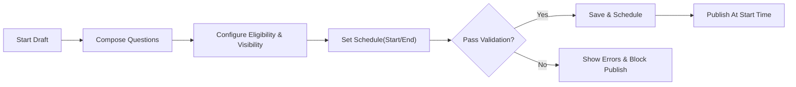
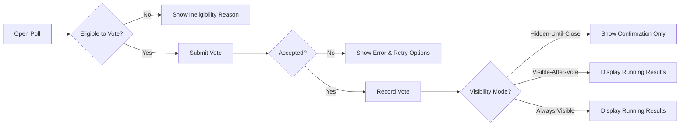
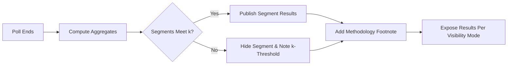
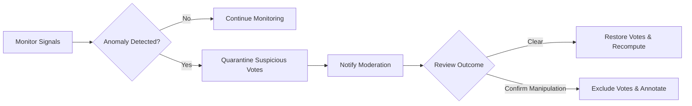

# econDiscuss – Polls and Economic Sentiment Requirements

The poll and survey capability enables structured, privacy-preserving collection of economic sentiment and expectations from the community. It supports both single-question polls and multi-question surveys, with options for expert-only participation and segmented, anonymous reporting. The feature prioritizes methodological integrity, protects users from manipulation and deanonymization, and integrates with reputation, moderation, notifications, and discovery.

## 1) Overview and Scope
Scope includes:
- Creating, editing, scheduling, running, and closing polls/surveys.
- Configuring eligibility (e.g., expert-only), anonymity, and result visibility.
- Casting, changing, and withdrawing votes where permitted.
- Computing, segmenting, and publishing aggregate results.
- Integrity protections, rate limits, and anti-brigading measures.
- Audit and transparency requirements aligned with platform policies.

Out of scope:
- UI layouts or visual design.
- API schemas or database designs.
- Transport- or protocol-level details for realtime updates.

## 2) Business Glossary
- Poll: A single-question instrument with a configured response type.
- Survey: A multi-question instrument composed of 2–10 questions, each with a supported type.
- Question: A prompt with a standard type, options/scale, and validation rules.
- Vote/Response: A user’s recorded answer to a poll/survey question.
- Anonymous: No other user can view who voted what; only aggregates are published.
- Segmented Results: Aggregates broken out by role or other allowed cohorts, subject to privacy thresholds.
- k-Minimum Threshold: The minimum number of responses required in a segment before any data for that segment is shown (default k=10 unless otherwise stated).
- Brigading: Coordinated or inorganic voting intended to bias results.
- Reputation: A platform score reflecting contribution quality; used to gate capabilities.
- Expert: A user with verifiedExpert role and domain badges.

## 3) Roles, Eligibility, and Permissions
Roles: visitor, member, verifiedExpert, moderator, admin.

### 3.1 Permissions Matrix (Business-Level)
| Capability | visitor | member | verifiedExpert | moderator | admin |
|---|---|---|---|---|---|
| View public poll card | ✅ | ✅ | ✅ | ✅ | ✅ |
| View aggregate results (per visibility rules) | ✅ | ✅ | ✅ | ✅ | ✅ |
| Vote in general polls | ❌ | ✅ | ✅ | ✅ | ✅ |
| Vote in expert-only polls | ❌ | ❌ | ✅ | ✅ | ✅ |
| Create single-question poll | ❌ | ✅ (thresholds) | ✅ | ✅ | ✅ |
| Create multi-question survey | ❌ | reputation≥500: ✅ | ✅ | ✅ | ✅ |
| Configure expert-only eligibility | ❌ | reputation≥500: ✅ | ✅ | ✅ | ✅ |
| Configure result visibility options | ❌ | ✅ | ✅ | ✅ | ✅ |
| Close own poll early (rules apply) | ❌ | ✅ | ✅ | ✅ | ✅ |
| Moderate/force-close any poll | ❌ | ❌ | ❌ | ✅ | ✅ |
| Access raw (non-aggregated) votes | ❌ | ❌ | ❌ | policy-gated: ✅ | policy-gated: ✅ |

Notes:
- Access to raw votes is strictly policy-gated for moderators/admins with audit trails.

## 4) Poll Types and Question Formats

### 4.1 Supported Question Types
- Single Choice: Choose exactly one option (2–10 options).
- Multiple Choice: Choose one or more options (2–10 options; max selections configurable; default max=3).
- Likert Scale: Agreement or sentiment scale, e.g., 5-point or 7-point; endpoints clearly labeled.
- Numeric Estimate: Single numeric value within a range (e.g., CPI next month in %). Includes unit and precision. Optional confidence 0–100%.
- Ranking: Rank 3–7 options without ties.
- Likert Matrix (Survey only): Multiple statements, each answered on the same Likert scale (up to 10 statements).

### 4.2 Validation and Constraints
- Options must be non-duplicate, non-empty, and ≤ 50 characters each.
- Prompt text must be 10–300 characters; optional description 0–500 characters.
- Numeric Estimate must define unit label, min, max, and step; min < max; step > 0; response rounded to step.
- Multiple Choice must define minSelections (default 1) and maxSelections (default 3; must be ≤ number of options).
- Likert must define scale points (5 or 7) and labels for endpoints; midpoint label optional.
- Ranking requires complete ordering of included items.
- Surveys may include 2–10 questions; at most 2 Numeric Estimate questions per survey.
- Each poll/survey must have a topic tag; expert-only polls must include at least one domain tag.

## 5) Creation Permissions, Thresholds, Quotas, and Rate Limits

### 5.1 Eligibility to Create
- Members may create single-question polls when reputation ≥ 100 and account age ≥ 7 days.
- Members may create multi-question surveys when reputation ≥ 500 and account age ≥ 30 days.
- Verified experts may create polls and surveys regardless of reputation thresholds, subject to quotas.
- Moderators/Admins may create both without thresholds.

### 5.2 Quotas and Rate Limits
- Active Polls Limit: member (max 3), verifiedExpert (max 10), moderator/admin (policy-based unlimited).
- Active Survey Limit: member (max 1), verifiedExpert (max 5), moderator/admin (policy-based unlimited).
- Creation Rate: member (max 1 new poll per 24h; 1 new survey per 7d), verifiedExpert (max 3 polls per 24h; 2 surveys per 7d).
- Edit Rate: up to 10 edits per poll prior to start time; 0 structural edits after start; text-only clarifications allowed with visible history.
- Drafts: unlimited drafts allowed; drafts do not count toward quotas until scheduled or started.

### 5.3 Gating of Advanced Features
- Expert-only eligibility and segmented results beyond role (e.g., by domain badge) require reputation ≥ 500 or verifiedExpert role.
- Numeric Estimate with confidence collection requires reputation ≥ 100 or verifiedExpert role.

## 6) Anonymity, Privacy, and Segmented Results

### 6.1 Default Anonymity
- Votes are anonymous to other users and to poll creators; only aggregates are visible.
- Moderators/Admins may access raw votes solely under published investigative policy with audit trail.

### 6.2 Result Segmentation
- Allowed segments: role (expert vs general), topic followers vs non-followers, and expert domain badge where present.
- Minimum k threshold per segment: 10 responses; segments below k are hidden.
- For intersectional segments (e.g., expert + domain badge), k threshold is max(10, 0.1 × total responses, rounded up).
- Numeric Estimate results show: mean, median, standard deviation, interquartile range, and n; all computed per segment where k satisfied.
- Multiple Choice, Single Choice, Likert, and Ranking show percentages and counts per option where k satisfied.

### 6.3 Visibility Configurations
- Visibility Modes:
  1) Hidden-Until-Close (default)
  2) Visible-After-Vote (user must submit a vote to see running results)
  3) Always-Visible (running results visible to all eligible voters)
- Expert-only polls default to Hidden-Until-Close and cannot use Always-Visible.

### 6.4 Privacy Protections
- No public exposure of individual response history; a user may view only their own responses.
- No raw exports available to creators; only aggregated views are provided.
- Results include methodology footnotes indicating sample sizes and visibility mode.
- Time-of-vote and network metadata are never exposed; used only for integrity safeguards under policy.

## 7) Duration, Scheduling, and Closure Behavior

### 7.1 Scheduling
- Start Time: immediate or scheduled up to 90 days in advance.
- End Time: 1 hour to 30 days from start; default 7 days.
- Timezone: All times shown in the user’s profile timezone; captured in UTC internally.
- Autosave: poll/survey drafts autosave at least every 10 seconds.

### 7.2 Closure
- Automatic closure at configured end time.
- Early closure by creator allowed only when: total responses ≥ 100 and poll has been open ≥ 24 hours, or due to detected policy violation.
- Moderators/Admins may force-close at any time for policy reasons.

### 7.3 Post-Closure Behavior
- Results publication follows the configured visibility mode; for Hidden-Until-Close, publish within 60 seconds of closure.
- Post-closure edits are not allowed; errata can be appended as a separate note.

## 8) Integrity, Anti-Brigading, and Result Disclosure Policies

### 8.1 Vote Integrity
- One account = one vote per poll; surveys require one response set per account.
- Optional vote changes allowed before closure if enabled by creator; default enabled.
- Suspicious activity detection includes rapid influx of low-reputation accounts, abnormal time-of-day patterns, and correlated referral spikes.

### 8.2 Anti-Brigading Measures
- Cooling-off: newly created accounts (< 48h) may read but cannot vote in polls.
- Reputation floor to vote: member reputation ≥ 10; verifiedExperts always eligible.
- Quarantine: suspicious votes are temporarily excluded from tallies pending review; counts adjust retroactively if cleared.
- Velocity Caps for Trending: poll activity from accounts below reputation 10 contributes to trending signals with a weight of 0 until account age ≥ 48h.

### 8.3 Result Disclosure and Notes
- Each results page displays: question text, sample size n, segmentation rules, visibility mode, and last computed timestamp.
- For Numeric Estimate, show summary statistics and a short methodology note.
- When quarantine is active, display a neutral notice describing that some votes are under review.

## 9) Workflows and Diagrams

### 9.1 Poll/Survey Creation Flow

### 9.2 Voting Flow

### 9.3 Results Publication Flow

### 9.4 Anti-Brigading Detection & Response

## 10) Functional Requirements (EARS)

### 10.1 Creation and Editing
- THE poll module SHALL support single-question polls and multi-question surveys (2–10 questions).
- WHEN a creator configures a question, THE system SHALL validate question type, prompt length, and option constraints.
- WHEN a creator schedules a poll, THE system SHALL enforce start not later than 90 days ahead and duration between 1 hour and 30 days.
- WHERE the creator is a member with reputation < 100, THE system SHALL block poll creation with an explanatory message.
- WHERE the creator is a member with reputation < 500 attempting a survey, THE system SHALL block creation with an explanatory message.
- WHEN a poll or survey is saved as draft, THE system SHALL autosave changes at least every 10 seconds.
- WHILE a poll has not started, THE system SHALL allow edits to text and settings within validation limits.
- IF a poll has started, THEN THE system SHALL prevent structural edits (question type/options) and allow only clarifying text notes with visible history.
- WHEN a creator exceeds active poll quotas, THE system SHALL deny scheduling and display current counts and limits.

### 10.2 Eligibility and Voting
- THE voting module SHALL allow exactly one vote per account per poll.
- WHERE a poll is expert-only, THE system SHALL restrict voting to verifiedExpert, moderator, and admin roles.
- WHERE a poll requires minimum voter reputation 10, THE system SHALL enforce the floor for members.
- WHEN an ineligible user attempts to vote, THE system SHALL deny the vote and state the specific reason (role, reputation, account age, closed).
- WHERE vote-change is enabled, THE system SHALL allow users to revise their response until the poll closes.
- WHEN a user has already voted, THE system SHALL prevent duplicate vote submissions.

### 10.3 Anonymity and Privacy
- THE results service SHALL publish only aggregated data meeting k-thresholds.
- WHERE a segment’s responses are below k, THE system SHALL hide that segment and show a neutral message indicating insufficient responses.
- THE system SHALL prevent disclosure of individual responses to other users, including poll creators.
- WHERE moderation access to raw votes is requested, THE system SHALL require an auditable reason code and limit access to authorized roles.

### 10.4 Visibility Modes and Results
- WHERE visibility mode is Hidden-Until-Close, THE system SHALL withhold running results and publish aggregates within 60 seconds after closure.
- WHERE visibility mode is Visible-After-Vote, THE system SHALL display aggregates only after a user has submitted a valid vote.
- WHERE visibility mode is Always-Visible, THE system SHALL display running aggregates to eligible voters and apply k-thresholds for any segments displayed.
- WHEN publishing Numeric Estimate results, THE system SHALL compute and display mean, median, standard deviation, IQR, and sample size per eligible segment.

### 10.5 Scheduling and Closure
- WHEN end time is reached, THE system SHALL close the poll and prevent further voting within 5 seconds.
- WHERE early closure conditions are met, THE system SHALL allow the creator to close the poll early and annotate the results accordingly.
- IF a policy violation is detected, THEN THE system SHALL allow moderators/admins to pause or force-close and record the action with reason.

### 10.6 Integrity and Anti-Brigading
- THE integrity service SHALL apply cooling-off restrictions to new accounts (< 48h) for voting.
- WHEN anomalous patterns are detected, THE system SHALL quarantine affected votes from tallies pending review.
- WHEN quarantined votes are cleared, THE system SHALL restore them and recompute results within 60 seconds.
- WHEN manipulation is confirmed, THE system SHALL exclude the votes, annotate the results with a neutral notice, and notify the creator.
- THE trending logic SHALL assign zero weight to activity from accounts below the reputation floor until the cooling-off period elapses.

### 10.7 Notifications (Business Behavior)
- WHEN a scheduled poll starts, THE system SHALL notify the creator and followers of the creator or topic per user preferences.
- WHEN a poll is about to close (1 hour remaining), THE system SHALL notify the creator.
- WHEN results are published, THE system SHALL notify the creator and subscribers to the poll/post per preferences.
- WHERE a user enabled quiet hours, THE system SHALL defer non-urgent notifications to the configured window.

### 10.8 Discoverability and Feeds
- THE discovery service SHALL make polls searchable by keyword, tag, author, role filter, and date range.
- WHERE a poll is trending, THE system SHALL surface it in feeds with labels indicating "Poll" and methodology notes.
- WHERE visibility mode is Hidden-Until-Close, THE system SHALL avoid showing running results snippets in discovery previews.

### 10.9 Ownership and Moderation
- THE system SHALL attribute polls to the creating user and attach them to a host post/thread where applicable.
- WHEN content is reported, THE system SHALL move the poll to a review state without deleting existing votes, unless policy requires removal.
- WHERE a poll is removed for policy reasons, THE system SHALL withhold results from public view and retain an internal audit record.

## 11) Error Scenarios and Recovery (EARS)
- IF a creator attempts to start a poll with invalid configuration (e.g., options duplicate, numeric range invalid), THEN THE system SHALL reject with a specific error message listing failed validations.
- IF scheduling dates are outside allowed windows, THEN THE system SHALL reject and display the permissible ranges.
- IF a user attempts to vote after closure, THEN THE system SHALL deny and show the closure timestamp.
- IF a user attempts to vote without required eligibility (role, reputation, account age), THEN THE system SHALL deny and state the unmet criterion.
- IF a vote submission fails due to transient conditions, THEN THE system SHALL display a retry option and preserve the attempted selection locally for up to 10 minutes.
- IF integrity checks flag a vote during submission, THEN THE system SHALL accept it into quarantine and inform the user that it may be reviewed.
- IF a creator exceeds quotas or rate limits, THEN THE system SHALL block the action and show current usage and reset times.
- IF results segments do not meet k-thresholds, THEN THE system SHALL hide that segment and render an "insufficient responses" notice.

## 12) Performance and Non-Functional Expectations
- THE system SHALL validate and save poll configurations within 2 seconds under normal load.
- THE system SHALL record vote submissions within 1 second and reflect in aggregates within 5 seconds for visible modes.
- THE system SHALL compute and render results pages within 2 seconds for polls up to 50,000 votes and surveys up to 10,000 responses.
- THE system SHALL support timezone-correct scheduling and display for users globally.
- THE system SHALL maintain availability and responsiveness targets defined in platform-wide non-functional requirements.

## 13) Auditability, Transparency, and Ethics
- THE system SHALL retain an immutable history of poll settings, visibility mode, and edits with timestamps and actor identifiers.
- THE system SHALL show a methodology footnote on results, including visibility mode, k-thresholds, and quarantine status if applicable.
- THE system SHALL provide creators with a summary view of votes that excludes PII and any deanonymizing metadata.
- THE system SHALL allow moderators to generate an internal audit log for any force-closure or manipulation decision with reason codes.

## 14) Cross-Feature Interactions
- Reputation: poll creation and voting eligibility depend on thresholds defined here and must align with global reputation policy.
- Notifications: start, impending closure, and results publication events are configurable per user preferences and quiet hours.
- Following/Feeds: followers of a creator or topic may receive poll-related updates and see polls prioritized in relevant feeds.
- Search/Trending: polls are indexed with content type and tags; trending signals consider integrity weights and visibility modes.
- Moderation: reported polls enter review states; sanctions can include force-close or removal with transparent notices.

## 15) KPIs and Success Criteria
- Completion Rate: ≥ 85% of users who begin voting successfully submit a vote.
- Median Vote Latency: ≤ 700 ms from submission to acknowledgement.
- Privacy Compliance: 100% adherence to k-thresholds across all segments; zero incidents of deanonymization.
- Integrity Response Time: ≤ 10 minutes from anomaly detection to quarantine applied in ≥ 95% of cases.
- Expert Engagement: ≥ 30% of expert-only polls reach k within the configured window after 90 days of operation.

## 16) Acceptance Criteria Examples
- WHEN a verifiedExpert configures a Numeric Estimate question with unit "%" and range 0–20 with step 0.1, THE system SHALL validate inputs and round responses to the nearest 0.1.
- WHEN a member with reputation 120 schedules a single-choice poll to start tomorrow and end in 7 days, THE system SHALL accept and publish at the scheduled time in the member’s timezone.
- WHEN a poll reaches end time, THE system SHALL prevent new votes within 5 seconds and publish aggregates within 60 seconds if Hidden-Until-Close.
- WHEN a segment has fewer than 10 responses, THE system SHALL hide that segment from all viewers.
- WHEN a cluster of newly created low-reputation accounts votes within 2 minutes on a poll, THE system SHALL quarantine those votes pending review and annotate the results once the quarantine is active.

---
Business requirements only; technical implementation choices (architecture, APIs, storage, transport) remain at the discretion of the development team.