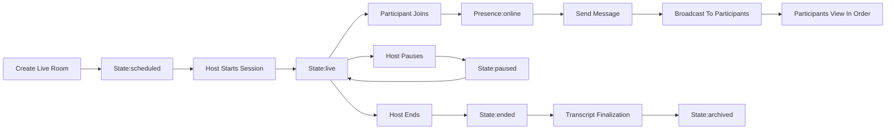
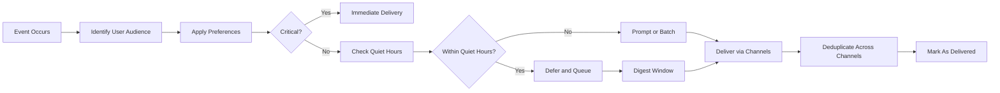
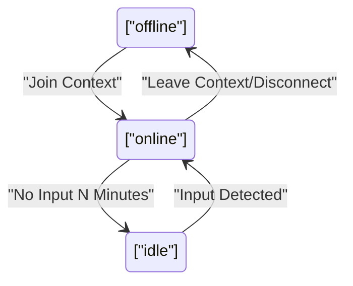

# econDiscuss Real-Time Collaboration and Notifications Requirements

Professional real-time collaboration and notification behaviors enabling high-signal economic discourse while respecting user preferences, timezones, and privacy.

## 1. Scope
- Live discussions within post threads (live threads) and dedicated sessions (live rooms).
- Presence and typing indicators with privacy controls.
- Notifications across in-app, email-like, and mobile push-like channels.
- User preferences for categories, channels, frequency caps, quiet hours, and snooze.
- Batching/debounce, escalation, digests, and accessibility.
- Business-level performance, reliability, and integrity safeguards.

Constraints:
- Business requirements only; no protocols, APIs, schemas, or storage details.
- Aligns with roles, moderation, privacy/security NFRs, and polling/search requirements in related documents.

## 2. Principles, Definitions, and Non-Goals
Principles:
- Signal over noise; timeliness without spam.
- Respect for user time, timezone, and preferences.
- Privacy-first presence limited to context; no global last-seen.
- Accessibility and transparency throughout.

Definitions:
- Live Thread: A post with real-time comment/reaction delivery.
- Live Room: A dedicated, time-bounded discussion space with presence and messaging.
- Presence: Online/idle/offline state visible only to participants in the same context.
- Quiet Hours: User-configurable windows deferring non-critical notifications.
- Channels: in-app, email-like, mobile push-like; channel “like” terms indicate behavior, not technical bindings.

Non-goals:
- Audio/video conferencing.
- Global presence outside active contexts.

## 3. Roles and Permissions (Business Scope)
Roles: visitor, member, verifiedExpert, moderator, admin.

| Action | visitor | member | verifiedExpert | moderator | admin |
|---|---|---|---|---|---|
| View public live threads | ✅ | ✅ | ✅ | ✅ | ✅ |
| View public live rooms | ✅ | ✅ | ✅ | ✅ | ✅ |
| Join and post in live rooms | ❌ | ✅ | ✅ | ✅ | ✅ |
| Create live room | ❌ | ✅ | ✅ | ✅ | ✅ |
| Host/moderate room | ❌ | ❌ | ✅ | ✅ | ✅ |
| Enable expert-only mode | ❌ | ❌ | ✅ | ✅ | ✅ |
| See presence in same context | ❌ | ✅ | ✅ | ✅ | ✅ |
| Hide own presence | ❌ | ✅ | ✅ | ✅ | ✅ |
| Receive notifications | ❌ | ✅ | ✅ | ✅ | ✅ |
| Configure preferences & quiet hours | ❌ | ✅ | ✅ | ✅ | ✅ |
| Override quiet hours (policy events) | ❌ | ❌ | ❌ | ✅ | ✅ |

Selected EARS:
- WHEN a visitor attempts to post in a live room, THE econDiscuss SHALL deny the action and explain that authentication is required.
- WHERE expert-only mode is enabled, THE econDiscuss SHALL restrict posting to verifiedExpert, moderator, and admin while allowing broader viewing per room visibility.
- WHEN a user has blocked another, THE econDiscuss SHALL suppress the blocked party’s presence, messages, and notifications for the blocker.

## 4. Performance and Reliability Expectations
- THE econDiscuss SHALL render live messages to active participants within 1 second at P95 and 3 seconds at P99.
- THE econDiscuss SHALL deliver critical notifications within 5 seconds at P95; important notifications within 60 seconds; bulk/digest within scheduled windows.
- THE econDiscuss SHALL prevent user-visible message loss; missed messages during temporary disconnection SHALL be restored in order on reconnection.
- THE econDiscuss SHALL deduplicate notifications so a viewed in-app event suppresses redundant channel deliveries when appropriate.

## 5. Live Discussions
### 5.1 Live Threads (Post-Centric)
- THE econDiscuss SHALL allow authors or moderators to mark a post as a live thread to enable real-time delivery of comments, replies, polls, and reaction summaries to current viewers.
- IF a live thread is archived, THEN THE econDiscuss SHALL disable real-time behaviors and preserve a read-only transcript.
- WHERE traffic is high, THE econDiscuss SHALL aggregate low-importance events (e.g., reactions) into periodic summaries.

### 5.2 Live Rooms (Scheduled/Ad-hoc)
- THE econDiscuss SHALL support creation of live rooms either scheduled in advance or started ad-hoc with an identified host.
- THE econDiscuss SHALL support co-hosts and assignable moderator roles.
- THE econDiscuss SHALL support access scopes: public, followers-only, topic-subscribers-only, invite-only.
- WHERE invite-only, THE econDiscuss SHALL allow an invite list and an admission queue managed by the host or moderator.
- WHERE expert-only participation is configured, THE econDiscuss SHALL restrict posting to eligible roles while allowing others to view.
- WHERE events are scheduled, THE econDiscuss SHALL display local start times based on the viewer’s timezone and offer calendar (.ics-like behavior) links.

### 5.3 Room Lifecycle and States
States: scheduled, waiting, live, paused, ended, archived.
- WHEN a room is scheduled, THE econDiscuss SHALL show countdown and access scope.
- WHEN the host starts, THE econDiscuss SHALL transition to live.
- WHEN paused, THE econDiscuss SHALL disable posting for non-hosts and display a paused indicator.
- WHEN ended, THE econDiscuss SHALL finalize transcript and transition to archived.

### 5.4 Message Types, Ordering, Visibility, and Moderation Aids
- Message types: text, link preview, poll prompt, poll result snapshot, system notices (join/leave), moderation notices, pinned messages, reaction summaries.
- THE econDiscuss SHALL preserve author, timestamp, and type metadata and present messages in chronological order.
- IF messages arrive out of order, THEN THE econDiscuss SHALL reorder prior to display.
- THE econDiscuss SHALL provide optional slow mode (per-user interval), Q&A mode (accepted answers), and pinned messages for context.

### 5.5 Rate Limits, Flood Control, and Abuse Prevention
- THE econDiscuss SHALL enforce per-user, per-room message rate limits with escalating cooldowns upon violation.
- WHEN spam/abuse indicators are detected, THE econDiscuss SHALL temporarily restrict the offending user and notify moderators.
- WHERE content violates community guidelines, THE econDiscuss SHALL allow moderators to remove messages and optionally leave labeled placeholders in transcripts.

## 6. Presence and Typing Indicators
### 6.1 Presence Semantics and Defaults
- Presence states: online (active), idle (no input for configurable N minutes), offline.
- THE econDiscuss SHALL limit presence visibility to the same room/thread context; no global last-seen.
- THE econDiscuss SHALL default presence visibility to on within active contexts and provide a per-user option to hide presence.

### 6.2 Typing Indicators
- THE econDiscuss SHALL display typing indicators only to participants with posting permission in the active context.
- THE econDiscuss SHALL remove typing indicators after 5 seconds of inactivity or upon message send.
- WHERE a user hides presence, THE econDiscuss SHALL also suppress typing indicators.

### 6.3 Privacy Controls and Exceptions
- THE econDiscuss SHALL honor blocks and mutes by excluding presence and messages from view where applicable.
- WHERE moderators investigate abuse, THE econDiscuss SHALL provide presence audit logs accessible only to moderator and admin.

## 7. Notification Events Catalog
Categories with examples; all respect preferences, quiet hours, blocks, and mutes.

### 7.1 Critical (Immediate)
- WHEN a user is directly mentioned (@handle) or receives a direct reply, THE econDiscuss SHALL send immediate notifications.
- WHEN a moderation action affects content or account, THE econDiscuss SHALL send immediate notifications with policy references.
- WHEN expertise verification status changes, THE econDiscuss SHALL send immediate notifications.
- WHEN a user is invited to an invite-only room, THE econDiscuss SHALL send immediate notifications.

### 7.2 Important (Prompt, Throttled)
- WHEN a followed expert publishes, THE econDiscuss SHALL notify with per-author frequency caps.
- WHEN a followed topic trends beyond threshold, THE econDiscuss SHALL notify with debounce windows.
- WHEN a poll the user voted in is closing soon or has published results, THE econDiscuss SHALL notify promptly.

### 7.3 Bulk/Aggregated (Digestable)
- WHEN multiple new comments accrue on a user’s post, THE econDiscuss SHALL aggregate into a single summary notification.
- WHEN multiple new followers accrue, THE econDiscuss SHALL bundle them into a summary.
- WHEN a topic accrues multiple new posts, THE econDiscuss SHALL deliver a periodic summary.

### 7.4 System/Policy
- WHEN maintenance may impact delivery, THE econDiscuss SHALL notify affected users in advance per locale/timezone.
- WHEN terms or privacy updates require acknowledgment, THE econDiscuss SHALL notify and require action.

## 8. Delivery Timing, Quiet Hours, Preferences, and Caps
### 8.1 Preferences Model
- THE econDiscuss SHALL allow enabling/disabling by category (critical, important, bulk) and by specific event types.
- THE econDiscuss SHALL allow channel selection per category (in-app, email-like, mobile push-like).
- THE econDiscuss SHALL provide per-author and per-topic frequency caps and a global cap.
- THE econDiscuss SHALL provide a snooze control (e.g., 1 hour, 8 hours, until tomorrow, custom) per context.

### 8.2 Quiet Hours and Timezone/DST
- THE econDiscuss SHALL schedule against the user’s timezone and honor daylight saving transitions by wall-clock time.
- WHILE quiet hours are active, THE econDiscuss SHALL defer non-critical notifications and deliver after the window; critical notifications may bypass if the user allows.

### 8.3 Debounce, Batching, Frequency Caps
- THE econDiscuss SHALL apply a default debounce of up to 10 minutes for repeat events of the same type and context.
- THE econDiscuss SHALL batch similar events into a single notification when volume exceeds thresholds.
- THE econDiscuss SHALL enforce baseline caps such as: max 3 “important” notifications per author per follower within 12 hours; max 2 “topic trending” notifications per topic per user within 24 hours; values adjustable by policy.

### 8.4 Channel Behaviors and Fallbacks
- THE econDiscuss SHALL deliver in-app in real time, respecting preferences and quiet hours for non-critical events.
- THE econDiscuss SHALL queue email-like and push-like deliveries per preferences, quiet hours, and batching.
- IF a channel repeatedly fails delivery (e.g., bounces), THEN THE econDiscuss SHALL mark the channel as unhealthy, fall back to in-app only, and prompt the user to re-verify or re-enable the channel.

## 9. Escalation, Digests, and Unread Thresholds
- WHEN a critical notification remains unread for 30 minutes, THE econDiscuss SHALL escalate via the next preferred channel unless the user opted out.
- THE econDiscuss SHALL support daily and weekly digests summarizing follows, topics, polls, and expert highlights, delivered in the user’s morning window by timezone.
- WHEN unread important notifications exceed a user-configured threshold, THE econDiscuss SHALL send a single reminder outside quiet hours (unless disabled).

## 10. Error Handling and Recovery
- IF connection is lost during a live session, THEN THE econDiscuss SHALL indicate reconnection and restore missed messages on recovery in correct order.
- IF channel delivery fails, THEN THE econDiscuss SHALL retry with backoff, fall back to in-app visibility, and display channel health in preferences.
- IF a user’s timezone is invalid or missing, THEN THE econDiscuss SHALL default to UTC until updated and inform the user.
- IF a message is removed by moderation, THEN THE econDiscuss SHALL update active views and the transcript with a policy label where appropriate.

## 11. Auditability, Governance, Transparency
- THE econDiscuss SHALL log moderation actions, room state transitions, thread mode changes, and notification policy overrides; access is restricted to moderator and admin.
- THE econDiscuss SHALL honor user blocks, mutes, unsubscribes, and privacy settings across all real-time and notification features.
- THE econDiscuss SHALL provide a visible explanation for why an item appears in a user’s notification or feed when applicable (e.g., followed expert, subscribed topic).

## 12. Accessibility, Localization, and Inclusivity
- THE econDiscuss SHALL present concise, readable notification text, provide accessible labels, and support assistive technologies.
- THE econDiscuss SHALL include alt text for media in notifications where applicable.
- THE econDiscuss SHALL localize time and date presentations to the user’s locale and timezone preferences and avoid jargon in notification text.

## 13. Success Metrics and Acceptance Criteria
- Live message latency: ≤ 1s P95, ≤ 3s P99 for participants in context.
- Notification immediacy for critical events: ≤ 5s P95; important ≤ 60s P95.
- Noise reduction: ≥ 50% fewer notifications via batching/debounce in high-traffic contexts compared to naive per-event delivery.
- Preference adherence: ≥ 99% events routed according to user preferences and quiet hours.
- Zero user-visible message loss across reconnect scenarios.

## 14. Dependencies and Relationships
- Roles and permissions: [User Roles and Permissions](./03-econDiscuss-user-roles-permissions.md)
- Content structure and live authoring: [Content Authoring Rules](./05-econDiscuss-content-authoring-rules.md)
- Voting/reputation (affects trending signals and notification selection): [Voting, Reputation, and History](./07-econDiscuss-voting-reputation-history.md)
- Discovery and trending: [Search, Discovery, and Trending](./09-econDiscuss-search-discovery-trending.md)
- Poll behaviors and milestones: [Polls and Economic Sentiment](./10-econDiscuss-polls-sentiment.md)
- Moderation and governance: [Moderation, Quality, and Governance](./13-econDiscuss-moderation-quality-governance.md)
- Non-functional SLAs: [Privacy, Security, Performance](./14-econDiscuss-nonfunctional-privacy-security-performance.md)
- Data lifecycle and error patterns: [Data Lifecycle and Exception Handling](./15-econDiscuss-data-lifecycle-exception-handling.md)

## 15. Mermaid Diagrams

### 15.1 Live Room Lifecycle and Messaging Flow

### 15.2 Notification Delivery with Quiet Hours

### 15.3 Presence and Typing States

## 16. EARS Summary (Selected)
- THE econDiscuss SHALL deliver live messages within defined latency targets and restore missed messages after reconnects.
- WHEN a user is mentioned or replied to, THE econDiscuss SHALL send immediate notifications subject to preferences for critical events.
- WHILE quiet hours are active, THE econDiscuss SHALL defer non-critical notifications and deliver after the window ends.
- IF a delivery channel fails repeatedly, THEN THE econDiscuss SHALL mark it unhealthy, fall back to in-app, and prompt re-verification.
- WHERE expert-only modes are configured, THE econDiscuss SHALL limit posting to eligible roles and display mode labels to all viewers.
- THE econDiscuss SHALL enforce batching, debounce, and frequency caps to reduce noise while maintaining timeliness.
- THE econDiscuss SHALL honor user privacy settings, blocks, and mutes across real-time and notification features.
