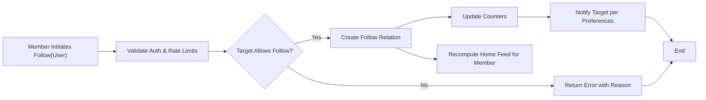
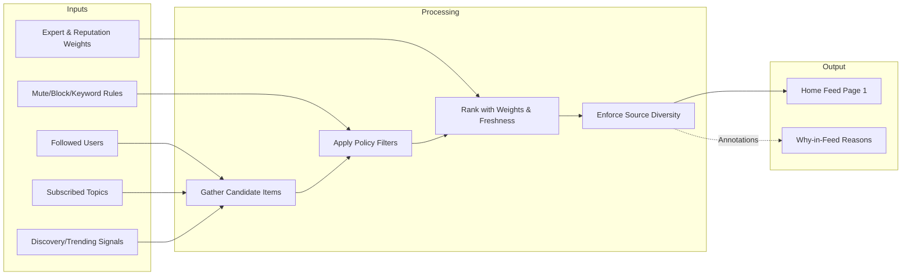

# econDiscuss Follow, Subscribe, and Feeds Requirements

## 1. Scope and Objectives
This document specifies business requirements for following users, subscribing to topics, composing personalized feeds, scheduling digests, and applying user controls (unfollow, mute, block) for the econDiscuss platform. It focuses on professional-quality personalization that highlights high-signal economics discussion while preserving modern social UX expectations.

Objectives:
- Provide clear, testable requirements for follow/subscribe actions and their effects on content delivery.
- Define feed composition behavior that balances followed content and platform-wide discovery.
- Ensure professional quality through reputation and expert weighting, topic hygiene, and anti-noise rules.
- Describe digest options and their relation to user preferences and time zones.
- Define transparency controls so users understand and influence their feed responsibly.

Out of Scope:
- UI layout and visual design.
- API, database schema, or transport/protocol specifics.
- Detailed search algorithm internals beyond business signals.

## 2. Definitions and Core Concepts
- Follow: A member action to receive higher-priority visibility for another user’s public posts and comments.
- Subscribe (Topic): A member action to prioritize content labeled with a topic (taxonomy curated elsewhere) in the user’s feed and digests.
- Topic: A curated taxonomy label representing an economic subject (e.g., "Monetary Policy").
- Feed: A personalized, ranked stream of content items (posts, polls, live-discussion entries, major comments where applicable) generated using user relationships, topics, and discovery signals.
- Digest: Periodic summary (daily or weekly) of important items based on follows, subscriptions, and discovery signals.
- Mute: A user-level control to hide content from a user, topic, or keyword without preventing mutual access to each other’s profiles.
- Block: A bilateral control that prevents interactions and visibility between two accounts to the extent allowed by policy.
- Professional Quality: Business rule set to emphasize expertise, evidence, civility, and topic relevance; reduce noise and sensationalism.

## 3. Roles and Permissions Overview (business terms)
Roles:
- visitor: Unauthenticated reader. May view public feeds (global/trending) but cannot follow/subscribe, mute, block, or receive digests.
- member: Authenticated user with standard participation rights, including follow/subscribe, mute, block, and digests.
- verifiedExpert: Authenticated user with verified expertise domains. Receives expert-weighted influence in feed signals and may access expert-only modes where applicable.
- moderator: Trusted role to enforce quality, manage reports, and apply sanctions. Can override certain mutes/blocks for governance workflows per policy.
- admin: Platform administrator with full administrative privileges.

High-level permissions:
- Follow/Unfollow users: member, verifiedExpert; moderators/admins for operational needs.
- Subscribe/Unsubscribe topics: member, verifiedExpert; moderators/admins for operations.
- Mute/Unmute user/topic/keyword: member, verifiedExpert.
- Block/Unblock users: member, verifiedExpert.
- Configure digests and quiet hours: member, verifiedExpert.
- View personalized Home feed: member, verifiedExpert.
- View topic feeds: visitor (public), member, verifiedExpert, moderator, admin.

## 4. Feed Surfaces and Views
- Home Feed: Personalized mix from followed users, subscribed topics, and discovery/trending content.
- Topic Feed: Content filtered to a specific topic with sorting and professional quality rules.
- Expert Highlights: A view that prioritizes content from verified experts across followed and subscribed areas.
- Global Discovery/Trending: Non-personalized or lightly personalized view emphasizing platform-wide signal; available to visitors.

## 5. Professional Quality Principles for Personalization
- Expertise emphasis: Expert-authored and expert-endorsed content receives elevated consideration.
- Reputation sensitivity: Items from contributors with higher reputation gain proportionate visibility, with decay for older reputation events.
- Topic relevance: Items must be topically relevant; off-topic or mis-tagged items are suppressed.
- Diversity of sources: Feeds avoid repetitive dominance by a single author or outlet in short windows.
- Anti-noise: Low-effort posts and repetitive links are down-weighted; rate-limited accounts receive reduced visibility.
- Safety and civility: Muted/blocked sources do not appear; reported or sanction-pending content is treated conservatively.

## 6. Functional Requirements (EARS) by Capability
All applicable requirements are written using EARS. The system referenced below is "econDiscuss" as a business system, not a technical component.

### 6.1 Follow Users
- WHEN a member initiates a follow on a user profile, THE econDiscuss SHALL record the follow relationship and increment visible counters immediately.
- IF the target user is blocked by the member, THEN THE econDiscuss SHALL reject the follow action with a clear reason and guidance to unblock first.
- IF the member is blocked by the target user, THEN THE econDiscuss SHALL reject the follow action and communicate that following is unavailable due to a block.
- WHEN a follow is created, THE econDiscuss SHALL prioritize the target user’s new public content in the follower’s Home feed within the next refresh cycle.
- WHERE daily follow operation limits are exceeded, THE econDiscuss SHALL deny additional follow attempts with a message indicating the remaining wait time until limits reset.
- WHEN a member unfollows a user, THE econDiscuss SHALL remove the follow relationship, adjust counters, and reduce prioritization of that user’s content immediately.
- WHILE a member temporarily disables recommendations from a specific followed user, THE econDiscuss SHALL keep the follow relationship but exclude that user’s content from the Home feed until re-enabled.

### 6.2 Subscribe to Topics
- WHEN a member subscribes to a topic, THE econDiscuss SHALL add the topic to the member’s subscription list and prioritize content tagged with that topic in the Home feed.
- WHERE a topic is merged or renamed by governance, THE econDiscuss SHALL migrate subscriptions to the successor topic and notify affected subscribers.
- IF a member attempts to subscribe to a deprecated or archived topic, THEN THE econDiscuss SHALL deny the action and display the recommended alternative topic.
- WHEN a member unsubscribes from a topic, THE econDiscuss SHALL remove the topic from subscriptions and cease prioritization for that topic.

### 6.3 Feed Composition Rules
- THE econDiscuss SHALL compose the Home feed as a ranked list that includes followed-user content, subscribed-topic content, and discovery/trending content.
- WHERE item quality is low by policy signals (e.g., low reputation, repeated link spam, off-topic), THE econDiscuss SHALL down-rank or exclude such items.
- WHERE multiple items from the same author exist within a short time window, THE econDiscuss SHALL enforce source diversity by limiting consecutive appearances.
- WHEN a verified expert that the member follows posts, THE econDiscuss SHALL elevate the item prominence relative to non-expert followed users.
- WHEN a subscribed topic accumulates significant expert engagement, THE econDiscuss SHALL elevate high-signal items from that topic even if not authored by followed users.
- WHERE items are older than the configured freshness window, THE econDiscuss SHALL down-rank them unless reactivated by significant recent expert engagement.
- WHEN mute or block rules apply, THE econDiscuss SHALL exclude matching items from the Home feed and topic feeds.
- WHERE a member enables "expert highlights" view, THE econDiscuss SHALL restrict content to items authored by verified experts or strongly endorsed by experts.

### 6.4 Digests (Daily/Weekly)
- WHEN a member enables a daily digest, THE econDiscuss SHALL compile a summary of top items from follows, subscribed topics, and high-signal discovery to be delivered once per day in the member’s chosen local time window.
- WHEN a member enables a weekly digest, THE econDiscuss SHALL compile a weekly summary with emphasis on sustained impact and expert engagement.
- WHERE quiet hours are configured, THE econDiscuss SHALL avoid sending digests within the member’s quiet period and defer to the next allowed window.
- IF a member has no qualifying items in the period, THEN THE econDiscuss SHALL skip the digest and optionally inform the member of the skip policy.
- WHEN a member disables digests, THE econDiscuss SHALL immediately cease scheduled digest deliveries.

### 6.5 Unfollow, Mute, and Block
- WHEN a member unfollows a user, THE econDiscuss SHALL remove follow prioritization and adjust counters without affecting historical data.
- WHEN a member mutes a user, THE econDiscuss SHALL hide that user’s content from the member’s feeds while preserving the ability to visit the user’s profile directly.
- WHEN a member mutes a topic, THE econDiscuss SHALL hide items tagged with that topic from the member’s feeds, regardless of author follow status.
- WHEN a member mutes a keyword, THE econDiscuss SHALL hide items with that keyword in titles or tags from the member’s feeds.
- WHEN a member blocks a user, THE econDiscuss SHALL prevent mutual visibility and interactions as defined by governance policy and remove the blocked user’s content from feeds.
- WHERE a mute or block expires by duration setting, THE econDiscuss SHALL automatically restore visibility.
- IF a member attempts to follow a user they have muted, THEN THE econDiscuss SHALL allow the follow and prompt to unmute for feed visibility.
- IF a member attempts to follow a user they have blocked, THEN THE econDiscuss SHALL deny the follow until the block is removed.

### 6.6 Transparency and Controls
- THE econDiscuss SHALL provide an explanation reason for each item’s presence in the Home feed (e.g., "Followed user", "Subscribed topic", "Expert trending").
- WHEN a member adjusts feed preferences (e.g., reduce discovery), THE econDiscuss SHALL reflect changes on the next refresh and persist preferences.
- WHERE an item is suppressed due to policy (e.g., low-quality or safety), THE econDiscuss SHALL indicate suppression at an aggregate level without exposing sensitive details.
- THE econDiscuss SHALL allow members to export a list of followed users and subscribed topics in a human-readable format on demand.

### 6.7 Notifications Interplay
- WHEN a followed user publishes new content, THE econDiscuss SHALL generate a notification according to user preferences and quiet hours.
- WHEN a subscribed topic has a high-signal item, THE econDiscuss SHALL notify the member per preferences without spamming; similar items SHALL be bundled where applicable.
- WHERE digests are enabled, THE econDiscuss SHALL avoid duplicate notifications for items already delivered in a digest unless explicitly configured otherwise.

## 7. Permission Matrix (business actions vs roles)

| Business Action | visitor | member | verifiedExpert | moderator | admin |
|---|---|---|---|---|---|
| View Global Discovery/Trending | ✅ | ✅ | ✅ | ✅ | ✅ |
| View Home Feed | ❌ | ✅ | ✅ | ✅ | ✅ |
| Follow/Unfollow User | ❌ | ✅ | ✅ | ✅ | ✅ |
| Subscribe/Unsubscribe Topic | ❌ | ✅ | ✅ | ✅ | ✅ |
| Mute/Unmute User/Topic/Keyword | ❌ | ✅ | ✅ | ✅ | ✅ |
| Block/Unblock User | ❌ | ✅ | ✅ | ✅ | ✅ |
| Configure Digests & Quiet Hours | ❌ | ✅ | ✅ | ✅ | ✅ |
| Access Expert Highlights View | ❌ | ✅ | ✅ | ✅ | ✅ |
| Override Mute/Block for Governance Workflows | ❌ | ❌ | ❌ | ✅ | ✅ |

Notes:
- Moderators and admins use overrides solely for governance, auditing, and policy enforcement with justifications and audit trails per governance requirements.

## 8. Business Rules and Validation Constraints
- Follow/Unfollow:
  - Daily follow attempts per member: up to 100; bursts limited to 20 per minute to deter spam.
  - Self-follow is prohibited.
  - Follow counters update immediately upon success.
- Topic Subscriptions:
  - Max active topic subscriptions: 500 per member.
  - Subscriptions auto-migrate on topic merge/rename with notification.
- Mute/Block:
  - Mutes may be indefinite or time-bound (1 day, 7 days, 30 days, custom up to 1 year).
  - Blocks are indefinite until removed by the member; mutual interactions disabled per governance policy.
- Keywords:
  - Keyword mutes apply to titles, primary tags, and synopsis fields.
  - Keyword list per member capped at 200 distinct entries.
- Feed Composition Windows:
  - Freshness window default: 7 days; down-rank after 48 hours unless significant expert engagement.
  - Source diversity: no more than 2 consecutive items from the same author in Home feed.
- Expert/ Reputation Weighting:
  - Expert-authored items receive elevated baseline visibility.
  - Reputation-based boosts apply with time decay to avoid permanent dominance.
- Digests:
  - Daily digest delivery window: member-configured local hour; default 08:00 local time.
  - Weekly digest default day: Monday at 08:00 local time.
  - Skip empty digests when fewer than 3 qualifying items exist unless the member opts in to always-send.
- Transparency:
  - Every item in Home feed includes a simple, non-technical "why in my feed" reason.
- Privacy:
  - Follow lists are public by default at aggregate level; export is private to the owner.
  - Mute/block lists are private to the owner except for governance.

## 9. Error Handling and Recovery Scenarios
- Attempt to follow while blocked: Provide a clear message that the target has blocked the member; suggest following other experts or subscribing to topics.
- Exceed daily follow limit: Communicate remaining cooldown time; suggest curating topics to diversify feed without more follows.
- Subscribe to deprecated topic: Provide recommended successor topic and offer one-click migration.
- Create duplicate follow/subscription: Return idempotent success and maintain current state.
- Mute keyword exceeding cap: Inform the cap and provide bulk management guidance.
- Digest delivery during quiet hours: Defer and inform the member in settings of next scheduled delivery time.
- Topic merge/rename: Notify members with summary of change and option to opt-out from the successor topic.

All error messages must be professional, non-accusatory, and helpful, offering a next best action where applicable.

## 10. Performance and Responsiveness Expectations
- WHEN a member opens the Home feed, THE econDiscuss SHALL return the first page of items within 1.5 seconds at the 95th percentile under normal operating conditions.
- WHEN feed preferences change, THE econDiscuss SHALL reflect changes within one refresh cycle, not exceeding 5 seconds for active sessions.
- WHEN a follow or subscription is created, THE econDiscuss SHALL include relevant new content on the next refresh; recent items within the last 24 hours SHALL be considered for immediate inclusion.
- WHEN switching to Expert Highlights view, THE econDiscuss SHALL apply the filter and render the first page within 2 seconds at the 95th percentile.
- WHEN generating a daily or weekly digest, THE econDiscuss SHALL compile the digest for each user within the configured delivery window.

## 11. Edge Cases and Special Conditions
- Private or removed content from followed users shall not appear in feeds.
- Sanctioned or shadow-limited accounts’ items are down-ranked or excluded according to governance policy.
- Cross-topic items with multiple tags must respect mutes and subscriptions consistently.
- If a user follows and mutes the same account, mute supersedes follow for feed visibility, while keeping the relationship.
- If two users block each other, follow actions in either direction are not allowed until both blocks are removed.
- Deleted or deactivated accounts are removed from followers/following counts and no longer affect feeds.

## 12. Data Visibility, Privacy, and Retention (business view)
- Follow relationships are visible on profiles unless the member opts into private follow lists where allowed by policy; counts remain visible at aggregate level.
- Mute and block lists are private; visibility is restricted to the owning member and governance roles when necessary.
- Retention of follow/mute/block/subscription actions is maintained for audit and recovery with retention windows consistent with platform policies described in the privacy and lifecycle documents.

## 13. Diagrams (Mermaid)

### 13.1 Follow User Flow

### 13.2 Home Feed Composition Overview

## 14. Dependencies and Relationships with Other Documents
- Discovery, filters, and trending windows: see the [Search, Discovery, and Trending Requirements](./09-econDiscuss-search-discovery-trending.md).
- Notification triggers, quiet hours, and delivery bundling: see the [Realtime, Notifications, and Live Discussions Requirements](./11-econDiscuss-realtime-notifications-live.md).
- Expert weighting and reputation inputs: see the [Voting, Reputation, and History Requirements](./07-econDiscuss-voting-reputation-history.md).
- Governance and sanctions ladder: see the [Moderation, Quality, and Governance Requirements](./13-econDiscuss-moderation-quality-governance.md).
- Topic tagging and authoring policies: see the [Content Authoring and Policies Requirements](./05-econDiscuss-content-authoring-rules.md).
- Role capabilities and privacy defaults: see the [User Roles and Permissions Requirements](./03-econDiscuss-user-roles-permissions.md).

## 15. Success Criteria and KPIs
- Personalized feed engagement rate increases without reduction in civility metrics.
- Expert-authored content share of impressions meets or exceeds target thresholds.
- Digest open and click rates align with industry benchmarks for professional media.
- Complaint rates about spam/noise remain below policy thresholds.
- Average feed response time meets the stated performance objectives at the 95th percentile.

This document describes business requirements only. All technical implementation decisions, including architecture, APIs, and data design, are at the discretion of the development team. Implementers must ensure behaviors match the EARS requirements and business rules specified above while adhering to related documents for signals, governance, and privacy.