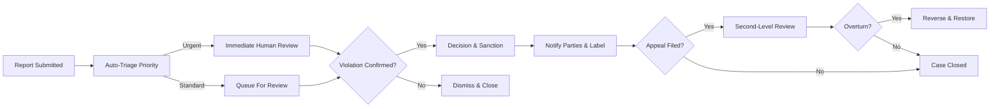
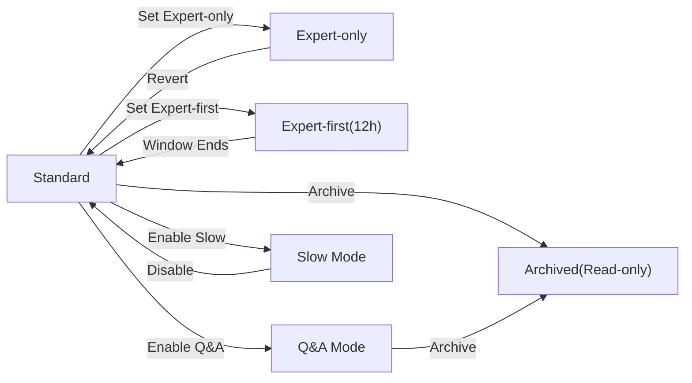
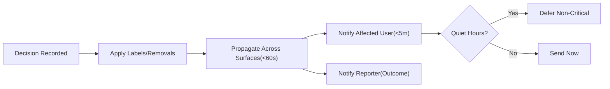
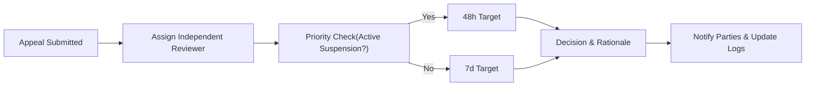

# econDiscuss Moderation, Quality, and Governance Requirements

## 1) Purpose and Scope
Purpose: establish enforceable, fair, and transparent rules that preserve professional, evidence-based economic discourse while supporting modern social features and expert weighting.

Scope: applies to public content types (posts, comments, live messages, polls, profiles, topics) and governance actions (reporting, triage, review, sanctions, appeals, curation, thread modes). Excludes technical implementations (APIs, data models, infrastructure).

## 2) Roles and Responsibilities (Governance Scope)
- visitor: Reads public content; cannot report or participate in governance.
- member: Authenticated participant; may report, appeal own sanctions, and receive notices.
- verifiedExpert: Member with verified domain expertise; may nominate content for featuring; subject to the same rules as members.
- moderator: Trusted steward; handles reports, applies sanctions per policy, manages expert verification queues, and curates featured content.
- admin: Platform administrator; configures policies, approves severe sanctions, manages topic taxonomy and governance thresholds, audits moderator actions.

EARS (role gating):
- WHERE a user has moderator role, THE platform SHALL expose moderation queues, tools, and audit views within least-privilege scope.
- WHERE a user has admin role, THE platform SHALL allow configuration of governance policies, thresholds, and dual-control approvals for severe sanctions.
- WHERE a user is verifiedExpert, THE platform SHALL allow nominating content for curation without granting moderation powers.

## 3) Community Guidelines and Enforcement Principles
### 3.1 Guideline Commitments
- Evidence first: cite sources for facts; distinguish opinion vs analysis.
- Civil discourse: no harassment, hate, or personal attacks.
- Integrity: no plagiarism, deceptive edits, or undisclosed promotions.
- Poll ethics: clear wording, visibility as configured, honest disclosure.
- Privacy: no doxxing or posting sensitive PII; redact when discovered.
- Anti-manipulation: no brigading, sockpuppets, or vote/engagement fraud.
- Topic hygiene: stay on-topic; mark speculation; discourage low-effort posts.

### 3.2 Enforcement Principles
- Proportionality: sanctions match severity and history.
- Consistency: similar cases yield comparable outcomes.
- Transparency: visible labels on moderated content and clear notices to affected users.
- Due process: right to appeal with independent second-level review.
- Least-privilege: restrict only what is necessary.
- Non-discrimination: roles and identities treated uniformly under policy.
- Auditability: actions logged with rationale.

### 3.3 EARS (Guidelines and Principles)
- WHEN content includes factual claims without sources and falls under citation-required categories, THE platform SHALL require the author to add citations, label as opinion, or remove the content based on severity.
- WHEN harassment or hate is reported and confirmed, THE platform SHALL apply sanctions proportional to severity and prior history and SHALL label affected content where feasible.
- IF plagiarism is confirmed, THEN THE platform SHALL remove or label content, record the violation, and notify the author with appeal instructions.
- IF undisclosed promotional content is detected, THEN THE platform SHALL label or remove content and issue a warning or limit features.
- WHEN suspected manipulation (brigading, sockpuppets) is detected with high confidence, THE platform SHALL quarantine affected signals from discovery/reputation until review.

## 4) Governance Permission Matrix (Business Actions vs Roles)

| Business Action | visitor | member | verifiedExpert | moderator | admin |
|---|---|---|---|---|---|
| Submit report | ❌ | ✅ | ✅ | ✅ | ✅ |
| View own enforcement history | ❌ | ✅ | ✅ | ✅ | ✅ |
| View moderation queues | ❌ | ❌ | ❌ | ✅ | ✅ |
| Triage and assign cases | ❌ | ❌ | ❌ | ✅ | ✅ |
| Apply content labels/removals | ❌ | ❌ | ❌ | ✅ | ✅ |
| Apply feature limits/mutes | ❌ | ❌ | ❌ | ✅ | ✅ |
| Suspend accounts (temporary) | ❌ | ❌ | ❌ | ✅ (dual-control ≥ level 5) | ✅ |
| Issue permanent bans | ❌ | ❌ | ❌ | ✅ (with admin approval) | ✅ |
| Change thread modes (expert-only/first, slow) | ❌ | ❌ | ✅ (own posts) | ✅ | ✅ |
| Feature/curate content | ❌ | ❌ | ✅ (nominate) | ✅ | ✅ |
| Override curated placement | ❌ | ❌ | ❌ | ✅ | ✅ |
| Access verification queue | ❌ | ❌ | ❌ | ✅ | ✅ |
| Access PII in evidence | ❌ | ❌ | ❌ | ✅ (need-to-know) | ✅ |
| Configure policy & thresholds | ❌ | ❌ | ❌ | ❌ | ✅ |
| View audit logs | ❌ | ❌ | ❌ | ✅ (moderation scope) | ✅ (global) |

EARS (permissions):
- WHEN a moderator attempts a severe sanction at level 5 or above, THE platform SHALL require second reviewer or admin approval before enforcement unless urgent risk exists.
- WHERE an action requires PII access, THE platform SHALL enforce least-privilege access and record purpose, actor, and timestamp.

## 5) Authentication and Access Control (Moderation Tools)
- THE platform SHALL require 2FA for moderators and admins and SHALL prompt verifiedExperts to enable 2FA within a grace period.
- WHEN a moderator initiates a sensitive action (e.g., suspension, PII access), THE platform SHALL require step-up verification if risk signals are present or the session lacks recent re-authentication.
- WHEN “log out from all devices” is triggered by a moderator/admin, THE platform SHALL revoke active sessions within 30 seconds and require 2FA on next login.
- WHERE concurrency is limited, THE platform SHALL deny new moderator sessions beyond configured limits and SHALL notify security oversight.

## 6) Reporting, Review, and Decision Lifecycle

### 6.1 Report Intake and Acknowledgement
- Reportable entities: posts, comments, polls, live messages, profiles, topics.
- Categories: harassment/abuse, misinformation, plagiarism, spam/brigading, off-topic/low-quality, privacy violation, conflict of interest, poll integrity, impersonation, expertise misrepresentation, other.

EARS (intake):
- WHEN a report with category and notes is submitted, THE platform SHALL acknowledge within 5 minutes with a case ID and estimated SLA.
- THE platform SHALL merge duplicate reports for the same incident into a single case while preserving reporter identities.
- WHERE evidence attachments are included, THE platform SHALL retain them in accordance with privacy policies and restrict access to assigned reviewers.

### 6.2 Triage, Assignment, and Conflict Checks
- Auto-triage sets severity based on signals (urgency, scope, prior offenses).
- Moderators accept cases with conflict-of-interest declaration.

EARS (triage):
- WHEN a case is submitted, THE platform SHALL assign an initial priority within 60 seconds based on severity signals.
- WHERE the case is flagged “urgent harm” (e.g., doxxing), THE platform SHALL guarantee first human review within 2 hours; standard cases within 24 hours.
- IF a reviewer declares a conflict, THEN THE platform SHALL reassign the case before scoring or decision.

### 6.3 Review Actions and Outcomes
Outcomes include: dismiss, label, edit-request, remove, feature limits, temporary mute, suspension, permanent ban, poll invalidation.

EARS (decisioning):
- WHEN a decision is made, THE platform SHALL record outcome, rationale, policy references, and reviewer identity in a tamper-evident audit log.
- WHEN content is removed or labeled, THE platform SHALL apply a public label (where permissible) indicating policy category.
- WHEN a sanction is applied, THE platform SHALL notify the affected user within 5 minutes with reason, duration, and appeal instructions.

### 6.4 Communication to Stakeholders
- Reporters receive acknowledgement and outcome; affected users receive rationale and next steps; public labels appear where applicable.

EARS (communications):
- WHEN a case state changes materially, THE platform SHALL notify reporter(s) and the affected user, respecting quiet hours for non-critical communications.

### 6.5 Report Handling Flow (Mermaid)

## 7) Appeals Workflow
- Eligibility: any sanction beyond an educational warning; one primary appeal per action; additional appeal allowed only with new evidence.
- Timeline: appeal window 14 days; standard review within 7 days; suspensions prioritized within 48 hours.

EARS (appeals):
- WHEN an appeal is submitted within the allowed window, THE platform SHALL assign it to a reviewer distinct from the original decision-maker.
- WHERE a suspension is active, THE platform SHALL prioritize appeal resolution within 48 hours.
- IF an appeal is upheld, THEN THE platform SHALL reverse sanctions, restore content where feasible, and notify involved parties.

## 8) Rate Limits and Anti-Abuse Controls
Baseline (per rolling window; adjustable by reputation and prior history):
- New posts per 24h: member 5, verifiedExpert 10; moderators/admins have higher operational limits.
- Comments per 60m: member 20, verifiedExpert 30.
- Live messages per 10m: member 30, verifiedExpert 45.
- Outbound links per 24h: member 10, verifiedExpert 20; domain trust applied.
- Follows per 24h: member 40, verifiedExpert 60.
- Reports per 24h: visitor 5, member 20, verifiedExpert 30.

EARS (anti-abuse):
- WHEN more than 3 comments are posted by the same user within 60 seconds, THE platform SHALL enforce a 2-minute cooldown.
- IF two posts by the same user share ≥ 80% textual similarity within 24 hours, THEN THE platform SHALL require confirmation and MAY block under policy.
- WHERE a domain is untrusted and the user’s reputation is below threshold, THE platform SHALL limit content to 1 such link per 24 hours.
- WHEN a vote spike exceeds 5× baseline velocity for the content’s age, THE platform SHALL quarantine the votes until reviewed.

## 9) Expert-Only Threads and Comment Modes
Thread modes: Standard, Expert-only, Expert-first, Q&A, Slow, Archived.

EARS (modes):
- WHERE a thread is Expert-only, THE platform SHALL restrict commenting to verifiedExpert, moderator, and admin roles while allowing broader reading.
- WHERE a thread is Expert-first, THE platform SHALL allow only expert-role comments for the first 12 hours, then allow member comments.
- WHEN Q&A Mode is enabled, THE platform SHALL allow the author to mark accepted answers and label them distinctly.
- WHERE Slow Mode is enabled with interval T, THE platform SHALL enforce a minimum interval T between a user’s consecutive comments.
- WHEN a thread is Archived, THE platform SHALL prevent new comments and edits while keeping content readable.

### 9.1 Mode Creation and Transitions
- Verified experts and above may set expert modes at post creation; moderators/admins may change modes later with an audit entry.

EARS (transitions):
- WHEN a post is created by a verifiedExpert, THE platform SHALL allow selecting Expert-only or Expert-first modes.
- WHEN a moderator changes a thread mode, THE platform SHALL log actor, timestamp, and rationale and update the visible mode indicator.

### 9.2 Mode Lifecycle (Mermaid)

## 10) Sanctions Ladder, Recidivism, and Transparency
### 10.1 Sanction Levels
| Level | Action | Typical Duration | Triggers (examples) |
|---|---|---|---|
| 0 | Educational Warning | N/A | First minor offense, low-quality content |
| 1 | Content Label/Removal | Permanent label | Misinformation, plagiarism, off-topic |
| 2 | Feature Limits | 3–14 days | Excessive posting, link abuse |
| 3 | Temporary Mute | 24h–7d | Harassment, low-effort spam |
| 4 | Shadow Restrictions | 7–30 days | Brigading, coordinated spam |
| 5 | Temporary Suspension | 3–30 days | Severe harassment, doxxing, repeat violations |
| 6 | Permanent Ban | Indefinite | Egregious harm, persistent manipulation |

Recidivism policy:
- Second offense within 90 days escalates one level or doubles duration.
- Third offense within 180 days escalates two levels or triples duration.

EARS (sanctions):
- WHEN a violation is confirmed, THE platform SHALL apply the minimum effective sanction based on severity and history.
- WHERE prior violations exist within 90 days, THE platform SHALL escalate per recidivism policy.
- IF a permanent ban is proposed, THEN THE platform SHALL require admin approval and record a final rationale.
- WHILE a sanction is active, THE platform SHALL enforce restrictions across all features consistently.

### 10.2 Transparency and Rights
EARS (transparency):
- THE platform SHALL provide sanctioned users an enforcement history view with active restrictions, reasons, and appeal windows.
- THE platform SHALL publish monthly aggregate transparency metrics (case volume, categories, overturn rates) with privacy-safe aggregation.
- IF a transparency disclosure risks exposing PII, THEN THE platform SHALL anonymize or aggregate before publication.

## 11) Featured and Curation Policies
Governance:
- Curators: moderators and admins; verifiedExperts may nominate.
- Criteria: quality of analysis, evidence, originality, civil tone, educational value, topic relevance.
- Placement limits: topic/global slots with time-limited placement (e.g., 48 hours).
- Conflicts: authors cannot self-feature; curators must recuse for conflicts.

EARS (curation):
- WHEN a curator features content, THE platform SHALL record nominator, curator, criteria met, and placement window.
- WHERE a verifiedExpert nominates, THE platform SHALL route to a moderator queue for decision.
- WHEN the placement window expires, THE platform SHALL remove featured status automatically.

## 12) Safeguards Against Abuse of Power
- Moderator code of conduct: impartiality, respectful communication, rationale documentation, recusal for conflicts.
- Dual control: severe sanctions require second reviewer/admin approval unless urgent risk.
- Audit logging: tamper-evident logs for all moderator/admin actions impacting content or users.
- Oversight: periodic sampling of closed cases to baseline consistency and bias.

EARS (safeguards):
- WHERE a sanction at level 5 or higher is proposed, THE platform SHALL require second reviewer approval before enforcement unless urgent harm is present.
- WHEN a moderator takes an action, THE platform SHALL record actor, target, timestamp, policy reference, and rationale in an immutable audit trail.
- WHERE a moderator declares a conflict, THE platform SHALL prevent their participation in that case and reassign automatically.

## 13) Performance, SLAs, and Propagation Guarantees
EARS (timings):
- THE platform SHALL acknowledge report submission within 5 minutes.
- THE platform SHALL provide first human review within 2 hours for urgent cases and within 24 hours for standard cases.
- THE platform SHALL propagate moderation outcomes (labels, removals, sanctions) across surfaces within 60 seconds.
- THE platform SHALL deliver sanction notices to affected users within 5 minutes of action, respecting quiet hours for non-critical notices.
- THE platform SHALL maintain decisioning latency suitable for real-time contexts, ensuring live discussion moderation actions take effect within 2 seconds.

## 14) Moderation Data Privacy, Retention, and Access Controls
Retention (business view):
- Reports, cases, and audit logs retained for at least 12 months; permanent-ban minimal records retained longer for safety.
- Evidence with PII restricted to assigned reviewers; deleted 365 days after final decision unless legal hold or ongoing compliance need.

EARS (privacy):
- THE platform SHALL restrict access to PII in moderation evidence to assigned reviewers/admins only under least-privilege controls.
- WHEN a user requests their moderation records, THE platform SHALL provide them with necessary redactions within 30 days.
- WHEN legal hold is applied, THE platform SHALL pause deletion timelines and notify affected parties with a non-specific message.

## 15) Metrics, Monitoring, and Success Criteria
Quality and fairness metrics:
- Time-to-first-review (median, P95), decision turnaround, overturn rates, spam prevalence, recidivism rates, expert-thread engagement quality, user satisfaction on appeals.

EARS (monitoring):
- THE platform SHALL compute and publish monthly metrics for moderation SLAs, overturn rates, and spam prevalence.
- IF adverse trends (e.g., rising overturn rates or spam prevalence) exceed thresholds, THEN THE platform SHALL trigger an internal policy review.

## 16) Error Handling and User Messaging
Common scenarios and required behavior:
- Invalid report category, report spam, insufficient evidence, permission denials, rate-limit exceeded, appeal out of window, notification within quiet hours.

EARS (errors):
- IF a report lacks a valid category, THEN THE platform SHALL reject and present allowed categories.
- IF report submissions exceed rate limits, THEN THE platform SHALL deny new submissions and present the retry-after window.
- IF a user appeals outside the allowed window, THEN THE platform SHALL deny and present the remaining options (e.g., submit new evidence or contact support for policy questions).
- WHERE quiet hours are active, THE platform SHALL defer non-critical notifications and present in-app notices upon next session.

## 17) Diagrams (Mermaid)

### 17.1 Governance Notification and Propagation Timing

### 17.2 Appeal Handling Timeline

## 18) Glossary
- Case: Grouped set of reports and actions tied to content or a user.
- Label: Visible annotation explaining moderation context (e.g., “Removed for plagiarism”).
- Quarantine: Temporary exclusion of signals (e.g., votes) from discovery/reputation until review.
- Recusal: Withdrawal from a case due to conflict.
- Sanction: Restriction applied following a confirmed violation.
- Shadow Restriction: Limited reach applied to reduce harm from suspected abuse while under review.

