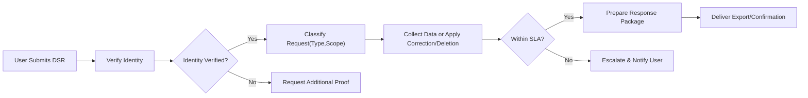
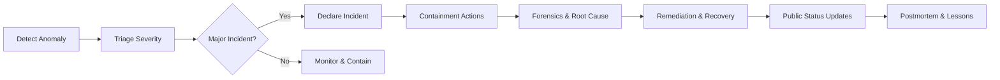
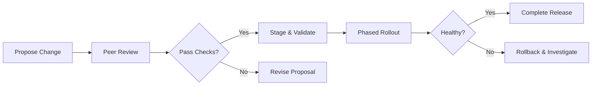
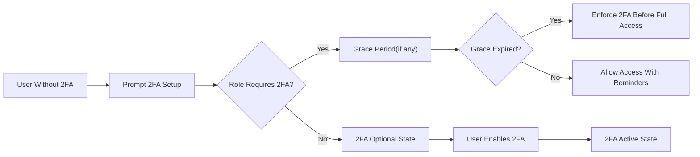

# econDiscuss Non-Functional Requirements: Privacy, Security, Compliance, Performance, Scalability & Availability

The requirements in this specification govern the econDiscuss platform end-to-end, including profiles and expertise verification, bookmarks and voting history, advanced search and trending, polls and sentiment, real-time discussions and notifications, drafts, follows/subscriptions, and the reputation system. All statements are business-level, implementation-agnostic, and expressed in testable terms using EARS.

## 1) Scope and Principles
- THE econDiscuss platform SHALL uphold professional discourse quality and user trust through rigorous, measurable non-functional standards applied uniformly across all features and roles.
- THE econDiscuss platform SHALL avoid prescriptive technical choices, allowing the development team to select architectures and vendors that satisfy these requirements.
- WHERE conflicts arise between functionality and privacy/security, THE econDiscuss platform SHALL favor user safety and lawful processing.

## 2) Data Classification & Privacy Defaults
### 2.1 Data Categories (Business Definitions)
- Personal Data (PII): email address, display name, profile images, affiliation statements, IP/session metadata.
- Sensitive Personal Data: government IDs, phone numbers, recovery codes, legal identity documents submitted during verification.
- Public Content: published posts/comments, public profiles, public topic follows, featured items.
- Private Content: drafts, bookmarks/collections (unless the owner shares), voting history (to the voter only), private moderation notes.
- Derived Data: reputation scores, trending signals, abuse risk scores, engagement aggregates.

EARS
- THE econDiscuss platform SHALL maintain and publish a data classification inventory describing categories, examples, and default visibility.
- THE econDiscuss platform SHALL minimize collection of Sensitive Personal Data and restrict its processing to verification, security, and legal obligations.

### 2.2 Visibility Defaults
- Profiles: badges and display names are public by default; emails and legal identities are private.
- Voting: individual vote choices are private to the voter; only aggregates are public.
- Bookmarks/Collections: private by default; collection-level sharing requires explicit opt-in by the owner.
- Drafts: private to the author; visible to staff only where policy requires.

EARS
- THE econDiscuss platform SHALL default bookmarks/collections to private, voting histories to private-to-self, and drafts to private.
- WHERE a user opts to share a collection, THE econDiscuss platform SHALL expose a read-only view without private notes and SHALL allow revocation at any time.
- WHERE poll results are segmented, THE econDiscuss platform SHALL suppress any segment that does not meet minimum k-thresholds to protect anonymity.

### 2.3 Data Subject Rights (DSR)
EARS
- WHEN a user requests data export, THE econDiscuss platform SHALL provide a machine-readable export within 15 calendar days after verifying identity.
- WHEN a user requests deletion, THE econDiscuss platform SHALL delete or irreversibly pseudonymize personal data within 30 calendar days, subject to legal holds and safety exceptions.
- WHEN a user requests correction or portability, THE econDiscuss platform SHALL complete within 30 calendar days after identity verification.

Mermaid — DSR Handling Flow

## 3) Consent, Transparency, and Cookies
EARS
- THE econDiscuss platform SHALL version and record user consents for non-essential processing and communications.
- WHEN privacy policy or terms materially change, THE econDiscuss platform SHALL present a summary of changes and require re-acknowledgment before continuing non-essential processing.
- WHERE cookie/consent banners are required, THE econDiscuss platform SHALL present granular, opt-in controls and honor withdrawal promptly.
- WHERE users disable personalization, THE econDiscuss platform SHALL serve non-personalized discovery and digests.

## 4) Data Residency, Cross-Border Transfers, and Subprocessors
EARS
- THE econDiscuss platform SHALL maintain a public registry of categories of subprocessors, the purposes of processing, and data transfer mechanisms.
- WHERE regulations require localization, THE econDiscuss platform SHALL store and process covered data within compliant regions or apply approved transfer mechanisms.
- WHEN subprocessors change materially, THE econDiscuss platform SHALL update the registry and provide advance notice consistent with policy.

## 5) Authentication, Session Security, and Administrative Access
### 5.1 Account and Session Controls (Business View)
EARS
- WHERE the user role is moderator or admin, THE econDiscuss platform SHALL require 2FA before any elevated action.
- WHERE the user role is verifiedExpert, THE econDiscuss platform SHALL prompt 2FA setup and require enablement within 14 days after verification.
- WHERE suspicious sign-in signals exist, THE econDiscuss platform SHALL apply step-up verification before granting full access.
- WHEN a user revokes a session, THE econDiscuss platform SHALL terminate that session immediately and invalidate related tokens.
- WHEN 5 failed login attempts occur within 10 minutes, THE econDiscuss platform SHALL apply a 5-minute cooldown and notify the user of unusual activity without revealing sensitive details.

### 5.2 Administrative Access Governance
EARS
- THE econDiscuss platform SHALL enforce least-privilege access to administrative consoles and sensitive data.
- WHEN administrative access to Sensitive Personal Data occurs, THE econDiscuss platform SHALL record actor, timestamp, purpose, and scope in a tamper-evident audit log.
- WHERE conflicts of interest arise, THE econDiscuss platform SHALL require a second approver for high-risk actions (e.g., permanent bans, mass data exports).

## 6) Application Security Controls (Business-Level)
EARS
- THE econDiscuss platform SHALL sanitize and validate user-generated content to prevent cross-site scripting and injection attacks.
- THE econDiscuss platform SHALL enforce cross-site request forgery protections for state-changing actions initiated via browsers.
- THE econDiscuss platform SHALL treat uploaded files as untrusted, scan for malware, and restrict executable content per policy.
- WHERE link previews are generated, THE econDiscuss platform SHALL avoid exposing internal networks and SHALL apply timeouts and size limits.
- WHEN unsafe content is detected, THE econDiscuss platform SHALL block publication, preserve the draft, and present neutral guidance to the author.

## 7) Secrets and Key Management (Business-Level)
EARS
- THE econDiscuss platform SHALL manage secrets and cryptographic keys under least privilege with role separation between developers and operators.
- THE econDiscuss platform SHALL rotate credentials and keys regularly, not less than every 180 days, and upon suspected compromise.
- WHEN a secret is rotated or revoked, THE econDiscuss platform SHALL propagate changes within 30 minutes to all dependent services.
- WHERE encryption is used for data at rest and in transit, THE econDiscuss platform SHALL use industry-accepted algorithms and maintain key custody logs.

## 8) Vulnerability and Patch Management
EARS
- THE econDiscuss platform SHALL monitor for security advisories and apply patches for critical vulnerabilities within 7 days and high-severity within 14 days, unless a compensating control is documented.
- THE econDiscuss platform SHALL maintain an intake process for vulnerability reports and respond to reporters within 5 business days.
- WHERE third-party components are used, THE econDiscuss platform SHALL maintain a software bill of materials (SBOM) and SHALL avoid deprecated or end-of-life dependencies.

## 9) Supply Chain Security (Dependencies and Builds)
EARS
- THE econDiscuss platform SHALL verify the integrity of artifacts used in deployment and SHALL gate releases on signed, provenance-tracked builds.
- THE econDiscuss platform SHALL restrict network egress from build systems and SHALL scan dependencies for known issues before promotion.
- WHEN a supply-chain incident affects a dependency, THE econDiscuss platform SHALL assess impact within 48 hours and issue a mitigation plan.

## 10) Performance SLAs and Responsiveness Targets
Target scale assumptions (initial): 50,000 DAU; 2,000 concurrent users peak; 200 message events/sec; 50 search queries/sec; 20 write ops/sec peak.

EARS
- THE econDiscuss platform SHALL meet P95 latency targets: content reads 300 ms; feed assembly 600 ms; search 800 ms; vote submission 200 ms; create post/comment 400 ms; draft autosave 150 ms; follow/subscribe 200 ms; poll vote 250 ms; live message fan-out 300 ms; critical notifications ≤ 5 seconds and non-urgent ≤ 30 seconds.
- WHERE background enrichment is required (indexing, previews), THE econDiscuss platform SHALL complete within 5 seconds for fresh content to become discoverable.
- IF any core operation exceeds 2 seconds for more than 5 consecutive minutes, THEN THE econDiscuss platform SHALL trigger internal degradation alerts and apply graceful degradation behaviors.
- THE econDiscuss platform SHALL sustain the stated peak loads and SHALL buffer short bursts up to 2× peak for 60 seconds with backpressure and user-visible progress indicators.

## 11) Scalability, Availability, and Disaster Recovery
EARS
- THE econDiscuss platform SHALL maintain 99.9% monthly uptime for core read/write functions, excluding announced maintenance windows.
- THE econDiscuss platform SHALL provide an RTO of 2 hours and an RPO of 15 minutes for critical data.
- WHEN a primary region outage occurs, THE econDiscuss platform SHALL fail over within the RTO and preserve the RPO for critical data.
- WHERE dependencies degrade, THE econDiscuss platform SHALL prioritize read access and queue non-critical writes for deferred processing.
- THE econDiscuss platform SHALL announce scheduled maintenance at least 72 hours in advance and limit to 2 hours per month.

## 12) Backup, Restore, and Data Lifecycle Interactions (Business View)
EARS
- THE econDiscuss platform SHALL perform periodic backups sufficient to meet the RPO and SHALL test restoration at least quarterly with documented outcomes.
- WHEN a user requests deletion, THE econDiscuss platform SHALL propagate deletions to derived stores and backups within 30 days and SHALL prevent user-facing restoration of deleted PII from backups.
- WHERE partial restorations occur, THE econDiscuss platform SHALL avoid resurrecting deleted user data and SHALL reconcile derived signals post-restore.

## 13) Observability, Logging, Metrics, and SLOs
EARS
- THE econDiscuss platform SHALL log security-relevant events (auth changes, 2FA, role changes, data exports/deletions, admin/mod actions) with timestamps and actors in tamper-evident stores.
- THE econDiscuss platform SHALL avoid storing secrets or Sensitive Personal Data in logs and SHALL redact known secret patterns.
- THE econDiscuss platform SHALL retain operational logs for at least 180 days and admin/mod audit logs for at least 2 years.
- THE econDiscuss platform SHALL define service-level objectives (SLOs) aligned to the performance targets and SHALL maintain error budgets with alerting when consumption exceeds thresholds.

## 14) Incident Management and Communication
Severity definitions align to business impact (Sev 1–4).

EARS
- WHEN a Sev 1 incident is confirmed, THE econDiscuss platform SHALL publish an initial public status within 60 minutes and updates at least every 60 minutes until resolution.
- WHEN a Sev 2 incident is confirmed, THE econDiscuss platform SHALL publish an initial public status within 60 minutes and updates at least every 60 minutes until resolution.
- WHEN Sev 3–4 incidents occur, THE econDiscuss platform SHALL post reasonable status notes and in-app notices for impacted features.
- WHEN an incident is resolved, THE econDiscuss platform SHALL publish a post-incident summary within 72 hours for Sev 1–2, including impact, timeline, and prevention steps, without revealing sensitive internals.

Mermaid — Security Incident Response Flow

## 15) Change Management and Release Governance
EARS
- THE econDiscuss platform SHALL require peer review and automated policy checks before promoting changes to production.
- THE econDiscuss platform SHALL support phased rollouts and rapid rollback when adverse impact is detected.
- WHEN a change carries user privacy or availability risk, THE econDiscuss platform SHALL schedule the change outside critical windows and publish maintenance notices as appropriate.

Mermaid — Change Management Flow

## 16) Compliance, DPIA/PIA, and Records of Processing
EARS
- THE econDiscuss platform SHALL maintain records of processing activities describing purposes, categories of data, data subjects, and retention windows.
- WHERE a new feature introduces high-risk processing (e.g., Sensitive Personal Data), THE econDiscuss platform SHALL perform a privacy impact assessment before launch and SHALL implement mitigations.
- WHEN regulators or institutional customers request compliance attestations, THE econDiscuss platform SHALL provide policy documents and process descriptions without exposing proprietary system details.

## 17) Privacy in Notifications and External Channels
EARS
- THE econDiscuss platform SHALL ensure outbound notifications exclude Sensitive Personal Data and SHALL avoid transmitting private content where not necessary.
- WHERE mobile push-like channels are used, THE econDiscuss platform SHALL truncate previews to avoid sensitive leakage and SHALL respect quiet hours.

## 18) Cost Efficiency and Sustainability Guardrails (Business-Level)
EARS
- THE econDiscuss platform SHALL target cost efficiency improvements of at least 10% YoY per active user at steady scale, without degrading stated SLAs.
- WHERE traffic patterns allow, THE econDiscuss platform SHALL prefer asynchronous processing for non-critical tasks to reduce peak capacity requirements.
- WHEN performance exceeds SLOs with significant headroom, THE econDiscuss platform SHALL consider right-sizing resources while monitoring impact.

## 19) Accessibility and Localization (Business-Level)
EARS
- THE econDiscuss platform SHALL support accessible content rendering and controls consistent with recognized accessibility guidelines in business terms.
- THE econDiscuss platform SHALL respect user-configured timezone for time-bound behaviors and SHALL display localized timestamps consistently.

## 20) Non-Functional Acceptance Criteria
EARS
- THE econDiscuss platform SHALL pass operational readiness reviews confirming: data classification inventory, consent/versioning records, 2FA enforcement by role, logging/audit configurations, SLO definitions, incident runbooks, and backup/restore test artifacts.
- THE econDiscuss platform SHALL demonstrate in staging: adherence to P95 latency targets, graceful degradation under injected dependency failures, and successful failover meeting RTO/RPO objectives.
- THE econDiscuss platform SHALL produce quarterly reports summarizing: privacy requests SLAs, incident metrics, availability, performance SLO adherence, vulnerability closure SLAs, and transparency metrics.

## 21) Diagrams: Identity Assurance and 2FA Enforcement
Mermaid — 2FA Enablement & Enforcement

## 22) Glossary
- DAU: Daily Active Users.
- DSR: Data Subject Rights.
- DPIA/PIA: Data/Privacy Impact Assessment.
- P50/P95: 50th/95th percentile latency.
- RPO: Recovery Point Objective.
- RTO: Recovery Time Objective.
- SLO: Service Level Objective.
- SBOM: Software Bill of Materials.

All requirements above are business-level and measurable. Technical implementation details, including architecture, APIs, and specific vendors or products, remain at the discretion of the development team. 