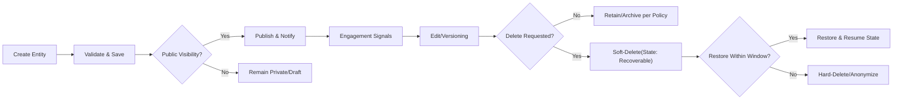
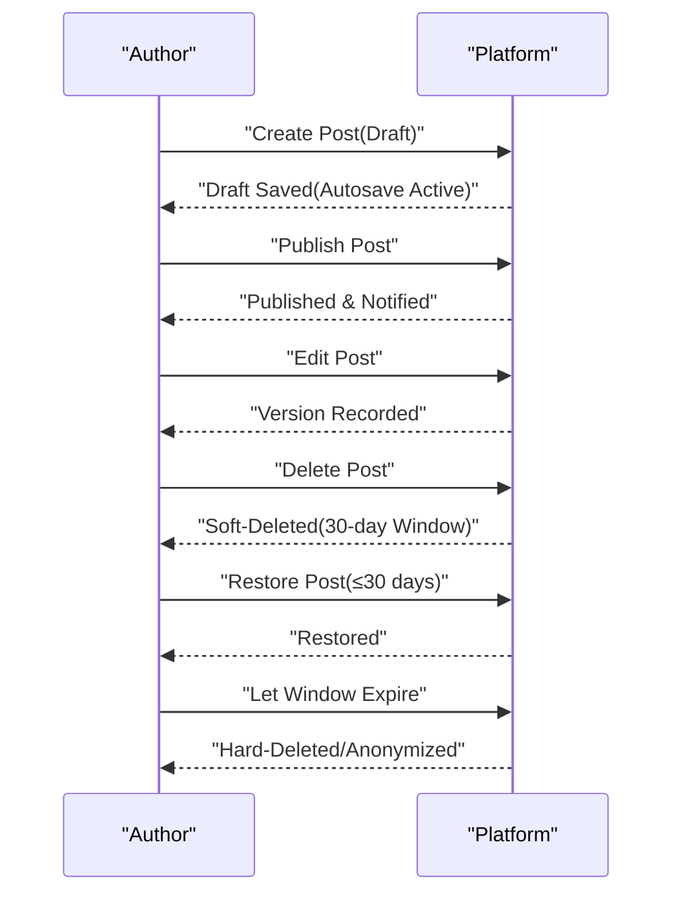
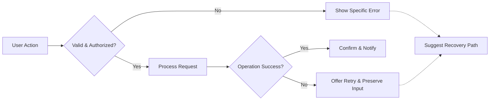

# econDiscuss Data Lifecycle and Exception Handling Requirements

## 1. Scope and Objectives
Business requirements governing how econDiscuss handles information from creation to archival and deletion, including user-facing error behaviors and recovery. Applies platform-wide to profiles, verified expertise workflows, posts/comments, drafts, votes, bookmarks/collections, follows/subscriptions, polls, search/trending signals, notifications, moderation records, and audit logs.

Objectives
- Protect professional discourse quality and user trust with predictable, testable lifecycle behaviors.
- Specify retention, archival, deletion, redaction, and propagation to derived stores and backups in measurable terms.
- Define role-based access and visibility for lifecycle actions without dictating technical implementation.
- Ensure error handling, incident communications, and performance expectations are explicit and measurable.

Constraints
- Business rules only; no database schemas, API payloads, or transport protocols.
- EARS format used for all applicable requirements in en-US.

Service prefix: econDiscuss

## 2. Definitions and Data Categories
- Posts: Long-form entries authored by members or verifiedExperts; may embed polls.
- Comments: Threaded responses to posts; limited nesting per authoring rules.
- Drafts: Non-public, auto-saved or manually saved works-in-progress.
- Polls: Structured sentiment instruments with scheduled start and end.
- Votes: User up/down choices on posts/comments; private to voter at identity level.
- Bookmarks/Collections: Private saved references; collections can be shared by explicit opt-in.
- Follows/Subscriptions: User’s preferences to elevate authors and topics.
- Notifications: In-app and off-platform alerts; subject to quiet hours and batching.
- Profiles: Public identity fields; sensitive identity artifacts remain private.
- Expertise Evidence: Submitted materials for verification; sensitive and access-restricted.
- Moderation Records: Reports, triage, decisions, sanctions, appeals, curation.
- Reputation Signals: Derived quality scores and unlock statuses.
- Search/Trending Signals: Derived signals for discovery surfaces; include diversity and expert weighting.
- Audit Logs: Immutable records of sensitive actions and policy changes.

## 3. Roles and Responsibilities (Business Perspective)
Roles: visitor, member, verifiedExpert, moderator, admin.

EARS (role scope)
- WHERE role is "visitor", THE platform SHALL permit viewing only of public content and public indices and SHALL deny creation, deletion, restoration, or export actions.
- WHERE role is "member" or above, THE platform SHALL allow lifecycle actions on own content (drafts, posts, comments, bookmarks) per deletion and recovery policies.
- WHERE role is "verifiedExpert", THE platform SHALL apply the same lifecycle rights as member with additional expert-only thread modes governed by governance policy.
- WHERE role is "moderator", THE platform SHALL allow administrative deletion/restoration per sanctions, verification, and governance workflows, subject to audit and dual-control for severe actions.
- WHERE role is "admin", THE platform SHALL allow configuration of retention defaults, legal holds, and platform-wide lifecycle policies subject to audit requirements.

## 4. Lifecycle Overview (Creation → Retention/Archive → Deletion/Recovery)

Universal lifecycle rules
- THE platform SHALL record creation timestamp, author, and visibility state at creation for each entity.
- WHEN content is published, THE platform SHALL trigger discovery, feed inclusion, and notifications according to discovery and notifications policies.
- WHEN deletion is requested, THE platform SHALL transition to soft-delete (recoverable) unless policy requires immediate hard-delete (e.g., PII erasure) and SHALL start a recovery timer.
- WHILE an entity is soft-deleted, THE platform SHALL remove public access, show minimal placeholders where thread integrity requires, and preserve restoration capability within the window.
- IF a legal hold is applied, THEN THE platform SHALL suspend hard-deletion and SHALL inform the requester about the hold in a privacy-preserving manner.

Entity-specific notes
- Posts: Public or scoped visibility; version history maintained per authoring policy; may include polls that outlive the edit window.
- Comments: Threaded; parent/child links preserved; placeholders indicate removed parents.
- Drafts: Private to author; autosave, cross-device sync, conflict handling per authoring policy.
- Polls: Time-bounded; results aggregated; visibility modes as defined in polling policy; structural edits blocked after start.
- Votes: Aggregated counts public; voter identity private; history visible only to the voter; moderation may discount votes for integrity.
- Bookmarks/Collections: Always private at item level; shared collections expose only metadata required for viewing; notes stay private.
- Follows/Subscriptions: Stored as preferences; affect feeds and digests.
- Notifications: Ephemeral visibility; content minimized to avoid leaking private data.
- Profiles/Expertise: Profile fields public by default; sensitive artifacts private and access-controlled.
- Moderation Records: Retained for governance; not exposed to general users.

Lifecycle overview (Mermaid)

## 5. Retention and Archival Policies

Default retention durations (business baselines)
- Posts (public): retain indefinitely; archive metadata after 365 days of inactivity.
- Comments (public): retain indefinitely; archive metadata after 365 days of inactivity.
- Drafts: retain 180 days from last edit; expire thereafter with 14-day grace recovery if referenced locally.
- Polls: retain definition and aggregates indefinitely; retain linkage to identifiable responses for 365 days, then keep anonymized aggregates only.
- Votes: retain aggregate counts indefinitely; retain user-to-vote linkage for 730 days, then de-identify while preserving totals.
- Bookmarks/Collections: retain until user deletes; tombstone when underlying content is unavailable.
- Follows/Subscriptions: retain until changed by user or account is deleted.
- Notifications: retain visible notifications 90 days; archive metadata 365 days; remove personal notification contents after 365 days.
- Profiles: retain while account active; anonymize display name and remove PII on account deletion.
- Expertise Evidence: retain while verification active; 365 days after expiry/revocation for appeals; delete thereafter unless legal hold.
- Moderation Records: retain 730 days; permanent-ban minimal records retained indefinitely (anonymized as feasible).
- Audit Logs (sensitive actions): retain 730 days.

EARS (retention)
- THE platform SHALL apply the above retention durations by entity type unless superseded by regulatory requirements.
- WHERE regulation mandates shorter or longer retention, THE platform SHALL override defaults and record the basis in policy pages.

Archival behaviors
- WHEN an item is archived, THE platform SHALL keep it accessible to authorized viewers with an “archived” indicator and MAY reduce freshness in search/trending surfaces.
- WHEN archived items are exported by the owner, THE platform SHALL include them in the export package.

Legal hold and exceptions
- WHEN a legal hold is placed, THE platform SHALL halt deletion/erasure for affected data until the hold is cleared.
- IF a legal hold exists, THEN THE platform SHALL inform the user about limited actions without disclosing sensitive legal details.

## 6. Deletion and Recovery Windows

Deletion types
- Soft-delete: entity becomes non-public and recoverable for a fixed window.
- Hard-delete: irreversible removal and/or anonymization; aggregate counts may persist in non-identifying form.

Recovery windows
- Posts: soft-delete recoverable for 30 days by author or moderator.
- Comments: soft-delete recoverable for 30 days by author or moderator.
- Drafts: soft-delete recoverable for 14 days after expiration by author.
- Polls: not hard-deletable by non-admin once votes exist; may be closed; removal subject to transparency and policy.
- Votes: withdrawal allowed within 24 hours unless prohibited by locked decisions; thereafter linkages follow retention schedule.
- Profiles (account level): deactivation for 30 days allows reactivation; after 30 days, PII removal and anonymization occur.

EARS (deletion & recovery)
- WHEN a user requests deletion of an eligible item, THE platform SHALL transition it to soft-delete within 2 seconds and start the recovery window.
- WHILE an item is soft-deleted, THE platform SHALL show a placeholder where thread integrity requires and prevent public access to content.
- IF the recovery window elapses without restoration, THEN THE platform SHALL execute hard-deletion or anonymization within 24 hours and record an audit entry.
- WHERE quoted content contains PII and a deletion request targets that PII, THE platform SHALL remove or redact PII-containing segments from derivative content where feasible.

Cascading effects and references
- Replies to deleted comments remain with “parent deleted” indicator; reply visibility preserved.
- Bookmarks to unavailable items display “unavailable” status; owners may keep or delete the bookmark.
- Search/trending exclude soft-deleted and hard-deleted items from public results.

Account deletion
- WHEN an account is deactivated, THE platform SHALL allow reactivation within 30 days.
- AFTER 30 days, THE platform SHALL remove PII, replace public identifiers with “Deleted Member,” and retain non-identifying aggregates.

## 7. Privacy, PII, and Sensitive Artifacts

PII removal and redaction
- THE platform SHALL remove PII on account deletion, including email, real names, institutional identifiers, except where retention is legally required.
- WHERE PII appears inside content bodies, THE platform SHALL honor PII removal requests by hard-deleting or redacting those segments and documenting outcomes in audit logs.

Expertise evidence handling
- WHEN users submit verification evidence, THE platform SHALL restrict access to assigned reviewers/admins and watermark sensitive downloads with case ID and timestamp.
- IF verification is denied or expires, THEN THE platform SHALL retain evidence for 365 days for appeals before deletion absent legal hold.

Derived stores and backups
- WHEN deletion or redaction is completed in the primary store, THE platform SHALL propagate removal to derived stores (search indices, caches, analytics) within 7 days and to backups within 30 days, ensuring deleted PII is not user-accessible from any interface.
- WHERE propagation is pending, THE platform SHALL mark items as “pending purge” in internal systems and prevent resurfacing in user-visible contexts.

Timezones and presentation
- WHEN displaying timestamps to users, THE platform SHALL present times in the user’s configured timezone; internal processing remains in UTC.

## 8. Error Scenarios and Recovery

Authentication and authorization
- WHEN invalid credentials are submitted, THE platform SHALL inform the user with a generic error and provide a reset path.
- WHEN an action exceeds permissions, THE platform SHALL deny and explain the minimal path to eligibility (e.g., sign in, verify email, role requirement).

Validation and concurrency
- WHEN content fails validation (length, attachments, required tags/citations), THE platform SHALL reject with precise errors and preserve input as a draft.
- WHEN concurrent edits occur by the same author across devices, THE platform SHALL preserve both versions and require conflict resolution; drafts retained for at least 14 days.

Rate limits and anti-abuse
- WHEN rate limits are exceeded, THE platform SHALL communicate cooldown timers and avoid revealing sensitive thresholds that could be gamed.

Polls and votes
- WHEN a poll closes, THE platform SHALL prevent new votes and show closure status.
- IF a user attempts to retract a vote after the 24-hour window, THEN THE platform SHALL decline and reference the policy.

Bookmarks and orphaned references
- WHEN a bookmarked item becomes unavailable, THE platform SHALL show “unavailable” status and offer removal while allowing the user to retain the record.

Notifications and quiet hours
- WHILE quiet hours are active, THE platform SHALL queue non-critical notifications and SHALL deliver after the quiet period according to preferences.

Search/trending degraded modes
- WHEN search or trending is unavailable, THE platform SHALL present a fallback feed and an indicator of degraded mode.

System errors and retry
- IF an unexpected error occurs, THEN THE platform SHALL show a neutral error, auto-log the event, preserve user input for retry up to 10 minutes, and provide a retry option within 2 seconds.

Error response timings (performance)
- THE platform SHALL present validation errors within 2 seconds of submission.
- THE platform SHALL return permission errors within 1 second of the action.

## 9. Incident Communication and Transparency

Severity levels (business definitions)
- Sev 1: Widespread outage/data loss risk; critical features inoperative.
- Sev 2: Major degradation/regional impact; critical features unreliable.
- Sev 3: Partial feature degradation; workarounds exist.
- Sev 4: Minor issues; cosmetic/low-impact defects.

Status communications
- WHEN Sev 1 is confirmed, THE platform SHALL publish an initial status within 15 minutes and update at least every 30 minutes until resolved.
- WHEN Sev 2 is confirmed, THE platform SHALL publish an initial status within 30 minutes and update at least every 60 minutes until resolved.
- WHEN Sev 3–4 are confirmed, THE platform SHALL publish status notes in a reasonable timeframe and display in-app notices for impacted features.

Post-incident
- THE platform SHALL publish a post-incident summary within 72 hours for Sev 1–2 including impact, timeline, and prevention steps without sensitive internals.
- WHERE user data operations were impacted (e.g., delayed deletions), THE platform SHALL enumerate affected operations and remediation paths.

## 10. Performance and Non-Functional Expectations

Operational SLAs (P95 under target scale)
- Soft-delete transition: within 2 seconds for typical items; within 10 seconds for items with extensive dependents.
- Restore operation: within 5 seconds for typical items; within 20 seconds for items with extensive dependents.
- Export preparation: complete within 24 hours for large datasets; within 2 minutes for ≤ 5,000 items; deliver securely for 7 days.
- Archival toggle and indicator updates: within 5 seconds.
- Propagation to search indices/caches/analytics: within 5 seconds for freshness indicators; full availability within 2 minutes under normal load.
- Deletion propagation to derived stores: within 7 days; to backups: within 30 days.

EARS (performance)
- THE platform SHALL meet the above latency and propagation targets under normal operating conditions and SHALL indicate progress where operations exceed 2 seconds.
- WHEN performance degrades beyond P95 targets for 5 minutes, THE platform SHALL trigger internal alerts and initiate graceful degradation that favors core reads.

## 11. Auditability, Logging, and Export

Auditability
- THE platform SHALL record audit entries for publication, deletion, restoration, moderation actions, verification decisions, account state changes, and legal hold operations without storing unnecessary content bodies.
- WHEN admins/moderators access sensitive records, THE platform SHALL log actor, purpose, timestamp, and scope in tamper-evident logs.

User data export
- THE platform SHALL allow users to export posts, comments, bookmarks, follows/subscriptions, and own voting history.
- WHEN an export is generated, THE platform SHALL retain the downloadable package for 7 days before secure deletion.

Transparency records
- THE platform SHALL maintain transparency summaries of moderator/admin actions impacting public content without disclosing PII.

## 12. Success Criteria and Acceptance Scenarios

Success criteria
- Consistent retention and deletion behaviors across all entity types with published recovery windows.
- Clear, timed error and incident communications within specified SLAs.
- Privacy-aligned PII handling and propagation to derived stores and backups within SLAs.
- No user-visible message loss; placeholders preserve thread integrity where required.

Acceptance scenarios (business-level)
- WHEN a member soft-deletes a post, THEN a placeholder appears to maintain thread integrity, recovery is offered for 30 days, and hard-delete occurs within 24 hours after window expiry.
- WHEN a user deletes an account, THEN PII is erased or anonymized within 30 days; derived indices and caches purge within 7 days, backups within 30 days; public aggregates remain without identity.
- WHEN a legal hold is applied, THEN deletion operations are suspended, the user is informed of limited actions, and an audit record is created.
- WHEN search is degraded, THEN a fallback feed appears and a banner indicates degraded mode until recovery.
- WHEN concurrent edits occur, THEN both versions persist, conflict resolution is requested, and no content is lost.

## 13. Appendices

### A) Example Lifecycle for a Post

### B) Generic Error Handling Flow

