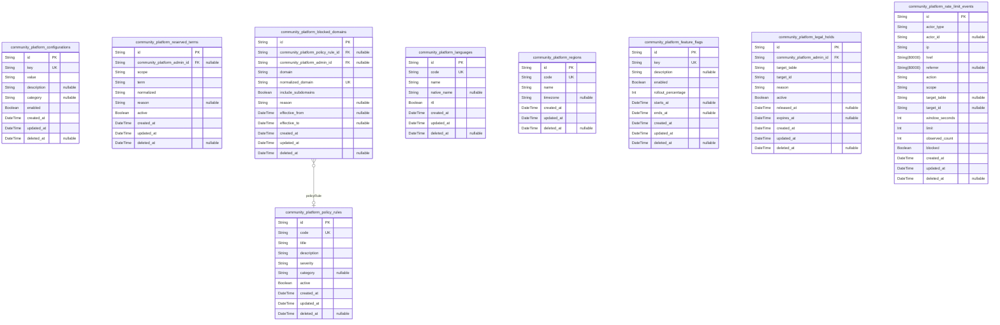
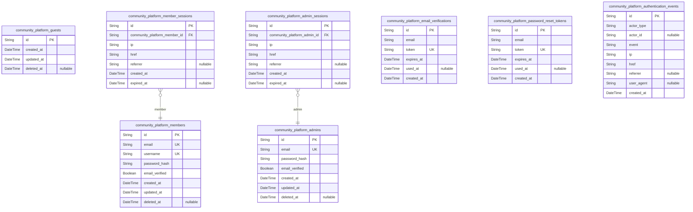
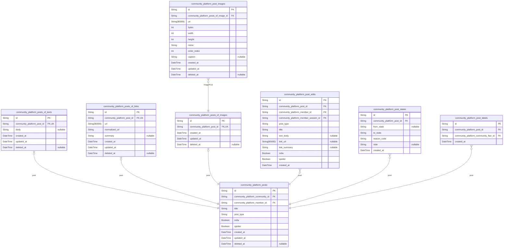
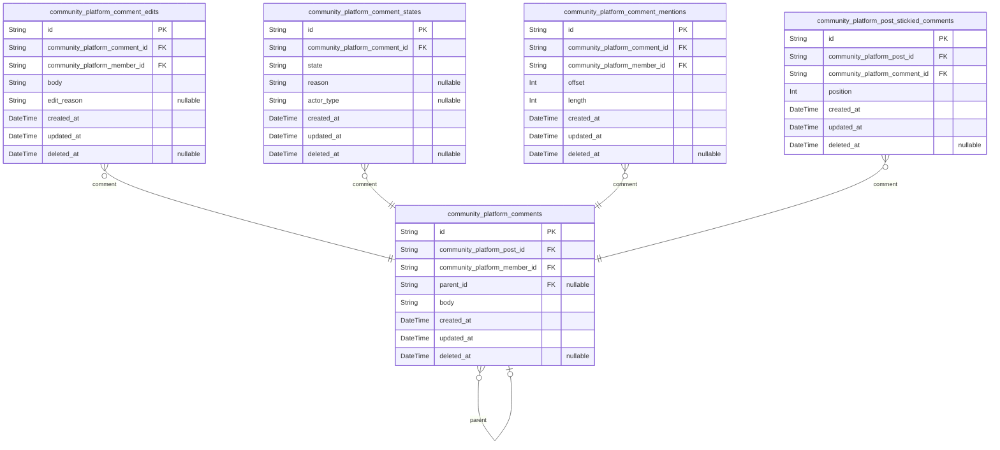
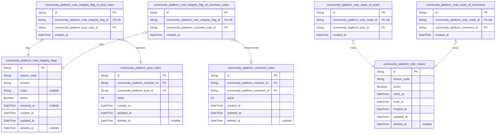
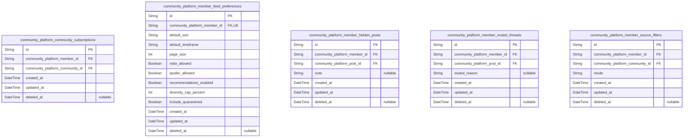
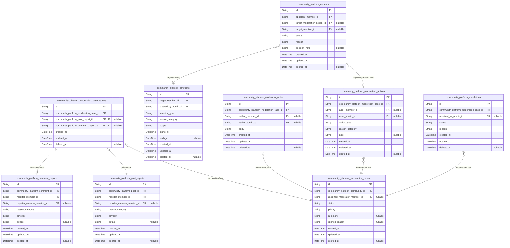

# Prisma Markdown

> Generated by [`prisma-markdown`](https://github.com/samchon/prisma-markdown)

- [Systematic](#systematic)
- [Actors](#actors)
- [Communities](#communities)
- [Posts](#posts)
- [Comments](#comments)
- [Votes](#votes)
- [Subscriptions](#subscriptions)
- [Moderation](#moderation)
- [Notifications](#notifications)
- [Profiles](#profiles)

## Systematic

```mermaid
erDiagram
"community_platform_configurations" {
  String id PK
  String key UK
  String value
  String description "nullable"
  String category "nullable"
  Boolean enabled
  DateTime created_at
  DateTime updated_at
  DateTime deleted_at "nullable"
}
"community_platform_reserved_terms" {
  String id PK
  String community_platform_admin_id FK "nullable"
  String scope
  String term
  String normalized
  String reason "nullable"
  Boolean active
  DateTime created_at
  DateTime updated_at
  DateTime deleted_at "nullable"
}
"community_platform_blocked_domains" {
  String id PK
  String community_platform_policy_rule_id FK "nullable"
  String community_platform_admin_id FK "nullable"
  String domain
  String normalized_domain UK
  Boolean include_subdomains
  String reason "nullable"
  DateTime effective_from "nullable"
  DateTime effective_to "nullable"
  DateTime created_at
  DateTime updated_at
  DateTime deleted_at "nullable"
}
"community_platform_languages" {
  String id PK
  String code UK
  String name
  String native_name "nullable"
  Boolean rtl
  DateTime created_at
  DateTime updated_at
  DateTime deleted_at "nullable"
}
"community_platform_regions" {
  String id PK
  String code UK
  String name
  String timezone "nullable"
  DateTime created_at
  DateTime updated_at
  DateTime deleted_at "nullable"
}
"community_platform_policy_rules" {
  String id PK
  String code UK
  String title
  String description
  String severity
  String category "nullable"
  Boolean active
  DateTime created_at
  DateTime updated_at
  DateTime deleted_at "nullable"
}
"community_platform_feature_flags" {
  String id PK
  String key UK
  String description "nullable"
  Boolean enabled
  Int rollout_percentage
  DateTime starts_at "nullable"
  DateTime ends_at "nullable"
  DateTime created_at
  DateTime updated_at
  DateTime deleted_at "nullable"
}
"community_platform_legal_holds" {
  String id PK
  String community_platform_admin_id FK
  String target_table
  String target_id
  String reason
  Boolean active
  DateTime released_at "nullable"
  DateTime expires_at "nullable"
  DateTime created_at
  DateTime updated_at
  DateTime deleted_at "nullable"
}
"community_platform_rate_limit_events" {
  String id PK
  String actor_type
  String actor_id "nullable"
  String ip
  String(80000) href
  String(80000) referrer "nullable"
  String action
  String scope
  String target_table "nullable"
  String target_id "nullable"
  Int window_seconds
  Int limit
  Int observed_count
  Boolean blocked
  DateTime created_at
  DateTime updated_at
  DateTime deleted_at "nullable"
}
"community_platform_blocked_domains" }o--o| "community_platform_policy_rules" : policyRule
```

### `community_platform_configurations`

Global platform configurations for system-wide behavior (e.g., limits,
toggles, validation bounds). Acts as a canonical key-value configuration
registry referenced by services. Each configuration is independently
managed and audited.

Properties as follows:

- `id`: Primary Key.
- `key`
  > Unique configuration key (case-insensitive business identifier) such as
  > "posting.max_images" or "auth.session_idle_days".
- `value`
  > Raw configuration value stored as text (interpretation is
  > application-specific; not computed).
- `description`: Human-readable explanation of the configuration purpose and usage context.
- `category`
  > Optional logical grouping/category to assist discovery and management
  > (e.g., "posting", "auth").
- `enabled`
  > Whether this configuration entry is currently enabled by policy (soft
  > switch without deletion).
- `created_at`: Creation timestamp of the configuration entry.
- `updated_at`: Last update timestamp of the configuration entry.
- `deleted_at`: Soft deletion timestamp when the configuration is logically removed.

### `community_platform_reserved_terms`

Globally reserved terms and prefixes prohibited or protected across the
platform (e.g., usernames, community names, system-reserved prefixes).
Managed by admins with scope and lifecycle tracking. The admin reference
is optional provenance and must not cause record deletion upon admin
removal.

Properties as follows:

- `id`: Primary Key.
- `community_platform_admin_id`
  > Admin who created or last enforced this reservation. {@link
  > community_platform_admins.id}. Optional provenance; null if the admin
  > account is removed.
- `scope`: Reservation scope (e.g., "username", "community_name", "prefix").
- `term`: Original reserved term or prefix as provided by policy or admin.
- `normalized`
  > Normalized representation used for case-insensitive comparisons and
  > look-alikes.
- `reason`: Policy reason or context for the reservation.
- `active`: Whether this reserved term is currently enforced.
- `created_at`: Creation timestamp of the reserved term entry.
- `updated_at`: Last update timestamp of the reserved term entry.
- `deleted_at`: Soft deletion timestamp for the reserved term entry.

### `community_platform_blocked_domains`

Global domain blocklist applied platform-wide for link posts and external
references. Controls policy-based exclusions and can reference a
governing policy rule for traceability. Admin and policy rule FKs are
optional provenance and should be nulled—not cascaded—when referenced
records are removed.

Properties as follows:

- `id`: Primary Key.
- `community_platform_policy_rule_id`
  > Associated policy rule justifying the block. {@link
  > community_platform_policy_rules.id}. Optional; null if rule is removed.
- `community_platform_admin_id`
  > Admin who created or last modified the block. {@link
  > community_platform_admins.id}. Optional; null if admin is removed.
- `domain`: Registered domain name or pattern submitted for blocking (as provided).
- `normalized_domain`: Canonical, normalized domain used for enforcement and uniqueness.
- `include_subdomains`: Whether the block applies to all subdomains under the normalized domain.
- `reason`: Human-readable reason or context for the block entry.
- `effective_from`: Optional start time when the block becomes effective.
- `effective_to`: Optional end time after which the block no longer applies.
- `created_at`: Creation timestamp of the block entry.
- `updated_at`: Last update timestamp of the block entry.
- `deleted_at`: Soft deletion timestamp of the block entry.

### `community_platform_languages`

Controlled vocabulary of supported languages for localization and policy
gating (BCP‑47 compatible codes). Referenced across the platform for
content and preference settings.

Properties as follows:

- `id`: Primary Key.
- `code`: Language code (e.g., "en-US"). Treated as a business-unique identifier.
- `name`: English-language name of the language (e.g., "English (United States)").
- `native_name`: Endonym/native display name (e.g., "English", "Deutsch").
- `rtl`: Whether the language is right-to-left (RTL).
- `created_at`: Creation timestamp for the language entry.
- `updated_at`: Last update timestamp for the language entry.
- `deleted_at`: Soft deletion timestamp for the language entry.

### `community_platform_regions`

Controlled vocabulary of regions for policy and preference targeting
(e.g., ISO region codes). Used by communities and profiles for
locale-specific behavior.

Properties as follows:

- `id`: Primary Key.
- `code`: Region code (e.g., "US", "KR"). Business-unique identifier.
- `name`: Region name in English (e.g., "United States", "Korea").
- `timezone`
  > Representative IANA timezone identifier, if applicable (e.g.,
  > "Asia/Seoul").
- `created_at`: Creation timestamp for the region entry.
- `updated_at`: Last update timestamp for the region entry.
- `deleted_at`: Soft deletion timestamp for the region entry.

### `community_platform_policy_rules`

Platform policy rule catalog defining rule codes, titles, descriptions,
severity, and category. Referenced by enforcement actions and blocklists.

Properties as follows:

- `id`: Primary Key.
- `code`: Stable business identifier for the policy rule (e.g., "SPAM", "HATE").
- `title`: Human-readable rule title.
- `description`: Detailed description of the rule and its scope.
- `severity`
  > Business severity classification (e.g., "low", "medium", "high",
  > "critical").
- `category`
  > Optional categorization/grouping for the rule (e.g., "safety",
  > "integrity").
- `active`: Whether this rule is currently active and applicable.
- `created_at`: Creation timestamp for the policy rule.
- `updated_at`: Last update timestamp for the policy rule.
- `deleted_at`: Soft deletion timestamp for the policy rule.

### `community_platform_feature_flags`

Global feature toggle registry to control progressive rollouts and
experiments. Supports percentage rollouts and scheduling windows.

Properties as follows:

- `id`: Primary Key.
- `key`: Business-unique feature key (e.g., "feeds.hot.v2").
- `description`: Business description of the feature and intended audiences.
- `enabled`: Whether the flag is currently enabled (global allow).
- `rollout_percentage`: Rollout percentage (0–100) for gradual enablement.
- `starts_at`: Optional start time for the flag to become effective.
- `ends_at`: Optional end time for the flag to cease effect.
- `created_at`: Creation timestamp for the feature flag.
- `updated_at`: Last update timestamp for the feature flag.
- `deleted_at`: Soft deletion timestamp for the feature flag.

### `community_platform_legal_holds`

Records of legal holds applied to platform entities for compliance.
Identifies target entity generically and the issuing admin, with
lifecycle timestamps for release/expiry. Used to prevent purge and
enforce retention. The admin reference is mandatory provenance and
deletion of the admin must not cascade into legal holds.

Properties as follows:

- `id`: Primary Key.
- `community_platform_admin_id`
  > Admin who issued the legal hold. [community_platform_admins.id](#community_platform_admins).
  > Mandatory provenance; prevent deletion while holds exist.
- `target_table`
  > Target table name of the held entity (snake_case). Enables generic
  > cross-domain targeting without polymorphic FKs.
- `target_id`: Target entity identifier (UUID).
- `reason`: Business reason or legal reference for the hold.
- `active`
  > Whether the legal hold is currently active. When false, the hold is
  > considered released or expired.
- `released_at`: Timestamp when the legal hold was released. Null when still active.
- `expires_at`: Optional expiration time for automatic release when applicable.
- `created_at`: Creation timestamp for the legal hold record.
- `updated_at`: Last update timestamp for the legal hold record.
- `deleted_at`: Soft deletion timestamp for the legal hold record.

### `community_platform_rate_limit_events`

System-generated telemetry entries capturing rate limit evaluations and
blocks across the platform. Used for abuse prevention analytics, incident
reviews, and tuning. Actor fields are normalized via a discriminator
without multiple nullable FKs.

Properties as follows:

- `id`: Primary Key.
- `actor_type`: Actor type that triggered the event (e.g., "guest", "member", "admin").
- `actor_id`
  > Actor identifier if applicable (e.g., member/admin UUID); null for guests
  > or when unavailable.
- `ip`: Source IP address associated with the triggering request.
- `href`: Request URL at the time of evaluation for context.
- `referrer`: Referrer URL supplied by the client, if any.
- `action`
  > Action type evaluated by the limiter (e.g., "post.create",
  > "comment.create", "vote.toggle", "login.attempt").
- `scope`
  > Scope of the limiter (e.g., "platform", "community:<uuid>", or a logical
  > grouping key).
- `target_table`: Optional targeted table associated with the event (when applicable).
- `target_id`: Optional targeted entity id associated with the event.
- `window_seconds`: Configured window size in seconds for the evaluated limiter.
- `limit`: Configured maximum allowed actions within the window.
- `observed_count`: Observed count used in the evaluation at the time of the event.
- `blocked`: Whether the limiter blocked the action due to exceeding the threshold.
- `created_at`: Event creation timestamp (when evaluation occurred).
- `updated_at`: Last update timestamp for the event record; primarily system-maintained.
- `deleted_at`: Soft deletion timestamp when a record is logically removed.

## Actors

```mermaid
erDiagram
"community_platform_members" {
  String id PK
  String email UK
  String username UK
  String password_hash
  Boolean email_verified
  DateTime created_at
  DateTime updated_at
  DateTime deleted_at "nullable"
}
"community_platform_admins" {
  String id PK
  String email UK
  String password_hash
  Boolean email_verified
  DateTime created_at
  DateTime updated_at
  DateTime deleted_at "nullable"
}
"community_platform_guests" {
  String id PK
  DateTime created_at
  DateTime updated_at
  DateTime deleted_at "nullable"
}
"community_platform_member_sessions" {
  String id PK
  String community_platform_member_id FK
  String ip
  String href
  String referrer "nullable"
  DateTime created_at
  DateTime expired_at "nullable"
}
"community_platform_admin_sessions" {
  String id PK
  String community_platform_admin_id FK
  String ip
  String href
  String referrer "nullable"
  DateTime created_at
  DateTime expired_at "nullable"
}
"community_platform_email_verifications" {
  String id PK
  String email
  String token UK
  DateTime expires_at
  DateTime used_at "nullable"
  DateTime created_at
}
"community_platform_password_reset_tokens" {
  String id PK
  String email
  String token UK
  DateTime expires_at
  DateTime used_at "nullable"
  DateTime created_at
}
"community_platform_authentication_events" {
  String id PK
  String actor_type
  String actor_id "nullable"
  String event
  String ip
  String href
  String referrer "nullable"
  String user_agent "nullable"
  DateTime created_at
}
"community_platform_member_sessions" }o--|| "community_platform_members" : member
"community_platform_admin_sessions" }o--|| "community_platform_admins" : admin
```

### `community_platform_members`

Registered platform members (end users). Stores login credentials,
verification state, and globally unique immutable username handle for
public identity. Sessions are maintained in {@link
community_platform_member_sessions}. Used by content, subscriptions,
profiles, mentions, and moderation via foreign references created
elsewhere.

Properties as follows:

- `id`: Primary Key.
- `email`: Member’s unique email address used for login and account communications.
- `username`
  > Public unique immutable handle used for mentions, attribution, and
  > profile URLs. Case-insensitive uniqueness enforced at business level.
- `password_hash`: Password hash (never store plaintext passwords). Used by authentication.
- `email_verified`: Whether the member’s email has been verified.
- `created_at`: Creation timestamp of the member account.
- `updated_at`: Last update timestamp of the member account.
- `deleted_at`: Soft deletion timestamp; null if active.

### `community_platform_admins`

Platform administrators with elevated privileges. Credentials are
separate from members for security isolation. Sessions are maintained in
[community_platform_admin_sessions](#community_platform_admin_sessions).

Properties as follows:

- `id`: Primary Key.
- `email`
  > Administrator’s unique email address for login and administrative
  > notifications.
- `password_hash`: Password hash for the administrator account.
- `email_verified`: Whether the admin’s email has been verified.
- `created_at`: Creation timestamp of the admin account.
- `updated_at`: Last update timestamp of the admin account.
- `deleted_at`: Soft deletion timestamp; null if active.

### `community_platform_guests`

Anonymous/guest identities for analytics and limited interactions where
allowed by policy. Guests do not have sessions and cannot authenticate.

Properties as follows:

- `id`: Primary Key.
- `created_at`: Creation timestamp for the guest placeholder identity.
- `updated_at`: Last update timestamp for the guest placeholder identity.
- `deleted_at`: Soft deletion timestamp; null if active.

### `community_platform_member_sessions`

Authenticated session records for [community_platform_members](#community_platform_members).
Strictly limited fields per session specification for audit tracing and
revocation. No extra fields beyond the required set and only the mandated
composite index.

Properties as follows:

- `id`: Primary Key.
- `community_platform_member_id`: Belonged member’s [community_platform_members.id](#community_platform_members)
- `ip`: IP address at session establishment time.
- `href`: Request URL at login (for context/audit).
- `referrer`: Referrer URL at login time, if any.
- `created_at`: Session creation time.
- `expired_at`: Session expiration or revocation time; null if active.

### `community_platform_admin_sessions`

Authenticated session records for [community_platform_admins](#community_platform_admins).
Strictly limited fields per session specification for audit tracing and
revocation. No extra fields beyond the required set and only the mandated
composite index.

Properties as follows:

- `id`: Primary Key.
- `community_platform_admin_id`: Belonged admin’s [community_platform_admins.id](#community_platform_admins)
- `ip`: IP address at session establishment time.
- `href`: Request URL at login (for context/audit).
- `referrer`: Referrer URL at login time, if any.
- `created_at`: Session creation time.
- `expired_at`: Session expiration or revocation time; null if active.

### `community_platform_email_verifications`

Email verification artifacts for both members and admins. Actor-agnostic
design keyed by email and token avoids polymorphic foreign keys while
supporting all identity classes.

Properties as follows:

- `id`: Primary Key.
- `email`: Target email address to be verified.
- `token`: Verification token issued to the email address.
- `expires_at`: Token expiry timestamp after which verification is invalid.
- `used_at`: Timestamp when the token was consumed; null if not used.
- `created_at`: Artifact creation time.

### `community_platform_password_reset_tokens`

Password reset artifacts for both members and admins. Actor-agnostic
design keyed by email and token avoids polymorphic foreign keys while
supporting all identity classes.

Properties as follows:

- `id`: Primary Key.
- `email`: Email address that requested password reset.
- `token`: Password reset token.
- `expires_at`: Token expiry timestamp after which reset is invalid.
- `used_at`: Timestamp when the token was consumed; null if not used.
- `created_at`: Artifact creation time.

### `community_platform_authentication_events`

Authentication lifecycle audit events across all identity classes
(members/admins, and guest-related attempts). Actor-agnostic with type
marker, optional actor_id pointer, and request context. Useful for
security analytics and abuse detection. Indexed for common queries by
event type and time.

Properties as follows:

- `id`: Primary Key.
- `actor_type`: Actor type for the event (e.g., "member", "admin", "guest").
- `actor_id`
  > Actor identifier when known; null for unauthenticated attempts or guest
  > events.
- `event`
  > Event category (e.g., login_success, login_failure, logout,
  > password_reset_request, email_verified).
- `ip`: IP address associated with the event.
- `href`: Request URL at the time of the event.
- `referrer`: Referrer URL at the time of the event, if any.
- `user_agent`: Reported user agent string; optional for analytics and triage.
- `created_at`: Event creation timestamp.

## Communities

```mermaid
erDiagram
"community_platform_communities" {
  String id PK
  String creator_member_id FK
  String current_owner_member_id FK
  String community_platform_language_id FK "nullable"
  String community_platform_region_id FK "nullable"
  String name UK
  String normalized_name UK
  String display_name
  String description "nullable"
  String visibility
  Boolean nsfw
  String state
  DateTime created_at
  DateTime updated_at
  DateTime deleted_at "nullable"
}
"community_platform_community_settings" {
  String id PK
  String community_platform_community_id FK,UK
  Boolean allow_text_posts
  Boolean allow_link_posts
  Boolean allow_image_posts
  Boolean require_post_approval
  String join_approval_mode
  String posting_eligibility
  DateTime created_at
  DateTime updated_at
  DateTime deleted_at "nullable"
}
"community_platform_community_rules" {
  String id PK
  String community_platform_community_id FK
  String code
  String title
  String body "nullable"
  Int order
  DateTime created_at
  DateTime updated_at
  DateTime deleted_at "nullable"
}
"community_platform_community_topics" {
  String id PK
  String community_platform_community_id FK
  String name
  String description "nullable"
  Int order
  DateTime created_at
  DateTime updated_at
  DateTime deleted_at "nullable"
}
"community_platform_community_moderators" {
  String id PK
  String community_platform_community_id FK
  String community_platform_member_id FK
  String assigned_by_member_id FK "nullable"
  String tier
  DateTime created_at
  DateTime updated_at
  DateTime deleted_at "nullable"
}
"community_platform_community_moderator_invitations" {
  String id PK
  String community_platform_community_id FK
  String invited_member_id FK
  String invited_by_member_id FK "nullable"
  String tier
  String status
  DateTime expires_at
  DateTime created_at
  DateTime updated_at
  DateTime deleted_at "nullable"
}
"community_platform_community_owner_transfers" {
  String id PK
  String community_platform_community_id FK
  String from_member_id FK
  String to_member_id FK
  String status
  DateTime expires_at
  DateTime decided_at "nullable"
  DateTime created_at
  DateTime updated_at
  DateTime deleted_at "nullable"
}
"community_platform_community_bans" {
  String id PK
  String community_platform_community_id FK
  String community_platform_member_id FK
  String actor_member_id FK "nullable"
  String reason_code
  DateTime started_at
  DateTime ends_at "nullable"
  DateTime created_at
  DateTime updated_at
  DateTime deleted_at "nullable"
}
"community_platform_community_mutes" {
  String id PK
  String community_platform_community_id FK
  String community_platform_member_id FK
  String actor_member_id FK "nullable"
  String reason_code
  DateTime started_at
  DateTime ends_at "nullable"
  DateTime created_at
  DateTime updated_at
  DateTime deleted_at "nullable"
}
"community_platform_community_join_requests" {
  String id PK
  String community_platform_community_id FK
  String community_platform_member_id FK
  String status
  String note "nullable"
  DateTime expires_at
  DateTime decided_at "nullable"
  DateTime created_at
  DateTime updated_at
  DateTime deleted_at "nullable"
}
"community_platform_community_pinned_posts" {
  String id PK
  String community_platform_community_id FK
  String community_platform_post_id FK
  Int pin_order
  DateTime created_at
  DateTime updated_at
  DateTime deleted_at "nullable"
}
"community_platform_community_flairs" {
  String id PK
  String community_platform_community_id FK
  String code
  String label
  String color
  Int order
  Boolean enabled
  DateTime created_at
  DateTime updated_at
  DateTime deleted_at "nullable"
}
"community_platform_community_banned_domains" {
  String id PK
  String community_platform_community_id FK
  String domain
  String reason "nullable"
  DateTime created_at
  DateTime updated_at
  DateTime deleted_at "nullable"
}
"community_platform_community_settings" |o--|| "community_platform_communities" : community
"community_platform_community_rules" }o--|| "community_platform_communities" : community
"community_platform_community_topics" }o--|| "community_platform_communities" : community
"community_platform_community_moderators" }o--|| "community_platform_communities" : community
"community_platform_community_moderator_invitations" }o--|| "community_platform_communities" : community
"community_platform_community_owner_transfers" }o--|| "community_platform_communities" : community
"community_platform_community_bans" }o--|| "community_platform_communities" : community
"community_platform_community_mutes" }o--|| "community_platform_communities" : community
"community_platform_community_join_requests" }o--|| "community_platform_communities" : community
"community_platform_community_pinned_posts" }o--|| "community_platform_communities" : community
"community_platform_community_flairs" }o--|| "community_platform_communities" : community
"community_platform_community_banned_domains" }o--|| "community_platform_communities" : community
```

### `community_platform_communities`

Top-level community entity representing a topic-based space with its own
rules, moderators, and visibility. Enforces case-insensitive uniqueness
via a normalized_name field while preserving the original name for
presentation and search. References creator and current owner {@link
community_platform_members}. Vocabulary references ({@link
community_platform_languages}, [community_platform_regions](#community_platform_regions)) are
optional. Note: In PSL, prefer onDelete: Restrict/NoAction for member FKs
and SetNull for vocabulary FKs to avoid unintended cascading deletions.

Properties as follows:

- `id`: Primary Key.
- `creator_member_id`: Creator member's [community_platform_members.id](#community_platform_members).
- `current_owner_member_id`: Current owner's [community_platform_members.id](#community_platform_members).
- `community_platform_language_id`
  > Preferred language [community_platform_languages.id](#community_platform_languages). Optional at
  > community level.
- `community_platform_region_id`
  > Geographic region [community_platform_regions.id](#community_platform_regions). Optional at
  > community level.
- `name`
  > Immutable community handle (3–21 chars). Used for presentation and
  > search; case-insensitive uniqueness is enforced by normalized_name.
- `normalized_name`
  > Lowercased/trimmed canonical form of the community handle used for
  > case-insensitive uniqueness and lookups.
- `display_name`: Human-friendly community display name (3–40 chars).
- `description`: Community description shown on overview pages. Up to 500 characters.
- `visibility`: Community visibility: public, restricted, or private.
- `nsfw`: Whether the community is designated as NSFW by policy.
- `state`: Lifecycle state of the community (active, archived, closed, quarantined).
- `created_at`: Creation timestamp.
- `updated_at`: Last update timestamp.
- `deleted_at`: Soft-deletion timestamp for recovery/audit; null when active.

### `community_platform_community_settings`

1:1 extension of a community capturing governance and posting
configuration toggles. Managed by owners/moderators. Related to {@link
community_platform_communities}.

Properties as follows:

- `id`: Primary Key.
- `community_platform_community_id`: Target community's [community_platform_communities.id](#community_platform_communities).
- `allow_text_posts`: Whether text posts are permitted in this community.
- `allow_link_posts`: Whether link posts are permitted in this community.
- `allow_image_posts`: Whether image posts are permitted in this community.
- `require_post_approval`
  > If true, new posts require moderator/owner approval before public
  > visibility.
- `join_approval_mode`: Join policy for members (open, approval_required, invite_only).
- `posting_eligibility`
  > Posting eligibility rules (all_members, subscribers_only,
  > approved_contributors).
- `created_at`: Creation timestamp.
- `updated_at`: Last update timestamp.
- `deleted_at`: Soft-deletion timestamp; null when active.

### `community_platform_community_rules`

Community-defined rule set entries. Each rule has a stable code, title,
and description. Optimized for ordered display by adding a composite
index on (community, order).

Properties as follows:

- `id`: Primary Key.
- `community_platform_community_id`: Owner community's [community_platform_communities.id](#community_platform_communities).
- `code`: Stable rule identifier unique within the community.
- `title`: Rule title presented to members.
- `body`: Detailed rule description (0–500 chars).
- `order`: Display order within the community rules list.
- `created_at`: Creation timestamp.
- `updated_at`: Last update timestamp.
- `deleted_at`: Soft-deletion timestamp; null when active.

### `community_platform_community_topics`

Curated topic tags or categories within a community to organize posts and
discovery. Adds (community, order) index for efficient ordered rendering.
Owned by [community_platform_communities](#community_platform_communities).

Properties as follows:

- `id`: Primary Key.
- `community_platform_community_id`: Parent community's [community_platform_communities.id](#community_platform_communities).
- `name`: Topic/tag name unique within the community.
- `description`: Optional topic description to guide usage.
- `order`: Display order of the topic within the community.
- `created_at`: Creation timestamp.
- `updated_at`: Last update timestamp.
- `deleted_at`: Soft-deletion timestamp; null when active.

### `community_platform_community_moderators`

Assignment of moderators to a community with tier/level. Managed by
owners; supports audit of who assigned. References {@link
community_platform_members}.

Properties as follows:

- `id`: Primary Key.
- `community_platform_community_id`: Target community's [community_platform_communities.id](#community_platform_communities).
- `community_platform_member_id`: Moderator member's [community_platform_members.id](#community_platform_members).
- `assigned_by_member_id`
  > Assigning actor's [community_platform_members.id](#community_platform_members). Optional for
  > system assignments.
- `tier`: Moderator tier (full, content, limited).
- `created_at`: Assignment creation timestamp.
- `updated_at`: Last update timestamp.
- `deleted_at`: Soft-deletion timestamp when revoked.

### `community_platform_community_moderator_invitations`

Invitation records for prospective moderators with tier, status, and
expiry. Adds composite index for pending/expiry workflows to improve
queue operations. References [community_platform_members](#community_platform_members) for
invitee and inviter.

Properties as follows:

- `id`: Primary Key.
- `community_platform_community_id`
  > Community to which the invitation applies {@link
  > community_platform_communities.id}.
- `invited_member_id`: Invited member's [community_platform_members.id](#community_platform_members).
- `invited_by_member_id`: Inviter's [community_platform_members.id](#community_platform_members).
- `tier`: Proposed moderator tier (full, content, limited).
- `status`: Invitation status (pending, accepted, declined, expired, revoked).
- `expires_at`: Expiration deadline of the invitation.
- `created_at`: Creation timestamp.
- `updated_at`: Last update timestamp.
- `deleted_at`: Soft-deletion timestamp; null when active.

### `community_platform_community_owner_transfers`

Ownership transfer offers and decisions. Tracks source and target
members, status, and expiry. Supports audit of governance changes for
[community_platform_communities](#community_platform_communities).

Properties as follows:

- `id`: Primary Key.
- `community_platform_community_id`
  > Community under ownership transfer {@link
  > community_platform_communities.id}.
- `from_member_id`: Current owner's [community_platform_members.id](#community_platform_members).
- `to_member_id`: Prospective owner's [community_platform_members.id](#community_platform_members).
- `status`: Transfer status (pending, accepted, declined, expired, cancelled).
- `expires_at`: Offer expiration deadline.
- `decided_at`: Decision timestamp when accepted/declined.
- `created_at`: Record creation timestamp.
- `updated_at`: Last update timestamp.
- `deleted_at`: Soft-deletion timestamp; null when retained for audit.

### `community_platform_community_bans`

Community-scoped bans applied to members with reason codes and durations.
Added composite index to optimize active-ban checks and expiry sweeps.
References the acting moderator (optional) and the affected member.

Properties as follows:

- `id`: Primary Key.
- `community_platform_community_id`: Community scope [community_platform_communities.id](#community_platform_communities).
- `community_platform_member_id`: Banned member's [community_platform_members.id](#community_platform_members).
- `actor_member_id`
  > Acting moderator's [community_platform_members.id](#community_platform_members). Optional if
  > system applied.
- `reason_code`: Reason category code for the ban as per policy catalog.
- `started_at`: Ban start time.
- `ends_at`: Ban end time; null for permanent bans.
- `created_at`: Record creation time.
- `updated_at`: Last update time.
- `deleted_at`: Soft-deletion timestamp; null when active or retained for audit.

### `community_platform_community_mutes`

Community-level mutes restricting posting/commenting while allowing
reading. Analogous to bans but typically shorter duration.

Properties as follows:

- `id`: Primary Key.
- `community_platform_community_id`: Community scope [community_platform_communities.id](#community_platform_communities).
- `community_platform_member_id`: Muted member's [community_platform_members.id](#community_platform_members).
- `actor_member_id`
  > Acting moderator's [community_platform_members.id](#community_platform_members). Optional if
  > system applied.
- `reason_code`: Reason category code for the mute as per policy catalog.
- `started_at`: Mute start time.
- `ends_at`: Mute end time; null for indefinite mutes.
- `created_at`: Record creation time.
- `updated_at`: Last update time.
- `deleted_at`: Soft-deletion timestamp; null when active or retained for audit.

### `community_platform_community_join_requests`

Join/access requests for private/restricted communities including status
and expiry. Supports 7-day decision window and audit. Allows multiple
requests across time by removing hard uniqueness on (community, member);
application enforces at most one pending request per member per
community. References requester [community_platform_members](#community_platform_members).

Properties as follows:

- `id`: Primary Key.
- `community_platform_community_id`: Target community [community_platform_communities.id](#community_platform_communities).
- `community_platform_member_id`: Requesting member's [community_platform_members.id](#community_platform_members).
- `status`: Request status (pending, approved, denied, expired, cancelled).
- `note`: Optional requester note for moderators/owners.
- `expires_at`: Auto-expiry time for undecided requests (default 7 days).
- `decided_at`: Decision timestamp when not pending.
- `created_at`: Request creation timestamp.
- `updated_at`: Last update timestamp.
- `deleted_at`: Soft-deletion timestamp; null when active or for audit retention.

### `community_platform_community_pinned_posts`

Pinned posts within a community for prioritized visibility. Associates a
community with a post and pin order. Enforces unique pin order per
community for deterministic ordering. References {@link
community_platform_posts}.

Properties as follows:

- `id`: Primary Key.
- `community_platform_community_id`: Community that pins the post [community_platform_communities.id](#community_platform_communities).
- `community_platform_post_id`: Pinned post's [community_platform_posts.id](#community_platform_posts).
- `pin_order`
  > Relative ordering of pinned items (lower = higher priority). Unique
  > within a community.
- `created_at`: Pin creation timestamp.
- `updated_at`: Last update timestamp.
- `deleted_at`: Soft-deletion timestamp when unpinned.

### `community_platform_community_flairs`

Community-managed flair definitions assignable to posts. Unique per
community by code. Used for labeling and filtering. Owned by {@link
community_platform_communities}.

Properties as follows:

- `id`: Primary Key.
- `community_platform_community_id`: Owner community's [community_platform_communities.id](#community_platform_communities).
- `code`: Stable flair identifier unique within the community.
- `label`: Human-readable label shown to users.
- `color`: Display color token or hex value for the flair.
- `order`: Display order for the flair set.
- `enabled`: Whether the flair is currently available for use.
- `created_at`: Creation timestamp.
- `updated_at`: Last update timestamp.
- `deleted_at`: Soft-deletion timestamp for retired flairs.

### `community_platform_community_banned_domains`

Community-scoped domain denylist for link posts. Separate from
platform-wide blocked domains. Enforces local policy. Owned by {@link
community_platform_communities}.

Properties as follows:

- `id`: Primary Key.
- `community_platform_community_id`: Owner community [community_platform_communities.id](#community_platform_communities).
- `domain`
  > Domain name excluded in this community (stored normalized, without
  > scheme).
- `reason`: Optional rationale or reference for the ban.
- `created_at`: Creation timestamp.
- `updated_at`: Last update timestamp.
- `deleted_at`: Soft-deletion timestamp when ban is lifted.

## Posts

```mermaid
erDiagram
"community_platform_posts" {
  String id PK
  String community_platform_community_id FK
  String community_platform_member_id FK
  String title
  String post_type
  Boolean nsfw
  Boolean spoiler
  DateTime created_at
  DateTime updated_at
  DateTime deleted_at "nullable"
}
"community_platform_posts_of_texts" {
  String id PK
  String community_platform_post_id FK,UK
  String body "nullable"
  DateTime created_at
  DateTime updated_at
  DateTime deleted_at "nullable"
}
"community_platform_posts_of_links" {
  String id PK
  String community_platform_post_id FK,UK
  String(80000) url
  String normalized_url
  String summary "nullable"
  DateTime created_at
  DateTime updated_at
  DateTime deleted_at "nullable"
}
"community_platform_posts_of_images" {
  String id PK
  String community_platform_post_id FK,UK
  DateTime created_at
  DateTime updated_at
  DateTime deleted_at "nullable"
}
"community_platform_post_images" {
  String id PK
  String community_platform_posts_of_image_id FK
  String(80000) uri
  Int bytes
  Int width
  Int height
  String mime
  Int order_index
  String caption "nullable"
  DateTime created_at
  DateTime updated_at
  DateTime deleted_at "nullable"
}
"community_platform_post_edits" {
  String id PK
  String community_platform_post_id FK
  String community_platform_member_id FK
  String community_platform_member_session_id FK
  String post_type
  String title
  String text_body "nullable"
  String(80000) link_url "nullable"
  String link_summary "nullable"
  Boolean nsfw
  Boolean spoiler
  DateTime created_at
}
"community_platform_post_states" {
  String id PK
  String community_platform_post_id FK
  String from_state "nullable"
  String to_state
  String reason_code
  String note "nullable"
  DateTime created_at
}
"community_platform_post_labels" {
  String id PK
  String community_platform_post_id FK
  String community_platform_community_flair_id FK
  DateTime created_at
}
"community_platform_posts_of_texts" |o--|| "community_platform_posts" : post
"community_platform_posts_of_links" |o--|| "community_platform_posts" : post
"community_platform_posts_of_images" |o--|| "community_platform_posts" : post
"community_platform_post_images" }o--|| "community_platform_posts_of_images" : imagePost
"community_platform_post_edits" }o--|| "community_platform_posts" : post
"community_platform_post_states" }o--|| "community_platform_posts" : post
"community_platform_post_labels" }o--|| "community_platform_posts" : post
```

### `community_platform_posts`

Top-level post entity within a community. Represents the canonical post
metadata independent of subtype content. Each post belongs to one
community and is authored by a member. Subtype tables ({@link
community_platform_posts_of_texts}, {@link
community_platform_posts_of_links}, {@link
community_platform_posts_of_images}) store type-specific content. NSFW
and Spoiler flags control visibility per policy. Historical changes are
recorded in [community_platform_post_edits](#community_platform_post_edits) and state transitions
in [community_platform_post_states](#community_platform_post_states). Labels/flairs are associated
via [community_platform_post_labels](#community_platform_post_labels).

Properties as follows:

- `id`: Primary Key.
- `community_platform_community_id`: Belonged community's [community_platform_communities.id](#community_platform_communities).
- `community_platform_member_id`: Author member's [community_platform_members.id](#community_platform_members).
- `title`
  > Human-readable title of the post. Enforced by business validation (1–300
  > Unicode characters).
- `post_type`
  > Logical post type discriminator for routing and validation. Expected
  > values: "text" | "link" | "image".
- `nsfw`
  > Whether the post is marked Not Safe For Work. Used to restrict visibility
  > per user preferences and policy.
- `spoiler`
  > Whether the post contains spoiler content that should be masked until
  > explicit reveal.
- `created_at`: Creation timestamp of the post (UTC).
- `updated_at`: Last modification timestamp of the post (UTC).
- `deleted_at`
  > Soft deletion timestamp if the post has been deleted by author or
  > moderation. Null when active.

### `community_platform_posts_of_texts`

Subtype table storing text-specific content for posts of type "text".
Maintains a strict 1:1 relationship with {@link
community_platform_posts}. Body content may be empty by policy; history
of edits is captured in [community_platform_post_edits](#community_platform_post_edits).

Properties as follows:

- `id`: Primary Key.
- `community_platform_post_id`
  > Owning post's [community_platform_posts.id](#community_platform_posts). Enforces 1:1 text
  > subtype.
- `body`
  > Markdown or plain text body. Business validation limits length and
  > formatting; may be empty or omitted per policy.
- `created_at`: Creation timestamp of the text subtype row (UTC).
- `updated_at`: Last modification timestamp of the text subtype row (UTC).
- `deleted_at`: Soft deletion timestamp if text data is removed; null when active.

### `community_platform_posts_of_links`

Subtype table storing link-specific content for posts of type "link".
Maintains a strict 1:1 relationship with {@link
community_platform_posts}. Introduces a canonical normalized_url for
duplicate detection and policy enforcement. URL and optional short
summary are validated per business rules. Edits are snapshotted in {@link
community_platform_post_edits}.

Properties as follows:

- `id`: Primary Key.
- `community_platform_post_id`
  > Owning post's [community_platform_posts.id](#community_platform_posts). Enforces 1:1 link
  > subtype.
- `url`
  > Destination HTTP(S) URL for the link post. Validated for scheme and
  > maximum length by business rules.
- `normalized_url`
  > Canonical normalized URL used for duplicate detection and policy
  > evaluation. Derived at ingestion and stored for efficient lookups.
- `summary`: Optional short summary (≤ 280 chars) accompanying the link post.
- `created_at`: Creation timestamp of the link subtype row (UTC).
- `updated_at`: Last modification timestamp of the link subtype row (UTC).
- `deleted_at`: Soft deletion timestamp; null when active.

### `community_platform_posts_of_images`

Subtype table representing posts of type "image". Holds the 1:1 link to
the main post while files are stored as rows in {@link
community_platform_post_images}. Edits are captured in {@link
community_platform_post_edits}.

Properties as follows:

- `id`: Primary Key.
- `community_platform_post_id`
  > Owning post's [community_platform_posts.id](#community_platform_posts). Enforces 1:1 image
  > subtype.
- `created_at`: Creation timestamp of the image subtype row (UTC).
- `updated_at`: Last modification timestamp of the image subtype row (UTC).
- `deleted_at`: Soft deletion timestamp; null when active.

### `community_platform_post_images`

Image attachments for [community_platform_posts_of_images](#community_platform_posts_of_images). Stores
per-file metadata and caption with strict size and dimension business
validations enforced at application layer. Supports up to 10 images per
post with stable ordering.

Properties as follows:

- `id`: Primary Key.
- `community_platform_posts_of_image_id`: Owning image subtype's [community_platform_posts_of_images.id](#community_platform_posts_of_images).
- `uri`: Canonical URI of the stored image (original or processed asset).
- `bytes`
  > Binary size of the image in bytes. Enforced ≤ 10 MB per file by business
  > rules.
- `width`: Image width in pixels. Enforced maximum dimension by business rules.
- `height`: Image height in pixels. Enforced maximum dimension by business rules.
- `mime`: MIME type of the image (e.g., image/jpeg, image/png, image/gif).
- `order_index`
  > Zero-based display order within the image set of the post. Unique per
  > image post.
- `caption`: Optional per-image caption (≤ 280 characters).
- `created_at`: Creation timestamp of the image attachment (UTC).
- `updated_at`: Last modification timestamp of the image attachment (UTC).
- `deleted_at`: Soft deletion timestamp; null when active.

### `community_platform_post_edits`

Append-only edit snapshots for [community_platform_posts](#community_platform_posts). Captures
point-in-time values for title, type, and type-specific fields to support
audit and history views. Each snapshot records who edited via member and
session references, with NSFW and Spoiler flags included for historical
accuracy.

Properties as follows:

- `id`: Primary Key.
- `community_platform_post_id`: Target post's [community_platform_posts.id](#community_platform_posts).
- `community_platform_member_id`: Editing member's [community_platform_members.id](#community_platform_members).
- `community_platform_member_session_id`: Editor session's [community_platform_member_sessions.id](#community_platform_member_sessions).
- `post_type`: Captured post type at the time of edit (e.g., text, link, image).
- `title`: Captured title at the time of edit.
- `text_body`
  > Captured text body for text posts at the time of edit (nullable when not
  > a text post).
- `link_url`
  > Captured HTTP(S) link for link posts at the time of edit (nullable when
  > not a link post).
- `link_summary`
  > Captured link summary for link posts at the time of edit (nullable when
  > not a link post).
- `nsfw`: Captured NSFW flag value at the time of edit.
- `spoiler`: Captured Spoiler flag value at the time of edit.
- `created_at`
  > Edit snapshot creation timestamp (UTC). Append-only; no updates or
  > deletes expected.

### `community_platform_post_states`

Append-only state transition log for [community_platform_posts](#community_platform_posts).
Records business visibility states and workflow changes such as Draft,
Published, Locked, Archived, Removed, or Deleted. Actor auditing is
available via moderation components; this table focuses on post state
over time for history and compliance.

Properties as follows:

- `id`: Primary Key.
- `community_platform_post_id`: Target post's [community_platform_posts.id](#community_platform_posts).
- `from_state`: Previous state before transition. Null when the post is first created.
- `to_state`
  > New state after transition (e.g., draft, published, locked, archived,
  > removed, deleted).
- `reason_code`
  > Categorized reason for the state change (e.g., rule_violation,
  > age_archive, manual_lock).
- `note`: Optional human-readable note summarizing context for the transition.
- `created_at`
  > State change creation timestamp (UTC). Append-only; no updates or deletes
  > expected.

### `community_platform_post_labels`

Associative table linking [community_platform_posts](#community_platform_posts) with
community-defined flairs ([community_platform_community_flairs](#community_platform_community_flairs)).
Supports multiple labels per post with a composite unique constraint to
prevent duplicates. Labels are managed within community scope and used
for discovery and filtering.

Properties as follows:

- `id`: Primary Key.
- `community_platform_post_id`: Labeled post's [community_platform_posts.id](#community_platform_posts).
- `community_platform_community_flair_id`: Applied community flair's [community_platform_community_flairs.id](#community_platform_community_flairs).
- `created_at`: Timestamp when the label was applied (UTC).

## Comments

```mermaid
erDiagram
"community_platform_comments" {
  String id PK
  String community_platform_post_id FK
  String community_platform_member_id FK
  String parent_id FK "nullable"
  String body
  DateTime created_at
  DateTime updated_at
  DateTime deleted_at "nullable"
}
"community_platform_comment_edits" {
  String id PK
  String community_platform_comment_id FK
  String community_platform_member_id FK
  String body
  String edit_reason "nullable"
  DateTime created_at
  DateTime updated_at
  DateTime deleted_at "nullable"
}
"community_platform_comment_states" {
  String id PK
  String community_platform_comment_id FK
  String state
  String reason "nullable"
  String actor_type "nullable"
  DateTime created_at
  DateTime updated_at
  DateTime deleted_at "nullable"
}
"community_platform_comment_mentions" {
  String id PK
  String community_platform_comment_id FK
  String community_platform_member_id FK
  Int offset
  Int length
  DateTime created_at
  DateTime updated_at
  DateTime deleted_at "nullable"
}
"community_platform_post_stickied_comments" {
  String id PK
  String community_platform_post_id FK
  String community_platform_comment_id FK
  Int position
  DateTime created_at
  DateTime updated_at
  DateTime deleted_at "nullable"
}
"community_platform_comments" }o--o| "community_platform_comments" : parent
"community_platform_comment_edits" }o--|| "community_platform_comments" : comment
"community_platform_comment_states" }o--|| "community_platform_comments" : comment
"community_platform_comment_mentions" }o--|| "community_platform_comments" : comment
"community_platform_post_stickied_comments" }o--|| "community_platform_comments" : comment
```

### `community_platform_comments`

Top-level and nested comment entity. Preserves thread continuity through
soft deletion of parents while retaining children. Adjusted self-relation
to prevent cascading deletion of descendants on hard deletes and added
composite index to optimize thread rendering queries.

Properties as follows:

- `id`: Primary Key.
- `community_platform_post_id`: Belonged post's [community_platform_posts.id](#community_platform_posts).
- `community_platform_member_id`: Author member's [community_platform_members.id](#community_platform_members).
- `parent_id`
  > Parent comment's [community_platform_comments.id](#community_platform_comments). Null for
  > top-level comments. Uses restrictive delete to avoid cascading child
  > deletion.
- `body`: Comment content text. Subject to platform limits and policy validation.
- `created_at`: Creation timestamp of the comment.
- `updated_at`: Last update timestamp of the comment (e.g., on edit).
- `deleted_at`: Soft deletion timestamp if the comment is tombstoned.

### `community_platform_comment_edits`

Append-only history of comment edits for audit trails and "edited"
indicators. Each row captures the state of a comment's body at an edit
time and the editor reference. Primary source comment: {@link
community_platform_comments}.

Properties as follows:

- `id`: Primary Key.
- `community_platform_comment_id`: Edited comment's [community_platform_comments.id](#community_platform_comments).
- `community_platform_member_id`
  > Editor member's [community_platform_members.id](#community_platform_members). Typically the
  > author; may be a moderator in policy-compliant scenarios.
- `body`: Edited comment body snapshot captured at this edit time.
- `edit_reason`: Optional reason for edit provided by the editor or system.
- `created_at`: Timestamp when this edit snapshot was recorded.
- `updated_at`: Maintenance timestamp for this record (rarely changes).
- `deleted_at`
  > Soft deletion timestamp if this edit record is withdrawn from standard
  > views.

### `community_platform_comment_states`

Append-only lifecycle state records for comments, enabling auditability
of visibility and interaction changes (e.g., public, pending-approval,
removed, deleted-by-author, locked, archived, shadow-hidden). Primary
source comment: [community_platform_comments](#community_platform_comments).

Properties as follows:

- `id`: Primary Key.
- `community_platform_comment_id`: Target comment's [community_platform_comments.id](#community_platform_comments).
- `state`
  > Lifecycle state value applied at this time (e.g., public,
  > pending-approval, removed, deleted-by-author, locked, archived,
  > shadow-hidden).
- `reason`: Optional rationale or rule code for the state change.
- `actor_type`
  > Actor type that applied the change (e.g., member, moderator, admin).
  > Stored as plain data to avoid polymorphic FKs.
- `created_at`: Timestamp when this state was applied.
- `updated_at`: Maintenance timestamp for this record (rarely changes).
- `deleted_at`
  > Soft deletion timestamp if this state record is retracted from standard
  > views.

### `community_platform_comment_mentions`

Mention relationships extracted from comment text for notifications and
rate-limit enforcement. Links a [community_platform_comments](#community_platform_comments) item
to the mentioned [community_platform_members](#community_platform_members).

Properties as follows:

- `id`: Primary Key.
- `community_platform_comment_id`: Source comment's [community_platform_comments.id](#community_platform_comments).
- `community_platform_member_id`: Mentioned member's [community_platform_members.id](#community_platform_members).
- `offset`
  > Character offset of the mention within the comment body for
  > rendering/highlighting.
- `length`: Character length of the mention span.
- `created_at`: Creation timestamp of the mention record.
- `updated_at`: Maintenance timestamp for this record.
- `deleted_at`: Soft deletion timestamp for this mention record.

### `community_platform_post_stickied_comments`

Junction linking a [community_platform_posts](#community_platform_posts) item to a stickied
[community_platform_comments](#community_platform_comments) item, enabling per-post pinned
comments without overloading the core comment model. Supports ordering
via position.

Properties as follows:

- `id`: Primary Key.
- `community_platform_post_id`: Target post's [community_platform_posts.id](#community_platform_posts).
- `community_platform_comment_id`: Stickied comment's [community_platform_comments.id](#community_platform_comments).
- `position`
  > Ordering index among stickied comments within the post (lower is higher
  > priority).
- `created_at`: Timestamp when the sticky relation was created.
- `updated_at`: Maintenance timestamp for this record.
- `deleted_at`: Soft deletion timestamp for this sticky relation.

## Votes

```mermaid
erDiagram
"community_platform_post_votes" {
  String id PK
  String community_platform_member_id FK
  String community_platform_post_id FK
  Int value
  DateTime created_at
  DateTime updated_at
  DateTime deleted_at "nullable"
}
"community_platform_comment_votes" {
  String id PK
  String community_platform_member_id FK
  String community_platform_comment_id FK
  Int value
  DateTime created_at
  DateTime updated_at
  DateTime deleted_at "nullable"
}
"community_platform_vote_integrity_flags" {
  String id PK
  String reason_code
  String severity
  String notes "nullable"
  Boolean active
  DateTime resolved_at "nullable"
  DateTime created_at
  DateTime updated_at
  DateTime deleted_at "nullable"
}
"community_platform_vote_masks" {
  String id PK
  String reason_code
  Boolean active
  DateTime starts_at
  DateTime ends_at
  DateTime created_at
  DateTime updated_at
  DateTime deleted_at "nullable"
}
"community_platform_vote_integrity_flag_of_post_votes" {
  String id PK
  String community_platform_vote_integrity_flag_id FK,UK
  String community_platform_post_vote_id FK
  DateTime created_at
}
"community_platform_vote_integrity_flag_of_comment_votes" {
  String id PK
  String community_platform_vote_integrity_flag_id FK,UK
  String community_platform_comment_vote_id FK
  DateTime created_at
}
"community_platform_vote_mask_of_posts" {
  String id PK
  String community_platform_vote_mask_id FK,UK
  String community_platform_post_id FK
  DateTime created_at
}
"community_platform_vote_mask_of_comments" {
  String id PK
  String community_platform_vote_mask_id FK,UK
  String community_platform_comment_id FK
  DateTime created_at
}
"community_platform_vote_integrity_flag_of_post_votes" |o--|| "community_platform_vote_integrity_flags" : flag
"community_platform_vote_integrity_flag_of_post_votes" }o--|| "community_platform_post_votes" : postVote
"community_platform_vote_integrity_flag_of_comment_votes" |o--|| "community_platform_vote_integrity_flags" : flag
"community_platform_vote_integrity_flag_of_comment_votes" }o--|| "community_platform_comment_votes" : commentVote
"community_platform_vote_mask_of_posts" |o--|| "community_platform_vote_masks" : mask
"community_platform_vote_mask_of_comments" |o--|| "community_platform_vote_masks" : mask
```

### `community_platform_post_votes`

Member cast votes for posts. Each record represents the current vote
state by a specific member on a specific post (upvote = +1, downvote =
-1). Ensures one active vote per member per post and supports audit
through temporal fields. Related entities: {@link
community_platform_members} (voter) and [community_platform_posts](#community_platform_posts)
(target post).

Properties as follows:

- `id`: Primary Key.
- `community_platform_member_id`: Voting member's [community_platform_members.id](#community_platform_members).
- `community_platform_post_id`: Target post's [community_platform_posts.id](#community_platform_posts).
- `value`
  > Vote direction: +1 for upvote, -1 for downvote. Only these values are
  > valid by business rule.
- `created_at`: Vote creation timestamp.
- `updated_at`: Vote last update timestamp (e.g., when toggled).
- `deleted_at`: Soft deletion timestamp when the vote is cleared to neutral (nullable).

### `community_platform_comment_votes`

Member cast votes for comments. Each record represents the current vote
state by a specific member on a specific comment (upvote = +1, downvote =
-1). Ensures one active vote per member per comment and supports audit
via temporal fields. Related entities: [community_platform_members](#community_platform_members)
(voter) and [community_platform_comments](#community_platform_comments) (target comment).

Properties as follows:

- `id`: Primary Key.
- `community_platform_member_id`: Voting member's [community_platform_members.id](#community_platform_members).
- `community_platform_comment_id`: Target comment's [community_platform_comments.id](#community_platform_comments).
- `value`
  > Vote direction: +1 for upvote, -1 for downvote. Only these values are
  > valid by business rule.
- `created_at`: Vote creation timestamp.
- `updated_at`: Vote last update timestamp (e.g., when toggled).
- `deleted_at`: Soft deletion timestamp when the vote is cleared to neutral (nullable).

### `community_platform_vote_integrity_flags`

Integrity and anti-manipulation flags for votes. This main entity stores
shared attributes (reason, severity, lifecycle) without directly
referencing targets to avoid polymorphic nullable FKs. Exact target
binding is normalized into 1:1 subtype entities: {@link
community_platform_vote_integrity_flag_of_post_votes} and {@link
community_platform_vote_integrity_flag_of_comment_votes}.

Properties as follows:

- `id`: Primary Key.
- `reason_code`
  > Programmatic reason code for the integrity flag (e.g.,
  > suspected_brigading, automation_pattern, sockpuppet_cluster).
- `severity`
  > Business severity label used for prioritization (e.g., low, medium, high,
  > critical).
- `notes`: Optional human-readable notes for reviewers.
- `active`
  > Whether the integrity flag is currently active (true) or has been
  > resolved (false).
- `resolved_at`: Timestamp when the flag was resolved or deactivated.
- `created_at`: Flag creation timestamp.
- `updated_at`: Last update timestamp for the flag record.
- `deleted_at`
  > Soft deletion timestamp if the flag entry is removed from active
  > consideration.

### `community_platform_vote_masks`

Visibility masking windows applied to content scores to mitigate
bandwagon effects or integrity concerns. Main entity keeps lifecycle and
scheduling fields. Target binding is normalized into subtypes: {@link
community_platform_vote_mask_of_posts} and {@link
community_platform_vote_mask_of_comments}.

Properties as follows:

- `id`: Primary Key.
- `reason_code`
  > Reason for masking (e.g., youth_masking, integrity_review,
  > policy_override).
- `active`: Whether the mask is currently active.
- `starts_at`: Masking start time (UTC).
- `ends_at`: Masking end time (UTC).
- `created_at`: Record creation timestamp.
- `updated_at`: Record last update timestamp.
- `deleted_at`: Soft deletion timestamp when this mask is retired.

### `community_platform_vote_integrity_flag_of_post_votes`

Subtype entity binding a vote integrity flag to a specific post vote.
Ensures strict referential integrity via a 1:1 relation with {@link
community_platform_vote_integrity_flags} and a required link to {@link
community_platform_post_votes}.

Properties as follows:

- `id`: Primary Key.
- `community_platform_vote_integrity_flag_id`: Parent flag’s [community_platform_vote_integrity_flags.id](#community_platform_vote_integrity_flags).
- `community_platform_post_vote_id`: Target post vote’s [community_platform_post_votes.id](#community_platform_post_votes).
- `created_at`: Subtype creation timestamp.

### `community_platform_vote_integrity_flag_of_comment_votes`

Subtype entity binding a vote integrity flag to a specific comment vote.
Ensures strict referential integrity via a 1:1 relation with {@link
community_platform_vote_integrity_flags} and a required link to {@link
community_platform_comment_votes}.

Properties as follows:

- `id`: Primary Key.
- `community_platform_vote_integrity_flag_id`: Parent flag’s [community_platform_vote_integrity_flags.id](#community_platform_vote_integrity_flags).
- `community_platform_comment_vote_id`: Target comment vote’s [community_platform_comment_votes.id](#community_platform_comment_votes).
- `created_at`: Subtype creation timestamp.

### `community_platform_vote_mask_of_posts`

Subtype entity binding a vote mask to a specific post. Enforces 1:1
relationship with [community_platform_vote_masks](#community_platform_vote_masks) and a required
link to [community_platform_posts](#community_platform_posts).

Properties as follows:

- `id`: Primary Key.
- `community_platform_vote_mask_id`: Parent mask’s [community_platform_vote_masks.id](#community_platform_vote_masks).
- `community_platform_post_id`: Target post’s [community_platform_posts.id](#community_platform_posts).
- `created_at`: Subtype creation timestamp.

### `community_platform_vote_mask_of_comments`

Subtype entity binding a vote mask to a specific comment. Enforces 1:1
relationship with [community_platform_vote_masks](#community_platform_vote_masks) and a required
link to [community_platform_comments](#community_platform_comments).

Properties as follows:

- `id`: Primary Key.
- `community_platform_vote_mask_id`: Parent mask’s [community_platform_vote_masks.id](#community_platform_vote_masks).
- `community_platform_comment_id`: Target comment’s [community_platform_comments.id](#community_platform_comments).
- `created_at`: Subtype creation timestamp.

## Subscriptions

```mermaid
erDiagram
"community_platform_community_subscriptions" {
  String id PK
  String community_platform_member_id FK
  String community_platform_community_id FK
  DateTime created_at
  DateTime updated_at
  DateTime deleted_at "nullable"
}
"community_platform_member_feed_preferences" {
  String id PK
  String community_platform_member_id FK,UK
  String default_sort
  String default_timeframe
  Int page_size
  Boolean nsfw_allowed
  Boolean spoiler_allowed
  Boolean recommendations_enabled
  Int diversity_cap_percent
  Boolean include_quarantined
  DateTime created_at
  DateTime updated_at
  DateTime deleted_at "nullable"
}
"community_platform_member_hidden_posts" {
  String id PK
  String community_platform_member_id FK
  String community_platform_post_id FK
  String note "nullable"
  DateTime created_at
  DateTime updated_at
  DateTime deleted_at "nullable"
}
"community_platform_member_muted_threads" {
  String id PK
  String community_platform_member_id FK
  String community_platform_post_id FK
  String muted_reason "nullable"
  DateTime created_at
  DateTime updated_at
  DateTime deleted_at "nullable"
}
"community_platform_member_source_filters" {
  String id PK
  String community_platform_member_id FK
  String community_platform_community_id FK
  String mode
  DateTime created_at
  DateTime updated_at
  DateTime deleted_at "nullable"
}
```

### `community_platform_community_subscriptions`

Membership subscriptions connecting a [community_platform_members](#community_platform_members)
to a [community_platform_communities](#community_platform_communities). Drives home feed composition
and governs inclusion of community posts for the subscriber.
Subscriptions can be independently created, listed, and removed by users
and are subject to community visibility rules.

Properties as follows:

- `id`: Primary Key.
- `community_platform_member_id`: Owning member’s [community_platform_members.id](#community_platform_members).
- `community_platform_community_id`: Subscribed community’s [community_platform_communities.id](#community_platform_communities).
- `created_at`: Creation timestamp of the subscription.
- `updated_at`: Last update timestamp of the subscription record.
- `deleted_at`
  > Soft deletion timestamp. Set when a subscription is cancelled while
  > preserving audit context.

### `community_platform_member_feed_preferences`

Per-member feed preferences and personalization flags controlling
home/community feed behavior. Supports NSFW/Spoiler visibility, default
sort/timeframe, page size, recommendation toggles, and diversity caps.
1:1 with [community_platform_members](#community_platform_members).

Properties as follows:

- `id`: Primary Key.
- `community_platform_member_id`
  > Target member’s [community_platform_members.id](#community_platform_members). One preference row
  > per member.
- `default_sort`
  > Default feed sort preference (e.g., hot, new, top, controversial).
  > Business-validated in application layer.
- `default_timeframe`
  > Default timeframe filter for ranking sorts (e.g., day, week, month, year,
  > all).
- `page_size`
  > Preferred page size for feed pagination (business-validated range;
  > defaults typically 20).
- `nsfw_allowed`
  > Whether NSFW posts are eligible in feeds for this member per policy and
  > age gating.
- `spoiler_allowed`
  > Whether spoiler content may be shown without masking in feeds for this
  > member.
- `recommendations_enabled`: Enable infusion of recommended posts when subscribed volume is low.
- `diversity_cap_percent`
  > Maximum percentage of a single community’s items per feed page (e.g.,
  > 60). Applied by feed composer.
- `include_quarantined`
  > Whether to include posts from quarantined communities when the member has
  > explicit consent. Typically false.
- `created_at`: Creation timestamp of the preference record.
- `updated_at`: Last update timestamp of the preference record.
- `deleted_at`
  > Soft deletion timestamp for preference resets while preserving audit
  > context.

### `community_platform_member_hidden_posts`

Per-member list of hidden posts used to suppress items from feeds. Each
row associates a [community_platform_members](#community_platform_members) with a {@link
community_platform_posts}.

Properties as follows:

- `id`: Primary Key.
- `community_platform_member_id`: Owning member’s [community_platform_members.id](#community_platform_members).
- `community_platform_post_id`: Hidden post’s [community_platform_posts.id](#community_platform_posts).
- `note`: Optional user-provided note or reason for hiding the post.
- `created_at`: Timestamp when the post was hidden.
- `updated_at`: Timestamp when the hidden entry was last updated.
- `deleted_at`: Soft deletion timestamp for un-hiding while preserving audit context.

### `community_platform_member_muted_threads`

Per-member list of muted discussion threads to suppress
notifications/visibility noise. Modeled as a relationship to the parent
[community_platform_posts](#community_platform_posts) to avoid polymorphic references to
comments. Muting prevents notifications and may suppress thread-level
surfacing.

Properties as follows:

- `id`: Primary Key.
- `community_platform_member_id`: Owning member’s [community_platform_members.id](#community_platform_members).
- `community_platform_post_id`: Muted thread’s root post [community_platform_posts.id](#community_platform_posts).
- `muted_reason`: Optional user-provided note indicating why the thread was muted.
- `created_at`: Timestamp when the thread was muted.
- `updated_at`: Timestamp when the mute record was last updated.
- `deleted_at`: Soft deletion timestamp for unmuting while preserving audit context.

### `community_platform_member_source_filters`

Per-member per-community source filters to include or exclude specific
communities from the home feed without changing subscription state. Works
alongside [community_platform_community_subscriptions](#community_platform_community_subscriptions).

Properties as follows:

- `id`: Primary Key.
- `community_platform_member_id`: Owning member’s [community_platform_members.id](#community_platform_members).
- `community_platform_community_id`: Target community’s [community_platform_communities.id](#community_platform_communities).
- `mode`
  > Filter mode for this source: "include" or "exclude". Application enforces
  > allowed values.
- `created_at`: Creation timestamp of this filter.
- `updated_at`: Last update timestamp of this filter.
- `deleted_at`
  > Soft deletion timestamp for removing the filter while preserving audit
  > context.

## Moderation

```mermaid
erDiagram
"community_platform_post_reports" {
  String id PK
  String community_platform_post_id FK
  String reporter_member_id FK
  String reporter_member_session_id FK "nullable"
  String reason_category
  String severity
  String details "nullable"
  DateTime created_at
  DateTime updated_at
  DateTime deleted_at "nullable"
}
"community_platform_comment_reports" {
  String id PK
  String community_platform_comment_id FK
  String reporter_member_id FK
  String reporter_member_session_id FK "nullable"
  String reason_category
  String severity
  String details "nullable"
  DateTime created_at
  DateTime updated_at
  DateTime deleted_at "nullable"
}
"community_platform_moderation_cases" {
  String id PK
  String community_platform_community_id FK
  String assigned_moderator_member_id FK "nullable"
  String status
  String priority
  String summary "nullable"
  String opened_reason "nullable"
  DateTime created_at
  DateTime updated_at
  DateTime deleted_at "nullable"
}
"community_platform_moderation_case_reports" {
  String id PK
  String community_platform_moderation_case_id FK
  String community_platform_post_report_id FK,UK "nullable"
  String community_platform_comment_report_id FK,UK "nullable"
  DateTime created_at
  DateTime updated_at
  DateTime deleted_at "nullable"
}
"community_platform_moderation_actions" {
  String id PK
  String community_platform_moderation_case_id FK
  String actor_member_id FK "nullable"
  String actor_admin_id FK "nullable"
  String action_type
  String reason_category
  String note "nullable"
  DateTime created_at
  DateTime updated_at
  DateTime deleted_at "nullable"
}
"community_platform_moderator_notes" {
  String id PK
  String community_platform_moderation_case_id FK
  String author_member_id FK "nullable"
  String author_admin_id FK "nullable"
  String body
  DateTime created_at
  DateTime updated_at
  DateTime deleted_at "nullable"
}
"community_platform_sanctions" {
  String id PK
  String target_member_id FK
  String created_by_admin_id FK
  String sanction_type
  String reason_category
  String scope
  DateTime starts_at
  DateTime ends_at "nullable"
  DateTime created_at
  DateTime updated_at
  DateTime deleted_at "nullable"
}
"community_platform_appeals" {
  String id PK
  String appellant_member_id FK
  String target_moderation_action_id FK "nullable"
  String target_sanction_id FK "nullable"
  String status
  String reason
  String decision_note "nullable"
  DateTime created_at
  DateTime updated_at
  DateTime deleted_at "nullable"
}
"community_platform_escalations" {
  String id PK
  String community_platform_moderation_case_id FK
  String received_by_admin_id FK "nullable"
  String status
  String reason
  DateTime created_at
  DateTime updated_at
  DateTime deleted_at "nullable"
}
"community_platform_moderation_case_reports" }o--|| "community_platform_moderation_cases" : moderationCase
"community_platform_moderation_case_reports" |o--o| "community_platform_post_reports" : postReport
"community_platform_moderation_case_reports" |o--o| "community_platform_comment_reports" : commentReport
"community_platform_moderation_actions" }o--|| "community_platform_moderation_cases" : moderationCase
"community_platform_moderator_notes" }o--|| "community_platform_moderation_cases" : moderationCase
"community_platform_appeals" }o--o| "community_platform_moderation_actions" : targetModerationAction
"community_platform_appeals" }o--o| "community_platform_sanctions" : targetSanction
"community_platform_escalations" }o--|| "community_platform_moderation_cases" : moderationCase
```

### `community_platform_post_reports`

Member-submitted reports targeting specific posts. Represents a single
reporter’s allegation (reason and optional details) for a post, subject
to aggregation into moderation cases. Duplicate reporting by the same
member for the same post is prevented. Linked to {@link
community_platform_posts}, reporter [community_platform_members](#community_platform_members),
and optionally the reporter’s session {@link
community_platform_member_sessions}.

Properties as follows:

- `id`: Primary Key.
- `community_platform_post_id`: Reported post. [community_platform_posts.id](#community_platform_posts).
- `reporter_member_id`: Reporting member. [community_platform_members.id](#community_platform_members).
- `reporter_member_session_id`
  > Reporter session context for audit tracing. {@link
  > community_platform_member_sessions.id}.
- `reason_category`
  > Primary report reason category (business taxonomy, e.g., spam,
  > harassment, hate, illegal, etc.).
- `severity`
  > System-evaluated severity classification used for prioritization (e.g.,
  > low, medium, high, critical, emergency).
- `details`: Optional reporter-provided details; profanity/PII filtered at ingestion.
- `created_at`: Creation timestamp.
- `updated_at`: Last update timestamp.
- `deleted_at`: Soft deletion timestamp for recovery/audit trails.

### `community_platform_comment_reports`

Member-submitted reports targeting specific comments. Represents a single
reporter’s allegation for a comment with reason and optional details.
Duplicate reporting by the same member for the same comment is prevented.
Linked to [community_platform_comments](#community_platform_comments), reporter {@link
community_platform_members}, and optionally session {@link
community_platform_member_sessions}.

Properties as follows:

- `id`: Primary Key.
- `community_platform_comment_id`: Reported comment. [community_platform_comments.id](#community_platform_comments).
- `reporter_member_id`: Reporting member. [community_platform_members.id](#community_platform_members).
- `reporter_member_session_id`
  > Reporter session context for audit tracing. {@link
  > community_platform_member_sessions.id}.
- `reason_category`: Primary report reason category (business taxonomy).
- `severity`
  > System-evaluated severity classification
  > (low/medium/high/critical/emergency).
- `details`: Optional reporter-provided details; profanity/PII filtered at ingestion.
- `created_at`: Creation timestamp.
- `updated_at`: Last update timestamp.
- `deleted_at`: Soft deletion timestamp for recovery/audit trails.

### `community_platform_moderation_cases`

Moderation cases aggregate reports and track lifecycle (open,
under_review, closed), priority, and assignment context at the community
scope. Serves as the central artifact for moderation workflows. Related
entities include attached reports, actions, notes, and escalations.

Properties as follows:

- `id`: Primary Key.
- `community_platform_community_id`
  > Community where the case applies. {@link
  > community_platform_communities.id}.
- `assigned_moderator_member_id`
  > Assigned moderator (member) handling the case. {@link
  > community_platform_members.id}.
- `status`: Case workflow status (e.g., open, under_review, closed).
- `priority`: Business priority (e.g., low, medium, high, emergency).
- `summary`
  > Human-readable summary of the case; non-sensitive description for queue
  > viewing.
- `opened_reason`
  > Reason or trigger for opening the case (e.g., threshold, emergency
  > category).
- `created_at`: Creation timestamp.
- `updated_at`: Last update timestamp.
- `deleted_at`: Soft deletion timestamp for recovery/audit trails.

### `community_platform_moderation_case_reports`

Junction table attaching reports to moderation cases. Exactly one of
post_report_id or comment_report_id must be set per row (enforced by
service logic). Provides linkage from a case to the underlying report
entity while keeping report-type specific details normalized in their own
tables.

Properties as follows:

- `id`: Primary Key.
- `community_platform_moderation_case_id`: Parent moderation case. [community_platform_moderation_cases.id](#community_platform_moderation_cases).
- `community_platform_post_report_id`
  > Attached post report when the case relates to a post. {@link
  > community_platform_post_reports.id}.
- `community_platform_comment_report_id`
  > Attached comment report when the case relates to a comment. {@link
  > community_platform_comment_reports.id}.
- `created_at`: Attachment creation timestamp.
- `updated_at`: Last update timestamp.
- `deleted_at`: Soft deletion timestamp for audit/recovery.

### `community_platform_moderation_actions`

Actions taken within a moderation case (e.g., approve, remove, lock,
warn, ban-in-community referral, label correction). Records actor, action
type, rationale, and timestamps for audit. Actor may be a moderator
(member) or an admin for escalated cases.

Properties as follows:

- `id`: Primary Key.
- `community_platform_moderation_case_id`
  > Associated moderation case. {@link
  > community_platform_moderation_cases.id}.
- `actor_member_id`
  > Acting moderator (member) if applicable. {@link
  > community_platform_members.id}.
- `actor_admin_id`: Acting platform admin if applicable. [community_platform_admins.id](#community_platform_admins).
- `action_type`
  > Type of action (e.g., approve, remove, lock, warn, label_correct,
  > escalate).
- `reason_category`: Reason category motivating the action (business taxonomy).
- `note`: Optional explanatory note for the action.
- `created_at`: Action timestamp.
- `updated_at`: Last update timestamp.
- `deleted_at`: Soft deletion timestamp.

### `community_platform_moderator_notes`

Free-form moderator or admin notes attached to moderation cases for
internal collaboration. Not visible to the public. Linked to the author
and the parent case. Supports search on note body for investigation.

Properties as follows:

- `id`: Primary Key.
- `community_platform_moderation_case_id`: Parent moderation case. [community_platform_moderation_cases.id](#community_platform_moderation_cases).
- `author_member_id`
  > Authoring moderator (member) if applicable. {@link
  > community_platform_members.id}.
- `author_admin_id`
  > Authoring platform admin if applicable. {@link
  > community_platform_admins.id}.
- `body`
  > Note content body. Internal-only. Subject to moderation privacy and
  > redaction policies.
- `created_at`: Creation timestamp.
- `updated_at`: Last update timestamp.
- `deleted_at`: Soft deletion timestamp for recovery/audit trails.

### `community_platform_sanctions`

Platform-scope sanctions applied by admins (e.g., platform suspension).
Distinct from community-level bans/mutes which are modeled elsewhere.
Records target member, scope semantics, duration, and rationale. Linked
to the creating admin for audit.

Properties as follows:

- `id`: Primary Key.
- `target_member_id`: Sanctioned member (platform scope). [community_platform_members.id](#community_platform_members).
- `created_by_admin_id`: Admin who created the sanction. [community_platform_admins.id](#community_platform_admins).
- `sanction_type`: Business sanction type (e.g., platform_suspend, platform_ban).
- `reason_category`: Reason category motivating the sanction (business taxonomy).
- `scope`
  > Scope identifier; for this table, values indicate platform-wide scope.
  > Kept for extensibility and analytics (e.g., platform).
- `starts_at`: Sanction start time.
- `ends_at`: Sanction end time (nullable for permanent sanctions).
- `created_at`: Creation timestamp.
- `updated_at`: Last update timestamp.
- `deleted_at`: Soft deletion timestamp for audit/recovery.

### `community_platform_appeals`

Appeals submitted by users regarding moderation actions or platform
sanctions. Records appellant, target artifact (action or sanction),
lifecycle status, and decision notes. Allows multiple appeals over time;
the application layer must ensure only one active appeal per target and
appellant.

Properties as follows:

- `id`: Primary Key.
- `appellant_member_id`: Member submitting the appeal. [community_platform_members.id](#community_platform_members).
- `target_moderation_action_id`
  > Target moderation action if the appeal concerns a case action. {@link
  > community_platform_moderation_actions.id}.
- `target_sanction_id`
  > Target platform sanction if the appeal concerns a sanction. {@link
  > community_platform_sanctions.id}.
- `status`
  > Appeal status (e.g., submitted, in_review, upheld, modified, overturned,
  > closed).
- `reason`: Appellant-provided reason statement supporting the appeal.
- `decision_note`: Reviewer’s decision note when resolved.
- `created_at`: Creation timestamp.
- `updated_at`: Last update timestamp.
- `deleted_at`: Soft deletion timestamp for audit/recovery.

### `community_platform_escalations`

Escalation records when cases are escalated to platform administrators,
including reason and current status. Supports audit trail of escalation
history for a case. Linked to the case and optional receiving admin.

Properties as follows:

- `id`: Primary Key.
- `community_platform_moderation_case_id`: Related moderation case. [community_platform_moderation_cases.id](#community_platform_moderation_cases).
- `received_by_admin_id`
  > Admin who received/owns the escalation if applicable. {@link
  > community_platform_admins.id}.
- `status`: Escalation status (e.g., pending, accepted, resolved, dismissed).
- `reason`: Reason for escalation prioritization (e.g., emergency category).
- `created_at`: Creation timestamp.
- `updated_at`: Last update timestamp.
- `deleted_at`: Soft deletion timestamp for audit/recovery.

## Notifications

```mermaid
erDiagram
"community_platform_notifications" {
  String id PK
  String recipient_type
  String category
  String title
  String body "nullable"
  String(80000) target_uri "nullable"
  String target_entity_id "nullable"
  Boolean read
  DateTime read_at "nullable"
  DateTime created_at
  DateTime updated_at
  DateTime deleted_at "nullable"
}
"community_platform_notification_of_members" {
  String id PK
  String community_platform_notification_id FK,UK
  String community_platform_member_id FK
  DateTime created_at
}
"community_platform_notification_of_admins" {
  String id PK
  String community_platform_notification_id FK,UK
  String community_platform_admin_id FK
  DateTime created_at
}
"community_platform_notification_preferences" {
  String id PK
  String community_platform_member_id FK
  String category
  Boolean in_app
  Boolean email
  Boolean push
  Boolean muted
  DateTime created_at
  DateTime updated_at
  DateTime deleted_at "nullable"
}
"community_platform_notification_channels" {
  String id PK
  String community_platform_member_id FK
  String channel_type
  String destination
  Boolean enabled
  Boolean verified
  DateTime verified_at "nullable"
  DateTime created_at
  DateTime updated_at
  DateTime deleted_at "nullable"
}
"community_platform_notification_deliveries" {
  String id PK
  String community_platform_notification_id FK
  String community_platform_notification_channel_id FK
  String status
  String provider
  String error_code "nullable"
  String error_message "nullable"
  DateTime sent_at "nullable"
  DateTime delivered_at "nullable"
  DateTime failed_at "nullable"
  DateTime created_at
  DateTime updated_at
}
"community_platform_email_consents" {
  String id PK
  String community_platform_member_id FK
  String category
  Boolean consented
  DateTime consented_at
  DateTime revoked_at "nullable"
  String source
  String ip "nullable"
  DateTime created_at
  DateTime updated_at
}
"community_platform_quiet_hours" {
  String id PK
  String community_platform_member_id FK,UK
  String timezone
  Int start_minute
  Int end_minute
  Boolean enabled
  DateTime created_at
  DateTime updated_at
  DateTime deleted_at "nullable"
}
"community_platform_digest_schedules" {
  String id PK
  String community_platform_member_id FK
  String frequency
  Int hour_of_day
  Int day_of_week "nullable"
  String timezone
  Boolean enabled
  DateTime created_at
  DateTime updated_at
  DateTime deleted_at "nullable"
}
"community_platform_notification_preferences_of_communities" {
  String id PK
  String community_platform_member_id FK
  String community_platform_community_id FK
  String category
  Boolean in_app
  Boolean email
  Boolean push
  Boolean muted
  DateTime created_at
  DateTime updated_at
  DateTime deleted_at "nullable"
}
"community_platform_notification_of_members" |o--|| "community_platform_notifications" : notification
"community_platform_notification_of_admins" |o--|| "community_platform_notifications" : notification
"community_platform_notification_deliveries" }o--|| "community_platform_notifications" : notification
"community_platform_notification_deliveries" }o--|| "community_platform_notification_channels" : channel
```

### `community_platform_notifications`

Core in-app notification entity holding presentation (title/body),
classification (category), read-state, and generic target pointers.
Recipient linkage is enforced via 1:1 subtype tables {@link
community_platform_notification_of_members} and {@link
community_platform_notification_of_admins}. Frequently listed
chronologically, optionally filtered by read/category/recipient. Added
created_at-only index for optimized ordering queries.

Properties as follows:

- `id`: Primary Key.
- `recipient_type`
  > Actor class receiving this notification (e.g., "member" or "admin"). Used
  > for quick filtering alongside subtype tables.
- `category`
  > Business category of the notification (e.g., reply, mention, moderation,
  > community, system).
- `title`: Human-readable title or summary of the notification.
- `body`: Optional longer message body for the notification.
- `target_uri`: Optional deep-link URI for the primary target (post/comment/case).
- `target_entity_id`
  > Optional UUID of the primary target entity for correlation (polymorphic
  > pointer only).
- `read`: Whether the recipient has marked this notification as read.
- `read_at`: Timestamp when the notification was marked as read.
- `created_at`: Creation timestamp of the notification.
- `updated_at`: Last update timestamp of the notification.
- `deleted_at`: Soft deletion timestamp for audit/retention.

### `community_platform_notification_of_members`

Recipient subtype table that binds a notification to a {@link
community_platform_members} recipient. Enforces 1:1 relationship with
[community_platform_notifications](#community_platform_notifications) for member recipients, enabling
strict referential integrity without nullable polymorphic FKs.

Properties as follows:

- `id`: Primary Key.
- `community_platform_notification_id`: Bound notification’s [community_platform_notifications.id](#community_platform_notifications).
- `community_platform_member_id`: Recipient member’s [community_platform_members.id](#community_platform_members).
- `created_at`: Creation timestamp for the subtype association.

### `community_platform_notification_of_admins`

Recipient subtype table that binds a notification to a {@link
community_platform_admins} recipient. Enforces 1:1 relationship with
[community_platform_notifications](#community_platform_notifications) for admin recipients, avoiding
nullable polymorphic foreign keys.

Properties as follows:

- `id`: Primary Key.
- `community_platform_notification_id`: Bound notification’s [community_platform_notifications.id](#community_platform_notifications).
- `community_platform_admin_id`: Recipient admin’s [community_platform_admins.id](#community_platform_admins).
- `created_at`: Creation timestamp for the subtype association.

### `community_platform_notification_preferences`

Per-member notification preferences by category and channel. Managed
through settings UIs and used to suppress or select delivery channels.
Each row represents a single category preference for a {@link
community_platform_members} account.

Properties as follows:

- `id`: Primary Key.
- `community_platform_member_id`: Owner member’s [community_platform_members.id](#community_platform_members).
- `category`
  > Business category to which this preference applies (e.g., replies,
  > mentions, moderation, community, system).
- `in_app`: Whether in-app notifications are enabled for this category.
- `email`: Whether email notifications are enabled for this category.
- `push`: Whether push notifications are enabled for this category.
- `muted`: Whether this category is completely muted for the member.
- `created_at`: Creation timestamp.
- `updated_at`: Last update timestamp.
- `deleted_at`: Soft deletion timestamp for audit/recovery.

### `community_platform_notification_channels`

Per-member notification channel endpoints and settings (e.g., in-app,
email address alias, push device token). Used by the delivery engine to
determine reachable endpoints for a [community_platform_members](#community_platform_members)
account.

Properties as follows:

- `id`: Primary Key.
- `community_platform_member_id`: Owner member’s [community_platform_members.id](#community_platform_members).
- `channel_type`: Channel type identifier (e.g., "in_app", "email", "push").
- `destination`
  > Delivery destination for the channel (e.g., email address, push token).
  > For in-app, a logical placeholder value.
- `enabled`: Whether this channel endpoint is currently enabled.
- `verified`
  > Whether the destination has been verified for delivery (e.g., email link,
  > device confirmation).
- `verified_at`: Timestamp when the destination was verified.
- `created_at`: Creation timestamp.
- `updated_at`: Last update timestamp.
- `deleted_at`: Soft deletion timestamp for audit/recovery.

### `community_platform_notification_deliveries`

Delivery attempts/results for notifications. Each row represents an
attempted or completed delivery from a specific {@link
community_platform_notification_channels} endpoint for a given {@link
community_platform_notifications} record.

Properties as follows:

- `id`: Primary Key.
- `community_platform_notification_id`: Source notification’s [community_platform_notifications.id](#community_platform_notifications).
- `community_platform_notification_channel_id`
  > Channel endpoint’s [community_platform_notification_channels.id](#community_platform_notification_channels)
  > used for this attempt.
- `status`
  > Lifecycle status of the delivery attempt (e.g., pending, sent, delivered,
  > failed).
- `provider`
  > Downstream provider identifier used for this delivery (e.g., ESP or push
  > provider).
- `error_code`: Provider-specific error code if failed.
- `error_message`: Human-readable error message if failed.
- `sent_at`: Timestamp when the message was sent to the provider.
- `delivered_at`: Timestamp when the message was confirmed delivered.
- `failed_at`: Timestamp when the delivery definitively failed.
- `created_at`: Creation timestamp of the delivery record.
- `updated_at`: Last update timestamp of the delivery record.

### `community_platform_email_consents`

Explicit, append-only consent records for email communications by {@link
community_platform_members}. Stores consent decisions over time for
compliance audits. Multiple rows per member/category are allowed to
preserve history.

Properties as follows:

- `id`: Primary Key.
- `community_platform_member_id`
  > Member’s [community_platform_members.id](#community_platform_members) for whom this consent
  > applies.
- `category`
  > Consent category/scope (e.g., replies, mentions, moderation, community
  > announcements, system).
- `consented`: Decision flag: true if consent granted, false if withdrawn.
- `consented_at`: Timestamp when this consent decision was recorded.
- `revoked_at`: If applicable, timestamp when consent was revoked (tracked per event row).
- `source`
  > Source of consent decision (e.g., settings, one-click unsubscribe, signup
  > flow).
- `ip`: IP address at time of decision, for compliance/audit purposes.
- `created_at`: Creation timestamp (recorded time).
- `updated_at`: Last update timestamp.

### `community_platform_quiet_hours`

Per-member quiet hours configuration used to delay non-critical
email/push notifications for [community_platform_members](#community_platform_members).

Properties as follows:

- `id`: Primary Key.
- `community_platform_member_id`: Owner member’s [community_platform_members.id](#community_platform_members).
- `timezone`: IANA timezone identifier used to evaluate quiet hour windows.
- `start_minute`: Start minute within a day (0–1439) when quiet hours begin.
- `end_minute`: End minute within a day (0–1439) when quiet hours end.
- `enabled`: Whether quiet hours are currently enforced for this member.
- `created_at`: Creation timestamp.
- `updated_at`: Last update timestamp.
- `deleted_at`: Soft deletion timestamp for audit/recovery.

### `community_platform_digest_schedules`

Per-member digest schedule configuration for {@link
community_platform_members}. Controls frequency and timing of bundled
notifications (e.g., daily or weekly digests).

Properties as follows:

- `id`: Primary Key.
- `community_platform_member_id`: Owner member’s [community_platform_members.id](#community_platform_members).
- `frequency`: Digest frequency (e.g., "daily", "weekly").
- `hour_of_day`
  > Hour of day in 24h format (0–23) for digest creation in the configured
  > timezone.
- `day_of_week`
  > Optional day-of-week (1–7, e.g., 1=Monday) used when frequency requires
  > it (e.g., weekly).
- `timezone`: IANA timezone used when scheduling digests.
- `enabled`: Whether digest generation is enabled.
- `created_at`: Creation timestamp.
- `updated_at`: Last update timestamp.
- `deleted_at`: Soft deletion timestamp for audit/recovery.

### `community_platform_notification_preferences_of_communities`

Per-member per-community overrides for notification behavior, fulfilling
requirements for community-scoped controls (e.g., new post alerts,
announcements, moderator alerts). Each row represents one category
preference for a specific member within a specific community, with
channel-level toggles and mute capability. Complements global preferences
in [community_platform_notification_preferences](#community_platform_notification_preferences).

Properties as follows:

- `id`: Primary Key.
- `community_platform_member_id`: Owner member’s [community_platform_members.id](#community_platform_members).
- `community_platform_community_id`: Target community’s [community_platform_communities.id](#community_platform_communities).
- `category`
  > Notification category at community scope (e.g., new_posts, announcements,
  > moderation_alerts). Application validated.
- `in_app`
  > Whether in-app notifications are enabled for this category in this
  > community.
- `email`
  > Whether email notifications are enabled for this category in this
  > community (subject to consents).
- `push`
  > Whether push notifications are enabled for this category in this
  > community.
- `muted`: Whether this category is fully muted for the member in this community.
- `created_at`: Creation timestamp of this preference row.
- `updated_at`: Last update timestamp of this preference row.
- `deleted_at`: Soft deletion timestamp for audit/retention.

## Profiles

```mermaid
erDiagram
"community_platform_member_profiles" {
  String id PK
  String community_platform_member_id FK,UK
  String community_platform_language_id FK "nullable"
  String community_platform_region_id FK "nullable"
  String display_name "nullable"
  String(80000) avatar_uri "nullable"
  String(80000) banner_uri "nullable"
  String bio "nullable"
  DateTime created_at
  DateTime updated_at
  DateTime deleted_at "nullable"
}
"community_platform_member_privacy_settings" {
  String id PK
  String community_platform_member_id FK,UK
  String profile_privacy
  Boolean show_rounded_karma
  Boolean allow_direct_messages
  Boolean allow_mentions
  Boolean show_activity_summary
  Boolean allow_nsfw_previews
  DateTime created_at
  DateTime updated_at
  DateTime deleted_at "nullable"
}
"community_platform_member_karma_totals" {
  String id PK
  String community_platform_member_id FK,UK
  Int post_karma
  Int comment_karma
  Int total_karma
  DateTime created_at
  DateTime updated_at
}
"community_platform_member_karma_events" {
  String id PK
  String community_platform_member_id FK
  String event_type
  Int delta
  String target_type
  String target_uuid "nullable"
  String reason "nullable"
  DateTime created_at
  DateTime updated_at
  DateTime deleted_at "nullable"
}
"community_platform_member_blocks" {
  String id PK
  String blocker_member_id FK
  String blocked_member_id FK
  String reason "nullable"
  DateTime expires_at "nullable"
  DateTime created_at
  DateTime updated_at
  DateTime deleted_at "nullable"
}
"community_platform_member_mutes" {
  String id PK
  String muter_member_id FK
  String muted_member_id FK
  DateTime muted_until "nullable"
  String reason "nullable"
  DateTime created_at
  DateTime updated_at
  DateTime deleted_at "nullable"
}
"community_platform_member_saved_posts" {
  String id PK
  String community_platform_member_id FK
  String community_platform_post_id FK
  DateTime created_at
  DateTime updated_at
  DateTime deleted_at "nullable"
}
"community_platform_member_saved_comments" {
  String id PK
  String community_platform_member_id FK
  String community_platform_comment_id FK
  DateTime created_at
  DateTime updated_at
  DateTime deleted_at "nullable"
}
```

### `community_platform_member_profiles`

Public profile presentation for a member including display name, bio, and
media. One-to-one with the platform member. Optionally stores locale
preferences. Acts as the canonical public identity surface used across
feeds and profile views. Related privacy rules live in {@link
community_platform_member_privacy_settings}.

Properties as follows:

- `id`: Primary Key.
- `community_platform_member_id`: Owner member's [community_platform_members.id](#community_platform_members).
- `community_platform_language_id`: Preferred language's [community_platform_languages.id](#community_platform_languages). Optional.
- `community_platform_region_id`: Preferred region's [community_platform_regions.id](#community_platform_regions). Optional.
- `display_name`
  > Human-friendly name shown on the profile. Not required to be unique
  > platform-wide.
- `avatar_uri`: Avatar image URL. Content must follow policy (no explicit imagery).
- `banner_uri`: Banner/cover image URL for the profile header.
- `bio`
  > Optional short biography or description with platform-sanctioned
  > formatting.
- `created_at`: Creation timestamp of this profile row.
- `updated_at`: Last update timestamp of this profile row.
- `deleted_at`: Soft deletion timestamp for anonymization/compliance workflows.

### `community_platform_member_privacy_settings`

Per-member privacy configuration controlling profile visibility and
exposure of signals (e.g., rounded karma, activity summaries). Managed as
a 1:1 supporting record of a member. Consumed with {@link
community_platform_member_profiles}.

Properties as follows:

- `id`: Primary Key.
- `community_platform_member_id`
  > Target member's [community_platform_members.id](#community_platform_members). 1:1 linkage for
  > privacy settings.
- `profile_privacy`
  > Profile visibility level. Allowed values by policy: "public",
  > "members_only", "private".
- `show_rounded_karma`: Whether to show rounded karma to non-owners.
- `allow_direct_messages`
  > Whether other members can initiate direct communications (where supported
  > by policy).
- `allow_mentions`
  > Whether @mentions of this member should trigger notifications (subject to
  > blocks/mutes).
- `show_activity_summary`
  > Whether to show recent activity summaries on the profile to allowed
  > viewers.
- `allow_nsfw_previews`
  > Whether previews that are NSFW are allowed for the viewer (age/consent
  > gating still applies).
- `created_at`: Creation timestamp.
- `updated_at`: Last update timestamp.
- `deleted_at`: Soft deletion timestamp if settings are withdrawn or reset.

### `community_platform_member_karma_totals`

Aggregate karma snapshot per member for fast reads. Stores maintained
totals across posts and comments. Updated by ledger entries in {@link
community_platform_member_karma_events}.

Properties as follows:

- `id`: Primary Key.
- `community_platform_member_id`
  > Owner member's [community_platform_members.id](#community_platform_members). 1:1 aggregate
  > linkage.
- `post_karma`: Total karma derived from valid votes on posts authored by the member.
- `comment_karma`: Total karma derived from valid votes on comments authored by the member.
- `total_karma`: Total karma (post_karma + comment_karma) maintained by application logic.
- `created_at`: Creation timestamp for the aggregate row.
- `updated_at`: Last recalculation/update timestamp for the aggregate row.

### `community_platform_member_karma_events`

Append-only ledger of karma adjustments per member. Each event records
the delta and the business reason. References the affected content by
polymorphic pointer (target_type + target_uuid). Serves as an audit trail
for totals in [community_platform_member_karma_totals](#community_platform_member_karma_totals).

Properties as follows:

- `id`: Primary Key.
- `community_platform_member_id`: Affected member's [community_platform_members.id](#community_platform_members).
- `event_type`
  > Business type of the event: e.g., "vote", "invalidation", "appeal",
  > "manual_adjustment".
- `delta`: Signed unit change applied to karma; typically +1 or -1.
- `target_type`
  > Target entity kind for lookups: "post" or "comment". Used with
  > target_uuid.
- `target_uuid`
  > UUID of the target entity (either [community_platform_posts.id](#community_platform_posts) or
  > [community_platform_comments.id](#community_platform_comments)). Optional for member-wide
  > adjustments.
- `reason`
  > Optional free-text rationale or code, aligned with integrity/moderation
  > policies.
- `created_at`: Event creation timestamp.
- `updated_at`: Last modification timestamp (rarely updated).
- `deleted_at`: Soft deletion timestamp if an event is redacted for compliance.

### `community_platform_member_blocks`

User-managed social boundary: a member (blocker) blocks another member
(blocked). Prevents interactions and visibility according to policy.
Supports soft deletion and optional expiry.

Properties as follows:

- `id`: Primary Key.
- `blocker_member_id`: Blocker member's [community_platform_members.id](#community_platform_members).
- `blocked_member_id`: Blocked member's [community_platform_members.id](#community_platform_members).
- `reason`: Optional rationale category or note for the block.
- `expires_at`: Optional expiration time after which the block no longer applies.
- `created_at`: Creation timestamp.
- `updated_at`: Last update timestamp.
- `deleted_at`: Soft deletion timestamp when a block is lifted.

### `community_platform_member_mutes`

User-managed social boundary to mute another member, typically reducing
visibility and notifications. May be time-bounded via muted_until.

Properties as follows:

- `id`: Primary Key.
- `muter_member_id`: Muting member's [community_platform_members.id](#community_platform_members).
- `muted_member_id`: Muted member's [community_platform_members.id](#community_platform_members).
- `muted_until`: Optional mute expiration; if null, mute is indefinite until removed.
- `reason`: Optional rationale category or note for the mute.
- `created_at`: Creation timestamp.
- `updated_at`: Last update timestamp.
- `deleted_at`: Soft deletion timestamp when the mute is lifted.

### `community_platform_member_saved_posts`

Saved posts per member (bookmarking). Junction between members and posts
with uniqueness per member per post. Used for profile and feed surfaces.

Properties as follows:

- `id`: Primary Key.
- `community_platform_member_id`: Saving member's [community_platform_members.id](#community_platform_members).
- `community_platform_post_id`: Saved post's [community_platform_posts.id](#community_platform_posts).
- `created_at`: When the post was saved by the member.
- `updated_at`: Last time metadata (if any) for this save changed.
- `deleted_at`: Soft deletion timestamp when the save is removed.

### `community_platform_member_saved_comments`

Saved comments per member (bookmarking). Junction between members and
comments with uniqueness per member per comment. Used for profile and
feed surfaces.

Properties as follows:

- `id`: Primary Key.
- `community_platform_member_id`: Saving member's [community_platform_members.id](#community_platform_members).
- `community_platform_comment_id`: Saved comment's [community_platform_comments.id](#community_platform_comments).
- `created_at`: When the comment was saved by the member.
- `updated_at`: Last time metadata (if any) for this save changed.
- `deleted_at`: Soft deletion timestamp when the save is removed.
