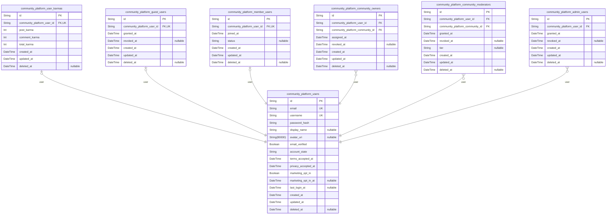

# Prisma Markdown

> Generated by [`prisma-markdown`](https://github.com/samchon/prisma-markdown)

- [Actors](#actors)
- [Communities](#communities)
- [Content](#content)
- [Votes](#votes)
- [Reports](#reports)

## Actors

### `community_platform_users`

Core user identity and authentication entity for the platform. Stores
login identifiers and credential hash, as well as account lifecycle,
consent timestamps, and profile basics. Authors of posts and comments in
other components reference this model. Key relationships: referenced by
role assignment tables such as [community_platform_admin_users](#community_platform_admin_users),
[community_platform_community_moderators](#community_platform_community_moderators), {@link
community_platform_community_owners}, and profile/karma support via
[community_platform_user_karmas](#community_platform_user_karmas). Includes Terms/Privacy acceptance
timestamps and optional marketing consent to satisfy compliance and audit
requirements.

Properties as follows:

- `id`: Primary Key.
- `email`
  > Unique email address used as a primary login identifier. Case-insensitive
  > uniqueness should be enforced at database level (e.g., citext) in
  > addition to application checks.
- `username`
  > Public handle for the user. Must be unique across the platform; used for
  > mentions and profile URLs. Prefer case-insensitive uniqueness at DB.
- `password_hash`
  > Non-reversible password hash for authentication. Plaintext passwords are
  > never stored.
- `display_name`
  > Optional display name presented in profiles. Can be changed by the user
  > within policy limits.
- `avatar_uri`: Optional URI pointing to the user’s avatar image resource.
- `email_verified`
  > Whether the user has verified their email address. Non-verified users are
  > restricted from participation actions per business rules.
- `account_state`
  > Current account state string (e.g., PendingVerification, Active, Locked,
  > Deactivated, PendingDeletion, Deleted, Banned). Used to gate
  > capabilities.
- `terms_accepted_at`
  > Timestamp when the user accepted the Terms of Service at registration or
  > re-consent. Required for compliance and auditing.
- `privacy_accepted_at`
  > Timestamp when the user accepted the Privacy Policy at registration or
  > re-consent. Required for compliance and auditing.
- `marketing_opt_in`
  > Whether the user explicitly opted in to marketing communications.
  > Defaults to false at the application level if no opt-in is offered.
- `marketing_opt_in_at`: Timestamp when marketing opt-in was granted. Null when not opted in.
- `last_login_at`
  > Timestamp of the most recent successful login for auditing and security
  > notifications.
- `created_at`: Creation timestamp for the user record.
- `updated_at`: Last update timestamp for the user record.
- `deleted_at`
  > Soft deletion timestamp. When set, indicates the record is logically
  > deleted and should not appear in normal queries.

### `community_platform_user_karmas`

Per-user karma totals supporting ranking and reputation features. Holds
aggregated integer values for post, comment, and total karma for a user.
Sourced from votes on content; maintained by application logic.
References [community_platform_users](#community_platform_users).

Properties as follows:

- `id`: Primary Key.
- `community_platform_user_id`: Belonged user’s [community_platform_users.id](#community_platform_users).
- `post_karma`: Cumulative karma derived from votes on the user’s posts. May be negative.
- `comment_karma`
  > Cumulative karma derived from votes on the user’s comments. May be
  > negative.
- `total_karma`
  > Total karma (post + comment and other applicable sources) maintained by
  > the application.
- `created_at`: Creation timestamp for this karma snapshot row.
- `updated_at`: Last time karma values were updated.
- `deleted_at`: Soft deletion timestamp for logical removal.

### `community_platform_guest_users`

Marks users that currently hold the guest kind within system semantics.
This supporting table records assignment lifecycle for auditability.
References [community_platform_users](#community_platform_users).

Properties as follows:

- `id`: Primary Key.
- `community_platform_user_id`: Assigned user’s [community_platform_users.id](#community_platform_users).
- `granted_at`: Timestamp when this guest designation became effective.
- `revoked_at`: Optional timestamp when this guest designation ended.
- `created_at`: Creation timestamp for this role assignment record.
- `updated_at`: Last update timestamp for this role assignment.
- `deleted_at`: Soft deletion timestamp for this role assignment.

### `community_platform_member_users`

Marks users that hold the member role enabling participation (post,
comment, vote, report) once eligibility is met. Tracks join lifecycle.
References [community_platform_users](#community_platform_users).

Properties as follows:

- `id`: Primary Key.
- `community_platform_user_id`: Member user’s [community_platform_users.id](#community_platform_users).
- `joined_at`: Timestamp when member capabilities became effective for this user.
- `status`
  > Optional member status string for business workflows (e.g., active,
  > restricted).
- `created_at`: Creation timestamp for this membership record.
- `updated_at`: Last update timestamp for this membership record.
- `deleted_at`: Soft deletion timestamp for this membership record.

### `community_platform_community_owners`

Community ownership assignments. Tracks ownership history per community
for governance, transfers, and audits. Single active owner should be
enforced at the application layer or via a partial unique index on
(community_id) where revoked_at IS NULL when supported. References {@link
community_platform_users} and [community_platform_communities](#community_platform_communities).

Properties as follows:

- `id`: Primary Key.
- `community_platform_user_id`: Owner user’s [community_platform_users.id](#community_platform_users).
- `community_platform_community_id`: Owned community’s [community_platform_communities.id](#community_platform_communities).
- `assigned_at`: Timestamp when ownership became effective.
- `revoked_at`
  > Optional timestamp when ownership ended (e.g., after transfer). When
  > null, record is considered current.
- `created_at`: Creation timestamp for this ownership record.
- `updated_at`: Last update timestamp for this ownership record.
- `deleted_at`: Soft deletion timestamp for this ownership record.

### `community_platform_community_moderators`

Community moderator assignments per community with lifecycle tracking and
optional tiering. Enables independent management and cross-community
queries. References [community_platform_users](#community_platform_users) and {@link
community_platform_communities}.

Properties as follows:

- `id`: Primary Key.
- `community_platform_user_id`: Moderator user’s [community_platform_users.id](#community_platform_users).
- `community_platform_community_id`: Moderated community’s [community_platform_communities.id](#community_platform_communities).
- `granted_at`: Timestamp when moderator privileges began.
- `revoked_at`: Optional timestamp when moderator privileges ended.
- `tier`: Optional moderator tier or role label (e.g., junior, full).
- `created_at`: Creation timestamp for this moderator assignment.
- `updated_at`: Last update timestamp for this moderator assignment.
- `deleted_at`: Soft deletion timestamp for this moderator assignment.

### `community_platform_admin_users`

Site-wide administrator role assignments for trust & safety and platform
governance. Allows multiple grant/revoke cycles per user for historical
auditability. Single active admin per user should be enforced at the
application layer or via a partial unique index on (user_id) where
revoked_at IS NULL when supported. References {@link
community_platform_users}.

Properties as follows:

- `id`: Primary Key.
- `community_platform_user_id`: Admin user’s [community_platform_users.id](#community_platform_users).
- `granted_at`: Timestamp when admin privileges were granted.
- `revoked_at`: Optional timestamp when admin privileges ended.
- `created_at`: Creation timestamp for this admin assignment.
- `updated_at`: Last update timestamp for this admin assignment.
- `deleted_at`: Soft deletion timestamp for this admin assignment.

## Communities

### `community_platform_communities`

Communities are the top-level spaces that organize posts and memberships.
Each community has a globally unique handle stored in {name} (used in
URLs) and a human-friendly {display_name}. This table persists community
configuration required by business rules: visibility mode
(public/restricted/private), NSFW labeling, quarantine state for safety,
optional language/region defaults, and auto-archive window to lock old
threads. Owners and moderators are managed via {@link
community_platform_community_owners} and {@link
community_platform_community_moderators}. Subscriptions are in {@link
community_platform_subscriptions}. Posts in other components reference
this model to attach content to a community.

Properties as follows:

- `id`: Primary Key.
- `name`
  > Globally unique community handle (URL-safe identifier). Used for routing
  > and mentions. Must be unique across the platform.
- `display_name`: Human-readable community title shown in UIs. Not required to be unique.
- `description`
  > Optional community description/about text used for discovery and policy
  > transparency.
- `visibility`
  > Community visibility mode. Allowed values: public | restricted | private.
  > Used by eligibility checks and feed assemblers.
- `nsfw`
  > Whether the community is labeled as NSFW. Enforces visibility gates and
  > default labeling for submissions.
- `auto_archive_days`
  > Number of days after which posts auto-archive (>= 30 per business rules).
  > Feeds and editors enforce read-only behavior after archival.
- `language`
  > Optional default language code for community policy and discovery (e.g.,
  > en, ko).
- `region`
  > Optional default region code for community policy and discovery (e.g.,
  > KR, US).
- `quarantined`
  > Whether the community is under quarantine per safety policy. Limits
  > discovery and requires user acknowledgement.
- `quarantined_at`: Timestamp when quarantine began. Null when not quarantined.
- `created_at`: Creation timestamp of the community.
- `updated_at`: Last update timestamp of the community metadata.
- `deleted_at`
  > Soft deletion timestamp. When set, the community is removed from general
  > listings.

### `community_platform_subscriptions`

User-to-community subscription mapping representing follow state for feed
inclusion. This table captures subscription lifecycle: status (e.g.,
pending for private/restricted approvals, subscribed for active,
banned/blocked where applicable) and mute state to suppress delivery
without unsubscribing. References [community_platform_users](#community_platform_users) and
[community_platform_communities](#community_platform_communities).

Properties as follows:

- `id`: Primary Key.
- `community_platform_user_id`
  > Subscribed user reference. Target model's {@link
  > community_platform_users.id}.
- `community_platform_community_id`
  > Target community reference. Target model's {@link
  > community_platform_communities.id}.
- `status`
  > Subscription status. Allowed values (business semantics): pending |
  > subscribed | banned | blocked. Use deleted_at to represent unsubscribed.
- `muted`
  > Whether the user has muted this community (suppresses delivery in Home
  > while retaining subscription).
- `muted_at`: Timestamp when mute was applied. Null when not muted.
- `created_at`
  > Subscription creation timestamp (when the user subscribed or requested
  > join).
- `updated_at`: Timestamp of the last update to this subscription record.
- `deleted_at`
  > Soft deletion (unsubscribe) timestamp. When set, the subscription is
  > considered inactive for feed inclusion.

## Content

### `community_platform_posts`

Core user-generated posts within a community. Each record represents a
single post authored by a user and belongs to exactly one community.
Supports three content types (TEXT, LINK, IMAGE) via {type}. Business
lifecycle fields capture labels (nsfw, spoiler), visibility state
(Active/Locked/Archived/RemovedByModeration/RemovedByAdmin/DeletedByAuthor/PendingReview/LegalHold),
and control points (locked_at, archived_at). Edit transparency fields
(edited_at, edit_count) support visible "edited" indicators and audit
traces. Author is [community_platform_users](#community_platform_users). Community is {@link
community_platform_communities}.

Properties as follows:

- `id`: Primary Key.
- `community_platform_user_id`: Author user's [community_platform_users.id](#community_platform_users).
- `community_platform_community_id`: Target community's [community_platform_communities.id](#community_platform_communities).
- `title`
  > Human-readable headline of the post. Business rule: 1–300 characters;
  > trimmed of surrounding whitespace.
- `type`: Post content type. Application enforces one of: TEXT | LINK | IMAGE.
- `body`
  > Body text for TEXT posts. Optional and ignored for non-TEXT types by
  > application rules.
- `link_url`
  > Destination URL for LINK posts (http/https). Optional and ignored for
  > non-LINK types by application rules.
- `image_url`
  > Image URI for IMAGE posts (JPEG/PNG/GIF). Optional and ignored for
  > non-IMAGE types by application rules.
- `nsfw`
  > Whether the post is marked Not Safe For Work. Enforced in visibility and
  > previews per policy and user preferences.
- `spoiler`: Whether the post contains spoiler content. Controls preview shielding.
- `visibility_state`
  > Business visibility state of the post. Expected values include: Active,
  > Locked, Archived, RemovedByModeration, RemovedByAdmin, DeletedByAuthor,
  > PendingReview, LegalHold. Used to drive eligibility in feeds and
  > interactions.
- `locked_at`
  > Timestamp when the post was locked (no new comments and vote changes).
  > Null when unlocked.
- `archived_at`: Timestamp when the post was archived (read-only). Null when not archived.
- `edited_at`
  > Timestamp of the last edit by the author. Used for "edited" indicator
  > timing.
- `edit_count`: Number of times the post content/metadata has been edited by the author.
- `created_at`: Creation timestamp (UTC). Used for New sorting and audit trails.
- `updated_at`: Last update timestamp (UTC). Updated on content edits or state changes.
- `deleted_at`
  > Soft deletion timestamp. When set, the post is considered soft-deleted
  > and excluded from standard queries.

### `community_platform_comments`

User comments attached to posts with support for nested replies via
optional parent reference. Each comment belongs to exactly one post
[community_platform_posts](#community_platform_posts) and has exactly one author {@link
community_platform_users}. Thread-level locking and edit transparency
fields support business rules and audit visibility. Parent-child
self-relationship preserves children on parent removal through onDelete:
SetNull.

Properties as follows:

- `id`: Primary Key.
- `community_platform_post_id`: Target post's [community_platform_posts.id](#community_platform_posts).
- `community_platform_user_id`: Author user's [community_platform_users.id](#community_platform_users).
- `parent_id`
  > Optional parent comment's [community_platform_comments.id](#community_platform_comments) for
  > nested replies. Null for top-level comments.
- `body`
  > Comment text content. Business rule: 1–10,000 characters; normalized
  > whitespace; no empty-only text.
- `locked_at`
  > Timestamp when this comment thread node was locked. Prevents new replies
  > beneath this node when set.
- `edited_at`: Timestamp of the last author edit. Used for "edited" indicator timing.
- `edit_count`: Number of times this comment was edited by the author.
- `created_at`: Creation timestamp (UTC).
- `updated_at`: Last update timestamp (UTC). Updated on content edits or state changes.
- `deleted_at`
  > Soft deletion timestamp. When set, the comment is considered soft-deleted
  > and excluded from standard queries.

## Votes

### `community_platform_post_votes`

User votes on posts. Each record represents a single user’s upvote or
downvote on a specific post. Enforces exactly one vote per (user, post)
via a composite unique index. Supports temporal analytics and soft
deletion for retractions. References [community_platform_users](#community_platform_users) as
voter and [community_platform_posts](#community_platform_posts) as target.

Properties as follows:

- `id`: Primary Key.
- `community_platform_user_id`: Voter user's [community_platform_users.id](#community_platform_users)
- `community_platform_post_id`: Target post's [community_platform_posts.id](#community_platform_posts)
- `value`
  > Vote value where -1 indicates downvote and +1 indicates upvote. Only -1
  > or +1 are valid.
- `created_at`: Timestamp when the vote record was created.
- `updated_at`: Timestamp when the vote record was last updated.
- `deleted_at`
  > Soft deletion timestamp when the vote is retracted or removed. Null when
  > active.

### `community_platform_comment_votes`

User votes on comments. Each record represents a single user’s upvote or
downvote on a specific comment. Enforces exactly one vote per (user,
comment) via a composite unique index. Supports temporal analytics and
soft deletion for retractions. References {@link
community_platform_users} as voter and {@link
community_platform_comments} as target.

Properties as follows:

- `id`: Primary Key.
- `community_platform_user_id`: Voter user's [community_platform_users.id](#community_platform_users)
- `community_platform_comment_id`: Target comment's [community_platform_comments.id](#community_platform_comments)
- `value`
  > Vote value where -1 indicates downvote and +1 indicates upvote. Only -1
  > or +1 are valid.
- `created_at`: Timestamp when the vote record was created.
- `updated_at`: Timestamp when the vote record was last updated.
- `deleted_at`
  > Soft deletion timestamp when the vote is retracted or removed. Null when
  > active.

## Reports

### `community_platform_reports`

User-submitted safety reports targeting either a post or a comment. Each
record captures the reporter, a categorical reason, and a free-text
explanation for triage. Exactly one of the two target references should
be provided: either a post's [community_platform_posts.id](#community_platform_posts) or a
comment's [community_platform_comments.id](#community_platform_comments). Reports relate to
reporters in [community_platform_users](#community_platform_users). Designed for
cross-community moderation queries, category-based triage, and audit
timelines without embedding moderation outcomes (which are modeled in the
moderation/cases domain). Note: Prisma cannot express the one-of
constraint; enforce via application validation or a DB-level CHECK
constraint.

Properties as follows:

- `id`: Primary Key.
- `community_platform_user_id`: Reporting user's [community_platform_users.id](#community_platform_users).
- `community_platform_post_id`
  > Target post's [community_platform_posts.id](#community_platform_posts). Exactly one of post or
  > comment should be set.
- `community_platform_comment_id`
  > Target comment's [community_platform_comments.id](#community_platform_comments). Exactly one of
  > post or comment should be set.
- `category`
  > High-level report category for moderation triage. Example values include:
  > spam, harassment/hate, sexual_content/child_safety, violence/threats,
  > self_harm_risk, illegal, doxxing, misinformation, off_topic/low_effort,
  > copyright, other.
- `reason`
  > Free-text explanation provided by the reporter describing why the content
  > is inappropriate. Used for moderator review and search.
- `created_at`: Timestamp when the report was created.
- `updated_at`: Timestamp when the report was last updated (e.g., user-edited reason).
