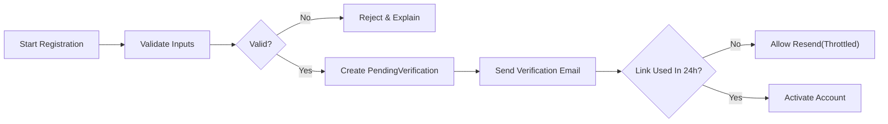
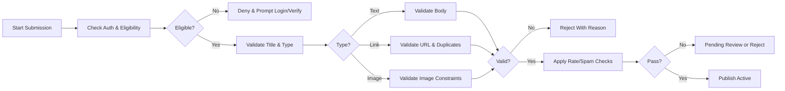
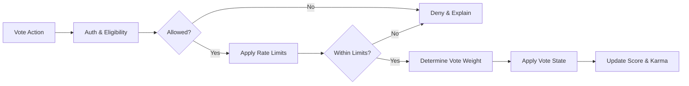
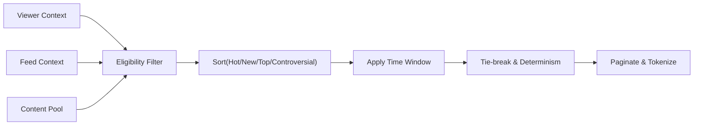
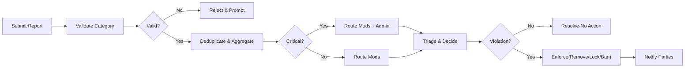

# communityPlatform — Business Requirements Specification (BRS)

## 1. Purpose and Scope
communityPlatform enables interest-based communities where members post (text, link, image), discuss via nested comments, curate with up/downvotes, and sort feeds by Hot, New, Top, and Controversial. This specification defines business behaviors, rules, workflows, permissions, and success criteria. Technical designs (APIs, databases, infrastructure, UI layouts) are intentionally out of scope.

EARS scope anchors:
- THE platform SHALL allow registration/login, community creation, posting (text/link/image), voting, nested comments, subscriptions, profiles, and reporting of inappropriate content within policy.
- THE platform SHALL provide ranking modes labeled "Hot", "New", "Top", and "Controversial" with predictable business behavior.
- WHERE sitewide policy and local community rules conflict, THE platform SHALL prioritize sitewide policy.

## 2. Glossary and Roles
Key terms:
- Community: Topic-centric space with owner, moderators, rules, and content.
- Post Types: Text, Link, Image.
- Content States: Active, Locked, Archived, Removed by Moderation, Removed by Admin, Deleted by Author, Pending Review, Legal Hold.
- Karma: Reputation points from votes on authored content.

Roles (system-wide kinds):
- guestUser: Unauthenticated, read-only access to public content.
- memberUser: Authenticated, baseline participation (post, comment, vote, report, subscribe).
- communityOwner: Highest authority within owned community; appoints moderators; configures rules.
- communityModerator: Moderates a specific community; processes reports and enforces rules.
- adminUser: Sitewide trust & safety; platform policy enforcement and escalations.

EARS role summary:
- THE platform SHALL restrict guestUser to read-only on public content.
- THE platform SHALL permit memberUser to participate per community and policy constraints.
- THE platform SHALL scope communityModerator/Owner actions to their communities.
- THE platform SHALL allow adminUser to enforce platform-wide policy across all communities.

## 3. Global Principles and Constraints
- Business-first: Describe WHAT must happen, not HOW to implement it.
- Safety and integrity: Sitewide policy supersedes community rules; consistent enforcement and appeals.
- Predictability: Deterministic feeds and clear error semantics.
- Privacy: Limit data exposure; respect profile visibility and block/mute preferences.
- Localization/timezone: User-facing times shown in user’s timezone; consistent behavior in Asia/Seoul context by default when unspecified.

Out of scope:
- Database schemas, API routes, infrastructure, and UI visuals.

## 4. Functional Requirements by Domain

### 4.1 Authentication and Account Lifecycle
Account states: PendingVerification, Active, Locked, PasswordResetRequired, Deactivated, PendingDeletion, Deleted, Banned.

EARS behaviors:
- THE platform SHALL require unique email, unique username, compliant password, and acceptance of terms to register.
- WHEN registration is valid, THE platform SHALL create an account in PendingVerification and send a one-time verification within 10 seconds.
- WHEN email is verified within 24 hours, THE platform SHALL set the account to Active; otherwise, THE platform SHALL allow resending with reasonable limits.
- WHERE account is Locked due to failed attempts, THE platform SHALL deny login for 15 minutes and notify the account email.
- WHEN a user requests password reset, THE platform SHALL issue a one-time reset link valid for 60 minutes and revoke all sessions on success.
- WHEN a user logs out from all devices, THE platform SHALL terminate active sessions within 60 seconds.
- WHEN a user deactivates the account, THE platform SHALL hide profile and end sessions; reactivation SHALL restore prior capabilities.
- WHEN a user requests deletion, THE platform SHALL set PendingDeletion with 30-day grace; on completion, THE platform SHALL remove personal identifiers and attribute legacy public content to an anonymized placeholder where policy requires.
- WHERE email is unverified, THE platform SHALL block posting, commenting, community creation, and voting.

### 4.2 Communities: Creation, Settings, and Governance
EARS behaviors:
- THE platform SHALL allow eligible memberUser to create communities with unique handles and compliant names.
- WHEN a community is created, THE platform SHALL assign ownership to the creator, initialize default rules, and record creation in a modlog.
- WHERE ownership is transferred, THE platform SHALL require explicit acceptance from the new owner within a defined window before effect.
- THE platform SHALL allow Owners to appoint/remove Moderators who accept within a defined window.
- THE platform SHALL support visibility modes: public, restricted, private; label-sensitive communities (e.g., NSFW) per policy.
- WHERE community rules are saved, THE platform SHALL validate that they do not conflict with sitewide policy.
- WHEN a community is set to private, THE platform SHALL require approval before content is visible to non-members.
- IF a community becomes abandoned (no active owner/moderator beyond a defined threshold), THEN THE platform SHALL allow adminUser to appoint successors or close the community.

### 4.3 Posting: Text, Link, Image
Common:
- THE platform SHALL require title (1–300 chars), destination community, and post type.
- WHERE tags/flairs are used, THE platform SHALL limit to 0–5 tags per post and only allow community-defined tags.
- WHERE labels (NSFW, Spoiler) are set, THE platform SHALL enforce visibility and preview restrictions per policy.

Type-specific:
- Text: THE platform SHALL require body 1–40,000 chars; reject prohibited patterns per policy.
- Link: THE platform SHALL require valid http/https URL ≤ 2,048 chars; deny disallowed domains; detect duplicates (same community, 30-day window) and surface the prior post.
- Image: THE platform SHALL allow JPEG/PNG/GIF ≤ 10 MB; min dimensions 320×320; GIFs ≤ 15 seconds or ≤ 10 MB; optional alt text ≤ 500 chars.

Lifecycle:
- WHEN a post is created, THE platform SHALL set state Active unless routed to Pending Review by filters.
- WHEN a post is locked, THE platform SHALL disable new comments and vote changes while keeping visibility.
- WHEN a post is archived (default 180 days, configurable with floor 30 days), THE platform SHALL prevent edits, new comments, and vote changes.
- WHEN a post is removed by moderation, THE platform SHALL show a placeholder to general viewers and retain visibility to author, moderators, and admins.
- WHEN a post is removed by admin for sitewide policy, THE platform SHALL restrict visibility to admins and notify the author with policy reason.
- WHEN a post is deleted by the author, THE platform SHALL hide the content, retain a deletion marker, and preserve comments unless policy dictates otherwise.

Rate limits and eligibility:
- THE platform SHALL require verified email and minimum account age (default 24 hours) for posting unless a community explicitly allows exceptions.
- THE platform SHALL enforce site defaults: ≤ 5 posts/day per user and ≤ 3 posts/day per community, with community ability to set stricter limits.

### 4.4 Commenting: Nested Replies
EARS behaviors:
- THE platform SHALL allow comments on unlocked, non-archived posts; replies nest up to depth 8.
- IF a reply exceeds depth, THEN THE platform SHALL attach it at max depth and flag "depth_max_reached".
- THE platform SHALL validate bodies 1–10,000 chars and reject whitespace-only content.
- WHEN a comment is edited, THE platform SHALL show an "edited" indicator if edited after 2 minutes, and retain a non-public edit history for moderators/admins and for the author.
- WHEN a comment is deleted by the author, THE platform SHALL replace content with a placeholder while preserving replies.
- WHEN a comment is removed by moderators/admins, THE platform SHALL show a removal placeholder and retain rationale.
- WHEN a thread is locked, THE platform SHALL prevent new replies beneath the locked node.
- THE platform SHALL enforce rate limits: default 20 comments/10 minutes and 200/24 hours; stricter for low-trust accounts.

### 4.5 Voting and Karma
Eligibility and limits:
- THE platform SHALL restrict voting to authenticated, email-verified accounts meeting minimum age and not banned/restricted in the target community.
- THE platform SHALL prevent voting on one’s own content.
- THE platform SHALL enforce default limits: ≤ 60 vote actions/10 minutes and ≤ 600/24 hours; stricter for low-trust.

Vote weight and integrity:
- THE platform SHALL use default weight +1/−1; reduce weight for low-trust accounts; set weight to 0 under shadowban per trust & safety policy.
- WHEN abnormal surges or correlated voting patterns are detected, THE platform SHALL apply protective measures (slow/freeze, reduced weights) and flag for review.
- WHEN fraudulent votes are confirmed, THE platform SHALL retroactively remove their effect on scores and karma.

Karma:
- THE platform SHALL track post karma, comment karma, and total karma per user; values may be negative.
- WHEN a visible vote is applied, THE platform SHALL adjust the author’s corresponding karma; removed/illegal content SHALL not contribute to karma.
- THE platform SHALL maintain a recent-karma rolling 90-day sum for trust signals without decaying public totals.

### 4.6 Feeds and Sorting
Contexts:
- Home feed (member): prioritize subscribed communities; fill with safe recommendations when needed; cap per-community dominance at 40% of a page when alternatives exist.
- Home feed (guest): show platform-wide popular posts from public communities; no personalization beyond generic context.
- Community feed: only posts from that community per viewer permissions.

Sorting definitions (business):
- New: order by creation time descending.
- Top: order by net approval within selected time range (24h, 7d, 30d, year, all time); require minimum 1 net vote.
- Hot: recency-weighted engagement favoring last 48 hours; items under 24 hours with strong engagement rise; aging reduces priority unless exceptional engagement persists.
- Controversial: high total votes with near-balanced polarity; min 10 total votes; excludes items removed for policy.

Pagination and stability:
- THE platform SHALL return 25 items/page by default (5–100 allowed) with deterministic ordering and no duplicates across consecutive pages for identical parameters.
- WHILE paginating within a request sequence, THE platform SHALL maintain a 5-minute stability window; re-ranking SHALL not reorder delivered pages.

### 4.7 Subscriptions, Mutes, and Blocks
EARS behaviors:
- WHEN a member subscribes to a community, THE platform SHALL include its new content in the member’s home feed within 60 seconds.
- WHEN a member unsubscribes, THE platform SHALL cease including that community’s new content immediately.
- WHEN a member mutes a community, THE platform SHALL suppress its content in feeds and recommendations without altering subscription state.
- WHEN a member blocks another user, THE platform SHALL prevent direct interactions and treat the blocker’s profile as Private to the blocked viewer.

### 4.8 Profiles and Privacy
EARS behaviors:
- THE platform SHALL support visibility levels: Public, Limited, Private, and owner toggles for visibility of subscriptions, activity, and karma.
- WHEN a viewer requests a profile, THE platform SHALL enforce the owner’s visibility settings and blocks consistently.
- WHEN an owner edits profile fields (display name, bio, avatar), THE platform SHALL validate length and policy and limit edits to prevent abuse (default 10 edits/hour).
- WHEN account deletion completes, THE platform SHALL transform authored content per policy (e.g., author shown as "[deleted]").

### 4.9 Reporting, Safety, and Trust
Reportables: posts, comments, communities, user accounts.
Categories (baseline): spam, harassment/hate, sexual content/child safety, violence/threats, self-harm risk, illegal, doxxing, misinformation, off-topic/low-effort, copyright, other (free-text required).

EARS behaviors:
- WHEN a member reports an item, THE platform SHALL require a category and acknowledge within 2 seconds; deduplicate per item-category-reporter in 24 hours.
- THE platform SHALL aggregate item-category reports into cases and route community cases to moderators/owner and critical categories additionally to adminUser.
- WHEN enforcement occurs, THE platform SHALL notify the author (reason code, scope, appeal options) and update reporters with limited outcome status.
- WHERE conflicts of interest exist (moderator is the author), THE platform SHALL auto-escalate to adminUser or a different moderator.
- WHEN appeals are submitted within 14 days, THE platform SHALL route to a reviewer who did not execute the original enforcement, and if overturned, SHALL restore content/access and annotate logs.

## 5. Non-Functional Expectations (Business)
Performance targets (typical p95):
- Feed page: ≤ 800 ms; Home feed: ≤ 800 ms; Post view with first comments: ≤ 1,400 ms; Vote: ≤ 400 ms; Comment create: ≤ 700 ms; Text post create: ≤ 800 ms; Image post publish (after upload): ≤ 1,000 ms.

Availability:
- THE platform SHALL meet 99.9% monthly uptime for core actions; RTO ≤ 30 minutes; RPO ≤ 5 minutes for critical content.

Localization/timezone:
- THE platform SHALL localize user-facing text; render timestamps in the user’s timezone; default to Asia/Seoul where unspecified.

Accessibility:
- THE platform SHALL present error and state messages in accessible, screen-reader-friendly formats with sufficient contrast and non-color-only cues.

Observability and audit:
- THE platform SHALL log governance, security, and content lifecycle actions with actor, reason, and timestamp and retain per policy.

## 6. Permission Summary (Business Narrative)
- guestUser: View public communities, posts, and comments; no write actions.
- memberUser: Post, comment, vote, report, subscribe; edit/delete own content within policy; limited by verification, age, and community restrictions.
- communityModerator: All member actions plus approve/remove content, lock threads, pin posts, warn/mute/ban users within scoped community; view mod queues and removed content in-scope.
- communityOwner: All moderator actions within owned community; edit community settings; appoint/remove moderators; transfer ownership.
- adminUser: Platform-wide enforcement; override community decisions for policy, legal, or safety; view platform-wide audit.

## 7. Error Model Summary (Business Semantics)
Standardized keys (examples): AUTH_INVALID_CREDENTIALS, AUTH_EMAIL_NOT_VERIFIED, PERM_INSUFFICIENT_ROLE, COMMUNITY_PRIVATE, POST_VALIDATION_FAILED, POST_DUPLICATE_DETECTED, POST_SPAM_SUSPECTED, COMMENT_DEPTH_LIMIT, VOTE_SELF_NOT_ALLOWED, VOTE_TARGET_LOCKED, SORT_UNSUPPORTED, SUB_LIMIT_REACHED, PROFILE_PRIVATE, REPORT_INVALID_CATEGORY, REPORT_DUPLICATE_OPEN, SYS_TEMPORARY_UNAVAILABLE.

EARS behaviors:
- WHEN an action is denied, THE platform SHALL return a clear user-facing message, action hint, and non-sensitive context (e.g., retry-after).
- WHEN rate limits trigger, THE platform SHALL indicate remaining wait time without exposing internal thresholds.
- WHEN content is locked/archived/removed, THE platform SHALL display consistent placeholders and disable further interactions as defined.

## 8. Diagrams (Mermaid)

### 8.1 Registration and Verification

### 8.2 Post Submission Flow

### 8.3 Voting Flow with Protections

### 8.4 Feed Assembly Overview

### 8.5 Reporting and Enforcement

## 9. Acceptance Criteria and Success Metrics
Illustrative acceptance:
- GIVEN an unverified account, WHEN attempting to post or vote, THEN action is denied with verification guidance.
- GIVEN a new community, WHEN created with a unique handle and valid settings, THEN ownership is assigned and defaults (rules/modlog) are initialized.
- GIVEN an image exceeding 10 MB, WHEN submitted, THEN submission is rejected with IMAGE constraints reason.
- GIVEN a link duplicate within 30 days in the same community, WHEN submitted, THEN submission is rejected and the prior post is surfaced.
- GIVEN a user votes on own content, WHEN attempting to upvote or downvote, THEN the system denies with VOTE_SELF_NOT_ALLOWED.
- GIVEN a post is archived, WHEN attempting to edit or vote, THEN the system denies and explains archive state.
- GIVEN a report in a critical category, WHEN submitted, THEN it is visible to adminUser and in-scope moderators immediately.

Success targets (business):
- 99.9% monthly uptime for core actions; p95 latency targets as defined in NFRs.
- Report acknowledgement within 2 seconds; moderation actions reflected within 5 minutes in user-visible contexts.
- Home feed reflects subscription changes within 60 seconds.
- Duplicate link detection blocks ≥ 90% of repeats within 30 days in same community.

## 10. Related Concepts and Governance
- THE platform SHALL maintain immutable audit trails for privileged actions and content lifecycle transitions, retained per policy.
- THE platform SHALL provide transparent placeholders and reason categories for removed/locked content consistent with safety guidelines.
- THE platform SHALL publish aggregated transparency metrics (e.g., removals by category) at a regular cadence where legally permissible.

---
This BRS uses EARS formatting for testable statements and focuses on business requirements only. Developers retain full autonomy over technical implementation choices while ensuring behaviors conform to this specification.